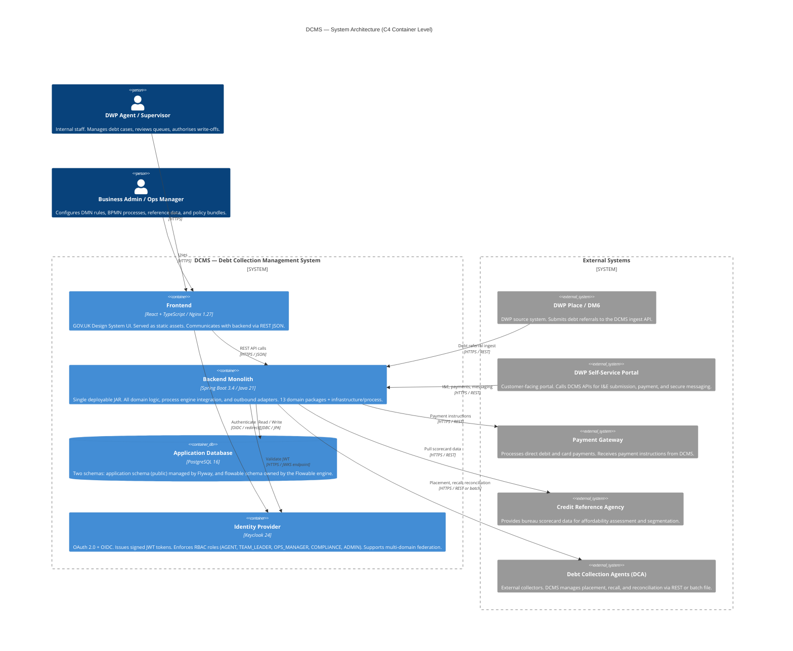
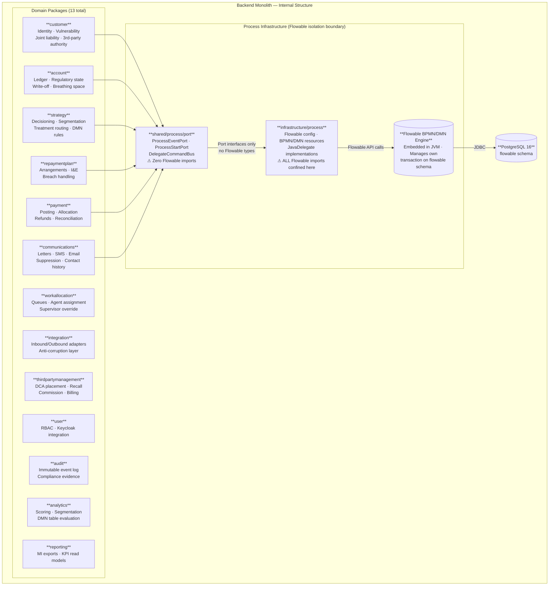

# DIAG-02 — System Architecture Overview

**For:** Slide 4 — System Architecture in One Diagram
**Standard:** C4 Level 2 (Container diagram)

---

## Diagram A — Container View

---

## Diagram B — Monolith Interior

---

## Architecture Notes

| Constraint | Detail |
|---|---|
| **One process instance per DebtAccount** | Multiple debts for one customer run as independent Flowable process instances. |
| **Transaction boundary (ADR-003)** | Application DB writes are always inside `@Transactional`. Flowable engine calls are always outside. Prevents two-phase commit across the two schemas. |
| **No domain module imports Flowable** | `shared/process/port` has zero Flowable dependencies. Domain modules are testable without a running process engine. |
| **All external calls via integration ACL** | No domain module calls an external system directly. All outbound integrations route through `domain/integration`. |
| **Auth on every request** | Backend validates JWT on every request via Spring Security OAuth2 Resource Server. RBAC roles enforced at controller layer. |
