# Functional Requirements to Module Map

## Purpose

This document maps the functional requirements baseline to delivery modules in this repository.
It is intended to be human-readable and architecture-oriented (module-level), not a per-requirement implementation trace.
The baseline assumes a greenfield COTS implementation: no pre-existing workflows are carried over, but COTS internals remain vendor-managed once a product is selected.

## Source Baseline

- Functional requirements source: `Tender requirements docs/Functional-Requirements-Consolidated.md`
- Baseline requirement IDs detected: **442 total**
- Existing trace artifact: `docs/project-foundation/trace-map.yaml` (v2 many-to-many structure, keyed maps)

## Visual Overview

```mermaid
flowchart LR
  FR["Functional Requirements Baseline (442 IDs)"]

  FR --> CONF
  FR --> PEND

  subgraph CONF["Confirmed Module Ownership"]
    CAS["CAS (17)"] --> M_CA["Backend: customer + account"]
    DIC["DIC (37)"] --> M_DIC["Backend: customer/account/communications/audit/integration"]
    DW["DW (88)"] --> M_DW["Backend: infrastructure/process + strategy + workallocation"]
    RPF["RPF (37)"] --> M_RPF["Backend: repaymentplan + payment + integration"]
    UAAF["UAAF (26)"] --> M_UAAF["Backend: user + access control"]
    UI["UI (30)"] --> M_UI["Frontend: app screens and flows"]
    WAM["WAM (28)"] --> M_WAM["Backend: workallocation"]
    AAD["AAD (27)"] --> M_AAD["Backend: communications + audit"]
    IEC["IEC (11)"] --> M_IEC["Backend: repaymentplan + customer + integration"]
    CC["CC (35)"] --> M_CC["Backend: communications + integration"]
    I3PS["I3PS (15)"] --> M_I3PS["Backend: integration"]
    SOR["SoR (21)"] --> M_SOR["Backend: account/payment/audit/integration"]
    CP["CP (11)"] --> M_CP["Docs + CI/CD + Infrastructure controls"]
    SD["SD (7)"] --> M_SD["Docs + release planning governance"]
    PM3["3PM (18)"] --> M_TPM["Backend: thirdpartymanagement"]
    BSF["BSF (15)"] --> M_BSF["Backend: analytics + strategy"]
    MR["MR (15)"] --> M_MR["Backend: integration + migration tooling"]
    MIR["MIR (2)"] --> M_MIR["Backend: reporting"]
    A["A (2)"] --> M_A["Backend: analytics"]
  end

  subgraph PEND["Pending Scaffold"]
    PROC["Process engine"] --> M_PROC["infrastructure/process + shared/process/port"]
    TPM["Third-party mgmt"] --> M_TPMB["Backend: thirdpartymanagement"]
  end

  classDef confirmed fill:#e8f5e9,stroke:#2e7d32,color:#1b5e20;
  classDef pending fill:#fff8e1,stroke:#ef6c00,color:#e65100;

  class CAS,DIC,DW,RPF,UAAF,UI,WAM,AAD,IEC,CC,I3PS,SOR,CP,SD,PM3,BSF,MR,MIR,A confirmed;
  class PROC,TPM pending;
```

## Module Catalog

### Backend modules

| Module ID | Path | Status |
|---|---|---|
| `MOD-BE-CUSTOMER` | `backend/src/main/java/com/netcompany/dcms/domain/customer/` | Scaffolded |
| `MOD-BE-ACCOUNT` | `backend/src/main/java/com/netcompany/dcms/domain/account/` | Scaffolded |
| `MOD-BE-STRATEGY` | `backend/src/main/java/com/netcompany/dcms/domain/strategy/` | Scaffolded |
| `MOD-BE-ANALYTICS` | `backend/src/main/java/com/netcompany/dcms/domain/analytics/` | Scaffolded |
| `MOD-INFRA-PROCESS` | `backend/src/main/java/com/netcompany/dcms/infrastructure/process/` | Not scaffolded |
| `MOD-SHARED-PROCESS-PORT` | `backend/src/main/java/com/netcompany/dcms/shared/process/port/` | Not scaffolded |
| `MOD-BE-WORKALLOCATION` | `backend/src/main/java/com/netcompany/dcms/domain/workallocation/` | Scaffolded |
| `MOD-BE-REPAYMENTPLAN` | `backend/src/main/java/com/netcompany/dcms/domain/repaymentplan/` | Scaffolded |
| `MOD-BE-PAYMENT` | `backend/src/main/java/com/netcompany/dcms/domain/payment/` | Scaffolded |
| `MOD-BE-COMMS` | `backend/src/main/java/com/netcompany/dcms/domain/communications/` | Scaffolded |
| `MOD-BE-INTEGRATION` | `backend/src/main/java/com/netcompany/dcms/domain/integration/` | Scaffolded |
| `MOD-BE-THIRDPARTYMGMT` | `backend/src/main/java/com/netcompany/dcms/domain/thirdpartymanagement/` | Not scaffolded |
| `MOD-BE-USER` | `backend/src/main/java/com/netcompany/dcms/domain/user/` | Scaffolded |
| `MOD-BE-AUDIT` | `backend/src/main/java/com/netcompany/dcms/domain/audit/` | Partially implemented |
| `MOD-BE-REPORTING` | `backend/src/main/java/com/netcompany/dcms/domain/reporting/` | Scaffolded |

### Frontend, platform, and governance modules

| Module ID | Path | Status |
|---|---|---|
| `MOD-FE-APP` | `frontend/src/` | Scaffolded |
| `MOD-PLAT-INFRA` | `infrastructure/` | Implemented |
| `MOD-PLAT-CICD` | `.github/workflows/` | Implemented |
| `MOD-GOV-DOCS` | `docs/project-foundation/` | Implemented |

## Module Details

| Module | Primary Responsibility | Main Requirement Families |
|---|---|---|
| `customer` | Customer identity, profile, circumstances, vulnerability markers, and customer-level attributes shared across debts. | `CAS`, `DIC`, `IEC`, parts of `SoR` |
| `account` | Financial ledger for a debt: balances, payment history, write-off amounts, and account-to-customer linkage. Records regulatory facts (breathing space registration date, insolvency date, death notification, fraud marker) for audit purposes. Does NOT own lifecycle position or the behavioural effect of these events — those are owned by the process engine (see ADR-001, ADR-002). | `CAS`, `DIC`, `SoR`, parts of `DW` |
| `strategy` | Decisioning rule configuration, treatment routing logic, champion/challenger versioning, and strategy execution. | `DW`, parts of `CAS` and `SoR` |
| `infrastructure/process` | Flowable engine configuration, BPMN/DMN model resources, JavaDelegate implementations, and implementations of ProcessEventPort and ProcessStartPort. Contains all Flowable imports — no other module may import Flowable types. Not a domain module. See ADR-003. | `DW` (process/workflow slice), parts of `RPF`, `CC` |
| `shared/process/port` | ProcessEventPort, ProcessStartPort, DelegateCommandBus, DelegateCommand, DelegateCommandHandler interfaces, and all command types (SendLetterCommand, TriggerSegmentationCommand, etc.). No Flowable imports. Imported by domain modules that handle commands. See ADR-003. | Cross-cutting — used by all domain modules that participate in process execution |
| `analytics` | Segmentation logic, scoring models, bureau scorecard feeds, DMN decision tables for segment and treatment assignment, champion/challenger analytics. | `A`, `BSF`, parts of `DW` (segmentation/scoring slice), `CAS.11` |
| `workallocation` | Queueing, assignment, prioritisation, and monitoring of work for agents and teams. | `WAM`, parts of `DW`, parts of `AAD` |
| `repaymentplan` | Arrangement creation, affordability-linked options, repayment schedule management, arrangement lifecycle, and I&E/arrangement handoff from self-service integration. | `RPF`, `IEC`, parts of `SoR` |
| `payment` | Payment posting, pending-payment handling, allocation logic, financial event tracking, and reconciliation hooks. | `RPF`, `DIC`, `SoR` |
| `communications` | Contact history, channel events, correspondence state, suppression rules, communication footprints, in-app message instructions, and portal/app engagement signals. | `CC`, `DIC`, `AAD`, parts of `DW` |
| `integration` | APIs/batch exchange, host system handshakes, external system orchestration, anti-corruption layer, and DWP strategic self-service portal/app integration. | `I3PS`, parts of `DIC`, `CC`, `SoR`, `IEC`, `RPF` |
| `thirdpartymanagement` | DCA placement, recall, reconciliation, commission/billing logic, and third-party partner interfaces. | `3PM`, parts of `SoR` and `I3PS` |
| `user` | User access, role enforcement, admin controls, and authorisation-aligned operational boundaries. | `UAAF`, parts of `CAS` and `CP` |
| `audit` | Immutable activity/event history, trace records, and controlled evidence of user/system actions. | `AAD`, `DIC`, `SoR`, governance trace needs |
| `reporting` | Read models, MI exports, KPI views, and reporting ownership boundary. Separate from audit. | `MIR`, reporting slices of `SoR`, `WAM`, `3PM` |
| `frontend/src` | Staff-facing journeys, workflow screens, forms, dashboards, module-specific views, and staff visibility of self-service actions. Customer-facing portal/app UI remains outside current DCMS baseline unless reopened. | `UI`, plus surfaces for `WAM`, `CC`, `RPF`, `IEC`, `CAS`, `DIC`, `MIR` |
| `infrastructure` | Runtime topology, local stack parity, Keycloak setup, deployment packaging, and environment wiring. | Enables `CP`, `SD`, and operational aspects of all families |
| `.github/workflows` | Automated build, test, scan, smoke validation, and deploy orchestration. | `CP` and release controls supporting all families |
| `docs/project-foundation` | Standards, traceability discipline, delivery process controls, and release/readiness evidence conventions. | `CP`, `SD`, trace governance across all families |

## Mapping Matrix

Status legend:
- `confirmed` = module ownership boundary is agreed and requirement family is assigned
- `pending-scaffold` = ownership confirmed but module package not yet created in the repository

| Capability Group | Requirement IDs | Count | Primary Module(s) | Supporting Module(s) | Status |
|---|---|---:|---|---|---|
| Customer & Account Structure | `CAS.1`–`CAS.17` | 17 | `customer`, `account` | Frontend screens, `integration` | confirmed |
| Data & Information Capture | `DIC.1`-`DIC.37` | 37 | `customer`, `account`, `communications`, `audit`, `integration` | Frontend forms, self-service action timeline | confirmed |
| Decisions & Workflows | `DW.1`-`DW.88` | 88 | `infrastructure/process`, `strategy`, `workallocation`, `integration` | Frontend queue/workflow UI, `analytics`, self-service workflow triggers | confirmed |
| Repayment Plan Functionality | `RPF.1`-`RPF.37` | 37 | `repaymentplan`, `payment`, `integration` | Frontend repayment journeys, self-service arrangement/payment action intake | confirmed |
| User Access & Admin Functions | `UAAF.1`–`UAAF.26` | 26 | `user` | Keycloak/infrastructure, frontend admin UI | confirmed |
| MI & Reporting | `MIR.1`–`MIR.2` | 2 | `reporting` | Frontend MI dashboards, data exports | confirmed |
| Analytics & Segmentation | `A.1`–`A.2` | 2 | `analytics` | `strategy`, `reporting` | confirmed |
| User Interface Screens | `UI.1`–`UI.30` | 30 | `frontend/src` | Backend APIs by domain | confirmed |
| Work Allocation & Monitoring | `WAM.1`–`WAM.28` | 28 | `workallocation` | Frontend supervisor/agent worklists | confirmed |
| Agent Actions & Dispositions | `AAD.1`–`AAD.27` | 27 | `communications`, `audit`, `workallocation` | Frontend interaction timeline | confirmed |
| 3rd Party Management | `3PM.1`–`3PM.18` | 18 | `thirdpartymanagement` | `account`, `payment`, `audit`, `reporting` | confirmed |
| Income & Expenditure Capture | `IEC.1`-`IEC.11` | 11 | `repaymentplan`, `customer`, `integration` | Staff-facing I&E forms; inbound portal/app I&E via self-service integration | confirmed |
| Bureau & Scorecard Feeds | `BSF.1`–`BSF.15` | 15 | `analytics`, `strategy` | `integration` | confirmed |
| Contact Channels | `CC.1`-`CC.35` | 35 | `communications`, `integration`, `audit` | Frontend communication UI, in-app/self-service integration | confirmed |
| Interfaces to 3rd Party Systems | `I3PS.1`-`I3PS.15` | 15 | `integration` | Infrastructure/connectivity, self-service portal/app APIs | confirmed |
| System of Record | `SoR.1`–`SoR.21` | 21 | `account`, `payment`, `audit`, `integration` | DB/Flyway, ops controls | confirmed |
| Change Processes | `CP.1`–`CP.11` | 11 | `docs/project-foundation`, `.github/workflows` | Infrastructure deployment controls | confirmed |
| System Development & Roadmap | `SD.1`–`SD.7` | 7 | `docs/project-foundation` | CI/CD release cadence evidence | confirmed |
| Migration Requirements | `MR1`–`MR15` | 15 | `integration` | Infrastructure migration runbooks/jobs | confirmed |

## Modules Pending Scaffold

These modules have confirmed ownership but do not yet have a package in the repository:

| Module ID | Path to create | Requirement families |
|---|---|---|
| `MOD-INFRA-PROCESS` | `backend/src/main/java/com/netcompany/dcms/infrastructure/process/` | `DW` (process/workflow slice) |
| `MOD-SHARED-PROCESS-PORT` | `backend/src/main/java/com/netcompany/dcms/shared/process/port/` | Cross-cutting |
| `MOD-BE-THIRDPARTYMGMT` | `backend/src/main/java/com/netcompany/dcms/domain/thirdpartymanagement/` | `3PM` |

## Next Updates Needed

1. Seed `requirement_links` in `docs/project-foundation/trace-map.yaml` with all 442 functional requirement IDs and initial status/owners.
2. Create first-pass `functionality_catalog` entries and set one primary owner module per functionality.
3. Scaffold the three pending-scaffold modules listed above.
4. Add class and domain-ruling decisions for high-consequence/legal requirements before marking them complete.
