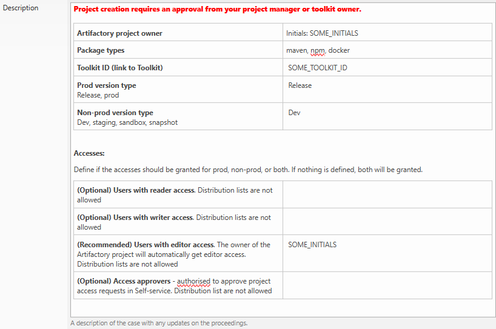
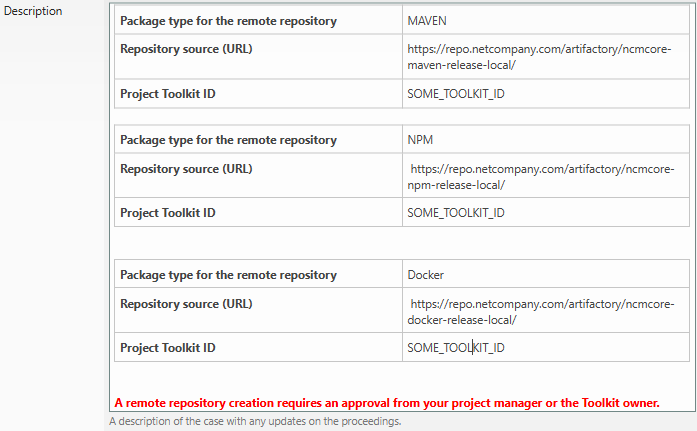
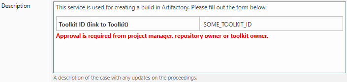
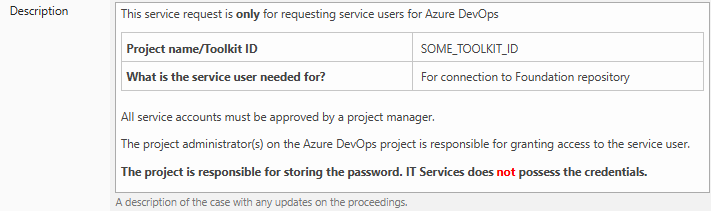
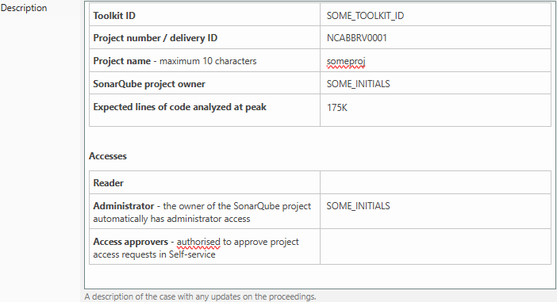

| Reference                                                                         | Author     |
|-----------------------------------------------------------------------------------|------------|
| [Amplio Project List][PROJECT_LIST]                                               | Netcompany |
| [AMPJ Toolkit][AMPJ_TK]                                                           | Netcompany |
| [O0300 – Maintenance Guide – Local Environment Setup][O0300_FOUNDATION]           | Netcompany |
| [C0200 – Getting started with a Foundation project][C0200_GSW_FOUNDATION_PROJECT] | Netcompany |
| [New Amplio Project Register Form][PROJECT_LIST_NEW_ENTRY]                        | Netcompany |
| [O0300 – DevOps][0300_DEVOPS]                                                     | Netcompany |
| [P0150 - Governance][P0150]                                                       | Netcompany |
| [Pop-Ups][POP_UP]                                                                 | Netcompany |
| [The Gazette][GAZETTE]                                                            | Netcompany |

<!-- =============== -->
<!-- REFERENCE LINKS -->
<!-- =============== -->

<!-- Amplio toolkit links -->

[AMPJ_TK]: https://goto.netcompany.com/cases/GTE2252/AMPJ/SitePages/default.aspx

[GAZETTE]: https://goto.netcompany.com/cases/GTE2252/AMPJ/SitePages/Gazette.aspx

[PROJECT_LIST]: https://goto.netcompany.com/cases/GTE2252/AMPJ/Lists/Projects/Project%20overview.aspx

[PROJECT_LIST_NEW_ENTRY]: https://goto.netcompany.com/cases/GTE2252/AMPJ/Lists/Projects/NewForm.aspx?Source=https%3A%2F%2Fgoto%2Enetcompany%2Ecom%2Fcases%2FGTE2252%2FAMPJ%2FLists%2FProjects%2FProject%2520overview%2Easpx&RootFolder=

[POP_UP]: https://goto.netcompany.com/cases/GTE2252/AMPJ/Education/Forms/AllItems.aspx?RootFolder=/cases/GTE2252/AMPJ/Education/Popups

[AMPJ_USER_GUIDES]: https://goto.netcompany.com/cases/GTE2252/AMPJ/Education/User%20Guides

[AMPJ_COURSES]: https://goto.netcompany.com/cases/GTE2252/AMPJ/Lists/Courses/AllItems.aspx

<!-- Foundation toolkit wiki links -->

[O0300_FOUNDATION]: https://goto.netcompany.com/cases/GTE1624/NCJAVA/SitePages/Wiki.aspx#/O0300-Maintenance-Guide/Local-Environment-Setup

[C0200_GSW_FOUNDATION_PROJECT]: https://goto.netcompany.com/cases/GTE1624/NCJAVA/SitePages/Wiki.aspx#/C0200-User-Guides/Getting-started-with-a-Foundation-project

[P0150]: https://goto.netcompany.com/cases/GTE2252/AMPJ/SitePages/Wiki.aspx#/P0150-Governance

[0300_DEVOPS]: https://goto.netcompany.com/cases/GTE2252/AMPJ/SitePages/Wiki.aspx#/O0300-Maintenance-Guide/DevOps

[FOUNDATION_USER_GUIDES]: https://goto.netcompany.com/cases/GTE1624/NCJAVA/Education/User%20Guides

[FOUNDATION_COURSES]: https://goto.netcompany.com/cases/GTE2252/AMPJ/Lists/Courses/AllItems.aspx

<!-- Amplio ADO links -->

[NCMCORE_ADO_PIPELINES]: https://source.netcompany.com/tfs/Netcompany/NCMCORE/_build?view=folders

<!-- NCITS links -->

[NEW_CASE]: https://goto.netcompany.com/cases/GTE417/NCITServices/Lists/Tasks/NewForm.aspx?Source=https://goto.netcompany.com/cases/GTE417/NCITServices/Lists/Tasks/Cases%20created%20by%20me.aspx&RootFolder=

# Introduction

This document contains a checklist of activities needed to be a successful project in Amplio. It guides the initial work in the fields of Project Management,
Architecture and DevOps.

## Target audience

Target audience for this document are team leads, project leads and architects of new Amplio projects.

## Purpose

The purpose of this document is to accelerate new projects start-up by providing a comprehensive list of what activities need to be completed.

# Required reading

## Roles

The default construction in an Amplio project requires a certain set of roles for communication and responsibility purposes defined. You can read about
them [here][P0150].

## Documentation & Educational Material

Before reaching out to the A-Team for support, ALWAYS check:

- [Amplio Toolkit Wiki][AMPJ_TK]
- If there is any available Gazette article
- If there are available user guides

See the immediately following sections for more information.

### User Guides

- [Amplio User Guides][AMPJ_USER_GUIDES] - Comprehensive guides for Amplio platform features and functionality
- [Foundation User Guides][FOUNDATION_USER_GUIDES] - Reference materials for the Foundation framework

### Gazette Articles

Short-form introductions and quick start guides for different features. These 5-minute entertaining reads are published every 2 weeks (excluding holiday
seasons) and provide concise overviews of new capabilities and best practices. [Access the Gazette][GAZETTE].

### Training Courses

Browse available courses at [Amplio Training Courses][AMPJ_COURSES] and [Foundation Training Courses][FOUNDATION_COURSES].

All courses are managed by AMK who serves as the primary contact for inquiries and scheduling. The process for scheduling a course is as follows:

- Check the course list in Toolkit, then check Netcompany Academy Platform to see if there is a scheduled instance. If yes, sign up.
- If there is not any scheduled instance, reach out to AMK, make sure you include the number of people that you would like to sign up.
    - If there are enough people that have shown interest, then a course will be scheduled and all stakeholders will be notified (e.g. all projects). People
      will then be able to sign up on the Academy Platform.
    - If there are not enough people that have shown interest yet, then a course will not be scheduled, however, the people that shown interest will be notified
      when it is.

All finished courses have slides and recordings available at the [following link][POP_UP]. These materials are accessible to everyone and are designed to bridge
gaps between course sessions, facilitate quick onboarding, or reinforce knowledge for course participants who need to refresh specific topics.

#### Seminars

**Amplio Boot Camp**

- Duration: 2 days (16 hours) of in-person intensive training covering all Amplio essentials.
- Target audience: L1-L3 employees who are current or future members of Amplio projects.
- Participants should have minimum 1 month of experience to be able to get anything valuable from the course.
- Course target is >30 participants and is scheduled when enough people have shown interest, typically during new project onboarding.

#### Pop-ups

- Specialized 2-hour online sessions.
- Sessions require minimum 10 participants and are scheduled on demand.
- Target audience: L1-L3 employees who are current or future members of Amplio projects.
    - Note that courses can be more or less relevant for higher levels depending on the topic of the course.
- Perfect for targeted learning on specific Amplio platform components.
- Recordings are available on the respective toolkit.

### Wiki Documentation

Please consider the [Amplio Toolkit Wiki][AMPJ_TK] the first level of support before reaching out to the A-team. The wiki contains:

- Detailed designs for all features
- Programming guidelines and best practices
- Governance documents and frameworks
- Maintenance and technical guides including [DevOps information][0300_DEVOPS]
- Additional resources for developers and project managers

It is important to understand the [P0150 - Governance][P0150] framework for project governance that defines roles, responsibilities, and decision-making
processes.

For Foundation-related documentation, refer to the [Foundation Maintenance Guide][O0300_FOUNDATION]
and [Getting Started with a Foundation Project][C0200_GSW_FOUNDATION_PROJECT].

## Security groups

Security groups are essential for controlling access to Amplio artifacts and resources. They ensure that project team members have appropriate permissions while
maintaining security. Refer to
the [C0200 - GSW Foundation project security groups](https://goto.netcompany.com/cases/GTE2252/AMPJ/SitePages/Wiki.aspx#/C0200-User-Guides/Getting-started-with-security-groups?id=the-brief-description),
for an explanation of them.

## Startup phases

The project setup is done in two phases to improve the project creation experience:

**Phase 1:** The project's codebase lives on a git branch in the Amplio repository on Azure DevOps, and uses all the environment setup that comes with it.

**Phase 2:** When the project is ready to assume the governance tasks associated with having their own setup. This is when the Amplio team helps the project
move out and into a new independent repository, with a complete environment.

**Phase 1 Requirements:**

- ADO
- Project Mailing list
- Toolkit

**Phase 2 Requirements:**

- Phase 1 completed

## A-Team communication and SPOC

When starting a new Amplio project, communication with the A-team is essential. The A-team provides support and coordination throughout the project setup
process.

Key communication points:

- Initial start-meeting with A-team Lead (Java Foundation and Amplio Java project lead)
- A-team SPOC (Single Point of Contact) for branch creation and setup assistance
- Coordination for phase transitions and handovers

# Phase 1 - step-by-step

1. **Register in the Project List**
    - Navigate to the [New Amplio Project Register Form][PROJECT_LIST_NEW_ENTRY]
    - Complete all required fields, ensuring accuracy of project details
    - Submit the form to:
        - Be added to Amplio mailing lists automatically
        - Receive invitations to all Amplio regime forums (release notes meetings, security meetings, etc.)
    - Keep the project information up to date in the [Amplio Project List][PROJECT_LIST]

2. **Request Security Groups**
    - Make a **Foundation Bundle Groups - Creation** [case][NEW_CASE] with your project details
    - For an example of how to request the security groups
      see: [O0300 – Maintenance Guide – Local Environment Setup](/O0300-Maintenance-Guide/Local-Environment-Setup.md) under the heading **Requesting the
      required accesses**

3. **Book Start-meeting with A-team Lead**
    - Contact A-team lead with the subject "New Amplio Project Start-meeting"
    - During this meeting, you will discuss:
        - Arranging an Amplio introduction pop-up for the project participants
        - Get assigned an A-team SPOC

4. **Begin Build Phase**
    - Contact the A-team SPOC to create a branch for your project
    - Start your build activities in the provided branch

5. **Onboard Project Participants**
    - Refer to
      the [O0300](https://goto.netcompany.com/cases/GTE2252/AMPJ/SitePages/Wiki.aspx#/O0300-Maintenance-Guide/Local-Environment-Setup?id=setting-up-your-development-environment)
      for onboarding project participants.
    - Direct project participants to use the Learning Resources to learn more about Amplio:
        - [The Gazette][GAZETTE] - Short-form articles explaining Amplio concepts
        - [Pop-Ups][POP_UP] - Training slides and recordings on Amplio topics
        - [Amplio Toolkit Wiki](/) - Comprehensive wiki with detailed information

# Phase 2 - step-by-step

1. **Inform A-team SPOC**
    - Notify your A-team SPOC that you're ready to begin the Phase 2 setup process

2. **Create these NCITService Cases**
    - [Artifactory - Project Creation](#artifactory---project-creation)
    - [Artifactory - Remote Repository Creation](#artifactory---remote-repository-creation)
    - [Artifactory - Build Creation](#artifactory---build-creation)
    - [New Service User - Azure DevOps](#new-service-user---azure-devops)
    - [SonarQube - New Project](#sonarqube---new-project)

3. **Update Project List Information**
    - Return to the project list and fill out remaining information on project roles

4. **Setup New App on Systems**
    - Once all cases are completed, contact your A-team SPOC again to request creation of independent Amplio application.
    - Agree with A-team SPOC on a handover date.
    - Ensure all necessary knowledge and access is transferred.

5. **Begin Project-Specific Work**
    - Continue the build on your project-specific ADO repository
    - Implement project governance according to Amplio standards

# Appendix

Contains an explanation of the cases for setting up an independent project.

## Artifactory - Project Creation

When requesting the creation of an artifactory project, remember to use proper project-related values for:

- Artifactory project owner
- Toolkit ID
- Users with editor access

## Artifactory - Remote Repository Creation

When requesting the creation of an artifactory project, remember to use proper project-related values for:

- Toolkit ID

## Artifactory - Build Creation

When requesting the creation of an artifactory build, remember to use proper project-related values for:

- Toolkit ID

## New Service User - Azure DevOps

When requesting the creation of an artifactory project, remember to use proper project-related values for:

- Toolkit ID

## SonarQube - New Project

When requesting the creation of an artifactory project, remember to use proper project-related values for:

- Toolkit ID
- Project number
- Project name
- User with Administrator privileges

