# References

| Reference                      | Author     |
|--------------------------------|------------|
| [DD130 Process engine]         | Netcompany |
| [DD130 Principle of processes] | Netcompany |
| [DD130 Process Assignment]     | Netcompany |
| [DD130 Process Administration] | Netcompany |


[DD130 Process engine]: ../DD130-Detailed-Design/Process-Engine
[DD130 Principle of processes]: ../DD130-Detailed-Design/Principles-for-processes.md
[DD130 Process Assignment]: ../DD130-Detailed-Design/Process-Assignment.md
[DD130 Process Administration]: ../DD130-Detailed-Design/Process-Administration.md
# Introduction

This document provides a comprehensive guide for developers on creating, implementing, and managing business workflows using the Amplio Process Engine. 
Processes are a central component of the Amplio platform, serving as the primary mechanism for modeling and executing business logic. 
They enable the translation of complex operational requirements into robust, automated, and maintainable software solutions.
This guide details the complete development lifecycle of a process, from fundamental concepts and initial setup to implementation, testing, and operational management.

## Target Audience

This document is intended for software developers who are new to the Amplio platform or its process engine. 
A foundational knowledge of Java and general software development principles is assumed. 
No prior experience with the Amplio Process Engine, or Business Process Model and Notation (BPMN) is necessary.

## Document Purpose

The purpose of this guide is to provide developers with the necessary instruction to successfully implement business processes within the Amplio ecosystem. 
Upon completion of this guide, the reader will be equipped to:
- Understand the core architecture and key concepts of the Amplio Process Engine.
- Design and model a business process using the BPMN standard.
- Implement backend logic for both automatic and manual process tasks.
- Integrate a process with a user interface to facilitate manual interaction.
- Apply effective strategies for testing and troubleshooting processes.
The guide emphasizes practical application and established best practices to ensure that developed processes are functional, scalable, and maintainable.

# Basic Introduction to Amplio Processes

In the Amplio platform, a Process is the digital blueprint for a business workflow. It defines a sequence of steps required to achieve a specific business goal,
such as processing a citizen's application, managing a change of address, or automating the dispatch of a letter.
Processes are triggered by events, like a user submitting a form or an update arriving from an external system. 
Once started, a process orchestrates the required work. Some steps may be fully automated by the system, while others may appear as tasks for a user (e.g., a caseworker) to complete in the Business App.

The diagram below provides a high-level view of how processes coordinate actions between users and various system components to deliver a complete business outcome.

<div style="text-align: center;">


<h5>Figure 1: High-level diagram showing user interacting with the system, with Process Engine at the center coordinating automated and manual work.</h5>
</div>


# Core Concepts

Before implementing a process, it is essential to understand the fundamental components that constitute the Amplio Process Engine. 
This section defines the key concepts and model objects you will work with. For more details about the core components, you can see
[DD130 Detailed Design - Process Engine](../DD130-Detailed-Design/Process-Engine.md#high-level-description-of-the-component)

## What is a Process?

A **Process** is a complete, end-to-end business workflow executed by the engine. 
In technical terms, a process is defined by a BPMN diagram and a corresponding set of Java classes that implement its logic. 
It is composed of a sequence of tasks, decisions, and events that work together to achieve a specific business goal.
From a business perspective, a process models a full or partial business flow. Concrete examples include:
- Sending a letter to a citizen.
- Granting a social benefit after an application is reviewed.
- Handling the administrative tasks required when a recipient passes away.

Each process subscribes to specific system `Event`. When an event occurs - such as a citizen submitting a self-service 
form or a notification arriving from an external registry - the engine starts the corresponding process instance to handle it.

## What is a Task?

A **Task** represents a single step or unit of work within a process. It is the most fundamental element in a BPMN diagram. 
Each task in the diagram corresponds to a **Listener**  - a Java class that contains the specific business logic to be executed for that step.

Tasks are categorized into two primary types:
- **Automatic Task**: A task performed by the system without human intervention.
- **Manual Task**: A task that requires input from a user through a user interface.

## The BPMN Diagram

A BPMN (Business Process Model and Notation) diagram is the visual and executable blueprint of a process. 
Created in an external tool like the Camunda Modeler, it uses a standard set of symbols to define the flow of work. 
The process engine directly interprets this diagram, making it the single source of truth for the process logic and sequence.

<div style="text-align: center;">


<h5>Figure 2: Simple order flow modeled in Business Process Modelling Notation (BPMN)</h5>
</div>

## What is a Listener?

A Listener is a Java class that contains the business logic for a specific task in the BPMN diagram. When the process engine executes a task, 
it invokes the corresponding Listener. This class is where you write the code to perform actions like validating data, 
saving to the database, calling external services, or preparing information for a user interface. 
Every task that requires custom logic will have a Listener associated with it.

## Key Domain Models

During process execution, several key domain models are used to manage state and facilitate communication between the backend and frontend.

**`SimpleProcessContext`**

The SimpleProcessContext represents the state of a running process. It is the primary location for storing the data a process generates while it executes.
- It is persisted between tasks, allowing data from one step to be used in a later step.
- The process context is updated and saved to the database every time the execution of a listener finishes, ensuring it always holds the most recent state of the process.
- It exists in a draft state until saved.
- When the process returns from a manual task, the SimpleProcessContext is updated with values from the `SimpleProcessCommand`.
- The values on the SimpleProcessContext can be read and updated within Listeners, for example, by running calculations and storing the result for later use.
- The serialized context is stored in the `PROCESS_DATA` table.
- Its lifecycle lasts for the entire duration of the process instance.

**`SimpleProcessCommand`**

The role of this object is to carry data that a user submits from the frontend back to the listener upon submitting a manual task.
- The `SimpleProcessCommand` lives between the frontend and the backend. Its purpose is to communicate any updates to the state made by the user,
such as filling out form values. It functions similarly to a "submit command."
- It can also be used to carry validation messages from the listener back to the frontend.
- A new, unique `SimpleProcessCommand` class should be created for each distinct type of manual task. Do not reuse the same command class for different tasks, unless the listener itself is being reused.
- The entire `SimpleProcessCommand` object, including user input and any other data it holds, is serialized and persisted in the `TASK_DATA` table.
- It has a short, task-specific lifecycle. A new command object is created on every iteration; for example, if you click "Continue" and get a validation error from the backend, a new command is generated for that round-trip.

**`TaskViewData`**

The role of this object is to communicate from the listener to the frontend what should be shown in the UI, 
particularly for values that are not part of the core process state.
- It is used for read-only data that does not change during the user's interaction with the form.
- Common examples include populating drop-down lists (e.g. list of countries) 
or displaying read-only information about the entity the process is running on.
- The `TaskViewData` object is recreated by the listener from scratch every time the task page is loaded.
- The `TaskViewData` is persisted alongside the `SimpleProcessCommand` in the `TASK_DATA` table.
- It has a short, task-specific lifecycle.
- It is thrown away after every use; it is not submitted back from the frontend, so any client-side mutations are lost.

## Comparison of Domain Models

Understanding the distinct role and scope of each data object is crucial for correct implementation. The table below summarizes their differences.

| Feature     | SimpleProcessContext                                 | TaskViewData                                          | SimpleProcessCommand                        |
|-------------|------------------------------------------------------|-------------------------------------------------------|---------------------------------------------|
| Purpose     | Represents the entire state of the process instance. | Provides read-only data for the UI (e.g., dropdowns). | Carries user input and validation messages. |
| Lifecycle   | Process-wide. Persists across all tasks.             | Task-specific. Used for one manual task.              | Task-specific. Used for one manual task.    |
| Data Flow   | Listener ↔ Listener                                  | Listener → Frontend                                   | Frontend ↔ Listener                         |
| Persistence | Stored in the PROCESS_DATA table.                    | Stored in the TASK_DATA table.                        | Stored in the TASK_DATA table.              |

# Prerequisites & Setup

Before you begin creating a process, ensure that your development environment is correctly configured with the necessary tools. 

**Required Software**

The following tools are required for process development within the Amplio ecosystem.
- **Java Development Kit (JDK)** : Check [O0300 - Maintenance Guide](../O0300-Maintenance-Guide/Local-Environment-Setup.md)
- **Camunda Modeler**: The Camunda Modeler is a standalone desktop application used to create and edit BPMN 2.0 diagrams. 
This tool is essential for visually designing your process workflows. You can download the latest version from the official [Camunda website](https://camunda.com/download/modeler/)

# Creating a Process: Step-by-step Tutorial

This section provides a complete, step-by-step tutorial for building a functional business process from start to finish. 
By following these steps, you will apply the core concepts from the previous chapter to create, implement, and test a real-world workflow.

**The Example Process: A Vacation Request**

For this tutorial, we will build a "Vacation Request" process. This is a common business workflow with a clear and practical application.

The process will work as follows:

1. An employee submits a vacation request by providing a start and end date.
2. The system automatically calculates the duration of the request.
3. The process flow then diverges based on the calculated duration:
   - If the request is for 3 business days or less, it is auto-approved.
   - If the request is for more than 3 business days,  it is routed for a "four-eyes" manual approval. 
   This means the request must be approved by any user other than the person who initiated the request.
4. Once approved (either automatically or manually), the process is finalized, and the leave request is saved.

## Package and Directory Structure

To begin, you must have a working Amplio project set up in your IDE. Process implementation follows standard project conventions,
but it is recommended to organize your process-related code within a dedicated package structure. For example:

```
processes
└── src
    └── main
        ├── java
        │   └── com
        │       └── netcompany
        │           └── <your_project>
        │               └── processes
        │                   └── <process_name>
        │                       ├── listener
        │                       ├── model
        │                       ├── validator
        │                       └── constants
        │
        └── resources
            └── processes
                └── <process_name>
                    └── diagrams
                        └── <process_name>.bpmn
```

For frontend implementation, it is recommended to group all process-related UI code under a dedicated `Processes` directory.
```
Processes
└── <process_name>
    ├── modules
    │   ├── <FirstManualTaskName>Module.tsx
    │   └── <AnotherManualTaskName>Module.tsx
    ├── <ProcessName>Process.tsx
    └── types.ts
```

Ensure your project's build configuration (e.g., pom.xml or build.gradle) includes the necessary dependencies for the Amplio Process Engine.
The core dependency required to start building processes is:

```groovy
implementation 'nc.amplio.libraries:process-engine-api'
```

For frontend process development, the Amplio Process package must be included in your package.json:
```json
{
  "dependencies": {
    "@amplio/process": "<version>"
  }
}
```

Additional features may require other dependencies. For information on customizing your process with features
like journal notes or process assignment, refer to [Customizing Your Process](#customizing-your-process).

## Designing the Process Diagram(BPMN)

The first step in creating any process is to model its flow visually. 
This is done by creating a BPMN 2.0 diagram using the Camunda Modeler. 
This diagram is not just a drawing; it is the executable model that the Amplio Process Engine, which is based on Camunda 7, will follow.

We will build our "Vacation Request" diagram piece by piece.

### The Start Event
When you create a new BPMN diagram in the Camunda Modeler, a `Start Event` (a thin circle) is automatically placed on the canvas.
This marks the required entry point for your process.

Select the Start Event and give it a descriptive name in the `Properties Panel`. 
While not technically required, this improves the diagram's readability.
- Name: Vacation Request Start Event
<div style="text-align: center;">

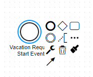
<h5>Figure 3: The Start Event, representing the beginning of the process.</h5>
</div>

<div style="text-align: center;">

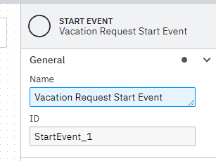
<h5>Figure 4: The Start Event, representing the beginning of the process.</h5>
</div>

### Task 1: Initialization Task

The first action is for the user to submit their request.
1. Select the Start Event and click the "Append Task" icon from its context menu.
    <div style="text-align: center;">
    
    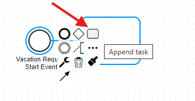
    <h5>Figure 5: The Start Event, representing the beginning of the process.</h5>
    </div>

2. Select the newly created task and configure its properties:
   - **Name**: Init Vacation Request
3. In the Properties Panel on the right, go to the `Execution Listeners` tab and add a Task
   - **Listener Type**: Delegate expression
   - **Delegate Expression**: type the name of the name (java classname) of the listener corresponding to this task
   `SubmitVacationInitiateListener`
   <div style="text-align: center;">
   
   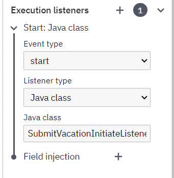
   <h5>Figure 6: Configuring the listener for the "Initiate Vacation Request" task.</h5>
   </div>
4. Click the wrench icon on the task and change its type to `Service Task`, as this step is automatic. **This step is MANDATORY**.
   <div style="text-align: center;">

   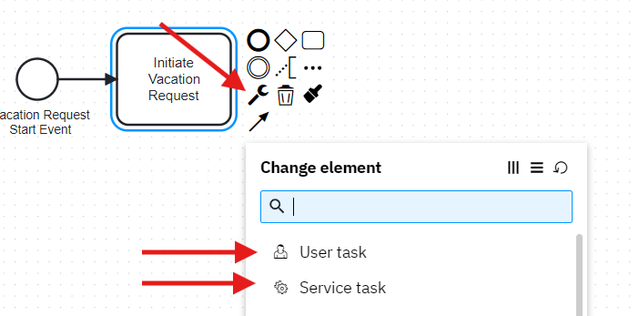
   <h5>Figure 7: Configuring task type.</h5>
   </div>

### Task 2: Submit Vacation Request Form

Following the initialization, the user needs to fill out the vacation request form. This is a manual task.
1. Select the "Init Vacation Request" task and append a new task.
2. Select the new task and configure its general properties:
   - Name: Submit Vacation Request Form
3. In the Properties Panel, go to the `Execution Listeners` tab and add a listener:
   - Listener Type: Delegate Expression
   - Delegate Expression: SubmitVacationRequestFormListener
4. Click the wrench icon and ensure its type is set to `User Task`, as this step requires user interaction.

### Task 4: Calculate Request Duration
Following the form submission, the system needs to automatically calculate the duration of the requested leave. 
This listener will also determine which path the process should take next by setting a Conditional.

Follow the same steps as before to append a new Service Task after the "Submit Vacation Request Form" task.
Configure it with the following properties:
- **Name:** Calculate Request Duration
- **Type:** Service Task
- **Listener** (Execution Listener):
  - **Delegate Expression:** CalculateRequestDurationListener

### Decision Gateway

After the duration is calculated, the process must follow different paths. This decision is modeled using an `Exclusive Gateway`. 
The gateway will read the `Conditional` returned by the previous listener to direct the flow.
1. Select the "Calculate Request Duration" task and append an Exclusive Gateway.
    <div style="text-align: center;">
    
    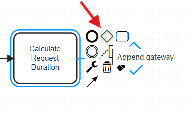
    <h5>Figure 8: Add Exclusive Gateway.</h5>
    </div>
2. From the gateway, we will create two paths. For each path, we must configure the sequence flow (the arrow) to check for the specific `Conditional`.

**Configuring Gateway Paths**

To set the condition for a path, select the arrow leading out of the gateway. 
In the Properties Panel, you will define a Condition Expression that checks the value of the `conditional` variable.

1. Create the Manual Review Path:
   - From the gateway, append a new User Task named "Review Long Leave Request".
   - Select the arrow between the gateway and this new task.
   <div style="text-align: center;">

    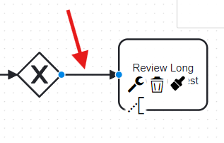
      <h5>Figure 9: Add Exclusive Gateway.</h5>
   </div>
     
2. In the Properties Panel, set the following:
   - **Name:** Yes (Needs Review)
   - **Condition Type:** Expression
   - **Expression:** ${conditional.equalsIgnoreCase("REQUIRES_APPROVAL")}
   <div style="text-align: center;">

     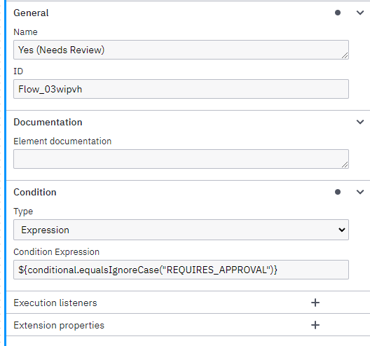
     <h5>Figure 10: Configure Exclusive Gateway.</h5>
   </div>
3. Create the Auto-Approval Path:
    - Drag a second arrow from the gateway directly to the "Finalize Leave Request" task (which you will add next).
    - Select this new arrow and set its condition:
      - **Name:** No (Auto-Approved)
      - **Condition Type:** Expression
      - **Expression:** ${conditional.equalsIgnoreCase("CONTINUE")}

With the gateway logic in place, we add the tasks that handle the approval and final registration.

   <div style="border-left: 4px solid darkorange; background-color: rgba(255, 140, 0, 0.1); padding: 10px; margin-bottom: 10px;">
    <strong>Warning:</strong>
        <div>
          Ensure that every outgoing path from an Exclusive Gateway has a valid Condition Expression defined. 
         If a gateway path is left incomplete or missing an expression, the BPMN diagram will fail to parse during deployment. 
         This will cause the entire application to fail during startup.
        </div>
   </div>

### Final Tasks: Review and Finalize
1. **Add the Manual Review Task:**
Following the Yes (Needs Review) path from the gateway, create a User Task.
Configure its properties:
   - **Name:** Review Long Leave Request
   - **Listener (Execution Listener):**
     - **Delegate Expression:** LeaveRequestFourEyesListener 

2. **Add the Finalizing Task:**
Create a final Service Task named Finalize Leave Request.
Draw arrows from both the "Review Long Leave Request" task and the No (Auto-Approved) gateway path to this new task, merging the flows.
Configure its properties:
     - **Name:** Finalize Leave Request
     - **Listener (Execution Listener):**
       - **Delegate Expression:** LeaveRequestRegisterDataListener.

### End Event
Every process path must lead to a conclusion. The End Event (a thick circle) signifies that a process instance has completed successfully.

1. Select the "Finalize Leave Request" task and append an End Event
   <div style="text-align: center;">

   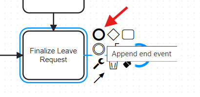
   <h5>Figure 11: Adding End Event.</h5>
   </div>
2. Give the End Event a name.
   - Name: Request Finalized

### Finalizing the Diagram File

With all elements named, configured, and connected, your BPMN diagram is now a complete and executable model. 
The final step is to transfer this model from the Camunda Modeler into your project's resource files.
1. **Review the Final Diagram:**
   Take a moment to review the complete process flow one last time to ensure it matches the intended logic.
   <div style="text-align: center;">

   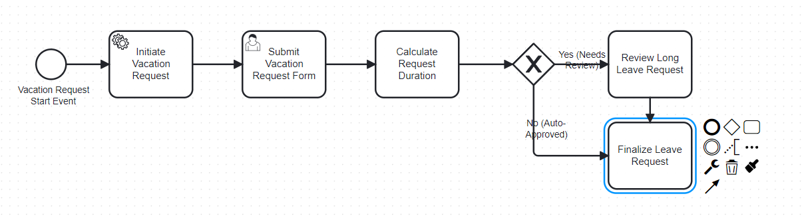
   <h5>Figure 12: Overview of the diagram.</h5>
   </div>
2. **Save the Diagram:**
   - In the Camunda Modeler, go to `File > Save As...`
   - Navigate to your project's resources directory where the BPMN files are stored. This is typically `processes/src/main/resources/diagrams/`.
   - Save the file with the correct name, for example, `VacationRequestProcess.bpmn`, overwriting the placeholder file you created earlier.
   <div style="text-align: center;">

   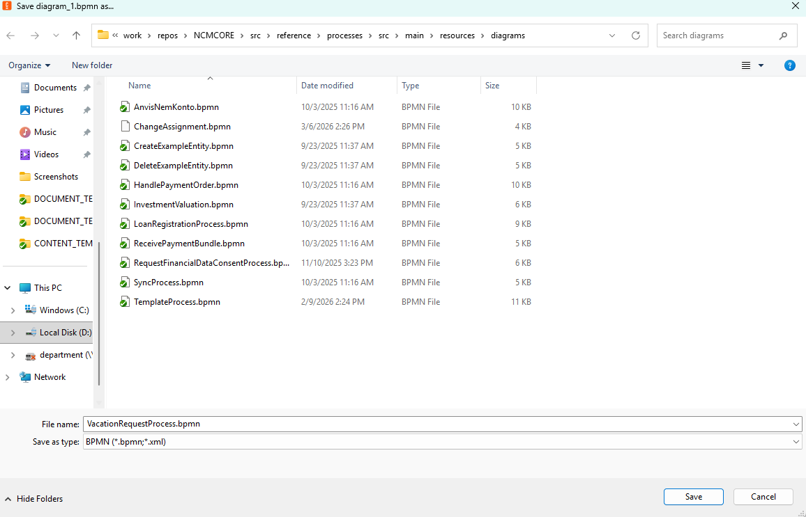
   <h5>Figure 13: Save diagram.</h5>
   </div>

## Setting Up Process Constants

With the BPMN diagram complete, the next step is to define the corresponding constants and system configurations in your application's code.
These elements allow the process engine to identify your process, start it from an event, and map the tasks in the diagram to your Java listeners.

### Defining ProcessType, EventType, TaskType
It is a best practice to centralize all process-related constants in a single Java class to improve maintainability.
Start by navigating to the `constants` package you created during the project setup. 
Create a new `final` Java class named `VacationRequestProcessConstants` and annotate it with `@StaticInitializer` and `@NoArgsConstructor(access = AccessLevel.PRIVATE)`.
 ```java
 @StaticInitializer
 @NoArgsConstructor(access = AccessLevel.PRIVATE)
 public class VacationRequestProcessConstants {
 }
 ```
Inside this class, you will define the three core ExtendableEnum types required for your process.

#### ProcessType

The `ProcessType` constant identifies the process. To create it, we must provide:
   - **name**: A descriptive, unique name.
   - **context supplier**: A supplier method for creating an instance of the process-specific implementation of `SimpleProcessContext` (we will create this class later).
   - **path of the BPMN diagram**: The relative path to the BPMN diagram file from the project's resources folder.
   ```java
    public static final ProcessType VACATION_REQUEST_PROCESS = ProcessType.create("VACATION_REQUEST_PROCESS", VacationRequestProcessContext::new, "diagrams/VacationRequestProcess.bpmn");
   ```
   <div style="border-left: 4px solid darkorange; background-color: rgba(255, 140, 0, 0.1); padding: 10px; margin-bottom: 10px;">
    <strong>Warning:</strong>
        <div>
         <p> During application startup, the Process Engine scans the .bpmn file declared in the <code>ProcessType</code> and verifies that a corresponding Spring bean (a listener) exists for every task defined in the diagrams.</p>
         <p>If a listener bean cannot be found for a task you have defined, the application will fail to start. Therefore, you must create at least a placeholder implementation for <strong>all</strong> listeners in your process before attempting to run the application.</p>
        </div>
   </div>

#### TaskType

The `TaskType` constant identifies each specific task within the process. It is used by the listener's `getTaskType` method to identify the compatible listener for each task.
We will use the provided `TaskTypeFactory` to simplify the creation of these constants.
   1. For Initiate Vacation Request task, we will use the `TaskTypeFactory.automaticListener` and pass a descriptive, unique name.
      By convention, the `String` key passed to the factory should be identical to the name of the constant itself.
       ```java
         public static final TaskType VACATION_REQUEST_PROCESS_INIT = TaskTypeFactory.automaticListener("VACATION_REQUEST_PROCESS_INIT");
        ```
   2. For the Submit Vacation Request Form task, we will use the `TaskTypeFactory.manualListener`. We must provide:
      - **name**: A descriptive unique name.
      - **SimpleProcessCommand class/subclass**: The class for the `SimpleProcessCommand` that this task will use.
      - **TaskViewData class/subclass**: The class for the `TaskViewData` that this task will use.
      <div style="border-left: 4px solid #26ff00; background-color: rgba(17,255,0,0.1); padding: 10px; margin-bottom: 10px;">
         <strong>Note:</strong>
          <div>It is acceptable to use the base SimpleProcessCommand.class or TaskViewData.class directly if your task does not require any specific fields for 
      form submission or UI data. However, if your task involves a form with unique fields or needs to display special read-only data, 
      you must create custom subclasses for them.
      </div>
      </div>
      
        ```java
         public static final TaskType VACATION_REQUEST_SUBMIT =  TaskTypeFactory.manualListener(
          "VACATION_REQUEST_SUBMIT", SubmitVacationProcessCommand.class, SubmitVacationTaskViewData.class);
        ``` 
   3. For the Calculate Request Duration task, we will use again the `TaskTypeFactory.automaticListener`.
      ```java
           public static final TaskType CALCULATE_REQUEST_DURATION = TaskTypeFactory.automaticListener("CALCULATE_REQUEST_DURATION");
      ```
   4. For the Review Long Leave Request task, since it will use  a Four Eyes listener, we will use the `TaskTypeFactory.fourEyesListener`.
      ```java
             public static final TaskType VACATION_REQUEST_FOUR_EYES_TASK = TaskTypeFactory.fourEyesListener("VACATION_REQUEST_FOUR_EYES_TASK");
      ```
   5. For the final task, Finalize Leave Request, we will use the `TaskTypeFactory.registerDataListener`.
      ```java
             public static final TaskType VACATION_REQUEST_REGISTER = TaskTypeFactory.registerDataListener("VACATION_REQUEST_REGISTER");
      ```
      
**About the TaskTypeFactory**
 
The TaskTypeFactory is a utility class that provides convenient static methods for creating pre-configured TaskType instances. 
While this tutorial covers the most common factory methods (automaticListener, manualListener, fourEyesListener, and registerDataListener), 
it can also be used to create other kinds of tasks, such as those for sending letters (sendLetterListener) or for waiting conditions (waitTaskListener).
Using this factory simplifies the definition of task types and ensures they are configured correctly for their intended purpose.

#### EventType

The `EventType` constant defines the event that triggers the start of the process. Its name must begin with a prefix defined in `ProcessStartSystemTypes`, which denotes how the process is triggered. 
The Amplio Platform provides several standard prefixes by default:
   - `NOTHING_SELECTED`: Default value if no other start type fits.
   - `SELF_SERVICE_PORTAL`: Triggered from self-service portal.
   - `ACTIONS_DROPDOWN`: Triggered from business application action dropdown.
   - `RECEIVE_MAIL`: Created from a paper letter
   - `BATCH`: Created from a bulk action executed from the search page.
   - `CONVERSION`: Created from conversion/migrated events.
   - `INTEGRATION`: Created from integration events.
   - `OTHER_PROCESS`: Created by another process 

For our example, we will trigger the process manually from the UI's "Actions" dropdown, so the event name will have the prefix `AD_` from the `ACTION_DROPDOWN`.
```java
      public static final EventType AD_VACATION_REQUEST = EventType.create("AD_VACATION_REQUEST", true);
```

## Creating the Process Context

Before implementing any listeners, we must first create a custom ProcessContext class for our process.
This class will act as the dedicated data container, or "memory," for our "Vacation Request" process instance.
It will hold all the information that needs to be passed between tasks, such as the start date, end date, and the id of the requester.
1. Navigate to the `model` package you created during the project setup. Create a new Java class named `VacationRequestContext`.
2. This class must extend `SimpleProcessContext` or a project-specific base context class.
3. Add fields to this class for all the data you need to store during the process. For our case, we will use the context to store the requester ID, leave type, the start date, and the end date.
```java
@Getter
@Setter
public class VacationRequestContext extends SimpleProcessContext<SimpleCasePlaceholder> {
    
    private LocalDate startDate;
    private LocalDate endDate;
    private String requesterId;
    private LeaveType leaveType;
}
```

## Implementation Strategy

Before we begin writing the Java code for each listener, it is important to follow a consistent and maintainable implementation strategy.
A well-planned approach promotes code reuse and ensures that your process logic is organized effectively. This section outlines the recommended workflow for implementing the listeners for your process.
      
### Starting the Process with InitiateListener

It is a standard best practice to begin every process with a dedicated, automatic `InitiateListener`.
The primary responsibility of this first task is to perform initial setup for the process instance such as 
fetching initial data, and populating the ProcessContext with foundational data needed by subsequent tasks.
Even if a process requires no initial setup, including an initiate listener provides a consistent starting point and a clear place to add setup logic in the future.

For our "Vacation Request" process, the initiate listener's main job is simple: it will capture the ID of the user starting the process and save it to our VacationRequestContext.

To implement this, we will create a class that extends the abstract `InitiateListener` base class. This base class handles the common logic,
allowing us to focus only on our custom step by implementing the `customExecuteTask` method.
1. **Create a Listener Class:**
   In your listener package, create a new Java class named `SubmitVacationInitiateListener` a name that matches the BPMN's "Delegate Expression". 
   It must extend InitiateListener<VacationRequestContext> and be annotated as a @Component. 
2. **Implement the Core Methods:**
   - **getTaskType**: This method must return the `TaskType` constant for this listener.
   - **customExecuteTask**: This is where we add our logic. The base class provides the triggering Event object, from which we can get the requester's ID.

```java
@Component
public class SubmitVacationInitiateListener extends InitiateListener<VacationRequestContext> {
    @Override
    public TaskType getTaskType() {
        return VacationRequestProcessConstants.VACATION_REQUEST_PROCESS_INIT;
    }

    @Override
    protected void customExecuteTask(VacationRequestContext context, Event event) {
        context.setRequesterId(event.getEntityId());
    }
}
```

### Choosing Your Next Listener: Reuse Before You Rebuild

After the initial setup, a key principle in Amplio process development is to prioritize reuse. 
For every subsequent task in your BPMN diagram, your first step should be to check if a standard, reusable listener provided by the framework can be used. 
This practice significantly speeds up development and ensures consistency across the application.

Before writing a custom listener from scratch, ask yourself if the task fits a common pattern:
- Does this task simply display read-only information to the user? →  Consider using a SummaryListener.
- Does this task require approval from a second, different user? → The FourEyesListener is designed for this.
- Does this task need to pause and wait for an event to occur? → Use the WaitingTaskListener.
- Is the purpose of this task to save the final process data to the database? → The RegisterDataListener is the standard for this.

A complete guide to these standard listeners and their specific use cases can be found in section [Standard Listeners](#standard-listeners). 
If a standard listener almost fits your needs, you can also extend it in your own class and override its methods to add your specific logic, which is still more efficient than starting from nothing.

If none of the standard listeners fit the requirements for your task, then you should proceed to create your own custom listener.

However, it is a critical best practice to keep your listeners "thin". This means the listener class itself should not contain complex business logic.
Instead, that logic should be placed in separate, injectable Service classes. 
The listener's only responsibility should be to orchestrate the calls to these services or execute very simple operations.

The following sections provide detailed instructions on how to build custom automatic and manual listeners from scratch.

## Implementing a Manual Task

After the process is initiated, the first interactive step in our workflow is for the user to submit their vacation details.
This requires a Manual Task. Implementing a manual task involves creating a backend listener to manage the data and logic, and later, a frontend component for the UI.

### Implementing the Manual Task Listener (Backend)

The listener for a manual task is responsible for the entire data lifecycle of that task: preparing data to be displayed, processing the user's input upon submission, and validating that input.
To implement a manual listener, we have to extend the `ManualListener` class and implement the following methods:
1. `updateContextWithCommand`: This method gets the data from the ProcessCommand (the input of the process user) and based on that, it updates the process context.
2. `updateCommandWithContext`: This method pre-fills any information that the command should contain, such as default values. 
The command should only contain data that the user can edit. The command is passed to the frontend, where it is used to show the modifiable data in the current step to the user.
The `updateCommandWithContext` is also very important to make sure that users don't lose the information they filled in in case of backend validation errors.
3. `initTaskViewData`: This method is used to pass read-only data to the frontend, like dropdown options or various information.

**Implementation for the "Vacation Request"**

Before we can write the listener, we must first define the Command and TaskViewData classes it will use. Under the `model` 
package create the following classes:

1. `SubmitVacationProcessCommand`: This class holds the input fields from our form. It must extend the `SimpleProcessCommand` class.
   ```java
    @Getter
    @Setter
    @TypeScriptModel
    public class SubmitVacationProcessCommand extends SimpleProcessCommand {
        private ValidationObject<LocalDate> startDate = new ValidationObject<>();
        private ValidationObject<LocalDate> endDate =  new ValidationObject<>();
        private ValidationObject<LeaveType> leaveType = new ValidationObject<>();
    }
   ```
2. `SubmitVacationTaskViewData`: This class will provide the options for the "Leave Type" dropdown. It must extend the `TaskViewData` class.
   ```java
    @Getter
    @Setter
    @TypeScriptModel
    @EqualsAndHashCode(callSuper = false)
    public class SubmitVacationTaskViewData extends TaskViewData {
      Map<String, String> leaveTypes;
    }
   ```

With our models ready, we can create our Listener that will implement the required methods we described above.

```java
@Component
@RequiredArgsConstructor
public class SubmitVacationRequestFormListener extends ManualListener<VacationRequestContext, SubmitVacationProcessCommand, SubmitVacationTaskViewData> {

    private final EnumSelectHelper enumSelectHelper;

    @Override
    public TaskType getTaskType() {
        return VacationRequestProcessConstants.VACATION_REQUEST_SUBMIT;
    }

    @Override
    public void updateCommandWithContext(VacationRequestContext context, SubmitVacationProcessCommand command) {
        command.getStartDate().setCurrentValue(context.getStartDate());
        command.getEndDate().setCurrentValue(context.getEndDate());
        command.getLeaveType().setCurrentValue(context.getLeaveType());
    }

    @Override
    public void updateContextWithCommand(VacationRequestContext context, SubmitVacationProcessCommand command) {
        context.setLeaveType(command.getLeaveType().getCurrentValue());
        context.setEndDate(command.getEndDate().getCurrentValue());
        context.setStartDate(command.getStartDate().getCurrentValue());
    }

    @Override
    public void initTaskViewData(VacationRequestContext context, SubmitVacationTaskViewData taskViewData) {
        taskViewData.setLeaveTypes(enumSelectHelper.getExtendableEnumOptions(LeaveType.class, false));
    }
}
```

### Implementing Validation

A critical part of any manual task is validating the user's input to ensure data integrity. 
In Amplio, this is a two-step process involving the `Command` object and a dedicated `Validator` class.

1. Update the `SubmitVacationProcessCommand`
    First, we need to modify our `SubmitVacationProcessCommand` to support validation. 
    The `ValidationObject` wrapper around our fields is what will carry any error messages back to the frontend. We must also override the `hasErrors()` and `removeErrors()` methods 
    to include also the fields we want to validate.
    
   Update your `SubmitVacationProcessCommand.java `file as follows:
    ```java
    @Override
    public boolean hasErrors() {
        return super.hasErrors() || startDate.hasError() || endDate.hasError();
    }

    @Override
    public void removeErrors() {
        super.removeErrors();
        startDate.clearError();
        endDate.clearError();
    }
    ```
2. Create the `SubmitVacationRequestValidator`
   Next, we create a dedicated validator class that contains the actual validation logic. This class must implement the `BaseProcessValidator` interface. In our case, we will validate that the date inputs are present and valid.
   - In your `validator` package, create a new class named `SubmitVacationRequestValidator`.
   - Implement the `validateCommand` method. This is where you will check the user's input and, if a rule is violated, set an error message on the corresponding `ValidationObject` in the command.
      The message in the `setError` method should be the portal text key of the error we want to show.
      ```java
       @RequiredArgsConstructor
       public class SubmitVacationRequestValidator implements BaseProcessValidator<SubmitVacationProcessCommand, VacationRequestContext, SubmitVacationTaskViewData> {

       private final DateProvider dateProvider;
    
       @Override
       public void validateCommand(SubmitVacationProcessCommand processCommand, VacationRequestContext processContext, SubmitVacationTaskViewData taskViewData) {
            if (processCommand.getStartDate().getCurrentValue() == null) {
                 processCommand.getStartDate().setError(ValidationMessages.MANDATORY);
            }
            if (processCommand.getEndDate().getCurrentValue() == null) {
                processCommand.getEndDate().setError(ValidationMessages.MANDATORY);
            }
            if (processCommand.getStartDate().getCurrentValue().isBefore(dateProvider.getCurrentDate())) {
                processCommand.getStartDate().setError(ValidationMessages.VALIDITY_RANGE);
            }
            if (processCommand.getEndDate().getCurrentValue().isBefore(dateProvider.getCurrentDate())) {
                processCommand.getEndDate().setError(ValidationMessages.VALIDITY_RANGE);
            }
        }
      }
      ```
   - At last, we must override the `getValidator` method inside our listener to link it to our new validator.
        ```java
        @Override
        public Optional<BaseProcessValidator> getValidator() {
            return Optional.of(new SubmitVacationRequestValidator(dateProvider));
        }
       ```

### Creating the Frontend Process Module

With the backend listener and validation in place, we now need to create the user interface. 
The first step is to create the main Process Module. This acts as a central wrapper and registry for all the UI components (modules) that belong to our "Vacation Request" process.

1. Set up the Front End Directory Structure
   Following the recommended project setup, create a directory for your new process within your frontend application's Processes folder. The structure should look like this:
    ```
   Processes
    └── vacation-request
        ├── modules
        │   └── SubmitVacationRequestModule.tsx
        ├── VacationRequestProcess.tsx
        └── types.ts
   ```
   - `modules`: Will contain the individual UI components for each manual task. 
   - `VacationRequestProcess.tsx`: The main process wrapper we are about to create.
   - `types.ts`: Will contain frontend-specific types, such as an enum for the TaskTypes.
2. Now, create the VacationRequestProcess.tsx file. This component will use the `<DefaultProcessWrapper>` from the `@amplio/process` library. 
   For now, we will create an empty wrapper. In the next sections, we will create the individual task modules and register them here.
   ```tsx
    export function VacationRequestProcess() {
    return (
        <DefaultProcessWrapper prefix={AppPortaltextPrefixStore.process.businessApplicationVacationProcess}>
            {{
                // We will register our task modules here in the next steps.
            }}
        </DefaultProcessWrapper>
        );
    }
    ```
### Creating the Frontend Task Module

With the main process wrapper created and registered, we now need to build the actual user interface for our manual task. This is done by creating a Task Module - a React component that contains the form for the user to interact with.

A task module is a standard React component that uses specialized hooks from the `@amplio/process` library to communicate with the process engine.
- `useGetProcessViewData<T>`: This hook is used to retrieve the read-only TaskViewData that the backend listener prepared. 
You provide it with the `TaskType` and the expected data type, and it returns the data for you to use in rendering your component (e.g., populating a dropdown).
- `useGetProcessForm<T>:` This hook provides access to the form state, which is managed by TanStack Form. 
It gives you the form object that is used to create and manage your input fields. You provide it with the type of your `SimpleProcessCommand` class.
- `<form.AppField>`: To create an input field that is connected to the process engine's state, 
you use the <form.AppField> component provided by the useGetProcessForm hook. You give it a name prop that corresponds to a field in your `SimpleProcessCommand` class (e.g., 'startDate.currentValue'). 
Inside this component, you render a standard Amplio form component (like <field.FPDateInput /> or <field.FPSelectbox />). This automatically handles state management and submission.
Additionally, you can pass an errorFieldName prop to the input component, specifying the path to the error field within your ValidationObject (e.g., 'startDate.error').

Now, let's create the `SubmitVacationRequestModule.tsx` file inside your process's modules directory. This component will create a form with fields for leave type, start date, and end date.

```tsx
export function SubmitVacationRequestModule() {
    const viewData: SubmitVacationTaskViewData = useGetProcessViewData<SubmitVacationTaskViewData>(
        VacationProcessTasks.VACATION_REQUEST_SUBMIT,
    );
    const form = useGetProcessForm<SubmitVacationProcessCommand>();
    const { leaveTypes } = viewData ?? {};

    return (
        <PortaltextPrefixContextProvider prefix={AppPortaltextPrefixStore.process.businessApplicationAppointmentData}>
            <LayoutGrid>
                <LayoutGrid.Row isHeaderRow>
                    <LayoutGrid.Cell>
                        <Heading level={'h6'} ptKey={'appointment_data_title'} />
                    </LayoutGrid.Cell>
                </LayoutGrid.Row>
                <LayoutGrid.Row>
                    <LayoutGrid.Cell className={'w-1/3'}>
                        <Label ptKey="leave_type" isMandatory />
                    </LayoutGrid.Cell>
                    <LayoutGrid.Cell className={'w-2/3 space-y-2'}>
                        <form.AppField name={'leaveType.currentValue'}>
                            {field => (
                                <field.FPSelectbox<LeaveType>
                                    id="leave_type"
                                    data={toPortaltextOptions(mapToOptions(leaveTypes))}
                                    prefixOverride="admin.systemparameters.table.leave_type.key."
                                />
                            )}
                        </form.AppField>
                    </LayoutGrid.Cell>
                </LayoutGrid.Row>
                <LayoutGrid.Row>
                    <LayoutGrid.Cell className={'w-1/3'}>
                        <Label ptKey="start_date" isMandatory />
                    </LayoutGrid.Cell>
                    <LayoutGrid.Cell className={'w-2/3'}>
                        <form.AppField name={'startDate.currentValue'}>
                            {field => <field.FPDateInput id="slots_from" errorFieldName="startDate.error" />}
                        </form.AppField>
                    </LayoutGrid.Cell>
                </LayoutGrid.Row>
                <LayoutGrid.Row>
                    <LayoutGrid.Cell className={'w-1/3'}>
                        <Label ptKey="end_date" isMandatory />
                    </LayoutGrid.Cell>
                    <LayoutGrid.Cell className={'w-2/3'}>
                        <form.AppField name={'endDate.currentValue'}>
                            {field => <field.FPDateInput id="slots_to" errorFieldName="endDate.error" />}
                        </form.AppField>
                    </LayoutGrid.Cell>
                </LayoutGrid.Row>
            </LayoutGrid>
        </PortaltextPrefixContextProvider>
    );
}
```

### Registering Process with the ProcessManager

Finally, you must register your new process wrapper with the ProcessManager. This singleton service allows the process engine to find and mount your UI when needed. 
This is typically done in a centralized configuration file (e.g., configureProcesses.ts). The first argument to registerProcess is the key,
which must be the name of the `ProcessType` you created in your Java constants file, converted to lowercase.
```ts
export const configureProcesses = () => {
    const pm = ProcessManager;
    // ... other process registrations
    pm.registerProcess('vacation_request_process', () => <VacationRequestProcess />);
};
```
## Implementing an Automatic Task

Automatic tasks are steps in the process that the system executes without any user interaction. For our workflow, the "Calculate Request Duration" task is a perfect example of an automatic task. 
Its listener will read the start and end dates from the `ProcessContext`, calculate the duration, and determine which path the process should take next.
To implement an automatic listener,you have to extend the `AutomaticListener` and implement two methods: `getTaskType()` and `execute()`.

1. Create the VacationRequestService
    Following the best practice of keeping listeners "thin," we first create a service class to hold our business logic. The listener's only job will be to call this service.
    ```java
    @Service
    @Transactional
    public class VacationRequestServiceImpl implements VacationRequestService{
    
        public long calculateBusinessDays(LocalDate startDate, LocalDate endDate) {
            if (startDate == null || endDate == null || endDate.isBefore(startDate)) {
                return 0;
            }
    
            return Stream.iterate(startDate, date -> date.plusDays(1))
                    .limit(startDate.until(endDate).getDays() + 1)
                    .filter(date -> date.getDayOfWeek() != DayOfWeek.SATURDAY && date.getDayOfWeek() != DayOfWeek.SUNDAY)
                    .count();
        }
    }
    ```
2. Create the CalculateRequestDurationListener
   Now, we create the listener itself. It should extend `AutomaticListener` and be annotated as a `@Component`.
    ```java
    @Component
    @RequiredArgsConstructor
    public class CalculateRequestDurationListener extends AutomaticListener<VacationRequestContext> {
    
        private final VacationRequestService vacationRequestService;

        @Override
        protected void execute(VacationRequestContext context) {
            long leaveDuration = vacationRequestService.calculateBusinessDays(context.getStartDate(), context.getEndDate());
            context.setDuration(leaveDuration);
        }
   
        @Override
        public TaskType getTaskType() {
            return VacationRequestProcessConstants.CALCULATE_REQUEST_DURATION;
        }
    }
    ```

## Using Gateways for Decisions 

A gateway directs the process flow down different paths based on specific conditions. In the `AutomaticListener` class, the `getConditional()` method is the standard way to provide the decision for the gateway.
The `AutomaticListener` first calls the `execute()` method to perform the business logic. 
Afterward, it calls `getConditional()` to determine which path to take out of the subsequent gateway based on the `Conditional` that we return and the one we have declared in our BPMN diagram.

1. Define the custom Conditional in you constant file:
    ```java
      // In VacationRequestProcessConstants.java
    public static final Conditional REQUEST_NEEDS_REVIEW = Conditional.create("REQUEST_NEEDS_REVIEW");
   ```
2. Update the `CalculateRequestDurationListener`
   Let's update our CalculateRequestDurationListener to include the decision logic by overriding the `getConditional()` method.
   ```java
    @Component
    @RequiredArgsConstructor
    public class CalculateRequestDurationListener extends AutomaticListener<VacationRequestContext> {

        private static final long THRESHOLD = 3;
        private final VacationRequestService vacationRequestService;
    
        //rest of methods we created

        @Override
        protected Conditional getConditional(VacationRequestContext context) {
            if (context.getDurationInDays() > THRESHOLD) {
                return VacationRequestProcessConstants.REQUEST_NEEDS_REVIEW;
            }
        
            return Conditional.CONTINUE;
        }
    
    }
    ```

## Implementing the Manual Review with a FourEyesListener

When a process requires a second, different user to approve or reject a task, the standard `FourEyesListener` should be used. This listener enforces the "four-eyes principle,"
ensuring that the user who submitted the data cannot be the same one who approves it.

In our "Vacation Request" workflow, if a leave request exceeds 3 days, it is routed to the "Review Long Leave Request" task. This task will use the FourEyesListener to handle the manual review.

**Backend Implementation of the FourEyesListener**

For many standard review scenarios, the `FourEyesListener` can be used with minimal custom implementation. The base listener already handles the core logic of preventing the original user from acting on the task. 
We only need to create a simple listener class that associates our TaskType with the `FourEyesListener` functionality.
In this case, no other methods need to be overridden. The base FourEyesListener handles the user validation, and by default, submitting the task simply moves the process forward. 
More complex logic  will be described in the [Standard Listeners](#foureyeslistener) of this guide.

In your listener package, create a new class named `LeaveRequestFourEyesListener`. It will extend `FourEyesListener` using the generic `SimpleProcessCommand` and the standard `FourEyesTaskViewData`.
```java
@Component
public class LeaveRequestFourEyesListener extends FourEyesListener<VacationRequestContext, SimpleProcessCommand, FourEyesTaskViewData> {
    @Override
    public TaskType getTaskType() {
        return VacationRequestProcessConstants.VACATION_REQUEST_FOUR_EYES_TASK;
    }
}
```

**Frontend Implementation with the Standard FourEyesModule**

The `@amplio/process` library provides a reusable `<FourEyesModule />` designed to work directly with the `FourEyesListener`.

1. **Define the TaskType Enum:**
   In your frontend types.ts file, ensure you have an enum for your process tasks.
    ```ts
   export enum VacationProcessTasks {
      VACATION_REQUEST_SUBMIT = 'vacation_request_submit',
      VACATION_REQUEST_FOUR_EYES_TASK = 'vacation_request_four_eyes_task',
    }
    ```
2. **Register the Modules in the Process Wrapper:**
   Update your `VacationRequestProcess.tsx` file. Instead of creating a custom component, you will now import and register both your SubmitVacationRequestModule and the standard `FourEyesModule`.
    ```tsx
     export function VacationRequestProcess() {
      return (
        <DefaultProcessWrapper prefix={AppPortaltextPrefixStore.process.businessApplicationVacationProcess}>
          {{
            [VacationProcessTasks.VACATION_REQUEST_SUBMIT]: {
              modules: [() => <SubmitVacationRequestModule key={1} />],
            },
            [VacationProcessTasks.VACATION_REQUEST_FOUR_EYES_TASK]: {
              modules: [() => <FourEyesModule taskKey={VacationProcessTasks.VACATION_REQUEST_FOUR_EYES_TASK} />],
            },
          }}
        </DefaultProcessWrapper>
      );
    }
   ```
   
## Finalizing the Process with RegisterDataListener
The final step in our process, "Finalize Leave Request," is responsible for persisting the resulting data and formally concluding the workflow. 
This is the most common way to end a process. The standard `RegisterDataListener` is designed specifically for this purpose. 
Its single responsibility is to take the final state from the ProcessContext, save all the final data to the database,
and/or create events to notify other parts of the system.

### RegisterDataListener

For our process, we will create the `LeaveRequestRegisterDataListener` that extends `RegisterDataListener`. We will override two key methods:
1. `registerData`: This method is used to save any data we want to the database. 
In our case, we will call a service to create and persist the final Leave object from the data stored in our `VacationRequestContext`.
2. `getProcessRegisteredEvent`: This method is used to declare which type of EventType to send upon successful registration. 
This allows other system components or processes to react to the completion of our workflow.
```java
@Component
@RequiredArgsConstructor
public class LeaveRequestRegisterDataListener extends RegisterDataListener<VacationRequestContext> {

    private final VacationRequestService vacationRequestService;

    @Override
    public TaskType getTaskType() {
        return VacationRequestProcessConstants.VACATION_REQUEST_REGISTER;
    }

    @Override
    protected void registerData(VacationRequestContext context, boolean manualExecution) {
        vacationRequestService.persistLeave(context);
    }

    @Override
    protected EventType getProcessRegisteredEvent(VacationRequestContext context) {
        return VacationRequestProcessConstants.VACATION_REQUEST_REGISTERED;
    }
}
```
 Let's also update our `VacationRequestService` to handle the creation and persistence of a Leave object.
```java
@Service
@Transactional
@RequiredArgsConstructor
public class VacationRequestService {

    private final PersistorService persistorService;

  // rest of methods

    public Leave persistLeave(VacationRequestContext vacationRequestContext) {
        Leave leave = new Leave();
        leave.setLeaveType(vacationRequestContext.getLeaveType());
        leave.setPerson(vacationRequestContext.getEntity().orElseThrow().upgrade());
        leave.setEndDate(vacationRequestContext.getEndDate());
        leave.setStartDate(vacationRequestContext.getStartDate());
        leave.setLeaveStatus(LeaveStatus.APPROVED);
        return persistorService.persistEntity(leave);
    }
}
``` 

### ReceiptModule

After the final data registration step, it is best practice to show the user a confirmation screen or "receipt" to signal that the process has completed successfully.
For this purpose, we typically use the standard `<ReceiptModule />` from the `@amplio/process` library. 
This module provides a consistent user experience for process completion, displaying a success message and actions to close the process window.

Update `VacationRequestProcess.tsx `to associate the `<ReceiptModule />` with your final registration task.
```ts
export enum VacationProcessTasks {
  VACATION_REQUEST_SUBMIT = 'vacation_request_submit',
  VACATION_REQUEST_FOUR_EYES_TASK = 'vacation_request_four_eyes_task',
  VACATION_REQUEST_REGISTER = 'vacation_request_register',
}
```

```tsx
export function VacationRequestProcess() {
    return (
        <DefaultProcessWrapper prefix={AppPortaltextPrefixStore.process.businessApplicationVacationProcess}>
            {{
                [VacationProcessTasks.VACATION_REQUEST_SUBMIT]: {
                    modules: [() => <SubmitVacationRequestModule key={1} />],
                },
                [VacationProcessTasks.VACATION_REQUEST_FOUR_EYES_TASK]: {
                    modules: [() => <FourEyesModule taskKey={VacationProcessTasks.VACATION_REQUEST_FOUR_EYES_TASK} />],
                },
                [VacationProcessTasks.VACATION_REQUEST_REGISTER]: {
                    modules: [() => <ReceiptModule />],
                },
            }}
        </DefaultProcessWrapper>
    );
}
```

## Creating the system parameters for Event Type and Event Subscription


Now that we have finished writing the code for our process we have to register our process to the system.
This is done by creating a system parameter for the Event and the event subscription 
(see [DD130 - Process Engine](../DD130-Detailed-Design/Process-Engine.md#events-and-event-subscriptions))

We can create the system parameters from the system parameters administration page and then use IntelliJ to extract the generated queries into a permanent SQL script.

### Creating Event Type system parameter


<div style="border-left: 4px solid darkorange; background-color: rgba(255, 140, 0, 0.1); padding: 10px; margin-bottom: 10px;">
    <strong>Note:</strong> 

All portal texts for the following forms have been pre-configured. Your project's portal texts might have different values.
See [DD130 - Portal texts](https://goto.netcompany.com/cases/GTE2252/AMPJ/SitePages/Wiki.aspx#/DD130-Detailed-Design/Portal-text)

</div>

1. Open the administration page and go to the system parameters tab. From the form, select the Event Type system parameter and click "Create system parameter."

    <div style="text-align: center;">
    
    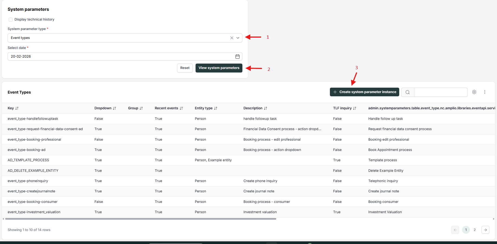
    <h5>Figure 14: Event type admin page.</h5>
    </div>
2. In the form presented fill in the following values:
   - Event type: The event type we want to create (e.g., AD_VACATION_REQUEST).
   - Dropdown: Check this box so that the event is available in the "Actions" dropdown. (This may vary depending on your project's UI.)
   - Menu Type: To determine which menus are eligible for showing the process. You can select more than one, meaning the process can be loaded on multiple pages.
   If left empty, it will be allowed to be mounted in every place.
   - Entity Type: To determine for which entity type this event and process is available. You can select more than one, meaning the process can be started from pages associated with different entities.
   If left empty, the event will not be related to any entity.
   - Tlf inquiry: Used in the Telephonic Inquiry process to select which process to begin.
   - Start/ End date: The time period the event will be eligible.

    For our case the Menu Type will be the Person Overview and the Entity Type will be Person.
    <div style="text-align: center;">

   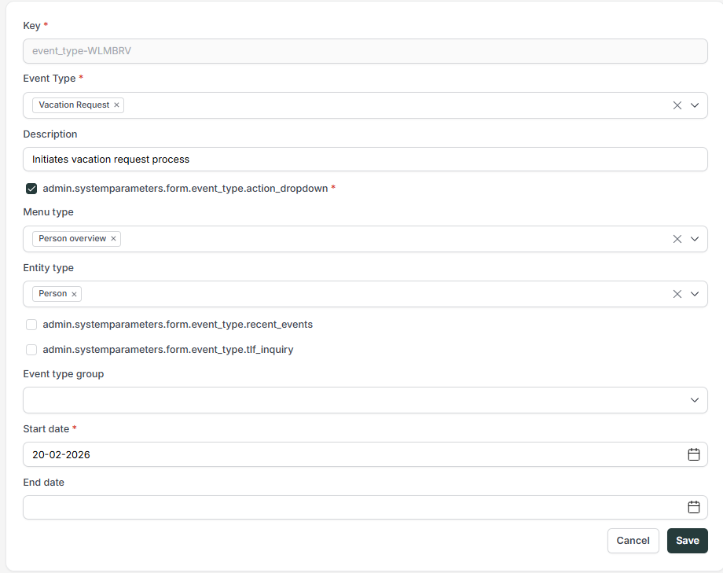
   <h5>Figure 15: Create event type system parameter.</h5>
    </div>

### Creating the Event Subscription System Parameter

1. Navigate back to the system parameters administration page. This time, select Event Plans (the name might be different based on the portal texts of your project) from the dropdown and click "Create system parameter."

    <div style="text-align: center;">

   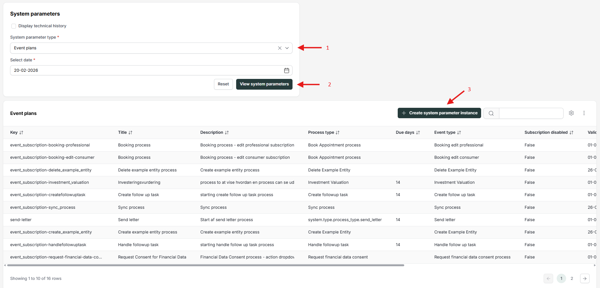
   <h5>Figure 16: Event subscription admin page.</h5>
   </div>
2. In the form presented, you will link the `EventType` you just created to the `ProcessType` defined in your constants file. Fill in the following values:
   - `Title`: Add a descriptive title.
   - `Descriptiom`: Add a descriptive description.
   - `Event Type`: The event type that we want to create the subscription for. Select the `AD_VACATION_REQUEST` `EventType`.
   - `Process Type`: The process type that we want to create the subscription for. Select the `VACATION_REQUEST_PROCESS` ProcessType.
   - `Valid from/ until`: The period for which the subscription will be active.
   <div style="text-align: center;">

   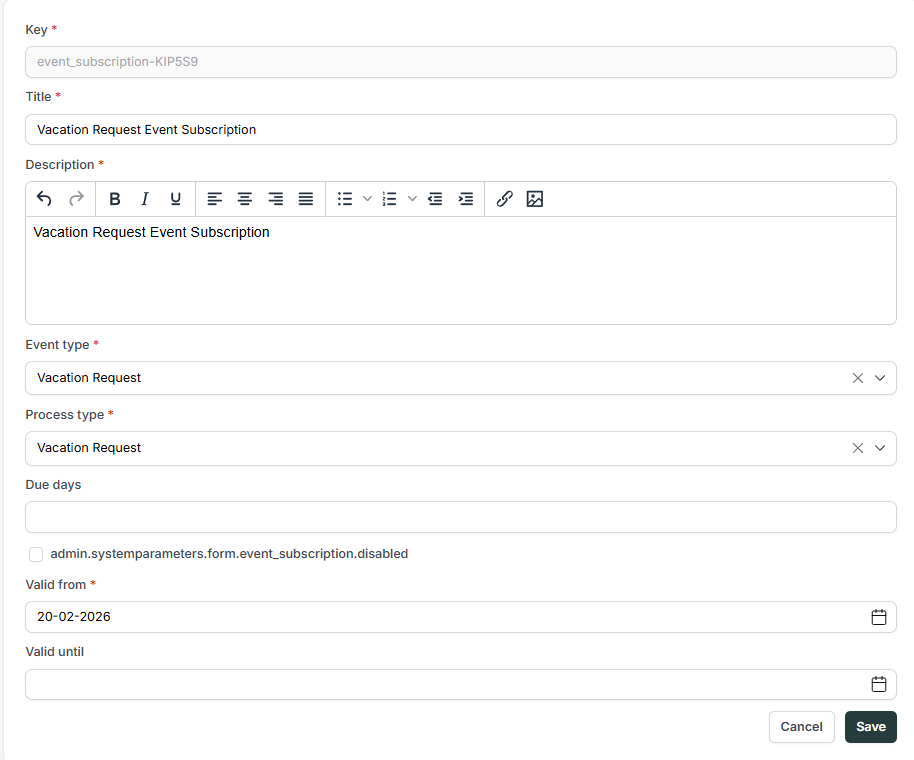
   <h5>Figure 17: Create event subscription system parameter.</h5>
   </div>

Once you save this parameter, the system now knows that whenever the "AD_VACATION_REQUEST" event is triggered,
it must start a new instance of the "VACATION_REQUEST_PROCESS."

### Creating flyway migration files

Once you created the system parameters from the admin page and you verified that they work, then go to the
database tables and extract the rows you crate from the following tables :
- parameter_instance
- parameter_value

IntelliJ has a dropdown in the top right of the table window that allows you to change copy to copy the rows as full
SQL inserts

## Process Engine Cheatsheet

The picture below is a visual quick reference of the Amplio Process Engine concepts, illustrating how processes, tasks, data objects, listeners, and gateways work together during execution.

Use this cheatsheet while developing or reviewing a process to quickly recall the required components, data flow, and execution steps without revisiting the full documentation.

<div style="text-align: center;">

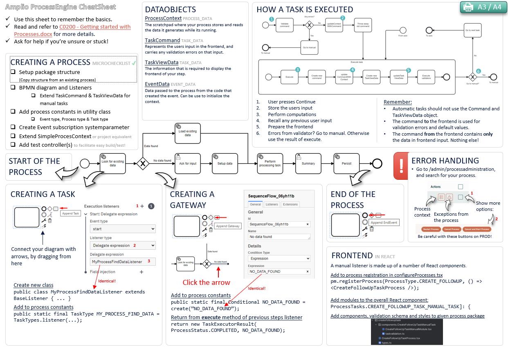
<h5>Figure 18: Process Engine Cheatsheet.</h5>
</div>

# Integrating Process Engine into the Application

In order to be able to integrate the process engine to our application we have to set up the necessary dependencies, configure the necessary tables in the database
and also add the components in FE to display the processes.
### Required Dependencies and Configuration
To enable the Process Engine, you must first add the required dependencies to your backend and frontend projects.

**Backend Setup**
1. **Add Gradle Dependency**: In your `build.gradle` file, you must add the process-processes-common library.
   ```groovy
    dependencies {
        api 'nc.amplio.libraries:process-processes-common'
    }
    ```
2. **Import Application Configuration**: In your Spring Boot application configuration (e.g., BusinessApiConfig.java), you must import the appropriate configuration class:
    - `ProcessEngineConfig.class`: Import this if you only need the backend process engine services.
    - `ProcessEngineRestConfig.class`: Import this if you are integrating with the frontend, as it includes the necessary REST controllers.
   ```java
    @Import({
        //...
        ProcessEngineRestConfig.class,
        ProcessEngineConfig.class,
    })
    @Configuration
    public class BusinessApiConfig {
    }
    ```
**Frontend Setup**

In your frontend project, add the @amplio/process package to your package.json dependencies. This library contains all the necessary React components, hooks, and services for rendering the process UI.
```json
    "dependencies": {
      //...
      "@amplio/process": "x.y.z"
    }
```
## Configure Database Tables

The following tables must be configured in order for the process engine and its related features to function correctly. 
These tables handle the storage of process instances, tasks, events, cases, journal notes, and other related data.

- `CASE_JOURNAL_NOTE_RELATION`
- `CASE`
- `DOCUMENT_RELATION`
- `DRAFT`
- `ENTITY_JOURNAL_NOTE_RELATION`
- `EVENT`
- `JOURNAL_NOTE_RELATION`
- `JOURNAL_NOTE`
- `PROCESS_CASE_RELATION`
- `PROCESS_DATA`
- `PROCESS_ENGINE_SCHEDULER_EVENT`
- `PROCESS_EVENT_RELATION`
- `PROCESS_INTEGRATION_STATUS`
- `PROCESS_JOURNAL_NOTE_RELATION`
- `PROCESS_LETTER_RELATION`
- `PROCESS`
- `TASK_DATA`
- `TASK`

Ensure that your project's database migration scripts (e.g., Flyway scripts) include the creation statements for these tables. You can copy the migration scripts from Amplio's reference app.
   
## Mounting a Process on a Page

There are several ways to initiate a process from the frontend. The most common way is to add a dropdown element with all the processes that can be initiated. Amplio provides two components for this purpose.
1. `<EntityProcessActionsDropdown>` : Use this component if you want to select processes related to a specific entity type.
   ```tsx
    <EntityProcessActionsDropdown
              icon={ChevronDown}
              iconPosition={'right'}
              size={'sm'}
              route={activeTab?.url}
              key={'person-action-dropdown'}
              entityId={personId}
              entityType={PERSON_ENTITY_TYPE}
   />
    ```
2. `<ProcessActionsDropdown>`:  Use this component if you want to show processes that are not related to a specific entity type.
   ```tsx
       <ProcessActionsDropdown
          icon={ChevronDown}
          size={'sm'}
          iconPosition={'right'}
          route={'example_entity'}
          key={'example-action-dropdown'}
        />
    ```

In cases where you don't want a dropdown list and need to initiate a process from another component (like a button), you can use the `createProcess` function. This function takes the following arguments:
This function gets as arguments:
- title: The name of the process.
- eventType: The event type as declared in the `EventType` extendable enum (case-insensitive).
- successCallback: A callback function to be called after the successful creation of the process. Most commonly used for redirects.
- entityId: (Optional) The ID of the entity that initiated the event and the process.
- entityType: (Optional) The type of the entity that initiated the event and the process (case-insensitive).
- secondaryEntities: (Optional) A list of other entities that are related to the event and the process.
- eventData: (Optional) Any data that you want to pass along with the event. It must be a stringified object.

```tsx
  const onSuccessCallback = useCallback(
    (processData: OpenedProcess) => {
        if (!getAbortSignal().aborted) {
            pushIfNotCurrentPath(history, `${location.pathname}?eventId=${processData.eventId}`);
        }
    },
    [history, location.pathname],
);

dispatch(createProcess(
    "VACATION_REQUEST_PROCESS",
    "AD_VACATION_REQUEST",
    onSuccessCallback,
    "2131231", //optional entity id
    "PERSON", // optional entity type
    [
        {
            entityId: caseId,
            entityType: CASE_ENTITY_TYPE,
        }
    ],
    "{employeeId: '123123123'}"
));
```

To display the process UI itself, you can use two main components:
1. `<EntityProcessEngine>`: Use this component to display processes that are specific to an entity. It automatically handles reserving the entity when the process UI is opened.
    ```tsx
    <EntityProcessEngine
            entityId={personId}
            entityType={PERSON_ENTITY_TYPE}
            processEngineFeatures={{ processAssignmentEnabled: true }}
            customizeHeaderMenuElements={elements => [
              ...elements,
              {
                prefixOverride: PortaltextPrefixStore.process.businessApplicationProcessButtons,
                icon: History,
                key: 'assignHistory',
                ptKey: 'assign_history',
                onSelect: () => setAssignmentHistoryPopupOpen(true),
              },
            ]}
      />
   ```
2. `<ProcessEngine>`: Use this component to display processes that are not related to a specific entity.
    ```tsx
     const eventId = useGetProcessEventAtLocation();
   
    {eventId != null && 
    <ProcessEngine
            processEngineFeatures={{ processAssignmentEnabled: true }}
            customizeHeaderMenuElements={elements => [
              ...elements,
              {
                prefixOverride: PortaltextPrefixStore.process.businessApplicationProcessButtons,
                icon: History,
                key: 'assignHistory',
                ptKey: 'assign_history',
                onSelect: () => setAssignmentHistoryPopupOpen(true),
              },
            ]}
      />
   }
    ```


# Standard listeners

One of the key principles of efficient process development in Amplio is reuse. The framework provides a rich library of standard, abstract listeners that encapsulate the logic for common business patterns.
This section serves as a reference guide to these powerful, out-of-the-box listeners. By extending these base classes instead of writing new logic from scratch, 
you can significantly accelerate development, reduce boilerplate code, and ensure your processes are consistent and maintainable.

## Initiate Listener

The `InitiateListener` is the standard, best-practice starting point for nearly every process in Amplio. It is an automatic task that should be the very first step after the Start Event in your BPMN diagram.

Its primary responsibility is to perform initial setup for the process instance. When this listener executes, it automatically performs several foundational actions before handing control over to your custom logic.
- It fetches the Event that triggered the process.
- It inspects the EventType's name to determine how the process was started (e.g., from the self-service portal, an actions dropdown, a batch job, etc.).
- It saves this origin information (ProcessStartSystemType) into the ProcessContext for potential use in later logic.

**How to Extend the Listener**
To use the `InitiateListener`, you create a class that extends it and implement the `customExecuteTask` method. The base class provides the fully loaded ProcessContext and the triggering Event as arguments.

**Example Implementation:**

In this example, the listener uses the `SerializationHelper` to parse the JSON string from the event's `eventData` field into a specific DTO (Data Transfer Object) to populate the context.

```java
@Component
@RequiredArgsConstructor
public class MyProcessInitiateListener extends InitiateListener<MyProcessContext> {

    private final SerializationHelper serializationHelper;

    @Override
    public TaskType getTaskType() {
        return MyProcessConstants.MY_PROCESS_INIT;
    }
    
    @Override
    protected void customExecuteTask(MyProcessContext context, Event event) {
        if (event.getEventData() != null) {
            ExampleEventData payload = (ExampleEventData) serializationHelper.fromString(event.getEventData());
            context.setInitialComment(payload.getComment());
            context.setPriority(payload.getPriority());
        }
    }
}
```
## WaitTaskListener

This listener is used in cases where we want to temporarily pause the process until one or more conditions are met.
It is the ideal solution for handling asynchronous dependencies, such as waiting for a user to upload a document or for a response from an external system.

### Add ProcessCondition
The conditions that the process must meet are defined in a listener before the waiting task. These conditions are added to the `ProcessContext` as `ProcessCondition` objects.
Each `ProcessCondition` is defined by its `ProcessConditionStatus`, which is an `ExtendableEnum`.

The `ProcessCondition` constructor has three main variations:
1. Pass only the `ProcessConditionStatus`.
2. Pass the `ProcessConditionStatus` and a time limit as a LocalDateTime. The `WaitingTaskListener` will only consider the condition valid until this time limit is exceeded.
3. Pass the ``ProcessConditionStatus`` and a time limit as a LocalDate. This is the same as the above, but the time limit is automatically set to the start of the provided day.

You can also chain optional parameters to the constructor:
- `timeLimitEditable`: If you want the user to be able to override the condition's time limit from the UI, set this to true. It is true by default if a time limit has been provided.
- `args`: A map of string arguments that can be passed to a `ProcessConditionValidator` for more complex logic.
- `setDescriptionText`: Sets a portal text key and arguments to display a user-friendly description for the condition in the UI.

Here is an example of how you would add a condition within the execute method of a preceding listener:

```java
ProcessCondition processCondition = new ProcessCondition(MyProcessConditionStatuses.DOCUMENT_UPLOADED, dateProvider.getCurrentDate().plusDays(7))
        .addArg("documentId", document.getId());

processCondition.setDescriptionText("bussiness_application.upload_document", document.getTitle(), document.getType());
context.addProcessCondition(processCondition);
```

Amplio provides some out-of-the-box `ProcessConditionStatus` enums, but you will often create your own. To do so, call the `create()` method as you would for any other `ExtendableEnum`.
The `create()` method has three variations:
1. Pass the enum's key and a `conditionMet` flag. If `conditionMet` is true, this status will allow the process to continue.
2. Pass the key, a `ProcessConditionType`, and the `conditionMet` flag.
3. Pass the key, a `ProcessConditionType`, the `conditionMet` flag, and a `conditionVisible` flag. The `conditionVisible` flag determines if this condition is displayed in the frontend.

To group related `ProcessConditionStatus` enums, you declare a `ProcessConditionType`. The `ProcessConditionType` can also be associated with a `ProcessConditionValidator` for implementing custom validation logic.
The `ProcessConditionValidator` provides three methods to implement:
- `overrideIsDeadlineExceeded`: Returns a boolean declaring if the deadline should be ignored.
- `getStatus`: Contains the core validation logic and returns the corresponding `ProcessConditionStatus`.
- `submit`: Runs after `getStatus` to perform any post-validation logic.

Here is a simple, practical example for `ProcessConditionStatus` and `ProcessConditionType`.
```java
    @StaticInitializer
    @NoArgsConstructor(access = AccessLevel.PRIVATE)
    public final class MyProcessConditionStatuses {
    // 1. Define the ProcessConditionType and link it to our new validator.
    public static final ProcessConditionType DOCUMENT_CONDITIONS = ProcessConditionType.create("DOCUMENT_CONDITIONS", DocumentConditionValidator.class));

    // 2. Define the status for when we are WAITING for the document.
    // conditionMet is 'false', so the process will wait.
    public static final ProcessConditionStatus DOCUMENT_PENDING = ProcessConditionStatus.create("DOCUMENT_PENDING", DOCUMENT_CONDITIONS, false //conditionMet);

    // 3. Define the status for when the document HAS BEEN UPLOADED.
    // conditionMet is 'true', so the process can continue.
    public static final ProcessConditionStatus DOCUMENT_UPLOADED = ProcessConditionStatus.create(
            "DOCUMENT_UPLOADED",
            DOCUMENT_CONDITIONS,
            true // conditionMet
    );

    public static final String CONDITION_ARG_DOCUMENT_TYPE = "documentType";
}
```

```java
@RequiredArgsConstructor
@Component
public class InformationReceivedValidator implements ProcessConditionValidator {

    private final DocumentService documentService;
    private final ExampleMailService exampleMailService;
    private final EventService eventService;

    @Override
    public ProcessConditionStatus getStatus(ProcessCondition condition, SimpleProcessContext context) {
        String documentType = processCondition.getConditionArgs().getOrDefault(MyProcessConditionStatuses.CONDITION_ARG_DOCUMENT_TYPE, null);
        
        Document document = documentService.getDoucmentByType(documentId);
        if (document == null) {
            return MyProcessConditionStatuses.DOCUMENT_PENDING;
        }
        return MyProcessConditionStatuses.DOCUMENT_UPLOADED;
    }
    
    @Override
    public boolean overrideIsDeadlineExceeded(ProcessCondition condition, SimpleProcessContext context) { return false; }
    
    @Override
    public void submit(ProcessCondition condition, SimpleProcessContext context) { 
        if (condition.getStatus() == MyProcessConditionStatuses.DOCUMENT_UPLOADED) {
            eventService.sendEvent(EventTypes.DOCUMENT_RECEIVED);
        }
    }
}
```

### How to extend the listener

To use the WaitingTaskListener, you create a class that extends it and implement the following methods:

- `getTaskType`: The standard method to return the `TaskType` constant for this waiting task.
- `setConditional`: This method is called only when all conditions have been successfully met to decide the `Conditional`, based on the status of the conditions in the context.
- `shouldShowReceipt`: (Optional) This method controls whether the user sees a confirmation (receipt) screen after the waiting task completes automatically. 
By default, it returns true. You can override it to return false if you want the process to continue silently in the background without requiring user interaction.

**Example**

```java
@Component
public class ExampleProcessWaitTaskListener extends WaitTaskListener<ExampleProcessContext, SimpleProcessCommand, WaitTaskViewData> {

    @Override
    public TaskType getTaskType() {
        return ProcessConstants.EXAMPLE_PROCESS_WAIT;
    }

    @Override
    public Conditional setConditional(ExampleProcessContext context) {
        return Conditional.CONTINUE;
    }

    @Override
    public boolean shouldShowReceipt() {
        return true;
    }
}
```

### Frontend Module

To display the waiting task in your process UI, you can use the standard `<WaitTaskModule>` component provided by the `@amplio/process` library. 
This component is designed to automatically render the list of pending conditions that you defined in the backend, including their descriptions and deadlines.
Integrating it into your process is straightforward. In your main process wrapper component, you simply associate your waiting task's TaskType with the `<WaitTaskModule>`.

```tsx
export function ExampleProcess() {

    return (
        <DefaultProcessWrapper prefix={AppPortaltextPrefixStore.process.businessApplicationTemplateProcessFrontend}>
            {{
                // ... other task modules ...
                [ProcessTasks.EXAMPLE_PROCESS_WAIT]: {
                    modules: [
                        form => <WaitTaskModule taskKey={ProcessTasks.EXAMPLE_PROCESS_WAIT} form={form} />,
                    ],
                },
                // rest of tasks
            }}
        </DefaultProcessWrapper>
    );
}
```

### Standard ProcessConditions

Amplio provides several out-of-the-box `ProcessConditionStatus` enums for common waiting scenarios.

- `PENDING_EVENT`: Validates if there is any registered event matching the event specified in the `ProcessCondition` arguments
that was created after the creation time of the current task in the process. If any such event exists it calls the validation method on the
process context with the event and the condition. If the validation succeeds it returns `ProcessConditionType.CONTINUE` else it returns the current status. Supported condition arguments:
  - `eventType`: Specifies the type of the event to check for.
- `CONTINUE`: A generic status indicating that a condition has been successfully met.
- `DEADLINE_EXCEEDED`: A generic status that is typically returned by a validator when the time limit set on a `ProcessCondition` has passed. This status also has its `conditionMet` flag set to true, allowing the process to proceed down a "deadline expired" path.
- `PENDING_OPEN_TASK`: Is used to determine whether a process can proceed based on the presence of another process. Supported condition arguments:
  - `processType` - Specifies the type of the process to be checked.
  - `processId` - Specifies a specific process ID to be checked.
  - `entityId` - Specifies the ID of the entity associated with the referenced process.
  - `entityType` - Specifies the type of the entity associated with the referenced process.
- `PENDING_TIME`: It is used to stop the process for a specific period of time.
- `LETTER_CONDITION`: A condition type used to pause a process after sending a letter. The associated `ProcessLetterConditionValidator` checks the status of the sent letter entity in the database. 
The letter's documentId must be provided as a condition argument. The process continues when the letter's status changes. The statuses for this type are:
  - `PENDING_LETTER`: The initial waiting state, mapping to `LetterStatus.AWAITING_ANSWER`.
  - `REPLY_RECEIVED`: The condition is met because a reply has been registered, mapping to `LetterStatus.ANSWERED`.
  - `LETTER_RETURNED`: The condition is met because the letter was returned, mapping to `LetterStatus.RETURNED`.
  - `RESPONSE_ABANDONED`: The condition is met because the response was abandoned, mapping to `LetterStatus.ANSWER_ABANDONED`.
  - `LetterStatus.DEADLINE_EXCEEDED`: Maps to the generic `ProcessConditionType.DEADLINE_EXCEEDED `status.
- `NO_COMPLETED_TASK`: Is used to determine whether a process can proceed based on the completion time of another process. If such a process exists, the validation passes with status. Supported condition arguments:
  - `processType`: Specifies the type of the process to be checked.
  - `entityId`: Specifies the ID of the entity associated with the referenced process.
  - `entityType`: Specifies the type of the entity associated with the referenced process.
  - `processCompletedAfter`: Specifies the minimum required completion time for the referenced process.

## FourEyesListener

The FourEyesListener is a specialized base listener used to implement the "four-eyes principle." This principle requires that a task be approved or acted upon by a different user than the one who completed the previous task. 
It is a common control mechanism to prevent a single user from performing a critical action without review.

When a process reaches a task implemented with a `FourEyesListener`, the listener automatically performs a validation check. 

**Automatic Actions (from the base class):**
- It compares the username of the current user with the username of the person who created the current task.
- It automatically disables the "Continue" button in the UI if the current user is the same person who created the task.
- It populates the `FourEyesTaskViewData` with the task creator's username and the current user's username, which can be used in the UI.

If the user validation passes, the listener proceeds to execute its main logic. If it fails (i.e., the user is the same), it keeps the task in a manual state, forcing a different user to act on it.

### How to extend the listener

You extend the FourEyesListener to add your own business logic that should occur during the review step.
- `getTaskType`: The standard method to return the `TaskType` constant for this task.
- `customExecuteTask`: (Optional) This method is called only if the user validation passes. By default, it completes the task and returns `TaskExecutorResult(ProcessStatus.COMPLETED, Conditional.CONTINUE)`. 
You can override it to perform custom logic or return a different `TaskExecutorResult`.
- `additionalValidation`: (Optional) This method provides a hook to add more validation rules beyond just checking for a different user. 
For example, you could check if the reviewing user has a specific role or permission. It must return true for the process to continue.

**Example Implementation:**

This example shows a simple extension that adds a validation rule, requiring the reviewer to have an "APPROVER" role.

```java
@Component
public class MyApprovalFourEyesListener extends FourEyesListener<MyProcessContext, SimpleProcessCommand, FourEyesTaskViewData> {

    @Override
    public TaskType getTaskType() {
        return MyProcessConstants.EXAMPLE_PROCESS_FOUR_EYES;
    }
    
    @Override
    protected boolean additionalValidation(MyProcessContext context) {
        returnContextWrapper.get().getSecurityRoles().contains(SecurityRoles.APPROVER);;
    }
    
    
    @Override
    protected TaskExecutorResult customExecuteTask(MyProcessContext context, boolean manualExecution) {
        context.setApproved(true);
        return new TaskExecutorResult(ProcessStatus.COMPLETED, Conditional.CONTINUE);
    }
}
```

### Frontend Module Integration

For the UI, you can use the standard `<FourEyesModule>` component, which is designed to work with this listener.
It automatically displays data from the previous step for review. Alternatively, you can create a custom module if you need a more specific UI for the reviewer.

```tsx
export function ExampleProcess() {
    return (
        <DefaultProcessWrapper prefix={AppPortaltextPrefixStore.process.businessApplicationProcessFrontend}>
            {{
                
                [ProcessTasks.EXAMPLE_PROCESS_FOUR_EYES]: {
                    modules: [() => <FourEyesModule taskKey={ProcessTasks.TEMPLATE_PROCESS_FOUR_EYES} />],
                },
            }}
        </DefaultProcessWrapper>
    );
}
```
## GenerateLetterListener

The `GenerateLetterListener` is a specialized abstract listener designed for any task that involves generating and sending letters within a business workflow. 
It streamlines this process by handling the common logic of letter creation, allowing you to focus on the specific content and recipients.

When a process reaches a task using this listener, it typically presents a user with a standard UI (`<SendLetterModule />`) to preview the letter, 
select recipients, add attachments, and confirm sending.

**Execution Flow**
The GenerateLetterListener follows a distinct execution flow:

1. When the listener first executes, it can be configured to create one or more default letters by implementing the `addLetters` method.
2. The process then enters a manual state, allowing the user to configure the letter(s), add attachments, and finalize the details through the UI.
3. Upon submission, the listener transforms the configured letters into final documents. It uses a specified document template and dynamically populates it with data by merge-fields.
4. Finally, the listener creates `IntegrationIntent` objects for each letter and adds them to the `ProcessContext`. These intents are later picked up by an `IntegrationListener` to handle the actual dispatching (e.g., sending to a print provider).

### How to extend the listener

To use the `GenerateLetterListener`, you must implement several components to define the letter's content, data source, and dispatch behavior.

First, create a class that extends GenerateLetterListener and implement the following methods:
1. `addLetters`: This method allows you to define an initial letter when the listener first executes. 
Here, you can specify the recipient and the document template and then add the letter to the `ProcessContext` using the `addLetterToContext` method.

    ```java
        @Override
        protected void addLetters(TemplateProcessContext context, String processId) {
            Entity entity = context.getEntity().orElseThrow(() -> new CoreException(AmplioErrorCodes.UNEXPECTED_MISSING_ENTITY)).upgrade();
            Recipient letterRecipient = new SimpleRecipient(entity.getSimpleEntity(), entity.getName(), entity.getKeyPrettified());
            addLetterToContext(context, DocumentTemplateDefinitions.TEMPLATE_PROCESS_TEMPLATE, letterRecipient, "");
        }
    ```
2. `resolveOutgoingLetterType`: This method must return the `OutgoingLetterType`, which determines the type of `AbstractOutgoingShipment` to be created for the letter.

    ```java
        @Override
        protected OutgoingLetterType resolveOutgoingLetterType(TemplateProcessContext context) {
            return OutgoingLetterDefinition.SINGLESENDING;
        }
    ```

To create the final `IntegrationIntent` that sends the letter, you must also implement the `ProcessLetterAddonService` and its `prepareShipmentForShipping` method. 
This method maps the generated shipment to a specific integration definition.
```java
   @Override
    public IntegrationIntent prepareShipmentForShipping(OutgoingShipment shipment, Recipient recipient) {
       if (OutgoingLetterDefinition.SINGLESENDING.value.equals(shipment.getShipmentType())) {
            InstantShipmentIntegrationIntent intent = IntegrationIntent.build(IntegrationDefinitions.REMOVE_PRINT_SINGLESENDING);
            intent.shipmentId = shipment.getId();
            return intent;
        }
        return null;
    }

```

Letters use the Aspose framework to dynamically populate document templates with data via merge fields. 
To provide this data, you must implement a data source by creating three key components:

First, create a class that implements the `LetterMergeDataSource` interface. This class will define all the custom fields your letter template requires.
```java
@Getter
@Setter
public class ProcessLetterMergeDataSource implements LetterMergeDataSource {

    private Process process;
    private SimpleProcessContext<?> context;
    private SimpleEntity entity;
}

```

Next, implement the `LetterMergeDataSourceService` and its `createLetterMergeData` method. 
The process engine calls this service to get the correct data source for a given letter. 
The method receives the process context, letter command, and template key, allowing you to fetch all necessary data to populate your `LetterMergeDataSource` implementation.
```java
@Component
@RequiredArgsConstructor
@Transactional
public class LetterMergeDataSourceServiceImpl implements LetterMergeDataSourceService {

    private final SelectorService selectorService;

    @Override
    public LetterMergeDataSource createLetterMergeData(SimpleProcessContext<?> context, LetterCommand letterCommand, TemplateKey templateKey, DocumentLocale documentLocale) {
            Process process = selectorService.getEntityById(Process.class, context.getProcessId());
            ProcessLetterMergeDataSource dataSource = new ProcessLetterMergeDataSource();
            dataSource.setProcess(process);
            dataSource.setContext(context);
            dataSource.setEntity(context.getEntity().orElseGet(null));
            return dataSource;
    }
}
```
Finally, create a concrete class that extends the `AbstractLetterMergeContext` wrapper. This is the final object used by the engine for the merge procedure.
It provides access to built-in functionalities like recipient details and merge question resolution by holding the following fields:

- `LetterMergeDataSource` dataSource: Holds an instance of your custom data source.
- `Recipient` recipient: Stores the recipient's details.
- `TemplateKey` templateKey: Identifies the document template being used.
- `Map<String, Boolean> mergeQuestions`: An internal map to handle conditional merge questions fields in the template.
When extending this class, you must override the following methods:

- `getIdentifier`: Return the identifier of the `LoggableDataSource`.
- `getType`: Return the type of the `LoggableDataSource`.

```java
public class LetterMergeContext extends AbstractLetterMergeContext {

    @Override
    public String getIdentifier() {
        if (getDataSource() instanceof ProcessLetterMergeDataSource processLetterMergeDataSource && processLetterMergeDataSource.getProcess() != null) {
            return processLetterMergeDataSource.getProcess().getCurrentTaskId();
        }
        return UUID.randomUUID().toString();
    }

    @Override
    public String getType() {
        if (getDataSource() instanceof ProcessLetterMergeDataSource processLetterMergeDataSource && processLetterMergeDataSource.getProcess() != null) {
            return processLetterMergeDataSource.getProcess().getType().value;
        }
        return "BATCH_LETTER";
    }

}
```
Finally, to provide the actual values for the merge fields, you can implement a `DomainResolver`. This approach keeps the data-fetching logic separate and reusable.

1. Annotate your implementation with @AnnotatedValueResolver. Inside, use `@ClassPathEntry` to specify the path to the object containing your data. 
The key should be your implementation of `AbstractLetterMergeContext`, and values should be the path to the field you want to access (e.g., "dataSource.loanRegistrationData").
2. Create methods for each merge field and annotate them with `@MergeField("merge-field-name")`. These methods will receive the source object (defined by the path) and should return the value for the field.
3. Implement the `getClassToResolve()` method to return the class of the source object you are resolving.

In the example below, the resolver provides values for a loan template by accessing a `LoanRegistrationData` object, which could be located either directly on the LetterMergeDataSource or on the process context within it.

```java
@Component
@AnnotatedValueResolver(paths = {@ClassPathEntry(key = LetterMergeContext.class, values = {"dataSource.loanRegistrationData", "dataSource.context.loanRegistrationData"})})
@RequiredArgsConstructor
public class LoanDomainValueResolver implements DomainValueResolver<LoanRegistrationData> {

    private final SystemParameterService systemParameterService;
    private final PortalTextService portalTextService;

    @MergeField("loan-registration-loan-type")
    public String getLoanRegistrationLoanType(LoanRegistrationData source) {
        return portalTextService.getPrimaryTextForEnum(source.getLoanAgreementType());
    }

    @MergeField("loan-registration-person-name")
    public String getLoanRegistrationPersonName(LoanRegistrationData source) {
        return source.getApplicantName();
    }

    @Override
    public Class<LoanRegistrationData> getClassToResolve() {
        return LoanRegistrationData.class;
    }
}
```

### Front End Module Integration

The @amplio/process library provides a standard <SendLetterModule /> component that is designed to work directly with the GenerateLetterListener. This module handles the entire user interaction for sending a letter, including:

- Previewing the generated letter document.
- Selecting and managing recipients.
- Adding attachments from various sources.
- Add attachments.

To integrate it into your process, you simply map your letter task's `TaskType` to the `<SendLetterModule /> `in your main process wrapper component .

```java

import { SendLetterModule } from '@amplio/process';

export function MyProcess() {
  return (
    <DefaultProcessWrapper prefix={AppPortaltextPrefixStore.process.businessApplicationMyProcess}>
      {{
        // ... other task modules ...

        [MyProcessTasks.MY_LETTER_TASK]: {
          modules: [(form) => <SendLetterModule form={form} />],
        },

        // ... other task modules ...
      }}
    </DefaultProcessWrapper>
  );
}
```

## IntegrationListener

The `IntegrationListener` is a standard, listener used to execute and monitor integrations with external systems. 
It is the designated pattern for tasks that need to call an outside service, wait for a response, and handle the outcome - whether it's a success, a failure, or a timeout.

This listener is designed to provide a consistent user experience by automatically displaying the status of the integration (e.g., "In Progress," "Completed," "Failed") in the frontend using the standard `<IntegrationsTaskModule />`.

Amplio offers a ready-to-use concrete listener, `IntegrationListener`, which is linked to the `INTEGRATION_TASK` `TaskType`. 
If you need to use a custom `TaskType` or override core functionality (though not recommended), you should extend the `AbstractIntegrationListener` instead.

### How to extend the Listener
The `IntegrationListener` works with `IntegrationIntent` objects. An `IntegrationIntent` is an abstract class that contains:
- `IntegrationType`: An `ΕxtendableEnum` tha determines the type of the intent.
- `processId`: The ID of the current process, automatically populated from the `ContextWrapper`.
- `id`: A unique, randomly generated ID for identification.
- `completed`: A flag indicating if the integration has been completed.
- `attempts`: The number of times the integration intent has been executed.

You must provide your own implementation of `IntegrationIntent` to pass the data required by the integration. 
You should also implement the `canBeSkipped()` method to determine if the process can continue to the next step if this specific integration fails.

```java
@Getter
@Setter
public class ExampleIntegrationIntent extends IntegrationIntent {
    
    private String personName;
    private String personEmail;
    private String documentId;
    
    @Override
    public boolean canBeSkipped() {
        return false;
    }
}
```

With the `IntegrationIntent` model created, you must add instances of it to the process context. This should happen in a listener before the `IntegrationListener` task.

```java
@Component
public class ExampleListener extends AutomaticListener<ExampleProcessContext> {
    @Override
    public TaskType getTaskType() {
        return SyncProcessConstants.EXAMPLE_TASK;
    }

    @Override
    protected void execute(ExampleProcessContext context) {
        context.getIntegrationIntents().addAll(getIntegrationIntents(context));
    }
    
    private List<ExampleIntegrationIntent> getIntegrationIntents(ExampleProcessContext context) {
        List<ExampleIntegrationIntent> intents = new ArrayList<>();
        context.getPersons()
                .stream()
                .forEach(person -> {
                    ExampleIntegrationIntent integrationIntent = IntegrationIntent.build(IntegrationDefinitions.EXAMPLE_INTEGRATION);
                    integrationIntent.setPersonName(person.getName());
                    integrationIntent.setPersonEmail(person.getEmail());
                    integrationIntent.setDocumentId(person.getDocumentId());
                    return integrationIntent;
                });
    }
}
```

The actual integration logic is executed by an `IntegrationExecutor`. Projects must provide their own implementation of this service for each type of intent. It requires two methods:
- `getIntentType()`: This method must return the class of your `IntegrationIntent` implementation. The system uses this to select the correct executor for a given intent.
- `execute(T integrationIntent, int currentTry)`: This is where the actual integration call happens. The method receives the `IntegrationIntent` and the current retry count. 
The logic for how the integration is called (e.g., REST API, database save, email) is up to the project to implement.

The `execute` method must return a ``ProcessIntegrationResult``. There are two implementations:
- `ProcessIntegrationSuccess`: Return this when the integration completes successfully.
- `ProcessIntegrationError`: Return this when the integration fails.

Example `IntegrationExecutor` Implementation:

```java
@Component
public class DummyIntegrationIntentExecutor implements IntegrationExecutor<DummyIntegrationIntent> {
    @Override
    public ProcessIntegrationResult execute(DummyIntegrationIntent intent, int currentTry) {
        try {
            if (currentTry > 2) {
                return checkPreviousExecutions() ? new ProcessIntegrationSuccess(intent) : new ProcessIntegrationError(integrationIntent, AmplioErrorCodes.UNEXPECTED_INTEGRATION_ERROR);
            }
            callRestIntegration(intent.getData());
        } catch (InterruptedException e) {
            throw new CoreException(AmplioErrorCodes.UNEXPECTED_INTEGRATION_ERROR);
        }

        return new ProcessIntegrationSuccess(intent);
    }

    @Override
    public Class<DummyIntegrationIntent> getIntentType() {
        return DummyIntegrationIntent.class;
    }
}
```

The `IntegrationListener` behavior can be fine-tuned using the following system parameters:
- `PROCESS_MAX_CONSECUTIVE_INTEGRATION_RETRIES`: A `SYSTEM_CONSTANT` that defines the maximum number of times an integration will be retried (default: 2).
- `PROCESS_INTEGRATION_TIMEOUT_SECONDS`: A `SYSTEM_CONSTANT` that specifies the time limit in seconds that an integration can run before it is considered failed (default 15s).
- `PROCESS_INTEGRATION_WAIT_BEFORE_MANUAL_TIMEOUT_SECONDS`: A `SYSTEM_CONSTANT` that specifies how long the listener waits for all integrations to complete before returning control to the user (default: 2s).

For more information about the inner workings of the `IntegrationListener`, you can check the [DD130-Process Engine](../DD130-Detailed-Design/Process-Engine.md#integrations).

### Frontend Module Integration

The `@amplio/process` library provides a standard `<IntegrationsTaskModule />` component designed to work directly with the IntegrationListener. 
This module automatically polls for the status of the integration(s) and displays it to the user, providing a seamless and consistent UI for all integration tasks.

To use it, simply map your integration task's TaskType to the `<IntegrationsTaskModule />` in your main process wrapper component. If you use the provided `IntegrationListener`
you should use the `AmplioProcessTasks.INTEGRATION_TASK` as the `TaskType`.

```tsx
import { IntegrationsTaskModule } from '@amplio/process';
// ... other imports

export function MyProcess() {
  return (
    <DefaultProcessWrapper prefix={AppPortaltextPrefixStore.process.businessApplicationMyProcess}>
      {{
        // ... other task modules ...

        [AmplioProcessTasks.INTEGRATION_TASK]: {
          modules: [() => <IntegrationsTaskModule taskName={AmplioProcessTasks.INTEGRATION_TASK} key={11} />],
        },

        // ... other task modules ...
      }}
    </DefaultProcessWrapper>
  );
}
```

## RegisterDataListener

The `RegisterDataListener` is a standard, abstract listener designed for the final, automatic step in most processes. 
Its single, critical responsibility is to persist the final state of the workflow. This typically involves taking the completed data from the `ProcessContext` and saving it to the database by creating or updating business entities.
Using the `RegisterDataListener` as the concluding task is a best practice because it formally ends the process and often triggers a subsequent event to notify other parts of the system that the workflow has finished successfully.

### How to extend the listener
To use the `RegisterDataListener`, you create a class that extends it and override two key methods.
- `getTaskType()`: The standard method to return the `TaskType` constant for this final registration task. 
- `registerData(C context, boolean manualExecution)`: This is the core method where you implement your persistence logic. It receives the final `ProcessContext`, which contains all the data gathered throughout the process. 
Here, you will typically call a service to create and save your final business entities to the database. 
- `getProcessRegisteredEvent(C context)`: (Optional) After the data has been successfully registered, this method is called. 
You should return an `EventType` here if you want to signal the completion of the process to other system components or trigger a new workflow.

`RegisterDataListener` extends `FollowUpEventListener` so when extend the first one you get the functionality of the second one too.

This example shows a single listener, FinalizeOrderListener, that uses the combined functionality of the `RegisterDataListener` to finalize a customer order. It will:
1. Save the final Order entity to the database.
2. Signal that the order process is complete.
3. Conditionally create a follow-up event to notify the finance department if the order value is high.

```java
@Component
public class FinalizeOrderListener extends RegisterDataListener<OrderProcessContext> {

    private final OrderService orderService;
    private static final double HIGH_VALUE_THRESHOLD = 10000.00;

    @Override
    public TaskType getTaskType() {
        return OrderProcessConstants.FINALIZE_ORDER_TASK;
    }
    
    @Override
    protected void registerData(OrderProcessContext context, boolean manualExecution) {
        orderService.saveFinalOrder(context);
    }
    
    @Override
    protected EventType getProcessRegisteredEvent(OrderProcessContext context) {
        return OrderProcessConstants.ORDER_REGISTERED;
    }

    @Override
    protected void determineFollowUpEvents(OrderProcessContext context, boolean manualExecution, List<CreateEventParametersBuilder> followUpEvents) {
        if (context.getOrderValue() > 10000.00) {
            FinaceHighValueOrderEventData eventData = new FinaceHighValueOrderEventData(context.getOrderValue());
            CreateEventParametersBuilder eventBuilder = new CreateEventParametersBuilder.getBuilder(EventTypes.NOTIFY_FINANCE_HIGH_VALUE_ORDER)
                    .withEntity(context.getEntity().orElse(null))
                    .withEventData(eventData);

            followUpEvents.add(eventBuilder);
        }
    }
    
}
```
## CheckForNewEventsListener

The CheckForNewEventsListener is a listener that checks whether there is an event occured for a collection of specified entities since a checkpoint.
If an event is found then the process will continue based on the conditional that is returned by the `getCheckForNewEventsConditional`. 
If none is found then the task will be completed with conditional `CONTINUE`.

### How to extend the listener

To use the `CheckForNewEventsListener`, you create a class that extends it and implement two required methods.
- `getTaskType()`: The standard method to return the `TaskType` constant for this check.
- `getAllEntities(TProcessContext context`): This is the core configuration method. You must return a `List<SimpleEntity> `containing all the entities that we want to search events for.
The listener will query for new events related to these specific entities.
- `getCheckForNewEventsConditional()`: You must return the `Conditional` that the process engine will use to direct the flow of the process. This conditional is only used if new events are found.
- `customExecute(TProcesContext context, EventsSinceCalculationCommand command)`: (Optional) Override this method to perform custom logic after the listener has checked for new events, but before it decides whether to turn back.
For example, you can inspect the command object, which contains the list of newly found events, and decide to ignore some of them based on your own business rules by removing them from `command.getEvents()`.
- `updateContextEventFound(TProcessContext context, EventsSinceCalculationCommand command)`: (Optional) This method is called only if new events are found and the process is about to be change its flow. 
Override it to update the `ProcessContext` with information about the new events.
- `isThereOtherReasonToTurnBack(...)`: (Optional) Override this method and return true if you need to force a change in the process flow for reasons other than a new event.

```java
@Component
public class MyProcessCheckForNewEventsListener extends CheckForNewEventsListener<MyProcessContext> {

    @Override
    public TaskType getTaskType() {
        return MyProcessConstants.CHECK_FOR_NEW_EVENTS_TASK;
    }

    @Override
    protected List<SimpleEntity> getAllEntities(MyProcessContext context) {
        return context.getApplicants()
                .stream()
                .map(applicant -> new SimpleEntity(EntityDefinitions.APPLICANT, applicant.getId()))
                .toList();
    }

    @Override
    public void customExecute(TemplateProcessContext context, EventsSinceCalculationCommand command) {
        command.getEvents().removeIf(eventCommand -> eventCommand.getEventType().equals(MyProcessConstants.APPLICATION_ACCEPTED));
    }

    @Override
    protected Conditional getCheckForNewEventsConditional() {
        return MyProcessConstants.GO_BACK;
    }
}
```
# Process Advanced Topics

Now that you have a solid understanding of how to design and implement a standard business process,
this section covers more advanced topics. Here, you will learn how to enhance your workflows with additional features,
handle complex scenarios, and apply best practices for creating robust, production-ready processes.

## Customizing Your Process

While the standard components provide a consistent user experience, the Amplio framework offers several ways to customize the behavior and UI of your process on a per-task basis.
This section details how to configure process buttons and create custom form fields.

### Buttons configuration

Amplio provides the ability to show, hide, or alter the functionality of the standard process buttons by overriding a configuration method in your listener.

Every listener can override the `getButtonConfig` method to return a custom `ProcessButtonConfig` object. 
This object has the following boolean flags that you can use to configure the process UI for a specific task:

Every listener can override the `getButtonConfig` method to configure the `ProcessButtonConfig`.  
The `ProcessButtonConfig`  has the following flags that can be used to configure the process UI.
- `showPostponeProcessingButton`: If true, it shows a "Postpone" button. Clicking this opens a pop-up where the user can select a future date. 
The process will then enter a `PENDING_TIME` status and will only become active again on that date.
  <div style="text-align: center;">

  
  <h5>Figure 19: Postpone process button.</h5>
  </div>

- `showJournalNoteButton`: If true, it shows the "Add Journal Note" button at the bottom of the process module.
  <div style="text-align: center;">

  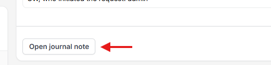
  <h5>Figure 20: Add journal note button.</h5>
  </div>
- `showRetrieveInformationButton`:  If true, it shows a button in the process header that opens the "Send Letter" overlay.
    <div style="text-align: center;">

    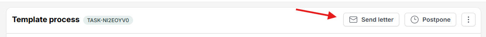
    <h5>Figure 21: Open send letter overlay button.</h5>
    </div>
- `showCancelButton`: If true, it shows the "Cancel" (or "Discard Changes") button at the bottom of the process module.
  <div style="text-align: center;">

  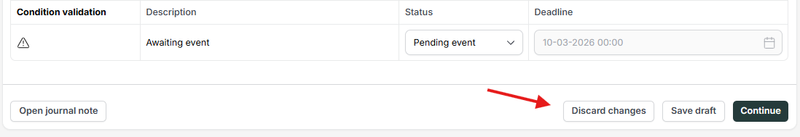
  <h5>Figure 22: Discard changes button.</h5>
  </div>
- `disableCancelProcessPopUp`: This flag determines the behavior of the "Cancel" button:
  - If true, clicking "Cancel" will immediately discard any draft changes or delete the process entirely (depending on its state).
  - If false (the default), clicking "Cancel" will open a pop-up with two options:
    1. Discard changes/delete the process.
    2. Save the current draft and close the process.

- `showCancelAndSaveButton` : If true, it shows the "Save and Close" button, allowing the user to save their progress and exit the process without completing the task.
  <div style="text-align: center;">

  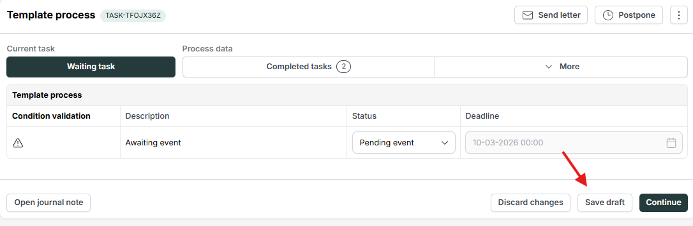
  <h5>Figure 23: Save draft button.</h5>
  </div>
- `showApproveButton`:  If true, it shows the "Approve" button, which is typically used for approval-specific tasks.
    <div style="text-align: center;">

    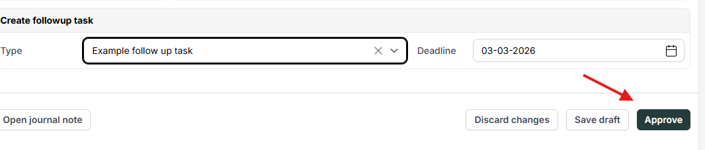
    <h5>Figure 24: Approval button.</h5>
    </div>
- `showContinueButton`: If true, it shows the standard "Continue" button for proceeding to the next step in the workflow.
    <div style="text-align: center;">

  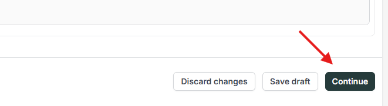
  <h5>Figure 25: Continue button.</h5>
  </div>
- `navigateToTop`: If true, the window will automatically scroll to the top of the page when the "Cancel" button is clicked.

The following example shows an implementation that displays the "Approve" button but hides the postpone, send letter, and save draft buttons.
It also configures the cancel button to act immediately without a pop-up.

```java
    @Override
    public ProcessButtonConfig getButtonConfig(SimpleProcessContext<?> processContext, SimpleProcessCommand command) {
        return new ProcessButtonConfig()
                .withShowPostponeProcessingButton(false)
                .withShowRetrieveInformationButton(false)
                .withShowApproveButton(true)
                .withDisableCancelProcessPopUp(true)
                .withShowCancelAndSaveButton(false);
    }
```
#### Updating process metadata

An additional customization option available in the process header is the ability to change the metadata of the process itself (e.g., its priority, due date, or category).
For this "Update metadata" option to be available in the header menu, the user must have the `SR_CHANGE_METADATA` security role. When clicked, a form is displayed allowing the user to view and edit the configured metadata fields.
<div style="text-align: center;">

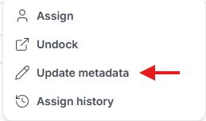
<h5>Figure 26: Update metadata option.</h5>
</div>

Which metadata fields can be changed is entirely up to the project to define. 
To configure the form's fields and how they update the process, you must implement the `ProcessChangeMetadataFieldService`.


This service provides the following methods for you to implement:
- `getTask(String taskId)`: Used to retrieve a project-specific task instance (Process).
- `getTasks(List<String> taskIds)`: Used to retrieve multiple project-specific task instances (Process).
- `getFields()`: Defines which task metadata fields the project supports updating. Each field will have a name
  and a data type. Fields representing enumerations will also have a list of possible values populated
  that the UI can use to populate a suitable dropdown menu for choosing values.
- `getFieldValue(String fieldName, T task)`: Defines how a named field should be retrieved from a project-specific task instance (Process).
- `setFieldValue(String fieldName, Object value, T task)`: Defines how to update a named field on a project-specific task instance (Process).
- `isFieldUpdateAllowed(String fieldName, Object prevValue, Object newValue, T task)`: Checks if project-specific business rules allows updating the given metadata field on the given task
  to the given value. Allows projects to implement custom security rules if needed.

Below is an example implementation that configures the metadata form to include fields for the process title, category, priority, due date, and created date.
In this configuration, the process title and created date are set as read-only by passing false as the last parameter of the `TaskMetadataFieldDto` constructor.

```java
@Service
@Transactional
@RequiredArgsConstructor
public class ProcessChangeMetadataFieldServiceImpl implements ProcessChangeMetadataFieldService<Process> {
    private final SystemParameterService systemParameterService;
    private final SelectorService selectorService;
    private final PriorityService priorityService;
    private final PortalTextService portalTextService;

    private static final String FIELD_CATEGORY = "category";
    private static final String FIELD_PRIORITY = "priority";
    private static final String FIELD_DUE_DATE = "due_date";
    private static final String FIELD_CREATED_DATE = "created_date";
    private static final String FIELD_TITLE = "title";

    @Override
    public Process getTask(String taskId) {
        return selectorService.getEntityById(Process.class, taskId);
    }

    @Override
    public List<Process> getTasks(List<String> taskIds) {
        return selectorService.getEntitiesByIds(Process.class, taskIds);
    }

    @Override
    public Object getFieldValue(String fieldName, Process process) {
        if (FIELD_TITLE.equals(fieldName)) {
            return process.getType();
        }
        if (FIELD_CATEGORY.equals(fieldName)) {
            return process.getCategory();
        }
        if (FIELD_PRIORITY.equals(fieldName)) {
            return String.valueOf(priorityService.getPriority(process).getCode());
        }
        if (FIELD_DUE_DATE.equals(fieldName)) {
            return process.getDueDate().format(DateTimeFormatter.ofPattern("yyyy-MM-dd"));
        }
        if (FIELD_CREATED_DATE.equals(fieldName)) {
            return process.getCreated().format(DateTimeFormatter.ofPattern("yyyy-MM-dd"));
        }
        return null;
    }

    @Override
    public void setFieldValue(String fieldName, Object value, Process process) {
        if (FIELD_CATEGORY.equals(fieldName)) {
            process.setCategory((String) value);
        }
        if (FIELD_PRIORITY.equals(fieldName)) {
            if (value == null) {
                process.setPriority(null);
            } else if (value instanceof String priority) {
                process.setPriority(Long.valueOf(priority));
            } else {
                throw new CoreException(ErrorCodes.UNEXPECTED_SYSTEM_ERROR, "Value object for field '{0}' had type {1} but expected String", FIELD_PRIORITY,
                        value.getClass().getName());
            }
        }
        if (FIELD_DUE_DATE.equals(fieldName)) {
            if (value == null) {
                process.setDueDate(null);
            } else if (value instanceof String dueDate) {
                if (dueDate.isEmpty()) {
                    process.setDueDate(null);
                } else {
                    process.setDueDate(LocalDate.parse(dueDate));
                }
            } else {
                throw new CoreException(ErrorCodes.UNEXPECTED_SYSTEM_ERROR, "Value object for field '{0}' had type {1} but expected Integer", FIELD_DUE_DATE,
                        value.getClass().getName());
            }
        }
    }

    @Override
    public List<TaskMetadataFieldDto> getFields() {
        List<TaskMetadataFieldDto> fields = new ArrayList<>();
        fields.add(new TaskMetadataFieldDto(FIELD_TITLE, MetadataFieldType.STRING, false));
        fields.add(getFieldFromSystemParameter(FIELD_CATEGORY, TASK_CATEGORY.getKey(), "name"));
        fields.add(getFieldForPriority(FIELD_PRIORITY));
        fields.add(new TaskMetadataFieldDto(FIELD_DUE_DATE, MetadataFieldType.DATE, true));
        fields.add(new TaskMetadataFieldDto(FIELD_CREATED_DATE, MetadataFieldType.DATE, false));
        return fields;
    }

    @Override
    public boolean isFieldUpdateAllowed(String fieldName, Object prevValue, Object newValue, Process process) {
        return true;
    }

    private TaskMetadataFieldDto getFieldFromSystemParameter(String fieldName, String systemParameterTypeName, String displayValueFieldName) {
        List<SystemParameter> params = systemParameterService.getSystemParameters(systemParameterTypeName, TimeFactory.getDate());
        TaskMetadataFieldDto field = new TaskMetadataFieldDto();
        field.setFieldName(fieldName);
        field.setPossibleValues(params.stream().map(p ->
                new PossibleValueDto(p.getKey(), p.getParameterValue(displayValueFieldName))
        ).collect(Collectors.toList()));
        field.setFieldType(MetadataFieldType.ENUM);
        field.setAllowChanges(true);
        return field;
    }

    private TaskMetadataFieldDto getFieldForPriority(String fieldName) {
        TaskMetadataFieldDto field = new TaskMetadataFieldDto();
        field.setFieldName(fieldName);
        field.setPossibleValues(priorityService.getPriorityValues().stream()
                .map(priorityType -> new PossibleValueDto(
                        String.valueOf(priorityType.getCode()),
                        portalTextService.getPrimaryTextForExtendableEnum(priorityType)
                ))
                .sorted(Comparator.comparing(PossibleValueDto::getKey))
                .collect(Collectors.toList()));
        field.setFieldType(MetadataFieldType.ENUM);
        field.setAllowChanges(true);
        return field;
    }
}
```
### Configuring the DefaultProcessWrapper

The `<DefaultProcessWrapper>` is the main component for rendering a process UI. 
It accepts a number of props that allow you to customize its behavior, 
appearance, and features. This section provides an overview of the key configuration props.

```tsx
export function MyProcess() {
  return (
      <DefaultProcessWrapper
          prefix="my_process_portaltext_prefix"
          cleanCommandOnContinue={true}
          customTopModule={<MyCustomHeader />}
          processFeatures={{ disableAutoSavingProcessDraft: true }}
          // ... other props
      >
          {{
              [VacationProcessTasks.VACATION_REQUEST_SUBMIT]: {
                  modules: [() => <SubmitVacationRequestModule key={1} />],
                  moduleValidationSchema: myCustomValidationSchema,
              },
              [VacationProcessTasks.VACATION_REQUEST_FOUR_EYES_TASK]: {
                  modules: [() => <FourEyesModule taskKey={VacationProcessTasks.VACATION_REQUEST_FOUR_EYES_TASK} />],
              },
          }}
      </DefaultProcessWrapper>
  );
}
```
**ModuleConfig Properties**
Each task is configured using a `ModuleConfig` object with the following optional properties:

`moduleValidationSchema`
  - **Type**: ZodObject
  - **Purpose**: Provides a Zod schema for client-side validation specific to this task. 
  Τhis schema is automatically merged with the defaultProcessSchema (which handles validation for letters, journal notes, etc.) 
  to create the complete validation rules for the task.

`customCommand`
  - **Type**: `SimpleProcessCommand`
  - **Purpose**: Used to define custom initial values for the process form.

`customReducer`
  - **Type**: boolean 
  - **Purpose**: This flag is used in conjunction with `customCommand`. It signals to the process wrapper that it should wait for the customCommand prop to be populated before rendering the form.

**Key Configuration Props**

`prefix`
 - **Type**: string
 - **Purpose**: Sets the base portaltext prefix for all standard UI elements within the process wrapper, such as buttons and titles.

`customTopModule`
- **Type**: React.ReactNode
- **Purpose**: Allows you to inject a custom React component that will be rendered at the very top of the process UI,
above the task modules. This is useful for displaying a custom header, banner, or other contextual information.

`loadingProcess`
- **Type**: boolean
- **Purpose**: A flag to manually control the loading state (shimmer effect) of the process wrapper. This is useful if your page has its own loading logic that needs to be coordinated with the process UI.

`cleanCommandOnContinue`
  - **Type**: boolean
  - **Purpose**: When true (default is false), this prop ensures that only data from currently rendered form fields is sent to the backend when the user continues. 
  It "cleans" the command object by removing data from fields that are conditionally rendered, preventing unexpected data to be passed to the listener ([check FPInputWrapper](#creating-custom-form-fields)).

`processFeatures`
  - **Type**: ProcessFeatures
  - **Purpose**: An object used to enable or disable specific built-in features of the process engine.
     - `disableAutoSavingProcessDraft`: (Default: false) Set to true to turn off the automatic debounced saving of the process draft as the user types.
     - `disableUndockProcess`: (Default: false) Set to true to prevent the process from being "undocked" into a separate window.
     - `disableCompletedTasksModuleView`: (Default: false) Set to true to hide the "Completed Tasks" view.
     - `disableIntegrationStatusModuleView`: (Default: false) Set to true to hide the "Integration Statuses" option in the header menu.

`processes`
  - **Type**: any[]
  - **Purpose**: An array of all currently active processes for the entity. This is used by the "Next Process" button on the completion screen to determine if there are other processes to navigate to.

`commonModulesConfig`
  - **Type**: CommonModulesConfig
  - **Purpose**: An object to configure the visibility of common modules. The primary use is `showIntegrationStatusWrapper` to control the visibility of the integration status pop-up.

`redirectPathOnClose`

   - **Type**: string
   - **Purpose**: Specifies the URL path to redirect the user to when they close the process (e.g., by clicking the final "Close" button).

`taskTrayUrl`

- **Type**: string (Default: '/tasktray')
- **Purpose**: Defines the URL for the "Go to Task Tray" button that appears on the process completion screen.

`processValidationSchema`
  - **Type**: (taskSchema: ZodObject) => ZodObject
  - **Purpose**: A function that takes the Zod validation schema from the current task module and merges it with the default process schema (which includes validation for letters, journal notes, etc.). 
  This allows you to extend the base validation with your own custom rules.

`scrollToTaskProps`
  - **Type**: ScrollToTaskProps
  - **Purpose**: An object to configure the automatic scrolling behavior of the process UI.
    - `enable`: (Default: true) Enables or disables the auto-scroll feature.
    - `scrollMarginTop`: (Default: -100) A pixel value to control the top margin when scrolling to a task, useful for accommodating fixed headers.

`customProcessHeaderDropdownAction`
  - **Type**: MenuElement[]
  - **Purpose**: Allows you to add custom actions to the "More" dropdown menu in the process header. Each MenuElement object defines an item's icon, text key, and onSelect handler.

### Creating Custom Form Fields

While Amplio provides a rich library of standard form components (like `FPDateInput`), you will often need to create custom, reusable form fields to meet specific business requirements.
This section guides you through the standard pattern for creating a custom field. 
The key is to build a component that correctly interacts with the underlying form state managed by TanStack Form and integrates with the
Amplio process engine's own wrapper for advanced error handling.
To make any component compatible with the Amplio Process Engine—handling state, validation errors from the backend, and read-only modes—you must wrap it using the standard `FPInputWrapper`.

#### How to create a custom form field

**The FPInputWrapper Pattern**

The `FPInputWrapper` acts as a bridge between the process engine's state management (TanStack Form) and your component. It automatically handles:
- **Error Mapping**: It connects the backend `ValidationObject` errors (passed via `errorFieldName`) to the component's invalid state.
- **Read-Only Logic**: It respects the process's current state (e.g., disabling inputs when the task is in read only mode).
- **Subscription Managing**: It enables or disables the subscription of the field to the `ProcessCommand` 
object by setting the `toggleComponentSubscription` prop ([check cleanCommandOnContinue](#configuring-the-defaultprocesswrapper)).

**Example: Creating a Custom Text Input Wrapper**

Assuming you already have a form-aware component (e.g., CustomFormTextInput that uses useFieldContext),
here is how you create the final wrapper to use in your process modules.

Create a new file, for example, `CustomFPTextInput.tsx`:
```tsx
 import { FPInputWrapper, FPInputProps } from 'process/components/form/inputs/FPInputWrapper';
 import { CustomFormTextInput, CustomFormTextInputProps } from './CustomFormTextInput';

 export type CustomFPTextInputProps = CustomFormTextInputProps & FPInputProps;
 
 export function CustomFPTextInput({
 id,
 errorFieldName,
 ...inputProps
 }: Readonly<CustomFPTextInputProps>) {

 return (
     <FPInputWrapper
         id={id}
         errorFieldName={errorFieldName}
         childProps={{ ...inputProps }}
     >
     {childProps => (
         <CustomFormTextInput {...childProps} />
     )}
     </FPInputWrapper>
 );
 }
 ```

**Using the Custom Field in a Process Module**
Finally, use your `CustomFPTextInput` inside a manual task module. You must wrap it in `<form.AppField>` to connect it to the correct field in your `SimpleProcessCommand`.
```tsx

 // ... inside your module component ...
 const form = useGetProcessForm<SubmitVacationProcessCommand>();
// ... rest of code ...

 <form.AppField name={'requesterName.currentValue'}>
 {field => (
     <CustomFPTextInput
         id="requester_name"
         errorFieldName="requesterName.error"
     />
 )}
 </form.AppField>
 ```

### Using Process Lifecycle Triggers
The Process Engine provides a set of trigger interfaces that allow developers to hook into key moments of a process's lifecycle. 
By creating Spring beans that implement these interfaces, you can add custom logic that executes automatically when a specific event occurs, such as process creation, completion, or deletion.

The process engine will automatically detect and execute all beans that implement these trigger interfaces.

#### OnProcessCreateTrigger
This trigger is invoked immediately after a new Process instance has been created and persisted. It is ideal for performing initialization logic.

- **Use Case**: Setting up an initial assignment, creating related entities, or logging the process start.
- **Method**: `onCreateProcess(@NotNull Process process)`

#### BeforeProcessCompleteTrigger
This trigger is invoked just before a process's status is set to `COMPLETED`. This happens when the final task in the workflow finishes.

- **Use Case**: Performing additional processing or side effects such as notifications, logging, persistence of related data or similar before the process officially ends.
- **Method**: `beforeProcessComplete(@NotNull Process process)`

#### BeforeProcessDeleteTrigger
This trigger is invoked right before a Process instance is permanently deleted from the database.

- **Use Case**: Cleaning up dependent data, such as deleting related journal notes, assignments, or other associated records to prevent orphaned data.
- **Method**: `beforeDeleteProcess(@NotNull Process process)`

#### BeforeProcessRollbackTrigger
This trigger is invoked when a user navigates backward in a process, before the process state is rolled back to a previous point in time.

- **Use Case**: Deleting data that was created in the steps being "undone," such as removing journal notes or related entities added after the rollback point.
- **Method**: `beforeRollbackProcess(@NotNull Process process, @NotNull LocalDateTime rollbackLimit)`

#### OnTaskCreateTrigger
This trigger is invoked immediately after a new `Task` instance is created as the process moves from one step to the next.

- **Use Case**: Logging the creation of a specific task or initializing task-specific metadata.
- **Method**: `onTaskCreate(@NotNull Task task)`

#### OnTaskExecutionCompletedTrigger
This trigger is invoked after a task has been executed and the `ProcessContext` has been updated, but before the transaction is committed.

- **Use Case**: Performing additional state updates  on the `Process` entity or `ProcessContext` based on the result of the completed task.
- **Method**: `onTaskExecutionCompleted(@NotNull Process process, @NotNull SimpleProcessContext<?> context)`.

#### BeforeTasksDeleteTrigger
This trigger is invoked before one or more tasks associated with a process are deleted, which typically happens during a rollback.

- **Use Case**: Performing cleanup on data specifically related to the tasks being deleted.
- **Method**: `beforeTasksDelete(@NotNull Process process, @NotNull List<String> taskIds)`

#### OnProcessInterruptAndSave
This trigger is invoked when a user manually chooses to "Save Draft and Close" a process from the UI without completing the current task.

- **Use Case**: Logging that a user has paused their work, sending a notification, or saving related data that is not part of the main process context.
- **Method**: `onProcessInterruptAndSave(@NotNull Process process, @NotNull SimpleProcessCommand command)`

#### BeforeProcessSaveAndCloseTrigger
This trigger is similar to `OnProcessInterruptAndSave` but is invoked specifically during the "save and close" operation. 
The key difference is that this trigger is designed to operate on the SimpleProcessCommand and should not modify the process state directly.

- **Use Case**: Performing last-minute modifications or validation on the command object before the draft is saved.
- **Method**: `beforeProcessSaveAndClose(@NotNull Process process, @NotNull SimpleProcessCommand command)`

## Process Assignment

Process Assignment is an optional feature that allows processes to be assigned to specific users or groups, 
providing granular control over who can modify a process. 
This is used both for restricting access and for coordinating workload.

This section outlines the necessary steps to enable and use the process assignment feature. 
For a more detailed explanation of the underlying architecture, concepts like `Assignable`, `Assignee`, and `Assignment`, 
and examples on how to implement the necessary classes
please refer to the [DD130 - Process Assignment](../DD130-Detailed-Design/Process-Assignment.md) document.

### Backend Implementation
To enable the feature, you must add the Gradle dependencies and configure the necessary classes.

1. **Add Gradle Dependencies**
   You must add the `nc.amplio.libraries:process-features-assignment-service` module to your project. 
    If you plan to use the default REST endpoints for the UI, you should instead add `nc.amplio.libraries:process-features--assignment-rest`,
    which includes the service module automatically.

2. **Import Application Configuration**
   In your Spring Boot application configuration, you must import `ProcessAssignmentConfig.class` and, 
   if using the REST module, `ProcessAssignmentRestConfig.class`.
   ```java
    @Import({
        //...
        ProcessAssignmentRestConfig.class,
        ProcessAssignmentRestConfig.class,
    })
    @Configuration
    public class BusinessApiConfig {
    }
    ```
3. **Implement Core Domain Models**
   Your project must provide concrete implementations for the core assignment models.
   The Process entity must implement the `AssignableProcess<Process>` interface, which links it to the assignment framework.
    - `AssignableProcess`: Your Process entity must implement this interface, which includes managing its collection of assignments.
   ```java
        // In your Process.java entity
    @OneToMany(fetch = FetchType.LAZY, mappedBy = "assigned")
    private Set<ProcessAssignment> assignments = new HashSet<>(0);

    @Override
    public <E extends Assignment<Process>> Optional<E> getAssignment() {
        // ... implementation to return the current valid assignment
    }

    ```
    - `Assignment`: Create an entity (e.g., ProcessAssignment) that implements `Assignment<Process>` to represent the link between a process and its assignee.
    - `Assignee` & `Assigner`: Create DTOs or entities that implement these interfaces to represent the user or group holding or creating the assignment.
4. **Implement Required Services**
   The framework requires implementations for two mandatory services and one optional service.
   - `AssignmentAuthorizationService` : Implement `AssignmentAuthorizationService<AssignableProcess<?>>` to define the access control rules. 
   This service determines who has read, write, and assignment rights for a given process.
    ```java
    @Service
    public class ProcessAssignmentAuthorizationServiceImpl implements AssignmentAuthorizationService<AssignableProcess<?>> {
        @Override
        public boolean hasAssignableWriteAccess(AssignableProcess<?> assignable) {
            // Example: Allow access if no assignment exists or if the current user holds the assignment
            return assignable.getAssignment().isEmpty()
                    || assignable.getAssignment()
                    .map(assignment -> SecurityHelper.getLoginId().equals(assignment.getAssignedTo().getId()))
                    .orElse(false);
        }
        // ... other methods
    }
    ```
   - `AssignmentService` (Mandatory): Implement AssignmentService for your Process and AssignmentCommand types. 
   This service handles the assignment lifecycle, such as creating an initial assignment when a process starts (`initializeAssignment`)
   and updating it when a user reassigns it (`assign`).
   - `ProcessAssignmentRestService` (Optional): If using the process-assignment-rest module, you must implement this service. 
   It prepares the data for the UI, validates user input, and orchestrates calls to the main `AssignmentService`.

### FrontEnd Integration

To use the default UI components for process assignment, you must enable the feature flag and configure the UI modules.

1. **Enable the Feature Flag**: When mounting the `<EntityProcessEngine> `component, set the `processAssignmentEnabled` flag to true.
    ```tsx
         <EntityProcessEngine
            // rest of props
            processEngineFeatures={{ processAssignmentEnabled: true }}
        />
    ```
2. **Configure the Assignment Module**: In your configureProcesses.tsx (or equivalent file), use the `ProcessAssignmentManager` to register the component 
    that will be shown in the assignment pop-up. Amplio provides a `<DefaultProcessAssignment>` component you can use.
    You can register a default component or specific ones per `ProcessType`.
    ```tsx
        export const configureProcessAssignments = () => {
          const pa = ProcessAssignmentManager;
          pa.registerProcessAssignmentModule('default', <DefaultProcessAssignment />);
        };
    
    ```
3. **Mount the Component**: Ensure `configureProcessAssignments()` is called when your application starts up.
   ``` tsx
    // In your main index.tsx
    configureProcessAssignments();
    ```

Once configured, the process UI will automatically display the "Assign" button in the header and the `AssignmentBanner` at the top of the process when applicable.
<div style="text-align: center;">

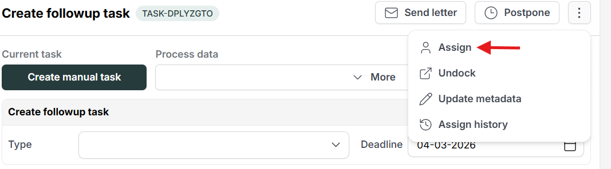
<h5>Figure 27: Assignment option.</h5>
</div>

<div style="text-align: center;">

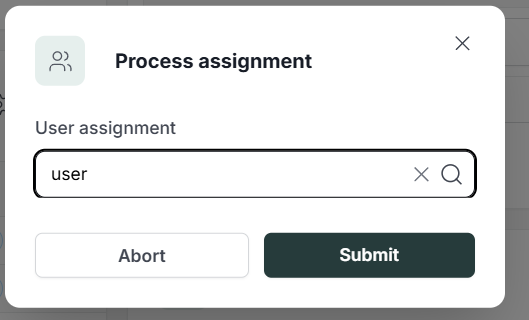
<h5>Figure 28: Assignment pop up.</h5>
</div>

<div style="text-align: center;">

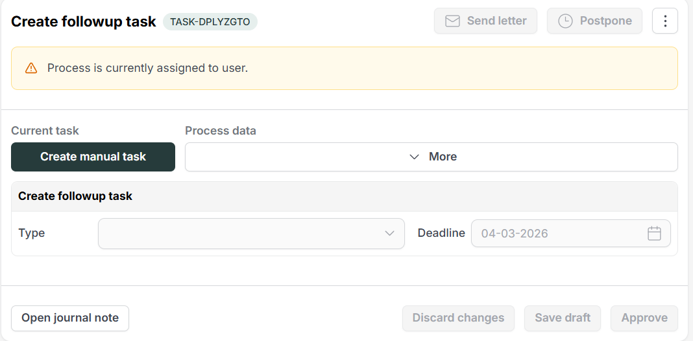
<h5>Figure 29: Assignment banner.</h5>
</div>

## Journal Notes

In many business workflows, it is essential for a caseworker to record notes about decisions, conversations, or actions. 
The Journal Note feature allows users to create, edit, and save these notes directly within a process task. 
These notes can be associated with one or more cases and are automatically journalized.
The journal notes added during the process are saved to the `JOURNAL_NOTE` table when:
- The process is saved manually (either by clicking the "Save and Close" button or when closing the entity).
- The process completes successfully.

This section outlines how to enable and use journal notes within your processes.

### Setup and Configuration
To enable the feature, you must add the Gradle dependencies and configure the necessary classes.

1. **Add Gradle Dependencies**
   You must add the `nc.amplio.libraries:process-feature-journalnote-service` module to your project.
   If you plan to use the default REST endpoints for the UI, you should also add `nc.amplio.libraries:process-feature-journalnote-rest`.

2. **Import Application Configuration**
   In your Spring Boot application configuration, you must import  `ProcessJournalNoteConfig.class` and
   if using the REST module, `ProcessJournalNoteRestConfig.class`.
   ```java
    @Import({
        //...
        ProcessJournalNoteConfig.class,
        ProcessJournalNoteRestConfig.class,
    })
    @Configuration
    public class BusinessApiConfig {
    }
    ```

### UI Integration and Template Configuration

To allow users to add a journal note during a task, you must ensure the "Open journal note" button is visible. This is controlled by the `ProcessButtonConfig` in your listener.
By default, the button is enabled (`showJournalNoteButton` is true).
When the user clicks this button, the Journal Note form is displayed, allowing them to select a template, write their note, and optionally associate it with a case.


<div style="text-align: center;">

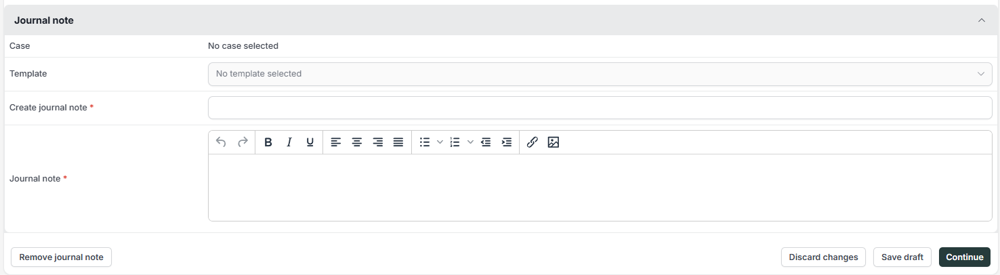
<h5>Figure 30: Journal note module.</h5>
</div>

The available templates for journal notes are configured as `journal_note_template` system parameters.


### Default Templates and Merge Fields
You can pre-configure default journal notes that are automatically created when a process starts. 
To do this, add the `nc.amplio.libraries.process.model.types.ProcessType` system parameter attribute to a `journal_note_template` instance and set its value to the key of your `ProcessType`.

Like letters, journal note templates can use merge fields to dynamically populate content.
Merge fields are defined in the text attribute of the `journal_note_template` system parameter, enclosed in curly braces (e.g., {Phone-Name-Recipient}).

For each merge field you define, you must also create a corresponding `MERGE_FIELD` system parameter instance with the same key.

<div style="text-align: center;">

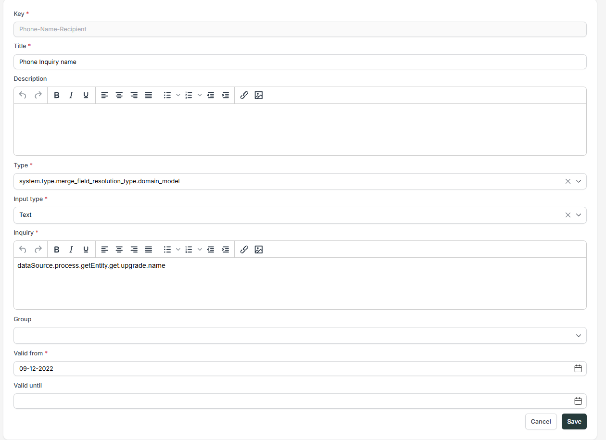
<h5>Figure 31: Merge field system parameter.</h5>
</div>

To supply the values for these merge fields, you must implement a data source service.
1. Create a `JournalNoteMergeDataSource` implementation: This is typically a simple record or class that holds the data relevant to the merge operation, such as the `Process` object and the `ProcessContext`.
    ```java
    public record ProcessJournalNoteMergeDataSource(Process process, SimpleProcessContext<?> context) implements JournalNoteMergeDataSource {
    }
    ```
2. Implement `JournalNoteMergeDataSourceService`: Implement the `getJournalNoteMergeDataSource` method. The process engine calls this method to get the data source object.
    ```java
    @Service
    @Transactional
    @RequiredArgsConstructor
    public class JournalNoteMergeDataSourceServiceImpl implements JournalNoteMergeDataSourceService {
    
        private final SelectorService selectorService;
        private final AddressService addressService;
    
        @Override
        public JournalNoteMergeDataSource getJournalNoteMergeDataSource(SimpleProcessContext<?> context, SystemParameter journalNoteTemplate) {
           Process process = selectorService.getEntityById(Process.class, context.getProcessId());
           Address address = addressService.getAdrdressFromEntity(context.getEntity);
           return new ProcessJournalNoteMergeDataSource(process, context, address);
        }
    }
    ```

The process engine will then use your data source to create a `ProcessJournalNoteMergeContext` object with the following fields:

- `dataSource`: The `JournalNoteMergeDataSource` instance you created.
- `templateKey`: The key of the `journal_note_template`.
- `title`: The title from the `journal_note_template`.
- `templateText`: The text from the `journal_note_template`.
- `canAddToTitle`: A flag to indicate if text can be appended to the journal note's title.

This `ProcessJournalNoteMergeContext` object is provided to the merge field engine to resolve the values of the fields.

The merge engine resolves the value for each field based on the `inquiry` attribute of the `MERGE_FIELD` system parameter. There are two main resolver types:
- `DOMAIN_MODEL`: This type retrieves a value by navigating a path from the `ProcessJournalNoteMergeContext`. The inquiry value should be a dot-separated path to the desired field or getter.
    ```
      "inquiry": "dataSource.address.streetName",
    ```
- `RESOLVER`: This type uses a custom `DomainValueResolver` to get the value. The `inquiry` should contain the path to the object you want to resolve, followed by the name of the method in your resolver class.
  1. **Inquiry Example**: `dataSource.address.getStreetName`
  2. **Create a `DomainValueResolver`**: Implement the `getClassToResolve() `method to return the class of the object you are resolving (e.g., Address.class). 
  Then, create a method with the same name as specified in the inquiry (e.g., getStreetName).
  ```java
    @Component
    public class PhoneInquiryDomainValueResolver implements DomainValueResolver<Address> {
    
        public String getStreetName(Address address) {
                return address.getStreetName();
        }
    
        @Override
        public @NotNull Class<SimpleEntity> getClassToResolve() {
            return Address.class;
        }
    }
    ```

### Handling Journal Notes During Process Lifecycle Events

The journal notes that are added during the process are saved to the `JOURNAL_NOTE` table and their relation with the process to the `PROCESS_JOURNAL_NOTE_RELATION` when :
- the process is saved manually either by clicking the save draft button or when closing the entity.
- the process completes.

Projects must implement triggers to define how journal notes are handled during critical process lifecycle events like rollbacks and deletions.

#### Handling Process Rollback

When a user navigates backward in a process, you should implement the `BeforeProcessRollbackTrigger` interface to manage any journal notes created in the "undone" steps. A common implementation is to delete these notes and their relations.
```java
@Component
@RequiredArgsConstructor
public class JournalNoteBeforeProcessRollbackTrigger implements BeforeProcessRollbackTrigger {
    private static final String DELETE_JOURNAL_NOTE_RELATIONS = """
            DELETE
            FROM ProcessJournalNoteRelation jr
            WHERE jr.process = :process
                AND jr.created > :rollbackLimit
            """;
    
    @Override
    public void beforeRollbackProcess(@NotNull Process process, @NotNull LocalDateTime rollbackLimit) {
        // Deletes the JournalNote and ProcessJournalNoteRelation entities
        // created after the rollbackLimit timestamp.
        dbApi.jpql(DELETE_JOURNAL_NOTE_RELATIONS)
                .bind("process", process)
                .bind("rollbackLimit", rollbackLimit)
                .runDelete();
    }
}
```

<div style="border-left: 4px solid darkorange; background-color: rgba(255, 140, 0, 0.1); padding: 10px; margin-bottom: 10px;">
    <strong>Warning:</strong>
        <div>This implementation permanently deletes journal notes. For systems requiring an immutable audit trail, 
            a safer alternative is to only delete the ProcessJournalNoteRelation, leaving the JournalNote entity intact.
        </div>
</div>

#### Handling Process Deletion
Similarly, when a process is permanently deleted, you should implement the `BeforeProcessDeleteTrigger` interface to handle the cleanup of associated journal notes and prevent orphaned data.
```java
@Component
@Transactional
@RequiredArgsConstructor
public class JournalNoteBeforeProcessDeleteTrigger implements BeforeProcessDeleteTrigger {
    // ... JPQL queries to get note IDs and delete notes/relations ...

    private static final String GET_JOURNAL_NOTE_IDS = """
            SELECT pjnr.journalNote.id
            FROM ProcessJournalNoteRelation pjnr
            WHERE pjnr.process.id = :processId
            """;
    
    private static final String DELETE_PROCESS_JOURNAL_NOTE_RELATIONS = """
            DELETE FROM ProcessJournalNoteRelation pjnr
            WHERE pjnr.process.id = :processId
            """;

    @Override
    public void beforeDeleteProcess(Process process) {
        List<String> journalNoteIds = getJournalNoteIds(process);
        if (!journalNoteIds.isEmpty()) {
            deleteProcessJournalNoteRelation(process);
            // ... logic to delete other relations and the notes themselves ...
        }
    }

    private List<String> getJournalNoteIds(Process process) {
        return dbApi.jpql(GET_JOURNAL_NOTE_IDS)
                .bind("processId", process.getId())
                .getAll();
    }
    
    private void deleteProcessJournalNoteRelation(Process process) {
        dbApi.jpql(DELETE_PROCESS_JOURNAL_NOTE_RELATIONS)
                .bind("processId", process.getId())
                .runDelete();
    }

}
```

<div style="border-left: 4px solid darkorange; background-color: rgba(255, 140, 0, 0.1); padding: 10px; margin-bottom: 10px;">
    <strong>Warning:</strong>
        <div>
            As with rollbacks, this implementation permanently deletes journal notes. For auditing purposes, projects should consider only removing the relations and preserving the note entities.
        </div>
</div>

## Cases

The Process Engine can be extended to support Cases. 
When enabled, cases can be integrated directly into features like Letters and Journal Notes, or used to build custom case management logic within your processes.

### Setup and Configuration
To enable the case feature, you must add the Gradle dependency and import the necessary Spring configuration.

1. **Add Gradle Dependencies**
   You must add the `nc.amplio.libraries:process-feature-cases` module to your project.

2. **Import Application Configuration**
   In your Spring Boot application configuration, you must import  `ProcessCaseConfig.class`.
   ```java
    @Import({
    //...
      ProcessCaseConfig.class,
    })
    @Configuration
    public class BusinessApiConfig {
    }
    ```

### Integrating Cases with Letters

To allow users to associate a letter with a case, you need to enable the case dropdown in the standard `<SendLetterModule />`.
1. **Enable the UI Component**: Set the `sendLetterShowCaseDropDown` prop on the `<SendLetterModule>` to true (this is the default behavior). 
This will display a dropdown menu in the letter UI, allowing the user to select from the active cases related to the entity.
    <div style="text-align: center;">
    
    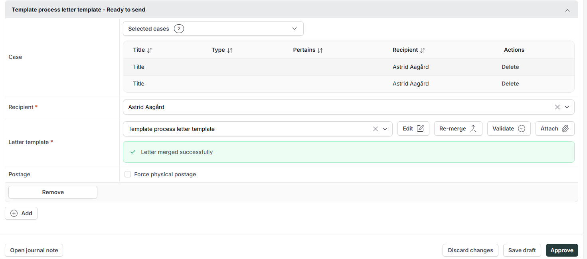
    <h5>Figure 32: Case dropdown in letters.</h5>
    </div>
2. **Implement the Backend Service**: To save the relationship between the generated letter document and the selected case,
you must provide an implementation for the `ProcessLetterAddonService.addRelatedCaseRelationToDocument` method.

### Integrating Cases with Journal Notes

To enable case selection for journal notes, you must expose a REST endpoint that the frontend can use to fetch the list of available cases for an entity.
The frontend will automatically look for an endpoint at the path `/rest/api/entity/case/{entityType}/{entityId}/casepickercases`. This endpoint must return a `ListResponse<ChooseCaseDto>`.
The `process-feature-cases `library provides a `ChooseCaseService` that can be used to easily fetch the required data.

A recommended implementation for the controller is shown below.

```java
@RestController
@PreAuthorize("isAuthenticated()")
@RequestMapping(path = "/rest/api/entity/case", produces = APPLICATION_JSON_VALUE)
@RequiredArgsConstructor
public class CasePickerRestController {
    private final ChooseCaseService chooseCaseService;

    @GetMapping(path = "/{entityType}/{entityId}/casepickercases")
    public ResponseEntity<ListResponse<ChooseCaseDto>> getCasePickerCases(@PathVariable("entityType") String entityType, @PathVariable("entityId") String entityId) {

        ListResource.ListResourceBuilder<ChooseCaseDto> response = ListResource.builder();
        EntityType entityTypeEnum = EntityType.fromString(entityType);

        List<ChooseCaseDto> cases = chooseCaseService.getChooseCase(entityTypeEnum, entityId);
        response.withData(cases);

        return ResponseEntity.ok(response.build());
    }
}
```

## Overlays

In addition to the main linear flow of a process, the Process Engine provides the ability to run ad-hoc, short-lived workflows called Overlays. 
An overlay temporarily freezes the state of the current manual task to allow the user to perform a side-task, such as sending a letter, before returning them to their original work.
Amplio provides two standard overlays out-of-the-box: "Send Letter" and "Postpone Process". Projects can also define their own custom overlays.

### Send Letter Overlay

The Send Letter overlay can be used to create and send a letter at any given time during a manual process task.
To enable it, you must configure the listener for your manual task to show the "Send letter" button by setting `showRetrieveInformationButton` to true in the `ProcessButtonConfig`.
When a user clicks this button, the execution of the current task is paused, and the standard Send Letter module is displayed as an overlay. 
This overlay combines the functionality of the `GenerateLetterListener` and the `IntegrationListener`, running synchronously and blocking the UI until the letter is sent.

<div style="text-align: center;">

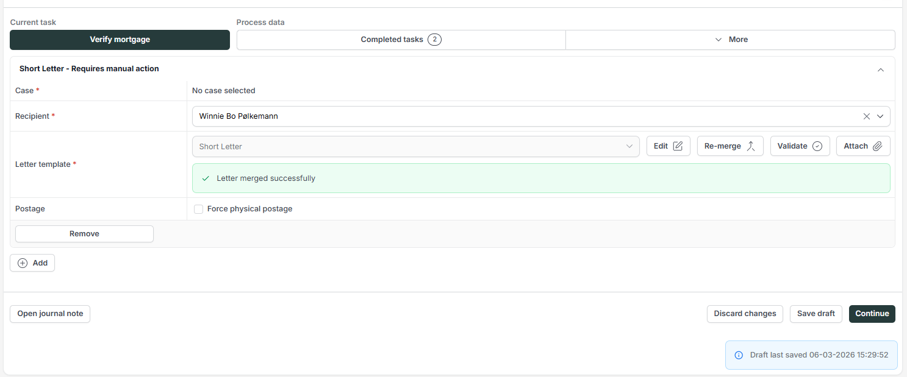
<h5>Figure 33: Send letter overlay.</h5>
</div>

### Postpone Process Overlay

The "Postpone Process" overlay functions as an ad-hoc [WaitTaskListener](#waittasklistener). 
It allows a user to pause the current process based on specific conditions directly from the UI. When triggered,
it evaluates all ProcessCondition objects that have been added to the context up to that point.
To enable this overlay, you must register it with the ProcessManager using the standard `<PendingConditionModule>` component.

```tsx
    pm.registerOverlay('PENDING_CONDITION', form => <PendingConditionModule form={form} />);
```

### Define custom overlay

You can create a custom overlay to handle any ad-hoc workflow your process requires. This involves implementing components on both the backend and frontend.
**Backend Implementation**
1. **Implement a `ProcessOverlayService`**: This service orchestrates the overlay's lifecycle. It requires you to implement three methods:
    - `init(...)`: Runs before the overlay UI is loaded. Use this method to perform initial setup, such as preparing data for the overlay's listener.
    - `finish(...)`: Runs after the overlay's listener completes its execution. It should return a ProcessStatus (usually MANUAL, to indicate that the main process is returning to its previous manual task).
    - `nextOverlay(...)`: (Optional) If you need to chain multiple overlays together, this method can return the next `ProcessOverlay` to be displayed.
2. **Implement a `BaseListener` for the Overlay**: Create a listener that will perform the actual processing for the overlay. This listener follows the same principles as a standard task listener ([see implementing a manual task](#implementing-a-manual-task)).
3. **Define a `ProcessOverlay` Enum**: Create a `ProcessOverlay` `ExtendableEnum` constant to register your overlay with the system. This enum ties together the components you just created:.
   - **name**:  A unique name for the overlay enum instance..
   - **processOverlayService**: A reference to your ProcessOverlayService implementation.
   - **executor**: A reference to your overlay's `BaseListener` implementation.
   - **command**: The command object class for the overlay, which must implement `ProcessOverlayCommand`.. It is mainly used to store data from the main flow that need not be touched.

**Frontend Implementation**

1. **Create the Overlay UI Module**: Build the React component for your overlay's user interface. Follow the same guidelines as you would for creating a standard manual task module. ([see how to create a frontend task module](#creating-the-frontend-task-module)).
2. **Register the Overlay with ProcessManager**: In your frontend configuration (e.g., configureProcesses.tsx), register your new overlay component with the `ProcessManager`, using the key you defined in your `ProcessOverlay` enum.
    ```tsx
          pm.registerOverlay('CUSTOM_OVERLAY', form => <CustomOverlayModule  />);
    ```
3. **Trigger the Overlay from the UI**: To allow users to open your overlay, add a button to the process header. This is done by adding a a `ButtonInList` or `MenuElement` via the `customizeHeaderMenuElements` or `customizeHeaderButtons` props on the `<ProcessEninge>` or `<EntityProcessEngine>` component.
   ```tsx
    const currentCommandData = useCurrentCommandData();
    const openedProcess = useOpenedProcessContext();
   
    const handleToggleOverlay = useCallback((overlayType: string | null) => {
      const command = currentCommandData.currentCommand;
      if (command && overlayType) {
        dispatch(toggleOverlay(openedProcess, overlayType, command));
      }
    },
    [currentCommandData.currentCommand, dispatch, openedProcess],
    );
   
    // rest of the code
   <EntityProcessEngine
     customizeHeaderMenuElements={elements => [
       ...elements,
       {
         prefixOverride: PortaltextPrefixStore.process.businessApplicationProcessButtons,
         icon: EXAMPLE_ICON,
         key: 'customOverlay',
         ptKey: 'custom_overlay',
         onSelect: () => handleToggleOverlay('CUSTOM_OVERLAY'),
       },
     ]}
   //OR
     customizeHeaderButtons={elements => [
       ...elements,
       {
         prefixOverride: PortaltextPrefixStore.process.businessApplicationProcessButtons,
         icon: EXAMPLE_ICON,
         variant: 'secondary',
         size: 'sm',
         key: 'customOverlay',
         ptKey: 'custom_overlay',
         handleClick: () => handleToggleOverlay('CUSTOM_OVERLAY'),
       },
     ]}
   />
    ```
   
## Chaining Processes

In many complex business scenarios, it is necessary for one process to programmatically start another.
The standard way to achieve this in Amplio is for the parent process to create and send an `Event`. The process scheduler then picks up this event and starts the subscribed child process.

1. **Creating the Event**
    The easiest way to construct an event within a process is to use the `CreateEventParametersBuilder`. This builder class provides a fluent API to configure all the necessary details for the new event.
    You can use this builder from any listener (e.g.,`RegisterDataListener`) to create an event that will trigger the next process in the chain.
    **Example:**
    In this example, after an order is approved, we want to start a separate "Shipment" process.
    ```java
    EventType startShipmentProcessEvent = ShipmentProcessConstants.PROC_START_SHIPMENT_PROCESS;
    
    CreateEventParametersBuilder eventBuilder = new CreateEventParametersBuilder(startShipmentProcessEvent)
        .withEntity(context.getCustomerEntity())
        .withEventData(new ShipmentEventData(context.getOrderId(), context.getShippingAddress()))
        .withCreatedByProcessId(context.getProcessId());
    
    ```
2. **Registering the Event and its Relation**
   To register the event you can use the `ProcessEventCreateService ` and the method `createAndReserveEvent`.
    ```java
        ProcessEngineSchedulerEvent schedulerEvent = processEventCreateService.createAndReserveEvent(builder);
    ```
   <div style="border: 1px solid #F9A825; border-left-width: 5px; border-radius: 4px; background-color: #FFF8E1; padding: 16px; margin: 16px 0;">
    <h4 style="margin-top: 0; color: #BF360C; font-weight: bold;">Warning: ProcessEventCreateService Limitation</h4>
    <p style="margin-bottom: 0; color: #0c0400;" >The standard, out-of-the-box <code style="color: rgb(12,4,0);">ProcessEventCreateService</code> provided by Amplio <strong>does not</strong> automatically create the <code style="color: rgb(12,4,0);">CREATED_BY_PROCESS</code> relationship between the parent process and the new event.</p>
    <p style="margin-top: 8px; margin-bottom: 0; color: #0c0400;">To ensure methods like <code style="color: rgb(12,4,0);">ProcessEventRepository.getParentProcessForProcess()</code> work correctly, you must currently implement and use the deprecated <code style="color: rgb(12,4,0);">CreateEventService</code> instead. 
    This service correctly persists the necessary <code style="color: rgb(12,4,0);">ProcessEventRelation</code>.</p>
    </div>
3. **Tracking Chained Processes**
   Once processes are correctly chained with the `CREATED_BY_PROCESS` relation, you can track the relationship between them using the `ProcessEventRepository`.
    - `getParentProcessForProcess(String childProcessId)`: Returns the parent process that created the event that started the child process.
    - `getStartedProcessForEvent(String eventId)`: Returns the child process that was started by a given event.
    - `getCreatedEventsForProcess(String parentProcessId)`: Returns all events that were created by a given parent process.
    By using this event-based mechanism, you can create decoupled yet traceable workflows, which is fundamental for building complex, enterprise-scale applications.


## Process and Rule Engine

Processes can be combined with the Foundation Rule Engine to integrate complex decision-making directly into a workflow. 
This allows business rules to run on top of the process logic, making the system more flexible and maintainable.
For this section, it is important to be familiar with how the Foundation Rule Engine works. 
It is recommended to first review the [Getting started with Rule Engine](https://goto.netcompany.com/cases/GTE2252/AMPJ/SitePages/Wiki.aspx#/C0200-User-Guides/Rule-Engine) guide.

### Attentions

A primary use case for this integration is to compute Attentions. 
Attentions are warnings shown to a user during a manual task, calculated based on a set of predefined business rules. 
They alert the user to important conditions or potential issues before they proceed.
Configuring attentions involves defining the rules, integrating them into a listener, and displaying them in the frontend.

**Define the Rule**

First, you must define the rule that will generate the attentions.

- **Create a `RuleBasis` model**: This model represents the input data for your rule. It must implement the `RuleBasis` interface.
    ```java
    public record InvestmentValuationRuleBasis(
            String departmentType,
            BigDecimal investmentAmountInDKK,
            Boolean communityProject,
            String communityProjectName) implements RuleBasis {
    
    }
    ```
- **Configure the Rule Sheet**: Using the Rule Administration UI, create a new rule sheet.
  - Set the "Input Rule Basis" to the RuleBasis class you just created.
  - Set the "Output class" to `CONCLUSION_REASON_LIST_OUTPUT_CLASS`. This standard output class produces a list of `ConclusionReasonRuleResult` objects, each containing:
    - `conclusion`: A boolean indicating if an attention should be created (true).
    - `reason`: The portal text key for the attention message.
  <div style="text-align: center;">

    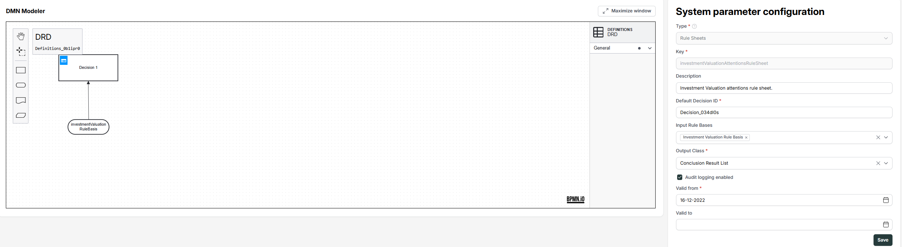
  <h5>Figure 34: Rule administration page.</h5>
  </div>
- **Configure the Decision Table**: Create your decision table with the appropriate inputs and outputs.
  - **Important: The Hit Policy for the decision table must be set to Collect, as multiple rules might be valid at the same time, and you want to show all applicable attentions.**
    <div style="text-align: center;">
    
    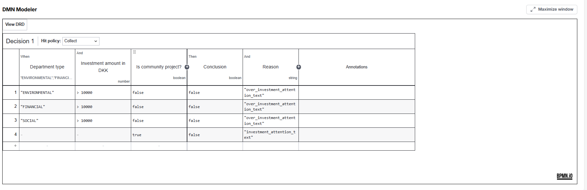
    <h5>Figure 35: Attentions decision table.</h5>
    </div>

**Integrate the Rule into a Listener**    

Next, you must define the rule type and its input within the listener of your manual task.
- **Define a `RuleSheetKey`**: Create a `RuleSheetKey` constant. This ExtendableEnum identifies the rule sheet you want to execute. You must provide two arguments:
  - The `SystemParameterKeyType` that defines the system parameter type for the rules (the default is `DMN_RULE_SHEET`).
  - The key of the rule sheet you created in the administration UI.
  ```java
    public static final RuleSheetKey INVESTMENT_VALUATION_ATTENTIONS_RULE_SHEET =
        RuleSheetKey.create(RuleParameterTypeDefinitions.DMN_RULE_SHEET, "investmentValuationAttentionsRuleSheet");
    ```
- **Override `getRuleExecutionIntents`**: In the same listener, override the `getRuleExecutionIntents` method.
  This method is responsible for preparing the data (`RuleBasis`) and telling the process engine which rules to run.
  Inside this method, you should instantiate your `RuleBasis` object and return a list of `RuleExecutionIntent` objects.
    ```java
    @Override
    protected List<RuleExecutionIntent> getRuleExecutionIntents(InvestmentValuationContext context) {
        InvestmentValuationRuleBasis ruleBasis = new InvestmentValuationRuleBasis(
            context.getDepartmentType().name(),
            context.getInvestmentAmountInDKK(),
            context.isCommunityProject(),
            context.getCommunityProjectName()
        );

        var ruleIntents = new ArrayList<RuleExecutionIntent>();
        ruleIntents.add(new RuleExecutionIntent(RuleSheetKeys.INVESTMENT_VALUATION_ATTENTIONS_RULE_SHEET,  List.of(ruleBasis)));
        return ruleIntents;
    }
    ```

**Alternative Method: Associating Rules with TaskType**

Another, more declarative way to associate a rule with a task is to link it directly to the `TaskType` constant using the `.withRuleSheet()` method. 
When you use this approach, you often do not need to override `getRuleExecutionIntents`, 
as the process engine will automatically pick up the rule sheet from the `TaskType` and will inject he `RuleBasis` that you have added in the `SimpleProcessContext`.

```java
public static final TaskType TEMPLATE_PROCESS_FRONTEND = TaskTypeFactory.manualListener(
        "TEMPLATE_PROCESS_FRONTEND",
        TemplateProcessFrontendCommand.class,
        TemplateProcessFrontendTaskViewData.class
    )
    .withRuleSheet(RuleSheetKeys.TEMPLATE_PROCESS_RULE_SHEET);
```

**Display Attentions in the Frontend**
Finally, to show the generated attentions in the UI, add the `<CauseOfAttentionTable />` component to your manual task module. 
This component automatically renders the list of attention messages returned by the rule engine. You can optionally pass arguments for the portal text messages.
Each attention is displayed with a checkbox that the user must tick before they can proceed, ensuring they have acknowledged the warning.

```tsx
// In your manual task module
 return (
    <>
        <CauseOfAttentionTable
            attentionPortalTextArgs={viewData.communityProjectName ? [viewData.communityProjectName] : []}
        />
        // ... rest of your UI components
    </>
);
```

<div style="text-align: center;">

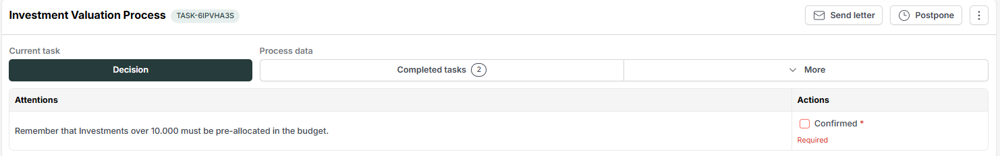
<h5>Figure 36: Attentions in a task.</h5>
</div>

### Rule Execution During Process Flow

Beyond generating attentions, you can also use the Foundation Rule Engine for general-purpose decision-making anywhere in your process flow. 
This is done by directly injecting and using the `RuleEngineService` within any listener.
This pattern is ideal for tasks where you need to calculate a value, determine a category, or make a decision that influences the subsequent steps of the process.
For detailed information on how to run rules, please refer to the [Getting started with Rule Engine](https://goto.netcompany.com/cases/GTE2252/AMPJ/SitePages/Wiki.aspx#/C0200-User-Guides/Rule-Engine) guide.

```java
public TaskExecutorResult execute(ExampleProcessContext context, boolean manualExecution) {

    context.setRuleBases(List.of(new TemplateProcessRuleBasis(context.shouldContinue())));
    Optional<RuleResultValue<ExampleRuleResult>> ruleResultValue = ruleEngineService.executeRuleSheet(RuleParameterTypeDefinitions.DMN_RULE_SHEET.getValue(),
            RuleSheetKeys.TEMPLATE_PROCESS_RULE_SHEET.getKey(), context.getRuleBases());

    if (ruleResultValue.isPresent()) {
        ExampleRuleResult result = ruleResultValue.get().value();
        context.setCategory(result.getCategory());
    }

    return new TaskExecutorResult(ProcessStatus.COMPLETED);
}
```

# Testing your Process

Effective testing is crucial for ensuring that your processes are reliable, correct, and maintainable. 
A robust testing strategy for processes involves two distinct but complementary approaches:
1. **Testing the Business Logic**: This involves writing standard unit tests for the core logic that lives inside your service classes.
2. **Testing the Process Flow**: This involves writing end-to-end simulation tests to verify that the BPMN flow, gateways, and listener integrations work as expected.
This separation ensures that complex business rules are tested in isolation for speed and precision, while the overall process integrity is verified through simulation.

## Testing Business Logic
The most important principle when testing processes is to keep your listeners thin. Listeners should act only as orchestrators, 
delegating all significant business logic to separate, injectable service classes.

By following this principle, you can—and should—test the vast majority of your business logic using standard unit testing practices, 
completely independent of the process engine.
- **What to Test**: Write unit tests directly against your @Service classes.
- **How to Test**: Use standard testing frameworks like JUnit and Mockito to mock dependencies and test the inputs and outputs of your service methods.
- **Benefits**:
  - **Speed**: Unit tests are extremely fast to run.
  - **Simplicity**: You don't need to set up or run the process engine.
  - **Isolation**: You can test complex rules and edge cases without the overhead of a full process flow.

## Testing the ProcessFlow

To verify that your BPMN diagram, gateways, and listener integrations work correctly together, Amplio provides a powerful Process Simulation Framework. 
This framework allows you to write automated tests that simulate a full, end-to-end run of your process using a fluent builder pattern.

**Process Simulation Framework**

The Process Simulation Framework is the standard solution for testing your process flow without the UI.
These tests are typically categorized as `@SmokeTest` and should reside with other smoke tests in your project.
To add simulation capabilities to your tests, first include the necessary dependency:

```groovy
dependencies {
    testImplementation "nc.amplio.libraries:process-simulation"
}
```
Next, your test class must extend `ProcessSimulationTestBase`. You also need to add the `@ContextConfiguration` annotation to load your main application class
(to ensure all required beans are available) and the `ProcessSimulationTestConfig` class. 
Note that `ProcessSimulationTestConfig` must be the last class in the configuration list.
The `ProcessSimulationTestBase` class gives you access to a `SimulationFlowBuilder`, which you use to define the sequence of steps your test will execute.

### Setting Up Test Data
Before you can run a simulation, you often need to populate the test-container database with prerequisite data, such as the person or case the process will run against. The framework uses `DbUnit` to load data from XML files.
1. **Create a Dataset XML File**: In your test resources directory (**under a folder matching your test class's name**), create an XML file that defines your test data.
   ```xml
    <?xml version='1.0' encoding='UTF-8'?>
    <dataset>
      <PERSON ID="--test-person-1-id--" PERSON_KEY="1311599195" ... />
      <NAME ID="a4f5a118-86c2-41fc-8e91-8dfae67d778d" PERSON_ID="--test-person-1-id--" ... />
      <CASE ID="--test-case-1-id--" BUSINESS_KEY="BOT-1707264291-1665991780" ... />
      <CASE_PARTY ID="b1390006-e958-4d62-b57d-761404c2d05f" ENTITY_ID="--test-person-1-id--" CASE_ID="--test-case-1-id--" ... />
    </dataset>
    ```
2. **Load the Data in Your Test**: In your test class, use the `@BeforeEach` annotation to call the `initDb()` method, passing the name of your XML file. This will load the data before each test runs.
   java
    ```java
    @BeforeEach
    public void init() {
        initDb("person.xml");
    }
    ```

### How to Write a Simulation Test
Writing a simulation test involves using the `SimulationFlowBuilder` to define a step-by-step "script" for your process. 
You get an instance of this builder by calling `newBuilder(YourProcessType)` inside a test method.

Here are the primary methods you will use to build your simulation flow:
- `start(...)`
    This method begins the process simulation. It creates the specified `EventType` and starts the process associated with it.
    - **Purpose**: To kick off the process, simulating how a user or system would normally start it.
    - **Parameters:**
      1. `EventType`: The event that triggers the process.
      2. `EntityType`: The type of the main entity the process is related to (e.g., PERSON_ENTITY_TYPE).
      3. `entityId`: The ID of the specific entity instance.
      4. `eventData`: Optional additional data related to the event.
      ```java
        SimulationFlow flow = newBuilder(CreateFollowUpTaskConstants.CREATE_FOLLOWUP_TASK)
            .start(CreateFollowUpTaskConstants.AD_CREATE_FOLLOWUP_TASK, PERSON_ENTITY_TYPE, personId, caseId)
        ```
- `forward(...)`
  This method moves the process forward from a specified manual task. It simulates a user completing the task and clicking "Continue" or "Approve".
  - **Purpose**: To simulate the completion of a manual task.
  - **Parameters**: 
    1. `TaskType`: The `TaskType` of the manual task you expect the process to be at.
    2. `SimulationOperation`: A lambda function where you can modify the `SimpleProcessCommand` object, simulating a user filling out a form.
    ```java
        .forward(VacationRequestProcessConstants.VACATION_REQUEST_SUBMIT, (context) -> {
            SubmitVacationProcessCommand command = context.getProcessCommand();
            command.getStartDate().setCurrentValue(LocalDate.now().plusDays(1));
            command.getEndDate().setCurrentValue(LocalDate.now().plusDays(2));
            command.getLeaveType().setCurrentValue(LeaveType.ANNUAL_LEAVE);
        })
    ```
- `validateAfter(...)`
  This method allows you to run assertions immediately after a specific task has been executed, but before the next step begins. It's perfect for testing validation logic.
  - **Purpose**: To check the state and the data of the process immediately after a forward step.
  - **Parameters**: 
    - `TaskType`: The `TaskType` of the task after which the validation should run.
    - `SimulationOperation`: A lambda function where you perform your checks and add errors to the `SimulationContext`.
    ```java
           .validateAfter(VacationRequestProcessConstants.VACATION_REQUEST_REGISTER, (context) -> {
                  VacationRequestContext contextProcessContext = (VacationRequestContext) context.getProcessContext();

                  if (contextProcessContext.getStartDate().isBefore(LocalDate.now())) {
                      context.addErrorMessage("Check failed: no error on manually filled mandatory field");
                  }
              })
    ```
- `finish(...)`
  This method defines the final set of checks to be performed after the process has run to completion. The simulation framework automatically asserts that the process status is `COMPLETED`.
  - **Purpose**: To verify the final outcome of the entire process.
  - **Parameters**:
      - `SimulationOperation`: A lambda function where you can run final assertions, such as checking if a specific follow-up event was created.
   ```java
     .finish((context) ->
                     checks().checkEventTypeExists(personId, PERSON, ProcessEventTypes.LETTER_SENT),
                )
    ```
-  `back(...)`
   This method simulates a user clicking the "Go Back" button to navigate to a previously completed task.
    - **Purpose**: To test rollback logic and ensure the process correctly returns to a previous state.
    - **Parameters**:
      - `TaskType`: The TaskType of the previous task you want to navigate back to.
      ```java
          .forward(VacationRequestProcessConstants.VACATION_REQUEST_SUBMIT, (context) -> {
          // ... initial form filling ...
          })
          .back(VacationRequestProcessConstants.VACATION_REQUEST_SUBMIT)
      ```
    
# Best Practices and Common Patterns

This section consolidates key design principles and common architectural patterns for writing robust, maintainable, and future-proof processes. Adhering to these practices will help you build solutions that are both powerful and easy to manage.

## Core Design Philosophy
A good mantra for designing processes is: "The system handles the trivial, and users handle the exceptions."

- **Aim for High Automation**: Processes should be designed to be as automatic as possible. User interaction should be reserved for tasks that require human judgment, review, or handling of exceptional cases that the system cannot resolve on its own.
- **Provide Value**: Every manual task should provide clear value. Users should not spend time on anything that can be reliably automated.

## State Management and Idempotency
- **Write Idempotent Listeners**: Imagine that your listeners can be executed an infinite number of times and implement them accordingly. A user can go back and forth between steps, re-triggering listener logic. 
Your code must be resilient to this by avoiding side effects that compound on re-execution (e.g., adding the same item to a list multiple times). This is especially critical for all manual tasks.
- **Handle Stale Data**: Processes can be inactive for a long time. Data from the outside world may change while a process is paused. To prevent decisions based on stale data:
  - Don't copy data unnecessarily into the process context. Instead, save the ID of an entity and reload it from the database when you need it. Keep your context lean.
- **Manage State on Rollback**: The process engine allows users to go back to earlier steps. Be mindful of this:
  - Initialize values in the appropriate listener, and be prepared for them to be re-initialized.
  - Redo calculations where needed rather than assuming a calculated value from a future step is still valid.

## Persisting Data and Handling Side-Effects
- **Persist Data as Late as Possible**: As a general rule, you should only persist final data to the main business tables in the very last step of your process, 
typically within a RegisterDataListener. This makes rollbacks and cancellations clean and simple.
- **Isolate Side-Effects**: Side-effects are actions that cannot be easily rolled back by a database transaction (e.g., sending an email, calling an external API).
  - Isolate each side-effect in its own dedicated, small listener.
  - If a process crashes after a side-effect occurs but before the state is saved, how do you recover? Make the side-effect's implementation idempotent so it can be safely re-executed without causing duplicate actions.
- **Keep Transactions Small**: Remember the Single Responsibility Principle. Tasks that update many different domain objects are more likely to fail and will roll back a larger amount of work. 
Split complex tasks into multiple, smaller, and more focused listeners.

## Validation
- **Always Validate in the Backend**: Frontend validation exists only to assist the user and improve their experience. Backend validation exists to protect the system's integrity. Never trust data coming from the user; always validate it in your listener's associated Validator class.
- **Fail Early**: Validating state and failing early are core design principles that improve the quality and reliability of your solution.

## Common Architectural Patterns for Process Interaction
**The "Complete Without Action" Pattern**
This pattern handles scenarios where a process, once started, is no longer needed (e.g., a duplicate application is submitted).

- **Implementation**: At the beginning of the process, add a gateway that checks if the intended action has already been completed (e.g., "Is there already a granted case?"). If so, the process flows down a separate path that simply completes.
- **Best Practice:** Check the state of the data model (e.g., is there already a granted case) rather than checking if another specific process has run.
- **Notes**:
  - The "inform" task in the completion path might be automatic, but it's good practice to have a small UI (even just showing static text). This makes it easier to understand what the system decided to do if the process is reviewed later.
  - The `register` task in the "complete without action" branch might not always be needed. However, consider a case where a citizen applies for the same thing three times. You might need to register that two of those applications were formally rejected, even if they were duplicates.
  
**The "Wait for Another Process" Pattern (Process Chaining)**
When one process needs to wait for another to complete, use a `WaitTaskListener`.
<div style="text-align: center;">

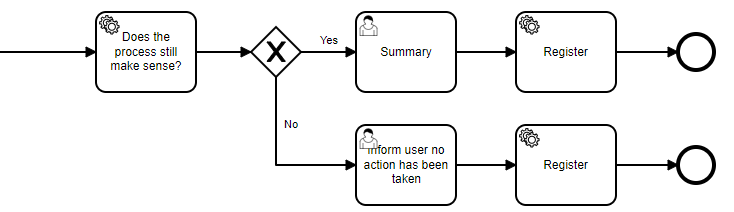
<h5>Figure 37: Complete Without Action Pattern - BPMN Diagram.</h5>
</div>

- **Implementation**: The first process enters a `WaitTaskListener`, configured with a `ProcessCondition` to wait for a specific outcome. A good option for this is the standard `NO_COMPLETED_TASK` condition, 
which can check if another process of a certain type has completed. Once the second process finishes, 
it will automatically notify the first process to re-check its conditions, allowing it to continue.
- **Sending Data Back**: If you need to send data from the second process back to the first, you have two main options:
  - Create a new database table for this shared data. While this adds some development overhead, it is often the correct approach.
  If the data is important enough to influence the behavior of another process, it is likely business-relevant data that belongs in the main data model.
  - Add data to the completion event. In the register task of the second process, you can add data to the follow-up event using the .withEventData() method on the CreateEventParametersBuilder.
  The first process can then be configured to listen for and consume this event data.
  
**The "Managed Process" Pattern**
For complex scenarios where an initial event might require different workflows based on its data, use a "managing" process.

- **Implementation**: Create a short, automatic process whose only job is to inspect the incoming event and data. 
Based on its logic, it uses follow-up events to spawn one or more appropriate child processes in the correct sequence,
potentially using the "Wait for Another Process" pattern to chain them.

# Process Administration

Amplio provides a powerful, out-of-the-box Process Administration Page for monitoring, debugging, and managing process instances. 
This page is an essential tool for developers, testers, and system administrators.

## Key Features
From this central location, you can:

- **Search and View Processes**: Search for all created processes and view key information such as their status,
title, and related entity. You can also navigate directly to the entity or open the process itself.
    <div style="text-align: center;">
    
    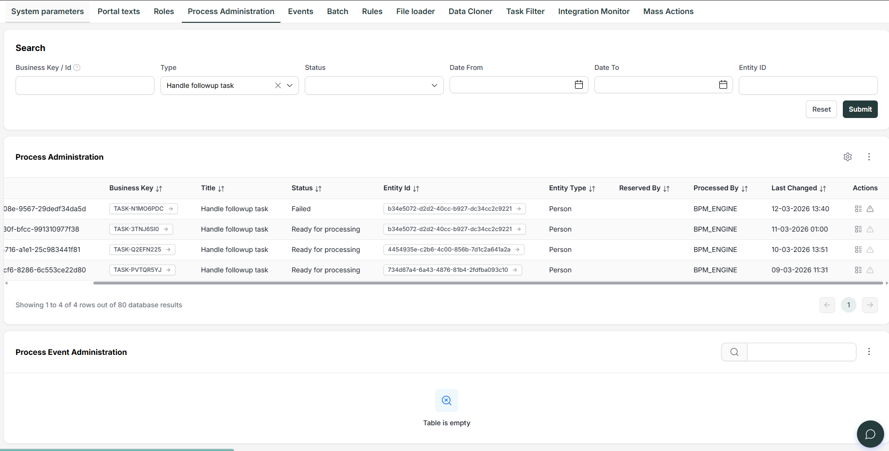
    <h5>Figure 38: Process Administration Page.</h5>
    </div>

- **Debug and Inspect**: For any process, you can inspect the ProcessContext at its current state or view any technical errors that were thrown during its execution.
    <div style="text-align: center;">

    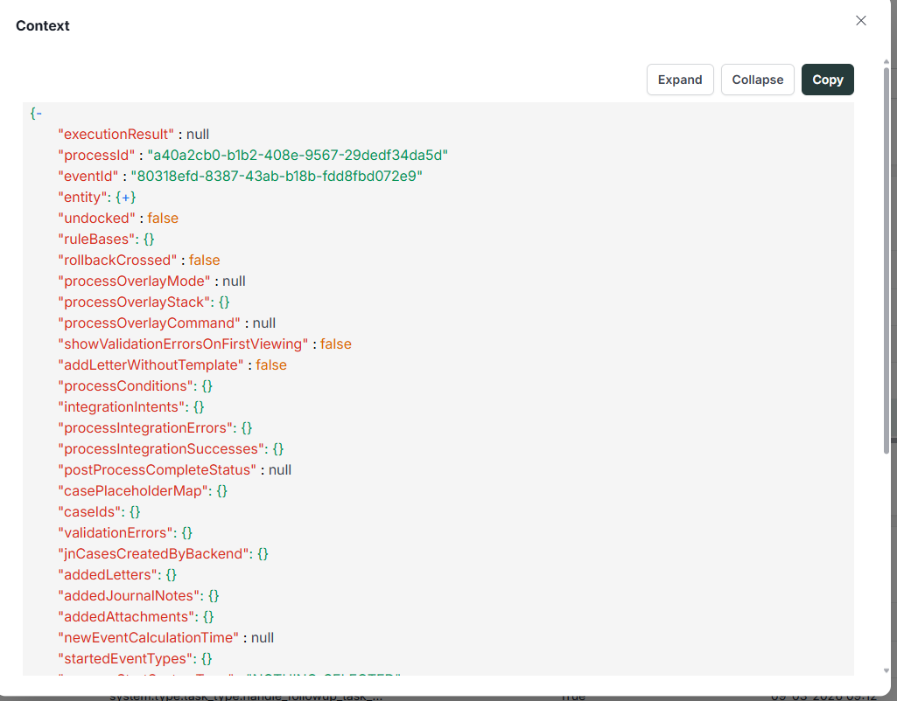
    <h5>Figure 39: Process Administration Page - Context View.</h5>
    </div>
    <div style="text-align: center;">
    
    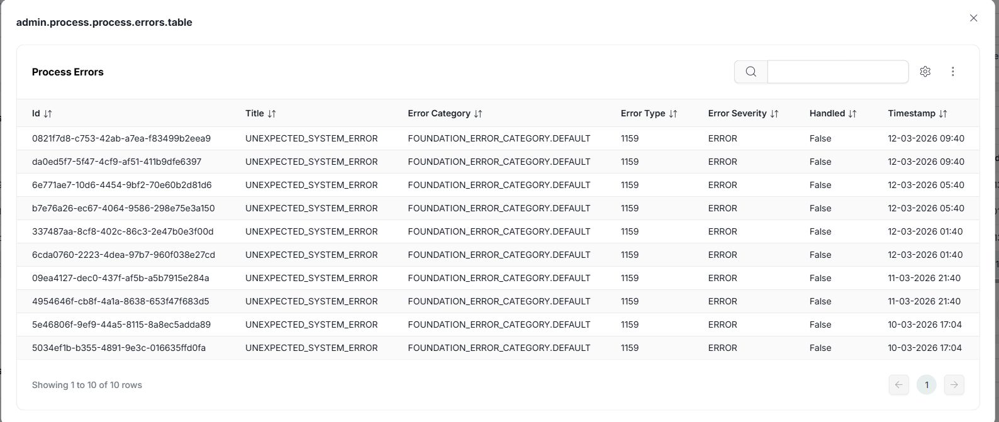
    <h5>Figure 40: Process Administration Page - Error View.</h5>
    </div>
- **Perform Bulk Actions**: Select one or more processes and perform bulk administrative actions, such as:
  - Cancel the process.
  - Cancel and start a new process.
  - Restart the same process.
  <div style="text-align: center;">

    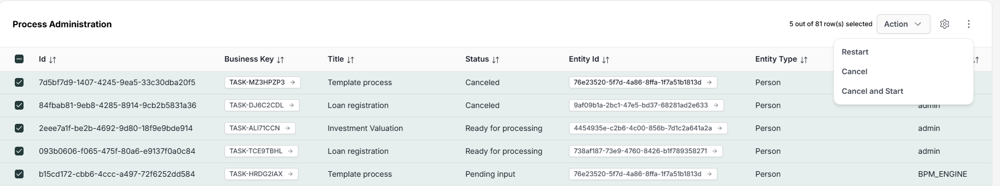
    <h5>Figure 41: Process Bulk Actions.</h5>
    </div>
- **View and Manage Tasks**: By clicking into a specific process, you can view a detailed list of all the tasks that have been executed. 
For each task, you can inspect the `ProcessCommand` and the `TaskViewData` at that point in time. You can also revert the process back to a specific task.
    <div style="text-align: center;">
    
    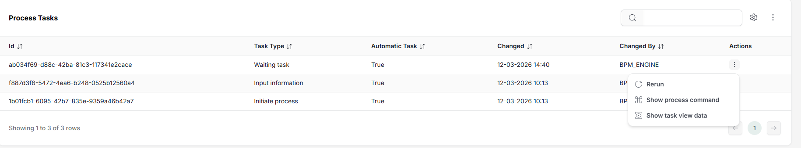
    <h5>Figure 42: Process Tasks Table.</h5>
    </div>
- **Manage Process Events**: The page includes a separate table for viewing all the events that have initiated processes. From here, you can perform bulk actions on events, such as:
  - Resend the event to start the process again.
  - Terminate an event.
  - Release the reservation of an event.
  <div style="text-align: center;">

  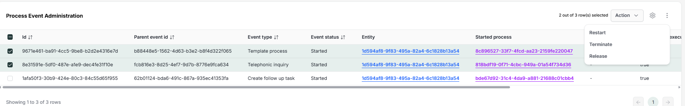
  <h5>Figure 43: Process Events Table.</h5>
  </div>

## How to Integrate

Integrating the Process Administration Page into your application involves a few simple steps for both the backend and frontend.

**Backend Setup**
- **Add Gradle Dependency**: You must add the `nc.amplio.libraries:administration-process-rest` library to your project. This will include all necessary backend services and REST endpoints.
    ```groovy
        api 'nc.amplio.libraries:administration-process-rest'
    ```

- **Import Application Configuration**: In your Spring Boot application configuration (e.g., `BusinessApiConfig`.java), you must import both `ProcessAdministrationServiceConfig.class` and `ProcessAdministrationRestConfig.class`.
    ```java
    @Import({
    //...
        ProcessAdministrationServiceConfig.class,
        ProcessAdministrationRestConfig.class,
    })
    @Configuration
    public class BusinessApiConfig {
    }
    ```

**Frontend Setup**
- **Add the Page to Your Router**: In your administration UI's routing configuration, add the `<ProcessAdministrationPage>` component. It is available as a loadable component from `@amplio/admin-pages`.
    ```tsx
    import { ProcessAdministrationPage } from '@amplio/admin-pages/pages/ProcessAdministrationPage/Loadable';
    
    const adminNavigationConfig: NavigationRouteConfig = useMemo(
        () => ({
            privateRoutes: {
                process_administration: {
                    component: ProcessAdministrationPage,
                },
            },
    
            redirects: [
               
            ],
        }),
        [],
    );
    ```
- **Create a MenuType**: Finally, define a MenuType constant to add the page to your administration menu. This will link the menu item to the route you just configured and secure it with the appropriate security role.
    ```java
        public static final MenuType PROCESS_ADMINISTRATION =
                MenuType.create("PROCESS_ADMINISTRATION", ADMIN, "/processadministration", 13, ProcessAdministrationSecurityRoles.SR_ADM_PROCESS_ADMINISTRATION);
    ```

# Task Filters and Task Tray

Amplio provides a powerful feature to group running processes into logical "work packages," making it easier for caseworkers to find and manage their work. These groups are defined using `Task Filters`.
Once filters are defined, caseworkers can access these work packages, as well as all their other pending and completed tasks, from the **Task Tray page**.


## The Task Filter Administration Page

Task Filters are configurable queries that group processes based on specific criteria. Amplio offers an out-of-the-box **Task Filter Administration Page** to create and manage these filters.
**To do that** 
1. Navigate to the administration page and select the "Task Filter" tab.
2. Create a new system parameter of type `task_filter`.
   <div style="text-align: center;">

   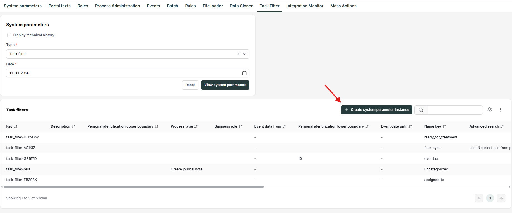
   <h5>Figure 44: Task filter admin page.</h5>
   </div>
3. In the form presented, you can select criteria to build your filter. For example, choosing a specific `ProcessType` will create a work package containing all running processes of that type.
   <div style="text-align: center;">

   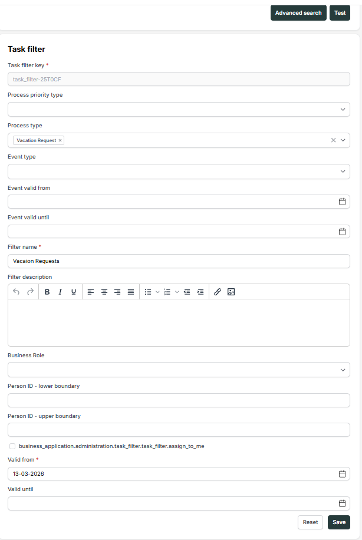
   <h5>Figure 45: Task filter admin page.</h5>
   </div>
4. For more complex scenarios, you can use the "Advanced Search" option to write a custom SQL WHERE clause directly (**don't add the WHERE clause**).
   <div style="text-align: center;">

   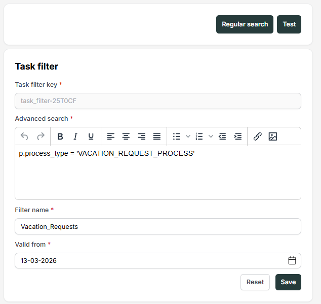
   <h5>Figure 46: Advanced Search.</h5>
   </div>

### Configuring Task Filters
The fields available in the Task Filter administration form are defined by the attributes of the task_filter system parameter type. Projects can customize this to add or remove filtering options.
```sql
call parameter_type('task_filter');
call parameter_attribute('task_filter', 'nc.amplio.libraries.process.model.types.ProcessPriorityType', 'ENUM_LIST', 'N', 0, '', '', 'N');
call parameter_attribute('task_filter', 'advanced_search', 'HTML', 'N', 1, '', '', 'N');
call parameter_attribute('task_filter', 'nc.amplio.libraries.process.model.types.ProcessType', 'ENUM_LIST', 'N', 2, '', '', 'N');
call parameter_attribute('task_filter', 'nc.amplio.libraries.process.model.types.EventType', 'ENUM_LIST', 'N', 3, '', '', 'N');
call parameter_attribute('task_filter', 'eventdateFrom', 'DATE', 'N', 4, '', '', 'N');
call parameter_attribute('task_filter', 'eventdateTo', 'DATE', 'N', 5, '', '', 'N');
call parameter_attribute('task_filter', 'name', 'TEXT', 'Y', 10, '', '', 'N');
call parameter_attribute('task_filter', 'description', 'HTML', 'N', 11, '', '', 'N');
call parameter_attribute('task_filter', 'business_role', 'SYSPARAM_LIST', 'N', 12, '', '', 'N');
call parameter_attribute('task_filter', 'advanced', 'BOOLEAN', 'N', 13, 'Y', 'Y', 'N');
call parameter_attribute('task_filter', 'personalidentificationlowerboundary', 'TEXT', 'N', 14, '', '', 'N');
call parameter_attribute('task_filter', 'personalidentificationupperboundary', 'TEXT', 'N', 15, '', '', 'N');
call parameter_attribute('task_filter', 'assign_to_me', 'BOOLEAN', 'N', 16, '', '', 'N');
```

On the backend, these filters are transformed into SQL queries against the Process table. To enable this, projects must provide two key implementations.
**Implement TaskFilterQueryDefinition**
This class defines the foundational parts of the SQL query. It must be a @Component with `@Scope(ConfigurableBeanFactory.SCOPE_PROTOTYPE)`.
- **Required Methods:**
  - `getBaseWherePartOfSearchQuery()`: Defines the base `WHERE` clause common to all queries (e.g., `p.status IN ('MANUAL', 'FAILED_INTEGRATION_MANUAL')`)
  - `getBaseJoinPartOfSearchQuery()`: Defines the base JOIN clauses common to all queries.
- **Optional Method:**
  - `getProcessAlias()`: (Optional: default returns "p") Defines the alias of the process table used in all queries. This alias must be used consistently across all custom queries created by projects.
```java
@Component
@Scope(ConfigurableBeanFactory.SCOPE_PROTOTYPE)
public class TaskFilterQueryDefinitionImpl extends TaskFilterQueryDefinition {

    @Override
    protected String getBaseWherePartOfSearchQuery() {
        return " (" + getProcessAlias() + ".status in ('MANUAL','FAILED_INTEGRATION_MANUAL'))";
    }

    @Override
    protected String getBaseJoinPartOfSearchQuery() {
        return " JOIN PROCESS_EVENT_RELATION per ON per.process_id = " + getProcessAlias() + ".id"
                + " LEFT JOIN EVENT e ON per.event_id = e.id AND per.relation_type = '" + PROCESS_STARTED_BY.value + "'"
                + " LEFT JOIN PROCESS_ASSIGNMENT pa ON " + getProcessAlias() + ".id = pa.process_id";
    }

    public String getProcessAlias() {
        return "p";
    }
}
```

**Implement AbstractTaskFilterService**
Projects must extend `AbstractTaskFilterService` to translate the configured filter attributes into SQL.
- `convertSimpleToAdvancedSearch(...)`: This method receives a taskFilter system parameter. 
You must implement the logic to inspect its attributes and use the provided `TaskFilterQueryDefinition` to build the query by adding WHERE clauses (addExtraWhereClauseSql) or JOINs (addExtraJoinSql).
  ```java
    @Service
    @Transactional
    public class TaskFilterServiceImpl extends AbstractTaskFilterService {
    
        private static final String PERSONAL_IDENTIFICATION_LOWER_BOUNDARY_PARAMETER_NAME = "personalidentificationlowerboundary";
        private static final String PERSONAL_IDENTIFICATION_UPPER_BOUNDARY_PARAMETER_NAME = "personalidentificationupperboundary";
        private static final String PROCESS_TYPE = "nc.amplio.libraries.process.model.types.ProcessType";
        private static final String EVENT_TYPE = "nc.amplio.libraries.eventapi.service.model.types.EventType";
        private static final String PROCESS_PRIORITY_TYPE = "nc.amplio.libraries.process.model.types.ProcessPriorityType";
        private static final String EVENT_FROM = "eventdateFrom";
        private static final String EVENT_TO = "eventdateTo";
        private static final String ASSIGN_TO_ME = "assign_to_me";
    
        @Override
        public void convertSimpleToAdvancedSearch(SystemParameter taskFilter, TaskFilterQueryDefinition queryDef) {
            Map<String, String> taskFilterParametersMap = taskFilter.getParameterValuesAsMapWithNameAndValue();
            for (Map.Entry<String, String> entry : taskFilterParametersMap.entrySet()) {
                switch (entry.getKey()) {
                    case PERSONAL_IDENTIFICATION_LOWER_BOUNDARY_PARAMETER_NAME:
                        queryDef.addExtraWhereClauseSql("p.entity_id IN (select pr.id from person pr where left(pr.person_key,2) >= '" + entry.getValue() + "')");
                        break;
                    case PERSONAL_IDENTIFICATION_UPPER_BOUNDARY_PARAMETER_NAME:
                        queryDef
                                .addExtraWhereClauseSql(getSubQuery("p.entity_id IN (select pr.id from person pr where left(pr.person_key,2) <= '", entry.getValue()));
                        break;
                    case PROCESS_TYPE:
                        queryDef.addExtraWhereClauseSql(addINClauseFromSemicolonString("p.process_type ", entry.getValue()));
                        break;
                    case EVENT_TYPE:
                        queryDef.addExtraWhereClauseSql(addINClauseFromSemicolonString("e.event_type ", entry.getValue()));
                        break;
                    case PROCESS_PRIORITY_TYPE:
                        queryDef.addExtraWhereClauseSql(addINClauseForPriorityString("p.priority ", entry.getValue()));
                        break;
                    case EVENT_FROM:
                        queryDef.addExtraWhereClauseSql(getQuery("e.created >= '", entry.getValue()));
                        break;
                    case EVENT_TO:
                        queryDef.addExtraWhereClauseSql(getQuery("e.created <= '", entry.getValue()));
                        break;
                    default:
                        break;
                }
            }
        }
        
        //private methods
    }
    ```

### Runtime Task Filters
It is also possible to define dynamic, "runtime" filters (e.g., a "My Tasks" work package).
1. **Implement `getTaskFilterRunTimeFilters`:** In your `AbstractTaskFilterService` implementation, override this method to return a set of `TaskFilterRunTimeFilter` enums based on the user's selection in the form.
    ```java
    @Service
    @Transactional
    public class TaskFilterServiceImpl extends AbstractTaskFilterService {
    
        private static final String PERSONAL_IDENTIFICATION_LOWER_BOUNDARY_PARAMETER_NAME = "personalidentificationlowerboundary";
        private static final String PERSONAL_IDENTIFICATION_UPPER_BOUNDARY_PARAMETER_NAME = "personalidentificationupperboundary";
        private static final String PROCESS_TYPE = "nc.amplio.libraries.process.model.types.ProcessType";
        private static final String EVENT_TYPE = "nc.amplio.libraries.eventapi.service.model.types.EventType";
        private static final String PROCESS_PRIORITY_TYPE = "nc.amplio.libraries.process.model.types.ProcessPriorityType";
        private static final String EVENT_FROM = "eventdateFrom";
        private static final String EVENT_TO = "eventdateTo";
        private static final String ASSIGN_TO_ME = "assign_to_me";
    
        @Override
        public Set<TaskFilterRunTimeFilter> getTaskFilterRunTimeFilters(Map<String, String> taskFilterParametersMap) {
            Set<TaskFilterRunTimeFilter> taskFilterRunTimeFilters = new HashSet<>();
            for (Map.Entry<String, String> entry : taskFilterParametersMap.entrySet()) {
                switch (entry.getKey()) {
                    case ASSIGN_TO_ME:
                        if (Boolean.parseBoolean(entry.getValue())) {
                            taskFilterRunTimeFilters.add(TaskFilterRunTimeFiltersDefinitions.ASSIGN_TO_ME_FILTER);
                        }
                        break;
                }
            }
            return taskFilterRunTimeFilters;
        }
        
        //private methods
    }
    ```
2. **Define TaskFilterRunTimeFilter Enums:** Create extendable enums for your runtime filters, linking each to a `RunTimeTaskFilterQueryDefinition` implementation.
    ```java
    @StaticInitializer
    @NoArgsConstructor(access = AccessLevel.PRIVATE)
    public final class TaskFilterRunTimeFiltersDefinitions {
    
        public static final TaskFilterRunTimeFilter ASSIGN_TO_ME_FILTER =
                TaskFilterRunTimeFilter.create("ASSIGN_TO_ME_FILTER", ProcessAssignmentRunTimeTaskFilterQueryDefinition.class);
    }
    
    ```
3. **Implement RunTimeTaskFilterQueryDefinition:** This class dynamically adds `JOIN` and `WHERE` clauses to the query at runtime using a `CriteriaBuilder`.
   - `appendRunTimeJoinTablesQuery(...)`: Adds necessary JOIN statements.
   - `appendRunTimeWhereClause(...)`: Adds WHERE conditions (e.g., filtering by the current user's ID).
    ```java
    @Component
    @RequiredArgsConstructor
    public class ProcessAssignmentRunTimeTaskFilterQueryDefinition implements RunTimeTaskFilterQueryDefinition {
    
        private final DateProvider dateProvider;
    
        @Override
        public void appendRunTimeWhereClause(CriteriaBuilder<Process> taskFilterCriteriaBuilder, String processAlias) {
            taskFilterCriteriaBuilder
                    .where("pa.assignedTo.id").eq(SessionHelper.getCurrentLoginId())
                    .where("pa.endTime").ge(dateProvider.getCurrentDateTime());
        }
    
        @Override
        public void appendRunTimeJoinTablesQuery(CriteriaBuilder<Process> taskFilterCriteriaBuilder, String processAlias) {
            taskFilterCriteriaBuilder
                    .innerJoinOn(ProcessAssignment.class, "pa")
                    .on("pa.assigned.id").eqExpression(processAlias + ".id")
                    .end();
        }
    
    }
    ```

<div style="border-left: 4px solid darkorange; background-color: rgba(255, 140, 0, 0.1); padding: 10px; margin-bottom: 10px;">
    <strong>Warning:</strong>
        <div>All custom queries defined in both TaskFilterQueryDefinition and RunTimeTaskFilterQueryDefinition must use the same process table alias returned by getProcessAlias() to avoid SQL errors.
        </div>
</div>

### Integration and Execution
**Integration Steps**
1. **Add Gradle Dependencies:** Add `nc.amplio.libraries:task-filter-service` and `nc.amplio.libraries:administration-task-filter-rest` to your build.gradle.
   ```groovy
        api 'nc.amplio.libraries:task-filter-service'
         api 'nc.amplio.libraries:administration-task-filter-rest'
   ```
2. **Import Spring Configs:** Import `TaskFilterServiceConfig.class `and `AdminTaskFilterRestConfig.class` into your application configuration.
   ```java
    @Import({
        //...
        TaskFilterServiceConfig.class,
        AdminTaskFilterRestConfig.class,
    })
    @Configuration
    public class BusinessApiConfig {
    }
    ```
3.  **Configure MenyTypes:**  Configure the `MenuType`'s for the task filter administration page.
    ```java
    public static final MenuType TASK_FILTER = MenuType.create("TASK_FILTER", ADMIN, "/taskfilter", 15, TaskFilterSecurityRole.SR_ADM_TASK_FILTER_READ);
    public static final MenuType TASK_FILTER_LIST =
            MenuType.create("TASK_FILTER_LIST", TASK_FILTER, "/list", 0, TaskFilterSecurityRole.SR_ADM_TASK_FILTER_READ);
    public static final MenuType TASK_FILTER_CREATE_EDIT =
            MenuType.create("TASK_FILTER_CREATE_EDIT", TASK_FILTER, "/type/:type/instance/:instanceId", 1, TaskFilterSecurityRole.SR_ADM_TASK_FILTER_READ, TaskFilterSecurityRole.SR_ADM_TASK_FILTER_WRITE);
    public static final MenuType TASK_FILTER_VERSIONS =
            MenuType.create("TASK_FILTER_VERSIONS", TASK_FILTER, "/type/:type/instance/:instanceKey/versions", 2, TaskFilterSecurityRole.SR_ADM_TASK_FILTER_READ, TaskFilterSecurityRole.SR_ADM_TASK_FILTER_WRITE);
    ```
4. **Configure Admin Menu:** Define the MenuType constants and add the `<TaskFilterNavigationPage>` from `@amplio/admin-pages` to your administration UI's router to make the page accessible.
    ```tsx
    import TaskFilterNavigationPage from '@amplio/admin-pages/pages/TaskFilterNavigationPage/Loadable';
    
    const adminNavigationConfig: NavigationRouteConfig = useMemo(
        () => ({
            privateRoutes: {
                task_filter: {
                component: TaskFilterNavigationPage,
            },
            },
    
            redirects: [
               
            ],
        }),
        [],
    );
    ```

### Executing Task Filters
Once configured, the task filters must be applied regularly to update the work packages.
- **Using the Batch Job (Recommended):** The easiest way is to use the ready-made batch job. Add the `nc.amplio.libraries:task-filter-batch` Gradle dependency and import the `TaskFilterBatchConfig.class`.
To learn more on how to run batch jobs see [Getting started with batch jobs](https://goto.netcompany.com/cases/GTE2252/AMPJ/SitePages/Wiki.aspx#/C0200-User-Guides/Getting-started-with-batch-jobs)
- **Using a Scheduled Method (Alternative):** For a simpler solution, you can create a `@Scheduled` method that periodically calls the `TaskFilterService` to execute the following methods in sequence:
  1. `updateContent(taskFilter)`: Updates the content of a work package. 
  2. `evictTaskFilterSizeCountCache(taskFilter.getKey()`): Clears the cache for the work package count. 
  3. `updateRestContent()`: Populates the "rest" work package with any processes that don't belong to a defined filter.
    ```java
        @Scheduled(cron = "${nc.amplio.reference.taskFilterRefresh.cron:0/30 * * * * *}")
        public void preload() {
            ContextWrapper.withContext(getContext(), () -> {
                long t = dateProvider.getCurrentTimeMillis();
                for (SystemParameter taskFilter : taskFilterService.getAll()) {
                    taskFilterService.updateContent(taskFilter);
                    taskFilterService.evictTaskFilterSizeCountCache(taskFilter.getKey());
                }
                taskFilterService.updateRestContent();
                LOGGER.debug("Finished updating taskFilters with scheduler. Took {} ms", (dateProvider.getCurrentTimeMillis() - t));
            });
        }
    
        private Context getContext() {
            Context context = contextInitializationService.initializeDefaultUserContext(this.getClass().getSimpleName());
            context.setTenantId(contextInitializationService.defaultGlobalTenant());
            return context;
        }
    ```

## Task Tray Page

The Task Tray is the central hub where caseworkers interact with their assigned work. It provides a consolidated view of all processes and tasks that require their attention.
From this page, a user can:
1. **View Work Packages:** See the work packages (groups of processes) defined by the Task Filters.
2. **Check Completed Processes:** Access a list of all processes they have recently completed.
3. **View Recent Entities:** See a list of recently used entities and release any reservations they hold on them.


<div style="text-align: center;">

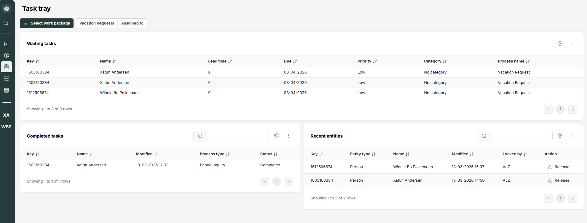
<h5>Figure 47: Advanced Search.</h5>
</div>

### How to Integrate the Task Tray
Integrating the Task Tray page into your application involves a few simple steps for the backend and frontend.
**Backend Setup**
1. **Add Gradle Dependencies:** In your `build.gradle` file, add the required dependencies.
   - `nc.amplio.libraries:task-tray-service`: Required for the core backend functionality.
   - `nc.amplio.libraries:task-tray-rest`: Required if you are integrating with the standard UI, as it provides the necessary REST endpoints.
2. **Import Application Configuration:** In your Spring Boot application configuration (e.g., BusinessApiConfig.java), import the corresponding configuration classes.
   - `TaskTrayServiceConfig.class`: For core backend services.
   - `TaskTrayRestConfig.class`: For UI integration (includes the service config).
      ```java
      @Import({
      //...
      TaskTrayServiceConfig.class,
      TaskTrayRestConfig.class,
      })
      @Configuration
      public class BusinessApiConfig {
      }
       ```

**Frontend Setup**
- **Add the Page to Your Router**: In your application's main routing configuration, add the `<TaskTrayPage>` component. It is available as a loadable component from the `@amplio/tasktray` library.
    ```tsx
    import TaskTrayPage from '@amplio/tasktray/pages/TaskTrayPage/Loadable';
    import { ClipboardList } from 'lucide-react';

    const corePageNavigationConfig: NavigationRouteConfig = useMemo(() => ({
        privateRoutes: {
            task_tray: {
                component: TaskTrayPage,
                icon: <Icon as={ClipboardList} />, // Example icon
            },
        },
        redirects: [],
    }), []);

    ```
  
# Further Reading 

For more details on the Processes and the Process Engine you can read the
- [DD130 - Process Engine](../DD130-Detailed-Design/Process-Engine.md)
- [DD130 - Principle of Processes](../DD130-Detailed-Design/Principles-for-processes.md)
- [DD130 - Process Assignment](../DD130-Detailed-Design/Process-Assignment.md)
- [DD130 - Process Administration](../DD130-Detailed-Design/Process-Administration.md)