# References

| Reference                                 | Author     |
|-------------------------------------------|------------|
| [Batchjobs]                               | Netcompany |
| [Processes]                               | Netcompany |
| [Integrations]                            | Netcompany |
| [Terms]                                   | Netcompany |
| [DocType]                                 | Netcompany |
| [O0300 – Maintenance Guide]               | Netcompany |
| [Templates]                               | Netcompany |
| [C0200 - Getting Started with Processes]  | Netcompany |
| [C0200 - Getting Started with Batch Jobs] | Netcompany |

<!-- =============== -->
<!-- REFERENCE LINKS -->
<!-- =============== -->

[Batchjobs]: https://goto.netcompany.com/cases/GTE2252/AMPJ/SitePages/default.aspx

[Processes]: https://goto.netcompany.com/cases/GTE2252/AMPJ/SitePages/default.aspx

[Integrations]: https://goto.netcompany.com/cases/GTE1624/NCJAVA/Lists/Integrations/

[Templates]: https://goto.netcompany.com/cases/GTE2252/AMPJ/RhoDeliverables/Forms/AllItems.aspx?RootFolder=%2Fcases%2FGTE2252%2FAMPJ%2FRhoDeliverables%2FTemplates&FolderCTID=0x0120007455F3B374F68E4194BE078F78C546C4&View=%7BCB26C1CD%2DDC71%2D41BB%2DBAFE%2DBB80F179340A%7D

<!-- ADO reference links -->

[O0300 – Maintenance Guide]: /O0300-Maintenance-Guide/Local-Environment-Setup

[C0200 - Getting Started with Processes]: https://source.netcompany.com/tfs/Netcompany/NCMCORE/_wiki/wikis/Documentation/9846/DD130-Detailed-Design

[C0200 - Getting Started with Batch Jobs]: https://source.netcompany.com/tfs/Netcompany/NCMCORE/_wiki/wikis/Documentation/9846/DD130-Detailed-Design

[DocType]: https://source.netcompany.com/tfs/Netcompany/NCMCORE/_wiki/wikis/Documentation/9846/DD130-Detailed-Design

# Introduction and Purpose

This document covers the decisions made on the project regarding how the design of various aspects of the system is
documented. The document serves as guidelines for what specific areas of the documentation should contain and how the
documentation should be structured. This document is divided into sections based on different areas of documentation.
Each section describes how a specific area of documentation should be constructed and what that area should include.

# Target Audience

The target audience for this document is all individuals who will develop design documentation.

# General Guidelines

All documents in the project must be created using a template, whether the document is approved or not. If the document
one wishes to create does not fit with one of the existing document templates, the blank template is used. This template
contains a minimum of elements and ensures uniformity in the document's appearance. As a rule, types, fonts, etc.,
defined in the templates are used throughout the document.

Generally, for text documents, the following sections are expected to be included unless they are actively omitted:

| Element                  | Description                                                                                                                                                                                                                                                                               |
|--------------------------|-------------------------------------------------------------------------------------------------------------------------------------------------------------------------------------------------------------------------------------------------------------------------------------------|
| Cover Page               | Cover page with the document's title, version, and status.                                                                                                                                                                                                                                |
| Document History         | A version history of the document in tabular form. The table must be updated at least when the document changes status. If an alternate way is used to track history, documentation history section can be omitted e.g., Such as for this platform documentation which utilizes git and ADO PR logs to maintain a history.                |
| References               | Table of external references used in the document. Internally in the document, references should be made to the reference table. The reference table will refer to external documents/resources.                                                                                          |
| Table of Contents        | Standard table of contents with headings and page numbers.                                                                                                                                                                                                                                |
| Introduction and Purpose | The introduction should describe what the document contains and describes. Technical terms and content should be kept to a minimum. As part of the introduction, it is encouraged to provide a business connection that describes the need the design solves.                             |
| Target Audience          | Description of who the target audience of the document is. It is relevant to know who should read the document and who may need to approve the document. Consideration should be given to whether it needs to go through an expert group or similar, e.g., in relation to business logic. |

For many types of deliverables, there may be additional relevant sections beyond these. Use the sections later in this
document and what is in the templates as a guide. In addition to Netcompany's standard templates (available by using
the "New document" button in the Toolkit), there are also several specialized templates related to the project for
documenting batch jobs, processes, etc. This list should be maintained continuously to ensure that documentation has a
uniform appearance and quality. It can be found in the Toolkit under [Templates].

## Language

Amplio working language is English. As such Amplio documentation and resources will be in english. Project working
language may differ based on aggrement with client.

### Abbreviations and Terms

Abbreviations and terms that are not commonly known should be described in a project glossary, commonly found in the
project toolkit.

## Tools

We recommend using a shared document repository to centralize information, documents, and discussions. Additionally, a
tool for tracking discussions and decisions should be utilized. The Toolkit is recommended because it ensures that all
documents and decisions are accessible to those who need them and that changes to documents are traceable.

Furthermore, the Microsoft Office suite is recommended as many of the existing templates for these deliverables can be
used effectively with it. Documents must be uploaded to the Toolkit even during their development.

Library of tools that can be used depending on project needs:

| Tool                            | Guidelines                                                                                                                                         |
|---------------------------------|----------------------------------------------------------------------------------------------------------------------------------------------------|
| Sparx Enterprise Architect (EA) | Used for documenting the data model. More described in [Data Model](/D0110-Technical-design-guidelines/Technical-design-guidelines.md#data-model). |
| Draw.io                         | Used to create figures used in other deliverables. See also [Figures](/D0110-Technical-design-guidelines/Technical-design-guidelines.md#figures).  |
| Archi                           | Used for more complex illustrations. See also [Figures](/D0110-Technical-design-guidelines/Technical-design-guidelines.md#figures).                |
| Camunda Modeler                 | Used to create and modify BPMN diagrams. This is used to define workflows in Amplio.                                                               |

# Modules

Like the system, the documentation is also modular. This means that when designing a new module, one must create a
folder containing the documents related to the module and follow a fixed structure. A template for this folder can be
found in the Templates folder in the Toolkit. Additionally, the Toolkit has a list of modules that should be updated
when a new module is created. The list currently contains only the module's name, its design and development status, and
a responsible person. The template folder contains the following documents:

- **O0500 – Software Architecture**: Introduces the module, the problem it solves, and the chosen technical
  architecture. It
  also describes which other modules this module depends on.
- **DD130 – Detailed Design**: Describes the module's technical design, including the interface the module exposes.
- **D0130 – Logical Data Model**: Describes the part of the data model that the module owns.

For small modules, this division may be too fragmenting. If this is the case, it is sufficient, after agreement, to use
the DD130 template and thus omit O0500 and/or D0130.

When developing the technical design of a module, it is important to remember that:

- A module must have a well-defined and delimited area of responsibility.
- A module must have a consciously chosen interface.
- A module must use a delimited part of the data model.

# Figures

To ensure that figures can be reused or edited later, figures should be saved in their source format as a separate file
as far as possible. If a figure is not self-standing as documentation and therefore does not have a fixed place in the
Toolkit, the figure's source file should be placed next to the document it is part of or in the figure folder in the
document library.

# Requirements

All system requirements must be recorded. If a project uses toolkit, this should be done in a requirements list found in
the Toolkit. Each requirement is recommended to have the following fields:

| Field              | Content                                                                                                                                              |
|--------------------|------------------------------------------------------------------------------------------------------------------------------------------------------|
| Module             | Overall area.                                                                                                                                        |
| Requirement Number | Specific number that can be referenced.                                                                                                              |
| Type               | Whether it is a feature or user story.                                                                                                               |
| Status             | Current status of the requirement. Can have one of the following statuses: new, clarified, designed, design approved, implemented, tested, approved. |
| User Archetype     | Source of the requirement.                                                                                                                           |
| Description        | What the requirement is.                                                                                                                             |
| Phase              | Which phase the requirement came from.                                                                                                               |
| Estimate           | The estimate from the analysis phase.                                                                                                                |
| Component          | Component assigned in the analysis.                                                                                                                  |

# Amplio Processes

Amplio processes define workflows for, for example, individual employment relationships that a user of the system can
perform. Workflows consist of steps that can either be user-facing input forms or calculation steps. More information on
how the processes work can be seen in [C0200 - Getting Started with Processes]. Documentation of Amplio processes should
be done in DD130s and as an aggregate list of all processes, e.g. a Toolkit list. The list provides an overview of the
processes that exist, and the associated design documents describe the details of how the processes work.
Depending on what the process needs to accomplish, the process likely also touches on several modules that should be
kept up to date when preparing the detailed design of a process.

## Amplio Processes List

All processes must have an entry in the aggregate list for [Processes]. The recommended fields to fill out are
described here:

| Field             | Content                                                                                                                                                                                                                                          |
|-------------------|--------------------------------------------------------------------------------------------------------------------------------------------------------------------------------------------------------------------------------------------------|
| Process Name      | The user-friendly name of the process.                                                                                                                                                                                                           |
| Technical Name    | The process's internal name. The name it has in the code.                                                                                                                                                                                        |
| Short Description | A brief description of what the process can do.                                                                                                                                                                                                  |
| Status            | Describes the current status of the process. Possible statuses are: new, clarified, designed, design approved, implemented, tested, approved, published, obsolete.                                                                               |
| Initiated By      | What can start the process, typically one or more of the following: Action Dropdown (manually started process), Internal Event (e.g., created by a batch job, another process, etc.), External Event (created by a message from an integration). |
| Process Owner     | Person who knows a lot about the process and can be contacted in case of problems or similar.                                                                                                                                                    |
| Feature           | Links to features that the process fulfills.                                                                                                                                                                                                     |

## Detailed Design for Processes

In the platform template folder (see [Templates]), you will find a version of the "DD130 – Detailed Design" document
that is adapted for process design for this project (see [Templates]). It is recommended that this is used used when
designing a new process.

The design document must follow the principles presented
in [General Guidelines](/D0110-Technical-design-guidelines/Technical-design-guidelines.md#General-Guidelines) of this document. In addition
to [General Guidelines](/D0110-Technical-design-guidelines/Technical-design-guidelines.md#General-Guidelines)
requires, the "Introduction and Purpose" section is expected to include a process diagram for the process. The diagram
should be formatted as described in [Process diagram](/D0110-Technical-design-guidelines/Technical-design-guidelines.md#process-diagram) and should be
placed at the end of the "Introduction and Purpose"
section. Additionally, the document should contain a description of what the process does. The best way to do this is to
describe each step in the process as a section in the detailed design. Depending on whether a step is automatic or
user-facing, there are things that need to be documented, which are described
in [User facing steps](/D0110-Technical-design-guidelines/Technical-design-guidelines.md#user-facing-steps)
and [Automatic steps](/D0110-Technical-design-guidelines/Technical-design-guidelines.md#automatic-steps), respectively.

If there are process steps that appear in multiple processes, the step description can be moved to a common "General
Process Steps" document, and then referred to in the section where the step would otherwise have been described, so the
description only needs to be maintained in one place.

### Process Diagram

As part of the documentation of a process, a process diagram must be created that describes the steps the process goes
through. The process diagram is formatted in the program Camunda in the BPMN format. A simple example is shown here:

<div style="text-align: center;">

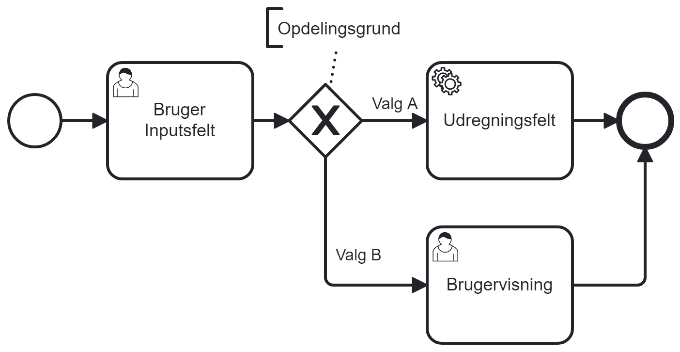
</div>

A BPMN diagram should, as far as possible, go from left to right and should include a starting point (thin circle) and
an endpoint (thick circle). Steps in the process are marked as boxes with the step name written on them. The icon on a
box should reflect whether a step is automatic (gear) or user-facing (person). An automatic step will always be
automatic, while a user-facing step can be automatic in some cases and manual in others. There should only be one
outgoing arrow from a step, but there can be multiple incoming arrows. If there are multiple paths through a process, it
is indicated with a diamond with an X in the middle. The diamond will have an arrow to all the steps the flow can
continue to, and each direction is labeled with a short description of the rule that determines which direction the flow
continues.

### User-Facing Steps

If it is a user-facing step, the data presented to the user should be described. This is done in the form of a mock (
user interface sketch). As part of the mock, there will be a table with references to elements inside the mock that
describes the text and possibly help text for each element. If there are input fields, it explains what options there
are, whether they can be changed, and what the default values are. Additionally, it defines what validations should be
performed on the input. The step should have a defined name as it will be visible in the process itself and other places
in the system, for example:

| User-Friendly Name | Internal Name                 |
|--------------------|-------------------------------|
| User Input Step    | FIRST_PROCESS_USER_INPUT_STEP |

### Automatic Steps

For automatic steps, the step documentation should describe the things that are performed. Automatic steps should also
have a defined name, for example:

| User-Friendly Name | Internal Name                  |
|--------------------|--------------------------------|
| Calculation Step   | FIRST_PROCESS_CALCULATION_STEP |

# Batch Jobs

Documentation of batch jobs takes place in
a Toolkit list and in design documents. The Toolkit list provides an overview of the batch jobs that exist today, and
the associated design documents describe the real details of how the batch jobs work. Each batch job will have a
detailed design document. Depending on what the batch job needs to accomplish, the batch job likely also touches on
several modules that should be kept up to date when preparing the detailed design of a batch job.

## Batch Job List

All batch jobs must have an entry in the aggregate list for [Batchjobs]. The recommended fields to fill out
are described here:

| Field             | Content                                                                                                                                    |
|-------------------|--------------------------------------------------------------------------------------------------------------------------------------------|
| Batch Job Name    | The user-friendly name of the batch job.                                                                                                   |
| Technical Name    | The batch job's internal name. The name it has in the code.                                                                                |
| Short Description | A brief description of what the batch job can do.                                                                                          |
| Frequency         | How often the batch job is run and when it is run.                                                                                         |
| Related Group     | Which batch jobs it is related to. For example, payment may have several batch jobs that need to run one after another, these are related. |
| Criticality       | How important the batch job is.                                                                                                            |
| Feature           | Links to features that the batch job fulfills.                                                                                             |

## Detailed Design for Batch Jobs

<!-- TODO: Section in need of rework -->
In the project's template folder (under deliverables), you will find a version of the "DD130 – Detailed Design" document
that is adapted for batch job design for this project. This must always be used when designing a new batch job.

The design document must follow the principles presented
in [General Guidelines](/D0110-Technical-design-guidelines/Technical-design-guidelines.md#General-Guidelines) of this document. In addition to
what [General Guidelines](/D0110-Technical-design-guidelines/Technical-design-guidelines.md#General-Guidelines)
requires, the following sections are expected in the document: operation pattern, read phase, processing phase,
reporting, and error handling. In addition to these, there may also be a post-processing section. Expectations for each
section are described in the following sections. The figure below shows how the different steps in batch jobs relate to
each other when implemented.

<div style="text-align: center;">

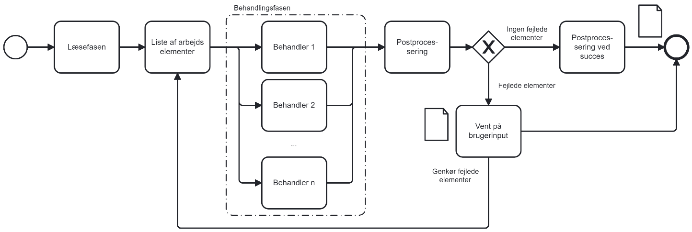
</div>

Consider whether the batch job has a clear division of tasks it needs to perform. In this case, it might make sense to
have a flowchart that shows exactly the steps the batch job needs to perform. Here, you can take inspiration from how
Amplio processes use a process diagram.

### Introduction and Purpose

<!-- TODO: Section in need of rework -->
The "Introduction and Purpose" section should include the items mentioned
in [General Guidelines](/D0110-Technical-design-guidelines/Technical-design-guidelines.md#General-Guidelines). Additionally, this section
should cover the following if relevant:

- What area of the system the batch job accesses.
- Overall, what data the batch job affects.
- Whether the batch job has relationships with other batch jobs.
- Whether it communicates with other systems and which integrations it uses.

### Operation Pattern

<!-- TODO: Section in need of rework -->
The operation pattern section should include a description of when the batch job should run or what triggers the batch
job. This should ideally include an explanation of why the chosen operation pattern was selected. When writing the
section, consider the following:

- External events we are waiting for before the batch job can start.
- External integrations that need to receive data from the batch job.
- Processes and batch jobs that depend on the batch job or batch jobs that cannot run simultaneously.
- General expectations about a given action being performed at a specific interval.
- Whether consideration is given to not overloading the system outside normal office hours.
- Whether consideration is given to not running heavy batch jobs simultaneously.
- If there are specific deadlines concerning third parties, note these, both incoming and outgoing.

### Read Phase

<!-- TODO: Section in need of rework -->
The read phase section should describe precisely the criteria used to find the elements to be processed by the batch
job. In addition to describing precisely which elements should be selected, it should also describe in what format these
elements are sent to the next phase; IDs are often the choice here. It is important to consider how elements are
grouped, whether elements can run in parallel, and whether there could be conflicts if multiple elements are processed
simultaneously.

### Processing Phase

<!-- TODO: Section in need of rework -->
The processing phase section should describe all the calculations and changes made by the batch job. The batch job
should be based on the elements that come from the read phase. This section depends heavily on what the batch job
performs and, therefore, does not have strict requirements for what should be described. Generally, however, it should
describe:

- Which modules the batch job uses in its processing phase.
- Any rules the data being processed must adhere to.
- Any data that should be logged during the processing.
- Any alarms the batch job can generate.

### Post-Processing

<!-- TODO: Section in need of rework -->
If there is a need for post-processing, include a post-processing section. Post-processing can involve tasks such as
sending data, validation, logging, alarms, or other activities. An important aspect of the post-processing step is that
it can collect results from the processing phase in a single thread, even if the processing phase was multi-threaded.
Note that in the batch job workflow, this is a real step in the batch job process performed after processing all
elements. The section should, like the other sections, describe precisely the tasks performed in this step.

### Reporting

<!-- TODO: Section in need of rework -->
The reporting section should describe what should be included in the report file generated after the batch job is
executed. As a standard, the report will contain basic information about the execution time and the number of elements
processed and failed. If additional information is needed, it should be described in this section. If no further
information is needed in the report, the section can be omitted.

### Error Handling

<!-- TODO: Section in need of rework -->
The error handling section should describe how to deal with errors in the batch job. Can the batch job be re-run without
issues to resolve the problem, or is it crucial that a batch job is not run twice due to the risk of double
registration? This should not be a complete guide to error handling but should convey important information about the
batch job in relation to error handling.

# Integrations

Documentation of integrations takes place in a Toolkit list and in design documents. The Toolkit list provides an
overview of the integrations, and the associated design documents describe the real details of how the integrations
work. Each integration will have a section in the document "D0180 – Integration Design" and its own "D0180 – Detailed
Design" document. The first document provides an overview of all integrations and covers important points about the
integrations. The second document provides space for all implementation details.

Overall, there are three levels of detail:

- The lowest level of detail is the Toolkit list. It provides an overview and is the reference if problems arise.
- The middle level of detail is D0180 – Integration Design. It describes the overall technical categories and principles
  used in the system and, for each integration, categorizes and provides an overall technical description. This document
  ensures consistent and well-founded design of integrations.
- The highest level of detail is the individual integration's D0180. This includes the precise description of the
  integration's interface, etc.

As part of the documentation, it should be considered whether there are special considerations regarding extra sensitive
information. If this is the case, these should be documented.

## Integration List

All integrations must have an entry in the aggregate list for  [Integrations]. The recommended fields to
fill out are described here:

| Field                           | Content                                                                                                                                                        |
|---------------------------------|----------------------------------------------------------------------------------------------------------------------------------------------------------------|
| Integration Name                | The user-friendly name of the integration.                                                                                                                     |
| Short Description               | A brief description of what the integration can do.                                                                                                            |
| Status                          | Current status of the integration. Can be one of the following: new, clarified, designed, design approved, implemented, tested, approved, published, obsolete. |
| Consequence of Downtime/Failure | If the integration is down or not working, what part of the system will not work or what is affected.                                                          |
| Version                         | Version number of the integration.                                                                                                                             |
| External Contact Person/Email   | Who can be contacted in case of problems.                                                                                                                      |
| Data Direction                  | Incoming or outgoing.                                                                                                                                          |
| Documentation Link              | Link to the documentation of the integration.                                                                                                                  |
| Feature                         | Links to features that the integration fulfills.                                                                                                               |

## Integration Design

The integration design document is created based on Netcompany's standard template. The document starts with a
cross-sectional section that describes the integration principles and patterns used in the system. Then, all system
integrations are listed, and for each integration, the following sections are filled out:

| Section                             | Content                                                                                                                                                                                                                             |
|-------------------------------------|-------------------------------------------------------------------------------------------------------------------------------------------------------------------------------------------------------------------------------------|
| Introduction                        | Service description and the service's purpose (use in the solution). Provider (who provides the service).                                                                                                                           |
| Integration Patterns and Operations | The service's integration patterns and operations (how communication occurs). Functionality (description of how the service works).                                                                                                 |
| Validation                          | Validation (what validations are performed, technical or business-wise, when the service is operated).                                                                                                                              |
| Triggers                            | In which usage scenarios the service is used (who uses it / which business processes / events).                                                                                                                                     |
| Volume and Frequency                | Volume (how much data is exchanged, how many transactions). Frequency (how often the service is used).                                                                                                                              |
| Response Time Requirements          | Response time requirements (how quickly the service responds / response time requirements in relation to the solution).                                                                                                             |
| Error Handling                      | Error handling (what error messages are expected from the service and how these are handled).                                                                                                                                       |
| Identified Gaps                     | Identified gaps/deficiencies in the service in relation to the solution (if the service has deficiencies, e.g., business cases that need to be covered by the service but are not fully covered. Make a list of deficiencies here). |
| Contact Information                 | Contact information (who to contact in case of errors – the contact list may also be maintained in the toolkit).                                                                                                                    |
| Internal Documentation              | A reference to the toolkit folder containing documentation of the interface. This includes all versions, documents, and possibly other materials related to the integration.                                                        |
| Final Documentation                 | A reference to the toolkit folder/file documenting the version that the design covers. This becomes more relevant in maintenance when external systems are updated.                                                                 |

## Detailed Design for Integrations

A detailed design is prepared separately for each integration in the system. The design document should be formatted in
a "D0180 – Detailed Design" document following Netcompany's standard template for this document. The document has the
following main sections: introduction, integration, adapter, and connector. The introduction section includes the target
audience as described in [General Guidelines](/D0110-Technical-design-guidelines/Technical-design-guidelines.md#General-Guidelines).

The integration section provides the overall description of the integration. The adapter section covers mapping for each
operation the integration exposes. The connector section covers information about the actual connection to the third
party. Expectations for the sections are divided into the following subsections.

### Integration Section

The integration section should be a description of the integration itself and its purpose in the system. Subsections in
this section include communication patterns and the operations available in the integration with a brief description of
them.

### Adapter Section

The adapter section should include a description of each operation the integration supports. Each operation should
describe the data format used by the integration; i.e., the precise structure for input and output. The section should
also describe the data mapping used between the external and internal environments. Additionally, it should describe the
validations performed. Finally, it should describe how the integration maps to the domain model.

### Connector Section

This section should cover all information needed for setting up the actual connection to the third party. The connector
section should include the following table where the description is filled out with relevant information.

| Property            | Description                                                                                            |
|---------------------|--------------------------------------------------------------------------------------------------------|
| Server (test)       | Test endpoint information, if relevant. Add more rows for other environments.                          |
| Server (production) | Production endpoint information.                                                                       |
| Security            | Type of security, e.g., username + password, SSH key, certificates.                                    |
| Authentication      | Usernames for environments. Reference to where passwords are stored.                                   |
| Delete Pattern      | If file transfer, when files are deleted.                                                              |
| Directory Structure | If file transfer, where files are placed on FTP, which directories.                                    |
| Naming Pattern      | If file transfer, naming patterns for data and acknowledgment files.                                   |
| Encoding            | Encoding used for messages.                                                                            |
| Schema              | If schema (XSD), link to schema.                                                                       |
| Examples            | If examples, link to examples.                                                                         |
| Validation          | Validation in the integration. Expected technical validation, schema, header/trailer information, etc. |

## Interface Documentation

When using integrations provided by a third party, we expect to receive an interface description. It is important that
the exact version of the interface description we received is easily accessible for debugging, etc. Therefore, such
documents are placed in the interface folder in the Toolkit. The interface folder should have a subfolder for each
integration. Inside the folder for a given integration, there should be a folder for each version of the integration
implemented in the system. This means the description could be in the folder: Interfaces/Integration ABC/Version 1.2.

<div style="text-align: center;">

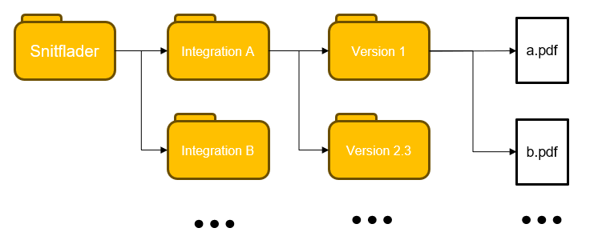
</div>

# Data Model

There is a logical data model and a physical data model.

## Logical Data Model (LDM)

Logical data models are a tool we use to describe and map the business domain. It provides a clear visualization of
business objects, their attributes, and their relationships and helps ensure a common understanding of the solution. The
LDM differs from the conceptual model by its higher level of detail, where business concepts are supplemented with
business logic, including a clear definition of business concepts, whether the concepts should be expressed as classes (
UML-Class) or attributes (UML-Attribute).

We use UML as the visual modeling language. The logical data models (UML Class diagrams) are designed and documented in
EA, after which they are published as a ZIP file on the Toolkit. After extracting this ZIP file, you can open the
index.htm file and access an interactive version of the data model.

The deliverable D0130 – Logical Data Model HTML is aimed at:

- Developers who need to understand the design of the data model and prepare detailed design and later implement the
  solution.
- Participants from the customer who are responsible for the functional design.

The deliverable D0130 – Logical Data Model Comments is aimed at:

- Participants from the customer who are responsible for reviewing and/or approving D0130 – Logical Data Model HTML.

### Subject Area

<h5> UML Package </h5>

A subject area is a delimited area of the solution's business domain, e.g., Employment Relationship, Personnel Category,
Pay Elements, and Accounting. The subject area is used to classify business classes, making it possible to reuse foreign
models and their relationships across models.
A subject area is documented with:

| Field       | Description                                                                                                                                                                                                                                            |
|-------------|--------------------------------------------------------------------------------------------------------------------------------------------------------------------------------------------------------------------------------------------------------|
| Name        | The unique name of the subject area.                                                                                                                                                                                                                   |
| Description | A description of the subject area; what it is and what it contains. The description also includes a reading guide for the specific subject area. This could be a description of which business objects are central to understanding the overall model. |

This appears in the published model as follows:

<div style="text-align: center;">

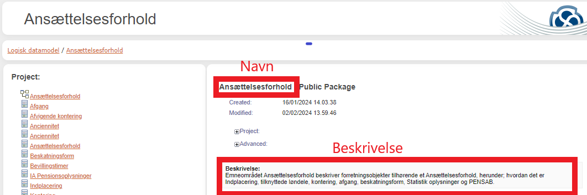
</div>

### Model

<h5>UML Class diagram</h5>

An LDM is created for each subject area. The model is a visual representation of the subject area's business objects,
their attributes, and relationships. Business objects that do not belong to the model's subject area are marked with a
blue color.

<div style="text-align: center;">

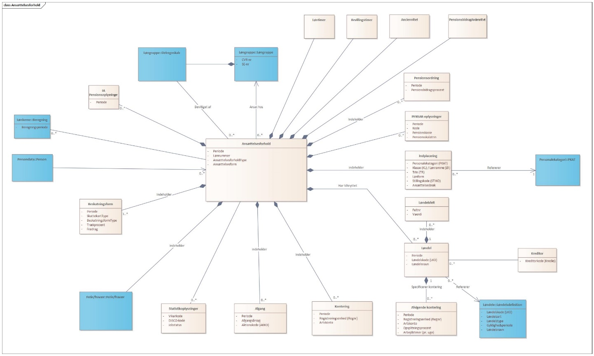
<h5>LDM Employment Relationship version 0.1</h5>
</div>
<br>

Models are documented with:

| Field          | Description                                                                                                                                    |
|----------------|------------------------------------------------------------------------------------------------------------------------------------------------|
| Name           | The unique name of the model.                                                                                                                  |
| Comment        | Which business area the model describes.                                                                                                       |
| Model Language | Danish (da)                                                                                                                                    |
| Version Number | Indicates the model's version, e.g., "1.0".                                                                                                    |
| Status         | Indicates the model's validity. Can be one of the following: 01 - Planned, 02 - Work in progress, 03 - Completed, 04 - Reviewed, 05 - Accepted |
| Subject Area   | The name of the subject area the model represents.                                                                                             |

### Class

<h5>UML Element: Class</h5>

A class is used to model a business object. A class can, for example, be an Employment Relationship.
Classes are documented with:

| Field        | Description                                              |
|--------------|----------------------------------------------------------|
| Name         | The unique name of the class.                            |
| Definition   | A definition should be concise, i.e., short and precise. |
| Subject Area | The name of the subject area the class belongs to.       |

### Attribute

<h5>UML Element: Attribute</h5>

Attributes are used to describe the properties of a business object. An Employment Relationship, for example, has the
property pay number, which indicates a unique readable identification number consisting of the employee's CPR and
personal sequence number.
Attributes are documented with:

| Field      | Description                                              |
|------------|----------------------------------------------------------|
| Name       | The unique name of the attribute.                        |
| Definition | A definition should be concise, i.e., short and precise. |

### Relation

Relations are used to describe how business objects relate to each other. We use the following relation types:

| Relation                      | Description                                                                                                                                                                                                                                                                     | Example                                                    |
|-------------------------------|---------------------------------------------------------------------------------------------------------------------------------------------------------------------------------------------------------------------------------------------------------------------------------|------------------------------------------------------------|
| Association                   | Used when a business object is associated with another. It is used, for example, between Placement and Personnel Category, as the placement refers to a specific personnel category.                                                                                            | 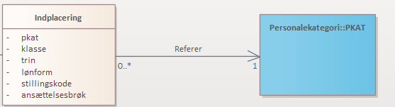 |
| Generalization/Specialization | Used between a superclass and a subclass, where the subclass is a type of the superclass. For example, Danish Tax Card and Greenlandic Tax Card are both specializations of a Tax Card. A superclass describes attributes common to all subclasses.                             | 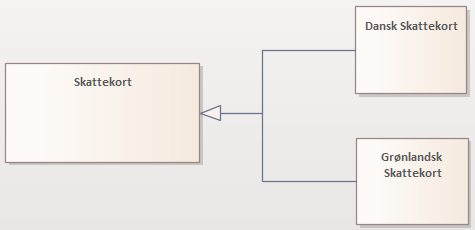 |
| Composition                   | Used to describe that a business object is part of another business object and therefore cannot exist alone. This relation is used, for example, between Employment Relationship and Placement, as the placement is part of the employment relationship and cannot exist alone. | 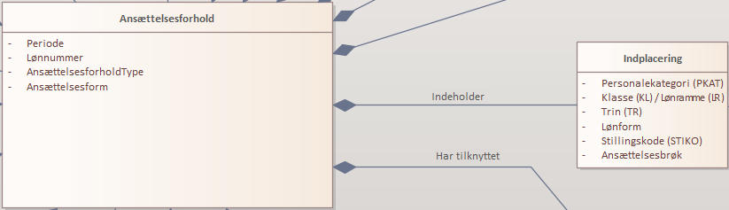 |

All relations are documented with:

| Field         | Description                                                                              |
|---------------|------------------------------------------------------------------------------------------|
| Definition    | A definition should be concise, i.e., short and precise.                                 |
| Relation Type | One of the following: Association, Generalization/Specialization, or Composition         |
| Multiplicity  | Indicates the cardinality of the classes. 1-to-1 is implicit if not otherwise specified. |

## Logical Data Modeling in Enterprise Architect

To be able to make changes to the logical data models, it requires having Enterprise Architect installed and access to
the project's EA database. See [O0300 – Maintenance Guide].

## Process for Updating the Logical Data Model

The logical data model can be found under: Browser -> Project -> Logical Data Model

### Open Toolbox

The Toolbox is a panel with many different tools. If the panel is not present, it can be opened by searching for Toolbox
at the top or pressing Ctrl + Shift + 3.

<div style="text-align: center;">

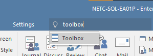
</div>

The Toolbox looks like the image below.

<div style="text-align: center;">

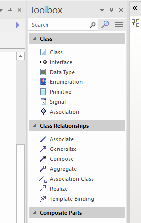
</div>

### Add Class

Toolbox Class Class -> Drag and drop the class to the desired location in the model.

Press Alt + Enter to open Class properties.

Enter the class name.

In the free text field below, enter 'Definition:' followed by 'This is my definition of the business object.'

In case the business object has multiple names, these can be entered under Keywords.

Click OK.

### Add Attribute

Select the class and press Ctrl + Shift + F9 and enter the attribute's name.

<div style="text-align: center;">

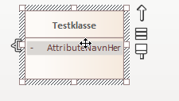
</div>

Then press Alt + Enter to open the Attribute Properties and add the definition in the free text field.

### Add Relation

Toolbox -> Class Relationships -> Click on the desired relation.

<div style="text-align: center;">

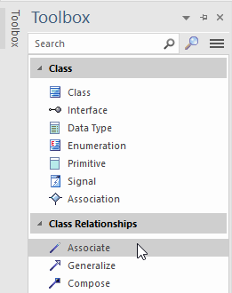
</div>

In the model, click on the class, while moving the mouse to the class to which it is related, and release.

Press Alt + Enter to open properties and enter the definition and multiplicity.

<div style="text-align: center;">

<h5 style="text-align: left;">A.</h5>

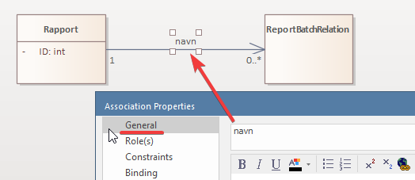

<br>

<h5 style="text-align: left;">B.</h5>

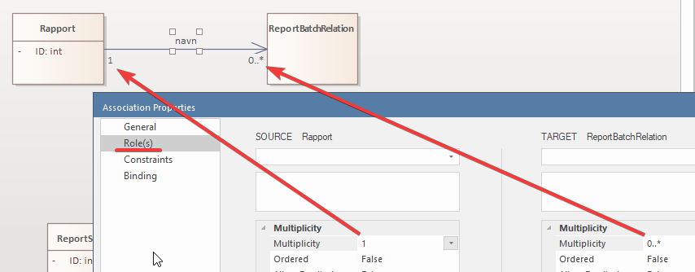

<br>

<h5 style="text-align: left;">C.</h5>

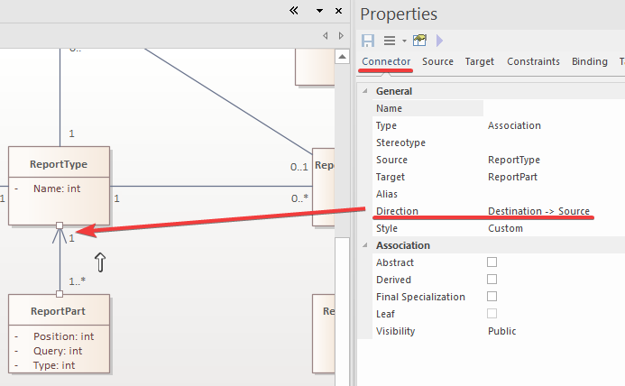

<br>

</div>

Press OK.

### Versioning

When changes are made to classes (UML-class) or attributes in a package (package), the package's and any parent
packages' version numbers must be updated. Right-click the package in Browser Project and select Properties.

<div style="text-align: center;">

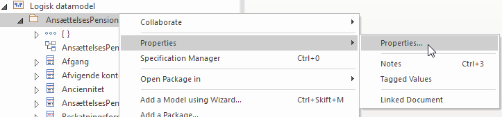
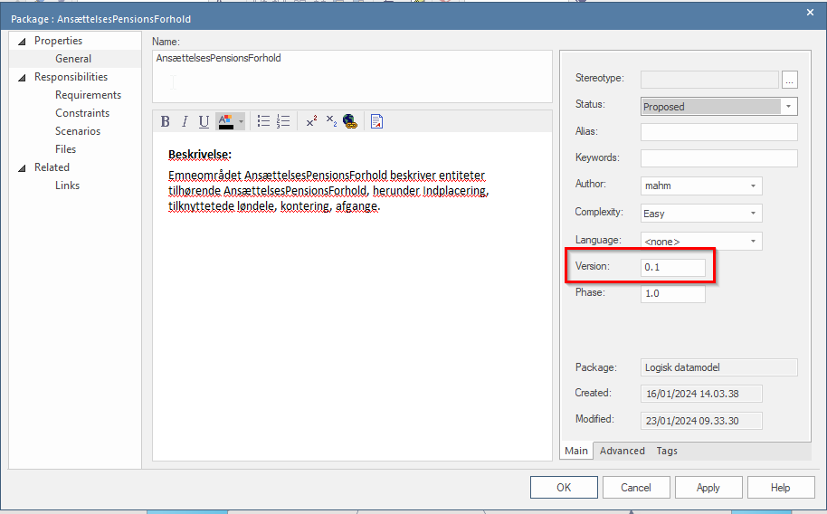
</div>

Update the version with the current + 0.1, in the example above, I would need to write 0.2, and click 'OK'.

### Publishing the Model

To generate an interactive HTML version of the models, do the following:

Select the package "Logical Data Model" in Browser Project Logical Data Model.

Go to Publish -> HTML -> Standard HTML Report.

<div style="text-align: center;">

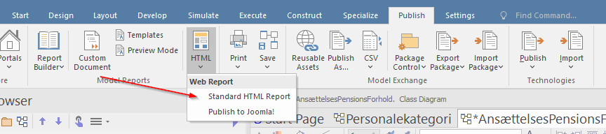
</div>

Check that Package: Logical Data Model and Title: Logical Data Model. 

In Output to: select an empty folder and click "Generate". 

Note: if there is a previously generated version in this folder, it will be overwritten.

<div style="text-align: center;">

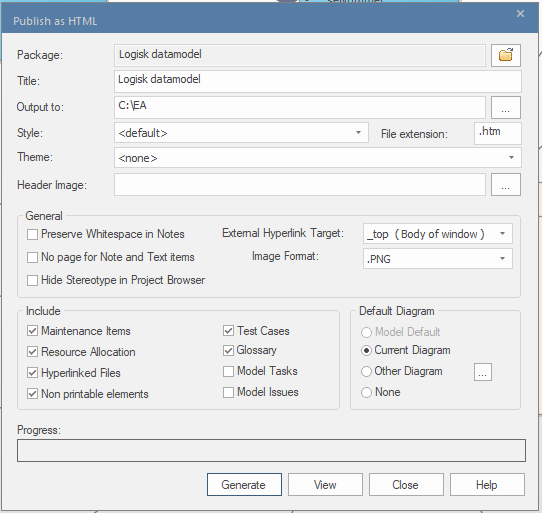
</div>

Zip the generated HTML version and upload it to Toolkit under Deliverables `D0130 – Logical Data Model` with the name 
`D0130 - Logical Data Model HTML`.

# Principles for Physical Data Modeling

This section describes the overall principles for modeling the physical database.

## Modeling in SQL

Overall guidelines:

- All SQL code is written in lowercase.
- All fields, function names, etc., are written in snake_case.
- All columns are described as precisely as possible in the exact type.
- Primary keys are modeled as UUIDs. (PostgreSQL's "uuid" type is preferred, but until it is implemented, "uuid_text" is
  used)
- The type "text" is preferred for representing all text. (PostgreSQL standard)
- Length restrictions on a column are defined only if there is a need for it. For example, a text string is defined as "
  varchar" without a length restriction.

### Numbers

Following guidelines for modeling numbers:

- A column is modeled as a number only if it is to be used in a mathematical operation (such as counters (that can be
  incremented), amounts (that can be summed), or days (that can be counted)). Other "numbers" are not modeled as number
  types. Instead, "digits" are used, which is a text that can only consist of numbers (such as CPR numbers, pay codes,
  or house numbers).
- Integers are always modeled as "bigint".
- Amounts are modeled as "decimal(16,2)", where decimals represent cents. In cases of intermediate calculations where
  decimal cents are desired, this may vary.
- Hours are always modeled as "decimal(16,2)".
- Percentages are modeled as "decimal(5,2)", which represents numbers between 0.00% and 100.00%. If higher than 100% is
  needed, it should be modeled as a factor.

### Fractions

Fractions are defined using two different columns "denominator" and "numerator", both as "bigint".

### Revision

All tables must have revision fields for:

```
created_by log_user, 
created log_timestamp, 
changed log_timestamp, 
changed_by log_user, 
version integer not null default (0)
 ```

Collection tables to describe a list of elements on another column do not need revision fields. Additionally, tables
that are "insert only" can be exempted from the rule of mandatory revision fields, after agreement with the architecture
team.

### Lists and JPA

Lists are modeled using collection tables.

In JPA, lists are modeled using ElementCollection if they consist of simple fields, such as fractions, numbers, or
strings. In cases where there is a need to change the JPA independently, they are modeled as a separate JPA.

### Enums

Enums are represented in SQL with a PostgreSQL Enum datatype. It is a text representation in the database, making it
easier to read.

They are mapped in JPA to an actual Java Enum.

## Maintenance of the Physical Data Model

Maintenance of the documentation for the physical data model occurs in Enterprise Architect.