### Document history

| Version | Date       | Author       | Status | Comments                                                     |
|---------|------------|--------------|--------|--------------------------------------------------------------|
| 0.1     | 25.09.2025 | A-Team, HESI | Draft  | Document structure setup, Task tray, Login page, Search page |

### References

| Reference                            | Title                                         | Author                     |
|--------------------------------------|-----------------------------------------------|----------------------------|
| [Figma][Figma_Design]                | Designsystem and Reference App Design mockups | Helle Skak-Iversen, A-Team |
| [D0100][D0100-Amplio]                | User Interface Guidelines                     | A-Team, Netcompany A/S     |
| [O0500][O0500_Software_Architecture] | Software Architecture                         | A-Team, Netcompany A/S     |
| [DD130][DD130]                       | Detailed design documentation                 | A-Team, Netcompany A/S     |

[Figma_Design]: https://www.figma.com/design/kk8dSuz0oKO93ihAVwZRBM/Amplio---Design-System--v3.0-?node-id=6941-24832&t=7bqbENHUEwDyMuUB-1

[D0100-Amplio]: https://source.netcompany.com/tfs/Netcompany02/NF4J/_wiki/wikis/Documentation/7848/Design-guidelines

[O0500_Software_Architecture]: https://goto.netcompany.com/cases/GTE2252/AMPJ/SitePages/Wiki.aspx#/O0500-Software-Architecture/Software-Architecture

[DD130]:https://goto.netcompany.com/cases/GTE2252/AMPJ/SitePages/Wiki.aspx#/DD130-Detailed-Design/

# Introduction to Amplio

Amplio is a comprehensive case management system that serves as the primary user interface for managing cases and
related workflows.
an integral component of the broader Providence system ecosystem, Amplio provides users with intuitive tools for case
handling and data management.
The complete system architecture and landscape are detailed in **O0500 – Software Architecture**.

This document provides a comprehensive specification for Amplio's user interface design, encompassing detailed
wireframes, user interaction patterns, and functional requirements.

## Purpose and target group

The purpose of this document is to describe and document the user interface for the Amplio solution. The target audience
includes:

- **Developers** - Who will implement the front-end solution based on these specifications
- **Clients** - Who will review and approve the design before implementation
- **Testers** - Who will validate the solution against the documented requirements and user flows

## Delimitation

The user interface design focuses on the core functionalities and associated user workflows related to Amplio.
Specifically, this document covers and details the mock-ups created in Figma for the solution, including:

- **Page structures** - Layout organization and component hierarchy
- **User interaction** flows - Step-by-step navigation and task completion paths
- **Navigation patterns** - Menu structures and routing between pages
- **Core functionality elements** - Feature specifications and behavioral requirements

## UI Design standards

All interface designs adhere to the established standards outlined in **[D0100 - Amplio][D0100-Amplio]**, ensuring:

- Consistent visual language across the platform
- Optimal user experience patterns
- Compliance with accessibility requirements
- Alignment with functional system requirements

This design-first approach guarantees that Amplio delivers both technical excellence and user satisfaction while
maintaining seamless integration.

## Usability principles

The usability of your software affects adoption, learning curve, and long-term maintainability. Good usability means
your users - whether they’re end-users, other developers, or automated systems - can accomplish their goals efficiently,
effectively, and with minimal frustration. Here are listed some usability principles that can be valuable to follow,
when setting up Amplio:

_1. Clarity over cleverness_

- Use explicit names, labels, and terminology. Avoid unnecessary jargon.
- Gestalt tie-in: _Law of Prägnanz (Simplicity)_ - humans prefer simple, well-organized forms. Simple naming and
  interface structures reduce mental strain.

_2. Consistency everywhere_

- Keep patterns the same across UI, APIs, and error handling.
- Gestalt tie-in: _Law of Similarity_ - elements that look or behave alike are perceived as related, making your system
  easier to navigate.

_3. Feedback is not optional_

- Show what’s happening with progress indicators, confirmations, and clear error messages.
- Gestalt tie-in: _Law of Continuity_ - feedback should follow logically from user actions, creating a smooth mental
  “flow” from cause to effect.

_4. Reduce cognitive load_

- Use sensible defaults and hide complexity unless needed.
- Gestalt tie-in: _Law of Proximity_ - group related fields, controls, or documentation examples so the brain processes
  them as a single unit.

_5. Prevent errors where possible_

- Validate inputs early, confirm destructive actions, and allow easy recovery.
- Gestalt tie-in: _Law of Closure_ - when the system prevents incomplete or ambiguous states, users can “complete the
  picture” without confusion.
- Gestalt tie-in: _Law of Common Fate_ - guide the user back on track by aligning system responses with their intended
  direction.

_6. Performance is part of usability_

- Minimize perceived wait times and keep the interface responsive.
- Gestalt tie-in: _Law of Continuity_ - uninterrupted, predictable flows feel faster and more natural.

_7. Document the obvious_

- Provide quick-start guides, inline tips, and sample code.
- Gestalt tie-in: _Law of Proximity_ - place relevant help directly next to the feature it explains so users don’t need
  to hunt for it.

[Read more about gestalt laws here](http://www.scholarpedia.org/article/Gestalt_principles).

## Accessibility principles

The solution must comply with established system standards as defined in:

- [W3C-Standards](https://www.w3.org/TR/).
- [Guidelines for WCAG 2.0 Level AA](http://www.w3.org/TR/WCAG20/).

# Sitemap

The following sitemap provides a comprehensive overview of Amplio's information architecture and navigation structure.

- **Quick Search**
- **Task Tray**
    - Entity page
        - Overview
        - Events
        - Journal notes & documents
        - Process
- **Entity search**
    - Person (Entity page)
        - Overview
        - Events
        - Journal notes & documents
        - Process
    - Processes
    - Examples entities
- **Dashboard**
- **Administration**
    - System Parameters
    - Portal Texts
    - Roles
    - Process Administration
    - Batch
    - Events
    - Data cloner
    - Rules
    - File loader
    - Integration monitor

# Page structure

## Primary navigation

Users can access all main pages listed below by selecting the corresponding item from the primary navigation located in
the side panel or top menu.
When a menu item is selected, users will typically land on the page first in the secondary menu on the left.

For the Amplio reference app, the left-top navigation layout is used.

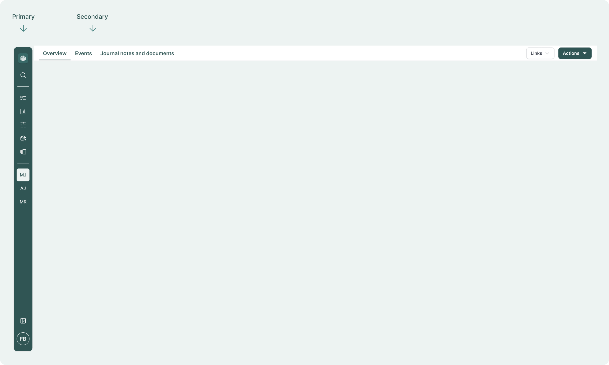
<h5>Primary and secondary navigation</h5>

## Secondary and tertiary navigation

Each page includes a secondary, tab-based navigation at the top. The Task Tray is the only exception — since it contains
a single page, a page title is displayed instead of navigation tabs.

Please refer to
the [D0100 - Amplio](https://source.netcompany.com/tfs/Netcompany02/NF4J/_wiki/wikis/Documentation/7848/Design-guidelines)
for further details on navigational layouts.

# Quick Search

Quick search is a unified search feature that lets you quickly find entities, content, and actions across the entire
application.
It provides a unified interface for searching by names, identifiers, or partial keywords. Results are displayed in a
list with relevant details, ensuring efficient navigation.

The quick search comes in two states:

1. When the primary navigation (left-top) is collapsed
2. When the primary navigation (left-top) is expanded.

_When using top-top navigation layout, the default quick search is variant 2_

**Variant 1 - When the side panel is collapsed**  
Quick Search opens in a centred modal on the screen.
- The modal contains:
- A search field at the top for entering the search term.
- A results list grouped by relevant categories (e.g., entity types, content, actions).
- Keyboard navigation (arrow keys to move, Enter to select).
- Click the searchbar, search icon or use a shortcut (e.g., `Ctrl + K`) to activate search overlay.
- The modal can be closed using the Escape key or by clicking outside the modal area.

**Purpose:** Provide a quick, distraction-free search flow without relying on the side panel.

<h5>Example - When users start to type into the searchbar, the quick search display results matching the input</h5>

The quick search modal comes in two states:

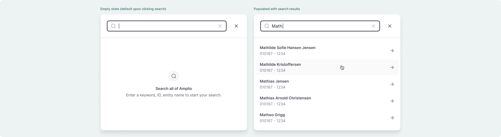
<h5>States of the quick search modal</h5>

**Variant 2 - When the side panel is expanded**  
Quick Search appears as a searchbar in the expanded primary navigation.
- Clicking the searchbar, users can unout freetext into the input field.
- Upon input, the quick search will suggest matching results e.g. on entities.

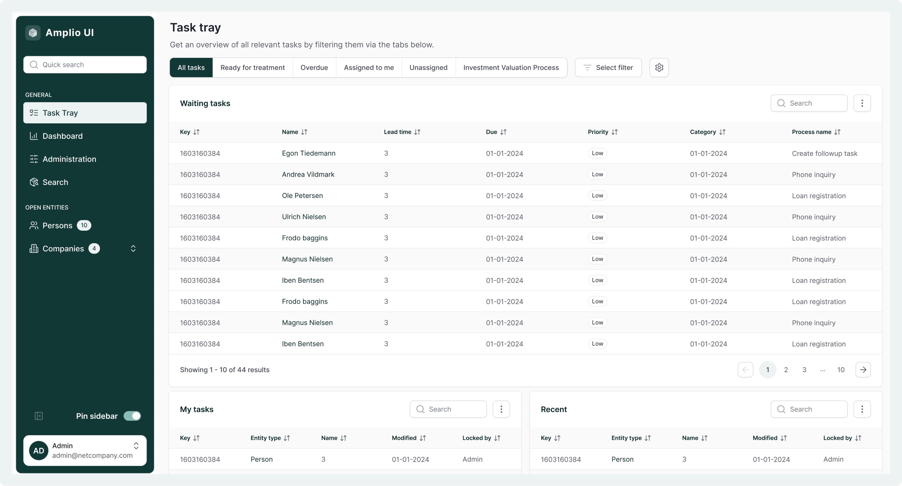
<h5>Quick search can be accessed from the expanded menu by clicking the searchbar</h5>

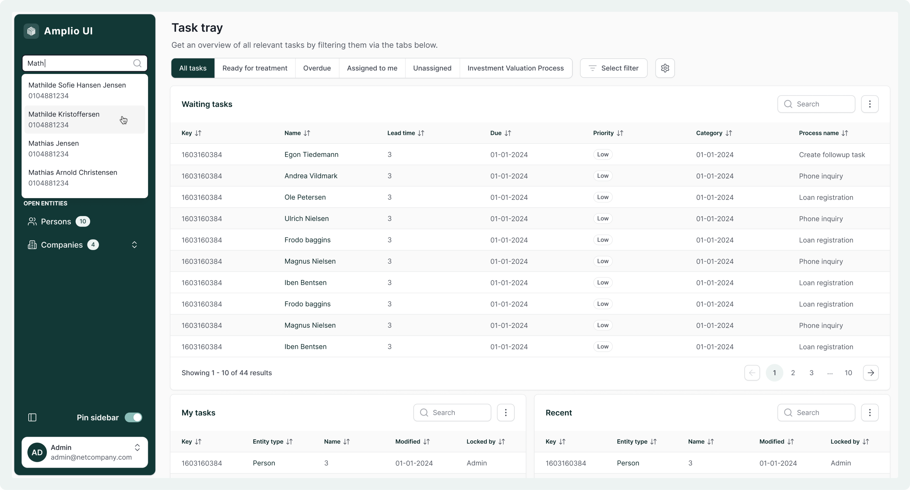
<h5>To begin search, users need to enter text into the field. The quick search will then suggest matches</h5>

# Task Tray

The task tray serves as the central workspace for case managers, providing a comprehensive view of their work activities
and available assignments.
This interface streamlines task management by organizing information into clear, actionable table sections.

The task tray is organized into three key table sections:

- **Waiting Tasks** - Displays all tasks that are currently available for assignment. These are tasks that have not yet
  been reserved by other case managers, allowing users to select and begin work on items that match their skills and
  availability.
- **Completed tasks** - Shows tasks that the case manager has completed within a recent time period. This provides
  visibility into recent work history and completed activities.
- **Recent tasks** - Contains tasks that are currently assigned to or reserved by the case manager. This section
  provides quick access to ongoing work and active assignments. Reserved tasks can be released by clicking the release
  button attached to each task row in the table.

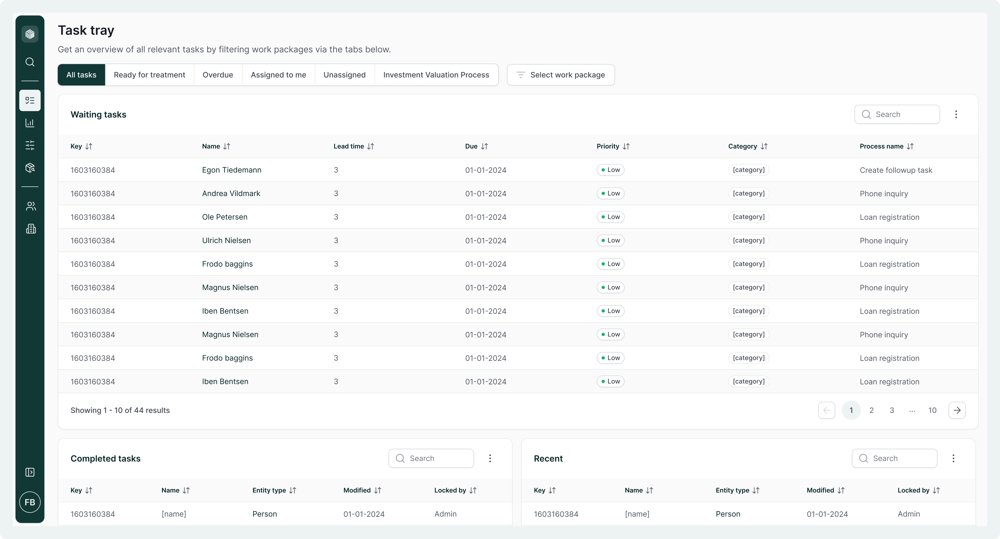
<h5>Task tray</h5>

## Waiting tasks table

Displays all tasks that are currently available for assignment. These are tasks that have not yet been reserved by other
case managers, allowing users to select and begin work on items that match their skills and availability.

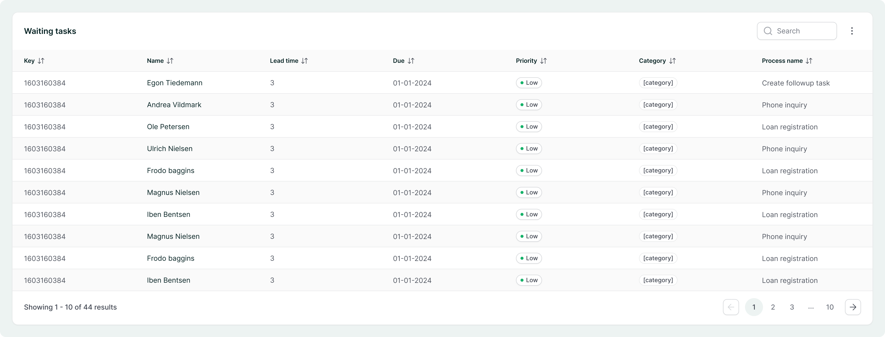
<h5>Task tray - Waiting tasks table</h5>

Each task row is clickable and will navigate the user to the process, on the associated entity page.

| Columns (attribute) | Description                                                                                                                         |
|---------------------|-------------------------------------------------------------------------------------------------------------------------------------|
| Key                 | Task ID                                                                                                                             |
| Name                | Name of the entoty the task concerns                                                                                                |   
| Lead time           | How many days the task has been waiting                                                                                             |
| Due                 | Due date                                                                                                                            |
| Priority            | The ergency of the task. The badge with dot is used here.                                                                           |
| Category            | Task category (if any) projects can choose to use badges with different colours to differentiate tasks in the overview more easily. |
| Process name        | The name of the process (task)                                                                                                      |

### Task priority

Tasks have three priority levels: 'Low', 'Medium', and 'High'. The priority is automatically calculated based on the
task's due date and two configurable system parameters (MID and HIGH priority thresholds).

Example of priority calculation:

- Given parameters: MID = 8 days, HIGH = 3 days.
- Task created with 21-day processing time.
- Initial priority: 'Low'.
- After 13 days (8 days before due date): Changes to 'Medium'.
- After 18 days (3 days before due date): Changes to 'High'.

Business administrators can:

- Override the calculated priority manually.
- Manage priority thresholds in the administration module.
- Configure task-specific priority limits.

  <strong>Note:</strong> By default, priority limits are uniform across all task types unless specifically configured otherwise.

<h5>Figure 2.1 - Example of task priority levels (Low, 
Medium, High). These colors are for illustration purposes only and are not
displayed in the task tray.</h5>

Clicking a row in the task tray opens the selected entity's Overview tab in the cross-sectional view, with the associated task process displayed.

## Recent tasks table

Contains tasks that are currently assigned to or reserved by the case manager. This section provides quick access to
ongoing work and active assignments. Reserved tasks can be released by clicking the release button attached to each task
row in the table.

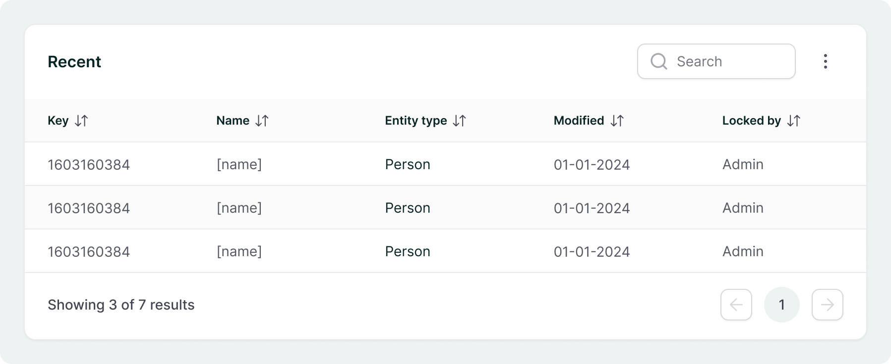
<h5>Task tray - Recent tasks table</h5>

| Columns (attribute) | Description                                                                                                                         |
|---------------------|-------------------------------------------------------------------------------------------------------------------------------------|
| Key                 | Task ID                                                                                                                             |
| Name                | Name of the entoty the task concerns                                                                                                |   
| Lead time           | How many days the task has been waiting                                                                                             |
| Due                 | Due date                                                                                                                            |
| Priority            | The ergency of the task. The badge with dot is used here.                                                                           |
| Category            | Task category (if any) projects can choose to use badges with different colours to differentiate tasks in the overview more easily. |
| Process name        | The name of the process (task)                                                                                                      |

## Completed tasks table

Shows tasks that the case manager has completed within a recent time period. This provides visibility into recent work
history and completed activities.

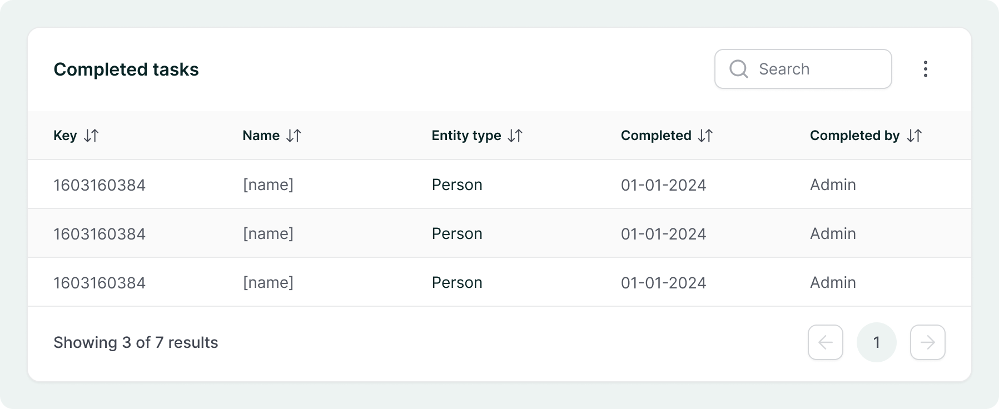
<h5>Task tray - Completed tasks table</h5>

| Columns (attribute) | Description                               |
|---------------------|-------------------------------------------|
| Key                 | Task ID                                   |
| Name                | Name of the entity the task concerns      |   
| Entity type         | The type of entity the task was done for. |
| Completed           | Completion date                           |
| Completed by        | The user that completed the task.         |

## Quick filters & Work packages

The task tray provides dynamic filtering capabilities that allow users to focus on specific subsets of tasks based on
work package categories.
This filtering mechanism is implemented through a tabbed interface, where each tab represents a distinct work package
type.

The quick filters can be configured by favoriting or unfavoring work packages via the **Select work package** button.
This is covered in section ["Configure quick filters"](#configure-quick-filters).

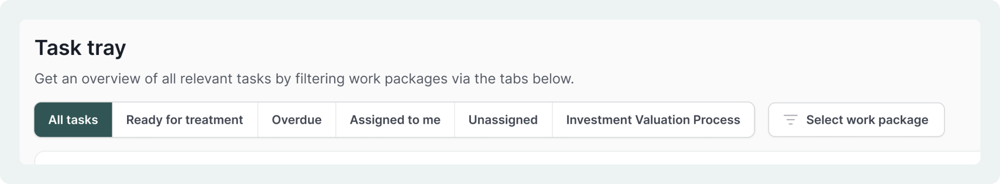
<h5>Example - Quick filters are displayed as tabs</h5>

Users can filter the content displayed in task tray tables by selecting from available work package tabs.
When a specific work package tab is activated, the task tray automatically updates to show only those tasks and items
that belong to the selected work package category.

### Batch job configuration for work packages

Before newly created tasks are assigned to the relevant work packages, the batch job 'Work package update' must be run.
Configuration of the batch job is managed by the project.

### Setting work package restrictions

In some projects, the top section is controlled by administrative assignment of work packages to selected teams or
specific users.
When configuring work packages in the administration module, a work package can be restricted to selected roles. In this
case, they only appear in the work package selector if the user has one of these roles.

## Configure quick filters

The quick filter configuration feature allows users to personalize their task tray interface by selecting which work
packages appear as quick filter tabs.
Through the "Select work package" functionality, users can customize their workspace to display only the most relevant
work package filters for their current responsibilities.

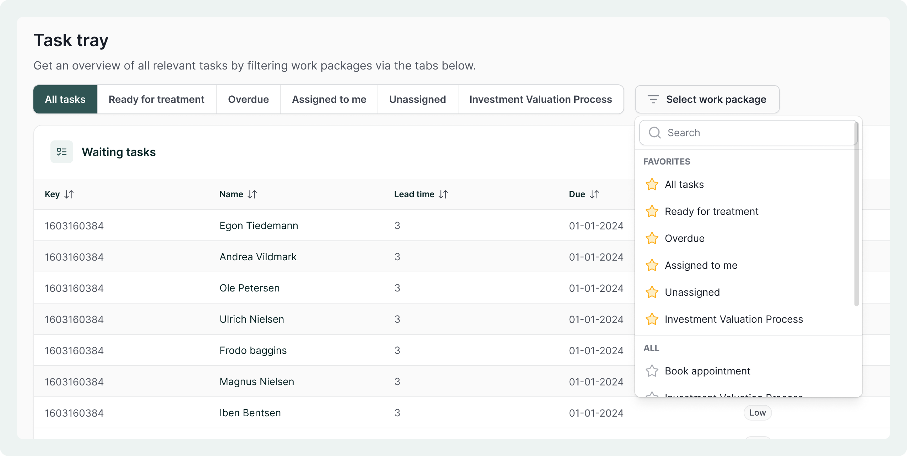
<h5>Configure quick filters bia favoriting or unfavoring work packages</h5>

Via the "Select work package" button, users can switch out the quick filters with others by favouriting new ones.
The system provides a dropdown interface where users can manage their work package preferences by adding or removing
favorites from their quick filter tabs.

By unfavoriting a work package via the "Select work package" dropdown, they will disappear from the tab overview,
allowing users to maintain a clean and focused interface that matches their workflow needs.

## Search and select work packages from list

Users who need to filter by work packages beyond their favorited ones can use the “Select work packages” dropdown to
search for and choose additional packages.

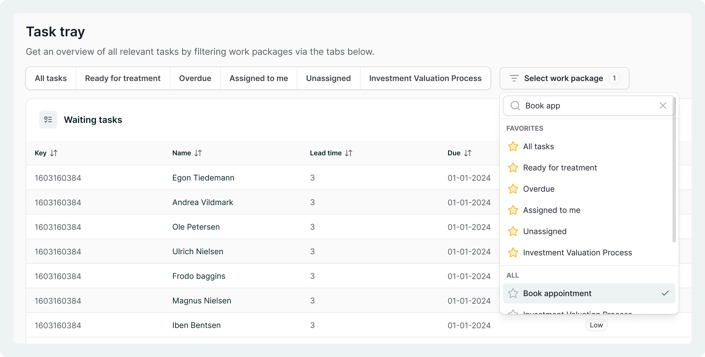
<h5>Select other work packages than the favorited ones in the dropdown</h5>

Once a package is selected, its state updates to clearly indicate selection, and the task tables refresh to reflect the
chosen work package.
The item in the list changes state, as well as the search bar, which has badges showing what has been selected.

The selected item will always reloacte to the top of the list, just below the favorited ones, so that users can quickly
deselect the again.
Users can clear their selection by clicking the "x" in the searchbar og by unselecting the chosen item, in the dropdown.
Only one work package can be selected at a time.

# Search page

The search page provides case managers with the ability to search for entities stored in the application database.
This functionality serves as a central hub for locating and accessing specific records within the system.

The types of entities that users can search for depends on the project, and what kind of entities are defined there.

The search interface follows a split-screen design where users can input search parameters on the left while viewing
corresponding results on the right, providing an intuitive and efficient search experience.

The entities in the Amplio Reference app include:

- Person
- Processes

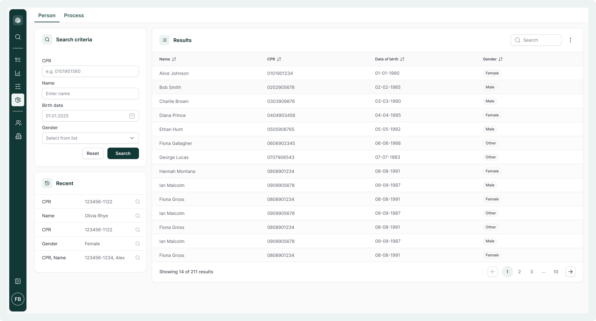
<h5> Search page </h5>

## Search criteria

Search criteria are configured using the search form located in the card on the left side of the search page.

The available search criteria are determined by two key factors:

- **Project Configuration** - Each project may have different search parameters based on its specific requirements and
  customizations
- **Entity Type** - The selected entity type determines which search fields and filters are available to users

Search criteria can be reset by clicking the "Reset" button in the bottom of the Search criteria card.

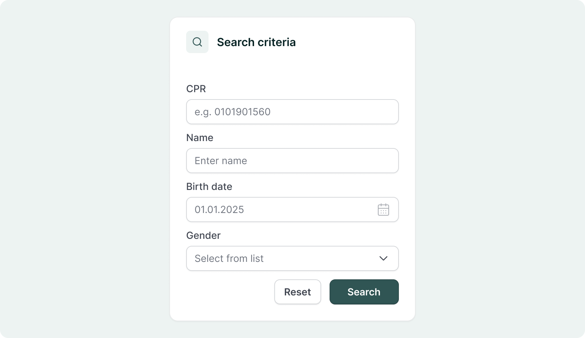
<h5> Example of search criteria </h5>

## Recent searches

Recent search showcases the **10 recent searches** that the user has done.

Each row can be clicked, and therefore have the hover effect, inherited by tables.

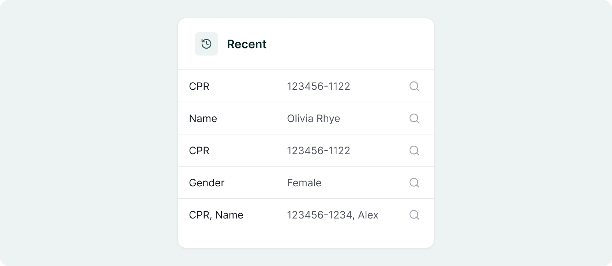
<h5> Example of search criteria </h5>

The recent search card contains a table with 3 columns:

| Attribute   | Description                                                                 |
|-------------|-----------------------------------------------------------------------------|
| Input type  | The type of input.                                                          |
| Input       | The search input that the user entered.                                     |
| Search icon | This icon is displayed to make it more visual that the rows can be clicked. |

## Search results

Search results are presented in a table positioned on the right side of the search page.
The displayed results correspond directly to the search criteria entered by the user in the search form on the left.

**Filtered results** - When specific search criteria are provided, the table displays only the records that match the
entered parameters
**Complete dataset** - If a user initiates a search without specifying any search criteria, the table will display all
available data for the selected entity type

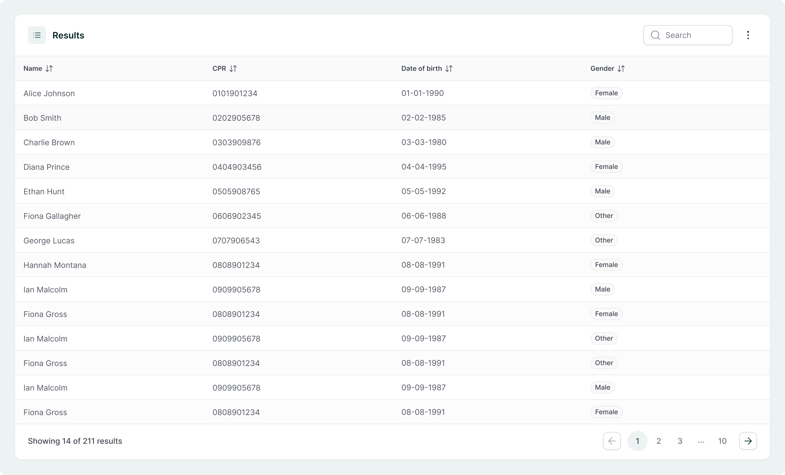
<h5> The table is located to the right and displays search results depending on the entered search criteria </h5>

### Empty state

Empty states appear when a table has no data to display, providing clarity instead of showing a blank space.
They inform users why the table is empty and guide next steps. In this case it could be that users need to click "
Search" in order for the table to show them data.

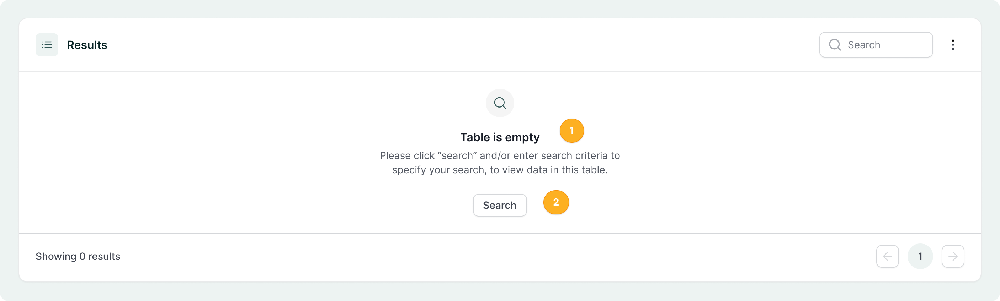
<h5> Example of empty state in the search results table </h5>

| Footnote | Description                                                                                                                                                                                                                |
|----------|----------------------------------------------------------------------------------------------------------------------------------------------------------------------------------------------------------------------------|
| 1        | <strong>Empty state messaging </strong>  Communication to the user about why the empty state occur, and what they can do to populate the table with data                                                               |
| 2        | <strong>Search button</strong>  As users need to either set search criteria og click the Search button to populate the table with data, a search button is provided for them, in context with the empty state message. |

### Table options

The table options functionality is accessible through a dropdown menu, represented by a three-dot ellipsis (⋯) button on
the search results table.
This feature provides users with several table management capabilities.

The table options dropdown includes the following functionality:

- **Table Configuration** - Allows users to customize table settings including:
    - Column visibility controls
    - Filtering options
    - Sorting preferences
    - Table density
    - _**Note:** Administrative privileges are required to access table configuration features._
- **Export to CSV** - Enables users to export current search results to CSV format for external analysis or reporting
  purposes
- **Refresh Results** - Provides the ability to refresh and reload the current search results to ensure data accuracy

## Supported entity types in the Amplio Reference app

The search functionality supports the following entity types in the Amplio reference app:

- **Person** - Entity type within the system that emulates a person that
- **Processes** - Work items/processes

### Person

The following section describes the search criteria and search results for person-based searches as an example.

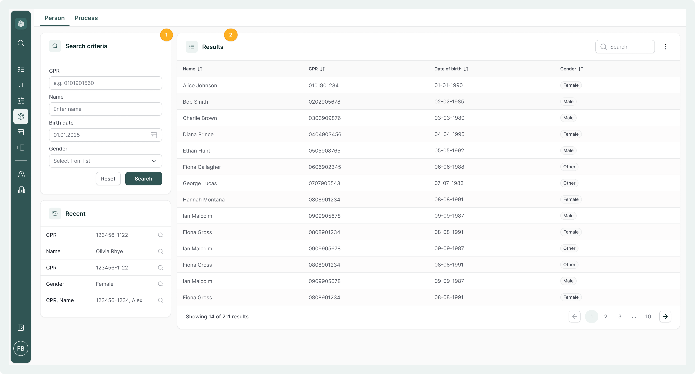
<h5>Search persons page</h5>

| Footnote | Description                                                                                                                                                                                                                                                                                                                                                                                                                                                                                                                                                     |
|----------|-----------------------------------------------------------------------------------------------------------------------------------------------------------------------------------------------------------------------------------------------------------------------------------------------------------------------------------------------------------------------------------------------------------------------------------------------------------------------------------------------------------------------------------------------------------------|
| 1        | <strong>Search critera form</strong>  The user can search based on the following attributes: - Cpr number: CPR number allows wildcard searches enabling users to search for partial CPR numbers. For example, searching with ‘25’ will find all CPR numbers containing 25. - Name - Birth date  - Gender  If no search results are found for a CPR number, a button will appear in the search results area allowing instant replication via a CPR number.  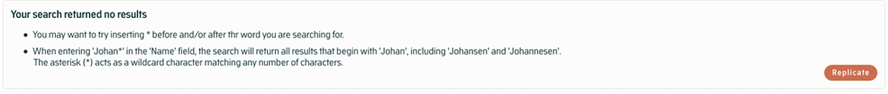 |
| 2        | <strong>Search results</strong> The search results include the following columns: - 	Name. - CPR number.                                                                                                                                                                                                                                                                                                                                                                                                                                            |

### Process

The process search functionality enables users to locate specific processes using multiple search criteria.

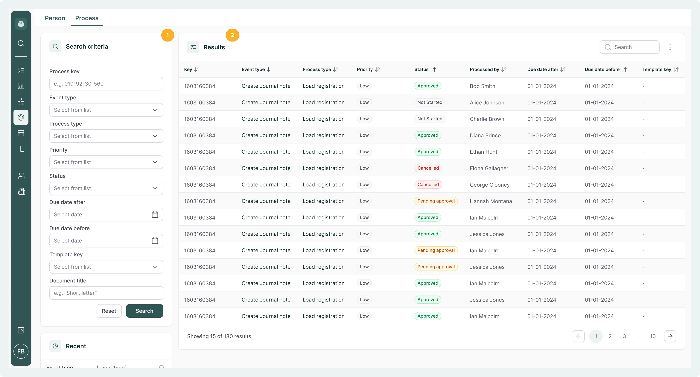
<h5>Search processes page</h5>

| Footnote | Description                                                                                                                                                                                                                                                                                                    |
|----------|----------------------------------------------------------------------------------------------------------------------------------------------------------------------------------------------------------------------------------------------------------------------------------------------------------------|
| 1        | <strong>Search criteria form</strong>  The user can search based on the following attributes: - Task key. - Name. - Event type. - Task type. - Priority. - Status. - Processed by. - Due date after. - Due date before. - Template key. - Document title.  |
| 2        | <strong>Search result</strong> The search results include the following columns: - Process key.  - Event type  - Process type  - Priority  - Status  - Processes by  - Due date after  - Due date before  - Template key.                                              |   

## Customise available entities

Projects have the flexibility to customise the available entities based on their specific requirements.
This customisation can be achieved by:

- **Removing entities** - Standard Amplio entities that are not relevant to the project can be excluded from the search
  functionality
- **Adding project-specific entities** - Custom entities tailored to the project's unique needs can be incorporated
  alongside or in place of standard entities

## Customise search interface

The search functionality includes the following components that can also be customised per project:

- **Search** - The primary search interface and functionality
- **Search result** - The display format and content of search results
- **Latest results** - Recent search history and quick access to previously viewed items

# Entity page

An entity page in Amplio a dedicated page on the platform that focuses on a single, clearly defined subject — known as
an entity. That entity could be a person, property, inquiry (to name a few examples).

The purpose of an entity page is to present all essential information about that entity in one place, such as its
description, attributes, cases, relationships to other entities, related processes and relevant links, event, actions or
references.

### Sub-pages

Entity pages in Amplio often include several sub-pages containing different types of data that users can explore to
learn more and complete their tasks.

The following sections outline the standard pages and components available in the Amplio Reference App. These elements
can be customized and expanded based on project needs and include:

- **Overview** - Displays key information about an entity and its current status.
- **Journal Notes and Documents** - Contains related notes and supporting documentation.
- **Events** - Shows a chronological history of activities.
- **Single Case View** - Provides detailed information for individual cases.

Each project can:

- Configure these standard sub-pages to meet specific requirements
- Add **custom sub-pages** for project-specific data
- Control tab visibility based on **user roles and permissions**

### Navigation on entity pages

Users can navigate between sub-pages using the **secondary navigation**, which is described in detail in *
*[D0100 - Amplio](https://source.netcompany.com/tfs/Netcompany02/NF4J/_wiki/wikis/Documentation/7848/Design-guidelines)
**.

<h5>Secondary navigation with sub-pages</h5>

By default, the secondary navigation on entity pages includes **two action buttons**:

**Links** – A dropdown containing project-specific useful links, including:

- **Deep links** to specific pages within external systems.
- **Static hyperlinks** to fixed URLs.
- **Dynamic hyperlinks** that append entity-specific data (e.g., CPR number or ID).
- **Links defined through system parameters.**

**Actions** – A dropdown showing processes that can be started on the entity. Selecting an item from this list initiates
the corresponding process.

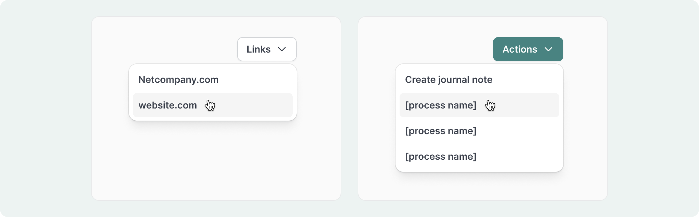
<h5>Links and actions buttons in the secondary navigation</h5>

## Overview

The overview is the default page that users land on when accessing an entity. The overview acts as the place where users
can read more into the general details about the entity, see recent events that happened to the entity, and ongoing
processes/tasks that has been started on the entity.
Most often these comes in the form of tables, data tiles or cards with text.

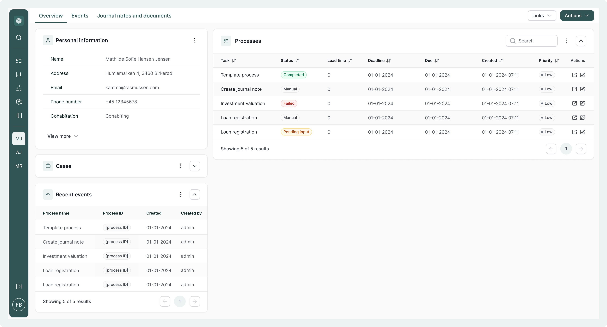
<h5>Entity page - Overview</h5>

The standard overview in the reference app takes an example in an entity as a person and contains three standard tables
and one cards with information.

### Information list

At the top of the **overview page**, an **information list in a card** is displayed to highlight important aspects of
the entity that the case manager needs to be aware of.
In this case it is called **Personal information**** as we are dealing with a person.

- The information list is a standard component of the overview.
- The specific content shown in the list is defined per project and entity type.
- The list is retrieved asynchronously, because:
    - Some information comes from external systems with long response times.
    - Data must be gathered from multiple locations in the database.

While the information list is loading, a **skeleton loader** is shown to indicate that the content is being fetched.
Read further into the skeleton loader
in [D0100 - Amplio](https://source.netcompany.com/tfs/Netcompany02/NF4J/_wiki/wikis/Documentation/7848/Design-guidelines)

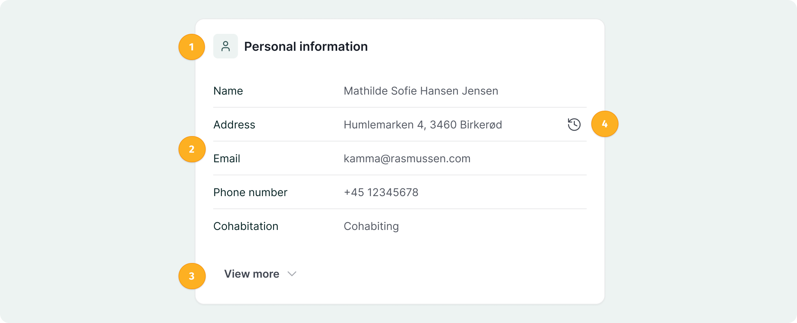
<h5>Information list - "Personal information"</h5>

| # | Description                                                                                                                                    |
|---|------------------------------------------------------------------------------------------------------------------------------------------------|
| 1 | Card header describing the information shown with a title and gives context with the featured icon                                             |
| 2 | List of information about the entity. in this case a person                                                                                    |
| 3 | View more button. If clicked the list will extend.                                                                                             |
| 4 | View history button. If clicked usrs trigger a modal where they can see history for that data type. E.g. if an address have changed over time. |

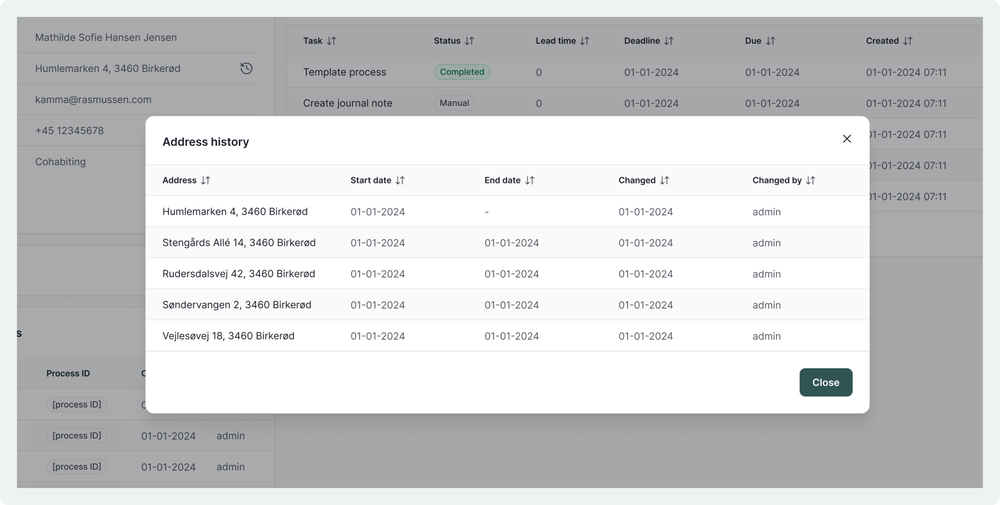
<h5>By clicking the view history button, a modal is triggered</h5>

### Cases

The case table displays all cass associated with the selected entity.

WHAT IS A CASE?

The rows are clickable, and will navigate the user to the corresponding details view for the case.
New cases that are created through processes are showcased here automatically.

| Column | Description        |
|--------|--------------------|
| Title  | Case title         |
| Type   | Case type          |
| Status | Status of the case |

### Recent events

### Processes

The processes table shows all pending processes for the selected entity. Clicking a process row opens the corresponding
process, above the processes table. Read further into the details of this in the [section on processes](#processes-1).

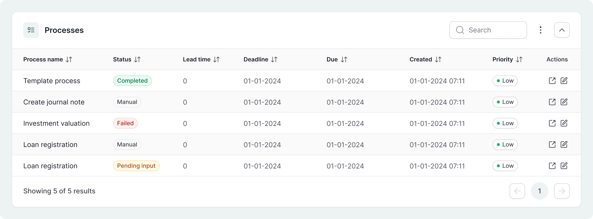
<h5>Table showcasing ongoing processes for the current entity</h5>

The data displayed in the table is customised depending on the projects, and what kind of data is available.

Below is described the data that is in the Amplio Reference App, and what is showcased in the image above.

| Column       | Description                                                                                                   |
|--------------|---------------------------------------------------------------------------------------------------------------|
| Process name | Name of the process                                                                                           |
| Status       | Status of the process e.g. _Interrupted, Awaiting input, Awaiting system, Failed, Completed, Manual, Paused._ |
| Lead time    | Describes how many days a process has been ongoing.                                                           |
| Due date     | The date which the process is due to be completed.                                                            |
| Created      | Date that the process was started                                                                             |
| Priority     | Priority of the process.                                                                                      |
| Actions      | Actions available for the individual row.                                                                     |

## Events

The Events page allows caseworkers to track, review, and manage key events related to the selected entity.
It provides a centralized overview of system-logged and user-created events, helping ensure transparency,
accountability, and efficient follow-up.

It contains a table displaying all associated events with the selected entity that have happened across all case.

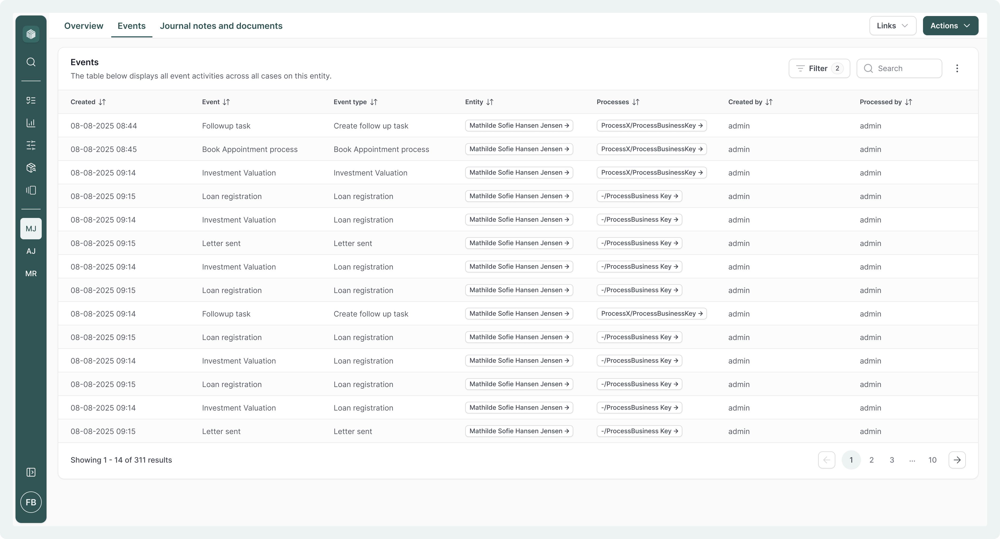
<h5>Event sub-page</h5>

| **Column**       | **Description**                                                                                                                                                                                                         |
|------------------|-------------------------------------------------------------------------------------------------------------------------------------------------------------------------------------------------------------------------|
| **Created**      | The date the event was created.                                                                                                                                                                                         |
| **Event**        | The title or name of the event.                                                                                                                                                                                         |
| **Event Type**   | The user-facing key or category of the event.                                                                                                                                                                           |
| **Entity**       | The entity or individual that the event concerns. Entities in this tabæe is displayed as a clickable badge that redirects the user to the corresponding entity page.                                                    |
| **Processes**    | Processes in this table is a clickable badge that redirects the user to the corresponding process on the associated entity page. See [processes](#processes) for a detailed description of related process information. |
| **Created by**   | The user who created the event.                                                                                                                                                                                         |
| **Processed by** | The user who processed the event.                                                                                                                                                                                       |

### Processes column

As described, processes are displayed as a link in the "processes" column.
The **processes** column displays up to two **hyperlinked task references**, separated by a forward slash (`/`).

- **First ID (`[TASK ID 1]`)** – The **initiating task**, shown if the event was triggered by another task.
- **Second ID (`[TASK ID 2]`)** – The **task directly associated** with the event.

Examples of display formats:

- `- / -` → No task references available
- `[TASK ID 1] / -` → Initiated task only
- `- / [TASK ID 2]` → Associated task only
- `[TASK ID 1] / [TASK ID 2]` → Both initiated and associated tasks

<h5>Example of the processes column with said formats</h5>

Clicking a task ID opens the corresponding task page, which displays:

- The complete task process
- Actions performed
- Decision basis
- Applied rules and criteria

> **Note:** Sorting in this column is based on **`[TASK ID 1]`**.  
> If `[TASK ID 1]` is not present, the system sorts using the placeholder `"-"` rather than `[TASK ID 2]`.

## Journal notes & Documents

The **Journal Notes and Documents** sub-page displays all journal notes and documents created in any task within any
case for the selected entity.

This sub-page is a **standard component** in Amplio and includes two tables:

- **Journal Notes** – Lists all journal notes related to the entity.
- **Documents** – Lists all documents associated with the entity.

Users can locate specific **journal notes** or **documents** using the tools provided at the top of the tables (Figure
6).

- **Search** - The search function, located in the top right corner, matches text across all displayed columns as well
  as within the content of journal notes. Results update automatically with each character entered, providing immediate
  feedback.
- **Filter table on date range** - In the top right corner, there is a **Filter** button. Clicking this button opens a *
  *filter menu**, where users can set a **date range** to display only entries created within the selected period. This
  helps users focus on the most relevant records without changing the main table view.

<h5>Journal notes & Documents page</h5>

<h5>Filter on date range via the "Filter" button located in the table header</h5>

### Journal Notes Table

| **Column Name** | **Description**                                                        |
|-----------------|------------------------------------------------------------------------|
| **+ / –**       | Expands or collapses the journal note row to display detailed content. |
| **Created**     | The date the journal note was created.                                 |
| **Title**       | The title of the journal note.                                         |
| **Case**        | Lists any cases linked to this journal note.                           |
| **Created by**  | The name of the case manager who created the journal note.             |

### Documents Table

| **Column Name** | **Description**                                                                                  |
|-----------------|--------------------------------------------------------------------------------------------------|
| **+ / –**       | Same expand/collapse functionality as described in [Open Journal Notes](#journal-notes).         |
| **Created**     | The date the document was created.                                                               |
| **Title**       | The title of the document.                                                                       |
| **Key**         | A user-facing reference key for identifying the document.                                        |
| **Created by**  | The name of the case manager who created the document.                                           |
| **Actions**     | Provides options to open the document in a new window or perform other document-related actions. |

### Opening a journal note

Each row in the table includes a “+” icon on the left side. Clicking this icon expands the row (the icon changes to
a “–”) and reveals additional details directly within the table.

When expanded, users can view journal notes and other relevant information related to the selected inquiry without
navigating away from the overview. This allows for quick access to context and history while maintaining focus on the
main inquiry list.

For more information on the design specifications, refer
to [D0100 – Amplio](https://source.netcompany.com/tfs/Netcompany02/NF4J/_wiki/wikis/Documentation/7848/Design-guidelines),
where the behavior and layout of expanded rows are described in greater detail.

<h5>Expandable rows in Journal notes table</h5>

# Processes

In Amplio, all tasks are carried out through **processes**.

Users can start a process directly from an **entity page** by clicking the **“Action”** button in the top-right corner
of the secondary navigation and selecting the desired process from the dropdown menu. Processes can be initiated from
any of the sub-pages within the entity.

Once a process is started, users are automatically redirected to the **overview page**, where the new process appears as
a section—typically just above the processes table.
The process card is highlighted with a brand-colored border to indicate that it is different from the other cards on the
page.

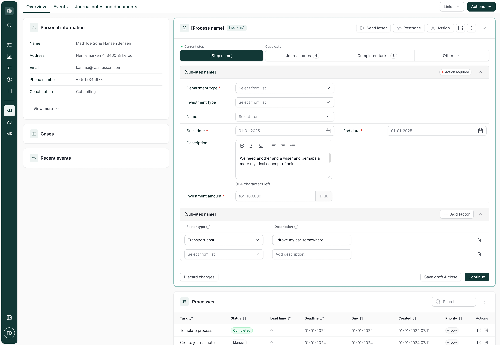
<h5>Example of the process layout on an entity page</h5>

For more complex processes that may take time to load, a **skeleton loader** is displayed on the relevant components
until the system is ready.
Please refer
to [D0100 - Amplio](https://source.netcompany.com/tfs/Netcompany02/NF4J/_wiki/wikis/Documentation/7848/Design-guidelines)
for more details on skeleton loaders.

## Structure and layout of processes

The process layout is designed to guide users through completing and managing a process and the tasks within.
It’s organised into sections (sub-steps) that create a logical flow from understanding the task context to performing
detailed actions.

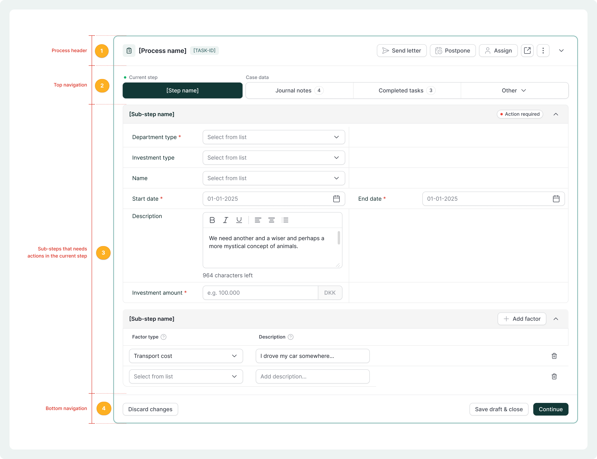
<h5>Process with design annotations</h5>

| # | Description       |
|---|-------------------|
| 1 | Process header    |
| 2 | Top navigation    |
| 3 | Step modules      |
| 4 | Bottom navigation |

### Process header (coming soon)

All processes contain a header, that display general process information and where users has access to additional
processes or functionalities.

By Amplio default the header contains the following information about the process:

| Title                    | Description                         |
|--------------------------|-------------------------------------|
| Featured icon (optional) | Custom icon attached to the process |
| Process name             | The descriptive name of the process |
| Process ID               | The unique ID of the process        |

By Amplio default the header contains functionalities such as:

| Title                   | Description |
|-------------------------|-------------|
| Send letter             |             |
| Postpone                |             |
| Assign                  |             |
| Fullscreen              |             |
| Options (ellipsis icon) |             |

These functionalities can either be rendered as a button or moved into the Options dropdown to be rendered as a dropdown
item.

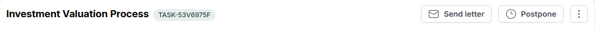
<h5>Process header</h5>

### Top navigation

Users can navigate between the current process step and case data using the tabs located at the top of the process card.

The **process** view uses a combination of **tab components** , toggles and modal interactions to organize and display
process-related content.
The navigation is structured to balance clarity (clear process steps) and flexibility (process data access and
contextual tools).

Processes uses the tab component in two parts:

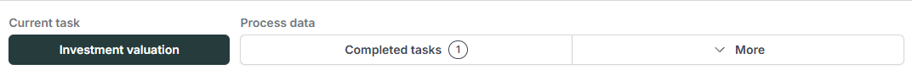
<h5>Process navigation divided into current step and process data</h5>

| Title             | Description                                                                                                                                                                                                                                                                              |
|-------------------|------------------------------------------------------------------------------------------------------------------------------------------------------------------------------------------------------------------------------------------------------------------------------------------|
| Current step tab  | The current step tab represent the current stage of the ongoing process. This tab group always contains a single tab, indicating the active step the user is working on. It functions primarily as a contextual header rather than a navigational control.                               |
| Process data tabs | The process data tabs provide entry points to related information and data connected to the current process. These tabs allow users to access views such as previous notes, attachments, completed steps, related events and completed integrations without leaving the process context. |

A maximum of **six tabs** can be displayed at once (including the current process step tab).
When there are more than six tabs, the additional process data tabs are grouped into an **“Other”** or **"More"**
dropdown, which is always positioned on the **far right**.

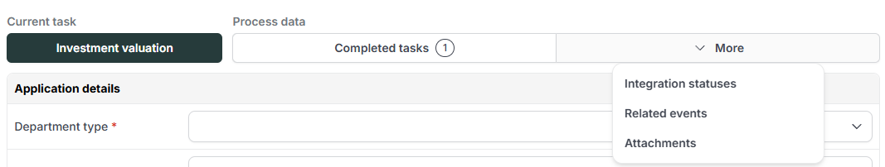
<h5>Processes - Navigation w. dropdown</h5>

The available process data tabs can be **customized** to better meet project-specific needs. Projects may choose to:

- **Hide standard tabs** that are used less frequently by case workers.
- **Emphasize essential data** to streamline workflows and reduce visual clutter.

Note that some of the data tabs open as **modals**, while others act as on/off toggles that display process data
alongside the modules within the current step.
The exact behavior depends on whether the process is shown in an **integrated view** (for example, within an entity or
search page) or in the **full-screen** process view.

The process view is responsive. When the process view is smaller than 80rem (1280px), the process data module appears on
top of the current step, and when the process view is wider than 80 rem, the process data module and the current step
will appear side by side.

### Integrated mode

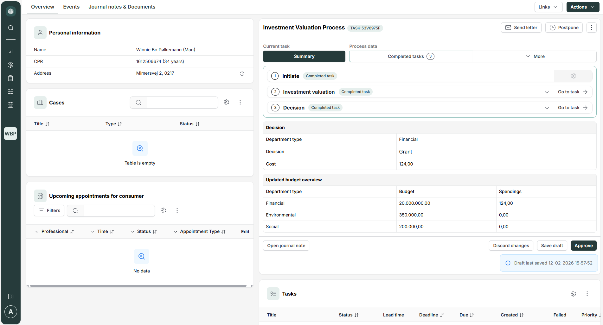
<h5>Process in fullscreen mode</h5>

### Fullscreen mode (Undocked)

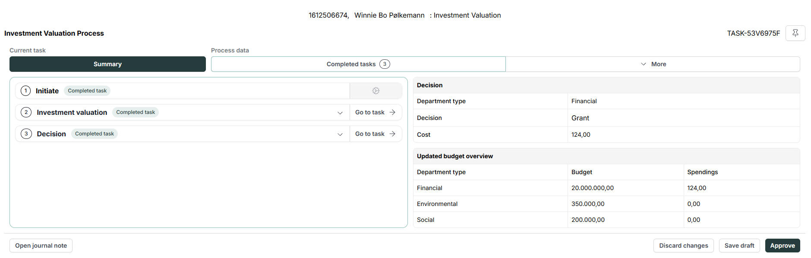
<h5>Process in fullscreen mode</h5>

### Step modules

### Bottom navigation

## Example - Send letters

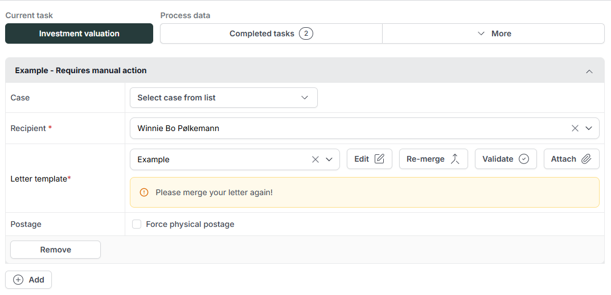
<h5>The send letters module</h5>

The send letters module is a part of every process, and appears when clicking on the "Send letter" option on the process header.
Letters are added and removed through clicking on the "Add" and "Remove" buttons. Each letter is opened inside a accordion making it expandable/collapsable when creating many letters in the same step. 

By default, there are the following steps in the Send letters module:

- Case
- Recipient
- Letter template
- Postage

The case picker and the template picker are the same as the ones used in Journal notes, which will be described in their
own sections below.

## Journal notes

### As part of a process

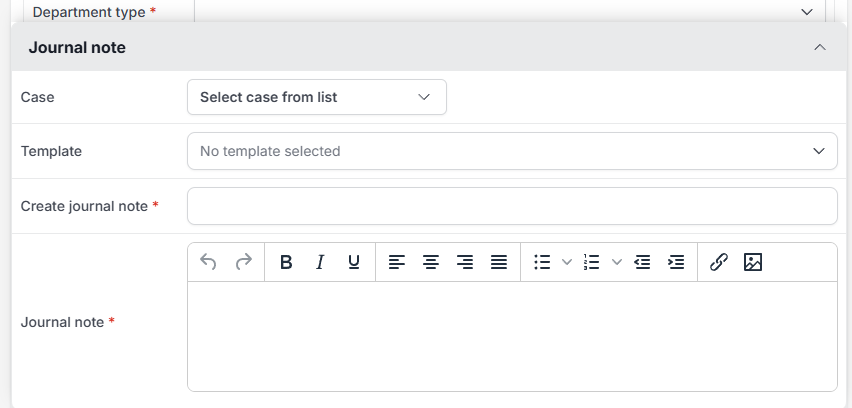
<h5>Journal notes as a part of a process</h5>

When journal notes is created as a part of a process, it appears underneath the current step in a floating accordion that always stays on screen on scroll.

### As a standalone process

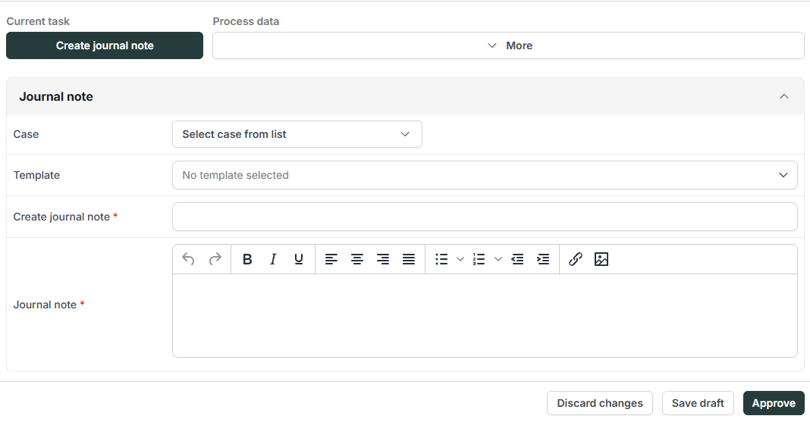
<h5>Journal notes as a standalone process</h5>

As a standalone process, the journal notes module appears in the same way as a letter form, in an accordion.

## Case and template picker

For both letters and journal notes, it is possible to attach cases to them through the case picker. The user interaction
follows this flow:

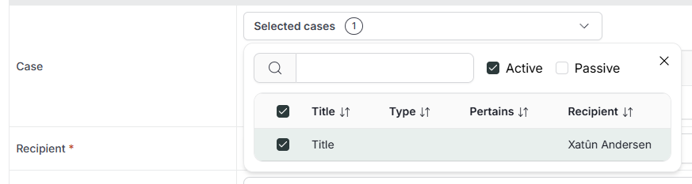
<h5>Case picker popover</h5>

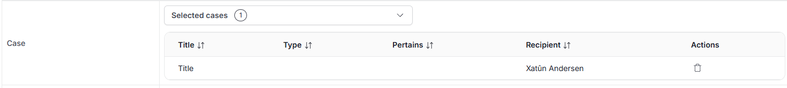
<h5>Case picker summary table</h5>

- Click the selection button to choose cases from available options
- A popover appears containing:
    - A search field to filter cases
    - Filter options to narrow down results
    - A table displaying matching cases below
- Upon selecting case(s), a summary table appears below the selection button showing all chosen cases
- Users can remove cases from the summary table using delete actions
- The selection button updates to display the count of selected cases

Templates can be used when creating both letters and journal notes, and are selected through the template picker
component. The user interaction follows this flow:

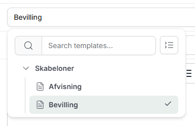
<h5>Template picker</h5>

- Click the template dropdown to open the selection menu
- A dropdown menu displays all available templates with a search bar in the header for filtering
- Templates may be organized in expandable folders - click to expand/collapse individual folders
- A "Collapse all" button next to the search field collapses all expanded folders at once
- Select the desired template from the list to apply it

# Administration pages

The Administration pages comprise a set of modules that provide various functionalities enabling administrative users to
configure system settings and manage user access to different areas of the application.

<h5>Administration - Menu item as expanded and collapsed</h5>

Users with the appropriate permissions can access the Administration pages through the **Administration** option in the
primary menu.

## System parameters

System parameters allow the user to implement changes to the system’s constants, either immediately or at a set date
with no need to redeploy or restart the system, causing the system to act accordingly when the parameters take effect .

The user can access the system parameter page via the menu item "Administration, which is found in the primary
navigation panel. Here users can search for and change parameters as necessary with immediate effect, or via a patch
causing the change to take effect after the next deployment.

Please refer to [DD130 - Detailed Design][DD130]  to read further into the functionality of system parameters.

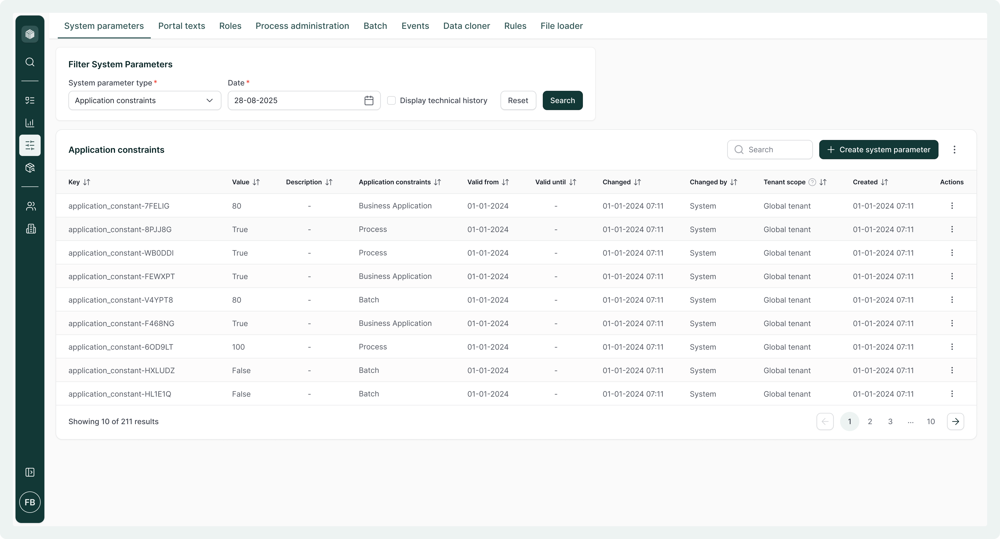
<h5>Administration - System parameters page</h5>

The System Parameters page consists of two main components:

- **Filter and Search** – Allows users to locate existing system parameters based on **Type** and **Date**. Users enter
  the desired criteria and click **Search** to display matching results, or **Reset** to clear the search fields.
- **Results Table** – Displays system parameters that match the specified search criteria.

### Create new system parameter

To create a new system parameter within the Administration application, perform the following steps:

1. Navigate to the **System Parameter Admin** tab (wrench icon).
2. In the **Select Type** dropdown menu, select the required system parameter type.
3. Click **View System Parameters** to display the list of existing parameters.
4. When the table is displayed, select **Create System Parameter** from the upper-right corner of the table header. This
   will trigger a modal.

The **Key** field is automatically populated and may be read-only, depending on the configuration of the selected type (
**allow_manual_keys**).

Complete all mandatory fields.  
The **Valid From** and **Valid Until** fields are available for all system parameter types and define the validity
period of the parameter instance and its attributes.
Once all required information has been entered, click **Save** to persist the new system parameter instance.  
Upon successful creation, the system redirects the user to the **Valid Versions** page for the newly created instance.

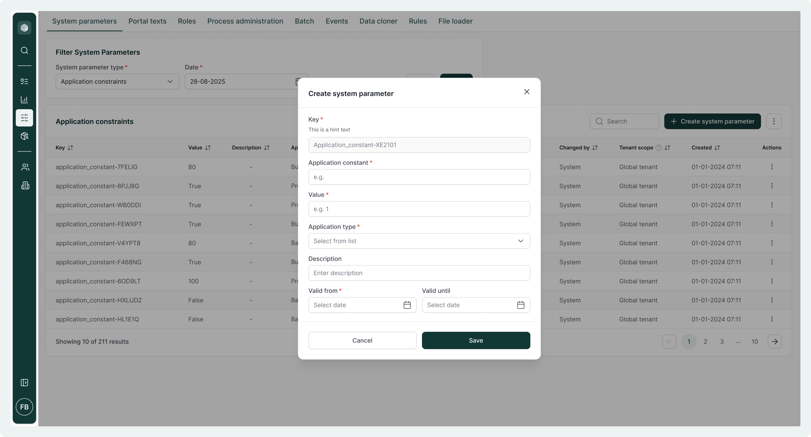
<h5>Modal - Create system parameter</h5>

## Portal texts
Portal Texts serve as a registry that translates text elements, identified by a key and language, into readable display text. This allows customers to manage and customize user-friendly UI text in multiple languages without needing to contact the vendor.

Please refer to [DD130 - Detailed Design][DD130] to read further into the functionality of portal texts.

The Portal Texts page consists of a single component:

- **Table** – Displays all existing portal texts.

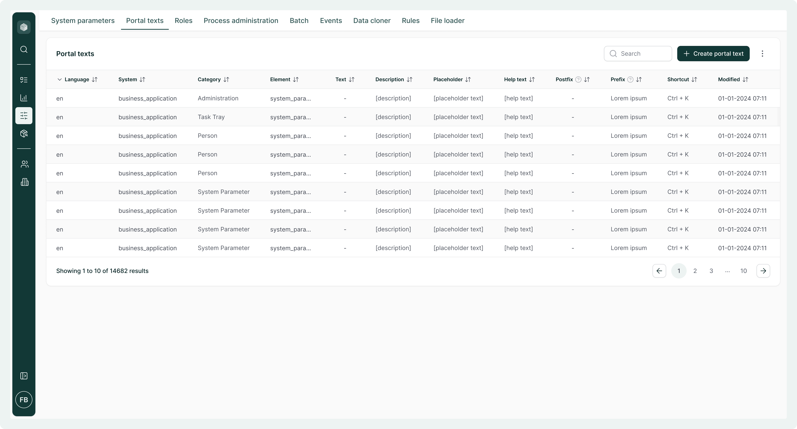
<h5>Administration - Portal texts page</h5>

Users can edit portal texts in two ways:

- By enabling **Portal texts** toggle from the account card in the primary menu.
- By navigating to **Administration → Portal Texts** and selecting the desired entry.

When Edit Mode is enabled, editable texts are highlighted with a box and icon.

<h5>When edit mode is toggled on, editable text/system parameters are marked as above.</h5>

Clicking one opens a modal window where users can modify the selected portal text.  
Similarly, clicking a row in the Portal Texts table also opens the same modal for editing.

Users can create new portal texts by clicking **Create Portal Text** in the table header.
This opens a modal where the required information can be entered to define the new text entry.

Users click save when they have filled out the necessary input fields in the **Create Portal Text** form.

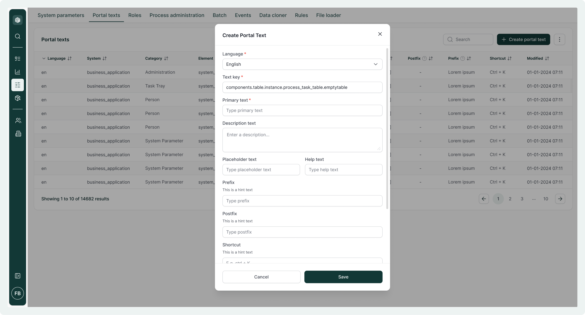
<h5>Modal - Create portal text</h5>

| Input field          | Description                                                                                                                                                   |
|:---------------------|:--------------------------------------------------------------------------------------------------------------------------------------------------------------|
| **Language**         | Choose which language the Portal text is created for.                                                                                                         |
| **Text key**         | A unique, machine-readable identifier for this text entry (e.g., `user.profile.saveButton`). This key is used in the code to retrieve the correct text.       |
| **Primary text**     | The main, visible text for the UI element, such as a button label, field name, or title.                                                                      |
| **Help text**        | Optional text that appears below an input field or when a user hovers over a help icon, providing guidance on how to complete the field.                      |
| **Description text** | Additional descriptive text that provides more context or detail than the primary text, often appearing as a sub-header or paragraph.                         |
| **Postfix text**     | Text or a symbol that is appended directly to the end of an input field's value (e.g., displaying "%" or "kg" after a number).                                |
| **Prefix text**      | Text or a symbol that is prepended directly to the beginning of an input field's value (e.g., displaying "$" or "€" before a number).                         |
| **Shortcut key**     | An optional keyboard shortcut (e.g., `Ctrl+S`) that a user can press to trigger the action associated with this UI element.                                   |
| **Placeholder text** | Example text or a brief hint displayed inside an input field before the user enters a value. It disappears once the user starts typing.                       |
| **Aria-label**       | A string of text that provides an accessible name for an element. This is read by screen readers when the element doesn't have visible label text.            |
| **Aria-labelledby**  | The ID of another element on the page that should be used as the label for this element. This is used to associate an element with a visible text label.      |
| **Aria-describedby** | The ID of another element that contains a more detailed description. Screen readers will read this description after announcing the element's label and role. |

## Roles (coming soon)

## Process administration (in progress)

The **Process Administration** tool is part of the system’s administration module and is accessible through the *
*Process Administration** page.

This tool allows users to view detailed information about process errors, making it a valuable resource for
troubleshooting and analysis. It is particularly useful for developers and technical users who need to investigate and
resolve process-related issues.

The process administration oage consist of two components

- Search and filter - allowing users t o filter and search for specific process errors.
- Table showing process errors

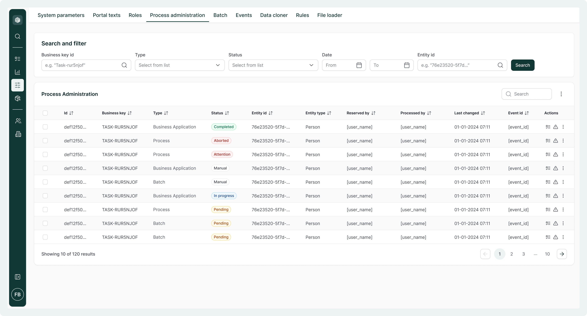
<h5>Administration - Process administration page</h5>

### Search and filter

On the **Process Administration** page, users have access to a **Search** button and a set of input fields. Each input
field corresponds to a specific search criterion used to filter and retrieve the desired processes displayed in the
process table.

A detailed view of the search section is shown in the figure below.

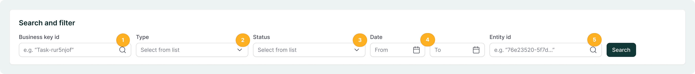
<h5>Process administration - Search and filter</h5>

| #     | Title         | Description                                                                                                                                                                                                                                                                                                                                                                                                                        |
|-------|---------------|------------------------------------------------------------------------------------------------------------------------------------------------------------------------------------------------------------------------------------------------------------------------------------------------------------------------------------------------------------------------------------------------------------------------------------|
| **1** | **Entity ID** | A text field allowing the user to enter none or one entity ID (e.g. person or company CPR/CVR/ID) to include in the search. If a value is provided, the search includes only processes linked to an entity (person or company) with an exact matching ID in the database. For persons, CPR numbers must match the format `ddmmyy-xxxx` (the hyphen may be omitted). By default, this field is empty when opening the page.         |
| **1** | **Type**      | Process Type – A multiselect dropdown allowing the user to select none, one, or multiple process types to include in the search . The field is populated with the title of every process type in the system, based on the `OpgaveType` enum class. When opening the Process Administration page, no process type is selected by default.                                                                                           |
| **2** | **Status**    | Process status – A multiselect dropdown allowing the user to select none, one, or multiple process statuses to include in the search . The field is populated with the title of every process status in the system, based on the `OpgaveStatus` enum class. When opening the Process Administration page, no process status is selected by default.                                                                                |
| **3** | **Date**      | From Date – A date field allowing the user to select none or one date to include in the search. The search includes processes modified in the database on or after the selected date. By default, this field is pre-filled with the current date when opening the page.                                                                                                                                                            |
|       |               | To Date – A date field allowing the user to select none or one date to include in the search. The search includes processes modified in the database before the selected date. By default, this field is empty when opening the page.                                                                                                                                                                                              |
| **4** | **Key ID**    | Process Key/ID - A text field allowing the user to enter none, one, or multiple process keys or IDs, separated by commas (`,`), to include in the search. If this field contains a value, all other search fields are immediately disabled and excluded from the search criteria. The search then includes only processes with an exact matching key or ID in the database. By default, this field is empty when opening the page. |

### Process administration table (in progress)

On the Process Administration page, the user is presented with a process table that lists all processes matching the
criteria specified in the search fields (see section *Search Fields* above). Each row in the table represents a process
registered in the system’s database.

An example of the table’s columns and how the information is displayed is shown below.

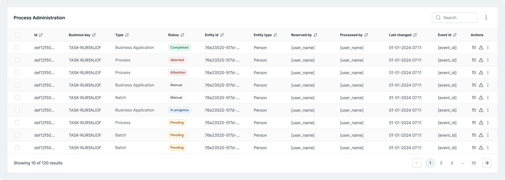
<h5>Process administration - table</h5>

| Column name  | Description                                                                                                                                                                                                                                                                                                                                                                                                                                                                                                                                                                                                                                                                                                                                                                                                                                                                                        |
|--------------|----------------------------------------------------------------------------------------------------------------------------------------------------------------------------------------------------------------------------------------------------------------------------------------------------------------------------------------------------------------------------------------------------------------------------------------------------------------------------------------------------------------------------------------------------------------------------------------------------------------------------------------------------------------------------------------------------------------------------------------------------------------------------------------------------------------------------------------------------------------------------------------------------|
| ID           | The unique ID in the database of the process.                                                                                                                                                                                                                                                                                                                                                                                                                                                                                                                                                                                                                                                                                                                                                                                                                                                      |
| Business key | The unique key (nøgle) in the database of the process. This normally has the format `OPG-` followed by 8 capital letters (A-Z) and/or numbers (0-9) in any order. By clicking the link, the page will open a new browser window for the user with the URL to the process in the business app’s entity overview page.                                                                                                                                                                                                                                                                                                                                                                                                                                                                                                                                                                               |
| Type         | The process’s process type (opgavetype) in the database. Based on `OpgaveType` enum class.                                                                                                                                                                                                                                                                                                                                                                                                                                                                                                                                                                                                                                                                                                                                                                                                         |
| Status       | Reflects the process’s current process status (opgavestatus) in the database. Based on `OpgaveStatus` enum class.                                                                                                                                                                                                                                                                                                                                                                                                                                                                                                                                                                                                                                                                                                                                                                                  |
| Entity ID    | The unique ID in the database of the process’s corresponding connected entity, either a person or company.                                                                                                                                                                                                                                                                                                                                                                                                                                                                                                                                                                                                                                                                                                                                                                                         |
| Entity type  | This column is only filled out if the process’s corresponding connected entity is a person. It shows the person’s unique CPR number (`ddmmyy-xxxx`) in the database. By clicking the link, the page will open a new browser window for the user with the URL to the person in the business app’s person overview page.                                                                                                                                                                                                                                                                                                                                                                                                                                                                                                                                                                             |
| Reserved by  | ID of the entity reserving the process. See DD130 - Process Engine for more info about reservation of processes.                                                                                                                                                                                                                                                                                                                                                                                                                                                                                                                                                                                                                                                                                                                                                                                   |
| Processes by | Represents the number of errors (antal fejl) the process has had by counting the number of consecutive times the process has been in a failed state.                                                                                                                                                                                                                                                                                                                                                                                                                                                                                                                                                                                                                                                                                                                                               |
| Last changed | The ID of the entity that last processed the process (behandlet af). Usually set to a user’s initials, such as a case worker, but can be “BPM_ENGINE” if the process was processed without human interaction.                                                                                                                                                                                                                                                                                                                                                                                                                                                                                                                                                                                                                                                                                      |
| Event id     | Timestamp (including milliseconds) of when the process was last changed by an entity. The time zone is defaulted to Copenhagen, Europe.                                                                                                                                                                                                                                                                                                                                                                                                                                                                                                                                                                                                                                                                                                                                                            |
| **Actions**  | List of actions represented by icons, shown depending on certain conditions based on the related process to help the developer identify why the process failed. They are as follows:   - **Show process context**: Opens a modal (see section *Show letter data modal*). Always shown as there is always a created context. The context contains all data saved between tasks and extends the `SimpleProcessContext` Java class.   - **Show application**: Opens a modal (see section 2.2.2.2.2). Only shown if the process is initiated via a self-service application. Contains all data from the self-service flow and extends the `AbstractAnsoegning` Java class.   - **Show technical error(s)**: Opens a modal (see section 2.2.2.2.3). Shown only if at least one technical error is registered during the process life cycle. The number of errors in footnote 8 can still be 0. |

#### Selecting a row - Open process tasks table

Users can click on a row in the process administration table.

Clicking a row, opens a new table, called "Process tasks", which is displayed below the process administration table.

#### Bulk actions in table

Each row can be selected by clicking on the column with the checkbox.

## Batch (coming soon)

## Batch items (coming soon)

## Entity Maintenance

Entity Maintenance job instances can be monitored through the "Entity Maintenance" table in the Administration.
Each row in this table represents an Entity Maintenance job instance.

The table is sorted in descending order by the job instance creation date and sorting is enabled on the columns.

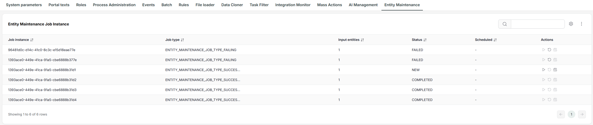
<h5>Entity Maintenance page</h5>

| Column          | Description                                                                                       |
|-----------------|---------------------------------------------------------------------------------------------------|
| JOB INSTANCE    | The Entity Maintenance job instance ID is the unique identifier for the job                       
| JOB TYPE        | The Entity Maintenance job type is the key for the Mass Action operation type                     
| INPUT ENTITIES  | Number of inputs the job instance will process, retrieved from the ENTITY_MAINTENANCE_INPUT table |
| STATUS          | Mass action status NEW, COMPLETED, FAILED, PROCESSING, ABORTED                                    
| SCHEDULED START | This is the scheduled start time. It will be null if no associated schedule exists.               |
| ACTIONS         | Start, Restart and Schedule action                                                                |

## Table actions

Following actions can be performed on a job instance in the Entity maintenance table in Administration.

* **Start** action is enabled when status is set to NEW
* **Restart** action is enabled when status is set to FAILED.
* **Schedule start** is enabled when status is set to NEW. Clicking the calendar icon opens the "Entity Maintenance
  Schedule" pop-up, which is initialized with the job type key and the entity maintenance job instance ID. The start
  time defaults to the current date and time. The calendar view displays time in 15-minute intervals, and the user can
  also manually enter a specific time in the input field.

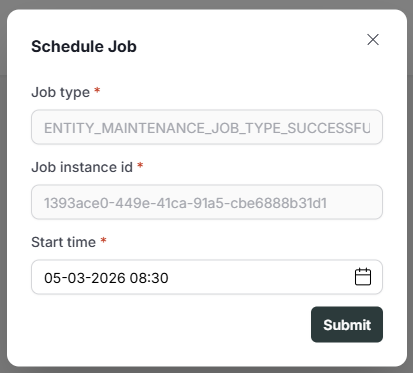
<h5>Entity Maintenance Schedule pop-up</h5>

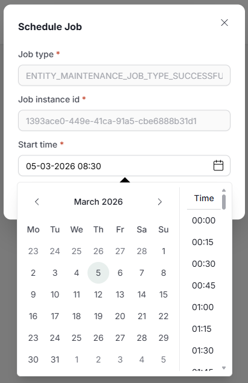
<h5>Entity Maintenance calendar </h5>

## Events

The Events page provides a comprehensive overview of all events that have occurred on the platform across all entities.

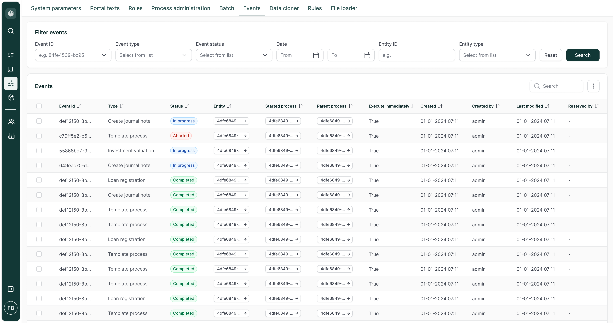
<h5>Events page</h5>

### Filter events

To refine the list of events, users can apply one or more of the following filters:

| Filter condition | Description                                                                                 |
|------------------|---------------------------------------------------------------------------------------------|
| Event ID         | Find a specific event by its unique identifier                                              |
| Event type       | Show events of a certain type                                                               |
| Event status     | Isolate events based on their current state (e.g., completed, failed, pending).             |
| Date range       | Display events that occurred within a specific timeframe.                                   |
| Entity ID        | Filter for events related to a specific entity                                              |
| Entity type      | Show events associated with a particular type of entity (e.g., Person, Process, Work order) |

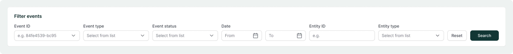
<h5>Filter component</h5>

### Events table

The events table serves as the central component of the Events page, providing a detailed, chronological log of all
activities across every entity on the platform.

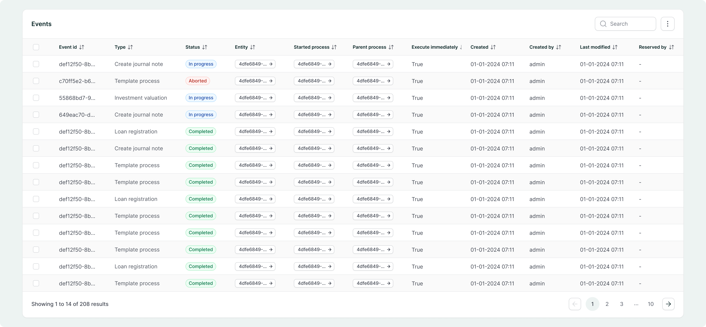
<h5>Events table</h5>

| Column name         | Description                                                                                                                 |
|---------------------|-----------------------------------------------------------------------------------------------------------------------------|
| Event ID            | The unique ID in the database for the event                                                                                 |
| Type                | The type of event. This is often processes that has been executed on an entity.                                             |
| Status              | Status of the event (e.g. in progress, aborted, completed)                                                                  |
| Entity              | Displays the entity ID in a clickable bacdge. Clicking the badge will navigate the user to the corresponding entity page.   |
| Started process     | Displays the process ID in a clickable badge. Clicking the badge navigates the user to the open process (on an entity page) |
| Parent process      | -                                                                                                                           |
| Execute immediately | -                                                                                                                           |
| Created             | Creation date and timestamp                                                                                                 |
| Last modified       | Date and timestap of when the event was last modified                                                                       |

#### Bulk actions in the events table

From this view, you can select one or more events to perform the following bulk actions:

- **Restart** - Re-initiates the selected event(s).
- **Terminate** - Forcibly stops the selected event(s). This will trigger a modal with an alert, that the user is about
  to terminate the selected events.
- **Release** - Allows a paused or held event to continue its process.

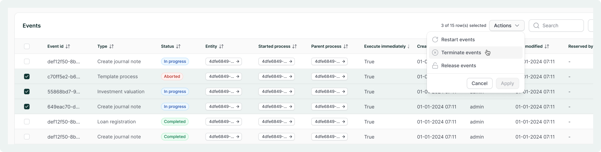
<h5>Bulk action on selected events in the table</h5>

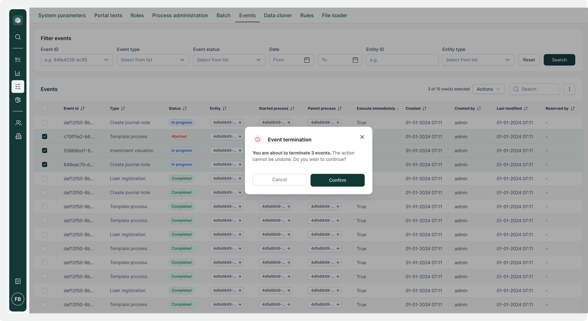
<h5>Alert is triggered on terminating events</h5>

## Data cloner

The Data cloner allows users to copy and mask an entity and all its related entities into a JSON file from one
environment (often prod or preprod) and add it to a different environment (often locally) via decloning.
This allows for easier recreation of bugs and makes it easier to find test data that fulfills specific requirements.

Please refer to [DD130 - Detailed Design][DD130]  to read further into the functionality of the data cloner.

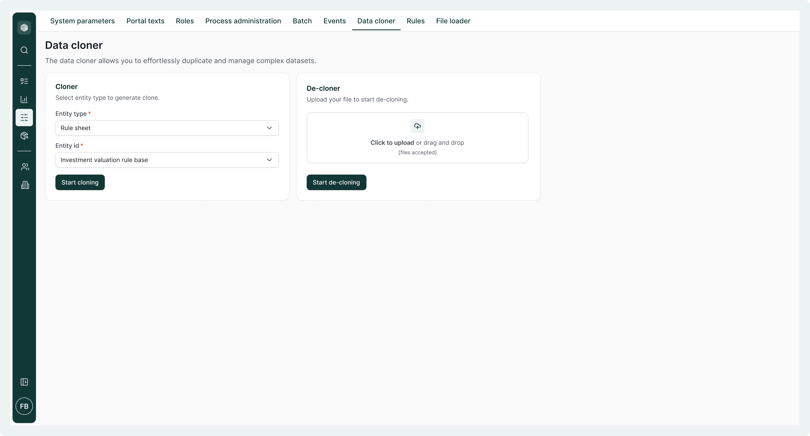
<h5>Administration - Data cloner</h5>

The Data Cloner page consists of two main elements:

- **Cloner** – Allows users to select which entities should be cloned by entering the entity type and ID, then clicking
  **Start Cloning**. This initiates the cloning process. When the process completes successfully, a confirmation
  message (toast) appears, and the cloned entity file (.csv) is automatically downloaded locally.
- **De-Cloner** – Enables users to upload cloned files into a new environment. Users can upload a file either by
  clicking the file upload button or by dragging and dropping the file, then clicking **De-Cloning** to start the upload
  process.

## Rules (coming soon)

Please refer to [DD130 - Detailed Design][DD130]  to read further into the functionality of the Rules page (Rule
Engine).

## File loader (coming soon)

Please refer to [DD130 - Detailed Design][DD130]  to read further into the functionality of the Filer loader.

