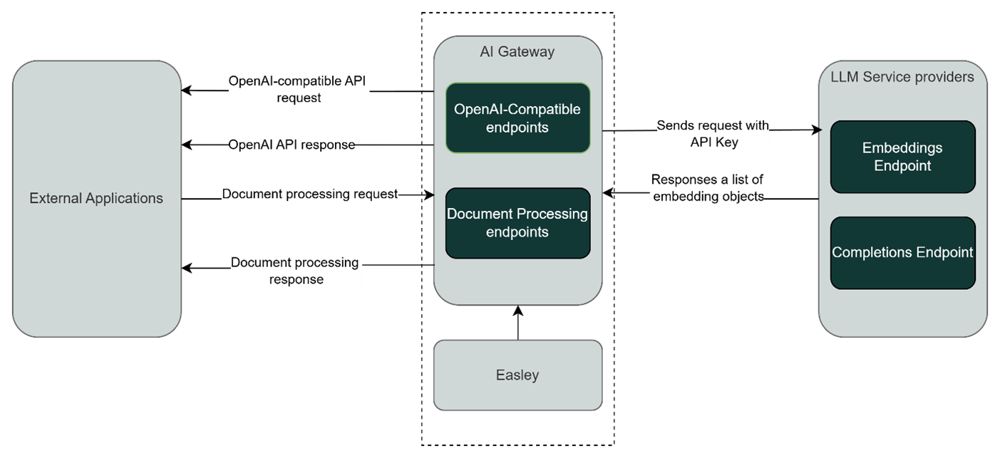

# References

| Reference                                                                                                             | Title | Author |
|-----------------------------------------------------------------------------------------------------------------------|-------|--------|
| [OpenAI API References](https://platform.openai.com/docs/api-reference/)                                              | OpenAI API References | OpenAI |
| [OpenAI – Create chat completions endpoint specification](https://platform.openai.com/docs/api-reference/chat/create) | OpenAI - Create chat completion endpoint specification | OpenAI |
| [OpenAI – Create embeddings endpoint specification](https://platform.openai.com/docs/api-reference/embeddings/create) | OpenAI – Create embeddings endpoint specification | OpenAI |
| [Error-codes](https://platform.openai.com/docs/guides/error-codes)                                                    | OpenAI Error-codes Guide | OpenAI |

# Introduction

The purpose of this deliverable is to establish and describe the interfaces and interactions between the AI Gateway service and client applications. The AI Gateway operates as a standalone service that exposes OpenAI-compatible API endpoints, enabling clients to submit chat and embedding requests. Upon receiving these requests, the AI Gateway utilizes Easley components to prepare and forward them to supported large language model (LLM) service providers. Additionally, the AI Gateway provides endpoints for document processing, including document preparation, removal, status checking, and embedding requests.

This document defines the external interface contracts, data formats, integration patterns, and operational considerations governing the interaction between the AI Gateway and its clients. The deliverable serves as a contract between the AI Gateway and external systems, ensuring clear expectations and facilitating robust and maintainable integration.

## Target Audience

The target audience of this deliverable is:

* Developers who implement and maintain AI Gateway.
* Developers who implement and maintain applications that use AI Gateway's services.

## Scope

The scope of this deliverable includes the definition and description of the external interfaces and interactions between the AI Gateway service and client applications. It covers:

* Which parts of the integrations, interfaces, processes, and jobs are detailed in the document.
* The external interface contracts, data formats, integration patterns, and operational considerations for integrations with external systems.
* Endpoints exposed by the AI Gateway, including OpenAI-compatible APIs and document processing endpoints.

# System Context

The following diagram illustrates the external interfaces and data flows between external applications, the AI Gateway (built with Easley on top of Netcompany .NET Foundation), and LLM service providers, highlighting how requests and responses are processed and routed.



> **Figure 1: System context diagram** * **External Applications:** Send OpenAI-compatible API requests and Document processing requests to the AI Gateway.
>
> * **AI Gateway:** Contains OpenAI-Compatible endpoints and Document Processing endpoints. It acts as an intermediary.
> * **LLM Service Providers:** Receive requests with API keys from the Gateway and return embedding objects or completions.

# Integrations

The Integrations section provides a detailed overview of the API endpoints exposed by the AI Gateway to client applications. Each integration describes the interface contract, supported operations, input and output formats, and the processing flow for requests. Endpoints include chat completions, embeddings, and document processing operations.

## Integration: v1/chat/completions

### Introduction

The `v1/chat/completions` endpoint enables client applications to submit chat completion requests using OpenAI-compatible API. This integration allows clients to interact with various LLM providers supported by Easley by specifying the desired model in the request. The AI Gateway forwards the request from the client application to the selected LLM provider.

### Integration patterns and operations

Communication is established via a REST HTTP POST endpoint, following the [OpenAI – Create chat completions endpoint specification](#references). This is limited to the parameters that Easley AI supports. The AI Gateway receives the request and forwards it to the appropriate LLM provider using Easley AI, based on the "model" parameter.

The response from the LLM provider is relayed back to the client in the OpenAI-compatible format.

* If the "stream" option is set to `true` in the request, the AI Gateway returns the response to the client as Server-Sent Events (SSE), streaming tokens as they are generated by the LLM provider.
* If "stream" is `false` or not specified, the response is returned as a standard REST API response after the complete result is received.

**Example Request**

```http
POST /v1/chat/completions
Host: AI Gateway
Content-Type: application/json
Body:
{
  "model": "gpt-4-turbo",
  "messages": [
    { "role": "system", "content": "You are a helpful assistant." },
    { "role": "user", "content": "Write a short poem about autumn." },
    { "role": "assistant", "content": "This is a poem about autumn: ...."},
    { "role": "user",
      "content": [
        { "type": "text", "text": "What is in this image?"},
        { "type": "image_url", "image_url": { "url": " data:image/jpeg;base64,<base_64_image>"}}
      ]
    }
  ],
  "reasoning_effort": "medium",
  "stream": true,
  "temperature": 0.8
}
```

**Table 1: Parameter description for v1/chat/completions endpoint**

| Parameter | Type | Description | Example Value |
|-----------|------|-------------|---------------|
| **model** (required) | String | ID of the model to use for the completion. Determines the language model, capabilities, and token limits. | `"gpt-4-turbo"` |
| **messages** (required) | Array of objects | Conversation history defines the context. Each message includes a role (system, user, assistant) and content. | `[{"role": "system", "content": "You are a helpful assistant."}]` |
| **message.content** | String or Array | The contents of the message. It can be either text contents or an array of content parts with a defined type. Supported options differ based on the model being used to generate the response. Can contain "text" and "image". | `[{"type": "text", "text": "What is in this image?"}]` |
| **reasoning_effort** | String | Indicates desired reasoning depth or effort (custom/non-standard; may control internal computation intensity). | `"medium"` |
| **stream** (required) | Boolean | Enables streaming mode (Server-Sent Events). The model sends tokens incrementally as they are generated. | `TRUE` |
| **temperature** (required) | Number (0–2) | Controls randomness in generation. Higher values = more creative, lower = more deterministic. | `0.8` |

**Table 2: Chat completion endpoint's unsupported parameters by AI Gateway**

| Parameter | Description |
|-----------|-------------|
| audio | Used for audio input or output. Not part of standard chat completion requests. |
| frequency_penalty | Penalizes tokens that appear frequently in the text. Helps reduce repetition. |
| logit_bias | Lets you adjust the probability of specific tokens appearing in the output. |
| logprobs | Returns log probabilities for output tokens to show confidence per token. |
| metadata | Stores user-supplied metadata; often used together with the store parameter. |
| modalities | Defines the output type (like text or audio). Only "text" is supported. |
| n | Number of completion choices the model should generate for each input. |
| parallel_tool_calls | Enables models to call multiple tools at the same time. |
| prediction | Used for predicting or hinting partial content (not officially documented). |
| prompt_cache_key | Likely used internally for caching prompts between runs. |
| safety_identifier | Internal parameter for safety or content classification purposes. |
| service_tier | Specifies the model's latency or processing tier (e.g., "Default" or "Scale"). |
| store | Used for saving conversation history or metadata for later reference. |
| tool_choice | Determines which tool to call (e.g., none, auto, or a specific tool). |
| tools | Provides a list of functions or tools the model can use during a call. |
| top_logprobs | Returns the top N most likely tokens at each position (requires logprobs=true). |
| verbosity | Controls debug or logging detail level for responses. |
| web_search_options | Custom parameter to control retrieval or web search features. |

**Example Response (Non-streaming)**

```json
{
  "id": "chatcmpl-9abc123xyz",
  "object": "chat.completion",
  "created": 1734896000,
  "model": "gpt-4-turbo",
  "choices": [
    {
      "index": 0,
      "message": {
        "role": "assistant",
        "content": "Golden leaves drift down in flight,\nCool winds whisper soft delight."
      },
      "finish_reason": "stop"
    }
  ],
  "usage": {
    "prompt_tokens": 33,
    "completion_tokens": 18,
    "total_tokens": 51
  }
}
```

**Example Response (Streaming)**

```http
HTTP/1.1 200 OK
Content-Type: text/event-stream
Cache-Control: no-cache
Connection: keep-alive
Transfer-Encoding: chunked

data: {"id":"chatcmpl-9abc123xyz","object":"chat.completion.chunk","created":1734896000,"model":"gpt-4-turbo","choices":[{"index":0,"delta":{"role":"assistant"},"finish_reason":null}]}
data: {"id":"chatcmpl-9abc123xyz","object":"chat.completion.chunk","created":1734896001,"model":"gpt-4-turbo","choices":[{"index":0,"delta":{"content":"Golden "},"finish_reason":null}]}
...
data: [DONE]
```

### Triggers

This API endpoint is triggered when a client application sends a request for a chat-based completion from a supported LLM provider. The trigger occurs upon receiving an HTTP POST request to the `v1/chat/completions` endpoint.

### Error handling

The endpoint is optimized for both asynchronous and synchronous, interactive use cases, with response times subject to the performance of the downstream LLM provider. Errors from the downstream LLM provider will be handled and returned to the client application in OpenAI API format.

## Integration: v1/embeddings

### Introduction

The `v1/embeddings` endpoint enables client applications to request text embeddings using an OpenAI-compatible API. This integration allows clients to obtain vector representations of input text by leveraging various LLM providers supported by Easley, specified via the "model" parameter.

### Integration patterns and operations

Communication is established via a REST HTTP POST endpoint, following the [OpenAI – Create embeddings endpoint specification](#references). The AI Gateway receives the embedding request and forwards it to the designated LLM provider using Easley AI. The response from the LLM provider, containing the embedding vectors, is returned to the client in the OpenAI-compatible format.

**Example Request**

```http
POST /v1/embeddings
Host: AI Gateway
Content-Type: application/json
{
  "model": "text-embedding-3-small",
  "input": [
    "Artificial intelligence is transforming education.",
    "Embedding models convert text into numerical vectors."
  ],
  "encoding_format": "float"
}
```

**Table 3: Parameter description for v1/embeddings endpoint**

| Parameter | Description | Example value |
|-----------|-------------|---------------|
| **model** (required) | Specifies the embedding model to use. Must be a valid embedding model such as `text-embedding-3-large` or `text-embedding-3-small`. | `"text-embedding-3-small"` |
| **input** (required) | The text or array of texts to embed. Each string will produce one embedding vector. | `["Artificial intelligence...", "Embedding models..."]` |

**Table 4: Embeddings endpoint's unsupported parameters by AI Gateway**

| Parameter | Description |
|-----------|-------------|
| dimensions | Defines the number of dimensions in the output embedding vector. Only some models support this option. |
| user | A unique identifier for the end user, used for tracking, monitoring, or preventing misuse of the API. |
| encoding_format | The format to return the embeddings in. Can be either float or base64. EASLEY works with float format only. |

**Example Response**

```json
{
  "object": "list",
  "data": [
    {
      "object": "embedding",
      "embedding": [ 0.0134, -0.0251, 0.0879, -0.0342, 0.1123, -0.0567 ],
      "index": 0
    },
    {
      "object": "embedding",
      "embedding": [ 0.0345, -0.0234, 0.0567, -0.0189, 0.0912, -0.0345 ],
      "index": 1
    }
  ],
  "model": "text-embedding-3-small",
  "usage": {
    "prompt_tokens": 26,
    "total_tokens": 26
  }
}
```

### Triggers

This API is triggered when a client application requires embeddings for text. The trigger occurs when the AI Gateway receives an HTTP POST request to the `v1/embeddings` endpoint from a client.

### Error handling

The endpoint is optimized for synchronous use cases, with response times subject to the performance of the downstream LLM provider. Errors from the downstream LLM provider will be handled and returned to the client application in OpenAI API format.

## Integration: documents/prepare

### Introduction

The `documents/prepare` endpoint allows client applications to submit a document file for ingestion and preparation within Easley. This process supports asynchronous document handling, semantic chunking, and deduplication based on document hash.

### Integration patterns and operations

Communication is established via a REST HTTP POST endpoint, accepting a file stream as input. The AI Gateway receives the stream, loads it into Easley, and initiates asynchronous preparation of the document. If a document with the same hash already exists, the endpoint returns the existing document's GUID; otherwise, a new GUID is generated and returned .

**Example Request**

```http
POST /documents/prepare
Host: AI Gateway
Content-Type: multipart/form-data; boundary=----Boundary123
------Boundary123
Content-Disposition: form-data; name="object"; filename="document.pdf"
Content-Type: application/pdf
<binary content of document.pdf>
------Boundary123--
```

**Supported File Formats:**

* **Text-based:** csv, xlsx, xlsm, pdf, md, docx, docm, pptx, pptm, txt, html, xml, json.
* **Images:** png, jpeg, jpg, gif, webp.

**Table 5: Parameter description for /documents/prepare endpoint**

| Parameter | Description | Example value |
|-----------|-------------|---------------|
| **object** | The file object to be uploaded and prepared for ingestion. Must be a valid document file (e.g., PDF, DOCX, TXT). This field is sent as a multipart/form-data file stream. | `filename="document.pdf"` |
| **Content-Type** | Specifies the MIME type of the uploaded document. Must match the file format (e.g., application/pdf, application/msword, text/plain). | `application/pdf` |
| **boundary** | Defines the separator between parts in the multipart form-data request. Used by the server to parse file data. | `----Boundary123` |
| **binary content** | The raw binary data of the document being uploaded. | `<binary content of document.pdf>` |

**Example Response**

```json
{
  "document": "987a6543-b21c-34f5-g678-543210987654"
}
```

### Validation

* Validates the input stream to ensure it is a valid and well-formed text file.
* Checks for the existence of a document with the same hash to prevent duplicate ingestion.
* Returns errors for invalid or corrupted streams, ingestion failures, or unsupported file types.

### Triggers

Triggered when a client application requests ingestion and preparation of a new document via the `documents/prepare` endpoint.

### Volume and frequency

Designed to support document ingestion through asynchronous processing using a Hangfire queue.

### Response times

Preparation is asynchronous; the client receives a document GUID immediately upon a successful request, while the actual conversion, ingestion, and chunking occur in the background. The client can check the status using the `documents/status` endpoint.

### Error handling

Ingestion errors, such as malformed request, unsupported file types, or failures during processing, are returned to the client with descriptive error messages indicating the cause of the failure.

* HTTP 400 Bad Request
* HTTP 406 Not Acceptable
* HTTP 500 Internal Server Error

## Integration: documents/update

### Introduction

The `documents/update` endpoint enables client applications to update a previously ingested document and its corresponding semantic chunks from Easley by specifying the document's GUID.

### Integration patterns and operations

Communication is established via a RESTful HTTP POST endpoint, accepting a document GUID as input. The AI Gateway receives the update request, validates the GUID, puts the update request to an asynchronous document handling queue (such as Hangfire) to remove the document's old associated chunks and binary, then replaces them with newly processed chunks.

**Example Request**

```http
POST /documents/update
Host: AI Gateway
Content-Type: multipart/form-data; boundary=----Boundary123
------Boundary123
Content-Disposition: form-data; name="document"
Content-Type: text/plain
123e4567-e89b-12d3-a456-426614174000
------Boundary123
Content-Disposition: form-data; name="object"; filename="updated_document.pdf"
Content-Type: application/pdf
<binary content of updated_document.pdf>
------Boundary123--
```

**Table 6: Parameter description for /documents/update endpoint**

| Parameter | Description | Example value |
|-----------|-------------|---------------|
| **document** (required) | The unique identifier (GUID) of the document to be deleted from the Easley document store. The GUID must correspond to an existing document that was previously uploaded and prepared. | `"123e4567-e89bs-12d3-a456-426614174000"` |
| **object** | The file object to be uploaded and prepared for ingestion. Must be a valid document file (e.g., PDF, DOCX, TXT). This field is sent as a multipart/form-data file stream. | `filename="document.pdf"` |
| **Content-Type** | Specifies the MIME type of the uploaded document. Must match the file format (e.g., application/pdf, application/msword, text/plain). | `application/pdf` |
| **boundary** | Defines the separator between parts in the multipart form-data request. Used by the server to parse file data. | `----Boundary123` |
| **binary content** | The raw binary data of the document being uploaded. | `<binary content of document.pdf>` |

**Example Response**

```http
HTTP/1.1 200 OK
```

### Validation

* Validates the presence and correct format of the document GUID in the request body.
* AI Gateway returns errors if the referenced document does not exist in the system.
* Checks for the existence of a document with the same hash to prevent duplicate ingestion.
* Validates the input stream to ensure it is a valid and well-formed text file.

### Triggers

Triggered when a client application sends a request to remove a document from the system by providing its GUID.

### Response times

The preparation for new updates is asynchronous; the client receives a document GUID immediately upon a successful request, while the actual ingestion and chunking occur in the background.

### Error handling

AI Gateway returns descriptive error messages for malformed request, invalid GUID, the document cannot be found or deleted, unsupported document file type.

* HTTP 400 Bad Request
* HTTP 406 Not Acceptable
* HTTP 404 Not Found
* HTTP 500 Internal Server Error

## Integration: documents/delete

### Introduction

The `documents/delete` endpoint enables client applications to delete a previously ingested document and its corresponding semantic chunks from Easley by specifying the document's GUID.

### Integration patterns and operations

Communication is established via a RESTful HTTP POST endpoint, accepting a document GUID as input. The AI Gateway receives the deletion request, validates the GUID, and instructs Easley to remove the document and all its associated chunks. This operation is a hard delete—the document and all related data are permanently and irretrievably removed from the system; it is not a soft delete .

**Example Request**

```http
POST /documents/delete/123e4567-e89b-12d3-a456-426614174000
Host: AI Gateway
```

**Table 7: Parameter description for /documents/delete endpoint**

| Parameter | Description | Example value |
|-----------|-------------|---------------|
| **document** (required) | The unique identifier (GUID) of the document to be deleted from the Easley document store. The GUID must correspond to an existing document that was previously uploaded and prepared. | `"123e4567-e89b-12d3-a456-426614174000"` |

**Example Response**

```http
HTTP/1.1 200 OK
```

### Validation

* Validates the presence and correct format of the document GUID in the request body.
* AI Gateway returns errors if the referenced document does not exist in the system.

### Triggers

Triggered when a client application sends a request to remove a document from the system by providing its GUID.

### Response times

Designed for synchronous execution. The outcome of the deletion operation—success or failure—is communicated to the client immediately upon completion.

### Error handling

AI Gateway returns descriptive error messages for malformed request, invalid GUIDs or if the document cannot be found or deleted.

* HTTP 400 Bad Request
* HTTP 404 Not Found
* HTTP 500 Internal Server Error

## Integration: documents/status

### Introduction

The `document/status` endpoint allows client applications to check the ingestion and preparation status of a document previously submitted to Easley by providing the document's GUID.

### Integration patterns and operations

Communication is established via a RESTful HTTP POST endpoint, accepting a document GUID as input. The AI Gateway receives the request, validates the GUID, and queries Easley for the status of the document ingestion process. The endpoint returns the document's status, which can be "NotFound", "Ingesting", "Ready", or "Error".

**Example Request**

```http
POST /documents/status/123e4567-e89b-12d3-a456-426614174000
Host: AI Gateway
```

**Table 8: Parameter description for /documents/status endpoint**

| Parameter | Description | Example value |
|-----------|-------------|---------------|
| **DocumentId** (required) | The unique identifier (GUID) of the document from the Easley document store. The GUID must correspond to an existing document that was previously uploaded. | `"123e4567-e89b-12d3-a456-426614174000"` |

**Example Response (Success)**

```json
{
  "status": "Processing"
}
```

**Example Response (Failed)**

```json
{
  "status": "Failed",
  "errorMessage": "<error message>"
}
```

### Validation

Validates the presence and correct format of the document GUID in the request body. AI Gateway returns Bad Request response if the GUID is missing or invalid.

### Triggers

Triggered when a client application needs to monitor the state of a document's ingestion or preparation process by submitting a status request.

### Response times

Designed for prompt, synchronous response, returning the current status of the document immediately upon request.

### Error handling

AI Gateway returns error responses for malformed request, invalid GUIDs or if the document cannot be found or deleted.

## Integration: documents/search/semantic

### Introduction

The `documents/search/semantic` endpoint enables client applications to perform semantic vector searches across one or more documents stored in AI Gateway. By submitting a search query along with a list of document GUIDs, clients can retrieve the most relevant document chunks based on vector similarity to the input text.

### Integration patterns and operations

Communication is established via a RESTful HTTP POST endpoint, accepting a payload containing document GUIDs, search text, certainty threshold, and maximum result amount. The AI Gateway receives the request, validates the input, and forwards it to Easley for semantic search processing. The search is performed using vector similarity methods, and results are collected, reconstructed, and ordered according to their appearance in the documents.

**Example Request**

```http
POST /documents/search/semantic
Host: AI Gateway
Content-Type: application/json
Body:
{
  "documents": [
    "123e4567-e89b-12d3-a456-426614174000",
    "987a6543-b21c-34f5-g678-543210987654"
  ],
  "text": "What are the key integration patterns for AI Gateway?",
  "certainty": 0.5,
  "maximumAmount": 5
}
```

**Table 9: Parameter description for documents/search/semantic endpoint**

| Parameter | Description | Example value |
|-----------|-------------|---------------|
| **documents** (required - not empty) | An array of unique identifiers (GUIDs) for documents to be included in the semantic search. Each GUID must correspond to an existing, prepared document in AI Gateway. | `["123e4567-e89b-12d3-a456-426614174000", ...]` |
| **text** (required) | The search query text used to perform semantic vector similarity against the specified documents. | `"What are the key integration patterns for AI Gateway?"` |
| **certainty** | The minimum similarity threshold (decimal value between 0 and 1) required for a document chunk to be considered relevant. | `0.5` |
| **maximumAmount** | The maximum number of result documents to return in the response. If not specified, a default value is used. | `5` |

**Example Response**

```json
{
  "Result": [
    {
      "documentId": "123e4567-e89b-12d3-a456-426614174000",
      "title": "D0180 - External Interface Design - AI Gateway.docx",
      "chunks": [
        "The primary integration pattern for the AI Gateway is API-based integration...",
        "Another key pattern is service orchestration..."
      ]
    },
    {
      "documentId": "987a6543-b21c-34f5-g678-543210987654",
      "title": "DD130 - Detailed Design - ModelOrchestrator.docx",
      "chunks": [
        "For document processing, asynchronous patterns are supported..."
      ]
    }
  ]
}
```

### Validation

* Validates that the documents parameter is a non-empty array of valid GUIDs corresponding to existing, prepared documents in AI Gateway.
* Ensures the text field is present and contains a valid search query.
* Checks that optional parameters "certainty" and "maximumAmount", if provided, are within valid ranges (certainty must be between 0 and 1; maximumAmount must be a positive integer).
* Applies default values for "certainty" (0.49) and "maximumAmount" (10) if they are not specified.

### Triggers

This endpoint is triggered when a client application submits a semantic search request to retrieve relevant document chunks based on a search query.

### Error handling

* Returns clear and descriptive error messages for invalid input, such as malformed or missing GUIDs, missing search text, or out-of-range parameters.
* Returns errors if any referenced document is not found or if a processing failure occurs during the semantic search.

## Integration: documents/embeddings

### Introduction

The `documents/embeddings` endpoint enables client applications to submit a document for processing, semantic chunking, and embedding within AI Gateway.

### Integration patterns and operations

Communication is established via a RESTful HTTP POST endpoint, accepting a document file as input. The AI Gateway receives the file, converts it to markdown, segments it into semantic chunks, and forwards each chunk to the designated LLM provider for embedding generation. Embedding results are streamed to the client using Server-Sent Event (SSE) once the embeddings is returned from the LLM service.

**Example Request**

```http
POST /documents/embeddings
Host: AI Gateway
Content-Type: multipart/form-data; boundary=----Boundary123
------Boundary123
Content-Disposition: form-data; name="object"; filename="document.pdf"
Content-Type: application/pdf
<binary content of document.pdf>
------Boundary123--
```

**Table 10: Parameter description for /documents/embeddings endpoint**

| Parameter | Description | Example value |
|-----------|-------------|---------------|
| **object** | The file object to be uploaded and prepared for ingestion. Must be a valid document file (e.g., PDF, DOCX, TXT). This field is sent as a multipart/form-data file stream. | `filename="document.pdf"` |
| **Content-Type** | Specifies the MIME type of the uploaded document. Must match the file format (e.g., application/pdf, application/msword, text/plain). | `application/pdf` |
| **boundary** | Defines the separator between parts in the multipart form-data request. Used by the server to parse file data. | `----Boundary123` |
| **binary content** | The raw binary data of the document being uploaded. | `<binary content of document.pdf>` |

**Example Response**

```json
data: {"text": "This is the first chunk of the document.", "embedding": [0.123, 0.456, 0.789, ...], "index":0}
data: {"text": "Here is the second paragraph of content.", "embedding": [0.234, 0.567, 0.890, ...], "index":1}
data: {"text": "Final section of the document summary.", "embedding": [0.345, 0.678, 0.901, ...], "index":2}
data: [DONE]
```

### Validation

* Validates the input stream format to ensure it is well-formed and suitable for processing.
* Checks that the file type is supported by Easley; unsupported file types result in an error response.
* Ensures successful segmentation and chunking of the document content.

### Triggers

Triggered when a client application submits a request to generate embeddings for document content.

### Response times

Embeddings are generated and streamed back to the client immediately as they are processed. The embedding operation is executed synchronously and does not utilize background processing via Hangfire queue like `/documents/prepare` endpoint.

### Error handling

Returns clear and descriptive error messages for invalid input, unsupported file types, chunking errors, or embedding failures.

* HTTP 400 Bad Request
* HTTP 406 Not Acceptable
* HTTP 500 Internal Server Error