# References

| Reference                                                                                                                                                                                 | Title                                | Author         |
|-------------------------------------------------------------------------------------------------------------------------------------------------------------------------------------------|--------------------------------------|----------------|
| [C0200 – GSW Letters](https://goto.netcompany.com/cases/GTE351/NCMCORE/Amplio%20Deliverables/Amplio%202025/C0200%20-%20User%20Guides/C0200%20-%20Getting%20started%20with%20Letters.docx) | C0200 – Getting started with Letters | Netcompany A/S |
| [DD130 – System Parameter](https://source.netcompany.com/tfs/Netcompany02/NF4J/_wiki/wikis/Documentation/5125/System-parameter)                                                           | DD130 – System Parameter             | Netcompany A/S |
| [DD130 – Fileloader](https://source.netcompany.com/tfs/Netcompany02/NF4J/_wiki/wikis/Documentation/4877/Fileloader)                                                                       | DD130 - Fileloader                   | Netcompany A/S |
| [DD130 – App Core](/DD130-Detailed-Design/Application-core)                                                                                                                               | DD130 – Application core             | Netcompany A/S |

# Introduction

This document will give insights into the use of a new component that will ease the process of updating system
parameters on live environments. The component will be able to migrate System parameters and resources easily between
environments without the need for deploying.

There are two parts to the migration:

1. **Export from a source environment**: This will generate a zip file of selected system parameters and
   resources/files.
2. **Import to a target environment**: Loads the content of the zip file into the system, updating system parameters and
   resources/files.

The first part can be used by different entities on the project depending on the organization (e.g., the letter team)
where the second part of the migration can be done either by the letter team testers or by the customer depending on
what makes sense for the given project. The import can be called on application start-up using resource files in the
codebase or manually from the application's administration tab.

The import is relatively fast and does not require deployment or similar, so the uploader or associated tester can
verify the letters immediately after manually updating the system parameters.

The 1-click letter migration can be accessed via the UI by navigating to the new administration tab in the business
application called ‘Fileloader’. You can read more about the fileloader in [DD130 – Fileloader](https://source.netcompany.com/tfs/Netcompany02/NF4J/_wiki/wikis/Documentation/4877/Fileloader). For an alternative
implementation of the fileloader used at startup, instead of manually through the UI, see [DD130 – App Core](/DD130-Detailed-Design/Application-core), chapter
“Startup”.

## Target audience

The audience is expected to be developers with some Amplio experience and knowledge about how Letters work in the
projects, as well as testers and developers on projects who will use the Letter migration component.

## Purpose

The component is an improvement to letter migration for the letters to be updated in a running application. Previously,
the solution required a new deployment for general letter updates from the master environment to another environment.
The component will update system parameters and their linked binary resource files.

The update of system parameters and resources process will be simpler for both Amplio and the customers, and the
customer could now update system parameters and resources on an environment without the project’s help. This enables the
projects to use various environments as the main environment for different system parameter types and processes.

## Background information

This component is mainly a great improvement for the resources and letter handling for all projects, and Letters have in
many aspects been a great challenge for the project. The component thus tries to improve some of the challenges of
keeping Letter resources up to date.

For more in-depth information regarding Letters, please see [C0200 – GSW Letters](https://goto.netcompany.com/cases/GTE351/NCMCORE/Amplio%20Deliverables/Amplio%202025/C0200%20-%20User%20Guides/C0200%20-%20Getting%20started%20with%20Letters.docx).

# High level description of the component

The component for Letter Migration allows updates of the application’s system parameters and their linked files. The
component is implemented for letter-related parameters and rule sheets but can be extended to use with other parameter
types. The system parameters and resources can be updated from any environment into another environment while the system
is running by using the 1-click migration component.

The user interface is quite simple and looks as follows:

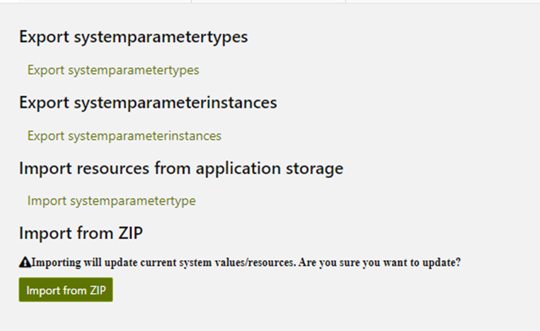

 

The export functionality creates a ZIP file containing the system parameters from the current environment. The export
functions can export multiple system parameter types or multiple system parameter instances, depending on input.
Exporting system parameter instances will export all related system parameter instances to allow complete usability of
the chosen instance.

Import can either be done from a Zip file (often exported from a different environment) or from files in the
application. If import is chosen using the application resources, then this acts as a reset of the parameters, to the
parameter state of the original build of the deployed application.

# Introduction to the subject

The following is an introduction to the Letter Migration component.

## Before 1-click letter migration

The previous solution used the files taken from the code base through the build of the application, which needed to be
reloaded at application start. This introduced several incidents where Letters were not working correctly, and the
business application needed to be restarted before it could merge letters.

Previously when the production environment needed to be updated, a patch was needed to be created using the
`generate-sysparam` tool found in many projects’ Tools folder.

## General letter migration

The component solves a few of the issues that have arisen from the projects using letters. Letters are mostly
administered in one of 2 ways:

1. Letters are administered on the production environment, or
2. Letters are administered by another environment and migrated to production

Generally, letters are backed up using 2 separate backups, one of resource files and one for system parameters. The
resource files would be Word templates with the format `.dotx`, which are then saved into the code base as a resource.
The system parameter dump is taken from the main environment and migrated from there to the other environments.

The simplest solution would be for the production environment to function as the main environment. Then only a single
backup of system parameters is needed from production and migrated to all other environments. This would then also come
with some constraints as you can only have single iterations of letters instead of possible multiple iterations that can
be updated separately with new releases.

In case letters and system parameters are administered and maintained on separate environments, then two separate
backups of system parameters are needed. One backup of non-letter system parameters from the environment maintaining
general system parameters (called `sysparam-env`), and one backup taken of the environment maintaining letters (called
`letter-env`). A patching strategy then needs to be made, to determine what parameters need to be based on the backup
from the `sysparam-env` and what needs to be based on the backup from the `letter-env`. This strategy may need to vary
from non-prod and preprod environments to test newer letters or mimic production system parameter resources on the
environment in question.

This allows a feature branch to contain separate letter files from those used in production, for the same system
parameter.

For example, the `letter-env` can then have a version of template A and A_r1, while production only has version A. Then,
when release 1 is deployed to production for the first time, template A can be overridden with template A_r1. This is a
necessity when projects are having multiple releases at a time.

# 1-Click Migration UI

The 1-click letter migration component is used through the system administration in the business application. The
administration tab is controlled by `FileLoaderController`.

A complete picture of available options in the fileloader tab is shown in chapter 2. For details on how to use the
export options, see section [How to export](/DD130-Detailed-Design/1-click-Letter-Migration#how-to-export). Similarly, for import
options, see section [How to import](/DD130-Detailed-Design/1-click-Letter-Migration#how-to-import).

# Export

Functionally, `FileLoaderController` uses only `FileLoaderExportService` to export all system parameters. There are two
different approaches to choosing which parameter instances are exported. Either all instances of one or more specified
parameter types are exported, as explained in
section [Export system parameter types](/DD130-Detailed-Design/1-click-Letter-Migration#export-system-parameter-types), or only specified
instances of a specified type (and
related parameters) are exported as explained in
section [Export system parameter instance](/DD130-Detailed-Design/1-click-Letter-Migration#Export-system-parameter-instance). For an explanation
of how the fileloader exports
system parameters and related files, see [DD130 – Fileloader](https://source.netcompany.com/tfs/Netcompany02/NF4J/_wiki/wikis/Documentation/4877/Fileloader), specifically the chapter “Export”.

## How to export

Export of system parameters and resource files are done from a source environment. This could, for example, be a
designated master environment for letters or a developer’s local environment. For example, on the pension project, this
would usually be the DEMO environment, where ATP maintains letters.

### Letters

Any system parameter can be exported with this component. There are several distinct types of system parameters with
corresponding resource files. In case the system parameter type has a resource, then the resource will be exported as
well.

Types with resource files:

- Letter templates (`BESKEDSKABELON`)
- Content templates (`INDHOLDSSKABELON`)
- Master templates (`MASTER_TEMPLATE`)
- Attachments (`VEDHAEFTNING`)

All other letter types do not have resource files.

### Layout

The buttons are configured in the projects and can therefore have different names. The functionality allows for having
the following buttons (from the top):

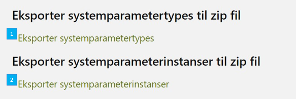

<h5>Figure 1: Layout of export buttons</h5>
 

A more complete image including the import functionality, can be seen in chapter 2.

#### Export system parameter types

This button (marked by blue “1” in Figure 1) exports all system parameter instances of a specific type, along with all
the related system parameter instances. This means that a `BESKEDSKABELON` will also export all related `FLETTETEKST`
and other related types. If, for example, `BESKEDSKABELON` ‘np_1011’ uses `MASTER_TEMPLATE` ‘danish_citizen’ and
contains `FLETTETEKST` ‘af-modtager’, ‘ab-brevmodtager-doed’ and ‘venlig-hilsen’. Then when `np_1011` is exported, and
only type `BESKEDSKABELONER` is defined as input, then parameter instances of types `MASTER_TEMPLATE` and `FLETTETEKST`
will still be exported (assuming that they are linked through the database as attributes).

The button can equally export parameters of more than one type, by listing the types in a comma-separated list, e.g.,
`BESKEDSKABELON,VEDHAEFTNING`.

After the first click on the button, a pop-up will ask for the wanted parameter types as seen in Figure 2.

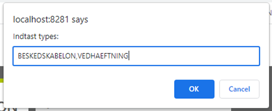

<h5>Figure 2: Pop up for parameter types during export</h5>
 

For more details, see [DD130 – Fileloader](https://source.netcompany.com/tfs/Netcompany02/NF4J/_wiki/wikis/Documentation/4877/Fileloader), section “FileLoaderExportService”, specifically info on the function
exportAllWithRelations(String type).

#### Export system parameter instance

This button (marked by blue “2” in Figure 1) exports specified system parameter instances of a user defined parameter
type, with keys defined by user input as a comma separated list of instance keys. The related system parameter instances
will be exported as well.

After first click on the button a pop up will ask for wanted parameter types as seen in Figure 3 - only one parameter
type can be exported here.

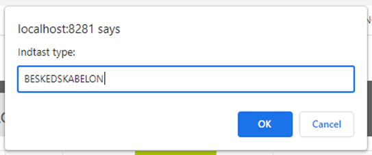

<h5>Figure 3: Pop up for parameter types input during export of specific instances</h5>
 

After clicking “OK” a second pop up will appear asking for keys, see Figure 4. The keys must be separated by commas, and
they must belong to the same parameter type as the input in the previous box.

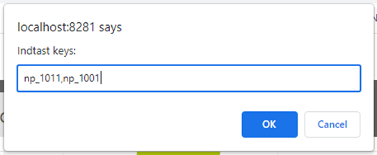

<h5>Figure 4: Pop up for parameter keys input during export of specific instances</h5>
 

For more details, see [DD130 – Fileloader](https://source.netcompany.com/tfs/Netcompany02/NF4J/_wiki/wikis/Documentation/4877/Fileloader), section “FileLoaderExportService”, specifically info on the function
`exportAllWithRelations(String type, String keys)`.
Note: There is a limit to input size. GET requests have a limit of 2048 characters, meaning the total length of included
keys should be less than approximately 1,800 characters.

### Structure of generated zip file

The content of the zip file generated via export should not be altered. The folder structure is used when reading the
zip file later. This is to ensure the correct types are being updated. To read more about the ZIP structure,
see [DD130 – Fileloader](https://source.netcompany.com/tfs/Netcompany02/NF4J/_wiki/wikis/Documentation/4877/Fileloader), section “3.1.3 Building the zip folder containing the system parameters and necessary binary
files” in the “Export” chapter.

# Import

The import can be performed either from a provided ZIP file or from the application storage given in the build of the
environment. The import will ask if the system should force reload of the resource or if the system parameter should
only be updated if it is a newer version of the system parameter.

## How to import

Import of system parameters can be performed in 2 separate ways. The import can either use application stored resource
files from GIT at build time (see
section [Import resources from application storage](/DD130-Detailed-Design/1-click-Letter-Migration#Import-resources-from-application-storage)), or from a ZIP
file provided by the user (see
section [Import resources from uploaded ZIP file](/DD130-Detailed-Design/1-click-Letter-Migration#Import-resources-from-uploaded-ZIP-file)). For a
description of what happens deeper in the code, see [DD130 – Fileloader](https://source.netcompany.com/tfs/Netcompany02/NF4J/_wiki/wikis/Documentation/4877/Fileloader), chapter “Import”.

The user is required on all import buttons to choose if the applied system parameter instances should be updated or only
the ones that are newer than the current version. The default option is false, which means system parameter instances
are checked that the applied instance is newer than the current version in the application.

### Layout

The layout of the import section in the administration ‘Fileloader’ looks as seen below:

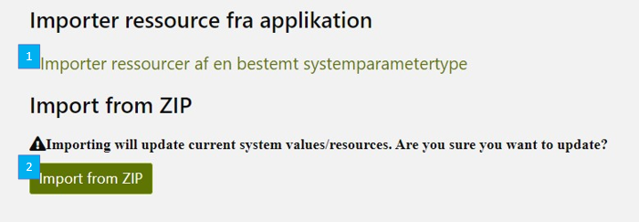

<h5>Figure 5: Layout of import buttons</h5>
 

A more complete image including the export functionality, can be seen in chapter 2.

### Import resources from application storage

The import from resources also known as import on Startup, is functionality that has been upgraded to use the now
available JSON files. For more on this implementation, see [DD130 – App Core](/DD130-Detailed-Design/Application-core), section “Startup”.

Importing using application storage will reload the system parameter instances that were included in the codebase when
the build used for deploy was built.

Using this functionality from the UI, requires two user defined input variables, entered via pop up modals.

The first input variable is the parameter type. This must match the system’s enum SystemparameterNoegleType for the
wanted parameter type. Pop up and input is seen in Figure 6. If no info is provided, then all system parameter instances
available in storage will be updated.

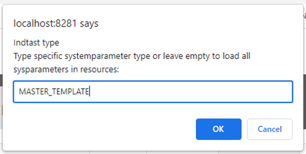

<h5>Figure 6: Pop up for user input Type, import from storage</h5>
 

The second user input is whether the fileloader should force the reload or only update newly edited parameters. The
input pop up is seen in Figure 7. “No” is default, and then only the newer version will be updated. How the fileloader
determines if the parameter will be updated or not is explained on [DD130 – Fileloader](https://source.netcompany.com/tfs/Netcompany02/NF4J/_wiki/wikis/Documentation/4877/Fileloader), section “Import”, subsection
“Import each parameter”.

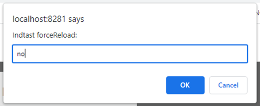

<h5>Figure 7: Pop up for user input ForceReload, import from storage</h5>
 

The resource location in the application is: `classpath:/systemparameters/{1}/**`
`{1}` being the `SystemParameterType`.

The resource files of a specific `SystemParameterType` with the option to force reload. The import from resources has a
hard-coded classpath that the system parameters’ resource files can be saved to in the application. The classpath is:
`/systemparameters/X` where `X` is the `SystemParameterType` of the resource files, and the `SystemParameterType` has
been written with capital letters, e.g., `/systemparameters/BESKEDSKABELON` for letter templates. Note, not all
parameter types should be with capital letters, e.g., Rulesheets are in `/systemparameters/regler`. The case depends on
the implementation of the relevant `SystemparameterNoegleType` enum.

#### Output

At the time of writing, there is unfortunately no dynamic UI built for this functionality. After the input parameters
have been entered, the user is redirected to a page only containing the string “Loading started..”. The page is never
updated, so if any feedback is wanted then you must check your logs (IntelliJ terminal if local, Splunk `core.log` if on
an environment). In the logs, it will be possible to see when the import was started and when it ended along with how
many parameters were loaded.

### Import resources from uploaded ZIP file

Import of a generated zip file can be imported on a target environment. This consists of 2 steps for the user:

1. The user is prompted to choose a file from their filesystem, where the relevant exported zip-file should be chosen.
   This is done via a standard file upload window.
2. The user will be asked if all content of the zip file should be uploaded to the environment.

“No” is default, and then only the newer version will be updated. This is done via a pop-up, like the one in Figure 7.
The upload to the environment will then begin, updating system parameters and resources/files uploaded and identified
from the ZIP file. The zip file is virus scanned like other files uploaded to check that viruses are not added to the
system with the file upload.

#### Output

The output will show how many resources and system parameters have been updated and the duration of the import. It will
let the user know the name of the file that was used.

If all parameters were updated, then the output will say so, as seen in Figure 8. If `forceReload` was set to false, or
an error occurs, then it is likely that the fileloader determines to not update all parameters found in the uploaded ZIP
file. The user is told via the output which parameters were not updated as seen in Figure 9.

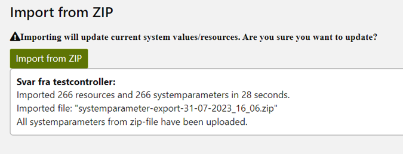

<h5>Figure 8: All parameters successfully imported</h5>
 

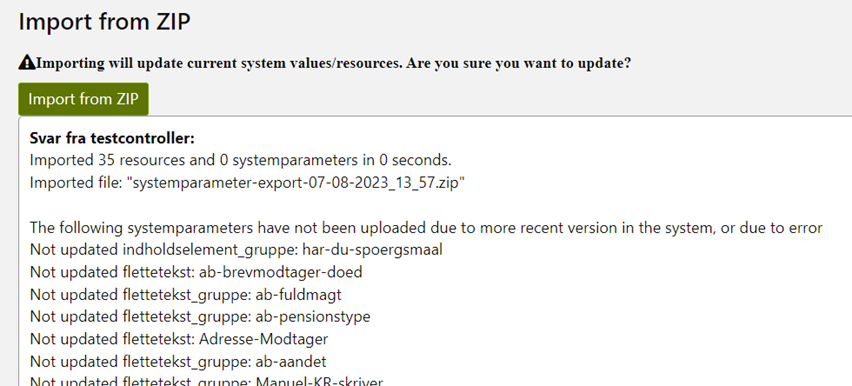

<h5>Figure 9: Some parameters not updated based on zip input</h5>
 

# Possible improvements

A few ideas have surfaced while writing the documentation:

- The exported files include a new timestamp for each `SystemParameterInstance` that is created but should be the one
  from the original environment. The import uses a new timestamp anyway, but this for example excludes all resource
  files being located for updates that happen over time. It should be known that this is because the import by resources
  will then include this information, and this is for the JSON and file resource being used in the application build as
  an alternative to patches.
- Nicer UI feedback when importing from application storage.
- (NF4J code, not Amplio) Change `FileLoaderImportResourceServiceImpl#loadSystemparameterResourcesInternal` to use
  `ContextWrapper#withContext` instead of `TaskExecutor#execute` to avoid “aendretaf=<UNKNOWN>” everywhere…

# Configurations and service extensions

This section will define how to set up the component and what component requirements come along.

## Code integration

The application, where the administration is found, needs to include the Spring configuration file
`SystemparameterFileMigrationConfig` from Amplio, if the letter migration feature is to be used.

## Configurable settings

There are configurable settings, which can be found below.

### System parameters

The component expects system parameters to be correctly defined between the environments where the import and export
take place. Between releases from Amplio, new attributes can be created, which will break the implementation between
project releases with different Amplio releases.

The letter system parameter types are:

- `beskedskabelon`
- `flettetekst`
- `flettespoergsmaal`
- `indholdselement`
- `indholdsskabelon`
- `master_template`
- `vedhaeftning`

### Antivirus

Virus scanning needs to be handled correctly for the environments otherwise uploads of an import file will fail. Virus
scanning is set up by the system parameter `fileupload_virusscan_attachment_enabled`, with type `feature_flag`.

### WebLogic

Configuration of the environment server might need to be updated to allow larger Request message sizes. Otherwise, the
default Message size is 100 Mb, and the file size limits for upload with Letter migration can in cases exceed this
value. For WebLogic servers, this can be updated on the server, and Operations needs to be included in making this
update. The update that needs to happen is for the attribute Max Message Size, found on the Server in its WebLogic
settings under Servers -> MyServer -> Protocols.

## Roles and rights

The right required for accessing the Letter migration tool is `SR_ADM_FILE_MIGRATION`. Roles for the letter migration
might be placed on different resources either on Netcompany or the client’s side depending on the project's setup with
writing and implementing letters. The resources implementing the templates in Word should also oversee updating the
templates in production.

The `SR_ADM_FILE_MIGRATION` right is thus suggested to follow the rights for the letters:

- `SR_ADM_BESKEDSKABELONER`
- `SR_ADM_MASTER_SKABELONER`
- `SR_ADM_FLETTETEKSTER`
- `SR_ADM_INDHOLDSELEMENTER`
- `SR_ADM_VEDHAEFTNINGER`
- `SR_ADM_FLETTESPOERGSMAAL`

The roles with the `SR_ADM_FILE_MIGRATION` should have knowledge of how letters function and could otherwise make
mistakes on the Production environment.

## Database patches

The necessary patch is for mapping the rights and roles described in
section [Code Integration](/DD130-Detailed-Design/1-click-Letter-Migration#Code-Integration), and texts for the administration tab.
For inspiration in PE see the pull-request 240092 and the files:

- `20220823_file_migration.sql` – File migration texts
- `20220901_LetterRoles.sql` – Mapping between roles and rights.

## Reservations and namespaces

Endpoints are available through a single controller, which is to be used through the system administration "File loader”
view. The endpoint for the controller is `/admin/fileloader`.

### Endpoints

The general endpoint for the change is available in `FileLoaderController`.

### Endpoints

The general endpoint for the change is available in `FileLoaderController`.

| Endpoint                            | Parameters                                                           | Description                                                                                                                                              |
|-------------------------------------|----------------------------------------------------------------------|----------------------------------------------------------------------------------------------------------------------------------------------------------|
| `/admin/fileloader/exportTypes`     | List of `SystemParameterType` Name                                   | Downloads all System parameter instances of the given `SystemParameterTypes`                                                                             |
| `/admin/fileloader/exportKeys`      | Name of `SystemParameterType`, List of `SystemParameterInstance` Key | Downloads all System parameter instances given by the given `SystemParameterType`                                                                        |
| `/admin/fileloader/importResources` | List of `SystemParameterType` Name                                   | Imports all `SystemParameterInstance` of the given `SystemParameterType` from the application build.                                                     |
| `/admin/fileloader/import-zip`      | `MultipartFile` file, boolean `forceLoadAllFromZip`                  | Imports all system parameters and resource files provided by the Zip file. `forceLoadAllFromZip` makes it possible to replace all given in the Zip file. |

# Component model

The implementation of the fileloader for the UI (controller html, constants etc.) can be found in the admin-core
component, with component model shown in Figure 3: Application core component model.

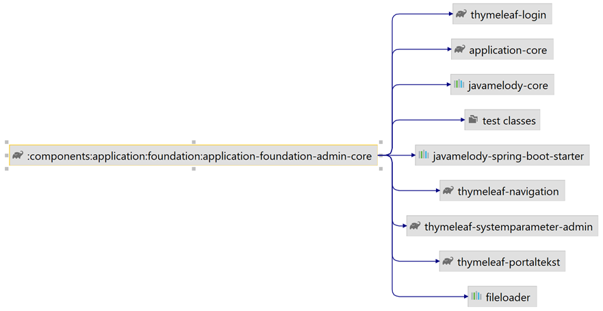

<h5>Figure 10: Application core component model</h5>
 

The letter related implementations of the FileLoaderStrategy can be found in the mailmerge library with component model
shown in Figure 4: Component for mail merge library containing 1-click letter migration functionality.

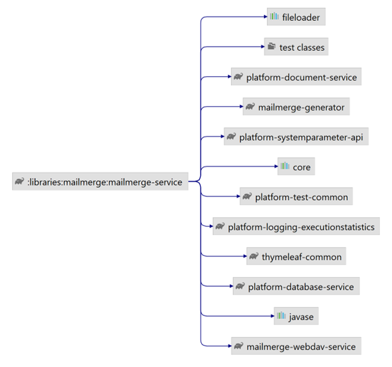

<h5>Figure 11: Component for mail merge library containing 1-click letter migration functionality</h5>
 

# FAQ

If your project implemented the letter migration component and found any troubleshooting tips, or questions that you
have answered during implementation, then please add them here.

## I cannot find the resources file, what is happening?

The file location has been moved into a new storage location, which is as follows.

The version pre Amplio release 4.2 used `classpath:letters/dev` or `…/prod` to distinguish between PROD and DEV resource
files for the letters related files. The `SystemParameterTypes` used specific names that did not correlate directly to
the `SystemParameterTypes`. For example, `REGLER` being “regelark” in the root classpath, i.e., `Classpath:regelark`.

Amplio release 4.2 is using the same location for the storage, but the `SystemParameterTypes` are using the
`SystemParameterType` names capitalized, thus being for letter template `SystemParameterType`
`classpath:letters/dev/BESKEDSKABELON`. This is done to only make minor changes to the previous components and thus
reuse the controllers to reload templates from the resource location.

Post Amplio release 4.2, the resource file location for import by resources will use the path
`classpath:/systemparameters/` as described in this document.

## I have problems with the system parameter definitions, what could I try to solve these?

System parameters need to be valid and have required `SystemParameterAttributes`, otherwise the
`SystemParameterInstance` will not be updated. Here are some learnings from when this was added to PE:

- System parameters need to be kept up to date with required fields, which will otherwise fail when trying to import
  system parameters with missing required fields. New parameter attributes added to letter-related system parameters
  will need a patch to add this new parameter value for all the already added parameter instances.
- `MASTER_TEMPLATE` parameter attributes were missing because `MASTER_TEMPLATES` uses parameter attributes from
  `BESKEDSKABELON`. Fixing this see WI-156728.

## WebLogic is failing, how can I fix it?

WebLogic servers have a maximum message size, which for the specific servers needs to be extended in case many system
parameters need to be added at once. It can be circumvented by using separate smaller files if necessary. How to extend
the WebLogic settings can be found in section [Configurable Settings](/DD130-Detailed-Design/1-click-Letter-Migration#Configurable-settings).

