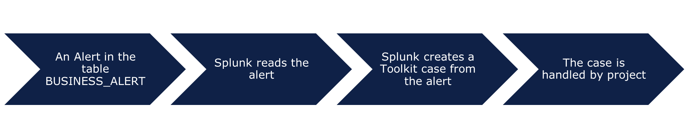
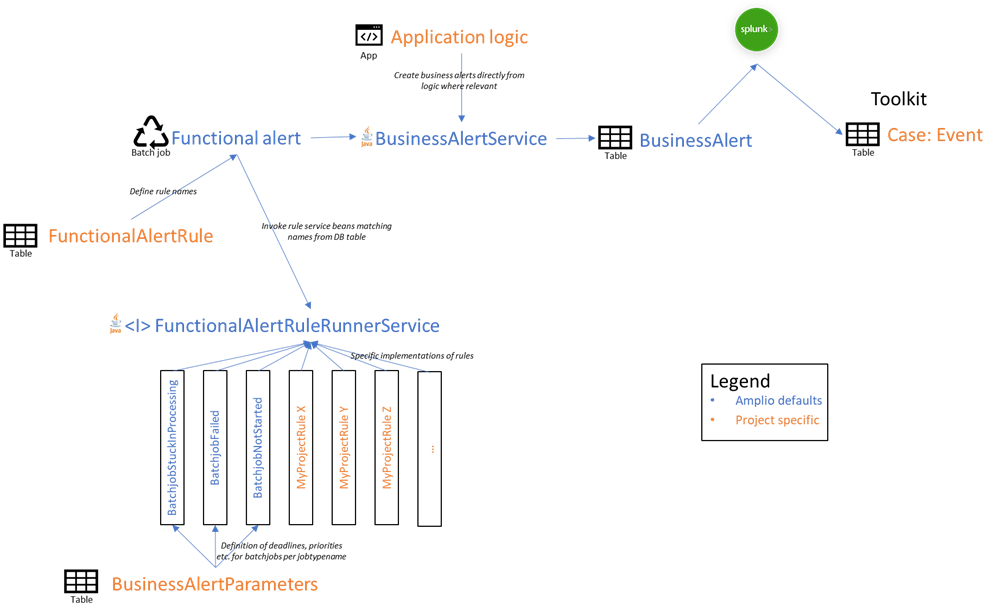
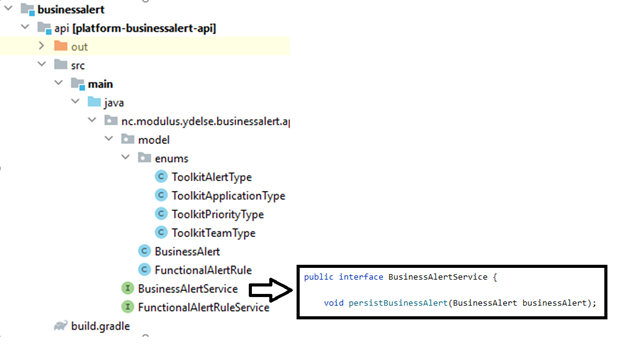
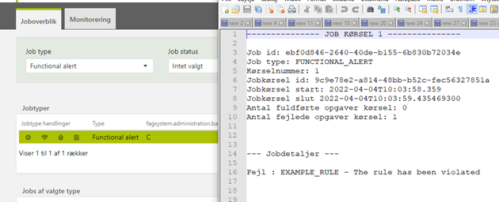
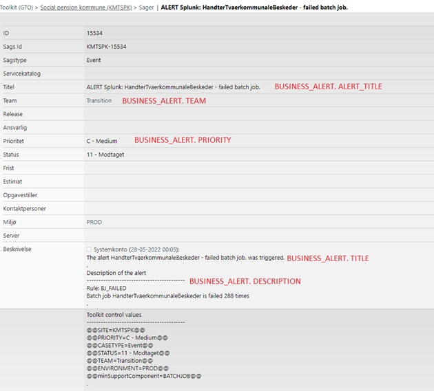
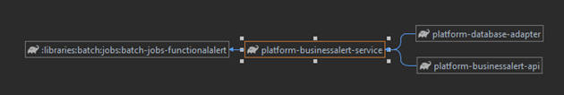
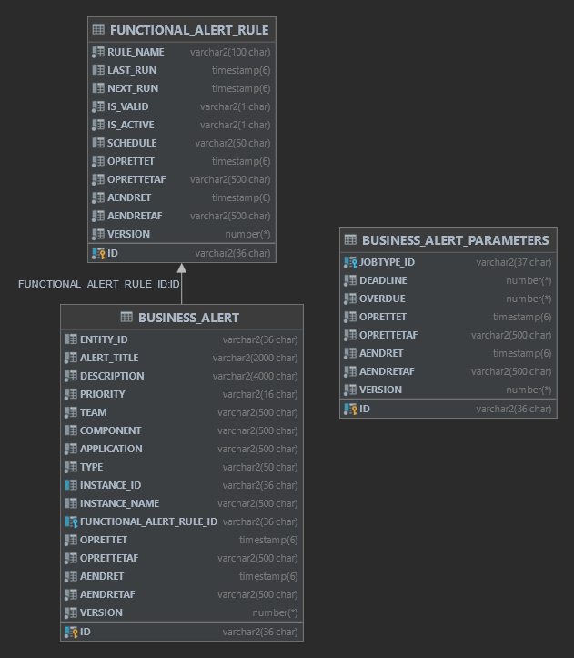

# References

| Reference                                                                                                         | Title                          | Author         |
|-------------------------------------------------------------------------------------------------------------------|--------------------------------|----------------|
| [TFS - Alert framework overview](https://source.netcompany.com/tfs/Netcompany/NCMCORE/_workitems/edit/134750/)    | TFS - Alert framework overview | Paweł Łukasiak |
| [Alert framework in Amplio](https://source.netcompany.com/tfs/Netcompany/NCMCORE/_git/NCMCORE/pullrequest/197986) | Alert framework in Amplio      | Paweł Łukasiak |
| [Alert framework in KP](https://source.netcompany.com/tfs/Netcompany/KMTSPK/_git/KMTSPK/pullrequest/198658)       | Alert framework in KP          | Paweł Łukasiak |
| [Alert framework in PE](https://source.netcompany.com/tfs/Netcompany/ATPE0004/_git/ATPE0004/pullrequest/237091)   | Alert framework in PE          | Michał Niski   |

# Introduction

This document is part of the system documentation for the projects using the Amplio platform, and the Alert Framework.
Developers can use the document to gain insight into how to implement and use the component in a project.

## Target audience

Target audience are Amplio developers who will implement changes or want to increase awareness of how Alert Framework
works, and project developers who need to work with or use the Alert Framework.

## Purpose

The aim is to provide knowledge on how to import, use and contribute to the Alert framework, which is a tool designed to
minimize manual monitoring of application failures as the framework will automatically create cases in Toolkit.

## Background information

An alert is a way to inform developers that a process, a batch job, or other components like calculations had an issue.
In such a situation a case should be created in Toolkit. The mechanism creating cases in Toolkit is based on the
integration with Splunk, which automatically loads alerts from the database. Alerts can be created in two ways:

- Functional alert
    - This solution consists of services that can be used in applications and will be able to quickly inform about the
      problem in the application. This is required for the project. This is described further
      in [alert framework](#alert-framework).
- Functional alert batch job
    - The batch job periodically runs queries to find violations of implemented rules. This is optional for the project
      and does not work without the implementation of functional alert. This is described further
      in [functional alert batch job](#functional-alert-batch-job).

Follow this link for additional overview:

- [TFS - Alert framework overview](https://source.netcompany.com/tfs/Netcompany/NCMCORE/_workitems/edit/134750/)

The following pull requests can be used for inspiration:

- [Alert framework in Amplio](https://source.netcompany.com/tfs/Netcompany/NCMCORE/_git/NCMCORE/pullrequest/197986)
- [Alert framework in KP](https://source.netcompany.com/tfs/Netcompany/KMTSPK/_git/KMTSPK/pullrequest/198658)
- [Alert framework in PE](https://source.netcompany.com/tfs/Netcompany/ATPE0004/_git/ATPE0004/pullrequest/237091)

# High level description of the component

The main responsibility of the alert framework is creating alerts in the table BUSINESS_ALERT. The developer decides
when the alert will be written to the database by using a method to save alerts from the functional alert framework.
This will usually happen at the point of error handling when an exception is caught. Alerts can also be created by the
functional alert batch job when a rule is violated.

Splunk continuously monitors entries from the BUSINESS_ALERT table and based on them creates cases in Toolkit.

<div style="text-align: center;">



</div>

The integration with Splunk is set up by Operations. For this purpose, every project should create the case in Toolkit
for that and ask about this integration.

Conceptual drawing of the communication flow:

<div style="text-align: center;">



</div>

# Alert framework

This module consists of two services: BusinessAlertService and FunctionalAlertRuleService. The batch job
FUNCTIONAL_ALERT uses these services to find rules to process and persist business alerts to the database. This is
described further in the following subsections.

## Interface BusinessAlertService

This is an interface for handling business alerts. Amplio provides a default implementation for
BusinessAlertServiceImpl. The default implementation is placed as shown in the figure below.

<div style="text-align: center;">



</div>

From the developer's point of view, the most important method of the service is persistBusinessAlert(BusinessAlert). The
method saves new alerts to the database and can be used to save additional alerts from all projects. If you want to add
a new alert to your project, then use that method. To enable Alert Framework and the default services implementation,
import the Gradle configuration described in [alert framework](#alert-framework)
.

| Method                                                                                                           | Description                                                                                                                                       |
|------------------------------------------------------------------------------------------------------------------|---------------------------------------------------------------------------------------------------------------------------------------------------|
| void persistBusinessAlert(BusinessAlert businessAlert);                                                          | Persists business alert to BUSINESS_ALERT table.                                                                                                  |
| void persistBusinessAlertNewTx(BusinessAlert businessAlert);                                                     | Persists business alert to BUSINESS_ALERT table. Method implementation should use @Transactional(Requires_new).                                   |
| List<BusinessAlert> getLastBusinessAlertForRuleAndJob(String ruleId, String jobName, LocalDateTime currentTime); | Gets last business alert for specified rule id and job name. The rule id refers to FUNCTIONAL_ALERT_RULE table, further described in section 9.2. |
| BusinessAlert getBusinessAlertByInstanceId(String jobId);                                                        | Gets business alert for specified job id.                                                                                                         |
| void persistBusinessAlertForRuleId(List<BusinessAlert> businessAlertList, String id);                            | Sets rule id on business alerts before persisting them to BUSINESS_ALERT table.                                                                   |

## Interface FunctionalAlertRuleService

This is an interface for handling FunctionalAlertRule entities. Amplio provides a default implementation for
FunctionalAlertRuleServiceImpl. It is used in the Functional Alert Batch Job defined and described
in [functional alert batch job](#functional-alert-batch-job).

| Method                                                                                              | Description                                                                                                                                                                |
|-----------------------------------------------------------------------------------------------------|----------------------------------------------------------------------------------------------------------------------------------------------------------------------------|
| void persistRule(FunctionalAlertRule rule);                                                         | Persists rule to FUNCTIONAL_ALERT_RULE table.                                                                                                                              |
| FunctionalAlertRule getRule(String id);                                                             | Gets FUNCTIONAL_ALERT_RULE for specified rule id.                                                                                                                          |
| FunctionalAlertRule getRuleByName(String ruleName);                                                 | Gets FUNCTIONAL_ALERT_RULE for specified rule name.                                                                                                                        |
| void updateRuleNewTx(String ruleId, LocalDateTime lastRun, LocalDateTime nextRun, boolean isValid); | Updates functional alert rule for given rule id with new last run date, next run date and validity boolean. Method implementation should use @Transactional(Requires_new). |

## Class BusinessAlert

The class BusinessAlert represents an alert and has the same fields as the corresponding table BUSINESS_ALERT e.g.,
AlertTitle, Description etc. (See [table business_alert](#table-business_alert)). A few of these fields are ExtendableEnums.
It is possible to extend them
to adjust in your project, since they should correspond to the fields in each project’s Toolkit:

1. ToolkitAlertType: Warning, Critical
2. ToolkitApplicationType: BATCHAFVIKLING, FAGSYSTEM, PROCESS etc.
3. ToolkitPriorityType: A – Kritisk (critical), B – Høj (high), C – Medium, D – Lav (low)
4. ToolkitTeamType: That Enum should be fully extended by your project, see section 6.1.5.

A visual example of this class as Toolkit Alert can be seen in [example toolkit alert](#example-toolkit-alert), and a code
example of the creation of a BusinessAlert can be seen in [BusinessAlert](#businessalert).

# Functional Alert Batch Job

The Functional alert batch job uses the alert framework to minimize manual monitoring of application failures as the
alert framework will automatically create cases in Toolkit based on defined rules. FUNCTIONAL_ALERT batch job uses
FunctionalAlertRuleService to find rules to process and creates alerts for any rules that are violated, which are
persisted to the BUSINESS_ALERT table using BusinessAlertService. A project should define the frequency of running the
batch job.

The batch job creates alerts for rules that are incorrectly implemented or throw unhandled errors using the
FunctionalAlertBatchService. Each rule should implement the FunctionalAlertRuleRunnerService interface, and a
configuration of the rule should be added to the FUNCTIONAL_ALERT_RULE table for the specific project. Rules can be
scheduled to run in specific time intervals, which is controlled from the database level. Projects using the alert
framework and alert batch job can define their own rules.

Some rules (such as those in Amplio) use the AlertBatchJobMapperService<T> interface to allow projects to customize the
creation of business alerts for violated rules based on the data provided. You can define your rule with SQL code e.g.,
rejected payments, number of payments, payments without confirmation/rejection, payment SUM and COUNT is realistic, etc.
Check how to define rules in [configuration of a rule in functional alert rule](#configuration-of-a-rule-in-functional_alert_rule).

The batch job checks rules and saves results of violated rules as alerts in the BUSINESS_ALERT table (
see [table business_alert](#table-business_alert)). The batch job uses the alert framework to create alerts (
see [alert framework](#alert-framework)).

<div style="text-align: center;">



</div>

## Interface FunctionalAlertRuleRunnerService

This interface is used by the processor of the batch job FUNCTIONAL_ALERT, which receives the rule name to be executed
based on the given name it is looking for the proper FunctionalAlertRuleRunnerService implementation. To determine if
this is a proper service, getRuleName() method is used. Each rule should have its own implementation and this interface
allows the batch job to load all rule implementations.

| Method                         | Description                                                                                                             |
|--------------------------------|-------------------------------------------------------------------------------------------------------------------------|
| String getRuleName();          | Returns a name of rule. Used to determine if batch job should run this rule.                                            |
| List<BusinessAlert> runRule(); | Run the rule. If the rule is violated, then it should return alerts. See section 3 for information on what an alert is. |

An example implementation of this interface can be seen in [FunctionalAlertRuleRunnerService](#functionalalertrulerunnerservice).

### Rule ALERT_BATCHJOB_STUCK_IN_PROCESSING

Amplio provides implementation for rule ALERT_BATCHJOB_STUCK_IN_PROCESSING. This rule is violated if a batch job has
status in progress and the time passed since start time is longer than the overdue value defined for this specific batch
job. To enable the rule, it should be added to the table FUNCTIONAL_ALERT_RULE (
see [table functional_alert_rule](#table-functional_alert_rule)). If it is not added, it
will not be processed by the batch job FUNCTIONAL_ALERT. You can also specify a custom interval between alerts based on
the priority of the batch job (see [failed_job_alert_interval_priority_abcd optional](#failed_job_alert_interval_priority_abcd-optional)).

### Rule ALERT_BATCHJOB_FAILED

Amplio provides implementation for rule ALERT_BATCHJOB_FAILED. This rule is violated if a batch job has status failed
and this happened after the last Alert Job run. To enable the rule, it should be added to the table
FUNCTIONAL_ALERT_RULE (see section 9.2). If it is not added, it will not be processed by the batch job FUNCTIONAL_ALERT.
The rule will only be evaluated for job types defined in the BATCHJOB_ALERT_PARAMETERS table (
see [table batchjob_alert_parameters](#table-batchjob_alert_parameters)).

### Rule ALERT_BATCHJOB_NOT_STARTED

Amplio provides implementation for rule ALERT_BATCHJOB_NOT_STARTED. This rule is violated if a batch job has status
planned and the elapsed time since the scheduled start time is longer than the deadline value defined for this batch
job. To enable the rule, it should be added to the table FUNCTIONAL_ALERT_RULE (
see [table functional_alert_rule](#table-functional_alert_rule)). If it is not added, it
will not be processed by the batch job FUNCTIONAL_ALERT. The rule will only be evaluated for job types defined in the
BATCHJOB_ALERT_PARAMETERS table (see [table batchjob_alert_parameters](#table-batchjob_alert_parameters)).

## Interface FunctionalAlertBatchService

The service is responsible for creating alerts for any unimplemented or improperly implemented rules, so it serves as a
kind of self-monitoring function. Each project must implement it independently based on its own business needs and
priorities.

An example implementation of this interface can be seen in [FunctionalAlertBatchService](#functionalalertbatchservice).

| Method                                                                                                                    | Description                                                                            |
|---------------------------------------------------------------------------------------------------------------------------|----------------------------------------------------------------------------------------|
| BusinessAlert buildBusinessAlertForBrokenRule(String jobName, String jobId, String ruleId, String ruleName, String desc); | Maps given data for broken rule to Business Alert. Must be implemented by the project. |

## Interface AlertBatchJobMapperService

The purpose of the mapper service is to allow projects to decide what they want to do with the data placed in the DTO
created during the rule evaluation. For example, depending on the prioritization in a particular project, the alert
description may look different. The same is true for the priority of a toolkit issue, which may differ from the priority
of the batch job present in the DTO.

| Method                                                          | Description                                                                                                 |
|-----------------------------------------------------------------|-------------------------------------------------------------------------------------------------------------|
| BusinessAlert mapResultToBusinessAlert(T alertBatchjobInfoDto); | Maps DTO to Business Alert. Must be implemented for each rule from Amplio you want to have in your project. |

An example implementation of this interface can be seen in [AlertBatchJobMapperService](#alertbatchjobmapperservice).

## Algorithm of the Batch Job FUNCTIONAL_ALERT

### Reading phase

1. Take all active rules which should be run now. The table FUNCTIONAL_ALERT_RULE: isActive = TRUE and (r.nextRun is
   null or r.nextRun < :CURRENTTIME).
2. Create Batch Items.

### Processing Phase

1. If an implementation of a rule does not exist:
    - FUNCTIONAL_ALERT_RULE .IS_VALID = false.
    - Set FUNCTIONAL_ALERT_RULE .LAST_RUN with current timestamp.
    - Store the alert in BUSINESS_ALERT table with Id of checked rule (FUNCTIONAL_ALERT_RULE_ID). This type of alert
      should be stored one per 14 days to avoid generating the same alerts and cases in toolkit.
2. Calculate next run date of the rule based on SCHEDULE.
3. Run the rule.
4. If the rule is not violated:
    - IS_VALID = true.
    - Set LAST_RUN with current timestamp.
    - Set NEXT_RUN with value calculated in point 2.
5. If the rule is violated or there was an exception while it was run:
    - IS_VALID = false.
    - Set NEXT_RUN with value calculated in point 2.
    - Set LAST_RUN with current timestamp.
    - Store the alert in BUSINESS_ALERT table with Id of the checked rule FUNCTIONAL_ALERT_RULE_ID.

# Routing alerts to Toolkit by Splunk

The routing alert to Toolkit is not a part of the alert framework. This section mostly describes how to create the case
to Operations, and that the alerts will be automatically consumed by Splunk. Creating that case to Operations is enough
to make it work. That case should be a service request with the description (you need to replace OWNER, DB and PORT with
the relevant information):

- grant system_splunk user with select on the BUSINESS_ALERT
- create firewall rule from 100.64.8.51 -> DB:PORT
- please ingest the from DB following SQL into Splunk:
  <br>SELECT *
  <br>FROM "OWNER"."BUSINESS_ALERT"
  <br>WHERE AENDRET > ?
  <br>ORDER BY AENDRET ASC
- The source type should be “database:business:alerts”
- Interval must be every 5 minutes.

## Operation mappings

Note that this is an informational chapter to give some context. This chapter is a part that is handled by Operations
and should not be a concern of a project. Routing of alerts is handled by Splunk. Splunk reads alerts from the
BUSINESS_ALERT table. The setup of that is handled by OPS. OPS has created a standardized way for WBS projects in which
it is possible to request the creation of alert events. OPS specifies the information seen in the below table. The
examples use @@ … @@ this is simply the syntax for which the underlying system uses to translate alert events into
Toolkit alert events when being sent to alarms.goto@netcompany.com. When OPS sets up the alerts the Service Desk will
receive them with a prefixed name as such: ALERT Splunk: BATCH_A_JOB is in critical state.

| Parameter   | Description                                                                                                                                                                                                         | Value          | Example                         | Mapping                     |
|-------------|---------------------------------------------------------------------------------------------------------------------------------------------------------------------------------------------------------------------|----------------|---------------------------------|-----------------------------|
| SITE        | This is the Toolkit site. For the SPK project the toolkit site is KMTSPK                                                                                                                                            | KMTSPK         | @@SITE=KMTSPK@@                 | Permanently set by OPS      |
| Environment | This is the environment in which the batch job runs in. For example, from the production environment.                                                                                                               | PROD           | @@Environment=PROD@@            | Permanently set by OPS      |
| Application | This is the application in which the alert event is thrown from.                                                                                                                                                    | Batchafvikling | @@Application=Batchafvikling @@ | BUSINESS_ALERT. APPLICATION |
| Team        | This is the team to which you would like the alert event to be assigned. For A/B jobs you would want to assign to Service Desk                                                                                      | Service Desk   | @@Team=Service Desk@@           | BUSINESS_ALERT. TEAM        |
| Priority    | The priority of the job (A or B)                                                                                                                                                                                    | A - Kritisk    | @@Priority=C - Standard@@       | BUSINESS_ALERT. PRIORITY    |
| ALARM TYPE  | The type of the alarm: - Warning - Critical Whether it should be critical, or warning depends on the projects needs for that job. A batch job that fails on 100 items is more critical than if it fails for 1 item. | Critical       | @@ALARM TYPE=Critical@@         | BUSINESS_ALERT. TYPE        |

*Table 1: OPS Alert event instructions for a Danish language Project Toolkit.*

## Example Toolkit Alert

This is an example of a toolkit alert case created by Splunk. The case consists of values from the BUSINESS_ALERT table.
Corresponding fields are marked in the following picture.

<div style="text-align: center;">



</div>

# Configurations and service extensions

This section will define how to set up the component and what component requirements come along.

## Code integration

### BusinessAlert

For a technical description of this object, see [class businessalert](#class-businessalert). To create it you should set
several fields, as in this
example:

```java
BusinessAlert businessAlert = new BusinessAlert();
businessAlert.setAlertTitle(ALERT_TITLE);
businessAlert.setDescription(DESCRIPTION);
businessAlert.setPriority(ToolkitPriorityType.C);
businessAlert.setTeam(MY);
businessAlert.setComponent(COMPONENT);
businessAlert.setApplication(ToolkitApplicationType.BATCHAFVIKLING);
businessAlert.setType(ToolkitAlertType.WARNING);
businessAlert.setInstanceName(RULE_NAME);
```

### FunctionalAlertBatchService

This is an example of implementation of FunctionalAlertBatchService interface, a technical description of the interface
can be found in [interface FunctionalAlertBatchService](#interface-functionalalertbatchservice).

```java
@Service
@Transactional
public class FunctionalAlertBatchServiceImpl implements FunctionalAlertBatchService {

    private static final String ALERT_TITLE = "The rule {0} is broken";
    private static final String COMPONENT = "BATCHJOB";
    private static final String DESCRIPTION = "The rule {0} is broken. \n The exception: {1}.";

    @Override
    public BusinessAlert buildBusinessAlertForBrokenRule(String jobName, String jobId, String ruleId, String ruleName, String desc) {

        BusinessAlert businessAlert = new BusinessAlert();
        businessAlert.setAlertTitle(MessageFormat.format(ALERT_TITLE, ruleName));
        businessAlert.setDescription(MessageFormat.format(DESCRIPTION, ruleName, desc));
        businessAlert.setPriority(ToolkitPriorityType.C);
        businessAlert.setTeam(PeToolkitTeamType.FUNKTIONELT_TEAM_3_REGLER);
        businessAlert.setComponent(COMPONENT);
        businessAlert.setApplication(PeToolkitApplicationType.BATCHAFVIKLING_OG_DRIFTSADMINISTRATION);
        businessAlert.setType(ToolkitAlertType.WARNING);
        businessAlert.setInstanceId(jobId);
        businessAlert.setInstanceName(jobName);
        businessAlert.setFunctionalAlertRuleId(ruleId);

        return businessAlert;
    }

}
```

### FunctionalAlertRuleRunnerService

This is an example of implementation of FunctionalAlertRuleRunnerService interface, a technical description of the
interface can be found in [interface FunctionalAlertRuleRunnerService](#interface-functionalalertrulerunnerservice).

```java
@Service
@Transactional
public class ExampleRuleServiceImpl implements FunctionalAlertRuleRunnerService {

    private static final Logger LOGGER = LoggerFactory.getLogger(ExampleRuleServiceImpl.class);

    public static final String RULE_NAME = "EXAMPLE_RULE";

    private static final String ALERT_TITLE = "EXAMPLE - ALERT_TITLE";
    private static final String COMPONENT = "EXAMPLE_COMPONENT";
    private static final String DESCRIPTION = "EXAMPLE - The rule has been violated";

    private static final String RULE_SQL = " select * from sag where importeret_til_kombit = 'N' ";

    @Autowired
    private DbAdapter dbAdapter;

    @Override
    public String getRuleName() {
        return RULE_NAME;
    }

    @Override
    @Transactional(propagation = Propagation.REQUIRES_NEW)
    public List<BusinessAlert> runRule() {
        List<Object[]> result = dbAdapter.getValuesFromSqlQuery(RULE_SQL, ImmutableMap.of(), ContextWrapper.get());

        if (result.isEmpty()) {
            return new ArrayList<>();
        }

        BusinessAlert businessAlert = new BusinessAlert();
        businessAlert.setAlertTitle(ALERT_TITLE);
        businessAlert.setDescription(DESCRIPTION);
        businessAlert.setPriority(ToolkitPriorityType.C);
        businessAlert.setTeam(MY);
        businessAlert.setComponent(COMPONENT);
        businessAlert.setApplication(ToolkitApplicationType.BATCHAFVIKLING);
        businessAlert.setType(ToolkitAlertType.WARNING);
        businessAlert.setInstanceName(RULE_NAME);

        return List.of(businessAlert);
    }

}
```

### AlertBatchJobMapperService

This is an example of an implementation of the AlertBatchJobMapperService<T> interface, a technical description of the
interface can be found in [interface AlertBatchJobMapperService](#interface-alertbatchjobmapperservice). Since some DTOs for rules may be
similar and share the same behavior, we decided to first extract the common logic into an abstract class.

```java
public abstract class AlertBatchJobMapperServiceBase<T> implements AlertBatchJobMapperService<T> {

    protected static final String COMPONENT = "BATCH";

    protected final AlertBatchJobHelper alertBatchJobHelper;
    protected final TekstService tekstService;

    protected AlertBatchJobMapperServiceBase(AlertBatchJobHelper alertBatchJobHelper, TekstService tekstService) {
        this.alertBatchJobHelper = alertBatchJobHelper;
        this.tekstService = tekstService;
    }

    protected BusinessAlert mapResultToBusinessAlert(String jobId, String jobName, LocalDateTime time, Kritikalitet jobPriority, String titleNoegle, String descriptionNoegle) {
        String description = getPrimaertekst(descriptionNoegle);
        return alertBatchJobHelper.createBusinessAlert(jobId, jobName, time, jobPriority, getPrimaertekst(titleNoegle), description, getUrgentDescription(description), COMPONENT);
    }

    protected String getUrgentDescription(String description) {
        return getPrimaertekst("batch.functional_alert.service_desk_message") + description + getPrimaertekst("batch.functional_alert.urgent_description");
    }

    protected String getPrimaertekst(String noegle) {
        return tekstService.getTekst(noegle).getPrimaertekst();
    }

}
```

The following code snippet shows the actual implementation of one of the rule mappings. Most of the logic has been
extracted to the shared components responsible for creating Business Alert entities. In this case, the purpose of the
specific implementation is only to define a rule-specific input.

```java
@Service
public class AlertBatchJobNotStartedMapperService extends
        AlertBatchJobMapperServiceBase<AlertBatchJobNotStartedInfoDto> {

    private static final String BATCHJOB_NOT_STARTED_TITLE = "batch.functional_alert.alert_title.job_not_started";
    private static final String BATCHJOB_NOT_STARTED_DESCRIPTION = "batch.functional_alert.description.job_not_started";

    protected AlertBatchJobNotStartedMapperService(AlertBatchJobHelper alertBatchJobHelper, TekstService tekstService) {
        super(alertBatchJobHelper, tekstService);
    }

    @Override
    public BusinessAlert mapResultToBusinessAlert(AlertBatchJobNotStartedInfoDto alertBatchJobNotStartedInfoDto) {
        return mapResultToBusinessAlert(alertBatchJobNotStartedInfoDto.getJobId(), alertBatchJobNotStartedInfoDto.getJobName(),
                alertBatchJobNotStartedInfoDto.getPlannedStartDateTime(), alertBatchJobNotStartedInfoDto.getJobPriority(), BATCHJOB_NOT_STARTED_TITLE, BATCHJOB_NOT_STARTED_DESCRIPTION);
    }

}
```

### BusinessAlert.ToolkitTeamType

Here the general concept of customizing ExtendableEnums is demonstrated, but the example is specifically for
ToolkitTeamType:

```java
@StaticInitializer
public class PeToolkitTeamType {

    public static final ToolkitTeamType AMC = ToolkitTeamType.create("AMC");
    public static final ToolkitTeamType ARKITEKTUR = ToolkitTeamType.create("Arkitektur");

}
```

## Configurable settings

### Systemparameters

#### FAILED_JOB_ALERT_INTERVAL_PRIORITY_{A/B/C/D} [Optional]

4 optional parameters used by the ALERT_BATCHJOB_FAILED rule to define a custom interval between the creation of the
next alert. For jobs with priority A and B, the default value is 0, for C and D - 24 hours.

| PARAMETERTYPE | batch                                                                                                                          |
|---------------|--------------------------------------------------------------------------------------------------------------------------------|
| NOEGLE        | FAILED_JOB_ALERT_INTERVAL_PRIORITY_{A/B/C/D}                                                                                   |
| VAERDI        | {project specific interval in hours}                                                                                           |
| BESKRIEVELSE  | Amount of hours between creating business alerts for failing batch jobs of the same job type for jobs with priority {A/B/C/D}. |

## Database patches

The section contains example patches for the Oracle database. If you are using another database, you may need to adjust
your queries.

### BUSINESS_ALERT table

```oraclesqlplus
DECLARE
    table_already_exists EXCEPTION;
    PRAGMA
        EXCEPTION_INIT (table_already_exists, -955);
BEGIN
    EXECUTE IMMEDIATE 'CREATE TABLE BUSINESS_ALERT
    (
    ID VARCHAR2(36 CHAR)  NOT NULL,
    ENTITY_ID VARCHAR2(36 CHAR),
    ALERT_TITLE VARCHAR2(2000 CHAR)  NOT NULL,
    DESCRIPTION VARCHAR2(4000 CHAR)  NOT NULL,
    PRIORITY VARCHAR2(16 CHAR)  NOT NULL,
    TEAM VARCHAR2(500 CHAR)  NOT NULL,
    COMPONENT VARCHAR2(500 CHAR),
    APPLICATION VARCHAR2(500 CHAR)  NOT NULL,
    TYPE VARCHAR2(50 CHAR)  NOT NULL,
    INSTANCE_ID VARCHAR2(36 CHAR),
    INSTANCE_NAME VARCHAR2(500 CHAR),
    FUNCTIONAL_ALERT_RULE_ID VARCHAR2(36 CHAR),
    OPRETTET TIMESTAMP (6) NOT NULL,
    OPRETTETAF VARCHAR2(500 CHAR) NOT NULL,
    AENDRET TIMESTAMP (6) NOT NULL,
    AENDRETAF VARCHAR2(500 CHAR) NOT NULL
    )';
EXCEPTION
    WHEN table_already_exists THEN NULL;
END;
/

DECLARE
    name_already_used EXCEPTION;
    column_already_indexed
        EXCEPTION;
    PRAGMA
        EXCEPTION_INIT (name_already_used, -955);
    PRAGMA
        EXCEPTION_INIT (column_already_indexed, -1408);
BEGIN
    EXECUTE IMMEDIATE 'CREATE INDEX IXFK_FUNCTIONAL_ALERT_RULE_ID ON BUSINESS_ALERT (FUNCTIONAL_ALERT_RULE_ID ASC)';
EXCEPTION
    WHEN name_already_used OR column_already_indexed THEN NULL;
END;
/

DECLARE
    name_already_used EXCEPTION;
    column_already_indexed
        EXCEPTION;
    PRAGMA
        EXCEPTION_INIT (name_already_used, -955);
    PRAGMA
        EXCEPTION_INIT (column_already_indexed, -1408);
BEGIN
    EXECUTE IMMEDIATE 'CREATE INDEX IXFK_INSTANCE_ID ON BUSINESS_ALERT (INSTANCE_ID ASC)';
EXCEPTION
    WHEN name_already_used OR column_already_indexed THEN NULL;
END;
/

DECLARE
    primary_key_already_exists EXCEPTION;
    PRAGMA
        EXCEPTION_INIT (primary_key_already_exists, -2260);
BEGIN
    EXECUTE IMMEDIATE 'ALTER TABLE BUSINESS_ALERT ADD CONSTRAINT PK_BUSINESS_ALERT PRIMARY KEY (ID) USING INDEX';
EXCEPTION
    WHEN primary_key_already_exists THEN NULL;
END;
/

DECLARE
    foreign_key_already_exists EXCEPTION;
    PRAGMA
        EXCEPTION_INIT (foreign_key_already_exists, -2275);
BEGIN
    EXECUTE IMMEDIATE 'ALTER TABLE BUSINESS_ALERT ADD CONSTRAINT FK_BUSINESS_ALERT_FUNCTIONAL_ALERT_RULE FOREIGN KEY (
FUNCTIONAL_ALERT_RULE_ID) REFERENCES FUNCTIONAL_ALERT_RULE (ID)';
EXCEPTION
    WHEN foreign_key_already_exists THEN NULL;
END;
/
```

### BATCHJOB_ALERT_PARAMETERS table

```oraclesqlplus
DECLARE
    table_already_exists EXCEPTION;
    PRAGMA
        EXCEPTION_INIT (table_already_exists, -955);
BEGIN
    EXECUTE IMMEDIATE 'CREATE TABLE BATCHJOB_ALERT_PARAMETERS
    (
    ID VARCHAR2(36 CHAR)  NOT NULL,
    JOBTYPE_ID VARCHAR2(37 CHAR) NOT NULL UNIQUE,
    DEADLINE NUMBER DEFAULT 1 NOT NULL,
    OVERDUE NUMBER DEFAULT 1 NOT NULL,
    OPRETTET TIMESTAMP (6) NOT NULL,
    OPRETTETAF VARCHAR2(500 CHAR) NOT NULL,
    AENDRET TIMESTAMP (6) NOT NULL,
    AENDRETAF VARCHAR2(500 CHAR) NOT NULL
    )';
EXCEPTION
    WHEN table_already_exists THEN NULL;
END;
/

DECLARE
    name_already_used EXCEPTION;
    column_already_indexed
        EXCEPTION;
    PRAGMA
        EXCEPTION_INIT (name_already_used, -955);
    PRAGMA
        EXCEPTION_INIT (column_already_indexed, -1408);
BEGIN
    EXECUTE IMMEDIATE 'CREATE INDEX IXFK_JOBTYPE_ID ON BATCHJOB_ALERT_PARAMETERS (JOBTYPE_ID ASC)';
EXCEPTION
    WHEN name_already_used OR column_already_indexed THEN NULL;
END;
/

DECLARE
    primary_key_already_exists EXCEPTION;
    PRAGMA
        EXCEPTION_INIT (primary_key_already_exists, -2260);
BEGIN
    EXECUTE IMMEDIATE 'ALTER TABLE BATCHJOB_ALERT_PARAMETERS ADD CONSTRAINT PK_BATCHJOB_ALERT_PARAMETERS PRIMARY KEY (ID)
USING INDEX';
EXCEPTION
    WHEN primary_key_already_exists THEN NULL;
END;
/

DECLARE
    foreign_key_already_exists EXCEPTION;
    PRAGMA
        EXCEPTION_INIT (foreign_key_already_exists, -2275);
BEGIN
    EXECUTE IMMEDIATE 'ALTER TABLE BATCHJOB_ALERT_PARAMETERS ADD CONSTRAINT FK_BATCHJOB_ALERT_PARAMETERS_JOBTYPE FOREIGN
KEY (JOBTYPE_ID) REFERENCES JOBTYPE (id)';
EXCEPTION
    WHEN foreign_key_already_exists THEN NULL;
END;
/
```

### FUNCTIONAL_ALERT_RULE table

```oraclesqlplus
DECLARE
    table_already_exists EXCEPTION;
    PRAGMA
        EXCEPTION_INIT (table_already_exists, -955);
BEGIN
    EXECUTE IMMEDIATE 'CREATE TABLE FUNCTIONAL_ALERT_RULE
    (
    ID VARCHAR2(36 CHAR)  NOT NULL,
    RULE_NAME VARCHAR2(100 CHAR) NOT NULL,
    LAST_RUN TIMESTAMP (6),
    NEXT_RUN TIMESTAMP (6),
    IS_VALID VARCHAR2(1 CHAR)      NOT NULL,
    IS_ACTIVE VARCHAR2(1 CHAR)      NOT NULL,
    SCHEDULE VARCHAR2(50 CHAR),
    OPRETTET TIMESTAMP (6) NOT NULL,
    OPRETTETAF VARCHAR2(500 CHAR) NOT NULL,
    AENDRET TIMESTAMP (6) NOT NULL,
    AENDRETAF VARCHAR2(500 CHAR) NOT NULL
    )';

EXCEPTION
    WHEN table_already_exists THEN NULL;

END;
/

DECLARE
    primary_key_already_exists EXCEPTION;
    PRAGMA
        EXCEPTION_INIT (primary_key_already_exists, -2260);
BEGIN
    EXECUTE IMMEDIATE 'ALTER TABLE FUNCTIONAL_ALERT_RULE ADD CONSTRAINT PK_FUNCTIONAL_ALERT_RULE PRIMARY KEY (ID) USING
INDEX';
EXCEPTION
    WHEN primary_key_already_exists THEN NULL;
END;
/
```


### Configuration of a job in BATCHJOB_ALERT_PARAMETERS

Configuration of a rule should be inserted to the BATCHJOB_ALERT_PARAMETERS table for every batch job that should be
considered by the rules.

```oraclesqlplus
DECLARE
    c NUMBER := 0;
BEGIN
    SELECT COUNT(*) INTO c FROM BATCHJOB_ALERT_PARAMETERS WHERE OPRETTETAF = 'X';
    IF (c = 0)
    THEN
        INSERT INTO BATCHJOB_ALERT_PARAMETERS (ID, JOBTYPE_ID, DEADLINE, OVERDUE, OPRETTET, OPRETTETAF, AENDRET,
                                               AENDRETAF)
        SELECT sys_guid(),
               j.id,
               1,
               1,
               systimestamp,
               'X',
               systimestamp,
               'X'
        FROM PE.jobtype j
        WHERE J.navn = ('TASK_FILTER_JOB');
    END IF;
END;
/
```

### Configuration of a rule in FUNCTIONAL_ALERT_RULE

Configuration of a rule should be inserted to the FUNCTIONAL_ALERT_RULE table.

```oraclesqlplus
Insert into FUNCTIONAL_ALERT_RULE (ID, RULE_NAME, LAST_RUN, NEXT_RUN, IS_VALID, IS_ACTIVE, SCHEDULE, OPRETTET,
                                   OPRETTETAF, AENDRET, AENDRETAF)
select sys_guid(),
       'BJ_DUD_IS_SCHEDULED',
       null,
       null,
       'Y',
       'Y',
       '@weekly',
       SYSDATE,
       'SYSTEM',
       SYSDATE,
       'SYSTEM'
from dual
where not exists (select 1 from FUNCTIONAL_ALERT_RULE where RULE_NAME = 'BJ_DUD_IS_SCHEDULED')
/
```

#### Spring CRON-expression example

An example of the CRON-expression:

| Cron Expression      | Meaning                                           |
|----------------------|---------------------------------------------------|
| 0 0 * * * *          | top of every hour of every day                    |
| */10 * * * * *       | every ten seconds                                 |
| 0 0 8-10 * * *       | 8, 9 and 10 o’clock of every day                  |
| 0 0 6,19 * * *       | 6:00 AM and 7:00 PM every day                     |
| 0 0/30 8-10 * * *    | 8:00, 8:30, 9:00, 9:30, 10:00 and 10:30 every day |
| 0 0 9-17 * * MON-FRI | on the hour nine-to-five weekdays                 |
| 0 0 0 25 12 ?        | every Christmas Day at midnight                   |

An explanation of the CRON-expressions:

┌───────────── second (0-59)

│┌───────────── minute (0 - 59)

││┌───────────── hour (0 - 23)

│││┌───────────── day of the month (1 - 31)

││││┌───────────── month (1 - 12) (or JAN-DEC)

│││││┌───────────── day of the week (0 - 7)(or MON-SUN -- 0 or 7 is Sunday)

││││││

││││││

\* * * * * *

You can use macros instead of the CRON-expressions:

| Macro                  | Meaning                      |
|------------------------|------------------------------|
| @yearly (or @annually) | once a year (0 0 0 1 1 *)    |
| @monthly               | once a month (0 0 0 1 * *)   |
| @weekly                | once a week (0 0 0 * * 0)    |
| @daily (or @midnight)  | once a day (0 0 0 * * *), or |
| @hourly                | once an hour, (0 0 * * * *)  |

# Migration information

## Alert Framework

To import the Alert Framework to a project you should:

1. Create table in your project: BUSINESS_ALERT. See [BUSINESS_ALERT table](#business_alert-table).
2. Create a case to Operation to set up the mechanism to load automatically alerts from the table BUSINESS_ALERT and
   create cases in Toolkit by Splunk.
3. Add the dependency for the Alert Framework:
   `api "nc.my.libraries:platform-businessalert-api"`
4. Import BusinessAlertConfig.class.

## Functional Alert Batch Job

To import the Functional alert batch job to a project you should:

1. Create table in your project: FUNCTIONAL_ALERT_RULE and BATCHJOB_ALERT_PARAMETERS. See
   sections [FUNCTIONAL_ALERT_RULE table](#functional_alert_rule-table).
2. Add dependency for the batch job FUNCTIONAL_ALERT:
   `api "nc.my.libraries:batch-jobs-functionalalert"`
3. Import batch config: BusinessAlertRuleConfig.class.
4. Implement FunctionalAlertBatchService (see [FunctionalAlertBatchService](#functionalalertbatchservice))
5. Specify what rules you want to have in your project:
    - Project specific implementation can be done according
      to [configuration of a rule in FUNCTIONAL_ALERT_RULE](#configuration-of-a-rule-in-functional_alert_rule).
    - Importing existing rules from Amplio.

### Importing existing rules from Amplio

To import rule to a project, simply import a specific rule configuration you want to have in your project. Note that
base implementation is done on the Amplio side. Projects should define configuration in FUNCTIONAL_ALERT,
FUNCTIONAL_ALERT_RULE TABLE and BATCHJOB_ALERT_PARAMETERS tables as well as implement DTO mappers.

Example of importing rules from Amplio is as follows:

```java
@Configuration
@ComponentScan(
        basePackages = {"atp.pe.batch.job.functionalalert"},
        excludeFilters = {@ComponentScan.Filter(type = FilterType.ANNOTATION, value = Configuration.class)}
)
@Import({
        FunctionalAlertBatchConfig.class,
        AlertBatchJobFailedConfig.class,
        AlertBatchJobStuckConfig.class,
        AlertBatchJobNotStartedConfig.class
})
public class PeFunctionalAlertBatchConfig {
    //implementation...
}
```

1. Import Amplio implementations
2. For each imported rule, create a project-specific implementation of AlertBatchJobMapperService<T>, where T is the DTO
   specific to that rule. Its role is to map the DTO to BusinessAlert using the project-specific requirements (see
   [interface FunctionalAlertBatchService](#interface-functionalalertbatchservice))
3. Add definition for the batch job FUNCTIONAL_ALERT in the JOBTYPE table.
    - Example from PE:

| ID                           | X                |
|------------------------------|------------------|
| STARTER                      |                  |
| BESKRIVELSE                  |                  |
| JOB_KLASSE                   | C                |
| MAX_KOERSELS_TID             |                  |
| NAVN                         | FUNCTIONAL_ALERT |
| NOTIFIKATIONS_GRAENSE        |                  |
| TILLAD_NYT_JOB_HVIS_FEJL     | Y                |
| TILLAD_START_ANDET_HVIS_FEJL | N                |
| STATUS                       | FREE             |
| GENTAGELSESMOENSTER          | 0 0 * ? * *      |
| FORSKYD_TIL_BANKDAG          | N                |
| SERVER_NAME                  | atp-pep-app05    |

4. Add rule definition in FUNCTIONAL_ALERT_RULE TABLE to enable rule
    - Example from PE:

| ID        | X                                  |
|-----------|------------------------------------|
| RULE_NAME | ALERT_BATCHJOB_STUCK_IN_PROCESSING |
| LAST_RUN  | 2023-03-15 16:45:14.587000         |
| NEXT_RUN  |                                    |
| IS_VALID  | Y                                  |
| IS_ACTIVE | Y                                  |
| SCHEDULE  |                                    |

5. Add parameters specific for each JOBTYPE in BATCHJOB_ALERT_PARAMETERS
    - Example from PE:

| ID         | X                                    |
|------------|--------------------------------------|
| JOBTYPE_ID | 5dcdd1fa-68dd-4fe9-b683-b0b4e01dd72e |
| DEADLINE   | 1                                    |
| OVERDUE    | 1                                    |

# Component model

<div style="text-align: center;">



</div>

# Data model

<div style="text-align: center;">



</div>

## Table BUSINESS_ALERT

This table is corresponding to class BusinessAlert.

| Column                   | Type           | Description                                                                                                                                 | NOT NULL |
|--------------------------|----------------|---------------------------------------------------------------------------------------------------------------------------------------------|----------|
| *PK ID                   | VARCHAR2(36)   | An ID in which to identify a specific alert.                                                                                                | X        |
| ENTITY_ID                | VARCHAR2(100)  | An entity for that a rule is invalid                                                                                                        |          |
| ALERT_TITLE              | VARCHAR2(2000) | A title of alert                                                                                                                            | X        |
| DESCRIPTION              | VARCHAR2(4000) | A description of alert                                                                                                                      | X        |
| PRIORITY                 | VARCHAR2(16)   | ToolkitPriorityType. Enum: A – Kritisk (critical), B – Høj (high), C – Medium, D – Lav (low)                                                | X        |
| TEAM                     | VARCHAR2(500)  | A ToolkitTeamType, that should receive a case (an invalid rule)                                                                             | X        |
| COMPONENT                | VARCHAR2(500)  | A component affected by a case (an invalid rule)                                                                                            |          |
| APPLICATION              | VARCHAR2(500)  | ToolkitApplicationType. An application affected by a case (an invalid rule): BATCHAFVIKLING, SELVBETJENING, FAGSYSTEM, WEBSERVICES, PROCESS | X        |
| TYPE                     | VARCHAR2(50)   | A ToolkitAlertType: Warning, Critical                                                                                                       | X        |
| INSTANCE_ID              | VARCHAR2(100)  | An id of instance affected by a case e.g., batch job id                                                                                     |          |
| INSTANCE_NAME            | VARCHAR2(500)  | A name of instance affected by a case e.g., batch job id                                                                                    |          |
| FUNCTIONAL_ALERT_RULE_ID | VARCHAR2(36)   | Id of related rule.                                                                                                                         |          |

## Table FUNCTIONAL_ALERT_RULE

This table is used by FunctionalAlertRuleService. This interface manages rules used by the batch job FUNCTIONAL_ALERT.

| Column    | Type                 | Description                                                                                                                                                                 | NOT NULL |
|-----------|----------------------|-----------------------------------------------------------------------------------------------------------------------------------------------------------------------------|----------|
| *PK ID    | VARCHAR2(36)         | The ID in which to identify a specific rule.                                                                                                                                | X        |
| RULE_NAME | VARCHAR2(100) UNIQUE | The name of rule, it is the same string returned by FunctionalAlertRuleRunnerService.getRuleName()                                                                          | X        |
| LAST_RUN  | TIMESTAMP            | Date of last run                                                                                                                                                            |          |
| NEXT_RUN  | TIMESTAMP            | Date of next run                                                                                                                                                            |          |
| IS_VALID  | BOOLEAN              | Describes whether the rule has been implemented correctly. The field is updated each time the batch job is run. In case of an unexpected error, the value false is set.     | X        |
| IS_ACTIVE | BOOLEAN              | Whether a rule is active or blocked, when IS_ACTIVE = FALSE, the batch job will not run the rule – ease way to disable rule if we have some problems with it e.g., on PROD. | X        |
| SCHEDULE  | VARCHAR2(50)         | How to calculate next run, it is Spring CRON-expression. If it is null, the rule will be run every time.                                                                    |          |

## Table BATCHJOB_ALERT_PARAMETERS

Previously known as BUSINESS_ALERT_PARAMETERS. This table does not have a corresponding class. It defines job
type-specific constants used by the Functional Alert batch job. Each project must define these constants to enable rule
processing for a specific job.

- DEADLINE – used by Rule ALERT_BATCHJOB_NOT_STARTED and specifies the number of hours that have elapsed since the
  scheduled job start. An alert is created only if the deadline value is exceeded.
- OVERDUE – used by Rule ALERT_BATCHJOB_STUCK_IN_PROCESSING and specifies the number of hours that have elapsed since
  the scheduled job end. An alert is created only if the overdue value is exceeded.

| Column     | Type         | Description                                                 | NOT NULL |
|------------|--------------|-------------------------------------------------------------|----------|
| *PK ID     | VARCHAR2(36) | An ID in which to identify a specific alert parameter.      | X        |
| JOBTYPE_ID | VARCHAR2(37) | A JOBTYPE to which the parameter refers. It Must be unique. | X        |
| DEADLINE   | NUMBER       | Allowed deadline value in hours. Default 1                  | X        |
| OVERDUE    | NUMBER       | Allowed overdue value in hours. Default 1                   | X        |

# Project examples of alert implementations

This section lists example implementations of alerts that the projects deem relevant for sharing cross project. It can
be either

1. Generically relevant across projects
2. Display a reusable concept for good rules

## Examples of direct creation of BusinessAlerts from the application code

Please add project contributions if you have any.

## Examples of FunctionalAlertRuleRunnerService

Please add project contributions if you have any.

# FAQ

If your project implemented the alert framework library and found any troubleshooting tips, or questions that you have
answered during implementation, then please add them here.
