# References

| Reference                                                                                   | Title                                         | Author                                                    |
| ------------------------------------------------------------------------------------------- | --------------------------------------------- | --------------------------------------------------------- |
| [Spring AI documentation](https://docs.spring.io/spring-ai/reference/index.html)            | Spring AI documentation                       | Spring                                                    |
| [OpenAI Platform documentation](https://platform.openai.com/docs/overview)                  | OpenAI Platform documentation                 | OpenAI                                                    |
| [D0180 – External Interface Design – EASLEY AI](/D0180-External-Interface-Design/EASLEY-AI) | D0180 – External Interface Design – EASLEY AI | Netcompany                                                |
| [Prompt Engineering Guide](https://www.promptingguide.ai/)                                  | Prompt Engineering Guide                      | DAIR                                                      |
| [EU AI Act](https://artificialintelligenceact.eu/)                                          | EU AI Act                                     | European Parliament and the Council of the European Union |
| [Microsoft Azure Legal Information](https://azure.microsoft.com/en-us/support/legal/)       | Microsoft Azure Legal Information             | Microsoft                                                 |

# Introduction

This document provides the detailed design for Amplio AI, a Java library that provides AI capabilities to Amplio Java projects through seamless integration with EASLEY AI Gateway, and its built-in document processing features. The document details the architectural components, service abstractions, and integration patterns for implementing and utilizing the Amplio AI library within Amplio Java projects. Amplio AI simplifies the integration process for developers, automatically configuring AI services, managing dependencies, and exposing ready-to-use components through Spring's dependency injection container.

## Target audience

The document is intended for developers that need AI-functionality within projects built on the Amplio Java platform.

## Developer requirements

* Basic understanding of Amplio Java
* Basic understanding of Spring AI
* Basic understanding of LLMs and RAG systems

# Architecture

Amplio AI leverages the Spring AI library to enable seamless integration with the EASLEY AI platform via OpenAI-compatible API communication. EASLEY AI provides text generation functionality, and document processing capabilities with its built-in RAG pipeline for knowledge enhancements to AI feature requests from Amplio Java projects.

## Spring AI

Spring AI is a project from the Spring ecosystem that provides a consistent Spring-style developer experience for building AI applications. Its primary goal is to streamline the development of applications that incorporate AI functionality without unnecessary complexity, addressing the fundamental challenge of connecting enterprise data and APIs with AI models service providers such as EASLEY AI Gateway. Spring AI provides core components that are essential for the building of Amplio AI. Please refer to the [Spring AI documentation](#references) for more details on Spring AI's components.

## EASLEY AI Gateway

EASLEY AI Gateway is Netcompany's centralized AI orchestration service built on Netcompany Foundations, providing an OpenAI-compatible API and advanced document processing capabilities. It enables seamless integration of generative AI across multiple LLM providers (OpenAI, Azure OpenAI, Claude, Google Vertex AI), supporting RAG (Retrieval-Augmented Generation) capabilities including document chunking and knowledge retrieval.

EASLEY AI Gateway acts solely as an integration and orchestration layer—it does not include or provide any Large Language Model (LLM). A target LLM (e.g., OpenAI, Azure OpenAI, Claude, Google Vertex AI) must be provisioned and configured per project, customer, or implementation. The Gateway abstracts communication with external LLM providers while enforcing uniform governance and offering a unified contract for chat completions, embeddings, and document operations.

Beyond simple connectivity, EASLEY provides comprehensive operational capabilities:

* **Centralized Logging & Analytics:** Complete request/response monitoring and usage analytics
* **Background Job Engine:** Automated RAG knowledge document processing and chunking
* **Request Classification:** Intelligent routing and intent recognition

Amplio AI leverages EASLEY AI Gateway to offload these operational complexities, ensuring scalable and compliant AI operations. All interactions are handled via the unified OpenAI-compatible contract for chat completions, embeddings, and document operations, while EASLEY manages the backend complexity, provider abstraction, and governance control.

For API specifications, refer to [D0180 – External Interface Design – EASLEY AI](#references).


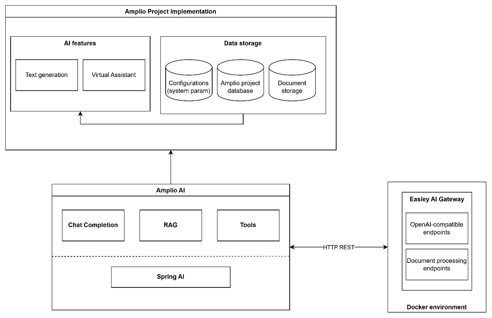

*Figure 1: Amplio AI architecture*

# High-level components

This section delves into details of the High-level components of Amplio AI, including:

* **Chat completion:** Provides the Chat Service for integrating the OpenAI-compatible chat/completions endpoint.
* **RAG:** Includes components that leverage the RAG-related endpoints that EASLEY provides, such as text/document embeddings, document management, and knowledge retrieval by semantic search.
* **Tools:** Provides the utility functions to log AI feature usage and store user feedback on the Amplio database.


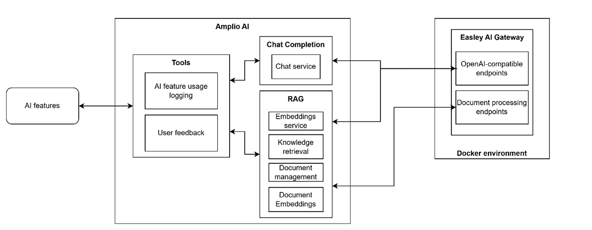

*Figure 2: High-level components of Amplio AI*

## Chat Completion

Chat Completion provides `Chat service`, which uses `Spring AI`'s capability to communicate with the LLM service via the OpenAI-compatible `/v1/chat/completions` endpoint, which is supported by EASLEY AI Gateway. Chat Completion supports both synchronous and streaming chat completion requests.

Before sending requests to the EASLEY AI Gateway, the service allows for the configuration of key parameters to tailor the response behaviour. This includes selecting the specific target LLM model and adjusting the temperature setting, which controls the randomness and creativity of the output.

**Table 1: Supported parameters description for `/v1/chat/completions` endpoint by EASLEY**

| Parameter                     | Type             | Description                                                                                                    | Example Value                                                                                                                      |
| ----------------------------- | ---------------- | -------------------------------------------------------------------------------------------------------------- | ---------------------------------------------------------------------------------------------------------------------------------- |
| `model` (required)            | String           | ID of the model to use for the completion. Determines the language model, capabilities, and token limits.      | `"gpt-4-turbo"`                                                                                                                    |
| `messages` (required)         | Array of objects | Conversation history defines the context. Each message includes a role (system, user, assistant) and content.  | `[{"role": "system", "content": "You are a helpful assistant."}, {"role": "user", "content": "Write a short poem about autumn."}]` |
| `reasoning_effort` (required) | String           | Indicates desired reasoning depth or effort (custom/non-standard; may control internal computation intensity). | `"medium"`                                                                                                                         |
| `stream` (required)           | Boolean          | Enables streaming mode (Server-Sent Events). The model sends tokens incrementally as they are generated.       | `TRUE`                                                                                                                             |
| `temperature` (required)      | Number (0–2)     | Controls randomness in generation. Higher values = more creative, lower = more deterministic.                  | `0.8`                                                                                                                              |

For more information about the specification of unsupported parameters, reference to [D0180 – External Interface Design – EASLEY AI](#references).

The Chat service takes a prompt as an input and returns a response object or a response stream after sending and receiving the response from the LLM service provider. A prompt contains:

* **User:** Represents the person interacting with the model. This is the content of the request, question, or instruction the model is supposed to respond to.
* **System:** Provides high-level instructions, context, or constraints to guide the assistant's behavior and personality before the conversation begins.
* **Assistant:** Represents the AI model's response. This is the generated output that answers the user's query, completes the task, or continues the conversation.
* **Chat options:** The options to change the LLM behaviours, such as model selection, temperature...

Chat Completion uses Spring AI's advisors, which provides a way to intercept and modify interactions to enrich the request (prompt) or the response; it sits in the chain executed around the model call. Advisors are used for injecting context, doing logging, enforcing rules, and customizing prompt structures.

## Retrieval-Augmented Generation (RAG)

RAG components use EASLEY AI's supported endpoints for RAG capabilities:

* **Text embedding:** Uses EASLEY to transform text into vector representations.
* **Document embedding:** Uses EASLEY to process entire documents and returns chunks with their corresponding embeddings.
* **Knowledge-document preparation:** Use EASLEY to process and embed entire documents, then store them in EASLEY AI's database for further retrieval.
* **Managing uploaded documents:** Manage documents on EASLEY AI, performing operations such as update, delete, and status check.
* **Retrieval:** Uses EASLEY to perform semantic search with relevant chunks from uploaded documents.

### Embedding service

Embedding service uses Spring AI's capability to communicate with the LLM service via the OpenAI-compatible `/v1/embeddings` endpoint, which is supported by EASLEY AI Gateway. It accepts a list of strings as input and returns the vector representation (embeddings) of these texts. These embeddings allow downstream components to efficiently compare, match, and retrieve relevant documents or information based on meaning rather than exact keyword matches.


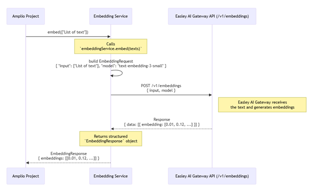

*Figure 3: Embedding service in Amplio AI*

### Document management

RAG component handles the documents from Amplio projects, allowing uploading, updating, retrieving status, or deleting documents on EASLEY AI Gateway. The component leverages EASLEY AI Gateway's document processing APIs to send documents for processing and persistence on EASLEY AI Gateway's database, then retrieves relevant information as chunks later.

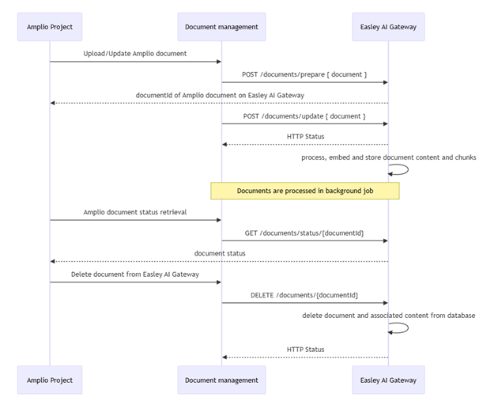

*Figure 4: Document management in Amplio AI*

Users can upload documents and explicitly assign them to specific AI features (e.g., Virtual Assistant, Text Generation). Supported document formats and size limits are configurable via the `gen_ai_features` system parameter (key: `amplio-virtual-assistant`).

The supported file extensions for Amplio AI document processing are aligned with EASLEY AI Gateway support:

`.docx,.pdf,.txt,.md,.doc,.docm,.xlsx,.xlsm,.csv,.pptx,.pptm,.ppt,.xml,.html,.png,.jpeg,.jpg,.webp`

<div style="border-left: 4px solid darkorange; background-color: rgba(30, 144, 255, 0.1); padding: 10px; margin-bottom: 10px;">

Please note that image processing support (`.png`, `.jpeg`, `.jpg`, `.webp`) depends on the configured and hosted model capability in EASLEY AI Gateway.
</div>

### Document embedding

This component allows Amplio projects to send a document to the `/documents/embeddings` API of EASLEY AI Gateway. The document will then be processed and embedded by EASLEY AI Gateway, returning a stream including the chunks derived from the document with its corresponding vector representation. This enables Amplio project developers to implement custom use cases, such as their own semantic search logic, using the processed document data locally.


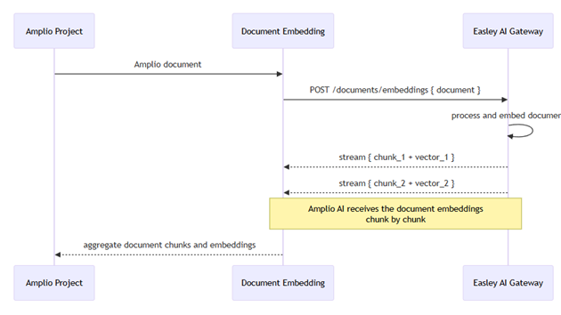

*Figure 5: Document embedding in Amplio AI*

### Knowledge retrieval

This component from Amplio AI allows Amplio projects to retrieve the relevant chunks among a list of documents given the query text and a list of document Ids. EASLEY AI Gateway will retrieve the most relevant chunks by using the semantic search method with the given text or prompt.


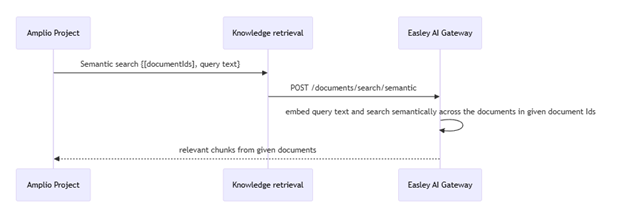

*Figure 6: Knowledge retrieval in Amplio AI*

## Tools

Tools components provide utilities to support AI features from Amplio projects, such as AI usage logging tools and user feedback management tools.

### AI feature usage logging

When an AI feature request from Amplio Java is complete, the information of that request is stored in Amplio Java's database by the Logging tool for further auditing. Developers can decide to activate the logging process in each Chat completion request so the Logging tool will capture the prompts within a conversation session and persist them.

### User feedback logging

This tool allows Amplio projects to store user feedback in AI feature sessions. Amplio projects will use this tool to create a feedback record which includes the AI feature logging record of that session, user's feedback messages, and other relevant metadata for further auditing.

## UI Design


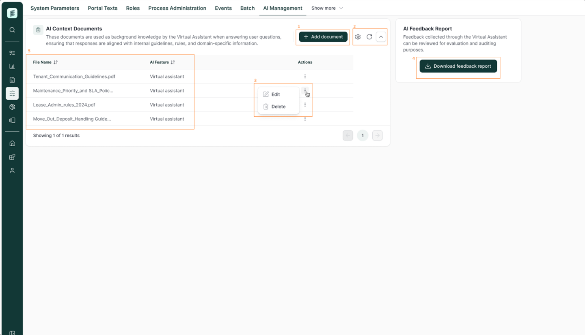

*Figure 6: UI Design for AI Management tab*

The UI mainly consists of the following components:

| #   | UI Element               | Description                                                                                                                          |
| --- | ------------------------ | ------------------------------------------------------------------------------------------------------------------------------------ |
| 1   | Add document button      | Allow users to upload documents which will be used as the base knowledge for AI feature                                              |
| 2   | Table configuration      | Table configuration buttons, which can be used to filter the table. These buttons are default buttons of Amplio and not in our scope |
| 3   | Document action button   | Allowing users to Edit and Delete uploaded documents                                                                                 |
| 4   | Download feedback report | Allowing users to download a CSV contains a list of feedback from AI user                                                            |
| 5   | Document information     | Displays the document name and the AI feature associated with it.                                                                    |


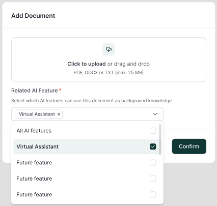

*Figure 7: Upload Document modal*

This modal appears when a user initiates a document upload. It includes a dropdown menu allowing the user to assign the document to a specific AI feature as a knowledge source. Supported formats and their extensions are dynamically managed via the `gen_ai_features` system parameter (attributes: `allowed_extensions`, `max_file_size_mb`) and must follow the EASLEY-aligned supported extensions listed in the Document management section.

# Roles and rights

The table below shows the security roles for AI features document management in Amplio.

| Role                     | Description                                                                                                          |
| ------------------------ | -------------------------------------------------------------------------------------------------------------------- |
| `ADM_ADMINISTRATION`     | Grants access to the Administration page, which is needed for changing the system parameters related to AI features. |
| `ADM_SYSTEM_PARAMETERS`  | Permits modification of AI prompts and configurations in Administration page.                                        |
| `AI_DOCUMENT_MANAGEMENT` | Permits access to AI document management tab to handle AI documents for background knowledge.                        |
| `<AI_FEATURE>_USE`       | AI features are only available for users with this security role.                                                    |

# Guide for creating prompts

Amplio AI offers configurable options in prompts with System parameters, enabling users to shape the LLM's response behavior directly within the application—no code changes required.

## Making Amplio AI responses align with business data

To ensure Amplio AI responses align strictly with business data, administrators and developers must craft precise instruction prompts. These instructions direct the LLM to derive answers solely from the provided input and background knowledge, explicitly prohibiting the use of external web sources or general pre-trained knowledge to prevent hallucinations.

**Example Identity:**

> You are the Amplio Virtual Assistant. Your purpose is to assist users by answering questions solely based on the provided Reference Documents. You must always identify yourself as an AI assistant. You are not a human.

**Example Tone and Style:**

> **PRIMARY DIRECTIVE**
> You must answer the user's query solely using the information found in the # KNOWLEDGE & DATA block below.
> Do not judge the topic. If the answer exists in the # KNOWLEDGE & DATA block, you must answer it, regardless of whether it is a policy, a technical component, or a workflow.
> Only if the information is completely missing from the # KNOWLEDGE & DATA block should you refuse with: "I'm sorry, but I can't find information regarding that specific topic in my current documentation."

**Example Personality:**

> Professional, objective, helpful, and concise. Style: Avoid jargon unless defined in the context. Use clear formatting (bullet points) for complex workflow steps. Language: Respond in the same language as the user's query.

## Using System parameters

Prompts are a key component of AI features, providing the initial instructions for Large Language Models (LLMs) before any user requests are processed.

**Table 1: Example of storing system prompt as system parameter**

| Name              | Data Type | Value                                                                                                                                                                                                                                                                                                                                                                               |
| ----------------- | --------- | ----------------------------------------------------------------------------------------------------------------------------------------------------------------------------------------------------------------------------------------------------------------------------------------------------------------------------------------------------------------------------------- |
| key               | TEXT      | `<AI_FEATURE>`                                                                                                                                                                                                                                                                                                                                                                      |
| IDENTITY          | LONG_TEXT | `You are <AI Feature>. You must strictly follow all organizational rules and safety guidelines: - Do not provide harmful, dangerous, or illegal instructions. - Do not access or imply access to private or confidential data unless it is explicitly provided by the user. - Refuse any request that violates copyrights, confidentiality, or intellectual property restrictions.` |
| PERSONALITY       | LONG_TEXT | `Clever, helpful`                                                                                                                                                                                                                                                                                                                                                                   |
| STYLE_INSTRUCTION | LONG_TEXT | `Professional`                                                                                                                                                                                                                                                                                                                                                                      |
| description       | TEXT      | `This is the system prompt for <AI Feature>. This prompt is used once the LLM Chat session starts, it is fed into the prompt structure as system prompt before adding any user or other system prompts.`                                                                                                                                                                            |
| startDate         | DATE      | Start date for when this prompt version becomes effective                                                                                                                                                                                                                                                                                                                           |
| endDate           | DATE      | End date for when this prompt version expires                                                                                                                                                                                                                                                                                                                                       |
| changedBy         | TEXT      | User who last modified this prompt instance                                                                                                                                                                                                                                                                                                                                         |

## Structured output

Amplio AI enables developers to configure the Chat Service to produce structured, machine-readable outputs such as JSON, XML, or Java classes.

```java
class StructuredResponse {
    String attribute;
    Double anotherAttribute;
}

private PromptBuilderFactory promptBuilderFactory;
private ChatService chatService;

PromptBuilder promptBuilder = promptBuilderFactory.create()
        .setIdentity(aiFeatureSystemParameter)
        .addSystemMessage("Give output in JSON {\"attribute\", \"anotherAttribute\"}")
        .addUserMessage("Analyze this data.");

ChatCompletionRequest<StructuredResponse> request = ChatCompletionRequest.<StructuredResponse>builder()
        .chatOptions(new ChatOptions(0.7, "gpt-4"))
        .promptBuilder(promptBuilder)
        .responseType(Optional.of(StructuredResponse.class))
        .build();

StructuredResponse response = chatService.getCompletion(request).getStructuredResponse();
```

## Prompt templates

Prompt templates in Amplio AI Chat Completion enable dynamic and reusable prompts by incorporating variables that can be populated with data at runtime.

```java
private final ExternalRagDocumentService externalRagDocumentService;
private final SystemParameterService systemParameterService;
private final PromptBuilderFactory promptBuilderFactory;
private final ChatService chatService;

SystemParameter aiConfig = systemParameterService.getCurrentSystemParameter(
    GenAiSystemParameterConstants.GEN_AI_FEATURES_PARAMETER_TYPE.value,
    GenAiSystemParameterConstants.VIRTUAL_ASSISTANT_PARAMETER_KEY);

double certainty = Double.parseDouble(aiConfig.getParameterValue("semantic_search_certainty"));
int maxChunks = Integer.parseInt(aiConfig.getParameterValue("semantic_search_max_chunks"));

List<SemanticSearchResponseItem> searchResults = externalRagDocumentService.semanticSearch(
    availableRagDocuments.stream()
        .map(RagDocument::getDocumentVariantId)
        .toList(),
    searchQuery,
    certainty,
    maxChunks
);

String formattedContext = searchResults.stream()
    .map(item -> String.join("\n", item.chunks()))
    .collect(Collectors.joining("\n\n---\n\n"));

String promptTemplate = """
    Use the knowledge from the following document chunks to answer the question.
    Document chunks:
    {context}
    Question:
    {question}
    Give a clear and concise answer based only on the provided context.
    """;

Map<String, Object> params = new HashMap<>();
params.put("context", formattedContext);
params.put("question", searchQuery);

PromptBuilder prompt = promptBuilderFactory.create()
    .addSystemMessage(promptTemplate, params);

ChatCompletionRequest chatRequest = ChatCompletionRequest.builder()
    .promptBuilder(prompt)
    .chatOptions(new ChatOptions(
        Float.parseFloat(aiConfig.getParameterValue("temperature")),
        aiConfig.getParameterValue("model")))
    .build();

chatService.getCompletion(chatRequest);
```

# Compliance and Privacy

## Regulatory responsibility for AI features

Developers and Solution Architects utilizing Amplio AI are responsible for ensuring that:

* **Transparency:** End-users are explicitly informed when they are interacting with an AI system.
* **Human Oversight:** High-impact features include "Human-in-the-Loop" verification mechanisms.
* **Auditability:** The specific version of the Amplio AI library and the connected LLM model are logged for compliance auditing.

## LLM Service Provider Selection

Mandatory Selection Criteria:

* **No Model Training on Customer Data:** The selected provider must contractually guarantee that data processed through Amplio AI is not used to train foundation models.
* **Data Sovereignty & Residency:** The provider must support hosting options that comply with local data residency laws.
* **Legal Framework Alignment:** The provider's Data Processing Addendum (DPA) must satisfy the organization's privacy standards and GDPR obligations.

## Reference Implementation: Microsoft Azure OpenAI

Amplio AI has been validated using Microsoft Azure OpenAI as the primary backend. This configuration is the recommended standard for compliance-sensitive deployments.

# API

## Chat Completion Services

| Service                | Description                                                                                                                                                            | Reference Section |
| ---------------------- | ---------------------------------------------------------------------------------------------------------------------------------------------------------------------- | ----------------- |
| `ChatService`          | Core service for AI chat completions, supporting both synchronous single-response and streaming modes with conversation memory, structured responses, and chat logging | Chat Completion   |
| `PromptBuilderFactory` | Factory for creating `PromptBuilder` instances with `PortalTextService` automatically injected                                                                         | Chat Completion   |
| `PromptBuilder`        | Fluent builder interface for constructing AI prompts with proper structure and ordering following prompt engineering best practices                                    | Chat Completion   |

## RAG (Retrieval-Augmented Generation) Services

| Service                      | Description                                                                                                                                          | Reference Section                                            |
| ---------------------------- | ---------------------------------------------------------------------------------------------------------------------------------------------------- | ------------------------------------------------------------ |
| `ExternalRagDocumentService` | Main service for document lifecycle management in RAG - uploading, updating, deleting documents, creating embeddings, and performing semantic search | Document management, Document embedding, Knowledge retrieval |
| `EmbeddingService`           | Service for generating text embeddings (vector representations) for similarity comparisons in RAG pipelines                                          | Embedding service                                            |
| `DocumentContentHashService` | Service for computing SHA-1 content hashes for document deduplication                                                                                | N/A                                                          |

## Administration AI Services

| Service                        | Description                                                                                                                                   | Reference Section   |
| ------------------------------ | --------------------------------------------------------------------------------------------------------------------------------------------- | ------------------- |
| `RagDocumentManagementService` | Service for managing document entities (creating `Document`/`DocumentVariant` records, deleting them) for use with the AI RAG pipeline        | Document management |

## Utility Services

| Service                   | Description                                                                                                                                   | Reference Section   |
| ------------------------  | --------------------------------------------------------------------------------------------------------------------------------------------- | ------------------- |
| `GenAiUploadConfigHelper` | Utility class for parsing Gen AI upload configuration values (allowed file extensions, max file size) from system parameter attribute values  | Document management |

## Tool Services

| Service                                  | Description                                                                                                                                               | Reference Section        |
| ---------------------------------------- | --------------------------------------------------------------------------------------------------------------------------------------------------------- | ------------------------ |
| `ChatCompletionFeedbackService`          | Service for managing user feedback on AI responses with binary ratings and optional comments, associating feedback to conversations or individual prompts | User feedback logging    |
| `ChatCompletionFeedbackCsvExportService` | Service for exporting collected chat feedback into a CSV format                                                                                           | User feedback logging    |
| `ConversationHistoryService`             | Service for retrieving conversation history, providing Spring AI-independent access to chat history for RAG context building                              | AI feature usage logging |

# Database Patches

## Role Mapping Patch

```sql
INSERT INTO ROLE_MAPPING (ID, IDP_ROLE, APP_ROLE, CHANGED, CHANGED_BY, CREATED, CREATED_BY)
VALUES (uuid_generate_v4(), 'ADMIN', 'SR_ADM_AI_DOCUMENT_MANAGEMENT', CURRENT_TIMESTAMP, 'SYSTEM', CURRENT_TIMESTAMP, 'SYSTEM');
```

## Modifying Data Model

**RAG_DOCUMENT**

```sql
CREATE TABLE RAG_DOCUMENT(
    ID                       VARCHAR(50) NOT NULL,
    DOCUMENT_VARIANT_ID      VARCHAR(50) NOT NULL,
    EXTERNAL_RAG_DOCUMENT_ID VARCHAR(100) NOT NULL,
    STATUS                   VARCHAR(20) NOT NULL,
    CONTENT_HASH             VARCHAR(64),
    CREATED                  TIMESTAMP(6) DEFAULT CURRENT_TIMESTAMP NOT NULL,
    CREATED_BY               VARCHAR(100) NOT NULL,
    CHANGED                  TIMESTAMP(6) DEFAULT CURRENT_TIMESTAMP NOT NULL,
    CHANGED_BY               VARCHAR(100) NOT NULL,
    VERSION                  INTEGER DEFAULT 0 NOT NULL,
    CONSTRAINT PK_RAG_DOCUMENT PRIMARY KEY (ID),
    CONSTRAINT FK_RAG_DOCUMENT_DOC_VARIANT FOREIGN KEY (DOCUMENT_VARIANT_ID) REFERENCES DOCUMENT_VARIANT (ID)
);
```

**RAG_DOCUMENT_FEATURES**

```sql
CREATE TABLE RAG_DOCUMENT_FEATURES(
    ID              VARCHAR(50)                            NOT NULL,
    RAG_DOCUMENT_ID VARCHAR(50)                            NOT NULL,
    FEATURE_TYPE    VARCHAR(50)                            NOT NULL,
    CREATED         TIMESTAMP(6) DEFAULT CURRENT_TIMESTAMP NOT NULL,
    CREATED_BY      VARCHAR(100)                           NOT NULL,
    CHANGED         TIMESTAMP(6) DEFAULT CURRENT_TIMESTAMP NOT NULL,
    CHANGED_BY      VARCHAR(100)                           NOT NULL,
    VERSION         INTEGER      DEFAULT 0                 NOT NULL,
    CONSTRAINT PK_RAG_DOCUMENT_FEATURES PRIMARY KEY (ID),
    CONSTRAINT FK_FEATURES_DOCUMENT FOREIGN KEY (RAG_DOCUMENT_ID) REFERENCES RAG_DOCUMENT (ID) ON DELETE CASCADE
);
```

**CHAT_COMPLETION_HISTORY**

```sql
CREATE TABLE CHAT_COMPLETION_HISTORY(
    ID              VARCHAR(50) NOT NULL,
    CONVERSATION_ID VARCHAR(50),
    USERNAME        VARCHAR(50) NOT NULL,
    MESSAGES        JSONB,
    CREATED         TIMESTAMP(6) DEFAULT CURRENT_TIMESTAMP NOT NULL,
    CREATED_BY      VARCHAR(500) NOT NULL,
    CHANGED         TIMESTAMP(6) DEFAULT CURRENT_TIMESTAMP NOT NULL,
    CHANGED_BY      VARCHAR(500) NOT NULL,
    VERSION         INTEGER DEFAULT 0 NOT NULL,
    CONSTRAINT PK_CHAT_COMPLETION_HISTORY PRIMARY KEY (ID),
    CONSTRAINT UQ_CHAT_COMPLETION_HISTORY UNIQUE (CONVERSATION_ID)
);
```

**CHAT_COMPLETION_FEEDBACK**

```sql
CREATE TABLE CHAT_COMPLETION_FEEDBACK(
    ID                           VARCHAR(50) NOT NULL,
    USERNAME                     VARCHAR(50) NOT NULL,
    CHAT_COMPLETION_HISTORY_ID   VARCHAR(50),
    RATING                       INTEGER NOT NULL,
    COMMENT                      TEXT,
    CREATED                      TIMESTAMP(6) DEFAULT CURRENT_TIMESTAMP NOT NULL,
    CREATED_BY                   VARCHAR(500) NOT NULL,
    CHANGED                      TIMESTAMP(6) DEFAULT CURRENT_TIMESTAMP NOT NULL,
    CHANGED_BY                   VARCHAR(500) NOT NULL,
    VERSION                      INTEGER DEFAULT 0 NOT NULL,
    CONSTRAINT PK_CHAT_COMPLETION_FEEDBACK PRIMARY KEY (ID),
    CONSTRAINT FK_CHAT_COMPLETION_FEEDBACK_PROMPT_HISTORY FOREIGN KEY (CHAT_COMPLETION_HISTORY_ID) REFERENCES CHAT_COMPLETION_HISTORY (ID)
);
```

## System Parameters

**Parameter Type Definition**

```sql
call parameter_type ('gen_ai_features');
call parameter_attribute ('gen_ai_features', 'IDENTITY', 'TEXTAREA', false, 0, false, false);
call parameter_attribute ('gen_ai_features', 'STYLE_INSTRUCTION', 'TEXTAREA', false, 1, false, false);
call parameter_attribute ('gen_ai_features', 'PERSONALITY', 'TEXTAREA', false, 2, false, false);
call parameter_attribute ('gen_ai_features', 'model', 'TEXT', false, 3, false, false);
call parameter_attribute ('gen_ai_features', 'temperature', 'TEXT', false, 4, false, false);
call parameter_attribute ('gen_ai_features', 'max_context_messages', 'TEXT', false, 5, false, false);
call parameter_attribute ('gen_ai_features', 'semantic_search_certainty', 'TEXT', false, 6, false, false);
call parameter_attribute ('gen_ai_features', 'semantic_search_max_chunks', 'TEXT', false, 7, false, false);
-- File upload validation attributes for RAG documents
call parameter_attribute ('gen_ai_features', 'allowed_extensions', 'TEXT', false, 8, false, false);
call parameter_attribute ('gen_ai_features', 'max_file_size_mb', 'TEXT', false, 9, false, false);
```

**Sample Parameter Instances**

```sql
-- Amplio Virtual Assistant instance
call parameter_instance ('gen_ai_features', 'amplio-virtual-assistant', '2020-01-01', '9999-12-31', 'b2c3d4e5-6789-4bcd-ef01-234567890bcd', '99999999-9999-4999-b999-999999999999');

call parameter_value ('b2c3d4e5-6789-4bcd-ef01-234567890bcd', 'IDENTITY', 'You are the Amplio Virtual Assistant...');
call parameter_value ('b2c3d4e5-6789-4bcd-ef01-234567890bcd', 'STYLE_INSTRUCTION', 'PRIMARY DIRECTIVE: Source of Truth...');
call parameter_value ('b2c3d4e5-6789-4bcd-ef01-234567890bcd', 'PERSONALITY', 'You are an AI assistant with the following personality characteristics...');
call parameter_value ('b2c3d4e5-6789-4bcd-ef01-234567890bcd', 'model', 'gpt-4-o-mini');
call parameter_value ('b2c3d4e5-6789-4bcd-ef01-234567890bcd', 'temperature', '0.7');
call parameter_value ('b2c3d4e5-6789-4bcd-ef01-234567890bcd', 'max_context_messages', '3');
call parameter_value ('b2c3d4e5-6789-4bcd-ef01-234567890bcd', 'semantic_search_certainty', '0.1');
call parameter_value ('b2c3d4e5-6789-4bcd-ef01-234567890bcd', 'semantic_search_max_chunks', '20');
call parameter_value ('b2c3d4e5-6789-4bcd-ef01-234567890bcd', 'allowed_extensions', '.docx,.pdf,.txt,.md,.doc,.docm,.xlsx,.xlsm,.csv,.pptx,.pptm,.ppt,.xml,.html,.png,.jpeg,.jpg,.webp');
call parameter_value ('b2c3d4e5-6789-4bcd-ef01-234567890bcd', 'max_file_size_mb', '3');

-- RAG Document Admin instance (used by admin document management UI)
call parameter_instance ('gen_ai_features', 'rag-document-admin', '2020-01-01', '9999-12-31', 'c3d4e5f6-789a-4cde-f012-345678901cde', '99999999-9999-4999-b999-999999999999');
call parameter_value ('c3d4e5f6-789a-4cde-f012-345678901cde', 'allowed_extensions', '.docx,.pdf,.txt,.md,.doc,.docm,.xlsx,.xlsm,.csv,.pptx,.pptm,.ppt,.xml,.html,.png,.jpeg,.jpg,.webp');
call parameter_value ('c3d4e5f6-789a-4cde-f012-345678901cde', 'max_file_size_mb', '3');
```

**System Parameter Configuration**

These parameters are configured in the `gen_ai_features` parameter type and manage AI behavior as well as backend validations for file uploads. Two parameter instances are defined: `amplio-virtual-assistant` for Virtual Assistant configuration, and `rag-document-admin` for admin document management UI configuration.

| Parameter Attribute        | Description                                                      | Example Value                             |
| -------------------------- | ---------------------------------------------------------------- | ----------------------------------------- |
| IDENTITY                   | AI persona/identity definition                                   | "You are the Amplio Virtual Assistant..." |
| STYLE_INSTRUCTION          | Instructions for response style and behavior                     | "PRIMARY DIRECTIVE: DATA SOURCE..."       |
| PERSONALITY                | Personality characteristics                                      | "Professional, objective, helpful..."     |
| model                      | LLM model to use                                                 | gpt-4-o-mini                              |
| temperature                | Response creativity (0.0-2.0)                                    | 0.7                                       |
| max_context_messages       | Max messages for context window                                  | 3                                         |
| semantic_search_certainty  | Minimum certainty for RAG search                                 | 0.1                                       |
| semantic_search_max_chunks | Maximum chunks to retrieve from RAG                              | 20                                        |
| allowed_extensions         | Comma-separated allowed file extensions for RAG document uploads | `.docx,.pdf,.txt`                         |
| max_file_size_mb           | Maximum file size for RAG document uploads (in MB)               | `3`                                       |

# Configuration and Service Extensions

## Configurable Settings

### Configuration Classes

| Property Class                         | Prefix                               | Description                                                                                                  |
| -------------------------------------- | ------------------------------------ | ------------------------------------------------------------------------------------------------------------ |
| `AmplioAiOpenAiProperties`             | `nc.amplio.libraries.ai.openai`      | OpenAI API configuration (apiKey, baseUrl, chat/embeddings model options)                                    |
| `ExternalRagDocumentServiceProperties` | `nc.amplio.libraries.ai.rag`         | RAG service endpoint and polling configuration (file upload limits are configured via system parameters)     |
| `AmplioAiChatMemoryProperties`         | `nc.amplio.libraries.ai.chat-memory` | Chat memory settings (maxMessages)                                                                           |
| `AssistantProperties`                  | `nc.amplio.libraries.ai.assistant`   | Virtual Assistant entity context provider settings (file upload limits are configured via system parameters) |
| `AmplioAiRetryProperties`              | `nc.amplio.libraries.ai.retry`       | Core Spring AI fallback and retry strategies                                                                 |

### Application Properties

| Property                                                                     | Description                                                            | Default Value            |
| ---------------------------------------------------------------------------- | ---------------------------------------------------------------------- | ------------------------ |
| **OpenAI / AI Gateway**                                                      |                                                                        |                          |
| `nc.amplio.libraries.ai.openai.base-url`                                     | Base URL for the AI gateway endpoint (EASLEY or OpenAI-compatible API) | `http://localhost:8123`  |
| `nc.amplio.libraries.ai.openai.api-key`                                      | API key for authenticating with the AI gateway                         | -                        |
| `nc.amplio.libraries.ai.openai.chat.options.model`                           | Default model for chat completions                                     | `gpt-4-o-mini`           |
| `nc.amplio.libraries.ai.openai.embeddings.options.model`                     | Model for generating text embeddings (used in RAG)                     | `text-embedding-3-small` |
| `nc.amplio.libraries.ai.openai.chat.options.temperature`                     | Temperature for chat responses (0.0-2.0). Lower = more deterministic   | `0.7`                    |
| **Chat Memory**                                                              |                                                                        |                          |
| `nc.amplio.libraries.ai.chat_memory.max_messages`                            | Maximum number of messages to retain in conversation history           | `20`                     |
| `nc.amplio.libraries.ai.assistant.entity-context-provider.max-tasks`         | Maximum tasks injected in assistant context                            | `5`                      |
| `nc.amplio.libraries.ai.assistant.entity-context-provider.max-journal-notes` | Maximum notes injected in assistant context                            | `5`                      |
| **RAG Polling**                                                              |                                                                        |                          |
| `nc.amplio.libraries.ai.rag.documents-endpoint`                              | Endpoint URL for the document processing service (EASLEY)              | `http://localhost:8123/` |
| `nc.amplio.libraries.ai.rag.polling-delay-seconds`                           | Delay between polling attempts when waiting for document processing    | `3`                      |
| `nc.amplio.libraries.ai.rag.max-polling-attempts`                            | Maximum number of polling attempts before timing out                   | `100`                    |
| **File Upload (Spring Boot Multipart)**                                      |                                                                        |                          |
| `spring.servlet.multipart.max-file-size`                                     | Maximum size per uploaded file at the Tomcat/servlet container level   | `20MB`                   |
| `spring.servlet.multipart.max-request-size`                                  | Maximum size for the entire multipart HTTP request                     | `20MB`                   |

<div style="border-left: 4px solid darkorange; background-color: rgba(255, 140, 0, 0.1); padding: 10px; margin-bottom: 10px;">

<strong>IMPORTANT: Two-Layer File Size Validation</strong>

File uploads in Amplio AI are subject to <strong>two independent layers of size validation</strong>:

1. <strong>Servlet container layer</strong> (`spring.servlet.multipart.max-file-size`): This is enforced by Tomcat/Spring Boot *before* the request reaches any controller or service code. The Spring Boot default is <strong>1MB</strong>. If this is not explicitly raised, files larger than 1MB will be rejected with a `MaxUploadSizeExceededException` before any application logic can execute.
2. <strong>Application layer</strong> (`max_file_size_mb` system parameter): This is the business-level validation enforced by `GenAiUploadConfigHelper` inside `AssistantRestServiceImpl` and `DocumentFormRestServiceImpl`. It provides user-friendly validation messages.

The `spring.servlet.multipart.max-file-size` must be set <strong>higher than or equal to</strong> the largest `max_file_size_mb` system parameter value across all `gen_ai_features` instances. This property is configured in the environment-specific AI properties files (e.g., `ai-local.properties`, `ai-demo.properties`).

</div>

## Code Integration

### ChatService

The `ChatService` interface provides methods to interact with AI models for generating chat responses.

```java
private ChatService chatService;
private PromptBuilderFactory promptBuilderFactory;

// Simple chat completion
ChatCompletionRequest request = ChatCompletionRequest.builder()
    .chatOptions(new ChatOptions(0.7, "gpt-4"))
    .promptBuilder(promptBuilderFactory.create()
        .setIdentity("You are a helpful assistant")
        .addUserMessage("Hello, how are you?"))
    .conversationId("conv-123")
    .enableLogging(true)
    .build();

ChatCompletionResponse<Object> response = chatService.getCompletion(request);
String reply = response.getContent();

// Streaming completion
ChatCompletionStreamRequest streamRequest = ChatCompletionStreamRequest.builder()
    .chatOptions(new ChatOptions(0.7, "gpt-4"))
    .promptBuilder(promptBuilderFactory.create()
        .setIdentity("You are a helpful assistant")
        .addUserMessage("Tell me a story"))
    .conversationId("conv-123")
    .build();

chatService.streamCompletion(streamRequest)
    .subscribe(chunk -> System.out.print(chunk.getContentChunk()));
```

### PromptBuilder

The `PromptBuilder` interface provides a fluent API for constructing well-structured prompts following prompt engineering best practices.

**Using string:**

```java
private PromptBuilderFactory promptBuilderFactory;

PromptBuilder builder = promptBuilderFactory.create()
    .setIdentity("You are a knowledgeable customer service representative for Amplio")
    .setPersonality(List.of("helpful", "patient", "professional"))
    .addStyleInstruction("Use markdown formatting in your responses")
    .addStyleInstruction("Keep responses concise but complete")
    .addData("Product catalog: Widget A ($50), Widget B ($75), Widget C ($100)")
    .addExample("What products do you have?", "We offer Widget A, B, and C...")
    .addUserMessage("How much does Widget A cost?");

Prompt prompt = builder.build();
```

**Using SystemParameter:**

```java
private PromptBuilderFactory promptBuilderFactory;
private SystemParameterService systemParameterService;

// Fetch system parameter containing AI configuration attributes
// The system parameter should have attributes: IDENTITY, PERSONALITY, STYLE_INSTRUCTION
SystemParameter aiConfig = systemParameterService.findByKey("AI_CONFIG");

PromptBuilder builder = promptBuilderFactory.create()
    .setIdentity(aiConfig)
    .setPersonality(aiConfig)
    .addStyleInstruction(aiConfig)
    .addData("Product catalog: Widget A ($50), Widget B ($75), Widget C ($100)")
    .addUserMessage("How much does Widget A cost?");

Prompt prompt = builder.build();
```

### ExternalRagDocumentService

The `ExternalRagDocumentService` interface manages the complete document lifecycle in the RAG system.

```java
private ExternalRagDocumentService externalRagDocumentService;

// Async upload with file content
byte[] pdfContent = Files.readAllBytes(Path.of("document.pdf"));

UploadDocumentResultAsync result = externalRagDocumentService.uploadDocumentAsync(
    "doc-123",
    VirtualAssistantConstants.VIRTUAL_ASSISTANT,
    pdfContent,
    "document.pdf",
    "application/pdf"
);

// Wait for processing to complete
RagDocument processedDoc = result.completionFuture().get();

// Semantic search across documents
List<SemanticSearchResponseItem> results = externalRagDocumentService.semanticSearch(
    List.of("doc-123", "doc-456"),
    "How do I configure the system?",
    0.7, // certainty threshold
    5 // max results
);

for (SemanticSearchResponseItem item : results) {
    System.out.println("Found in: " + item.title());
    for (String chunk : item.chunks()) {
        System.out.println(" Match: " + chunk);
    }
}
```

### EmbeddingService

Service for generating text embeddings for semantic similarity operations.

```java
private EmbeddingService embeddingService;

EmbeddingRequest request = new EmbeddingRequest(
    List.of("Hello world", "How are you?")
);

EmbeddingResponse response = embeddingService.getEmbeddings(request);
List<float[]> vectors = response.getEmbeddings();
```

### ChatCompletionFeedbackService

Service for managing user feedback on AI responses.

```java
private ChatCompletionFeedbackService feedbackService;

// Simple feedback (1 = helpful, 0 = not helpful)
ChatCompletionFeedback feedback = feedbackService.submitFeedback(
    "Very helpful response!",
    1
);

// Feedback linked to specific conversation
ChatCompletionFeedback linkedFeedback = feedbackService.submitFeedbackByConversationId(
    "Could be more detailed",
    0,
    "conv-uuid-12345"
);
```

### ConversationHistoryService

Service for retrieving conversation history independent of Spring AI.

```java
private ConversationHistoryService historyService;

// Get last 5 user messages for RAG context
List<String> recentQuestions = historyService.getLastUserMessages("conv-123", 5);
```

# Data Model

## RAG Document Data Model

Whenever Amplio users upload documents for processing in EASLEY AI, the resulting document identifier generated by EASLEY must be stored in the EASLEY database for subsequent use.

Since Amplio already maintains its own Document table, the RagDocument table serves as a mapping layer between the Amplio document ID and the corresponding EASLEY document ID. In addition, RagDocument tracks the processing status of the document within the EASLEY ecosystem. An enumeration defines the document type, enabling the system to categorize the uploaded content and apply the appropriate RAG workflows where needed.

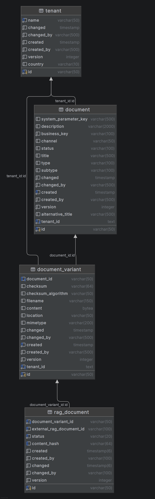

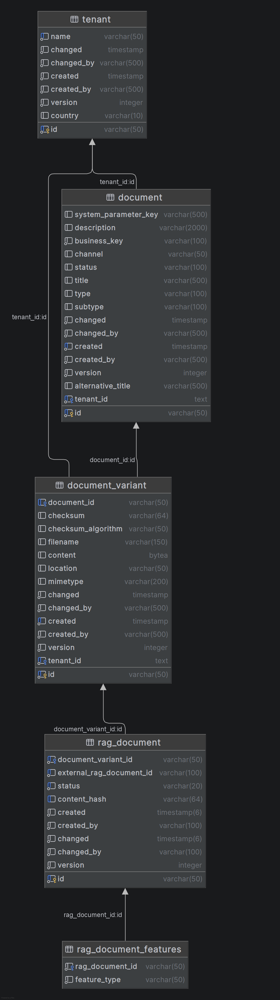

**Table Definition**

| Field Name            | Type          | Description                                                                                           |
| --------------------- | ------------- | ----------------------------------------------------------------------------------------------------- |
| Id                    | GUID (PK)     | Primary key of the RagDocument table.                                                                 |
| DocumentVariantId     | GUID (FK)     | References the document variant containing the file bytes in Amplio's DocumentVariant table.          |
| ExternalRagDocumentId | GUID          | Identifier of the document generated by EASLEY after upload and ingestion.                            |
| Status                | Enum / String | Represents the current processing state within EASLEY (e.g., Pending, Processing, Completed, Failed). |
| ContentHash           | String        | SHA-1 Hash of the document variant bytes. Used to perform fast deduplication lookups locally.         |

<div style="border-left: 4px solid darkorange; background-color: rgba(255, 140, 0, 0.1); padding: 10px; margin-bottom: 10px;">

<strong>Note:</strong> Feature types assigned to documents are maintained across a `@OneToMany` relationship in the `RAG_DOCUMENT_FEATURES` table, which also implicitly contains `AbstractJpa` auditing keys like `ID`, `CREATED`, etc.

</div>

## Chat Completion Logging Data Model

Whenever Amplio users interact with the AI virtual assistant, their prompts and the system's responses must be stored for audit purposes, performance analysis, and continuous improvement.

Since Amplio already maintains its own ApplicationLogin table for user sessions, the ChatCompletionHistory table serves as a comprehensive logging mechanism that captures all AI interactions within the authenticated user context.

In addition, ChatCompletionHistory enables feedback collection on AI responses, allowing users to rate and comment on the quality of AI-generated content to improve the system over time. The Feedback table provides a structured way to collect user satisfaction data and detailed comments about specific AI interactions.

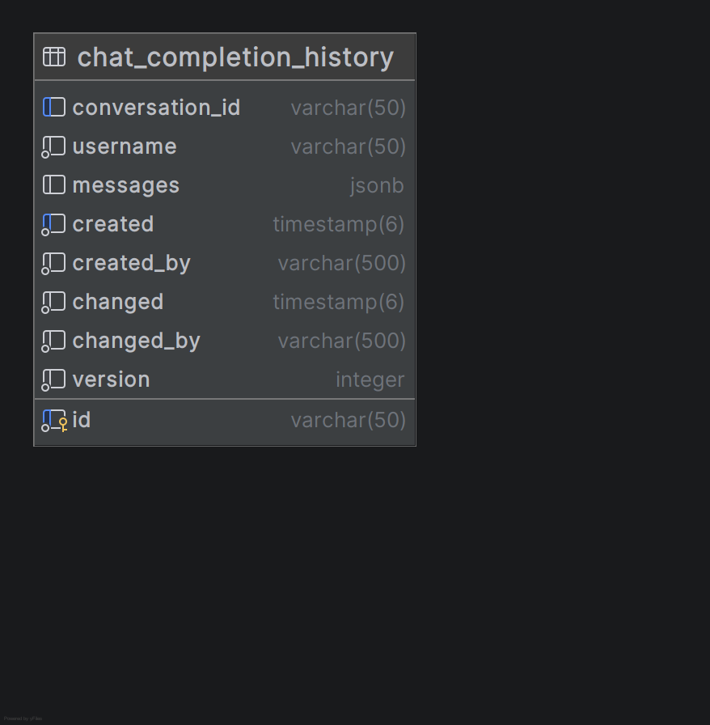

**Chat_Completion_History**

| Field Name      | Type        | Description                                                                                          |
| --------------- | ----------- | ---------------------------------------------------------------------------------------------------- |
| ID              | string (PK) | Primary key of the chat conversation history record.                                                 |
| USERNAME        | string      | Username of the authenticated user performing interactions during this session.                      |
| CONVERSATION_ID | string (UQ) | Unique ID tracking the complete conversation flow across the RAG/AI interactions.                    |
| MESSAGES        | JSONB       | A structured JSON document tracking the complete chronology of User, System, and Assistant messages. |

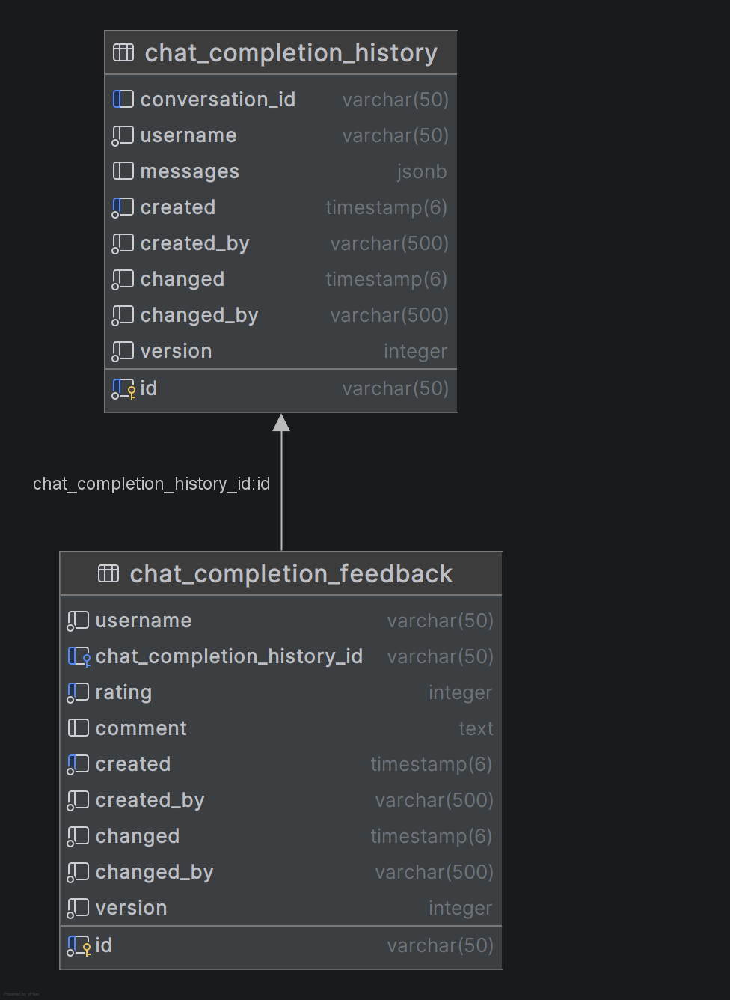

**Feedback**

| Field Name                 | Type            | Description                                                               |
| -------------------------- | --------------- | ------------------------------------------------------------------------- |
| ID                         | string (PK)     | Primary key of the feedback entry.                                        |
| USERNAME                   | string          | Identifies which logged-in user provided feedback.                        |
| CHAT_COMPLETION_HISTORY_ID | string (FK)     | Links to the specific AI chat conversation where the feedback occurred.   |
| RATING                     | int (0–1)       | Binary rating of the AI response quality. 1 for helpful, 0 for unhelpful. |
| COMMENT                    | text (nullable) | Optional feedback comment.                                                |
