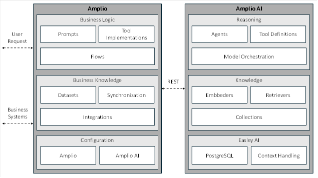
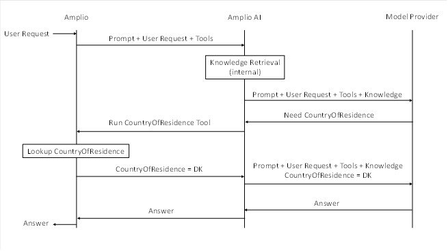

# References

| Reference                                         | Title        | Author |
|---------------------------------------------------|--------------|--------|
| [Spring AI](https://spring.io/projects/spring-ai) | Open AI Chat |        |

# Introduction

Amplio Java Easley AI is a stand-alone service that exposes Easley AI functionality to Amplio Java applications. It
consists of Easley AI components wrapped in a Spring AI-compatible REST API, additional components designed specifically
for Amplio Java, and deployment tooling. With Amplio Java Easley AI, developers can build generative AI features in
Amplio Java using Easley AI from their usual Java development environments. For example, Amplio Java Easley AI uses the
Model Orchestration component in Easley AI to communicate with models.

Amplio Java Easley AI is designed according to the following principles:

* Developers must be able to build and maintain AI features entirely within Amplio Java. This principle is fundamental
  to the separation of concerns of between Amplio Java and Amplio Java Easley AI.
* Amplio Java is responsible for business logic, application state, and domain integrations. Amplio Java calls out to
  Amplio Java Easley AI for model interaction.
* Amplio Java Easley AI is responsible for reasoning and knowledge. Reasoning is the use of a model to answer a user or
  solve a task by responding to a prompt. Knowledge is a set of domain-specific records defined by developers that a
  model can use when generating a response.

A typical generative AI application consists of a flow that guides the user through the execution of some business task.
In turn, the flow consists of sequence of steps that either request domain knowledge or call models. Amplio Java
orchestrates these steps while Amplio Java Easley AI performs them.

## Target audience

The document is intended for developers that need AI-functionality in Amplio Java projects.

## Developer requirements

* Basic understanding of Amplio Java
* Basic understanding of Spring AI
* Basic understanding of generative AI

# High level description of the component

Amplio Java Easley AI provides high-level components for building generative AI features with Amplio Java. It is built
on top of Easley AI, Netcompany's AI platform, that provides .NET components for generative AI applications. Amplio Java
Easley AI wraps these Easley AI components in the Spring AI framework such that developers can use Easley AI components
in Amplio Java with native Java tooling.

| Endpoint            | Description                                                                               | Client    |
|---------------------|-------------------------------------------------------------------------------------------|-----------|
| `/models`           | OpenAI-compatible endpoint that lists the models from the current Easley AI configuration | Sprint AI |
| `/chat/completions` | OpenAI-compatible endpoint for communicating with models via Easley AI                    | Sprint AI |
| `/embeddings`       | OpenAI-compatible endpoint for generating embeddings                                      | Sprint AI |

<div style="text-align: center;">

<h5>Table 2.1. Main endpoints for interacting with models via Easley AI.</h5>
<br>
</div>

While Easley AI provides components for reasoning and knowledge retrieval, many projects have requirements that are
specific to Amplio Java. Amplio Java Easley AI therefore comes with additional components designed for more complex
workflows. See [Amplio AI Components](/DD130-Detailed-Design/Amplio-Java-Easley-AI#amplio-ai-components). Amplio
Java developers can choose the level of abstraction that suits their
use
case.

| Requirement                                           | Complexity | Amplio Java Easley AI components       | Example use case                                                                                                                                                                                                             |
|-------------------------------------------------------|------------|----------------------------------------|------------------------------------------------------------------------------------------------------------------------------------------------------------------------------------------------------------------------------|
| Custom workflows                                      | High       | Agents, Tools                          | Customer service chatbot that answers only certain types of requests. The agent classifies the user request into "should refuse" or "should answer" categories and delegate the act of responding to two different workflows |
| Add domain knowledge (Retrieval-Augmented Generation) | Medium     | Collections, Embedders, and Retrievers | Customer service chatbot that need background information to answer the user                                                                                                                                                 |
| Interact directly with models                         | Low        | OpenAI-compatible REST API             | Vanilla chatbot, like Cortex "General" chat                                                                                                                                                                                  |

## Architecture

Amplio Java Easley AI is a stand-alone service that is deployed in a Docker container alongside Amplio Java. Its
functionality is exposed as a REST API. The REST API consists of an OpenAI compatible endpoint that can be used as a
drop-in replacement for OpenAI as well as additional endpoints compatible with Spring AI clients. This means developers
can take full advantage of the native Java tooling in Spring AI and use the Easley AI platform under the hood without
ever leaving the Amplio Java ecosystem.

<div style="text-align: center;">



<h5>Figure 4.1. High-level overview of Amplio and Amplio AI responsibilities.</h5>
<br>
</div>

## Spring AI SDK

### Chat Model API

Configuring Spring Ai's OpenAI Chat client as described in [Spring AI](https://spring.io/projects/spring-ai)
documentation to call Amplio AI via its
OpenAI-compatible endpoint.

| Property                         | Description                                        | Value             |
|----------------------------------|----------------------------------------------------|-------------------|
| `spring.ai.openai.chat.base-url` | Overrides the `spring.ai.openai.base-url` property | `http://amplioai` |
| `spring.ai.openai.api-key`       | A Bearer authentication token                      | `**************`  |

<div style="text-align: center;">

<h5>Table 2.2. OpenAI Chat client configuration.</h5>
<br>
</div>

Amplio Java Easley AI must be configured with the authentication token.

### Function Calling

Models can call functions in Amplio Java by registering Java functions as outlined
in [Spring AI](https://spring.io/projects/spring-ai). Amplio Java Easley AI
does not call the function directly; instead, it returns function arguments as JSON that the model wants to run. You can
use these arguments to call the function in your code and return the result back to Amplio Java Easley AI to complete
the request. For example, you can register a function that looks up information (e.g. from an existing business system)
or performs an action (e.g. marks a ticket as done on behalf of the user).

### Vector Databases

Amplio AI provides advanced embedding and retrieval methods wrapped in the Spring AI VectorStore abstraction.

Example configuration

```java
amplioAiVectorStoreConfiguration.
  .withVectorSize(1536)
  .withCollection(collectionId)
  .withEmbedder(new SemanticChunkingConfigation(…), ContextualRetrievalConfiguration(…))
  .withRetriever(new SemanticSearchConfiguration(…))
```

Example of adding records, metadata, and docx files

```java
Collection<Media> mediaCollection = new ArrayList<>();
MimeType wordMimeType = MimeType.valueOf("application/vnd.openxmlformats-officedocument.wordprocessingml.document");
Resource wordResource = new FileSystemResource(new File(filePath));
Media wordDocMedia = new Media(wordMimeType, wordResource);
mediaCollection.add(wordDocMedia);
List<Document> documents = List.of(
	new Document(id, "Content1”, Map.of("country", "BG", "year", 2020)), // metadata
	new Document(id, "Content2"), // string
	new Document(id, "", mediaCollection))); // Word file

amplioAiVectorStore.add(documents)
```

Example search

```java
amplioAiVectorStore.similaritySearch(
   SearchRequest
      .query("The World")  // user’s query
      .withSimilarityThreshold(SIMILARITY_THRESHOLD)
      .withFilterExpression(...)  // metadata filtering
```

## Amplio AI Components

Opinionated components developed specifically for Amplio. The REST API uses these components under the hood.

### Collection

A collection is a group of records that can be searched and retrieved at runtime to provide background information to
the model. Each record consists of text content, its embedding, and metadata.

Each record is stored in PostgreSQL (for semantic search and metadata filtering) and Lucene .NET (for keyword search).
Amplio Java Easley AI is responsible for maintaining the integrity between records in PostgreSQL and Lucene .NET. Amplio
Java is responsible for synchronizing records from business systems to Amplio AI and maintaining integrity between
information in the business systems and records in the collections. Collections are managed from Amplio Java via Create,
Read, Update, and Delete (CRUD) operations.

### Retriever

A retriever is a search engine that can retrieve the most relevant records for a user query from one or more
collections.

Retrievers support the following types of searches:

* Keyword search: Full-text search via PostgreSQL
* Semantic search: Vector search with the pg_vector PostgreSQL extension.

A retriever can be configured with the following components:

* Hybrid Search: Combines keyword search results and semantic search results using with Reciprocal Rank Fusion
* Re-ranking: Sort the combined list of search results using a model developed specifically to identify the records that
  are most relevant to a search query. Allows reasoning to determine relevancy.

### Embedder

An embedder breaks down records into chunks and adds the chunks to a collection.

Easley AI uses "semantic chunking" which [...]

It is the responsibility of Amplio to integrate with sources and submit records for embedding.

The following types of records can be submitted:

* Content: string
* Text files: txt, docx, pptx, pdf, html, md
* Images: png, jpg
* Code files: java, cs, js, ts

An embedder can be configured to improve the semantic coherence of a chunk with the following components:

* Semantic Chunking: Splits documents into chunks based on primary, secondary, and tertiary headings. Tertiary
  paragraphs are further split into fixed size chunks if they are larger than fixed size. Available for docx, pptx, pdf,
  html, and md files.
* Contextual Retrieval: Generates chunk-specific explanatory context from the record and prepends it to the original
  chunk content.
* Hypothetical Query Rewriting: Embeds questions generated from a chunk in addition to the embedding of the chunk
  itself. Allows the retriever to use questions-like queries to search for question-like embeddings as opposed to using
  question-like queries to search for fact-like text.

### Tool

Tools allow the models to invoke functions in Amplio.

### Agent

An agent selects the most relevant tool from a predefined list of tools to handle a query. As opposed to a tool which
may be called by a model, an agent will always call one or more tools. Agents are useful for breaking down user
interactions into distinct areas that can then be systematically improved on an individual basis without affecting
performance of other areas. Agents can call other agents for hierarchical breakdown of complex tasks.

An "Agent" is a design pattern, not a standalone component. It consists of a normal model call with a collection of
tools and "tool_choice" set to "required".

Agents are inspired by Easley AI agents but uses tools instead of Easley AI's "Skills" so that logic can be implemented
in Amplio Java.

### Model Orchestration

#### Hosted Models

Amplio Java Easley AI uses Easley for model configuration and model calling.

#### Local Inference

Local models are useful when privacy and confidentiality must be strictly maintained. Inference servers are also useful
for running re-rankers. Amplio Java Easley AI can use OpenAI-compatible inference servers such as Ollama and vLLM.
Ollama is an OpenAI-compatible inference server designed for ease of use. vLLM is an OpenAI-compatible inference server
designed for high throughput.

Amplio Java Easley AI provides configuration and deployment tooling for running local inference servers alongside Amplio
Java Easley AI. Models are called by Easley AI in same way as Easley AI calls hosted models.

## Endpoints

### Collections

<table>
<tr>
<th>Description</th>
<th>Request</th>
<th>Response</th>
</tr>
<tr>
<td>Create collection<br><br>POST /v1/collections/<br><br>Embedder and Retriever methods are applied to records in the order they appear in the array from first to last.</td>
<td><b>Params:</b> None<br><b>Body:</b><br><pre>{
  "Vectors": {
    "Size": int
  },
  "Embedder": {
    "Methods": Array[Object]
  },
  "Retriever": 
    "Methods": Array[Object]
}</pre></td>
<td><b>Status:</b> 200 - OK<br><b>Body:</b><br><pre>{
  "Id": string
}</pre></td>
</tr>
<tr>
<td>List all collections</td>
<td><b>Params:</b> None</td>
<td><b>Body:</b><br><pre>{
  Collections: [
    {
      "Id": string,
      "Embedder": {
        "Methods": Array[Object]
      },
      "Retriever": 
        "Methods": Array[Object]
      }
    }
  ]
}</pre></td>
</tr>
<tr>
<td>Update collection<br>PATCH /v1/collections/{id}<br><br>Re-embeds entire collection using new Embedder and Retriever configurations.<br><br>For large collections, this will take time and be expensive.<br><br>Vector size cannot be updated. A new collection must be created instead.</td>
<td><b>Params:</b> None<br><b>Body:</b><br><pre>{
  "Embedder": {
    "Methods": Array[Object]
  },
  "Retriever": 
    "Methods": Array[Object]
}</pre></td>
<td><b>Status:</b> 200 – OK<br><b>Body:</b><br><pre>{
  "JobId": string
}</pre></td>
</tr>
<tr>
<td>Remove collection<br>DELETE /v1/collections/{id}</td>
<td><b>Params:</b> None<br><b>Body:</b> None</td>
<td><b>Status:</b> 200 - OK<br><b>Body:</b> None</td>
</tr>
</table>

<div style="text-align: center;">


<h5>Table 2.4. Embedder methods.</h5>
<br>
</div>

#### Retrievers

Retriever methods determine how a chunks relevancy to the user’s query is calculated. Multiple methods can be combined.
The following table shows the request body for configuring the “Methods” array for the “Create Collection” and “Update
Collection” endpoints.


<table>
<tr>
<th>Name</th>
<th>Description</th>
<th>JSON</th>
</tr>
<tr>
<td>Semantic Search</td>
<td></td>
<td><pre>{
  "Name": "SemanticSearch"
  "Threshold": number [0; 1]
  "Limit": int
}</pre></td>
</tr>
<tr>
<td>Keyword Search</td>
<td></td>
<td><pre>{
  "Name": "KeywordSearch"
  "Threshold": number [0; 1]
  "Limit": int
}</pre></td>
</tr>
<tr>
<td>Hybrid Search</td>
<td>The weights are used for Reciprocal Rank Fusion.</td>
<td><pre>{
  "Name": "HybridSearch"
  "SemanticSearchWeight": number
  "KeywordSearchWeight": number
  "Threshold": number [0; 1]
  "Limit": int
}</pre></td>
</tr>
<tr>
<td>Re-ranking</td>
<td></td>
<td><pre>{
  "Name": "Reranking"
  "Model": string
}</pre></td>
</tr>
</table>

<div style="text-align: center;">


<h5>Table 2.5. Retriever methods.</h5>
<br>
</div>

#### Records

The following table shows CRUD operations for records in a collection.

<table>
<tr>
<th>Description</th>
<th>Request</th>
<th>Response</th>
</tr>
<tr>
<td>Create record<br>POST /v1/collections/{id}/record/{id}</td>
<td><b>Params:</b> None<br><b>Body:</b><br><pre>{
  "Content": string
  "Metadata": object
}</pre></td>
<td><b>Status:</b> 200 - OK<br><b>Body:</b> None</td>
</tr>
<tr>
<td>Read record<br>GET /v1/collections/{id}</td>
<td><b>Params:</b> Query, Limit, Filter (Odata v4-style filter for metadata)<br><b>Body:</b> None</td>
<td><b>Status:</b> 200 - OK<br><b>Body:</b><br><pre>{
  "Content": string
  "Metadata": object
}</pre></td>
</tr>
<tr>
<td>Update record<br>PATCH /v1/collections/{id}/record/{id} (partly updates record)<br>PUT /v1/collections/{id}/record/{id} (replaces record)</td>
<td><b>Params:</b> None<br><b>Body:</b><br><pre>{
  "Content": string
  "Metadata": object
}</pre></td>
<td><b>Body:</b><br><pre>{
  "Content": string
  "Metadata": object
}</pre></td>
</tr>
<tr>
<td>Delete record<br>DELETE /v1/collections/{id}/record/{id}</td>
<td><b>Params:</b> None<br><b>Body:</b> None</td>
<td><b>Body:</b><br><pre>{
  "Content": string
  "Metadata": object
}</pre></td>
</tr>
</table>

The API endpoints can be used directly or via the Spring AI AmplioAiVectorStore wrapper.

### OpenAI-compatible Chat Completions

Amplio Java Easley AI provides an OpenAI-compatible endpoint that enables Spring AI to use Amplio Java Easley AI as
model provider. Amplio Java Easley AI implements a subset of the OpenAI chat completions schema. It supports the "
model", "messages", "tools", and "temperature" arguments listed in the OpenAI reference
documentation (https://platform.openai.com/docs/api-reference/chat/create).

# Example

Say a project is tasked with developing a customer service chatbot that helps user's report income changes on a flow on
borger.dk. The chatbot requires:

* Domain-specific knowledge: For example, the fact that income is taxed in a user's country of residence.
* Access to the client's business system: For example, whether the user lives abroad or not.

Say the user asks, "In which field should I report my foreign income?" and that the user can choose between the fields "
Foreign income taxed abroad" and "Foreign income taxed in Denmark". The user's question could be answered as follows:

* The user submits the query to Amplio,
* The Amplio sends the user's query to Amplio Java Easley AI.
* Amplio Java Easley AI determines that the answer depends on country of residence and asks Amplio to find the user's
  country of residence.
* Amplio looks up the information on borger.dk and sends "Denmark" to Amplio Java Easley AI.
* Amplio Java Easley AI responds with "You should report your foreign income in the field 'Income taxed in Denmark´
  because you live in Denmark'"
* Amplio sends the answer to the user.

The sequence diagram looks as follows:

<div style="text-align: center;">



<br>
</div>

The chatbot could be implemented as an agent with the following tools:

* **Clarify tool**: Asks follow-up questions if the user's query is vague.
* **Question-answering tool**: Answers domain-specific questions.
    * The question-answering tool ask Amplio to run tools before answering the question. In the example above, Amplio
      provides Amplio AI with the user's country of residence using a CountryOfResidence tool.
* **Navigation tool**: Answers questions about where to input information.
* **Refuse tool**: Politely refuses to answer the user's query if it is not related to the agent's purpose.
* **Topic drift tool**: Politely refuses to answer the user query if the conversation as whole becomes unrelated to the
  agent's purpose. Useful when users try to trick the agent by slowly moving the topic of conversation.

Amplio Java Easley would be configured with the following components:

* **Collections**: A collection about laws governing tax and a collection about fields that are part of the flow.
* **Embedders**: Add documents to collections.
* **Retrievers**: Fetch knowledge from collections to answering the user's query.
* **Tools**: Agent tools and a tool for getting information on the user's country of residence from borger.dk.

# Developer Guidelines

### Prompt Engineering

Prompts must instruct the model answer solely based on provided information.

Prompts should always provide opt-out instructions to the model. For example, "If you can't answer the user query based
on the provided information, ask a follow-up question on the information you need to answer the user query."