# References

| Reference                                    | Title                        | Author         |
| -------------------------------------------- | ---------------------------- | -------------- |
| [DD130 - System parameter][SYSTEM_PARAMETER] | DD130 - System parameter     | Netcompany A/S |
| [Spring.Cron][SPRING.CRON]                   | Cron Expressions             | Spring.io      |
| [MSGraphAPI.SDK][MSGRAPHAPI.SDK]             | Microsoft Graph API Java SDK | Microsoft      |

<!-- =============== -->
<!-- REFERENCE LINKS -->
<!-- =============== -->

<!-- System parameter references -->

[SYSTEM_PARAMETER]: https://goto.netcompany.com/_layouts/15/CaseApp/Case/JumpTo.aspx?ID=7325068

<!-- Backend technology references -->

[SPRING.CRON]: https://docs.spring.io/spring-framework/reference/integration/scheduling.html#scheduling-cron-expression
[MSGRAPHAPI.SDK]: https://github.com/microsoftgraph/msgraph-sdk-java

# Introduction

The appointment booking feature in AMPLIO introduced in this DD130 is designed to allow Consumers to easily schedule one-on-one meetings with Professionals through
integrations with Microsoft Outlook. This feature simplifies the process of finding and booking available time slots in a Professional’s calendar, streamlining appointments
for online meetings. While AMPLIO handles the scheduling and appointment logistics, the actual meeting takes place outside the platform, typically using Microsoft Teams
for online meetings.

## Target audience

This document is intended for developers implementing/enabling the appointment booking feature in an AMPLIO project as well as developers who are implementing or maintaining
the AMPLIO appointment booking feature. It is also useful for testers who need insights into the system’s functionality for validation purposes, as well as system administrators
responsible for managing the feature’s integrations with Microsoft services like Outlook and Teams.

## Developer requirements

This section provides an overview of the knowledge and skills necessary for developers working with the AMPLIO Booking component.

### System Parameters and Configurations

Understanding System Parameters and how to configure them. Further reading on System Parameters can be found here: [DD130 - System parameter][SYSTEM_PARAMETER]

### Backend technologies and integrations

AMPLIO is developed in Java with the Spring framework. The developer requires skills in REST API development as well as Microsoft Graph API for synchronizing
Outlook calendar. For integrating with the API Microsoft's own SDK is used [MSGraphAPI.SDK][MSGRAPHAPI.SDK].

### Frontend technologies

The Developer is required to have knowledge about React, as AMPLIO is developed using React.

## Background information

This section provides background information on the AMPLIO Booking component to easier be able to understand this document.

### Terminology

This section provides definitions for key terms used within the AMPLIO Booking component.

| Terms            | Explanation                                                                                                                                                                                                                                                          |
| ---------------- | -------------------------------------------------------------------------------------------------------------------------------------------------------------------------------------------------------------------------------------------------------------------- |
| Professional     | A person who provides a service to a Consumer by conducting a meeting. Case worker, employee, advisor, consultant etc.                                                                                                                                               |
| Consumer         | A person who seeks a service provided by a Professional through a meeting. Customer, member, citizen etc.                                                                                                                                                            |
| Appointment      | A booked meeting                                                                                                                                                                                                                                                     |
| Bookable Slot    | A time slot in which a professional is available for booking as chosen by the Professional.                                                                                                                                                                          |
| Reservation      | A time slot in which a Professional is unavailable for booking inside a bookable slot, i.e. timeslots where the Professional is out of office or has busy events in their calendar.                                                                                  |
| Appointment Slot | An Appointment Slot is a time interval which are available to a Consumer for booking (as long as there are no conflicts with Reservations). The start times of these are defined by a CRON-expression (how often they need to happen e.g. every hour, or every 1.5h) |
| Appointment Type | A collection of properties that apply to a group of appointments, e.g., intro meetings                                                                                                                                                                               |

## Limitations

The AMPLIO Booking component has the following limitations in its current design and implementation:

1. Only one-to-one meetings are supported. Not events, webinars and similar. If the professional wishes to include a colleague in the meeting (e.g., for training purposes), they can forward the meeting invite in Outlook manually - but AMPLIO will not track it.
2. No support for series of connected meetings - every appointment is independent.
3. No support for mandatory appointments enforced upon consumers.
4. No support for waiting lists for appointments.
5. No support for registering if the consumer showed up for the appointment or not.
6. No support for managing or reserving meeting rooms for physical appointments.
7. No support for late cancellation prevention
8. No support for prevention of changing or deleting events in Outlook. This will require an Outlook-plugin that can detect changes and prevent them.
9. Limited support for caching. AMPLIO standard caching will be used for the services. This may however cause long response times when the cache has expired.

# High level description of the component

The Booking Component in AMPLIO is designed to streamline the process of scheduling appointments between Consumers and Professionals, making it efficient
and user-friendly for both parties. The component integrates with Microsoft Outlook, enabling Professionals to manage their availability directly in their
calendar, while Consumers can book appointments through AMPLIO’s self-service interface.

One of the features is whether a Consumer wants to book a meeting with a specific Professional or any Professional, the system will regularly update so
Consumers are presented with available Appointment Slots. This ensures that Consumers always have access to up-to-date information when booking Appointments.

Automated appointment confirmations enhance the efficiency of the booking process. Depending on the type of appointment and the configured rules,
appointments can be automatically confirmed without requiring anything manual from the Professional. Different appointment types can be created,
providing flexibility. Professionals can set up repeating Bookable Slots through AMPLIO, making it easy to manage.

Professionals can manage their appointments through AMPLIO, with the ability to edit anything on the appointments, and Consumers can cancel their own
appointments directly or contact the Professional for other changes.

Here’s a simplified overview of how the system works:

1. **Consumer Interaction:** - Consumers use a self-service portal to view available Appointment Slots and Consumers can choose to select a Professional, and book appointments.
2. **Professional Interaction** - Professionals manage their availability by marking Bookable Slots in Outlook through AMPLIO. Book Appointments using the Book Appointment process.
3. **Appointment Management** - Once an appointment is confirmed, the system updates both the Professional's Outlook calendar and AMPLIO’s backend. It provides functionality for Professionals to adjust Appointments, while Consumers can cancel their Appointments if needed.

Here is a diagram that shows the flow of events for a Consumer when booking an appointment:

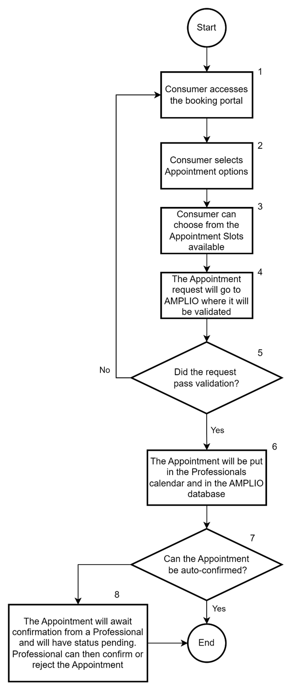

<h5>Figure 1: High level overview of Consumer Booking.</h5>
 

| Footnote | Description                                                                                                                                                                                                                                                                                                                                                                                                                                                                                                                                                                                          |
| -------- | ---------------------------------------------------------------------------------------------------------------------------------------------------------------------------------------------------------------------------------------------------------------------------------------------------------------------------------------------------------------------------------------------------------------------------------------------------------------------------------------------------------------------------------------------------------------------------------------------------- |
| 1        | **The Consumer accesses the booking portal for the project**                                                                                                                                                                                                                                                                                                                                                                                                                                                                                                                                         |
| 2        | **Consumer selects Appointment options**   The Consumer can select between the available Appointment Types and the Professional (or any).   Selecting both options will show the possible Appointment Slots that the Consumer can choose from.                                                                                                                                                                                                                                                                                                                                               |
| 3        | **Appointment Slot selection**   The Consumer can select from the available Appointment Slots presented and write a note to the Appointment booking if needed. The Consumer can then book the chosen Appointment Slot.                                                                                                                                                                                                                                                                                                                                                                           |
| 4        | **Appointment request validation**   The Appointment will be sent to AMPLIO and be validated to ensure that everything is correct. This validation includes checking the Professional’s calendar, if the Appointment Slot is still free, checking if the request follows the rules for the Appointment Type and that the data is correctly formatted.                                                                                                                                                                                                                                            |
| 5        | **Validation decision**   If the validation of the Appointment failed, an error will be returned to the Consumer and will have to select a new Appointment Slot.   If the validation passed, it will continue in 6.                                                                                                                                                                                                                                                                                                                                                                          |
| 6        | **Storing the Appointment**   When the Appointment has been validated the Appointment will be put into the Professional’s calendar and be stored in the AMPLIO database.                                                                                                                                                                                                                                                                                                                                                                                                                         |
| 7        | **Approving the Appointment**   Depending on the Appointment Type, the Appointment can auto-approve the Appointment request. If the Appointment Type cannot be auto approved, it will continue to 8.                                                                                                                                                                                                                                                                                                                                                                                             |
| 8        | **Requiring approval from Professional**   If the Appointment requires approval from a Professional, the status of the Appointment will be pending, but will keep the Appointment in the Professional’s calendar as a reservation. When the Appointment has been approved, the status of the Appointment will update in the database to be approved, and the Appointment in the Professional’s calendar will stay. If the Appointment is rejected, the status of the Appointment in the database will be changed to rejected and the Appointment in the Professional’s calendar will be removed. |

# Introduction to the subject

This section provides an overview of key functionality and third-party technologies used within the AMPLIO Booking component.

## Key Functionality

The AMPLIO Booking component has several functionalities that address different aspects of the scheduling and booking workflow:

- **Appointment Slot Management** - This feature provides the foundational logic for creating, modifying, and managing Appointments based on the Professional’s availability. It includes rules for handling appointment overlaps, preparation and post-processing times, and conflict resolution within calendar schedules.
- **Consumer and Professional Interaction** - Consumers can view and book Appointments on a self-service interface as well as cancel appointments, while Professionals can set their Booking Slots, edit and cancel Appointments as needed.

## Microsoft Graph API

The Microsoft Graph API is an endpoint for accessing data from Microsoft 365 services, such as Outlook. Within the AMPLIO Booking component, the Graph API
is used to synchronizing calendar information, enabling Professionals to manage their availability directly through Outlook, while AMPLIO accesses these
updates to present real-time appointment options to Consumers.

The Graph API allows a range of operations important to AMPLIO’s Booking functionality:

- **Fetching Calendar Events:** The API allows retrieval of calendar events, enabling AMPLIO to display up-to-date availability based on a Professional's schedule.
- **Creating and Updating Events:** When an Appointment or Bookable Slot is made, modified, or cancelled, AMPLIO utilizes the Graph API to create or update the relevant event in the Professional’s Outlook calendar, ensuring both AMPLIO and Outlook maintain consistent information.

## Appointment Slot

AMPLIO Booking needs to ensure that enough time is available for both the Appointment itself and any required preprocessing and postprocessing.
This means that a slot is available only if it is within a Booking Slot and there are no conflicts within the time range from the start of the
preprocessing period to the end of the postprocessing period.

For example, if a meeting is defined (through its Appointment Type) as lasting 60 minutes, with 10 minutes of preprocessing and 10 minutes of
postprocessing, then an available Appointment Slot requires that no conflicting appointments or reservations exist between 13:50 and 15:10 for
an appointment starting at 14:00.

The system ensures this by:

- Checking if any events have the status different from “free” in the Professional’s calendar.
- Validating the Professional’s capability to conduct meetings of the given Appointment Type.

The next available Appointment Slot starts according to the configured CRON expression (“start_time_expression”) for the allowed start times for
that appointment type. This ensures that appointments can only start at predefined times that are valid for the Appointment Type.

If the Appointment Type defines that Appointments are 30 minutes in duration and has 15 minutes pre-and-postprocessing and the CRON-expression
states that an Appointment can start every full hour from 8-12. On the figure below there is an example of an Appointment that is starting 09:00,
this means that the timeslot 08:45-09:45 is reserved for this Appointment.

If this Professional had a busy event 09:30-10:00, the Appointment would not be able to start at 09, as the postprocessing would go into the busy event.
This also means that it would not be possible to book an Appointment starting 10:00 either, as the preprocessing would go into the private event.

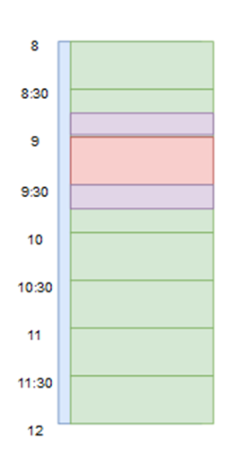

<h5>Figure 2: Example day of a Professional</h5>
 

### Finding an Appointment Slots

AMPLIO Booking has a service, CalendarService, which provides Bookable Slots and Reservations. From these we can calculate the Appointment Slots that are returned to the Consumer.

1. Get all the Bookable Slots for the selected Appointment Type and for any or a specific Professional for a given period. Period will be capped to start at least X days from the current date and end at most Y weeks from the current date, where X and Y are fields, min_booking_lead_time and max_booking_future_weeks respectively, on the Appointment Type system parameter.

2. Filter Reservations to only contain events overlapping with the Bookable Slots

3. If a specific Professional has been selected:

   1. Compute the set difference between the union of Bookable Slots across Professionals and the Reservations. The result is the Professional’s available time
   2. Work out the allowed start times according to the CRON expression associated with the Appointment Type system parameter. Subtract the preparation time from the resulting start times and associate an end time with each element by adding the meeting duration and the post-processing time to the start time.
   3. Compare the allowed time slots according to the Appointment Type rules with the Professional’s available times. Every allowed time slot that is contained within the Professional’s allowed times, is returned as a valid Appointment Slot for the Consumer to choose from (presenting the meeting start time to the Consumer, not the start time for the preparation to the meeting).

4. Otherwise, if no specific Professional has been selected:
   1. For each possible Professional that supports the given Appointment Type, compute the Professional’s available time as described in point 3.1 above.
   2. Calculate the allowed start times according to the rules of the Appointment Type as described in point 3.2 above.
   3. For each Professional, perform the comparison of 4.1 and 4.2, to compute the resulting Appointment Slots.
   4. Return all unique Appointment Slots across Professionals (presenting the meeting start time to the Consumer, not the start time for the preparation to the meeting).

#### Example

The Consumer wants to book an Appointment with the Appointment Type “Introduction meeting” on the 22nd of November 2024. Two Professionals capable
of conducting Introduction meetings: Alice and Bob.

Alice and Bob’s calendars look like this on the day:

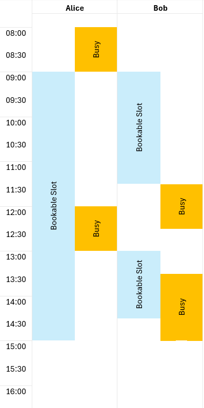

 

Assume that no specific Professional has been selected upfront.

Alice has 1 Bookable Slot: from 09:00 to 15:00. Bob has 2 Bookable Slots: from 09:00 to 11:30 and from 13:00 to 14:30.

Alice has 1 relevant busy event: from 12:00 to 13:00. Bob has 1 relevant busy event: from 13:30 to 15:00.

This leaves the Alice and Bob available in the green time slots below:

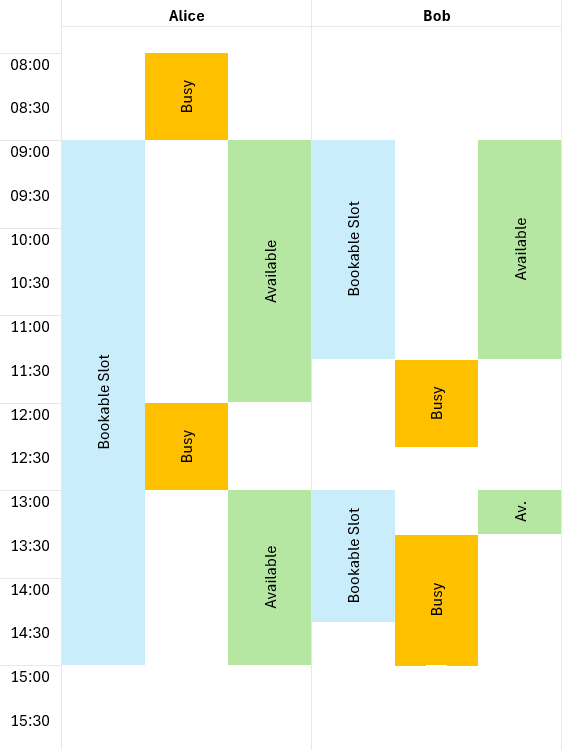

 

Assume the Appointment Type “Introduction meeting” has the following configuration:

- Duration: 1 hour
- Preparation time: ½ hour
- Post-processing time: ½ hour
- CRON expression: “*/30 10-16 * * 1-5”, i.e., every 30th minute in the window 10-16 o’clock on Mondays through Fridays

The list of allowed start times on the 22nd of November 2024 (a Friday) is, thus 10:00, 10:30, 11:00, 11:30, …, 15:00, 15:30.
This translates into the following list of valid Appointment Slots for Alice and Bob, respectively:

| Meeting start time | Professional must be available from | Professional must be available until | Alice     | Bob       |
| ------------------ | ----------------------------------- | ------------------------------------ | --------- | --------- |
| 10:00              | 09:30                               | 11:30                                | Available | Available |
| 10:30              | 10:00                               | 12:00                                | Available | -         |
| 11:00              | 10:30                               | 12:30                                | -         | -         |
| 11:30              | 11:00                               | 13:00                                | -         | -         |
| 12:00              | 11:30                               | 13:30                                | -         | -         |
| 12:30              | 12:00                               | 14:00                                | -         | -         |
| 13:00              | 12:30                               | 14:30                                | -         | -         |
| 13:30              | 13:00                               | 15:00                                | Available | -         |
| 14:00              | 13:30                               | 15:30                                | -         | -         |
| 14:30              | 14:00                               | 16:00                                | -         | -         |
| 15:00              | 14:30                               | 16:30                                | -         | -         |
| 15:30              | 15:00                               | 17:00                                | -         | -         |

Hence, the Consumer can select among the following Appointment Slots:

- 10:00-11:00 → Either Alice or Bob will be selected (arbitrarily) and will be booked from 09:30 to 11:30.
- 10.30-11:30 → Meeting with Alice. Alice will be booked from 10:00 to 12:00.
- 13:30-14:30 → Meeting with Alice. Alice will be booked from 13:00 to 15:00.

# Processes

This section describes the main process in the AMPLIO Booking component: Book/Edit Appointment.

## Book/Edit Appointment Process

This process can be used to

- **book** an Appointment between a Professional and a Consumer and create an appointment in the Professional’s calendar;
- **approve/reject** an Appointment booked by a Consumer (through the self-service portal); and
- **edit** an existing Appointment booked at an earlier stage.

### Process Overview

The following diagram shows the steps of the process for Book Appointment:

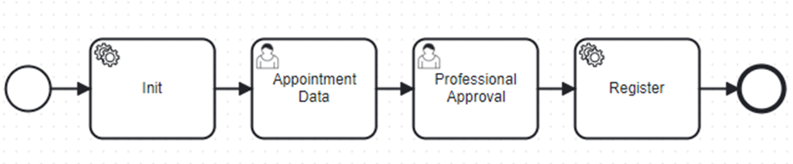

<h5>Figure 5: Book Appointment Process</h5>
 

It is possible to start the process from:

- The Action Dropdown (to book an Appointment from scratch).
- Event – Consumer booking Appointment on service portal which calls the Create Appointment API section [Book Appointment](#book-appointment), which creates an event for the process to start.
- The edit button on the table of Appointments on a Consumer page.
- The edit button on the table of Appointments on the Professional overview page.

By starting the process through the process dropdown (Professional start the process), the purpose is to book an Appointment with
the Consumer, where the Professional and Consumer can find a working time together. It will start an empty Book Appointment process.
The Professional can then choose an Appointment Type which will populate the process with data-fields relevant for that Appointment Type.
When the Professional have filled in the Appointment data-fields, the Professional can click continue to book the Appointment.

By starting the process through the event created from the Create Appointment API there will already have been created an appointment entry
into the Appointments database by the API. The start event will have the id to the Appointment, so the process can get access to the
appointment data.

By starting the process through an edit-button it will be checked whether a process for the given Appointment is running already.
If it is, it will be moved to the foreground. Otherwise, a new process is started.

The process steps are as follows:

| Footnote | Description                                                                                                                                                                                                                                                                                                                                                                                                                                                  | Manual / Automatic |
| -------- | ------------------------------------------------------------------------------------------------------------------------------------------------------------------------------------------------------------------------------------------------------------------------------------------------------------------------------------------------------------------------------------------------------------------------------------------------------------ | ------------------ |
| 1        | **Init**   Process context is populated with all the information about the Appointment. The start event has the id to the Appointment, which the API has provided after creating the Appointment in the Professional’s calendar and created an entry in the Appointment table in the database. If the process is started from the Action Dropdown, no data will be populated.                                                                            | Automatic          |
| 2        | **Appointment data**   The Professional need to fill out the information and fields required to book an Appointment. The fields will be prefilled with information from the process context. If prefilled data contains validation errors, it will go to manual, otherwise the step will continue automatically.                                                                                                                                         | Manual             |
| 3        | **Professional approval**   Depending on the rules for the Appointment Type this step may be automatic or the Professional needs to approve/reject the Appointment. This is controlled by a rule sheet.   When a Professional has approved or rejected the Appointment, a method in BookingEventTriggerService will be called depending on if it was created, changed, updated or cancelled. This allows for informing the Consumer of the creation/change. | Manual             |
| 4        | **Register**   The Appointment will be either updated or put in the Professional’s calendar [Create Event in Outlook](#create-event-in-outlook).   If the Appointment exists in the database, the status (Accepted, Pending or Rejected) and attributes of the Appointment in the database will be updated. Otherwise, the Appointment will be registered in the database and potential caching can be evicted or updated.                           | Automatic          |

### Init - Start Conditions and Task Data

In the initialization step the data from the event will be added to the process-context. The event data will contain a reference,
in the form of an ID, to the created Appointment. The Appointment will be loaded from the database in this step and put on the process-context.
If the process is started through the Action Dropdown, it will not have an Appointment ID as event data, hence the data of the Appointment
will not be loaded.

### Appointment Data

The following mock-up shows the UI for this step in the case of an Appointment that a Professional is manually booking.

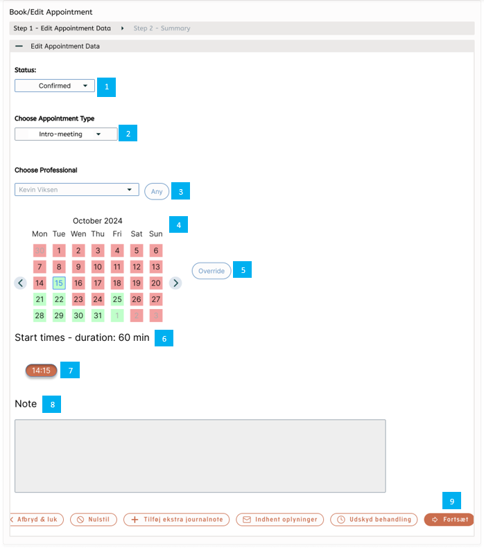

<h5>Figure 6: Book Appointment Process, step 2 - Appointment Data</h5>
 

| Footnote | Description                                                                                                                                                                                                                                                                                                                                                                                                                                                                                                                                                                                                                                                                                                                                                                                                                                                                                                                                                                                                                                                                                                  |
| -------- | ------------------------------------------------------------------------------------------------------------------------------------------------------------------------------------------------------------------------------------------------------------------------------------------------------------------------------------------------------------------------------------------------------------------------------------------------------------------------------------------------------------------------------------------------------------------------------------------------------------------------------------------------------------------------------------------------------------------------------------------------------------------------------------------------------------------------------------------------------------------------------------------------------------------------------------------------------------------------------------------------------------------------------------------------------------------------------------------------------------ |
| 1        | **Status**   This is the status for the Appointment. If started from the Action Dropdown, the field will be prefilled with “Confirmed” and hidden.     **_Value set:_** “Confirmed”, “Pending”, “Rejected” and “Canceled”. These options are extendable ENUMs. If “canceled” is selected, the rest of the fields become disabled (Appointment Type and Professional) or unrendered (Calendar Component and below)    **_Interaction_**: Dropdown-menu    **_Validation_**: Required field                                                                                                                                                                                                                                                                                                                                                                                                                                                                                                                                                                                        |
| 2        | **Choose Appointment Type:**   Allows the professional to select or change the predefined Appointment Type.   This may have consequences for the rest of the fields, as the Appointment Type sets the rules for which Professionals are allowed to perform the selected Appointment Type and the allowed Appointment Slots may change depending on the Bookable Slots in the Professional’s Calendar.   Becomes disabled if status is set to “Canceled”.   Changing the value will update the value set of the “Choose Professional”-dropdown and reset the choice of the field.    **_Value set_**: All valid Appointment Types in the system parameter.    **_Interaction_**: Searchable Dropdown-menu    **_Validation_**: Required field. The Appointment Type must be equal to one of the options in the dropdown.                                                                                                                                                                                                                                                   |
| 3        | **Choose Professional:**   Allows the Professional to change which Professional is responsible for the Booking.   Field is hidden until an Appointment Type has been selected.   Changing the value calls logic to get available Appointment Slots for Appointment Type [[AppointmentSlotService](#appointmentsslotservice)]   Clicking “any” button unselects any Professional and leaves the field blank. The any-button selects any Professional and all available Appointment Slots can be selected from between all the capable Professionals.   Becomes disabled if status is set to “Canceled”.    **_Value set_**: All Professionals capable of doing the Appointment Type. The functionality for how to get the Professionals is described here: [ProfessionalService](#professionalservice)    **_Interaction_**: Searchable Dropdown-menu    **_Validation_**: If selected, the Professional must be a valid Professional, must have the capability for Appointment Type, if empty select Professional [AppointmentSlotService](#appointmentsslotservice)] |
| 4        | **Calendar Component:**   Hidden until both an Appointment Type and a Professional (or any) are selected.  Calendar component which shows the current month view. The days marked with green are days with available timeslots for the Appointment Type and the Professional selected. The red days are days with no available timeslots for the Appointment Type and Professional selected.    The Component renders when both Appointment Type and Professional is set (or any), if they are disabled, Calendar Component does not render.   Defaults to the date with the soonest available Appointment Slot.   Will change depending on Appointment Type and Professional. If “any” professional is selected it will show all Appointment Slots available across all professionals for the given appointment type.    **_Value set_**: Will show availability of the month of the appointment in question, if no existing appointment it will show the current month    **_Interaction_**: Calendar    **_Validation_**: Required                            |
| 5        | **Override-button:**   The override-button is a button Professionals can press which allows the Professional to override the rules set by the Appointment Type. This Button will change the view for the times, as can be seen on the image here: [Override Pressed](#override-pressed).    **_Value set_**: Override    **_Interaction_**: Checkbox    **_Validation_**: If override button is pressed it removes the restrictions from the Appointment Type. And will cause the Validations to still run, but not restrict, so conflicts can be shown on next page.                                                                                                                                                                                                                                                                                                                                                                                                                                                                                                               |
| 6        | **Start times and Duration:**  Shows together with Calendar component   Start times text.   The duration is depending on the selected Appointment Type.                                                                                                                                                                                                                                                                                                                                                                                                                                                                                                                                                                                                                                                                                                                                                                                                                                                                                                                                            |
| 7        | **Available start times:**   Shows together with Calendar component   The start times are the start times for the Consumer. The Preparation and postprocessing is not included in the duration or the start time. To indicate a selected start time, it is colored.   The available start times are depending on the date selected    **_Value set_**: Available Appointment Slots for the date    **_Interaction_**: Select Buttons    **_Validation_**: Required. A real time check of availability must be performed [[Real time availability check in Outlook](#real-time-availability-check-in-outlook)].                                                                                                                                                                                                                                                                                                                                                                                                                                                                |
| 8        | **Consumer Note:**   The note shows input by the Consumer on the self-service portal, i.e. received through the API.    **_Interaction_**: Read-only text field                                                                                                                                                                                                                                                                                                                                                                                                                                                                                                                                                                                                                                                                                                                                                                                                                                                                                                                                   |
| 9        | **Continue Button:**   Triggers validation. If no validations fail, the process will go to next step.                                                                                                                                                                                                                                                                                                                                                                                                                                                                                                                                                                                                                                                                                                                                                                                                                                                                                                                                                                                                    |

#### Override pressed

This image shows the “override-button” being pressed:

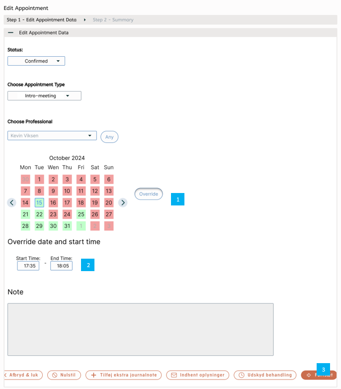

<h5>Figure 7: Edit Appointment, step 1 - Edit Appointment Data (Override clicked)</h5>
 

| Footnote | Description                                                                                                                                                                                                                                                                                                                                                                |
| -------- | -------------------------------------------------------------------------------------------------------------------------------------------------------------------------------------------------------------------------------------------------------------------------------------------------------------------------------------------------------------------------- |
| 1        | **Override-button**   This is the “override-button” pressed. This triggers the below section to show instead of the normal start time selection section. This button allows the Professional to not be restricted by the rules of the Appointment type.     **_Value set:_** override   **_Interaction_**: Button                                          |
| 2        | **Start and end range:**   Allows the Professional to select a custom start and end time. The date can be selected from the calendar view   **_Interaction_**: Two text fields    **_Validation_**: Both fields need to follow the format HH:MM, where HH is the 0-padded hour in 24-hour format and MM is a 0-padded integer between 00 and 60. E.g. 17:05 |
| 3        | **Continue-Button:**   This continue-button will perform the validation, but instead of enforcing the rules, the places where the rules are broken will be highlighted on the summary page.                                                                                                                                                                            |

#### Rulesheet

To allow for project customization a rule sheet is added to this step to allows for adding a list of rule execution intents to the Task.
The process will call `BookingRuleService::getRuleExecutionIntents`, to add these. The default implementation will return an empty list,
but projects can override to allow for customization.

### Summary

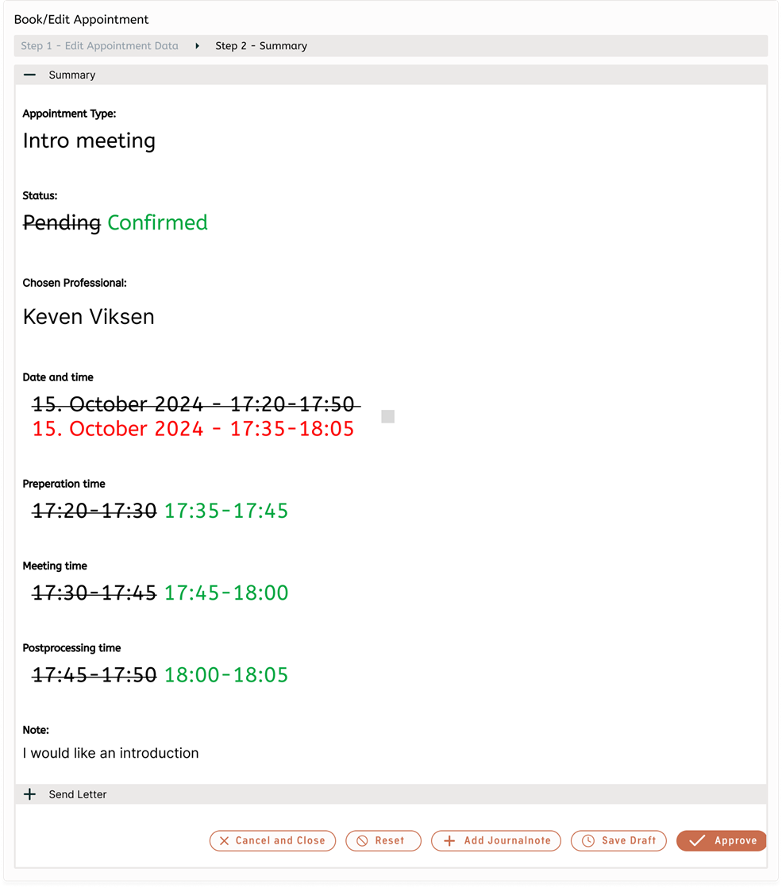

<h5>Figure 8: Edit Appointment, step 2 - Summary</h5>
 

| Footnote | Description                                                                                                                                                                                                                                                                                                                                                                                                                                                                                                             |
| -------- | ----------------------------------------------------------------------------------------------------------------------------------------------------------------------------------------------------------------------------------------------------------------------------------------------------------------------------------------------------------------------------------------------------------------------------------------------------------------------------------------------------------------------- |
| 1        | **Status:**   This shows where the validation from previous step encountered a conflict. This is shown by it being red. The Professional can confirm the changes despite the conflict by clicking the checkbox to the right of the date and time information.   The time range shown here will include both preparation time, meeting time and postprocessing time.    **_Interaction_**: Checkbox   **_Validation_**: Required to be checked if any conflicts                                      |
| 2        | **Date and time:**   This is the “override-button” pressed. This triggers the below section to show instead of the normal start time selection section. This button allows the Professional to not be restricted by the rules of the Appointment type.     **_Value set:_** override   **_Interaction_**: Button                                                                                                                                                                                        |
| 3        | **Preparation time:**   Will show the time range for when the preparation to the meeting should be done. The times shown are defined as follow:    _From_: : Meeting time (selected in the process) - preparation*time_minutes from the selected appointment_type system parameter    \_To*: Meeting time (selected in the process)                                                                                                                                                                 |
| 4        | **Meeting time:**   Will show the time range for when the meeting between the Consumer and the Professional occurs. The times shown are defined as follows:    _From_: Meeting time (selected in the process)    _To_: if override use selected overridden time, otherwise use “From” added duration_minutes from the selected appointment_type system parameter.                                                                                                                                   |
| 5        | **Postprocessing time:**   Will show the time range for when the postprocessing of the meeting should be done. The times shown are defined as follows:    _From_: Same as above “To” time.    _To_: From + post_processing_time_minutes from the selected appointment_type system parameter.                                                                                                                                                                                                        |
| 6        | **Send Letter:**   The process will send a Letter to the Consumer about the changes that have been made, and confirming them.   The letter will be prefilled only if a template is prefilled in BookingEventTriggerService, described in section [BookingEventTriggerService](#BookingEventTriggerService). A different method will be called depending on if it is a confirmation, a change, a rejection or a cancellation. It is the implementing projects responsibility to add the letter to the process context in the methods. |
| 7        | **Approve-Button:**   The Approve-Button will submit and validate the step, after which the process will go to the register step                                                                                                                                                                                                                                                                                                                                                                                    |

### Register

The Appointment will be put in the Professional’s calendar as described in [Create Event in Outlook](#create-event-in-outlook), and with the returned id from Graph API, to the
Appointment will it then store in the Appointment in the Appointments database. The Appointment is updated with status and details selected
in the process. The data model for Appointments is found in section [Appointment table](#appointment-table).

An Appointment confirmation or editing letter will then be sent to the Consumer.

# Integrations

The AMPLIO Booking module integrates with Microsoft Outlook and Microsoft Teams through the Microsoft Graph API.

## Microsoft Graph API Integration

For calendar synchronization, the system must be able to integrate with Microsoft Graph API. This allows AMPLIO to handle appointments in
Outlook by fetching and updating calendar events in real time.

The GraphServiceClient from Microsoft’s SDK will be used for the functionality. It can be found on their GitHub [MSGraphAPI.SDK](https://github.com/microsoftgraph/msgraph-sdk-java).

### Authentication and headers

GraphServiceClient will be supplied to the functionality as a bean. It is the individual projects responsibility to provide the bean and
ensure that it is authenticated correctly for use as this can vary from project to project. Here it is also possible to specify general
headers such as preferred time zone.

### Create Event in Outlook

To create an event in a Professionals calendar, the following Microsoft Graph API SDK method is used:

|                        | Create Event Request                                                                                                                                                                                                                                                                                                                                                                                                                    |
| ---------------------- | --------------------------------------------------------------------------------------------------------------------------------------------------------------------------------------------------------------------------------------------------------------------------------------------------------------------------------------------------------------------------------------------------------------------------------------- |
| **Documentation**      | [https://learn.microsoft.com/en-us/graph/api/user-post-events?view=graph-rest-1.0&tabs=http](https://learn.microsoft.com/en-us/graph/api/user-post-events?view=graph-rest-1.0&tabs=http)                                                                                                                                                                                                                                                |
| **Method**             | `graphClient.users(<Id>).events().buildRequest().post(<Event>)`                                                                                                                                                                                                                                                                                                                                                                         |
| **Variables**          | `<Id>`: the ID of the Professional in Outlook gotten through the Professional-interface, described in [Professional Interface](#professional-interface)   `<Event>`: the Event to be created. The [Event](https://learn.microsoft.com/en-us/graph/api/resources/event?view=graph-rest-1.0) is a DTO containing relevant information about the Outlook event, and the content of it is depending on the business operation performed. |
| **Additional headers** | `Prefer: IdType="ImmutableId",outlook.timezone="{timezone}"`   `{timezone}` should be set to the preferred time zone of the project.   `ImmutableId` ensures getting an immutable ID that is not changed if moved between calendars or updated in general.                                                                                                                                                                        |
| **Response**           | The created Event DTO with the Id of the event in Outlook, which can be used for further mapping.                                                                                                                                                                                                                                                                                                                                       |

#### Adding custom properties to an event

Link to documentation: (https://learn.microsoft.com/en-us/graph/api/opentypeextension-post-opentypeextension?view=graph-rest-1.0&tabs=http)

To add custom properties to an event during creation, the following needs to be added to the create event request payload. This is done by
adding a list of OpenTypeExtension to the event (https://learn.microsoft.com/en-us/graph/extensibility-overview?tabs=java#create-an-open-extension).

### Edit Event in Outlook

To update an Appointment event in the Professional’s calendar the following Microsoft Graph API endpoint is used:

|                        | Edit Event Request                                                                                                                                                                                                                                                                                                                                                                                                                                                                                  |
| ---------------------- | --------------------------------------------------------------------------------------------------------------------------------------------------------------------------------------------------------------------------------------------------------------------------------------------------------------------------------------------------------------------------------------------------------------------------------------------------------------------------------------------------- |
| **Documentation**      | [https://learn.microsoft.com/en-us/graph/api/event-update?view=graph-rest-1.0&tabs=http](https://learn.microsoft.com/en-us/graph/api/event-update?view=graph-rest-1.0&tabs=http)                                                                                                                                                                                                                                                                                                                    |
| **Method**             | `graphClient.users(<Id>).events().byEventId(<EventId>).patch(<Event>)`                                                                                                                                                                                                                                                                                                                                                                                                                              |
| **Variables**          | `<Id>`: the ID of the Professional in Outlook gotten through the Professional-interface, described in [Professional Interface](#professional-interface)   `<EventId>`: the external Id of the Appointment being edited   `<Event>`: the updated Event. The [Event](https://learn.microsoft.com/en-us/graph/api/resources/event?view=graph-rest-1.0) is a DTO containing relevant information about the Outlook event, and the content of it is depending on the business operation performed. |
| **Additional headers** | `Prefer: outlook.timezone="{timezone}"`   `{timezone}` should be set to the preferred time zone of the project.                                                                                                                                                                                                                                                                                                                                                                                  |

To update the properties of an Appointment in Outlook, the same properties can be used to update as can be found in the following
section: [Create Event in Outlook](#create-event-in-outlook).

It is not possible to change the Professional associated with the Appointment using this endpoint. This functionality can be found in the following section: [Change Owner on Event in Outlook](#change-owner-on-event-in-outlook).

If successful, this method returns a 200 OK response code and updated event object in the response body.

#### Change Owner on Event in Outlook

To change the Professional associated with the Appointment (move the Appointment to someone else), the Appointment event has to be
deleted and recreated which can be found here: [Delete Appointment in Outlook](#delete-event-in-outlook) and [Create Event in Outlook](#create-event-in-outlook).

Service using this functionality can be found here: [Edit Appointment](#edit-appointment)

### Delete Event in Outlook

To delete an Appointment event in the Professional’s calendar, the following Microsoft Graph API endpoint is used. This endpoint
deleted an event in the specified Professional’s calendar.

|                   | Delete Event Request                                                                                                                                                             |
| ----------------- | -------------------------------------------------------------------------------------------------------------------------------------------------------------------------------- |
| **Documentation** | [https://learn.microsoft.com/en-us/graph/api/event-delete?view=graph-rest-1.0&tabs=http](https://learn.microsoft.com/en-us/graph/api/event-delete?view=graph-rest-1.0&tabs=http) |
| **Method**        | `graphClient.users(<Id>).events().byEventId(<EventId>).delete()`                                                                                                                 |
| **Variables**     | `<Id>`: the ID of the owner of the event supplied to the method   `<EventId>`: the external Id of the Event being edited                                                      |

If successful, this method returns 204 No Content response code. It does not return anything in the response body.
Service using this functionality can be found here: [AppointmentService](#appointmentservice)

### Get Events for an Owner

|                        | Get Events Request                                                                                                                                                                                                                                                                                                                                                                                                                                                                                                                                                                                                                  |
| ---------------------- | ----------------------------------------------------------------------------------------------------------------------------------------------------------------------------------------------------------------------------------------------------------------------------------------------------------------------------------------------------------------------------------------------------------------------------------------------------------------------------------------------------------------------------------------------------------------------------------------------------------------------------------- |
| **Documentation**      | [https://learn.microsoft.com/en-us/graph/api/calendar-list-calendarview?view=graph-rest-1.0&tabs=http](https://learn.microsoft.com/en-us/graph/api/calendar-list-calendarview?view=graph-rest-1.0&tabs=http)                                                                                                                                                                                                                                                                                                                                                                                                                        |
| **Method**             | `graphClient.users(<Id>).calendar().calendarView().get(requestConfiguration -> {`   &nbsp;&nbsp;&nbsp;&nbsp;`requestConfiguration.queryParameters.filter = "showAs in (<status>)";`   &nbsp;&nbsp;&nbsp;&nbsp;`requestConfiguration.queryParameters.startDateTime = <periodStart>;`   &nbsp;&nbsp;&nbsp;&nbsp;`requestConfiguration.queryParameters.endDateTime = <periodEnd>;`   &nbsp;&nbsp;&nbsp;&nbsp;`requestConfiguration.queryParameters.expand = new String[]{"extensions($filter=id eq <extension>)"};`   &nbsp;&nbsp;&nbsp;&nbsp;`requestConfiguration.queryParameters.top = <pageSize>;`   `});` |
| **Variables**          | `<Id>`: the ID of the owner that events should be retrieved for   `<periodStart>`: the start time of the search span in ISO 8601 format   `<periodEnd>`: the end time of the search span in ISO 8601 format   `<status>`: comma-separated quoted list of statuses wanted for the returned events, can be “free”, “tentative”, “busy”, “oof”, “workingElsewhere”   `<extension>`: name of the extension that should be expanded and returned in the response   `<pageSize>`: the size of the page returned by the API.                                                                                                |
| **Additional headers** | `Prefer: outlook.timezone="{timezone}"`   `{timezone}` should be set to the preferred time zone of the project.                                                                                                                                                                                                                                                                                                                                                                                                                                                                                                                  |

This endpoint is use for each Professional.

If successful, this method returns a 200 OK response code and collection of event objects in the response body.
If the result set spans multiple pages, calendarView returns an @odata.nextLink property in the response that
contains a URL to the next page of results.

Get the events in a calendar view defined by a time range, from a Professional's default calendar. This includes
but is not limited to: Bookable Slot events (showAs in (“free”)), Appointment events (showAs in (“busy”)) and
Reservations (showAs in (“busy”, “oof”)).

### Mapping of CalendarEvent

Each event in the response from this call will be mapped to a CalendarEvent as follows:

| Event field                   | CalendarEvent-Field                   |
| ----------------------------- | ------------------------------------- |
| `event.subject`               | `calendarEvent.title`                 |
| `event.body.contentType`      | `"HTML"`                              |
| `event.body.content`          | `calendarEvent.body`                  |
| `event.start`                 | `calendarEvent.startTime`             |
| `event.end`                   | `calendarEvent.endTime`               |
| `event.owner`                 | `calendarEvent.professionalId`        |
| `event.id`                    | `calendarEvent.externalId`            |
| `event.extensions`            | `calendarEvent.extensionFields`       |
| `event.recurrence`            | `calendarEvent.recurrence`            |
| `event.isOnlineMeeting`       | `calendarEvent.isOnlineMeeting`       |
| `event.onlineMeetingProvider` | `calendarEvent.onlineMeetingProvider` |

# Amplio Booking Overview page

The Amplio Booking feature also introduces an overview page for Professionals where they can see upcoming appointments
and edit their availability for meetings. The page will **only** be available if the **Professional** has the role `BOOKING_OVERVIEW_READ`.
The page is shown below.

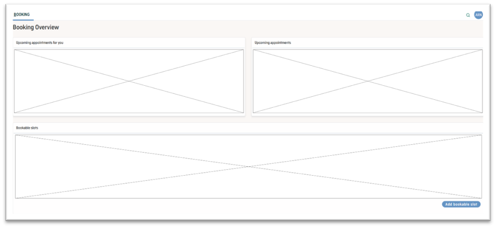

<h5>Figure 9: Amplio Booking Overview</h5>
 

| #   | Description                                                                                                                                                                                                                                      |
| --- | ------------------------------------------------------------------------------------------------------------------------------------------------------------------------------------------------------------------------------------------------ |
| 1   | **Upcoming appointments for you**   Will show all upcoming appointments for the logged-in Professional. See section [Appointment overview table](#appointment-overview-table) for more details.                                              |
| 2   | **Upcoming appointments**   Will show all upcoming appointments across all Professionals. See section [Appointment overview table](#appointment-overview-table) for more details.                                                            |
| 3   | **Bookable slots**   Will show all cached bookable slots for the next month. See section [Bookable slots overview](#bookable-slots-overview) for further details.                                                                            |
| 4   | **Add bookable slot**   If clicked, will open a modal with a form for creating a new bookable slot in the calendar of the logged-in Professional. See section [Create Bookable Slot Modal](#create-bookable-slot-modal) for further details. |

## Bookable Slots

This section describes service related to the Bookable Slots resource.

### Bookable Slots Overview

Will show a table overview of bookable slots for the logged in Professional for the next 30 days. Table will contain the
following information for each bookable slot for the given Professional retrieved using `CalendarService#getBookableSlots`
described in section [BookableSlotService](#bookableslotservice).

| Column     | Content                  |
| ---------- | ------------------------ |
| Name       | “Bookable slot”          |
| Event ID   | CalendarEvent.externalId |
| Start time | CalendarEvent.startTime  |
| End time   | CalendarEvent.endTime    |

### Create Bookable Slot Modal

The mock-up below to create Bookable Slots is modals that will be accessible through a button in the bookings tab in AMPLIO.

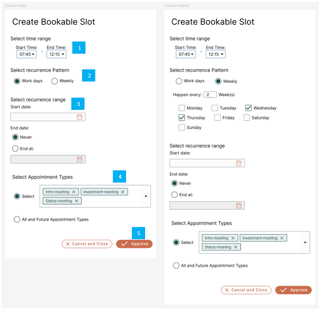

<h5>Figure 10: UI for Professionals to create Bookable Slots  </h5>
 

| Footnote | Description                                                                                                                                                                                                                                                                                                                                                                                                                                                                                                                                                                                                                                                                                                                                                     |
| -------- | --------------------------------------------------------------------------------------------------------------------------------------------------------------------------------------------------------------------------------------------------------------------------------------------------------------------------------------------------------------------------------------------------------------------------------------------------------------------------------------------------------------------------------------------------------------------------------------------------------------------------------------------------------------------------------------------------------------------------------------------------------------- |
| 1        | **Select time range:**   The Professional has 2 options for selecting time range for the Bookable Slot.    **1. _Select time in Value set_**: All times with a 5 min increment.   **2. Manually enter Start time and End time**: Format HH:MM.    **_Interaction_**: Searchable dropdown   **_Validation_**: Required.   • Needs to be valid times   • End Time needs to be later than start time                                                                                                                                                                                                                                                                                                                                                                                                                                  |
| 2        | **Select recurrence Pattern:**   The Professional can set the recurrence pattern for the Bookable Slot to either daily or weekly.   If weekly is selected, additional content is rendered, where the Professional must select weekly interval and the specific days of the week.    **_Value set_**: Workdays (does not take holidays into account), Weekly, Happen Every X Week(s)   **_Interaction_**: Radio buttons, input field, checkboxes   **_Validation_**:   • Radio buttons: Required   • Weekly interval input: Required (must be greater than 0) if weekly radio button is selected.   • Day selection: Required (at least 1 day) if weekly radio button is selected.                                           |
| 3        | **Select recurrence range:**   The Professional can select the recurrence range, which will decide for how long the recurrence should go. If never is selected, the date selection field should be disabled.    **_Value set_**: Never, end at   **_Interaction_**: Radio buttons and date selection field   **_Validation_**:   • Radio buttons: Required   • Calendar selection field: Required if not disabled. The start date and end date time fields must be validated to ensure they follow the correct dd-mm-yyyy format.                                                                                                                                                                                                   |
| 4        | **Select Appointment Types:**   The Professional can pick between selecting specific Appointment Types or selecting all possible Appointment Types and future added types.   If All and Future Appointment Types are selected, the field value will be an empty collection.   The multiple input field dropdown should be disabled when all Appointment Types option is selected.    **_Value set_**: The Appointment Type options for the Professional to pick are only the Appointment Types that the Professional is capable of doing.   **_Interaction_**: Radio buttons and multiple input field dropdown   **_Validation_**:   • Radio buttons: Required   • Multiple input field dropdown: Required if not disabled. |
| 5        | **Create Button:**   When the Professional has set up the Bookable Slot settings in the modal, the Professional can press the create Button. This will create the Bookable Slots in the Professional's calendar using the Graph API, which can be seen here: [Creating Bookable Slot in a Professional's calendar](#creating-bookable-slot-in-a-professionals-calendar). The Bookable Slots will not be saved in a database, but will be retrieved and saved in cache – see [Mapping of CalendarEvent](#mapping-of-calendarevent)                                                                                                                                                                                                                           |

### Limitations

A Professional has full control over the Bookable Slots in their calendar, and they can be moved around, resized, deleted
and copy-pasted as the Professional see fit , as Outlook is the master on the Bookable Slots and AMPLIO reads from Outlook.
If a Professional changes or deletes a Bookable Slot in Outlook that already has an Appointment booked, AMPLIO does not
automatically update or cancel the existing appointment. The Professional is responsible for manually managing such cases
by either canceling or rescheduling the affected appointments.

## Appointment Overview Table

The Appointments Overview provides a table view of future appointments. This makes it possible for Professionals to plan
and manage their time.

There are 3 places where this table can be used. It can be used on:

- **Booking Overview** – Upcoming appointments
  - On this overview all the columns will be shown.
- **Booking Overview** – Upcoming appointments for you
  - On this overview the Professional column will not be shown, as the only Appointments that are shown are the specific Professional’s Appointments
- **Consumer Overview**
  - On this overview the Consumer column will not be shown, as the only Appointments that are shows are the specific Consumer’s Appointments.

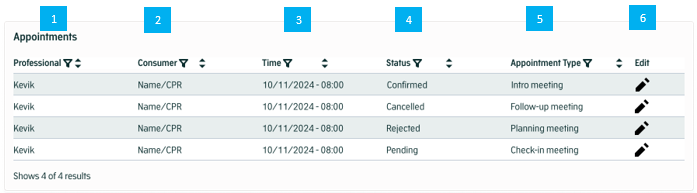

<h5>Figure 11: Table of Appointments </h5>
 

| Footnote | Description                                                                                                                                                                                                                                                                                                                                                                                                                                                                                                                                                                                                                 |
| -------- | --------------------------------------------------------------------------------------------------------------------------------------------------------------------------------------------------------------------------------------------------------------------------------------------------------------------------------------------------------------------------------------------------------------------------------------------------------------------------------------------------------------------------------------------------------------------------------------------------------------------------- |
| 1        | **Professional:**   In this column, the Professional associated with the Appointment will be.   This column is visible when the table is used in the Upcoming Appointments for all Professionals, and on the Upcoming Appointments on the Consumer overview.    **Value:** The value is the Display Name of the Professional associated with the Appointment.   **Filter:** The filter option will give the possibility to filter by specific Professionals that are in the table. No default filtering.   **Sort:** The sort option will sort the display name alphabetically. No default sorting. |
| 2        | **Consumer:**   In this column, the Consumer associated with the Appointment will be shown.   This column is not shown in the Consumer overview.    **Value:** The value is the Consumer name as a link to the Consumer overview page.   **Filter:** The filter option will give the possibility to filter by specific Consumers that are in the table. No default filtering.   **Sort:** The sort option will sort the Consumer name/CPR alphabetically. No default sorting.                                                                                                                       |
| 3        | **Time:**   In this column, the start time associated with the Appointment will be.    **Value:** The value format is dd/mm/yyyy - HH-MM.   **Filter:** The filter option will give the possibility to filter by a date range. The default filtering is from the current day.   **Sort:** The sort option will sort by time. The default sorting is soonest meeting first.                                                                                                                                                                                                                              |
| 4        | **Status:**   In this column, the status associated with the Appointment will be.    **Value:** AppointmentStatus (Extendable Enum)   **Filter:** The filter option will give the possibility to filter by status. No default filtering.   **Sort:** The sort option will sort alphabetically. No default sorting.                                                                                                                                                                                                                                                                                      |
| 5        | **Appointment Type:**   In this column, the Appointment Type associated with the Appointment will be.    **Value:** The value is the title from the Appointment Type System Parameter.   **Filter:** The filter option will give the possibility to filter by specific Appointment Types that are in the table. No default filtering.   **Sort:** The sort option will sort the Appointment Types alphabetically. No default sorting.                                                                                                                                                                   |
| 6        | **Edit:**   This is a clickable button that will start the edit process for the selected Appointment. Only visible when the employee has write-access to the Book/Edit appointment process, i.e. `PROCES_BOOK_APPOINTMENT_WRITE`.                                                                                                                                                                                                                                                                                                                                                                                       |

# Configurations and service extensions

This section defines the configurations and service extensions required to set up and maintain the component within the AMPLIO
Booking system. It includes integration specifics, customizable settings, roles and rights assignments, and database patching requirements.

## Code integration

### ProfessionalService

A ProfessionalService interface is defined in AMPLIO for each project to implement functionality required for AMPLIO Booking to work.
The interface is described in ProfessionalService under [API](#api).

This service should provide a list of Professionals that are available for booking. AMPLIO currently has no standard for how to handle
these individuals. Normally they would be fetched through an integration to another system of the customer but could also be managed in
AMPLIO itself. The reference implementation has database tables for this and will use these to get professionals.

### CalendarService

An interface is defined in AMPLIO and should for each project be implemented to integrate with AMPLIO Booking. The interface is described
in CalendarService under [API](#api).

This service should call the Microsoft Graph API connector, and map to BookableSlots and Reservations. However, projects may want to
consider caching and/or a batchjob for loading this to Database depending on the number of professionals, hence caching can be added
on this level by overriding the bean.

### BookingEventTriggerService

A main service that is responsible for external integration calls such as sending notification, 
sending email, or caching. This service enables projects to customize the behaviour of the booking 
process, e.g. by adding letters or controlling caching. The service is described in  [API](#bookingeventtriggerservice-1).

### BookingRuleService

An interface is defined in AMPLIO and be implemented to better integrate project code with AMPLIO Booking. This service enables
projects to customize the rules executed by the booking process. The interface is described in BookingRuleService under [API](#api).

## Configurable settings

The AMPLIO Booking component provides various configurable settings that allow projects to fine-tune the component’s behavior
and appearance.

**Appointment Type**:

- Appointment Type is a System Parameter and is required. Administrators can define different Appointment Types and set specific
  settings for each. The System Parameter can be found here: [Appointment_type](#appointment_type).

## Roles and rights

In the AMPLIO Booking component, roles and rights are structured to support controlled access, ensuring segregation of duties and
maintaining security across different functionalities.

### Role Definitions

| Role                        | Description                                                                                                                                                            |
| --------------------------- | ---------------------------------------------------------------------------------------------------------------------------------------------------------------------- |
| PROC_BOOK_APPOINTMENT_READ  | This role allows the user to see contents of a Book/Edit Appointment process, but does not allow them to start the process, edit its contents or submit updates.       |
| PROC_BOOK_APPOINTMENT_WRITE | This role allows the user to start, see and change contents of a Book/Edit Appointment process.                                                                        |
| BOOKING_OVERVIEW_READ       | This role is created for the Amplio Booking overview page. Read access allows you to see all the tables on the page, however, you are unable to submit bookable slots. |
| BOOKING_OVERVIEW_WRITE      | This role is created for the Amplio Booking overview page. Write access allows you to see all the tables on the page, and to submit bookable slots.                    |

## Database patches

Names of the migration scripts created for the database tables in section 10 will have to be named here.

## Reservations and namespaces

### Namespace

The namespace for the booking modules will be:

| Module                                                  | Description                                                                                                                   |
| ------------------------------------------------------- | ----------------------------------------------------------------------------------------------------------------------------- |
| nc.amplio.libraries.booking.api                         | All endpoints exposed by the booking component will be located here.                                                          |
| nc.amplio.libraries.booking                             | All functionality related to the booking and creation of bookable slots, appointments and professionals will be located here. |
| nc.amplio.libraries.calendar.api                        | Basic interfaces for booking and retrieving events from the                                                                   |
| nc.amplio.libraries.calendar.outlook                    | Implementation of the booking calendar interface in Microsoft Graph API                                                       |
| nc.amplio.libraries.integrations.microsoft.graphapi.sdk | The actual integration to Microsoft Graph API. Will simply refer to the libraries, and contain limited logic.                 |

### Endpoints

All endpoints use a default base path. This base path can be configured based on deployment or environment settings.

- Default Base Path: /rest/api/booking

#### Configuration

The base path can be modified by updating the configuration file (BASE_PATH) in the deployment settings. This allows the API to be
adapted to different deployment environments without changing the individual endpoint definitions.

# API

In this section, the services available through our API are documented including but not limited to responses, examples, format and error examples.

## Booking Services

### AppointmentService

| Method                                                                                                                           | Description                                                                                                                                                                                                                                                                                                                                                                                                                                                                                                                      |
| -------------------------------------------------------------------------------------------------------------------------------- | -------------------------------------------------------------------------------------------------------------------------------------------------------------------------------------------------------------------------------------------------------------------------------------------------------------------------------------------------------------------------------------------------------------------------------------------------------------------------------------------------------------------------------- |
| `AppointmentDto bookAppointment(AppointmentDto appointmentDto)`                                                                  | Described in section [Book appointment](#book-appointment)                                                                                                                                                                                                                                                                                                                                                                                                                                                                       |
| `AppointmentDto updateAppointment(AppointmentDto appointmentDto)`                                                                | Described in section [Edit appointment](#edit-appointment)                                                                                                                                                                                                                                                                                                                                                                                                                                                                       |
| `List<AppointmentDto> getAppointments(LocalDate startDate, LocalDate endDate, String appointmentType, AppointmentStatus status)` | Described in section [Get appointments for all professionals](#get-appointments-for-all-professionals)                                                                                                                                                                                                                                                                                                                                                                                                                           |
| `List<AppointmentDto> getAppointmentsForProfessional(professionalId, startDate, endDate, appointmentType, status)`               | Described in section [Get appointment for professional](#get-appointments-for-professional)                                                                                                                                                                                                                                                                                                                                                                                                                                      |
| `List<AppointmentDto> getAppointmentsForConsumer(consumerId)`                                                                    | Will get a full list of all future appointments for a consumer.                                                                                                                                                                                                                                                                                                                                                                                                                                                                  |
| `AppointmentDto getAppointment(appointmentId)`                                                                                   | Will get a single appointment based on its ID.                                                                                                                                                                                                                                                                                                                                                                                                                                                                                   |
| `AppointmentDto cancelAppointment(appointmentId)`                                                                                | Will remove from the associated Professional’s calendar [Delete Event in Outlook](#delete-event-in-outlook). The service will also change the status of the Appointment in the Appointments database to “cancelled” rather than deleting the Appointment from the database. The `canceledAt` and `canceledBy` fields are also updated. A letter can be sent to the Consumer about the confirmation of the Appointment, controlled by the `BookingEventTriggerService` described in section [BookingEventTriggerService](#BookingEventTriggerService). |

#### Book appointment

A real time check of the Professional selected will be performed as described in [Real time availability check](#real-time-availability-check-in-outlook). If no Professional
is selected the service will select a Professional that is able to have the Appointment, by calling the method
`AppointmentSlotService#getProfessionalForAppointmentSlot` described in section [AppointmentSlotService](#appointmentsslotservice).

When the real time availability check passed for a Professional, the service will create the Appointment in the Professional’s
calendar, which can be seen below. The service will also create an entry in the Appointments table and call the
`BookingEventTriggerService#onAppointmentCreated`. A start event will then be sent to start the Book Appointment process with the id
to the Appointment in the Appointments table.

The CalendarEvent sent to the `CalendarService` described above will be mapped as follows from a given [AppointmentDto](#appointmentdto--dto):

| CalendarEvent-field | Mapping                                                                                                                                                                                                       |
| ------------------- | ------------------------------------------------------------------------------------------------------------------------------------------------------------------------------------------------------------- |
| `title`             | Textkey: `"booking.appointment.subject"`                                                                                                                                                                      |
| `body`              | Textkey: `"booking.appointment.content"`   TextArgs: `AMPLIO_LINK`, link to the consumer in Amplio.   **Attention**: The links to the teams meeting should not be overridden                          |
| `startTime`         | `AppointmentDto.preperationStartTime`                                                                                                                                                                         |
| `endTime`           | `AppointmentDto.endTime`                                                                                                                                                                                      |
| `externalUserId`    | `AppointmentDto.professional.getExternalUserId()`                                                                                                                                                             |
| `externalId`        | `NULL`                                                                                                                                                                                                        |
| `recurrence`        | `NULL`                                                                                                                                                                                                        |
| `extensions`        | `List.of(`   &nbsp;&nbsp;&nbsp;&nbsp; `new EventExtension("nc.amplio.libraries.booking.appointment",`   &nbsp;&nbsp;&nbsp;&nbsp; `Map.of("appointmentType", BookableSlot.appointmentTypes)`   `)` |

Response will contain an event with the external ID of the newly created Outlook appointment as well as information about the meeting,
which will be updated on the AppointmentDto before returning it to the calling service. The properties will be mapped as follows:

| Property                         | Value                            |
| -------------------------------- | -------------------------------- |
| `AppointmentDto.joinUrl`         | `response.onlineMeeting.joinUrl` |
| `response.onlineMeeting.joinUrl` | `response.id`                    |

#### Edit Appointment

Edit Appointment is only accessible to Professionals. This service is used to update Appointments and returns the updated Appointment.
This service is called by the Edit Appointment Process. The Outlook integration can be found here: [Edit Event in Outlook](#edit-event-in-outlook)

The following table is a table of the properties that the service can take.

| Properties        | Type     | Value Type   | Description                                                                                                                                                                                                                                                                                                                                                                                                                                                        | Reference                                                                                                         |
| ----------------- | -------- | ------------ | ------------------------------------------------------------------------------------------------------------------------------------------------------------------------------------------------------------------------------------------------------------------------------------------------------------------------------------------------------------------------------------------------------------------------------------------------------------------ | ----------------------------------------------------------------------------------------------------------------- |
| `appointmentId`   | required | String       | Unique ID of the appointment.                                                                                                                                                                                                                                                                                                                                                                                                                                      | [Appointment Table](#appointment-table)                                                                           |
| `professionalId`  | optional | String       | New professional.   Updates to the Professional associated with an Appointment requires changes to the Appointment in the Professional's calendar. As there is no direct way to move the Appointment to another Professional, the Appointment has to be deleted from the Professional's calendar and then created in the new associated Professional’s calendar with the new changes to the Appointment if any additional changes are made to the Appointment. | [Delete Appointment in Outlook](#delete-event-in-outlook) and [Create Event in Outlook](#create-event-in-outlook) |
| `appointmentType` | optional | string, Enum | New Appointment Type.   Updates to the Appointment Type of an Appointment only require an update to the Appointment in the database, as the Appointment in the Professional's calendar does not store that information.                                                                                                                                                                                                                                        | [Appointment Table](#appointment-table)                                                                           |
| `appointmentSlot` | optional | ISO 8601     | New set of start and end date/time for the Appointment.   Updates to the Appointment Slot of an Appointment require a change to the Appointment in the Professional's calendar. This can be done using the Graph API.                                                                                                                                                                                                                                          | [Edit Event in Outlook](#edit-event-in-outlook)                                                                   |
| `note`            | optional | string       | A new note for the Appointment.   Updates to the note of an Appointment only require an update to the Appointment in the database, as the Appointment in the Professional's calendar does not store that information.                                                                                                                                                                                                                                          | [Appointment Table](#appointment-table)                                                                           |
| `status`          | optional | string, Enum | A new status for the Appointment.   Updates to the status of an Appointment only require an update to the Appointment in the database, as the Appointment in the Professional's calendar does not store that information.                                                                                                                                                                                                                                      | [Appointment Table](#appointment-table)                                                                           |

#### Get Appointments for all Professionals

Retrieve Appointments across all Professionals in the system. This service is designed to provide an overview of Appointments for all
Professionals and can be used by Professionals.

The service returns a list of Appointments.

The following table is a table of the properties that the service can take.

| Properties                | Type     | Value Type   | Description                                                                   |
| ------------------------- | -------- | ------------ | ----------------------------------------------------------------------------- |
| `startDate` and `endDate` | required | ISO 8601     | A set of start and end date/time used for the range of Appointments to return |
| `appointmentType`         | optional | string, Enum | Filter option to filter on the Appointment Type.                              |
| `status`                  | optional | string, Enum | Filter option to filter on the status for the Appointment.                    |

#### Get Appointments for Professional

Retrieve Appointments for a specific Professional in the system. This service is designed to provides a view of Appointments with filtering options.

The service returns a list of Appointments.

The following table is a table of the properties that the service can take.

| Properties                | Type     | Value Type   | Description                                                                   |
| ------------------------- | -------- | ------------ | ----------------------------------------------------------------------------- |
| `professionalId`          | required | String       | The selected Professional to retrieve Appointments for.                       |
| `startDate` and `endDate` | required | ISO 8601     | A set of start and end date/time used for the range of Appointments to return |
| `status`                  | optional | string, Enum | Filter option to filter on the status for the Appointment.                    |
| `appointmentType`         | optional | string, Enum | Filter option to filter on the Appointment Type.                              |

### AppointmentsSlotService

| Method                                                                                            | Description                                                                                                                                                                                                                                                                                                                                                                                                |
| ------------------------------------------------------------------------------------------------- | ---------------------------------------------------------------------------------------------------------------------------------------------------------------------------------------------------------------------------------------------------------------------------------------------------------------------------------------------------------------------------------------------------------- |
| `List<TimeSlot> getAvailableAppointmentSlots( appointmentType, fromDate, toDate, professionalId)` | Will return a list of distinct available appointment slots for the given professional, in the provided timespan, and of the given type.   Slots will be found as described in the pseudo algorithm in [Finding an Appointment Slots](#finding-an-appointment-slots) and will utilize the `CalendarService` and the `ProfessionalService`. The data model for the `AppointmentSlot` can be found below. |
| `List<TimeSlot> getAvailableAppointmentSlots( appointmentType, fromDate, toDate)`                 | Will return a list of distinct available appointment slots for the in the provided timespan and of the given type.   The slots will be found as described in the pseudo algorithm in [Finding an Appointment Slots](#finding-an-appointment-slots) and will utilize the `CalendarService` and the `ProfessionalService`. The data model for the `AppointmentSlot` can be found below.                  |
| `String getProfessionalForAppointmentSlot( appointmentType, startTime, endTime)`                  | Will return an ID of a professional capable and free for an appointment in the given time slot.   The professional will be found using the `getAvailableAppointmentSlots` method where the parameters are passed through, and one is selected at random.                                                                                                                                               |

#### Real time availability check in Outlook

When an Appointment needs to be booked into a Professional’s calendar, a real time availability check needs to be performed. This check ensures that
there are no conflicting events that has been put into the calendar between the cache refresh and the Appointment being made. Events created by AMPLIO
will always be up to date in the cache, because the cache will be updated when AMPLIO performs any changes in a Professional’s calendar.

To perform a real time availability check we use the same functionality as refreshing the cache [[Get Events for an Owner](#get-events-for-an-owner)]
just on a smaller DateTime range and only for the specific Professional and not a collection of Professionals.

The `startDateTime` and `endDateTime` will be the start and end datetime of the Appointment (including preparation and postprocessing) that is being checked.
If any events are returned marked as not free outside the Appointment itself (if it has already been put in), then the Professional is not available,
and this means the cache for this time range and for this Professionals is outdated. There is no need to validate that the Appointment is within a Bookable
Slot, as that has already been validated.

### ProfessionalService

To be implemented by the projects. The service should supply an implementation which returns all Professional able to use AMPLIO Booking.

| Method                                                 | Description                                                                                                                |
| ------------------------------------------------------ | -------------------------------------------------------------------------------------------------------------------------- |
| `List<Professional> getProfessionals(AppointmentType)` | Returns a list of Professionals depending on the Appointment Type. Professional is an interface, which is described below. |
| `List<Professional> getProfessionals()`                | Returns a list of all Professionals                                                                                        |
| `Professional getProfessionalById(id)`                 | Returns a specific Professional                                                                                            |

#### Professional Interface

This interface provides information about the professionals in the system.

| Method                                         | Description                                                                                                                                     |
| ---------------------------------------------- | ----------------------------------------------------------------------------------------------------------------------------------------------- |
| `String getId()`                               | Unique identifier for the professional                                                                                                          |
| `String getDisplayName()`                      | The way that the Professionals name should be displayed (e.g. first and last name)                                                              |
| `String getExternalUserId()`                   | The way that the Professionals name should be displayed (e.g. first and last name) Will return the ID of the professional used in the Graph API |
| `Set<String> getAppointmentTypeCapabilities()` | Gets a set of System Parameter keys for the Appointment Types that the Professional is capable of.                                              |

### BookableSlotService

| Method                                                                                             | Description                                                                                                                                                                                                                                               |
| -------------------------------------------------------------------------------------------------- | --------------------------------------------------------------------------------------------------------------------------------------------------------------------------------------------------------------------------------------------------------- |
| `List<BookableSlot> getBookableSlots(String professionalId, LocalDate fromDate, LocalDate toDate)` | Gets bookable slots for a given Professional for a given period. The method will utilize the [Microsoft Graph API integration ](#microsoft-graph-api-integration) to retrieve all slots where the Professional is marked as bookable in his/her calendar. |
| `List<BookableSlot> getBookableSlots(LocalDate fromDate, LocalDate toDate)`                        | Gets bookable slots for all Professionals for a given period. Will use the ProfessionalService to get the list of all Professionals and request their bookable slots through the [Microsoft Graph API integration ](#microsoft-graph-api-integration).    |
| `BookableSlot createBookableSlot(BookableSlot slot)`                                               | See [Creating bookable slot in a professional's calendar](#creating-bookable-slot-in-a-professionals-calendar).                                                                                                                                           |

#### Creating Bookable Slot in a Professional’s calendar

For the Professional to create Bookable Slots in their calendar they need to use the UI in AMPLIO [Create Bookable Slot Modal](#create-bookable-slot-modal) to create the events.
This offers the option for Professionals to create Bookable Slots that show up in their Outlook calendar which Consumers can book Appointments within.

The following table lists the additional relevant fields for the request when creating a BookableSlot in a Professional’s calendar:

| CalendarEvent     | Value                                                                                                                                                                                                           |
| ----------------- | --------------------------------------------------------------------------------------------------------------------------------------------------------------------------------------------------------------- |
| `title`           | Textkey: `"booking.bookableslot.subject"`                                                                                                                                                                       |
| `body`            | Textkey: `"booking.bookableslot.body"`                                                                                                                                                                          |
| `startTime`       | `BookableSlot.startTime`                                                                                                                                                                                        |
| `endTime`         | `BookableSlot.endTime`                                                                                                                                                                                          |
| `externalUserId`  | `BookableSlot.professional.getExternalUserId()`                                                                                                                                                                 |
| `externalId`      | `NULL`                                                                                                                                                                                                          |
| `recurrence`      | `BookableSlot.recurrence`                                                                                                                                                                                       |
| `status`          | `"free"`                                                                                                                                                                                                        |
| `extensionFields` | `List.of(`   &nbsp;&nbsp;&nbsp;&nbsp; `new EventExtension("nc.amplio.libraries.booking.bookableslot",`   &nbsp;&nbsp;&nbsp;&nbsp; `Map.of("appointmentTypes", BookableSlot.appointmentTypes)`   `)` |

### ReservationsService

| Method                                                                                             | Description                                                                                                                                                                                   |
| -------------------------------------------------------------------------------------------------- | --------------------------------------------------------------------------------------------------------------------------------------------------------------------------------------------- |
| `List<CalendarEvent> getReservations(String professionalId, LocalDate fromDate, LocalDate toDate)` | Gets the appointments from the given Professional where the status is not “free”, i.e. Reservations, through the CalendarService described in section [Calendar services](#calendar-services) |
| `List<CalendarEvent> getReservations(LocalDate fromDate, LocalDate toDate)`                        | Gets the appointments for all Professionals where the `showAs` is not “free”, i.e. Reservations, through the CalendarService described in section [Calendar services](#calendar-services)     |

### BookingEventTriggerService
The BookingEventTriggerService is responsible for orchestrating post-processing logic when a new appointment is created. 

Specifically, its method `onAppointmentCreated(AppointmentDto appointmentDto)` serves as a central dispatch point that 
collects and executes all registered implementations of the `OnAppointmentCreated` trigger interface.

The following class diagram represents the `BookingEventTriggerService` and its interactions with various trigger interfaces 
responsible for post-processing appointment lifecycle events in the system.

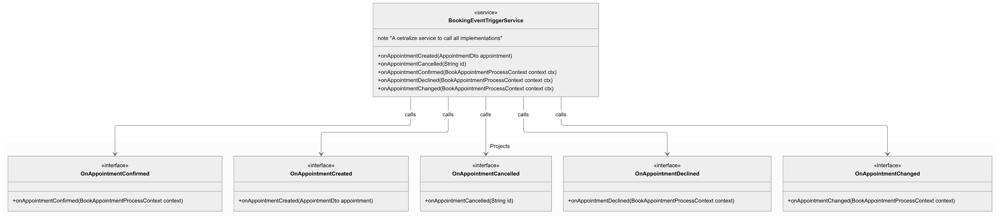

Each implementation of the trigger interface encapsulates a specific reaction to the action — for example, 
sending notifications, updating linked systems, or applying custom business rules.

| Method                                                               | Description                                                                                                                                                                                         | Interface              |
| -------------------------------------------------------------------- | --------------------------------------------------------------------------------------------------------------------------------------------------------------------------------------------------- |------------------------|
| `void onAppointmentCreated(AppointmentDto appointment)`              | Will be triggered when an appointment is created through the API. This can for instance be used for updating potential DB cache of Reservations.                                                    | OnAppointmentCreated   |
| `void onAppointmentCancelled(String appointmentId)`                  | Will be triggered when an appointment is cancelled through the API. This can be used for sending a confirmation letter to the Consumer. Letters should be sent by triggering a `SEND_LETTER` event. | OnAppointmentCancelled |
| `void onAppointmentConfirmed(BookAppointmentProcessContext context)` | Will be triggered when the Professional accepts a booking. Letters can be sent by adding them to the process context.                                                                               | OnAppointmentConfirmed |
| `void onAppointmentCancelled(BookAppointmentProcessContext)`         | Will be triggered when the Professional cancels a booking. Letters can be sent by adding them to the process context.                                                                               | OnAppointmentCancelled |
| `void onAppointmentDeclined(BookAppointmentProcessContext)`          | Will be triggered when the Professional declines a booking. Letters can be sent by adding them to the process context.                                                                              | OnAppointmentDeclined  |
| `void onAppointmentChanged(BookAppointmentProcessContext)`           | Will be triggered when the Professional changes a booking. Letters can be sent by adding them to the process context.                                                                               | OnAppointmentChanged   |

### BookingRuleService

| Method                                                                             | Description                                                                                                   |
| ---------------------------------------------------------------------------------- | ------------------------------------------------------------------------------------------------------------- |
| `List<RuleExecutionIntent> getRuleExecutionIntents(BookAppointmentProcessContext)` | Will be called to allow projects to enable rule sheets on the Appointment Data step in the Book/Edit process. |

## Calendar Services

### CalendarService – Interface

Interface used by Booking Services to integrate with the Calendar-provider. This will be implemented in the microsoftgraph api.

| Method                                                                                                  | Description                                                                                                                                                |
| ------------------------------------------------------------------------------------------------------- | ---------------------------------------------------------------------------------------------------------------------------------------------------------- |
| `List<CalendarEvent> getEvents(String owner, LocalDate from, LocalDate to, List<EventStatus> statuses)` | Gets a list of events planned for the given owner.                                                                                                         |
| `CalendarEvent createEvent(CalendarEvent event)`                                                        | Create an event corresponding to the provided `CalendarEvent`. The returned DTO will have its ID set to the ID provided by the external Calendar-provider. |
| `CalendarEvent updateEvent(CalendarEvent event) `                                                       | Updates the external event.                                                                                                                                |
| `boolean deleteEvent(String owner, String eventId)`                                                     | Deletes the external event.                                                                                                                                |

### MicrosoftGraphCalendarService

Implementation of the CalendarService interface with functionality specific to Microsoft Outlook and Graph API.

## Consumer-facing API

### API Base Path

All API endpoints are prepended with a default base path as defined in section [Endpoints](#endpoints).

### HTTP header expectation

The identity of the consumer is assumed to be included in the header in the form of a JWT, session-cookie or similar, and
authentication as well as authorization is handled by AMPLIO or Project-code, such that the SecurityContext can be used to
determine the identity of the Consumer.

### Get Professionals by Appointment Type

This endpoint is responsible for retrieving a list of Professionals who are capable for a specific type of appointment.

The purpose of this endpoint is to offer the option for Consumers to select a specific Professional during the booking process.

This API will call the `ProfessionalService#getProfessionals` as described in [ProfessionalService](#professionalservice).

#### API

| Field               | Details                                                                                                                                                                                                                                                                                                                                                                                                                                                                                                                     |
|---------------------|-----------------------------------------------------------------------------------------------------------------------------------------------------------------------------------------------------------------------------------------------------------------------------------------------------------------------------------------------------------------------------------------------------------------------------------------------------------------------------------------------------------------------------|
| Endpoint            | `{api-base-path}/professional/{appointmentType} `                                                                                                                                                                                                                                                                                                                                                                                                                                                                           |
| Roles               | BOOKING_OVERVIEW_READ                                                                                                                                                                                                                                                                                                                                                                                                                                                                                                       |
| HTTP Method         | GET                                                                                                                                                                                                                                                                                                                                                                                                                                                                                                                         |
| Description         | Get all Professionals for a given Appointment Type. Used to present Consumer with options to pick a specific Professional.                                                                                                                                                                                                                                                                                                                                                                                                  |
| Parameters          | Path Parameters:   appointmentType (required, System Parameter): The type of appointment, using the System Parameter key.                                                                                                                                                                                                                                                                                                                                                                                               |
| Example             | ` /rest/api/booking/professional/intro-meeting`                                                                                                                                                                                                                                                                                                                                                                                                                                                                             |
| Expected Result     | **Status code**: 200 Success   Returns a total list of professionals for the specified Appointment Type with the HTTP response code 200.                                                                                                                                                                                                                                                                                                                                                                                |
| **Response Format** | JSON example:   ` {`   &nbsp;&nbsp;&nbsp;&nbsp; `"professional": [`   &nbsp;&nbsp;&nbsp;&nbsp;&nbsp;&nbsp;&nbsp;&nbsp; `{`   &nbsp;&nbsp;&nbsp;&nbsp;&nbsp;&nbsp;&nbsp;&nbsp;&nbsp;&nbsp;&nbsp;&nbsp; `"id": "kevik",`   &nbsp;&nbsp;&nbsp;&nbsp;&nbsp;&nbsp;&nbsp;&nbsp;&nbsp;&nbsp;&nbsp;&nbsp; `"displayName": "Kevin Viksen"`   &nbsp;&nbsp;&nbsp;&nbsp;&nbsp;&nbsp;&nbsp;&nbsp; `},`   &nbsp;&nbsp;&nbsp;&nbsp;&nbsp;&nbsp;&nbsp;&nbsp; `...`   &nbsp;&nbsp;&nbsp;&nbsp; `]`   `}` |
| **Exceptions**      | **404 Not Found**: Appointment type not found. Invalid Appointment Type                                                                                                                                                                                                                                                                                                                                                                                                                                                     |
| **404 Not Found**   | JSON example:   ` {`   &nbsp;&nbsp;&nbsp;&nbsp; `"errorMessage": {`   &nbsp;&nbsp;&nbsp;&nbsp;&nbsp;&nbsp;&nbsp;&nbsp; `"key": "booking.error.appointment_type_not_found",`   &nbsp;&nbsp;&nbsp;&nbsp;&nbsp;&nbsp;&nbsp;&nbsp; `"message": "Appointment type not found"`   &nbsp;&nbsp;&nbsp;&nbsp; `}`   `}`                                                                                                                                                                                       |

#### Validation

Since the information is coming from the Consumer, validation is required.

| Field             | Validation                                                                                                                                        |
| ----------------- | ------------------------------------------------------------------------------------------------------------------------------------------------- |
| `appointmentType` | The Appointment Type needs to be a valid Appointment type System Parameter. If the Appointment Type is invalid, a 404 Not Found error is returned |

### Get Professional

This endpoint is responsible for retrieving a specific Professional.

This API will call the `ProfessionalService#getProfessional` as described in [ProfessionalService](#professionalservice).

#### API

| Field               | Details                                                                                                                                                                                                                                                                                                                                       |
|---------------------|-----------------------------------------------------------------------------------------------------------------------------------------------------------------------------------------------------------------------------------------------------------------------------------------------------------------------------------------------|
| **Endpoint**        | `{api-base-path}/professional/{professionalId}`                                                                                                                                                                                                                                                                                               |
| **Roles**           | BOOKING_OVERVIEW_READ                                                                                                                                                                                                                                                                                                                         |
| **HTTP Method**     | GET                                                                                                                                                                                                                                                                                                                                           |
| **Description**     | Get information about a Professional by their unique ID                                                                                                                                                                                                                                                                                       |
| **Parameters**      | **Path Parameters:**   `professionalId` (required, string): Unique ID of the Professional                                                                                                                                                                                                                                                 |
| **Example**         | ` /rest/api/booking/professional/kevik`                                                                                                                                                                                                                                                                                                       |
| **Expected Result** | Status code: 200 Success   Returns information about the specified Professional                                                                                                                                                                                                                                                           |
| **Response Format** | ` {`   &nbsp;&nbsp;&nbsp;&nbsp; `"professional": {`   &nbsp;&nbsp;&nbsp;&nbsp;&nbsp;&nbsp;&nbsp;&nbsp; `"id": "kevik",`   &nbsp;&nbsp;&nbsp;&nbsp;&nbsp;&nbsp;&nbsp;&nbsp; `"displayName": "Kevin Viksen"`   &nbsp;&nbsp;&nbsp;&nbsp; `}`   `}`                                                                           |
| **Exceptions**      | **404 Not Found**: Professional not found                                                                                                                                                                                                                                                                                                 |
| **404 Not Found**   | JSON example:   ` {`   &nbsp;&nbsp;&nbsp;&nbsp; `"errorMessage": {`   &nbsp;&nbsp;&nbsp;&nbsp;&nbsp;&nbsp;&nbsp;&nbsp; `"key": "booking.error.professional_not_found",`   &nbsp;&nbsp;&nbsp;&nbsp;&nbsp;&nbsp;&nbsp;&nbsp; `"message": "No professional available with that id"`   &nbsp;&nbsp;&nbsp;&nbsp; `}`   `}` |

#### Validation

| Field            | Validation                                                    |
| ---------------- | ------------------------------------------------------------- |
| `professionalId` | The `professionalId` needs to be a valid id of a Professional |

### Get Available Appointment Slots for Appointment Type

This endpoint is responsible for retrieving a list of Time Slots over a date range that a Consumer can book for a given Appointment Type.

The purpose of this endpoint is to offer options for Consumers to select a Time Slot for an Appointment during the booking process.

This endpoint will call the method `AppointmentSlotService#getAvailableAppointmentSlots` described in [AppointmentSlotService](#appointmentsslotservice).

#### API

| Field                | Details                                                                                                                                                                                                                                                                                                                                                                                                                                                                                                                                                                                                                                                                                                                                                                         |
|----------------------|---------------------------------------------------------------------------------------------------------------------------------------------------------------------------------------------------------------------------------------------------------------------------------------------------------------------------------------------------------------------------------------------------------------------------------------------------------------------------------------------------------------------------------------------------------------------------------------------------------------------------------------------------------------------------------------------------------------------------------------------------------------------------------|
| **Endpoint**         | `{api-base-path}/appointment-slot/`   `{api-base-path}/appointment-slot/{professionalId}`                                                                                                                                                                                                                                                                                                                                                                                                                                                                                                                                                                                                                                                                                   |
| **Roles**            | BOOKING_OVERVIEW_READ                                                                                                                                                                                                                                                                                                                                                                                                                                                                                                                                                                                                                                                                                                                                                           |
| **HTTP Method**      | GET                                                                                                                                                                                                                                                                                                                                                                                                                                                                                                                                                                                                                                                                                                                                                                             |
| **Description**      | If `professionalId` query parameter is not set:   Get available Appointment Slots across capable Professionals for a given Appointment Type and date range.   If `professionalId` query parameter is set:   Get available Appointment Slots for a given Appointment Type, a specific capable Professional, and date range.                                                                                                                                                                                                                                                                                                                                                                                                                                          |
| **Parameters**       | **Path Parameters:**   `appointmentType` (required, System Parameter): Type of appointment.    **Query Parameters:**   `rangeStartDate` (required, string, YYYY-MM-DD): Start of the date range.   `rangeEndDate` (required, string, YYYY-MM-DD): End of the date range.   `professionalId` (optional, string): Professional’s ID.                                                                                                                                                                                                                                                                                                                                                                                                                      |
| **Example**          | Without `professionalId`:   ` /rest/api/booking/appointment-slots/intro-meeting?rangeStartDate=2024-10-28&rangeEndDate=2024-10-31`    With `professionalId`:   ` /rest/api/booking/appointment-slot/intro-meeting?rangeStartDate=2024-10-28&rangeEndDate=2024-10-31/kevik`                                                                                                                                                                                                                                                                                                                                                                                                                                                                                      |
| **Expected Result**  | Status code: 200 success    Without `professionalId`:   Returns Available Appointment Slots for capable Professionals for the given Appointment Type and date range, one slot per possible start time.    With `professionalId`:   Returns a list of available Appointment Slots for the given Professional and Appointment Type in the specified date range.                                                                                                                                                                                                                                                                                                                                                                                           |
| **Response Format**  | ` {`   &nbsp;&nbsp;&nbsp;&nbsp; `"appointment-slot": [`   &nbsp;&nbsp;&nbsp;&nbsp;&nbsp;&nbsp;&nbsp;&nbsp; `{`   &nbsp;&nbsp;&nbsp;&nbsp;&nbsp;&nbsp;&nbsp;&nbsp;&nbsp;&nbsp;&nbsp;&nbsp; `"timeSlot": {`   &nbsp;&nbsp;&nbsp;&nbsp;&nbsp;&nbsp;&nbsp;&nbsp;&nbsp;&nbsp;&nbsp;&nbsp;&nbsp;&nbsp;&nbsp;&nbsp; `"startDatetime": "2024-10-15T09:00:00Z",`   &nbsp;&nbsp;&nbsp;&nbsp;&nbsp;&nbsp;&nbsp;&nbsp;&nbsp;&nbsp;&nbsp;&nbsp;&nbsp;&nbsp;&nbsp;&nbsp; `"endDatetime": "2024-10-15T09:30:00Z"`   &nbsp;&nbsp;&nbsp;&nbsp;&nbsp;&nbsp;&nbsp;&nbsp;&nbsp;&nbsp;&nbsp;&nbsp; `}`   &nbsp;&nbsp;&nbsp;&nbsp;&nbsp;&nbsp;&nbsp;&nbsp; `},`   &nbsp;&nbsp;&nbsp;&nbsp;&nbsp;&nbsp;&nbsp;&nbsp; `...`   &nbsp;&nbsp;&nbsp;&nbsp; `]`   `}` |
| **Exceptions**       | **400 Bad Request**: Missing or invalid query/path parameters   **404 Not Found**: Appointment type not found. Invalid Appointment Type.                                                                                                                                                                                                                                                                                                                                                                                                                                                                                                                                                                                                                                    |
| **400 Bad Request**  | JSON example:   ` {`   &nbsp;&nbsp;&nbsp;&nbsp; `"errorMessage": {`   &nbsp;&nbsp;&nbsp;&nbsp;&nbsp;&nbsp;&nbsp;&nbsp; `"key": "booking.error.missing_range_end_date",`   &nbsp;&nbsp;&nbsp;&nbsp;&nbsp;&nbsp;&nbsp;&nbsp; `"message": "No rangeEndDate specified"`   &nbsp;&nbsp;&nbsp;&nbsp; `}`   `}`                                                                                                                                                                                                                                                                                                                                                                                                                                                |
| **404 Not Found**    | JSON example:   ` {`   &nbsp;&nbsp;&nbsp;&nbsp; `"errorMessage": {`   &nbsp;&nbsp;&nbsp;&nbsp;&nbsp;&nbsp;&nbsp;&nbsp; `"key": "booking.error.appointment_type_not_found",`   &nbsp;&nbsp;&nbsp;&nbsp;&nbsp;&nbsp;&nbsp;&nbsp; `"message": "Appointment type not found"`   &nbsp;&nbsp;&nbsp;&nbsp; `}`   `}`                                                                                                                                                                                                                                                                                                                                                                                                                                           |

#### Validation

Since the information is coming from the Consumer, validation is required.

| Field                               | Validation                                                                                                                                                                          |
| ----------------------------------- | ----------------------------------------------------------------------------------------------------------------------------------------------------------------------------------- |
| `professionalId`                    | If specified, the professionalId needs to be a valid id of a Professional                                                                                                           |
| `appointmentType`                   | The Appointment Type needs to be a valid Appointment type                                                                                                                           |
| `rangeStartDate` and `rangeEndDate` | Needs to be valid dates following the ISO 8601 format    `RangeEndDate` needs to be after `rangeStartDate`.     The difference between the dates can max be 31 days |

### Book Appointment

This endpoint is meant for Consumers to create Appointments between a Professional and a Consumer.

Will call the method `AppointmentService#bookAppointment` described in section [AppointmentService](#appointmentservice).

#### API

| Field                | Details                                                                                                                                                                                                                                                                                                                                                                                                                                                                                                                                                                                                                                                                                                                                                                                                                                                                                                                                                                                                                                                                                                                                                                                    |
|----------------------|--------------------------------------------------------------------------------------------------------------------------------------------------------------------------------------------------------------------------------------------------------------------------------------------------------------------------------------------------------------------------------------------------------------------------------------------------------------------------------------------------------------------------------------------------------------------------------------------------------------------------------------------------------------------------------------------------------------------------------------------------------------------------------------------------------------------------------------------------------------------------------------------------------------------------------------------------------------------------------------------------------------------------------------------------------------------------------------------------------------------------------------------------------------------------------------------|
| **Endpoint**         | `{api-base-path}/appointment`                                                                                                                                                                                                                                                                                                                                                                                                                                                                                                                                                                                                                                                                                                                                                                                                                                                                                                                                                                                                                                                                                                                                                              |
| **Role**             | BOOKING_OVERVIEW_WRITE                                                                                                                                                                                                                                                                                                                                                                                                                                                                                                                                                                                                                                                                                                                                                                                                                                                                                                                                                                                                                                                                                                                                                                     |
| **HTTP Method**      | POST                                                                                                                                                                                                                                                                                                                                                                                                                                                                                                                                                                                                                                                                                                                                                                                                                                                                                                                                                                                                                                                                                                                                                                                       |
| **Description**      | Create a new Appointment. The system checks availability for the Professional assigned. If the `professionalId` is not provided, the system will assign a Professional automatically based on availability for the given Appointment Type. This is done by the method `AppointmentSlotService#getProfessionalForAppointmentSlot` described in section [AppointmentSlotService](#appointmentsslotservice)                                                                                                                                                                                                                                                                                                                                                                                                                                                                                                                                                                                                                                                                                                                                                                                   |
| **Parameters**       | **Body Parameters (JSON):**   `appointment` (required, object): The Appointment details, structured as follows:   &nbsp;&nbsp;&nbsp;&nbsp; `consumerId` (required, string): Unique ID of the Consumer.  &nbsp;&nbsp;&nbsp;&nbsp; `professionalId` (optional, string): Unique ID of the Professional.   &nbsp;&nbsp;&nbsp;&nbsp; `appointmentType` (required, string, Enum): Type of the appointment.   &nbsp;&nbsp;&nbsp;&nbsp; `appointmentSlot` (required, string, ISO 8601): Date and time of the appointment slot in UTC format.  &nbsp;&nbsp;&nbsp;&nbsp; `Note` (optional, string): Note from Consumer.                                                                                                                                                                                                                                                                                                                                                                                                                                                                                                                                                  |
| **Example**          | ` /rest/api/booking/appointment`   **Body:**   ` {`   &nbsp;&nbsp;&nbsp;&nbsp; `"appointment": {`   &nbsp;&nbsp;&nbsp;&nbsp;&nbsp;&nbsp;&nbsp;&nbsp; `"consumerId": "16a55534-d0f8-4a2a-9ed2-eb0698091aae"`   &nbsp;&nbsp;&nbsp;&nbsp;&nbsp;&nbsp;&nbsp;&nbsp; `"professionalId": "kevik",`   &nbsp;&nbsp;&nbsp;&nbsp;&nbsp;&nbsp;&nbsp;&nbsp; `"appointmentType": "intro-meeting",`   &nbsp;&nbsp;&nbsp;&nbsp;&nbsp;&nbsp;&nbsp;&nbsp; `"appointmentSlot": {`   &nbsp;&nbsp;&nbsp;&nbsp;&nbsp;&nbsp;&nbsp;&nbsp;&nbsp;&nbsp;&nbsp;&nbsp; `"startDatetime": "2024-10-15T09:00:00Z",`   &nbsp;&nbsp;&nbsp;&nbsp;&nbsp;&nbsp;&nbsp;&nbsp;&nbsp;&nbsp;&nbsp;&nbsp; `"endDatetime": "2024-10-15T10:00:00Z"`   &nbsp;&nbsp;&nbsp;&nbsp;&nbsp;&nbsp;&nbsp;&nbsp; `},`   &nbsp;&nbsp;&nbsp;&nbsp;&nbsp;&nbsp;&nbsp;&nbsp; `"note": "I would like to talk about my investments"`   &nbsp;&nbsp;&nbsp;&nbsp; `}`   `}`                                                                                                                                                                                                                          |
| **Expected Result**  | **Status code**: 201 Created   The system creates and returns the Appointment details. If `professionalId` is not specified, the system selects one.                                                                                                                                                                                                                                                                                                                                                                                                                                                                                                                                                                                                                                                                                                                                                                                                                                                                                                                                                                                                                                   |
| **Response Format**  | ` {`   &nbsp;&nbsp;&nbsp;&nbsp; `"appointment": {`   &nbsp;&nbsp;&nbsp;&nbsp;&nbsp;&nbsp;&nbsp;&nbsp; `"appointmentId": "e8f74e5d-1e1f-478a-9eeb-c7551b99ae12",`   &nbsp;&nbsp;&nbsp;&nbsp;&nbsp;&nbsp;&nbsp;&nbsp; `"consumerId": "16a55534-d0f8-4a2a-9ed2-eb0698091aae"`  &nbsp;&nbsp;&nbsp;&nbsp;&nbsp;&nbsp;&nbsp;&nbsp; `"professionalId": "kevik",`   &nbsp;&nbsp;&nbsp;&nbsp;&nbsp;&nbsp;&nbsp;&nbsp; `"appointmentType": "intro-meeting",`   &nbsp;&nbsp;&nbsp;&nbsp;&nbsp;&nbsp;&nbsp;&nbsp; `"appointmentSlotId": "8cba1e87-4461-40a9-bfc7-780ea6f7f984",`   &nbsp;&nbsp;&nbsp;&nbsp;&nbsp;&nbsp;&nbsp;&nbsp; `"note": "I would like to talk about my investments",`   &nbsp;&nbsp;&nbsp;&nbsp;&nbsp;&nbsp;&nbsp;&nbsp; `"status": "Confirmed",`   &nbsp;&nbsp;&nbsp;&nbsp;&nbsp;&nbsp;&nbsp;&nbsp; `"created": "2024-10-14T16:00:00Z",`   &nbsp;&nbsp;&nbsp;&nbsp;&nbsp;&nbsp;&nbsp;&nbsp; `"createdBy": "User",`   &nbsp;&nbsp;&nbsp;&nbsp;&nbsp;&nbsp;&nbsp;&nbsp; `"updated": "2024-10-14T16:00:00Z",`   &nbsp;&nbsp;&nbsp;&nbsp;&nbsp;&nbsp;&nbsp;&nbsp; `"updatedBy": "User"`   &nbsp;&nbsp;&nbsp;&nbsp; `}`   `}` |
| **Exceptions**       | **400 Bad Request**: Invalid or missing parameters.   **404 Not Found**: Appointment type not found. Invalid Appointment Type                                                                                                                                                                                                                                                                                                                                                                                                                                                                                                                                                                                                                                                                                                                                                                                                                                                                                                                                                                                                                                                          |
| **400 Bad Request:** | JSON example   ` {`   &nbsp;&nbsp;&nbsp;&nbsp; `"errorMessage": {`   &nbsp;&nbsp;&nbsp;&nbsp;&nbsp;&nbsp;&nbsp;&nbsp; `"key": "booking.error.bad_request",`   &nbsp;&nbsp;&nbsp;&nbsp;&nbsp;&nbsp;&nbsp;&nbsp; `"message": "Missing or invalid query parameters"`   &nbsp;&nbsp;&nbsp;&nbsp; `}`   `}`                                                                                                                                                                                                                                                                                                                                                                                                                                                                                                                                                                                                                                                                                                                                                                                                                                                             |
| **404 Not Found:**   | JSON example   ` {`   &nbsp;&nbsp;&nbsp;&nbsp; `"errorMessage": {`   &nbsp;&nbsp;&nbsp;&nbsp;&nbsp;&nbsp;&nbsp;&nbsp; `"key": "booking.error.appointment_type_not_found",`   &nbsp;&nbsp;&nbsp;&nbsp;&nbsp;&nbsp;&nbsp;&nbsp; `"message": "Appointment type not found"`   &nbsp;&nbsp;&nbsp;&nbsp; `}`   `}`                                                                                                                                                                                                                                                                                                                                                                                                                                                                                                                                                                                                                                                                                                                                                                                                                                                       |

#### Validation

This section covers the validations performed.Since the information is coming from the Consumer validation is required.

| Field             | Validation                                                                                                                                                                                        |
| ----------------- | ------------------------------------------------------------------------------------------------------------------------------------------------------------------------------------------------- |
| `professionalId`  | If specified, the professionalId needs to be a valid id of a Professional                                                                                                                         |
| `appointmentType` | The Appointment Type needs to be a valid Appointment type                                                                                                                                         |
| `appointmentSlot` | Needs to be valid format the ISO 8601 format.    The start time of the Appointment Slot needs to be before the end time, and I the future.    Needs to be within a Bookable Slot. |
| `note`            | Max 500 characters                                                                                                                                                                                |

If any of the validations fail, an error is returned.

### Get Appointments for Consumer

This endpoint is meant to get all appointments for Consumers for their overview page or for professionals to see a specific
Consumers appointments.

This endpoint will call the method AppointmentService::getAppointmentsForConsumer described in [AppointmentService](#appointmentservice).

#### API

| Field                | Details                                                                                                                                                                                                                                                                                                                                                                                                                                                                                                                                                                                                                                                                                                                                                                                                                                                                                                                                                                                                                                                                                                                                                                                                                                                                                                                                                                                                                                                                                                                                                                                                                                                                                                                                                                                                                                                                                                                |
|----------------------|------------------------------------------------------------------------------------------------------------------------------------------------------------------------------------------------------------------------------------------------------------------------------------------------------------------------------------------------------------------------------------------------------------------------------------------------------------------------------------------------------------------------------------------------------------------------------------------------------------------------------------------------------------------------------------------------------------------------------------------------------------------------------------------------------------------------------------------------------------------------------------------------------------------------------------------------------------------------------------------------------------------------------------------------------------------------------------------------------------------------------------------------------------------------------------------------------------------------------------------------------------------------------------------------------------------------------------------------------------------------------------------------------------------------------------------------------------------------------------------------------------------------------------------------------------------------------------------------------------------------------------------------------------------------------------------------------------------------------------------------------------------------------------------------------------------------------------------------------------------------------------------------------------------------|
| **Endpoint**         | `{api-base-path}/appointment`                                                                                                                                                                                                                                                                                                                                                                                                                                                                                                                                                                                                                                                                                                                                                                                                                                                                                                                                                                                                                                                                                                                                                                                                                                                                                                                                                                                                                                                                                                                                                                                                                                                                                                                                                                                                                                                                                          |
| **Roles**            | BOOKING_OVERVIEW_READ                                                                                                                                                                                                                                                                                                                                                                                                                                                                                                                                                                                                                                                                                                                                                                                                                                                                                                                                                                                                                                                                                                                                                                                                                                                                                                                                                                                                                                                                                                                                                                                                                                                                                                                                                                                                                                                                                                  |
| **HTTP Method**      | GET                                                                                                                                                                                                                                                                                                                                                                                                                                                                                                                                                                                                                                                                                                                                                                                                                                                                                                                                                                                                                                                                                                                                                                                                                                                                                                                                                                                                                                                                                                                                                                                                                                                                                                                                                                                                                                                                                                                    |
| **Description**      | Retrieve all appointments for the specified consumer.                                                                                                                                                                                                                                                                                                                                                                                                                                                                                                                                                                                                                                                                                                                                                                                                                                                                                                                                                                                                                                                                                                                                                                                                                                                                                                                                                                                                                                                                                                                                                                                                                                                                                                                                                                                                                                                                  |
| **Parameters**       | **Query Parameters:**   `consumerId` (required, string): Unique ID of the Consumer.   `startDate` (optional, string, YYYY-MM-DD): Filter by start date of the appointments.   `endDate` (optional, string, YYYY-MM-DD): Filter by end date of the appointments.   `status` (optional, string): Filter by appointment status.                                                                                                                                                                                                                                                                                                                                                                                                                                                                                                                                                                                                                                                                                                                                                                                                                                                                                                                                                                                                                                                                                                                                                                                                                                                                                                                                                                                                                                                                                                                                                                           |
| **Example**          | ` /rest/api/booking/appointment?consumerId=16a55534-d0f8-4a2a-9ed2-eb0698091aae&startDate=2024-01-01&endDate=2024-01-31`                                                                                                                                                                                                                                                                                                                                                                                                                                                                                                                                                                                                                                                                                                                                                                                                                                                                                                                                                                                                                                                                                                                                                                                                                                                                                                                                                                                                                                                                                                                                                                                                                                                                                                                                                                                               |
| **Expected Result**  | **Status code**: 200 Success   Returns all appointments for the specified Consumer, optionally filtered by date and status.                                                                                                                                                                                                                                                                                                                                                                                                                                                                                                                                                                                                                                                                                                                                                                                                                                                                                                                                                                                                                                                                                                                                                                                                                                                                                                                                                                                                                                                                                                                                                                                                                                                                                                                                                                                        |
| **Response Format**  | ` {`   &nbsp;&nbsp;&nbsp;&nbsp; `"appointment": [`   &nbsp;&nbsp;&nbsp;&nbsp;&nbsp;&nbsp;&nbsp;&nbsp; `{`   &nbsp;&nbsp;&nbsp;&nbsp;&nbsp;&nbsp;&nbsp;&nbsp;&nbsp;&nbsp;&nbsp;&nbsp; `"appointmentId": "67c2e5e6-c13a-4dc5-aa73-d6389464c977",`   &nbsp;&nbsp;&nbsp;&nbsp;&nbsp;&nbsp;&nbsp;&nbsp;&nbsp;&nbsp;&nbsp;&nbsp; `"professionalId": "kevik",`   &nbsp;&nbsp;&nbsp;&nbsp;&nbsp;&nbsp;&nbsp;&nbsp;&nbsp;&nbsp;&nbsp;&nbsp; `"appointmentType": "intro-meeting",`   &nbsp;&nbsp;&nbsp;&nbsp;&nbsp;&nbsp;&nbsp;&nbsp;&nbsp;&nbsp;&nbsp;&nbsp; `"appointmentSlot": {`   &nbsp;&nbsp;&nbsp;&nbsp;&nbsp;&nbsp;&nbsp;&nbsp;&nbsp;&nbsp;&nbsp;&nbsp;&nbsp;&nbsp;&nbsp;&nbsp; `"startDatetime": "2024-10-15T09:00:00Z",`   &nbsp;&nbsp;&nbsp;&nbsp;&nbsp;&nbsp;&nbsp;&nbsp;&nbsp;&nbsp;&nbsp;&nbsp;&nbsp;&nbsp;&nbsp;&nbsp; `"endDatetime": "2024-10-15T10:00:00Z"`   &nbsp;&nbsp;&nbsp;&nbsp;&nbsp;&nbsp;&nbsp;&nbsp;&nbsp;&nbsp;&nbsp;&nbsp; `},`   &nbsp;&nbsp;&nbsp;&nbsp;&nbsp;&nbsp;&nbsp;&nbsp;&nbsp;&nbsp;&nbsp;&nbsp; `"note": "I would like to talk about my investments",`   &nbsp;&nbsp;&nbsp;&nbsp;&nbsp;&nbsp;&nbsp;&nbsp;&nbsp;&nbsp;&nbsp;&nbsp; `"status": "Pending",`   &nbsp;&nbsp;&nbsp;&nbsp;&nbsp;&nbsp;&nbsp;&nbsp;&nbsp;&nbsp;&nbsp;&nbsp; `"created": "2024-10-15T07:30:00Z",`   &nbsp;&nbsp;&nbsp;&nbsp;&nbsp;&nbsp;&nbsp;&nbsp;&nbsp;&nbsp;&nbsp;&nbsp; `"updated": "2024-10-15T07:30:00Z",`   &nbsp;&nbsp;&nbsp;&nbsp;&nbsp;&nbsp;&nbsp;&nbsp;&nbsp;&nbsp;&nbsp;&nbsp; `"updatedBy": "User",`   &nbsp;&nbsp;&nbsp;&nbsp;&nbsp;&nbsp;&nbsp;&nbsp;&nbsp;&nbsp;&nbsp;&nbsp; `"canceledAt": "2024-10-15T12:00:00Z",`   &nbsp;&nbsp;&nbsp;&nbsp;&nbsp;&nbsp;&nbsp;&nbsp;&nbsp;&nbsp;&nbsp;&nbsp; `"canceledBy": "User"`   &nbsp;&nbsp;&nbsp;&nbsp;&nbsp;&nbsp;&nbsp;&nbsp; `}`   &nbsp;&nbsp;&nbsp;&nbsp; `]`   `}` |
| **Exceptions**       | **400 Bad Request**: Missing or invalid query parameters                                                                                                                                                                                                                                                                                                                                                                                                                                                                                                                                                                                                                                                                                                                                                                                                                                                                                                                                                                                                                                                                                                                                                                                                                                                                                                                                                                                                                                                                                                                                                                                                                                                                                                                                                                                                                                                               |
| **400 Bad Request:** | JSON example:   ` {`   &nbsp;&nbsp;&nbsp;&nbsp; `"errorMessage": {`   &nbsp;&nbsp;&nbsp;&nbsp;&nbsp;&nbsp;&nbsp;&nbsp; `"key": "booking.error.bad_request",`   &nbsp;&nbsp;&nbsp;&nbsp;&nbsp;&nbsp;&nbsp;&nbsp; `"message": "Missing or invalid query parameters"`   &nbsp;&nbsp;&nbsp;&nbsp; `}`   `}`                                                                                                                                                                                                                                                                                                                                                                                                                                                                                                                                                                                                                                                                                                                                                                                                                                                                                                                                                                                                                                                                                                                                                                                                                                                                                                                                                                                                                                                                                                                                                                                        |

#### Validation

This section covers the validations and actions performed. Since the information is coming from the Consumer validation is required.

| Field                  | Validation                                                                            |
|------------------------|---------------------------------------------------------------------------------------|
| startDate and endDate  | The fields need to be valid ISO 8601 format. Start date needs to be before end date.  |
| status                 | The status needs to be a valid Status ENUM.                                           |

If any of the validations fail, an error is returned.

### Get specific Appointment for Consumer

This endpoint is meant for Consumers to retrieve information about a specific appointment. Consumers can only access their own appointments.

The appointment is found by calling the method AppointmentService#getAppointment as described in [AppointmentService](#appointmentservice).

**Attention**: Owner of the appointment should be the logged in consumer.

#### API

| Field               | Details                                                                                                                                                                                                                                                                                                                                                                                                                                                                                                                                                                                                                                                                                                                                                                                                                                                                                                                                                                                                                                                                                                                                                                                                                                                                                                                                          |
|---------------------|--------------------------------------------------------------------------------------------------------------------------------------------------------------------------------------------------------------------------------------------------------------------------------------------------------------------------------------------------------------------------------------------------------------------------------------------------------------------------------------------------------------------------------------------------------------------------------------------------------------------------------------------------------------------------------------------------------------------------------------------------------------------------------------------------------------------------------------------------------------------------------------------------------------------------------------------------------------------------------------------------------------------------------------------------------------------------------------------------------------------------------------------------------------------------------------------------------------------------------------------------------------------------------------------------------------------------------------------------|
| **Endpoint**        | `{api-base-path}/appointment/{appointmentId}`                                                                                                                                                                                                                                                                                                                                                                                                                                                                                                                                                                                                                                                                                                                                                                                                                                                                                                                                                                                                                                                                                                                                                                                                                                                                                                    |
| **Roles**           | BOOKING_OVERVIEW_READ                                                                                                                                                                                                                                                                                                                                                                                                                                                                                                                                                                                                                                                                                                                                                                                                                                                                                                                                                                                                                                                                                                                                                                                                                                                                                                                            |
| **HTTP Method**     | GET                                                                                                                                                                                                                                                                                                                                                                                                                                                                                                                                                                                                                                                                                                                                                                                                                                                                                                                                                                                                                                                                                                                                                                                                                                                                                                                                              |
| **Description**     | Get a specific appointment by its unique ID.                                                                                                                                                                                                                                                                                                                                                                                                                                                                                                                                                                                                                                                                                                                                                                                                                                                                                                                                                                                                                                                                                                                                                                                                                                                                                                     |
| **Parameters**      | **Path Parameters:**   `appointmentId` (required, string, GUID): Unique ID of the appointment.                                                                                                                                                                                                                                                                                                                                                                                                                                                                                                                                                                                                                                                                                                                                                                                                                                                                                                                                                                                                                                                                                                                                                                                                                                               |
| **Example**         | ` /rest/api/booking/appointment/67c2e5e6-c13a-4dc5-aa73-d6389464c977`                                                                                                                                                                                                                                                                                                                                                                                                                                                                                                                                                                                                                                                                                                                                                                                                                                                                                                                                                                                                                                                                                                                                                                                                                                                                            |
| **Expected Result** | **Status code**: 200 Success   Returns the appointment details for the specified appointmentId.                                                                                                                                                                                                                                                                                                                                                                                                                                                                                                                                                                                                                                                                                                                                                                                                                                                                                                                                                                                                                                                                                                                                                                                                                                              |
| **Response Format** | ` {`   &nbsp;&nbsp;&nbsp;&nbsp; `"appointment": {`   &nbsp;&nbsp;&nbsp;&nbsp;&nbsp;&nbsp;&nbsp;&nbsp; `"appointmentId": "67c2e5e6-c13a-4dc5-aa73-d6389464c977",`   &nbsp;&nbsp;&nbsp;&nbsp;&nbsp;&nbsp;&nbsp;&nbsp; `"professionalId": "kevik",`   &nbsp;&nbsp;&nbsp;&nbsp;&nbsp;&nbsp;&nbsp;&nbsp; `"appointmentType": "intro-meeting",`   &nbsp;&nbsp;&nbsp;&nbsp;&nbsp;&nbsp;&nbsp;&nbsp; `"appointmentSlot": {`   &nbsp;&nbsp;&nbsp;&nbsp;&nbsp;&nbsp;&nbsp;&nbsp;&nbsp;&nbsp;&nbsp;&nbsp; `"startDatetime": "2024-10-15T09:00:00Z",`   &nbsp;&nbsp;&nbsp;&nbsp;&nbsp;&nbsp;&nbsp;&nbsp;&nbsp;&nbsp;&nbsp;&nbsp; `"endDatetime": "2024-10-15T10:00:00Z"`   &nbsp;&nbsp;&nbsp;&nbsp;&nbsp;&nbsp;&nbsp;&nbsp; `},`   &nbsp;&nbsp;&nbsp;&nbsp;&nbsp;&nbsp;&nbsp;&nbsp; `"note": "I would like to talk about my investments",`   &nbsp;&nbsp;&nbsp;&nbsp;&nbsp;&nbsp;&nbsp;&nbsp; `"status": "Pending",`   &nbsp;&nbsp;&nbsp;&nbsp;&nbsp;&nbsp;&nbsp;&nbsp; `"created": "2024-10-15T07:30:00Z",`   &nbsp;&nbsp;&nbsp;&nbsp;&nbsp;&nbsp;&nbsp;&nbsp; `"createdBy": "User",`   &nbsp;&nbsp;&nbsp;&nbsp;&nbsp;&nbsp;&nbsp;&nbsp; `"updated": "2024-10-15T07:30:00Z",`   &nbsp;&nbsp;&nbsp;&nbsp;&nbsp;&nbsp;&nbsp;&nbsp; `"updatedBy": "User"`   &nbsp;&nbsp;&nbsp;&nbsp; `}`   `}` |
| **Exceptions**      | **401 Unauthorized**: Consumer needs to log in   **404 Not Found**: Appointment not found. Appointment not part of Consumer's list of appointments.                                                                                                                                                                                                                                                                                                                                                                                                                                                                                                                                                                                                                                                                                                                                                                                                                                                                                                                                                                                                                                                                                                                                                                                          |
| **404 Not Found:**  | JSON example:   ` {`   &nbsp;&nbsp;&nbsp;&nbsp; `"errorMessage": {`   &nbsp;&nbsp;&nbsp;&nbsp;&nbsp;&nbsp;&nbsp;&nbsp; `"key": "booking.error.appointment_not_found",`   &nbsp;&nbsp;&nbsp;&nbsp;&nbsp;&nbsp;&nbsp;&nbsp; `"message": "Appointment not found"`   &nbsp;&nbsp;&nbsp;&nbsp; `}`   `}`                                                                                                                                                                                                                                                                                                                                                                                                                                                                                                                                                                                                                                                                                                                                                                                                                                                                                                                                                                                                                      |

#### Validation

This section covers the validations and actions performed. Since the information is coming from the Consumer validation is required.

| Field         | Validation                                                                                                      |
| ------------- | --------------------------------------------------------------------------------------------------------------- |
| appointmentId | The ConsumerId on the Appointment needs to be the same as the ConsumerId asking about the specific Appointment. |

If any of the validations fail, an error is returned.

### Cancel Appointment

This is a cancel appointment endpoint exposed to Consumers, meaning that this endpoint is only meant for Consumers.

The function of this API is to update the status of the specified appointment to “canceled.” Upon successful cancellation,
the system returns the updated appointment details.

The endpoint will call the method `AppointmentService#cancelAppointment` described in [AppointmentService](#appointmentservice).

**Attention**: Owner of the appointment should be the logged in consumer.

#### API

| Field                 | Details                                                                                                                                                                                                                                                                                                                                                                                                                                                                                                                                                                                                                                                                                                                                                                                                                                                                                                                                                                                                                                                                                                                                                                                                                                                                                                                                                                                                                                                                                                                         |
|-----------------------|---------------------------------------------------------------------------------------------------------------------------------------------------------------------------------------------------------------------------------------------------------------------------------------------------------------------------------------------------------------------------------------------------------------------------------------------------------------------------------------------------------------------------------------------------------------------------------------------------------------------------------------------------------------------------------------------------------------------------------------------------------------------------------------------------------------------------------------------------------------------------------------------------------------------------------------------------------------------------------------------------------------------------------------------------------------------------------------------------------------------------------------------------------------------------------------------------------------------------------------------------------------------------------------------------------------------------------------------------------------------------------------------------------------------------------------------------------------------------------------------------------------------------------|
| **Endpoint**          | `{api-base-path}/appointment/{appointmentId}/cancel`                                                                                                                                                                                                                                                                                                                                                                                                                                                                                                                                                                                                                                                                                                                                                                                                                                                                                                                                                                                                                                                                                                                                                                                                                                                                                                                                                                                                                                                                            |
| **Roles**             | BOOKING_OVERVIEW_WRITE                                                                                                                                                                                                                                                                                                                                                                                                                                                                                                                                                                                                                                                                                                                                                                                                                                                                                                                                                                                                                                                                                                                                                                                                                                                                                                                                                                                                                                                                                                          |
| **HTTP Method**       | POST                                                                                                                                                                                                                                                                                                                                                                                                                                                                                                                                                                                                                                                                                                                                                                                                                                                                                                                                                                                                                                                                                                                                                                                                                                                                                                                                                                                                                                                                                                                            |
| **Description**       | Change the state of an appointment to canceled.   A Consumer can only cancel the appointment, which will result in the status being set to canceled.                                                                                                                                                                                                                                                                                                                                                                                                                                                                                                                                                                                                                                                                                                                                                                                                                                                                                                                                                                                                                                                                                                                                                                                                                                                                                                                                                                        |
| **Parameters**        | **Path Parameters:**   `appointmentId` (required, string, GUID): Unique ID of the appointment.                                                                                                                                                                                                                                                                                                                                                                                                                                                                                                                                                                                                                                                                                                                                                                                                                                                                                                                                                                                                                                                                                                                                                                                                                                                                                                                                                                                                                              |
| **Example**           | ` /rest/api/booking/appointment/67c2e5e6-c13a-4dc5-aa73-d6389464c977/cancel`                                                                                                                                                                                                                                                                                                                                                                                                                                                                                                                                                                                                                                                                                                                                                                                                                                                                                                                                                                                                                                                                                                                                                                                                                                                                                                                                                                                                                                                    |
| **Expected Result**   | **Status code:** 200 Success   Cancels the appointment and returns the updated appointment information.                                                                                                                                                                                                                                                                                                                                                                                                                                                                                                                                                                                                                                                                                                                                                                                                                                                                                                                                                                                                                                                                                                                                                                                                                                                                                                                                                                                                                     |
| **Response Format**   | ` {`   &nbsp;&nbsp;&nbsp;&nbsp; `"appointment": {`   &nbsp;&nbsp;&nbsp;&nbsp;&nbsp;&nbsp;&nbsp;&nbsp; `"appointmentId": "67c2e5e6-c13a-4dc5-aa73-d6389464c977",`   &nbsp;&nbsp;&nbsp;&nbsp;&nbsp;&nbsp;&nbsp;&nbsp; `"professionalId": "kevik",`   &nbsp;&nbsp;&nbsp;&nbsp;&nbsp;&nbsp;&nbsp;&nbsp; `"appointmentType": "intro-meeting",`   &nbsp;&nbsp;&nbsp;&nbsp;&nbsp;&nbsp;&nbsp;&nbsp; `"appointmentSlot": {`   &nbsp;&nbsp;&nbsp;&nbsp;&nbsp;&nbsp;&nbsp;&nbsp;&nbsp;&nbsp;&nbsp;&nbsp; `"startDatetime": "2024-10-15T09:00:00Z",`   &nbsp;&nbsp;&nbsp;&nbsp;&nbsp;&nbsp;&nbsp;&nbsp;&nbsp;&nbsp;&nbsp;&nbsp; `"endDatetime": "2024-10-15T10:00:00Z"`   &nbsp;&nbsp;&nbsp;&nbsp;&nbsp;&nbsp;&nbsp;&nbsp; `},`   &nbsp;&nbsp;&nbsp;&nbsp;&nbsp;&nbsp;&nbsp;&nbsp; `"note": "I would like to talk about my investments",`   &nbsp;&nbsp;&nbsp;&nbsp;&nbsp;&nbsp;&nbsp;&nbsp; `"status": "Canceled",`   &nbsp;&nbsp;&nbsp;&nbsp;&nbsp;&nbsp;&nbsp;&nbsp; `"created": "2024-10-15T07:30:00Z",`   &nbsp;&nbsp;&nbsp;&nbsp;&nbsp;&nbsp;&nbsp;&nbsp; `"createdBy": "kevik",`   &nbsp;&nbsp;&nbsp;&nbsp;&nbsp;&nbsp;&nbsp;&nbsp; `"updated": "2024-10-15T12:00:00Z",`   &nbsp;&nbsp;&nbsp;&nbsp;&nbsp;&nbsp;&nbsp;&nbsp; `"updatedBy": "kevik",`   &nbsp;&nbsp;&nbsp;&nbsp;&nbsp;&nbsp;&nbsp;&nbsp; `"canceled": "2024-10-15T12:00:00Z",`   &nbsp;&nbsp;&nbsp;&nbsp;&nbsp;&nbsp;&nbsp;&nbsp; `"canceledBy": "User"`   &nbsp;&nbsp;&nbsp;&nbsp; `}`   `}` |
| **Exceptions**        | **404 Not Found**: appointment not found in the Consumer's list of appointments.                                                                                                                                                                                                                                                                                                                                                                                                                                                                                                                                                                                                                                                                                                                                                                                                                                                                                                                                                                                                                                                                                                                                                                                                                                                                                                                                                                                                                                                |
| **404 Not Found:**    | JSON example   ` {`   &nbsp;&nbsp;&nbsp;&nbsp; `"errorMessage": {`   &nbsp;&nbsp;&nbsp;&nbsp;&nbsp;&nbsp;&nbsp;&nbsp; `"key": "booking.error.appointment_not_found",`   &nbsp;&nbsp;&nbsp;&nbsp;&nbsp;&nbsp;&nbsp;&nbsp; `"message": "Appointment not found"`   &nbsp;&nbsp;&nbsp;&nbsp; `}`   `}`                                                                                                                                                                                                                                                                                                                                                                                                                                                                                                                                                                                                                                                                                                                                                                                                                                                                                                                                                                                                                                                                                                                                                                                                      |

#### Validation

Since the information is coming from the Consumer validation is required.

| Field           | Validation                                                                                                                                                                                                                                                                                          |
| --------------- | --------------------------------------------------------------------------------------------------------------------------------------------------------------------------------------------------------------------------------------------------------------------------------------------------- |
| `appointmentId` | The Appointment needs to be an active and future Appointment, it is not possible to cancel a past Appointment or an Appointment that has been rejected or already canceled.   The `ConsumerId` on the Appointment needs to be the same as the ConsumerId asking about the specific Appointment. |

### Create new bookable slot

This method supports create a new bookable slot for the current processional. The professional is selected
via `IdentityProvider#getUsername` and `ProfessionalService.getProfessionalById`. 

The endpoint will call the method `BookableSlotService#createBookableSlot` described in [BookableSlotService](#bookableslotservice)
and will be used in [create new bookable modal](#create-bookable-slot-modal) 

#### API

| Field                 | Details                                                                                                                                                                                                                                                                                                                    |
|-----------------------|----------------------------------------------------------------------------------------------------------------------------------------------------------------------------------------------------------------------------------------------------------------------------------------------------------------------------|
| **Endpoint**          | `{api-base-path}/bookable-slot`                                                                                                                                                                                                                                                                                            |
| **Roles**             | BOOKING_OVERVIEW_WRITE                                                                                                                                                                                                                                                                                                     |
| **HTTP Method**       | POST                                                                                                                                                                                                                                                                                                                       |
| **Description**       | Create a new bookable slot for current logged in processional.                                                                                                                                                                                                                                                             |
| **Parameters**        | **Body Parameters:**   `bookableSlotDto` (required, BookableSlotDto): The bookable slot dto for creating a new instance of bookable slot.                                                                                                                                                                              |
| **Example**           | ` /rest/api/booking/bookable-slot/`                                                                                                                                                                                                                                                                                        |
| **Expected Result**   | **Status code:** 200 Success   The new bookable slot is created if `response.isTimeSlotConflict` is failed. Otherwise, the create bookable slot is failed.                                                                                                                                                             |
| **Exceptions**        | N/A                                                                                                                                                                                                                                                                                                                        |

#### Validation

| Field             | Validation                                                                              |
|-------------------|-----------------------------------------------------------------------------------------|
| `bookableSlotDto` | All fields inside this dto is validated via [BookableSlotService](#bookableslotservice) |

# Component model

While working with Amplio Booking, isolating module provides flexibility for importing only what we need in the main application. Since that, Amplio Booking have some different modules as the following graph

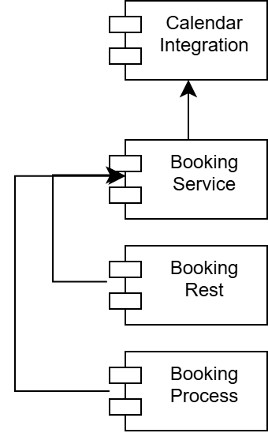

<h5>Figure 12: Component Model </h5>
 

- **Calendar Integration**:  Provides services for interacting with calendar platforms, such as Outlook.
- **Booking Service**: Provides core services, models, and functionality for Amplio Booking. Serves as the primary module upon which other modules depend.
- **Booking Rest**: Provides the rest controllers, tables functionality for the Amplio Booking.
- **Booking Process**: Provides process services such as Listener, Command, Context, and Validator to adapt Amplio Process. 

# Data model

## System Parameters

This section outlines the system parameters for managing appointment types in the booking system.
The Setup Appointment Types and Settings feature in the AMPLIO Booking system provides administrators with the tools necessary to configure
and control how the appointment booking system operates for both Consumers and Professionals. This feature makes it so that appointment rules
and settings align with how the business wants it to run.

_Note_: The columns: “changed”, “changed_by”, “created”, and “created_by” fields are not included for clarity, and the GUIDs have been simplified
for readability.

### Appointment_type

The appointment_type system parameter defines the rules and settings for various types of appointments in the booking system. These settings
control aspects such as the format of appointments, their duration, start time expressions, and other timing-related configurations.

#### Parameter_type

| Id         | Name             | allow_manual_keys | Draft_type |
| ---------- | ---------------- | ----------------- | ---------- |
| 123 (GUID) | appointment_type | Y                 | STANDARD   |

#### Parameter_attribute

The parameter_attribute table defines the attributes for the appointment_type system parameter.

Following fields: Editable (Y), hidden (N), truncate_ui_value (N), readonly (N) are all omitted, as they are same value
for all rows.

This section also includes Purpose and Restrictions / Relevant Information which describes each attribute for the
`appointment_type` system parameter.

| Id  | Name                            | Data Type           | Mandatory | Row Order | Parameter Type Id | Purpose                                                                                               | Restrictions / Relevant Information                                                                                    |
| --- | ------------------------------- | ------------------- | --------- | --------- | ----------------- | ----------------------------------------------------------------------------------------------------- | ---------------------------------------------------------------------------------------------------------------------- |
| 1   | `appointment_format`            | `AppointmentFormat` | Y         | 1         | 123               | Defines the format of the appointment, such as "Online" or "Phone".                                   | **Required**. Must be "Online" or "Phone". Cannot be left empty. It is an extendable ENUM.                             |
| 2   | `duration_minutes`              | `INTEGER`           | Y         | 2         | 123               | Specifies the duration of the appointment in minutes.                                                 | **Required**. Must be a positive integer greater than 0 (e.g., 15, 30, 60).                                            |
| 3   | `allowed_start_time_expression` | `TEXT`              | Y         | 3         | 123               | Defines a CRON expression for the allowed start times of appointments.                                | **Required**. Must follow valid [Spring CRON][SPRING.CRON] syntax.                                                     |
| 4   | `preparation_time_minutes`      | `INTEGER`           | Y         | 4         | 123               | Time in minutes required for preparation before the appointment.                                      | **Required**. Can be set to 0 minutes if no preparation is needed. Must be 0 or a positive integer.                    |
| 5   | `post_processing_time_minutes`  | `INTEGER`           | Y         | 5         | 123               | Time in minutes required after the appointment for post-processing tasks.                             | **Required**. Can be set to 0 minutes if no post-processing is needed. Must be 0 or a positive integer.                |
| 6   | `reminder_notification_minutes` | `INTEGER`           | N         | 6         | 123               | Specifies the number of minutes before the meeting to send the reminder.                              | **Optional**. Can be left empty and no reminder notification will be sent. If set it must be a positive integer.       |
| 7   | `max_booking_future_weeks`      | `INTEGER`           | Y         | 7         | 123               | Defines the maximum number of weeks into the future a Consumer can book an appointment.               | **Required**. Must be a positive integer greater than 0 (e.g., 4 weeks). Cannot be left empty.                         |
| 8   | `min_booking_lead_time_days`    | `INTEGER`           | Y         | 8         | 123               | Specifies the minimum number of days in advance from current date a Consumer can book an appointment. | **Required**. Must be 0 (Same day booking) or a positive integer (e.g., 1 for next-day booking). Cannot be left empty. |

#### Example of an Online Appointment Type

This section will present an example of what an Appointment Type could look like for an Online Appointment.

##### Parameter_instance

| Id         | parameter_key      | start_date | end_date   | parameter_type_id |
| ---------- | ------------------ | ---------- | ---------- | ----------------- |
| 456 (GUID) | online_appointment | 2024-01-01 | 9999-12-31 | 123               |

###### Parameter_value

| Id                                                | Value                                                                                            | Parameter_attribute_id              | Parameter_instance_id |
| ------------------------------------------------- | ------------------------------------------------------------------------------------------------ | ----------------------------------- | --------------------- |
| 7 (GUID)                                          | Online                                                                                           | 1 (`appointment_format`)            | 456                   |
| 8 (GUID)                                          | 60                                                                                               | 2 (`duration_minutes`)              | 456                   |
| 9 (GUID)                                          | 0 13-16 \* * 1,2   (*At minute 0 past every hour from 13 through 16 on Monday and Tuesday\*) | 3 (`start_time_expression`)         | 456                   |
| 10 (GUID)                                         | 15                                                                                               | 4 (`preparation_time_minutes`)      | 456                   |
| 11 (GUID)                                         | 10                                                                                               | 5 (`post_processing_time_minutes`)  | 456                   |
| 12 (GUID)   (`reminder_notification_minutes`) | NULL                                                                                             | 6 (`reminder_notification_minutes`) | 456                   |
| 13 (GUID)                                         | 4                                                                                                | 7 (`max_booking_future_weeks`)      | 456                   |
| 14 (GUID)                                         | 1                                                                                                | 8 (`min_booking_lead_time_days`)    | 456                   |

## Appointment Table

This model represents the individual Appointment. And will be stored in a database table of the same name.

| Field                    | Type               | Description                                                                                           |
| ------------------------ | ------------------ | ----------------------------------------------------------------------------------------------------- |
| `id`                     | String             | Unique identifier for the Appointment.                                                                |
| `external_id`            | String             | The id provided by the Graph API response.                                                            |
| `professional_id`        | String             | Unique ID of the Professional associated with the appointment.                                        |
| `consumer_id`            | String             | Unique ID of the Consumer associated with the appointment.                                            |
| `appointment_type`       | System Parameter   | The type of Appointment.                                                                              |
| `note`                   | String (500 chars) | Optional notes added by the Consumer or Professional.                                                 |
| `status`                 | AppointmentStatus  | The current status of the Appointment.   _Possible values_: Approved, Pending, Rejected, Canceled. |
| `online_meeting_url`     | String             | URL for joining the Teams meeting.                                                                    |
| `preparation_start_time` | LocalDateTime      | The time when the Professional is allocated to start preparing for the meeting.                       |
| `meeting_start_time`     | LocalDateTime      | The time when the meeting between the Consumer and the Professional starts.                           |
| `post_processing_time`   | LocalDateTime      | The time when the meeting ends and the post-processing for the Professional starts.                   |
| `end_time`               | LocalDateTime      | The time when the post-processing of the meeting ends.                                                |
| `created_at`             | LocalDateTime      | The timestamp when the booking was created.                                                           |
| `created_by`             | String             | The ID of the user (consumer or professional) who created the booking.                                |
| `updated_at`             | DateTime           | The timestamp when the booking was last updated.                                                      |
| `updated_by`             | String             | The ID of the user who last updated the booking.                                                      |
| `canceled_at`            | LocalDateTime      | The timestamp when the booking was canceled.                                                          |
| `canceled_by`            | String             | The ID of the user who canceled the booking.                                                          |

## AppointmentDto – DTO

Contains the fields of the Appointment table described above, but attributes are camel case instead of snake case. Also, the
professional will be present as a DTO instead of an ID.

## AppointmentStatus – Extendable Enum

ExtendableEnum with the following initial values:

| **Value** |
| --------- |
| Approved  |
| Pending   |
| Rejected  |
| Cancelled |

## AppointmentFormat – Extendable Enum

ExtendableEnum with the following initial values:

| Value  |
| ------ |
| Online |
| Phone  |

### TimeSlot DTO

| Field            | Type          | Description                                                      |
| ---------------- | ------------- | ---------------------------------------------------------------- |
| `startTime`      | LocalDateTime | The beginning of the slot                                        |
| `endTime`        | LocalDateTime | The end time of the slot                                         |
| `professionalId` | String        | The id of the Professional that has this time slot. Can be null. |

## CalendarEvent DTO

| Field                   | Type                 | Description                                                         |
| ----------------------- | -------------------- | ------------------------------------------------------------------- |
| `title`                 | String               | The title of the event                                              |
| `body`                  | String               | The HTML-body of the event                                          |
| `startTime`             | LocalDateTime        | The beginning of the slot                                           |
| `endTime`               | LocalDateTime        | The end time of the slot                                            |
| `externalUserId`        | String               | The id of the owner of this CalendarEvent. Can be null.             |
| `externalId`            | String               | The ID of the event in the Microsoft Graph API.                     |
| `recurrence`            | PatternedRecurrence  | The recurrence pattern and range for the event.                     |
| `extensions`            | List<EventExtension> | The custom information to be added to the event.                    |
| `isOnlineMeeting`       | Boolean              | Describes whether it is an online or offline meeting.               |
| `onlineMeetingProvider` | String               | The type of meeting. Should be filled when isOnlineMeeting is true. |

## PatternedRecurrence – DTO

A one to one copy of com.microsoft.graph.models.PatternedRecurrence.

## EventExtension DTO

| Field             | Type                | Description                                                              |
| ----------------- | ------------------- | ------------------------------------------------------------------------ |
| `extensionName`   | String              | A fully qualified package name matching the package using the extension. |
| `extensionFields` | Map<String, Object> | The fields that should be added to the CalendarEvent in question.        |

## BookableSlot – DTO

| Field              | Type                | Description                                                                                                                                        |
| ------------------ | ------------------- | -------------------------------------------------------------------------------------------------------------------------------------------------- |
| `startTime`        | LocalDateTime       | The start time of the Bookable Slot                                                                                                                |
| `endTime`          | LocalDateTime       | The end time of the Bookable Slot                                                                                                                  |
| `professional`     | Professional        | The professional that the Bookable Slot relates to.                                                                                                |
| `recurrence`       | PatternedRecurrence | A recurrence pattern describing how often and when the slot is planned for.                                                                        |
| `appointmentTypes` | List<String>        | A list of all the types of appointments that can be booked in the period. It is the keys of the system parameter, appointment_types, that is used. |

## Reference implementation

### Professional Table

This table holds information about the professionals in the reference application. See [ProfessionalService](#professionalservice).

| Field          | Type   | Description                                                                         |
| -------------- | ------ | ----------------------------------------------------------------------------------- |
| `id`           | String | Unique identifier for the professional                                              |
| `display_name` | String | The the way that the Professionals name should be displayed (e. g. first+last name) |
| `outlook_id	`   | String | The ID of the Professional in the Graph API.                                        |

#### Professional Capability Table

This table is used to assign Professionals to Appointment Types by entering the Professional_id and the Appointment Type. See [ProfessionalService](#professionalservice).

| Field              | Type                          | Description                                              |
| ------------------ | ----------------------------- | -------------------------------------------------------- |
| `professional_id`  | String                        | Unique identifier for the professional                   |
| `appointment_type` | String (System Parameter key) | The Appointment Type the professional is associated with |
