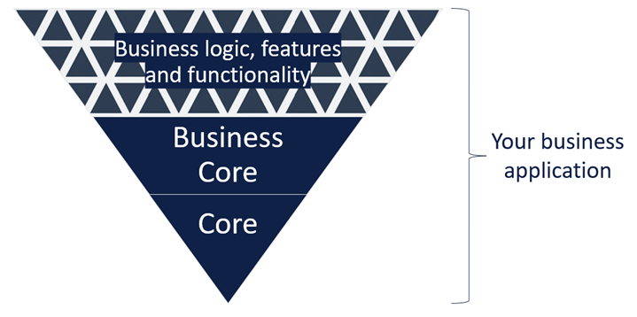
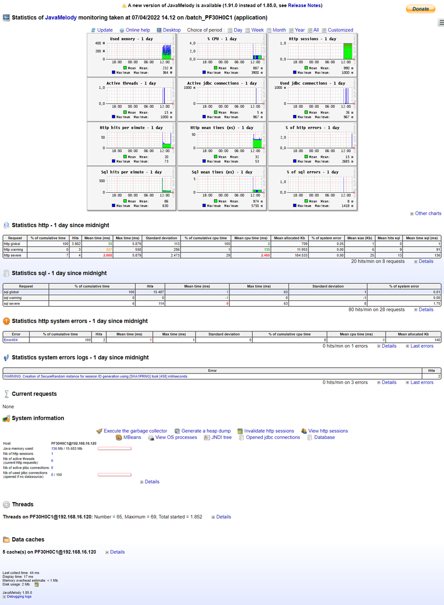
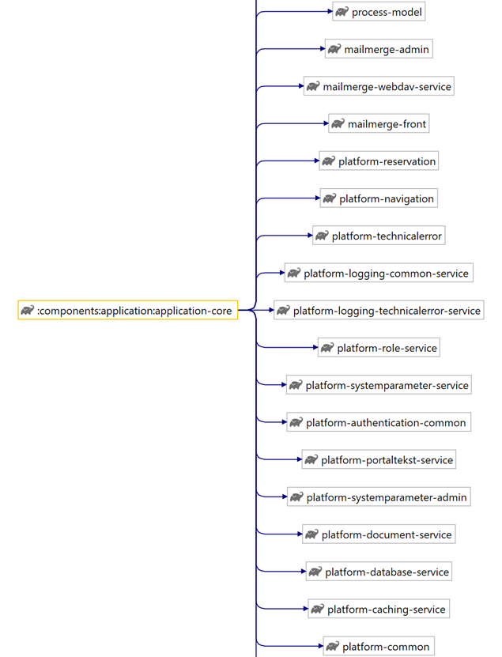
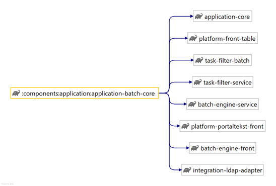
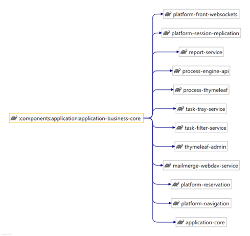
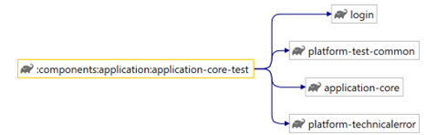

# References

| Reference                                                                                                                                                                                                                                                                                                                                                                                                                                                                                                                     | Title                    | Author | Version           |
|-------------------------------------------------------------------------------------------------------------------------------------------------------------------------------------------------------------------------------------------------------------------------------------------------------------------------------------------------------------------------------------------------------------------------------------------------------------------------------------------------------------------------------|--------------------------|--------|-------------------|
| [DD130 – Filters](/DD130-Detailed-Design/Filters)                                                                                                                                                                                                                                                                                                                                                                                                                                                                             | DD130 – Filters          | NC     |                   |
| [DD130 – Thymeleaf front](https://goto.netcompany.com/cases/GTE351/NCMCORE/_layouts/15/WopiFrame.aspx?sourcedoc=%7BC00F7128-3FB2-4C8A-8690-F5A665EE910C%7D&action=edit&source=https%3A%2F%2Fgoto%2Enetcompany%2Ecom%2Fcases%2FGTE351%2FNCMCORE%2FAmplio%2520Deliverables%2FForms%2FAll%2520items%2Easpx%3FRootFolder%3D%252Fcases%252FGTE351%252FNCMCORE%252FAmplio%2520Deliverables%252FAmplio%25202025%252FDD130%2520%252D%2520Detailed%2520Design%26View%3D%257B8634261D%252D1C0B%252D4DA4%252DB600%252D4E34E3873F76%257D) | DD130 – Thymeleaf Front  | NC     |                   |
| [DD130 – React](/DD130-Detailed-Design/React)                                                                                                                                                                                                                                                                                                                                                                                                                                                                                 | DD130 - React            | NC     |                   |
| [DD130 – System parameters](https://source.netcompany.com/tfs/Netcompany02/NF4J/_wiki/wikis/Documentation/5125/System-parameter)                                                                                                                                                                                                                                                                                                                                                                                              | DD130 – System Parameter | NC     |                   |
| [DD130 – Security]                                                                                                                                                                                                                                                                                                                                                                                                                                                                                                            | DD130 – Security         | NC     | (Not written yet) |
| [DD130 - Fileloader](https://source.netcompany.com/tfs/Netcompany02/NF4J/_wiki/wikis/Documentation/4877/Fileloader)                                                                                                                                                                                                                                                                                                                                                                                                           | DD130 - Fileloader       | NC     |                   | 
| [Spring Boot](https://spring.io/projects/spring-boot)                                                                                                                                                                                                                                                                                                                                                                                                                                                                         | Spring Boot              | Spring |                   | 

# Introduction

The application core is the default configuration and core setup of the applications. This means that a new project
won’t have to worry about basic boiler plate tasks such as importing default and basic functionality, navigation,
filters and security. The project applications will build on the core application, which is common to all projects
ensuring a standard basis and preventing that development strays too far apart between the different projects and
Amplio. Aside from creating unity between the projects, the application core also adds stability, as the core allows any
development in Amplio to be controlled and maintained in Amplio, bringing the new features to the projects with minimal
adjustments project side.

## Target audience

The document is intended for use by a Amplio developer maintaining the application core, extending the core in their own
project, or using the core to getting started with a new project.

## Purpose

The core component is the heart of Amplio based applications and should always be extended to ensure uniformity and
avoid unnecessary boiler plates.

This document will outline the configuration elements of the application core, and reference other documentation for the
functionality found in the core.

The document is not a complete guide on how to get a new project started, but merely a description of the application
core components.

## Background information

The component exists to provide projects with the core of the spring boot applications.

The application core component consists of minor core components core, batch-core, business-core and core-test. The core
is the basics of a boot application and is extended by both the batch-core and business-core allowing easier
implementation of batch and business applications respectively.

# High level description of the component

The application core has a core functionality allowing projects to accelerate their new applications with custom
properties while following the standard Amplio setup.

The application core consists of a core component, a batch component, a business component, and a test component.

The core provides the application with a base boot application taking advantage of spring boot to create a standalone
application, while providing an intuitive file hierarchy for system properties across applications, projects and
environments. The component also provides core configurations including configuration files for basic Amplio
functionality.

The business core extends the application core and sets up the basic boot application for business applications
providing start up services to include system parameter resources, business application specific configurations, user
contexts and more. Your business application will be built on top of the business core by defining your own system
properties using the file structure provided by the core, and by adding other Amplio and project specific features and
functionality, as illustrated in Figure 1.


<div style="text-align: center;">



<h5>Figure 1: Your business application built using the Application Core component.</h5>
<br>
</div>

The batch core similarly provides a boot application for batch applications including default tabs, user context
filters, basic user interfaces and more.

# Introduction to the subject

The application core component consists of minor core components core, batch-core, business-core and core-test.

The core is the basics of a boot application and is extended by both the batch-core and business-core allowing the
implementation of batch and business applications respectively.

The different cores introduce various elements to the application as outlined by the various cores’ chapters. Each
section exists to outline which functionality comes with the core component, but the actual functionality is often
thoroughly documented elsewhere. In these cases, the section will usually be short with a reference to further Amplio
documentation on the area.

The application core builds on a series of third-party technologies listed in the below subsections.

## Spring boot

Amplio based projects are built using the Spring Framework, which provides a comprehensive programming and configuration
model for modern Java-based enterprise applications. The spring boot technology is used for the applications as it
allows us to build standalone spring applications.

The application core builds on the spring boot technology to ensure that the Amplio based projects have streamlined
applications with our standard configurations and similar. This is done by expanding the BaseBootApplication as
explained in sections [Base boot application and property files](/DD130-Detailed-Design/Application-core#Base-boot-application-and-property-files)
and [business base boot application and configuration files](/DD130-Detailed-Design/Application-core#business-base-boot-application-and-configuration-files).

You can read more about spring boot [here](https://spring.io/projects/spring-boot).

## JavaMelody

JavaMelody is a monitoring tool used by all the Amplio projects to monitor the servers running the applications. You can
read more about the technology in section [Java melody](/DD130-Detailed-Design/Application-core#Java-melody).

# Application Core

To make effective use of the base functionality in the application core, the batch application should be built extending
BatchBaseBootApplication, and the business app should be built by extending a BusinessBaseBootApplication (
ThymeleafBusinessBaseBootApplication or ReactBusinessBaseBootApplication). More information about the business base boot
applications can be found in
section [business base boot application and configuration files](/DD130-Detailed-Design/Application-core#business-base-boot-application-and-configuration-files).

BaseBootApplication has no mandatory functions to override, however, the root-application-class-property must be defined
in application.properties as explained in
section [Base boot application and property files](/DD130-Detailed-Design/Application-core#Base-boot-application-and-property-files).

## Base boot application and property files

The base boot application (BaseBootApplication) is the basic extension of springs own boot initializer (
SpringBootServletInitializer) and should be extended by all projects’ applications to inherit Amplio’s default
functionality. The initializer is what allows us to deploy and run our spring applications. The major motivation for a
project to use the core extension, BaseBootApplication, is that it allows Amplio to configure the application centrally.
This is achieved by inserting a layer between Springs application builder and the project’s main application. In this
extra layer Amplio controls which properties are loaded to the application and in which order – although it still allows
for project specific properties and overriding Amplio’s choices , so it is still a good place to add additional beans
and configuration files needed for the application type across all environments.

Amplio’s functionality to load properties through the core allows a common setup across projects for loading system
properties, configurable at various levels. Part of the code for this can be seen in Figure 2. The main method used in
the code snippet is PropertiesUtil.loadSystemProperties(path, failHard), which uses the path to find the resource file,
turns it into a stream and then loops through it setting key-value pairs in the system’s properties. The PropertiesUtil
stores all the properties loaded as a hashMap, so any duplicate properties are overridden.

```java
// Load system properties code snippet
public static void loadDefaultSystemProperties() {
    PropertiesUtil.loadSystemProperties("/configs/foundation-system.properties", true);
    PropertiesUtil.loadSystemProperties("/configs/platform-system.properties", false);
    PropertiesUtil.loadSystemProperties("/configs/project-system.properties", false);
    PropertiesUtil.loadSystemProperties("/application.properties", true);
    PropertiesUtil.loadEnvironmentSpecificProperties();
}
```

The core’s code shown above is used to locate and load properties from four different files in the following
order:

1. **Foundation properties** - These are the default properties, defined in the Foundation code and therefore common to
   most projects. The file is the first one to be loaded and its properties can therefore be overridden by any of the
   below files.
2. **Amplio properties** – These are the default properties, defined in the Amplio code and therefore common to all
   Amplio-projects. The file is the second one to be loaded and its properties can therefore be overridden by any of the
   below files.
3. **Project properties** – It is recommended, but not necessary, for you to set up a common
   `/configs/project-system.properties` file to store system properties common to all the project’s applications. This
   file could contain properties such as `projectPackagePrefix`, JavaMelody configurations, JNDI properties,
   lazy-initialization etc.
4. **Application properties** – There should be a file for each of the project’s applications, defining all the default
   properties for the individual applications. These files could contain properties such as application name and
   properties in charge of enabling or disabling the process engine.
5. **Environment properties** – These property files are the final files loaded by the core and therefore override any
   of the above. Each environment file is used only by one application on one environment and are therefore the most
   specific of the property files.

The above property loading order therefore allows the following example. A property is originally set in Amplio and
redefined again both overall for the project and for the specific application. Even though the property has been defined
with three different values, only the application specific value will be used, since it was defined last. This allows
Amplio to define default property values, which are easily overwritten by the project.

The last of the properties that are loaded by the core are the environment specific ones. Contrary to the first three
files and their logic explained above, the environment properties are loaded via the method
`PropertiesUtil.loadEnvironmentSpecificProperties()`. This function works in the same way as `loadSystemProperties`, but
it doesn’t take a path variable. Instead, it uses the regex: `/**/configs/environment/%s/*.properties`, where `%s` is
replaced with the environment profile, to find all relevant property files to load.

For the configuration to work as intended you must define the property `my.business.root-application-class` in the
relevant `application.properties` files for applications extending `BusinessBaseBootApplication` and define
`my.batch.root-application-class` for applications extending `BatchBaseBootApplication`.

###	Example: application.properties

Add `src/main/resources/application.properties` to your application module.
The file should contain basic spring properties such as server and application name as seen in Error! **Reference source
not found**. for MY business thymeleaf app. Further to extend the business core the application is built using
BusinessBaseBootApplication and therefore has the necessary property my.business.root-application-class defined in the
properties file. If the application is a batch application, then it should be built extending the
BatchBaseBootApplication and the necessary my.batch.root-application-class property should be defined instead.

```
// Application properties from MY reference business app
server.port=1337
server.servlet.context-path=/fagsystem
spring.application.name=FAGSYSTEM
my.business.root-application-class=nc.modulus.ydelse.reference.business.thymeleaf.config.ThymeleafBusinessApplication
```

## Roles and rights

There are no roles and rights authorizing use of the core application components, but some of the component does include
other functionality which does have associated rights. For specific information on Roles and rights in business-core,
see section [Navigation and Roles](/DD130-Detailed-Design/Application-core#Navigation-and-Roles).

JavaMelody should only be accessible with the security role SR_MONITORING, although this should be configured in your
application’s implementation of CommonSpringWebSecurityConfig. For more on JavaMelody, see
section [Java melody](/DD130-Detailed-Design/Application-core#Java-melody).

## Core configuration

The CoreConfig file is automatically loaded by all applications extending BusinessBaseBootApplication or
BatchBaseBootApplication but should also manually be loaded by other project applications – such as the self-service.
This allows the use of basic functionality like cache, the database, startup services, system parameters, portal texts,
etc. The config file also has a larger set of annotations for various spring logic to work.

The configuration file uses common-jpa.properties as a property source allowing environment properties to be grabbed
from the file.

## Java melody

Also included via the core is Java Melody. Java melody is a third-party plugin allowing us to monitor our spring-boot
application via the URL extension /monitoring. Through the core configuration, the configuration and necessary beans for
java melody is added to the applications. The plugin is described by the providers as follows:

“The goal of JavaMelody is to monitor Java or Java EE application servers in QA and production environments.

It is not a tool to simulate requests from users, it is a tool to measure and calculate statistics on real operation of
an application depending on the usage of the application by users. JavaMelody is based on statistics of requests and on
evolution charts.

It allows to improve applications in QA and production and helps to:

- give facts about the average response times and number of executions
- make decisions when trends are bad, before problems become too serious
- optimize based on the more limiting response times
- find the root causes of response times
- verify the real improvement after optimizations”

You can read their full user guide [here](https://github.com/javamelody/javamelody/wiki/UserGuide).

When accessing the JavaMelody UI you leave the normal interface of the application and get access to a page with
statistics, cache information, thread usage and much more. A screenshot of the page from the Amplio batch reference app
can be seen in Figure 3.

The interface has many uses, below is listed some examples

- The first headline allows the user to identify the current server they are on
- A set of graphs (directly below first headline) shows live measurements of things such as CPU, memory, response times
  and errors allowing a quick way to identify any changes in pattern for the server.
- “Statistics sql” gives an overview of the queries having taken most time on the server.
- “Current requests” shows the current requests at the time of accessing the endpoint. It also shows the elapsed time
  and mean time for the query making it easier to spot troublesome requests. This also allows the user to kill any
  requests, this is particularly useful for stuck requests.
- Viewing more details for “Data caches” shows a list of the cache buckets on the server and allows the user to clear
  caches – this clears the cache for the entire server rather than the individual user.

<div style="text-align: center;">



<h5>Figure 4: JavaMelody user interface on Amplio reference batch application</h5>
<br>
</div>

## Authentication Context and Webdav

The business core comes with default Amplio authentication context objects for logging and a service for defining the
user context for the session. The service translates context data into a context, and contexts into log contexts that
can be saved in the database (as serialized JSON strings). The different types of contexts contain things such as
username, assigned security roles, and language choices.

The user context is logged in the table `AUTHENTICATED_SESSION_LOG` upon login of the user and deleted again upon
logout (or during nightly cleanups if the user never logs out).

The WebDAV filters use the database context object to correctly set the context when manually editing letters in the
mail merge.

# Application Business core

For business applications, your `build.gradle` file should have a dependency on `application-business-core`, which will
automatically include a dependency on `application-core`, see
section [Application Core](/DD130-Detailed-Design/Application-core#Application-Core). This is not necessary if either Thymeleaf or
React Business core are imported, see sections [Business Core](/DD130-Detailed-Design/Application-core#Business-Core)
and [Business Core](/DD130-Detailed-Design/Application-core#Business-Core) respectively.

## Business Base Boot Application and Configuration Files

The `BusinessBaseBootApplication` extends the base boot application class explained in
section [Base boot application and property files](/DD130-Detailed-Design/Application-core#Base-boot-application-and-property-files). The extension is
intended for the business application (fagsystem) and imports business core configuration and sets up the application
builder. The imported configuration file is `BusinessCoreConfig`, which includes the core configuration (see section
[Core configuration](/DD130-Detailed-Design/Application-core#Core-configuration)) and business functionality such as merging
documents (mail merge), configuration for the front, handling
unauthorized access attempts, process engine, administration tools, etc.

With the above comes the configuration used for the business app context filter. The configuration adds the strategy
factory and sets the relevant properties for the filter. The default values for the filter are found in the two files
`FagsystemContextFilterProperties` and `FagsystemAccessFilterProperties` but may be overridden in the project's own
property files.

You can read much more about the context filter and its belonging strategy factory and properties file
in [DD130 – Filters](/DD130-Detailed-Design/Filters) section “FagsystemContextFilter”. You can also read about the
configuration file
`FagsystemFrontFilterConfig` in the same document,
section [Configurations and service extensions](/DD130-Detailed-Design/Application-core#Configurations-and-Service-Extensions).

## Navigation and Roles

The application business core comes with a default implementation of the navigation functionality. The functionality and
associated service are based on the specific navigation functionality provided by and required of the process engine.
The service is adjusted for the business application and provides the functionality to open entities (with open tasks),
and it handles the opening/closing of those entities along with the caching of relevant navigation portal texts. You can
read more about the navigation functionality
in [DD130 – Thymeleaf front](https://goto.netcompany.com/_layouts/15/CaseApp/Case/JumpTo.aspx?ID=7048499)
and [DD130 – React](/DD130-Detailed-Design/React).

The security roles `SR_FAG_READ` and `SR_FAG_WRITE` are also introduced with the business core. The two security roles
control access to basic functionality in the application, and the application is useless for users without these access
rights.

All default tabs added with `AdminSubMenu` as part of `BusinessBaseBootApplication` require individual admin rights that
will not be listed here but can be viewed in `(…)/businesscore/customization/navigation/AdminSubMenu.java` and
`(…)/businesscore/security/BusinessSystemparameterSecurityMap.java`. Similarly, default tabs are added to the batch
application via the `BatchBaseBootApplication` as listed in `(…)/batchcore/navigation/BatchTopMenu.java`.

## Startup

The business-core comes with the service `BusinessStartupService` used to initialize the business application upon
startup.

Using the `@Lazy(false)` and `@PostConstruct` annotations, the service functionality will always run on startup when
deploying the application. The service uses the file loader to load system parameters linked to other files. This
includes rulesheets and various letter templates and attachments. To read more about the file loader, please see NF4J
document on the
topic [DD130 - Fileloader](https://source.netcompany.com/tfs/Netcompany02/NF4J/_wiki/wikis/Documentation/4877/Fileloader).

This code is necessary to make files accessible in the application via system parameters.

### Startup Service Configurations

The default implementation of the startup service is enabled/disabled via the property:
`my.business.startup_fileload_disabled`.

The property defaults to false, meaning that the startup service will run if you do not disable it.

### Default Startup Behaviour

If the startup service is enabled, then it will run `loadUpdatedSystemparameterFiles`. At the time of writing, the
startup service loads all system parameter instances in the codebase of the below-listed types, although this is subject
to change as Amplio grows in complexity.

- Rule sheets: `REGLER`
- Letter templates: `messagetemplate` (BESKEDSKABELON), `content template` (INDHOLDSSKABELON), `master template` (
  MASTER_TEMPLATE), `attachments` (VEDHAEFTNING), `merge fields` (FLETTETEKST), `merge questions` (FLETTESPOERGSMAAL)
  and `content elements` (INDHOLDSELEMENT).

The startup service loads the system parameters using `forceReload = false`, meaning that the system parameters on the
environment are only overridden by those in the codebase if the parameter does not already exist or if the codebase
parameter was edited more recently than the already existing parameter.

### Customization of the Startup Service

You can override the general functionality of the startup service by overriding the `init()` function if your
application is required to run anything else upon startup. If you simply wish to change which parameters are loaded upon
startup, then you can override the `loadUpdatedSystemparameterFiles()` function. This way you can choose a different set
of parameter types and resources to be loaded. You may also wish to change the `forceReload` option to true for some
environments.

### Fileloader Implementation

As you can read
in [DD130 - Fileloader](https://source.netcompany.com/tfs/Netcompany02/NF4J/_wiki/wikis/Documentation/4877/Fileloader),
section “FileLoaderStrategy”, the fileloader
requires implementation of fileloader strategy to allow loading of system parameters and their related binary files.
Amplio comes with three default implementations as described in the following subsections.

#### RuleFileLoaderStrategy

- **Used for system parameter types**: Rule sheet (`REGLER`)
- **System parameter attribute name**: "dokument"
- **Object(s) persisted**: An object of class `Regelark` is persisted. Any related attributes of type `Regelegenskab`,
  rulesheet conclusions of type `Konklusion`, and conditions of type `Regelcelle` are also persisted.

#### AttachmentFileLoaderStrategy

- **Used for system parameter types**: Attachments (`VEDHAEFTNING`)
- **System parameter attribute name**: "fil"
- **Object(s) persisted**: `Dokumentvariant` or project’s own implementation of `AbstractDocumentVariant`

#### TemplateFileLoaderStrategy

- **Used for system parameter types**: Messagetemplate (`BESKEDSKABELON`), content template (`INDHOLDSSKABELON`), and
  master template (`MASTER_TEMPLATE`).
- **System parameter attribute name**: "dokument"
- **Object(s) persisted**: Two objects implementing `AbstractDocumentVariant` are persisted. One variant contains the
  template as plain text mimetype and the other variant contains the template as office mimetype.

## Security

The business core comes with a set of security roles used for the various admin tabs and extracted system parameter
tabs. These roles can be found in `BusinessSecurityRole` and `BusinessSystemparameterSecurityMap` respectively. You can
read more about security and security roles in [DD130 – Security](/DD130-Detailed-Design/Security).

# Application – React

Application React contains core modules only related to React backend implementation. It is therefore only used by
projects using React. In this part of the project, there is an implementation that is not shareable with
Thymeleaf/common solutions.

## Business Core

For React business applications, your `build.gradle` file should have a dependency on `application-react-business-core`,
which will automatically include a dependency on `application-business-core`, see
section [Application–Business core](/DD130-Detailed-Design/Application-core#Application–Business-core).

### Overview

This part of Amplio contains the base implementation for the entity Overview page. It contains
`EntityOverviewController` that exposes endpoints that provide data needed for the page to display the page.

#### Tasks

##### Controller

The controller exposes a GET mapping endpoint which in the URL should contain information about `EntityType` and entity
ID.

```java
@GetMapping(path = "{entityType}/{entityId}/tasks")
public ResponseEntity<TableResponse<Item>> tasks(
        @PathVariable String entityId,
        @PathVariable String entityType) {

    // . . .
}
```

Controller loads entity and if it is present, it will generate task table with use of EntityTaskOverviewService. In case
entity is not found it will return Bad Request response with message that entity couldn`t be found.

#####	EntityTaskOverviewServiceImpl

Service implements EntityTaskOverviewService interface which defines single method:

```java
TableResource<Item> generateTasksTableResource(MyEntity person);
```

TableResource will be automatically generated (generateTableData method) based on provided column definition, which is
delivered by protected getColumnsDefinition method.

```java
protected Map<Column, Function<ProcessOpgave, Object>> getColumnsDefinition() {
    LinkedHashMap<Column, Function<ProcessOpgave, Object>> columnsDefinition = new LinkedHashMap<>();

    columnsDefinition.put(
            Column.column("id", ColumnType.TEXT, false, false, false),
            AbstractOpgave::getOpgaveTitleTextKey
    );
    columnsDefinition.put(
            Column.column("haendelseId", ColumnType.TEXT, false, false, false),
            opgave -> opgave.getHaendelse().getId()
    );

    /// . . .
}
```

Method needs to return Map of Column, and Function providing data. Function as an argument gets ProcessOpgave object. As
method is protected then it might be used by the projects for adjustments.

# Application Thymeleaf

Application Thymeleaf contains core modules only related to Thymeleaf backend implementation. It is therefore only used
by projects using Thymeleaf. In this part of the project, there is an implementation that is not shareable with
React/common solutions.

## Business Core

For Thymeleaf business applications, your `build.gradle` file should have a dependency on
`application-thymeleaf-business-core`, which will automatically include a dependency on `application-business-core`, see
section [Application–Business core](/DD130-Detailed-Design/Application-core#Application–Business-core).

### Overview

This part of Amplio contains the base implementation for the entity Overview page. It contains an abstract
`EntityOverviewController` that exposes endpoints that provide data needed for the page to display the page. The
controller needs to be extended in the project implementation.

#### Tasks

####	Controller

Controller exposes POST mapping endpoint which.

```java
@ResponseBody
@PostMapping(path = "/async/ubehandledeOpgaverTable/page")
public String ubehandledeOpgaver(HttpServletRequest req, HttpServletResponse res, Model model) {
    /// . . .
}
```

From provided model it loads entity base on which tasks table will be generated with use of EntityTaskOverviewService.

#####	EntityTaskOverviewServiceImpl

Service implements EntityTaskOverviewService interface which defines single method:

```java
Table getEntityTasksTable(MyEntity myEntity, String opgaveId);
```

Table object will be generated based on 2 methods:

- getTasksColumns- returns List of all columns definition to be displayed. Each colums consist of column name and Column
  type

```java
protected List<Column> getTasksColumns(boolean showFejlDatoColumn) {
    List<Column> columns = new ArrayList<>();
    columns.add(new Column("ubehandledeopgaver.titel", ColumnType.TEXTKEY_ABSOLUTE, true, false));
    columns.add(new Column("status", ColumnType.TEXTKEY_ABSOLUTE));

    // . . .
}
```

- getTaskRowData – returns list of all row data to be displayed. Each row is generated based on provided ProcessOpgave
  object. Note that row must contain data for all columns defined by getTasksColumns.

```java
protected void getTaskRowData(ProcessOpgave opgave, Row.RowBuilder tablerow, boolean showFejlDatoColumn) {
    tablerow.append("ubehandledeopgaver.titel", opgave.getOpgaveTitleTextKey());
    tablerow.append("status", opgave.getStatusTextKey());

    // . . .
}
```

As methods are protected then they might be used by the projects for adjustments.

# Application – Core-test

## Mocked MVC

For unit testing the Spring applications without starting up a server, the `MockMvc` is used. It provides support for
Spring MVC testing by encapsulating the web application beans and making them available for testing. Using the test
core, the `MyMockMvcProvider` and `MockedMvcSmokeTestHelper` become available, helping with basic testing functionality.

# Configurations and Service Extensions

This section defines how to set up the component and what component requirements come along.

## Migration Information

For migrating to the use of the application core, you should ensure that your applications extend the base boot
applications and that your `.properties` files and their content make use of the provided hierarchy.

The code integration of the base boot applications can be seen in
section [Core configuration](/DD130-Detailed-Design/Application-core#Core-configuration), and more information on the boot classes
can be found in sections [Base boot application and property files](/DD130-Detailed-Design/Application-core#Base-boot-application-and-property-files)
and [Business base boot application and configuration files](/DD130-Detailed-Design/Application-core#Business-base-boot-application-and-configuration-files).

Information on the suggested property files and dependencies can be seen in the following subsections.

You can see how PE migrated to using the component by consulting the PRs in
section [PE](/DD130-Detailed-Design/Application-core#PE).

#	Component model

The application core consists of four different “sub cores”. They are listed below with their closest dependencies.

## Core

<div style="text-align: center;">



<h5>Figure 5: Dependency diagram of the Application Core</h5>
<br>
</div>

## Batch Core

<div style="text-align: center;">



<h5>Figure 6: Dependency diagram of the Application Batch Core</h5>
<br>
</div>

## Business Core

<div style="text-align: center;">



<h5>Figure 7: Dependency diagram of the Application Business Core</h5>
<br>
</div>

## Core Test

<div style="text-align: center;">



<h5>Figure 8: Dependency diagram of the Application Test Core</h5>
<br>
</div>

# FAQ

If your project implements any core component and found any troubleshooting tips, or questions that you have answered
during implementation, then please add them here.

## How do I set up a new Spring Boot application using the core?

For business apps, your `build.gradle` file should have a dependency on `application-business-core`, which will
automatically include a dependency on `application-core`. For more specific uses, `application-thymeleaf-business-core`
or `application-react-business-core` might be more apt.

For batch apps, your `build.gradle` file should have dependencies on `application-thymeleaf-batch-core`, which will
automatically include a dependency on `application-core`.

If your application is a business application, then extend the `BusinessBaseBootApplication` and set up a matching
`application.properties` file. For a batch application, extend `BatchBaseBootApplication` instead. For more on the
suggested `.properties` file structure, see [DD130 – Filters](/DD130-Detailed-Design/Filters) , section “Configurations
and service extensions”.

## How do I migrate from an older version to using the application core?

See section [Migration information](/DD130-Detailed-Design/Application-core#Migration-information).

## How do I customize my applications?

Depending on the reach of the customization, you can define system properties in `project-system.properties` to affect
all applications in your project, `application.properties` to only affect the associated application, or use
environment-specific files. For more, see
section [Base boot application and property files](/DD130-Detailed-Design/Application-core#Base-boot-application-and-property-files).

## Should my property be added to `filters.properties` or `application.properties`?

Functionally it doesn’t matter, they’re probably both configured to supply properties to the specific application
regardless of environment. The main difference is that `application.properties` is automatically picked up and loaded
via Spring Boot, but `filter.properties` is set in each application type’s configuration file as a `@PropertySource`.
The reader should therefore consider where the property makes more sense in their case.

## How do I configure my application to use different properties on different environments?

If you have any properties that should be overridden by certain environments, or only need defining on certain
environments, then simply add a properties file in the respective classpath following these rules:

- The folder structure must be `(…)/configs/environment/[your environment name]/` where `[your environment name]` should
  be replaced by the environment’s active profile, e.g., “test” or “local”.
- The file must be placed in the above folder and end with `.properties`.

The properties will then be loaded when your application starts up as part of the configuration of the application – if
the application extends the core base boot application. The environment-specific file will be loaded last (out of the
four different file types that come with the base application) so any properties in these files will override anything
in the previous properties files. Note that these files are application-specific because of their classpath placement.

For more information on this functionality, see
section [Base boot application and property files](/DD130-Detailed-Design/Application-core#Base-boot-application-and-property-files).

## How have other projects implemented the core applications?

Please add PRs implementing the component to your project here.

### PE

- Business app changed to extend the `BusinessBaseBootApplication` as part of Amplio
  bump: [PR](https://source.netcompany.com/tfs/Netcompany/ATPE0004/_git/ATPE0004/pullrequest/154384?_a=files&path=%2Fgradle-projekter%2Fwebapps%2Ffagsystem-boot%2Fsrc%2Fmain%2Fjava%2Fatp%2Fpe%2Ffagsystem%2Fconfig%2FFagsystemBootApplication.java)
- Batch app changed to extend the `BatchBaseBootApplication`
  here: [PR](https://source.netcompany.com/tfs/Netcompany/ATPE0004/_git/ATPE0004/pullrequest/157420)
- Using `.properties` hierarchy for loading system
  parameters: [PR](https://source.netcompany.com/tfs/Netcompany/ATPE0004/_git/ATPE0004/pullrequest/172919), [MY WI](https://source.netcompany.com/tfs/Netcompany/NCMCORE/_workitems/edit/125033/)
- Refactor of system properties to make better use of core
  application: [PR](https://source.netcompany.com/tfs/Netcompany/ATPE0004/_git/ATPE0004/pullrequest/222277)


