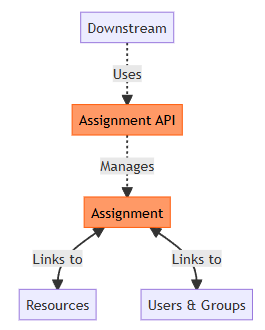

# Introduction

This document describes the Assignment framework which allows users, coordinators or administrators in Amplio systems to assign resources to users, user groups,
teams or similar structures depending on their business needs.

The framework supports assignment both as part of a more dynamic approach to access control and permissions for reading and modifying resources as well as
assignment of resources to users or user groups as part of organizational features, e.g. workload distribution.

##	Target audience

This document is intended for:

- Developers who need to understand the Assignment framework and type definitions that make up the framework.
- Developers who need a reference for implementing a feature based on the Assignment framework.
- Tender-writers who need information about the Assignment framework.
- Projects intending to use or designing features using the Assignment framework.


##	Developer requirements

Developers reading this document should have:

1. General understanding of Spring beans and Java.


## Background information

The Assignment framework allows more granular access control than the default role based access control that is the core of Amplio authentication and
authorization systems. It is not intended to replace other forms for access control in the system, but instead be an additional method to secure resources that
works in combination with, or on top of, the core. It can also be used by features that are part of organization of specific items such as tasks, documents,
entities, by attributing these items to a specific user or user group. E.g. as part of a workload distribution feature.

# High level description of the component


<!-- MERMAID SOURCE FILE -->
<!-- ./.attachments/Assignment/mermaid-source-files/high-level-description.md -->

As shown in the diagram, the Assignment framework links resources to users and groups through a central Assignment entity. The Assignment API provides the
interface and contracts for creating and modifying these assignments with the implementation specified in the downstream implementation.

# Introduction to the subject

## Assignment terminology

This section introduces the main concepts, terminology and components used in this document.

1. **Assignable** - An Assignable is any object that implements the `Assignable` interface defined in the Assignment framework.
2. **Assignee** - The owning entity of an assignment.
3. **Assigner** - The initiator of an assignment.
3. **Assignment** - The Assignment is an object that describes the relationship between a resource, the Assignable, and the holder of the assignment, the
   Assignee. It further includes information about the start of the assignment and potentially the entity initiating the assignment. The assigment objects need
   to implement the `Assignment` interface.

## Assignment overview

The Assignment framework is a framework that defines functionality and contracts for dynamic access control and permissions to read or modify resources in the
system. This access control is centered around temporary ownership of resources by assigning the resource to a team, group, individual user or similar
structures.

Users that are part of the entity that owns the resource is said to hold the assignment. The resource is referred to as the assigned resource, the
holder of the assignment as the assignee, and the entity that created the assignment as the assigner.

### Core responsibilities

1. **Assignment lifecycle handling** - Create, Update and Delete Assignments.
2. **Assignment-based Access control** - Control of access and permissions to read or modify Assignables.
3. **Display of Assignments** - Framework for updating Assignments through REST APIs.

### Technical overview

The following modules are part of the Process Assignment feature.

1. **assignment-rest** - Defines types and services for updating Assignments through REST APIs.
2. **assignment-service** - Core module that defines the contracts for access, authorization and life cycle management of Assignments.

# API

The Assignment API as a framework consists only of interfaces for types and services with the downstream implementations defining the behavior. These services
and types are split in two modules based on their usage with the core features residing in the assignment-service module and the REST related features residing
in the assignment-rest module. In this chapter we will cover these modules in order and in more detail.

## Service

The service functionality is the core of Assignment framework.

### AssignmentService

<div style="border-left: 4px solid dodgerblue; background-color: rgba(30, 144, 255, 0.1); padding: 10px; margin-bottom: 10px;">
  <strong>Mandatory</strong>
</div>

The `AssignmentService` is the core service in the Assignment API and defines the contract for creating, updating and deleting assignments. The interface is very
flexible and all logic is left to the downstream implementation.

<div style="border-left: 4px solid darkorange; background-color: rgba(255, 140, 0, 0.1); padding: 10px; margin-bottom: 10px;">
    <strong>Important:</strong> 

Note that deletion of assignments should typically only be done if the resource itself is being deleted. Deleting assignments for other reasons is not
recommended.
</div>

For an explanation of each method and its intended usage see the provided interface definition and JavaDoc here or in
the [code](https://source.netcompany.com/tfs/Netcompany/NCMCORE/_git/NCMCORE?path=/src/libraries/assignment/service/src/main/java/nc/amplio/libraries/assignment/service/api/AssignmentService.java).

```java
/**
 * Service interface for managing assignments of Assignable resources.
 * <p>
 * This interface provides methods to create, modify, and delete assignments
 * for Assignable resources using command objects to specify the assignment details.
 *
 * @param <TAssignable> The type of Assignable resource this service handles
 * @param <TCommand>    The type of command used to specify assignment operations
 */
public interface AssignmentService<TAssignable extends Assignable<?>, TCommand extends AssignmentCommand> {

    /**
     * Initializes the assignment for a newly created Assignable resource.
     * <p>
     * This typically creates an initial assignment, often assigning it to the creator of the resource.
     *
     * @param assignable The Assignable resource to initialize the Assignment for
     */
    void initializeAssignment(TAssignable assignable);

    /**
     * Assigns the Assignable resource according to the provided command.
     * <p>
     * This typically terminates any existing assignment and creates a new one.
     *
     * @param assignable The Assignable resource to assign
     * @param command    The command containing assignment details
     */
    void assign(TAssignable assignable, TCommand command);

    /**
     * Deletes all assignments associated with the Assignable resource.
     *
     * @param assignable The Assignable resource whose assignments should be deleted
     */
    void deleteAssignments(TAssignable assignable);
}
```

### AssignmentAuthorizationService

<div style="border-left: 4px solid dodgerblue; background-color: rgba(30, 144, 255, 0.1); padding: 10px; margin-bottom: 10px;">
  <strong>Mandatory</strong>
</div>

The `AssignmentAuthorizationService` is the part of Assignment API that concerns access and permission checks for Assignable resources. It is intended to be used
with a combination of role based and attribute based checks.

Most commonly the implementation will check that the user has the right roles when creating assignments and holds a currently valid Assignment for being able to
modify the Assignable.

For an explanation of each method and its intended usage see the provided interface definition and JavaDoc here or in
the [code](https://source.netcompany.com/tfs/Netcompany/NCMCORE/_git/NCMCORE?path=/src/libraries/assignment/service/src/main/java/nc/amplio/libraries/assignment/service/api/AssignmentAuthorizationService.java).

```java
/**
 * Service interface for authorization checks related to assignments.
 * <p>
 * This interface provides methods to determine if the current user has
 * various types of access to an Assignable resource based on assignment
 * relationships and security roles.
 *
 * @param <TAssignable> The type of Assignable resource this service handles
 */
public interface AssignmentAuthorizationService<TAssignable extends Assignable<?>> {

    /**
     * Checks if the current user has permission to assign the Assignable resource.
     *
     * @param assignable The Assignable resource to check
     * @return {@code true} if the user has assignment permission, {@code false} otherwise
     */
    boolean hasAssignableAssignAccess(TAssignable assignable);

    /**
     * Checks if the current user has permission to read the Assignable resource.
     *
     * @param assignable The Assignable resource to check
     * @return {@code true} if the user has read permission, {@code false} otherwise
     */
    boolean hasAssignableReadAccess(TAssignable assignable);

    /**
     * Checks if the current user has permission to modify the Assignable resource.
     * <p>
     * This typically checks if the user is the current holder of the assignment,
     * is part of the group that holds the assignment or has special permissions.
     *
     * @param assignable The Assignable resource to check
     * @return {@code true} if the user has write permission, {@code false} otherwise
     */
    boolean hasAssignableWriteAccess(TAssignable assignable);
}
```

### Types

The types uses in the Assignment framework are simple interfaces that are required by the services. The actual logic is left to the downstream
implementation.

For an explanation of each type please see the provided JavaDoc here or in
the [code](https://source.netcompany.com/tfs/Netcompany/NCMCORE/_git/NCMCORE?path=/src/libraries/assignment/service/src/main/java/nc/amplio/libraries/assignment/service/model)

#### Assignable

<div style="border-left: 4px solid dodgerblue; background-color: rgba(30, 144, 255, 0.1); padding: 10px; margin-bottom: 10px;">
  <strong>Mandatory</strong>
</div>

```java
/**
 * An interface representing a resource that can be assigned to an entity.
 * The generic type T ensures that the implementing class is used as the type parameter.
 * <p>
 * This interface provides methods to retrieve current and historical assignments
 * associated with the implementing object.
 *
 * @param <T> The type that implements this interface, using the curiously recurring template pattern
 */
public interface Assignable<T extends Assignable<T>> {

    /**
     * Get the current Assignment for the Assignable resource.
     *
     * @param <E> The type of Assignment. It must be a type that extends {@link Assignment<T>}
     * @return An Optional containing the current Assignment if it exists, otherwise empty
     */
    <E extends Assignment<T>> Optional<E> getAssignment();

    /**
     * Get the Assignment for the Assignable resource that was valid at the specified datetime.
     *
     * @param <E>      The type of Assignment. It must be a type that extends {@link Assignment<T>}
     * @param dateTime The {@link LocalDateTime} time to get the Assignment for.
     * @return An Optional containing the Assignment if it exists at the specified datetime, otherwise empty
     */
    <E extends Assignment<T>> Optional<E> getAssignment(LocalDateTime dateTime);

    /**
     * Get all Historical Assignments for the Assignable resource. Default implementation assumes no temporal information
     * is used.
     *
     * @param <E> The type of Assignment. It must be a type that extends Assignment<T>
     * @return A List of Assignments for the Assignable object
     */
    default <E extends Assignment<T>> List<E> getAssignments() {
        return getAssignment().map(a -> List.of((E) a)).orElse(List.of());
    }
}
```

#### Assignment

<div style="border-left: 4px solid dodgerblue; background-color: rgba(30, 144, 255, 0.1); padding: 10px; margin-bottom: 10px;">
  <strong>Mandatory</strong>
</div>

```java
/**
 * Represents an assignment relationship between an Assignable resource and an Assignee.
 * <p>
 * This interface defines the contract for assignment records that track who assigned
 * what to whom and when. It maintains the relationship between an Assignable resource
 * and the entity it is assigned to.
 *
 * @param <T> The type of Assignable resource this assignment relates to
 */
public interface Assignment<T extends Assignable<T>> {

    /**
     * Get the unique identifier for this assignment.
     *
     * @return Unique identifier
     */
    String getId();

    /**
     * Get the {@link Assignable} resource associated with this Assignment.
     *
     * @return The {@link Assignable} resource assigned
     */
    T getAssigned();

    /**
     * Get the start time of the assignment.
     *
     * @return The {@link LocalDateTime} start time of the assignment
     */
    LocalDateTime getAssignmentStart();

    /**
     * Get the entity the assignable is assigned to.
     *
     * @return The {@link Assignee} current holder of the assignment
     */
    Assignee getAssignedTo();

    /**
     * Get the entity that assigned the assignment.
     *
     * @return The {@link Assigner} assigner of the current assignment
     */
    Assigner getAssignedBy();
}
```

#### Assignee

<div style="border-left: 4px solid dodgerblue; background-color: rgba(30, 144, 255, 0.1); padding: 10px; margin-bottom: 10px;">
  <strong>Mandatory</strong>
</div>

```java
/**
 * Represents an entity that can be assigned to an Assignable resource.
 * <p>
 * This interface defines the contract for entities that can receive assignments.
 * Implementations typically represent users, roles, or other entities that can be
 * assigned ownership or responsibility for a resource.
 */
public interface Assignee extends Serializable {

    /**
     * Returns the unique identifier of this assignee.
     *
     * @return The unique identifier string
     */
    String getId();

    /**
     * Returns the human-readable display name of this assignee.
     *
     * @return The display name string
     */
    String getDisplayName();
}
```

#### Assigner

<div style="border-left: 4px solid seagreen; background-color: rgba(46, 139, 87, 0.1); padding: 10px; margin-bottom: 10px;">
  <strong>Optional</strong>
</div>

```java
/**
 * Represents an entity that can create assignments.
 * <p>
 * This interface defines the contract for entities that can assign Assignable resources
 * to Assignees. Implementations typically represent users or systems with authority
 * to make assignments.
 */
public interface Assigner extends Serializable {

    /**
     * Returns the unique identifier of this assigner.
     *
     * @return The unique identifier string
     */
    String getId();

    /**
     * Returns the human-readable display name of this assigner.
     *
     * @return The display name string
     */
    String getDisplayName();
}
```

#### AssignmentCommand

<div style="border-left: 4px solid dodgerblue; background-color: rgba(30, 144, 255, 0.1); padding: 10px; margin-bottom: 10px;">
  <strong>Mandatory</strong>
</div>

Is used when calling `AssignmentService#assign`. Before assigning a resource to an entity, the command should be validated and checked for errors. This is left to
the downstream implementation.

```java
/**
 * Represents a command to perform assignment operations.
 * <p>
 * This interface defines the contract for commands used to modify assignments. It is intended to hold
 * a form filled in, in the UI.
 * It includes validation capabilities through error handling methods.
 * <p>
 * The {@code @TypeScriptModel} annotation indicates this interface is used for TypeScript model generation.
 * The {@code @JsonTypeInfo} annotation provides JSON serialization/deserialization type information.
 */
@TypeScriptModel
@JsonTypeInfo(use = JsonTypeInfo.Id.CLASS, property = "@class")
public interface AssignmentCommand {

    /**
     * Checks if the command contains validation errors.
     *
     * @return {@code true} if there are errors, {@code false} otherwise
     */
    boolean isErrors();

    /**
     * Clears all validation errors from the command.
     */
    void removeErrors();
}
```

## Rest

The rest functionality is optional and is not required for implementing the Assignment framework. It should only be used if the implementation has a REST
component.

### AssignmentRestService

<div style="border-left: 4px solid seagreen; background-color: rgba(46, 139, 87, 0.1); padding: 10px; margin-bottom: 10px;">
  <strong>Optional</strong>
</div>

The `AssignmentRestService` is intended to be used in rest controllers interacting with Assignable resources. It is worth nothing that

For an explanation of each method and its intended usage see the provided interface definition and JavaDoc here or in
the [code](https://source.netcompany.com/tfs/Netcompany/NCMCORE/_git/NCMCORE?path=/src/libraries/assignment/rest/src/main/java/nc/amplio/libraries/assignment/rest/service/AssignmentRestService.java)

```java
/**
 * Generic interface for REST services that handle assignment operations.
 * <p>
 * This interface defines the contract for REST service components that manage
 * the assignment of resources to entities. It provides methods for initializing commands,
 * preparing view data, validating assignment requests, and performing assignments.
 *
 * @param <TAssignable> The type of Assignable resource this service handles
 * @param <TCommand> The type of command used to specify assignment operations
 * @param <TViewData> The type of view data object used to present assignment information
 */
public interface AssignmentRestService<TAssignable extends Assignable<?>, TCommand extends AssignmentCommand, TViewData extends AssignmentViewData> {

    /**
     * Initializes a new assignment command for the given assignable resource.
     * <p>
     * This method creates and initializes a command object with default values
     * appropriate for the current context, such as pre-selecting the current user
     * as the assignee.
     *
     * @param assignable The assignable resource for which to create a command
     * @return A new command object with initialized values
     * @throws NullPointerException if assignable is null
     */
    @NotNull
    TCommand initCommand(@NotNull TAssignable assignable);

    /**
     * Initializes view data for presenting assignment information in the UI.
     * <p>
     * This method prepares the data needed to render assignment-related UI components,
     * such as current assignment information and available assignment options.
     *
     * @param assignable The assignable resource for which to prepare view data
     * @return A view data object containing information for UI rendering
     * @throws NullPointerException if assignable is null
     */
    @NotNull
    TViewData initViewData(@NotNull TAssignable assignable);

    /**
     * Validates an assignment command for the given assignable resource.
     * <p>
     * This method performs validation checks on the command to ensure it represents
     * a valid assignment operation. Validation errors are typically added to the command
     * object itself.
     *
     * @param assignable The assignable resource being assigned
     * @param command The command containing assignment details to validate
     * @throws NullPointerException if assignable is null
     */
    void validateAssignmentCommand(@NotNull TAssignable assignable, TCommand command);

    /**
     * Performs the assignment operation based on the provided command.
     * <p>
     * This method executes the assignment, typically by delegating to an appropriate
     * {@link AssignmentService} implementation after any necessary type conversions.
     *
     * @param assignable The assignable resource to assign
     * @param command The command containing assignment details
     * @throws NullPointerException if assignable is null
     */
    void assign(@NotNull TAssignable assignable, TCommand command);
}
```

### Types

The types uses in the Assignment rest framework are simple interfaces that are intended to be used by the services. The actual logic is left to the downstream
implementation.

For an explanation of each type please see the provided JavaDoc here or in
the [code](https://source.netcompany.com/tfs/Netcompany/NCMCORE/_git/NCMCORE?path=/src/libraries/assignment/service/src/main/java/nc/amplio/libraries/assignment/service/model)

### AssignmentViewData

<div style="border-left: 4px solid seagreen; background-color: rgba(46, 139, 87, 0.1); padding: 10px; margin-bottom: 10px;">
  <strong>Optional</strong>
</div>

```java
/**
 * Should contain read only data that is used in the frontend.
 * <p>
 * This interface defines the contract for view only data displayed for assignments or for assigning resources in the UI.
 * It is intended to hold read only data.
 * <p>
 * The {@code @TypeScriptModel} annotation indicates this interface is used for TypeScript model generation.
 */
@TypeScriptModel
public interface AssignmentViewData {
    /**
     * Currently valid assignment. If there are no currently valid assignments it should be null.
     */
    @Nullable
    AssignmentItem getCurrentAssignment();
}

```

# Configurations and service extensions

## Code integration

### Gradle dependencies

<div style="border-left: 4px solid dodgerblue; background-color: rgba(30, 144, 255, 0.1); padding: 10px; margin-bottom: 10px;">
  <strong>Mandatory</strong>
</div>

The Gradle projects defined in section [technical overview](#technical-overview) needs to be added to implementing project to enable the Assignment framework. Note
that the assignment-service can be added without the assignment-rest, but the same is not true the other way around as assignment-service is included if
importing assignment-rest.

### Service extension

Please refer to chapter [api](#api) for description of mandatory services to implement.

## Roles and rights

<div style="border-left: 4px solid darkorange; background-color: rgba(255, 140, 0, 0.1); padding: 10px; margin-bottom: 10px;">
    <strong>Important:</strong> 
The included SecurityRoles that are intended for very specific usage, please read carefully.</div>
The Assignment framework comes with these default security roles:

1. **SR_BA_ASSIGNMENT_READ** - Should only be used for permission related to reading of Assignment data, e.g. the current Assignment or the history of
   Assignments for an Assignable. It should **not** be used for permissions related to reading the data of the Assignable.
2. **SR_BA_ASSIGNMENT_WRITE** - Should only be used for permission related to creating, deleting or modifying Assignments. It should **not** be used for
   permissions related to modify the Assignable.

# Component model


<!-- MERMAID SOURCE FILE -->
<!-- ./.attachments/Assignment/mermaid-source-files/component-model.md -->