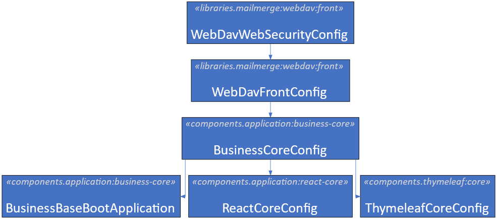
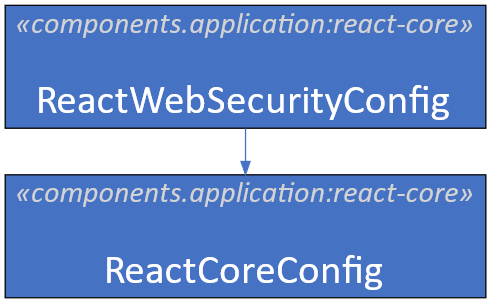
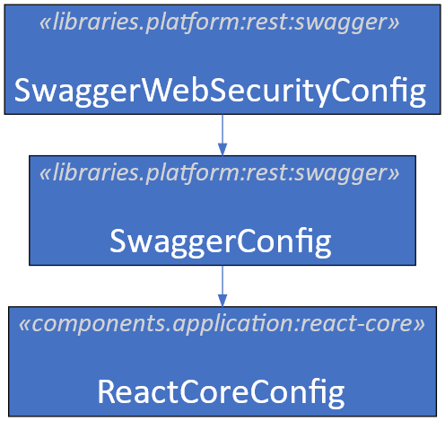

# References

| Reference                                                                                           | Title                                    | Author       | Version |
|-----------------------------------------------------------------------------------------------------|------------------------------------------|--------------|---------|
| [DD130 – Filters](/DD130-Detailed-Design/Filters)                                                   | DD130 - Filters                          | Szymon Micyk | 1.0     |
| [DD130 – Authentication and Authorization](https://source.netcompany.com/tfs/Netcompany02/NF4J/_wiki/wikis/Documentation/5120/Authentication-and-Authorization) | DD130 - Authentication and Authorization | Szymon Micyk | 1.0     |
| [DD130 – Session replication](https://source.netcompany.com/tfs/Netcompany02/NF4J/_wiki/wikis/Documentation/4881/Session-replication)                           | DD130 - Session replication              | Netcompany   | 1.0     |

[[_TOC_]] 

# Introduction

The document describes the detailed design of the authentication implementation and configuration in Amplio-based
projects. The document contains only information related to Amplio-specific authentication and authorization
configuration. More details and a general introduction to the subject can be found
in [DD130 – Authentication and Authorization](https://source.netcompany.com/tfs/Netcompany02/NF4J/_wiki/wikis/Documentation/5120/Authentication-and-Authorization).

## Target Audience

The target audience are project architects and developers who should gain critical knowledge about authentication
implementation and configuration.

## Developer Requirements

Before looking at this document, the developer should be familiar with the following:

- Spring framework and its Spring Security subproject
- Authentication protocols – BASIC, SAML, OpenID, etc.
- General knowledge about HTTP protocol and security vulnerabilities, e.g., CSRF, XSSF, etc.
- General knowledge about filters [DD130 – Filters](/DD130-Detailed-Design/Filters)

# Authentication and Authorization Description

## Authentication Protocols

In Amplio, there are two main authentication protocols for authentication: the typical form-based authentication with
user and password, and the SAML2 protocol. For more details,
check [DD130 – Authentication and Authorization](https://source.netcompany.com/tfs/Netcompany02/NF4J/_wiki/wikis/Documentation/5120/Authentication-and-Authorization).

Amplio adds two additional ways to authenticate to the application.

### Batch Login (aka AD login)

The batch login is form-based authentication but with an AD backend. The authentication process is done by the
`BatchAdminAuthenticator` bean with help of `LdapLoginAdapter`. The `LdapLoginAdapter` performs a direct query to the
LDAP server. When user information is acquired from LDAP, the rest of the process is handled the same as in the
form-based authentication.

### Service Logon Protocol

The service logon provides impersonation features from one application to another. It usually involves generating an
impersonation ticket which gives access to another application on behalf of a different user.

The service logon protocol is a two-step process:

- Generate an impersonation ticket and store it in a database. The ticket always has a validity period and can be used
  only once.
- Read the ticket on the target application (the ticket is part of the access URL) and validate it (validity period and
  database).

After the ticket is read, the typical login handler is executed at `/imp/login/commit`. It creates the session and
updates the attribute with proper authentication values. For more details on session handling and replication,
see [DD130 – Session replication](https://source.netcompany.com/tfs/Netcompany02/NF4J/_wiki/wikis/Documentation/4881/Session-replication).

## ContextWrapper and Context

The Amplio user context is based on the `Context` interface, `AbstractContextImpl`, and `ContextWrapper` classes. These
classes extend existing functionality from the Foundation framework. The `ContextWrapper` is an additional wrapper layer
to existing `ContextHelper` and `AuthenticationHelper` utility classes. `ContextWrapper` provides the ability to acquire
`Context` from the session or to execute a piece of code as another user.

The default pattern for using `ContextWrapper`:

```java
ContextWrapper.withContext(context, () -> {
    // do some stuff which required context
});
```

Or if you want to get value

```java
ContextWrapper.getWithContext(context, () -> {  
    return // some value
});
```

# Authentication components specification

The table below shows existing security configurations:

| Class Name                 | Description                                                                                                                                                                                                                                  |
|----------------------------|----------------------------------------------------------------------------------------------------------------------------------------------------------------------------------------------------------------------------------------------|
| `WebDavWebSecurityConfig`  | Handles WebDAV security concerns.                                                                                                                                                                                                            |
| `ReactWebSecurityConfig`   | React specific configuration. It gives permission to `/app` endpoint for all users. The `/app` endpoint serves only React compiled static JavaScript code. It doesn’t make any authentication changes to the typical login/logout processes. |
| `SwaggerWebSecurityConfig` | Swagger specific configuration. It gives permission to Swagger related endpoints, specifically to `/docs`. It doesn’t make any authentication changes to the typical login/logout processes.                                                 |

## React Specific Implementation

The React-based application doesn’t use the `TestLoginFormWebSecurityConfig` to handle their authentication process. The
main entry point for React is a custom controller. The controller takes all the responsibility of session creation and
setting it up with proper attributes, similar to `testLoginAuthenticationProvider` and
`testLoginAuthenticationSuccessHandler`.

The implementation needs to define the following endpoints:

| Bean Name              | Method | Description                                                                                                                                                                                                                                                                                                                                                                                                                  |
|------------------------|--------|------------------------------------------------------------------------------------------------------------------------------------------------------------------------------------------------------------------------------------------------------------------------------------------------------------------------------------------------------------------------------------------------------------------------------|
| `/rest/api/login/data` | GET    | Get data necessary for test login form. Typical JSON response from this endpoint:<br><pre>{<br>  "data": {<br>    "users": [],<br>    "roles": [],<br>    "languages": []<br>  },<br>  "metadata": {},<br>  "status": {}<br>}</pre>                                                                                                                                                                                          |
| `/rest/api/login`      | POST   | Perform login operations. Typical JSON request:<br><pre>{<br>  "godmode": true,<br>  "language": "string",<br>  "password": "string", <br>  "roles": [<br>    "string"<br>  ],<br>  "username": "string"<br>}</pre><br>and the response:<br><pre>{<br>  "data": {<br>    "components": [],<br>    "roles": [],<br>    "username": "string",<br>    "languages": []<br>  },<br>  "metadata": {},<br>  "status": {}<br>}</pre> |

## WebDavWebSecurityConfig

The `WebDavWebSecurityConfig` defines all beans necessary for the WebDAV authentication process and provides security
configuration for endpoints related to that process.

The `WebDavWebSecurityConfig` configuration is similar to `CommonSpringWebSecurityConfig`. It defines new `HttpSecurity`
configuration for WebDAV authentication and overrides the default configuration for WebDAV-specific endpoints.

The `WebDavWebSecurityConfig` is imported by the following components (it is a default component):

<div style="text-align: center;">



<h5>WebDavWebSecurityConfig import structure</h5>
</div>

## WebDavWebSecurityConfig

The `WebDavWebSecurityConfig` defines all beans necessary for the WebDAV authentication process and provides security
configuration for endpoints related to that process.

The `WebDavWebSecurityConfig` configuration is similar to `CommonSpringWebSecurityConfig`. It defines new `HttpSecurity`
configuration for WebDAV authentication and overrides the default configuration for WebDAV-specific endpoints.

The `WebDavWebSecurityConfig` is imported by the following components (it is a default component):

| Property Name                | Description                                                                                                                                                                                                               |
|------------------------------|---------------------------------------------------------------------------------------------------------------------------------------------------------------------------------------------------------------------------| 
| `my.security.webdav.enabled` | Enable WebDAV configuration. It prevents creation of any beans from default configuration and HTTP Security configuration (you can use this property to enable/disable application customization). <br> **Default**: true |

| Order | URL defined by `HttpSecurity` configuration                                           |
|-------|---------------------------------------------------------------------------------------|
| -80   | `/webdav/**` - the URL handles WebDAV authentication process and WebDAV communication | 

##	ReactWebSecurityConfig

The `ReactWebSecurityConfig` provides security configuration for endpoints related to react applications. It gives
access to /app endpoint which serves precompiled JavaScript files of the React application. The configuration always
returns 403 status code if user is not authenticated. It doesn’t redirect to any login page as this functionality is
done by React application itself.

The `ReactWebSecurityConfig` configuration is similar to CommonSpringWebSecurityConfig. It defines new HttpSecurity
configuration for react specific endpoints and doesn’t make any changes to authentication process.

The `ReactWebSecurityConfig` is imported by the following components (it is default component).


<div style="text-align: center;">



<h5>Figure 5 ReactWebSecurityConfig import structure</h5>
</div>

## SwaggerWebSecurityConfig

The `SwaggerWebSecurityConfig` provides security configuration for endpoints related to Swagger UI. It gives access to
`/docs/**` endpoints which serve Swagger UI and API information. The configuration requires an authenticated user before
Swagger UI can be accessed. The default access URL is `/docs/swagger-ui/index.html`.

The `SwaggerWebSecurityConfig` configuration is similar to `CommonSpringWebSecurityConfig`. It defines new
`HttpSecurity` configuration for Swagger-specific endpoints and doesn’t make any changes to the authentication process.

The `SwaggerWebSecurityConfig` is imported by the following components (it is a default component):

<div style="text-align: center;">



<h5>Figure 6 SwaggerWebSecurityConfig component import structure</h5>
</div>

## ServiceLogonFormWebSecurityConfig

The `ServiceLogonFormWebSecurityConfig` defines all beans necessary for the service logon authentication flow and
provides security configuration for endpoints related to service logon.

The `ServiceLogonFormWebSecurityConfig` should only ever be applied to the target system.

### Service Logon Standard Properties

The `ServiceLogonFormWebSecurityConfig` is configured to use `.properties` files. The table below explains the usage of
configuration parameters:

| Property Name                       | Description                                                                                                                                        |
|-------------------------------------|----------------------------------------------------------------------------------------------------------------------------------------------------|
| `my.security.servicelogon.errorUrl` | Sets the self-service error URL that service logon should redirect to in case of an error during the authentication flow. <br> **Default**: /error |

| Order | URL defined by `HttpSecurity` configuration                                                                                                                                                                                        |
|-------|------------------------------------------------------------------------------------------------------------------------------------------------------------------------------------------------------------------------------------|
| -60   | `/imp` - the URL serves token form for the user (the page is provided by the `LoginFromFagsystemController` included with the `ServiceLogonFormConfig`) <br> `/imp/login/commit` - the URL executes the ticket/token login process |

###	Service logon specific beans

The Service logon configuration defines following beans:

| Bean Name                                  | Description                                                                                                                                                                                                                                                                                                                                                                                                                                                                 |
|--------------------------------------------|-----------------------------------------------------------------------------------------------------------------------------------------------------------------------------------------------------------------------------------------------------------------------------------------------------------------------------------------------------------------------------------------------------------------------------------------------------------------------------|
| `serviceLogonAuthenticationDetailsSource`  | Defines authentication details for service logon authentication. The `FormBasedLoginAuthenticationDetails` keeps request query parameters. <br> The bean should not be overridden. <br> **Default implementation**: `FormBasedLoginAuthenticationDetailsSource`                                                                                                                                                                                                             |
| `serviceLogonAuthenticationProvider`       | Creates simple authentication provider which creates authentication token. The default roles and principal are provided by this bean, this uses the required service `ServiceLogonAuthenticationRoleService` to set the roles on the user. <br> The bean should not be overridden. <br> **Default implementation**: `ServiceLogonAuthenticationProvider`                                                                                                                    |
| `serviceLogonAuthenticationSuccessHandler` | Executed at the end of the authentication process. It handles project-specific logic after successful authentication and redirects to the default application URL. This uses the required services `ServiceLogonService` and `ServiceLogonContextProvider` and thus does not need to be overridden, but it can be overridden to extend the validation logic. <br> The bean might be overridden. <br> **Default implementation**: `ServiceLogonAuthenticationSuccessHandler` |
| `serviceLogonAuthenticationFailureHandler` | Executed when authentication fails for any reason. The default implementation clears authentication attributes from the session and redirects to a specific error page based on validation logic or the default error URL specified by `my.security.servicelogon.errorUrl`. <br> The bean might be overridden. <br> **Default implementation**: `ServiceLogonAuthenticationFailureHandler`                                                                                  |
| `serviceLogonLogoutHandler`                | Handles logout cleanup logic. It should handle project-specific logic related to the logout process. <br> The bean might be overridden. <br> **Default implementation**: `ServiceLogonLogoutHandler`                                                                                                                                                                                                                                                                        |
| `serviceLogonLogoutSuccessHandler`         | Handles successful application logout. It should handle project-specific logic after the user is fully logged out from the application. Usually, it means redirecting to a specific endpoint. By default, it redirects to the root of the application. <br> The bean might be overridden. <br> **Default implementation**: `ServiceLogonLogoutSuccessHandler`                                                                                                               |
| `serviceLogonLogoutRedirectHandler`        | Handles redirect to logout URL for service logon authentication. The default logout URL is `/imp/logout/commit`. The bean is used by `ServiceLogonFormWebSecurityConfig` to properly logout the user based on authentication type. <br> The bean might be overridden. <br> **Default implementation**: `ServiceLogonLogoutRedirectHandler`                                                                                                                                  |

###	Service logon required beans

The service logon implementation requires the project to implement the following beans and add them manually to the
source and the target systems.

| Class Name                              | Description                                                                                                                                                                                            | System          |
|-----------------------------------------|--------------------------------------------------------------------------------------------------------------------------------------------------------------------------------------------------------|-----------------|
| `ServiceLogonService`                   | General bean to handle all operations related to the impersonate feature. <br> **Default implementation**: `ServiceLogonServiceImpl`                                                                   | Source & Target |
| `ImpersonationLogonController`          | Abstract controller used to redirect to target system from source system                                                                                                                               | Source          |
| `ServiceLogonAuthenticationRoleService` | Interface for service that the project should implement to supply roles for the authentication                                                                                                         | Target          |
| `ServiceLogonContextProvider`           | Interface for service that the project should implement for context handling. This includes creating an anonymous context for authentication flow to use and the real user context if successful login | Target          |

###	Service logon model

The impersonate information are shared between application and kept in the `IMPERSONATE_TICKET` table:

| COLUMN            | TYPE                          | Description                                     |
|-------------------|-------------------------------|-------------------------------------------------|
| `ID`              | `VARCHAR2 (50 CHAR) NOT NULL` | Primary Key                                     |
| `USERNAME`        | `VARCHAR2(250 CHAR) NOT NULL` | User name performing the impersonate operations |
| `FAGSYSTEM_LOGIN` | `VARCHAR2(50 CHAR) NOT NULL`  | User name performing the impersonate operations |
| `CPR`             | `VARCHAR2(50 CHAR) NOT NULL`  | CPR number which we want to impersonate         |
| `VALID_BEFORE`    | `TIMESTAMP(6) NOT NULL`       | Validity period                                 |
| `TOKEN`           | `VARCHAR2(50 CHAR) NOT NULL`  | Generated token for security checking           |
| `ATTEMPTS`        | `NUMBER(1) NOT NULL`          | Number of attempts done for this ticket         |

# Configurations and service extensions

## Component customization

This section describes how to configure existing authentication protocol implementations.

#	WebDavWebSecurityConfig

The `WebDavWebSecurityConfig` doesn’t have any specific extensions.

Required Gradle component:

```java
dependencies {
    api "modulus-ydelse.libraries.mailmerge:mailmerge-webdav-front "
}
```

### ReactWebSecurityConfig

The `ReactWebSecurityConfig` doesn’t have any specific extensions.

Required Gradle component:

```java
dependencies {
    api "modulus-ydelse.libraries.components.application:application-react-business-core"
}
```

### SwaggerWebSecurityConfig

The `SwaggerWebSecurityConfig` doesn’t have any specific extensions.

Required Gradle component:

```java
dependencies {
    api "modulus-ydelse.libraries.platform:platform-rest-swagger"
}
```

### Service logon

The `ServiceLogonFormWebSecurityConfig` should be applied to the target application configuration and the proper bean
should be implemented and added to the correct application configuration e.g:

```java
@Import({
        // …others imports
        ServiceLogonFormConfig.class,
        ServiceLogonFormWebSecurityConfig.class,
})
public class ApplicationAuthenticationConfig {
    @Bean
    public ServiceLogonContextProvider serviceLogonContextProvider() {
        return new ServiceLogonContextProviderImpl();
    }
}
```

Required Gradle component:

```java
dependencies {
    api "modulus-ydelse.libraries.components:thymeleaf-servicelogon"
}
```

### Batch login
The batch login is a standard component of BatchCoreConfig. It doesn’t require any import to be used in the project.

Optionally, the property setting default home page can be defined with:

```properties
my.security.batch.mainPageUrl=/batchadmin
```

and enable/disable LDAP option can be defined with:

```properties
ldapsecurity.enabled=true
```

## Migration Guide (before 5.0)

All projects should make changes to the following components to properly move to the new authentication schema:

- Remove all configurations related to OIOSAML2. It is usually added as `configurations.oiosaml` and `modulus-ydelse.platform.authentication: 'platform-authentication-saml'` dependency in gradle files.
- Add `modulus-ydelse.platform.authentication: 'platform-authentication-saml2'` to use OISAML3 and new SAML authentication classes.
- The folder `configs/oiosaml` becomes obsolete and should be removed.
- The classes extending `CommonSpringWebSecurityConfig` should be adjusted to the changes, see examples below.
- You should have a new authentication configuration class which includes test login configuration and saml2/oiosaml3 login configuration, see example below.
- Add `WebDavWebSecurityConfig` if you are using WebDAV in your project.
- The class extending `SAMLLogoutAuthenticationHandler` should now implement `AuthenticationSuccessHandler` (from Spring). Most of the logic can be moved from the class to the new class. Please, remember that `AuthenticationSuccessHandler` indicates that the `Authentication` object is already in the `SecurityContext`. If for some reason you need to abort authentication, you should throw `AuthenticationFailureException` with the proper status code and redirection URL (redirect alone is not enough).
- Remove `FagsystemServiceProviderConfig` and `SelvbetjeningServiceProviderConfig` from your filter configuration and define `authenticationConfigurationService` bean with `DefaultAuthenticationConfigurationServiceImpl` as implementation.
- Remove configuration related to `FagsystemServiceProviderConfig` and `SelvbetjeningServiceProviderConfig` from `filter.properties`. It starts with `my.sb.serviceprovider` and `my.fag.serviceprovider`.
- Remove `oioDispatcherServlet` bean from your application configuration.
- Remove all request mappings from `TestLoginController` class except `GET /login`. The `/login` mapping should only initialize data needed by your login form. All logic is moved to Spring authentication component.
- User `SessionAttributes` and its constant to set or get attributes from session e.g., `USER_CONTEXT` should be changed to `SessionAttributes.USER_CONTEXT_ATTR_NAME`.


