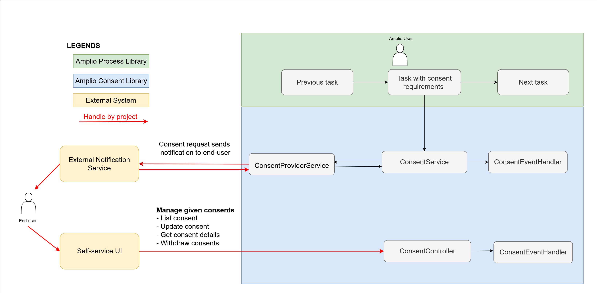
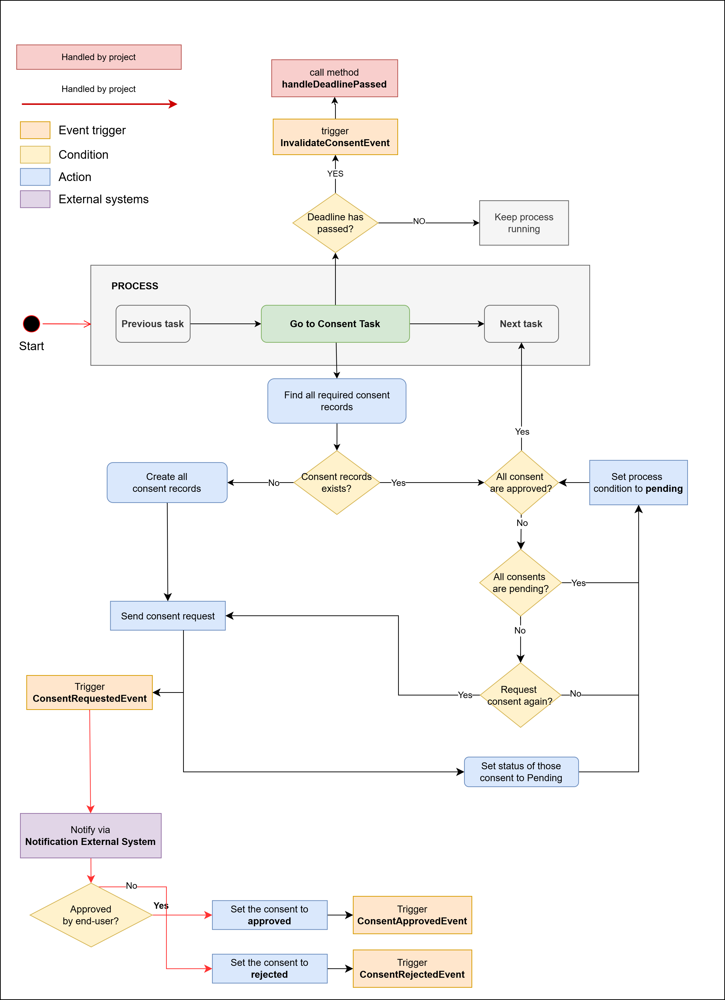
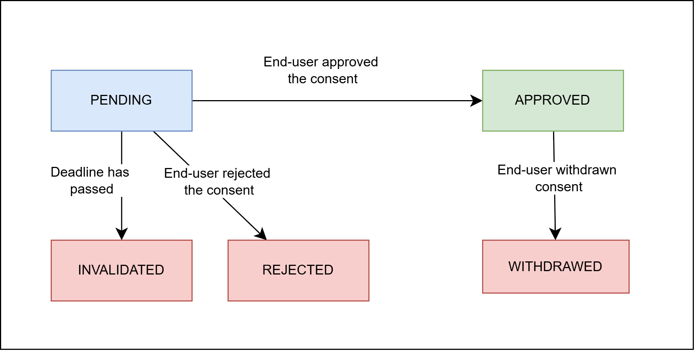
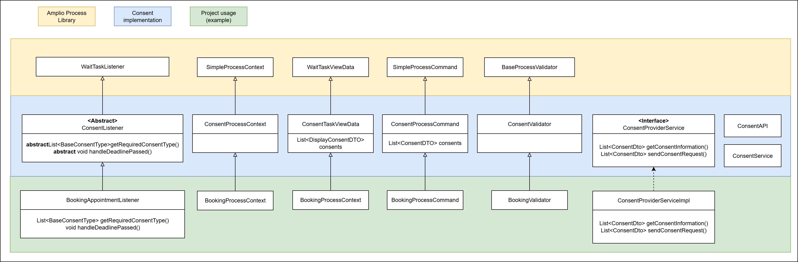
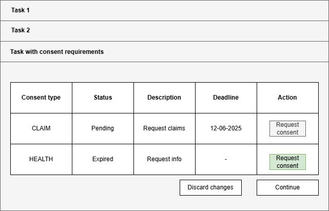

# AMPLIO Consent

## Reference

| Reference                                   | Author          |
|---------------------------------------------|-----------------|
| [DD130 – System Parameter][SYSTEMPARAMETER] | Netcompany A/S  |
| [DD130 – Process Engine][PROCESSENGINE]     | Netcompany A/S  |
| [DD0130 - Event Api] [EVENTAPI]             | Netcompany A/S  |


<!-- =============== -->
<!-- REFERENCE LINKS -->
<!-- =============== -->
[SYSTEMPARAMETER]: https://goto.netcompany.com/cases/GTE2252/AMPJ/SitePages/Wiki.aspx#/DD130-Detailed-Design/System-parameter
[PROCESSENGINE]: https://goto.netcompany.com/cases/GTE2252/AMPJ/SitePages/Wiki.aspx#/DD130-Detailed-Design/Process-Engine
[EVENTAPI]: https://goto.netcompany.com/cases/GTE2252/AMPJ/SitePages/Wiki.aspx#/DD130-Detailed-Design/Event-Api


## Introduction

The AMPLIO Consent is the feature to handle user consents in our system. 
It ensures that user data is handled in compliance with privacy regulations and legal requirements.

### Target Audience

This document is targeted to:

Developers who need to implement and maintain the AMPLIO Consent.
Tender-writers who need information about the AMPLIO Consent.
Projects intending on using the AMPLIO Consent in their application.

### Developers Requirements

- Understanding System Parameters and how to configure them. 
- Understanding Process Engine and its flow.
- Understanding of Event Api and how to extend from this component.

## Background Information
This design introduces the solution to check consent and request consent for the processes that require consent from end-user to perform a specific task.
This includes the logic for the Amplio user check consent, request consent from end-user and allow end-user manage their given consent.

## High level description of the component

Below is the overview of consent flow and how this flow interacts with external systems.
- An Amplio user enters a `task` that requires  consent from end-user to perform a task that required consent (e.g: query personal data of end-user), they have a UI to check if consents exists and valid.
- If consent does not exist or are not valid, system will request external communication channel system to send consent requirement (e.g: email, phone text,...) to the end-user.
- After end-user consented, the status is updated back to the system, if all consents are valid, then it allows the AMPLIO user perform the needed actions
- Besides, end-user allow to manage his/her given consent via Self-portal UI, here they can list all consents that they consented, see details of the consents and withdraw consent




### Detailed flow of how consent is checked and requested via the `ConsentListener`

When a process reaches a **Task with consent requirement**, a listener (extending `ConsentListener`) is triggered to retrieve all existing consent records for a given entity (e.g., person, company).

#### No Existing Consent Records
- Create new consent records (one per consent type) with status `PENDING`.
- Send consent request to external system (project defines required types).
- Trigger [`onConsentRequested`](#consent-event-handler) in the Consent Event Handler.

#### Existing Consent Records
- Check if **all required consents** are `APPROVED`:
  -  **Yes** → proceed to the next task.
  - **No** → check if all are `PENDING`:
    - **Yes** → keep the process waiting at this task.
    - **No** → for each consent that is neither `APPROVED` nor `PENDING`:
      - Send new consent request.
      - Trigger [`onConsentRequested`](#consent-event-handler).
      - Set status to `PENDING`.

If any consent becomes `PENDING`, a deadline may be set 
in the Consent database record to define how long the process waits for a user response. 
The project decides whether to act on the first expired deadline or wait for all to expire.
      


## Introduction to the subject

### Consent Terminology
This section introduces the terminology used in this document.
1. **AMPLIO User**: The user who is using the AMPLIO application.
2. **End user**: The user who is requiring to consent by the system or AMPLIO user.

### Consent lifecycle
The diagram below presents the consent lifecycle:

- Consent records started with `PENDING` status when system start request consent from end user via external system, status will be changed to `PENDING`.
- When the status is `PENDING`, depends on actions from user (approve or reject), status will be updated back to the system
  with respective status (`APPROVED` or `REJECTED`). In case consent has approved by end-user, it still can be withdrawn by end-user or expired after the valid time is passed or invalidated after deadline is passed. At that time, the status will be updated to database record with respective status (`WITHDRAWN` or `EXPIRED` or `INVALIDATED`). In this situation, consent must be requested again via external system if any actions require this type of consent again.



## Configurations and service extensions




The next section describes list of modules for this Consent Design: 
- `consent-service`: contains relevant base functionality (i.e. ConsentService).
- `consent-process`: contains all the implementations relevant to process: (i.e. ConsentProcessContext, ConsentTaskViewData, ConsentProcessCommand)
- `consent-rest`: contains all the implementations relevant to the REST (i.e. APIs, Table)

A `task` that requires consents needs the extension and implementation below:

### Required actions from project:
1. Listener needs to be extended from `ConsentLister`. It is required to have `getRequiredConsentType` implementation from project, this is used to indicate what type of consent is needed from for this process task. The type needs to be extended from `BaseConsentType` enum class. 
2. Context needs to be extended from `ConsentProcessContext`. This will make sure the consents data is passed down to the components on front-end mapped to it
3. Task view data needs to be extended from `ConsentTaskViewData`. This will make sure the consents data is passed down to the components on front-end mapped to it
4. Process command needs to be extended from `ConsentProcessCommand`. This will make sure the consents data is passed down to the components on front-end mapped to it
5. Implementation for `ConsentProviderService` interface to interact with external Letter Management system. 
   See [External System Integration](#external-system-integration).
6. Implementation for `ConsentEventHandler` based on interfaces to handle the consent events. See [Consent Events and Commands](#consent-events-and-commands).
7. ConsentEventType processors that implements the `EventProcessor` interface, this allow ConsentEventType processor beans to be included in the `EventProcessorRegistry`.

## User Interface

### Mockup with deadline
The user interface mainly displays the consent information. The following list is relevant information for the mock-up user interface
- **Consent relevant information**: Displays the following fields in [Display Consent DTO](#displayconsentdto).
- **Consent deadline:** The deadline is set automatically by the system.
  There is a system parameter `deadline_duration` to define how long we should wait for a type of consent.
  After this deadline, if the Amplio user wants to request consent again, then it needs to be done in a new process.
- **Action:** allow Amplio users to request consent again when status is not in **APPROVED** or **PENDING**




---

## Roles and rights
The Amplio Consent provides one foundational security roles that implementing projects 
can map to their specific user types and business requirements. These roles serve as building blocks for consent access control across different organizational contexts.
- **CONSENT_READ**: provides the read permission for the user that be able to request consent and view the information of the consent. The purpose of this role is to make sure that the people are not supposed to work with consent (e.g: IT admin) should not see any information of this

---

## Consent Events and Commands

This allows projects to customize the behavior of the consent process. These methods should be called whenever
the corresponding consent result is obtained. For example, if the user approved consents, 
the **approved event** should be triggered.

### List of consent events
Each consent action is modeled as a **command**, which represents the intent to change consent state. 
The result of that action is captured and emitted as an **event**, which is then handled by 
event listeners for side effects (e.g., notifications, audits, etc.).

| Consent Action        | Command Class                    | Triggered Event Class            | Description                                                               |
|-----------------------|----------------------------------|----------------------------------|---------------------------------------------------------------------------|
| Request Consent       | `SimpleRequestConsentCommand`    | `ConsentRequestedEventTrigger`   | A new consent request has been initiated.                                 |
| Approve Consent       | `SimpleApproveConsentCommand`    | `ConsentApprovedEventTrigger`    | The user has approved the requested consent.                              |
| Reject Consent        | `SimpleRejectConsentCommand`     | `ConsentRejectedEventTrigger`    | The user has explicitly rejected the consent.                             |
| Withdraw Consent      | `SimpleWithdrawConsentCommand`   | `ConsentWithdrawnEventTrigger`   | A previously approved consent has been withdrawn by the user.             |
| Expire Consent        | `SimpleExpireConsentCommand`     | `ConsentExpiredEventTrigger`     | The consent has expired based on its `validTo` timestamp.                 |
| Invalidate Consent    | `SimpleInvalidateConsentCommand` | `ConsentInvalidatedEventTrigger` | The consent is now considered invalid (e.g., due to process constraints). |

---

## ConsentService

Service `ProcessConsentService` includes all the functions needed to support checking if a given entity has required consent approved to continue to proceed on the process

| Method                                                                                                        | Description                                                                                                                                                                               |
|---------------------------------------------------------------------------------------------------------------|-------------------------------------------------------------------------------------------------------------------------------------------------------------------------------------------|
| `List<ConsentDto> getAllConsents(String entityId, String entityType, ConsentStatus status, ConsentType type)` | Get consents filtered by entity, status, and type                                                                                                                                         |
| `ConsentDto getConsent(String consentId)`                                                                     | Get a specific consent by its ID                                                                                                                                                          |
| `boolean hasConsentApproved(String processId, String entityId, String entityType)`                            | Check if given entity has all consents approved to proceed in the process                                                                                                                 |
| `ConsentDto requestConsent(String entityId, String entityType, List<ConsentType> consentTypes)`               | Call request to external system to request consent by calling sendConsentRequest in `ConsentProviderService`                                                                              |
| `void createConsentRecord(CreateConsentDto updateConsentDto)`                                                 | Create a new consent record in the database                                                                                                                                               |
| `<T extends ConsentCommand> Consent executeCommand(T command)`                                                | Update consent information (e.g: when consent is expired,...) by execute command that registered in `CommandRegistry`. <br/> <br/> This method must adhere the consent status life-cycle. |

## API

#### Authentication

Make sure the controller contains the annotation `@PreAuthorize("isAuthenticated()")`

---

#### Create consent

The common Event Api endpoint will be used to request consent again when needed.
Refer to [Create and Update Consent with Event Api](#create-and-update-consent-with-event-api)

**POST** `/rest/api/eventapi/create`

**Request**: `EventRequest`.

**Response**: EMPTY

| Status Code | Description |
|-------------|-------------|
| 200         | OK          |

--

#### List Consents

This API will be used by Self-service system to get a list of consents by given entity (by status or type depends on the payload)

**GET** `/rest/api/consent`

**Request**

| Parameter    | Required | Description                                                                                                    |
|--------------|----------|----------------------------------------------------------------------------------------------------------------|
| entityId     | Yes      | ID of the entity this consent belongs to                                                                       |
| entityType   | Yes      | Type of entity this consent belongs to                                                                         |
| status       | No       | Status of the consents                                                                                         |
| type         | No       | Key of the consent type. When it is not provided, the functions returns all the consent type of a given entity |

**Response** `List<ConsentDto>`. Refer to [ConsentDto](#consentdto)

| Status Code | Description |
|-------------|-------------|
| 200         | OK          |


---

#### Get consent details

This API will be used to get detail of a specific consent for a given entity

**GET** `/rest/api/consent/{consentId}`

**Request: EMPTY**

**Response** `ConsentDto`. Refer to [ConsentDto](#consentdto)

| Status Code | Description |
|-------------|-------------|
| 200         | OK          |
| 404         | Not Found   |

---

#### Withdraw consent

The common Event Api endpoint will be used to withdraw consent by updating its status.
Refer to [Create and Update Consent with Event Api](#create-and-update-consent-with-event-api)

**POST** `/rest/api/eventapi/create`

**Request**: `EventRequest`.

**Response**: EMPTY

| Status Code | Description |
|-------------|-------------|
| 200         | OK          |

---

#### Update Consent

The common Event Api endpoint will be used to update Consent status.
Refer to [Create and Update Consent with Event Api](#create-and-update-consent-with-event-api)

**POST** `/rest/api/eventapi/create`

**Request**: `EventRequest`.

**Response**: EMPTY

| Status Code | Description |
|-------------|-------------|
| 200         | OK          |

---

## External System Integration
This section outlines how the AMPLIO Consent system integrates with external consent management systems and services.

### Authentication

Each project will define its own authentication method based on specific integration requirements.

### ConsentProviderService - Interface
Interface implemented in AMPLIO. Each project needs to implement this interface to have the Consent feature work.


| Method                                                                                                       | Description                                                                                                                                                                                                            |
|--------------------------------------------------------------------------------------------------------------|------------------------------------------------------------------------------------------------------------------------------------------------------------------------------------------------------------------------|
| `List<ConsentDto> getConsentInformation(String entityId, String entityType, List<ConsentType> consentTypes)` | Retrieves consent information from external systems for specific consent types and users. Returns response from the integration mapped to ConsentInfoDto.                                                              |
| `List<ConsentDto> sendConsentRequest(String entityId, String entityType, List<ConsentType> consentTypes)`    | Sends consent requests to external systems when new consents are required. Returns either a list of successfully requested consents or a list of successfully approved consents depending on the integration behavior. |


## System Parameters

This section describes the system parameters for managing consent types in the AMPLIO Consent.

### Consent_type

In the context of AMPLIO Consent, a consent type denotes a specific category of consent related to the processing of personal data within a defined business process or operational context. Importantly, the classification of a consent type is not determined by the channel or medium through which the consent is obtained (such as email, web, or paper), but by the legal basis, purpose, or organizational need that necessitates the consent. This distinction ensures that consents are managed in alignment with compliance requirements and internal governance practices.

#### Parameter_type

| Id         | Name         | Allow_manual_keys | Draft_type |
|------------|--------------|-------------------|------------|
| 111 (GUID) | consent_type | Y                 | STANDARD   |

#### Parameter_attribute

The `parameter_attribute` table defines the attributes for the `consent_type` system parameter.

The following fields: `hidden (N)`, `truncate_ui_value (N)`, `readonly (N)` are all omitted, as they have the same value for all rows.
This section also includes Purpose and Restrictions / Relevant Information which describes each attribute for the appointment_type system parameter.

| Id       | Name                    | Data_type                   | Mandatory | Editable | Row_order | Parameter_type_id | Purpose                                                                                                                                                                                | 
|----------|-------------------------|-----------------------------|-----------|----------|-----------|-------------------|----------------------------------------------------------------------------------------------------------------------------------------------------------------------------------------|
| 1 (GUID) | context                 | TEXT                        | Y         | Yes      | 1         | 111               | Defines the context that the consent type can be applied to. This is a description of what the consent is being used for.                                                              |                                                                                               
| 2 (GUID) | legal_text              | TEXT                        | Y         | Yes      | 2         | 111               | Specifies the legal reference using country legal citation format (Danish). This is a description of which law points out why the consent is needed.                                   |                                                                                       
| 3 (GUID) | version_number          | INTEGER                     | Y         | No       | 3         | 111               | Specifies the version of the consent type. It is incremented each time it is updated. However, there are some special cases where it refers to a version that is specified by the law. |                      
| 4 (GUID) | data_processing_purpose | DATA_TYPE_ENUM_LIST         | N         | Yes      | 4         | 111               | Defines the purposes for which the consent type can be used, often having multiple. See [ConsentDataProcessingPurpose](#consentdataprocessingpurpose---extendable-enum).               |                                                                                                    
| 5 (GUID) | validity_duration       | DURATION                    | N         | Yes      | 5         | 111               | Specifies the consent validity period using the ISO 8601 duration format.                                                                                                              |   

### Consent_deadline

#### Parameter_type

| Id         | Name             | Allow_manual_keys  |
|------------|------------------|--------------------|
| 111 (GUID) | consent_deadline | Y                  |   

#### Parameter_attribute

The `parameter_attribute` table defines the attributes for the `consent_deadline` system parameter.

The following fields: `hidden (N)`, `truncate_ui_value (N)`, `readonly (N)` are all omitted, as they have the same value for all rows.
This section also includes Purpose and Restrictions / Relevant Information which describes each attribute for the appointment_type system parameter.

| Id       | Name              | Data_type                 | Mandatory | Editable | Row_order | Parameter_type_id | Purpose                                                                                                                                                                                                                                                   | 
|----------|-------------------|---------------------------|-----------|----------|-----------|-------------------|-----------------------------------------------------------------------------------------------------------------------------------------------------------------------------------------------------------------------------------------------------------|
| 1.(GUID) | consent_type      | DATA_TYPE_SYSPARAM        | N         | Yes      | 1         | 111               | Defines the [Consent Type System Parameter](#consent_type) that mapped to this deadline.                                                                                                                                                                  |   
| 2.(GUID) | deadline_duration | DURATION                  | N         | Yes      | 2         | 111               | Specifies the deadline period for each type of consent using the ISO 8601 duration format.  When it is empty, a consent can be valid indefinitely. When it has a value, it must follow the ISO-8601 standard for duration (e.g., P5S, P1D, P1H30M, etc.). |                                                                                                                                                                |


### Example of parameters

This section presents an example of what a Consent Type could look like for Data Protection.
In Europe, the Data Protection Consent (GDPR Context) is one of the simplest examples.

A user ticking a checkbox on a website to agree to receive newsletters.
The legal context: According to the Danish Data Protection Act and GDPR, consent must be:

- Freely given
- Specific
- Informed
- Unambiguous (opt-in, not opt-out)

#### Consent_type example

**Parameter_instance**

| Id         | Parameter_key        | Start_date | End_date   | Parameter_type_id |
|------------|----------------------|------------|------------|-------------------|
| 999 (GUID) | gdpr_data_protection | 2020-01-01 | 9999-12-31 | 111               |

**Parameter_value**

| Id          | Value                       | Parameter_attribute_id       | Parameter_instance_id |
|-------------|-----------------------------|------------------------------|-----------------------|
| 1212 (GUID) | GDPR                        | 1 (context)                  | 999                   |
| 1313 (GUID) | § 8 i Databeskyttelsesloven | 2 (legal_text)               | 999                   |
| 1414 (GUID) | 1                           | 3 (version_number)           | 999                   |
| 1515 (GUID) | GDPR                        | 4 (data_processing_purposes) | 999                   |
| 1616 (GUID) | PT6M                        | 5 (validity_period)          | 999                   |


#### Consent_deadline example
**Parameter_instance**

| Id         | Parameter_key                 | Start_date | End_date   | Parameter_type_id |
|------------|-------------------------------|------------|------------|-------------------|
| 999 (GUID) | gdpr_data_protection_deadline | 2020-01-01 | 9999-12-31 | 111               |

**Parameter_value**

| Id          | Value                | Parameter_attribute_id | Parameter_instance_id |
|-------------|----------------------|------------------------|-----------------------|
| 1212 (GUID) | GDPR_DATA_PROTECTION | 1 (consent_type)       | 999                   |
| 1313 (GUID) | PT3D                 | 2 (deadline)           | 999                   |


## Data model

### Persistence

The table below describes the information of consent that will be persisted to the database

#### Consent

| Field        | Type                       | Mandatory | Description                                                                                                                                                                                 |
|--------------|----------------------------|-----------|---------------------------------------------------------------------------------------------------------------------------------------------------------------------------------------------|
| id           | String                     | Y         | Unique identity of a consent                                                                                                                                                                |
| entity_id    | String                     | Y         | ID of the entity this consent belongs to                                                                                                                                                    |
| entity_type  | String                     | Y         | Type of entity this consent belongs to                                                                                                                                                      |
| type         | String                     | Y         | System parameter key of the consent type                                                                                                                                                    |
| version      | Integer                    | N         | Version of the consent                                                                                                                                                                      |
| status       | ConsentStatus              | Y         | Code of the consent status                                                                                                                                                                  |
| valid_from   | Timestamp without timezone | N         | Time when consent becomes valid                                                                                                                                                             |
| valid_to     | Timestamp without timezone | N         | Time when consent expires                                                                                                                                                                   |

### DTO
#### ConsentDto
Complete consent record representing an entity's consent within the AMPLIO Consent system. 
This DTO contains all essential information about a consent, including the consent type details and validity periods.

| Field       | Type          | Description                                                                                                            |
|-------------|---------------|------------------------------------------------------------------------------------------------------------------------|
| id          | String        | Unique identity of a consent                                                                                           |                                                                                                                                                            |
| entityId    | String        | ID of the entity this consent belongs to                                                                               |
| entityType  | String        | Type of entity this consent belongs to                                                                                 |
| status      | ConsentStatus | Status of the consent                                                                                                  |
| validFrom   | LocalDateTime | Time when consent becomes valid                                                                                        |
| validTo     | LocalDateTime | Time when consent expires                                                                                              |
| consentType | String        | The mapped value to [ConsentTypeDto](#consenttypedto) system parameter id field. Represents the detail of the consent. |


#### DisplayConsentDto
Complete consent record representing an entity's consent within the AMPLIO Consent system. This DTO contains all essential information about a consent, including the consent type details and validity periods.

| Field         | Type          | Description                              |
|---------------|---------------|------------------------------------------| 
| entityId      | String        | ID of the entity this consent belongs to |
| entityType    | String        | Type of entity this consent belongs to   |
| consentStatus | ConsentStatus | Status of the consent                    |
| description   | String        | Description of the consent               |
| deadline      | LocalDateTime | Deadline of the consent                  |
| consentType   | String        | Consent type                             |


#### UpdateConsentDto
This model using when update a status of the consent. The status must adhere the [life-cycle](#consent-lifecycle).

| Field       | Type          | Description                                                                                                                |
|-------------|---------------|----------------------------------------------------------------------------------------------------------------------------|
| entityId    | String        | ID of the entity this consent belongs to                                                                                   |
| entityType  | String        | Type of entity this consent belongs to                                                                                     |
| status      | ConsentStatus | Status of the consent                                                                                                      |
| validFrom   | LocalDateTime | Time when consent becomes valid                                                                                            |
| validTo     | LocalDateTime | Time when consent expires                                                                                                  |
| consentType | String        | The mapped value to [ConsentTypeDto](#consenttypedto) system parameter id field. Represents the detail of the consent.     |

#### CreateConsentDto
Complete consent record representing an entity's consent within the AMPLIO Consent system. This DTO contains all essential information about a consent without id, and will be used to create consent request.

| Field       | Type          | Description                                                                                                            |
|-------------|---------------|------------------------------------------------------------------------------------------------------------------------|
| entityId    | String        | ID of the entity this consent belongs to                                                                               |
| entityType  | String        | Type of entity this consent belongs to                                                                                 |
| status      | ConsentStatus | Status of the consent                                                                                                  |
| consentType | String        | The mapped value to [ConsentTypeDto](#consenttypedto) system parameter id field. Represents the detail of the consent. |

#### ConsentTypeDto
Provides detailed metadata about a specific type of consent as defined in the system parameters. Used for consent type configuration, determining consent validity periods, and managing consent type versioning.

| Field          | Type   | Description                                             |
|----------------|--------|---------------------------------------------------------|
| key            | String | Key of the consent type                                 |
| context        | String | Context of the consent type                             |
| legalText      | String | Legal text of the consent type                          |
| validityPeriod | String | Valid period of the consent in ISO 8601 duration format |
| version        | Int    | Version of the consent                                  |


### Enum

#### BaseConsentType - Extendable Enum
BaseConsentType defines the Extendable Enum for each project to adhere.

> The enum key must be corresponding to [the system parameter](#consent_type) that created.

#### ConsentDataProcessingPurpose - Extendable Enum
ConsentDataProcessingPurpose is an Extendable Enum that define the purpose for requesting consent. 

**Example**

The following table describes examples for this Extendable enum.

| Key                  | Description                                                                |
|----------------------|----------------------------------------------------------------------------|
| GDPR_REQUIREMENT     | 	Consent is required to comply with the General Data Protection Regulation |
| THIRD_PARTY_SHARING  | 	Consent to share data with third-party partners or affiliates.            |  

#### ConsentStatus - Enum

| Value       | Description                                      |
|-------------|--------------------------------------------------|
| PENDING     | Consent is requested and waiting for approval    |
| APPROVED    | User approves consent                            |
| REJECTED    | User rejects consent                             |
| WITHDRAWN   | Consent is withdrawn                             |
| INVALIDATED | Consent is invalidated due to deadline is passed |

## Create and Update Consent with Event Api

Beside using Consent specific endpoints and services, Self-service application can also create and update Consent by the common Event Api.
Detailed design of Event Api, and instruction on how to extend this component to further specify business logic for Consent could be found in [DD0130 - Event Api] [EVENTAPI].
This section only focuses on the defined `ConsentEventTypes`, and how they are adopted with Event Api.

### Consent Event Types

To use Event Api as the common endpoint for updating Consent, `ConsentEventTypes` are created by extending the `EventType` extendable enum.
`EventProcessorRegistry` maintains a mapping of each constants extended `EventType` and a list of corressponding Event Processor beans (e.g `SimpleApproveConsentEventProcessor`).
These Processor beans can further process business rules specic for each constant within `ConsentEventTypes`.

```java
public final class ConsentEventTypes {

    public static final EventType CONSENT_REQUESTED = EventType.create("CONSENT_REQUESTED", false, SimpleRequestConsentCommand.class);
    public static final EventType CONSENT_APPROVED = EventType.create("CONSENT_APPROVED", false, SimpleApproveConsentCommand.class);
    public static final EventType CONSENT_REJECTED = EventType.create("CONSENT_REJECTED", false, SimpleRejectConsentCommand.class);
    public static final EventType CONSENT_WITHDRAWN = EventType.create("CONSENT_WITHDRAWN", false, SimpleWithdrawConsentCommand.class);
    public static final EventType CONSENT_INVALIDATED = EventType.create("CONSENT_INVALIDATED", false, SimpleInvalidateConsentCommand.class);

}
```

### Consent Event Command Classes

The example of `ConsentEventTypes` above also shows that Java object classes corresponding to each constants in `ConsentEventTypes` are also required.
These Java objects are used as mapping destination for the polymorphic `data` field coming from the request of `EventApi`. 

By extending the `Event Api`, Consent can take advantage of the available fields coming in from `EventRequest` such as `entityId` and `entityType`.
This makes the structure of Consent Commands much simpler.

This section will contains the specific fields needed for each of existing Consent Commands.

1. `SimpleRequestConsentCommand`

| Field       | Type | Description                                                                     |
|-------------|------|---------------------------------------------------------------------------------|
| consentType |String| Required field, indicates which `BaseConsentTypes` this consent is created for. |

2. `SimpleApproveConsentCommand`

| Field     | Type | Description                                                               |
|-----------|------|---------------------------------------------------------------------------|
| consentId |String| Required field, used to retrieve a persisted Consent and update its status|

3. `SimpleInvalidateConsentCommand`

| Field     | Type | Description                                                               |
|-----------|------|---------------------------------------------------------------------------|
| consentId |String| Required field, used to retrieve a persisted Consent and update its status|

4. `SimpleRejectConsentCommand`

| Field     | Type | Description                                                               |
|-----------|------|---------------------------------------------------------------------------|
| consentId |String| Required field, used to retrieve a persisted Consent and update its status|

5. `SimpleWithdrawConsentCommand`

| Field     | Type | Description                                                               |
|-----------|------|---------------------------------------------------------------------------|
| consentId |String| Required field, used to retrieve a persisted Consent and update its status|


