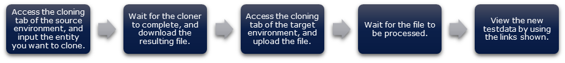
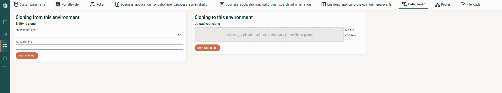
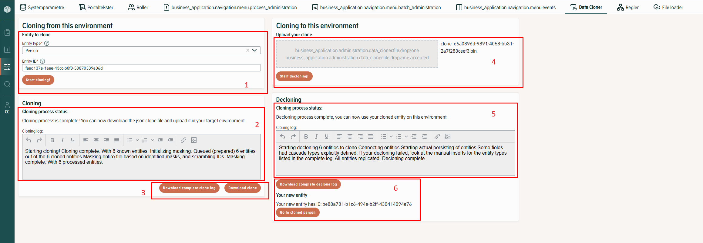
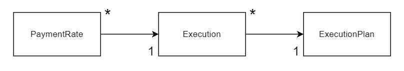
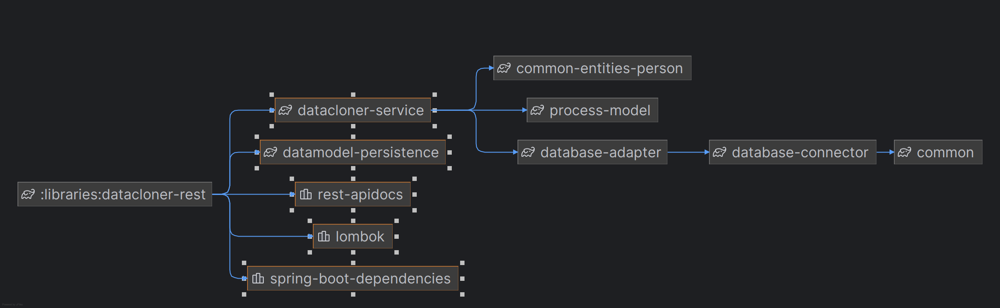
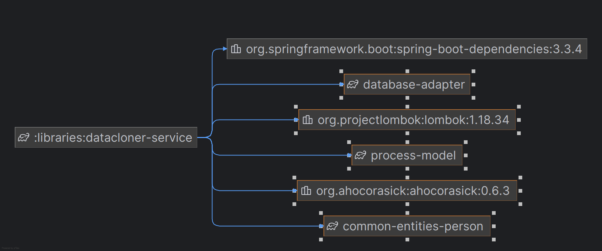

# References

| Reference                                                                           | Title                       | Author         |
|-------------------------------------------------------------------------------------|-----------------------------|----------------|
| [Demo](https://goto.netcompany.com/_layouts/15/CaseApp/Case/JumpTo.aspx?ID=7242100) | DataClonerDemo.mp4          | Netcompany A/S |
| [WI](https://source.netcompany.com/tfs/Netcompany/NCMCORE/_workitems/edit/153879)   | Feature 153879: Data cloner | Netcompany A/S |

# Introduction

The Data cloner allows users to copy and mask an entity and all its related entities into a JSON file from one
environment (often prod or preprod) and add it to a different environment (often locally) via decloning. This allows for
easier recreation of bugs and makes it easier to find test data that fulfills specific requirements.

The cloner library is a set of classes that allow projects to make masked complete copies of entities on environments
and load them onto lower environments or developer PCs.

## Target Audience

This document is intended to be read by any developer implementing the data cloner to their own project, maintaining
data cloner configurations, setting up new masks, or similar in their project.

The data cloner is maintained in Amplio and new functionality should be added there. On the project side, you must maintain
configurations such as masks and cloning restrictions to ensure the cloner works as expected with your database
structure.

## Developer Requirements

To understand the documentation, a basic understanding of Spring annotations, Hibernate, JPAs, and Amplio is expected.

## Background Information

The purpose of the component is to save significant amounts of time for your colleagues. Some use cases include:

- A developer has been assigned a bug, but the problem is hard to recreate with local data as it’s a weird corner case.
  Here the developer can find the problematic entity on prod (or similar) and clone them to their local setup and
  quickly recreate the issue so they can get straight to debugging.
- A tester has to test a very specific scenario but cannot find test data on the test environment that meets the
  testcase requirements. Here they can find a relevant entity on prod (or similar) which normally has a much larger
  database and copy the specific entity to their test environment and complete the test without having to run a million
  other processes to create the data first.
- A developer has made a major refactor of a process and needs to ensure that the old processes can still be opened with
  the new Java classes (in other words, is it still serializable). Here the developer can start various different forms
  of the process on a test environment and clone them to the local setup with the refactored branch and see if
  everything still works as expected.

### Terminology

| **Term**               | **Description**                                                                                                                                                                                                                 |
|------------------------|---------------------------------------------------------------------------------------------------------------------------------------------------------------------------------------------------------------------------------|
| **Cloner root entity** | The entity wished to clone from one environment to another.                                                                                                                                                                     |
| **Clone**              | A JSON file containing a relation graph and all serialized entities related to the ID of the entity wishing to be cloned to a different environment.                                                                            |
| **Cloner (library)**   | All files, classes, masks, and functionality needed to clone an entity from one environment to the other.                                                                                                                       |
| **Cloning**            | The process of looping through all entities related to the root entity, building the relation graph, detaching and copying the entity. This also includes masking.                                                              |
| **Masking**            | Looping through all entities identified in the previous stages of cloning and applying available masks based on entity type. Also applies the mask found on entities to all string elements and consistently scrambles all IDs. |
| **Decloning**          | Loops through the JSON clone file and relates all the elements on the target environment before replicating them (= persisting them with chosen IDs).                                                                           |
| **Source environment** | The environment where the cloner root entity is cloned from. This is usually prod or a preprod environment.                                                                                                                     |
| **Target environment** | The environment the clone is decloned to. This is normally test/dev or a local developer environment.                                                                                                                           |
| **Replicating**        | Persisting, but with a previously defined ID.                                                                                                                                                                                   |                                                                                                                                                                            |

# High Level Description of the Component

The cloner library provides a straightforward way for testers and developers to get an entity (usually a person) from
one environment to another, including all the data related to it – with relevant masking applied. This means that:

- Test data that is missing in a test dump can be sought out on PreProd, and then cloned to the environment where it is
  needed.
- Problems faced on an environment can be easily replicated by the developers, by cloning the entity to their local
  machine.

To enable cloning on a project, the project should specify:

- What entities can be cloned – e.g., person, corporation, or whatever entities the project uses.
- What should not be cloned. The project sets the boundary of the cloning operation by adding it to their implementation
  of `DataClonerRestrictions`.
- What masking should be applied. The project defines which properties should be masked. They can pick from a library of
  masking functions or create their own solutions.
- Which environments are available as clone sources, and which are available as clone targets.
- Assign the access right `ADM_DATACLONER` to relevant roles.
- Ensure that the data not excluded from cloning is (de)serializable.
- Add the cloner to your admin menu.

Once they have done this, cloning is available in the admin panel of their business application. To use it
they:

<div style="text-align: center;">



</div>

# Introduction to the subject

The data cloner allows users to copy entities from one environment to another environment.

The data cloner relies heavily on hibernate and spring annotations.

The functionality lies in Amplio and should be maintained and expanded in Amplio.

Any project specific restrictions or masks should be handled and maintained by the project in the project.

## Cloning

Cloning is a four-step process:

- Reading the data model
- Applying masking
- Writing the clone file
- Final catch-all masking

### Reading the Data model

The cloner library explores the project's data model using Hibernate annotations. This design was chosen to:

- Reuse existing mapping between data model and code that exists in the JPAs.
- Allow a cloner to be implemented on an existing complex project with minimal overhead (no big set of definitions need
  to be coded).
- Allow a cloner to keep up to date with changes to the data model, without any, or with minimal overhead for the
  developer.

While reading the data model, the cloner maintains:

- A clone queue, of relations that need to be explored.
- A known entities list, that contains the items already cloned.
- An entity relations graph, that shows how everything cloned so far connects to one another.

#### Process Relation

As noted above, the cloner works with a queue of relations to process. Processing a relation is done by:

- Looking up all the entities implied by the relation.
- Processing the entities it found – see below in section [Process Entity](/DD130-Detailed-Design/Data-Cloner#process-entity).
- Storing the entity relations in the entity relation graph. The relation graph links the source and target for the
  relation and holds information of the field, the declaring class and whether this relation has resulted in the first
  discovery of the target or not.

#### Process Entity

Processing an entity is done by:

- Checking if the entity is in the known entities list (in that case we simply add the new relation to the graph).
- Detaching the entity, so we can make changes to it without accidentally modifying the database.
- Identifying all `@OneToOne`, `@OneToMany`, `@ManyToOne` and `@ManyToMany` annotated properties.
- Setting them all to null/empty set/empty list.
- Filtering them using any restrictions defined in the implementation of `DataClonerRestrictions` and adding the
  relations given by the remaining properties to the clone queue.
- Adding the entity to the known entity list.

#### Start of Cloning

The cloner starts by processing the root element.

#### End of the Cloning

When the clone queue is empty, the cloner is done reading the data model.

#### Cloner Queue

The cloner queue contains relations that should be explored. When a new relation is added to the queue, the queue checks
if it already contains this relation (with a different element). If it does, it will merge the two relations, so they
are handled at the same time. For example, let’s say we are processing a list of two events, event-1 and event-2. When
processing the first one, we will add the instruction to explore the relation “find all processes relating to event-1” to
the cloner queue. Then we process the second one and add the instruction to “find all processes relating to event-2” to
the cloner queue. This is merged and becomes an instruction to “find all processes relating to event-1 or event-2”.

This is, of course, a bit more complex than the alternative of just exploring each relation each query one by one. The
reason this is chosen is to avoid making too many database queries, and thereby potentially negatively affecting the
performance of the application while cloning.

#### Progress During Reading

The progress of the cloner is written to the user session while cloning is happening, to enable displaying some
information about what is going on in the UI to make the cloner feel more responsive, and to help with debugging.

#### Handling Missing Entity Restrictions Gracefully

If the project forgets to specify the necessary entity restrictions on, for example, a new table added by an
inexperienced developer, the cloner could potentially try to clone very large amounts of data. There are two mechanisms
to try and avoid this:

- Hard limit for maximum number of total entities cloned – if passed, the cloner will terminate. This value is configurable 
and is set via the property `amplio.cloner.service.entityClonerLimit`.
- Hard limit for the number of entities to clone based on one field – if passed, the cloner will terminate. This value is configurable
  and is set via the property `amplio.cloner.service.fieldCloneMaximum`.

#### History Tables

The cloner does not clone from history tables.

In general, it is assumed that history tables do not have the appropriate indexes to allow fast lookups, and
furthermore, that the data in the history table does not, in general, influence functional aspects of the system.

### Initial Masking and Creation of Masking Context

A `MaskingContext` is created. Using this, data can be shared between maskings, which can be used to mask duplicate data
identically each time (for example, a CPR number which is both in the Person table, and in the process context of a
task).

The `MaskingContext` is a class with functionality to apply the mask and a map containing old values as map-keys and new
masked values as map-values. The context is made by:

- Looping through all the cloned entities and finding their assignable `DataMaskApplyer`.
- If no `DataMaskApplyer` is found, then a line is added to the cloning log, and we continue looping.
- If a `DataMaskApplyer` is found, then it is applied.
- If multiple assignable `DataMaskApplyer` implementations are found, then the one with the highest priority is applied.
- When applying a mask, the `DataMaskApplyer.apply` function is called. The masks work by masking all necessary
  variables on the entity, while any newly identified variables that need masking are saved to the `MaskingContext`. It
  is up to the developer writing the mask to ensure that the `MaskingContext` is used and updated accurately when
  creating a new mask. Inspiration should be drawn from the available Amplio masks listed in the below section.

#### Available Masks

You can (and are encouraged to) make your own masks, but the system will always use the default masks if not overridden.

List of Amplio masks and what they mask:

- **DefaultEventMask**
    - Sets `parentId` to null due to wrong use of Hibernate annotation.
- **DefaultNameMask**
    - Masks `firstName`, `middleName`, and `lastName` due to person-sensitive information. Names are set using a list of
      random names. Genders are not considered.
- **DefaultPersonMask**
    - Masks `personKey` due to sensitive information. Birth month and year are kept, but the remaining 6 digits are
      set to random values.
    - Masks `stakeholderIdentifier` to avoid must-be-unique DB requirements.

### Creating the Clone File

To create the clone file, the cloner library simply serializes the known entities list and the entity relation graph it
generated in the previous step using the standard Amplio serialization library. The result is a JSON file.

This design was chosen (over trying to serialize the JPA graph directly with something like
`SerializationHelper.serialize(person)`) for a number of reasons:

- This serialization would require the projects to annotate their JPAs heavily with `@JsonBackReference`. This would
  both be cumbersome to maintain, but also, if forgotten, would cause infinite serialization loops.
- It would cause at least one database call per entity cloned, which might make it slow to the point of not working.
- It would allow less control over masking, history tables, etc. than the solution described.

### Catch-all Masking

After creating a big fat `MaskingContext` and a big fat JSON clone, the JSON goes through the catch-all masking.

This uses the `MaskingContext`’s map of old and new values, along with a (new) map of original entity IDs and newly
created, random IDs. The entire clone (as a JSON string) is then run through a large text replacement function (based on
the Trie Aho-Corasick algorithm for performance) replacing all instances of old values and old IDs regardless of
variable type. This ensures that any identified variables requiring masking (e.g., CPR numbers, names, addresses, etc.)
are caught in any free-text strings such as `task_step_data`, `journalnote` content, or error messages. It also
catches things such as `createdBy` if equal to the citizen’s CPR number from applications created by a citizen in SB
and any other similar values that are easy to forget to mask. So as long as values are masked at least once and added to
the `MaskingContext` then they will be masked for the entire clone.

The IDs are chosen to always be scrambled to enable cloning from, e.g., a test environment to a local environment and to
allow several clones of the same entity if limited test data is available.

## Decloning

When decloning, the cloner uses known entities and entity relationship graph data structures as it did while cloning. It
follows the steps described below.

### Importing the Clone File

To import the clone file, the cloner library simply deserializes the file.

#### Handling Deserialization Errors

Sometimes, changes in the datamodel will make cloned entities unable to be decloned to the target environment. In
general, it is recommended to always clone between environments running the same version of your codebase, to entirely
avoid this issue. In general, however, the cloner attempts to be lenient by enabling `IgnoreUnknown` on the
deserializer.

If the cloner fails due to deserialization, nothing is written to the target environment. As the clone file is JSON, and
reasonably human-readable, simple fixes are possible to do “by hand”.

### Check if the Entity Already Exists

If an entity with the same ID and type as the root entity already exists, then the decloning never begins and an alert
is shown to the user instead.

This is because IDs on the entities its cloning will duplicate the IDs. The reason IDs are not simply overwritten with
new values is that such IDs also exist in serialized data, which will cause unpredictable behavior for the clone on the
target environment.

### Writing to the Datamodel

Decloning is done by first connecting all the entities to each other using the entity relation graph. Looping through
all the entities, the entities are connected to each other using reflection.

The original relation that originally “found” the entity is identified and applied. An example of this would be the
entity Event, that was originally found as part of the set of events on the root entity person. Using
reflection, the field `events` on the root entity is set to include the entity Event being handled.

After looping through all entities setting the original relations, all remaining relations are set using similar
reflection logic.

When all the entities are related as they were on the original environment it is time to persist the entities. However,
the cloner has already masked the values and scrambled the IDs, and we want to keep all the chosen IDs to avoid
unexpected behavior due to strings or similar containing entity IDs. The entities are therefore in a weird pseudo state
between transient and detached because they do not exist in the database, but they have IDs. To get the entities to the
target environment we must therefore use the action “replicate” rather than “persist” or “save”.

To replicate all the entities a continuous loop is used, looping through the list of entities to replicate. It is
determined if the entity can be replicated based on reflections and Hibernate annotation, while comparing with the
already replicated entities. If, when the entity JPA is translated to a database table row, the row would only contain
values and FK to already replicated entities, then it is replicated.

#### Progress While Writing

The progress of the cloner is written to the user session while cloning is happening, to enable displaying some
information about what is going on in the UI to make the cloner feel more responsive, and to help with debugging.

#### Avoiding Database Errors

The order of persisting items depends on their dependencies cross-referenced with their JPAs. Avoiding foreign key
restriction errors therefore depends on the nullable property being set correctly in the JPA annotations.

#### Handling Other Problems in the JPA Definitions

As explained above (section 5.2.3) the cloner writes to the database using replicate. This method writes one entity at a
time and in the defined order. If the entity JPA has explicit cascade annotation, as in the below code snippet, then the
entity manager will attempt to persist the related entities. The below snippet is from the Amplio class `Document`, so when
an entity of type `Document` is replicated, then the system will attempt to persist the related `DocumentRelation`. This
will cause an attempted-to-persist-detached-entity exception to be thrown. The cloner handles this manually by adding
the entity to the database, using reflection and annotations to create the necessary SQL query. The entity+field with
the explicit cascade definition is added to the log in case of issues with the manual query.

```java
@OneToMany(fetch = FetchType.LAZY, mappedBy = "documentByDocumentId")
private Set<DocumentRelation> documentRelationsForDocumentId = new HashSet<DocumentRelation>(0);
```

The order of replication is determined based on expected foreign key exceptions, but there is a risk that the list of
entities still not replicated is limited to a small amount of entities dependent on each other. In this scenario, the 
system will attempt to replicate a random entity. If the replication does not result in any foreign key exceptions 
or similar, then the infinite loop was avoided, but if an exception is thrown, then the decloner fails and rolls back 
all replications.

#### Handling Database Errors

If any error occurs, the decloning is cancelled, and the transaction rolls back.

An error will be shown with red writing to ease debugging, along with a summary log shown in the decloning status window
and an option to download the full log.

### Output

The cloner outputs the ID of the root element, shown in the UI. A button with a link to the entity page is also
displayed.

## Frontend

The cloner library includes a simple frontend, accessible from the `/datacloner` endpoint.

The cloner tab accessed on an environment configured as both source and target can be seen in Figure 1. The same tab
after use (cloning from and to the same environment) can be seen in Figure 2.

<div style="text-align: center;">



<h5>Figure 1: Cloner tab accessed before use</h5>
</div>

<div style="text-align: center;">



<h5>Figure 2: Cloner tab accessed before use</h5>
</div>

As illustrated, the UI is split into two columns. The first column is used for cloning, the second column is used for
decloning. In each column, there are three sections. Each section appears after the previous section has been completed.
Below is a description of each area with numbers referring to the markings in Figure 2.

1. Here the user picks what they want to clone, by filling out what root entity type they want to clone (populated based
   on the `ClonerRootEntity`), and what element ID they want to clone. Then press the button “Start cloning!”.
2. Here the status of cloning will appear. If there was an error with the ID or similar, then an alert box will appear
   here. If running like normal the summary log will be displayed in the text area, as it is running.
3. Once the cloner has completed, two buttons will appear. One to download the complete log and one to download the
   clone (JSON file).
4. Here the user can select a file to declone from, and press “Start decloning!”.
5. Here the status of the decloner will appear, similarly to area “2”, as it is running.
6. When decloning is complete the ID of the cloned entity will appear along with the option to download the complete log
   and if the entity is a person, then there will be a button with a link to the person overview (opening in a new tab).

The front end is part of the administration module and is written in React.

# Component Configuration

## Code Integration

Apart from the basic configurations, inclusions, and similar listed in
section [Configurable Settings](/DD130-Detailed-Design/Data-Cloner#configurable-settings), the main code integration needed is
implementing the interface for cloning restrictions (`DataClonerRestrictions`), and choosing masks for the entities in your database, as these two
elements are specific to your project (and its database) and not simply cloning functionality.

<a id="411-create-your-own-project-specific-masks"></a>
### Create Your Own Project-Specific Masks

For available masks, see section [Available Masks](/DD130-Detailed-Design/Data-Cloner#available-masks).

There are different motivations for creating a mask:

- Sensitive information
- The JPA for the entity does not make proper use of the Hibernate annotation causing decloning errors (e.g.,
  `abstract_event`).
- Project database has unique-values-only restrictions on non-ID columns

Below is an example implementation of a mask for the entity `Person`. The implementation masks the `personKey` (
Danish CPR number) due to sensitive information and masks the `stakeholderIdentifier` due to database restrictions
requiring unique values.

```java
@Component
public class PersonMask implements DataMaskApplyer<Person> {
    @Autowired
    private CommonMaskingService commonMaskingService;

    @Override
    public void apply(Person detachedEntity, MaskingContext maskingContext) {
        LOGGER.debug("Successfully reached person masking for: {}", detachedEntity);
        maskPersonKey(detachedEntity, maskingContext);
        maskStakeHolderId(detachedEntity, maskingContext);
    }

    @Override
    public Class getEntityType() {
        return Person.class;
    }

    @Override
    public int getPriority() {
        return 2;
    }

    private void maskPersonKey(Person detachedEntity, MaskingContext maskingContext) {
        if (detachedEntity.getPersonnummerType().equals(PersonNumberType.PERSON_MED_CPR)) {
            maskingContext.maskValue(() -> commonMaskingService.createNewPersonKey(detachedEntity.getPersonKey()),
                    detachedEntity::setPersonKey,
                    detachedEntity::getPersonKey);
        }
    }

    private void maskStakeHolderId(Person detachedEntity, MaskingContext maskingContext) {
        maskingContext.maskValue(() -> commonMaskingService.createNewStakeholderIdentifier(detachedEntity.getStakeholderIdentifier()),
                detachedEntity::setStakeholderIdentifier,
                detachedEntity::getStakeholderIdentifier);
    }

}
```

Below is a snippet from commonMaskingService to elaborate on the above.

```java
private final Random randomGenerator = new Random();
private final DateTimeFormatter personKeyFormatter;

public CommonMaskingServiceImpl(DateProvider dateProvider) {
    this.personKeyFormatter = DateTimeFormatter
            .ofPattern("ddMMuuuu")
            .withZone(dateProvider.getZoneId());
}

@Override
public String createNewPersonKey(String oldPersonKey) {
    LocalDate date = getDateFromPersonKey(oldPersonKey);
    String randomDatePart = getRandomDateInMonth(date).format(personKeyFormatter);
    String randomFourDigits = getRandomDigits(4);
    return randomDatePart.substring(0, 2) + oldPersonKey.substring(2, 6) + randomFourDigits;
}

@Override
public LocalDate getDateFromPersonKey(String personKey) {
    return LocalDate.parse(personKey.substring(0, 4) + "19" + personKey.substring(4, 6), personKeyFormatter);
}

@Override
public LocalDate getRandomDateInMonth(LocalDate date) {
    long firstDayOfMonth = DateUtils.getFirstDayOfMonth(date).toEpochDay();
    long lastDayOfMonth = DateUtils.getLastDayOfMonth(date).toEpochDay();
    long randomDateBetweenDays = ThreadLocalRandom.current().nextLong(firstDayOfMonth, lastDayOfMonth);
    return LocalDate.ofEpochDay(randomDateBetweenDays);
}

@Override
public String createNewStakeholderIdentifier(String oldID) {
    if (oldID == null) {
        return null;
    }
    return oldID.substring(0, oldID.length() - 4) + getRandomDigits(4);
}
```

The following subsections will explain noteworthy points in the above code example.

#### Minimum Requirements to Identify the Mask

You must add the Spring annotation `@Component` (or similar) for the mask to be identified and linked by Spring.

The function `getEntityType()` returns `Person.class`, which means that this mask may be applied to any entity that
extends `Person.class`.

The function `getPriority()` returns 2 as a default Amplio mask works for `abstractPerson.class` with priority 1. Your
project person entity would therefore be able to be masked by both masks, but the higher priority is applied – which is
your own person mask, instead of Amplio’s default `abstractPerson` mask. They are NOT both applied.

#### #apply() Function

Once a mask implementing the entity has been identified, the `apply()` function will be called, with the entity and
`maskingContext` as input. As a developer, it is your job that the masks make the necessary changes on the entity and
save the changes to the `maskingContext`. In this example, the `apply` function is simplified by handling the two
variables in separate functions (`maskPersonKey()` and `maskStakeHolderId()`), where each function calls
`maskValue()`.

#### maskingContext.maskValue()

The `maskingContext` class has a `maskValue()` function that is highly advised to use for any new mask. It takes three
inputs, all methods. The first input is the way to get a new value (in `maskPersonKey`, this is the
`createNewPersonKey` method), the second input is the value setter, and the third input is the value getter.

The `maskValue` function will then compare the various values with the already existing `maskingContext`. If the current
value (e.g., `person.getPersonKey`) already exists in the masking context map, then the matching new value determined
with a previous mask will be applied to the current entity and value. If the current value does not already exist, then
the method of getting a new value will be called (here `commonMaskingService.createNewPersonKey`), and the old value
along with the new value is added to the masking context.

### Implement Restrictions

#### Table exclusions

If some tables should not be cloned due to person-sensitive information that cannot be effectively masked or because it
has too many foreign relations, then the Java class representing the table can be excluded via the
`DataClonerRestrictions` interface.

There are different motivations for excluding entities from being cloned:

- Can contain sensitive information that we are not confident we can mask satisfactorily. E.g., letter content.
- The JPA is not serializable, uses Hibernate incorrectly, or other technical problems with the JPA.
- Single entities of the type point to too many other entities resulting in cloning a major part of the database.

Below is an example implementation of the restriction interface.

```java
@Component
public class DataClonerRestrictionsImpl implements DataClonerRestrictions {

    private static final List<Class> classesNotToClone = new ImmutableList.Builder<Class>()
            //Sensitive information
            .add(DocumentVariant.class)
            .add(Email.class)
            .add(Journalnotat.class)
            //Excluded for technical reasons
            .add(GenderDefinitions.class)
            .build();

    @Override
    public boolean shouldCloneField(Field field) {
        Class<?> fieldType = field.getType();
        if (fieldType.equals(Set.class)) {
            fieldType = getGenericType(field);
        }
        Class<?> finalFieldType = fieldType;
        boolean fieldShouldBeExcluded = classesNotToClone.stream()
                .anyMatch(clazz -> finalFieldType.isAssignableFrom(clazz));
        return !fieldShouldBeExcluded;
    }

    private Class getGenericType(Field field) {
        return (Class) ((ParameterizedType) field.getGenericType()).getActualTypeArguments()[0];
    }

    @Override
    public String getRestrictionInformation() {
        return "The following classes are not cloned: " + Strings.join(classesNotToClone, '\n');
    }
}
```

The function shouldCloneField is called by the cloner when looping from the root entity to find all entities to clone.
In the above implementation the function is evaluated using a denyList named classesNotToClone, but you could choose to
do the opposite and implement an allowList instead – or a combination. There are pros and cons to either approach. The
denyList should be significantly shorter than the allowList. The denyList requires no work from the developer adding a
new table, for the cloner to include the new table, but this also means that a potentially sensitive table will be
cloned if the developer does not know to include it on the denyList.

The getRestrictionInformation function returns all the restrictions.

#### Per entity filtering

It is also possible to implement restrictions on a per entity basis, this is to make it possible to conditionally clone
an entity type without excluding the table completely. Keep in mind that this kind of filtering is done in memory, so be
careful with larger tables.
Just like with masks in section [Create Your Own Project-Specific Masks](/DD130-Detailed-Design/Data-Cloner#create-your-own-project-specific-masks), it is an interface to implement that does the heavy lifting.
An example of a filtering rule can be seen below.

<h5>Example implementation of the restriction interface</h5>

```java
@Component
public class CaseParticipantFilterRule implements EntityFilterRule<CaseParticipant> {
    @Override
    public boolean shouldClone(CaseParticipant entity, CloningContext cloningContext) {
        return cloningContext.isPrimaryOrSecondaryEntity(entity.getPerson())
                || entity.getCase().getCaseParticipants().stream()
                    .map(CaseParticipant::getPerson)
                    .anyMatch(cloningContext::isPrimaryEntity);
    }

    @Override 
    public Class<CaseParticipant> getEntityType() {
        return CaseParticipant.class;
    }

    @Override
    public int getPriority() {
        return 1;
    }
}
```

The following subsections will explain noteworthy points in the above code example.

#### Minimum requirements to identify the filter rule

You must add spring annotation @Component (or similar) for the filter rule to be identified and linked by spring.

The function getEntityType() returns CaseParticipant.class, which means that this filter will be applied to any entity
that extends CaseParticipant.class.

The function getPriority() returns 1 as to override any default Amplio filtering rules with priority 0. Remember they are
NOT both applied, only the highest.

#### shouldClone function

Once a filtering rule implementing the entity has been identified the shouldClone() function will be called, with the
entity and cloningContext as input. Now based on the cloning context primary and secondary entities it is the job of the
filtering rule to either return true or false to answer the question if the entity should be cloned.
It is not possible to modify the cloningContext during filtering, it has to be setup first in the DataClonerRestrictions
setupCloningContext method. By default only the primary entity is added, if more is needed, the method has to be
overridden.

#### Post Data Fetching Filtering: “AdvancedEntityFilterRule”

If you want to clone entities that have a large amount of data, it can be problematic to handle the filtering in-memory
like in section [Per Entity Filtering](/DD130-Detailed-Design/Data-Cloner#per-entity-filtering). The AdvancedEntityFilterRule allows to filter entities on the database level. As this is done
before they are fetched into memory, it can be much faster as less data is fetched and limit the memory usage. But it
requires slightly more work, as the filtering is done by appending to the existing where clause of the original JPQL
string.

It allows the derived classes to express the filtering for a given entity, when the cloner finds it in a one-to-many
relation from the entity itself, and when it is called from another entity in a many-to-one relation.

Example of usage given the following data model:

<div style="text-align: center;">


</div>

```java
@Component
public class PaymentRateFilterRule implements AdvancedEntityFilterRule<PaymentRate> {

  @Override
  public AdvancedFilter.AdvancedFilterBuilder getOneToManyFilter(CloningContext cloningContext) {
    return AdvancedFilter.builder("x.execution.executionPlan.id in :executionPlanIds")
            .withParameter("executionPlanIds", cloningContext.getIdsForTypes(ExecutionPlan.class));
  }

  @Override
  public AdvancedFilter.AdvancedFilterBuilder getManyToOneFilter(CloningContext cloningContext,
                                                                 String fieldReferenceName) {
    return AdvancedFilter.builder(
                    String.format("%s.execution.executionPlan.id in :executionPlanIds", fieldReferenceName))
            .withParameter("executionPlanIds", cloningContext.getIdsForTypes(ExecutionPlan.class));
  }
  // ...
}
```

In the many-to-one relation, the “fieldReferenceName” is the way to get the reference of the current class, e.g.
“x.paymentrates”, as there otherwise is no guarantee what each class pointing to the current class is using for its
field name.

### Cloner root entities

The project must define which root entities the cloner works on. The is done by registering a bean that implement the
ClonerRootEntity interface and returns a list of possible root entities, as below. Further you must also define the url
prefixes for the entity types. This is used by the UI to forward the user to their decloned entity.

```java
@Component
public class ClonerRootEntityImpl implements ClonerRootEntity {

    @Override
    public List<Class<? extends AbstractJpaRoot>> getClonerRootEntities() {
        List<Class<? extends AbstractJpaRoot>> rootEntityClassList = new ArrayList<>();
        rootEntityClassList.add(Person.class);
        rootEntityClassList.add(Corporation.class);
        return rootEntityClassList;
    }

    @Override
    public Map<String, String> getRootEntityAndUrlPrefixMap(String rootEntityId) {
        Map<String, String> urlMap = new HashMap<>();
        urlMap.put(Person.class.getSimpleName(), String.format("/person/%s/overview", rootEntityId));
        urlMap.put(Corporation.class.getSimpleName(), String.format("/entity/overview?vId=%s", rootEntityId));
        return urlMap;
    }
}
```

The list returned by getClonerRootEntities() defines what type of entities the cloner can work on.

## Configurable Settings

For the cloner to be usable on an environment you must configure if the environment should be usable as a target and/or
source environment. If you would like to be able to clone FROM the environment, then `nc.amplio.datacloner.source=true`. If you
want to be able to clone TO the environment then set `nc.amplio.datacloner.target=true`.

Both values default to false if not defined in the application properties. The suggested settings are:

- Prod is either none, or source only.
- PreProd is source only.
- All other, including local, are source and target.

It is also possible to configure various limits – for more info on this see below section.

### ClonerServiceProperties

Optional customization of hard limits for the cloner are set by defining the properties retrieved by the
`ClonerServiceProperties` interface. The config includes the settings listed in the following subsections.

#### Maximum Number of Entities to Clone Based on One Field

Returned with `getFieldCloneMaximum()` and defaults to 2,000. Can be overridden by defining the variable
`amplio.cloner.service.fieldCloneMaximum`.

This is a hard limit set to avoid, for instance, a batch file with one month’s payments that may be linked to thousands
of entities resulting in the majority of the environment being cloned.

If the amount of fields found from one entity reaches the limit set by this variable, then the data cloner will be
terminated and the entity cannot be cloned.

#### Number of Entities Necessary to Trigger a Log Warning

Returned with `getFieldWarning()` and defaults to 500. Can be overridden by defining the variable
`amplio.cloner.service.fieldWarning`.

Particularly helpful when implementing the cloner to identify classes that should be added to the cloning restrictions
defined in `DataClonerRestrictions`.

If more entities than this parameter are found related to the field being cloned, then a warning will be logged.

#### Maximum Number of Fields in One Bundle for Cloning

Returned with `getBundleSize()` and defaults to 500. Can be overridden by defining the variable
`amplio.cloner.service.bundleSize`.

Limit set to avoid database errors, by choosing to bundle the entity IDs before making DB calls to find the entities
related to the field.

#### Maximum Number of Total Entities Cloned

Returned with `getEntityClonerLimit()` and defaults to 50,000. Can be overridden by defining the variable
`amplio.cloner.service.entityClonerLimit`.

This is the maximum number of entities the cloner can find before it terminates. It is assumed that if this many
entities are identified and added to the clone, then the project is missing some restrictions and the cloner is going
down a rabbit hole replicating everything.

## Roles and Rights

For a user to access the data cloner their role will need to have the security right `ADM_DATACLONER`. The right gives
access to seeing the tab and making use of both cloning and decloning.

The right should only be given to users that understand that the clone may only be pseudo-masked and should be treated
as if it contains person-sensitive information.

## Database Patches

No new database tables or system parameters need to be added for the data cloner to work in your project.

It is advised to add a patch defining the related portal texts and a patch assigning the data cloner access right to the
relevant roles.

Example patch for adding new access right to system role can be seen below.

```sql
INSERT INTO ROLE_MAPPING (ID, IDP_ROLE, APP_ROLE, CHANGED, CHANGED_BY, CREATED, CREATED_BY) 
VALUES (uuid_generate_v4(), 'UDK_PENSION_SYSADM', 'ADM_DATA_CLONER', CURRENT_TIMESTAMP , 'SYSTEM', CURRENT_TIMESTAMP , 'SYSTEM');
```

## Migration Information

### Minimum Work for the Datacloner to Work in Your Project:

#### Add Environment Configurations

Enable the cloner on desired environments. See
section [Configurable Settings](/DD130-Detailed-Design/Data-Cloner#configurable-settings).

#### Patch

Patch rights and portal texts, see section [Database Patches](/DD130-Detailed-Design/Data-Cloner#Database-patches).

#### Necessary Inclusions

Include `DataClonerServiceConfig.class` to your application config to include the Amplio cloner
beans etc. that are related with the core data cloner functionality to your application. To use the API you need to also 
add the `DataClonerRestConfig.class` to your configuration to include the rest controllers.

Include the data cloner to your `build.gradle` file for the business application:

```gradle
    api 'nc.amplio.libraries:datacloner-service'
    api 'nc.amplio.libraries:datacloner-rest'
```
To include the Data Cloner front-end components, you need to add the dependency for the Amplio Admin Pages 
to the package.json file of your business application.

```json
    "@amplio/admin-pages": "version"
```

#### Add the Data Cloner Tab to Your Admin Menu

You will need to add the datacloner tab to your admin menu to access the UI.

This can be done by adding the below line to your definitions of administration sub menus. This is not added to the
default admin menu, as it is important for projects to consider restrictions and masks before allowing use of the
cloner.

```java
public static final MenuType DATA_CLONER = MenuType.create("DATA_CLONER", ADMIN, "/datacloner", 14, DataClonerSecurityRoles.SR_ADM_DATA_CLONER);

```

#### Define Root Entities

Implement the `ClonerRootEntity` interface. For more information, see
section [Cloner Root Entities](/DD130-Detailed-Design/Data-Cloner#Cloner-root-entities).

### Required for Safe and Stable Usage (should NOT be released to preprod and prod environments without these):

To ensure stable usage of the data cloner you will need to exclude a number of tables from the cloning process. This is
done by implementing the `DataClonerRestrictions` interface. This is to avoid the data cloner looping through everything
and downloading the entire database from the source environment. There are of course other measures in the cloner that
restrict this from happening, but that means that the data cloner will fail most times if the interface with
restrictions has not been implemented.

For more information on the interface, see
section [Implement Restrictions](/DD130-Detailed-Design/Data-Cloner#Implement-restrictions).

As the source environments will often contain person-sensitive information it is highly advised that you consider your
datamodel and create masks for the entities that contain sensitive information. There are some default Amplio masks, but you
will most likely have to add project-specific masks as well.

For more information on implementing your own masks see
section [Create Your Own Project-Specific Masks](/DD130-Detailed-Design/Data-Cloner#Create-your-own-project-specific-masks), and for available
masks, see section [Initial Masking and Creation of Masking Context](/DD130-Detailed-Design/Data-Cloner#Initial-masking-and-creation-of-masking-context).

Test on many different types of data, for several reasons:

- It is hard to determine which tables should be excluded from cloning. This work has most likely already been done by
  the team creating your mini dump code, so it is advised to see what they exclude from the mini dump and exclude the
  same from the data cloner.
- Some JPAs may not be serializable. This will crash the cloner and can be hard to spot without testing. When
  identifying non-serializable JPAs either correct them to be serializable or add them to the list of restricted
  entities.

# API
The following rest endpoints are exposed by the backend:
- GET /rest/api/cloner/clone: Retrieves a list of available entity types for cloning.
- POST /rest/api/cloner/clone/{entityType}/{entityId}: Starts the cloning process for a specific entity type and ID.
- GET /rest/api/cloner/clone/logs?taskId={taskId}: Fetches real-time logs of the cloning process.
- GET /rest/api/cloner/declone/logs?taskId={taskId}: Fetches real-time logs of the decloning (restoration) process.
- GET /rest/api/cloner/downloadEntireLogClone/{clonerTaskId}: Downloads the complete log file for a cloning/decloning task.
- GET /rest/api/cloner/downloadClone/{clonerTaskId}: Downloads the cloned entity data as a JSON file.
- POST /rest/api/cloner/declone: Starts the decloning  process by uploading a cloned data file.

The above APIs are used by the FE.

# Component Model

The data cloner consists of two modules: Rest and Service. Their gradle dependencies are fairly limited as
seen below.

<div style="text-align: center;">



<h5>Figure 3: Rest module's dependency diagram</h5>
</div>

<div style="text-align: center;">



<h5>Figure 4: Service module's dependency diagram</h5>
</div>

# Data Model

Currently, no new tables are necessary for the data cloner to run – apart from the obvious tables (and JPAs) of data
that needs cloning. The JPAs must extend `EntityId` for the datacloner to clone the entity.

# Future Ideas

This is a list of features which might be nice to implement, but are not part of the current implementation.

- Allowing cloner rules to be configured through the user interface.
- Allow cloning of history tables.
- Snapshot cloning: use history tables, to clone data, as it appeared at some specific time in the past.
- Limit cloning less roughly – e.g., by saving max 3 entities of root entity type, or only clone `Person` table if the
  date is after 2015, etc.
- Add the option to log via database tables to monitor the cloning more closely.
    - Setting up logging options as follows: The cloner can work without a dedicated database table and will log a line
      to INFO when it is used. However, if you create the following table: `table_xxx_cloner_?` and include the
      `ClonerLoggingConfig` in your application, the cloner will also log to this table. The advantages of this are:
        1. Easy to digest overview over cloner usages, which might make the cloner easier to accept for the client from
           a data security perspective.
        2. The cloner keeps track of which tables it clones from each time it runs and will warn you if it’s cloning
           more tables than it did last time. This is helpful in identifying missing cloner restrictions.

# Troubleshooting

## Project Implementations

When applying the feature to your own project, please update this subsection with a link to the project PR introducing
it.

- PE: Pull Request
  233250: [Feature](https://source.netcompany.com/tfs/Netcompany/ATPE0004/_git/ATPE0004/pullrequest/233250) Person
  cloner (NOTE: Also contains PoC data cloner).
- Amplio ref
  app: Pull Request
  244499: [Data cloner](https://source.netcompany.com/tfs/Netcompany/NCMCORE/_git/NCMCORE/pullrequest/244499) ->
  dev (NOTE: Also contains the actual data cloner)

## What if I Don’t Want to Apply the Default Amplio Masks?

Simply write your own mask for the entity and give it a higher priority than the one in Amplio (usually 1 in Amplio).

## Cloning Fails

- Look at the red error code.
- Consider restricting more tables.

## Decloning Fails

- Look at the red error code.
- Ensure same branches on source and target environment.
- You can only declone a clone once to a target environment, after that the ID is taken.
- You may have explicit cascade types defined in your JPAs. Try to delete these from your LOCAL branch before
  decloning – they prevent replication as intended so those entities are manually inserted using reflection.
- Your clone may include a non-(de)serializable entity. Manually remove the entity from your clone and try again.
  Consider if the entity should be added to the cloner restrictions.
- Sometimes the random masks may generate a random value that already exists in your database, but the database requires
  unique values only. Make a new clone from the source environment and try again. (E.g., person mask scrambles CPR
  numbers, but birth month and year may not be scrambled leaving limited available numbers and a CPR number matching
  already existing test data may be created).

