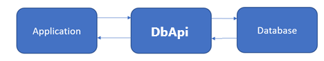
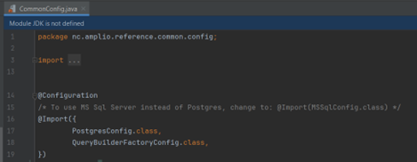
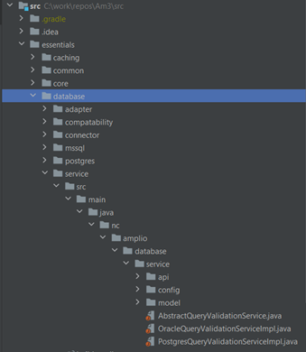
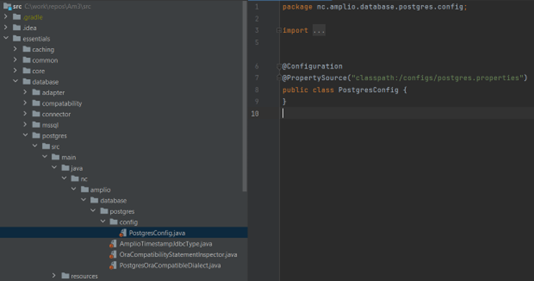
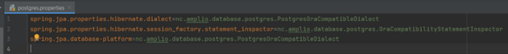
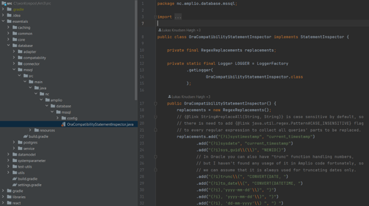
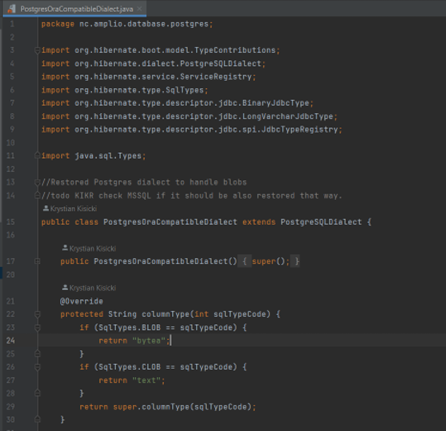

# References

| Reference                                                       | Title                                                                  | Author | Version |
|-----------------------------------------------------------------|------------------------------------------------------------------------|--------|---------|
| [flyway][Flyway_Documentation]                                  | Flyway documentation                                                   |        |         |
| [O0300 – Project setup][O0300_Local_Environment_Setup]          | Project setup document including local DB setup                        |        |         |
| [O0300 - Maintenance Guide - DevOps (Architects)][O0300_DevOps] | Maintenance Guide for Amplio DevOps                                    |        |         |
| [DD130 - Platform][DD130_Platform]                              | Document containing information about datamodel                        |        |         |
| [DD130 - Discard][DD130_Discard]                                | Discard component documentation                                        |        |         |
| [NF4J DD130 - Database][NF4J_DD130_Database]                    | NF4J documentation regarding database                                  |        |         |
| [Oracle Example Branch][ORACLE_EXAMPLE_BRANCH]                  | Branch showing example of how Oracle can be supported in reference app |        |         |

<!-- =============== -->
<!-- REFERENCE LINKS -->
<!-- =============== -->

[Flyway_Documentation]: https://flywaydb.org/documentation/
[O0300_Local_Environment_Setup]: https://goto.netcompany.com/cases/GTE2252/AMPJ/SitePages/Wiki.aspx#/O0300-Maintenance-Guide/Local-Environment-Setup
[O0300_DevOps]: https://goto.netcompany.com/cases/GTE2252/AMPJ/SitePages/Wiki.aspx#/O0300-Maintenance-Guide/DevOps
[DD130_Platform]: /DD130-Detailed-Design/Platform
[DD130_Discard]: /DD130-Detailed-Design/Discard
[NF4J_DD130_Database]: https://source.netcompany.com/tfs/NC02/AMPJ/_wiki/wikis/Foundation%20WIKI/5357/Database
[DD130_Application_Core]: https://goto.netcompany.com/cases/GTE2252/AMPJ/SitePages/Wiki.aspx#/DD130-Detailed-Design/Application-core
[ORACLE_EXAMPLE_BRANCH]: https://source.netcompany.com/tfs/Netcompany/NCMCORE/_git/NCMCORE?path=%2F&version=GBrho%2Ffeature%2Fampj4solon%2Foracle-support-implementation_oracle_readded&_a=contents
# Introduction

Amplio is a common platform that provides base functionality and base domain entities, which rely on services and
queries. Queries can be oriented towards specific databases, and they can use built-in functions that are not present in
some databases or database-types. Queries in Amplio are based on the Oracle database technology, and made compatible
with other databases through automatic selection of the underlying services, based on the type of database used.

Amplio provides a database component, DbApi, for communication with the database. It uses an entity manager for
persisting entities and executing native SQL or JPQL queries. The database component also provides classes at a higher
abstraction level to simplify communication with the application.

<div style="text-align: center;">


</div>

Connection to database is made using the DbApi interface, and its corresponding implementation, DbApiImpl, which exposes
methods for fetching entities, or collections of entities, through the Entity class, SQL queries or JPQL queries. DbApi
also provides functionality for updating and deleting entities. The Application element in the diagram above represents
custom services that can be created by Amplio, or by Amplio-based Application. Amplio supports PostgreSQL & 
Oracle databases. However, for Oracle, migrations are not kept up-to-date and multitenancy is not supported.  

Amplio provides services that can perform basic processing of data, which might use native SQL or JPQL queries. Queries
in Amplio are based on the Postgres database technology, but to ensure that Amplio can be used on different types of
databases, it provides tools that can adjust executed queries “on-the-fly”, so that they are compatible with specific
database type.

This deliverable covers the extension of database technologies imported from NF4J, the database component, and its
features for cross-technology support.

## Target audience

This product is intended for developers with a basic understanding of the Amplio framework who maintain an
implementation of the database component in their project, as well as developers who will implement functionality using
the database layer.
Note that [high level description of the component](#high-level-description-of-the-component), is aimed
at a wider audience of interested parties.

## Purpose

The component purpose is to:

- Extend functionality provided from NF4J
- Provide Foundations interface DbApi, responsible for the database connection
- Provide configuration for projects that will apply automatic adjustment for non-Postgres databases.

Note that this component is an extension of the NF4J Database component. More discussion and example uses of the DbApi
component can be found in NF4J documentation,
see [NF4J DD130 - Database][NF4J_DD130_Database].

## Background information

Amplio’s purpose is to provide a base for projects to build upon. It provides reusable, configurable components. It must
satisfy many requirements, business-related as well as technical, such as database compatibility. It is important to
remember that the databases can define different datatypes, functions, etc. Any custom queries used by Amplio must be
compatible with different types of databases.

- Currently Amplio is supporting:
    - PostgreSQL DB
    - Oracle DB

Note that Amplio uses Java Foundation NF4J, which also provides Database functionalities and contains comparisons
between the mentioned database types. It is highly recommended to read the Foundation document
first [NF4J DD130 - Database][NF4J_DD130_Database].

# High level description of the component

The Amplio Database component provides support for different database types, currently PostgreSQL and Oracle.
After importing components, it will automatically detect the supplied database type. It is designed to speed up the
development process and to provide the best performance for the application. Moreover, the component provides
functionality for tracking changes made in a database, where it detects when a database row was created/updated/deleted
and by whom. Additionally, tracking of data changes is implemented via database history tables and triggers, as
described in Section 6, "History tables", in the Foundations database
document [NF4J DD130 - Database][NF4J_DD130_Database].

# Postgres/Oracle configuration

An Amplio-based application can be configured to use either PostgreSQL or Oracle. This requires importing the correct 
Gradle dependency and Java configuration class. The reference app is set up to support Postgres and updates to Amplio
will only be tested against Postgres.  


The database dependency must be declared in your application's Gradle files. This is done in 
the `\src\reference\common\build.gradle` file to ensure it is available across all modules.

For PostgreSQL add this:

```groovy
api 'nc.amplio.essentials:database-postgres'
```

To use Oracle instead add this:

```groovy
api 'nc.amplio.essentials:database-oracle'
```

After refreshing Gradle, Java configuration should be available for use in a project. It should be added via an @Import
Spring annotation in the solution’s common configuration, so it can be shared across all applications. The common
configuration class is:

```java
\src\reference\common\src\main\java\nc\amplio\reference\common\config\CommonConfig.java
```

The available configuration classes which can be imported into CommonConfig are:

- PostgresConfig
- OracleConfig
- MSSqlConfig

However, notice that MsSql is not yet supported.

Example:

<div style="text-align: center;">


</div>

Configs will automatically replace database Dialect and Inspector components to ensure compatibility.

Datasource will also need to be set, see [Datasource](#datasource) below.

No matter which database vendor is used, any Amplio project will need database migrations for their vendor. For
PostgreSQL, such migrations are maintained in \src\reference\database\scripts\migrations. Migrations are not maintained
for Oracle. A subset of the migrations for Oracle can be found on the
[Oracle Example Branch][ORACLE_EXAMPLE_BRANCH]

Additionally, this bean should be added to both BusinessApiConfig and BatchConfig.
```java
    @Bean
    @Conditional(OracleConditional.class)
    public ChannelMessageStoreQueryProvider channelMessageStoreQueryProviderOracle() {
        return new OracleChannelMessageStoreQueryProvider();
    }
```

The  [Oracle Example Branch][ORACLE_EXAMPLE_BRANCH] 
also contains these changes and shows how the reference app can be configured to use Oracle.

In order for the Database run configurations to work, the files
"remove-db.bat", "reset-db.bat" and "start-patch-db.bat" need to be configured or alternative oracle versions need to be
created. This can also be seen in the [Oracle Example Branch][ORACLE_EXAMPLE_BRANCH].

# Database adapter and services

## DbApi

The Foundations DbApi interface is the adapter responsible for fetching, persisting, and deleting entities in the
database. This interface replaces the former DbAdapter & DbConnector interfaces. DbApi can use Entity objects or
JPQL/SQL-queries. DbApi includes an auto-wired EntityManagerConnector, which is created by Hibernate, based on the
solution’s datasource configuration.
The following code listing presents usage of DbApi for fetching and persisting an entity:

```java
public void rescheduleToNowAndMarkPlannedJobAsManuel(String jobId) {
    Job job = dbApi.get(Job.class, jobId);
    job.setAdHocInitieret(true);
    job.setPlanlagtStart(TimeFactory.getDateTime());
    dbApi.persist(job);
}
```

The following example shows how to use DbApi to execute a JPQL query to fetch a list of entities:

```java
String jpql = "select jok.status).bind(count(jok) from Jobopgavekoersel jok " +
    "where jok.jobopgave.job.id = :jobId “ +“
and jok.koerselsnummer =: execNumber group by jok " +  ".status ";
List resultList = dbApi.jpql(jpql)
    .bind("jobId", jobId,
        "execNumber", BigDecimal.valueOf(executionNumber))
    .getAll();
```

The following example shows how to use DbApi with fluent method chaining of Query methods:

```java
String jpql = "select distinct j.planlagtStart from Job j where " +
    "j.jobtype.id = :typeId and j.adHocInitieret = true” + 
"and j.planlagtStart between :fromDate and :toDate";
return dbApi.jpql(jpql)
    .bind("typeId", jobtype.getId(),
        "fromDate", from, "toDate", to)
    .withOffset(recordNumber)
    .withMaxResults(10000)
    .withTimeout(10000)
    .withLock()
    .getAll();
```

Further examples showing how to use DbApi methods are given in the Foundations database
document [NF4J DD130 - Database][NF4J_DD130_Database].

## DbQueue

DbQueue is provided by Java foundation,
see [NF4J DD130 - Database][NF4J_DD130_Database].

## Query Filter
`@QueryFilter` is provided by Java foundation,
see [NF4J DD130 - Database][NF4J_DD130_Database].

# Revision Interceptor

The RevisionInterceptor class is provided by Java foundation,
see [NF4J DD130 - Database][NF4J_DD130_Database].

# History tables

The History tables concept is described in Section 6, "History tables", in the Foundations database
document [NF4J DD130 - Database][NF4J_DD130_Database].

# Configurations and service extensions

To avoid creating multiple implementations of the same query, there are tools and configurations provided to dynamically
adjust existing queries to a currently used database.

## Database configurations

Amplio provides support for multiple databases, but for them to work in the project, configurations must be imported.
This chapter will describe what steps must be done on the project side to use the capabilities provided by Amplio.

A set of DB configurations can be found in the \src\essentials\database directory. It contains adapter/connector
implementations for establishing DB connection from the application, specific DB configurations (MsSQL, PostgreSQL),
base database queue implementation used for loggers, execution statistics, etc. This database library also contains
services that can be used around DB execution, for example JpqlBuilder, Validation service, selector service (and also
its DB specific implementation).

<div style="text-align: center;">


<h5>Figure 1 Database configuration location</h5>
</div>

To apply database configuration, it is required to import the platform/database library and related configuration. It
will automatically load properties required for database setup.

<div style="text-align: center;">


<h5>Figure 2 PostgreSQL database config</h5>
</div>

@PropertySource annotation should have higher precedence than standard application.properties, and it should override
values automatically after importing.

Property file defines dialects and statement inspectors to use by Spring Boot.

For example – the PostgreSQL properties file is:

```properties
\src\essentials\database\postgres\src\main\resources\configs\postgres.properties
```

<div style="text-align: center;">


<h5>Figure 3 Amplio postgres.properties database configuration properties</h5>
</div>

## Services

There are two ways to import database related services from Amplio:

- Complex application config – Amplio provides complex configurations for application which imports all base
  components (including database), so the project does not need to import everything separately. Documentation for
  configurations can be found in [DD130 – Application Core][DD130_Application_Core].
- Direct import of services – via a dependency in the \src\reference\common\build.gradle configuration file, as outlined
  above, in [Postgres/Oracle configuration](#postgresoracle-configuration).

Services can also be annotated with @Conditional(PostgresConditional.class) or @Conditional(OracleConditional.class) to 
ensure that the are only loaded if the corresponding database type is configured. This configuration should happen in 
the datasource configuration properties. See section [Datasource](#datasource).

## Hibernate Statement Inspector

Amplio provides inspectors to replace incompatible parts of queries for specific databases. Before a query is executed
by Hibernate, the Inspector is invoked and it adjusts the query, by replacing query-parts that are accepted in one
database but not by another.

Inspectors can be found for both PostgreSQL and Oracle databases. Configuration will be added to the application
automatically after importing PostgresConfig/OracleConfig to application context.

<div style="text-align: center;">


<h5>Figure 4 Statement inspector for the PostgreSQL database</h5>
</div>

## Custom dialects

Dialects are used for a similar purpose to Inspectors, but instead of managing executed queries, Dialects are used for
Datatypes mappings, so that database types are compatible.

<div style="text-align: center;">


<h5>Figure 5 Custom PostgreSQL dialect for Oracle compatibility</h5>
</div>

Config will be added to application automatically after importing PostgresConfig/MSSqlConfig to application context.

# Configurable settings

Although Amplio already provides ready-made configurations used by Spring, the project is obliged to configure the
database connection individually. This chapter will touch upon the configurations that the project will have to create.

## Datasource

To be able to connect to a database, a datasource should be defined. It can be defined by application properties –
default configuration, but also by java classes. It is recommended to use the default configuration. Config should
provide information about database URL, username, password, and properties defining behavior of the application in terms
of database configuration.

This is an example of Amplio reference app datasource config
(\src\reference\common\src\main\resources\configs\environment\local\datasource-local.properties):

```properties
#### Comment in below section in order to use postgress for local db
spring.datasource.url=jdbc:postgresql://localhost:5432/ampliodb
spring.datasource.username=amplio_app_user
spring.datasource.password=amplio_app_user
spring.datasource.driver-class-name=org.postgresql.Driver
nc.foundation.essentials.core.database.vendor=postgres

### Comment in below section in order to use oracle for local db
#spring.datasource.url=${IRM_DATASOURCE_URL:jdbc:oracle:thin:@localhost:1521/amplio_pdb}
#spring.datasource.username=${IRM_DATASOURCE_USERNAME:AMPLIO_APP_USER}
#spring.datasource.password=${IRM_DATASOURCE_PASSWORD:AMPLIO_APP_USER}
#spring.datasource.driver-class-name=${DATASOURCE_DRIVER:oracle.jdbc.OracleDriver}
#nc.foundation.essentials.core.database.vendor=${DATABASE_VENDOR:oracle}
#spring.jpa.database-platform=${DATABASE_DIALECT:org.hibernate.dialect.OracleDialect}
```

Note that this snippet of configuration is designed for local development where, for example, the password is stored in
plain text. Configuration for other environments may be different, as they can use externally stored deploy-variables
for security reasons. Also, other connection properties might be different due to different server capabilities (ex. you
might be able to increase allowed active connections etc.). Deployment configurations are described in Amplio
document: [O0300 - Maintenance Guide - DevOps (Architects)][O0300_DevOps].

## Flush on persist

The Foundations DbApi interface removes the former configurable flush() method call, which was provided in the legacy
class DbConnector, in its persist() method. Flushing behavior is now controlled by the Hibernate property: "
org.hibernate.flushMode", which by default is set to value “FlushMode.AUTO” in method
flushModeHibernatePropertiesCustomizer() in Foundations class DatabaseConfig:

```java
@Bean
public HibernatePropertiesCustomizer flushModeHibernatePropertiesCustomizer() {
    return properties -> {
        properties.put("org.hibernate.flushMode", FlushMode.AUTO);
    };
}
```

This FlushMode.AUTO setting means that a Hibernate Session is sometimes flushed before query execution, in order to
ensure that queries never return a stale state.

Note that DbApi method calls which return a Query object (e.g., a JplQuery or an SqlQuery) have the option to include a
.withFlush(boolean flush) chained method as part of the query, if required.

# Troubleshooting

