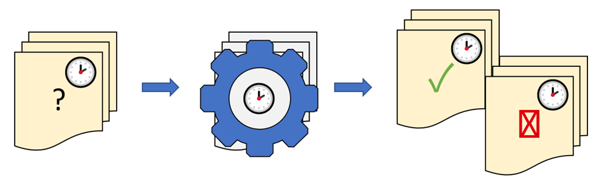
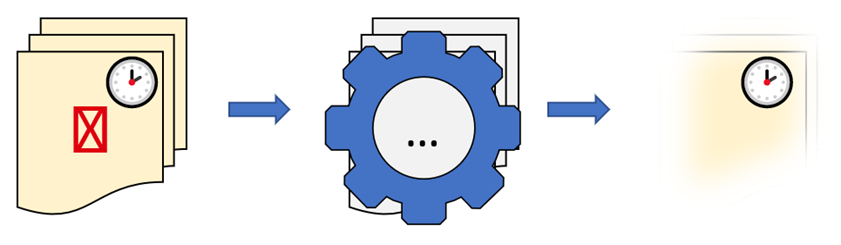
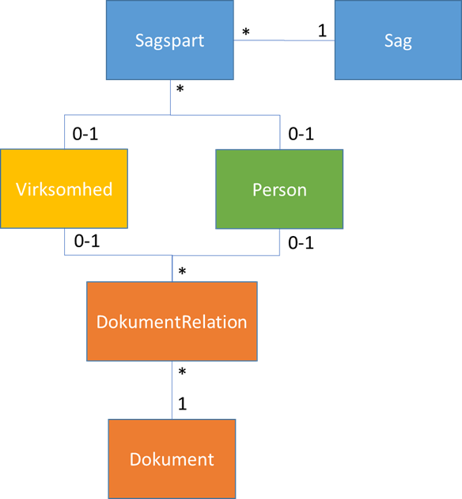
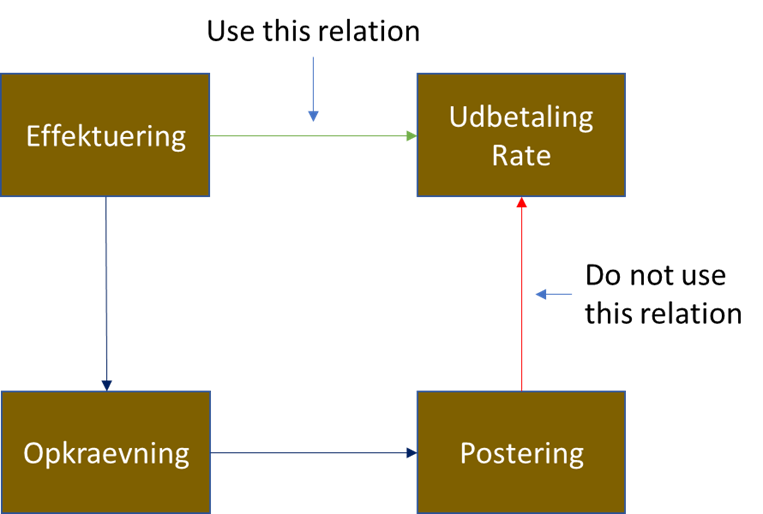
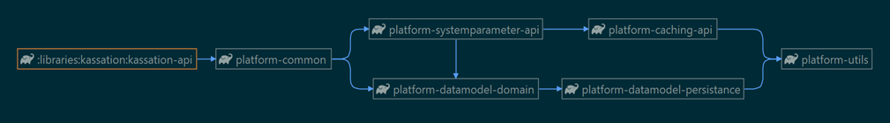
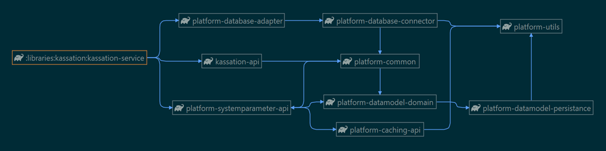

# References:

| Reference                                                          | Title                                  | Author             | Version    |
|--------------------------------------------------------------------|----------------------------------------|--------------------|------------|
| [Databeskyt. lov](https://www.retsinformation.dk/eli/lta/2018/502) | Databeskyttelsesloven                  | Justitsministeriet | 23.05.2018 |
| [DD130 – Batch engine](/DD130-Detailed-Design/Batch-engine)        | DD130 - Batch Engine (Detailed design) | Netcompany A/S     | Current    |
| [DD130 – Database](/DD130-Detailed-Design/Database)                | DD130 - Database (Detailed design)     | Netcompany A/S     | Current    |

# Introduction

"Kassation" is a Danish term, in this context referring to the process of discarding (physically deleting) data that is
no longer desirable. The definition of "desirable" may vary between systems and is primarily dictated by Danish law,
see [Databeskyt. lov](https://www.retsinformation.dk/eli/lta/2018/502) for information.

The component described in this deliverable, subsequently referred to, as "the Discard component", is designed for the
purpose of maintaining/discarding data, based on related meta-information, and maintaining data-subscriptions to other
parties.

## Target audience

This deliverable is aimed at developers with fundamental understanding of the Amplio platform, who maintain the Discard
component implementation in their project, as well as developers who wish to migrate the component into their solution.

Note that section 0 The discard component provides out-of-the-box functionality for robust data-maintenance, which
fulfils the requirements of personal data laws and regulations. By including the component's services, configurations,
and batch job templates, an Amplio-based project can accelerate development and comply with personal-data regulations
promptly, while drawing from the robustness of production-tested business logic and procedures.

## Developer requirements

The reader of this deliverable is expected to understand the basics of building batch jobs in Amplio solutions,
see [DD130 – Batch engine](/DD130-Detailed-Design/Batch-engine).

High level description of the component is aimed at a wider audience of interested parties.

## Purpose and background information

The discard component provides out-of-the-box functionality for robust data-maintenance, which fulfils the requirements
of personal data laws and regulations. By including the component's services, configurations, and batch job templates,
an Amplio-based project can accelerate development and comply with personal-data regulations promptly, while drawing
from the robustness of production-tested business logic and procedures.

# High level description of the component

The Amplio Discard component is tailored for data- and subscription-maintenance with focus on Danish laws and
regulations regarding personal information. The component is highly configurable and allows for tuning both time-related
and data-related constraints. The component is self-contained and provides out-of-the-box support for core-entities in
Amplio projects, see Figure 4 Core-entities in Discard component.

<div style="text-align: center;">


<h5>Figure 1 Amplio Discard Component</h5>

</div>

Based on project-specific configurations and rules the component maintains data for retention and discarding.

<div style="text-align: center;">



<h5>Figure 2 Maintenance of data for retention or discarding</h5>

</div>

After maintenance processing, the discard process constructs, traverses, and discards a hierarchy of entities related to
targeted person-related entities.

<div style="text-align: center;">



<h5>Figure 3 Processing and discarding of entities</h5>

</div>

Finally, if configured by the implementing solution, the 3rd party data process cancels any data-subscriptions related
to discarded entities.

There is also a marking procedure present in the component. This procedure is described in the section named [Marking of
entities to be discarded](/DD130-Detailed-Design/Discard#14-Marking-of-entities-to-be-discarded).

# Introduction to the subject

The component relies heavily on Amplio Batch framework and is centered around the following core-entities:

* SAG
* SAGSPART
* PERSON
* VIRKSOMHED
* DOKUMENT_RELATION
* DOKUMENT

See Figure 4 for details.

<div style="text-align: center;">



<h5>Figure 4 Core-entities in Discard component</h5>

</div>

Discard processing is split between several batch jobs, each responsible for discarding of core entities within an area
and related entities. The chain is executed sequentially, first for SAG-related entities (blue) then DOKUMENT-related
entities (orange) and lastly PERSON entities (green). VIRKSOMHED (yellow) entities are not subject to discarding.

<div style="text-align: center;">


</div>

Whether or not data should be discarded is determined using metadata, centered around SAG entities. Also, discarding
data may not always lead to physical erasure of data, also nullifying fields and “unlinking” foreign-key relations, more
details on this in ["Put" operations](/DD130-Detailed-Design/Discard#%22put%22-operations). The discard metadata is
expected to change in the SAG entity´s lifetime and
therefore recommended to be maintained by the solution on-the-fly. Note that the SAG discard logic reevaluates the
validity of each SAG’s metadata before carrying out the discard procedure.

The following chapters describe the Discard component features, def4ault configurations, and default behavior.

# Recommended procedures for Discarding

The Discard batch jobs should be carefully planned and supervised manually, and the following steps should be performed
in conjunction with the run:

1. Make a dump of PROD data
2. Import the newly exported PROD data into PREPROD and rehearse the discarding procedures
    * Go through the project-specific checklist and testcases for validating results of the discarding procedures
        * If a checklist does not exist for you project, create one. Get inspiration from other Amplio-based projects
          that have executed these procedures
        * Keep the checklist and testcases up to date
    * Try document-discarding procedure before case-discarding procedure and verify that no discarding was performed
3. Execute discard procedures in PROD
    * Discard batch jobs should be rerun after success, to verify that an extra run has no effect. On deletion of PERSON
      entities, there is a known condition where Fuldmagtshaver is only deleted if Fuldmagtsgiver is deleted first. As
      there is no order on batch job items, this can require a rerun for completeness
4. If something bad happens – reimport dump from step 1 to PREPROD. Find the Kassation-log from PROD described in
   section [4.6] and identify wrongly deleted data ID's. Recover this data from PREPROD and transfer to PROD

## On-the-fly re-evaluations of discard-date

It is recommended to re-evaluate the discard-date on a per-case basis, during all operations that alter the field
SAG.GYLDIG_TIL. This is because the discard-date will not be automatically reevaluated if the date is far in the future.
Therefore, any operation that can severely shorten the discard-date should cause an active push for reevaluation of the
date.

# Discard metadata

The following sections introduce Discard metadata in detail. The metadata consists of discard-code (kassationskode) and
discard-date (kassationsdato).

## Discard-code (KASSATIONSKODE)

All SAG and DOKUMENT entities are assigned a discard-code (KASSATIONSKODE). The Amplio default

| Value                  | Description                                                                                                                                                                                                                                                                                                                                                                                                                                                                                                        |
|------------------------|--------------------------------------------------------------------------------------------------------------------------------------------------------------------------------------------------------------------------------------------------------------------------------------------------------------------------------------------------------------------------------------------------------------------------------------------------------------------------------------------------------------------|
| B                      | Corresponds to "Bevares" (Preserve). The entity must never be discarded.                                                                                                                                                                                                                                                                                                                                                                                                                                           |
| K                      | Corresponds to "Kasseres efter afslutning" (Discard). The entity may be discarded after latest change to entity or related entities.<br><br>*Note that this code is faulty and therefore its use is discouraged.*                                                                                                                                                                                                                                                                                                  |
| K3M                    | Corresponds to "Kasseres 3 måneder efter afslutning" (Discard X months after latest change to entity or related entities)<br><br>*Note: The date-month and day are not respected in calculation and the result will therefore always be 3 months after the end-of-year for latest change. -Note that this code is faulty and therefore its use is discouraged.*<br><br>Example: Latest change was 23.06.2000. Discard date calculation will result in 31.03.2001 (end-of-year: 31.12.2000 + 3 months = 31.03.2001) |
| KX (X:1, 3, 5, 10, 20) | Corresponds to "Kasseres X år efter afslutning" (Discard X years after latest change to entity or related entities).<br><br>*Note: The date-month and day are not respected in calculation and the result will therefore always be the end-of-year X years after change.*<br><br>Example: Code is K5. Latest change was 17.05.2000. Discard date calculation will result in 31.12.2005                                                                                                                             |

Default discard-codes need to be set by projects when creating SAG / DOKUMENT entities. Administrative DOKUMENT entities
created by Amplio in the administration module of type: VEDHAEFTNING, BESKEDSKABELON, MASTERTEMPLATE are created with
discard-code: **B**.

# Discard-date (KASSATIONSDATO)

The field KASSATIONSDATO is set only on SAG and describes the date the entity is expected to be discarded. Its purpose
is the efficient maintenance of the criteria for discarding of SAG entities, which can be quite complex and is primarily
set on execution of the UpdateKassationsDate batch job designed to update the value. The field should not be used for
any other purposes than the internal logic of Discard components, as the field may not be up to date. The field value
will be analyzed and determined upon discard-procedure execution.

The determination of discard-date on SAG is defined by the implementation of the following service operation:
`KassationService.calculateKassationsdato(Sag)`.

The method has the following default implementation in Amplio:

Kassationsdato = endOfYear(Y) + X years, where X is given by the discard-code (see section [Discard code (KASSATIONSKODE)](/DD130-Detailed-Design/Discard#discard-code-(kassationskode))), and Y is the maximum of
the following dates:

* If outstanding claim(s) (any OPKRAEVNING.AABENT_BELOEB != 0): end of world (31-12-9999)
* If SAG.GYLDIG_TIL > current date: end of world (31-12-9999) otherwise: SAG.GYLDIG_TIL
* **MAX**( any related UDBETALING.DISPOSITIONSDATO )
* **MAX**( any related OPKRAEVNING.AENDRET )
* **MAX**( any related JOURNALNOTAT.ENDELIG_DATO )
* **MAX**( any related DOKUMENT_RELATION.AENDRET )

# Discarding blacklist

In some cases, some entities should not be deleted when the discarding jobs are run, and to enable easy omission, the
blacklist can be used. The blacklist consists of a table, that contains the columns:

| Column name | Description                                                                                                                                                                                                     |
|-------------|-----------------------------------------------------------------------------------------------------------------------------------------------------------------------------------------------------------------|
| entityId    | The ID of the entity that is wanted omitted.                                                                                                                                                                    |
| entityType  | The type of the entity: SAG, DOKUMENT, PERSON etc.                                                                                                                                                              |
| status      | The status determines if the omission of the entityId is active or not. If the status is ACTIVE, the entityId should omitted from discarding, whereas if the status is INACTIVE, the entityId may be discarded. |
| oprettet    | The timestamp of when the entityId was added to the list.                                                                                                                                                       |
| oprettetaf  | The credentials of who created the row. Example: "PEMA - ATPFY-66457"                                                                                                                                           |
| aendret     | The timestamp of when the entityId was changed.                                                                                                                                                                 |
| aendretaf   | The Toolkit case for changing entities in blacklist.                                                                                                                                                            |

When a discarding job is run, it’s checked whether the blacklist should be used (this is done by checking system
constants for each entity_type) and whether the found entities (with the same type of the job with status ACTIVE) are
present in the blacklist. If this is the case, this entity is omitted from deletion.

# Discarding in general

A discard procedure for a core entity is implemented as a batch job. The batch job interacts with discard business logic
through a specific service interface. The interface is called KassationService and exposes the following notable
methods:

First table:

| Method name                       | Description                                                                                                                                                                                                                                                                                                                                                                                                                                                                                                                                                                                                                                                                                                                                                                                                                                                                                                                                                                                          |
|-----------------------------------|------------------------------------------------------------------------------------------------------------------------------------------------------------------------------------------------------------------------------------------------------------------------------------------------------------------------------------------------------------------------------------------------------------------------------------------------------------------------------------------------------------------------------------------------------------------------------------------------------------------------------------------------------------------------------------------------------------------------------------------------------------------------------------------------------------------------------------------------------------------------------------------------------------------------------------------------------------------------------------------------------|
| getMissingOrExpiredCases          | This method fetches a list of IDs of SAG entities, filtering on the following:<br>• Entity's KASSATIONSDATO fits within a given reevaluation period (default 1st day of next year), is not set or EoW (9999)<br>• Entity's KASSATIONSKODE is not B<br>• Entity's SAGSTILSTAND is either 'AFSLAG' or 'BEVILGET' or Entity's SLETTET field is set to 'y' (meaning it is marked for deletion)                                                                                                                                                                                                                                                                                                                                                                                                                                                                                                                                                                                                           |
| getKassationDate                  | This method fetches a given SAG entity's KASSATIONSDATO value as Date type                                                                                                                                                                                                                                                                                                                                                                                                                                                                                                                                                                                                                                                                                                                                                                                                                                                                                                                           |
| calculateKassationsdato           | This method calculates a given SAG entity's KASSATIONSDATO, based on the KASSATIONSKODE value and latest activity related to the entity                                                                                                                                                                                                                                                                                                                                                                                                                                                                                                                                                                                                                                                                                                                                                                                                                                                              |
| updateKassatonDate                | This method updates the KASSATIONSDATO value on a given SAG entity                                                                                                                                                                                                                                                                                                                                                                                                                                                                                                                                                                                                                                                                                                                                                                                                                                                                                                                                   |
| getCasesForDeletion               | getCasesForDeletion fetches IDs of SAG entities, matching on KASSATIONSDATO values earlier than or on the date of processing. Additionally, it verifies that the entity does not have relations to SAG entities, which should not be discarded (based on KASSATIONSDATO values). If the entity is present in the BLACKLIST, it should not be discarded.                                                                                                                                                                                                                                                                                                                                                                                                                                                                                                                                                                                                                                              |
| get\<EntityName>ForDeletion       | getDocumentsForDeletion fetches IDs of DOKUMENT entities, matching only entities without a related SAG entity, and were created more than X years ago. X is derived from the entity's KASSATIONSKODE. Entities with relation to FULDMAGT (power of attorney) are exempt.<br><br>getPersonsToDelete fetches IDs of PERSON entities, matching only persons without relations to SAG, DOKUMENT and active/open OPGAVE entities.<br><br>If the entity is present in the BLACKLIST, based on the ENTITY TYPE, it should not be discarded.                                                                                                                                                                                                                                                                                                                                                                                                                                                                 |
| get\<EntityName>ForMarking        | getDocumentsForMarking fetches IDs of DOKUMENT entities, matching only entities without a related SAG entity, and were created more than X years ago. X is derived from the entity's KASSATIONSKODE. Entities with relation to FULDMAGT (power of attorney) are exempt.<br><br>getPersonsToMark fetches IDs of PERSON entities, matching only persons without relations to SAG, DOKUMENT and active/open OPGAVE entities.                                                                                                                                                                                                                                                                                                                                                                                                                                                                                                                                                                            |
| delete\<EntityName>               | This method executes an underlying Entity-specific discarding component. More on this later in sections [Discarding blacklist](/DD130-Detailed-Design/Discard#Discarding-blacklist), [Discarding in general](/DD130-Detailed-Design/Discard#Discarding-in-general) and [Updating discard date](/DD130-Detailed-Design/Discard#Updating-discard-date).                                                                                                                                                                                                                                                                                                                                                                                                                                                                                                                                                                                                                                                                                                     |
| mark\<EntityName>                 | This method executes an underlying Entity-specific marking component. More on this later in section [Marking of entities to be discarded](/DD130-Detailed-Design/Discard#14-Marking-of-entities-to-be-discarded).                                                                                                                                                                                                                                                                                                                                                                                                                                                                                                                                                                                                                                                                                                                                                                                    |
| postDelete\<EntityName>JobCleanup | This method executes an underlying Entity-specific discarding component for post-operations. More on this later.                                                                                                                                                                                                                                                                                                                                                                                                                                                                                                                                                                                                                                                                                                                                                                                                                                                                                     |
| executeThirdPartyOperation        | This method executes an underlying third-party data maintenance component. This is designed primarily to cover the requirement of cancelling data-subscriptions on PERSON entities after they get discarded.<br><br>See section [12 "Discarding BESKED entities"](/DD130-Detailed-Design/Discard#12-discarding-**besked**-entities) <br><br>Discarding BESKED entities is executed via DeleteBeskeds batch job by the class BeskedKassationImpl, a specialization of KassationEngineImpl. The BeskedKassationImpl implementation provides functionality for handling BESKED entities and BESKED-related entities, based on the Amplio core entities.<br><br>An Amplio-based solution, with additional entities and relations to BESKED is encouraged/required to further extend the BeskedKassationImpl class for handling additional queries.<br><br>The table below contains list of data that is deleted in the default Amplio implementation (Data in corresponding history tables is also deleted). |

| Area   | Entities                                     |
|--------|----------------------------------------------|
| Besked | BeskedRelation, UdgaaendeForsendelse, Besked |

Discarding entities is performed through specializations of the abstract class `KassationEngineImpl`. The abstract class
provides an interface for operations, collections of both standard and specialized search-, update- and delete-queries,
as well as collections for entity-references that need to be updated or deleted. The engine takes an origin object (if
provided) and builds one or more trees of related objects, storing each object ID, using search-queries. The resulting
trees are referred to as “object complex”. Based on the object complex, any provided update-queries are executed and
finally data is discarded with delete-queries.

The `KassationEngine` interface exposes several methods, the notable ones are described in the following table:

| Method name                                                 | Description                                                                                                                                                                                                                                                                                                                                                                                                                                                                                                                                                                                                                                                                                                                                                                                                          |
|-------------------------------------------------------------|----------------------------------------------------------------------------------------------------------------------------------------------------------------------------------------------------------------------------------------------------------------------------------------------------------------------------------------------------------------------------------------------------------------------------------------------------------------------------------------------------------------------------------------------------------------------------------------------------------------------------------------------------------------------------------------------------------------------------------------------------------------------------------------------------------------------|
| run                                                         | This method executes the discarding process for a given entity.<br><br>First it validates the entity against its discard-metadata.<br><br>Upon successful validation, it utilizes provided search-queries to build the "object complex" surrounding the origin-entity. This populates the collections of entity-references that need to be updated/deleted.<br><br>After completing the object-complex it utilizes provided update-queries to update entities surrounding the origin-entity, which need updating. This is relevant for e.g., entities that should not be deleted, but have a primary-key constraint to the origin-entity.<br><br>Lastly it utilizes provided delete-queries to delete entities around the origin-entity, and finally the origin-entity (deletion of origin-entity may be overridden) |
| checkIfObjectIsDueForKassation                              | This method is used in the validation step of the run() method. The method should be implemented by child class, as it is entity specific.                                                                                                                                                                                                                                                                                                                                                                                                                                                                                                                                                                                                                                                                           |
| initSearchQueries<br>initUpdateQueries<br>initDeleteQueries | These methods populate the search-, update- and delete-queries of the KassationEngineImpl. Method should be implemented by child class. Method invocation happens in constructor. See detailed description in "[7.2 Query generation and parameters](/DD130-Detailed-Design/Discard#7.2-query-generation-and-parameters)"                                                                                                                                                                                                                                                                                                                                                                                                                                                                                                                               |

# Object complex

The object complex manages data, which should be deleted/updated. The object complex stores identification-information
on processed entities and is implemented as a simple map of `<table_name, List<id>>`.

The KassationEngine generates native SQL queries by mapping object table names to entity Ids. This means that we must
provide all entity table names and specify relations between them manually. To help us with this feat, the engine
provides methods to generate these structures automatically by specifying relations between objects via `putSearch...`,
`putUpdate...` and `putDelete...` methods.

Each relation that is provided to "put methods" is by default added to the relation trees via KassationRelationBuilder.
This is a helper object which stores information about whether we want to delete, update or search for said object and
their hierarchical position in the discarding procedure, where child-parent relation is equivalent of delete
before-after. By default, the root of the tree is the origin entity. Since origin entity is optional, there might be
multiple trees. There is also the option to not provide order for an entity, e.g., when it is not relevant. In this case
there is a separate tree containing all "order-not-important" entities as children of a special root parent. Once all
relation data is inserted in the trees, KassationRelationBuilder provides order lists for search, update and delete via
`buildGeneratedOrderLists()` method. These lists are generated in following manner:

* For search and update, we start with root of the tree and progress through children, level by level
* For delete we start "from the bottom" of the tree and move up, level by level, reverse search-order

# Query generation and parameters

The `putSearch...`, `putUpdate...` and `putDelete...` methods insert data to query-related maps. These maps store:

* SQL queries
* Parameters for SQL queries

Like object complex, mapping is done by relating entity table name to data, in this case there is only one value per
key - a String containing query or table name.

When a put method is called, it generates an SQL query and puts it in its respective map. Put methods help translate
relations between tables into queries, for fetching data by KassationEngine. Another benefit of using them is automatic
order operation derivation. Operation order is derived simply by traversing relations from the bottom back to the root,
where root is our origin object, or top parent in that relation tree if origin object was not specified or this object
is not related in any path to it. These methods should be placed under respective `initSearchQueries()`,
`initUpdateQueries()` or `initDeleteQueries()` and will be called during engine initialization.

## Operation order derivation

Operation order cannot be derived in case of multiple-path relations or relations to the same object from multiple other
objects. Relations must be put between objects once, if there are more than one relation, put shortest path from origin
object. For example, if there is a relation between effektuering and udbetaling_rate, effektuering and opkraevning,
opkraevning and postering, and postering and udbetaling_rate, put only the first relation in and avoid creating
multiple-path relations, leaving out connection between postering and udbetaling_rate. See the following diagram:

<div style="text-align: center;">



</div>

<div style="border-left: 4px solid dodgerblue; background-color: rgba(30, 144, 255, 0.1); padding: 10px; margin-bottom: 10px;">
  <strong>Note:</strong> If udbetaling_rate had foreign key to postering, it would be required to leave out the relation between effektuering and udbetaling_rate, and instead put the longer path..
</div>

## "Put" operations

The put methods allow for specifying whether to delete or update. This is done by:

* Specifying a custom query, containing custom logic for the particular entity
* Specifying unusual relations between entities

DeleteOp flag parameter in the put methods' interface, specifies whether to delete entities found by its relation.

| Method name                                 | Description                                                                                                                                                                    |
|---------------------------------------------|--------------------------------------------------------------------------------------------------------------------------------------------------------------------------------|
| putSearchManyToManyRelationQuery            | Inserts many-to-many relation, where subject is related in many-to-many relation table                                                                                         |
| putSearchCustomQuery                        | Offers option to put in custom query, optionally related entity and specifying an entity, which should be discarded before the subject, for which the custom query is provided |
| putSearchOrphanedManyToManyRelationQuery    | Allows for quick insert of many-to-many relation where subject does not have relations in many-to-many table anymore                                                           |
| putSearchStandardIdRelationQuery            | Generates simple relation query: "Subject relates to relatedTableName"                                                                                                         |
| putSearchIdFromOtherTable                   | Used in case where IDs of subject entity table are stored in otherTable under otherTableFiledName                                                                              |
| putUpdateRelationNullificationQuery         | Nullifies relation field in tableName where field falls under naming convention of "<relatedTableName>_id" before deleting objects, a.k.a. constraint remover                  |
| putDeleteForEntityWithoutId                 | Allows for deletion of entities without IDs (we cannot store their IDs in objectComplex) by adding special delete query to deleteQueries                                       |
| putDeleteForEntityWithoutHistoricTable      | Excludes entity from deletion of historic table by specifying special delete query in deleteQueries (useful if entity has no history table)                                    |
| putDeleteForEntityWithoutIdAndHistoricTable | Combines the above methods. See their description.                                                                                                                             |

For example, calling putSearchStandardIdRelationQuery("bg_person", "person") will insert SQL query to fetch bg_person
IDs from bg_person where field person_id matches person from objectComplex. This information will be later used by the
engine to put found IDs under bg_person in objectComplex.

# Updating discard date

Before executing the actual discard procedures an update of discard metadata (discard-date) is required. This part of
the sequence is executed via UpdateKassationsdate batch job by the KassationService component. Initially the procedure
collects all "missing or expired" cases, based on the following criteria:

* SAG.KASSATIONSDATO <= reevaluationdate (system parameter)
    * OR SAG.KASSATIONSDATO is null
    * OR SAG.KASSATIONSDATO(year) = 9999 (end of world)
* SAG.KASSATIONSKODE != 'B'
* SAG.SAGSTILSTAND matches one of the following ('AFSLAG', 'BEVILGET')
    * OR SAG.SLETTET = 'Y'

All cases found will be run through the update logic described in section [Discard code (
KASSATIONSKODE)](/DD130-Detailed-Design/Discard#discard-code-kassationskode). Only after
successfully completing this procedure is it safe to continue the discarding sequence.

# Discarding SAG entities

Discarding SAG entities is executed via `DeleteCases` batch job by the class `SagKassationImpl`, a specialization of
`KassationEngineImpl`. The `SagKassationImpl` implementation provides functionality for handling SAG entities and
SAG-related entities, based on the Amplio core entities and economy tables. An Amplio-based solution, with additional
entities and relations to SAG is encouraged/required to further extend the `SagKassationImpl` class for handling
additional queries.

The table below lists data that is deleted in the default Amplio implementation (Data in corresponding history tables is
also deleted).

| Area         | Entities                                                                                                                                                 |
|--------------|----------------------------------------------------------------------------------------------------------------------------------------------------------|
| Economy      | ModregningEffektuering, UdbetalingsRate, EffektueringDetalje, Effektuering, Effektueringsplan, EffektueringsBlokade, PlanlagtNedsættelse, BevilgetYdelse |
| Journalnotat | (JournalnotatRelation)                                                                                                                                   |
| Dokument     | (DokumentRelation)                                                                                                                                       |
| Opgave       | (OpgaveSagRelation)                                                                                                                                      |
| Sag          | Sagspart, Afgoerelse, Begrundelse, Klagesag, Sag                                                                                                         |
| Haendelse    | HaendelseRelation                                                                                                                                        |
| Besked       | BeskedRelation                                                                                                                                           |

The POSTERING entities are not removed but all relation to removed entities, (effektuering, modregning_effektuering,
udbetaling_rate) are nullified.

| Footnote | Note                                                                                                                                                            |
|----------|-----------------------------------------------------------------------------------------------------------------------------------------------------------------|
| 1        | The entity can be related to several other entities that are not related to each other. Therefore, they cannot be deleted before the last one is discarded.     |
| 2        | Journalnotat has an opgave_id reference that is not a foreign key. Journalnotat must not be deleted if it still relates to an Opgave that is not to be deleted. |

##	Post-operations

The entities described in the below table are directly or indirectly related to one or more cases so they cannot be part
of deletion of a single SAG entity, instead they are deleted when they are no longer connected to any SAG entity.

| Entity                    | Search criteria                                                                                                                                |
|---------------------------|------------------------------------------------------------------------------------------------------------------------------------------------|
| Sagsrelation              | Find all sagsrelation where both til_sag_id and fra_sag_id is null.                                                                            |
| Udbetaling                | Find all Udbetaling without any UdbetalingRate relation                                                                                        |
| NemkontoOverfoerselStatus | With relation to Udbetalinger found above                                                                                                      |
| Opkraevning               | Find all Opkraevninger without any effektuering and not of the type TREDJEPART                                                                 |
| OpkraevningStatus         | With relation to Opkraevninger found above                                                                                                     |
| OpkraevningBesked         | With relation to Opkraevninger found above                                                                                                     |
| KravRelation              | With relation to Opkraevninger found above                                                                                                     |
| Modregning                | Find all Modregninger without any ModregningEffektuering and in status LUKKET or ANNULERET and not changeded (ændret) within the last 5 years. |
| ModregningRelation        | With relation to Modregninger found above                                                                                                      |

## Post-Operation job

A secondary method to deleting relevant post-sag entities is through the batchjob POST_SAG_KASSATION. This job requires
an override of the batchjob reader and processor to implement the necessary searchqueries and process-strategies for
each post-sag-kassation-type. An post-sag-kassation-type enum should be introduced by the project to facilitate the
logic for each individual type such as OPKRAEVNING or UDBETALING.

This job should run following the SAG_KASSATION job.

# Discarding DOKUMENT entities

Discarding DOKUMENT entities (both primary documents and attachments) is executed via **DeleteDocuments** batch job by
the class **DokumentKassationImpl**, a specialization of **KassationEngineImpl**. The **DokumentKassationImpl**
implementation
provides functionality for handling DOKUMENT entities and DOKUMENT-related entities, based on the Amplio core entities.
An Amplio-based solution, with additional entities and relations to DOKUMENT is encouraged/required to further extend
the **DokumentKassationImpl** class for handling additional queries.

The table below contains list of data that is deleted in the default Amplio implementation (Data in corresponding
history tables is also deleted).

| Area         | Entities                                                                                                                                                                                                                                |
|--------------|-----------------------------------------------------------------------------------------------------------------------------------------------------------------------------------------------------------------------------------------|
| **Dokument** | **Dokument**, **Dokumentvariant**, **DokumentRelation**, **Fuldmagt**, **Masseforsendelse**¹, **UdgaaendeForsendelse**, **FejljournaliseringAarsag**, **IndgaaendeForsendelse**, **Memo**, **MemoAction**, **NgDPBusinessReceiptEvent** |

| Footnote | Note                                                                                                                                                        |
|----------|-------------------------------------------------------------------------------------------------------------------------------------------------------------|
| 1        | The entity can be related to several other entities that are not related to each other. Therefore, they cannot be deleted before the last one is discarded. |

# Discarding **PERSON** entities

Discarding **PERSON** entities is executed via **DeletePersons** batch job by the class **PersonKassationImpl**, a
specialization of **KassationEngineImpl**. The **PersonKassationImpl** implementation provides functionality for
handling **PERSON** entities and **PERSON**-related entities, based on the Amplio core entities. An Amplio-based
solution, with additional entities and relations to **PERSON** is encouraged/required to further extend the *
*PersonKassationImpl** class for handling additional queries.

The table below contains list of data that is deleted in the default Amplio implementation (Data in corresponding
history tables is also deleted).

| Area                        | Entities                                                                                                                                                                                                      |
|-----------------------------|---------------------------------------------------------------------------------------------------------------------------------------------------------------------------------------------------------------|
| **CPR / Beriget grunddata** | **HistoriskeCprNr**, **Beskyttelse**, **AlternativPersonId**, **Civilstand**, **CprStatus**, **Email**, **Telefonnummer**, **Navn**, **Adresse**, **BgOpdateringsaarsag**, **Statsborgerskab**, **Relation**² |
| **Person**                  | **Konto**, **Kontrolmarkering**, **UndtagetOblSelvbetjening**, **Fuldmagt** (where person is fuldmagtsgiver)                                                                                                  |
| **Opgave**                  | **OpgaveSagRelation**, **Opgave**, **OpgaveData**, **OpgaveTrin**, **OpgaveTrinData**, **Ansøgning**, **Kladde**, **RegelEksekvering**, **Regel_begrundelse**, **ArbejdspakkeOpgave**                         |
| **Haendelse**               | **HaendelseRelation**, **HaendelseLock**, **Haendelse**                                                                                                                                                       |

| Footnote | Note                                                                                                                                                            |
|----------|-----------------------------------------------------------------------------------------------------------------------------------------------------------------|
| 1        | The entity can be related to several other entities that are not related to each other. Therefore, they cannot be deleted before the last one is discarded.     |
| 2        | Journalnotat has an opgave_id reference that is not a foreign key. Journalnotat must not be deleted if it still relates to an Opgave that is not to be deleted. |

Note that the **PERSON** entity (and a related third-party entity, such as **BG_PERSON** or **CPR_PERSON**) is not
deleted. It is left behind with no data as a "dummy" person, to allow other parties to relate to them.

For the entity **Person**, all history is deleted, and the following columns are set to null:

* PERSONNUMMER
* PERSONNUMMER_TYPE
* REPLIKERINGSTIDSPUNKT
* ADOPTERET
* UDENLANDSK_ID
* SIDST_ERKLAERET_ENLIG

For the entity **BgPerson**, all history is deleted, and all columns are set to null, except **INTERESSENT_IDENTIFIKATOR
**. This means that the following columns er nullified:

* PERSONNUMMER
* PERSONNUMMER_TYPE
* KOEN
* FOEDSELSDATO
* FOEDSELS_REGISTRERINGSSTED
* UMYNDIGGOERELSESDATO
* REGISTRERING_TID
* VIRKNING_START_TID
* KILDEFIL_TID
* BLOKERET_AF_SYNKRONISERING
* CPRNR_STARTDATO
* CPRNR_SLUTDATO

# Discarding **BESKED** entities

Discarding **BESKED** entities is executed via **DeleteBeskeds** batch job by the class **BeskedKassationImpl**, a
specialization of **KassationEngineImpl**. The **BeskedKassationImpl** implementation provides functionality for
handling **BESKED** entities and **BESKED**-related entities, based on the Amplio core entities. An Amplio-based
solution, with additional entities and relations to **BESKED** is encouraged/required to further extend the *
*BeskedKassationImpl** class for handling additional queries.

The table below contains list of data that is deleted in the default Amplio implementation (Data in corresponding
history tables is also deleted).

| Area       | Entities                                                 |
|------------|----------------------------------------------------------|
| **Besked** | **BeskedRelation**, **UdgaaendeForsendelse**, **Besked** |

# Discarding data subscriptions

The Discard component offers a batch job and procedure for discarding data subscription and general execution of 3rd
party-related operations. The procedure is useful when dependencies, such as data subscriptions on personal information
need to be discarded in relation to discarding personal data.

Consider the following scenario: Some person has a case "A1" in the system and the system is required to discard case A1
because of business-related requirements. All parties related to case A1 need to be discarded as well, based on
regulations on personal data. The discard procedure itself must complete successfully, otherwise the system violates the
regulations, and the data subscription must be cancelled since the data should not be delivered anymore. Since the data
subscription is maintained by a 3rd party, the cancellation requires executing operations on a 3rd party webservice API.

The 3rd party operation may fail because of network or 3rd party related issues, causing either one of the following
problems:

* If the 3rd party operation is invoked as a part of the discarding procedure of the person (in the same transaction) it
  will fail the discarding procedure of the person, leaving the system in violation of the regulations.
* If the operation is invoked in a separate transaction, the person is discarded correctly but leaves the data
  subscription still in effect.

To solve the problems presented above, the Discard component offers a separate data subscription discarding procedure.
To make use of it, the systems is required to create entries in the **INTEGRATION_KASSATION** table based on the data
being discarded.

In the case of discarding a Person, a row entry should be created with the person's 3rd party identifier as **ENTITIY_ID
**, the operation name as **OPERATION** and with **STATUS** "NEW".

Upon invocation, the procedure collects all new entries in the table and execute the operations presented, with the
contents of **ENTITY_ID** as argument for the operation requested.

**Note**: Amplio does not support any operations out-of-the-box, as these are project-specific. However, the projects
need only extend the class **DeleteSubscriptionAdapterService** supplying it with a map of the supported operations as
keys and executable functions as values. The discard data subscription procedure is then ready to handle these
operations. An entry will be marked as failed, if the operation fails, detailing the issue with a message. If the
problem is caused by temporary circumstances, like network or 3rd party, the operation can be retried by simply flipping
the status back to "NEW" and rerunning the procedure/batchjob.

# Marking of entities to be discarded

The discard component offers procedures to mark document and person entities that are scheduled for discarding. These
procedures are similar to the procedures for discarding of document and person-entities (see sections [10 Discarding **DOKUMENT** entities](/DD130-Detailed-Design/Discard#10-Discarding-DOKUMENT-entities) and [11 Discarding **PERSON** entities](/DD130-Detailed-Design/Discard#11-discarding-**person**-entities)) in that they use the same properties to find entities
eligible for discarding, but the actual processing of entities is different.

The marking procedures are executed by the **DokumentKassationMarkingImpl** and **PersonKassationMarkingImpl** classes,
respectively. Both classes are extensions of the **KassationEngineImpl**. They do not do any discarding; they only add
entries to the **KassationMarkering**-table. See Table 6: **KASSATION_MARKING**. The table is truncated in the initial
step by these procedures. The corresponding entries (i.e., documents or persons), are deleted from Table 6:
**KASSATION_MARKING**. This is to ensure that the table is up to date when being populated. Furthermore, the Table 6:
**KASSATION_MARKING** is only used for marking procedures and is not used for the discarding procedures described in
sections 10 Discarding **DOKUMENT** entities and 11 Discarding **PERSON** entities.

# Configurations and service extensions

The Discard component and its features aim to be as much out-of-the-box as possible. However, seeing that most of the
Amplio-based solutions extend the core entity model, related discard-logic extensions are common. The component is
highly extendable and offers both abstract classes and interfaces for project-specific overrides and implementations.

## Code integration

The default discard services, and engine implementations are provided as beans through the configuration
"**KassationServiceConfig**". A solution that wants to integrate the discard component should review the beans in it
before importing, or extending the configuration. An extension is recommended to return project-specific beans for e.g.,
\<Entity>KassationImpl, which is common when solutions extend the core data model. See section [16.1 **SagKassationImpl**](/DD130-Detailed-Design/Discard#16.1-SagKassationImpl-examples)
examples for further information on the subject.

The default discard batch job components are provided as beans through the following configurations:

* **UpdateKassationsDateConfig**
* **DeleteCasesConfig**
* **DeletePersonsConfig**
* **DeleteDocumentsConfig**
* **DeleteIntegrationsConfig**
* **DeleteMarkedCasesConfig**

Like services and engine implementations, the batch job configurations should be reviewed before importing or extending
the configurations. The common extension points are in the service layer and engine implementations; therefore, the
default batch job beans are likely sufficient.

## Configurable settings

This section details the available configurations that can affect the functionality or behavior of the discard library.

### Configuration classes

For an overview of the configuration classes provided by the discard library for inclusion by derivative projects, see
Table 1. Note that these have a one-to-one correspondence with the discarding batch jobs, see [chapter 6](/DD130-Detailed-Design/Discard#6-discarding-blacklist) for details.

| Configuration                  | Component                                |
|--------------------------------|------------------------------------------|
| **DeleteCasesConfig**          | kassation-batchjobs-deletecases          |
| **DeleteDocumentsConfig**      | kassation-batchjobs-deletedocuments      |
| **DeleteSubscriptionConfig**   | kassation-batchjobs-deleteintegrations   |
| **DeleteMarkedCasesConfig**    | kassation-batchjobs-deletemarkedcases    |
| **DeletePersonsConfig**        | kassation-batchjobs-deletepersons        |
| **UpdateKassationsDateConfig** | kassation-batchjobs-updatekassationsdate |

<div style="text-align: center;">

<h5>Table 1: The configuration classes that the discard library provides for configuring its beans, listed by
component.</h5>

</div>

### Application properties

For an overview of the application properties that the discard library is aware of within derivative applications, see
Table 2. Remark that these are all standard application properties within the batch engine, see [DD130 – Batch engine](/DD130-Detailed-Design/Batch-engine)
for details.

| Property                                                         | Default |
|------------------------------------------------------------------|---------|
| batch.DELETE_CASES.maxNumberOfItemsProcessedInParallel           | 16      |
| batch.DELETE_CASES.maxNumberOfItemsInMemory                      | 50      |
| batch.DELETE_DOCUMENTS.maxNumberOfItemsProcessedInParallel       | 4       |
| batch.DELETE_DOCUMENTS.maxNumberOfItemsInMemory                  | 50      |
| batch.DELETE_SUBSCRIPTION.maxNumberOfItemsProcessedInParallel    | 4       |
| batch.DELETE_MARKED_CASES.maxNumberOfItemsProcessedInParallel    | 16      |
| batch.DELETE_MARKED_CASES.maxNumberOfItemsInMemory               | 50      |
| batch.DELETE_PERSONS.maxNumberOfItemsProcessedInParallel         | 4       |
| batch.DELETE_PERSONS.maxNumberOfItemsInMemory                    | 1       |
| batch.UPDATE_KASSATIONS_DATE.maxNumberOfItemsProcessedInParallel | 4       |

<div style="text-align: center;">

<h5>Table 2: The application properties that the minimization framework is aware of, listed with default values.</h5>

</div>

### System parameters

For an overview of the system parameters that the discard library utilizes for derivative applications, see Table 3.
Below follows a brief description of these system parameters and their intended use from the point-of-view of the
derivative project:

- **Backpressure**: The system constants `DeleteCasesJobMaxCases` and `DeletePersonsJobMaxCases` are used for limiting
  the number of entities processed by the `DELETE_CASES_JOB` and `DELETE_PERSONS_JOB` batch jobs, respectively. They can
  be used to impose backpressure on the processing time for these batch jobs.

- **Filtration**: The system constant `integration_kassation_ignore_operations` is used for ignoring types of operations
  within the `INTEGRATION_KASSATION` table used by the `DELETE_SUBSCRIPTION_JOB` batch job. This can be used to disable
  discarding application-specific operations, for example due to temporary outages.

# System Constants

| Type           | Key                                     | Default             |
|----------------|-----------------------------------------|---------------------|
| systemkonstant | DeleteCasesJobMaxCases                  | `Integer.MAX_VALUE` |
| systemkonstant | DeletePersonsJobMaxCases                | `Integer.MAX_VALUE` |
| systemkonstant | integration_kassation_ignore_operations | N/A                 |

<div style="text-align: center;">

<h5>Table 3: The system parameters that the discard library utilizes, listed by type and with default values</h5>

</div>

# Roles and rights

The component introduces no new roles or requirements regarding rights. Since the Discard component is realized as
several batch jobs, a user will be required to have the proper roles and rights to administer batch jobs in the
solution, for executing Discarding procedures.

# Database patches

The component has no associated database patches. It processes solely on Amplio core data-model, without entity
references, except for the `IntegrationKassation` entity. The `IntegrationKassation` entity is relevant only for
solutions that maintain data-subscriptions. In the below snippet, a draft for creating the table `INTEGRATION_KASSATION`
is presented, for inspiration and convenience.

```sql
-- set schema
 
DECLARE
c NUMBER := 0;
BEGIN
SELECT COUNT(1) INTO c FROM user_tables WHERE TABLE_NAME = 'INTEGRATION_KASSATION';
IF (c < 1) THEN
BEGIN
EXECUTE IMMEDIATE 'CREATE TABLE INTEGRATION_KASSATION
	(
		-- BasicEntity columns
		ID VARCHAR2(50)		NOT NULL,
		OPRETTET TIMESTAMP		NOT NULL,
		OPRETTETAF VARCHAR2(500)	NOT NULL,
		AENDRET TIMESTAMP		NOT NULL,
		AENDRETAF VARCHAR2(500)	NOT NULL,
	
		-- IntegrationKassation columns
		ENTITY_ID VARCHAR2(50)	NULL,
		OPERATION VARCHAR2(50)	NULL,
		PRIORITY NUMBER(10)		NULL,
 		STATUS VARCHAR2(50)		NULL,
		MESSAGE VARCHAR2(2000)	NULL
	)';

EXECUTE IMMEDIATE 'ALTER TABLE INTEGRATION_KASSATION
 	ADD CONSTRAINT PK_INTEGRATION_KASSATION
	PRIMARY KEY (ID)
	UNIQUE
	USING INDEX';-
END;
END IF;
END;
/
```

In the below snippet a draft for creating KASSATION_MARKERING table is presented. The table is required if the marking
jobs are used.

```sql
-- set schema
 
DECLARE
c NUMBER := 0;
BEGIN
SELECT COUNT(1) INTO c FROM user_tables WHERE TABLE_NAME = 'KASSATION_MARKERING';
IF (c < 1) THEN
BEGIN
EXECUTE IMMEDIATE 'CREATE TABLE KASSATION_MARKERING
	(
		-- BasicEntity columns
		ID VARCHAR2(50)		NOT NULL,
		OPRETTET TIMESTAMP		NOT NULL,
		OPRETTETAF VARCHAR2(500)	NOT NULL,
		AENDRET TIMESTAMP		NOT NULL,
		AENDRETAF VARCHAR2(500)	NOT NULL,
 
		-- KassationMarkering columns
		ENTITET_ID VARCHAR2(50)      NOT NULL,
		ENTITET_TYPE VARCHAR2(50)    NOT NULL,
	)';
 
EXECUTE IMMEDIATE 'ALTER TABLE KASSATION_MARKERING
	ADD CONSTRAINT PK_KASSATION_MARKERING
	PRIMARY KEY (ID)
	UNIQUE
	USING INDEX';-

EXECUTE IMMEDIATE 'CREATE INDEX IDX_KASSATION_MARKERING_E_TYPE ON KASSATION_MARKING (ENTITY_TYPE)';
END;
END IF;
END;
/
```

# Other requirements and reservations

The discard component services, and interfaces rely on the following modules:

* `platform-systemparameter-api`
* `platform-database-adapter`
* `platform-common`
* `platform-test-common`

Note that the modules get imported along with `kassation-api` and `kassation-service` as transitive dependencies.

# Migration information

To import the discard components the following modules from group 'modulus-ydelse.kassation' should be imported in the
solution's gradle configuration:

# API

For details on the Discard component API, see [chapter Discarding blacklist](/DD130-Detailed-Design/Discard#discarding-blacklist). The design lists the public API methods and explains their
intended behavior. In the following section, `KassationEngine` API usage is explained with examples from
`SagKassationImpl`.

## SagKassationImpl examples

When building a specialized `KassationEngine` component, it is common to extend the `init<Operation>Queries`. In a
Amplio-based solutions the core model is handled in `SagKassationImpl`, `PersonKassationImpl`, and
`DokumentKassationImpl`. If the solution introduces new tables and relations to the core model, this needs to be
reflected in the discarding procedure. The recommended way is to extend these publicly exposed core model components.
E.g., `<Solution>SagKassationImpl` extends `SagKassationImpl`, retaining calls to super and customizing calls to put
methods.

The following examples are taken from `SagKassationImpl` and aim to clarify how the API should be utilized to accelerate
development of discard procedures.

`SagKassationImpl` utilizes various special operations for data-manipulation on entities that do not conform to "
default" discarding. As explained in [chapter Discarding blacklist](/DD130-Detailed-Design/Discard#discarding-blacklist), a discard procedure builds and keeps track of a hierarchy of entities
related to the core entity being discard, in `SagKassationImpl`, the core entity is SAG.

### Method initSearchQueries

The search queries need to be defined for alle entities, directly or indirectly related to the core entity being
discarded. In the following snippet the core entity hierarchy for SAG is defined.

```java

@Override
public void initSearchQueries() {
    putSearchStandardIdRelationQuery(T_SAGSPART, T_SAG, true, true);
    putSearchStandardIdRelationQuery(T_JOURNALNOTAT_RELATION, T_SAG, true, true);
    putSearchStandardIdRelationQuery(T_HAENDELSE_RELATION, T_SAG);
    putSearchStandardIdRelationQuery(T_KLAGESAG, T_SAG);
    putSearchStandardIdRelationQuery(T_AFGOERELSE, T_SAG);
    putSearchStandardIdRelationQuery(T_BEVILGET_YDELSE, T_AFGOERELSE);
    putSearchStandardIdRelationQuery(T_EFFEKTUERINGSPLAN, T_BEVILGET_YDELSE);
    putSearchStandardIdRelationQuery(T_EFFEKTUERINGSBLOKADE, T_BEVILGET_YDELSE);
    putSearchStandardIdRelationQuery(T_PLANLAGT_NEDSAETTELSE, T_BEVILGET_YDELSE);
    putSearchStandardIdRelationQuery(T_BEGRUNDELSE, T_AFGOERELSE);
    putSearchStandardIdRelationQuery(T_DOKUMENT_RELATION, T_SAG);
    putSearchStandardIdRelationQuery(T_EFFEKTUERING, T_EFFEKTUERINGSPLAN);
    putSearchStandardIdRelationQuery(T_EFFEKTUERING_DETALJE, T_EFFEKTUERING);
    putSearchStandardIdRelationQuery(T_UDBETALING_RATE, T_EFFEKTUERING);

    // postering ids are needed for nullification of fks in POSTERING table -nullification is done in the updatequeries
    putSearchCustomQuery(T_POSTERING, T_EFFEKTUERING,
            "select pos.id " +
                    "from postering pos " +
                    "where pos.EFFEKTUERING_ID in " +
                    ":" + T_EFFEKTUERING +
                    " union " +
                    "select pos.id " +
                    "from postering pos " +
                    "join MODREGNING_EFFEKTUERING me on pos.MODREGNING_EFFEKTUERING_ID = me.id " +
                    "where me.EFFEKTUERING_ID in " +
                    ":" + T_EFFEKTUERING +
                    " union " +
                    "select pos.id " +
                    "from postering pos " +
                    "join udbetaling_rate udr on udr.id = pos.UDBETALING_RATE_ID " +
                    "where udr.effektuering_id IN " +
                    ":" + T_EFFEKTUERING, false, null);
    putSearchStandardIdRelationQuery(T_MODREGNING_EFFEKTUERING, T_EFFEKTUERING);
}
```

The putSearchStandardIdRelationQuery is the common practice of looking up related entities. The method accepts the
entity/table name to look for as first argument, the related entity as second (core entity or previously discovered
entity), and optionally the third argument specify if the entity should be deleted while the fourth indicates whether
the relation should be used to look up related history entities for deletion.

The putSearchCustomQuery is used when a boiler-plate query builder does not exist for the scenario, and the custom query
needs to be written “from scratch”. In this case Postering entities are related to Sag through Effektuering entities. It
is however not enough to collect only the IDs of those directly related, but also IDs of any Postering entities that may
be indirectly related, through ModregningEffektuering and UdbetalingRate. These are needed for nullification queries.

###	Method initDeleteQueries

If the hierarchy contains entities that are not standard business entities, special operations may be needed to handle
discarding of these entities. See the following snippet, where “specialized” queries are built for entities
OpgaveSagRelation and HaendelseRelation.

```java

@Override
public void initDeleteQueries() {

    putDeleteForEntityWithoutId(T_OPGAVE_SAG_RELATION, T_SAG);

    putDeleteForEntityWithoutHistoricTable(T_HAENDELSE_RELATION);
}
```

The `OpgaveSagRelation` is handled with a `putDeleteForEntityWithoutId`. This means that the `OpgaveSagRelation` is not
tracked via its own ID, but rather with the ID from the `Sag` entity. The first argument points to the entity being
deleted and the second argument points to the entity it should use to look up the first entity. The individual queries
for each entity are then compiled separately using their respective IDs.

The `HaendelseRelation` is handled with a `putDeleteForEntityWithoutHistoricTable`. This means that `HaendelseRelation`
is not expected to have a corresponding history-entity, see more details about this in section "History tables" in the
detailed design deliverable [DD130 – Database](/DD130-Detailed-Design/Database). If handled by the default deletion
query, the `HaendelseRelation` deletion would produce errors, since the default behavior is to look for a corresponding
entity/table named `HAENDELSE_RELATION_H`.

Note that only one query is expected for an entity. It is therefore important to consider all deviations from standard
and make sure that these are handled within the same delete query. E.g., in a scenario where an entity is tracked with
an external id and does not have a historic table, the method `putDeleteForEntityWithoutIdAndHistoricTable` is needed.
Further deviations may require a fully custom query. Use the existing queries for inspiration.

## Method ``initUpdateQueries``

If the hierarchy contains entities that need to be discarded, without violating constraints on special or multiple
foreign-key relations, special operations may be needed to handle these entities. See the following snippet, where "
specialized" queries are built for entities `Postering`, `Effektuering`, and `Sagsrelation`.

```java

@Override
public void initUpdateQueries() {

    // this is no order update in KassationEngineImpl.run()
    putUpdateRelationNullificationQueryWhereIdPK(T_POSTERING,
            ImmutableList.of(T_EFFEKTUERING, T_MODREGNING_EFFEKTUERING, T_UDBETALING_RATE));

    putUpdateSelfRelationQuery(T_EFFEKTUERING, T_EFFEKTUERING, "update " + T_EFFEKTUERING + " set reguleret_effektuering_id = NULL, aendret = systimestamp, aendretaf = 'DELETE_CASES_JOB' where id in :" + T_EFFEKTUERING);

    putUpdateCustomQuery(T_SAGSRELATION, T_SAG, "update " + T_SAGSRELATION + " set fra_sag_id = null, til_sag_id = null, aendret = systimestamp, aendretaf = 'DELETE_CASES_JOB' where fra_sag_id in :" + T_SAG + " or til_sag_id in :" + T_SAG);
}
```

The `Postering` is handled with a `putUpdateRelationNullificationQueryWhereIdPK`. This means that `Postering` should be
updated, using its own ID as lookup, nullifying the columns that correspond to the table names in the list argument, in
this case: `Effektuering`, `Modregning`, and `UdbetalingRate`. This nullification enables discarding `Effektuering`,
`Modregning`, and `UdbetalingRate` without violating constraints on `Postering`, if they happen to be discarded before.

The `Effektuering` is handled with a `putUpdateSelfRelationQuery`. This means that the `Effektuering` may hold a refence
to a different `Effektuering` entity. Nullification enables discarding without violating constraints when the discard
order is undefined.

The `Sagsrelation` is handled with a custom query. This means that a boiler-plate query builder does not exist for the
scenario, and the custom query needs to be written "from scratch". In this case it is because the entity may hold
multiple references to `Sag` entities, which need to be nullified to avoid violating constraints in discard procedure.

## Component model

The Discard component is divided into 2 sub-components: API and Service. The following sections display their
Amplio-dependency diagrams, as generated by IntelliJ.

<div style="text-align: center;">



</div>

##	Discard / Kassation Service dependency diagram

<div style="text-align: center;">



</div>

# Data model

Although the Discard component interacts with many core entities, it has very few of them itself. The only table related
to the component is `INTEGRATION_KASSATION`, which is populated in relation to subscription closure and external index
removal. This means that there is no data model dependency diagram.


<div style="border-left: 4px solid dodgerblue; background-color: rgba(30, 144, 255, 0.1); padding: 10px; margin-bottom: 10px;">
  <strong>Note:</strong> `INTEGRATION_KASSATION` describes the contents of `INTEGRATION_KASSATION` table. Rows colored gray are
inherited from `BasicEntity` from Amplio core.
</div>

<div style="text-align: center;">

<h5>Table 4: INTEGRATION_KASSATION</h5>

</div>

<table>
<tr>
<th>Column</th>
<th>Description</th>
<th>Type</th>
</tr>
<tr bgcolor="#f0f0f0">
<td>ID</td>
<td>Unique identifier for the INTEGRATION_KASSATION row</td>
<td>UUID (VARCHAR)</td>
</tr>
<tr>
<td>ENTITY_ID</td>
<td>ID of the entity to be processed (usually PERSON)</td>
<td>VARCHAR(50)</td>
</tr>
<tr>
<td>OPERATION</td>
<td>The operation to perform. Identifies which method to invoke to close subscription for the entity</td>
<td>VARCHAR(50)</td>
</tr>
<tr>
<td>PRIORITY</td>
<td>Numeric priority. Lowest value served first. Used for ordering removal in external data indexes such as "Kombit Serviceplatformen SDY"</td>
<td>LONG</td>
</tr>
<tr>
<td>STATUS</td>
<td>Status of the operation in queue</td>
<td>ENUM (see description in Table 5: STATUS enumTable 2: STATUS enum)</td>
</tr>
<tr>
<td>MESSAGE</td>
<td>Result of operation invocation, such as response text, error message and/or stacktrace</td>
<td>VARCHAR(2000)</td>
</tr>
<tr bgcolor="#f0f0f0">
<td>VERSION</td>
<td>Version property used for optimistic locking</td>
<td>INT</td>
</tr>
<tr bgcolor="#f0f0f0">
<td>OPRETTET</td>
<td>Date of creation</td>
<td>DATETIME</td>
</tr>
<tr bgcolor="#f0f0f0">
<td>OPRETTETAF</td>
<td>User responsible for creating the INTEGRATION_KASSATION row (usually system user)</td>
<td>VARCHAR(500)</td>
</tr>
<tr bgcolor="#f0f0f0">
<td>AENDRET</td>
<td>Date of last modification</td>
<td>DATETIME</td>
</tr>
<tr bgcolor="#f0f0f0">
<td>AENDRETAF</td>
<td>User responsible for modifying the INTEGRATION_KASSATION row</td>
<td>VARCHAR(500)</td>
</tr>
</table>
<div style="border-left: 4px solid dodgerblue; background-color: rgba(30, 144, 255, 0.1); padding: 10px; margin-bottom: 10px;">
  <strong>Note:</strong> Table 5: STATUS enum describes the possible values of the “IntegrationKassationStatus” enum.
</div>

<div style="text-align: center;">

<h5>Table 5: STATUS enum</h5>

</div>

| Column      | Description                                                                | Type              | Not null |
|-------------|----------------------------------------------------------------------------|-------------------|----------|
| ID          | -                                                                          | VARCHAR2(50 CHAR) | True     |
| ENTITY_ID   | The id for the entity in question (i.e., either document id, or person id) | VARCHAR2(50 CHAR) | True     |
| ENTITY_TYPE | Can either be 'Document' or 'Person'                                       | VARCHAR2(50 CHAR) | False    |

# FAQ

**If your project implemented the Discard library and found any troubleshooting tips, or questions that you have
answered during implementation, then please add them here.**

