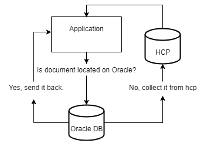
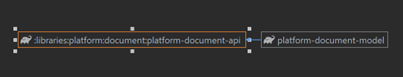
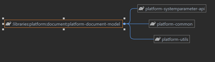
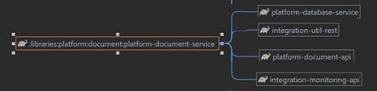
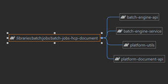
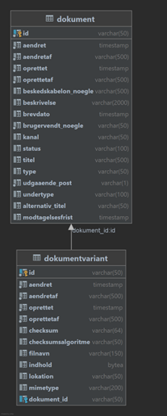

# References

| Reference     | Title                   | Author         | Version |
|---------------|-------------------------|----------------|---------|
| [DD130 – HCP] | DD130 - HCP Integration | Simon Langhoff | 1.1     |

# Introduction

This document describes the detailed design of the document component. Other developers can use the document for gaining
detailed knowledge about the implementation of the component, and how to implement the component in their project. Using
the HCP part of this component assumes that an HCP instance has been setup and this setup and configuring of the HCP
instance into buckets is outside the scope of this document and the component.

## Target audience

The audience is developers, who need to implement changes in the document component or use it in their projects.

## Purpose

The document component should be utilized by projects to persist documents for storage either in the database or in an
HCP (Hitachi Content Platform) instance. The document component itself is comprised of three subcomponents, API, model,
and service, but to transfer documents from the database to HCP at regular intervals a specific batch job component is
needed.

## Background information

The component was created to handle generation, storing and retrieval of documents for an application. The HCP part of
the component was created to move documents from the database to HCP when they are considered final and therefore not
changing anymore.

## Relevant document references

More information about the HCP integration can be found in [DD130 – HCP].

# High level description of the component

The document component and the related batch job provide the configuration and services used to create, store, and fetch
documents either from a database or from a pre-configured HCP instance. It also provides all the DTO objects in the
model component for handling the documents in the application.

# Introduction to the subject

The document component uses HCP (Hitachi Content Platform) which is an object storage system, which Amplio uses to store
final document content instead of storing it in the database. For more information about HCP, please refer to their
website https://www.hitachivantara.com/en-us/products/storage/object-storage/content-platform.html.

The API Component provides interfaces for the services that the service component provides. It also provides a
DownloadUtil that can be used to download a document either from the database or from HCP.

The Model Component provides the java representations for the two tables DOKUMENT and DOKUMENTVARIANT and other related
DTO objects for documents.

The Service Component provides the configuration which should be included in a bean configuration for an application to
use the document component and its services. It also provides the configuration for the HCP connector which is used to
retrieve and upload documents to HCP.

The HCP document component is the batch job which used the document component to find and fetch the documents that
should be transferred to HCP, and the transfer itself is provided by the document component’s service component. See
also [DD130 – HCP].

# Relation between document and variant

A document in the application is represented by a single row in the DOKUMENT table,
see [relation between document and variant](#relation-between-document-and-variant), this contains the
metadata of the document, such as the title, type (brev, notat, anmoding, etc.), sub type (klage, agterskrivelse, etc.)
and description of the document. For each of the documents there is one or more document variants represented by rows in
the DOKUMENTVARIANT table which contains information about what mime type the documents content is and where the
documents content is stored, if the documents content is stored in the database, it is in a CLOB field called indhold on
the DOKUMENTVARIANT.

The three values of a document variant that is used to determine what the content is and where it is stored, first the
mime type column, which is the type that tells that the media type of the content that is stored in either HCP or in the
indhold column. Then there is the location-column which tells where the document’s content is stored, if the value is
null or unset, then the document is stored in the database and is then stored in the indhold-column, if the lokation
value is HCP, this means that the indhold-column does not contain the documents content, but that it is instead stored
in HCP.

# Fetching documents

For fetching documents, the document service or download util is used which by the input document variant fetches the
document content from either HCP or the database. The download util should be used as that includes a few validations,
whereas the document service is more for custom logic. The way both components does this is by the using the lokation
value from the document variant, which represents where the document is store, if the value is HCP, then the document is
stored in HCP otherwise it is stored in the database in the indhold value of the variant.

<div style="text-align: center;">


</div>

To fetch the document from HCP the services make use of the HCP connector service, which creates a GET request using the
document id to create the request URL using a substring of the id to get the directory the document is stored in, given
the id “12345678910” as the id of the document then the directory is the “23”. This means if the endpoint
is “https://hcp-x-y-env.nchosting.dk/rest/” this would mean the final URL used for the GET request
is “https://hcp-x-y-env.nchosting.dk/rest/23/12345678910” the returned body then contains the document contents and is
what is returned by the service.

# Transfer document batch job

For information about how documents are stored in the database, please refer
to [relation between document and variant](#relation-between-document-and-variant). 
The finale documents are stored in HCP and are therefore transferred from the database to HCP using the
DOCUMENT_TRANSFER_JOB batch job, how the documents are stored on HCP and the related configuration of buckets is outside
the scope of this document. The document transfer batch job is not part of the document component itself but instead a
required component to have documents moved from the database to an HCP instance.

The job works by finding all the DOKUMENTVARIANTS rows that contains a document not located in HCP and that are final
and will no longer be changed, only incoming and outgoing documents are transferred to HCP for storing as we are not
interested in storing templates or other similar types in HCP, this means that the documents processed by this job must
fulfill the following criteria

| Criteria                                                                                              | Reason                                                                                                                                                                                                                                            |
|-------------------------------------------------------------------------------------------------------|---------------------------------------------------------------------------------------------------------------------------------------------------------------------------------------------------------------------------------------------------|
| DOKUMENTVARIANT.LOKATION is null                                                                      | This means that the document is stored in the database and therefore can be moved to HCP.                                                                                                                                                         |
| DOKUMENTVARIANT.INDHOLD is not empty                                                                  | This means that the document has content that should be transferred to HCP                                                                                                                                                                        |
| DOCUMENT.STATUS should not be “KLADDE” or “SKJULT”                                                    | This is because documents that are templates (KLADDE) or hidden (SKJULT) are not final and there should not be transferred to HCP.                                                                                                                |
| DOCUMENT.TYPE should not be “VEDHAEFTNING”, “BESKEDSKABELON”, “MASTER_TEMPLATE” or “INDHOLDSSKABELON” | This is because documents of these types are not sent or received from the end-users but instead used by the system to generate letters or sent as part of processes and these should be always available as these are accessed many times a day. |

Each of the documents that fulfill all these criteria read by the batch job reader are transferred to HCP by the
processor of the job. The processor processes each of the documents by first validating that the document content is not
empty, if it is then it reports that batch item as failed with an error code of not found. The transfer itself to HCP is
using a PUT request where it evaluates the request URL in the exact same way as in [fetching documents](#fetching-documents),
this is then the lokation
of the document on HCP. Then based on the http status returned from HCP when the PUT request is completed, if the http
status is OK or CREATED, it then marks the document as transfer to HCP by setting the lokation to HCP and setting the
indhold value to null, thus removing the content from the database. If the http status is not OK or CREATED, then the
transfer of that document is marked as failed.

# Configurations and service extensions

This section will define how to set up the component and what component requirements come along.

## Code integration

The following code integrations must be implemented in the projects when using the document component.

| Code integration        | Description                                                                                                                                   |
|-------------------------|-----------------------------------------------------------------------------------------------------------------------------------------------|
| AbstractDocument        | The abstract JPA class for the document object, which is mapped from the DOKUMENT table, this must be implemented by the project.             |
| AbstractDocumentVariant | The abstract JPA class for the document variant object which is mapped from the DOKUMENTVARIANT table this must be implemented by the project |

It is required by the abstract classes to establish the link between the class extending AbstractDocument and the one
extending AbstractDocumentVariant, how this is accomplished is left to the project, but the intended way is to have a
document id on the document variant such that one document can be linked to multiple variants, but variants are only
linked to one document.

The following code integrations can be extended to create new document types and sub types

| Code integration  | Description                                                                                                 |
|-------------------|-------------------------------------------------------------------------------------------------------------|
| DocumentType      | The document type ExtendableEnum, this can be used by projects to create new types for the documents.       |
| DocumentUndertype | The document subtype ExtendableEnum, this can be used by projects to create new subtypes for the documents. |

## Configurable settings

### Document component

To use the HCP functionality the following values should be specified:

| Key                 | Required or Optional | Description                                                                                                    |
|---------------------|----------------------|----------------------------------------------------------------------------------------------------------------|
| hcp.user            | Required             | The username for the HCP user used in the connector.                                                           |
| hcp.password        | Required             | The password for the HCP user used in the connector.                                                           |
| hcp.endpoint        | Required             | The endpoint for the HCP instance.                                                                             |
| hcp.timeout         | Optional             | The timeout for the HCP connector. Default is 60000 milliseconds.                                              |
| hcp.MaxConnTotal    | Optional             | The total maximum number of connections the HCP connector is allowed to use across all routes. Default is 500. |
| hcp.MaxConnPerRoute | Optional             | The maximum number of connections that the HCP connector is allowed for to use for a route. Default is 50.     |

The component uses the following system parameters:

| Parameter              | Description                                                                                      |
|------------------------|--------------------------------------------------------------------------------------------------|
| supported_file_formats | Used in the AllowedDocumentFormatService to return the allowed file formats, is currently unused |

### Transfer document batch job

The transfer document batch job has the following configurable settings that can be set in a properties file

| Key                                             | Description                                                                                                                      |
|-------------------------------------------------|----------------------------------------------------------------------------------------------------------------------------------|
| hcp.transferMaxNumberOfItemsProcessedInParallel | Property to control how many items are maximum processed in parallel, default is 4                                               |
| hcp.maxNumberOfItemsInMemory                    | Property to control how many items are maximum in memory, default is 1.                                                          |
| hcp.retries                                     | Property to control how many retries the job uses, default is 1                                                                  |
| hcp.sqlReadTimeoutInMilliSeconds                | Property to control the timeout of the SQL used in the reader to fetch documents from the database to transfer, default is 60000 |

## Reservations and namespaces

To use the HCP aspects of the document component, then an HCP instance should already be setup and configured with
buckets. How this is done is outside the scope of this document, but the way the document component resolves where to
store and fetch a document from is described in [relation between document and variant](#relation-between-document-and-variant) as this is
related to how the PUT and GET request are created.

## Database patches

The patch to create it are created by the V4_create_schema.sql patch found in
/reference/database/scripts/ddl/init/V4_create_schema.sql.

## Migration information

The following two sections describe how to add the document and HCP batch job component to a project.

### Document component

Add the following dependencies to the project

```groovy
compile(group: 'modulus-ydelse.platform.document', name: 'platform-document-api', version: modulusYdelseVersion)
compile(group: 'modulus-ydelse.platform.document', name: 'platform-document-service', version: modulusYdelseVersion)
```

Then add the following to a bean config

```java
nc.modulus.ydelse.document.service.config.DocumentServiceConfig
```

This makes the services and components available to Spring. The tables should be created based on the linked patch from
[database patches](#database-patches) and the two abstract classes

```java
nc.modulus.ydelse.document.model.persistance.AbstractDocument
nc.modulus.ydelse.document.model.persistance.AbstractDocumentVariant
```

must be implemented in the application.

### HCP-document batch job

For adding the document transfer job to an application add the following dependencies to the batch application

```groovy
compile "modulus-ydelse.batch.jobs:batch-jobs-hcp-document:$modulusYdelseVersion"
```

Then in a bean config include the

```java
nc.modulus.ydelse.batch.jobs.document.config.DocumentTransferBatchConfig
```

and a patch should be created to insert the new JOBTYPE such that the Amplio batch framework knows the job exists. This
is an example of such a patch, where the JOBTYPE is added only once

```sql
BEGIN
EXECUTE IMMEDIATE 'INSERT INTO JOBTYPE(ID,NAVN,TILLAD_NYT_JOB_HVIS_FEJL,TILLAD_START_ANDET_HVIS_FEJL,STATUS,GENTAGELSESMOENSTER,FORSKYD_TIL_BANKDAG,JOB_KLASSE,OPRETTET,OPRETTETAF,AENDRET,AENDRETAF)
SELECT ''DOCUMENT_TRANSFER_JOB-id'',''DOCUMENT_TRANSFER_JOB'',''Y'',''Y'',''FREE'','' 0 0/15 * 1/1 * ? * '',''N'',''C'',systimestamp,''who-did-this'',systimestamp,''who-did-this'' from dual
WHERE (SELECT count(*) FROM JOBTYPE WHERE navn = ''DOCUMENT_TRANSFER_JOB'') = 0';
EXCEPTION
  WHEN OTHERS THEN NULL;
END;
/
```

# API

The main services and components intended for public usage are the following:

| Service                      | Description                                                                                                                                           |
|------------------------------|-------------------------------------------------------------------------------------------------------------------------------------------------------|
| DownloadUtil                 | Its intended use is to download documents as a byte array, such that they can be downloaded by a browser.                                             |
| AllowedDocumentFormatService | Its intended usage is to return the allowed document types, which is just a wrapper around fetching the system constant “supported_file_formats".     |
| DocumentHelperService        | Its intended use is to make it possible to fetch documents and document variants based on a document’s id and mime type.                              |
| DocumentIdGeneratorService   | Its only usage is to generate a new document business key (brugervendt nøgle), a unique id prefixed with “DOK-“.                                      |
| TemporaryDocumentServiceImpl | Its intended use case is to persist temporary documents (DocumentDO), by taking a DocumentDO and persisting a document and a document variant for it. |
| ZipService                   | Its intended usage is to zip a list of documents such that they can be downloaded as a zip in the browser.                                            |

From these services, the main methods intended for public use are the following:

| Class                        | Method                               | Description                                                                                                                                                                                                                                                                                                                                                                                                                                                                                                |
|------------------------------|--------------------------------------|------------------------------------------------------------------------------------------------------------------------------------------------------------------------------------------------------------------------------------------------------------------------------------------------------------------------------------------------------------------------------------------------------------------------------------------------------------------------------------------------------------|
| DownloadUtil                 | returnDokumentWithResponseBody       | This method takes an HTTP servlet response and a document variant. Based on the document variant, the document is retrieved from either the database or HCP. After successful fetch, metadata is saved to the response before returning the content as a byte array.                                                                                                                                                                                                                                       |
| AllowedDocumentFormatService | getAllowedDocumentTypes              | This method is intended to return the system constant “supported_file_formats".                                                                                                                                                                                                                                                                                                                                                                                                                            |
| DocumentHelperService        | getDocumentByDocId                   | This method takes a single document id and fetches it as an AbstractDocument from the database.                                                                                                                                                                                                                                                                                                                                                                                                            |
| DocumentHelperService        | getDocumentVariantByDocIdAndMimeType | This method takes a document id and a mime type and fetches the first AbstractDocumentVariant of the specific mime type related to the specific document.                                                                                                                                                                                                                                                                                                                                                  |
| DocumentHelperService        | getDocumentDOByIdAndMimeType         | This method takes a document id and a mime type and fetches the AbstractDocument and the AbstractDocumentVariant using the two previous methods and creates a DocumentDO from it.                                                                                                                                                                                                                                                                                                                          |
| DocumentIdGeneratorService   | nextDokumentId                       | This method generates a new document business key (brugervendt nøgle), a unique number id prefixed with “DOK-“.                                                                                                                                                                                                                                                                                                                                                                                            |
| TemporaryDocumentService     | persistTemporaryDocument             | There are two variants of this method, one that takes a DocumentDO and a Document status and one that takes the previous two arguments and then a DocumentType and DocumentUnderType. Both methods do the same: they prepare a document, either by finding it in the database or creating a new one and persisting it, before creating a document variant based on the content from the DocumentDO and persisting it. It returns the input DocumentDO but with both the document id and variant id filled. |
| ZipService                   | genererZipFilFromList                | This method takes a list of document ids that is zipped to a zip file. The first found non-TXT document variant of each of the documents being zipped are added to the zip file.                                                                                                                                                                                                                                                                                                                           |

# Component model

This section shows the component model of each of the document components.

## API

<div style="text-align: center;">


</div>

## Model

<div style="text-align: center;">


</div>

## Service

<div style="text-align: center;">


</div>

## Hcp-document

<div style="text-align: center;">


</div>

# Data model

The table DOKUMENT where the data relating to a document is stored contains the following columns.

| Name                  | Description                                                                 |
|-----------------------|-----------------------------------------------------------------------------|
| ID                    | Unique Id of the document.                                                  |
| BRUGERVENDT_NOEGLE    | Business key related to the document.                                       |
| TITEL                 | The title of the document.                                                  |
| BESKRIVELSE           | The description of the document.                                            |
| TYPE                  | The type of the document.                                                   |
| UNDERTYPE             | A more detailed type for the document, these are often related to the TYPE. |
| BREVDATO              | The date of the document.                                                   |
| KANAL                 | The description of the origin of the document.                              |
| STATUS                | The status of the document.                                                 |
| UDGAAENDE_POST        | A boolean that denotes if the document is outgoing (udgående) post.         |
| BESKEDSKABELON_NOEGLE | The key of the letter template for the document.                            |
| OPRETTET              | When the entity is saved in the database.                                   |
| OPRETTETAF            | Who saved the entity in the database.                                       |
| AENDRET               | When the entity in the database is changed.                                 |
| AENDRETAF             | Who changed the entity in the database.                                     |

The table DOKUMENTVARIANT where the content of a document is stored contains the following columns.

| Name               | Description                                                                        |
|--------------------|------------------------------------------------------------------------------------|
| ID                 | Unique Id of the document variant.                                                 |
| INDHOLD            | The content of the document, i.e., the binary file.                                |
| MIMETYPE           | The MIME type of the document.                                                     |
| LOKATION           | The description of where the variant is physically located, is either null or HCP. |
| CHECKSUM           | The checksum of the document.                                                      |
| CHECKSUMSALGORITME | The algorithm used to create the checksum of the document.                         |
| FILNAVN            | The document's filename including extension. Title is located on Dokument object.  |
| OPRETTET           | When the entity is saved in the database.                                          |
| OPRETTETAF         | Who saved the entity in the database.                                              |
| AENDRET            | When the entity in the database is changed.                                        |
| AENDRETAF          | Who changed the entity in the database.                                            |

## Dependency diagram

<div style="text-align: center;">


</div>

# FAQ

If your project implemented the document library and found any troubleshooting tips, or questions that you have answered
during implementation, then please add them here.