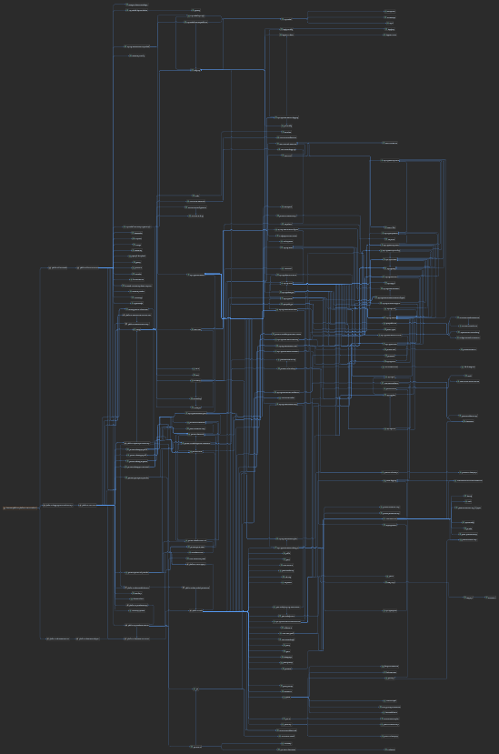
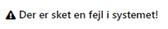
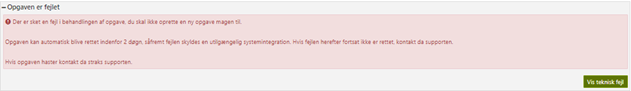
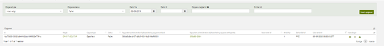
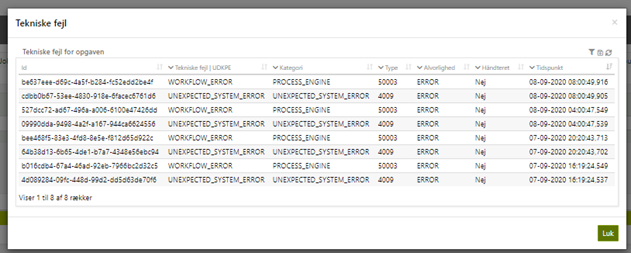

# References

| Reference                                                                                                                   | Title                  | Author           | Version |
|-----------------------------------------------------------------------------------------------------------------------------|------------------------|------------------|---------|
| [DD130 – Error Handling](https://source.netcompany.com/tfs/Netcompany02/NF4J/_wiki/wikis/Documentation/4509/Error-Handling) | DD130 - Error Handling | Kristian Kisicki | 1.0     |

# Introduction

This document describes the detailed design of the error handling component. Other developers can use the document for
gaining detailed knowledge about the implementation of the component.

## Target audience

The audience is developers, who need to implement changes in the error handling component or use them in their projects.

## Purpose

The error handling component is responsible for catching and logging exceptions as technical errors. It provides the
following:

- A controller to view technical errors
- An exception aspect that projects must extend to catch exceptions
- A technical error service to fetch and handle technical errors

## Background information

The component was created to handle errors and log them to a specific table in the database. The table is called
TEKNISKFEJL and contains error type, detail, and time. When an error occurs, it is caught by the exception aspect and
logged to the TEKNISKFEJL table.

## Relevant document references

# High level description of the component

- Provides an aspect to log errors to a database table such that developers can find them later and relate them to tasks
  that failed
- Provides a controller to view the errors found by the above aspect

# FAQ

Consider here questions you could expect from the developer when reading this document and implementing the use of the
component. This section might not be relevant until the document has been trialed by a project. Use this section as a
place to anchor important lessons learned even after finishing the document.

# Data model

The table TEKNISKFEJL where the error is stored contains the following columns.

| Name           | Description                                                                            |
|----------------|----------------------------------------------------------------------------------------|
| ID             | Unique Id of the stored error.                                                         |
| FEJLKATEGORI   | The category of the error e.g. “Error category: Fagsystem”.                            |
| FEJLTYPE       | The error code e.g. “61000”.                                                           |
| TIDSPUNKT      | Time when the error occurred.                                                          |
| HAANDTERET     | Indicate if the error is serviced. This field is not actively used in the application. |
| TITEL          | The name of the error e.g. “No pId or vId param given in URL.”                         |
| FEJLDETALJER   | The stack trace connected to the error.                                                |
| ALVORLIGHED    | Error criticality based on Logging Level e.g “WARNING”.                                |
| OPGAVE_ID      | Id of the task if there is any.                                                        |
| OPGAVETRIN_ID  | Id of the task step if there is any.                                                   |
| SERVER_ID      | The name/IP of the server the system is running on.                                    |
| INPUT          | Used by the integration error and holds the integration intent.                        |
| CORRELATION_ID | An id to correlate the errors.                                                         |
| OPRETTET       | When the entity is saved in the database.                                              |
| OPRETTETAF     | Who saved the entity in the database.                                                  |
| AENDRET        | When the entity in the database is changed.                                            |
| AENDRETAF      | Who changed the entity in the database.                                                |

Add a dependency diagram of the data model introduced by the component, see Deliverables 247: O0300 - Maintenance
Guide - Projects setup.docx, section 3.2.3.9 Create data model dependency graph.

# Component model

<div style="text-align: center;">



</div>

# Configurations and service extensions

## ExceptionAspect configuration (post 5.0)

For details on how to handle exceptions in Amplio 1.0 (aka MY 5.0) please check the Foundation
documentation [DD130 – Error Handling](https://source.netcompany.com/tfs/Netcompany02/NF4J/_wiki/wikis/Documentation/4509/Error-Handling).

## ExceptionAspect configuration (pre 5.0)

The project using this component must implement the following to handle exceptions in their projects.

1. Extend the ExceptionAspect class and put the following annotations on the project class:

    ```java
    @Aspect
    @Component
    @Order(5)
    ```

2. Then implement the init method and have it call the handleException method from the super ExceptionAspect class. This
   is
   also where the @AfterThrowing annotation with the pointcut should be defined. An example of this could be:

    ```java
    @AfterThrowing(pointcut = "(" +
         // include
                "   within(custom.project..*) " +
                "|| within(nc.modulus.ydelse..*) " +
                ") && !(" +
                // exclude
                "   within(nc.modulus.ydelse.integration..*) " +
                "|| within(nc.modulus.ydelse.batch..*) " +
                "|| within(nc.modulus.ydelse..*.batch..*) " +
                ")", throwing = "t")
    public void init(Throwable t) throws Throwable {
       		handleException(t);
        	}
    ```

3. Then implement the two reaming methods getAllowedStackTracePrefixes and getExcludedStackTraceClassNames
   To filter the technical errors logged to the database.
4. Extend the error code class to defined project specific errors, for more information some of the predefined error
   codes in Amplio please refer to [error codes](#error-codes).

# Further details

## Exception handling

The exception handling in Amplio wraps the error thrown in the system and processes this by checking the type of error,
the
stack trace, and root cause. If the error is an integration error, this will be handled separately by the process engine
and if the error isn’t of type CoreException (root exception thrown by the Amplio Core), the error will be mapped to an
Unexpected system error with code 4009 and then saved to the database. Amplio saves the error code, the stack trace, and
some other values to the table TEKNISKFEJL.

## Frontend

The errors that are saved in the database can be found under either Administration - Fejlhåndtering or Administration -
Fejlrapporter. The most useful way to see the errors is to use Fejlhåndtering. There are a couple of ways the error can
be presented. If there is an error related to a table on the website, the table will not be displayed and instead, a
text will be displayed:

<div style="text-align: center;">



</div>

If the error happens in a process, the error will be displayed with the possibility to see the error using the “Vis
teknisk fejl” which will show the stack trace related to the error.

<div style="text-align: center;">



</div>

### Using technical errors

Technical errors give a detailed explanation of what went wrong in the system and are a very useful tool for developers
when trying to fix bugs/defects. Under Administration - Fejlhåndtering (or admin/fejlhaandtering), all tasks that are in
a failed state can be found and all related technical errors can be found and filtered. The page that is accessible via
Administration – Fejlhåndtering is shown below. This will only be accessed if the user has the correct role.

<div style="text-align: center;">



</div>

The errors related to the task can be found by clicking the triangle:

<div style="text-align: center;">


</div>

<div style="text-align: center;">



</div>

The table gives an easy overview of all errors on the tasks with relevant information from the TEKNISKFEJL table. When
clicking on the errors, the related stack trace will be shown.

## Error codes

#### Registered Error Codes (auto-generated)

<!-- ERROR_CODES_TABLE_START -->
> This section is generated by Gradle task `generateErrorCodeTable`. Do not edit manually.

| Code | Name | HTTP | Category | Category range | Logging | Alarm | Message |
|---:|---|---:|---|---|---|---:|---|
| 1100 | BAD_REQUEST | 400 | FOUNDATION_ERROR_CATEGORY.DEFAULT | 1100-2999 | OFF | false | The request cannot be fulfilled due to bad syntax. |
| 1101 | UNAUTHORIZED | 401 | FOUNDATION_ERROR_CATEGORY.DEFAULT | 1100-2999 | OFF | false | Invalid or missing credentials |
| 1102 | FORBIDDEN | 403 | FOUNDATION_ERROR_CATEGORY.DEFAULT | 1100-2999 | OFF | false | Access to the requested resource is forbidden. |
| 1103 | RESOURCE_NOT_FOUND | 404 | FOUNDATION_ERROR_CATEGORY.DEFAULT | 1100-2999 | WARNING | false | The requested resource does not exist |
| 1104 | SERIALIZATION_ERROR | 500 | FOUNDATION_ERROR_CATEGORY.DEFAULT | 1100-2999 | SEVERE | false | Unable to serialize object. |
| 1105 | MAPPER_ERROR | 500 | FOUNDATION_ERROR_CATEGORY.DEFAULT | 1100-2999 | SEVERE | false | Unable to map backend data to business core object |
| 1106 | ADAPTER_CREATION_ERROR | 500 | FOUNDATION_ERROR_CATEGORY.DEFAULT | 1100-2999 | SEVERE | false | Could not create adapter |
| 1107 | ADAPTER_RESULT_ERROR | 500 | FOUNDATION_ERROR_CATEGORY.DEFAULT | 1100-2999 | SEVERE | false | Error while getting result |
| 1108 | ADAPTER_COLLIDED_DATA_ERROR | 500 | FOUNDATION_ERROR_CATEGORY.DEFAULT | 1100-2999 | SEVERE | false | Data already exists |
| 1109 | FIELD_NOT_FOUND | 500 | FOUNDATION_ERROR_CATEGORY.DEFAULT | 1100-2999 | SEVERE | false | Field not found |
| 1110 | ADAPTER_OPERATION_INVALID_STATUS | 500 | FOUNDATION_ERROR_CATEGORY.DEFAULT | 1100-2999 | SEVERE | false | Invalid status result |
| 1111 | BACKEND_DOWN | 500 | FOUNDATION_ERROR_CATEGORY.DEFAULT | 1100-2999 | SEVERE | false | Back end system is down due to scheduled restart |
| 1112 | CONFIGURATION_ERROR | 500 | FOUNDATION_ERROR_CATEGORY.DEFAULT | 1100-2999 | SEVERE | false | The specified configuration was not accepted by the application. |
| 1113 | ADAPTER_MAPPING_EXCEPTION | 500 | FOUNDATION_ERROR_CATEGORY.DEFAULT | 1100-2999 | SEVERE | false | Error during mapping data. |
| 1114 | PROXY_SERVER_ERROR | 500 | FOUNDATION_ERROR_CATEGORY.DEFAULT | 1100-2999 | SEVERE | false | Error occurred in proxy server |
| 1115 | SERVER_NOT_READY | 500 | FOUNDATION_ERROR_CATEGORY.DEFAULT | 1100-2999 | INFO | false | Server is not ready to serve requests |
| 1116 | BEAN_NOT_FOUND | 500 | FOUNDATION_ERROR_CATEGORY.DEFAULT | 1100-2999 | INFO | false | Bean not found |
| 1117 | INVALID_FORMAT | 500 | FOUNDATION_ERROR_CATEGORY.DEFAULT | 1100-2999 | INFO | false | Invalid Format |
| 1118 | CONCURRENT_UPDATE_EXCEPTION | 500 | FOUNDATION_ERROR_CATEGORY.DEFAULT | 1100-2999 | SEVERE | false | The resource has been modified by another thread. |
| 1119 | CONNECTOR_EXCEPTION | 500 | FOUNDATION_ERROR_CATEGORY.DEFAULT | 1100-2999 | SEVERE | false | Error during executing connector operation. |
| 1120 | MESSAGE_DISTRIBUTOR_PRODUCER | 500 | FOUNDATION_ERROR_CATEGORY.DEFAULT | 1100-2999 | SEVERE | false | Could not send BF message. |
| 1121 | UNEXPECTED_MULTIPLE_RESULTS | 500 | FOUNDATION_ERROR_CATEGORY.DEFAULT | 1100-2999 | SEVERE | false | Expected single result, got multiple |
| 1122 | MISSING_MENU_TYPE_FOR_ROUTE | 400 | FOUNDATION_ERROR_CATEGORY.DEFAULT | 1100-2999 | SEVERE | false | URL doesn't contain valid menu types. |
| 1123 | DATA_NOT_FOUND | 500 | FOUNDATION_ERROR_CATEGORY.DEFAULT | 1100-2999 | INFO | false | The requested data could not be found |
| 1124 | ENCODING_ERROR | 500 | FOUNDATION_ERROR_CATEGORY.DEFAULT | 1100-2999 | SEVERE | false | Cannot change encoding |
| 1125 | VALIDATION_ERROR | 500 | FOUNDATION_ERROR_CATEGORY.DEFAULT | 1100-2999 | INFO | false | One of the objects cannot be validated |
| 1126 | CREDENTIALS_NOT_SET | 500 | FOUNDATION_ERROR_CATEGORY.DEFAULT | 1100-2999 | INFO | false | Security Credential Error: user or pass is not set |
| 1127 | CHANGE_CODE_DUPLICATE | 500 | FOUNDATION_ERROR_CATEGORY.DEFAULT | 1100-2999 | SEVERE | false | Change code already exist |
| 1128 | SECURITY_ROLE_DUPLICATE | 500 | FOUNDATION_ERROR_CATEGORY.DEFAULT | 1100-2999 | SEVERE | false | Security role already exist |
| 1129 | INVALID_RULE_OPERATOR | 500 | FOUNDATION_ERROR_CATEGORY.DEFAULT | 1100-2999 | SEVERE | false | Unknown rule operator |
| 1130 | PROVIDER_NOT_FOUND | 500 | FOUNDATION_ERROR_CATEGORY.DEFAULT | 1100-2999 | SEVERE | false | Data provider not found |
| 1131 | ILLEGAL_ARGUMENT | 500 | FOUNDATION_ERROR_CATEGORY.DEFAULT | 1100-2999 | SEVERE | false | Method argument invalid |
| 1132 | ILLEGAL_ROLE_MAPPING | 500 | FOUNDATION_ERROR_CATEGORY.DEFAULT | 1100-2999 | SEVERE | false | Illegal role mapping |
| 1133 | MISSING_RULE_ROOT_ENTITY | 500 | FOUNDATION_ERROR_CATEGORY.DEFAULT | 1100-2999 | SEVERE | false | Missing rule root entity |
| 1134 | FAILED_TO_EVALUATE_SINGLE_RESULT | 500 | FOUNDATION_ERROR_CATEGORY.DEFAULT | 1100-2999 | SEVERE | false | Failed to evaluate to single conclusion |
| 1135 | TEMPLATE_MISSING | 500 | FOUNDATION_ERROR_CATEGORY.DEFAULT | 1100-2999 | SEVERE | false | Template missing or not provided for templateId {0}. |
| 1136 | URL_SECURITY_MAP_DUPLICATE | 500 | FOUNDATION_ERROR_CATEGORY.DEFAULT | 1100-2999 | SEVERE | false | URL security map already exist |
| 1137 | PERSIST_TRIED_IN_READONLY_CONTEXT | 500 | FOUNDATION_ERROR_CATEGORY.DEFAULT | 1100-2999 | SEVERE | false | Your transaction is in read only mode. Persist not allowed. |
| 1138 | MOCKED_METHOD_IN_PROD | 500 | FOUNDATION_ERROR_CATEGORY.DEFAULT | 1100-2999 | SEVERE | false | Mocked method called in production environment. This should never occur. |
| 1139 | HTTP_ERROR | 500 | FOUNDATION_ERROR_CATEGORY.DEFAULT | 1100-2999 | SEVERE | false | HTTP error |
| 1140 | OIO_REST_ERROR | 500 | FOUNDATION_ERROR_CATEGORY.DEFAULT | 1100-2999 | SEVERE | false | OIO REST error |
| 1141 | CONNECTION_ERROR | 500 | FOUNDATION_ERROR_CATEGORY.DEFAULT | 1100-2999 | SEVERE | false | Connection closed error. |
| 1142 | DATA_RIGHT_DUPLICATE | 500 | FOUNDATION_ERROR_CATEGORY.DEFAULT | 1100-2999 | SEVERE | false | Data right already exists |
| 1143 | CLIENT_BUILD_ERROR | 500 | FOUNDATION_ERROR_CATEGORY.DEFAULT | 1100-2999 | SEVERE | false | Error occurred while building the client |
| 1144 | BUSINESS_CONFIG_EXCEPTION | 500 | FOUNDATION_ERROR_CATEGORY.DEFAULT | 1100-2999 | SEVERE | false | Business logic configuration exception occurred |
| 1145 | NO_NAME_ON_EXTENDABLE_ENUM | 500 | FOUNDATION_ERROR_CATEGORY.DEFAULT | 1100-2999 | SEVERE | false | Extendable enum has no name attribute |
| 1146 | NO_VALUEOF_ON_EXTENDABLE_ENUM | 500 | FOUNDATION_ERROR_CATEGORY.DEFAULT | 1100-2999 | SEVERE | false | Extendable type has no valueOf(String key) method needed for serialization. |
| 1147 | NO_VALUE_FOR_KEY_IN_EXTENDABLE_ENUM | 500 | FOUNDATION_ERROR_CATEGORY.DEFAULT | 1100-2999 | SEVERE | false | Extendable type has no value for the key given during call to valueOf. |
| 1148 | MISSING_IMPLEMENTATION | 500 | FOUNDATION_ERROR_CATEGORY.DEFAULT | 1100-2999 | WARNING | false | The type support has not been implemented |
| 1149 | NULL_ARGUMENT_EXCEPTION | 500 | FOUNDATION_ERROR_CATEGORY.DEFAULT | 1100-2999 | SEVERE | false | Argument can't be null |
| 1150 | UNWRAP_SPRING_PROXY_EXCEPTION | 500 | FOUNDATION_ERROR_CATEGORY.DEFAULT | 1100-2999 | SEVERE | false | An error occurred while unwrapping a Spring Proxy. |
| 1151 | ENUM_DUPLICATE | 500 | FOUNDATION_ERROR_CATEGORY.DEFAULT | 1100-2999 | SEVERE | false | Enum already exist |
| 1152 | EXTENDABLE_ENUM_DEFINED_ELSEWHERE | 500 | FOUNDATION_ERROR_CATEGORY.DEFAULT | 1100-2999 | SEVERE | false | The Extendable Enum is defined in more then one location {0} |
| 1153 | CLASS_NOT_FOUND_FOR_STATIC_INITIALIZATION | 500 | FOUNDATION_ERROR_CATEGORY.DEFAULT | 1100-2999 | SEVERE | false | Static initialization requested for class that cannot be found: {0} |
| 1154 | ASYNC_EXECUTION_WITH_CONTEXT_FAILED | 500 | FOUNDATION_ERROR_CATEGORY.DEFAULT | 1100-2999 | SEVERE | false | An error happened during async execution. |
| 1155 | MISSING_REQUIRED_REQUEST_PARAMETER | 400 | FOUNDATION_ERROR_CATEGORY.DEFAULT | 1100-2999 | SEVERE | false | URL doesn't contain the required request parameter. |
| 1156 | CONTEXT_IS_REQUIRED_BUT_NOT_PRESENT | 500 | FOUNDATION_ERROR_CATEGORY.DEFAULT | 1100-2999 | SEVERE | false | CONTEXT_IS_REQUIRED_BUT_NOT_PRESENT |
| 1157 | DIR_CREATION_FAILED | 500 | FOUNDATION_ERROR_CATEGORY.DEFAULT | 1100-2999 | SEVERE | false | An error occurred when attempting to create directory: {0} |
| 1158 | FILE_CREATION_FAILED | 500 | FOUNDATION_ERROR_CATEGORY.DEFAULT | 1100-2999 | SEVERE | false | An error occurred when attempting to create file: {0} |
| 1159 | UNEXPECTED_SYSTEM_ERROR | 500 | FOUNDATION_ERROR_CATEGORY.DEFAULT | 1100-2999 | SEVERE | false | An unexpected system error occurred |
| 1160 | XML_MAPPER_ERROR | 500 | FOUNDATION_ERROR_CATEGORY.DEFAULT | 1100-2999 | SEVERE | false | Unable to map XML data to DTO object |
| 3000 | JSON_SCHEMA_READ_ERROR | 500 | FOUNDATION_ERROR_CATEGORY.UTILS_ERROR_CATEGORY | 3000-3049 | SEVERE | false | Failed to read the JSON schema file |
| 3001 | JSON_VALIDATION_ERROR | 500 | FOUNDATION_ERROR_CATEGORY.UTILS_ERROR_CATEGORY | 3000-3049 | SEVERE | false | One of the objects failed the validation process |
| 3002 | JSON_OBJECT_READ_ERROR | 500 | FOUNDATION_ERROR_CATEGORY.UTILS_ERROR_CATEGORY | 3000-3049 | SEVERE | false | An error occurs while reading or converting the JSON object |
| 3003 | MORE_THAN_ONE_OBJECT_FOUND | 500 | FOUNDATION_ERROR_CATEGORY.UTILS_ERROR_CATEGORY | 3000-3049 | SEVERE | false | There was more than one object found. |
| 3004 | NO_OBJECT_FOUND | 500 | FOUNDATION_ERROR_CATEGORY.UTILS_ERROR_CATEGORY | 3000-3049 | SEVERE | false | The required object could not be found. |
| 3005 | LIST_NOT_SAME_SIZE | 500 | FOUNDATION_ERROR_CATEGORY.UTILS_ERROR_CATEGORY | 3000-3049 | SEVERE | false | The two lists does not have the same size. |
| 3006 | A_LIST_WAS_EMPTY | 500 | FOUNDATION_ERROR_CATEGORY.UTILS_ERROR_CATEGORY | 3000-3049 | SEVERE | false | One of the two list was empty or null. |
| 3007 | REFLECTIONHELPER_METHOD_INVOCATION_ERROR | 500 | FOUNDATION_ERROR_CATEGORY.UTILS_ERROR_CATEGORY | 3000-3049 | SEVERE | false | Reflection helper was not able to find suitable clazz or method |
| 3060 | DUPLICATE_INTEGRATION_NAME | 500 | FOUNDATION_ERROR_CATEGORY.ALIVE_CHECK_ERROR_CATEGORY | 3060-3069 | SEVERE | false | Two integrations have the same connector name |
| 3070 | TENANT_ID_MISSING_ERROR | 500 | FOUNDATION_ERROR_CATEGORY.MULTI_TENANT_ERROR_CATEGORY | 3070-3079 | SEVERE | false | Tenant id must be present when persisting entity: {0} |
| 3071 | TENANT_ID_MISSING_ON_JPA_ENTITY_ERROR | 500 | FOUNDATION_ERROR_CATEGORY.MULTI_TENANT_ERROR_CATEGORY | 3070-3079 | SEVERE | false | Tenant id is missing as a property on entity: {0} |
| 3072 | TENANT_ID_MISSING_ON_CONTEXT_ERROR | 500 | FOUNDATION_ERROR_CATEGORY.MULTI_TENANT_ERROR_CATEGORY | 3070-3079 | SEVERE | false | Tenant id is missing on context |
| 3073 | TENANT_ID_MISMATCH_ERROR | 500 | FOUNDATION_ERROR_CATEGORY.MULTI_TENANT_ERROR_CATEGORY | 3070-3079 | SEVERE | false | Tenant id on context is not allowed to operate on entity, entity tenant id: {0}, entity: {1}, context tenant id: {2} |
| 3074 | MULTIPLE_TENANT_ATTRIBUTE_GROUP_VALUES | 500 | FOUNDATION_ERROR_CATEGORY.MULTI_TENANT_ERROR_CATEGORY | 3070-3079 | SEVERE | false | System parameter: {0} has multiple TenantAttributeGroups which have values not null, there should be at most 1 |
| 3075 | TENANT_IS_REQUIRED_BUT_NOT_PRESENT_IN_CONTEXT | 500 | FOUNDATION_ERROR_CATEGORY.MULTI_TENANT_ERROR_CATEGORY | 3070-3079 | SEVERE | false | TENANT_IS_REQUIRED_BUT_NOT_PRESENT_IN_CONTEXT |
| 3080 | VALIDATION_ERROR_ID_NOT_ALLOWED_ON_NEW | 500 | FOUNDATION_ERROR_CATEGORY.SYSTEM_PARAMETER_ERROR_CATEGORY | 3080-3089 | INFO | false | Specifying an Id is not allowed when creating a new SystemParameter |
| 3081 | VALIDATION_ERROR_MANDATORY | 500 | FOUNDATION_ERROR_CATEGORY.SYSTEM_PARAMETER_ERROR_CATEGORY | 3080-3089 | INFO | false | Missing required value |
| 3082 | VALIDATION_ERROR_UNIQUE_KEY | 500 | FOUNDATION_ERROR_CATEGORY.SYSTEM_PARAMETER_ERROR_CATEGORY | 3080-3089 | INFO | false | The property KEY must be unique |
| 3083 | VALIDATION_ERROR_TIMESERIES | 500 | FOUNDATION_ERROR_CATEGORY.SYSTEM_PARAMETER_ERROR_CATEGORY | 3080-3089 | INFO | false | Change leads to an invalid timeline |
| 3084 | VALIDATION_ERROR_MISSING_ATTRIBUTE | 500 | FOUNDATION_ERROR_CATEGORY.SYSTEM_PARAMETER_ERROR_CATEGORY | 3080-3089 | INFO | false | Missing parameterAttribute {0} for parameterInstance {1} with type {2} |
| 3085 | VALIDATION_SAVING_MULTITETANT_SYSTEM_PARAMETER | 500 | FOUNDATION_ERROR_CATEGORY.SYSTEM_PARAMETER_ERROR_CATEGORY | 3080-3089 | INFO | false | SystemParameter doesn't follow multitenancy rules |
| 3086 | DUPLICATE_SYSTEM_PARAMETER_TYPE | 500 | FOUNDATION_ERROR_CATEGORY.SYSTEM_PARAMETER_ERROR_CATEGORY | 3080-3089 | SEVERE | false | More than one System Parameters found for type : {0} |
| 4000 | GENERIC_BATCH_ERROR | 500 | FOUNDATION_ERROR_CATEGORY.BATCH_ERROR_CATEGORY | 4000-4199 | SEVERE | false | A problem occurred within the scope of batch |
| 4010 | BATCH_ENGINE_ERROR | 500 | FOUNDATION_ERROR_CATEGORY.BATCH_ERROR_CATEGORY.BATCH_ENGINE_ERROR_CATEGORY | 4010-4029 | SEVERE | false | An error occurred within the scope of the engine |
| 4011 | NO_JOB_INSTANCE_ERROR | 500 | FOUNDATION_ERROR_CATEGORY.BATCH_ERROR_CATEGORY.BATCH_ENGINE_ERROR_CATEGORY | 4010-4029 | SEVERE | false | A job instance was not found when expected |
| 4012 | NO_JOB_EXECUTION_ERROR | 500 | FOUNDATION_ERROR_CATEGORY.BATCH_ERROR_CATEGORY.BATCH_ENGINE_ERROR_CATEGORY | 4010-4029 | SEVERE | false | A job execution was not found when expected |
| 4013 | NO_RUNNING_EXECUTION_ERROR | 500 | FOUNDATION_ERROR_CATEGORY.BATCH_ERROR_CATEGORY.BATCH_ENGINE_ERROR_CATEGORY | 4010-4029 | SEVERE | false | The job execution is not running |
| 4014 | RUNNING_EXECUTION_ERROR | 500 | FOUNDATION_ERROR_CATEGORY.BATCH_ERROR_CATEGORY.BATCH_ENGINE_ERROR_CATEGORY | 4010-4029 | SEVERE | false | The job execution is running |
| 4015 | TIMEOUT_NOT_EXCEEDED | 500 | FOUNDATION_ERROR_CATEGORY.BATCH_ERROR_CATEGORY.BATCH_ENGINE_ERROR_CATEGORY | 4010-4029 | SEVERE | false | The job has not exceeded allotted time |
| 4016 | INVALID_JOB_STATUS_FOR_RECOVERY | 500 | FOUNDATION_ERROR_CATEGORY.BATCH_ERROR_CATEGORY.BATCH_ENGINE_ERROR_CATEGORY | 4010-4029 | SEVERE | false | The job has to be stopped before recovered |
| 4017 | EXACTLY_ONE_PARAMETER_CONVERTER | 500 | FOUNDATION_ERROR_CATEGORY.BATCH_ERROR_CATEGORY.BATCH_ENGINE_ERROR_CATEGORY | 4010-4029 | SEVERE | false | {0} ParameterConverters found for jobName: {1}. Exactly 1 ParameterConverter should be defined |
| 4018 | INVALID_JOB_STATUS_FOR_UPDATE | 500 | FOUNDATION_ERROR_CATEGORY.BATCH_ERROR_CATEGORY.BATCH_ENGINE_ERROR_CATEGORY | 4010-4029 | SEVERE | false | The job has to be in dormant state before updated, the job status is {0} |
| 4019 | SPRING_SECURITY_CONTEXT_MISSING | 500 | FOUNDATION_ERROR_CATEGORY.BATCH_ERROR_CATEGORY.BATCH_ENGINE_ERROR_CATEGORY | 4010-4029 | SEVERE | false | The Spring Security Context has to be setup when starting a job |
| 4020 | INVALID_TENANT_ID | 500 | FOUNDATION_ERROR_CATEGORY.BATCH_ERROR_CATEGORY.BATCH_ENGINE_ERROR_CATEGORY | 4010-4029 | SEVERE | false | The tenant is not allowed to run the job |
| 4021 | FAILED_TO_CUSTOMIZE_JOB_LAUNCHER | 500 | FOUNDATION_ERROR_CATEGORY.BATCH_ERROR_CATEGORY.BATCH_ENGINE_ERROR_CATEGORY | 4010-4029 | SEVERE | false | Failed to customize JobLauncher's TaskExecutor |
| 4030 | BATCH_SCHEDULING_ERROR | 500 | FOUNDATION_ERROR_CATEGORY.BATCH_ERROR_CATEGORY.BATCH_SCHEDULING_ERROR_CATEGORY | 4030-4049 | SEVERE | false | An error occurred within the scope of the scheduler |
| 4031 | UNHANDLED_BATCH_SCHEDULER_ERROR | 500 | FOUNDATION_ERROR_CATEGORY.BATCH_ERROR_CATEGORY.BATCH_SCHEDULING_ERROR_CATEGORY | 4030-4049 | SEVERE | false | An unhandled error occurred within the spring batch scheduler while processing {0} with reservation {1} |
| 4032 | NO_RESERVATION_ERROR | 500 | FOUNDATION_ERROR_CATEGORY.BATCH_ERROR_CATEGORY.BATCH_SCHEDULING_ERROR_CATEGORY | 4030-4049 | SEVERE | false | No reservation found for the scheduled job start |
| 4033 | SCHEDULED_JOB_NOT_FOUND_ERROR | 500 | FOUNDATION_ERROR_CATEGORY.BATCH_ERROR_CATEGORY.BATCH_SCHEDULING_ERROR_CATEGORY | 4030-4049 | SEVERE | false | Scheduled job not found or reservation key not matching |
| 4034 | NO_ACTIVE_SCHEDULE_INSTANCE_ERROR | 500 | FOUNDATION_ERROR_CATEGORY.BATCH_ERROR_CATEGORY.BATCH_SCHEDULING_ERROR_CATEGORY | 4030-4049 | SEVERE | false | No active schedule instance found for the given date |
| 4035 | UNEXPECTED_COMMAND_TYPE_ERROR | 500 | FOUNDATION_ERROR_CATEGORY.BATCH_ERROR_CATEGORY.BATCH_SCHEDULING_ERROR_CATEGORY | 4030-4049 | SEVERE | false | The command was of an unexpected or unsupported type |
| 4036 | FAILED_TO_CALCULATE_TIME_SINCE_PLANNED_RUN | 500 | FOUNDATION_ERROR_CATEGORY.BATCH_ERROR_CATEGORY.BATCH_SCHEDULING_ERROR_CATEGORY | 4030-4049 | SEVERE | false | Failed to calculate time since planned run for {0} |
| 4037 | NO_SCHEDULE_FOUND_FOR_KEY | 500 | FOUNDATION_ERROR_CATEGORY.BATCH_ERROR_CATEGORY.BATCH_SCHEDULING_ERROR_CATEGORY | 4030-4049 | SEVERE | false | No schedule found with key: {0} |
| 4038 | DATE_IS_NULL | 500 | FOUNDATION_ERROR_CATEGORY.BATCH_ERROR_CATEGORY.BATCH_SCHEDULING_ERROR_CATEGORY | 4030-4049 | SEVERE | false | A start or end date on the current instance is null |
| 4039 | DUPLICATE_CREATED | 500 | FOUNDATION_ERROR_CATEGORY.BATCH_ERROR_CATEGORY.BATCH_SCHEDULING_ERROR_CATEGORY | 4030-4049 | SEVERE | false | Could not build order of changes, due to multiple instances of equal created timestamps |
| 4040 | DESCRIPTION_IS_NULL_OR_EMPTY | 500 | FOUNDATION_ERROR_CATEGORY.BATCH_ERROR_CATEGORY.BATCH_SCHEDULING_ERROR_CATEGORY | 4030-4049 | SEVERE | false | The description for the batch schedule instance must be provided and cannot be null or empty. |
| 4041 | MORE_THAN_ONE_HISTORY_RETRIEVED | 500 | FOUNDATION_ERROR_CATEGORY.BATCH_ERROR_CATEGORY.BATCH_SCHEDULING_ERROR_CATEGORY | 4030-4049 | SEVERE | false | More than the expected number of schedule histories was returned |
| 4042 | PARALLEL_EXECUTION_NOT_ALLOWED | 500 | FOUNDATION_ERROR_CATEGORY.BATCH_ERROR_CATEGORY.BATCH_SCHEDULING_ERROR_CATEGORY | 4030-4049 | SEVERE | false | Job of type {0} is already running and parallel execution is not allowed |
| 4043 | MULTIPLE_MATCHING_COMMAND_HANDLERS_ERROR | 500 | FOUNDATION_ERROR_CATEGORY.BATCH_ERROR_CATEGORY.BATCH_SCHEDULING_ERROR_CATEGORY | 4030-4049 | SEVERE | false | The command has more than one matching command handler |
| 4050 | UNEXPECTED_DATA_ERROR | 500 | FOUNDATION_ERROR_CATEGORY.BATCH_ERROR_CATEGORY.BATCH_EXECUTION_ERROR_CATEGORY | 4050-4059 | SEVERE | false | Data held an unexpected value, likely indicating a misconfiguration |
| 4051 | UNEXPECTED_STEP_STATE_ERROR | 500 | FOUNDATION_ERROR_CATEGORY.BATCH_ERROR_CATEGORY.BATCH_EXECUTION_ERROR_CATEGORY | 4050-4059 | SEVERE | false | Step state held an unexpected value, likely indicating a misconfiguration |
| 4052 | NO_COMPLETED_JOB_EXECUTION_ERROR | 500 | FOUNDATION_ERROR_CATEGORY.BATCH_ERROR_CATEGORY.BATCH_EXECUTION_ERROR_CATEGORY | 4050-4059 | SEVERE | false | The job type does not have any completed execution |
| 4060 | BATCH_ITEM_ERROR | 500 | FOUNDATION_ERROR_CATEGORY.BATCH_ERROR_CATEGORY.BATCH_ITEM_ERROR_CATEGORY | 4060-4079 | SEVERE | false | A problem occurred within the scope of batch items: {0} |
| 4061 | UNEXPECTED_ITEM_STATE_ERROR | 500 | FOUNDATION_ERROR_CATEGORY.BATCH_ERROR_CATEGORY.BATCH_ITEM_ERROR_CATEGORY | 4060-4079 | SEVERE | false | Unexpected item state for itemId: {0}, Got: {1}, Expected: {2} |
| 4062 | UPDATE_ITEM_STATE_ERROR | 500 | FOUNDATION_ERROR_CATEGORY.BATCH_ERROR_CATEGORY.BATCH_ITEM_ERROR_CATEGORY | 4060-4079 | SEVERE | false | An issue occurred while updating the state of items: {0} |
| 4063 | BATCH_ITEM_TARGET_CLASS_DESERIALIZATION_ERROR | 500 | FOUNDATION_ERROR_CATEGORY.BATCH_ERROR_CATEGORY.BATCH_ITEM_ERROR_CATEGORY | 4060-4079 | SEVERE | false | Unable to parse the class to be used for deserialization : {0} |
| 4064 | NO_BATCH_ITEM_ERROR | 500 | FOUNDATION_ERROR_CATEGORY.BATCH_ERROR_CATEGORY.BATCH_ITEM_ERROR_CATEGORY | 4060-4079 | SEVERE | false | No batch item was found with given ID {0} |
| 4065 | BATCH_ITEM_DELETE_ERROR | 500 | FOUNDATION_ERROR_CATEGORY.BATCH_ERROR_CATEGORY.BATCH_ITEM_ERROR_CATEGORY | 4060-4079 | SEVERE | false | An issue occurred while deleting the batch item. Only delete {0} |
| 4066 | INVALID_STATUS_TRANSITION | 500 | FOUNDATION_ERROR_CATEGORY.BATCH_ERROR_CATEGORY.BATCH_ITEM_ERROR_CATEGORY | 4060-4079 | SEVERE | false | Invalid status transition: {0}. With error: {1} |
| 4080 | INVALID_JOB_PARAMETERS | 500 | FOUNDATION_ERROR_CATEGORY.BATCH_ERROR_CATEGORY.JOB_PARAMETERS_ERROR_CATEGORY | 4080-4089 | SEVERE | false | The provided job parameters are invalid |
| 4081 | MISSING_REQUIRED_JOB_PARAMETER | 500 | FOUNDATION_ERROR_CATEGORY.BATCH_ERROR_CATEGORY.JOB_PARAMETERS_ERROR_CATEGORY | 4080-4089 | SEVERE | false | A required job parameter is missing |
| 4082 | INVALID_JOB_PARAMETER_VALUE | 500 | FOUNDATION_ERROR_CATEGORY.BATCH_ERROR_CATEGORY.JOB_PARAMETERS_ERROR_CATEGORY | 4080-4089 | SEVERE | false | A job parameter value is invalid |
| 4083 | INVALID_JOB_PARAMETER_TYPE | 500 | FOUNDATION_ERROR_CATEGORY.BATCH_ERROR_CATEGORY.JOB_PARAMETERS_ERROR_CATEGORY | 4080-4089 | SEVERE | false | A job parameter has an invalid type |
| 4090 | NO_CUSTOMIZER_FOUND_FOR_BEAN_NAME | 500 | FOUNDATION_ERROR_CATEGORY.BATCH_ERROR_CATEGORY.JOB_PARAMETERS_FORM_ERROR_CATEGORY | 4090-4099 | SEVERE | false | No customizer found with bean name: {0} |
| 4100 | EXACTLY_ONE_DEFINITION_PER_JOBTYPE | 500 | FOUNDATION_ERROR_CATEGORY.BATCH_ERROR_CATEGORY.GENERAL_BATCH_ERROR_CATEGORY | 4100-4109 | SEVERE | false | Exactly one definition of {0} should exist for each job type. Job type: {1}. Found: {2} |
| 4110 | INVALID_BATCH_REPORTING_DETAIL_COMMAND | 500 | FOUNDATION_ERROR_CATEGORY.BATCH_ERROR_CATEGORY.BATCH_REPORTING_ERROR_CATEGORY | 4110-4119 | SEVERE | false | The command type was not recognized: {0}. |
| 4200 | DEFAULT_INTEGRATION_ERROR | 500 | FOUNDATION_ERROR_CATEGORY.INTEGRATION_CLIENT_ERROR_CATEGORY | 4200-4399 | SEVERE | false | An unspecified error occurred in the integration process |
| 4210 | CLIENT_ERROR | 500 | FOUNDATION_ERROR_CATEGORY.INTEGRATION_CLIENT_ERROR_CATEGORY.INTEGRATION_HTTP_CLIENT_ERROR | 4210-4229 | SEVERE | false | Exception occurred by fault of the client |
| 4211 | BAD_REQUEST | 500 | FOUNDATION_ERROR_CATEGORY.INTEGRATION_CLIENT_ERROR_CATEGORY.INTEGRATION_HTTP_CLIENT_ERROR | 4210-4229 | SEVERE | false | The request is not understood by the server due to an incorrect syntax |
| 4212 | UNAUTHORIZED | 500 | FOUNDATION_ERROR_CATEGORY.INTEGRATION_CLIENT_ERROR_CATEGORY.INTEGRATION_HTTP_CLIENT_ERROR | 4210-4229 | SEVERE | false | The request has not been applied because it lacks valid authentication credentials for the target resource |
| 4213 | FORBIDDEN | 500 | FOUNDATION_ERROR_CATEGORY.INTEGRATION_CLIENT_ERROR_CATEGORY.INTEGRATION_HTTP_CLIENT_ERROR | 4210-4229 | SEVERE | false | Client does not have permission to access this resource |
| 4214 | FILE_NOT_FOUND | 500 | FOUNDATION_ERROR_CATEGORY.INTEGRATION_CLIENT_ERROR_CATEGORY.INTEGRATION_HTTP_CLIENT_ERROR | 4210-4229 | SEVERE | false | The server cannot find the requested resource |
| 4215 | REQUEST_TIMEOUT | 500 | FOUNDATION_ERROR_CATEGORY.INTEGRATION_CLIENT_ERROR_CATEGORY.INTEGRATION_HTTP_CLIENT_ERROR | 4210-4229 | SEVERE | false | Server timeout occurs due to a slow client request |
| 4216 | TOO_MANY_REQUESTS | 500 | FOUNDATION_ERROR_CATEGORY.INTEGRATION_CLIENT_ERROR_CATEGORY.INTEGRATION_HTTP_CLIENT_ERROR | 4210-4229 | SEVERE | false | Client has sent too many requests in a given amount of time |
| 4217 | PAYMENT_REQUIRED | 500 | FOUNDATION_ERROR_CATEGORY.INTEGRATION_CLIENT_ERROR_CATEGORY.INTEGRATION_HTTP_CLIENT_ERROR | 4210-4229 | SEVERE | false | The request cannot be processed until payment is made |
| 4218 | METHOD_NOT_ALLOWED | 500 | FOUNDATION_ERROR_CATEGORY.INTEGRATION_CLIENT_ERROR_CATEGORY.INTEGRATION_HTTP_CLIENT_ERROR | 4210-4229 | SEVERE | false | The request method is known by the server but is not supported by the target resource |
| 4219 | VALIDATION_FAILED | 500 | FOUNDATION_ERROR_CATEGORY.INTEGRATION_CLIENT_ERROR_CATEGORY.INTEGRATION_HTTP_CLIENT_ERROR | 4210-4229 | SEVERE | false | Validation of the request failed |
| 4220 | REST_CLIENT_BUILD_ERROR | 500 | FOUNDATION_ERROR_CATEGORY.INTEGRATION_CLIENT_ERROR_CATEGORY.INTEGRATION_HTTP_CLIENT_ERROR | 4210-4229 | SEVERE | false | Error occurred while building REST client |
| 4230 | SERVER_ERROR | 500 | FOUNDATION_ERROR_CATEGORY.INTEGRATION_CLIENT_ERROR_CATEGORY.INTEGRATION_HTTP_SERVER_ERROR_CATEGORY | 4230-4239 | SEVERE | false | Exception occurred by fault of the server |
| 4231 | INTERNAL_SERVER_ERROR | 500 | FOUNDATION_ERROR_CATEGORY.INTEGRATION_CLIENT_ERROR_CATEGORY.INTEGRATION_HTTP_SERVER_ERROR_CATEGORY | 4230-4239 | SEVERE | false | Server has encountered an unexpected condition or configuration problem that prevents it from fulfilling the request |
| 4232 | SERVICE_UNAVAILABLE | 500 | FOUNDATION_ERROR_CATEGORY.INTEGRATION_CLIENT_ERROR_CATEGORY.INTEGRATION_HTTP_SERVER_ERROR_CATEGORY | 4230-4239 | SEVERE | false | Server is currently unable to handle the request due to a temporary overloading or maintenance of the server |
| 4233 | GATEWAY_TIMEOUT | 500 | FOUNDATION_ERROR_CATEGORY.INTEGRATION_CLIENT_ERROR_CATEGORY.INTEGRATION_HTTP_SERVER_ERROR_CATEGORY | 4230-4239 | SEVERE | false | Server while acting as a gateway did not get a response in time from the upstream server |
| 4240 | REQUEST_PREPARATION_ERROR | 500 | FOUNDATION_ERROR_CATEGORY.INTEGRATION_CLIENT_ERROR_CATEGORY.INTEGRATION_REQUEST_PREPARATION_ERROR_CATEGORY | 4240-4249 | SEVERE | false | General error occurred during request preparation |
| 4241 | MISSING_REQUIRED_FIELD | 500 | FOUNDATION_ERROR_CATEGORY.INTEGRATION_CLIENT_ERROR_CATEGORY.INTEGRATION_REQUEST_PREPARATION_ERROR_CATEGORY | 4240-4249 | SEVERE | false | The request is missing a required field |
| 4242 | INVALID_FIELD_FORMAT | 500 | FOUNDATION_ERROR_CATEGORY.INTEGRATION_CLIENT_ERROR_CATEGORY.INTEGRATION_REQUEST_PREPARATION_ERROR_CATEGORY | 4240-4249 | SEVERE | false | The format of a field in the request is invalid |
| 4243 | EMPTY_REQUEST_BODY | 500 | FOUNDATION_ERROR_CATEGORY.INTEGRATION_CLIENT_ERROR_CATEGORY.INTEGRATION_REQUEST_PREPARATION_ERROR_CATEGORY | 4240-4249 | SEVERE | false | The request body is empty |
| 4244 | FIELD_VALUE_OUT_OF_RANGE | 500 | FOUNDATION_ERROR_CATEGORY.INTEGRATION_CLIENT_ERROR_CATEGORY.INTEGRATION_REQUEST_PREPARATION_ERROR_CATEGORY | 4240-4249 | SEVERE | false | A field value in the request is out of the acceptable range |
| 4250 | FTP_CLIENT_ERROR | 500 | FOUNDATION_ERROR_CATEGORY.INTEGRATION_CLIENT_ERROR_CATEGORY.INTEGRATION_FTP_CLIENT_ERROR_CATEGORY | 4250-4269 | SEVERE | false | General FTP client error occurred |
| 4251 | FTP_CREATE_DIR_ERROR | 500 | FOUNDATION_ERROR_CATEGORY.INTEGRATION_CLIENT_ERROR_CATEGORY.INTEGRATION_FTP_CLIENT_ERROR_CATEGORY | 4250-4269 | SEVERE | false | Error occurred while creating destination directory |
| 4252 | FTP_UPLOAD_FILE_ERROR | 500 | FOUNDATION_ERROR_CATEGORY.INTEGRATION_CLIENT_ERROR_CATEGORY.INTEGRATION_FTP_CLIENT_ERROR_CATEGORY | 4250-4269 | SEVERE | false | Error occurred while uploading file |
| 4253 | FTP_DOWNLOAD_FILE_ERROR | 500 | FOUNDATION_ERROR_CATEGORY.INTEGRATION_CLIENT_ERROR_CATEGORY.INTEGRATION_FTP_CLIENT_ERROR_CATEGORY | 4250-4269 | SEVERE | false | Error occurred while downloading file |
| 4254 | FTP_DELETE_FILE_ERROR | 500 | FOUNDATION_ERROR_CATEGORY.INTEGRATION_CLIENT_ERROR_CATEGORY.INTEGRATION_FTP_CLIENT_ERROR_CATEGORY | 4250-4269 | SEVERE | false | Error occurred while deleting file |
| 4255 | FTP_LIST_FILE_INFO_ERROR | 500 | FOUNDATION_ERROR_CATEGORY.INTEGRATION_CLIENT_ERROR_CATEGORY.INTEGRATION_FTP_CLIENT_ERROR_CATEGORY | 4250-4269 | SEVERE | false | Error occurred while listing file info |
| 4256 | FTP_RENAME_FILE_ERROR | 500 | FOUNDATION_ERROR_CATEGORY.INTEGRATION_CLIENT_ERROR_CATEGORY.INTEGRATION_FTP_CLIENT_ERROR_CATEGORY | 4250-4269 | SEVERE | false | Error occurred while renaming file |
| 4257 | FTP_APPEND_TO_FILE_ERROR | 500 | FOUNDATION_ERROR_CATEGORY.INTEGRATION_CLIENT_ERROR_CATEGORY.INTEGRATION_FTP_CLIENT_ERROR_CATEGORY | 4250-4269 | SEVERE | false | Error occurred while appending to file |
| 4270 | SFTP_CLIENT_ERROR | 500 | FOUNDATION_ERROR_CATEGORY.INTEGRATION_CLIENT_ERROR_CATEGORY.INTEGRATION_SFTP_CLIENT_ERROR_CATEGORY | 4270-4289 | SEVERE | false | General SFTP client error occurred |
| 4271 | SFTP_CREATE_DIR_ERROR | 500 | FOUNDATION_ERROR_CATEGORY.INTEGRATION_CLIENT_ERROR_CATEGORY.INTEGRATION_SFTP_CLIENT_ERROR_CATEGORY | 4270-4289 | SEVERE | false | Error occurred while creating destination directory |
| 4272 | SFTP_UPLOAD_FILE_ERROR | 500 | FOUNDATION_ERROR_CATEGORY.INTEGRATION_CLIENT_ERROR_CATEGORY.INTEGRATION_SFTP_CLIENT_ERROR_CATEGORY | 4270-4289 | SEVERE | false | Error occurred while uploading file |
| 4273 | SFTP_DOWNLOAD_FILE_ERROR | 500 | FOUNDATION_ERROR_CATEGORY.INTEGRATION_CLIENT_ERROR_CATEGORY.INTEGRATION_SFTP_CLIENT_ERROR_CATEGORY | 4270-4289 | SEVERE | false | Error occurred while downloading file |
| 4274 | SFTP_DELETE_FILE_ERROR | 500 | FOUNDATION_ERROR_CATEGORY.INTEGRATION_CLIENT_ERROR_CATEGORY.INTEGRATION_SFTP_CLIENT_ERROR_CATEGORY | 4270-4289 | SEVERE | false | Error occurred while deleting file |
| 4275 | SFTP_LIST_FILE_INFO_ERROR | 500 | FOUNDATION_ERROR_CATEGORY.INTEGRATION_CLIENT_ERROR_CATEGORY.INTEGRATION_SFTP_CLIENT_ERROR_CATEGORY | 4270-4289 | SEVERE | false | Error occurred while listing file info |
| 4276 | SFTP_RENAME_FILE_ERROR | 500 | FOUNDATION_ERROR_CATEGORY.INTEGRATION_CLIENT_ERROR_CATEGORY.INTEGRATION_SFTP_CLIENT_ERROR_CATEGORY | 4270-4289 | SEVERE | false | Error occurred while renaming file |
| 4277 | SFTP_APPEND_TO_FILE_ERROR | 500 | FOUNDATION_ERROR_CATEGORY.INTEGRATION_CLIENT_ERROR_CATEGORY.INTEGRATION_SFTP_CLIENT_ERROR_CATEGORY | 4270-4289 | SEVERE | false | Error occurred while appending to file |
| 4278 | SFTP_GET_FILE_AS_STRING_ERROR | 500 | FOUNDATION_ERROR_CATEGORY.INTEGRATION_CLIENT_ERROR_CATEGORY.INTEGRATION_SFTP_CLIENT_ERROR_CATEGORY | 4270-4289 | SEVERE | false | Error occurred while reading file as string |
| 4279 | SFTP_LIST_FILE_NAMES_ERROR | 500 | FOUNDATION_ERROR_CATEGORY.INTEGRATION_CLIENT_ERROR_CATEGORY.INTEGRATION_SFTP_CLIENT_ERROR_CATEGORY | 4270-4289 | SEVERE | false | Error occurred while listing file names |
| 4280 | SFTP_CALLBACK_ERROR | 500 | FOUNDATION_ERROR_CATEGORY.INTEGRATION_CLIENT_ERROR_CATEGORY.INTEGRATION_SFTP_CLIENT_ERROR_CATEGORY | 4270-4289 | SEVERE | false | Error occurred while executing a callback operation on InputStream |
| 4281 | SFTP_CLIENT_BUILD_ERROR | 500 | FOUNDATION_ERROR_CATEGORY.INTEGRATION_CLIENT_ERROR_CATEGORY.INTEGRATION_SFTP_CLIENT_ERROR_CATEGORY | 4270-4289 | SEVERE | false | Error occurred while building SFTP client |
| 4282 | SFTP_FILE_NOT_FOUND_REQUEST | 500 | FOUNDATION_ERROR_CATEGORY.INTEGRATION_CLIENT_ERROR_CATEGORY.INTEGRATION_SFTP_CLIENT_ERROR_CATEGORY | 4270-4289 | SEVERE | false | Could not list the request on sftp server. |
| 4283 | SFTP_FILE_NOT_FOUND_TRIGGER | 500 | FOUNDATION_ERROR_CATEGORY.INTEGRATION_CLIENT_ERROR_CATEGORY.INTEGRATION_SFTP_CLIENT_ERROR_CATEGORY | 4270-4289 | SEVERE | false | Could not list the trigger on sftp server. |
| 4290 | INTEGRATION_DID_NOT_RESPOND | 500 | FOUNDATION_ERROR_CATEGORY.INTEGRATION_CLIENT_ERROR_CATEGORY.INTEGRATION_CONNECTION_ERROR_CATEGORY | 4290-4299 | SEVERE | false | Error during executing connector operation. Request timed out. |
| 4291 | INTEGRATION_MONITOR_CHECK_FAILED | 500 | FOUNDATION_ERROR_CATEGORY.INTEGRATION_CLIENT_ERROR_CATEGORY.INTEGRATION_CONNECTION_ERROR_CATEGORY | 4290-4299 | SEVERE | false | {0} failed its alive checks or could not be checked |
| 4292 | INTEGRATION_NOT_FOUND | 500 | FOUNDATION_ERROR_CATEGORY.INTEGRATION_CLIENT_ERROR_CATEGORY.INTEGRATION_CONNECTION_ERROR_CATEGORY | 4290-4299 | SEVERE | false | {0} could not be found in the registry |
| 4300 | JMS_CLIENT_ERROR | 500 | FOUNDATION_ERROR_CATEGORY.INTEGRATION_CLIENT_ERROR_CATEGORY.INTEGRATION_JMS_CLIENT_ERROR_CATEGORY | 4300-4319 | SEVERE | false | General JMS client error occurred |
| 4301 | JMS_CLIENT_SEND | 500 | FOUNDATION_ERROR_CATEGORY.INTEGRATION_CLIENT_ERROR_CATEGORY.INTEGRATION_JMS_CLIENT_ERROR_CATEGORY | 4300-4319 | SEVERE | false | Error occurred while sending a message |
| 4302 | JMS_CLIENT_CONVERT_AND_SEND | 500 | FOUNDATION_ERROR_CATEGORY.INTEGRATION_CLIENT_ERROR_CATEGORY.INTEGRATION_JMS_CLIENT_ERROR_CATEGORY | 4300-4319 | SEVERE | false | Error occurred while converting and sending a message |
| 4303 | JMS_CLIENT_RECEIVE | 500 | FOUNDATION_ERROR_CATEGORY.INTEGRATION_CLIENT_ERROR_CATEGORY.INTEGRATION_JMS_CLIENT_ERROR_CATEGORY | 4300-4319 | SEVERE | false | Error occurred while receiving a message |
| 4304 | JMS_CLIENT_RECEIVE_AND_CONVERT | 500 | FOUNDATION_ERROR_CATEGORY.INTEGRATION_CLIENT_ERROR_CATEGORY.INTEGRATION_JMS_CLIENT_ERROR_CATEGORY | 4300-4319 | SEVERE | false | Error occurred while receiving and converting a message |
| 4305 | JMS_CLIENT_BROWSE | 500 | FOUNDATION_ERROR_CATEGORY.INTEGRATION_CLIENT_ERROR_CATEGORY.INTEGRATION_JMS_CLIENT_ERROR_CATEGORY | 4300-4319 | SEVERE | false | Error occurred while browsing messages |
| 4306 | JMS_CLIENT_REMOVE | 500 | FOUNDATION_ERROR_CATEGORY.INTEGRATION_CLIENT_ERROR_CATEGORY.INTEGRATION_JMS_CLIENT_ERROR_CATEGORY | 4300-4319 | SEVERE | false | Error occurred while removing a message |
| 4307 | JMS_CLIENT_EXECUTE_CUSTOM | 500 | FOUNDATION_ERROR_CATEGORY.INTEGRATION_CLIENT_ERROR_CATEGORY.INTEGRATION_JMS_CLIENT_ERROR_CATEGORY | 4300-4319 | SEVERE | false | Error occurred while executing a custom operation |
| 4308 | JMS_CREATE_CONNECTION_FACTORY | 500 | FOUNDATION_ERROR_CATEGORY.INTEGRATION_CLIENT_ERROR_CATEGORY.INTEGRATION_JMS_CLIENT_ERROR_CATEGORY | 4300-4319 | SEVERE | false | Error occurred while creating connection factory |
| 4321 | KAFKA_ERROR | 500 | FOUNDATION_ERROR_CATEGORY.INTEGRATION_CLIENT_ERROR_CATEGORY.INTEGRATION_KAFKA_CLIENT_ERROR_CATEGORY | 4320-4329 | SEVERE | false | General Kafka error occurred |
| 4322 | KAFKA_ERROR_SEND | 500 | FOUNDATION_ERROR_CATEGORY.INTEGRATION_CLIENT_ERROR_CATEGORY.INTEGRATION_KAFKA_CLIENT_ERROR_CATEGORY | 4320-4329 | SEVERE | false | Error occurred while sending a message with Kafka |
| 4323 | KAFKA_ERROR_RECEIVE | 500 | FOUNDATION_ERROR_CATEGORY.INTEGRATION_CLIENT_ERROR_CATEGORY.INTEGRATION_KAFKA_CLIENT_ERROR_CATEGORY | 4320-4329 | SEVERE | false | Error occurred while receiving a message with Kafka |
| 4324 | KAFKA_ERROR | 500 | FOUNDATION_ERROR_CATEGORY.INTEGRATION_CLIENT_ERROR_CATEGORY.INTEGRATION_KAFKA_CLIENT_ERROR_CATEGORY | 4320-4329 | SEVERE | false | Error occurred in Kafka Listener |
| 4331 | GRAPHQL_ERROR | 500 | FOUNDATION_ERROR_CATEGORY.INTEGRATION_CLIENT_ERROR_CATEGORY.INTEGRATION_GRAPHQL_CLIENT_ERROR_CATEGORY | 4330-4339 | SEVERE | false | General GraphQL error occurred |
| 4332 | GRAPHQL_CLIENT_BUILD_ERROR | 500 | FOUNDATION_ERROR_CATEGORY.INTEGRATION_CLIENT_ERROR_CATEGORY.INTEGRATION_GRAPHQL_CLIENT_ERROR_CATEGORY | 4330-4339 | SEVERE | false | Error occurred while building GraphQL client |
| 4340 | SOAP_BODY_ERROR | 500 | FOUNDATION_ERROR_CATEGORY.INTEGRATION_CLIENT_ERROR_CATEGORY.SOAP_CLIENT_ERROR_CATEGORY | 4340-4349 | SEVERE | false | SoapFault with faultCode=[{0}] faultString=[{1}] and detail=[{2}] |
| 4400 | MERGE_INITIALIZATION_ERROR | 500 | FOUNDATION_ERROR_CATEGORY.DOCUMENT_MERGE_ERROR_CATEGORY | 4400-4499 | SEVERE | false | Error when initializing document merge. |
| 4401 | MERGE_EXECUTION_ERROR | 500 | FOUNDATION_ERROR_CATEGORY.DOCUMENT_MERGE_ERROR_CATEGORY | 4400-4499 | SEVERE | false | Error when executing document merge. |
| 4402 | ILLEGAL_DOCUMENT_STATE_EXCEPTION | 500 | FOUNDATION_ERROR_CATEGORY.DOCUMENT_MERGE_ERROR_CATEGORY | 4400-4499 | SEVERE | false | Document is not initialized or state is corrupted or invalid. |
| 4403 | VALIDATION_ERROR | 500 | FOUNDATION_ERROR_CATEGORY.DOCUMENT_MERGE_ERROR_CATEGORY | 4400-4499 | SEVERE | false | Error validating the Document. |
| 4410 | SIMPLE_MERGE | 500 | FOUNDATION_ERROR_CATEGORY.DOCUMENT_MERGE_ERROR_CATEGORY.FIELD_MERGE_ERROR_CATEGORY | 4410-4429 | SEVERE | false | Failed to execute simple merge. |
| 4411 | REGIONS_MERGE | 500 | FOUNDATION_ERROR_CATEGORY.DOCUMENT_MERGE_ERROR_CATEGORY.FIELD_MERGE_ERROR_CATEGORY | 4410-4429 | SEVERE | false | Failed to execute regions merge. |
| 4412 | IMAGE_MERGE | 500 | FOUNDATION_ERROR_CATEGORY.DOCUMENT_MERGE_ERROR_CATEGORY.FIELD_MERGE_ERROR_CATEGORY | 4410-4429 | SEVERE | false | Failed to execute image merge. |
| 4413 | FIELD_MERGING_CALLBACK | 500 | FOUNDATION_ERROR_CATEGORY.DOCUMENT_MERGE_ERROR_CATEGORY.FIELD_MERGE_ERROR_CATEGORY | 4410-4429 | SEVERE | false | Error when attempting to insert field {0} in document. |
| 4414 | DUPLICATE_MERGEFIELD_IMPLEMENTATION | 500 | FOUNDATION_ERROR_CATEGORY.DOCUMENT_MERGE_ERROR_CATEGORY.FIELD_MERGE_ERROR_CATEGORY | 4410-4429 | SEVERE | false | Duplicate implementation for merge field {0} was found in value resolver {1}, using implementation in value resolver {2} |
| 4415 | MERGEFIELD_FAILED_DUE_TO_EXCEPTION | 500 | FOUNDATION_ERROR_CATEGORY.DOCUMENT_MERGE_ERROR_CATEGORY.FIELD_MERGE_ERROR_CATEGORY | 4410-4429 | SEVERE | false | Merge field {0} failed due to {1} |
| 4430 | DOCUMENT_ACTION_EXCEPTION | 500 | FOUNDATION_ERROR_CATEGORY.DOCUMENT_MERGE_ERROR_CATEGORY.DOCUMENT_OPERATION_ERROR_CATEGORY | 4430-4439 | SEVERE | false | Failed in call to Aspose. |
| 4431 | DOCUMENT_SAVE | 500 | FOUNDATION_ERROR_CATEGORY.DOCUMENT_MERGE_ERROR_CATEGORY.DOCUMENT_OPERATION_ERROR_CATEGORY | 4430-4439 | SEVERE | false | Failed to save document. |
| 4432 | STYLE_COPYING | 500 | FOUNDATION_ERROR_CATEGORY.DOCUMENT_MERGE_ERROR_CATEGORY.DOCUMENT_OPERATION_ERROR_CATEGORY | 4430-4439 | SEVERE | false | Error when copying styles. |
| 4440 | TEMPLATE_MISSING | 500 | FOUNDATION_ERROR_CATEGORY.DOCUMENT_MERGE_ERROR_CATEGORY.TEMPLATES_ERROR_CATEGORY | 4440-4449 | SEVERE | false | Template missing or not provided for templateId {0}. |
| 4441 | TEMPLATE_INITIALIZATION_EXCEPTION | 500 | FOUNDATION_ERROR_CATEGORY.DOCUMENT_MERGE_ERROR_CATEGORY.TEMPLATES_ERROR_CATEGORY | 4440-4449 | SEVERE | false | Error when initializing template. |
| 4442 | INVALID_TEMPLATE_STRUCTURE | 500 | FOUNDATION_ERROR_CATEGORY.DOCUMENT_MERGE_ERROR_CATEGORY.TEMPLATES_ERROR_CATEGORY | 4440-4449 | SEVERE | false | Invalid template structure. |
| 4443 | MASTER_TEMPLATE_MERGE_EXCEPTION | 500 | FOUNDATION_ERROR_CATEGORY.DOCUMENT_MERGE_ERROR_CATEGORY.TEMPLATES_ERROR_CATEGORY | 4440-4449 | SEVERE | false | Error when merging with master template. |
| 4444 | BOOKMARK_MALFORMED | 500 | FOUNDATION_ERROR_CATEGORY.DOCUMENT_MERGE_ERROR_CATEGORY.TEMPLATES_ERROR_CATEGORY | 4440-4449 | SEVERE | false | Bookmark is malformed, required nodes could be missing for bookarmk:{0}. |
| 4500 | GENERIC_MASS_ACTION_ERROR | 500 | FOUNDATION_ERROR_CATEGORY.MASS_ACTION_ERROR_CATEGORY | 4500-4599 | SEVERE | false | A problem occurred within the scope of mass action |
| 4501 | EXACTLY_ONE_MASS_ACTION_PROCESSOR | 500 | FOUNDATION_ERROR_CATEGORY.MASS_ACTION_ERROR_CATEGORY | 4500-4599 | SEVERE | false | {0} MassActionProcessors found for operationType: {1}. Exactly 1 MassActionProcessor should be defined |
| 4502 | NO_MASS_ACTION_PROCESSOR | 500 | FOUNDATION_ERROR_CATEGORY.MASS_ACTION_ERROR_CATEGORY | 4500-4599 | SEVERE | false | No MassActionProcessors Constructors found for operationType {0}. Exactly 1 MassActionProcessor should be defined |
| 4503 | NO_MASS_ACTION_INSTANCE | 500 | FOUNDATION_ERROR_CATEGORY.MASS_ACTION_ERROR_CATEGORY | 4500-4599 | SEVERE | false | No MassActionInstance found for id: {0}. |
| 4600 | RULE_ENGINE_CONFIGURATION_ERROR | 500 | FOUNDATION_ERROR_CATEGORY.RULE_ENGINE_ERROR_CATEGORY | 4600-4699 | SEVERE | false | Rule engine error occurred due to wrong configuration. |
| 4601 | RULE_ENGINE_EXECUTION_ERROR | 500 | FOUNDATION_ERROR_CATEGORY.RULE_ENGINE_ERROR_CATEGORY | 4600-4699 | SEVERE | false | Rule execution failed with error: {0} |
| 4602 | RULE_ENGINE_DMN_PARSING_ERROR | 500 | FOUNDATION_ERROR_CATEGORY.RULE_ENGINE_ERROR_CATEGORY | 4600-4699 | SEVERE | false | Rule sheet could not be parsed with error: {0} |
| 4603 | RULE_ENGINE_RESULT_PARSING_ERROR | 500 | FOUNDATION_ERROR_CATEGORY.RULE_ENGINE_ERROR_CATEGORY | 4600-4699 | SEVERE | false | Rule sheet result could not be parsed. |
| 4604 | RULE_ENGINE_UNHANDLED_RESULT_TYPE | 500 | FOUNDATION_ERROR_CATEGORY.RULE_ENGINE_ERROR_CATEGORY | 4600-4699 | SEVERE | false | The result type {0} is not supported. Please create a mapping for it in RuleValueMapper. |
| 4605 | RULE_ENGINE_RULE_SHEET_MISSING | 500 | FOUNDATION_ERROR_CATEGORY.RULE_ENGINE_ERROR_CATEGORY | 4600-4699 | SEVERE | false | Rule sheet missing or not provided: {0}. |
| 4606 | RULE_ENGINE_PARAMETER_INSTANCE_MISSING | 500 | FOUNDATION_ERROR_CATEGORY.RULE_ENGINE_ERROR_CATEGORY | 4600-4699 | SEVERE | false | Parameter instance of type {0}, key {1} and valid date {2} not found! |
| 4607 | RULE_ENGINE_FEEL_VAL_CONVERTER_MISSING | 500 | FOUNDATION_ERROR_CATEGORY.RULE_ENGINE_ERROR_CATEGORY | 4600-4699 | SEVERE | false | Cannot find FeelValConverter. |
| 4608 | RULE_ENGINE_AUDIT_LOGGING_ERROR | 500 | FOUNDATION_ERROR_CATEGORY.RULE_ENGINE_ERROR_CATEGORY | 4600-4699 | SEVERE | false | An error occurred during Audit Logging in the Rule Engine. |
| 4609 | RULE_SHEET_KEY_DUPLICATE | 500 | FOUNDATION_ERROR_CATEGORY.RULE_ENGINE_ERROR_CATEGORY | 4600-4699 | SEVERE | false | Rule sheet key already exists. |
| 4610 | RULE_SHEET_TOO_MANY_RESULTS | 500 | FOUNDATION_ERROR_CATEGORY.RULE_ENGINE_ERROR_CATEGORY | 4600-4699 | SEVERE | false | Rule sheet has more than 1 result. |
| 4611 | RULE_SHEET_MISSING | 500 | FOUNDATION_ERROR_CATEGORY.RULE_ENGINE_ERROR_CATEGORY | 4600-4699 | SEVERE | false | Rule sheet missing or not provided. |
| 4700 | GENERIC_TABLE_ERROR | 500 | FOUNDATION_ERROR_CATEGORY.TABLE_ERROR_CATEGORY | 4700-4799 | SEVERE | false | A problem occurred within the scope of table |
| 4701 | STRING_EXTRACTOR_MISSING | 500 | FOUNDATION_ERROR_CATEGORY.TABLE_ERROR_CATEGORY | 4700-4799 | SEVERE | false | No StringExtractor has been provided for columnType: {0} |
| 4702 | DUPLICATE_STRING_EXTRACTOR | 500 | FOUNDATION_ERROR_CATEGORY.TABLE_ERROR_CATEGORY | 4700-4799 | SEVERE | false | Two StringExtractors has the same columnType: {0}, and order: {1}. Ensure that your extractor has higher precedence. |
| 4703 | EXACTLY_ONE_TABLE_CONSTRUCTOR | 500 | FOUNDATION_ERROR_CATEGORY.TABLE_ERROR_CATEGORY | 4700-4799 | SEVERE | false | {0} TableConstructors found for tableId: {1}. Exactly 1 TableConstructor should be defined |
| 4704 | NO_TABLE_CONSTRUCTOR | 500 | FOUNDATION_ERROR_CATEGORY.TABLE_ERROR_CATEGORY | 4700-4799 | SEVERE | false | No Table Constructors found for tableId {0}. Exactly 1 TableConstructor should be defined |
| 4705 | DUPLICATE_SEARCH_PREDICATE | 500 | FOUNDATION_ERROR_CATEGORY.TABLE_ERROR_CATEGORY | 4700-4799 | SEVERE | false | Two SearchPredicates for the same ColumnType. The ColumnType is {0} and the SearchPredicate classes are {1} and {2} |
| 4706 | PREDICATE_NOT_FOUND | 500 | FOUNDATION_ERROR_CATEGORY.TABLE_ERROR_CATEGORY | 4700-4799 | SEVERE | false | No SearchPredicates for the columnType: {0}. |
| 4707 | DUPLICATE_TABLE_COMPARATOR | 500 | FOUNDATION_ERROR_CATEGORY.TABLE_ERROR_CATEGORY | 4700-4799 | SEVERE | false | Two TableComparators for the same ColumnType. The ColumnType is {0} and the TableComparators classes are {1} and {2} |
| 4708 | TABLE_COMPARATOR_NOT_FOUND | 500 | FOUNDATION_ERROR_CATEGORY.TABLE_ERROR_CATEGORY | 4700-4799 | SEVERE | false | No TableComparator for the ColumnType: {0}. |
| 4709 | DUPLICATE_FILTER_PREDICATE | 500 | FOUNDATION_ERROR_CATEGORY.TABLE_ERROR_CATEGORY | 4700-4799 | SEVERE | false | Two FilterPredicates for the same ColumnType. The ColumnType is {0} and the FilterPredicates classes are {1} and {2} |
| 4710 | FILTER_PREDICATE_NOT_FOUND | 500 | FOUNDATION_ERROR_CATEGORY.TABLE_ERROR_CATEGORY | 4700-4799 | SEVERE | false | No FilterPredicate for the ColumnType: {0}. |
| 4711 | FETCHING_ROWS_FAILED | 500 | FOUNDATION_ERROR_CATEGORY.TABLE_ERROR_CATEGORY | 4700-4799 | SEVERE | false | Fetching rows failed for tableId {0} with request {1} and threw error {2} |
| 4712 | CACHE_NOT_FOUND | 500 | FOUNDATION_ERROR_CATEGORY.TABLE_ERROR_CATEGORY | 4700-4799 | SEVERE | false | Cache named TABLE not found |
| 4713 | MISSING_TABLE_RESULT_BUILDER_PROP | 500 | FOUNDATION_ERROR_CATEGORY.TABLE_ERROR_CATEGORY | 4700-4799 | SEVERE | false | Can not build TableResult because {0} |
| 4714 | INVALID_TABLE_RESULT_BUILDER_CONFIG | 500 | FOUNDATION_ERROR_CATEGORY.TABLE_ERROR_CATEGORY | 4700-4799 | SEVERE | false | Invalid TableResult configuration: {0} |
| 10000 | FAILED_TO_DETERMINE_RULE_TO_RUN | 500 | PLATFORM_ERROR_CATEGORY.AMPLIO_DEFAULT | 10000-29999 | SEVERE | false | Failed to determine rule to run |
| 10001 | PERSIST_VALIDATION_EXCEPTION | 500 | PLATFORM_ERROR_CATEGORY.AMPLIO_DEFAULT | 10000-29999 | SEVERE | false | You transaction cannot be validated. |
| 10002 | UNEXPECTED_MISSING_ENTITY | 500 | PLATFORM_ERROR_CATEGORY.AMPLIO_DEFAULT | 10000-29999 | SEVERE | false | Entity expected but was null. |
| 10003 | NO_ALLOWED_SUBMENU_TYPE | 500 | PLATFORM_ERROR_CATEGORY.AMPLIO_DEFAULT | 10000-29999 | SEVERE | false | No SubType exist for the string {0} |
| 10004 | EXCEL_IMPORT_NO_CONCLUSIONS | 500 | PLATFORM_ERROR_CATEGORY.AMPLIO_DEFAULT | 10000-29999 | SEVERE | false | No Conclusions found |
| 10005 | UNEXPECTED_MULTIPLE_RESULTS | 500 | PLATFORM_ERROR_CATEGORY.AMPLIO_DEFAULT | 10000-29999 | SEVERE | false | Expected single result, got multiple |
| 10006 | MISSING_MENU_TYPE_FOR_ROUTE | 400 | PLATFORM_ERROR_CATEGORY.AMPLIO_DEFAULT | 10000-29999 | SEVERE | false | URL doesn't contain valid menu types. |
| 10007 | SEARCH_TIMEOUT | 500 | PLATFORM_ERROR_CATEGORY.AMPLIO_DEFAULT | 10000-29999 | SEVERE | false | Search failed |
| 10008 | NO_EVENT_TYPE | 500 | PLATFORM_ERROR_CATEGORY.AMPLIO_DEFAULT | 10000-29999 | SEVERE | false | No event type exist for the string {0} |
| 10009 | BUSINESS_EXCEPTION | 500 | PLATFORM_ERROR_CATEGORY.AMPLIO_DEFAULT | 10000-29999 | SEVERE | false | Business exceptions occurred |
| 10010 | BUSINESS_APPLICATION_NO_ENTITY_URL_PARAM | 404 | PLATFORM_ERROR_CATEGORY.AMPLIO_DEFAULT | 10000-29999 | SEVERE | false | No id param given in URL. |
| 10011 | BUSINESS_APPLICATION_ENTITY_NOT_FOUND | 404 | PLATFORM_ERROR_CATEGORY.AMPLIO_DEFAULT | 10000-29999 | SEVERE | false | Entity: {0} with id {1} not found in database. |
| 10012 | BUSINESS_APPLICATION_ENTITY_WAS_NOT_SET | 400 | PLATFORM_ERROR_CATEGORY.AMPLIO_DEFAULT | 10000-29999 | SEVERE | false | Entity in current model is null |
| 10013 | QUERY_TOO_EXPENSIVE | 500 | PLATFORM_ERROR_CATEGORY.AMPLIO_DEFAULT | 10000-29999 | INFO | false | The requested query was too expensive |
| 10014 | QUERY_COST_ESTIMATION_TOO_HIGH | 500 | PLATFORM_ERROR_CATEGORY.AMPLIO_DEFAULT | 10000-29999 | SEVERE | false | Oracle estimates the time to execute the query exceeds the maximum allowed. |
| 13000 | EVENT_TYPE_DUPLICATE | 500 | PLATFORM_ERROR_CATEGORY.AMPLIO_DEFAULT.EVENTS_SERVICE_ERROR_CATEGORY | 13000-13099 | SEVERE | false | EventType already exist |
| 13001 | FAILED_EVENT_UPDATE | 500 | PLATFORM_ERROR_CATEGORY.AMPLIO_DEFAULT.EVENTS_SERVICE_ERROR_CATEGORY | 13000-13099 | SEVERE | false | Failed to update event |
| 13002 | NO_UPDATED_EVENTS | 500 | PLATFORM_ERROR_CATEGORY.AMPLIO_DEFAULT.EVENTS_SERVICE_ERROR_CATEGORY | 13000-13099 | SEVERE | false | No events were updated. Please check the provided parameters {0} |
| 13100 | CASE_CASE_STATUS_DUPLICATE | 500 | PLATFORM_ERROR_CATEGORY.AMPLIO_DEFAULT.CASE_ERROR_CATEGORY | 13100-13199 | SEVERE | false | CaseCaseStatus already exist |
| 13200 | ENTITY_DUPLICATE | 500 | PLATFORM_ERROR_CATEGORY.AMPLIO_DEFAULT.DATA_CLONER_ERROR_CATEGORY | 13200-13299 | SEVERE | false | Entity has already been replicated to this environment. |
| 13201 | VIRUS_SCAN_ERROR | 500 | PLATFORM_ERROR_CATEGORY.AMPLIO_DEFAULT.DATA_CLONER_ERROR_CATEGORY | 13200-13299 | SEVERE | false | Problem detected with virusscan of clone file. |
| 13300 | DOCUMENT_MISSING | 500 | PLATFORM_ERROR_CATEGORY.AMPLIO_DEFAULT.LETTER_ERROR_CATEGORY | 13300-13399 | SEVERE | false | Document missing or not provided. |
| 13301 | PDF_VARIANT_ALREADY_EXISTS | 500 | PLATFORM_ERROR_CATEGORY.AMPLIO_DEFAULT.LETTER_ERROR_CATEGORY | 13300-13399 | SEVERE | false | {0} variant already exists for {1}. DOCX variant will not be persisted |
| 13302 | DOCUMENT_TEMPLATE_MISSING | 500 | PLATFORM_ERROR_CATEGORY.AMPLIO_DEFAULT.LETTER_ERROR_CATEGORY | 13300-13399 | SEVERE | false | Letter template is missing for templateId {0}. Forgot to load letter-related files? |
| 13303 | OUTGOING_SHIPMENT_FAILED | 500 | PLATFORM_ERROR_CATEGORY.AMPLIO_DEFAULT.LETTER_ERROR_CATEGORY | 13300-13399 | SEVERE | false | Outgoing shipment validation failed. |
| 13304 | MAILMERGE_FAILED | 500 | PLATFORM_ERROR_CATEGORY.AMPLIO_DEFAULT.LETTER_ERROR_CATEGORY | 13300-13399 | SEVERE | false | Failed to execute mail merge. |
| 13305 | MAILMERGE_MANUAL_INPUT_REQUIRED | 500 | PLATFORM_ERROR_CATEGORY.AMPLIO_DEFAULT.LETTER_ERROR_CATEGORY | 13300-13399 | SEVERE | false | Manual input required. |
| 13306 | MAILMERGE_FIELDS_UNMERGED | 500 | PLATFORM_ERROR_CATEGORY.AMPLIO_DEFAULT.LETTER_ERROR_CATEGORY | 13300-13399 | SEVERE | false | There are mail merge fields left unmerged. |
| 13307 | MISSING_RECIPIENT | 500 | PLATFORM_ERROR_CATEGORY.AMPLIO_DEFAULT.LETTER_ERROR_CATEGORY | 13300-13399 | SEVERE | false | Missing recipient in process during send letter step |
| 13308 | MISSING_RECIPIENT | 500 | PLATFORM_ERROR_CATEGORY.AMPLIO_DEFAULT.LETTER_ERROR_CATEGORY | 13300-13399 | SEVERE | false | Too many primary recipients found for letter. Expected 1 or 0. |
| 13400 | PROCESS_EXECUTION_TIMEOUT | 500 | PLATFORM_ERROR_CATEGORY.AMPLIO_DEFAULT.PROCESS_ENGINE_ERROR_CATEGORY | 13400-13999 | SEVERE | false | Process execution could not complete and is halted |
| 13401 | LOCKED_PROCESS_EXECUTION_FAILED | 500 | PLATFORM_ERROR_CATEGORY.AMPLIO_DEFAULT.PROCESS_ENGINE_ERROR_CATEGORY | 13400-13999 | SEVERE | false | Process execution failed in lock-execution-unlock encapsulation |
| 13402 | WORKFLOW_ERROR | 500 | PLATFORM_ERROR_CATEGORY.AMPLIO_DEFAULT.PROCESS_ENGINE_ERROR_CATEGORY | 13400-13999 | SEVERE | false | Error in workflow processing |
| 13403 | COULD_NOT_OBTAIN_TASK_LOCK | 500 | PLATFORM_ERROR_CATEGORY.AMPLIO_DEFAULT.PROCESS_ENGINE_ERROR_CATEGORY | 13400-13999 | SEVERE | false | Lock could not be obtained in lock-execution-unlock encapsulation |
| 13404 | GATEWAY_REACHED_WITHOUT_PROVIDED_CONDITIONAL | 500 | PLATFORM_ERROR_CATEGORY.AMPLIO_DEFAULT.PROCESS_ENGINE_ERROR_CATEGORY | 13400-13999 | SEVERE | false | Process diagram has reached a branch and needs to know which one to choose |
| 13405 | TASKVIEWDATA_TYPE_CANT_BE_INSTANTIATED | 500 | PLATFORM_ERROR_CATEGORY.AMPLIO_DEFAULT.PROCESS_ENGINE_ERROR_CATEGORY | 13400-13999 | SEVERE | false | Assigned task view data type can't be instantiated by process engine |
| 13406 | NO_COMMAND_OBJECT_ON_TASK | 500 | PLATFORM_ERROR_CATEGORY.AMPLIO_DEFAULT.PROCESS_ENGINE_ERROR_CATEGORY | 13400-13999 | SEVERE | false | Please verify that this task should be manual and that there's an associated command object |
| 13407 | NO_APPROVAL_TASK_TO_REVERT_TO | 500 | PLATFORM_ERROR_CATEGORY.AMPLIO_DEFAULT.PROCESS_ENGINE_ERROR_CATEGORY | 13400-13999 | SEVERE | false | Current step must revert to previously executed godkendelses step when beeing executed after failing |
| 13408 | NO_EXISTING_TRANSACTION_ALLOW | 500 | PLATFORM_ERROR_CATEGORY.AMPLIO_DEFAULT.PROCESS_ENGINE_ERROR_CATEGORY | 13400-13999 | SEVERE | false | Execution steps in process engine requires a transaction less state. It needs to ensure that errors gets persisited (REQUIRES_NEW), but also catches thrown exceptions |
| 13409 | COULD_NOT_OBTAIN_EVENT_LOCK | 500 | PLATFORM_ERROR_CATEGORY.AMPLIO_DEFAULT.PROCESS_ENGINE_ERROR_CATEGORY | 13400-13999 | SEVERE | false | Lock could not be obtained in lock-execution-unlock encapsulation |
| 13410 | EVENT_ACTION_NOT_ALLOWED_WHEN_TASK_ATTACHED | 500 | PLATFORM_ERROR_CATEGORY.AMPLIO_DEFAULT.PROCESS_ENGINE_ERROR_CATEGORY | 13400-13999 | SEVERE | false | After task creation locking is only maintained on Process class and all action should go through task action |
| 13411 | MISSING_PROCESS_WRITE_RIGHTS  | 500 | PLATFORM_ERROR_CATEGORY.AMPLIO_DEFAULT.PROCESS_ENGINE_ERROR_CATEGORY | 13400-13999 | SEVERE | false | You do not have the appropriate rights to modify this process |
| 13412 | PROCESS_INTEGRATION_ERROR  | 500 | PLATFORM_ERROR_CATEGORY.AMPLIO_DEFAULT.PROCESS_ENGINE_ERROR_CATEGORY | 13400-13999 | SEVERE | false | An internal integration has failed |
| 13413 | UNEXPECTED_INTEGRATION_ERROR  | 500 | PLATFORM_ERROR_CATEGORY.AMPLIO_DEFAULT.PROCESS_ENGINE_ERROR_CATEGORY | 13400-13999 | SEVERE | false | An unexpected error has occurred in an integration. Remember recast exceptions should be of type CoreException |
| 13414 | UNHANDLED_INTEGRATION_EXCEPTION | 500 | PLATFORM_ERROR_CATEGORY.AMPLIO_DEFAULT.PROCESS_ENGINE_ERROR_CATEGORY | 13400-13999 | SEVERE | false | An unhandled integration exception has been caught, integration page will not display proper information. |
| 13415 | PROCESS_ROLLBACK_ERROR | 500 | PLATFORM_ERROR_CATEGORY.AMPLIO_DEFAULT.PROCESS_ENGINE_ERROR_CATEGORY | 13400-13999 | SEVERE | false | Rollback aborted, it would cause an incorrect state. Are you using time machine? |
| 13416 | PROCESS_INTEGRATION_TIMEOUT | 500 | PLATFORM_ERROR_CATEGORY.AMPLIO_DEFAULT.PROCESS_ENGINE_ERROR_CATEGORY | 13400-13999 | SEVERE | false | Integration execution was cancelled by process engine due to timeout |
| 13417 | NO_EVENT_RESERVATION | 500 | PLATFORM_ERROR_CATEGORY.AMPLIO_DEFAULT.PROCESS_ENGINE_ERROR_CATEGORY | 13400-13999 | SEVERE | false | A thread/user identified by {0} attempted to create an process for event with id: {1}, but this event was not reserved for this thread/user. Perhaps it was unstuck while waiting for execution? |
| 13418 | RACE_CONDITION | 500 | PLATFORM_ERROR_CATEGORY.AMPLIO_DEFAULT.PROCESS_ENGINE_ERROR_CATEGORY | 13400-13999 | SEVERE | false | Execution lock could not be obtained in lock-execution-unlock encapsulation |
| 13419 | WRONG_TASK_TYPE_FOR_COMMAND | 500 | PLATFORM_ERROR_CATEGORY.AMPLIO_DEFAULT.PROCESS_ENGINE_ERROR_CATEGORY | 13400-13999 | SEVERE | false | Command type does not match the step the Process is currently in. Received: {0}, but expected {1}. |
| 13420 | UKNOWN_EXECUTION_ITEM | 500 | PLATFORM_ERROR_CATEGORY.AMPLIO_DEFAULT.PROCESS_ENGINE_ERROR_CATEGORY | 13400-13999 | SEVERE | false | Unknown execution item found when trying to initialize exectution context for process , ensure that handling of this class is added, class: {0} |
| 13421 | MISSING_INTEGRATION_EXECUTOR_BEAN_ERROR  | 500 | PLATFORM_ERROR_CATEGORY.AMPLIO_DEFAULT.PROCESS_ENGINE_ERROR_CATEGORY | 13400-13999 | SEVERE | false | If you're getting this error, it's because no service implementing ProcessIntegration for the intent type has been registered as bean |
| 13422 | PROCESS_INTEGRATION_MANUAL_ERROR  | 500 | PLATFORM_ERROR_CATEGORY.AMPLIO_DEFAULT.PROCESS_ENGINE_ERROR_CATEGORY | 13400-13999 | SEVERE | false | An internal integration has failed |
| 13423 | PROCESS_TYPE_DUPLICATE | 500 | PLATFORM_ERROR_CATEGORY.AMPLIO_DEFAULT.PROCESS_ENGINE_ERROR_CATEGORY | 13400-13999 | SEVERE | false | ProcessType already exist |
| 13424 | PROCESS_UPDATED_ELSEWHERE | 500 | PLATFORM_ERROR_CATEGORY.AMPLIO_DEFAULT.PROCESS_ENGINE_ERROR_CATEGORY | 13400-13999 | SEVERE | false | Process draft cannot be saved since it has already been updated elsewhere. |
| 13425 | PROCESS_CLOSED_INCORRECTLY | 500 | PLATFORM_ERROR_CATEGORY.AMPLIO_DEFAULT.PROCESS_ENGINE_ERROR_CATEGORY | 13400-13999 | SEVERE | false | Process was not closed correctly. |
| 13440 | MISSING_DOCUMENT_TEMPLATE_KEY | 500 | PLATFORM_ERROR_CATEGORY.AMPLIO_DEFAULT.PROCESS_ENGINE_ERROR_CATEGORY.MAIL_ERROR_CATEGORY | 13440-13449 | SEVERE | false | Missing letter template key in process during send letter step |
| 13450 | TASK_TYPE_DUPLICATE | 500 | PLATFORM_ERROR_CATEGORY.AMPLIO_DEFAULT.PROCESS_ENGINE_ERROR_CATEGORY.TASK_TYPE_ERROR_CATEGORY | 13450-13459 | SEVERE | false | TaskType already exist |
| 13451 | TASK_DOCUMENT_TEMPLATE_NOT_SPECIFIED | 500 | PLATFORM_ERROR_CATEGORY.AMPLIO_DEFAULT.PROCESS_ENGINE_ERROR_CATEGORY.TASK_TYPE_ERROR_CATEGORY | 13450-13459 | SEVERE | false | Unable to find the proper documentTemplate on Task Type |
| 13452 | TASK_RULE_SHEET_NOT_SPECIFIED | 500 | PLATFORM_ERROR_CATEGORY.AMPLIO_DEFAULT.PROCESS_ENGINE_ERROR_CATEGORY.TASK_TYPE_ERROR_CATEGORY | 13450-13459 | SEVERE | false | Unable to find the proper ruleSheet on Task Type |
| 13453 | TASK_TOO_MANY_COMMANDS | 500 | PLATFORM_ERROR_CATEGORY.AMPLIO_DEFAULT | 10000-29999 | SEVERE | false | Too many TaskData of type COMMAND_OBJECT - expected only 1 |
| 13460 | CASE_CREATE_INVALID_TYPE | 500 | PLATFORM_ERROR_CATEGORY.AMPLIO_DEFAULT.PROCESS_ENGINE_ERROR_CATEGORY.PROCESS_CASE_ERROR_CATEGORY | 13460-13479 | SEVERE | false | Invalid use of caseType {0} |
| 13461 | CASE_INVALID_PART | 500 | PLATFORM_ERROR_CATEGORY.AMPLIO_DEFAULT.PROCESS_ENGINE_ERROR_CATEGORY.PROCESS_CASE_ERROR_CATEGORY | 13460-13479 | SEVERE | false | CaseParty {0} cannot be null |
| 13462 | CASE_CREATE_MULTIPLE_ALREADY_EXISTS | 500 | PLATFORM_ERROR_CATEGORY.AMPLIO_DEFAULT.PROCESS_ENGINE_ERROR_CATEGORY.PROCESS_CASE_ERROR_CATEGORY | 13460-13479 | SEVERE | false | Trying to create new case, but multiple cases with already found |
| 13463 | CASE_DELETE_INVALID_CONDITION | 500 | PLATFORM_ERROR_CATEGORY.AMPLIO_DEFAULT.PROCESS_ENGINE_ERROR_CATEGORY.PROCESS_CASE_ERROR_CATEGORY | 13460-13479 | SEVERE | false | Cannot delete case because CaseStatus is in {0} |
| 13464 | CASE_PARTY_INVALID_TYPE | 500 | PLATFORM_ERROR_CATEGORY.AMPLIO_DEFAULT.PROCESS_ENGINE_ERROR_CATEGORY.PROCESS_CASE_ERROR_CATEGORY | 13460-13479 | SEVERE | false | Cannot create caseParty because must be either Person or Corporation. Not {0} |
| 13465 | CASE_PARTY_PART_CANNOT_CHANGE | 500 | PLATFORM_ERROR_CATEGORY.AMPLIO_DEFAULT.PROCESS_ENGINE_ERROR_CATEGORY.PROCESS_CASE_ERROR_CATEGORY | 13460-13479 | SEVERE | false | CaseParty of type {0} cannot change. Close the existing Case and create a new instead |
| 13466 | CASE_PARTY_PART_TOO_MANY | 500 | PLATFORM_ERROR_CATEGORY.AMPLIO_DEFAULT.PROCESS_ENGINE_ERROR_CATEGORY.PROCESS_CASE_ERROR_CATEGORY | 13460-13479 | SEVERE | false | There may never be more than one CaseParty of type {0} |
| 13480 | JOURNAL_NOTE_NOT_VALID | 500 | PLATFORM_ERROR_CATEGORY.AMPLIO_DEFAULT.PROCESS_ENGINE_ERROR_CATEGORY.JOURNAL_NOTE_ERROR_CATEGORY | 13480-13489 | SEVERE | false | JournalNote isn't valid. |
| 13481 | JOURNAL_NOTE_NOT_VALID_ON_RELEASE | 500 | PLATFORM_ERROR_CATEGORY.AMPLIO_DEFAULT.PROCESS_ENGINE_ERROR_CATEGORY.JOURNAL_NOTE_ERROR_CATEGORY | 13480-13489 | SEVERE | false | One or more tasks on current entity has invalid journalnotats which has not been persisted. |
| 13490 | BPM_DIAGRAM_NOT_FOUND | 500 | PLATFORM_ERROR_CATEGORY.AMPLIO_DEFAULT.PROCESS_ENGINE_ERROR_CATEGORY.BPMN_ERROR_CATEGORY | 13490-13499 | SEVERE | false | BPM_DIAGRAM_NOT_FOUND |
| 13500 | MISSING_EVENT_DATA | 500 | PLATFORM_ERROR_CATEGORY.AMPLIO_DEFAULT.PROCESS_ENGINE_ERROR_CATEGORY.PROCESS_EVENTS_ERROR_CATEGORY | 13500-13509 | SEVERE | false | No event data found but expected for event of type {0} |

<!-- ERROR_CODES_TABLE_END -->
