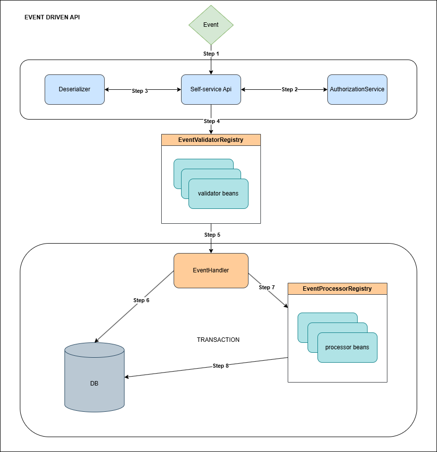

# References

| Reference | Title | Author |
|-----------|-------|--------|

<!-- =============== -->
<!-- REFERENCE LINKS -->
<!-- =============== -->

# Introduction

This document details the architecture and implementation guidelines for the Event Driven API Component.
Its design enables the system to maintain immediate data consistency by enforcing an atomic workflow for all
event requests, as well as implementation guide for extending the business logic processing capabilities.

## Target audience

This documentation is intended for Developers tasked with implementing event-specific business logic,
extending the system with new event types, and understanding the transaction-safe flow for updating the database and
persisting event records.

## Developer requirements

To effectively understand, implement, and extend the Event Driven API architecture described in this guide, only
general understanding of Java and Spring Boot is required.

## Background information

This component was developed to establish a secure, standardized API for self-service applications, addressing the need
for a unified and reliable data ingestion pathway. The primary motivation is to ensure immediate data consistency for
all core state changes (such as user consent). This architecture provides a solution through a transaction-safe flow
that guarantees the system's database acts as the single source of truth, and allow specific business logic of each
different event type to be processed in a decouple way, while it is easily setup for extension.

## Terminology

This section defines the core terms that link the external entity and the final persisted data artifacts within the
system boundary

1. **User**: The external actor (human or system) that initiates a state change within the system by sending a Request
   to the Self-service Api.

2. **Event**: The persisted record created when a valid Command is processed

3. **Event Type**: A unique identifier (implemented as an extendable enum) that categorizes the Command/Event and
   determines which Validator and Processor should be executed. Developers extend this enum to
   introduce new types of events and associated business logic..

# High level description of the component

The application of Event Api ranges from recording every user action, to inquiries for critical state changes like
updating consent, and makes sure these requests are processed accurately and instantly. We enforce this through an atomic
database transaction. This ensures the permanent record of the action (the Event) and the update to the core data are
committed simultaneously. If any step fails, the entire transaction is reversed, providing absolute data certainty and
consistency.

## High-level architecture

The Event Driven Api architecture relies on the Spring Framework, which provides the foundational support for Inversion
of Control (IoC)—used for dynamically mapping validation and processing logic—and for managing the atomic database
transaction.

This high-level design illustrates the flow of a single Event through the Event Driven API, focusing on its initial intake, validation, and final processing,
which culminates in a database TRANSACTION.



## Execution flow

The Event API Component serves as the system's central layer for event ingestion and process execution, implementing key principles of an Event-Driven
Architecture. It performs the following functions

1. **Event Reception**:

An Event request is received by the system, in the form of a raw Request.

2. **Authorization Service**:

The Request is immediately passed to the Authorization Service to verify the event's source and its permissions, within
the Rest Controller layer.

3. **Deserialization**:

If Authorization check is successful, the Request is processed by the Deserializer to transform it into a structured,
usable Command data object.

4. **Dynamic Validation**:

The Self-service Api consults the Validator Registry to dynamically apply a specific validator bean, corresponding to
Event Type coming from Event request, to ensure the event's data integrity and adherence to business rules.

5. **Hand-off to Core Logic**:

The validated Event Command is passed to the Event Handler, which is responsible for creation and persistence of the Event,
the coordinating the downstream business transaction.

6. **Immediate Persistence (The Transaction)**:

The Event Handler enforces a single, atomic database transaction for the entire event lifecycle, ensuring the event
record's persistence and all resulting side effects are committed together; if any step in the downstream
processing fails, the entire operation—including the event creation—is rolled back to maintain data consistency.

7. **Business Processing Delegation**:

After persistence, the Event Handler delegates the execution of the main business logic to the Event Processor Registry,
selecting the appropriate processor beans based on the Event Type.

8. **Execution of Specific Business Logic**:

The selected processor beans execute the specific business logic required for that Event Type (e.g., if the event is OrderPlaced, the processor updates the
Inventory table). This step involves updating any other necessary application state in the DB but never modifies the persisted Event itself.

# Introduction to the subject

The Event Api component is located in `nc.amplio.libraries:rest-api`, and consists of two projects: Rest and Service.

## Event Api Overview

### Technical overview

The following modules are part of the EventApi feature.

1. **eventapi-rest** - To expose the Event Api functionality via a secure REST API endpoint, handle HTTP requests/responses, authorization, and perform initial
   input validation.
2. **eventapi-service** - The Service Layer is responsible for the executing the business logic. It receives a prepared Event Command, delegates the Command's
   execution to the specific
   business logic handler within the same atomic transaction.

# API

## Rest

### Model

#### EventRequest

The contract for the request body of the `EventApi` endpoint.

```java
/**
 * Represents a request to create a new event, typically from an API endpoint.
 *
 * @param entityId The ID string of the associated entity. Can be null.
 * @param entityType The type of associated entity (e.g., 'PERSON'). Can be null.
 * @param eventText Optional descriptive text providing context for the event.
 * @param eventType The mandatory, specific type of the event (e.g., 'CONSENT_APPROVED').
 * @param data Optional payload containing the polymorphic, type-specific event data.
 */
@FieldNameConstants
public record EventRequest(
                @Nullable String entityId,
                @Nullable String entityType,
                @Nullable String eventText,
                @NotNull String eventType,

                @Schema(
                        description = "Polymorphic data structure for a concrete EventType",
                        example = "{\"fieldName\": \"String\"}"
                )
                @Nullable JsonNode data
        ) implements Item {
}
```

#### EventResponse

The contract for the response of the `EventApi` endpoint. Also see [ValidationError](#validationerror).

```java

@TypeScriptModel
public interface EventResponse<T> extends RestResponse {

    /**
     * Id of created event or null if no event was created.
     * */
    T getData();

    /**
     * List of validation errors.
     * Returns an empty list of there are no errors.
     * */
    @NotNull
    List<ValidationError> getValidations();
}
```

#### ValidationError

The contract for validation errors returned by the endpoint if there is an error. Note that field should be used for the field on the request OR in the requests
event data payload. For global errors not attached to a field, the field should be null. Portal text arguments can be passed on the error to fill in wildcards
in the error text.

```java

@Getter
@Builder
@Jacksonized
@TypeScriptModel
public class ValidationError implements Item {
    /**
     * The field that is being validated.
     * Should be null if the validation is for the entire object, not a specific field.
     * */
    @Nullable
    private String field;

    /**
     * Should be valid portal text prefix + key.
     * */
    @NotNull
    private String errorTextKey;

    /**
     * List of error arguments that should be passed as arguments to the portal text.
     * */
    @NotNull
    @Builder.Default
    private List<String> errorArguments = Collections.emptyList();

    /**
     * Returns true if no field is set.
     * If no field is set it is assumed that the error regards the entire object.
     * */
    public boolean isGlobalValidation() {
        return StringUtils.isEmpty(this.field);
    }
}
```

### Components

| Component                      | Role Description                                                                                            |
|--------------------------------|-------------------------------------------------------------------------------------------------------------|
| `EventApiRestController`       | Receives the raw HTTP Request and delegates the deserialized Command to the `EventApiRestService` interface |
| `EventApiAuthorizationService` | Handles authorization checks on the `event-api` endpoints                                                   | 
| `EventApiRestService`          | Handles validation and deserialization of incoming request and passes them to the `EventHandler`            |
| `EventValidator`               | Blueprint for Validator beans, to perform business validation rules on EventData corresponding to EventType |
| `EventAuthorizationService`    | Blueprint for delegated authorization check components, which could be defined in projects or submodules    |   

#### EventApiRestController

The EventApiRestController defines a single endpoint. The endpoint is secured by the `EventApiAuthorizationService`.

| Endpoint                   | Method | RequestBody  | Response      |
|----------------------------|--------|--------------|---------------|
| `rest/api/eventapi/create` | POST   | EventRequest | EventResponse |

Request body and payload for the `EventApi` endpoint needs to satisfy the following contract:

#### EventApiAuthorizationService

This service handles authorization checks for the `EventApiRestController`. The implementation will loop over all beans of type `EventAuthorizationService` and
call them individually. The check will adhere to @Order annotation by Spring if order needs to be defined. Otherwise it will run them in the order the bean was
loaded. The default implementation will check that the user has the `EVENT_WRITE` security role.

<div style="border-left: 4px solid dodgerblue; background-color: rgba(30, 144, 255, 0.1); padding: 10px; margin-bottom: 10px;">
  <strong>Important: </strong>If any of the `EventAuthorizationService` returns false for a check, the result will be false and the user will not be authorized.
</div>

<div style="border-left: 4px solid dodgerblue; background-color: rgba(30, 144, 255, 0.1); padding: 10px; margin-bottom: 10px;">
  <strong>Important: </strong>If eventType is null or not supported the api will return authorization error to avoid authorization implementations to check a null type.
</div>

#### EventAuthorizationService

The `EventAuthorizationService` can be implemented to add additional checks based on the request body. Normally this should be used to check access for entities
included in the payload or for specific `EventTypes`.

```java

/**
 * Executes the authorization check by aggregating the results from all registered authorization services.
 *
 * <p>This service implements a **strict, layered authorization model** (Chain of Responsibility)
 * by collecting all available delegated authorization services that implements {@link EventAuthorizationService} and
 * applying the following rule:
 * Access is granted **only if every single** registered service returns {@code true} for the given request.</p>
 *
 * <h3>Constraint:</h3>
 * The implementation of this method and the underlying services are expected to be **strictly read-only**,
 * designed only to check permissions without modifying any persistent state.
 */
public interface EventApiAuthorizationService {
    /**
     * Determines if the current user has the necessary permissions to create the event contained in the request.
     *
     * <h3>Transactional Contract:</h3>
     * This method is expected to be strictly **read-only** (non-mutating).
     *
     * @param request The endpoint event payload ({@link EventRequest}) containing the event type and data.
     * @return **{@code true}** if the user is authorized by this service, or if this service is irrelevant
     * to the given event type; **{@code false}** if this service supports the type and explicitly denies access.
     */
    boolean hasEventWriteAccess(@NotNull EventRequest request);
}
```

#### EventApiRestService

The `EventApiRestService` handles validation of incoming requests and deserialization of the event payload. If the validation fails the request will be denied
and the endpoint will return an error response with all the validation errors.

If the Validation succeeds the service will call specific validators for the EventType which allows implementations to provide specific validation for a given
EventType. If this fails it will again return an error response with all the validation errors.

If the specific validation also succeeds it will deserialize the `EventData` payload, create an `EventCommand` and pass it to the `EventHandler`.

#### EventValidator

Projects can supply EventValidators to add extra validation for specific EventTypes. This validation is normally on the EventData payload as the
EventApiRestService implementation controls normal behavior. However, the validation can also add extra constraints such as making eventType and eventId on the
request payload mandatory for specific EventTypes.

```java
/**
 * Defines a contract for event-specific validation of incoming client data.
 *
 * <p>This interface checks the {@link EventCommand} **before** any event creation or persistence
 * occurs.</p>
 *
 * <h3>Implementation Guidance:</h3>
 * All concrete validator classes **must be annotated as a Spring component** (e.g., using
 * {@code @Component}).
 */
public interface EventValidator {
    /**
     * Defines the specific {@link EventType} that this concrete validator implementation is
     * responsible for pre-validating.
     *
     * @return The specific {@code EventType} (e.g., {@code EventTypes.EXAMPLE_EVENT_TYPE})
     * handled by this validator.
     */
    EventType getEventType();

    /**
     * Executes the specific validation logic against the incoming {@link EventCommand}.
     *
     * <p>This method prevent invalid commands
     * from entering the event processing pipeline. It performs checks against business rules
     * and constraints.</p>
     *
     * <p>For field validation set the field name on the {@link ValidationError}. For global
     * validation let the field be null.</p>
     *
     * @param event The {@link EventCommand} containing the data.
     * @return A non-null {@code List<ValidationError>} of {@link ValidationError} prefixes.
     */
    List<ValidationError> validate(@NotNull EventCommand event);
}

```

## Service

### Model

#### EventCommand
The `EventCommand` is the validated Data Transfer Object (DTO) that encapsulates a single, type-determined event destined for internal
  processing. It is the immediate result of the REST layer successfully deserializing the incoming JSON request. However, it can also be created internally
and passed from the service layer.

```java
/**
 * An interface representing a command to create a new event.
 * <p>
 * This provides a contract for any command that can be used to generate an {@link Event}.
 */
public interface EventCommand {

   /**
    * @return The ID string of the primary associated entity. Can be null.
    */
   @Nullable
   String getEntityId();

   /**
    * @return The type of the primary associated entity. Can be null.
    */
   @Nullable
   String getEntityType();

   /**
    * @return A mandatory, human-readable description of the event.
    */
   @NotNull
   String getEventText();

   /**
    * @return The mandatory, specific type of the event.
    */
   @NotNull
   EventType getEventType();

   /**
    * @return Optional, business-specific payload for the event.
    */
   @Nullable
   EventData getEventData();

   /**
    * @return Optional, processing-specific metadata for the event.
    */
   @Nullable
   EventMetadata getEventMetadata();

   /**
    * @return The optional ID of the tenant this event belongs to.
    */
   @Nullable
   String getTenantId();
}
```

#### EventData

The required, polymorphic payload. `EventData` is a marker interface that all concrete event data Java objects must implement. The specific concrete
class for this field (e.g., UserPasswordUpdateData or InventoryAdjustedData) is determined dynamically by the deserializer based on the value of the `eventType`
field. It is defined on the EventType as:

```java 
private final Class<? extends EventData> eventDataClass;
```

```java
/**
 * A marker interface used for polymorphic serialization of event-specific payloads.
 *
 * <p>All concrete event data structures used within the system must implement this interface.
 * The specific implementation (the concrete class) is determined at runtime based on specific
 * type of the event.</p>
 *
 * @see EventType
 */
@TypeScriptModel
public interface EventData extends Serializable {
}
```

### Components

| Interface        | Role Description                                                                                              |
|------------------|---------------------------------------------------------------------------------------------------------------|
| `EventHandler`   | Blueprint for the Event Handler, create Event, persisting it, and delegate it to all relevant Processor beans |
| `EventProcessor` | Blueprint for the Processor beans, responsible for business logic corresponding to EventType                  |

#### EventHandler
The EventHandler serves as the central orchestrator for the complete event lifecycle, managing the atomic transaction that ensures data consistency across event creation and business logic execution.
It is responsible for: 

- Event Creation: Transforms the validated EventCommand into a concrete AbstractEvent instance
- Atomic Persistence: Ensures the event is persisted to the database within a single transaction
- Processor Coordination: Dispatches the persisted event to all registered processors for the specific event type
- Transaction Management: Maintains atomicity - if any processor fails, the entire transaction (including event creation) is rolled back

```java
public interface EventHandler {
/**
* Handles the complete lifecycle of an {@link EventCommand}:
* <ol>
* <li>Converts the {@link EventCommand} into a concrete {@link AbstractEvent}.</li>
* <li>**Persists** the newly created {@link AbstractEvent} to the database, updating it with its
* generated ID and persistence details.</li>
* <li>Dispatches the **persisted** {@link AbstractEvent} to all relevant
* {@link EventProcessor}s registered for the event's type.</li>
* </ol>
*
* <h3>Constraint on Event Mutation:</h3>
* The {@code createdEvent} passed to {@link EventProcessor#process(AbstractEvent)}.
* Processors are expected to **consume** this event data (e.g., deserializing polymorphic data, retrieving associated entities) to execute specific business logic.
* However, the {@code createdEvent} object **should not be mutated** (e.g., calling setters or modifying its internal state).
* Any changes to this object will **not** be automatically persisted, leading to data inconsistency.
* The processor's function is to react to the persisted event, not to modify the event itself.
*
* @param event The {@link EventCommand} containing the details needed to create the event.
* @throws CoreException If an unexpected system error occurs during processing by any
* registered {@link EventProcessor}. This typically wraps the underlying exception.
*/
String handle(@NotNull EventCommand event);
}
```

#### EventProcessor

The EventProcessor interface defines the contract for implementing event-specific business logic that executes after an event has been successfully persisted.

<div style="border-left: 4px solid dodgerblue; background-color: rgba(30, 144, 255, 0.1); padding: 10px; margin-bottom: 10px;">
  <strong>Important: </strong> Note that all processors are executed in the same transaction.
</div>

```java
/**
 * An interface for components that process business logic in response to a persisted {@link Event}.
 *
 * <p>Implementations use the {@link #isAssociated(EventType)} method to declare which event types they
 * can handle. This allows a single processor to be responsible for one, many, or even all event types
 * (e.g., for global auditing or logging).
 */
public interface EventProcessor {

   /**
    * Determines if this processor should handle the given event type.
    *
    * <p>A central registry calls this method to dynamically find all relevant processors for an incoming event.
    * Implementations can range from a simple equality check for a single event type to more complex logic,
    * such as checking against a set of supported types or returning {@code true} for all types.</p>
    *
    * <h3>Implementation Examples:</h3>
    * <ul>
    *   <li><b>Single Event:</b> {@code return eventType == EventTypes.USER_CREATED;}</li>
    *   <li><b>Multiple Events:</b> {@code return Set.of(EventTypes.A, EventTypes.B).contains(eventType);}</li>
    *   <li><b>All Events:</b> {@code return true;}</li>
    * </ul>
    *
    * @param eventType The {@link EventType} to check.
    * @return {@code true} if this processor should handle the event, {@code false} otherwise.
    */
   boolean isAssociated(@NotNull EventType eventType);

   /**
    * Executes the core business logic required in response to the persisted event.
    *
    * <p>This method is invoked by the main event handler **after** the event has been created and successfully
    * persisted. Implementations typically perform the following steps:
    * <ol>
    *   <li><b>Deserialize:</b> Extract and deserialize the event-specific data from {@code event.getEventData()}.</li>
    *   <li><b>Execute Logic:</b> Apply the specific business logic (e.g., state transitions, external calls).</li>
    *   <li><b>Persist/Dispatch:</b> Persist resulting entity changes or dispatch new events.</li>
    * </ol>
    *
    * <p><b>Note:</b> This component is not intended for complex, transactional integrations. Such operations
    * should be handled in separate, transaction-safe components.</p>
    *
    * <h3>Event Immutability:</h3>
    * The provided {@link Event} object is a read-only representation of the persisted event.
    * Modifying its state will not affect the stored record and can lead to data inconsistency.
    *
    * @param event The {@link Event} instance that has been persisted and is ready for processing.
    * @throws CoreException If an unexpected system error occurs. Exceptions are caught by the caller
    *                       and will typically fail the overall event execution.
    */
   void process(@NotNull Event event);

}
```

# Configurations and service extensions

This section describes in detailed how developer should extend this Event Api to satisfy specific business logic and validation rules, corresponding to Event
Type.

## Code integration

### Gradle dependencies

<div style="border-left: 4px solid dodgerblue; background-color: rgba(30, 144, 255, 0.1); padding: 10px; margin-bottom: 10px;">
  <strong>Mandatory</strong>
</div>

The Gradle projects defined in section [technical overview](#technical-overview) needs to be added to implementing project to enable the EventApi framework. 

## Service extension

This section will use `ConsentEventTypes` as examples to show how Event Api could be extended further for specific business requirements.

### Event Type extension
New constants is placed in submodules or project, while using the `EventType` extendable enum.

```java
public final class ConsentEventTypes {
    public static final EventType CONSENT_REQUESTED = EventType.create("CONSENT_REQUESTED", false, SimpleRequestConsentCommand.class);
}
```

The provided example above shows a Java object being tied with an Event Type constant by the `create()` method.
This Java object is also required in order for Deserializer to properly map the polymorphic data from Request to Command.

### Processor bean registry extension

In order to perform business logic specific to each Event Type, developer must create a new Processor bean and register it by implementing the `EventProcessor`
interface.
Event Handler will be able to pick up this Processor when corresponding Event Type is parsed in via Command, and dispatch the Processor bean.

```java
@Component
@RequiredArgsConstructor
public class SimpleApproveConsentEventProcessor implements EventProcessor {

   private final ConsentEventTriggerService consentEventTriggerService;
   private final PersistorService persistorService;
   private final ConsentTypeService consentTypeService;
   private final DateProvider dateProvider;
   private final ConsentService consentService;
   private final SerializationHelper serializationHelper;

   @Override
   public boolean isAssociated(@NotNull EventType eventType) {
      return ConsentEventTypes.CONSENT_APPROVED.equals(eventType);
   }

   @Override
   public void process(Event event) {
      SimpleApproveConsentCommand command = serializationHelper.fromString(event.getEventData(), SimpleApproveConsentCommand.class);
      ConsentDto consentDto = consentService.getConsent(command.consentId())
              .orElseThrow(() -> new CoreException(
                              ErrorCodes.RESOURCE_NOT_FOUND,
                              "Consent '{0}' not found.",
                              command.consentId()
                      )
              );

      consentDto.updateStatus(ConsentStatus.APPROVED);

      ConsentType consentType = consentTypeService.getConsentTypeFromBaseConsentType(consentDto.getConsentType());
      LocalDateTime currentValidFrom = dateProvider.getCurrentDateTime();

      consentDto.setValidFrom(currentValidFrom);

      Duration validityPeriod = consentType.getValidityPeriod();
      if (validityPeriod != null) {
         consentDto.setValidTo(currentValidFrom.plus(validityPeriod));
      }

      persistorService.persistEntity(ConsentMapper.toConsentEntity(consentDto));
      consentEventTriggerService.dispatchTriggers(new ConsentApprovedEventTrigger(consentDto));
   }
}
```

### Validator bean registry extension

Very similar to the pattern of extending Processor bean registry, a Validator bean could be created and implement `EventValidator`.
The `EventValidatorRegistry` will then dispatch the Command to this Validator bean for business validation logic when corresponding Even Type came from Request.

```java
public class SimpleConsentApproveEventValidator implements EventValidator {

    @Override
    public EventType getEventType() {
        return ConsentEventTypes.CONSENT_APPROVED;
    }

    @Override
    public List<String> validate(EventCommand command) {
        List<String> errors = new ArrayList<>();

        SimpleApproveConsentCommand data = (SimpleApproveConsentCommand) command.data();

        ConsentEventValidatorUtils.requireNonEmpty(data.consentId(), "consentId", errors);
        return errors;
    }
}
```

### Endpoint authorization service extension

This Event Api uses a decentralized approach to authenticate incoming Request.
The core service, `EventApiAuthorizationService`, relies on Java Streams and the `allMatch()` operation to determine
access.

A generalized implementation is already implemented that handles all event types, enforcing a baseline, general access
role.

The `EventApiAuthorizationService` delegates the actual authorization check to all registered delegate services,
including baseline check.

The final access decision is denied if any relevant delegate service returns `false`.

```java
public class ConsentAuthorizationServiceImpl implements EventAuthorizationService {

    private static final Set<EventType> SUPPORTED_EVENT_TYPES = Set.of(
            ConsentEventTypes.CONSENT_APPROVED,
            ConsentEventTypes.CONSENT_INVALIDATED,
            ConsentEventTypes.CONSENT_REJECTED,
            ConsentEventTypes.CONSENT_REQUESTED,
            ConsentEventTypes.CONSENT_WITHDRAWN
    );

    @Override
    public boolean hasEventWriteAccess(EventRequest request) {
        if (SUPPORTED_EVENT_TYPES.contains(EventType.valueOf(request.eventType()))) {
            return SecurityHelper.hasAccessBySecurityRole(SecurityRole.valueOf(ConsentRoles.CONSENT_WRITE));
        }
        return true;
    }

}
```

## Roles and rights

1. **SR_EVENT_WRITE** - Should only be used for permission related to creating events.