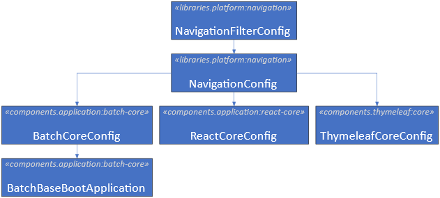
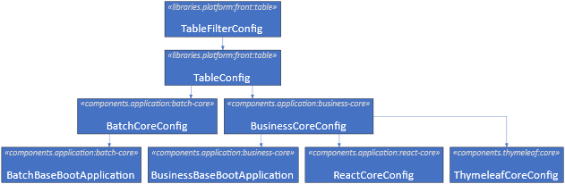
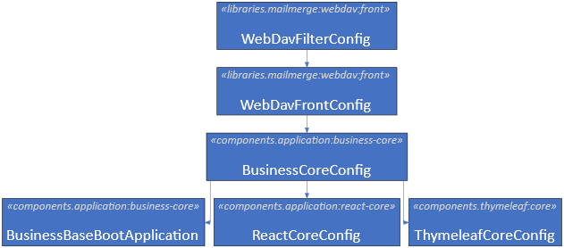
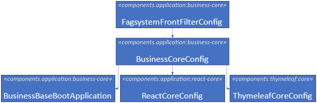
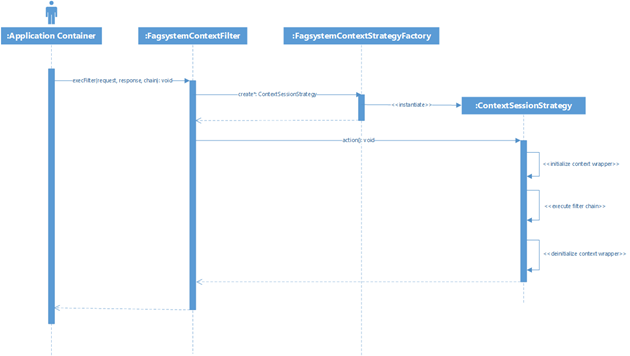
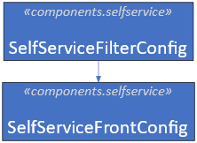
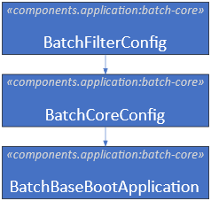

# References

| Reference                                                                                                                                                                                                            | Title                   | Author                        | Version |
|----------------------------------------------------------------------------------------------------------------------------------------------------------------------------------------------------------------------|-------------------------|-------------------------------|---------|
| [DD130 – Self service](/DD130-Detailed-Design/Self-service)                                                                                                                                                          | DD130 - Self service    | Christoffer Donskov Mouritzen | 1.0     |
| [DD130 – Thymeleaf](https://goto.netcompany.com/cases/GTE351/NCMCORE/Amplio%20Deliverables/Amplio%202025/DD130%20-%20Detailed%20Design/DD130%20-%20Thymeleaf.docx)                                                   | DD130 - Thymeleaf       | Christoffer Donskov Mouritzen | 1.0     |
| [C0200 – Log and monitor](https://goto.netcompany.com/cases/GTE351/NCMCORE/_layouts/15/WopiFrame.aspx?sourcedoc=%7B978589E7-4730-4647-A55F-10B5BCD4D624%7D&file=C0200%20-%20Log%20and%20monitor.docx&action=default) | C0200 - Log and monitor | Krystian Kisicki              | 1.0     |
| [DD130 – Filters](https://source.netcompany.com/tfs/Netcompany02/NF4J/_wiki/wikis/Documentation/5216/Filters)                                                                                                        | DD130 - Filters         | Szymon Micyk                  | 1.0     |

# Introduction

The document describes the detailed design of the web filters implementation and configuration in Amplio-based projects.
The document contains only information related to Amplio-specific filters. More details and general introduction to
filters can be found
in [DD130 – Filters](https://source.netcompany.com/tfs/Netcompany02/NF4J/_wiki/wikis/Documentation/5216/Filters).

## Target Audience

The target audience is mostly project architects and developers who should gain critical knowledge about filters
configuration and use cases which they solve.

## Developer Requirements

Before taking a deep dive into the document, the developer should be familiar with:

- Spring framework and its Spring Security subproject,
- General knowledge about web application programming,
- General knowledge about HTTP protocol and security vulnerabilities, e.g., CSRF, XSSF, etc.

# Filter Specifications

Below you can find reference information for each filter.

## Filter Specifications

<h5>MySecurityLoggingConfig</h5>

| Filter Class Name       | Description                                                                                                                                                                                                                                                                          |
|-------------------------|--------------------------------------------------------------------------------------------------------------------------------------------------------------------------------------------------------------------------------------------------------------------------------------|
| MySecurityLoggingFilter | The filter logs all attempts to access the application. It stores all logs in the SECURITYLOG table in the database. The filter is an extension of SecurityLoggingFilter from the Foundation. It extends getRedirectUrl and handling request id to be specific for Amplio framework. |

<h5>LockoutServiceConfig</h5>

| Filter Class Name | Description                                                                                              |
|-------------------|----------------------------------------------------------------------------------------------------------|
| LockoutFilter     | The filter logs unauthorized responses and lockouts resources that are repeatable access by the same IP. |

<h5>LoginServiceConfig</h5>

| Filter Class Name  | Description                                                  |
|--------------------|--------------------------------------------------------------|
| LoginLoggingFilter | The filter logs all new sessions started in the application. |

<h5>NavigationFilterConfig</h5>

| Filter Class Name | Description                                                                                                                          |
|-------------------|--------------------------------------------------------------------------------------------------------------------------------------|
| NavigationFilter  | Handles navigation logic in the application. It is mainly responsible for updating the current state of the entity and visible tabs. |

<h5>TableFilterConfig</h5>

| Filter Class Name | Description                             |
|-------------------|-----------------------------------------|
| TableFilter       | Removes cached tables from the session. |

<h5>WebDavFilterConfig</h5>

| Filter Class Name   | Description                                          |
|---------------------|------------------------------------------------------|
| WebDavContextFilter | Adds context for WEBDAV session.                     |
| WebDavFilter        | Handles all WEBDAV communication in the application. |

<h5>WSelfServiceFilterConfig</h5>

| Filter Class Name               | Description                                                                                                   |
|---------------------------------|---------------------------------------------------------------------------------------------------------------|
| SessionStatusFilter             | Controls session timeouts for the SelfService application.                                                    |
| RedirectToDigitalFuldmagtFilter | Redirects to digital fuldmagt ONLY when a user can act as someone else; if not, then the filter does nothing. |

## MySecurityLoggingConfig

The `MySecurityLoggingConfig` defines the security logging filter bean. The security logging filter is one of the
logging
filters which implements the `LoggingFilter` interface. It is responsible for logging all attempts to access the
application with the purpose of keeping the logs in the DB or file.

Typical information kept by the logs includes:

- Who and when accessed any endpoint in the application,
- IP address,
- Server name,
- Endpoint URL,
- Headers and/or parameters.

The security logging filter has a similar function as the access logs on the application server but it also includes
application-specific information, e.g., user name.

The `MySecurityLoggingConfig` is an optional component and should be imported manually by the projects.

### MySecurityLoggingFilter

The MySecurityLoggingFilter overrides only some of the methods in the Foundation SecurityLoggingFilter and it doesn’t
add new functionality. For more details
check [DD130 – Filters](https://source.netcompany.com/tfs/Netcompany02/NF4J/_wiki/wikis/Documentation/5216/Filters).

## LockoutServiceConfig

The `LockoutServiceConfig` defines the security lockout filter bean. The lockout filter is one of the logging filters
which implements the `LoggingFilter` interface. The lockout filter provides functionality for registering requests to
resources that the system user is not allowed to do. The repeated request from the same user or IP address can be locked
out from the system.

The `LockoutServiceConfig` is an optional component and should be imported manually by the projects.

<div style="border-left: 4px solid darkorange; background-color: rgba(255, 140, 0, 0.1); padding: 10px; margin-bottom: 10px;">
  <strong>Important:</strong> The LockoutFilter requires user context to exist therefore the order is set after the
springSecurityFilterChain.
</div>

### LockoutFilter

Servlet Filter checks if the user has access to the resources. The filter can use LockoutLogger implementation to store
lockout information in the database. Currently, there is one available option:

- `LockoutLoggerImpl` – stores data in the LOCKOUT table in the project database.

The `LockoutFilter` is configured to use both system parameters and *.properties files. The system parameters take
precedence over properties. The table below explains the usage of configuration parameters:

| Parameters Name                    | Property Name                      | Description                                                                                                                              |
|------------------------------------|------------------------------------|------------------------------------------------------------------------------------------------------------------------------------------|
| N/A                                | my.lockout.filter.enabled          | Enable flag to define lockoutLoggingFilter bean. Default: true                                                                           |
| N/A                                | my.lockout.filter.url-patterns     | Comma-separated list of ANT-like patterns of URLs. Default: /*                                                                           |
| N/A                                | my.lockout.filter.application-name | Application name used for logging purposes                                                                                               |
| lockoutlog.enabled                 | N/A                                | Enable lockout filter to handle requests. The property can be changed with system parameters while the server is running. Default: false |
| lockoutlog.serverlockout.enabled   | N/A                                | Enable check based on client IP. The resource is blocked when there are too many attempts from a specific IP. Default: true              |
| lockoutlog.serverlockout.interval  | N/A                                | Size of interval (in seconds) that is used when counting requests that resulted in status "unauthorized". Default: 5 seconds             |
| lockoutlog.serverlockout.tolerance | N/A                                | Number of unauthorized requests from the same client IP within the interval before locking out the resource. Default: 10                 |
| lockoutlog.serverlockout.time      | N/A                                | Time (in seconds) that the server locks out when the tolerance limit is reached. Default: 30 seconds                                     |
| lockoutlog.userlockout.enabled     | N/A                                | Enable check based on user name. The resource is blocked if there are too many attempts from the same user name. Default: true           |
| lockoutlog.userlockout.interval    | N/A                                | Size of interval (in seconds) that is used when counting requests that resulted in status "unauthorized". Default: 5 seconds             |
| lockoutlog.userlockout.tolerance   | N/A                                | Number of unauthorized requests from the same user name within the interval before locking out the resource. Default: 10                 |
| lockoutlog.userlockout.time        | N/A                                | Time (in seconds) that the server locks out when the tolerance limit is reached. Default: 30 seconds                                     |

| Order | URL |
|-------|-----|
| -1090 | /*  |

## LoginServiceConfig

The `LoginServiceConfig` defines the login logging filter bean. The login filter is one of the logging filters which
implements the `LoggingFilter` interface. The login filter provides functionality for registering all newly started user
sessions. The session information is stored in the database table.

The `LoginServiceConfig` is an optional component and should be imported manually by the projects.

<div style="border-left: 4px solid darkorange; background-color: rgba(255, 140, 0, 0.1); padding: 10px; margin-bottom: 10px;">
  <strong>Important:</strong> The LoggingFilter requires user context to exist therefore the order is set after the ContextFilter.
</div>

### LoginLoggingFilter

Servlet Filter checks and logs all newly created sessions for the user. The filter can use LoginLogger implementation to
decide where the logs can be stored. Currently, there is one available option:

- `LoginLoggerImpl` – stores data in the LOGINLOG table in the project database.

The `LoginLoggingFilter` is configured to use *.properties files. The table below explains the usage of configuration
parameters:

| Property Name                    | Description                                                    |
|----------------------------------|----------------------------------------------------------------|
| my.login.filter.enabled          | Enable flag to define loginLoggingFilter bean. Default: true   |
| my.login.filter.url-patterns     | Comma-separated list of ANT-like patterns of URLs. Default: /* |
| my.login.filter.application-name | Application name used for logging purposes                     |

| Order | URL |
|-------|-----|
| -88   | /*  |

## SlaServiceConfig (removed in 4.2)

### SlaMonitoringFilter

The SlaMonitorFilter and functionality is deprecated, for old documentation
check [C0200 – Log and monitor](https://goto.netcompany.com/cases/GTE351/NCMCORE/_layouts/15/WopiFrame.aspx?sourcedoc=%7B978589E7-4730-4647-A55F-10B5BCD4D624%7D&file=C0200%20-%20Log%20and%20monitor.docx&action=default).

## NavigationFilterConfig

The `NavigationFilterConfig` defines the navigation filter bean. The navigation filter is responsible for managing
`TopMenuInstance` and `SubMenuInstance` instances in the user session. The menu classes `TopMenuType` and `SubMenuType`
define hierarchy and directly translate to the tabs visible to the user. Besides access rules, the menu keeps
information about URLs, type of entity, order, and hierarchy. Please refer
to [DD130 – Thymeleaf](https://goto.netcompany.com/cases/GTE351/NCMCORE/Amplio%20Deliverables/Amplio%202025/DD130%20-%20Detailed%20Design/DD130%20-%20Thymeleaf.docx)
for more details.

The `NavigationFilterConfig` is imported by the following components (it is a default component):


<div style="text-align: center;">


<h5>Figure 1 Component import structure</h5>
</div>

### NavigationFilter

Servlet Filter handles navigation and additional business logic related to navigation and access to the application
endpoints. The `NavigationFilter` is a business-oriented filter and should be placed after the context filter where user
session and context are established.

The `NavigationFilter` is configured to use *.properties files. The table below explains the usage of configuration
parameters:

| Property Name                          | Description                                                                     |
|----------------------------------------|---------------------------------------------------------------------------------|
| my.navigation.filter.enabled           | Enable flag to define navigationFilter bean. Default: true                      |
| my.navigation.filter.url-patterns      | Comma-separated list of ANT-like patterns of URLs. Default: /*                  |
| my.navigation.filter.filter-exclusions | Semicolon-separated list of regular expressions to match URLs. Default: <empty> |

## TableFilterConfig

The `TableFilterConfig` defines the table filter bean. The filter configuration is a part of the Table component and the
table filter belongs to the business type. It is always configured after the context filter where user session and
context are established.

The `TableFilterConfig` is imported by the following components (it is a default component):

<div style="text-align: center;">


<h5>Figure 2 Component import structure</h5>
</div>

### TableFilter

Servlet Filter to remove cached tables from the user session. The tables rendered in the Thymeleaf application are
cached in the session for performance reasons. Each time the table is initialized with the
`TableInitializer.init(Table table)` method it is also added to the user session and kept during paging or sorting
operations. This filter is only relevant for Thymeleaf-based applications or components.

The whitelist tables give the possibility to keep bigger tables longer and maybe execute some endpoints while still
keeping the table in the session for later use.

The whitelist URLs prevent flushing tables from the session for those endpoints which are needed to handle the table
component itself, e.g., /webjars to get proper *.js scripts or /aspose to get file content shown on the table row.

The TableFilter is configured to use *.properties files. The table below explains the usage of configuration parameters:

| Property Name                     | Description                                                                                                                                                                                                                 |
|-----------------------------------|-----------------------------------------------------------------------------------------------------------------------------------------------------------------------------------------------------------------------------|
| my.table.filter.enabled           | Enable flag to define tableFilter bean. Default: true                                                                                                                                                                       |
| my.table.filter.url-patterns      | Comma-separated list of ANT-like patterns of URLs. Default: /*                                                                                                                                                              |
| my.table.filter.filter-exclusions | Semicolon-separated list of regular expressions to match URLs. Default: <empty>                                                                                                                                             |
| my.table.filter.whitelist-tables  | Comma-separated list of table names which are not removed during filter execution. This configuration lets keep some big tables for a longer period. Default: person-search-result, sag-search-result, opgave-search-result |
| my.table.filter.whitelist-urls    | Comma-separated list of URLs prefixes which don’t trigger tables flush during filter execution. Default: /assets/, /webjars/, /table/, /utilities/, /opgave/, /tekster/, /async/, /aspose/                                  |

| Order | URL |
|-------|-----|
| -50   | /*  |

## WebDavFilterConfig

The `WebDavFilterConfig` defines filter beans for handling context and WebDAV communication. The filter configuration is
a
part of the WebDAV component.

The `WebDavFilterConfig` is imported by the following components (it is a default component):

<div style="text-align: center;">


<h5>Figure 3 Component import structure</h5>
</div>

### WebDavContextFilter

Servlet Filter is responsible for setting up the user context on the ContextWrapper. The context is required to perform
any application-related operations, e.g., database queries. The `WebDavContextFilter` is set before any WebDAV-related
operations and is excluded from `springSecurityFilterBean`. The WebDAV context filter is used only for communication
between MS Word and the server with the WebDAV protocol. The filter takes care of proper identification of the user
based on URL request. All communication is always done on /webdav URL prefix.

The server identifies the user and document with ComplexId. The ComplexId is part of the request URL when MS Word tries
to access the document. The typical WebDAV request looks like:

`/webdav/document/6a29453e-d98e-33b7-9d45-b8a595332912___54638906-7ce7-46c8-b27c-f721a87283b4.docx`

The ComplexId is the last part of the URL and has a form <uuid>__<externalId> without .docx extension. The uuid is user
session identification and the externalId is identification of the document in the database.

The system uses the uuid to look for an existing user session with
`SessionAuthenticationService.findContextForSessionUuid(String)`. The method returns user context from the cache created
during user login. The cached context only exists during user session lifetime. After the user is logged out, the
context is no longer in the cache, thus access to the document is not possible.

The `WebDavContextFilter` is configured to use *.properties files. The table below explains the usage of configuration
parameters:

| Property Name                              | Description                                                                     |
|--------------------------------------------|---------------------------------------------------------------------------------|
| my.webdav.context.filter.enabled           | Enable flag to define webDavContextFilterRegistration bean. Default: true       |
| my.webdav.context.filter.url-patterns      | Comma-separated list of ANT-like patterns of URLs. Default: /webdav/*           |
| my.webdav.context.filter.filter-exclusions | Semicolon-separated list of regular expressions to match URLs. Default: <empty> |
| my.webdav.context.filter.enable-monitoring | Wrapper HTTP request/response with monitoring capabilities. Default: true       |

| Order | URL       |
|-------|-----------|
| -95   | /webdav/* |

### WebDavFilter

Servlet Filter is responsible for handling WebDAV operations. The filter wraps HTTP request/response and passes control
to the `HttpManager` instance. The `HttpManager` component is built and configured with `HttpManagerProvider`. The
`WebDavFrontConfig` defines `miltonHttpManagerProvider` bean which can be overridden by projects to customize the
creation
of `HttpManager`. The default configuration should be enough for most use cases.

The Milton library is an external component that handles all WebDAV logic.

The `WebDavFilter` is configured to use *.properties files. The table below explains the usage of configuration
parameters:

| Property Name                      | Description                                                                     |
|------------------------------------|---------------------------------------------------------------------------------|
| my.webdav.filter.enabled           | Enable flag to define webDavFilterRegistration bean. Default: true              |
| my.webdav.filter.url-patterns      | Comma-separated list of ANT-like patterns of URLs. Default: /webdav/*           |
| my.webdav.filter.filter-exclusions | Semicolon-separated list of regular expressions to match URLs. Default: <empty> |

| Order | URL       |
|-------|-----------|
| -94   | /webdav/* |

## FagsystemFrontFilterConfig (removed in 5.0)

The `FagsystemFrontFilterConfig` defines filter beans for handling user context in the Fagsystem application. The filter
configuration is a part of the Business Core component.

The `FagsystemFrontFilterConfig` is imported by the following components (it is a default component):

<div style="text-align: center;">


<h5>Figure 4 Component import structure</h5>
</div>

### FagsystemContextFilter

`Servlet Filter` is responsible for setting up the user context on the `ContextWrapper`. The context filter belongs to
the `ContextFilter` filter type. The context is required to perform any application-related operations, e.g., database
queries. The `FagsystemContextFilter` is set after `springSecurityFilterBean` where all authentication and basic
authorization is performed. The context filter must always set context on `ContextWrapper` even if the user is not
authenticated (e.g., first-time access to the application or endpoint doesn’t require an authenticated user).

To properly initialize `ContextWrapper`, the `FagsystemContextFilter` uses `ContextSessionStrategy`. The context session
strategy is created by `ContextSessionStrategyFactory`. This factory bean is the main place for making customization on
the project level. Refer to the sequence diagram for understanding the interaction between different components.

<div style="text-align: center;">


<h5>Figure 5 Sequence diagram of user context initialization</h5>
</div>

The flow of execution is as follows:

1. When the `:Application Container` processes the request, it executes the execFilter method of
   `FagsystemContextFilter`
2. The `FagsystemContextFilter` creates a new `ContextSessionStrategy` with `FagsystemContextStrategyFactory` with one
   of its create factory methods (please refer to the table below for the description of each create method).
3. The `FagsystemContextFilter` uses ContextSessionStrategy action method to handle `ContextWrapper`
   initialization/deinitialization procedure.
4. The `ContextSessionStrategy` first does necessary state checks, then initializes `ContextWrapper` with Context (
   project-dependent implementation), next the processing is passed to `filterChain` to handle the request. After that,
   `ContextSessionStrategy` deinitializes `ContextWrapper`.

In the table below you can find a list of create methods for `FagsystemContextStrategyFactory` and their purpose.

| Class/Interface to Use                                       | Description                                                                                                                                                                                                                                                                                                                                                                                                                                                                                                                                                                                                                                               |
|--------------------------------------------------------------|-----------------------------------------------------------------------------------------------------------------------------------------------------------------------------------------------------------------------------------------------------------------------------------------------------------------------------------------------------------------------------------------------------------------------------------------------------------------------------------------------------------------------------------------------------------------------------------------------------------------------------------------------------------|
| FagsystemContextStrategyFactory                              | Factory class to create ContextSessionStrategy instances during request processing. The FagsystemFrontFilterConfig creates bean contextStrategyFactory with default implementation FagsystemContextStrategyFactoryImpl. The default implementation returns proper implementation of context session strategy and in most cases doesn’t require any changes. If the project needs to react differently to some types of requests, it should override contextStrategyFactory bean with the project's specific implementation. All create methods are optional and don’t need to be overridden. (default implementation FagsystemContextStrategyFactoryImpl) |
| (default implementation FagsystemContextStrategyFactoryImpl) | **createLoggedStrategy**  - creates strategy instance for already logged-in users for all URLs except environment restricted. Default: LoggedInContextStrategy                                                                                                                                                                                                                                                                                                                                                                                                                                                                                            |
| (default implementation FagsystemContextStrategyFactoryImpl) | **createRedirectToLoginStrategy** - creates strategy instance for users not logged in and requested URL can’t be accessed by an anonymous user. The strategy should redirect to the login page or unauthorized/error pages. Default: RedirectToLoginPageStrategy                                                                                                                                                                                                                                                                                                                                                                                          |
| (default implementation FagsystemContextStrategyFactoryImpl) | **createRestrictedStrategy** - creates strategy instance for URLs that are restricted to access. The restricted URLs can’t be accessed even if the user is logged in. Default: UnauthorizedAccessStrategy                                                                                                                                                                                                                                                                                                                                                                                                                                                 |
| (default implementation FagsystemContextStrategyFactoryImpl) | **createServicesAccessStrategy** - creates strategy for URLs designed to be accessed by external services, e.g., SOAP calls. Default context is the same as anonymous since authentication is done by some other mechanism. Default: FilterWithContextStrategy                                                                                                                                                                                                                                                                                                                                                                                            |
| (default implementation FagsystemContextStrategyFactoryImpl) | **createInternalAccessStrategy** - creates strategy for URLs designed to be accessed by internal services, e.g., alive check. The authentication is not required. Default: FilterWithContextStrategy                                                                                                                                                                                                                                                                                                                                                                                                                                                      |
| (default implementation FagsystemContextStrategyFactoryImpl) | **createResourceAccessStrategy** - creates strategy for static resource URLs. The authentication is not required. Default: FilterWithUnsetContextStrategy                                                                                                                                                                                                                                                                                                                                                                                                                                                                                                 |
| (default implementation FagsystemContextStrategyFactoryImpl) | **createAnonymousAccessStrategy** - creates strategy for URLs, which can be accessed without logging in to the application. The authentication is not required. Default: FilterWithUnsetContextStrategy                                                                                                                                                                                                                                                                                                                                                                                                                                                   |

The `FagsystemContextFilter` is configured to use *.properties files. The table below explains the usage of
configuration
parameters:

| Property Name                       | Description                                                                                                                                                                                                                                     |
|-------------------------------------|-------------------------------------------------------------------------------------------------------------------------------------------------------------------------------------------------------------------------------------------------|
| my.context.filter.enabled           | Enable flag to define fagsystemContextFilter bean. Default: true                                                                                                                                                                                |
| my.context.filter.url-patterns      | Comma-separated list of ANT-like patterns of URLs. Default: /*                                                                                                                                                                                  |
| my.context.filter.filter-exclusions | Semicolon-separated list of regular expressions to match URLs. Default: /webdav;/webdav/.*;                                                                                                                                                     |
| my.context.filter.restricted-urls   | Comma-separated list of URL prefixes. The prefixes always block access to the endpoints even if the user is authenticated. It is used to block some URLs on the production environments (e.g., /test). Default: /test, /admin/test, /login      |
| my.context.filter.resource-urls     | Comma-separated list of URL prefixes. The prefixes give access to static web application resources like *.js, *.css, etc. Default: /webjars, /assets                                                                                            |
| my.context.filter.internal-urls     | Comma-separated list of URL prefixes. The prefixes give access to the application by services used inside the company network. It should not give access to the outside world. They should be used by health check services. Default: /internal |
| my.context.filter.anonymous-urls    | Comma-separated list of URL prefixes. The prefixes give access to URLs which don’t require a logged-in user, e.g., /login, /saml, etc. Default: /login, /unauthorized, /logout, /saml                                                           |
| my.context.filter.service-urls      | Comma-separated list of URL prefixes. The prefixes give access to APIs, REST service, or SOAP service. Default: /rest, /soap                                                                                                                    |

| Order | URL |
|-------|-----|
| -95   | /*  |

<div style="border-left: 4px solid darkorange; background-color: rgba(255, 140, 0, 0.1); padding: 10px; margin-bottom: 10px;">
  <strong>Important:</strong> All ContextFilter filters use my.context.filter prefix for properties. Only one type of context filter
should exist in the application.</div>

## SelfServiceFilterConfig

The `SelfServiceFilterConfig` defines filter beans for handling user context, session status, and Digital Fuldmagt
functionality in the SelfService application. The filter configuration is a part
of [DD130 – Self service](/DD130-Detailed-Design/Self-service) component.

The `SelfServiceFilterConfig` should be imported manually by the projects.

<div style="text-align: center;">


<h5>Figure 6 Component import structure</h5>
</div>

### SelfServiceContextFilter (removed in 5.0)

Servlet Filter is responsible for setting up the user context on the `ContextWrapper`. The context filter belongs to the
`ContextFilter` filter type. Please refer to [FagsystemContextFilter](#FagsystemContextFilter) for a
detailed description of `ContextFilter` classes.

To properly initialize `ContextWrapper`, the `SelfServiceContextFilter` uses `ContextSessionStrategy`. The context
session strategy is created by `ContextSessionStrategyFactory`. This factory bean is the main place for making
customization on the project level.

| Class/Interface to Use                                         | Description                                                                                                                                                                                                                                                                                                                                                                                                                                                                                                                                                                                                                                                |
|----------------------------------------------------------------|------------------------------------------------------------------------------------------------------------------------------------------------------------------------------------------------------------------------------------------------------------------------------------------------------------------------------------------------------------------------------------------------------------------------------------------------------------------------------------------------------------------------------------------------------------------------------------------------------------------------------------------------------------|
| SelfServiceContextStrategyFactory                              | Factory class to create ContextSessionStrategy instances during request processing. The SelfServiceFilterConfig creates bean contextStrategyFactory with default implementation SelfServiceContextStrategyFactoryImpl. The default implementation returns proper implementation of context session strategy and in most cases doesn’t require any changes. If the project needs to react differently to some types of requests, it should override contextStrategyFactory bean with the project's specific implementation. All create methods are optional and don’t need to be overridden. (default implementation SelfServiceContextStrategyFactoryImpl) |
| (default implementation SelfServiceContextStrategyFactoryImpl) | **createLoggedStrategy** - creates strategy instance for already logged-in users for all URLs except environment restricted. Default: LoggedInContextSetLastActiveStrategy                                                                                                                                                                                                                                                                                                                                                                                                                                                                                 |
| (default implementation SelfServiceContextStrategyFactoryImpl) | **createRestrictedStrategy** - creates strategy instance for URLs that are restricted to access. The restricted URLs can’t be accessed even if the user is logged in. Default: UnauthorizedAccessStrategy                                                                                                                                                                                                                                                                                                                                                                                                                                                  |
| (default implementation SelfServiceContextStrategyFactoryImpl) | **createUnauthorizedStrategy** - creates strategy for URLs designed to be accessed by external services, e.g., SOAP calls. Default context is the same as anonymous since authentication is done by some other mechanism. Default: UnauthorizedAccessSetLastActiveStrategy                                                                                                                                                                                                                                                                                                                                                                                 |
| (default implementation SelfServiceContextStrategyFactoryImpl) | **createImpersonateAccessStrategy** - creates strategy for URLs designed to be accessed by internal services, e.g., alive check. The authentication is not required. Default: FilterWithUnsetContextSetLastActiveStrategy                                                                                                                                                                                                                                                                                                                                                                                                                                  |
| (default implementation SelfServiceContextStrategyFactoryImpl) | **createAnonymousAccessStrategy** - creates strategy for URLs, which can be accessed without logging in to the application. The authentication is not required. Default: FilterWithUnsetContextSetLastActiveStrategy                                                                                                                                                                                                                                                                                                                                                                                                                                       |

The `SelfServiceContextFilter` is configured to use *.properties files. The table below explains the usage of
configuration parameters:

| Property Name                       | Description                                                                                                                                                                                                                                                  |
|-------------------------------------|--------------------------------------------------------------------------------------------------------------------------------------------------------------------------------------------------------------------------------------------------------------|
| my.context.filter.enabled           | Enable flag to define selfServiceContextFilter bean. Default: true                                                                                                                                                                                           |
| my.context.filter.url-patterns      | Comma-separated list of ANT-like patterns of URLs. Default: /*                                                                                                                                                                                               |
| my.context.filter.filter-exclusions | Semicolon-separated list of regular expressions to match URLs. Default: /ws;/rs/*;/internal/.*;/renew-session;/session-details;/is-session-alive;                                                                                                            |
| my.context.filter.restricted-urls   | Comma-separated list of URL prefixes. The prefixes always block access to the endpoints even if the user is authenticated. It is used to block some URLs on the production environments (e.g., /test). Default: /monitoring, /tekster, /tekst, /admin, /test |
| my.context.filter.resource-urls     | Comma-separated list of URL prefixes. The prefixes give access to static web application resources like *.js, *.css, etc. Default: /webjars, /assets                                                                                                         |
| my.context.filter.internal-urls     | Comma-separated list of URL prefixes. The prefixes give access to the application by services used inside the company network. It should not give access to the outside world. They should be used by health check services. Default: /internal              |
| my.context.filter.anonymous-urls    | Comma-separated list of URL prefixes. The prefixes give access to URLs which don’t require a logged-in user, e.g., /login, /saml, etc. Default: /login, /unauthorized, /logout, /saml, /imp/login/commit, /login/commit, /public, /assets, /webjars          |
| my.context.filter.impersonate-urls  | Comma-separated list of URL prefixes. The prefixes give access to impersonate functionality. Default: /imp                                                                                                                                                   |

| Order | URL |
|-------|-----|
| -95   | /*  |

<div style="border-left: 4px solid darkorange; background-color: rgba(255, 140, 0, 0.1); padding: 10px; margin-bottom: 10px;">
  <strong>Important:</strong> All ContextFilter filters use my.context.filter prefix for properties. Only one type of context filter
should exist in the application.</div>

### SessionStatusFilter

Servlet Filter controls session timeouts in the SelfService application. The filter checks if the session is active and
when it timeouts. The filter works only for special URLs for checking session status or making some operations. There
are three types of operations handled by this filter:

- Session renewal – handled by `/renew-session` endpoint, updates lastActive session attribute with session last
  accessed time, the filter uses lastActive for timeout session comparison.
- Alive check – handled by `/is-session-active` endpoint, use lastActive value to check if the session is already
  invalid, it also returns a warning message when the session is about to end (use session-timeout system parameter,
  default 120 secs).
- Session details – handled by `/session-details` endpoint, return description with the current status of the session.

The `SessionStatusFilter` is configured to use *.properties files. The table below explains the usage of configuration
parameters:

| Property Name                       | Description                                                                                                     |
|-------------------------------------|-----------------------------------------------------------------------------------------------------------------|
| my.session.filter.enabled           | Enable flag to define sessionStatusFilter bean. Default: true                                                   |
| my.session.filter.url-patterns      | Comma-separated list of ANT-like patterns of URLs. Default: /renew-session, /session-details, /is-session-alive |
| my.session.filter.filter-exclusions | Semicolon-separated list of regular expressions to match URLs. Default: /ws;/rs/*;/internal/.*                  |

| Order | URL |
|-------|-----|
| -50   | /*  |

### RedirectToDigitalFuldmagtFilter

Servlet Filter redirects to the second authentication step if the user can act as a proxy. This functionality gives
access to the system on behalf of another user if they are defined as power of attorney. The information about access is
provided by an external system (e.g., nemlogin) and it is extracted in the authentication flow. The information is kept
on the user context object.

The `RedirectToDigitalFuldmagtFilter` is configured to use *.properties files. The table below explains the usage of
configuration parameters:

| Property Name                                  | Description                                                                                     |
|------------------------------------------------|-------------------------------------------------------------------------------------------------|
| my.digitalfuldmagt.filter.enabled              | Enable flag to define fuldmagtFilter bean. Default: true                                        |
| my.digitalfuldmagt.filter.url-patterns         | Comma-separated list of ANT-like patterns of URLs. Default: /*                                  |
| my.digitalfuldmagt.filter.filter-exclusions    | Semicolon-separated list of regular expressions to match URLs. Default: /assets/.*;/webjars/.*; |
| my.digitalfuldmagt.filter.digital-fuldmagt-url | Default redirect URL to the second authentication step. Default: /digital_fuldmagt              |

| Order | URL |
|-------|-----|
| -30   | /*  |

## BatchFilterConfig

The `BatchFilterConfig` defines filter beans for handling user context in the Batch application. The filter
configuration
is a part of the Batch Core component.

The `BatchFilterConfig` is imported by the following components (it is a default component):

<div style="text-align: center;">


<h5>Figure 7 Component import structure</h5>
</div>

### OperationContextFilter (removed in 5.0)

Servlet Filter is responsible for setting up the user context on the `ContextWrapper`. The context filter belongs to the
`ContextFilter` filter type. Please refer to [FagsystemContextFilter](#FagsystemContextFilter) for a
detailed description of `ContextFilter` classes.

<div style="border-left: 4px solid darkorange; background-color: rgba(255, 140, 0, 0.1); padding: 10px; margin-bottom: 10px;">
  <strong>Important:</strong> The OperationContextFilter does not use ContextSessionStrategyFactory to create ContextSessionStrategy.
The OperationContextFilter creates ContextSessionStrategy directly. The main reason for that is we use the Batch Core
application as a standalone component with minimal project-specific changes.</div>

The `OperationContextFilter` is configured to use *.properties files. The table below explains the usage of
configuration parameters:

| Property Name                       | Description                                                                                                                                                                                                                                     |
|-------------------------------------|-------------------------------------------------------------------------------------------------------------------------------------------------------------------------------------------------------------------------------------------------|
| my.context.filter.enabled           | Enable flag to define selfServiceContextFilter bean. Default: true                                                                                                                                                                              |
| my.context.filter.url-patterns      | Comma-separated list of ANT-like patterns of URLs. Default: /*                                                                                                                                                                                  |
| my.context.filter.filter-exclusions | Semicolon-separated list of regular expressions to match URLs. Default: /ws;/rs/*;/internal/.*;/renew-session;/session-details;/is-session-alive;                                                                                               |
| my.context.filter.resource-urls     | Comma-separated list of URL prefixes. The prefixes give access to static web application resources like *.js, *.css, etc. Default: /webjars, /assets                                                                                            |
| my.context.filter.internal-urls     | Comma-separated list of URL prefixes. The prefixes give access to the application by services used inside the company network. It should not give access to the outside world. They should be used by health check services. Default: /internal |
| my.context.filter.anonymous-urls    | Comma-separated list of URL prefixes. The prefixes give access to URLs which don’t require a logged-in user, e.g., /login, /saml, etc. Default: /login, /unauthorized, /logout                                                                  |

| Order | URL |
|-------|-----|
| -95   | /*  |

## SamlRefreshSessionConfig

The `SamlRefreshSessionConfig` defines filter beans for refresh session functionality. This is an optional component.
The
filter configuration is a part of SAML authentication.

Refresh session functionality checks session expiration and user availability on the IdP server. The filter checks every
30 minutes if the session is still available on the IdP server and if the user still has access to the system. It is
done by a simple redirect of the application to the IdP server to reauthenticate the user. If the user still has access,
the redirects move to the same page as originally requested by the user.

The `SamlRefreshSessionConfig` is an optional component and should be imported manually by the projects.

### Saml2RefreshSessionFilter

Servlet Filter checks if the user session is active for more than 30 minutes; after that time, it tries to redirect to
IdP. The check is only performed for endpoints that require authentication and the request is done with the GET method.

The `SessionStatusFilter` is configured to use *.properties files. The table below explains the usage of configuration
parameters:

| Property Name                                  | Description                                                                                                                                                                                                          |
|------------------------------------------------|----------------------------------------------------------------------------------------------------------------------------------------------------------------------------------------------------------------------|
| my.session.refresh.filter.enabled              | Enable flag to define sessionStatusFilter bean. Default: true                                                                                                                                                        |
| my.session.refresh.filter.url-patterns         | Comma-separated list of ANT-like patterns of URLs. Default: /*                                                                                                                                                       |
| my.session.refresh.filter.permanent-exclusions | Semicolon-separated list of regular expressions to match URLs. The list represents endpoints that always should be excluded from filter processing. Default: /internal/.*;/rest/.*;/webdav/.*;/assets/.*;/webjars/.* |
| my.session.refresh.filter.timeout-exclusions   | Semicolon-separated list of regular expressions to match URLs. The list represents endpoints that should be excluded from timeout checks. Default: <empty>                                                           |
| my.session.refresh.filter.anonymous-exclusions | Semicolon-separated list of regular expressions to match URLs. The list represents endpoints that don’t require authentication and can be excluded from filter processing. Default: /login/.*;/saml2/.*              |
| my.session.refresh.filter.timeout-after        | Value in minutes after Saml2RefreshSessionFilter performs redirect to IdP. Default: 30 min.                                                                                                                          |

| Order | URL |
|-------|-----|
| -600  | /*  |

# Configurations and Service Extensions

## Component Customization

This section describes how to configure existing filters or add new ones.

### Code Integration

The Amplio config automatically adds existing filters if included into configuration with `@Import` annotation. As a
rule of thumb, you should not try to change the order of existing filters or redefine their beans. If you don’t need a
particular filter and want your own implementation, you should use `enable(=false)` property for the particular filter
bean and provide your filter in its place.

#### Adding New Filter to the Configuration

To add a new filter to the configuration, you need to define a new bean with `FilterBeanRegistration`, check the example
below:

```java
@Configuration
public class MyFilterConfig {

    // Simplified version
    @Bean
    public FilterRegistrationBean identityFilter() {
        return generateFilterBean(Ordered.HIGHEST_PRECEDENCE, new IdentityFilter(), MapUtil.emptyMap(), "/*");
    }

    // Full version to have full control
    @Bean
    public FilterRegistrationBean myIdentityFilter() {
        IdentityFilter filter = new IdentityFilter();
        // set any properties related to filter

        FilterRegistrationBean registrationBean = new FilterRegistrationBean();
        registrationBean.setFilter(filter);
        registrationBean.addInitParameter("param", "value");
        registrationBean.setOrder(Ordered.HIGHEST_PRECEDENCE);
        registrationBean.setUrlPatterns("/*");
        registrationBean.setEnabled(true);

        return registrationBean;
    }
}
```

### Configurable Settings

Each application in the project must define a configuration file called `filters.properties` in the
`src/main/resource/configs` folder.

Check the [filter specifications](#filter-specifications) for a list of all configuration options.

### API

For a couple of filters, there are extension points that the project needs to implement to provide project-specific
behavior.

| Class/Interface                                                                                | Description                                                                                                                         | Requirement |
|------------------------------------------------------------------------------------------------|-------------------------------------------------------------------------------------------------------------------------------------|-------------|
| **DigitalFuldmagtFilterHelper**                                                                | **Project-specific implementation, added since each project has its self-service context implementation.**                          | -           |
| (DefaultDigitalFuldmagtFilterHelper)                                                           | shouldRedirectToDigitalFuldmagt                                                                                                     | Required    |
| **SelvbetjeningContextAndSessionHelper**                                                       | **Create proper context for anonymous and impersonate access. It has default implementation which can be changed by the projects.** | -           |
|                                                                                                | logInViaFagsystemContext                                                                                                            | Optional    |
|                                                                                                | createAnonymousSelfserviceContext                                                                                                   | Optional    |
| **ContextInitializationService**                                                               | **New two methods to create anonymous and WebDAV context. In has default implementation which can be changed by the projects.**     | -           |
|                                                                                                | initializeWebDavContext                                                                                                             | Optional    |
|                                                                                                | initializeAnonymousContext                                                                                                          | Optional    |
| **ServiceProviderFilterService**                                                               | **Project specific implementations. Used with OIOSAML 2**                                                                           |             |
|                                                                                                | shouldBlockRequester                                                                                                                | Required    |
|                                                                                                | hasEnvironmentAccess                                                                                                                | Required    |
| **FagsystemContextStrategyFactory, SelfServiceContextStrategyFactory**                         | **Only if the project requires a specific ContextStrategy for URLs.**                                                               | -           |
| (FagsystemContextStrategyFactoryImpl and SelfServiceContextStrategyFactoryImpl)                | createLoggedStrategy                                                                                                                | Optional    |
| (FagsystemContextStrategyFactoryImpl and SelfServiceContextStrategyFactoryImpl)                | createRedirectToLoginStrategy                                                                                                       | Optional    |
| (FagsystemContextStrategyFactoryImpl and SelfServiceContextStrategyFactoryImpl)                | createRestrictedStrategy                                                                                                            | Optional    |
| (FagsystemContextStrategyFactoryImpl and SelfServiceContextStrategyFactoryImpl)                | createServicesAccessStrategy                                                                                                        | Optional    |
| (FagsystemContextStrategyFactoryImpl and SelfServiceContextStrategyFactoryImpl)                | createInternalAccessStrategy                                                                                                        | Optional    |
| (FagsystemContextStrategyFactoryImpl and SelfServiceContextStrategyFactoryImpl)                | createResourceAccessStrategy                                                                                                        | Optional    |
| (FagsystemContextStrategyFactoryImpl and SelfServiceContextStrategyFactoryImpl)                | createAnonymousAccessStrategy                                                                                                       | Optional    |
| **AuthenticationConfigurationService**                                                         | **Already two implementation exists.**                                                                                              | -           |
| (DefaultAuthenticationConfigurationServiceImpl and SAMLAuthenticationConfigurationServiceImpl) | getConfiguration                                                                                                                    | Optional    |
| (DefaultAuthenticationConfigurationServiceImpl and SAMLAuthenticationConfigurationServiceImpl) | isDevelMode                                                                                                                         | Optional    |
| (DefaultAuthenticationConfigurationServiceImpl and SAMLAuthenticationConfigurationServiceImpl) | isMockLogin                                                                                                                         | Optional    |

## Migration Information

All applications (Weblogic, local, or Tomcat) should use a common way of defining the application entry point and
deployment method.

The usage of `web.xml` should be abandoned, and Java-based configuration should be preferred to define any filters,
listeners, and servlets. By convention, you should name each application in the following manner:

`<application name><deployment>Application`

e.g., FagsystemBootApplication, FagsystemWeblogicApplication, FagsystemTomcatApplication

Depending on your configuration, it is advisable to exclude the following auto-configuration classes:

<h5>WEBLOGIC</h5>

```java
@SpringBootApplication(exclude = {
        WebMvcMetricsAutoConfiguration.class,
        HttpTraceAutoConfiguration.class,
        EmbeddedWebServerFactoryCustomizerAutoConfiguration.class,
        ServletWebServerFactoryAutoConfiguration.class,
})
```

<h5>LOCAL</h5>

```java
@SpringBootApplication(exclude = {
        WebMvcMetricsAutoConfiguration.class,
        HttpTraceAutoConfiguration.class,
})
```

### Common Spring Filters

The `MultipartFilter` and `CharacterEncodingFilter` are used by default and should not be defined by the application.

<div style="border-left: 4px solid dodgerblue; background-color: rgba(30, 144, 255, 0.1); padding: 10px; margin-bottom: 10px;">
  <strong>Note:</strong> Since the changes to filters and Spring Boot version, you need to add Multipart Config to the dispatcher
filter according to Servlet API 3.0 specification.
</div>

Example:

```java
DispatcherServletRegistrationBean registration = new DispatcherServletRegistrationBean(servlet, servletPath);
registration.setInitParameters(initParams);
registration.setLoadOnStartup(loadOnStartup);
registration.setOrder(order);
registration.setName(name);

MultipartConfigFactory factory = new MultipartConfigFactory();
registration.setMultipartConfig(factory.createMultipartConfig());
```

The `CsrfFilter` is used by default and all configuration is already done in `CommonSpringWebSecurityConfig`. If you
need to modify any CSRF-related configuration, please use `WebSecurityConfigurerAdapter` or `addCsrfIgnoreAntMatchers`
method in `CommonSpringWebSecurityConfig`.

There are some properties that you should always have in your common properties file:

```properties
server.servlet.context-path=/pe-fagsystem
```

### Environment Properties

All necessary environment properties can be set in *Application class via `System.setProperty` or with java parameters
when starting Weblogic/Tomcat.

### Gradle Changes

For EAR projects, you should also add the following dependency as a `providedRuntime` dependency:

```gradle
providedRuntime 'org.springframework.boot:spring-boot-starter-tomcat'
```

Also, you should check if you have any dependencies related to Servlet API less than 3.0 and if so, you should remove
them.

### JNDI Datasources

You should move all names from `web.xml` to `application.properties` or common config properties file for
container-managed data sources.
To debug your filters, you can either start your app with `--debug` program parameter in IntelliJ configuration or add
`org.springframework.boot.web=DEBUG` to your log configuration.

### Java Melody

The projects should use auto-configuration dependency (currently added by default in Amplio). The project should add the
following properties to standard property files:

```properties
### JAVAMELODY FILTER
javamelody.enabled=true
javamelody.spring-monitoring-enabled=false
javamelody.advisor-auto-proxy-creator-enabled=false
javamelody.init-parameters.http-transform-pattern=[a-f0 9]{8}-[a-f0 9]{4}-[a-f0 9]{4}-[a-f0 9]{4}-[a-f0 9]{12}.+|[a-f0 9]{32}.+
javamelody.init-parameters.displayed-counters=http,sql,error,log
```

### Example Fagsystem Configuration

When setting up a new filter configuration, it is advisable to create a separate class with filters configuration.

```java
@Configuration
@Import({
        // define all filters config need by your application
        LockoutServiceConfig.class,
        LoginServiceConfig.class,
        SlaServiceConfig.class,
        SecurityServiceConfig.class,
        TableConfig.class,
        NavigationConfig.class,
        FrontFilterConfig.class,
        FagsystemFrontFilterConfig.class,
        FagsystemServiceProviderConfig.class,
        WebDavFilterConfig.class,
})
@PropertySources({
        @PropertySource("classpath:/filter.properties"),
        @PropertySource(value = "classpath:/configs/filter.properties", ignoreResourceNotFound = true)
})
public class FagsystemFilterConfig {

    // Define any custom filter registration in this config class
    @Bean
    public FilterRegistrationBean identityFilter() {
        return generateFilterBean(Ordered.HIGHEST_PRECEDENCE, new IdentityFilter(), MapUtil.emptyMap(), "/*");
    }
}
```

The `@PropertySources` annotation helps to provide a common place for the application to store filter customizations.
The typical file can have the following properties:

```properties
### SECURITY LOGGING FILTERS
securitylog.application-name=FAG
slamonitoring.application-name=FAG
lockout.application-name=FAG
loginlog.application-name=FAG
### TABLE FILTER
my.table.filter.whitelist-urls=/assets/, /webjars/, /table/, /utilities/, /opgave/, /tekster/, /async/
### ACCESS FILTER
my.access.filter.filter-exclusions=/webdav;/webdav/.*;/assets/.*;/webjars/.*;/unauthorized;/login;/login/.*;/logout;/logout/.*;/internal/.*;/saml;/saml/.*;/rest/.*;
### WEBDAV FILTER
my.webdav.filter.contextConfigClass=atp.pe.fagsystem.config.webdav.WebDavFrontConfig
```

The Spring Boot application class can use your filter configuration the same as any other configuration (local and
environments configurations can share filters configuration):

```java
@SpringBootApplication(exclude = {
        JmsAutoConfiguration.class,
        JacksonAutoConfiguration.class,
        ErrorMvcAutoConfiguration.class,
        DispatcherServletAutoConfiguration.class,
        WebMvcMetricsAutoConfiguration.class,
        HttpTraceAutoConfiguration.class,
        EmbeddedWebServerFactoryCustomizerAutoConfiguration.class,
        ServletWebServerFactoryAutoConfiguration.class,
})
@Import({
        FagsystemApplicationConfig.class,
        FagsystemFilterConfig.class,
        AtppeFagsystemDatasourcesConfig.class,
})
@EnableWebMvc
@EnableJpaRepositories
public class FagsystemWeblogicApplication extends SpringBootServletInitializer implements WebApplicationInitializer {

    public static void main(String[] args) {
        configureApplication(new SpringApplicationBuilder()).run(args);
    }

    @Override
    protected SpringApplicationBuilder configure(SpringApplicationBuilder builder) {
        return configureApplication(builder);
    }

    private static SpringApplicationBuilder configureApplication(SpringApplicationBuilder builder) {
        System.setProperty("oiosaml-j.home", "/configs/oiosaml_fag");
        System.setProperty("jdk.tls.namedGroups", "secp256r1, secp384r1, ffdhe2048, ffdhe3072");
        return builder.sources(FagsystemWeblogicApplication.class)
                .properties("spring.main.allow-bean-definition-overriding=true")
                .bannerMode(Banner.Mode.OFF);
    }

    @Bean
    public ServletRegistrationBean oioDispatcherServlet() {
        return generateServletBean(1, new dk.itst.oiosaml.sp.service.DispatcherServlet(), "oioDispatcherServlet", ImmutableMap.of(), -1, "/saml/*");
    }

    @Bean
    public ServletRegistrationBean dispatcherServlet() {
        return generateDispatcherServletBean(2, new DispatcherServlet(),
                "/", "springDispatcherServlet",
                ImmutableMap.of("contextClass", "org.springframework.web.context.support.AnnotationConfigWebApplicationContext"),
                1, "/");
    }

    @Bean
    public OioSamlLogoutListener sessionDestroyListener() {
        return new OioSamlLogoutListener();
    }

    @Bean
    public WebDavLogoutListener httpSessionExpiryListener() {
        return new WebDavLogoutListener();
    }

    @Bean
    public HttpSessionMutexListener httpSessionMutexListener() {
        return new HttpSessionMutexListener();
    }

}
```

## Usage

Each filter has its own configuration file which might be added to the project. The filters are divided into two groups:

- The default filters which always exist in the project, usually added by aggregate Amplio configuration class,
- The manual filters which are optional and can be added to the project, requiring adding them to the project-specific
  filter configuration class.

This chapter provides example configuration of each filter config class. All configuration details could be found
in [DD130 – Filters](https://source.netcompany.com/tfs/Netcompany02/NF4J/_wiki/wikis/Documentation/5216/Filters).

### SecurityServiceConfig

As the `SecurityServiceConfig` is an optional filter config and must be imported by the project manually.

1. Add required Gradle module to dependencies section:

```gradle
api "modulus-ydelse.libraries.platform:logging:security:platform-logging-security-service"
```

2. Import `SecurityServiceConfig` class to your filter configuration:

```java
@Configuration
@Import({
        SecurityServiceConfig.class,
})
@PropertySources({
        @PropertySource("classpath:/filter.properties"),
        @PropertySource(value = "classpath:/configs/filter.properties", ignoreResourceNotFound = true)
})
public class ApplicationFilterConfig {

}
```

3. Add any required configuration override in `filter.properties` file. For example:

```properties
# security log filter
my.security.filter.enabled=true
my.security.filter.url-patterns=/*
my.security.filter.application-name=FAG
my.security.filter.log-to-file=false
# those properties are usually kept in configs/audit/securitylog.properties
securitylog.loggedheaders=x-forwarded-for,host,referer,x-requested-with
securitylog.loggedresponseheaders=none
securitylog.ignoredstatuscodes=304
securitylog.ignoredfilter=(.*\\.ico)|(.*\\.css)|(.*\\.js)|(.*\\.js;jsessionid.*)|(.*is-session-alive)|(.*\\.woff2)|(.*\\.eot)|(.*/alivecheck/shallow)
securitylog.ignoreapp=none
```

### LockoutServiceConfig

As the `LockoutServiceConfig` is an optional filter config and must be imported by the project manually.

1. Add required Gradle module to dependencies section:

```gradle
api "modulus-ydelse.libraries.platform:logging:security:platform-logging-login-service"
```

2. Import `LockoutServiceConfig` class to your filter configuration:

```java
@Configuration
@Import({
        LockoutServiceConfig.class,
})
@PropertySources({
        @PropertySource("classpath:/filter.properties"),
        @PropertySource(value = "classpath:/configs/filter.properties", ignoreResourceNotFound = true)
})
public class ApplicationFilterConfig {

}
```

3. Add any required configuration override in `filter.properties` file. For example:

```properties
# lockout logging filter
my.lockout.filter.enabled=true
my.lockout.filter.url-patterns=/*
my.lockout.filter.application-name=FAG
# lockout specific configuration
lockoutlog.enabled=true
lockoutlog.serverlockout.enabled=false
lockoutlog.serverlockout.interval=600
lockoutlog.serverlockout.tolerance=20
lockoutlog.serverlockout.time=1200
lockoutlog.userlockout.enabled=false
lockoutlog.userlockout.interval=600
lockoutlog.userlockout.tolerance=20
lockoutlog.userlockout.time=300
```

### LoginServiceConfig

As the `LoginServiceConfig` is an optional filter config and must be imported by the project manually.

1. Add required Gradle module to dependencies section:

```gradle
api "modulus-ydelse.libraries.platform:logging:security:platform-logging-login-service"
```

2. Import `LoginServiceConfig` class to your filter configuration:

```java
@Configuration
@Import({
        LoginServiceConfig.class,
})
@PropertySources({
        @PropertySource("classpath:/filter.properties"),
        @PropertySource(value = "classpath:/configs/filter.properties", ignoreResourceNotFound = true)
})
public class ApplicationFilterConfig {

}
```

3. Add any required configuration override in `filter.properties` file. For example:

```properties
# login logging filter
my.login.filter.enabled=true
my.login.filter.url-patterns=/*
my.login.filter.application-name=FAG
```

### NavigationFilterConfig

As the `NavigationFilterConfig` is a default filter it is already added to other aggregate configurations.

1. Add required Gradle module to dependencies section:

```gradle
api "modulus-ydelse.components.application:application-thymeleaf-core"
```

2. Import your Spring boot application class with `ThymeleafCoreConfig` class:

```java
@Configuration
@Import({
        ThymeleafCoreConfig.class
})
public class ThymeleafBusinessApplication extends BusinessBaseBootApplication {
}
```

3. Add any required configuration override in `filter.properties` file.

The alternative more direct approach is to add `NavigationFilterConfig` to your project.

1. Add required Gradle module to dependencies section:

```gradle
api "modulus-ydelse.libraries.platform:platform:platform-navigation"
```

2. Import `NavigationConfig` class to your filter configuration:

```java
@Configuration
@Import({
        NavigationConfig.class,
})
@PropertySources({
        @PropertySource("classpath:/filter.properties"),
        @PropertySource(value = "classpath:/configs/filter.properties", ignoreResourceNotFound = true)
})
public class ApplicationFilterConfig {

}
```

3. Add any required configuration override in `filter.properties` file. For example:

```properties
# navigation filter
my.navigation.filter.enabled=true
my.navigation.filter.url-patterns=/*
my.navigation.filter-exclusions=/webjars/.*
```

### TableFilterConfig

As the `TableFilterConfig` is a default filter it is already added to other aggregate configurations.

1. Add required Gradle module to dependencies section:

```gradle
api "modulus-ydelse.components.application:application-business-core"
```

2. Extend your Spring boot application class with `BusinessBaseBootApplication` class:

```java
@Configuration
@Import({
        // project defined configs
})
public class ReactBusinessApplication extends BusinessBaseBootApplication {

}
```

3. Add any required configuration override in `filter.properties` file.

The alternative more direct approach to add `TableFilterConfig` to your project.

1. Add required Gradle module to dependencies section:

```gradle
api "modulus-ydelse.libraries.platform:platform-front-table"
```

2. Import `TableConfig` class to your filter configuration:

```java
@Configuration
@Import({
        TableConfig.class,
})
@PropertySources({
        @PropertySource("classpath:/filter.properties"),
        @PropertySource(value = "classpath:/configs/filter.properties", ignoreResourceNotFound = true)
})
public class ApplicationFilterConfig {
}
```

3. Add any required configuration override in `filter.properties` file. For example:

```properties
# table filter
my.table.filter.enabled=true
my.table.filter.url-patterns=/*
my.table.filter-exclusions=/webjars/.*
my.table.filter.whitelist-tables=person-search-result, sag-search-result, opgave-search-result
my.table.filter.whitelist-urls=/assets/, /webjars/, /table/, /utilities/, /opgave/, /tekster/, /async/, /aspose/
```

### WebDavFilterConfig

As the `WebDavFilterConfig` is a default filter it is already added to other aggregate configurations.

1. Add required Gradle module to dependencies section:

```gradle
api "modulus-ydelse.components.application:application-business-core"
```

2. Extend your Spring boot application class with `BusinessBaseBootApplication` class:

```java
@Configuration
@Import({
        // project defined configs
})
public class ReactBusinessApplication extends BusinessBaseBootApplication {

}
```

3. Add any required configuration override in `filter.properties` file.

The alternative more direct approach to add `WebDavFilterConfig` to your project.

1. Add required Gradle module to dependencies section:

```gradle
api "modulus-ydelse.libraries.mailmerge:mailmerge:webdav:mailmerge-webdav-front"
```

2. Import `WebDavFrontConfig` class to your filter configuration:

```java
@Configuration
@Import({
        WebDavFrontConfig.class,
})
@PropertySources({
        @PropertySource("classpath:/filter.properties"),
        @PropertySource(value = "classpath:/configs/filter.properties", ignoreResourceNotFound = true)
})
public class ApplicationFilterConfig {

}
```

3. Add any required configuration override in `filter.properties` file. For example:

```properties
# webdav context filter
my.webdav.context.filter.enabled=true
my.webdav.context.filter.url-patterns=/*
my.webdav.context.filter.filter-exclusions=/static;/static/.*
my.webdav.context.filter.enable-monitoring=true
# webdav filter
my.webdav.filter.enabled=true
my.webdav.filter.urlPatterns=/webdav/*
my.webdav.filter.filter-exclusions=/static;/static/.*
```

### FagsystemFrontFilterConfig

As the `FagsystemFrontFilterConfig` is a default filter it is already added to other aggregate configurations.

1. Add required Gradle module to dependencies section:

```gradle
api "modulus-ydelse.components.application:application-business-core"
```

2. Extend your Spring boot application class with `BusinessBaseBootApplication` class:

```java
@Configuration
@Import({
        // project defined configs
})
public class ReactBusinessApplication extends BusinessBaseBootApplication {

}
```

3. Add any required configuration override in `filter.properties` file.

The alternative more direct approach to add `FagsystemFrontFilterConfig` to your project.

1. Add required Gradle module to dependencies section:

```gradle
api "modulus-ydelse.components.application:application-business-core"
```

2. Import `FagsystemFrontFilterConfig` class to your filter configuration:

```java
@Configuration
@Import({
        FagsystemFrontFilterConfig.class,
})
@PropertySources({
        @PropertySource("classpath:/filter.properties"),
        @PropertySource(value = "classpath:/configs/filter.properties", ignoreResourceNotFound = true)
})
public class ApplicationFilterConfig {

}
```

3. Add any required configuration override in `filter.properties` file. For example:

```properties
# fagsystem context filter
my.context.filter.enabled=true
my.context.filter.urlPatterns=/*
my.context.filter.resource-urls=/webjars, /assets, /index.html
my.context.filter.filter-exclusions=/app/.*;/.*\\.js;/.*\\.js.gz;/.*\\.ico;/webdav/.*;/webdav/dokument/.*;/integrations/.*;/.*\\.docx;/docs/swagger-ui;/docs/swagger-ui/.*;/docs/api;
```

### SelfServiceFilterConfig

The `SelfServiceFilterConfig` must be imported by the project manually as there is no base config class with
configuration of Self Service.

1. Add required Gradle module to dependencies section:

```gradle
api "modulus-ydelse.components.selfservice:selfservice"
```

2. Import `SelfServiceFrontConfig` class to your application configuration:

```java
@Configuration
@Import({
        SelfServiceFrontConfig.class,
})
public class ApplicationConfig {

}
```

3. Add any required configuration override in `filter.properties` file.

### BatchFilterConfig

As the `BatchFilterConfig` is a default filter it is already added to other aggregate configurations.

1. Add required Gradle module to dependencies section:

```gradle
api "modulus-ydelse.components.application:application-batch-core"
```

2. Extend your Spring boot application class with `BatchBaseBootApplication` class:

```java
@Configuration
@Import({
        // project defined configs
})
public class BatchBusinessApplication extends BatchBaseBootApplication {

}
```

3. Add any required configuration override in `filter.properties` file.

# Troubleshooting

## Enable Debugging

To debug your filters, you can either start your app with `--debug` program parameter in IntelliJ configuration or add
`org.springframework.boot.web=DEBUG` to your log configuration.