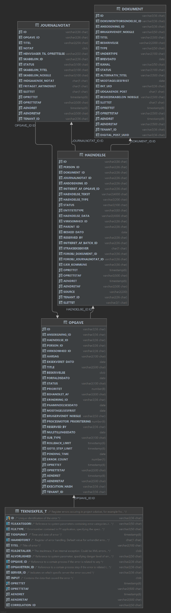
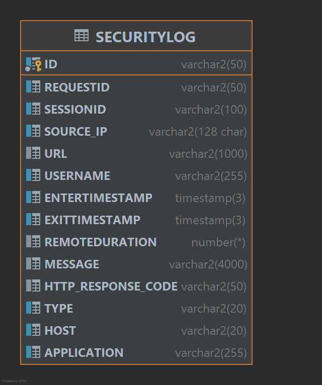
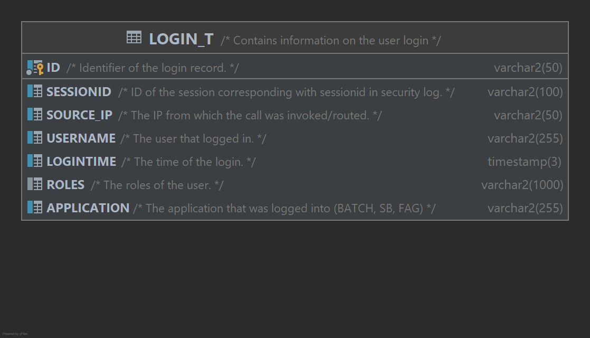
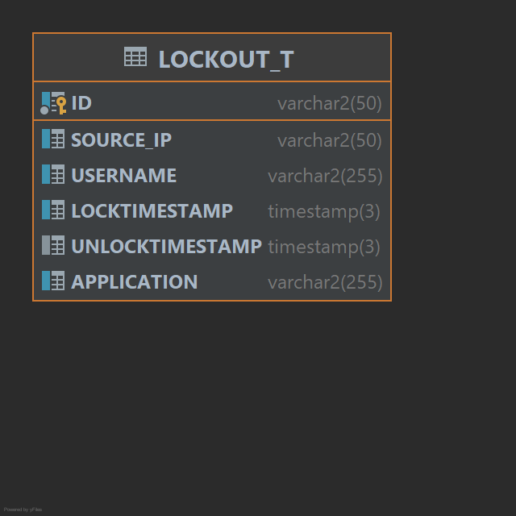

# References

| Reference                                                                                                                                                                                        | Title                  | Author                        | Version |
|--------------------------------------------------------------------------------------------------------------------------------------------------------------------------------------------------|------------------------|-------------------------------|---------|
| [C0200 – Logging](https://goto.netcompany.com/cases/GTE351/NCMCORE/_layouts/15/WopiFrame.aspx?sourcedoc=%7BF3079694-D07C-4D6A-8417-5BDF7C4D53DB%7D&file=C0200%20-%20Logging.docx&action=default) | C0200 – Logging        | Mark Faldborg                 | 1.0     |
| [DD130 – SLA](/DD130-Detailed-Design/SLA-monitor)                                                                                                                                                | DD130 - SLA-monitor    | Niklas Karlsson               | 1.0     |
| [DD130 - Error handling](/DD130-Detailed-Design/Error-handling)                                                                                                                                  | DD130 - Error handling | Christoffer Donskov Mouritzen | 1.0     |
| [DD130 - Filters](/DD130-Detailed-Design/Filters)                                                                                                                                                | DD130 - Filters        | Szymon Micyk                  | 1.0     |
| [C0200 - Filters]                                                                                                                                                                                | C0200 - Filters        | Szymon Micyk                  | 1.0     |
| [Logback - Manual](https://logback.qos.ch/manual/index.html)                                                                                                                                     | Logback manual         | Logback contributors          | 1.2.3   |
| [DD130 - Logging](https://source.netcompany.com/tfs/Netcompany02/NF4J/_wiki/wikis/Documentation/5010/Logging)                                                                                    | NF4J DD130 – Logging   | Netcompany S/A                |         |

# Introduction

The Amplio logging component is used for general logging of events and exceptions to console, file, or the database
sometimes all three, the modules within are useful for automating logging of e.g. errors and statistics, and can be
generally used out of the box for these purposes.

This document describes the Amplio logging component, it is intended as an overview of the modules and details about
their
implementation. For a general information on use, configuration and customization
see [C0200 – Logging](https://goto.netcompany.com/cases/GTE351/NCMCORE/_layouts/15/WopiFrame.aspx?sourcedoc=%7BF3079694-D07C-4D6A-8417-5BDF7C4D53DB%7D&file=C0200%20-%20Logging.docx&action=default)
for a general use guide.

## Target audience

The target audience of this document is a developer with some Amplio experience, who is looking to get a better
understanding of the Amplio logging component.

[High level description](#high-level-description) is written to be used as a general introduction to the logging component.

## Purpose

The Amplio Logging component is divided into several modules which are explained in this document. A list of modules
with a
description follows.

- Security logger – Logs access to the application in general
- Login logger – Logs newly started sessions into the database
- Lockout logger – Logs requests to resources that a user is not allowed to access

Note that this is an extension of the logging component of
NF4J [DD130 - Logging](https://source.netcompany.com/tfs/Netcompany02/NF4J/_wiki/wikis/Documentation/5010/Logging)

## Background information

Logging in general refers to calling a logging function which logs a timestamped message to a file, the common module
does this via the Logback library (https://logback.qos.ch/), which is not in scope for this document. The other modules
in the Amplio logging component help with more in-depth tasks, like logging errors to the database, or logging security
events.

## Relevant document references

When reading this it is useful to have passing knowledge of the following documents:

- [Logback - Manual](https://logback.qos.ch/manual/index.html) – For understanding of the basics of logging and Logback
- [C0200 - Filters] – for configuration of Filters
- [DD130 - Filters](/DD130-Detailed-Design/Filters)     – For understanding of Filters
- [DD130 - Logging](https://source.netcompany.com/tfs/Netcompany02/NF4J/_wiki/wikis/Documentation/5010/Logging) – NF4J
  logging component that is a base for Amplio logging component

No intimate knowledge is required before reading this document.

# High level description

The Amplio logging framework is a set of modules which allow projects to monitor, log, and audit their system.

## Security Logging

Provides logging of what was accessed, by who, and when.

## Login Logging

Provides logging of which users logged in and when.

## Lockout Logging

Provides logging of unauthorized access attempts, this module is part of the lockout filter.

# Configuring Logback

For Logback configuration
see [DD130 - Logging](https://source.netcompany.com/tfs/Netcompany02/NF4J/_wiki/wikis/Documentation/5010/Logging).
Current chapter will present custom configurations provided by Amplio.

## Payload logging for integrations (request/response)

Payload logging is configured separately from regular file logging. This is done to make the regular logs easier to read
and to make the payload logs easier to work with.

The configuration for integrations lives in logback-integrations.xml, this file should be auto-generated using the
generateIntegrationsLoggingConfig gradle task.

### Configuring integration logs (generating the logback file)

The integration logs can be configured in the template logback-integrations.xml.gsp, the properties that are most
interesting are:

| Property/field              | Explanation                                                                                                                                                                                                             |
|-----------------------------|-------------------------------------------------------------------------------------------------------------------------------------------------------------------------------------------------------------------------|
| INTEGRATIONS_LOG_FORMAT     | Configures the format of your log, this is documented in the Layout section of [Logback - Manual](https://logback.qos.ch/manual/index.html), the NC specific fields                                                     |
| INTEGRATIONS_LOG_DIR        | The directory which integrations logs are put in, by default it is a subdirectory /integrations/ of the default log directory, for which see earlier                                                                    |
| fileNamePattern on appender | Defines how files are named when size limit or a new day is reached, by default the format is for example my-integration.log.2022.09.26.gz for a log created 2022-09-26, files are automatically g-zipped when archived |

### Individual integration example

To configure an integration for logging it must fulfill the following criteria:

1. The endpoint is configured to log fulfilled by using
   `nc.modulus.ydelse.integration.template.ws.api.DefaultWsClientBuilderImpl` like this:

```java
@Bean
public DefaultWsClientBuilder<MyIntegrationPortType> myIntegrationWsClientBuilder() {
    return new DefaultWsClientBuilderImpl<>(MyIntegrationPortType.class)
            .withLogging(loggingBuilder.withSystemName("MyIntegration"));
}
```

This ensures that the webservice requests and responses are logged as "MyIntegration_WS".

2. `/resources/logback/logback-integrations.xml` has been updated with log name and the pattern for the integrations log
   lines fulfilled by updating integrations.csv, and running the gradle task `generateIntegrationsLoggingConfig (
   ./gradlew generateIntegrationsLoggingConfig)`. The format for integrations.csv is system-name;file-name, the system
   name for our integration above would be MyIntegration_WS and an example file name could be my-integration.

# Module overview

The Amplio logging component has several modules which do database logging and conventional logging, this section
describes
these modules.

## Common logging component

The common logging component is what was explained in [high level description](#high-level-description).

### Including

To include the logging module in a project via gradle add the following dependency:

```groovy
compile(group: 'modulus-ydelse.platform.logging.common', name: 'platform-logging-common-api', version:
        modulusYdelseVersion)
compile(group: 'modulus-ydelse.platform.logging.common', name: 'platform-logging-common-service', version:
        modulusYdelseVersion)
```

## Logging filters overview

This section describes the filters which do conventional logging as well as database logging.

For a thorough overview of Filters see [DD130 - Filters](/DD130-Detailed-Design/Filters).

Filters are run for every request to the application, they enable developers to log e.g. what user is trying to access
which resource.

Logging filters are, as a rule, configured to run first in the filter chain to ensure that logging happens before a
request is rejected because of security or similar.

### Configuration

The logging filter properties are described in detail in [DD130 - Filters](/DD130-Detailed-Design/Filters). Logging
filters only need to be included and enabled to work. No code is required.

Logging filters are configured via properties:

| Property name                   | Description                                                                            |
|---------------------------------|----------------------------------------------------------------------------------------|
| my.{filter-name}.filter.enabled | Boolean value defining if the filter is enabled, defaults to true if unset             |
| {filter-name}.urlPatterns       | Defines the url pattern for which logging should happen, defaults to which is all urls |
| {filter-name}.applicationName   | Defines the application name used in the log, default is ADMIN                         |

### Security filter logger

The security filter log can be configured to log to either the database or the conventional log.

The default behavior for the security filter log is to log to a file, in the conventional manner, this means that
security events are logged to the security log.

If the property securitylog.logToFile is set to false the table SECURITYLOG is used for logging security events.

The security filter log will log headers, username, url, and several ids for requests. For a full breakdown of the
SECURITYLOG table see [security filter logging](#security-filter-logging).

For an explanation of the security filter see [DD130 - Filters](/DD130-Detailed-Design/Filters) and [C0200 - Filters].

#### Security log properties

Security filter has these log specific properties that can be set:

| Property name                     | Description                                                                                                                              |
|-----------------------------------|------------------------------------------------------------------------------------------------------------------------------------------|
| securitylog.logToFile             | Boolean value defining if the filter logs to a file or the database, false means that it logs to the database, defaults to true if unset |
| securitylog.loggedheaders         | Comma separated list of headers that are logged for request, default is "x-forwarded-for,host,referer,x-requested-with"                  |
| securitylog.loggedresponseheaders | Comma separated list of headers that are logged for response, default is "none", if all should be logged set this to "all"               |
| securitylog.ignoredstatuscodes    | Http status codes that are ignored, default is 304 (not modified)                                                                        |
| securitylog.ignoredfilter         | Regex for requests that should be ignored, default ignores requests for some resources, and alive checks                                 |
| securitylog.ignoreapp             | Unused, default is none                                                                                                                  |

For more information about security filter configuration see [DD130 - Filters](/DD130-Detailed-Design/Filters).

### Login filter logger

The login filter log is enabled if the login filter is enabled, it logs information about logins to the LOGIN table, see
[login filter logging](#login-filter-logging) for more information about the data logged.

For an explanation of the login filter see [DD130 - Filters](/DD130-Detailed-Design/Filters) and [C0200 - Filters].

#### Including

To include the logging component in a project via gradle add the following dependency:

```groovy
compile(group: 'modulus-ydelse.platform.logging.login', name: 'platform-logging-login-api', version:
        modulusYdelseVersion)
compile(group: 'modulus-ydelse.platform.logging.login', name: 'platform-logging-login-service', version:
        modulusYdelseVersion)
```

### Lockout filter logger

The lockout filter log is enabled if the lockout filter is enabled, it logs information about users that are locked out
to the LOCKOUT table, see [lockout filter logging](#lockout-filter-logging) for more information about the data logged.

For an explanation of the lockout filter see [DD130 - Filters](/DD130-Detailed-Design/Filters) and [C0200 - Filters].

#### Including

To include the logging component in a project via gradle add the following dependency:

```groovy
compile(group: 'modulus-ydelse.platform.logging.lockout', name: 'platform-logging-lockout-api', version:
        modulusYdelseVersion)
compile(group: 'modulus-ydelse.platform.logging.lockout', name: 'platform-logging-lockout-service', version:
        modulusYdelseVersion)
```

# Data model

This section contains database tables for the different loggers that log to the database.

## Technical error logging

Technical error uses the TEKNISK_FEJL table when persisting logged errors. Note that this differs from NF4J logging
component by relation to Opgave and Opgavetrin table

<h5>Table 1 Database table TEKNISK_FEJL</h5>

| Column         | Type          | Description                                                                                                                                                 |
|----------------|---------------|-------------------------------------------------------------------------------------------------------------------------------------------------------------|
| OPGAVE_ID      | String        | Opgave, if available, in context when the error occurred                                                                                                    |
| OPGAVETRIN_ID  | String        | Opgave trin, if available, in context when the error occurred                                                                                               |
| FEJLKATEGORI   | String        | The category of the error, this is defined in the ErrorCode enum                                                                                            |
| FEJLTYPE       | String        | The type of error, this is the "error code" from the ErrorCode enum                                                                                         |
| TIDSPUNKT      | LocalDateTime | The time the error occurred, worth noting that since technical errors are inserted using DbQueue this time will be different from the default OPRETTET time |
| HAANDTERET     | Boolean       | Indicates if the error has been handled, default is false                                                                                                   |
| TITEL          | String        | The title from the ErrorCode enum                                                                                                                           |
| FEJLDETALJER   | String        | Details of the error, usually a stacktrace                                                                                                                  |
| INPUT          | String        | Used for further details, e.g. an object which might have caused the error to occur serialized to a string                                                  |
| ALVORLIGHED    | String        | Severity of the error from the ErrorCode enum                                                                                                               |
| SERVER_ID      | String        | The server on which the error occurred                                                                                                                      |
| CORRELATION_ID | String        | The current correlation id when the error occurred                                                                                                          |

<div style="text-align: center;">


</div>

## Security filter logging

Security filter uses the SECURITYLOG table when persisting security events, only if database logging is enabled.

<h5>Table 2 Database table SECURITYLOG</h5>

| Column             | Type          | Description                                   |
|--------------------|---------------|-----------------------------------------------|
| REQUESTID          | String        | Id for the request, from context              |
| SESSIONID          | String        | Current session id                            |
| SOURCE_IP          | String        | Source IP for the request                     |
| URL                | String        | Requested url                                 |
| USERNAME           | String        | Username for the request                      |
| ENTERTIMESTAMP     | LocalDateTime | Time the request started                      |
| EXITTIMESTAMP      | LocalDateTime | Current time when creating log statement      |
| REMOTEDURATION     | BigDecimal    | Unused                                        |
| MESSAGE            | String        | Headers for the request and response          |
| HTTP_RESPONSE_CODE | String        | The HTTP response code                        |
| TYPE               | String        | The HTTP method used for request              |
| HOST               | String        | Node name for current application             |
| APPLICATION        | String        | Name of the application the event occurred on |

<div style="text-align: center;">


</div>

## Login filter logging

Login filter uses the LOGIN table for persisting login records.

<h5>Table 3 Database table LOGIN</h5>

| Column      | Type          | Description                                        |
|-------------|---------------|----------------------------------------------------|
| SESSIONID   | String        | Session id                                         |
| SOURCE_IP   | String        | IP which login request came from                   |
| USERNAME    | String        | Username of the user                               |
| LOGINTIME   | LocalDateTime | Login time                                         |
| ROLES       | String        | Comma separated list of roles the user was granted |
| APPLICATION | String        | Name of the application the login occurred on      |

<div style="text-align: center;">


</div>

## Lockout filter logging

The lockout filter uses the table LOCKOUT for persisting records of lockouts.

<h5>Table 4 Database table LOCKOUT</h5>

| Column          | Type          | Description                                     |
|-----------------|---------------|-------------------------------------------------|
| SOURCE_IP       | String        | IP which the locked out request came from       |
| USERNAME        | String        | Username of the locked out user                 |
| LOCKTIMESTAMP   | LocalDateTime | Timestamp for the lockout                       |
| UNLOCKTIMESTAMP | LocalDateTime | Timestamp for when the lockout unlocks          |
| APPLICATION     | String        | Name of the application the lockout occurred on |

<div style="text-align: center;">


</div>