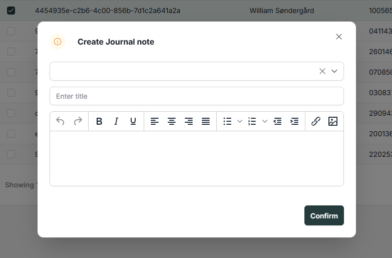

# References

| Reference                                                    | Author              |
|--------------------------------------------------------------|---------------------|
| [DD130 - Table][DD130_TABLE]                                 | Netcompany          |
| [DD130 - Search][DD130_SEARCH]                               | Netcompany |
| [DD130 - Mass Action Batch Job][DD130_MASS_ACTION_BATCH_JOB] | Netcompany     |
| [DD130 - Mass Action Core][DD130_MASS_ACTION_CORE]           | Netcompany     |

<!-- =============== -->
<!-- REFERENCE LINKS -->
<!-- =============== -->

<!-- Toolkit reference links -->

[DD130_TABLE]: https://goto.netcompany.com/cases/GTE2252/AMPJ/SitePages/Wiki.aspx#/DD130-Detailed-Design/Tables
[DD130_SEARCH]: https://goto.netcompany.com/cases/GTE2252/AMPJ/SitePages/Wiki.aspx#/DD130-Detailed-Design/Search
[DD130_MASS_ACTION_BATCH_JOB]: https://goto.netcompany.com/cases/GTE2252/AMPJ//SiteAssets/wiki/site/index.aspx#/DD130-Detailed-Design/Mass-Action-Batch-Job
[DD130_MASS_ACTION_CORE]: https://goto.netcompany.com/cases/GTE2252/AMPJ//SiteAssets/wiki/site/index.aspx#/DD130-Detailed-Design/Mass-Action-Core

# Introduction

This is the detailed design for Amplio "Mass action: Create Journal note" component, which provides functionality for
creating journal notes for multiple selected entities simultaneously from table views, primarily within the
Advanced Search interface.

## Target audience

This document target audience is primarily developers with Amplio experience. As well as any stakeholder interested
in the Amplio Mass Actions component and journal note functionality.

## Purpose

The Mass Action Create Journal Note component creates journal notes across multiple selected entities from table views.
This processes documentation activities, observations, or decisions for multiple records simultaneously, rather than
creating notes individually for each entity.

The component includes:

- Front-end interface for selecting multiple entities and entering journal note details
- Back-end functionality for processing mass journal note creation
- Case correlation logic to associate notes with relevant cases when applicable
- Merge field support for dynamic content replacement
- Validation and error handling for bulk operations 

The component does not specify which entities support mass journal note creation - this is configurable per project based
on business requirements.

## Background information

The component creates journal notes across multiple entities simultaneously. Users select multiple records from table
views - primarily in the Advanced Search interface - and create journal notes for all selected items in one operation.

The Advanced Search view provides table functionality where users search for entities using various criteria and perform
mass actions on the search results, including journal note creation.

Each project configures which entity types support mass journal note creation and implements custom case correlation
logic through resolver components. The mass action requires the Table module for entity selection, the Search module for
Advanced Search functionality, and the Journal Note module for note creation functionality.

Case correlation operates through dedicated resolver implementations that determine how journal notes associate with
cases based on entity context and business rules.

Merge fields enable dynamic content replacement within journal note text, including entity-specific information that
populates automatically during note creation.

# High level description of the component

The "Mass Action: Create Journal Note" component provides functionality for creating journal notes across multiple
selected entities from table views in a single operation, with primary usage in the Advanced Search interface.

The component can be configured by each project to:

- Define which entity types support mass journal note creation in Advanced Search tables
- Implement custom case correlation logic through resolver components
- Configure merge field resolvers for dynamic content replacement
- Configure validation rules and business constraints
- Customize the user interface for note creation

Key features include:

1. <b>Advanced Search Integration:</b> Primary interface for entity selection through search and filtering capabilities
2. <b>Entity Selection:</b> Users select multiple entities from Advanced Search result tables
3. <b>Journal Note Creation Interface:</b> Single form for entering journal note details that will apply to all selected entities
4. <b>Case Correlation:</b> Automatic association of notes with relevant cases based on configurable business logic
5. <b>Mass Action Processing:</b> Efficient server-side processing of multiple note creation operations

# Mass Actions
The Mass Action Framework handles bulk operations across multiple entities within the Amplio platform. The framework
executes large-scale data operations while maintaining system performance and operational visibility.

The framework executes bulk operations asynchronously, separating initiation from processing. The system accepts multiple
initiation methods including table row selections from Advanced Search interfaces and programmatic API calls.

The mass action administration interface provides centralized management, displaying all operations, status monitoring,
and process management capabilities.

For detailed information on specific framework components, refer to the [DD130 - Mass Action Core][DD130_MASS_ACTION_CORE]
and [DD130 - Mass Action Batch Job][DD130_MASS_ACTION_BATCH_JOB].

# Mass Action: Create Journal Notes
This functionality creates identical journal notes across multiple entities in a single operation. The feature processes
selected entities and applies a standardized note to all records simultaneously.

The component includes merge field support in journal note content, which replaces placeholders with entity-specific
data during note creation.

The feature operates on searchable entities through the Advanced Search view. Users select entities from search results
and access the functionality via the "Action" button, which displays the journal note creation option for the selected entities (as shown in Figure 1).

<div style="text-align: center;">


<h5>Figure 1 Action button on a searchable entity</h5>
</div>

Clicking the "Create Journal Note" mass action opens a modal dialog that guides users through the journal note creation process.
Once all required fields are completed, the system saves the journal note data to the selected entities.

Journal notes are automatically linked to relevant cases through a mapping system. Amplio includes default case mapping logic,
but projects can customize this assignment process to meet specific business requirements. This project-specific logic
ensures that journal notes are associated with the appropriate cases based on the implementation's unique needs.

## Back-end implementation

The back-end implementation consists of the following core components:
- <b>EntityCreateJournalNoteMassActionService</b> - Main service handling journal note creation operations, batch processing
logic, and coordination between different components.

- <b>EntityCreateJournalNoteMassActionContent</b> - Data transfer object containing user input for journal note creation
(business key, title, and content).

- <b>EntityCreateJournalNoteMassActionBatchItem</b> - Serializable record representing a single item in batch processing,
containing entity information and note content.

- <b>EntityCreateJournalNoteMassActionOperationTypes</b> - Defines the CREATE_JOURNAL_NOTE mass action operation type for framework registration.

- <b>EntityCreateJournalNoteModuleTypes</b> - Defines the JOURNAL_NOTE mass action module type for UI integration.

- <b>CreateJournalNoteMassActionRow</b> - Marker interface that entities must implement to enable journal note mass
action functionality.

- <b>EntityCreateJournalNoteMassActionCaseRelationResolver</b> - Interface for implementing custom case correlation logic.
Projects can provide their own implementations to define how journal notes should be associated with cases based on entity
relationships.

- <b>EntityCreateJournalNoteMassActionProcessor</b> - Framework processor that orchestrates the mass action execution,
handles both synchronous and asynchronous processing modes, and integrates with the batch job system.

- <b>EntityCreateJournalNoteMassActionValueResolver</b> - Abstract base class for implementing entity-specific merge field resolvers

- <b>CreateJournalNoteMassActionMergeDataSource</b> - Data source record providing context for merge field resolution

## Front-end implementation
The front-end implementation leverages the Mass Action framework and includes:

- <b>EntityCreateJournalNotePopUp</b> - React component providing the user interface for mass journal note creation.
Features include:
  - Template selection dropdown with shimmer loading states
  - Dynamic form fields that populate based on selected template
  - Title and content input fields with text editor support
  - Integration with the mass action confirmation workflow

The component allows users to select from predefined journal note templates, customize the title and content, and submit
the mass action for processing across all selected entities.

<div style="text-align: center;">


<h5>Figure 2 EntityCreateJournalNotePopUp view</h5>
</div>

## Reference application implementation
The reference application demonstrates the implementation of journal note mass actions for the Person entity.
This implementation serves as a practical example of how to integrate the mass action framework of Journal notes creation
with specific business entities.

### Step 1: Case Relation Resolver
<b>PersonCreateJournalNoteMassActionCaseRelationResolver</b> provides the business logic for correlating Person entities
with their associated cases during journal note creation. This component:

- Examines all PersonCaseParty relationships associated with the person
- Selects the first available case from the person's case associations
- Associates the journal note with the identified case through the JournalNoteCommand
- Handles scenarios where no cases are found by leaving the note unassociated

The implementation demonstrates a simple case selection strategy that can be customized based on specific business
requirements such as case priority, status, or recency. Implementation:

```java
@Component
public class PersonCreateJournalNoteMassActionCaseRelationResolver 
    implements EntityCreateJournalNoteMassActionCaseRelationResolver {
    
    @Override
    public void correlateJournalNoteWithACase(JournalNoteCommand createJournalCommand, SimpleEntity entity) {
        Person person = entity.upgrade();
        Set<PersonCaseParty> personCaseParties = person.getCaseParties();

        Optional<String> personCaseId = personCaseParties.stream()
                .filter(personCaseParty -> personCaseParty.getCase() != null)
                .map(personCaseParty -> personCaseParty.getCase().getId())
                .findFirst();

        personCaseId.ifPresent(caseId ->
                createJournalCommand.setCaseIds(new ValidationObjectList<>(List.of(caseId))));
    }
}
```

### Step 2: Merge Field Value Resolver and System Parameter
The component includes merge field functionality that allows dynamic content replacement within journal notes:

1. <b>Field Declaration</b>: Merge fields are declared as system parameters with keys matching the field names
2. <b>Content Processing</b>: During note creation, the system scans note content for merge field patterns {FIELD_NAME}
3. <b>Resolution</b>: Each field is resolved using the appropriate value resolver method
4. <b>Replacement</b>: Resolved values replace the merge field placeholders in the final note content

<b>PersonCreateJournalNoteMassActionValueResolver</b> provides merge field resolution for Person entities:

```java
@Component
public class PersonCreateJournalNoteMassActionValueResolver extends EntityCreateJournalNoteMassActionValueResolver {

    @MergeField("Business-Name")
    public String getBusinessName(SimpleEntity entity) {
        if (entity.upgrade() instanceof Person person) {
            return person.getName();
        }
        return null;
    }
}
```

This resolver enables users to include <b>{Business-Name}</b> in journal note content, which will be replaced with the person's name during processing.
This rule is declared as a system parameter, with a following JSON pattern:

```json
{
  "id": "9f7b9e68-38c4-41b2-904e-ba0396aab168",
  "key": "Business-Name",
  "startDate": "2026-03-01",
  "typeAsStr": "merge_field",
  "parameterValuesAsMap": {
    "nc.foundation.libraries.documentmerge.base.api.model.resolver.MergeFieldResolutionType": "RESOLVER",
    "nc.foundation.libraries.documentmerge.base.api.model.types.MergeFieldInputType": "TEXT",
    "inquiry": "entity.getBusinessName",
    "title": "Person business name"
  }
}
```

### Step 3: Row entity Integration
<b>PersonSearchTableDisplayRow</b> enables journal note mass actions by implementing the CreateJournalNoteMassActionRow
marker interface. This integration:

- Extends the existing Person search table row with mass action capabilities
- Provides entity identification methods required by the framework
- Maintains compatibility with existing table functionality including reservations and search actions

Implementation:
```java
@Getter
@TypeScriptModel
public class PersonSearchTableDisplayRow implements CreateJournalNoteMassActionRow{
  
    // Existing implementation...
  
}
```
### Step 4: Table Configuration
<b>PersonSearchTableConstructor</b> configures the mass action availability within the Person search table by:

- Defining the journal note mass action in the getTableMassActions() method
- Specifying the operation type (CREATE_JOURNAL_NOTE) and UI module (JOURNAL_NOTE)
- Providing localization keys for the mass action button (mass_action_create_note)
- Enabling multi-row selection functionality required for mass actions 

This configuration makes the "Create Journal Note" mass action available in the Person Advanced Search interface,
allowing users to select multiple persons and create notes for them simultaneously.

Implementation:
```java
@Component
@RequiredArgsConstructor
public class PersonSearchTableConstructor implements TableConstructor<PersonSearchTableDisplayRow, PersonSearchTableRequest>,
        MultiSelectTable<PersonSearchTableDisplayRow>, MassActionsTable, ActionsTable<SearchEntityActions, PersonSearchTableDisplayRow> {
    
    // Existing column definitions and methods...
    
    @Override
    public List<TableMassAction> getTableMassActions() {
        return List.of(
                // Existing mass actions...
                TableMassAction.builder()
                    .massActionOperationType(EntityCreateJournalNoteMassActionTypes.CREATE_JOURNAL_NOTE.getValue())
                    .ptKey("mass_action_create_note")
                    .module(EntityCreateJournalNoteModuleTypes.JOURNAL_NOTE.getValue())
                    .build()
        );
    }
    
    @Override
    public TableFlags getFlags(String tableId, PersonSearchTableRequest request) {
        return TableFlags.builder()
            .enableMultiRowSelection(true)  // Required for mass actions
            .enableActionColumn(true)
            .build();
    }
}
```

# FAQ
If your project implemented the mass action of Journal notes creation and found any troubleshooting tips, or questions
that you have answered during implementation, then please add them here.