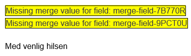
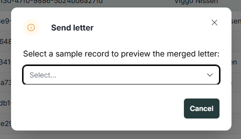
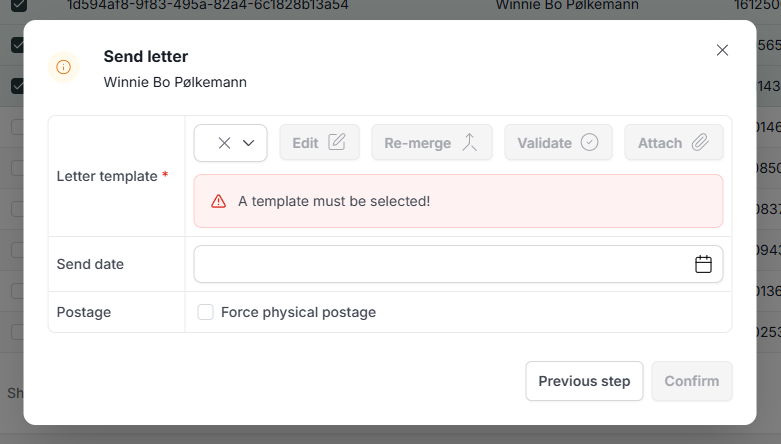
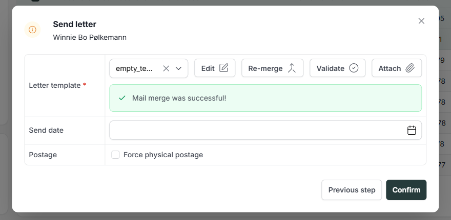

# References

| Reference                                                    | Author              |
|--------------------------------------------------------------|---------------------|
| [DD130 - Table][DD130_TABLE]                                 | Netcompany          |
| [DD130 - Search][DD130_SEARCH]                               | Netcompany          |
| [DD130 - Mass Action Batch Job][DD130_MASS_ACTION_BATCH_JOB] | Netcompany          |
| [DD130 - Mass Action Core][DD130_MASS_ACTION_CORE]           | Netcompany          |

<!-- =============== -->
<!-- REFERENCE LINKS -->
<!-- =============== -->

<!-- Toolkit reference links -->

[DD130_TABLE]: https://goto.netcompany.com/cases/GTE2252/AMPJ/SitePages/Wiki.aspx#/DD130-Detailed-Design/Tables
[DD130_SEARCH]: https://goto.netcompany.com/cases/GTE2252/AMPJ/SitePages/Wiki.aspx#/DD130-Detailed-Design/Search
[DD130_MASS_ACTION_BATCH_JOB]: https://goto.netcompany.com/cases/GTE2252/AMPJ//SiteAssets/wiki/site/index.aspx#/DD130-Detailed-Design/Mass-Action-Batch-Job
[DD130_MASS_ACTION_CORE]: https://goto.netcompany.com/cases/GTE2252/AMPJ//SiteAssets/wiki/site/index.aspx#/DD130-Detailed-Design/Mass-Action-Core

# Introduction

This is the detailed design for Amplio "Mass action: Send Letter" component, which provides functionality for
sending letter templates to multiple selected entities simultaneously from table views, primarily within the
Advanced Search interface.

## Target audience

This document target audience is primarily developers with Amplio experience. As well as any stakeholder interested
in the Amplio Mass Actions component and letters functionality.

## Purpose

The Mass Action Send Letter component sends identical letter templates to multiple selected entities from table views.
This processes bulk activities for multiple records simultaneously, rather than sending letters individually for each entity.

The component includes:

- <b>Front-end interface</b> for selecting multiple entities and configuring letter template details
- <b>Back-end functionality</b> for processing mass letter sending operations
- <b>Merge field support</b> for dynamic content replacement (entity-specific information)
- <b>Validation and error handling</b> for bulk distribution operations
- <b>Asynchronous processing</b> via batch job system for large-scale operations

The component is configurable per project based on business requirements and can be enabled/disabled at the project level.

## Background information

The component sends letter templates to multiple entities simultaneously. Users select multiple records from table
views - primarily in the Advanced Search interface - and send the same letter template to all selected items in one operation.

Each project configures whether mass letter sending is enabled and which entity types support this functionality.

The Advanced Search view provides table functionality where users search for entities using various criteria and perform
mass actions on the search results, including letter distribution. This mass action requires the Table module for entity selection,
the Search module for Advanced Search functionality, and the Letter module for letter template management and sending functionality.

Merge fields enable dynamic content replacement within letter content, including entity-specific information that
populates automatically during letter generation.

# High level description of the component

The "Mass Action: Send Letter" component provides functionality for sending letter templates to multiple
selected entities from table views in a single operation, with primary usage in the Advanced Search interface.

The component can be configured by each project to:

- Define which entity types support mass letter sending functionality in Advanced Search tables
- Implement custom case correlation logic through resolver components
- Configure merge field resolvers for dynamic content replacement
- Configure validation rules and business constraints

Key features include:

1. <b>Advanced Search Integration:</b> Primary interface for entity selection through search and filtering capabilities
2. <b>Entity Selection:</b> Users select multiple entities from Advanced Search result tables
3. <b>Letter Template Selection Interface:</b> Single form for selecting and configuring letter templates that will be sent to all selected entities
4. <b>Merge Field Support:</b> Dynamic content replacement with entity-specific information in letter content
5. <b>Mass Action Processing:</b> Efficient server-side processing of multiple note creation operations

# Mass Actions
The Mass Action Framework handles bulk operations across multiple entities within the Amplio platform. The framework
executes large-scale data operations while maintaining system performance and operational visibility.

The framework executes bulk operations asynchronously, separating initiation from processing. The system accepts multiple
initiation methods including table row selections from Advanced Search interfaces and programmatic API calls.

The mass action administration interface provides centralized management, displaying all operations, status monitoring,
and process management capabilities.

For detailed information on specific framework components, refer to the [DD130 - Mass Action Core][DD130_MASS_ACTION_CORE]
and [DD130 - Mass Action Batch Job][DD130_MASS_ACTION_BATCH_JOB].

# Mass Action: Send Letters
This functionality sends identical letter templates to multiple entities in a single operation. The feature processes
selected entities and distributes a standardized letter to all records simultaneously.

The component includes merge field support in letter content, which replaces placeholders with entity-specific
data during letter generation.

The feature operates on searchable entities through the Advanced Search view. Users select entities from search results
and access the functionality via the "Action" button, which displays the send letter option for the selected entities (as shown in Figure 1).

<div style="text-align: center;">


<h5>Figure 1 Action button on a searchable entity</h5>
</div>

Clicking the "Send Letter" mass action opens a modal dialog that guides users through the letter sending process.

Initially, users select a base entity from their selection to resolve merge fields and other template-relevant information, which will apply to the entire selection (See Figure 3).

Afterward users select a letter template, configure merge fields if needed, and review the letter content before sending (See Figure 4).

Once all required fields are completed, the system queues the letter distribution to the selected entities (See Figure 5).

<div style="text-align: center;">


<h5>Figure 2 Document template with letter merge fields</h5>
</div>

## Back-end implementation
The back-end implementation consists of the following core components:

- <b>EntitySendLetterMassActionService</b> - Main service handling letter sending operations, batch processing
  logic, and coordination between different components.

- <b>EntitySendLetterMassActionContent</b> - Data transfer object containing user input for letter sending
  (template key, template title, physical post flag, response time, and attachments).

- <b>EntitySendLetterMassActionBatchItem</b> - Serializable record representing a single item in batch processing,
  containing entity information and letter configuration.

- <b>EntitySendLetterMassActionOperationTypes</b> - Defines the SEND_LETTER mass action operation type for framework registration.

- <b>EntitySendLetterModuleTypes</b> - Defines the LETTER mass action module type for UI integration.

- <b>SendLetterMassActionRow</b> - Marker interface that entity tables must implement to enable letter sending mass
  action functionality.

- <b>EntitySendLetterMassActionProcessor</b> - Framework processor that orchestrates the mass action execution,
  handles both synchronous and asynchronous processing modes, and integrates with the batch job system.

- <b>EntitySendLetterMassActionLetterService</b> - Service handling template selection, merging and validation
  for the preview entity during the letter composition step. Exposes three operations: `chooseTemplate`, `merge`,
  and `validate`, each accepting and returning an `EntitySendLetterMassActionCommand`.

- <b>EntitySendLetterMassActionRestService</b> - REST-level orchestration service handling HTTP interactions
  including entity name resolution, template fetching, letter processing, and attachment management.

- <b>EntitySendLetterMassActionAttachmentService</b> - Service for managing attachments and document relations
  during the letter composition flow. Supports three attachment types:
  - <b>Template Attachments</b> — predefined attachments from template configuration, removed via `removeAppendix`
  - <b>Local Attachments</b> — user-uploaded files stored in the HTTP session, managed via `addLocalAppendix` and `removeLocalAppendix`
  - <b>Relations</b> — references to existing documents, removed via `removeRelation`

- <b>EntitySendLetterMassActionContentDeserializer</b> - Service responsible for deserializing mass action payload
  data into `EntitySendLetterMassActionContent` instances. Supports deserialization from both raw JSON strings
  (containing a `payload` field) and directly from `JsonNode` objects.

### Extension points
The component exposes four optional extension interfaces that projects can implement to customize behavior.
All interfaces are discovered automatically via Spring component scanning.

- <b>EntitySendLetterMassActionMergeContextProvider</b> - Provides a fully configured merge context for each entity.
  If not implemented, a default context is used with only the recipient set, which may result in unresolved merge fields.

- <b>EntitySendLetterMassActionCaseRelationResolver</b> - Associates the created letter with a case based on
  entity-specific business logic. If not implemented, letters are created without case correlation.

- <b>EntitySendLetterMassActionDocumentRelationResolver</b> - Creates document relations between the letter document
  and the entity. If not implemented, letters are created without document relations.

- <b>EntitySendLetterMassActionShipmentService</b> - Handles the actual delivery of the letter to the recipient
  (e.g. digital post or physical post). If not implemented, letters are created and persisted but not dispatched.
  Attachments are available via `letterDto.letter().getAttachmentsKeyTitleMap()`, which contains both standard template
  attachments and local attachments uploaded by the user. Local attachment files can be retrieved from the HTTP session
  using `SessionHelper.getAttribute(SessionHelper.getLocalAppendixSessionId(messageId, appendixId))`, where `messageId`
  is `letterDto.letter().getContentId()` and `appendixId` is the key from the attachments map.

- <b>EntitySendLetterMassActionFailureHandler</b> - Hook interface for handling per-entity failures during
  batch processing. Projects can implement this as a Spring bean to intercept two failure scenarios:
  merge failures (`onMergeFailed`) and unexpected exceptions (`onException`).

## Front-end implementation
The front-end implementation leverages the Mass Action framework and includes the following components:

- <b>EntitySendLetterPopUp</b> - Main React component providing the user interface for mass letter sending. Manages
  a two-step flow: entity selection followed by letter composition. Features include:
  - Entity selection from the mass action selection, with automatic progression when only one entity is selected
  - Letter template selection with automatic merge on template change
  - Letter preview via the Edit button, which opens the merged document in Word for inspection (preview only — edits are not applied to the final letters sent to all recipients)
  - Re-merge capability to refresh the preview with current template data
  - Validation workflow to check merge field completeness before submission
  - Attachment management (template attachments, local file uploads, and existing document relations)
  - Physical post and response time configuration
  - Warning display when the number of selected recipients exceeds the configured threshold

- <b>SendLetterMassActionAppendixPopup</b> - Modal component for managing attachments. Supports uploading local
  files with format and size validation, and displays currently added attachments grouped by type.

- <b>sendLetterMassActionServices</b> - React hooks encapsulating API calls:
  - `useCreateDocumentWithTemplate` - Creates and merges a letter draft for the preview entity
  - `useMergeDocument` - Re-merges the letter draft with current template data
  - `useValidateDocument` - Validates the merged document for missing merge fields
  - `useEditDocumentTemplate` - Opens the merged document in Word via WebDAV for preview
  - `useUploadLocalAttachment` - Uploads a local file and stores it in the session
  - `useRemoveAttachment` - Removes attachments, local attachments, or document relations
  - `useDownloadLocalDocument` - Downloads a locally uploaded attachment file
  - `useOpenDocumentUrl` - Opens an existing document attachment by URL

- <b>sendLetterMassActionApi</b> - RTK Query API definition with endpoints for all back-end interactions.

<div style="text-align: center;">


<h5>Figure 3 EntitySendLetterPopUp initial with a choose of example entity for fields merging (AI GENERATED PLACEHOLDER)</h5>
</div>

<div style="text-align: center;">


<h5>Figure 4 EntitySendLetterPopUp view without selected template</h5>
</div>

<div style="text-align: center;">


<h5>Figure 5 EntitySendLetterPopUp view with selected and merged template</h5>
</div>

## Project integration guide
This section describes the steps required to integrate the "Send Letter" mass action into a project.

### Step 1: Mark the table row entity
Implement the `SendLetterMassActionRow` marker interface on the table row class used in the target Advanced Search table.
This enables the framework to identify which entities support letter sending.
```java
@Getter
@TypeScriptModel
public class PersonSearchTableDisplayRow implements SendLetterMassActionRow {
    // existing implementation
}
```

### Step 2: Configure the table mass action
Register the SEND_LETTER mass action in the table constructor by adding it to `getTableMassActions()` and enabling
multi-row selection in `getFlags()`.
```java
@Override
public List getTableMassActions() {
    return List.of(
        TableMassAction.builder()
            .massActionOperationType(EntitySendLetterMassActionOperationTypes.SEND_LETTER.getValue())
            .ptKey("mass_action_send_letter")
            .module(EntitySendLetterModuleTypes.LETTER.getValue())
            .build()
    );
}

@Override
public TableFlags getFlags(String tableId, YourTableRequest request) {
    return TableFlags.builder()
        .enableMultiRowSelection(true)
        .build();
}
```

### Step 3: Provide merge context (required for merge fields)
Implement `EntitySendLetterMassActionMergeContextProvider` to supply entity-specific data for merge field resolution.
Without this, merge fields will not be populated.
```java
@Component
public class YourEntityMergeContextProvider implements EntitySendLetterMassActionMergeContextProvider {

    @Override
    public AbstractLetterMergeContext createMergeContext(SimpleEntity entity, String templateKey) {
        YourEntity upgradedEntity = entity.upgrade();
        AbstractLetterMergeContext context = AbstractLetterMergeContext.getInstance();
        // populate context with entity-specific data source
        return context;
    }
}
```

### Step 4: Implement letter shipment (required for delivery)
Implement `EntitySendLetterMassActionShipmentService` to define how letters are delivered to recipients.
Without this, letters are created and persisted but never dispatched.
```java
@Component
public class YourEntityShipmentService implements EntitySendLetterMassActionShipmentService {

    @Override
    public void sendLetter(AbstractLetter letter, LetterDto letterDto) {
        boolean isPhysicalPost = letterDto.letter().isPhysicalPost();
        String responseTime = letterDto.letter().getResponseTime();
        Map attachments = letterDto.letter().getAttachmentsKeyTitleMap();
        // implement delivery logic
    }
}
```

### Step 5: Associate letters with cases (optional)
Implement `EntitySendLetterMassActionCaseRelationResolver` to correlate created letters with cases based on
entity relationships.
```java
@Component
public class YourEntityCaseRelationResolver implements EntitySendLetterMassActionCaseRelationResolver {

    @Override
    public void correlateLetterWithACase(AbstractLetter letter, SimpleEntity entity) {
        // resolve case and create relation
    }
}
```

### Step 6: Create document relations (optional)
Implement `EntitySendLetterMassActionDocumentRelationResolver` to link the letter document to the entity
via document relations.
```java
@Component
public class YourEntityDocumentRelationResolver implements EntitySendLetterMassActionDocumentRelationResolver {

    @Override
    public void createDocumentRelations(String documentId, SimpleEntity entity) {
        // create document relations
    }
}
```

# FAQ

If your project implemented the "Send letter" mass action and found any troubleshooting tips, or questions
that you have answered during implementation, then please add them here.