# References

| Reference                                                                                                                                                                                         | Title                | Author                 | Version |
|---------------------------------------------------------------------------------------------------------------------------------------------------------------------------------------------------|----------------------|------------------------|---------|
| [DD130 – Batch Engine](https://goto.netcompany.com/cases/GTE351/NCMCORE/Amplio%20Deliverables/Amplio%202025/DD130%20-%20Detailed%20Design/Batch%20jobs/Framework/DD130%20-%20Batch%20Engine.docx) | DD130 - Batch Engine | Jacob Benjamin Cholewa | 1.0     |
| [DD130 – Discard](/DD130-Detailed-Design/Discard)                                                                                                                                                 | DD130 - Discard      | Birgir Eliasson        | 1.0     |

# Introduction

The minimization framework is responsible for limiting the amount of personal data related to any given person, which is
retained by an application, to the absolute minimum based on the business needs of that application. Since the business
needs can vary between different persons for any given application, as well as what might constitute personal data in
the first place, the minimization framework is parameterized over person types and data rights which specify these
aspects generically.

## Target audience

The target audience of this document are developers seeking to understand the details of the subjects related to the
minimization framework, such as developers from any project tasked with using or implementing the minimization framework
within their own project, or Amplio developers working with the minimization framework. Note that the individual
projects are expected to maintain their own documentation with respect to their application-specific data rights and
person types relevant for their individual business needs, since the minimization framework is parameterized over these
abstractions.

## Purpose

The purpose of the minimization framework is to enable an application to actively and transparently limit the data
retained by the application based on its specific business needs. This is accomplished by supplying the minimization
framework with application-specific definitions of the data which should be governed by the minimization framework,
called data rights, alongside application-specific rules which encode the business needs necessitating the use of the
governed data, called person types.

The responsibility of the minimization framework is to enforce the data governance encoding of the given application
regularly with respect to the application database, called minimization. It is currently outside the scope of the
minimization framework to also enforce the encoding continuously with respect to the application memory, called
filtering, such as at the endpoints of external integrations. Remark that such work has previously been carried out in
several of the individual projects integrating with the minimization framework, however, corresponding generic
functionality has yet to be introduced here.

This document is also intended to be a means of importing and getting started with using the minimization framework
without further assistance.

## Background information

For a general definition of terms relevant for the minimization framework, see Table 1. Since it is usually the
responsibility of the client for any given application to decide the legal circumstances which warrant retaining
personal data within their domain, no prior knowledge of the General Data Protection Regulation is required for working
with the minimization framework.

<div style="text-align: center;">

<h5>Table 1: A glossary of terms relevant for the minimization framework.</h5>

</div>

| Term                   | Definition                                                                                                                                                                                                                 |
|------------------------|----------------------------------------------------------------------------------------------------------------------------------------------------------------------------------------------------------------------------|
| **Data right**         | An application-specific definition of data which should be governed by the minimization framework. For any given person, the underlying data will only be retained for persons that hold the corresponding data right.     |
| **Person type**        | An application-specific rule which encodes arbitrary business needs for the minimization framework. For any given person, if that person matches the person type, they will be granted a corresponding set of data rights. |
| **Bitemporal mapping** | A temporal representation of data along two separate time axes, colloquially referred to as the validity time axis and the registration time axis respectively, applied upon data right covers and person type matches.    |
| **Minimization**       | The process of reactively limiting the amount of personal data retained by a given application. This feature is carried out by a dedicated batch job based on the data rights and person types of the application.         |
| **Filtering**          | The process of proactively limiting the amount of personal data retained by a given application. This feature is currently not supported by the minimization framework, although it has been done in practice.             |

# High level description of the component

The minimization framework enables compliance with the General Data Protection Regulation by limiting the amount of
personal data gathered and stored about a given person based on what is necessary for a given application. This is
relevant for applications which require processing personal data to accomplish goals such as automatic decision making
based on individual circumstances. Since the business needs of an application can be nuanced and varied, where different
personal data is relevant for different persons based on their individual circumstances, the minimization framework
introduces data rights and person types to encapsulate business needs as different sets of data for different sets of
circumstances:

* **Data right**: A data right defines a set of data which is governed by the minimization framework. When a given
  person holds the data right within a specific period, the application is allowed to keep the underlying set of data
  valid for that period, and when they do not, the application must delete the underlying set of data valid for that
  period instead.

* **Person type**: A person type defines a set of circumstances which grants a corresponding set of data rights. When a
  given person matches the person type within a specific period, the application grants the corresponding data rights
  for that period, and when they do not, the application must revoke the corresponding data rights for that period
  instead.

The minimization framework thereby uses a matching from persons to person types, alongside a mapping between person
types and data rights, both of which are based on the business needs of the given application, to automatically limit
the amount of personal data which is gathered, stored, and processed by the given application by means of a generic
minimization procedure. See Figure 1 for an overview of the minimization framework and its constituent components.

<div style="text-align: center;">

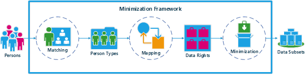

<h5>Figure 1: An overview of the minimization framework.</h5>
<br>
</div>

# Introduction to the subject

This section outlines the minimization framework and its subjects from a top-down perspective. The primary artifact of
the minimization framework is its minimization procedure, which is embedded within its minimization batch job, see
Figure 6 for a visualization of this procedure. As indicated by this visualization, the minimization procedure consists
of the following steps:

1. **Determine active persons**: This step is intended to determine the persons which should be considered as active by
   the minimization framework to be processed by the minimization procedure in batches. Remark that this step has no
   default implementation, whereby it relies entirely on a code integration point,
   see [Determining active persons](/DD130-Detailed-Design/Minimization#Determining-active-persons)
 for details.

2. **Determine person types**: This step determines the person types for the persons in the batch. This is accomplished
   by iterating through the person types supplied to the minimization framework by the derivative project and attempt to
   match each of them with the persons in the batch. This results in a group of person type matches for each person in
   the batch, which are then intended to be held against the data right covers for the persons in the batch.

3. **Minimize personal data**: This step is intended to delete personal data for the persons in the batch whose person
   type matches do not grant the corresponding data rights covers for the personal data in question. Remark that this
   step has no default implementation, whereby it relies entirely on a code integration point,
   see [Minimizing personal data](/DD130-Detailed-Design/Minimization#Minimizing-personal-data)
 for
   details.

4. **Cancel expired subscriptions**: This step is intended to cancel subscriptions to external integrations for the
   persons in the batch whose person type matches no longer warrant keeping the subscription in question. Remark that
   this step has no default implementation, whereby it relies entirely on a code integration point,
   see [cancelling expired subscriptions](/DD130-Detailed-Design/Minimization#cancelling-expired-subscriptions)

   for details.

<div style="text-align: center;">

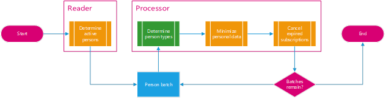

<h5>Figure 2: A visualization of the minimization batch job procedure.</h5>
<br>
</div>

After the matching person types are determined by the minimization procedure, the existing person types are fetched from
the database such that only the matching person types are persisted in the `PERSON_TYPE` table, see Figure 3 for a
visualization.

<div style="text-align: center;">

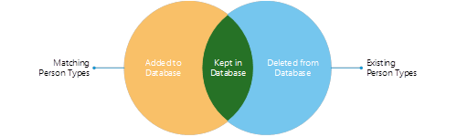

<h5>Figure 3: A visualization of how only the currently matching person types are persisted in the database.</h5>
<br>
</div>

As outlined above, the minimization procedure provided by the minimization framework resembles a template, which is
highly dependent on the derivative project supplying most of its constituents, outside of the determination of person
types. In addition, the backbone of the minimization framework, consisting of the data right definitions, the person
type definitions, as well as the mappings between them, must all be provided to the minimization framework by the
derivative project, as outlined below:

* Define data rights: A data right must be defined by means of a complex provider, which is an abstraction intended to
  encode the data covered by the given data right. Specifically, given a person, it should specify each database entity
  as-sociated with that person covered by the given data right, alongside timestamps indicating the registration time
  and validity period of each database entity, which enables a bitemporal mapping of each such database entity, see
  Figure 4 for a visualization of an example. This bitemporal mapping is then available to the derivative project when
  imple-menting their minimization procedure,
  see [Defining data rights](/DD130-Detailed-Design/Minimization#Defining-data-rights)
 for more information regarding
  defining data rights.

<div style="text-align: center;">

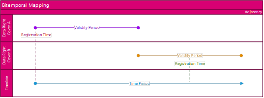

<h5>Figure 4: An example of a bitemporal mapping of a pair of database entries covered by a data right complex
provider.</h5>
<br>
</div>

* Define person types: A person type must be defined by a match rule, which is an abstraction intended to encode the
  basis matching the given person type. Specifically, given a person, it should specify each database entity associated
  with that person which matches the given person type, alongside timestamps indicating the registration period and
  validity period of each such database entity, which enables a bitemporal mapping of each person type, see Figure 5 for
  a
  visualization of an example. This bitemporal mapping is then available to the derivative project when implementing
  their
  minimization procedure, see [Defining data rights](/DD130-Detailed-Design/Minimization#Defining-data-rights)
 for more
  information regarding defining person types.

<div style="text-align: center;">

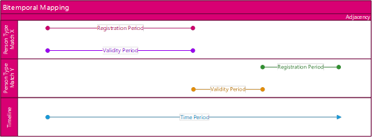

<h5>Figure 5: An example of a bitemporal mapping of a pair of database entries matched by a person type match rule.</h5>
<br>
</div>

* **Define person type mapping:** A mapping between a given person type and a given data right must be persisted in the
  `PERSON_TYPE_DATA_RIGHT_MAP` table for the person type to grant the data right in question. While this can be
  accomplished by means of database patches, the minimization framework also provides a dedicated frontend within the
  administration module for this purpose, see Figure 6 for an example of this page. As such, the bitemporal mapping of a
  database entity matched by a person type match rule is only held against the bitemporal mapping of a database entity
  covered by a data right complex provider, if the person type grants the data right in question.

<div style="text-align: center;">

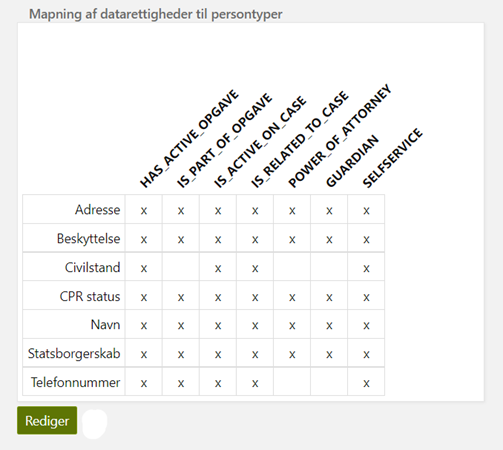

<h5>Figure 6: An example of the person type mapping administration page.</h5>
<br>
</div>


Finally, given a person type which grants a given data right, the minimization framework is intended to enforce the
following principles within its minimization procedure, as a means of determining what personal data to keep and what to
delete:

1. **Overlapping**: A database entity covered by a data right complex provider can be kept, if there exists a database
   entity matched by the person type match rule, such that the registration period and validity period of the person
   type match overlap with the registration time and validity period of the data right cover respectively.The person
   type grants the data right.

   See Figure 7 for a visualization of an example with overlapping validity and registration periods.

2. **Non-overlapping**: A database entity covered by a data right complex provider must be deleted, if there does not
   exist a database entity matched by the person type match rule, such that The registration period and validity period
   of the person type match overlap with the registration time and validity period of the data right cover respectively
   The person type grants the data right in question

   See Figure 8 for a visualization of an example with non-overlapping validity period, as well as see Figure 9 for a
   visualization of an example with non-overlapping registration period.

For more information regarding the details of the minimization framework and its subjects, in particular the subject of
bitemporality and bitemporal mappings, as experience has proved this to be an abstract subject, see instead chapters [4]
and [5].

<div style="text-align: center;">

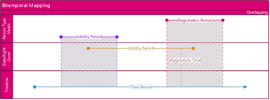

<h5>Figure 7: An example of a bitemporal mapping of a database entity covered by a data right complex provider which can
be kept, since its registration time and validity period overlap with a database entity matched by a person type match
rule which grants it. </h5>
<br>
</div>

<div style="text-align: center;">

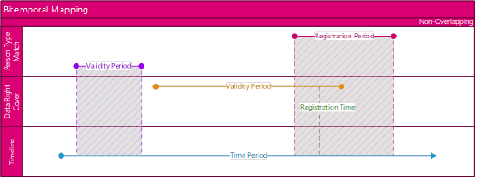

<h5>Figure 8: An example of a bitemporal mapping of a database entity covered by a data right complex provider which
must be deleted, since its validity period does not overlap with a database entity matched by a person type match rule
which grants it.</h5>
<br>
</div>

<div style="text-align: center;">

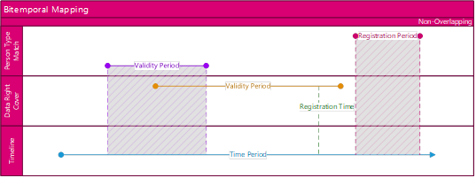

<h5>Figure 9: An example of a bitemporal mapping of a database entity covered by a data right complex provider which
must be deleted, since its registration time does not overlap with a database entity matched by a person type match rule
which grants it.</h5>
<br>
</div>

# Data rights

This section details the data rights supplied to the minimization framework by the derivative project.

TODO

##	Definition

TODO

<div style="text-align: center;">

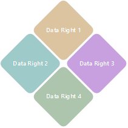

<h5>Figure 10: TODO</h5>
<br>
</div>

##	Bitemporality

TODO

# Person types

This section details the person types supplied to the minimization framework by the derivative project.
TODO

## Definition

TODO

<div style="text-align: center;">

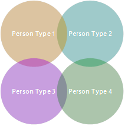

<h5>Figure 11: TODO</h5>
<br>
</div>

## Bitemporality

TODO

# Person type mapping

This section details the mapping between person types and data rights supplied to the minimization framework by the
derivative project. In contrast with the data rights and person types supplied to the minimization framework, see
[Data rights](/DD130-Detailed-Design/Minimization#Data-rights)

and [Person types](/DD130-Detailed-Design/Minimization#Person-types)
 for details respectively, the person type mapping is
just a relation, whereby it has no inherent
functionality on its own. In keeping with this fact, the person type mapping is typically documented in derivative
project documentation using an accompanying spreadsheet, rather than being embedded in the detailed design on par with
the data rights and person types.

## Backend

The person type mapping uses the `PERSON_TYPE_DATA_RIGHT_MAP` table as its backend component, see Figure 19 for a
dependency diagram of this table alongside Table 11 for a description its fields.

<div style="text-align: center;">

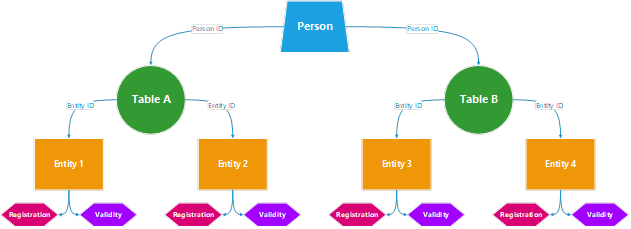

<h5>Figure 12: TODO</h5>
<br>
</div>

##	Frontend

The person type mapping comes with a person type administration page as its frontend component, see Figure 13 for an
exam-ple of this page alongside Table 2 for a description of its contents.

<div style="text-align: center;">

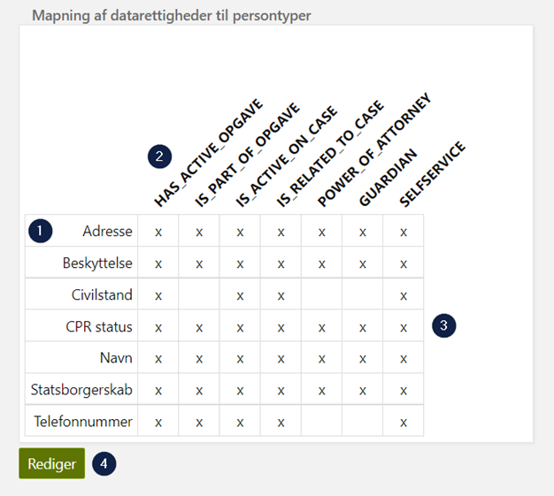

<h5>Figure 13: An example of the person type mapping administration page.</h5>
<br>
</div>

<h5>Table 2: A listing of footnotes for the person type mapping administration page.</h5>

| Number | Footnote                                                                                                                                                                                                                                                                                                                                                                                                                                                                                                                                                                                                                                                  |
|--------|-----------------------------------------------------------------------------------------------------------------------------------------------------------------------------------------------------------------------------------------------------------------------------------------------------------------------------------------------------------------------------------------------------------------------------------------------------------------------------------------------------------------------------------------------------------------------------------------------------------------------------------------------------------|
| 1      | The names of the data rights provided to the minimization framework by the derivative project.                                                                                                                                                                                                                                                                                                                                                                                                                                                                                                                                                            |
| 2      | The names of the person types provided to the minimization framework by the derivative project.                                                                                                                                                                                                                                                                                                                                                                                                                                                                                                                                                           |
| 3      | The mapping between person types and data rights provided to the minimization framework by the derivative project, where the presence of an 'x' denotes that the given data right is granted by the given person type.                                                                                                                                                                                                                                                                                                                                                                                                                                    |
| 4      | The button for editing the person type mapping administration page directly from the administration module.<br><br>When activated, the mapping between person types and data rights can be toggled by clicking on the intersection between the person type and the data right to be edited. The edit button will in this state be replaced by a cancel button as well as a save button until the editing is cancelled or saved. The edit button can be hidden from the person type administration module by means of a code integration point, see section [Hiding mapping edit button](/DD130-Detailed-Design/Minimization#Hiding-mapping-edit-button) for details. |

# Minimization batch job

This section details the minimization batch job, see [DD130 – Batch Engine](https://goto.netcompany.com/cases/GTE351/NCMCORE/Amplio%20Deliverables/Amplio%202025/DD130%20-%20Detailed%20Design/Batch%20jobs/Framework/DD130%20-%20Batch%20Engine.docx) for more information on batch jobs and the
batch engine framework in general. The purpose of the minimization batch job is to reactively enforce the person type
mapping supplied to the minimization framework by the derivative project, see [chapter 6](/DD130-Detailed-Design/Minimization#6-Person-type-mapping) for details. This is
accomplished in two phases:

* **Reader**: This phase identifies the active persons within the given application to minimize, see [Reader](/DD130-Detailed-Design/Minimization#Reader)
 for
  details.
* **Processor**: This phase performs the minimization procedure for the identified persons, see [Processor](/DD130-Detailed-Design/Minimization#Processor)
 for
  details.

Remark that this pattern is very alike the discard batch job, where the minimization batch job can be thought of as
performing a partial deletion of personal data based on the continuous business needs, while the discard batch job can
be thought of as performing a full deletion of personal data based on end-of-life heuristics, see [DD130 – Discard](/DD130-Detailed-Design/Discard) for
more information.

## Configuration

The minimization batch job is identified by the job type name `MINIMIZATION`. The batch job supports parallel operation
in batches, where the number of items processed in parallel, the number of items processed in memory, as well as the
batch size per item can all be configured using application properties, see [Application properties](/DD130-Detailed-Design/Minimization#Application-properties)
 for details.

## Reader

The `MinimizationItemReader` determines the identifiers of the persons currently considered active with respect to the
minimization framework for the given application. The procedure for determining the active persons based on the
application must be supplied by the derivative project, see [Determining active persons](/DD130-Detailed-Design/Minimization#Determining-active-persons)
 for details, but some cases for exclusion
are:

* Persons who have already been marked soft deleted by the discard batch job, see [DD130 – Discard](/DD130-Detailed-Design/Discard) for details.
* Persons who have just been created within the span of some application-specific grace period which is to be exempted.

The resulting list of identifiers are then divided into batches sized according to an optional property,
see [Configuration](/DD130-Detailed-Design/Minimization#Configuration)

for details.

## Processor

The `MinimizationItemProcessor` performs the minimization procedure for the previously identified persons. The
minimization procedure is applied to a batch of persons at a time, and if any person within a batch fails during
processing, the entire batch of persons is considered failed and is reported as such. The minimization procedure
consists of the following three steps:

* **Determine person types**: First, each person type supplied to the minimization framework by the derivative project
  is matched with the current batch of persons, see [Person types](/DD130-Detailed-Design/Minimization#Person-types)
 for details. The resulting collection of underlying
  entities that yields a match for some match rule is then persisted and passed on to the next step of the minimization
  procedure.

* **Minimize personal data**: Next, each data right supplied to the minimization framework by the derivative project
  should have their complex provider enforced, see [Data rights](/DD130-Detailed-Design/Minimization#Data-rights)
 for details. This should result in personal data being
  deleted for persons in the current batch whose determined person types do not grant the covering data right within the
  underlying period of validity, whereby only a reduction in person types can result in deletion.

* **Cancel expired subscriptions**: Finally, each subscription to external integrations should be cancelled for persons
  in the current batch whose determined person types no longer warrant maintaining their corresponding subscription.

Remark that both minimizing personal information as well as cancelling expired subscriptions must be supplied by the
derivative project, see sections [Minimizing personal data](/DD130-Detailed-Design/Minimization#Minimizing-personal-data) and [cancelling expired subscriptions](/DD130-Detailed-Design/Minimization#cancelling-expired-subscriptions) for details. For a visualization of the minimization batch job
procedure, see Figure 14, where the batch processing is notably operated in parallel according to an optional property,
see [Configuration](/DD130-Detailed-Design/Minimization#Configuration)
 for details.


<div style="text-align: center;">


<h5>Figure 14: A visualization of the minimization batch job procedure.</h5>
<br>
</div>

# Configurations and service extensions

This section details how to set up the minimization framework as well as what component requirements come along with it.

## Code integration

This section details the available code integrations that can affect the functionality or behavior of the minimization
framework.

### Defining data rights

This section details how to define custom data rights in derivative projects to be recognized by the minimization
framework.

#### Data right enumeration

Any data right must have an associated `DataRightEnum` entry, each of which has the following components:

* **Name**: The name assigned to the given data right, which must be unique among all data rights.
* **Tables**: The list of names identifying the underlying database tables covered by the given data right.

##### Example

```java
public static final DataRightEnum BG_CIVILSTAND = create(
        "BG_CIVILSTAND",
        List.of(FyTable.CIVILSTAND, FyTable.SEPARATION)
);
```

#### Data right complex provider

Any data right must have an associated `DataRightObjectComplexProvider` instance, conforming to the below interface:

```java
public interface DataRightObjectComplexProvider {

    DataRightEnum getDataRightForProvider();

    ObjectComplex get(PersonTypeHolder holder);

    ObjectComplex createObjectComplexFromQueryMap(
            PersonTypeHolder holder,
            ObjectComplexQueryMap queries
    );

}
```

The minimization framework provides the default `DataRightObjectComplexProviderImpl` implementation, which has a default
implementation of the `DataRightObjectComplexProvider#createObjectComplexFromQueryMap` method, and it is recommended to
extend this. Thus, only the following methods need to be implemented for each case:

* **Enumeration**: The `DataRightObjectComplexProvider#getDataRightForProvider` method should simply return the
  associated `DataRightEnum` entry for the given data right defined previously to identify it.

* **Coverage**: The `DataRightObjectComplexProvider#get` method should return an `ObjectComplex` instance, which is
  intended to represent the tables and entities within them up for deletion by the minimization framework based on the
  provided `PersonTypeHolder` instance. The result can advantageously be constructed by a call to the
  `DataRightObjectComplexProvider#createObjectComplexFromQueryMap` helper method, whereby only an
  `ObjectComplexQueryMap` instance is needed in each case, which is elaborated upon below.

The `ObjectComplexQueryMap` instance is intended to contain an entry for each database table covered by the given data
right, as specified by the associated `DataRightEnum` entry defined previously. The value of each entry should be a
database query alongside any used query parameters, which identifies the underlying entities covered by the given data
right. When using the `DataRightObjectComplexProvider#createObjectComplexFromQueryMap` method, each database query is
expected to return a subset of the following attributes in order. These positions are encoded within the
`ObjectComplexEntity#parseDBObject` method, which is invoked by the `ObjectComplexService#fetchObjects` method:

1. **Entity identifier**: The identifier of the underlying entity that the complex provider covers.
2. **Person identifier**: The identifier of the person associated with the underlying entity.
3. **Registration time**: The point in time where the underlying entity is registered.
4. **Valid from**: An optional point in time where the underlying entity is valid from. When this is unspecified, it is
   set to `TimeFactory#getMinDate` by default instead, which represents an arbitrary start of validity.
5. **Valid to**: An optional point in time where the underlying entity is valid to. When this is unspecified, it is set
   to `TimeFactory#getMaxDateTime` by default instead, which represents an arbitrary end of validity.

Remark that such an encoding enables a bitemporal mapping of the underlying entity, see chapter 4 for details.

#### Example

```java
@Component
public class CivilstandComplexProvider extends DataRightObjectComplexProviderImpl {

    private static final String CIVILSTAND_SQL = String.join(" ",
            "SELECT CS.ID, BP.PERSON_ID, CS.OPRETTET, CS.GYLDIG_FRA, CS.GYLDIG_TIL",
            "FROM CIVILSTAND CS",
            "JOIN BG_PERSON BP ON BP.ID = CS.BG_PERSON_ID",
            "WHERE BP.PERSON_ID IN :personIds"
    );

    private static final String SEPARATION_SQL = String.join(" ",
            "SELECT S.ID, BP.PERSON_ID, S.OPRETTET, S.GYLDIG_FRA, S.GYLDIG_TIL",
            "FROM SEPARATION S",
            "JOIN BG_PERSON BP ON BP.ID = S.BG_PERSON_ID",
            "WHERE BP.PERSON_ID IN :personIds"
    );

    @Override
    public DataRightEnum getDataRightForProvider() {
        return FyDataRightEnum.BG_CIVILSTAND;
    }

    @Override
    public ObjectComplex get(PersonTypeHolder holder) {
        Map<String, Object> parameters = Map.of(
                "personIds", holder.getPersonIds()
        );
        ObjectComplexQueryMap queries = new ObjectComplexQueryMap();
        queries.putQuery(FyTables.CIVILSTAND, CIVILSTAND_SQL, parameters);
        queries.putQuery(FyTables.SEPARATION, SEPARATION_SQL, parameters);
        return createObjectComplexFromQueryMap(holder, queries);
    }

}
```

#### Data right configuration

The `DataRightObjectComplexProvider` instance for each data right is expected to be turned into a Spring bean in the
derivative project integrating with the minimization framework, such that they might be autowired as a collection as
follows:

```java
@Autowired(required = false)
protected List<DataRightObjectComplexProvider> objectComplexProviders;
```

#####	Example

```java
@Configuration
@ComponentScan("<data.right.complex.provider.package>")
public class DataRightComplexProviderConfig {
}
```

### Defining person types

This section details how to define custom person types in derivative projects to be recognized by the minimization
framework.

#### Person type enumeration

Any person type must have an associated `PersonTypeEnum` entry, each of which must have the following component:

* **Name**: The name assigned to the given person type, which must be unique among all person types.

##### Example

```java
public static final PersonTypeEnum SELFSERVICE_HAS_ACTIVE_APPLICATION = create(
        "SELFSERVICE_HAS_ACTIVE_APPLICATION"
);
```

#### Person type match rule

Any person type must have an associated `PersonTypeMatchRule` instance, conforming to the below interface:

```java
public interface PersonTypeMatchRule {

    PersonTypeEnum getPersonTypeForRule();

    boolean match(AbstractPerson person);

    List<PersonType> matches(AbstractPerson person);

    Map<String, List<PersonType>> matches(List<AbstractPerson> persons);

}
```

The minimization framework provides the default `PersonTypeMatchRuleImpl` implementation, which has a default
implementation of the `PersonTypeMatchRule#match` method and the `PersonTypeMatchRule#matches` method for a single
person, and it is recommended to extend this. Thus, only the following methods need to be implemented for each case:

* **Enumeration**: The `PersonTypeMatchRule#getPersonTypeForRule` method should simply return the associated
  `PersonTypeEnum` entry for the given person type defined previously to identify it.

* **Matching**: The `PersonTypeMatchRule#matches` method given multiple persons should return a collection of newly
  created `PersonType` instances, grouped by person identifier, which are intended to represent the tables and entities
  within them yielding the given person type to the minimization framework based on the provided collection of
  `AbstractPerson` instances. In contrast with data right complex providers, the minimization framework currently does
  not contain a helper method for constructing this result, which is elaborated upon below.

The `PersonType` instances are intended to be constructed based on the database tables yielding the given person type.
For each such database table, the given `PersonTypeMatchRule` instance should therefore contain a database query
alongside any used query parameters to identify the underlying entities yielding the given person type. This can be
accomplished by fetching the following attributes from each database table and constructing the `PersonType` instances
based on these:

1. **Entity identifier**: The identifier of the underlying entity that is the basis of the match rule.
2. **Entity type**: The name of the underlying entity type, which is implied by the database table.
3. **Person identifier**: The identifier of the person associated with the underlying entity.
4. **Registration from**: The point in time where the underlying entity is registered from.
5. **Registration to**: The point in time where the underlying entity is registered to.
6. **Valid from**: The point in time where the underlying entity is valid from.
7. **Valid to**: The point in time where the underlying entity is valid to.

Remark that such an encoding enables a bitemporal mapping of the underlying entity, see chapter 5 for details.

#####	Example

```java
@Component
public class SelfserviceHasActiveApplicationMatchRule extends PersonTypeMatchRuleImpl {

    private static final String ANSOEGNING_SQL = String.join(" ",
            "SELECT A.ID, A.PERSON_ID, :minDate, :maxDate, A.OPRETTET AS GYLDIG_FRA",
            "FROM ANSOEGNING A",
            "WHERE A.PERSON_ID IN :personIds",
            "AND A.STATUS = :status"
    );

    @Override
    public PersonTypeEnum getPersonTypeForRule() {
        return FyPersonTypeEnum.SELFSERVICE_HAS_ACTIVE_APPLICATION;
    }

    @Override
    public Map<String, List<PersonType>> matches(List<AbstractPerson> persons) {
        Map<String, Object> parameters = Map.of(
                "personIds", persons.stream().map(BaseBasicEntity::getId).collect(),
                "status", AnsoegningStatus.KLADDE.getDbValue(),
                "minDate", TimeFactory.getMinDate(),
                "maxDate", TimeFactory.getMaxDate()
        );
        List<Object[]> matches = dbAdapter.getValuesFromSqlQuery(
                ANSOEGNING_SQL,
                parameters,
                ContextWrapper.get()
        );
        return MatchRuleHelper.mapOutputPersonTypeBiTemporal(
                persons,
                Ansoegning.class.getSimpleName().toUpperCase(),
                matches
        );
    }

}
```

#### Person type configuration

The `PersonTypeMatchRule` instance for each person type is expected to be turned into a Spring bean in the derivative
pro-ject integrating with the minimization framework, such that they might be autowired as a collection as follows:

```java
@Autowired(required = false)
private List<PersonTypeMatchRule> matchRuleProviders;
```

###### Example

```java
@Configuration
@ComponentScan("<person.type.match.rule.package>")
public class PersonTypeMatchRuleConfig {
}
```

### Extending minimization service

This section outlines how the `MinimizationService` component can be extended to customize the minimization procedure
used by the minimization batch job. Remark that the minimization framework contains a default `MinimizationServiceImpl`
implementation, which should be extended to gain access to these code integration points.

#### Determining active persons

The `MinimizationService#getActivePersonIds` method must be overridden to return the identifiers of the persons
currently considered active with respect to the minimization framework for the given application. In the simplest case,
this should simply return the identifier for each person stored by the given application. For examples of reasons to
exempt some persons from consideration by the minimization framework, which can then be encoded here, see instead
[Reader](/DD130-Detailed-Design/Minimization#Reader)
.

##### Signature

```java
public abstract class MinimizationServiceImpl implements MinimizationService {

    @Override
    public abstract List<String> getActivePersonsIds();

}
```

#### Minimizing personal data

The `MinimizationService#minimizePersonWithDataRights` method can be overridden to implement the deletion of personal
data for persons whose person types no longer warrant keeping the personal data in question. This is currently
implemented per derivative project using the minimization framework. The method is called by the minimization batch job
following the determination of person types, and receives the following arguments:

* **Person type holder**: The first argument is a `PersonTypeHolder` holding a mapping from person identifiers to lists
  of `BitemporalPersonType`, which represent the person type matches for each currently active person. This is also the
  result of the `PersonTypeService#determineAndPersistBatchForPerson` method.

* **Data right types**: The second argument holds a mapping from `DataRightEnum` to lists of `PersonTypeEnum`, which for
  each data right represents the person types that grant that data right, where both the data rights, the person types
  and the mapping between them are provided to the minimization framework by the given application. This is also the
  result of the `DataRightMappingService#getMappedDataRights` method.

The result must be a `PersonMinimizationResult` holding a mapping from `DataRightEnum` to `Boolean`, which for each data
right represents whether the personal data covered by the given data right was successfully minimized or not. For a
pseudocode algorithm for how to accomplish this, see [section 8.1.3.2.2](/DD130-Detailed-Design/Minimization#8.1.3.2.2%09pseudocode-algorithm---minimizing).

#####	Signature

```java
public interface MinimizationService {

    default PersonMinimizationResult minimizePersonWithDataRights(
            PersonTypeHolder personTypeHolder,
            Map<DataRightEnum, List<PersonTypeEnum>> dataRightTypes) {
        return new PersonMinimizationResult();
    }

}
```

#####	Pseudocode algorithm - Minimizing

TODO

#### Cancelling expired subscriptions

The `MinimizationService#cancelSubscriptionIfWrongType` method can be overridden to implement the cancellation of
subscriptions to external integrations for persons whose person types no longer warrant keeping the subscription in
question. This is currently implemented per derivative project using the minimization framework. The method is called by
the minimization batch job following the minimization of personal data, and receives the following arguments:

* **Person type holder**: The first argument is a `PersonTypeHolder` holding a mapping from person identifiers to lists
  of `BitemporalPersonType`, which represent the just determined person types for each currently active person. This is
  also the result of the `PersonTypeService#determineAndPersistBatchForPerson` method.

* **Data right types**: The second argument holds a mapping from `DataRightEnum` to lists of `PersonTypeEnum`, which for
  each data right represents the person types that grant that data right, where both the data rights, the person types
  and the mapping between them are provided to the minimization framework by the given application. This is also the
  result of the `DataRightMappingService#getMappedDataRights` method.

The result must be a `SubscriptionMinimizationResult` holding a mapping from subscription names to `Boolean`, which for
each subscription name represents whether the subscriptions with the given name were successfully cancelled or not. For
a pseudocode algorithm for how to accomplish this, see [pseudocode algorithm – canceling](/DD130-Detailed-Design/Minimization#pseudocode-algorithm-–-canceling)
.

#### Signature

```java
public interface MinimizationService {

    default SubscriptionMinimizationResult cancelSubscriptionsIfWrongType(
            PersonTypeHolder personTypeHolder,
            Map<DataRightEnum, List<PersonTypeEnum>> dataRightTypes) {
        return new SubscriptionMinimizationResult();
    }

}
```

### Pseudocode algorithm – Canceling

TODO

### Extending person type service

This section outlines how the `PersonTypeService` component can be extended to customize the processing of person types
used by the minimization batch job prior to the minimization procedure. Remark that the minimization framework contains
a default `PersonTypeSerivceImpl` implementation, which should be extended to gain access to this code integration
point.

#### Post processing person types

The `PersonTypeServiceImpl#postProcessResult` method can be overridden to place a hook to be executed just before the
`PersonTypeService#determineAndPersistBatchForPerson` endpoint persists the determined person types based on the person
type match rules provided to the minimization framework. For example, this can be used to perform analytics on the
determined person types, or even to add ad hoc person types to the result prior to the return.

##### Signature

```java
public class PersonTypeServiceImpl implements PersonTypeService {

    protected void postProcessResult(
            List<String> personIds,
            Set<PersonType> matchedPersonTypes,
            Map<String, List<BitemporalPersonType>> result) {
    }

}
```

### Extending data right mapping service

This section outlines how the `DataRightMappingService` component can be extended to customize the person type
administration page. Remark that the minimization framework contains a default `DataRightMappingServiceImpl`
implementation, which should be extended to gain access to this code integration point.

#### Hiding mapping edit button

The `DataRightMappingService#shouldHideEditButton` method can be overridden to customize whether the button used for
editing person types using the person type administration page should be hidden or not based on the application. The
default setting is to never hide the button, provided that the user passes the endpoint security, see Table 7 for
details.

##### Signature

```java
public class DataRightMappingServiceImpl implements DataRightMappingService {

    @Override
    public boolean shouldHideEditButton() {
        return false;
    }

}
```

## Configurable settings

This section details the available configurations that can affect the functionality or behavior of the minimization
framework.

### Configuration classes

For an overview of the configuration classes provided by the minimization framework for inclusion by derivative
projects, see Table 3. Remark that the given application should define its own configuration classes for the data rights
and person types provided to the minimization framework on top of these, see [Data right configuration](/DD130-Detailed-Design/Minimization#Data-right-configuration)
 and [Person type configuration](/DD130-Detailed-Design/Minimization#Person-type-configuration)
 for
details.

<div style="text-align: center;">

<h5>Table 3: The configuration classes that the minimization framework provides for configuring its beans listed by
component.</h5>

</div>

| Configuration                | Component               |
|------------------------------|-------------------------|
| `MinimizationConfig`         | minimization-service    |
| `DataRightsFrontConfig`      | minimization-front      |
| `MinimizationBatchJobConfig` | batch-jobs-minimization |

### Application properties

For an overview of the application properties that the minimization framework is aware of which can be configured by
derivative projects, see Table 4. Remark that these are all accessed by the `MinimizationBatchJobConfig` configuration
class.

<div style="text-align: center;">

<h5>Table 4: The application properties that the minimization framework is aware of which can be configured.</h5>

</div>

| Property                                                 | Default |
|----------------------------------------------------------|---------|
| `batch.MINIMIZATION.maxNumberOfItemsProcessedInParallel` | 4       |
| `batch.MINIMIZATION.maxNumberOfItemsProcessedInMemory`   | 1       |
| `batch.MINIMIZATION.batchSize`                           | 1000    |

### System parameters

The minimization framework currently does not support any system parameters for configuring its functionality or
behavior live.

### Roles and rights

This section outlines the security roles enforced by the minimization framework alongside their corresponding usage
purposes.

### Controller security

For an overview of the controllers exposed by the minimization framework that are secured by security roles alongside
their root paths, see Table 7. Remark that no new security roles are introduced since existing security roles are simply
being reused.


<div style="text-align: center;">

<h5>Table 7: The endpoint paths that the minimization framework exposes and their corresponding security roles.</h5>

</div>

| Controller             | Root path             | Security role                     |
|------------------------|-----------------------|-----------------------------------|
| `DataRightsController` | `/admin/minimization` | `SecurityRole.ADM_ADMINISTRATION` |

### Service security

The minimization framework by default enforces no security roles at the service layer in contrast with the controller
layer.

### Database patches

This section details the database modifications necessary for using the minimization framework, including suggested
database patches to apply the database modifications in derivative projects. Remark that the presented database patches
are Oracle specific, whereby adjustments are necessary for PostgreSQL databases. See [chapter 11](/DD130-Detailed-Design/Minimization#11-Data-model) for more information
regarding the data model of the minimization framework, such as dependency diagrams and field descriptions for the
related tables.

#### Modifying data model

The minimization framework suggests the following database patches to be included in a ddl_patch.etl project file:

* **Person type**: See [PERSON_TYPE](/DD130-Detailed-Design/Minimization#person_type)
 for the `PERSON_TYPE` table database patch. This table is used for containing the
  person types calculated by the minimization framework using the person type rules supplied to it.

* **Person type history**: See [PERSON_TYPE_H](/DD130-Detailed-Design/Minimization#person_type_h)
 for the `PERSON_TYPE_H` table database patch. This is the historical
  version of the `PERSON_TYPE` table, see [TRG_PERSON_TYPE_H](/DD130-Detailed-Design/Minimization#trg_person_type_h)
 for the corresponding database trigger for the historical
  entry.

* **Person type data right map**: See [PERSON_TYPE_DATA_RIGHT_MAP](/DD130-Detailed-Design/Minimization#person_type_data_right_map)
 for the `PERSON_TYPE_DATA_RIGHT_MAP` table database patch. This
  table is used for containing the mappings between person types and data rights for the minimization framework.

* **Person type data right map history**: See [PERSON_TYPE_DATA_RIGHT_MAP_H](/DD130-Detailed-Design/Minimization#person_type_data_right_map_h)
 for the `PERSON_TYPE_DATA_RIGHT_MAP_H` table database
  patch. This is the historical version of the `PERSON_TYPE_DATA_RIGHT_MAP_H` table, see [TRG_PERSON_TYPE_DATA_RIGHT_MAP_H](/DD130-Detailed-Design/Minimization#trg_person_type_data_right_m_h)
 for the
  corresponding database trigger for the historical entry.

##### PERSON_TYPE

```sql
DECLARE
    PERSON_TYPE_CNT INTEGER;
BEGIN
    SELECT COUNT(1) INTO PERSON_TYPE_CNT
    FROM USER_TAB_COLS WHERE TABLE_NAME = 'PERSON_TYPE';
    IF PERSON_TYPE_CNT = 0 THEN
        EXECUTE IMMEDIATE
            'CREATE TABLE PERSON_TYPE
             (
                 ID               VARCHAR2(50)  NOT NULL,
                 PERSON_ID        VARCHAR2(50)  NOT NULL,
                 PERSON_TYPE_NAME VARCHAR2(100) NOT NULL,
                 ENTITY_TYPE      VARCHAR2(100) NULL,
                 ENTITY_ID        VARCHAR2(50)  NULL,
                 REGISTRERING_FRA TIMESTAMP,
                 REGISTRERING_TIL TIMESTAMP,
                 GYLDIG_FRA       DATE,
                 GYLDIG_TIL       DATE,
                 OPRETTET         TIMESTAMP     NOT NULL,
                 OPRETTETAF       VARCHAR2(500) NOT NULL,
                 AENDRET          TIMESTAMP     NOT NULL,
                 AENDRETAF        VARCHAR2(500) NOT NULL
             )';
        EXECUTE IMMEDIATE 'COMMENT ON TABLE PERSON_TYPE
            IS ''Person type calculated from person type rules.''';
        EXECUTE IMMEDIATE 'ALTER TABLE PERSON_TYPE
            ADD CONSTRAINT PK_PERSONTYPE PRIMARY KEY (ID) USING INDEX';
        EXECUTE IMMEDIATE 'ALTER TABLE PERSON_TYPE
            ADD CONSTRAINT FK_PERSON_TYPE_PERSON FOREIGN KEY (PERSON_ID)
            REFERENCES PERSON (ID)';
        EXECUTE IMMEDIATE 'CREATE INDEX IXFK_PERSON_TYPE_PERSON
            ON PERSON_TYPE (PERSON_ID)';
    END IF;
END;
```

#### PERSON_TYPE_H

```sql
DECLARE
    PERSON_TYPE_CNT_H INTEGER;
BEGIN
    SELECT COUNT(1) INTO PERSON_TYPE_CNT_H
    FROM USER_TAB_COLS WHERE TABLE_NAME = 'PERSON_TYPE_H';
    IF PERSON_TYPE_CNT_H = 0 THEN
        EXECUTE IMMEDIATE
            'CREATE TABLE PERSON_TYPE_H
             (
                 ID               VARCHAR2(50)  NOT NULL,
                 PERSON_ID        VARCHAR2(50)  NOT NULL,
                 PERSON_TYPE_NAME VARCHAR2(100) NOT NULL,
                 ENTITY_TYPE      VARCHAR2(100) NULL,
                 ENTITY_ID        VARCHAR2(50)  NULL,
                 REGISTRERING_FRA TIMESTAMP,
                 REGISTRERING_TIL TIMESTAMP,
                 GYLDIG_FRA       DATE,
                 GYLDIG_TIL       DATE,
                 OPRETTET         TIMESTAMP,
                 OPRETTETAF       VARCHAR2(500),
                 AENDRET          TIMESTAMP,
                 AENDRETAF        VARCHAR2(500),
                 HISTORIK_FRA     TIMESTAMP,
                 HISTORIK_TIL     TIMESTAMP
             )';
        EXECUTE IMMEDIATE 'CREATE INDEX IXPKHIST_PERSON_TYPE
            ON PERSON_TYPE_H (ID, HISTORIK_TIL)';
    END IF;
END;
```

#### PERSON_TYPE_DATA_RIGHT_MAP

```sql
DECLARE
    PERSON_TYPE_MAP_CNT INTEGER;
BEGIN
    SELECT COUNT(1) INTO PERSON_TYPE_MAP_CNT
    FROM USER_TAB_COLS WHERE TABLE_NAME = 'PERSON_TYPE_DATA_RIGHT_MAP';
    IF PERSON_TYPE_MAP_CNT = 0 THEN
        EXECUTE IMMEDIATE
            'CREATE TABLE PERSON_TYPE_DATA_RIGHT_MAP
             (
                 ID               VARCHAR2(50)  NOT NULL,
                 PERSON_TYPE_NAME VARCHAR2(100) NULL,
                 DATA_RIGHT       VARCHAR2(100) NULL,
                 OPRETTET         TIMESTAMP     NOT NULL,
                 OPRETTETAF       VARCHAR2(500) NOT NULL,
                 AENDRET          TIMESTAMP     NOT NULL,
                 AENDRETAF        VARCHAR2(500) NOT NULL
             )';
        EXECUTE IMMEDIATE 'COMMENT ON TABLE PERSON_TYPE_DATA_RIGHT_MAP
            IS ''Maps a person type to a data right.''';
        EXECUTE IMMEDIATE 'ALTER TABLE PERSON_TYPE_DATA_RIGHT_MAP
            ADD CONSTRAINT PK_PERSONTYPEDATARIGHTMAP PRIMARY KEY (ID) USING INDEX';
    END IF;
END;
```

#### PERSON_TYPE_DATA_RIGHT_MAP_H

```sql
DECLARE
    PERSON_TYPE_MAP_CNT_H INTEGER;
BEGIN
    SELECT COUNT(1) INTO PERSON_TYPE_MAP_CNT_H
    FROM USER_TAB_COLS WHERE TABLE_NAME = 'PERSON_TYPE_DATA_RIGHT_MAP_H';
    IF PERSON_TYPE_MAP_CNT_H = 0 THEN
        EXECUTE IMMEDIATE
            'CREATE TABLE PERSON_TYPE_DATA_RIGHT_MAP_H
             (
                 ID               VARCHAR2(50)  NOT NULL,
                 PERSON_TYPE_NAME VARCHAR2(100) NULL,
                 DATA_RIGHT       VARCHAR2(100) NULL,
                 OPRETTET         TIMESTAMP,
                 OPRETTETAF       VARCHAR2(500),
                 AENDRET          TIMESTAMP,
                 AENDRETAF        VARCHAR2(500),
                 HISTORIK_FRA     TIMESTAMP,
                 HISTORIK_TIL     TIMESTAMP
             )';
        EXECUTE IMMEDIATE 'CREATE INDEX IXPKHIST_PERSON_TYPE_DATA_RIGH
            ON PERSON_TYPE_DATA_RIGHT_MAP_H (ID, HISTORIK_TIL)';
    END IF;
END;
```

### Setting up history triggers

The minimization framework suggests the following database triggers to be included in a createtriggers.sql project file:

* **Person type**: See [TRG_PERSON_TYPE_H](/DD130-Detailed-Design/Minimization#trg_person_type_h)
 for the `TRG_PERSON_TYPE_H` database trigger for the `PERSON_TYPE_H` table. This
  trigger is used for tracing changes to the person types calculated by the minimization framework.

* **Person type data right map**: See [TRG_PERSON_TYPE_DATA_RIGHT_M_H](/DD130-Detailed-Design/Minimization#trg_person_type_data_right_m_h)
 for the `TRG_PERSON_TYPE_DATA_RIGHT_M_H` database trigger for the
  `PERSON_TYPE_DATA_RIGHT_MAP_H` table. This trigger is used for tracing changes to the mapping between person types and
  data rights supplied to the minimization framework.

#### TRG_PERSON_TYPE_H

```sql
CREATE OR REPLACE EDITIONABLE TRIGGER TRG_PERSON_TYPE_H
    BEFORE DELETE OR INSERT OR UPDATE
    ON PERSON_TYPE
    FOR EACH ROW
BEGIN
    IF UPDATING THEN
        UPDATE PERSON_TYPE_H H
        SET HISTORIK_TIL = SYSTIMESTAMP
        WHERE H.ID = :OLD.ID AND HISTORIK_TIL = TO_DATE('9999-12-31', 'yyyy-mm-dd');
    END IF;
    IF DELETING THEN
        UPDATE PERSON_TYPE_H H
        SET HISTORIK_TIL = SYSTIMESTAMP,
            AENDRETAF    = SUBSTR(AENDRETAF, 0, 400) || ' - SLETTETAF: ('
                               || SYS_CONTEXT('USERENV', 'SESSION_USER') || '/'
                               || SYS_CONTEXT('USERENV', 'OS_USER') || ', '
                               || SYS_CONTEXT('USERENV', 'HOST') || '/'
                               || SYS_CONTEXT('USERENV', 'IP_ADDRESS') || ')'
        WHERE H.ID = :OLD.ID
          AND HISTORIK_TIL = TO_DATE('9999-12-31', 'yyyy-mm-dd');
    END IF;
    IF INSERTING OR UPDATING THEN
        INSERT INTO PERSON_TYPE_H
               (ID,
                PERSON_ID,
                PERSON_TYPE_NAME,
                ENTITY_TYPE,
                ENTITY_ID,
                REGISTRERING_FRA,
                REGISTRERING_TIL,
                GYLDIG_FRA,
                GYLDIG_TIL,
                OPRETTET,
                OPRETTETAF,
                AENDRET,
                AENDRETAF,
                HISTORIK_FRA,
                HISTORIK_TIL)
        VALUES (:NEW.ID,
                :NEW.PERSON_ID,
                :NEW.PERSON_TYPE_NAME,
                :NEW.ENTITY_TYPE,
                :NEW.ENTITY_ID,
                :NEW.REGISTRERING_FRA,
                :NEW.REGISTRERING_TIL,
                :NEW.GYLDIG_FRA,
                :NEW.GYLDIG_TIL,
                :NEW.OPRETTET,
                :NEW.OPRETTETAF,
                :NEW.AENDRET,
                SUBSTR(:NEW.AENDRETAF, 0, 400) || ' ('
                    || SYS_CONTEXT('USERENV', 'SESSION_USER') || '/'
                    || SYS_CONTEXT('USERENV', 'OS_USER') || ', '
                    || SYS_CONTEXT('USERENV', 'HOST') || '/'
                    || SYS_CONTEXT('USERENV', 'IP_ADDRESS') || ')',
                SYSTIMESTAMP,
                TO_DATE('9999-12-31', 'yyyy-mm-dd'));
    END IF;
END;

ALTER TRIGGER TRG_PERSON_TYPE_H ENABLE;
```

#### TRG_PERSON_TYPE_DATA_RIGHT_M_H

```sql
CREATE OR REPLACE EDITIONABLE TRIGGER TRG_PERSON_TYPE_DATA_RIGHT_M_H
    BEFORE DELETE OR INSERT OR UPDATE
    ON PERSON_TYPE_DATA_RIGHT_MAP
    FOR EACH ROW
BEGIN
    IF UPDATING THEN
        UPDATE PERSON_TYPE_DATA_RIGHT_MAP_H H
        SET HISTORIK_TIL = SYSTIMESTAMP
        WHERE H.ID = :OLD.ID AND HISTORIK_TIL = TO_DATE('9999-12-31', 'yyyy-mm-dd');
    END IF;
    IF DELETING THEN
        UPDATE PERSON_TYPE_DATA_RIGHT_MAP_H H
        SET HISTORIK_TIL = SYSTIMESTAMP,
            AENDRETAF    = SUBSTR(AENDRETAF, 0, 400) || ' - SLETTETAF: ('
                               || SYS_CONTEXT('USERENV', 'SESSION_USER') || '/'
                               || SYS_CONTEXT('USERENV', 'OS_USER') || ', '
                               || SYS_CONTEXT('USERENV', 'HOST') || '/'
                               || SYS_CONTEXT('USERENV', 'IP_ADDRESS') || ')'
        WHERE H.ID = :OLD.ID
          AND HISTORIK_TIL = TO_DATE('9999-12-31', 'yyyy-mm-dd');
    END IF;
    IF INSERTING OR UPDATING THEN
        INSERT INTO PERSON_TYPE_DATA_RIGHT_MAP_H
               (ID,
                PERSON_TYPE_NAME,
                DATA_RIGHT,
                OPRETTET,
                OPRETTETAF,
                AENDRET,
                AENDRETAF,
                HISTORIK_FRA,
                HISTORIK_TIL)
        VALUES (:NEW.ID,
                :NEW.PERSON_TYPE_NAME,
                :NEW.DATA_RIGHT,
                :NEW.OPRETTET,
                :NEW.OPRETTETAF,
                :NEW.AENDRET,
                SUBSTR(:NEW.AENDRETAF, 0, 400) || ' ('
                    || SYS_CONTEXT('USERENV', 'SESSION_USER') || '/'
                    || SYS_CONTEXT('USERENV', 'OS_USER') || ', '
                    || SYS_CONTEXT('USERENV', 'HOST') || '/'
                    || SYS_CONTEXT('USERENV', 'IP_ADDRESS') || ')',
                SYSTIMESTAMP,
                TO_DATE('9999-12-31', 'yyyy-mm-dd'));
    END IF;
END;

ALTER TRIGGER TRG_PERSON_TYPE_DATA_RIGHT_M_H ENABLE;
```

### Populating person type mapping

The minimization framework suggests the following database procedures to be included in a procedures.sql project file:

* **Grant data right**: See [GRANT_DATA_RIGHT](/DD130-Detailed-Design/Minimization#grant_data_right)
 for the `GRANT_DATA_RIGHT` database procedure. This procedure can be used
  for granting a given data right to a given person type, making the person type grant the data right by consequence.

* **Revoke data right**: See [REVOKE_DATA_RIGHT](/DD130-Detailed-Design/Minimization#revoke_data_right)
 for the `REVOKE_DATA_RIGHT` database procedure. This procedure can be
  used for revoking a given data right from a given person type, making the person type no longer grant the data right.

These procedures can then be invoked in a data_patch.etl project file as a means of populating the person type mapping.

#### GRANT_DATA_RIGHT

```sql
CREATE OR REPLACE NONEDITIONABLE PROCEDURE
        GRANT_DATA_RIGHT(ARG_DATA_RIGHT VARCHAR2, ARG_PERSON_TYPE VARCHAR2) AS
    CNT INTEGER;
BEGIN
    SELECT COUNT(1) INTO CNT
    FROM PERSON_TYPE_DATA_RIGHT_MAP
    WHERE PERSON_TYPE_NAME = ARG_PERSON_TYPE AND DATA_RIGHT = ARG_DATA_RIGHT;
    IF CNT = 0 THEN
        EXECUTE IMMEDIATE
            'INSERT INTO PERSON_TYPE_DATA_RIGHT_MAP
             (ID,PERSON_TYPE_NAME,DATA_RIGHT,OPRETTET,OPRETTETAF,AENDRET,AENDRETAF)
             VALUES (SYS_GUID(),''' || ARG_PERSON_TYPE || ''',''' || ARG_DATA_RIGHT
             || ''',SYSTIMESTAMP,''SYSTEM'', SYSTIMESTAMP,''SYSTEM'')';
    END IF;
END;
```

#### REVOKE_DATA_RIGHT

```sql
CREATE OR REPLACE NONEDITIONABLE PROCEDURE
        REVOKE_DATA_RIGHT(ARG_DATA_RIGHT VARCHAR2, ARG_PERSON_TYPE VARCHAR2) AS
    CNT INTEGER;
BEGIN
    SELECT COUNT(1) INTO CNT
    FROM PERSON_TYPE_DATA_RIGHT_MAP
    WHERE PERSON_TYPE_NAME = ARG_PERSON_TYPE AND DATA_RIGHT = ARG_DATA_RIGHT;
    IF CNT = 1 THEN
        EXECUTE IMMEDIATE
            'DELETE PERSON_TYPE_DATA_RIGHT_MAP WHERE PERSON_TYPE_NAME = '''
            || ARG_PERSON_TYPE || ''' AND DATA_RIGHT = ''' || ARG_DATA_RIGHT || '''';
    END IF;
END;
```

### Enabling minimization batch job

The minimization framework suggests the following database patch to be included in a data_patch.etl project file:

* **Minimization batch job**: See [MINIMIZATION](/DD130-Detailed-Design/Minimization#minimization)
 for the `MINIMIZATION` batch job database patch. This enables the
  minimization batch job with some suggested `JOBTYPE` settings, which can be modified according to the project needs.

#### MINIMIZATION

```sql
INSERT ALL WHEN (C < 1) THEN
INTO JOBTYPE
       (ID,
        BESKRIVELSE,
        JOB_KLASSE,
        NAVN,
        TILLAD_NYT_JOB_HVIS_FEJL,
        TILLAD_START_ANDET_HVIS_FEJL,
        STATUS,
        GENTAGELSESMOENSTER,
        FORSKYD_TIL_BANKDAG,
        OPRETTET,
        OPRETTETAF,
        AENDRET,
        AENDRETAF)
VALUES ('c291f3d4-156c-49aa-8548-9fa62dda33fe',
        'Batchjob responsible for minimization.',
        'C',
        'MINIMIZATION',
        'N',
        'N',
        'FREE',
        '0 0 4 * * ? 2070',
        'N',
        SYSTIMESTAMP,
        'SYSTEM',
        SYSTIMESTAMP,
        'SYSTEM')
SELECT COUNT(*) AS C FROM JOBTYPE WHERE ID = 'c291f3d4-156c-49aa-8548-9fa62dda33fe';
```

### Reservations and namespaces

This section details various other requirements and reservations when using the minimization framework in a derivative
project.

#### Endpoints

For an overview of the endpoints exposed by the minimization framework and their usage protocols, see Table 8. For how
these endpoints are secured at the controller layer, see instead Table 7, which also includes the security roles
enforced by root path. Remark that the `/admin/minimization` endpoint should be added to the `AdminSubMenu` enumeration
of the derivative project for the person type administration page to be directly accessible from the administration
module.

<div style="text-align: center;">

<h5>Table 8: The endpoints that the minimization framework exposes and their corresponding usage protocols.</h5>

</div>

| Endpoint                            | Request | Response                   |
|-------------------------------------|---------|----------------------------|
| `/admin/minimization`               | GET     | `/admin/minimization.html` |
| `/admin/minimization/setDataRights` | POST    | OK                         |

#### Namespaces

For and overview of the namespaces that the minimization framework includes and their corresponding contents, see Table

9.

<div style="text-align: center;">

<h5>Table 9: The namespaces that the minimization framework includes and their corresponding contents.</h5>

</div>

| Namespace                                              | Contents                  |
|--------------------------------------------------------|---------------------------|
| `nc.modulus.ydelse.batch.jobs.minimization`            | Batch Implementation      |
| `nc.modulus.ydelse.batch.jobs.minimization.config`     | Component Configuration   |
| `nc.modulus.ydelse.minimization.api`                   | Service Interfaces        |
| `nc.modulus.ydelse.minimization.api.dtos`              | DTO Classes               |
| `nc.modulus.ydelse.minimization.api.enums`             | Enumerations              |
| `nc.modulus.ydelse.minimization.api.model`             | DTO Classes               |
| `nc.modulus.ydelse.minimization.api.model.persistence` | JPA Classes               |
| `nc.modulus.ydelse.minimization.api.person`            | Framework Interfaces      |
| `nc.modulus.ydelse.minimization.api.result`            | DTO Classes               |
| `nc.modulus.ydelse.minimization.front.config`          | Component Configuration   |
| `nc.modulus.ydelse.minimization.front.controller`      | Frontend Controller       |
| `nc.modulus.ydelse.minimization.service`               | Service Implementations   |
| `nc.modulus.ydelse.minimization.service.config`        | Component Configuration   |
| `nc.modulus.ydelse.minimization.service.person`        | Framework Implementations |

### Dependencies

The minimization framework introduces no extraordinary dependencies on third party products or similar worthy of note.

# API

This section details the services provided by the minimization framework and the methods which are intended for public
usage.

## Using person type service

This section outlines the usage of the `PersonTypeService` component, which is responsible for handling the interaction
with the person types provided to the minimization framework by the derivative project. Remark that this component
includes code integration points which are described elsewhere, see [extending person type service](/DD130-Detailed-Design/Minimization#extending-person-type-service)
 for more information.

### Creating person types

The following group of methods are all related to creating `PersonType` instances in the minimization framework as
follows:

* The `PersonTypeService#determine` method determines the person types of the given person by attempting to match them
  with each `PersonTypeMatchRule` provided to the minimization framework, thereby accumulating the underlying entities
  of the given person that yields a match with the corresponding match rule for each person type. The resulting
  `PersonTypeHolder` is finally returned, but the `PersonType` instances are not persisted.

* The `PersonTypeService#determineAndPersist` methods simply delegate their singleton usage patterns to the
  `PersonTypeService#determineAndPersistBatchForPerson` method, so refer to that instead.

* The `PersonTypeService#determineAndPersistBatchForPerson` method determines the person types of the given persons by
  attempting to match them with each `PersonTypeMatchRule` provided to the minimization framework, thereby accumulating
  the underlying entities of the given persons that yields a match with the corresponding match rule for each person
  type. The resulting `PersonTypeHolder` is then processed using the optional addon of the
  `PersonTypeServiceImpl#postProcessResult` method, see [extending person type service](/DD130-Detailed-Design/Minimization#extending-person-type-service)
 for details, before the contained `PersonType`
  instances are persisted and the `PersonTypeHolder` is finally returned.

When the versions with persistence are used, the currently persisted `PersonType` instances for each given person are
fetched for comparison with the currently matched `PersonType` instances, such that the persisted instances which are no
longer matched will be deleted, while the matched instances which are not yet persisted will be persisted as well.

#### Signature

```java
public interface PersonTypeService {

    PersonTypeHolder determine(AbstractPerson person);

    PersonTypeHolder determineAndPersist(String personId);

    PersonTypeHolder determineAndPersist(AbstractPerson person);

    PersonTypeHolder determineAndPersistBatchForPerson(List<String> persons);

}
```

### Reading person types

The `PersonTypeService#getPersonTypesForPerson` method fetches the persisted `PersonType` instances for the given
person. Remark that this method is also used by the `PersonTypeService#determineAndPersist` family of methods when
comparing the currently persisted `PersonType` instances with the currently matched `PersonType` instances.

#### Signature

```java
public interface PersonTypeService {

    List<PersonType> getPersonTypesForPerson(AbstractPerson person);

}
```

### Updating person types

The `PersonTypeService#persistPersonTypes` method persists the given `PersonType` instances. Remark that this method is
used by the `PersonTypeService#determineAndPersist` family of methods when persisting the matched `PersonType` instances
which are not yet persisted.

#### Signature

```java
public interface PersonTypeService {

    void persistPersonTypes(List<PersonType> personTypes);

}
```

###	Deleting person types

The `PersonTypeService#deletePersonTypes` method deletes the given `PersonType` instances. Remark that this method is
used by the `PersonTypeService#determineAndPersist` family of methods when deleting the persisted `PersonType` instances
which are no longer matched.

####	Signature

```java
public interface PersonTypeService {

    void deletePersonTypes(List<PersonType> personTypes);

}
```

## Using data right mapping service

This section outlines the usage of the `DataRightMappingService` component, which is responsible for handling the
interaction with the person type mapping provided to the minimization framework by the derivative project. Remark that
this component includes code integration points which are described elsewhere, see [extending data right mapping service](/DD130-Detailed-Design/Minimization#extending-data-right-mapping-service)
 for more information.

### Reading data right enumeration

The `DataRightMappingService#getAllDataRights` method fetches the unique data rights provided to the minimization
framework by the derivative project, equivalent to the `DataRightEnum#getAllDataRightEnums` method.

#### Signature

```java
public interface DataRightMappingService {

    List<DataRightEnum> getAllDataRights();

}
```

### Reading person type enumeration

The `DataRightMappingService#getAllPersonTypes` method fetches the unique person types provided to the minimi-zation
framework by the derivative project, equivalent to the `PersonTypeEnum#getAllPersonTypeEnums` method.

#### Signature

```java
public interface DataRightMappingService {

    List<PersonTypeEnum> getAllPersonTypes();

}
```

### Reading person type mapping

The `DataRightMappingService#getMappedDataRights` method fetches the person type mapping provided to the minimization
framework by the derivative project, represented by a mapping from `DataRightEnum` entries to the corresponding
PersonTypeEnum entries that grant them, which defined by the `PERSON_TYPE_DATA_RIGHT_MAP` table.

#### Signature

```java
public interface DataRightMappingService {

    Map<DataRightEnum, List<PersonTypeEnum>> getMappedDataRights();

}
```

### Update person type mapping

The `DataRightMappingService#updateDataRightMapping` method updates the person type mapping provided to the minimization
framework by the derivative project based on the following arguments:

* **Data right**: The name of the data right to be updated as defined by the `DataRightEnum` enumeration.
* **Person type**: The name of the person type to be updated as defined by the `PersonTypeEnum` enumeration.
* **Selected**: When this flag is set to true, the mapping between the given data right and person type is added to the
  person type mapping, and when the flag is set to false, the mapping is deleted from the person type mapping.

#### Signature

```java
public interface DataRightMappingService {

    void updateDataRightMapping(String dataRight, String personType, boolean selected);

}
```

## Using data right service

This section outlines the usage of the `DataRightService` component, which is responsible for handling the interaction
with the data rights provided to the minimization framework by the derivative project. Remark that the separation of
concerns between the `DataRightService` component and the `DataRightMappingService` component is currently intertwined.

### Checking person type mapping

The `DataRightService#hasRight` method returns true if any of the given person types grant the given data right,
represented by `PersonTypeEnum` entries and `DataRightEnum` entries respectively, and otherwise it returns false.

#### Signature

```java
public interface DataRightService {

    Boolean hasRight(DataRightEnum dataRight, List<PersonTypeEnum> personTypes);

}
```

# Component model

The minimization framework consists of the following components, see [namespaces](/DD130-Detailed-Design/Minimization#namespaces)
 for the constituent namespaces:

1. **Minimization API**: The `minimization-api` component contains the fundamental entities of the minimization
   framework, including persistence objects for the da-ta model and extendable enumerations over the kinds of data
   rights and person types relevant for the given applica-tion, as well as the interfaces of the match rules, complex
   providers, and services exposed by the minimization framework, see Figure 15 for a dependency diagram of the
   component.

2. **Minimization service**: The `minimization-service` component contains the configuration and implementation of the
   match rules, complex providers and services exposed by the minimization framework, see Figure 16 for a dependency
   diagram of the component. Note that the collection of match rules and complex providers should be extended by the
   given application integrating with the minimization framework, see [code integration](/DD130-Detailed-Design/Minimization#code-integration)
 for details.

3. **Minimization front**: The `minimization-front` component contains the configuration, controller, and resources such
   as the client page and the corresponding client code of the dedicated frontend within the administration module for
   mapping between person types and data rights, see Figure 17 for a dependency diagram of the component.

4. **Minimization batch**: The `batch-jobs-minimization` component contains the configuration, reader, and processor of
   the minimization batch job, see Figure 18 for a dependency dia-gram of the component. Note that the determination of
   persons relevant for minimization as well as the actual mini-mization procedure performed should be customized by the
   given application integrating with the minimization framework, see [code integration](/DD130-Detailed-Design/Minimization#code-integration)
 for details.

## minimization-api

<div style="text-align: center;">

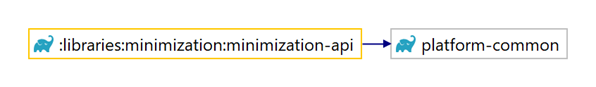

<h5>Figure 15: A dependency diagram of the `minimization-api` component.</h5>
<br>
</div>

## minimization-service

<div style="text-align: center;">

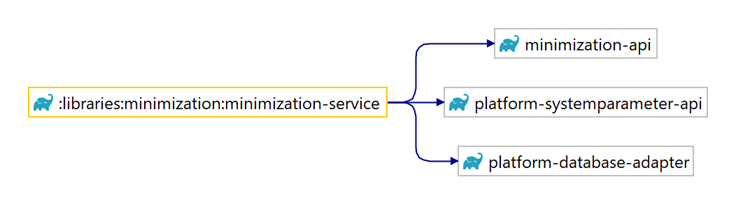

<h5>Figure 16: A dependency diagram of the `minimization-service` component.</h5>
<br>
</div>

## minimization-front

<div style="text-align: center;">


<h5>Figure 17: A dependency diagram of the `minimization-front` component.</h5>
<br>
</div>

## batch-jobs-minimization

<div style="text-align: center;">

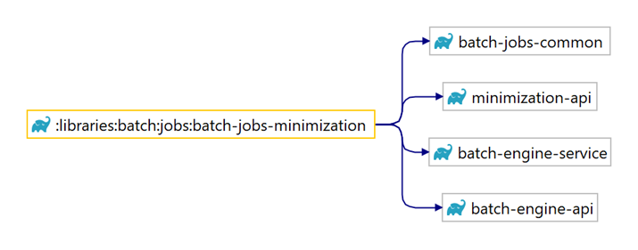

<h5>Figure 18: A dependency diagram of the `batch-jobs-minimization` component.</h5>
<br>
</div>

# Data model

The minimization framework requires the introduction of the following tables, see [database patches](/DD130-Detailed-Design/Minimization#database-patches)
 for the relevant
suggested
database patches for introducing these tables, alongside their corresponding history tables and database triggers:

* **Person type**: The `PERSON_TYPE` table contains the matched person types for any given person in the `PERSON` table,
  see Table 10 for a description of the fields for the table. Remark that the kind of person type being matched is
  determined by its name, since the match rules are stored in memory, see [Person types](/DD130-Detailed-Design/Minimization#Person-types)
 for details.

* **Person type data right map**: The `PERSON_TYPE_DATA_RIGHT_MAP` table contains the mapping between person types and
  data rights, see Table 11 for a description of the fields for the table. Remark that the kinds of data right and
  person type being mapped are determined by their name, since the complex providers and match rules are both stored in
  memory, see [data rights](/DD130-Detailed-Design/Minimization#data-rights)
 and [Person types](/DD130-Detailed-Design/Minimization#Person-types)
 for details.

For a dependency diagram of the minimization framework data model and its related tables, see Figure 19.

<div style="text-align: center;">

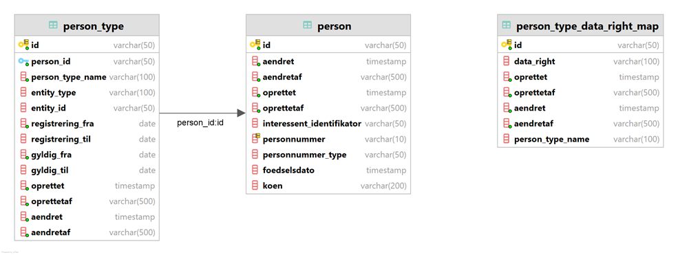

<h5>Figure 19: A dependency diagram of the minimization framework data model.</h5>
<br>
</div>

## PERSON_TYPE

<div style="text-align: center;">

<h5>Table 10: A description of the fields for the PERSON_TYPE table.</h5>

</div>

| Field                | Description                                                                                    |
|----------------------|------------------------------------------------------------------------------------------------|
| **ID**               | The globally unique identifier of this entity.                                                 |
| **PERSON_ID**        | The reference to the person that owns this entity.                                             |
| **PERSON_TYPE_NAME** | The name of the person type whose match rule has been satisfied.                               |
| **ENTITY_TYPE**      | The type of the entity that has satisfied the match rule for this entity.                      |
| **ENTITY_ID**        | The reference to the entity that has satisfied the match rule for this entity.                 |
| **REGISTRERING_FRA** | The start timestamp of the registration period as specified by the match rule for this entity. |
| **REGISTRERING_TIL** | The end timestamp of the registration period as specified by the match rule for this entity.   |
| **GYLDIG_FRA**       | The start date of the validity period as specified by the match rule for this entity.          |
| **GYLDIG_TIL**       | The end date of the validity period as specified by the match rule for this entity.            |
| **OPRETTET**         | The timestamp of the initial creation for this entity.                                         |
| **OPRETTETAF**       | The username responsible for the initial creation of this entity.                              |
| **AENDRET**          | The timestamp of the latest update for this entity.                                            |
| **AENDRETAF**        | The username responsible for the latest update of this entity.                                 |

## PERSON_TYPE_DATA_RIGHT_MAP

<div style="text-align: center;">

<h5>Table 11: A description of the fields for the PERSON_TYPE_DATA_RIGHT_MAP table.</h5>

</div>

| Field                | Description                                                       |
|----------------------|-------------------------------------------------------------------|
| **ID**               | The globally unique identifier of this entity.                    |
| **PERSON_TYPE_NAME** | The name of the person type being mapped from by this entity.     |
| **DATA_RIGHT**       | The name of the data right being mapped to by this entity.        |
| **OPRETTET**         | The timestamp of the initial creation for this entity.            |
| **OPRETTETAF**       | The username responsible for the initial creation of this entity. |
| **AENDRET**          | The timestamp of the latest update for this entity.               |
| **AENDRETAF**        | The username responsible for the latest update of this entity.    |

# FAQ

**If your project implemented the minimization library and found any troubleshooting tips, or questions that you have
answered during implementation, then please add them here.**