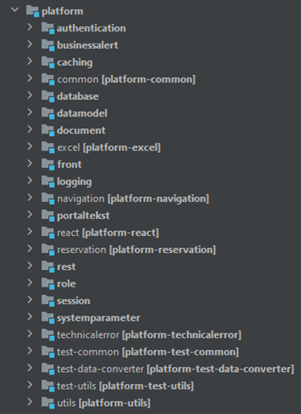
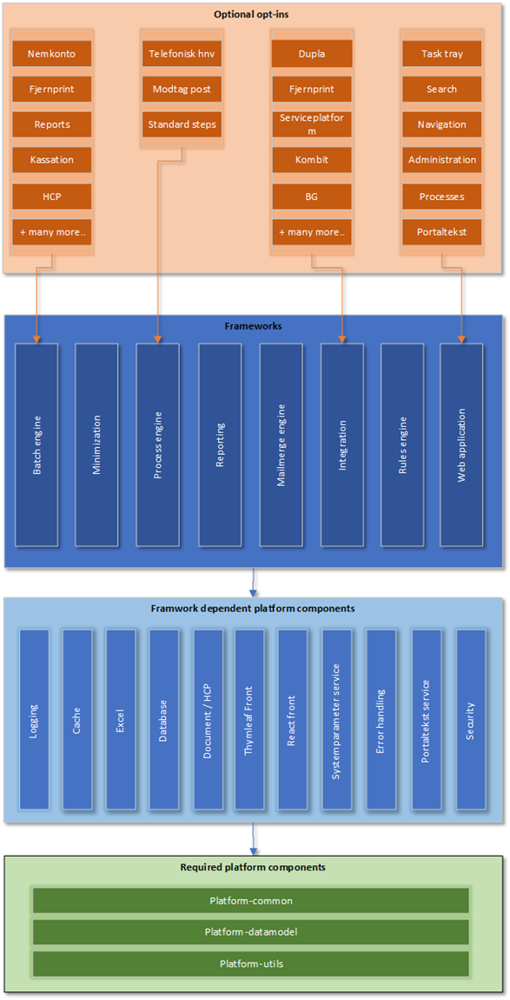
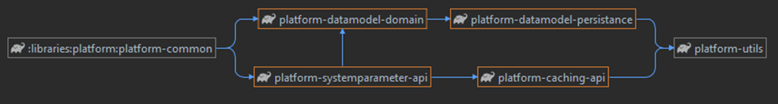
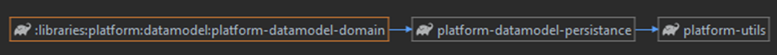
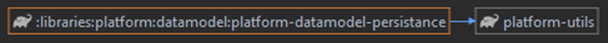
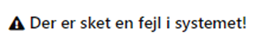
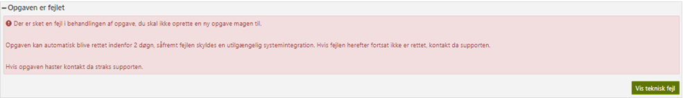
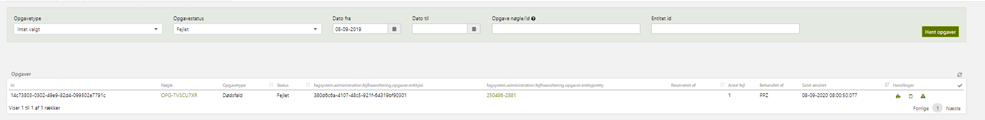
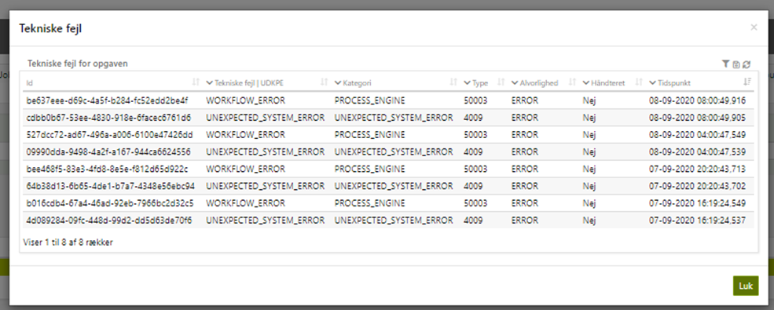
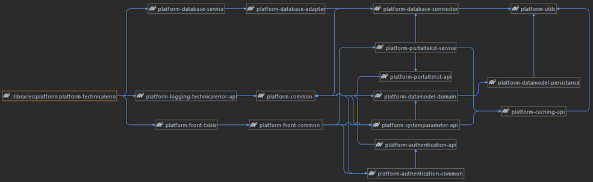

# References

| Reference                                                           | Description                                                         |
|---------------------------------------------------------------------|---------------------------------------------------------------------|
| [Amplio Wiki - DD130 documentation](/DD130-Detailed-Design)         | Amplio toolkit DD130 documentation page.                            |
| [DD130 – Application Core](/DD130-Detailed-Design/Application-core) | Documentation containing core configuration and setup descriptions. |

# Introduction

Amplio Platform library should be considered as a project that contains base functionalities that can be used by the
application configuration (caching, security elements), or by other components (functionalities like systemparameters,
utils).

<div style="text-align: center;">



<h5>Figure 1 Platform library structure</h5>
<br>
</div>

This document will consider the most general elements of the platform library, including:

- Common
- Datamodel
- Utils
- Error handling

Other elements are more detailed described in individual documents. In case specific platform library documentation is
required then please refer to the libraries documentation: [Amplio Wiki - DD130 documentation](/DD130-Detailed-Design).

## Target audience

Target audience are developers working in Amplio that needs to be aware how data model is defined, and which shared
functionalities we have available in the application and the structure of shared components.

## Purpose

Functionalities or base data model that are component independent and can be used across all components should be
defined in platform project to avoid duplication in the code. It will allow to reduce maintenance needs and reduce risk
of potential errors.

Notice that this part of Amplio should contain that implementations that independent in terms of architecture and also
should be independent in terms of business logic. Data model platform library should contain only base classes that are
shared across whole application, in different components.

Utilities or domain classes that are business logic related should be placed in feature related module.
This document will introduce common parts, utils and common data model of platform module.

## Background information

Platform itself contains dependent and independent components. They can be used in higher level implantations of the
framework. During implementation of new functionalities it is required to analyse different project implementation
levels to place implementation in a proper place.

<div style="text-align: center;">



<h5>Figure 2 Diagram of relationships between components</h5>
<br>
</div>

Diagram of relationship between components separates level of implementation and provides examples of less abstract
components. Example might be DUPLA which is data exchange platform as it is external service with concrete business
implementation requirements it is a part of Optional Opt-ins. As it is integration service it depends on integration
framework. Integration framework contains base implementations allowing external connections and it uses platform
components to achieve this.

# High level description of the component

Platform is a project containing no business logic components. Main purpose is to have base services and configurations
for application easily fetched from one place. The base configurations reduce the initial implementation time of the
application and has a significant impact on reducing the problems and costs associated with project initiation and
implementation. When implementing new components, the underlying functionality from the "platform" project allows the
developer to focus on implementing the component's business requirements rather than configuration or implementation of
common elements. The big advantage is the single point of development, which makes the usage less vulnerable because it
is a single point of maintenance.

# Platform Utils

Utils project contains utilities that mostly help to perform operations on data that can be processed in the
application. They are defining static methods so it means that there is no need to create an object of util class and
methods can be called directly.

## Utilities

| Functionality                     | Description                                                                                                                                                                             |
|-----------------------------------|-----------------------------------------------------------------------------------------------------------------------------------------------------------------------------------------|
| Concurrency                       | Functionalities for creating semaphores for services like SFTP                                                                                                                          |
| Constants translations            | Translations for Booleans, and table constants prepared for Danish language                                                                                                             |
| Regexes                           | Already prepared regexes that can be used during implementation including, CPRs, Dates, email and more.                                                                                 |
| Boolean/Date converters           | In case custom/language related Booleans are required then there are tools prepared for conversion. Also converters includes dates mappings to ensure code-db formatting compatibility. |
| Schedulers inc. Crone expressions | Builders for cron expression that make it simpler to define, also contains Schedulers configs for additional Batch job configuration.                                                   |
| Validation text keys              | Set of validation messages i.e. Wrong date format, empty values, file size, virus detected                                                                                              |
| Dates                             | Services for date mappings, period/time zone handling, national dates management                                                                                                        |
| Request-URL                       | Service for URL extractions for requests                                                                                                                                                |
| Currency helpers                  | Services for creating currency descriptors                                                                                                                                              |
| Numeric helpers                   | Used for BigDecimal, BigIntegers, Integer etc. Helpers provides mappings, comparison options                                                                                            |
| String helpers                    | To string options for complex objects, or collection of objects, allows to define depth of conversion. Contains also options for formatting strings, extracting from HTMLs, validation  |
| CPR helpers                       | Service for extracting information from CPR like date of birth, conversion from numbers only to display form.                                                                           |
| Spring Utils                      | Lower level functionalities for proxy analysis, transaction execution, obtaining information about the bean                                                                             |
| Environment Utils                 | Tool for detecting environment application is running on (Dev, Test, Prod, etc.)                                                                                                        |

# Platform Common

Common project contains functionalities that require the creation of an instance or defining functionality as a bean.
Project contains always common configurations and objects shared within the application. Common project contains:

## Components

All functional components related with Platform Common:

| Functionality                   | Description                                                                                                                                                                                                               | Example                                                                                                                           |
|---------------------------------|---------------------------------------------------------------------------------------------------------------------------------------------------------------------------------------------------------------------------|-----------------------------------------------------------------------------------------------------------------------------------|
| Alive check statuses            | Classes for obtaining integration alive statuses. Provides `AliveStatus` object that can store status and `AliveCheckable` interface that should be implemented by Connector and forces checkStatus method implementation | `SpSftpClientImpl` implements `AliveCheckable` and is overriding checkStatus method which is returning `AliveStatus`              |
| Base for Aspect implementation  | `BaseAspect` provides useful methods for aspect implementation – for context extraction, extraction of arguments from join points etc.                                                                                    | `ExceptionAspect` extends `BaseAspect`                                                                                            |
| Async executor component        | Context thread pool configurations, Thread pool executors, Abstract callable with context management                                                                                                                      | `ContextAwarePoolExecutor`                                                                                                        |
| Custom conditional annotations  | Annotations for more complex conditions determining execution or bean creation.                                                                                                                                           | `CustomConditionalOnProperty`                                                                                                     |
| Context holders                 | Classes for storing context attributes related with session or request with `Context` implementation.                                                                                                                     | `AbstractContextImpl` Immutable security context used for tracing and monitoring purposes.                                        || File readers/writers            | Based on provided input file services can extract data from file to representative Java classes, or from Java classes to file.<br>- CSV<br>- XML<br>- Fixed width                                                         | `FixedWidthFileReader`, `FixedWidthFileWriter` etc.                                                                               |
| Property management component   | Allows to extract concrete property or retrieve set of properties.                                                                                                                                                        | Detailed described in section 4.2 The property framework                                                                          |
| Spring security assurance tools | Security context for tracking/monitoring purposes, role verification and access control, Configuration that ensures that Controllers are secured properly, without proper security configuration access will be denied    | `SpringSecurityRoleHelper` – checking if `SecurityContext` contains role etc.<br>`ContextWrapper` – for obtaining setting context |
| Startup Initializers            | Service initializing extendable enums, and abstract entities from Amplio. Service also ensures that Beans are eagerly loaded on environments to reduce runtime exception risks.                                           | `StartupServiceImpl` – should not be extended in project.                                                                         |
| Virusscan                       | When file is transferred with use of the Amplio system it will be scanned in terms security purposes                                                                                                                      | `VirusScanServiceImpl` – performs virus scanning. Used in `UploadValidationServiceImpl`                                           |

## The property framework

Often it is useful to have a number of values which should be configurable at run-time. This could be various threshold
values or it could be text-strings which are shown in Excel-sheets generated by the system. Such properties can be
defined using the property framework. This section elaborates on how to add and use such properties.

The property framework has three key components:

1. The `DefaultProperties` class where each property is defined together with a default value for the property.
2. The `Property` database table in DB where it is possible to overwrite the default value on an environment with an
   environment specific value.
3. The `PropertyManager` class which has logic for retrieving properties – either from the database if they exist there
   or alternatively from `DefaultProperties` if the property has not been overwritten in the database.

### Defining a new property

A new property is defined by adding it to the static code block like so:

```java
{
        DefaultProperties.addDefaultProperty(new Property("Amplio.property", "yes"));
}
```

This adds a property with the property name `Amplio.property` having a value of `yes`. Notice that all properties are
strings, so numeric properties are just numbers wrapped in a string.

### Retrieving a property

Properties can be retrieved using the `PropertyManager` that is available through the abstract adapter method
`getPropertyManager`. On the property manager, the method `getPropertyValue` can be used for retrieving a property. For
example:

```java
String AmplioProperty = getPropertyManager.getPropertyValue("Amplio.property");
```

### Overwriting the default value of a property

Default values can be overwritten by inserting a row in the property table on DB as follows:

```sql
INSERT INTO PROPERTY (name, value) VALUES ('sample.property.value', '123456')
```

In the above example, we overwrite the default value of the property named `sample.property.value` with a value of
“123456”.
Properties are cached for 10 minutes by `PropertyManager`, so changing a property in the property database table in DB
will not take effect immediately unless the cache is cleared.

## Data model

Common component besides external libraries has dependencies on 2 other components from the platform project. These are:

- Systemparameters
- Datamodel

<div style="text-align: center;">



<h5>Figure 3 Common component dependencies diagram</h5>
<br>
</div>

# Platform Datamodel

Datamodel is a project that contains the minimum number of classes that are not strictly related to a given component
but are used in a wider scope. It contains:

- Base Entities implementations
- Common exceptions
- Set of unique error messages
- Security context and roles definitions
- Base object serialization implementation
- Extendable enum

## ExtendableEnum

This is to be used when an enum is defined in Amplio and must be used in different extensions in projects. Most use case
is
when enum values are used by the components provided by Amplio for example process engine, but their full or partial
initialization needs to be defined by the project. For example projects might want to define different haendelses types,
so projects needs to define them. Process engine use them later on for processing. Amplio force static load of the leaf
class (project classes with Extendable enum values) in order to ensure that the enums are correct loaded.

Base Extendable enums define static Map that will store values as follows:

```java
public class HaendelseType extends ExtendableEnumAbstract {

    private static final Map<String, HaendelseType> TYPES = Maps.newHashMap();
    // ...
}
```

And methods for creation and getting values. Create methods are using create method from **ExtendableEnumAbstract**:

```java
/**
 * Creates the task step type.
 */
public static HaendelseType create(final String name, boolean tilladManuelInitiering) {
    return create(name, TYPES, new HaendelseType(name, tilladManuelInitiering));
}

/**
 * Gets the event type.
 *
 * @param name the name of the event type
 * @return the event type
 */
public static HaendelseType getHaendelseType(String name) {
    HaendelseType type = fromKey(name, TYPES);

    if (type == null) {
        throw new CoreException(ErrorCode.NO_HAENDELSE_TYPE, ImmutableList.of(name));
    } else {
        return type;
    }
}
```

**ExtendableEnumAbstract** defines create method where the enum key, map of values, and new value is passed. It performs
validation in terms of duplication, and map initialization:

```java
public abstract class ExtendableEnumAbstract implements ExtendableEnum, Serializable {

    public String value;

    public static boolean failOnDuplicateEnum = true;

    @Value("${common.error.failonduplicateenum:true}")
    public void setFailOnDuplicateEnum(boolean failOnDuplicateEnum) {
        this.failOnDuplicateEnum = failOnDuplicateEnum;
    }

    protected static <T extends ExtendableEnum> T create(String key, Map<String, T> values, T newItem) {
        if (values == null) {
            throw new CoreException(ErrorCode.DATA_NOT_FOUND, "Map is not initialized. Check the " +
                    "order of the hashMap definition. It must be declared before the .create call.");
        }
        if (!values.containsKey(key)) {
            values.put(key, newItem);
        } else if (failOnDuplicateEnum) {
            throw new CoreException(ErrorCode.ENUM_DUPLICATE, String.format("The ExtendableEnum of type=%s with code=%s already exists.", newItem.getClass().getName(), key));
        }
        return values.get(key);
    }
}
```

Projects can define values with use of static methods provided by base ExtendableEnum implementations:

```java
public class BaseHaendelseType extends HaendelseType {

    /**
     * Version.
     */
    private static final long serialVersionUID = 1L;

    /** Task closed. */
    public static final HaendelseType OPGAVE_AFSLUTTET = HaendelseType.create("OPGAVE_AFSLUTTET", false);
    public static final HaendelseType OPGAVEKATEGORI_AENDRET = HaendelseType.create("OPGAVEKATEGORI_AENDRET", false);
    public static final HaendelseType SAG_OPRETTET = HaendelseType.create("SAG_OPRETTET", false);
    // ...
}
```

## Data model

### Domain

<div style="text-align: center;">



<h5>Figure 4 Datamodel domain component dependencies diagram</h5>
<br>
</div>

### Persistance

<div style="text-align: center;">



<h5>Figure 5 Datamodel persistance component dependencies diagram</h5>
<br>
</div>

# Technicalerror

Technicalerror library is also considered in current document as it is special library that is used on the top of all
components as it is aspect implementation. Library provides an aspect to log errors to a database table such that
developers can find them later and relate them to opgaves that failed. Beyond aspect, it is also providing a controller
to view the errors found by the above aspect.

The error handling component is responsible for catching and logging exceptions as technical errors. It provides the
following:

- A controller to view technical errors
- An exception aspect that projects must extend to catch exceptions
- A technical error service to fetch and handle technical errors

The table is called `TEKNISKFEJL` and contains error type, detail, and time. When an error occurs, it is caught by the
exception aspect and logged to the `TEKNISKFEJL` table.

## Exception handling

The exception handling in Amplio wraps the error thrown in the system and processes this by checking the type of error,
the
stack trace, and root cause. If the error is an integration error, this will be handled separately by the process engine
and if the error isn’t of type `CoreException` (root exception thrown by the Amplio Core) the error will be mapped to
Unexpected system error with code `4009` and then saved to the database. Amplio saves the error code, the stack trace,
and
some other values to the table `TEKNISKFEJL`.

## Frontend

The errors that are saved in the database can be found under either Administration - Fejlhåndtering or Administration -
Fejlrapporter. The most useful way to see the errors is to use Fejlhåndtering. There are a couple of ways the error can
be presented. If there is an error related to a table on the website, the table will not be displayed and instead a text
will be displayed. Seen here:

<div style="text-align: center;">



<br>
</div>

If the error happens in a process the error will be displayed with the possibility to see the error using the “Vis
teknisk fejl” which will show the stack trace related to the error.

<div style="text-align: center;">



<br>
</div>

## Technical error analysys

Technical errors give a detailed explanation of what went wrong in the system and is a very useful tool for developers
when trying to fix bugs/defects.

Under Administration - Fejlhåndtering (or admin/fejlhaandtering) all tasks that are in a failed state can be found and
all related technical errors can be found and filtered.

The page that is accessible via Administration – Fejlhåndtering is shown below. This will only be accessed if the user
has the correct role.

<div style="text-align: center;">



<br>
</div>

The errors related to the Opgave can found by clicking the triangle .

<div style="text-align: center;">



<br>
</div>

The table gives an easy overview of all errors on the tasks with relevant information from the **TEKNISKFEJL** table.
When clicking on the errors the related stacktrace will be shown.

## Error codes

The following error codes are already defined in Amplio but each project can extend the **ErrorCode** class and creates
its
own error types. The defined texts are not something that is directly exposed to the end users and are written in such a
way that developers fixing the bugs will understand them.

| Name                                                   | Code   | Text                                                                                                                                                                 |
|--------------------------------------------------------|--------|----------------------------------------------------------------------------------------------------------------------------------------------------------------------|
| **BAD_REQUEST**                                        | 4000   | The request cannot be fulfilled due to bad syntax.                                                                                                                   |
| **UNAUTHORIZED**                                       | 4001   | Invalid or missing credentials                                                                                                                                       |
| **SERIALIZATION_ERROR**                                | 4005   | Unable to serialize object.                                                                                                                                          |
| **RESOURCE_NOT_FOUND**                                 | 4004   | The requested resource does not exist                                                                                                                                |
| **MAPPER_ERROR**                                       | 4006   | Unable to map backend data to business core object                                                                                                                   |
| **ADAPTER_CREATION_ERROR**                             | 4007   | Could not create adapter                                                                                                                                             |
| **ADAPTER_RESULT_ERROR**                               | 4008   | Error while getting result                                                                                                                                           |
| **UNEXPECTED_SYSTEM_ERROR**                            | 4009   | An unexpected system error occurred                                                                                                                                  |
| **ADAPTER_COLLIDED_DATA_ERROR**                        | 4010   | Data already exists                                                                                                                                                  |
| **DATA_NOT_IN_CACHE**                                  | 4011   | The call is expected to fetch data from cache only                                                                                                                   |
| **ADAPTER_OPERATION_INVALID_STATUS**                   | 4012   | Invalid status result                                                                                                                                                |
| **BACKEND_DOWN**                                       | 4014   | Back end system is down due to scheduled restart                                                                                                                     |
| **CONFIGURATION_ERROR**                                | 4015   | The specified configuration was not accepted by the application                                                                                                      |
| **ADAPTER_MAPPING_EXCEPTION**                          | 4020   | Error during mapping data.                                                                                                                                           |
| **PROXY_SERVER_ERROR**                                 | 4021   | Error occurred in proxy server                                                                                                                                       |
| **SERVER_NOT_READY**                                   | 4022   | Server is not ready to serve requests                                                                                                                                |
| **NOT_BEAN_FOUND**                                     | 4023   | Bean not found                                                                                                                                                       |
| **INVALID_FORMAT**                                     | 4024   | Invalid Format                                                                                                                                                       |
| **CONNECTOR_XML_PARSE_ERROR**                          | 4100   | Error during parsing XML file.                                                                                                                                       |
| **CONNECTOR_EXCEPTION**                                | 4101   | Error during executing connector operation.                                                                                                                          |
| **CONNECTOR_EXCEPTION_EINDKOMST_NO_ACCESS_TO_SERVICE** | 4102   | Error during executing connector operation. There is no agreed access to the used service.                                                                           |
| **DATABASE_UNABLE_TO_FIND_ENTRY**                      | 4103   | Trying to find BasicEntity based on ID. ID does not exist in db.                                                                                                     |
| **CONNECTOR_EXCEPTION_REQUEST_TIMEOUT**                | 4104   | Error during executing connector operation. Request timed out.                                                                                                       |
| **DATA_NOT_FOUND**                                     | 4998   | The requested data could not be found                                                                                                                                |
| **ENCODING_ERROR**                                     | 5000   | Cannot change encoding                                                                                                                                               |
| **VALIDATION_ERROR**                                   | 5001   | One of the objects cannot be validated                                                                                                                               |
| **CREDENTIALS_NOT_SET**                                | 5002   | Security Credential Error: user or pass is not set                                                                                                                   |
| **ERROR_CODE_DUPLICATE**                               | 5003   | Error code already exist                                                                                                                                             |
| **CACHE_BUCKET_DUPLICATE**                             | 5004   | Cache Bucket already exist                                                                                                                                           |
| **CHANGE_CODE_DUPLICATE**                              | 5005   | Change code already exist                                                                                                                                            |
| **SECURITY_ROLE_DUPLICATE**                            | 5006   | Security role already exist                                                                                                                                          |
| **INVALID_RULE_OPERATOR**                              | 5007   | Unknown rule operator                                                                                                                                                |
| **PROVIDER_NOT_FOUND**                                 | 5008   | Data provider not found                                                                                                                                              |
| **ILLEGAL_ARGUMENT**                                   | 5009   | Metode argument ugyldigt                                                                                                                                             |
| **DATA_RIGHT_DUPLICATE**                               | 55010  | Data right already exists                                                                                                                                            |
| **PERSON_TYPE_DUPLICATE**                              | 55011  | Person type already exists                                                                                                                                           |
| **MISSING_RULE_ROOT_ENTITY**                           | 5012   | Missing rule root entity                                                                                                                                             |
| **FAILED_TO_DETERMINE_RULE_TO_RUN**                    | 5013   | Failed to determine rule to run                                                                                                                                      |
| **FAILED_TO_EVALUATE_SINGLE_RESULT**                   | 5014   | Failed to evaluate to single conclusion                                                                                                                              |
| **FIELD_NOT_FOUND**                                    | 5016   | Field not found                                                                                                                                                      |
| **RULESHEET_MISSING**                                  | 5017   | Rule sheet missing or not provided.                                                                                                                                  |
| **TEMPLATE_MISSING**                                   | 5018   | Template missing or not provided.                                                                                                                                    |
| **MAILMERGE_FAILED**                                   | 5019   | Failed to execute mail merge.                                                                                                                                        |
| **OPGAVE_TYPE_DUPLICATE**                              | 5020   | OpgaveType already exist                                                                                                                                             |
| **OPGAVE_TRIN_TYPE_DUPLICATE**                         | 5021   | OpgaveTrinType already exist                                                                                                                                         |
| **URL_SECURITY_MAP_DUPLICATE**                         | 5022   | URL security map already exist                                                                                                                                       |
| **HAENDELSE_TYPE_DUPLICATE**                           | 5023   | HaendelseType already exist                                                                                                                                          |
| **YDELSETYPEGRUPPE_DUPLICATE**                         | 5024   | Ydelsestypegruppe already exist                                                                                                                                      |
| **SAG_SAGSTILSTAND_DUPLICATE**                         | 5025   | SagSagstilstand already exist                                                                                                                                        |
| **PERSIST_TRIED_IN_READONLY_CONTEXT**                  | 5030   | Your transaction is in read only mode. Persist not allowed.                                                                                                          |
| **OPGAVE_TRIN_BREVSKABELON_NOT_SPECIFIED**             | 5031   | Unable to find the proper brevskabelon on Opgave Trin Type                                                                                                           |
| **REGELARKNOEGLE_DUBPLICATE**                          | 5033   | Regelark nøgle already exist                                                                                                                                         |
| **MODUL_DUPLICATE**                                    | 5034   | Modul nøgle already exist                                                                                                                                            |
| **OPGAVE_TRIN_REGELARK_NOT_SPECIFIED**                 | 5035   | Unable to find the proper regelark on Opgave Trin Type                                                                                                               |
| **PERSIST_VALIDATION_EXCEPTION**                       | 5036   | Your transaction cannot be validated.                                                                                                                                |
| **OPGAVE_TRIN_TOO_MANY_COMMANDS**                      | 5043   | Too many OpgaveTrinData of type COMMAND_OBJECT - expected only 1                                                                                                     |
| **RULESHEET_TOO_MANY_RESULTS**                         | 5099   | Rule sheet has more than 1 results.                                                                                                                                  |
| **JOB_FAILED_BECAUSE_OF_TECHNICAL_REASONS**            | 5101   | Job of type [{0}] failed because of technical reasons.                                                                                                               |
| **MALFORMED_CRON_EXPRESSION**                          | 5102   | Job of type [{}] has malformed cron expression [{}] cause [{}].                                                                                                      |
| **WAITING_FOR_JOBS_TO_BE_CLOSED_TIMEOUT_EXCEEDED**     | 5103   | Waiting for jobs of enums [{}] to be closed timeout exceeded.                                                                                                        |
| **JOB_FAILED_BECAUSE_OF_INTERNAL_ERROR**               | 5104   | Job of type [{0}] failed because of incorrect data: [{1}]                                                                                                            |
| **MAILMERGE_FIELDS_UNMERGED**                          | 5120   | There are mail merge fields left unmerged.                                                                                                                           |
| **MAILMERGE_MANUAL_INPUT_REQUIRED**                    | 5121   | Manual input required.                                                                                                                                               |
| **OPGAVE_UPDATED_ELSEWHERE**                           | 5137   | Opgavekladde cannot be saved since it has already been updated elsewhere.                                                                                            |
| **HAENDELSE_NO_PERSON**                                | 5140   | Haendelse har har ikke nogen Person                                                                                                                                  |
| **NO_HAENDELSE_TYPE**                                  | 55141  | No haendelse type exist for the string {0}                                                                                                                           |
| **SOAP_HEADER_ERROR**                                  | 5200   | Soap header error                                                                                                                                                    |
| **SOAP_BODY_ERROR**                                    | 5201   | SoapFault with faultCode=[{0}] faultString=[{1}] and detail=[{2}]                                                                                                    |
| **HTTP_ERROR**                                         | 5202   | HTTP error                                                                                                                                                           |
| **OIO_REST_ERROR**                                     | 5203   | OIO REST error                                                                                                                                                       |
| **CONNECTION_ERROR**                                   | 5205   | Connection closed error.                                                                                                                                             |
| **EXCEL_IMPORT_NO_CONCLUSIONS**                        | 5206   | No Conclusions found                                                                                                                                                 |
| **QUERY_TOO_EXPENSIVE**                                | 5301   | The requested query was too expensive                                                                                                                                |
| **DOCUMENT_MISSING**                                   | 5330   | Document missing or not provided.                                                                                                                                    |
| **TDC_ERROR**                                          | 5350   | An error occured in the test data converter                                                                                                                          |
| **BG_IKKE_TILGAENGELIG**                               | 5398   | BG service not available                                                                                                                                             |
| **BG_STRAKSOPLAG_FEJLET**                              | 5399   | Straksoplag til BG fejlede                                                                                                                                           |
| **KOMBIT_SOME_ITEMS_GET_STATUS_FAILED_AFTER_SENDING**  | 5400   | Some were marked as failed after sending to kombit.                                                                                                                  |
| **KOMBIT_RESPONSE_INCONSISTENT_WITH_REQUEST**          | 5401   | Kombit response were containing ids inconsistent with request.                                                                                                       |
| **REFLECTIONHELPER_NO_FUNCTION_FOUND**                 | 5402   | Reflection helper was not able to find suitable clazz or method                                                                                                      |
| **REFLECTIONHELPER_INVALID_EXPRESSION**                | 5403   | Reflection helper was not able to evaluate expression                                                                                                                |
| **REFLECTIONHELPER_METHOD_INVOCATION_ERROR**           | 5404   | Reflection helper was not able to find suitable clazz or method                                                                                                      |
| **KOMBIT_CAN_NOT_DEACTIVATE_APPROPRIATION**            | 5410   | Kombit response - cannot deactivate appropriation                                                                                                                    |
| **KOMBIT_CAN_NOT_DEACTIVATE_SAG**                      | 5411   | Kombit response - cannot deactivate sag                                                                                                                              |
| **KOMBIT_HIBERNATE_TRIGGERS_ERROR**                    | 5420   | Some Hibernate trigger failed.                                                                                                                                       |
| **MISSING_REQUIRED_REQUEST_PARAMETER**                 | 5501   | URL does not contain the required request parameter.                                                                                                                 |
| **TEXT_IN_TAG_HAS_EMPTY_KEY**                          | 5502   | nc:text attribute contains an empty textkey                                                                                                                          |
| **BUSINESS_EXCEPTION**                                 | 5601   | Business exceptions occurred                                                                                                                                         |
| **BUSINESS_CONFIG_EXCEPTION**                          | 5602   | Business logic configuration exception occured                                                                                                                       |
| **NO_NAME_ON_EXTENDABLE_ENUM**                         | 5603   | Extendable enum has no name attribute                                                                                                                                |
| **NO_VALUEOF_ON_EXTENDABLE_ENUM**                      | 5605   | Extendable type has no valueOf(String key) method needed for serialization.                                                                                          |
| **NO_VALUE_FOR_KEY_IN_EXTENDABLE_ENUM**                | 5606   | Extendable type has no value for the key given during call to valueOf. Has type been initialized in?                                                                 |
| **ARBJEDSPAKKE_INVALID**                               | 5604   | Arbejdspakke kunne ikke bygges                                                                                                                                       |
| **SEARCH_FAILED**                                      | 5701   | Søgningen fejlede                                                                                                                                                    |
| **CONTEXT_IS_REQUIRED_BUT_NOT_PRESENT**                | 5702   | CONTEXT_IS_REQUIRED_BUT_NOT_PRESENT                                                                                                                                  |
| **TENANT_IS_REQUIRED_BUT_NOT_PRESENT_IN_CONTEXT**      | 5703   | TENANT_IS_REQUIRED_BUT_NOT_PRESENT_IN_CONTEXT                                                                                                                        |
| **JOURNALNOTAT_NOT_VALID**                             | 5704   | Journalnotat is not valid. isGodkendelsetrin() is probably missing in a last manuel step in process                                                                  |
| **JOURNALNOTAT_NOT_VALID_ON_RELEASE**                  | 5705   | One or more tasks on current entity has invalid journalnotats which has not been persisted.                                                                          |
| **VALIDATION_ERROR_ID_NOT_ALLOWED_ON_NEW**             | 5801   | Specifying an Id is not allowed when creating a new Systemparameter                                                                                                  |
| **VALIDATION_ERROR_MANDATORY**                         | 5802   | Missing required value                                                                                                                                               |
| **VALIDATION_ERROR_UNIQUE_NOEGLE**                     | 5803   | The property NOEGLE must be unique                                                                                                                                   |
| **VALIDATION_ERROR_TIMESERIES**                        | 5804   | Change leads to invalid an invalid timeline                                                                                                                          |
| **FAGSYSTEM_NO_ENTITY_URL_PARAM**                      | 61000  | No pId or vId param given in URL.                                                                                                                                    |
| **FAGSYSTEM_PERSON_NOT_FOUND**                         | 61001  | Person with pId {0} not found in database.                                                                                                                           |
| **FAGSYSTEM_VIRKSOMHED_NOT_FOUND**                     | 61002  | Virksomhed with vId {0} not found in database.                                                                                                                       |
| **FAGSYSTEM_SAG_NOT_FOUND**                            | 61003  | Sag with sId {0} not found in database.                                                                                                                              |
| **FAGSYSTEM_OPGAVE_NOT_FOUND**                         | 61004  | Opgave with oId {0} not found in database.                                                                                                                           |
| **SAG_CREATE_INVALID_TYPE**                            | 7110   | Invalid use of sagstype {0}                                                                                                                                          |
| **SAG_INVALID_PART**                                   | 7111   | Sagspart {0} cannot be null                                                                                                                                          |
| **SAG_CREATE_MULTIPLE_ALREADY_EXISTS**                 | 7112   | Trying to create new sag, but multiple sager with already found                                                                                                      |
| **SAG_DELETE_INVALID_TILSTAND**                        | 7120   | Cannot delete sag because Sagstilstand is in {0}                                                                                                                     |
| **SAGPART_INVALID_TYPE**                               | 7151   | Cannot create sagspart because must be either Person or Virksomhed. Not {0}                                                                                          |
| **SAGPART_PART_CANNOT_CHANGE**                         | 7152   | Sagspart of type {0} cannot change. Close the existing Sag and create a new instead                                                                                  |
| **SAGPART_PART_TOO_MANY**                              | 7154   | There may never be more than one Sagspart of type {0}                                                                                                                |
| **SKAT_INDKOMSTOPLYSNINGER_INVALID**                   | 7200   | SKAT does not have income information in the selected period                                                                                                         |
| **FERIEPENGE_OPLYSNINGER_INVALID**                     | 7201   | Feriepenge.dk does not have income information in the selected period                                                                                                |
| **BPM_DIAGRAM_NOT_FOUND**                              | 8100   | BPM_DIAGRAM_NOT_FOUND                                                                                                                                                |
| **EVENT_TYPE_DISABLED**                                | 9000   | Det pågældende hændelsesabonnement er deaktiveret                                                                                                                    |
| **TOO_MANY_STEPS_IN_TASK**                             | 9200   | Opgaven har for mange opgavetrin; det er ikke muligt at udføre operationer på opgavetrin.                                                                            |
| **JOBPARAMETER_EXPECTED_ONE_ELEMENT**                  | 10680  | Error in jobparameter. Expecting only one parameter per name                                                                                                         |
| **OPGAVE_TRIN_MISSING_COMMAND_TYPE**                   | 15041  | OpgaveTrinType is missing the command type                                                                                                                           |
| **ENUM_DUPLICATE**                                     | 150237 | Enum already exist                                                                                                                                                   |
| **TABLE_NOT_GENERATED_WITHIN_TIMEOUT**                 | 150238 | Asynchronous table has not been generated within timeout for getter.                                                                                                 |
| **DATA_NOT_GENERATED_WITHIN_TIMEOUT**                  | 150239 | Asynchronous generated data has not been generated within timeout for getter.                                                                                        |
| **ASYNC_EXECUTION_WITH_CONTEXT_FAILED**                | 150240 | An error happened during async execution.                                                                                                                            |
| **QUERY_COST_ESTIMATION_TOO_HIGH**                     | 150241 | The database estimates the time to execute the query exceeds the maximum allowed.                                                                                    |
| **EXTENDABLE_ENUM_LOADED_ELSEWHERE**                   | 150242 | The Extendable Enum is defined in more than one location {0}                                                                                                         |
| **PROCESS_EXECUTION_TIMEOUT**                          | 50001  | Process execution could not complete and is halted                                                                                                                   |
| **LOCKED_PROCESS_EXECUTION_FAILED**                    | 50002  | Process execution failed in lock-execution-unlock encapsulation                                                                                                      |
| **WORKFLOW_ERROR**                                     | 50003  | Error in workflow processing                                                                                                                                         |
| **COULD_NOT_OBTAIN_TASK_LOCK**                         | 50004  | Lock could not be obtained in lock-execution-unlock encapsulation                                                                                                    |
| **GATEWAY_REACHED_WITHOUT_PROVIDED_CONDITIONAL**       | 50005  | Process diagram has reached a branch and needs to know which one to choose                                                                                           |
| **TRINVIEWDATA_TYPE_CANT_BE_INSTANTIATED**             | 50006  | Assigned trin view data type cannot be instantiated by process engine                                                                                                |
| **NO_COMMAND_OBJECT_ON_TRIN**                          | 50007  | Please verify that this step should be manual and that there is an associated command object                                                                         |
| **NO_GODKENDELSE_TRIN_TO_REVERT_TO**                   | 50008  | Current step must revert to previously executed godkendelses step when being executed after failing                                                                  |
| **NO_EXISTING_TRANSACTION_ALLOW**                      | 50009  | Execution steps in process engine requires a transaction less state. It needs to ensure that errors get persisted (REQUIRES_NEW), but also catches thrown exceptions |
| **COULD_NOT_OBTAIN_EVENT_LOCK**                        | 50010  | Lock could not be obtained in lock-execution-unlock encapsulation                                                                                                    |
| **EVENT_HANDLING_NOT_ALLOWED_WHEN_TASK_ATTACHED**      | 50011  | After task creation locking is only maintained on Opgave class and all handling should go through task handling                                                      |
| **MISSING_PROCESS_WRITE_RIGHTS**                       | 50012  | You do not have the appropriate rights to modify this process                                                                                                        |
| **PROCESS_INTEGRATION_ERROR**                          | 50013  | An internal integration has failed                                                                                                                                   |
| **UNEXPECTED_INTEGRATION_ERROR**                       | 50014  | An unexpected error has occured in an integration. Remember recast exceptions should be of type CoreException                                                        |
| **UNHANDLED_INTEGRATION_EXCEPTION**                    | 50015  | An unhandled integration exception has been caught; integration page will not display proper information.                                                            |
| **PROCESS_ROLLBACK_ERROR**                             | 50016  | Rollback aborted; it would cause an incorrect state. Are you using time machine?                                                                                     |
| **PROCESS_INTEGRATION_TIMEOUT**                        | 50017  | Integration execution was cancelled by process engine due to timeout                                                                                                 |
| **KASSATION_TREE_RELATION_ERROR**                      | 50238  | Kassation tree built with relation not matching db schema                                                                                                            |
| **KASSATION_UNSUPPORTED_SCENARIO**                     | 50239  | Trying to build a kassation relationtree that is not supported by the framework.                                                                                     |
| **SFTP_REQUEST_FILE_NOT_FOUND**                        | 50350  | Could not list the request on sftp server.                                                                                                                           |
| **SFTP_TRIGGER_FILE_NOT_FOUND**                        | 50351  | Could not list the trigger on sftp server.                                                                                                                           |
| **DIALOG_INTEGRATION_WRONG_KONTEKST_TYPE**             | 50352  | Incorrect kontekst type.                                                                                                                                             |
| **DIALOG_INTEGRATION_WRONG_PART_VALUE**                | 50353  | Incorrect part value.                                                                                                                                                |
| **MISSING_LETTER_TEMPLATE_KEY**                        | 57500  | Missing letter template key in process during send letter step                                                                                                       |
| **MISSING_RECIPIENT**                                  | 57501  | Missing recipient in process during send letter step                                                                                                                 |

## Configuration

**Technicalerror** component beside of adding dependency requires aspect implementation. Implementation require 2
elements:

1. Extension of **ExceptionAspect** and applying following annotations on the class

```java
@Aspect
@Component
@Order(5)
public class PeExceptionAspect extends ExceptionAspect {
// ...
}
```

2. Implementation of **init** method and calling **handleException()** method provided by abstract class. This is also
   where the
   **@AfterThrowing** annotation with the pointcut should be defined.

```java
@Override
@AfterThrowing(pointcut = "(" +
        // include
        "   within(atp.pe..*) " +
        "|| within(nc.modulus.ydelse..*) " +
        ") && !(" +
        // exclude
        "   within(nc.modulus.ydelse.integration..*) " +
        "|| within(nc.modulus.ydelse.batch..*) " +
        "|| within(nc.modulus.ydelse..*.batch..*) " +
        ")", throwing = "t")
public void init(Throwable t) throws Throwable {
    handleException(t);
}
```

## Model

<div style="text-align: center;">



<h5>Figure 6 Technicalerror component dependencies diagram</h5>
<br>
</div>

### Data model

The table `TEKNISKFEJL` where the error is stored contains the following columns.

| Name               | Description                                                                            |
|--------------------|----------------------------------------------------------------------------------------|
| **ID**             | Unique Id of the stored error.                                                         |
| **FEJLKATEGORI**   | The category of the error e.g. “Error category: Fagsystem”.                            |
| **FEJLTYPE**       | The error code e.g. “61000”.                                                           |
| **TIDSPUNKT**      | Time when the error occurred.                                                          |
| **HAANDTERET**     | Indicate if the error is serviced. This field is not actively used in the application. |
| **TITEL**          | The name of the error e.g. “No pId or vId param given in URL.”                         |
| **FEJLDETALJER**   | The stack trace connected to the error.                                                |
| **ALVORLIGHED**    | Error criticality based on Logging Level e.g “WARNING”.                                |
| **OPGAVE_ID**      | Id of the opgave if there is any.                                                      |
| **OPGAVETRIN_ID**  | Id of the opgave trin if there is any.                                                 |
| **SERVER_ID**      | The name/IP of the server the system is running on.                                    |
| **INPUT**          | Used by the integration error and holds the integration intent.                        |
| **CORRELATION_ID** | An id to correlate the errors                                                          |
| **OPRETTET**       | When the entity is saved in the database.                                              |
| **OPRETTETAF**     | Who saved the entity in the database.                                                  |
| **AENDRET**        | When the entity in the database is changed.                                            |
| **AENDRETAF**      | Who changed the entity in the database.                                                |

# Platform data model

Platform component itself is independent, and it does not have dependency to any other component from Libraries project
or outside of it. On the other hand, components from Libraries project can have dependencies to platform, such
components have their own documentation.

# Configuration

Components can be imported by adding gradle dependency in application and importing config file. In `build.gradle` in
dependencies file it is needed to add dependency:

```java
dependencies {
    api "modulus-ydelse.libraries.platform:platform-common"
}
```

It is enough to import **PlatformCommonConfig** class. Note that in in following code listing the configuration is
imported
in **CoreConfig**, application configurations are described
in [DD130 – Application Core](/DD130-Detailed-Design/Application-core).

```java
@Import({
        CacheBeansConfig.class,
        PlatformCommonConfig.class,
        DatabaseServiceConfig.class,
        PortaltekstServiceConfig.class,
        ContextAwareExecutorConfig.class,
        DbAdapterConfig.class,
        ExecutionStatisticsConfig.class,
        TechnicalErrorLoggerServiceConfig.class,
        TechnicalErrorConfig.class,
        LoggingCommonServiceConfig.class,
        CacheConfig.class,
        SerializationConfig.class,
        DocumentServiceConfig.class,
        SystemparameterConfig.class,
        EndpointInvocationMonitorConfig.class,
        ReservationConfig.class,
        SecurityServiceConfig.class
})
@PropertySource("classpath:/configs/common-jpa.properties")
public class CoreConfig {
}
```

# Troubleshooting

1. I am looking for platform component description that I cannot find in this document. Where can I find it?

This document focuses on general Platform description and simple utils, commons, and data-model. Other components that
are more complicated are described in separate DD130 documents. Documents can be found in DD130 directory
in [DD130 – Application Core](/DD130-Detailed-Design/Application-core). 

