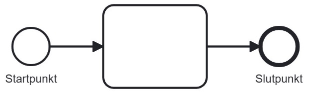
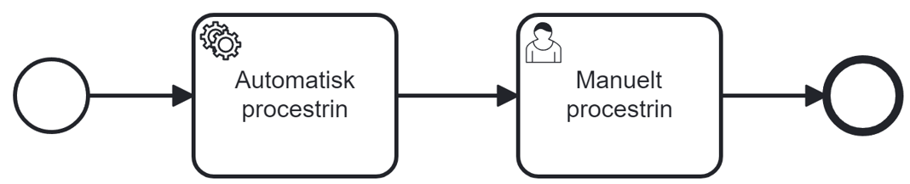
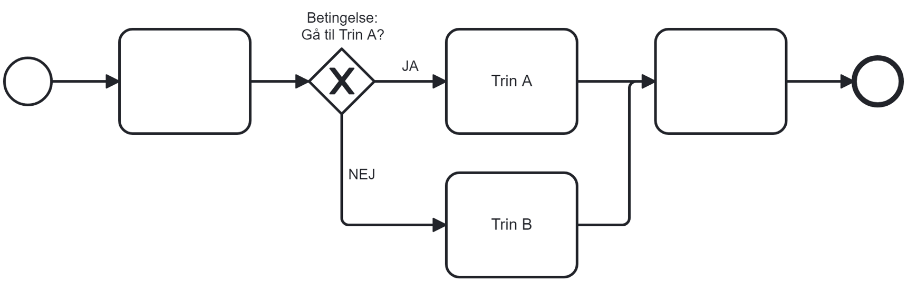
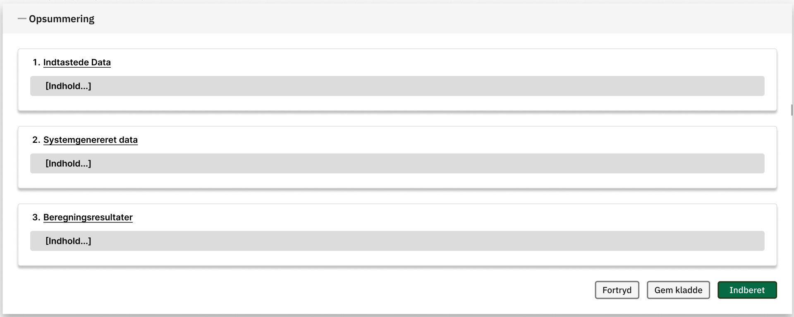
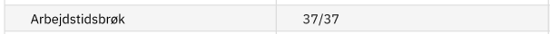
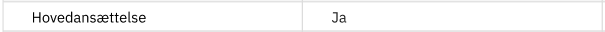
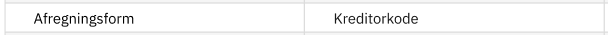
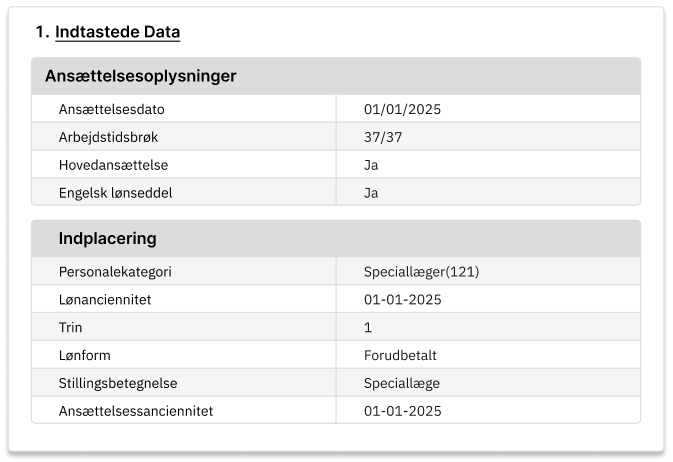

# References

| Reference                                         | Author     |
|---------------------------------------------------|------------|
| [D0100 – Guidelines for User Interface Design]    | Netcompany |
| [D0160 – User Interface Design – Business System] | Netcompany |
| [Processes]                                       | Netcompany |
| [DD130 – Process Engine]                          | Netcompany |

<!-- =============== -->
<!-- REFERENCE LINKS -->
<!-- =============== -->

[Processes]: https://goto.netcompany.com/cases/GTE2252/AMPJ/SitePages/default.aspx

<!-- ADO reference links -->

[D0100 – Guidelines for User Interface Design]: https://goto.netcompany.com/cases/GTE2252/AMPJ/RhoDeliverables/D0100%20-%20User%20Interface%20Design%20Guidelines/D0100%20-%20User%20Interface%20Design%20Guidelines.docx

[DD130 – Process Engine]: https://source.netcompany.com/tfs/Netcompany/NCMCORE/_wiki/wikis/Documentation/9492/Process-engine

[D0160 – User Interface Design – Business System]: https://goto.netcompany.com/cases/GTE2252/AMPJ/RhoDeliverables/D0160%20-%20User%20Interface%20Design/D0160%20-%20Business%20application%20%5BEN%5D.docx

# Introduction

## Purpose

The purpose of this document is to describe the general principles for the solution's work processes. A work process is
a guided sequence in the solution that, through a series of views, helps the user perform one or more actions. In the
rest of the document, work processes will simply be referred to as processes.

The document ensures that the solution's processes follow a unified concept and should therefore be considered the
foundation for all the solution's process designs.

The document provides an introduction to Amplio’s process concept and includes a description of cross-functional
features in processes. It is always a prerequisite for working with design documents involving processes that this
document is read first.

The document contains a description of the processes accessed via the user interfaces. It is therefore a prerequisite
that the reader is familiar with the content in [D0100 – Guidelines for User Interface Design]. To better understand the
connection between the business system's user interface and processes, it is also recommended to
read [D0160 – User Interface Design – Business System].

Each individual process is described in its own design document. The overview of the solution's processes is maintained
here: [Processes].

## Target Audience

The target audience for this document is all project participants who will work with processes in the solution, i.e.:

- Developers who will prepare, validate, and approve process designs.
- Developers who will build processes in the solution.
- Testers who will test processes.

# Processes

A process consists of one or more process steps, executed in a sequence defined by a process diagram in BPMN format.
Process diagrams consist of 3 types of components: start and end points, process steps, and conditions. These are
described in the following sections.

## Start and End Points

<h5>Example of start and end points</h5>

All processes have one start and one end point, defining where the process starts and ends.
The starting conditions for a process can vary. Some processes are started manually, while others can be started
automatically, e.g., as a follow-up on data from an integration. How each process is started should be described in the
process design.

## Process Steps

<h5>Example of automatic and manual process steps</h5>

A process step can either be automatic or manual:

- **Automatic step**: A step that is always executed automatically and therefore does not require user interaction.
  Automatic steps do not have a user interface. They are used when the solution needs to process data before or after a
  manual step. In the process diagram, automatic steps are marked with a gear icon.
- **Manual step**: A step that a user can interact with, e.g., by entering information. Manual steps can sometimes be
  executed automatically by the solution if there is no need for user input. In the process diagram, manual steps are
  marked with a person icon.

Process steps are implemented as independent components. Therefore, a process step can be used in several different
processes. Process steps used in multiple places are called "Cross-cutting steps" and are described in Section 6. The
other process steps are described in the individual process design documents.

## Conditions

<h5>Example of a condition</h5>

Processes can include one or more conditions that control the sequence of process steps. This is used when the user's
workflow can vary significantly and therefore requires different process steps. An example of a process diagram with
conditions is shown above.

# General Functionality

This section describes cross-functional features used across processes and process steps.

## Navigation

To be developed in a later phase of the project.

## Initiating Events

To be developed in a later phase of the project.

## Completed Steps

To be developed in a later phase of the project.

## Cancel

To be developed in a later phase of the project.

# Error Handling

To be developed in a later phase of the project.

# Automated Testing

This section will describe what developers and testers should be aware of regarding automated testing of processes,
based on T0100 – Test Strategy.
Principles for design and documentation of automated tests will be clarified at the start of the transformation phase.

# Cross-cutting Steps

This section describes process steps used by processes across the solution.

## Automatic Steps

### Initiate Process

This step is always the first process step in a process. Its purpose is to prepare the data necessary to handle the
task. For example, it can load data from the employment relationship.
Which data is loaded in this step will be described for each process.

### Retrieve Information from Integrations

To be developed in a later phase of the project.

### Persist Data

This step aims to persist the data reported in the task. Therefore, this step always runs immediately after the process
summary step and just before the receipt step. If the step does anything other than persisting the reported data, this
must be described in the individual process.

## Manual Steps

### Summary

This step aims to show the user what they have reported and what the consequences will be if they complete the task.
Therefore, the step shows an overview of:

1. Entered data: an overview of the entries in the process.
2. System-generated data: an overview of consequence changes in the system if the task is reported.
3. Calculation results: an overview of payroll calculations if the task is reported.

The step functions as the process's approval step, meaning that data is persisted if the user proceeds from the step.
The order of the 3 overviews has not yet been determined and will not be designed in PI3 - I1. The exact order will be
determined later in PI3 when the other sections are designed.

<h5>Division of the summary step into 3 cards with headings. Content in cards is not shown</h5>

#### Summary of Entered Data

The display of entered data appears in several tables. The number of tables and which specific fields are shown will be
described in the individual process designs, but as a starting point, the following applies:

- One table per step in the process. The table's heading is the same as the step's name. If another grouping of data is
  used in the summary tables, this will be described in the process design.
- For a step where multiple data can be added, a table is shown per added entity. This applies, for example, to Create
  Payroll Item, where multiple payroll item accounts can be added. The heading is then the number, e.g., "Payroll Item
  Account 1".
- Only rows where data has been changed are shown. That is, for creation, only the rows where a value has been set are
  shown, and for editing or deletion, only the rows where a value has been changed are shown.

The display of specific values in the summary is the same as the display during entry and must follow the principles
from [D0100 – Guidelines for User Interface Design]. Additionally, the following options for entries apply:

| Entry in Process | Display in Summary                                                   | Example                                                                                                                                                                               |
|------------------|----------------------------------------------------------------------|---------------------------------------------------------------------------------------------------------------------------------------------------------------------------------------|
| Fractions        | A single row in the table with “[numerator]/[denominator]”           |                                                                                                                                |
| Checkboxes       | Displayed with "Yes" or "No"                                         |                                                                                                                                |
| Radio Buttons    | Selected radio button is displayed as the text of the selected field | When selecting payment method:    displayed in the summary as:    |

The summary of entered data falls into two categories, each with its own display:

- Creation of new data using create processes.
- Editing or deletion of existing data using edit or delete processes.

##### Summary for Creation

For creation, two columns are displayed in tables with entered data: field and value. The following sketch shows how a
summary of entered data can look for creations. The fields in the example do not reflect any specific process but are
used here as an example of different types of fields, e.g., date, fraction, or name with number.

##### Summary for Editing or Deletion

For editing or deletion, four columns are displayed: field, previous value, new value, and status.
Field, previous value, and new value are displayed the same way as for creation. If a value is deleted or is empty, "-"
is displayed in the table.

Status can have the following values:

| Symbol                                                   | Description                                                                     |
|----------------------------------------------------------|---------------------------------------------------------------------------------|
|  | When a field that was previously empty has been given a value                   |
|  | When a field that previously had a value has been changed to a new value        |
|  | When a field that previously had a value has been emptied or completely removed |

Example:

<h5>Example of a process where 1) a previously empty field is filled, 2) a field is changed, 3) a field is removed</h5>

**Specifically for deletion**

For deletion (e.g., by using the delete action from the summary overview), the processes go directly to the summary, and
therefore there are no fields to show from previous steps. In these cases, the same fields are displayed in the summary
as for the creation of the same entity.

#### Summary of System-generated Data

Not designed.

#### Summary of Calculation Results

Not designed.

### Receipt

To be developed in a later phase of the project.

### Error Step

To be developed in a later phase of the project.

### Waiting for Integration

To be developed in a later phase of the project.

### Waiting during Long Process Time

To be developed in a later phase of the project.

### Cause for Attention (This should be placed elsewhere)

As a general rule, info banners should not be used in work processes, as causes for attention are the preferred tool for
showing points of attention that require active consideration.

This is described in section 5.6 Cause for Attention in [DD130 – Process Engine] .