# References

| Reference                                                                                                                        | Title                                           | Author         |
|----------------------------------------------------------------------------------------------------------------------------------|-------------------------------------------------|----------------|
| [C0200 - System Parameters](https://source.netcompany.com/tfs/Netcompany02/NF4J/_wiki/wikis/Documentation/5125/System-parameter) | C0200 – System Parameters                       | Netcompany A/S |
| [DD130 - Process Engine](/DD130-Detailed-Design/Process-Engine)                                                                  | DD130 – Process Engine                          | Netcompany A/S |
| [D0160 - Administration]                                                                                                         | D0160 – Brugergrænsefladesning – Administration | Netcompany A/S |

# Introduction

This document describes the administration user-interfaces for administrating process and event in the system. The
user-interfaces can be used for both getting and overview of what is running across the system but are primarily used
for handling errors, or suspending, cancelling, or restarting processes.

## Target audience

The target audience of this document is:

1. Customers that wishes to deep dive into the capabilities of the MY process component
2. Developers in connection with bug fixing, new feature development, MY bumps or setting up a new MY based project

## Background information

Event handling and process execution is a core component of Modulus Ydelse (MY). This component offers API's and
User-Interfaces for administrative handling of Events and Processes.

For further information, please refer to:

* [D0160 - Administration] – Documentation of Administration Portal in which the User-Interfaces resides
* [DD130 - Process Engine](/DD130-Detailed-Design/Process-Engine) – Documentation of the Process execution and Event
  handling.

# Introduction to the subject

The following sections will describe different administrative capabilities. The user-interfaces are default available
through the administration portal, but underlying functionality can also be accessed through API's, which is described
in this document as well.

The administration portal is built in Thyme leaf and served as a Spring Boot Application, and the user-interfaces and
APIs described in this document, is thus utilizing the same technologies.

## Process administration (Fejlhåndtering)

As a part of the system's administration exists the process administration tool, represented on the admin page with same
name. The tool gives the user possibility to see details about errors in a process and is therefore a strong tool for
developers especially.

### Vocabulary

This section contains a vocabulary of terms introduced in this document's section, that isn't already described
in [DD130 - Process Engine](/DD130-Detailed-Design/Process-Engine) vocabularies.

| Danish business term | English term           | Description                                                                                                                                                                                                                                                                                                                           |
|----------------------|------------------------|---------------------------------------------------------------------------------------------------------------------------------------------------------------------------------------------------------------------------------------------------------------------------------------------------------------------------------------|
| Fejlhåndtering       | Process administration | Direct translation is error handling. In MY's business portfolio, the error handling is associated with processes and their tasks. This includes show and filter information and be able to perform actions on chosen process or task e.g., 'restart process'.                                                                        |
| Fagsystem app        | Business app           | The main application of the system containing administration page, person overview page, task tray etc.                                                                                                                                                                                                                               |
| Opgavetype           | Process type           | Each process has a unique type that the process engine can relate to and associate with a BPMN diagram.                                                                                                                                                                                                                               |
| Opgavestatus         | Process status         | At any given time, a process is assigned a process status, that indicate where the process is currently in the engine execution workflow.                                                                                                                                                                                             |
| Ansøgning            | Application            | This is the resulting data of a completed flow in the self-service and contains info in a similar way as the process context does. The process will take the application and use the information together with other sources of information such as manual input through the process itself, the database, and external integrations. |
| Teknisk fejl         | Technical error        | Technical errors are saved in the database when an error occurs mainly in context with process execution. This is for example to enable error report handling and development debugging.                                                                                                                                              |

### User interface

In this section the user interface of the process administration is described along with a high-level description of
each component, button etc. The curious reader can read a more detailed technical description of the APIs in the section
[2.2.3] below. Each supported component is further decomposed and described in this section's undersections.

When entering the process administration page, the user will be presented the user interface as seen in Figure 1, but
with only the search field and process table components shown.

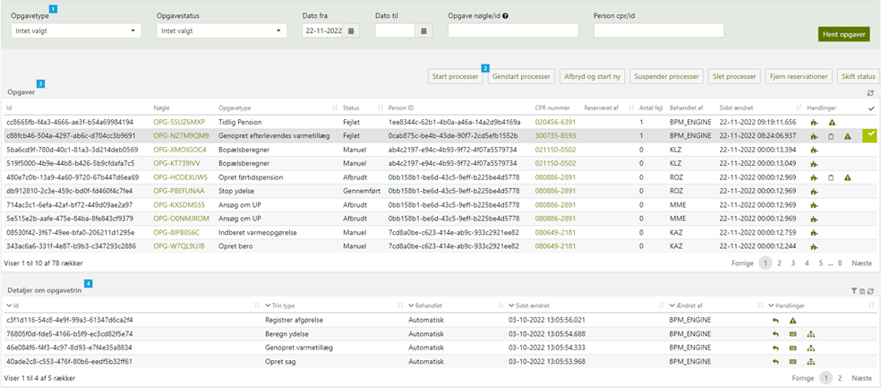

<h5>Figure 1 – Process administration – Overview</h5>
 

| Foot note | Note                                                                                                                                                                                                  |
|-----------|-------------------------------------------------------------------------------------------------------------------------------------------------------------------------------------------------------|
| 1         | Search field containing input fields to filter the processes shown in the process table (see foot note 3).                                                                                            |
| 2         | Action buttons to handle one or multiple chosen process(es) in the process table (see foot note 3).                                                                                                   |
| 3         | The process table containing information and links to relevant pages in the business (fagsystem) app about each returned process meeting the search criteria from the search field (see foot note 1). |
| 4         | The task table containing information about each created task of a clicked process in the process table (see foot note 3).                                                                            |

#### Search field

On the process administration page, the user is presented a search button and a row of input fields, where each field
corresponds to a search criterion for returning desired processes in the process table. A closer look at the search
field can be seen in Figure 2.

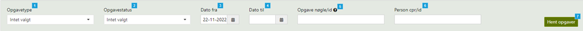

<h5>Figure 2 – Process administration – Search field</h5>
 

| Foot Note | Note                                                                                                                                                                                                                                                                                                                                                                                                                                                                                                                                                                                                                                                                     |
|-----------|--------------------------------------------------------------------------------------------------------------------------------------------------------------------------------------------------------------------------------------------------------------------------------------------------------------------------------------------------------------------------------------------------------------------------------------------------------------------------------------------------------------------------------------------------------------------------------------------------------------------------------------------------------------------------|
| 1         | The process type (opgavetype) search field is a multiselect dropdown that lets the user choose no, one or multiple process type(s) that should be included in the process search when the button is pressed (see foot note 7). The field is populated with the title of every process type in the system. Based on OpgaveType enum class. When entering the process administration page, the field doesn’t have any chosen process type by default.                                                                                                                                                                                                                      |
| 2         | The process status (opgavestatus) search field is a multiselect dropdown that lets the user choose no, one or multiple process status(es) that should be included in the process search when the button is pressed (see foot note 7). The field is populated with the title of every process status in the system. Based on OpgaveStatus enum class. When entering the process administration page, the field doesn’t have any chosen process status by default.                                                                                                                                                                                                         |
| 3         | The from date (dato fra) search field is a date field that lets the user choose no or one date that should be included in the process search when the button is pressed (see foot note 7). The process search includes processes that got changed in the database on or after the chosen date. When entering the process administration page, the field have today’s date chosen by default.                                                                                                                                                                                                                                                                             |
| 4         | The to date (dato til) search field is a date field that lets the user choose no or one date that should be included in the process search when the button is pressed (see foot note 7). The process search includes processes that got changed in the database before the chosen date. When entering the process administration page, the field doesn’t have any chosen date by default.                                                                                                                                                                                                                                                                                |
| 5         | The process key/id (opgave nøgle/id) search field is a character field that lets the user write no, one or multiple process keys/ids in any combination separated by comma ‘,’ that should be included in the process search when the button is pressed (see foot note 7). If the field isn’t empty, all other search fields get disabled immediately (and therefore not used in the search criteria), and the process search includes only processes that has an identical key or ID in the database. When entering the process administration page, the field is empty by default.                                                                                     |
| 6         | The person cpr/id search field is a character field that lets the user write no or one person/company cpr/id that should be included in the process search when the button is pressed (see foot note 7). If the field isn’t empty, the process search includes only processes that is connected to an entity, that is either a person or a company. The entity’s ID in the database need to be identical to the field. If the entity is a person, the process search includes CPRs (=security number with format ‘ddmmyy-xxxx’, where ‘-’ can be left out) that is identical to the field. When entering the process administration page, the field is empty by default. |
| 7         | When the fetch processes (hent opgaver) button is pressed. The page performs a new process search based on the current values in the search fields and shows the result in the process table. Every valid, non-empty search field value get appended to the total search criteria. In other words, a process must meet every criterion that each search field adds.                                                                                                                                                                                                                                                                                                      |

#### Process table

On the process administration page, the user is presented process table containing a list of processes that fulfils the
criteria given from the search fields, see
section [search field](/DD130-Detailed-Design/Process-Administration#search-field) above. Each
row in the table is a process registered in the
system’s database. What columns the table contains an example on how the information can look like is seen in Figure 3.

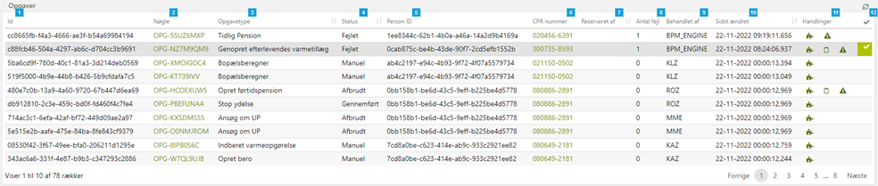

<h5>Figure 3 – Process administration – Process table</h5>
 

| Foot Note | Note                                                                                                                                                                                                                                                                                                                                                                                                                                                                                                                                                                                                                                                                                                                                                                                                                                                                                                                                                                                                                                                                                                                                                                                                                                                                                                                                                                                                                                                                                                                                                                                                                                                                                                                                       |
|-----------|--------------------------------------------------------------------------------------------------------------------------------------------------------------------------------------------------------------------------------------------------------------------------------------------------------------------------------------------------------------------------------------------------------------------------------------------------------------------------------------------------------------------------------------------------------------------------------------------------------------------------------------------------------------------------------------------------------------------------------------------------------------------------------------------------------------------------------------------------------------------------------------------------------------------------------------------------------------------------------------------------------------------------------------------------------------------------------------------------------------------------------------------------------------------------------------------------------------------------------------------------------------------------------------------------------------------------------------------------------------------------------------------------------------------------------------------------------------------------------------------------------------------------------------------------------------------------------------------------------------------------------------------------------------------------------------------------------------------------------------------|
| 1         | The unique ID in the database of the process.                                                                                                                                                                                                                                                                                                                                                                                                                                                                                                                                                                                                                                                                                                                                                                                                                                                                                                                                                                                                                                                                                                                                                                                                                                                                                                                                                                                                                                                                                                                                                                                                                                                                                              |
| 2         | The unique key (nøgle) in the database of the process. This normally have the format “OPG-” followed by 8 capital letters (A-Z) and/or numbers (0-9) in any order. By clicking the link, the page will open a new browser for the user with the url to the process in the business app’s entity overview page.                                                                                                                                                                                                                                                                                                                                                                                                                                                                                                                                                                                                                                                                                                                                                                                                                                                                                                                                                                                                                                                                                                                                                                                                                                                                                                                                                                                                                             |
| 3         | The process’s process type (opgavetype) in the database. Based on OpgaveType enum class.                                                                                                                                                                                                                                                                                                                                                                                                                                                                                                                                                                                                                                                                                                                                                                                                                                                                                                                                                                                                                                                                                                                                                                                                                                                                                                                                                                                                                                                                                                                                                                                                                                                   |
| 4         | Reflects the process’s current process status (opgavestatus) in the database. Based on OpgaveStatus enum class.                                                                                                                                                                                                                                                                                                                                                                                                                                                                                                                                                                                                                                                                                                                                                                                                                                                                                                                                                                                                                                                                                                                                                                                                                                                                                                                                                                                                                                                                                                                                                                                                                            |
| 5         | The unique ID in the database of the process’s corresponding connected entity, either person or company.                                                                                                                                                                                                                                                                                                                                                                                                                                                                                                                                                                                                                                                                                                                                                                                                                                                                                                                                                                                                                                                                                                                                                                                                                                                                                                                                                                                                                                                                                                                                                                                                                                   |
| 6         | This column is only filled out if the process’s corresponding connected entity is a person. It shows the person’s unique CPR number (=security number with format ‘ddmmyy-xxxx’) in the database. By clicking the link, the page will open a new browser for the user with the url to the person in the business app’s person overview page.                                                                                                                                                                                                                                                                                                                                                                                                                                                                                                                                                                                                                                                                                                                                                                                                                                                                                                                                                                                                                                                                                                                                                                                                                                                                                                                                                                                               |
| 7         | ID of entity reserving the process. See [DD130 - Process Engine](/DD130-Detailed-Design/Process-Engine) for more info about reservation of processes.                                                                                                                                                                                                                                                                                                                                                                                                                                                                                                                                                                                                                                                                                                                                                                                                                                                                                                                                                                                                                                                                                                                                                                                                                                                                                                                                                                                                                                                                                                                                                                                      |
| 8         | Represents number of errors (antal fejl) the process has had by counting number of consecutive times the process has currently been in a failed state.                                                                                                                                                                                                                                                                                                                                                                                                                                                                                                                                                                                                                                                                                                                                                                                                                                                                                                                                                                                                                                                                                                                                                                                                                                                                                                                                                                                                                                                                                                                                                                                     |
| 9         | The ID of the entity that the process last time was processed by (behandlet af). It is usually set to a user’s initials, such as a case worker, but it can be set to “BPM_ENGINE” if the process was processed without human interaction.                                                                                                                                                                                                                                                                                                                                                                                                                                                                                                                                                                                                                                                                                                                                                                                                                                                                                                                                                                                                                                                                                                                                                                                                                                                                                                                                                                                                                                                                                                  |
| 10        | Timestamp (including milliseconds) of when the process was last changed by an entity. The time zone is defaulted to Copenhagen, Europe.                                                                                                                                                                                                                                                                                                                                                                                                                                                                                                                                                                                                                                                                                                                                                                                                                                                                                                                                                                                                                                                                                                                                                                                                                                                                                                                                                                                                                                                                                                                                                                                                    |
| 11        | List of actions represented by icons, that  gets shown depending on certain conditions based on the related process that can help the developer to identify the reason why the process failed. They are as follow:   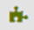 - Show process context: Opens a modal shown in section [Show letter data modal](/DD130-Detailed-Design/Process-Administration/2.2.2.2.1-show-event-content-modal) below. The icon is always shown because there will always be a created context on the process. The process context contains all data that the process has saved between its tasks and should extend the SimpleProcessContext java class.   Show application: Opens a modal shown in section [2.2.2.2.2](/DD130-Detailed-Design/Process-Administration#Show-letter-data-modal) below. The icon is only shown if the process is initiated via an application from self-service application. The application contains all data that the self-service flow has saved for the process to handle and should extend the AbstractAnsoegning java class.   Show technical error(s): Opens a modal shown in section [2.2.2.2.3] below. The icon is only shown if there is a registered at least one technical error connected to the process under its life cycle. This means that the number of errors shown in foot note 8 can still be 0 for this icon to be shown, as the process can for example have failed first with an error and afterwards been rerun without error. |
| 12        | Each row can be checked by clicking on the column, and all checked rows adds up to a list of processes that can be handled by performing an action. See 2.2.2.3 below for a complete list of possible actions that a user can be perform on the chosen process(es) simultaneously.                                                                                                                                                                                                                                                                                                                                                                                                                                                                                                                                                                                                                                                                                                                                                                                                                                                                                                                                                                                                                                                                                                                                                                                                                                                                                                                                                                                                                                                         |

#####	Show process context modal

This modal window, see Figure 4, gets popped up
when    icon is pressed for a
process on the process table.

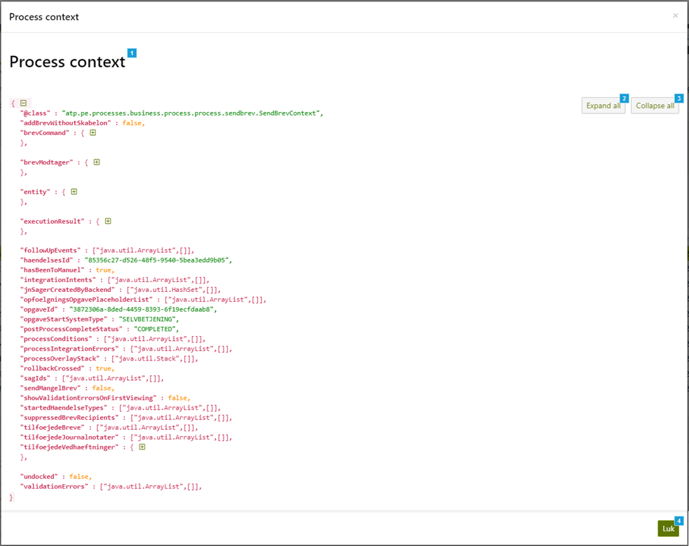

<h5>Figure 4 – Process administration – Show process context modal</h5>
 

| Foot Note | Note                                                                                                                                                                                                                                                                                                                                                                                                                                |
|-----------|-------------------------------------------------------------------------------------------------------------------------------------------------------------------------------------------------------------------------------------------------------------------------------------------------------------------------------------------------------------------------------------------------------------------------------------|
| 1         | The modal shows text in JSON format that illustrates the process context saved in the database containing a list of attributes holding various datatypes of information. The [+] and [-] icons indicates that the attribute is holding an object with a list of new attributes that also holds information. Each icon is clickable and will expand respectively collapse with hierarchical information for the chosen attribute. |
| 2         | All (and underlying) [+] expand, so that all information is visible.                                                                                                                                                                                                                                                                                                                                                                |
| 3         | All (and underlying) [-] collapse, so that as little information as possible is visible.                                                                                                                                                                                                                                                                                                                                            |
| 4         | The close (luk) button closes the modal window when pressed.                                                                                                                                                                                                                                                                                                                                                                        |

#####	Show application modal

This modal window gets popped up
when  icon is pressed for a
process on the process table.
The modal looks identical to the modal for process context, see
section [show event content modal](/DD130-Detailed-Design/Process-Administration#show-event-content-modal) above, but the
information is instead
based on the application (ansøgning) that is filled out via the self-service.

#####	Show technical error(s) modal

This modal window, see Figure 5, gets popped up
when  icon is pressed for a
process on the process table.

The modal contains a table of technical errors (tekniske fejl) connected to the process.

Typically, the oldest error is the root cause and the following errors after are automatic retries by the process
engine.

Each row is clickable. When a row is clicked, another modal window, Figure 6, will open to show the error message in
detail.

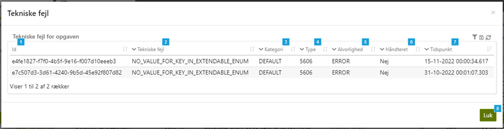

<h5>Figure 5 – Process administration – Show technical error(s) modal</h5>
 

| Foot Note | Note                                                                                                                                                                                                                                                                                                                                                                                                               |
|-----------|--------------------------------------------------------------------------------------------------------------------------------------------------------------------------------------------------------------------------------------------------------------------------------------------------------------------------------------------------------------------------------------------------------------------|
| 1         | The ID of the technical error (`teknisk fejl`) that is saved in the database.                                                                                                                                                                                                                                                                                                                                      |
| 2         | The title (`titel`) of the technical error. If the error is an instance of the enum class `ErrorCode`, then the name of the error will be shown, otherwise the default `UNEXPECTED_SYSTEM_ERROR` will be shown.                                                                                                                                                                                                 |
| 3         | The category (`kategori`) of the technical error. If the error is an instance of the enum class `ErrorCode`, then the category of the error will be shown, otherwise the default `UNEXPECTED_SYSTEM_ERROR` will be shown.                                                                                                                                                                                       |
| 4         | The type of the technical error. This is represented as a unique 4-digit code. If the error is an instance of the enum class `ErrorCode`, then the code of the error will be shown, otherwise the default `4009` will be shown.                                                                                                                                                                                 |
| 5         | The criticality (`alvorlighed`) of the technical error. If the error is an instance of the enum class `ErrorCode`, then the logging level of the error will be shown, otherwise if the error is neither an instance of the mentioned enum or the logging level of the error is not specified, the logging level will default to `SEVERE`, which translates to **ERROR** in this column.                         |
| 6         | Specifies if the error has been handled (`håndteret`) or not. Specifying **Yes** (`Ja`) or **No** (`Nej`). When a technical error is created it is not marked as handled. It can be set to handled via the error reports (`fejlrapporter`) tab in the administration page. This functionality is business related and is for the administrator to keep track of what errors has been manually solved or not. |
| 7         | Timestamp (including milliseconds) of when the technical error is created. The time zone is defaulted to Copenhagen, Europe.                                                                                                                                                                                                                                                                                       |
| 8         | The close (`luk`) button closes the modal window when pressed.                                                                                                                                                                                                                                                                                                                                                     |

This modal window, see Figure 6, gets shown when a row is clicked on the table in the Show technical error(s) modal, see
Figure 5.

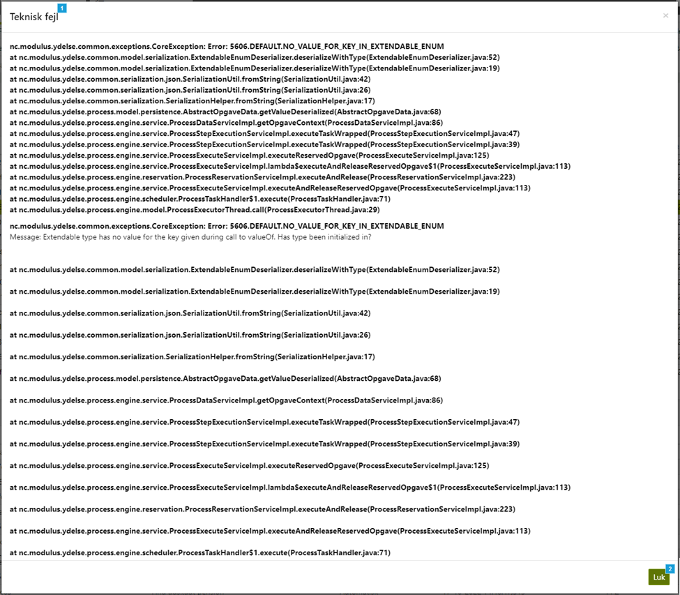

<h5>Figure 6 – Process administration – Error message modal</h5>
 

| Foot Note | Note                                                                                                                                                                                                                                                                                     |
|-----------|------------------------------------------------------------------------------------------------------------------------------------------------------------------------------------------------------------------------------------------------------------------------------------------|
| 1         | The modal shows the error message on the technical error. If the error regards an internal exception, the error message contains the root cause along with a filtered stack-trace, otherwise if the error regards an integration the error message contains the XML error or similar. |
| 2         | The close (`luk`) button returns the user to the **Show technical error(s)** modal, see Figure 5.                                                                                                                                                                                        |

#### Action buttons

On the process administration page, the user is presented action buttons to handle one or multiple checked process(es)
in the process table, see foot note 12 in Figure 3.

 Be extra careful with using these action buttons on PROD (production environment), as they will alter the state of the
processes. 

The field with action buttons, see Figure 7, is only shown when at least one process is checked in the process table.
When one of the action buttons is pressed, each checked process will have the corresponding action performed upon.

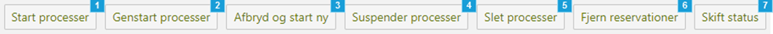

<h5>Figure 7 – Process administration – Action buttons</h5>
 

| Foot Note | Note                                                                                                                                                                                                                                                                                                                                                                                                                                                                                                                                                                    |
|-----------|-------------------------------------------------------------------------------------------------------------------------------------------------------------------------------------------------------------------------------------------------------------------------------------------------------------------------------------------------------------------------------------------------------------------------------------------------------------------------------------------------------------------------------------------------------------------------|
| 1         | **Start processes** (`Start processer`) button reserves and then executes the checked process(es) immediately from the current task that is to be picked up by the task handler and then executed by the process engine for each of the process(es) with a valid state, see [DD130 - Process Engine](/DD130-Detailed-Design/Process-Engine) for more info about process execution.                                                                                                                                                                                      |
| 2         | **Restart processes** (`Genstart processer`) button finds the first executed task for the checked process(es), reserves and then executes the process(es) immediately from that task with all data, e.g. process context, is preserved.                                                                                                                                                                                                                                                                                                                                 |
| 3         | **Abort and start new** (`Afbryd og start ny`) button lets the event handler pick up newly created process(es) based on the same event, by setting the checked process(es) to `ABORTED` status and the corresponding event(s) to `TILFOEJET` (added) status, see [DD130 - Process Engine](/DD130-Detailed-Design/Process-Engine) for more info about the engine execution workflow. This means that all the already processed data inside the old process, that isn’t persisted to the database, will be left behind and not moved to the newly created process(es). |
| 4         | **Suspend processes** (`Suspender processer`) button updates both the checked process(es) and the corresponding event(s) status to `SUSPENDED` and `IGANGSAT` (ongoing) respectively.                                                                                                                                                                                                                                                                                                                                                                                   |
| 5         | **Delete processes** (`Slet processer`) button updates both the checked process(es) and the corresponding event(s) status to `ABORTED` and `AFBRUDT` (aborted) respectively.                                                                                                                                                                                                                                                                                                                                                                                            |
| 6         | **Remove reservations** (`Fjern reservationer`) button nullifies any reservation on the checked process(es).                                                                                                                                                                                                                                                                                                                                                                                                                                                            |
| 7         | **Switch status** (`Skift status`) button opens a modal shown section [2.2.2.3.1] below to choose a process status to update the checked process(es) status and the corresponding event(s) status to. This functionality should be used with caution because switching status on the process might give consequences as the status is not set naturally by the process engine.                                                                                                                                                                                       |

#####	Switch status modal

This modal window, see Figure 8, gets popped up when Switch status (Skift status) button, see Figure 7, is pressed for
checked process(es) on the process table.

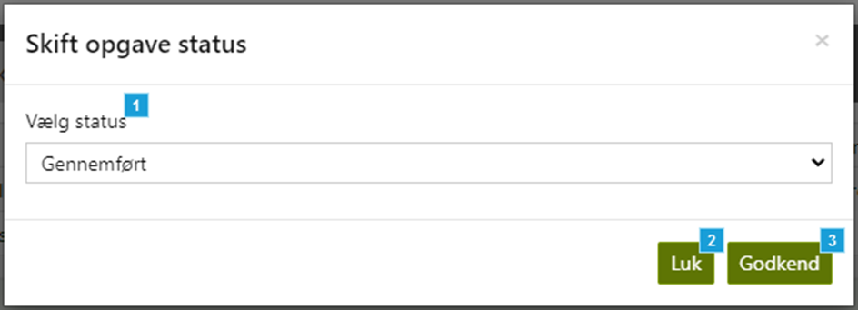

<h5>Figure 8 – Process administration – Switch status modal</h5>
 

| Foot note | Note                                                                                                                                                                                                                                                  |
|-----------|-------------------------------------------------------------------------------------------------------------------------------------------------------------------------------------------------------------------------------------------------------|
| 1         | The chose status (vælg status) dropdown lists all statuses in the enum class OpgaveStatus.Following table is a complete list between what is shown in the dropdown and what status the process(es) and the corresponding event(s) will be updated to: |
| 2	        | The close (luk) button closes the modal window when pressed without persisting any status for the checked process(es) and corresponding event(s).                                                                                                     |
| 3	        | The approve (godkend) button closes the modal window when pressed and persists the chosen status for the checked process(es) and corresponding event(s).                                                                                              |

| UI dropdown title                            | Process status             | Event status |
|----------------------------------------------|----------------------------|--------------|
| Aborted (`Afbrudt`)                          | `ABORTED`                  | `AFBRUDT`    |
| Completed (`Gennemført`)                     | `COMPLETED`                | `AFSLUTTET`  |
| Failed (`Fejlet`)                            | `FAILED`                   | `FEJLET`     |
| Failed integration (`Fejlet integration`)    | `FAILED_INTEGRATION`       |              |
| Attention required (`Opmærksomhed påkrævet`) | `ATTENTION`                |              |
| Every other title in dropdown                | Every other process status | `IGANGSAT`   |

#### Task table

On the process administration page, the user is presented an extra task table to get an overview over created tasks of a
process that is clicked in the process table, see Figure 3.

The listed tasks are by default sorted by the last changed (sidst ændret) column, with the latest changed task on top.

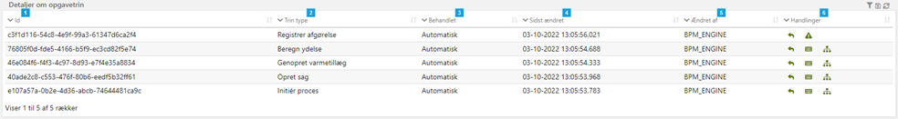

<h5>Figure 9 – Process administration – Task table</h5>
 

| Foot Note | Note                                                                                                                                                                                                                                                                                                                                                                                                                                                                                                                                                                                                                                                                                                                                                                                                                                                                                                                                                                                                                                                                                                                                                                                                                                                                                                                                                                                                                                                                                                                                                                                                                                                                                                                                                                                                                                                                                                                                                                                                       |
|-----------|------------------------------------------------------------------------------------------------------------------------------------------------------------------------------------------------------------------------------------------------------------------------------------------------------------------------------------------------------------------------------------------------------------------------------------------------------------------------------------------------------------------------------------------------------------------------------------------------------------------------------------------------------------------------------------------------------------------------------------------------------------------------------------------------------------------------------------------------------------------------------------------------------------------------------------------------------------------------------------------------------------------------------------------------------------------------------------------------------------------------------------------------------------------------------------------------------------------------------------------------------------------------------------------------------------------------------------------------------------------------------------------------------------------------------------------------------------------------------------------------------------------------------------------------------------------------------------------------------------------------------------------------------------------------------------------------------------------------------------------------------------------------------------------------------------------------------------------------------------------------------------------------------------------------------------------------------------------------------------------------------------|
| 1         | The unique ID in the database of the task.                                                                                                                                                                                                                                                                                                                                                                                                                                                                                                                                                                                                                                                                                                                                                                                                                                                                                                                                                                                                                                                                                                                                                                                                                                                                                                                                                                                                                                                                                                                                                                                                                                                                                                                                                                                                                                                                                                                                                                 |
| 2         | The task’s task type (`trin type`) in the database. Based on `OpgaveTrinType` enum class.                                                                                                                                                                                                                                                                                                                                                                                                                                                                                                                                                                                                                                                                                                                                                                                                                                                                                                                                                                                                                                                                                                                                                                                                                                                                                                                                                                                                                                                                                                                                                                                                                                                                                                                                                                                                                                                                                                                  |
| 3         | Specifies if the task is handled automatically or manually. Specifying **Automatic** (`Automatisk`) or **Manually** (`Manuelt`).                                                                                                                                                                                                                                                                                                                                                                                                                                                                                                                                                                                                                                                                                                                                                                                                                                                                                                                                                                                                                                                                                                                                                                                                                                                                                                                                                                                                                                                                                                                                                                                                                                                                                                                                                                                                                                                                           |
| 4         | Timestamp (including milliseconds) of when the task was last changed (`sidst ændret`) by an entity in the database. The time zone is defaulted to Copenhagen, Europe.                                                                                                                                                                                                                                                                                                                                                                                                                                                                                                                                                                                                                                                                                                                                                                                                                                                                                                                                                                                                                                                                                                                                                                                                                                                                                                                                                                                                                                                                                                                                                                                                                                                                                                                                                                                                                                      |
| 5         | The ID of the entity that the task last time was changed by (`ændret af`) in the database. It is usually set to a user’s initials, such as a case worker, but it can be set to `BPM_ENGINE` if the process was processed without human interaction.                                                                                                                                                                                                                                                                                                                                                                                                                                                                                                                                                                                                                                                                                                                                                                                                                                                                                                                                                                                                                                                                                                                                                                                                                                                                                                                                                                                                                                                                                                                                                                                                                                                                                                                                                     |
| 6         | List of actions represented by icons, that gets shown depending on certain conditions based on the related task that can help the developer to identify the reason why the process failed. They are as follow:   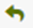 **Go to task** (`gå til trin`), also called "rerun from task": Lets the user to restart the process from the chosen task where this icon is pressed. It functions like the restart processes action button in section [Action buttons](/DD130-Detailed-Design/Process-Administration#Action-buttons), but from a chosen task instead of the first. It creates an event of type `RERUN_FROM_TASK`, which is then picked up by the process engine, which reruns the process for the given task . The icon is only shown if the corresponding process’s status is not `COMPLETED`. -  **Show command**: Opens a modal shown in section 2.2.2.4.1 below. The icon is only shown if the task has command data. The command object contains all data that has been manually inputted by a user via the task and should extend the `SimpleOpgaveCommand` java class. Back up version is ignored. -   **Show trin view data**: Opens a modal shown in section 2.2.2.4.2 below. The icon is only shown if the task has trin view data. The trin view data object contains all data that is usually constant (and isn’t depending on input from the user) and should extend the `TrinViewData` java class. Back up version is ignored.   **Show technical error**: Opens a modal shown in section 2.2.2.4.3 below. The icon is only shown if there is a registered at least one technical error connected to the task. |

##### Show command modal

This modal window gets popped up
when 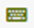 is pressed for a
process on the task table.
The modal looks identical to the modal for process context, see
section [show event content modal](/DD130-Detailed-Design/Process-Administration#show-event-content-modal) above, but the
information is instead
based on the command object that is filled out via the specific task.

##### Show trin view data modal

This modal window gets popped up
when  is pressed for a
process on the task table.
The modal looks identical to the modal for process context, see
section [show event content modal](/DD130-Detailed-Design/Process-Administration#show-event-content-modal) above, but the
information is instead
based on the trin view data object that is filled out via the specific task.

##### Show error message modal

This modal window gets popped up
when  is pressed for a
process on the task table.
The modal looks identical to the modal for process context, see Figure 6, but the error is specifically connected to the
task.

### Technical description

The command model object, `ProcessTaskAdminCommand`, for the process administration use common logic with the event
administration command model object, `ProcessEventAdminCommand`. They both share entity ID (either for person or
company), and from and to dates in the `ProcessAdminCommonCommand`, that can be input in their search field.
The process and event administration controllers also share logic via the service interface,
`ProcessCommonAdminService`. This enables common input validation and searching/filtering since events and processes are
tightly connected.
Note that the urls for the action buttons **Start processes** and **Restart processes** that is used in the process
administration can also be accessed via the bulk actions in the search page. The difference is that the bulk actions
don’t use the requested parameter `opgaveIds` and the bulk actions create bulk events `RESUME_OPGAVE` and
`RESTART_OPGAVE` respectively that is immediately executed.
Lastly, the util interface `ProcessAdminQueries` is provided with a translated implementation of every custom query used
in the process and event administration for each configurated database driver type: PostgreSQL and Oracle.

## Event administration

This section describes the event administration tab, so called Events (`Hændelser`, or singular `Hændelse`), but for now
on we will call it event administration.
An event is something that happens in the system and could either be generated manually or automatically. The generated
event can trigger processes via system parameters called event subscriptions (`hændelsesabonnementer`, or singular
`hændelsesabonnement`), more about how events and event subscriptions work can be read
in [DD130 - Process Engine](/DD130-Detailed-Design/Process-Engine).
Much like the process administration tab is a tool for handling and get an overview over processes, the event
administration tab is a tool for handling and searching for events.

### Vocabulary

This section contains a vocabulary of terms introduced in this document’s section, that isn’t already described
in [DD130 - Process Engine](/DD130-Detailed-Design/Process-Engine) vocabularies.

### Vocabulary

This section contains a vocabulary of terms introduced in this document’s section, that isn’t already described
in [DD130 - Process Engine](/DD130-Detailed-Design/Process-Engine) vocabularies.

| Danish business term | English term | Description                                                                                                                            |
|----------------------|--------------|----------------------------------------------------------------------------------------------------------------------------------------|
| Hændelsestype        | Event type   | Each event has a unique type that the process engine can relate to and associate with an event subscription.                           |
| Hændelsestatus       | Event status | At any given time, an event is assigned an event status, that indicates where the event is currently in the engine execution workflow. |

### User interface

In this section the user interface of the event administration is described along with a high-level description of each
component, button etc. See section [Technical description](/DD130-Detailed-Design/Process-Administration#Technical-description)
above for info about common modal object, service interface and query util with
process administration. Each supported component is further decomposed and described in this section’s undersections.

When entering the event administration page, the user will be presented the user interface as seen in Figure 10, but
with only the search field and event table components shown.

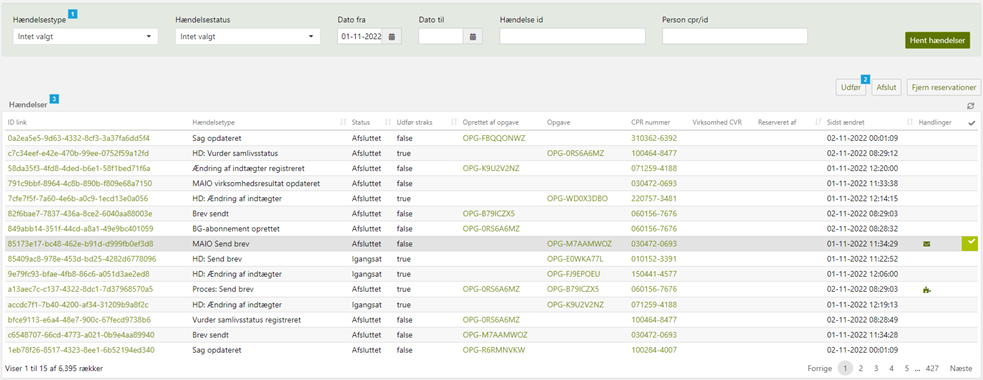

<h5>Figure 10 – Event administration – Overview</h5>
 

| Foot Note | Note                                                                                                                                                                                                |
|-----------|-----------------------------------------------------------------------------------------------------------------------------------------------------------------------------------------------------|
| 1         | Search field containing input fields to filter the events shown in the event table (see foot note 3).                                                                                               |
| 2         | Action buttons to handle one or multiple chosen event(s) in the event table (see foot note 3).                                                                                                      |
| 3         | The event table containing information and links to relevant pages in the business (`fagsystem`) app about each returned event meeting the search criteria from the search field (see foot note 1). |

#### Search field

On the event administration page, the user is presented a search button and a row of input fields, where each field
corresponds to a search criterion for returning desired event in the event table. A closer look at the search field can
be seen in Figure 11.

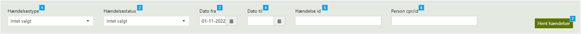

<h5>Figure 11 – Event administration – Search field</h5>
 

| Foot Note | Note                                                                                                                                                                                                                                                                                                                                                                                                                                                                                                                                                                                                                                                                |
|-----------|---------------------------------------------------------------------------------------------------------------------------------------------------------------------------------------------------------------------------------------------------------------------------------------------------------------------------------------------------------------------------------------------------------------------------------------------------------------------------------------------------------------------------------------------------------------------------------------------------------------------------------------------------------------------|
| 1         | The event type (`hændelsestype`) search field is a multiselect dropdown that lets the user choose no, one or multiple event type(s) that should be included in the event search when the button is pressed (see foot note 7). The field is populated with the title of every event type in the system. Based on `HaendelseType` enum class. When entering the event administration page, the field doesn’t have any chosen event type by default.                                                                                                                                                                                                             |
| 2         | The event status (`hændelsestatus`) search field is a multiselect dropdown that lets the user choose no, one or multiple event status(es) that should be included in the event search when the button is pressed (see foot note 7). The field is populated with the title of every event status in the system. Based on `HaendelseStatus` enum class. When entering the event administration page, the field doesn’t have any chosen event status by default.                                                                                                                                                                                                 |
| 3         | The from date (`dato fra`) search field is a date field that lets the user choose no or one date that should be included in the event search when the button is pressed (see foot note 7). The event search includes events that got changed in the database on or after the chosen date. When entering the event administration page, the field have today’s date chosen by default.                                                                                                                                                                                                                                                                         |
| 4         | The to date (`dato til`) search field is a date field that lets the user choose no or one date that should be included in the event search when the button is pressed (see foot note 7). The event search includes events that got changed in the database before the chosen date. When entering the event administration page, the field doesn’t have any chosen date by default.                                                                                                                                                                                                                                                                            |
| 5         | The event id (`hændelse id`) search field is a character field that lets the user write no or one event id that should be included in the event search when the button is pressed (see foot note 7). When entering the event administration page, the field is empty by default.                                                                                                                                                                                                                                                                                                                                                                                 |
| 6         | The person cpr/id search field is a character field that lets the user write no or one person/company cpr/id that should be included in the event search when the button is pressed (see foot note 7). If the field isn’t empty, the event search includes only events that is connected to an entity, that is either a person or a company. The entity’s ID in the database need to be identical to the field. If the entity is a person, the event search includes CPRs (=security number with format ‘ddmmyy-xxxx’, where ‘-’ can be left out) that is identical to the field. When entering the event administration page, the field is empty by default. |
| 7         | When the fetch events (`hent hændelser`) button is pressed. The page performs a new event search based on the current values in the search fields and shows the result in the event table. Every valid, non-empty search field value get appended to the total search criteria. In other words, an event must meet every criterion that each search field adds.                                                                                                                                                                                                                                                                                                  |

#### Event table

On the event administration page, the user is presented event table containing a list of events that fulfils the
criteria given from the search fields, see
section [2.2.2.1.](/DD130-Detailed-Design/Process-Administration#2.2.2.1-Search-field) Each row in the table is an event
registered in the system’s
database. What columns the table contains an example on how the information can look like is seen in Figure 12.

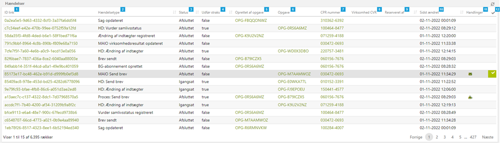

<h5>Figure 12 – Event administration – Event table</h5>
 

| Foot Note | Note                                                                                                                                                                                                                                                                                                                                                                                                                                                                                                                                                                                                                                                                                                                                                                                                                                                                                                                                                                                                                                                                                                                                          |
|-----------|-----------------------------------------------------------------------------------------------------------------------------------------------------------------------------------------------------------------------------------------------------------------------------------------------------------------------------------------------------------------------------------------------------------------------------------------------------------------------------------------------------------------------------------------------------------------------------------------------------------------------------------------------------------------------------------------------------------------------------------------------------------------------------------------------------------------------------------------------------------------------------------------------------------------------------------------------------------------------------------------------------------------------------------------------------------------------------------------------------------------------------------------------|
| 1         | The unique ID in the database of the event. By clicking the link, the page will open a new browser for the user with the url to the event in the business app’s entity overview page.                                                                                                                                                                                                                                                                                                                                                                                                                                                                                                                                                                                                                                                                                                                                                                                                                                                                                                                                                      |
| 2         | The event’s event type (`hændelsestype`) in the database. Based on `HaendelseType` enum class.                                                                                                                                                                                                                                                                                                                                                                                                                                                                                                                                                                                                                                                                                                                                                                                                                                                                                                                                                                                                                                                |
| 3         | Reflects the event’s current event status (`hændelsestatus`) in the database. Based on `HaendelseStatus` enum class.                                                                                                                                                                                                                                                                                                                                                                                                                                                                                                                                                                                                                                                                                                                                                                                                                                                                                                                                                                                                                          |
| 4         | Specifies if the event is scheduled in the prioritized queue or not. Specifying **true** or **false**, where the value **true** means that the event should be executed immediately (`udfør straks`). See [DD130 - Process Engine](/DD130-Detailed-Design/Process-Engine) for more info about event handler and scheduled tasks.                                                                                                                                                                                                                                                                                                                                                                                                                                                                                                                                                                                                                                                                                                                                                                                                              |
| 5         | The unique key for what process that created the event (`oprettet af opgave`), if any. By clicking the link, the page will open a new browser for the user with the url to the process in the business app’s entity overview page.                                                                                                                                                                                                                                                                                                                                                                                                                                                                                                                                                                                                                                                                                                                                                                                                                                                                                                         |
| 6         | The unique key for what process that the event created, if any. By clicking the link, the page will open a new browser for the user with the url to the process in the business app’s entity overview page.                                                                                                                                                                                                                                                                                                                                                                                                                                                                                                                                                                                                                                                                                                                                                                                                                                                                                                                                |
| 7         | This column is only filled out if the event’s corresponding connected entity is a person. It shows the person’s unique CPR number (=security number with format ‘ddmmyy-xxxx’) in the database. By clicking the link, the page will open a new browser for the user with the url to the person in the business app’s person overview page.                                                                                                                                                                                                                                                                                                                                                                                                                                                                                                                                                                                                                                                                                                                                                                                                 |
| 8         | This column is only filled out if the event’s corresponding connected entity is a company. It shows the company’s unique CVR number (=security number with format) in the database. By clicking the link, the page will open a new browser for the user with the url to the company in the business app’s company overview page.                                                                                                                                                                                                                                                                                                                                                                                                                                                                                                                                                                                                                                                                                                                                                                                                           |
| 9         | ID of entity reserving the event. See [DD130 - Process Engine](/DD130-Detailed-Design/Process-Engine) for more info about reservation of events.                                                                                                                                                                                                                                                                                                                                                                                                                                                                                                                                                                                                                                                                                                                                                                                                                                                                                                                                                                                              |
| 10        | Timestamp (including milliseconds) of when the event was last changed by an entity. The time zone is defaulted to Copenhagen, Europe.                                                                                                                                                                                                                                                                                                                                                                                                                                                                                                                                                                                                                                                                                                                                                                                                                                                                                                                                                                                                         |
| 11        | List of actions represented by icons, that gets shown depending on certain conditions based on the related event. They are as follow:   **Show event content**: Opens a modal shown in section [show event content modal](/DD130-Detailed-Design/Process-Administration#show-event-content-modal) below. The icon is only shown if the event has event data (`hændelsesdata`). The event content contains all data that a created process by the event could utilize, where the data itself could be any serialized text.   **Show letter data**: Opens a modal shown in section [Show letter data modal](/DD130-Detailed-Design/Process-Administration#Show-letter-data-modal) below. The icon is only shown if the event has letter data (`brevdata`) connected to the event. The letter data contains all data that a created process by the event could utilize specifically to merge letter(s), where the letter data should extend the `Brevdata` java class. |
| 12        | Each row can be checked by clicking on the column, and all checked rows adds up to a list of events that can be handled by performing an action. See 2.2.2.3 below for a complete list of possible actions that a user can perform on the chosen event(s) simultaneously.                                                                                                                                                                                                                                                                                                                                                                                                                                                                                                                                                                                                                                                                                                                                                                                                                                                                     |

##### Show event content modal

This modal window gets popped up
when  icon is pressed for an
event on the event table.

The modal looks identical to the modal for process context, see
section [show event content modal](/DD130-Detailed-Design/Process-Administration#show-event-content-modal) above, but the
information is instead based on the event context that is filled out when the event is created.

##### Show letter data modal

This modal window gets popped up
when    icon is pressed for an
event on the event table.

The modal looks identical to the modal for process context, see
section [show event content modal](/DD130-Detailed-Design/Process-Administration#show-event-content-modal) above, but the
information is instead based on the letter data object that is filled out when the event is created.

#### Action buttons

On the event administration page, the user is presented action buttons to handle one or multiple checked event(s) in the
event table, see foot note 12 in Figure 12.

The field with action buttons, see Figure 13, is only shown when at least one event is checked in the event table. When
one of the action buttons is pressed, each checked event will have the corresponding action performed upon.

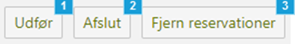

<h5>Figure 13 – Event administration – Action buttons</h5>
 

| Foot Note | Note                                                                                                                                                                                                                                                                                                                                                                                                                                                                                                                                                                                                                                                                                                                                                                                                                                                                  |
|-----------|-----------------------------------------------------------------------------------------------------------------------------------------------------------------------------------------------------------------------------------------------------------------------------------------------------------------------------------------------------------------------------------------------------------------------------------------------------------------------------------------------------------------------------------------------------------------------------------------------------------------------------------------------------------------------------------------------------------------------------------------------------------------------------------------------------------------------------------------------------------------------|
| 1         | **Execute** (`Udfør`) button switches the status for the checked event(s) to `TILFOEJET` (added) and puts it into the prioritized queue for execution by setting `strakseksekver` (immediate execution) on the event to true. If the number of chosen events is less or equal to 10, then the button reserves and then executes the checked event(s) immediately by directly calling the event handler. Otherwise, if the number of chosen events is greater than 10, then the event(s) will be picked up by the event handler the usual way via scheduling, see [DD130 - Process Engine](/DD130-Detailed-Design/Process-Engine) for more info about the event handler and the engine execution workflow. Please note that the event handler won’t pick up the chosen event(s) and create processes if not the corresponding event subscriptions are activated. |
| 2         | **Finish** (`Afslut`) button switches the status for the checked event(s) to `AFSLUTTET` (finished).                                                                                                                                                                                                                                                                                                                                                                                                                                                                                                                                                                                                                                                                                                                                                                  |
| 3         | **Remove reservations** (`Fjern reservationer`) button nullifies any reservation on the checked event(s).                                                                                                                                                                                                                                                                                                                                                                                                                                                                                                                                                                                                                                                                                                                                                             |

## BPMN-diagram viewing

The administration tab processes (`processer`) purpose is to give the user an overview of the system’s processes and the
connected tasks via BPMN-diagram (Business Process Model and Notation diagram). The whole tab is in read only mode and
cannot change anything in the system, but only present results.

### Vocabulary

This section contains a vocabulary of terms introduced in this document’s section, that isn’t already described
in [DD130 - Process Engine](/DD130-Detailed-Design/Process-Engine) vocabularies.

| Danish business term | English term    | Description                                                                                                                                                                                                                                                       |
|----------------------|-----------------|-------------------------------------------------------------------------------------------------------------------------------------------------------------------------------------------------------------------------------------------------------------------|
| Beskedskabelon       | Letter template | Letter templates are documents primarily used by case workers to create letters in a standardized way. A letter template can for example contain other smaller templates, automatic filled data, or static text.                                                  |
| Regelark             | Rule sheet      | Rule sheets are used widely in the processes and the process engine in various ways to structure flows, validation, calculations etc. It is a powerful tool to categorize conditions and outcomes.                                                                |
| Journalnotat         | Journal note    | Journal note templates are documents primarily used by case workers to create journal notes in a standardized way. These are just as they sound like notes for other case workers to see why the case worker made the decision they made, things to remember etc. |

### User interface

In this section the user interface of the BPMN-diagram viewing page is described along with a high-level description of
each component, button etc. Each supported component is further decomposed and described in this section’s
undersections.
When entering the BPMN-diagram viewing page, the user will be presented the user interface as seen in Figure 14, but
with only the unchecked search field component shown.

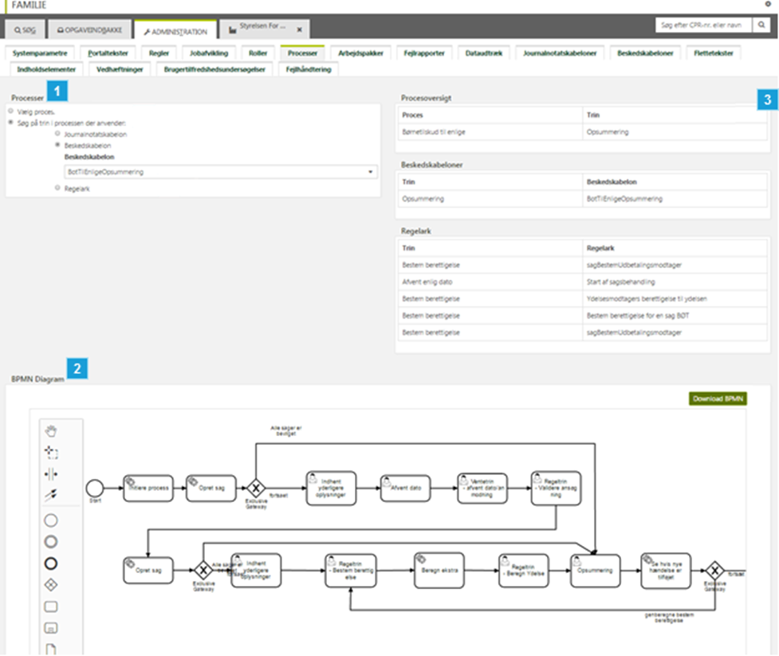

<h5>Figure 14 – BPMN-diagram viewing – Overview</h5>
 

| Foot Note | Note                                                                                                                                                                                                                                                                                                                                                                                                                                  |
|-----------|---------------------------------------------------------------------------------------------------------------------------------------------------------------------------------------------------------------------------------------------------------------------------------------------------------------------------------------------------------------------------------------------------------------------------------------|
| 1         | Search field containing input fields to show a process’s BPMN-diagram (see foot note 3) and connected templates and sheets (see foot note 2).                                                                                                                                                                                                                                                                                         |
| 2         | Contains three simple tables that lists all the following depending on the tasks that is meeting the search criteria from the search field (see foot note 1): - Connected process for the specified tasks that is listed in one of the tables below. - Connected letter templates (`beskedskabeloner`), that can be sent via a specified task. - Connected rule sheets (`regelark`), that is evaluated for a specified task. |
| 3         | The process BPMN-diagram containing information about the structure and flow of the process that is meeting the search criteria from the search field (see foot note 1).                                                                                                                                                                                                                                                              |

#### Search field

On the BPMN-diagram viewing page, the user is presented multiple radio buttons and a dropdown depending on what radio
button combination that is chosen. The chosen value of a dropdown determines the search criteria for returning desired
process’s BPMN-diagram and template and sheet tables. A closer look at the search field can be seen in Figure 15 and
Figure 16.

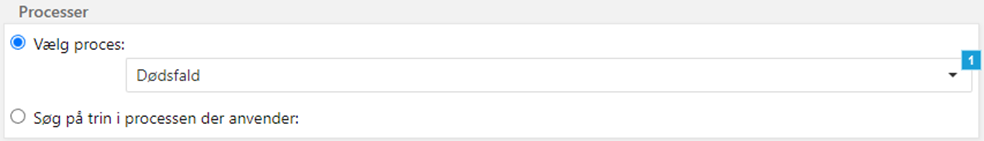

<h5>Figure 15 – BPMN-diagram viewing – Search field – Choose process</h5>
 

| Foot Note | Note                                                                                                                                                                                                                                                                                                                                                                                                                                                                                                                                |
|-----------|-------------------------------------------------------------------------------------------------------------------------------------------------------------------------------------------------------------------------------------------------------------------------------------------------------------------------------------------------------------------------------------------------------------------------------------------------------------------------------------------------------------------------------------|
| 1         | The dropdown is only chosen if the radio button “Choose process” (`Vælg proces`) is chosen. The dropdown populated with all processes that extend `OpgaveType` enum class. If a process is chosen in the dropdown, then the BPMN-diagram (see section [BPMN diagram](/DD130-Detailed-Design/Process-Administration#BPMN-diagram) below) and the overview tables (see section [Overview tables](/DD130-Detailed-Design/Process-Administration#Overview-tables) below) are refreshed with data depending on the chosen process. |

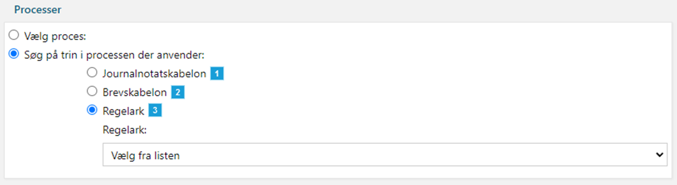

<h5>Figure 16 – BPMN-diagram viewing – Search field – Choose template or sheet</h5>
 

| Foot Note | Note                                                                                                                                                                                                                                                                                                                                                                                                                                                                                                                                                                                                                                                                                                                                                                                                                                                                                     |
|-----------|------------------------------------------------------------------------------------------------------------------------------------------------------------------------------------------------------------------------------------------------------------------------------------------------------------------------------------------------------------------------------------------------------------------------------------------------------------------------------------------------------------------------------------------------------------------------------------------------------------------------------------------------------------------------------------------------------------------------------------------------------------------------------------------------------------------------------------------------------------------------------------------|
| 1         | The dropdown is only chosen if both the radio buttons “Søg på trin i processen der anvender” (Search on tasks in the process that uses) and “Journalnotatskabelon” (journal note template) are chosen. The dropdown populated with all journal note template instances from the system parameter type `journalnotat` that is valid on today’s date. The journal note templates are shown in a group hierarchical structure that each journal note template may be assigned. If a journal note template is chosen in the dropdown, then the BPMN-diagram remains untouched (see section [BPMN diagram](/DD130-Detailed-Design/Process-Administration#BPMN-diagram) below) meanwhile the overview tables (see section [Overview tables](/DD130-Detailed-Design/Process-Administration#Overview-tables) below) are refreshed with data depending on the chosen journal note template. |
| 2         | The dropdown is only chosen if both the radio buttons “Søg på trin i processen der anvender” (Search on tasks in the process that uses) and “Brevskabelon” (letter template) are chosen. The dropdown populated with all journal letter template instances from the system parameter type `beskedskabelon` that is valid on today’s date. The letter templates are shown in a group hierarchical structure that each letter template may be assigned. If a letter template is chosen in the dropdown, then the BPMN-diagram remains untouched (see section [BPMN diagram](/DD130-Detailed-Design/Process-Administration#BPMN-diagram) below) meanwhile the template and sheet tables (see section [Overview tables](/DD130-Detailed-Design/Process-Administration#Overview-tables) below) are refreshed with data depending on the chosen letter template.                         |
| 3         | The dropdown is only chosen if both the radio buttons “Søg på trin i processen der anvender” (Search on tasks in the process that uses) and “Regelark” (rule sheet) are chosen. The dropdown populated with all rule sheet instances from the system parameter type `regler` that is valid on today’s date. If a rule sheet is chosen in the dropdown, then the BPMN-diagram remains untouched (see section [BPMN diagram](/DD130-Detailed-Design/Process-Administration#BPMN-diagram) below) meanwhile the overview tables (see section [Overview tables](/DD130-Detailed-Design/Process-Administration#Overview-tables) below) are refreshed with data depending on the chosen rule sheet.                                                                                                                                                                                       |

#### Overview tables

On the BPMN-diagram view page, the user is presented overview tables containing a list of tasks that fulfils the
criteria given from the search field, see
section [Search field](/DD130-Detailed-Design/Process-Administration#Search-field).

The tables, see Figure 17, are only shown when a value in a dropdown in the search field is chosen, where the content of
the tables react differently dependent on what dropdown in the search field is used.

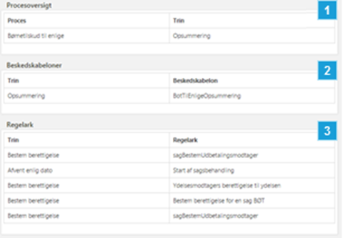

<h5>Figure 17 – BPMN-diagram viewing – Overview tables</h5>
 

| Foot Note | Note                                                                                                                                                                                                                                                                                                                                                                                                                                                                                                                                                                                                                                                                                                                                                                                                                                                                                 |
|-----------|--------------------------------------------------------------------------------------------------------------------------------------------------------------------------------------------------------------------------------------------------------------------------------------------------------------------------------------------------------------------------------------------------------------------------------------------------------------------------------------------------------------------------------------------------------------------------------------------------------------------------------------------------------------------------------------------------------------------------------------------------------------------------------------------------------------------------------------------------------------------------------------|
| 1         | The process overview (`procesoversigt`) table presents a list of tasks (`trin`) connected with either a journal note template, letter template or rule sheet. Right column shows the task type and the corresponding process type on the left column. This table is not shown if a process is chosen in the process dropdown located in the search field, see section [Search field](/DD130-Detailed-Design/Process-Administration#Search-field). If either a letter template, rule sheet or journal note template is chosen in the corresponding dropdown located in the search field, see section [Search field](/DD130-Detailed-Design/Process-Administration#Search-field), then all tasks (disregarding connected process) connected with the chosen template/sheet is shown.                                                                                          |
| 2         | The letter template overview table presents a list of tasks (`trin`) connected with a letter template on the `OpgaveTrinType` enum class. Left column shows the task type and the corresponding letter template title (fetched from the system parameter instance) on the right column. If a process is chosen in the process dropdown located in the search field, see section [Search field](/DD130-Detailed-Design/Process-Administration#Search-field), then all connected tasks with a connected letter template is shown. If a letter template is chosen in the letter template dropdown located in the search field, see section [Search field](/DD130-Detailed-Design/Process-Administration#Search-field), then all tasks (disregarding connected process) connected with the chosen letter template is shown. The remaining dropdowns don’t affect this table. |
| 3         | The rule sheet overview table presents a list of tasks (`trin`) connected with a rule sheet on the `OpgaveTrinType` enum class. Left column shows the task type and the corresponding rule sheet title (fetched from the system parameter instance) on the right column. If a process is chosen in the process dropdown located in the search field, see section [Search field](/DD130-Detailed-Design/Process-Administration#Search-field), then all connected tasks with a connected rule sheet is shown. If a rule sheet is chosen in the rule sheet dropdown located in the search field, see section [Search field](/DD130-Detailed-Design/Process-Administration#Search-field), then all tasks (disregarding connected process) connected with the chosen rule sheet is shown. The remaining dropdowns don’t affect this table.                                    |

#### BPMN-diagram

On the BPMN-diagram view page, the user is only presented the BPMN-diagram of a process, if the process in question is
the chosen process in the dropdown located in the search field, see
section [Search field](/DD130-Detailed-Design/Process-Administration#Search-field).
The BPMN-diagram offers information to get an overview of the process, where its tasks, conditions and structure is
shown. See [DD130 - Process Engine](/DD130-Detailed-Design/Process-Engine) for more info about BPMN diagrams and how to
interpret/use them.

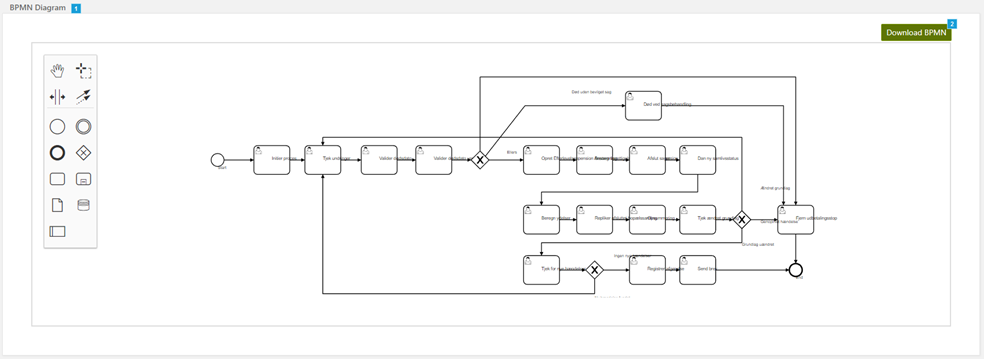

<h5>Figure 18 – BPMN-diagram viewing – BPMN-diagram</h5>
 

| Foot Note | Note                                                                                                                                                                                                    |
|-----------|---------------------------------------------------------------------------------------------------------------------------------------------------------------------------------------------------------|
| 1         | Shows an interactive Camunda BPMN modeler window of the BPMN-diagram for the chosen process.                                                                                                            |
| 2         | Downloads a “.xml” file locally with the original BPMN-diagram of the chosen process, that can be loaded in a Camunda BPMN modeler locally. Where the name of the file is the name of the process type. |

## Throttling status

The administration tab process engine (`procesmotor`) is a tool for easy access to check the throttling status.

### User interface

In this section the user interface of the throttler status page is described along with a high-level description of each
component, button etc.

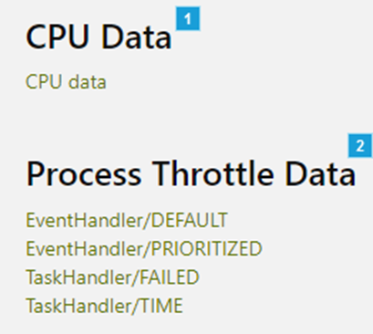

<h5>Figure 19 – Throttling status</h5>
 

| Foot Note | Note                                                                                                                                                                                                                                                                                                                                                                                                                                                                                                                                                         |
|-----------|--------------------------------------------------------------------------------------------------------------------------------------------------------------------------------------------------------------------------------------------------------------------------------------------------------------------------------------------------------------------------------------------------------------------------------------------------------------------------------------------------------------------------------------------------------------|
| 1         | The link under the header “CPU Data” opens a modal that looks identical to the modal for process context, see section [show event content modal](/DD130-Detailed-Design/Process-Administration#show-event-content-modal) above, but the information is instead just a list with 600 samples of how many percentages of the CPU’s total data load is used immediately after the link is clicked.                                                                                                                                                              |
| 2         | Under the header “Process Throttle Data” is a group of links sorted by name and created for each configurated `ProcessThrottleData`, where the link is named after the name that is set when initialising the class. Each link opens a modal that looks identical to the modal for process context, see section [show event content modal](/DD130-Detailed-Design/Process-Administration#show-event-content-modal) above, but the information is instead a list of dumped attributes from the chosen throttle data immediately after the link is clicked. |

# Component model

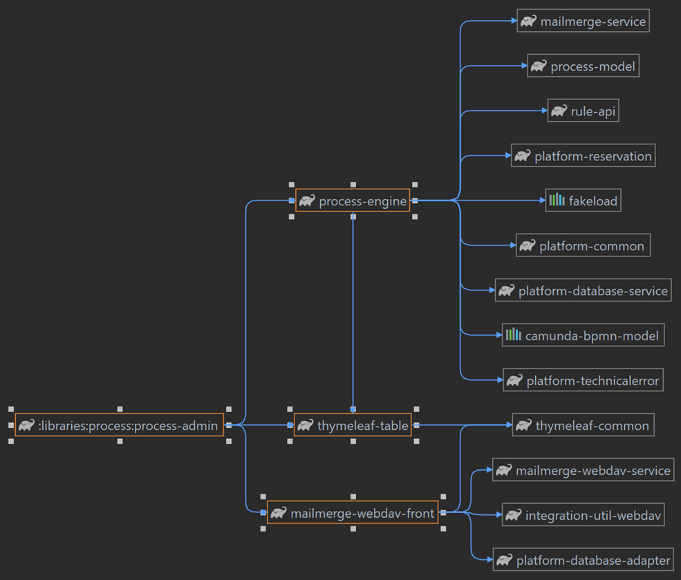

<h5>Figure 20 – Component model of Process administration API, which contains all the annotations</h5>
 

