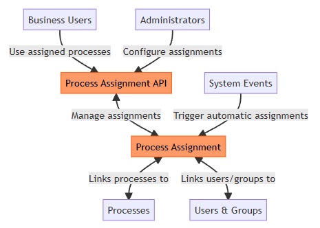
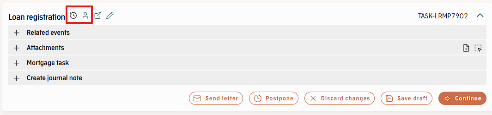
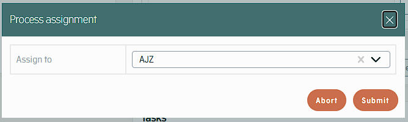
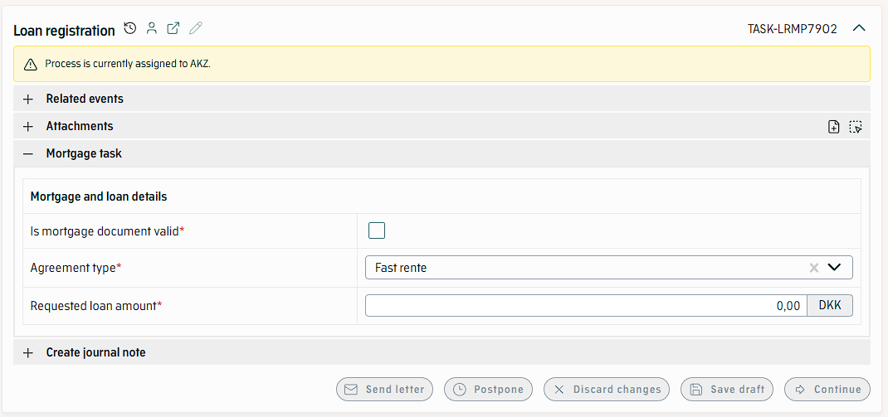
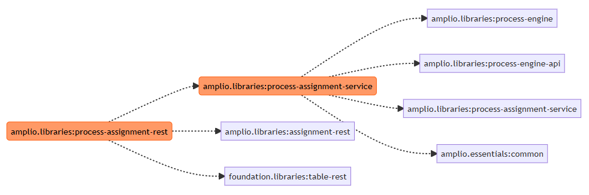

# References

| Reference                                | Author         |
|------------------------------------------|----------------|
| [DD130 - Assignment][ASSIGNMENT]         | Netcompany A/S |
| [DD130 - Process-engine][PROCESS_ENGINE] | Netcompany A/S |

<!-- =============== -->
<!-- REFERENCE LINKS -->
<!-- =============== -->

<!-- Deliverables references -->

[ASSIGNMENT]: /DD130-Detailed-Design/Assignment

[PROCESS_ENGINE]: /DD130-Detailed-Design/Process-Engine

# Introduction

This document describes the Process Assignment feature which allows users, coordinators or administrators in Amplio systems to assign processes to users, user
groups, teams or similar structures depending on their business needs. The feature is optional and needs to be explicitly included to function.

When assignment is activated, any user that is not currently holding an assignment to a process will typically not be able to work on the process, however, the
feature is very flexible and the behavior is dependent no project implementation.

##	Target audience

This document is intended for:

- Developers who need to understand the Process Assignment feature and how Assignment is implemented in the process engine.
- Developers who need a reference for implementing the Process Assignment feature in their project.
- Tender-writers who need information about the Process Assignment feature.
- Projects intending to use or designing features using the Process Assignment feature.

##	Developer requirements

Developers reading this document should have:

1. A good understanding of the Assignment feature described in [DD130 - Assignment][ASSIGNMENT].
2. General understanding of Spring beans and Java.

## Background information

Process Assignment is a completely optional feature that allows granular control of which users in a system that can make changes to processes both as form for
restriction and for workload coordination. This means that the feature has two main use cases or scenarios where it should be considered.

1. Systems where coordinators, administrators, managers or similar need a way to assign processes or tasks to other users or user groups in the system.
2. Systems where there are requirements that only specific users to process specific tasks or specific processes.

In practice however, both reasons to use the feature typically occur in the same project.

Assignment of a process can be done either automatically by the system when different events are triggered in the system, (e.g. on process creation or when a
process reaches a specific task), or by users through REST APIs e.g. from the process engine component or administrative bulk action,

Whether a user is considered to hold the assignment is defined by the project implementation and can vary depending on business needs. the two most common
examples is that the user is a member of the group that holds the assignment, or the user itself holds the assignment directly.

# High level description of the component

The Process Assignment feature allows more granular control of processes in the Amplio processing engine by providing control over which users can access and
modify specific processes. This serves both as a security measure and a workload distribution mechanism that can be customized to organizational requirements.

The feature supports both manual and automatic assignment methods. Manual assignment gives administrators control through an API, allowing them to assign
processes based on roles, expertise, availability, or organizational structure. The automatic assignment responds to events in the system such as process
creation, processes reaching a specific task or status changes allowing assignment based on predefined rules without manual intervention.


<!-- MERMAID SOURCE FILE -->
<!-- ./.attachments/Process-Assignment/mermaid-source-files/high-level-description.md -->

As shown in the diagram, the Process Assignment feature links processes to users and groups through a central assignment mechanism. The Process Assignment API
provides the interface for both administrators configuring assignments and users accessing their assigned processes, while system events can trigger automatic
assignments.

# Introduction to the subject

## Assignment

This chapter introduces the main concepts, terminology and components used in this document. For more information about this topic,
see [DD130 - Assignment][ASSIGNMENT].

1. **Assignable** - An **Assignable** is any object that follows the `Assignable` contract defined in the Assignment framework.
   See [DD130 - Assignment][ASSIGNMENT].
1. **Assignee** - The owner of an assignment. See [DD130 - Assignment][ASSIGNMENT].
1. **Assigner** - The creator of an assignment. See [DD130 - Assignment][ASSIGNMENT].
1. **Assignment** - The **Assignment** is an object that describes the relationship between a target object, the `Assignable`, and the holder of the assignment,
   the
   **Assignee**. It further includes information about the start of the assignment and potentially the entity initiating the assignment.
   See [DD130 - Assignment][ASSIGNMENT].
1. **AssignableProcess** - The specific implementation of `Assignable` used in the Process Assignment feature. It has the additional constraint that the target
   needs to extend the `AbstractProcess` class from the Amplio Process Engine framework.

## Process Assignment Overview

The Process assignment framework is the specific implementation of the Assignment framework [DD130 - Assignment][ASSIGNMENT] used in conjunction with the Amplio
Process Engine. It is a flexible framework that connects Processes to specific users or user groups based on business rules defined in the implementing
projects. The framework provides Amplio applications ways to create, update and delete Assignments based on user interaction or automatic system events as well
as control of what restrictions the
assignment entails. I.e. if only users holding the assignment should be able to make changes or modifications to the assigned Process.

The framework is entirely optional and needs to be explicitly included for it to have any effect.

It also comes with a basic implementation that is available out of the box and connects Processes (Assignable) with the `ApplicationLogin` (Assignee)
through the `ProcessAssignment` (Assignment).

### Core Responsibilities

1. **Assignment lifecycle handling** - Create, Update and Delete Assignments for processes based on the process lifecycle.
2. **Assignment-based Access control** - Control of access to processes based on the current Assignment.
3. **Display of Assignments** - Display current Assigment state and Assignment warnings for processes.

### Technical Overview

The following modules are part of the Process Assignment feature.

1. **process-assignment-rest** - Optional module, if imported it will also add the process-assignment-service module. Holds the basic implementation used by the
   Process Engine UI components as well as exposing REST API for retrieving and managing Process Assignments.
2. **process-assignment-service** - Core module enabling Process Assignments. Defines the contracts for access, authorization and life cycle management of
   Process Assignments.

Additionally, the following frontend library holds the UI components for the Process Assignment feature.

1. **react/process/process/component/assignment** - holds components and API definitions used by the main Process Engine component.

# Process Assignment Lifecycle

The creation, updates and deletes of Process Assignments are dependent on project implementation. The framework holds a default set of triggers that runs at the
various points of a Process lifecycle. However, projects can add more of these triggers if required, or alternatively update the Process Assignments directly by
calling their own implementations of the `AssignmentService` from [DD130 - Assignment][ASSIGNMENT]. For details on the
`AssignmentService` and its methods, please see [DD130 - Assignment][ASSIGNMENT].

1. `AssignmentOnProcessCreateTrigger` - Trigger of type `OnProcessCreateTrigger` which runs `AssignmentService#initializeAssignment` taking `AbstractProcess`
   as an argument and runs after the process has been created. See [DD130 - Process engine][PROCESS_ENGINE].

```java

@Component
@RequiredArgsConstructor
public class AssignmentOnProcessCreateTrigger implements OnProcessCreateTrigger {

    private final ProcessAssignmentTriggerServiceManager serviceManager;

    @Override
    public void onCreateProcess(AbstractProcess process) {
        if (process instanceof AssignableProcess<?> assignable) {
            serviceManager.findServiceForClassHierarchy(assignable.getClass()).initializeAssignment(assignable);
        }
    }
}
```

2. `AssignmentBeforeProcessDeleteTrigger` - Trigger of type `BeforeProcessDeleteTrigger` which runs `AssignmentService#deleteAssignments` taking
   `AbstractProcess` as an argument and runs before the process has been created. See [DD130 - Process engine][PROCESS_ENGINE].

```java

@Component
@RequiredArgsConstructor
public class AssignmentBeforeProcessDeleteTrigger implements BeforeProcessDeleteTrigger {

    private final ProcessAssignmentTriggerServiceManager serviceManager;

    @Override
    public void beforeDeleteProcess(AbstractProcess process) {
        if (process instanceof AssignableProcess<?> assignable) {
            serviceManager.findServiceForClassHierarchy(assignable.getClass()).deleteAssignments(assignable);
        }
    }
}
```

## ProcessAssignmentTriggerServiceManager

The `ProcessAssignmentTriggerServiceManager` provides a type-aware service discovery mechanism that dynamically selects the appropriate `AssignmentService`
implementation based on the class. This component is central to the triggers in the process assignment framework, making the extensions in the projects more
flexible and enables the implementation use concrete classes without worrying about the right service getting triggered.

The service manager resolves the most specific `AssignmentService` implementation for a given process class. When multiple services are available,
it prioritizes services that directly target the specific process class over those that target parent classes. Note that it will only check check
`AssignmentService` where the first type parameter extends `AssignableProcess<?>`.

If no service is found that directly handles a specific process class, the manager traverses up the class hierarchy to find a compatible service. This allows
general-purpose services to handle specialized process types when no specific handler exists.

Service resolution results are cached to improve performance for repeated lookups of the same process type. This caching mechanism uses a thread-safe concurrent
map to ensure proper behavior in multi-threaded environments.

The manager enforces type safety by ensuring that services are compatible with the `AssignableProcess<?>` interface, preventing inappropriate service selection
for process types that don't support assignment operations.

# Process Assignment Authorization

Authorization is added by the framework in form of

```java 
public class AssignmentProcessAuthorizationServiceImpl implements ProcessAuthorizationService {
}
 ```

supplied by the Process Engine API, see [DD130 - Process engine][PROCESS_ENGINE], and a bean of type

```java 
private AssignmentAuthorizationService<AssignableProcess<?>> assignmentAuthorizationService;
 ```

implemented by the project, see [DD130 - Assignment][ASSIGNMENT].

The implementation calls the `AssignmentAuthorizationService#hasAssignableReadAccess` and `AssignmentAuthorizationService#hasAssignableWriteAccess` for the
`ProcessAuthorizationService#hasProcessReadAccess` and `ProcessAuthorizationService#hasProcessWriteAccess` respectively with an additional check that the
process of type `AbstractProcess implements AssignableProcess<?>`.

This ensures that all Process Engine REST APIs that are secured using best practice `ProcessApiAuthorizationService` will additionally check the Assignment
and give access based on the logic implemented in the project.

# Process Assignment UI Integration

The Process Assignment feature has an optional UI integrations which combines the process assignment feature with the main process UI component. The UI
integration is entirely optional and projects can build their own UI integration if they wish. To enable the default integration, the feature flag
`processAssignmentEnabled` needs to be enabled for the process. If enabled, there are three main components that make up the UI of the Process Assignment
feature combined with an optional rest controller.

1. `ProcessAsssignmentManager` - A registry of components to be mounted in the `ProceessAssignmentPopUp`.
2. `ProceessAssignmentPopUp` - A pop-up that is toggled from the process engine main component header.
3. `AssignmentBanner` - A warning banner.
4. `ProcessAssignmentRestController` - The `ProcessAssignmentRestController` is an optional rest controller that defines endpoints used by the Process
   Assignment UI.

## ProcessAssignmentManager

A `ProcessAssignmentManager` registers components that will be shown in the `ProcessAssignmentPopUp` based on the `ProcessType`. If there is no component for a
specific `ProcessType`, then the component registered as 'default' will be rendered.

## ProcessAssignmentPopUp

If `processAssignmentEnabled` is enabled, the `ProcessAssignmentPopUp` will become toggleable from the main process component header.
See [DD130 - Process engine][PROCESS_ENGINE].



The component is intended to hold the form for assigning the process to another Assignee. However, which component is rendered depends on the registered
components in the `ProcessAsssignmentManager`. Example:



The pop-up submit buttons are disabled if the current user does not have the right to assign the process as defined by.
can-assign end point, see section [6.4].

The pop-up submit buttons are not disabled if the process is in read-only mode, due to this easily conflicting with the right to assign processes not currently
assigned to the user. Which means that this check has to be done in the backend.

## AssignmentBanner

If `processAssignmentEnabled` is enabled, a warning banner will be shown at the top of the main process component with a specific warning for:

1. There is currently no valid assignment or assignment is missing.
2. There is currently a valid assignment, but Current user does not hold the assignment.

The specific text shown for each message can be configured in the project.



## ProcessAssignmentRestController

Optional rest controller that defines the end points used by the UI features. The following endpoints are defined.

| Method | Endpoint                                      | Params    | Body              |
|--------|-----------------------------------------------|-----------|-------------------|
| GET    | /rest/api/processengine/assignment/can-assign | processId | -                 |
| GET    | /rest/api/processengine/assignment/           | processId | -                 |
| POST   | /rest/api/processengine/assignment/           | processId | AssignmentCommand |

### GET /rest/api/processengine/assignment/can-assign

Secured by: `@PreAuthorize("@processApiAuthorizationService.hasProcessReadAccess(#processId)")`

Returns:

1. Bad request if the process does not exist.
2. `ProcessAssignmentCanAssignResponseItem` if process exists.

If process is not of type `AssignableProcess<?>` it returns an empty result. Else it returns the result of:

```java
private boolean isCurrentUserCanEditAssignment(AssignableProcess<?> assignable, AbstractProcess process) {
    return OPEN_PROCESS_STATUSES.contains(process.getStatus())
            && assignmentAuthorizationService.hasAssignableAssignAccess(assignable);
}
```

### GET /rest/api/processengine/assignment/

Secured by: `@PreAuthorize("@processApiAuthorizationService.hasProcessReadAccess(#processId)")`

Returns:

1. Bad request if the process does not exist.
2. `ProcessAssignmentStateResponseItem` if process exists.

If process is not of type `AssignableProcess<?>` it returns an empty result. Else it returns the result of:
`processAssignmentRestService#initCommand` and `processAssignmentRestService#initViewData`.

### POST /rest/api/processengine/assignment/

Secured by: `@PreAuthorize("@processApiAuthorizationService.hasProcessReadAccess(#processId)")`

Returns:

1. Bad request if the process does not exist.
2. Empty `ProcessAssignmentAssignResponseItem` if process exists but is not of type `AssignableProcess<?>`.
3. Bad request if the process exists, is of type `AssignableProcess<?>` and `AssignmentAuthorizationService#hasAssignableAssignAccess` returns false.
4. Otherwise `ProcessAssignmentAssignResponseItem`.

If process is of type `AssignableProcess<?>` and `AssignmentAuthorizationService#hasAssignableAssignAccess` returns true, then
`ProcessAssignmentRestService#validateAssignmentCommand` is ran on the `AssignmentCommand`. If `AssignmentCommand#isErrors` returns false then
`AssignmentRestService#assign` is called on the process and the command. In either case, the command is returned on the response, with or without validation
errors.

# Configurations and service extensions

This section defines how to set up the Process Assignment feature.

## Code integration

All parts of the Process Assignment feature are optional, meaning there are several configuration steps to enable its full potential.

### Gradle dependencies

<div style="border-left: 4px solid dodgerblue; background-color: rgba(30, 144, 255, 0.1); padding: 10px; margin-bottom: 10px;">
  <strong>Mandatory</strong>
</div>

The Gradle projects defined in section [technical overview](/DD130-Detailed-Design/Process-Assignment.md#technical-overview) needs to be added to the project to enable the Process Assignment
feature. Note that the process-assignment-service can be added without the process-assignment-rest, but the same is not true the other way around as
process-assignment-service is included if importing process-assignment-rest.

### Application configuration imports

<div style="border-left: 4px solid dodgerblue; background-color: rgba(30, 144, 255, 0.1); padding: 10px; margin-bottom: 10px;">
  <strong>Mandatory</strong>
</div>


Add the appropriate imports to your application API config, either:

```java

@Import({
        //...
        ProcessAssignmentConfig.class,
})
@Configuration
public class BusinessApiConfig {
}
```

Or:

```java

@Import({
        //...
        ProcessAssignmentRestConfig.class,
})
@Configuration
public class BusinessApiConfig {
}
```

### Service extension

In this chapter we will cover the types and services that need to be implemented by the projects, with some examples on how it can be done. Mandatory types and
services are marked with **Mandatory**, optional implementations are marked with **Optional**.

#### Types

<div style="border-left: 4px solid dodgerblue; background-color: rgba(30, 144, 255, 0.1); padding: 10px; margin-bottom: 10px;">
  <strong>Mandatory</strong>
</div>

The `Assignment`, `AssignableProcess`, `Assignee`, `Assigner` classes all need to be implemented in the project for the feature to work. For details about the
`Assignment`, `Assignee`, `Assigner` please refer to [DD130 - Assignment][ASSIGNMENT].

##### AssignableProcess

The `AssignableProcess` interface is an extension of the Assignable concept, from the [DD130 - Assignment][ASSIGNMENT]
framework, that is intended to be used with the Process Assignment feature. It has the additional constraint that the implementing class also needs to be of
type `AbstractProcess`.

```java
/**
 * Specialized interface for extensions of {@link AbstractProcess} that can be assigned.
 * <p>
 * This interface extends Assignable to provide assignment capabilities
 * specifically for Processes. Should be implemented to use the general Assignment functionality
 * in the process engine.
 *
 * @param <T> The specific Process type that implements this interface
 */
public interface AssignableProcess<T extends AbstractProcess & Assignable<T>> extends Assignable<T> {
}
```

##### Example implementation

An example implementation can be found below. Note that this example is taken from the Amplio reference application so it might be a good idea to check the
current implementation there for more details. Code that is irrelevant to the Process Assignment has been removed for brevity.

##### Example: AssignableProcess

```java

@Getter
@Setter
@Entity
@DiscriminatorValue("0")
public class Process extends AbstractProcess implements Serializable, RuleSheetObject, MergeQuestionResolver, AssignableProcess<Process> {

    ...

    @OneToMany(fetch = FetchType.LAZY, mappedBy = "assigned")
    private Set<ProcessAssignment> assignments = new HashSet<>(0);

    @Override
    public <E extends Assignment<Process>> Optional<E> getAssignment() {
        return getAssignment(SimpleTimeFactory.getDateTime());
    }

    @Override
    @SuppressWarnings("unchecked")
    public <E extends Assignment<Process>> Optional<E> getAssignment(LocalDateTime dateTime) {
        return (Optional<E>) assignments.stream()
                .filter(assignment -> assignment.isValidOn(dateTime))
                .findAny();
    }

    @Override
    @SuppressWarnings("unchecked")
    public <E extends Assignment<Process>> List<E> getAssignments() {
        return (List<E>) assignments.stream()
                .sorted(Comparator.comparing(ProcessAssignment::getAssignmentStart))
                .toList();
    }
}
```

##### Example: ProcessAssignment

```java

@Entity
@Setter
@Getter
@NoArgsConstructor
@Table(name = "PROCESS_ASSIGNMENT")
public class ProcessAssignment extends AbstractJpa implements Assignment<ReferenceProcess>, TemporalTime {
   @ManyToOne(fetch = FetchType.LAZY) 
   @JoinColumn(name = "PROCESS_ID", nullable = false)
   private ReferenceProcess assigned;

   @Column(name = "ASSIGNMENT_START", nullable = false)
   @Convert(converter = LocalDateTimeConverter.class)
   private LocalDateTime startTime;

   @Column(name = "ASSIGNMENT_END")
   @Convert(converter = InfiniteDateTimeConverter.class)
   private LocalDateTime endTime;

   @Column(name = "ASSIGNED_BY")
   private String assignedBy;

   @Column(name = "ASSIGNED_TO")
   private String assignedTo;

   public Assigner getAssignedBy() {
      if (assignedBy == null) {
         return null;
      }
      return new UserDto(assignedTo, assignedBy);
   }

   public Assignee getAssignedTo() {
      return new UserDto(assignedTo, assignedTo);
   }

   @Override
   public LocalDateTime getAssignmentStart() {
      return startTime;
   }

   @Override
   public LocalDateTime getStartTimestamp() {
      return startTime;
   }

   @Override
   public void setStartTimestamp(LocalDateTime startTimestamp) {
      this.startTime = startTimestamp;
   }

   @Override
   public LocalDateTime getEndTimestamp() {
      return endTime;
   }

   @Override
   public void setEndTimestamp(LocalDateTime endTimestamp) {
      this.endTime = endTimestamp;
   }
}
```

##### Example: Assignee, Assigner

```java

@Getter
@Builder
@Jacksonized
@AllArgsConstructor
public class UserDto implements Assignee, Assigner {
    private final String id;
    private final String username;

    @Override
    public String getId() {
        return id;
    }

    @Override
    public String getDisplayName() {
        return username;
    }
}
```

### Services

There are three services where two are required by the framework and one is optionally required depending on which parts of the feature is imported.
See [technical overview](/DD130-Detailed-Design/Process-Assignment.md#technical-overview) and [gradle dependencies](/DD130-Detailed-Design/Process-Assignment.md#gradle-dependencies).
In this section, all services that are part of the framework will be described. Services that are mandatory for the feature to function are marked as
**Mandatory**. For explanation of each service, its purpose and the methods that need to be implemented please refer to the JavaDocs or respective DD130
document.

#### AssignmentAuthorizationService

<div style="border-left: 4px solid dodgerblue; background-color: rgba(30, 144, 255, 0.1); padding: 10px; margin-bottom: 10px;">
  <strong>Mandatory</strong>
</div>

The Process Assignment feature requires a bean implementing `AssignmentAuthorizationService<AssignableProcess<?>`. For explanation of the functionality, see
section [process assignment authorization](/DD130-Detailed-Design/Process-Assignment.md#process-assignment-authorization). For details about the service interface and its methods
see [DD130 - Assignment][ASSIGNMENT].

##### Example: AssignmentAuthorizationService

```java

@Service
@Transactional
@RequiredArgsConstructor
public class ProcessAssignmentAuthorizationServiceImpl implements AssignmentAuthorizationService<AssignableProcess<?>> {

   @Override
   public boolean hasAssignableAssignAccess(AssignableProcess<?> assignable) {
      return SecurityHelper.hasAccessBySecurityRole(SR_BA_ASSIGNMENT_WRITE);
   }

   @Override
   public boolean hasAssignableReadAccess(AssignableProcess<?> assignable) {
      return true;
   }

   @Override
   public boolean hasAssignableWriteAccess(AssignableProcess<?> assignable) {
      return assignable.getAssignment().isEmpty()
              || assignable.getAssignment()
              .map(assignment -> SecurityHelper.getLoginId().equals(assignment.getAssignedTo().getId()))
              .orElse(false);
   }
}
```

#### AssignmentService

<div style="border-left: 4px solid dodgerblue; background-color: rgba(30, 144, 255, 0.1); padding: 10px; margin-bottom: 10px;">
  <strong>Mandatory</strong>
</div>

The Process Assignment feature requires a bean implementing `AssignmentService<TAssignable extends Assignable<?>, TCommand extends AssignmentCommand>` where
`TAssignable` needs to implement `AssignableProcess`. For explanation of the functionality, see
section [process assignment lifecycle](/DD130-Detailed-Design/Process-Assignment.md#process-assignment-lifecycle).

##### Example: AssignmentService

```java
@Service
@Transactional
@RequiredArgsConstructor
public class ProcessAssignmentServiceImpl implements AssignmentService<ReferenceProcess, ProcessAssignmentCommand> {

   private final DateProvider dateProvider;
   private final PersistorService persistorService;
   private final IdentityProvider identityProvider;

   @Override
   public void initializeAssignment(ReferenceProcess assignable) {
      if (StringUtils.isNotEmpty(identityProvider.getUserName())) { // If process is created by the system then this is null
         ProcessAssignment assignment = createAssignment(assignable, null, identityProvider.getUserName(), dateProvider.getCurrentDateTime());
         persistorService.persistEntity(assignment);
      }
   }

   @Override
   public void assign(ReferenceProcess assignable, ProcessAssignmentCommand command) {
      LocalDateTime currentTime = dateProvider.getCurrentDateTime();

      assignable.getAssignment().ifPresent(assignment -> {
         if (assignment instanceof ProcessAssignment processAssignment) {
            processAssignment.setEndTime(currentTime);
            persistorService.persistEntity(assignment);
         }
      });

      ProcessAssignment newAssignment = createAssignment(
              assignable,
              identityProvider.getUserName(),
              command.getAssigneeId(),
              currentTime
      );
      persistorService.persistEntity(newAssignment);
   }

   @Override
   public void deleteAssignments(ReferenceProcess assignable) {
      assignable.getAssignments().forEach(persistorService::deleteEntity);
   }

   private ProcessAssignment createAssignment(ReferenceProcess assignable, String assignedBy, String assignedTo, LocalDateTime startTime) {
      ProcessAssignment assignment = new ProcessAssignment();
      assignment.setAssigned(assignable);
      if (StringUtils.isNotEmpty(assignedBy)) {
         assignment.setAssignedBy(assignedBy);
      }
      assignment.setAssignedTo(assignedTo);
      assignment.setStartTime(startTime);
      return assignment;
   }
}
```

#### ProcessAssignmentRestService

<div style="border-left: 4px solid dodgerblue; background-color: rgba(30, 144, 255, 0.1); padding: 10px; margin-bottom: 10px;">
  <strong>Optional</strong>
</div>

`ProcessAssignmentRestService` is a convenience extension of the `AssignmentRestService`. It is only required if the process-assignment-rest module is imported.
It
is used in the `ProcessAssignmentRestController`, see section [ProcessAssignmentRestController](/DD130-Detailed-Design/Process-Assignment.md#processassignmentrestcontroller). For more details on the rest
service and its methods see [DD130 - Assignment][ASSIGNMENT].

```java

public interface ProcessAssignmentRestService extends AssignmentRestService<AssignableProcess<?>, AssignmentCommand, AssignmentViewData> {
}
```

##### Example: ProcessAssignmentRestService

```java
@Service
@Transactional
@RequiredArgsConstructor
public class ProcessAssignmentRestServiceImpl implements ProcessAssignmentRestService {

   private final SelectorService selectorService;
   private final AssignmentService<ReferenceProcess, ProcessAssignmentCommand> processAssignmentService;
   private final QueryBuilderFactory queryBuilderFactory;
   private final IdentityProvider identityProvider;

   @Override
   public AssignmentCommand initCommand(AssignableProcess<?> assignable) {
      ProcessAssignmentCommand command = new ProcessAssignmentCommand();
      command.setAssignTo(new ValidationObject<>(identityProvider.getUserName()));
      return command;
   }

   @Override
   public ProcessAssignmentViewData initViewData(AssignableProcess<?> assignable) {
      List<Assignee> assignmentOptions = createAssignmentOptions();
      ProcessAssignmentViewData.ProcessAssignmentViewDataBuilder builder = ProcessAssignmentViewData.builder();
      builder.assignmentOptions(assignmentOptions);

      assignable.getAssignment()
              .ifPresent(currentAssignment ->
                      builder.currentAssignment(AssignmentDto.builder()
                              .assignedStart(currentAssignment.getAssignmentStart())
                              .assignedToDisplayName(currentAssignment.getAssignedTo().getDisplayName())
                              .isAssignedToCurrentUser(identityProvider.getUserName().equals(currentAssignment.getAssignedTo().getId()))
                              .build()));

      return builder.build();
   }

   @Override
   public List<DefaultQuerySelectOption> getAssignees(DefaultQuerySelectRequest defaultQuerySelectRequest) {
      String searchString = defaultQuerySelectRequest.getSearchString();

      CriteriaBuilder<ApplicationLogin> criteriaBuilder = queryBuilderFactory.selectBuilder(ApplicationLogin.class);
      if (!searchString.isEmpty()) {
         criteriaBuilder.where("LOWER(username)").like().value("%" + searchString.toLowerCase() + "%").noEscape();
      }
      if (CollectionUtils.isNotEmpty(defaultQuerySelectRequest.getSelectedIds())) {
         criteriaBuilder.where("id").notIn(defaultQuerySelectRequest.getSelectedIds());
      }

      int offset = defaultQuerySelectRequest.getPaging().index() * defaultQuerySelectRequest.getPaging().size();
      int limit = defaultQuerySelectRequest.getPaging().size();
      List<ApplicationLogin> users = criteriaBuilder
              .setFirstResult(offset)
              .setMaxResults(limit)
              .getResultList();

      return users.stream()
              .map(user -> new DefaultQuerySelectOption(user.getUsername(), user.getUsername()))
              .toList();
   }

   private List<Assignee> createAssignmentOptions() {
      return selectorService.getAllEntities(ApplicationLogin.class).stream()
              .map(user -> (Assignee) new UserDto(user.getId(), user.getUsername()))
              .toList();
   }

   @Override
   public void validateAssignmentCommand(AssignableProcess<?> assignable, AssignmentCommand command) {
      if (command instanceof ProcessAssignmentCommand processAssignmentCommand) {
         validate(assignable, processAssignmentCommand);
      }
   }

   private void validate(AssignableProcess<?> assignable, ProcessAssignmentCommand processAssignmentCommand) {
      if (processAssignmentCommand.getAssignTo().isEmpty()) {
         processAssignmentCommand.getAssignTo().setError(SystemPortalTextConstants.Prefix.SYSTEM_ERROR_PREFIX + "not_empty");
      } else {
         boolean isNotExistingUser = selectorService.getAllEntities(ApplicationLogin.class).stream()
                 .noneMatch(user -> user.getId().equals(processAssignmentCommand.getAssignTo().getCurrentValue()));
         if (isNotExistingUser) {
            processAssignmentCommand.getAssignTo().setError(SystemPortalTextConstants.Prefix.SYSTEM_ERROR_PREFIX + "invalid_assignment_option");
         }

         boolean isAlreadyAssigned = assignable.getAssignment()
                 .map(Assignment::getAssignedTo)
                 .map(Assignee::getId)
                 .filter(id -> id.equals(processAssignmentCommand.getAssignTo().getCurrentValue()))
                 .isPresent();
         if (isAlreadyAssigned) {
            processAssignmentCommand.getAssignTo().setError(SystemPortalTextConstants.Prefix.SYSTEM_ERROR_PREFIX + "invalid_assignment_option");
         }
      }
   }

   @Override
   public void assign(AssignableProcess<?> assignable, AssignmentCommand command) {
      if (command instanceof ProcessAssignmentCommand processAssignmentCommand) {
         processAssignmentService.assign((ReferenceProcess) assignable, processAssignmentCommand);
      }
   }
}
```

### UI integration

The UI integration has two parts, the configuration of which component to show for each `ProcessType`, and enabling `processEngineFeatures` for the process
engine
component.

#### UI configureProcessAssignments

`configureProcessAssignments` should be defined in configureProcesses.tsx if the project follows Amplio best practices, or equivalent file if they do not. The
components can be registered per stringified `ProcessType` name. `'default'` is reserved and will cover the default case.

```typescript jsx
export const configureProcessAssignments = () => {
  const pa = ProcessAssignmentManager;
  pa.registerProcessAssignmentModule('default', <DefaultProcessAssignment/>);
};
```

It also needs to be added in the router/index.tsx file as shown below:

```typescript jsx
configureProcesses();
configureProcessForms();
configureProcessAssignments();
configureForms();
configureGlobalFormatters();
configureDateTimeFormatter();
configurePopups();
```

#### UI configureProcessAssignments

To enable the default features in the process engine component, e.g. the assignment popup and the assignment banner, the feature can be set by adding the flag:

```typescript jsx
export default function ExampleEntityOverviewPage() {
  // --------------------------------------------- STATE & CONST OBJECTS SECTION BEGINS -------------------------------- //

  const {exampleEntityId} = useParams<ExamplePageParamTypes>();
  const [assignmentHistoryPopupOpen, setAssignmentHistoryPopupOpen] = useState(false);

  // --------------------------------------------- STATE & CONST OBJECTS SECTION ENDS ---------------------------------- //

  // --------------------------------------------- METHODS SECTION BEGINS ---------------------------------------------- //

  // --------------------------------------------- METHODS SECTION ENDS ------------------------------------------------ //

  // --------------------------------------------- USE EFFECT SECTION BEGINS ------------------------------------------- //

  // --------------------------------------------- USE EFFECT SECTION ENDS --------------------------------------------- //

  return (
    <Page prefix={AppPortaltextPrefixStore.businessApplication.businessApplicationExampleEntityOverview}>
      <Container>
        <Row>
          <Col
            gridBreakpoints={{
              xs: 12,
              md: 12,
              xl: 5,
            }}
          >
            <OverviewPageContent>
              <ExampleEntityInformationBlock exampleEntityId={exampleEntityId}/>
            </OverviewPageContent>
          </Col>
          <Col
            gridBreakpoints={{
              xs: 12,
              md: 12,
              xl: 7,
            }}
          >
            <OverviewPageContent>
              <EntityProcessEngine
                entityId={exampleEntityId}
                entityType={EXAMPLE_ENTITY_TYPE}
                customTitleOptions={[
                  {icon: History, onClickHandler: () => setAssignmentHistoryPopupOpen(true), customStyle: {}},
                ]}
                processEngineFeatures={{processAssignmentEnabled: true}}
              />
              {assignmentHistoryPopupOpen && (
                <AssignmentHistoryPopUp onClose={() => setAssignmentHistoryPopupOpen(false)}/>
              )}
              <PortaltextPrefixContextProvider
                prefix={AppPortaltextPrefixStore.businessApplication.businessApplicationExampleEntityOverviewProcess}
              >
                <EntityProcessesBlock entityId={exampleEntityId} entityType={EXAMPLE_ENTITY_TYPE}/>
              </PortaltextPrefixContextProvider>
              <PortaltextPrefixContextProvider
                prefix={AppPortaltextPrefixStore.businessApplication.businessApplicationExampleEntityOverviewEvents}
              >
                <EntityRecentEventsTable entityId={exampleEntityId} entityType={EXAMPLE_ENTITY_TYPE}/>
              </PortaltextPrefixContextProvider>
            </OverviewPageContent>
          </Col>
        </Row>
      </Container>
    </Page>
  );
}

```

## Roles and rights

The feature uses the default roles provided by the Assignment framework. See [DD130 - Assignment][ASSIGNMENT].

# Component model


<!-- MERMAID SOURCE FILE -->
<!-- ./.attachments/Process-Assignment/mermaid-source-files/component-model.md -->
