# References

| Reference                                                                                                                                                                                                                                                                   | Title                                                        |
|-----------------------------------------------------------------------------------------------------------------------------------------------------------------------------------------------------------------------------------------------------------------------------|--------------------------------------------------------------|
| [DD130 – Task Tray](/DD130-Detailed-Design/Task-tray)                                                                                                                                                                                                                       | DD130 – Task Tray                                            |
| [DD130 – Document template management](https://goto.netcompany.com/cases/GTE351/NCMCORE/_layouts/15/WopiFrame.aspx?sourcedoc=%7B941CD150-F452-4FF2-9014-C8036ACD970C%7D&file=DD130%20-%20Document%20generation%20and%20Document%20template%20managment.docx&action=default) | DD130 – Document generation and Document template management |
| [Future Intro](https://www.baeldung.com/java-future)                                                                                                                                                                                                                        | Future Intro                                                 |
| [Camunda video](https://www.youtube.com/watch?v=-ZRDEtN7d3M&ab_channel=Camunda)                                                                                                                                                                                             | Camunda BPM English                                          |
| [Camunda site](https://camunda.com/products/platform/)                                                                                                                                                                                                                      | What is Camunda Platform 8?                                  |
| [DD130 – Rule Engine](https://source.netcompany.com/tfs/Netcompany02/NF4J/_wiki/wikis/Documentation/5126/Rule-Engine)                                                                                                                                                       | DD130 – Rule Engine                                          |
| [C0200 – Getting started with processes](https://goto.netcompany.com/cases/GTE351/NCMCORE/Amplio%20Deliverables/Amplio%202025/C0200%20-%20User%20Guides/C0200%20-%20Getting%20started%20with%20Processes.docx)                                                              | C0200 – Getting started with processes                       |
| [D0160 - Administration](https://goto.netcompany.com/_layouts/15/CaseApp/Case/JumpTo.aspx?ID=5662264)                                                                                                                                                                       | D0160 – Brugergrænsefladedesign - Administration             |
| [C0200 – Getting started with React](https://goto.netcompany.com/cases/GTE2252/AMPJ/RhoDeliverables/C0200%20-%20User%20Guides/C0200%20-%20Getting%20started%20with%20React.docx?web=1)                                                                      | C0200 - Getting started with React                           |
| [D0160 - Fagsystem](https://goto.netcompany.com/_layouts/15/CaseApp/Case/JumpTo.aspx?ID=6369056)                                                                                                                                                                            | D0160 - Brugergrænsefladedesign - Fagsystem                  |

# Introduction

Processes are central to the Amplio-platform and are the primary way of implementing business support in the solution.
An Amplio-process will either fully, or partly model a business flow, such as sending a letter, granting a benefit, or
handling a recipient passing away.
The system revolves around input from outside sources such as a self-service portal where citizens or customers can
start their customer journey through a structured flow, filling out necessary information for the remainder of the flow.
Other sources could also be external registers such as the CPR-registry, ERP-systems, or internal business rule-based
triggers such as reaching a certain age.
Events will be collected by the system, and based on the event type, a process will be spawned to handle the event. A
process can be said to ‘subscribe’ to certain events through Event Subscriptions, allowing the system to be configured
with tailored handling of each individual event.
Once a process has been spawned, it will appear in the Fagsystem. Processes can either run fully automated or can be put
to manual handling by a caseworker. Once the process is finished, data has been persisted, and payments or other kinds
of end results have been triggered. End-users will, if necessary, be kept up to date with the progress of their customer
journey through either the Self-service or through output such as mail, letters, text messages, or mit.dk.

<div style="text-align: center;">

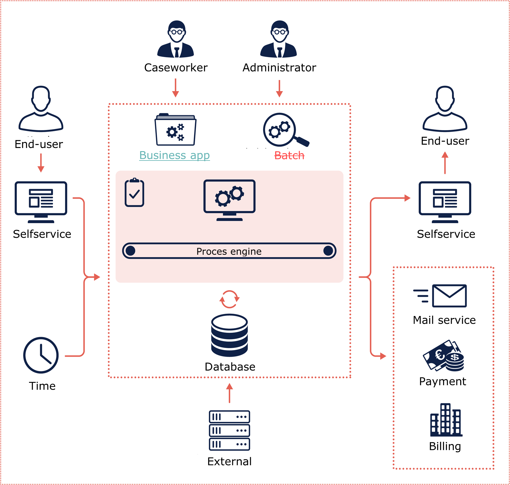
<h5>Figure 1: High-level illustration of a user-journey is orchestrated by the solution, with the process engine at the
center of it all</h5>
</div>

## Target audience

The target audience of this document is:

1. Customers that wish to deep dive into the capabilities of the Amplio process component.
2. Developers in connection with bug fixing, new feature development, Amplio bumps, or setting up a new Amplio based
   project.

[High level description of the component](#high-level-description-of-the-component) is however written to be distributed to a wider audience of
interested parties.

## Purpose

The purpose of this document is to provide a deep understanding of the core concepts and capabilities of the Amplio
process engine, such as modeling new processes, process scheduling, and standard tasks. The process engine component has
evolved over the years, and best practices and standard components from the projects have been consolidated into
standard tasks and components ready to use in new or existing projects.

Thus, the process engine component provides:

- An event handler that monitors and schedules process execution from events and event subscriptions.
- A framework for defining and executing processes.
- A set of best practices and core concepts that can accelerate development on new and existing projects.

## Background information

Processes are essential for the Amplio-platform, and this component influences many of the surrounding components such
as:

- Danish: [D0160 - Fagsystem](https://goto.netcompany.com/_layouts/15/CaseApp/Case/JumpTo.aspx?ID=6369056)      , that
  embeds the process execution UI on the entity overview.
- Danish: [D0160 - Administration](https://goto.netcompany.com/_layouts/15/CaseApp/Case/JumpTo.aspx?ID=5662264), that
  has a section specific to monitoring and handling process execution and
  failures.

Furthermore, the following user-guide covers aspects of getting started with process development:

- [C0200 – Getting started with processes](https://goto.netcompany.com/cases/GTE351/NCMCORE/Amplio%20Deliverables/Amplio%202025/C0200%20-%20User%20Guides/C0200%20-%20Getting%20started%20with%20Processes.docx)
- [C0200 – Getting started with React](https://goto.netcompany.com/cases/GTE2252/AMPJ/RhoDeliverables/C0200%20-%20User%20Guides/C0200%20-%20Getting%20started%20with%20React.docx?web=1)

# High level description of the component

The process engine is designed to support a very versatile implementation of business processes driven by configurable
business rules.
This section will explain four core concepts of the process engine:

- **The ‘Shopping cart’-metaphor:** Business processes are composed of tasks – taking the user through a guided journey
  from
  start to end. Data from processes are drafts until the users are ready to approve in the end.
- **Processes should do as much as possible automatically:** The process engine is designed to support the user as much
  as
  possible. Configurable business rules are used to ensure that either parts of or entire processes can be automatically
  processed. Only when necessary, will the user be involved.
- **The user should have control:** Even when tasks are automatically completed, the user will have the option of going
  back
  to a specific task and amending the choices made by the system. The system will involve the user through ‘causes for
  attention’ (undringsårsager) when encountering cases that do not fulfill the defined business rules.
- **Processes are transparent:** Process execution is part of the event ledger, and the user has total transparency of
  what
  happened when. Processes can be opened, and each task and its content can be inspected as it looked at the point in
  time.

## Logical data model

Before explaining the four concepts, it’s important to establish a common vocabulary and logical perception of the
Amplio process concept.

An event (hændelse) can spawn a process (opgave). A process can consist of some process data (context or opgave data),
and one or more tasks (trin). Each task will be a small step towards completing the process as a whole. Each task can
interact with the process data and amend or modify data. Each task has its own data, such that the completed task can at
any later point be opened and viewed to see what happened during the task. Each task contributes to the process data,
and only when all tasks are completed, can the process data be made effective towards other entities (such as e.g.,
updating case data, making a new payment, etc).

<div style="text-align: center;">

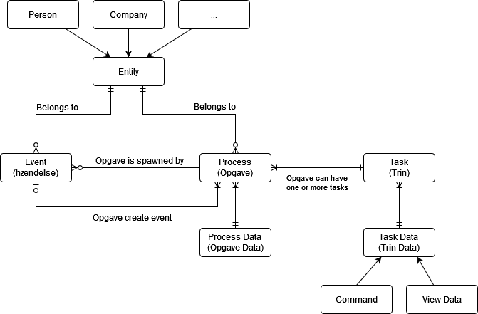
<h5>Figure 2: Logical data model of the Process Engine relevant Entities</h5>
</div>

## The shopping cart metaphor

Although business processes are usually much more complex, a simple ‘order items in a web shop’-flow is a good
illustration of the core capabilities of the process engine flow modeling.

The first task in an ‘Order goods’-process is to add one or more items to an order, the next could be to fill in
necessary invoicing and shipping information, then a task for payment, until in the end, the final task would be to
finalize the order. Each task works with the shared process data, until it’s in the end, and is ready to be finalized.

<div style="text-align: center;">

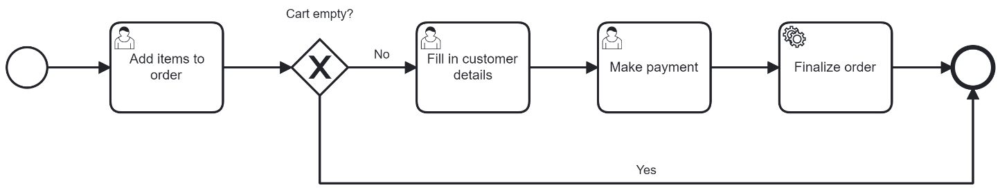
<h5>Figure 3: Simple order flow modeled in Business Process Modelling Notation (BPMN)</h5>
</div>

Processes act like a shopping cart – you can put things in the cart, and later change your order – and only in the end,
will you either complete or discard your purchase. Processes work in a similar way, where tasks contribute toward the
process data, and only if/when the process is completed, will the process data be made effective towards other entities
in the system.

Processes can be part of a larger workflow, and can throughout their execution create events, that can spawn other
processes, to either delegate or continue the workflow.

<div style="text-align: center;">

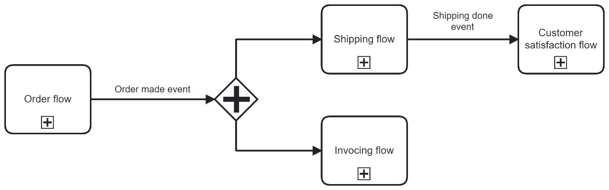
<h5>Figure 4: Processes can throw new events to trigger proceeding or delegating tasks</h5>
</div>

## Processes should do as much as possible automatically

When working with business process modeling a healthy mantra is that processes should be designed such that the system
handles the trivial, and the users handle the exceptions. What is meant by that is, that users should not use their time
on tasks that do not provide value, such as transcribing data into a system, but should rather use their time handling
the difficult tasks that require subjective thinking and deep domain knowledge.

The Amplio-platform fully supports this way of modeling, where upon events, processes can be spawned to run fully
automated. Let’s consider a fictive but plausible example. We need to support a business flow where a citizen applies
with some information. If found eligible, the citizen will be able to receive a grant of e.g., €100. The only
requirement for the grant is that his total liquid equity is less than €1,000.

The citizen will in the self-service application provide common information about himself (name, address, etc.), along
with information about this liquid equity. Upon receiving an application, the system will automatically check the
application. If the required information is not provided, the application will be rejected, with an appropriate letter
sent to the citizen about what information was missing.

If the citizen answered that his equity is more than €1,000, the application will likewise be rejected with an
appropriate letter explaining to the citizen that he is not eligible for the grant since his equity is too high.
Only if the citizen has provided all necessary information, and if the provided equity is less than the maximum, will
the process go to manual handling where the user can assess the situation (such as judging if the citizen is not lying
about his equity) and decide if the citizen is eligible.

Modeling as exemplified illustrates how the system can automate part of or entire business processes based on business
rules, but still allow users to be involved in the process when necessary.

## The user should have control

Furthermore, the system also supports making the user aware of certain scenarios, again based on business rules. In
Amplio these are called ‘Cause for attention’ (undringsårsager). ‘Cause for attention’ can be used to make the user
aware of e.g., inconsistent data between conflicting sources of truth (what the citizen provides, and what can be found
in registries), that the citizen does not conform to certain rules based on his situation where the user needs to make a
subjective assessment, etc.

The feature is used to both take the process out for manual handling upon certain events, but also promotes a
rule-driven guidance of both inexperienced and experienced users by providing them a checklist, also in complex uncommon
paths of the business flow, that might otherwise be missed.

<div style="text-align: center;">

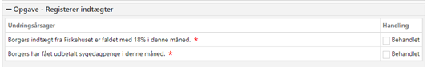
<h5>Figure 5: Illustration of how 'Cause for attention' is shown to the user. The user can check the causes when he has
made an assessment.</h5>
</div>

When a process is taken out for manual handling, the user can always see the preceding tasks processed automatically by
the system and can check what was done, as well as go back and make amendments.

<div style="text-align: center;">


<h5>Figure 6: The module 'Previous tasks' that is always part of the process UI.</h5>
</div>

## Processes are transparent

The user can at any time view completed processes and tasks. Tasks can be found in the event ledger. What happened at
each individual task can be inspected in read-only mode.

<div style="text-align: center;">

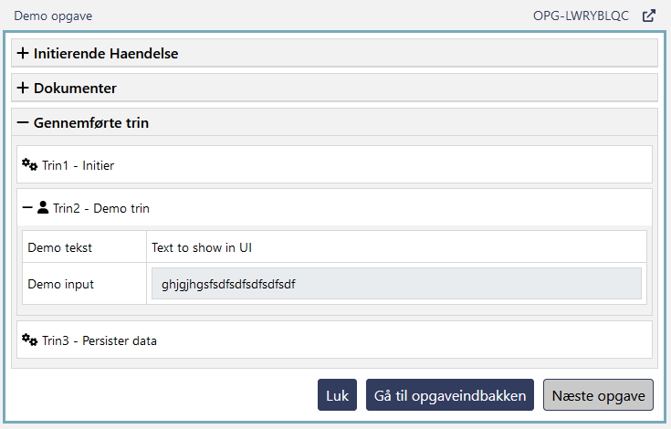
<h5>Figure 7: Completed processes being viewed in read-only mode to see what happened on a particular task</h5>
</div>

# Introduction to the subject

The following sections will explain core concepts of the process engine, such as Scheduling, BPMN-modeling, and Process
deadlines.

## Vocabulary

| Business term               | Synonyms                         | Description                                                                                                                                                                                                                                                                                                                                                                                                                                                                                            |
|-----------------------------|----------------------------------|--------------------------------------------------------------------------------------------------------------------------------------------------------------------------------------------------------------------------------------------------------------------------------------------------------------------------------------------------------------------------------------------------------------------------------------------------------------------------------------------------------|
| Process Definition          | Process, Workflow, Procesdiagram | The definition of the Process type expressed in BPMN.                                                                                                                                                                                                                                                                                                                                                                                                                                                  |
| Process                     | Opgave                           | The instance of a specific process definition (workflow). Task has previously been a synonym with Process but has been changed to comply with the BPMN terminology. A process consists of a number of tasks that either the system or the user has to go through. The task of a process is dynamically determined based on the process definition, and the context of the process (such as who is it running for, which event spawned the process, what data has been inputted on previous tasks etc.) |
| Task                        | (Opgave)trin, Step               | Several tasks will make up a process. A task is some piece of work that either a user or the system must do. This could be getting data from external registers or writing a conclusion to a self-service application.                                                                                                                                                                                                                                                                                 |
| Task Data                   | OpgaveTrinData                   | A composite term covering both Command and View Data                                                                                                                                                                                                                                                                                                                                                                                                                                                   |
| Task Command                | OpgaveCommand                    | The data of a task served to the front-end and modified through user interaction.                                                                                                                                                                                                                                                                                                                                                                                                                      |
| Task View Data              | TrinViewData                     | The read-only data of a task served to the front-end.                                                                                                                                                                                                                                                                                                                                                                                                                                                  |
| Event                       | Hændelse                         | Events happening in and surrounding the solutions. Could be for example ‘Citizen submitted application in self-service’, ‘Citizen passed away’.                                                                                                                                                                                                                                                                                                                                                        |
| Event subscription          | Hændelseabonnement               | The process engine can subscribe to events in the solution. If an event subscription exists when a new event occurs, then a process will be spawned from the event.                                                                                                                                                                                                                                                                                                                                    |
| BPMN                        | BPMN                             | Business Process Model and Notation (BPMN)                                                                                                                                                                                                                                                                                                                                                                                                                                                             |
| BPM_ENGINE / Process engine | BPM_ENGINE / Process engine      | The system user that executes Business Processes server-side.                                                                                                                                                                                                                                                                                                                                                                                                                                          |
| Entity                      | Entitet                          | Party of interest. Can be a person, a company, or any other identifiable party for whom we do process execution or send letters.                                                                                                                                                                                                                                                                                                                                                                       |
| Action menu                 | Handlingsdropdown                | A menu containing the processes that can be started for a given entity.                                                                                                                                                                                                                                                                                                                                                                                                                                |

## Events and event subscriptions

The Process engine uses an event-driven architecture. Events that occur on an entity can be tied to processes using
event subscriptions, and vice versa: all processes are created due to events.

### Events

The concept of events is exactly what you would expect - “things that occur, relating to this entity”. Events can
therefore be a lot of things. This includes, for example:

- The citizen submitted a flow via the self-service,
- A case worker started a process from the action menu,
- A batch job processed the citizen's data,
- A message was received from a third-party integration,
- A case was created,
- A letter was sent.

In some examples, it might be relevant to start a process based on the event; in others it won’t, and the event merely
notes a change in the log.

Basic event types are defined in Amplio and include events such as document downloaded, letter sent, and resume process.
The list of basic events is defined in `BaseHaendelseType` and should be extended in your project for business-relevant
events.

#### Database structure of events

##### Haendelse table

The `Haendelse` (event) table consists of several foreign keys, event content, and information about the handling of the
event as outlined in the below table.

| Attribute              | Description                                                                                                                                                                                                                                                                                                                                                                                                                                                                                                                                                                                                |
|------------------------|------------------------------------------------------------------------------------------------------------------------------------------------------------------------------------------------------------------------------------------------------------------------------------------------------------------------------------------------------------------------------------------------------------------------------------------------------------------------------------------------------------------------------------------------------------------------------------------------------------|
| ID                     | Primary key.                                                                                                                                                                                                                                                                                                                                                                                                                                                                                                                                                                                               |
| Haendelses_data        | Data, in the form of JSON, associated with the event and needed for processing the event.                                                                                                                                                                                                                                                                                                                                                                                                                                                                                                                  |
| Haendelses_tekst       | Free text title of the specific event.                                                                                                                                                                                                                                                                                                                                                                                                                                                                                                                                                                     |
| Haendelses_type        | The type of the event. Event types are defined in the system parameter "haendelsestype". This is not an enum but a text field so projects can define their own event types.                                                                                                                                                                                                                                                                                                                                                                                                                                |
| Parent_id              | ID of a parent event. Not all events will have a parent event. This is used to model events where an event can be connected to many events, for instance if created in bulk by an integration event.                                                                                                                                                                                                                                                                                                                                                                                                       |
| Reserved_by            | ID of entity reserving the event. This will often be the process engine – see section [event handler](#event-handler).                                                                                                                                                                                                                                                                                                                                                                                                                                                                                     |
| Status                 | Enum, based on `HaendelseStatus` enum class. Reflects the status of the event: <ul><li>TILFOEJET (added): Event created, ready to be picked up by the process engine.</li><li>IGANGSAT (started): Event is being processed.</li><li>AFSLUTTET (finished): Event is processed, or no processing was needed.</li><li>FEJLET (failed): An error prevented the event from finishing.</li><li>AFBRUDT (cancelled): The processing of this event was cancelled (for example through the event administration tab).</li><li>REGISTRERET / GENSTART: Legacy, relating to old process engine – don’t use.</li></ul> |
| Strakseksekver         | Indicates if this event should be prioritized by the process engine – see [scheduled tasks](#scheduled-tasks).                                                                                                                                                                                                                                                                                                                                                                                                                                                                                             |
| Dokument_id            | Optional field indicating an incoming document related to the event, or the outgoing document if event type is ‘Send Letter’.                                                                                                                                                                                                                                                                                                                                                                                                                                                                              |
| Journalnotat_id        | Optional field indicating the related journalnotat if one is created with the event.                                                                                                                                                                                                                                                                                                                                                                                                                                                                                                                       |
| Initieret_af_opgave_id | ID of parent process, if any. Filled if the event is created due to the parent process needing follow-up events.                                                                                                                                                                                                                                                                                                                                                                                                                                                                                           |
| Person_id              | ID to the person connected to the event.                                                                                                                                                                                                                                                                                                                                                                                                                                                                                                                                                                   |
| Virksomhed_id          | ID to the company (virksomhed) connected to the event.                                                                                                                                                                                                                                                                                                                                                                                                                                                                                                                                                     |

The table also contains the usual bitemporality fields: aendret, aendretaf, oprettet, oprettetaf, gyldig_fra, and
gyldig_til.

##### Data model

<div style="text-align: center;">

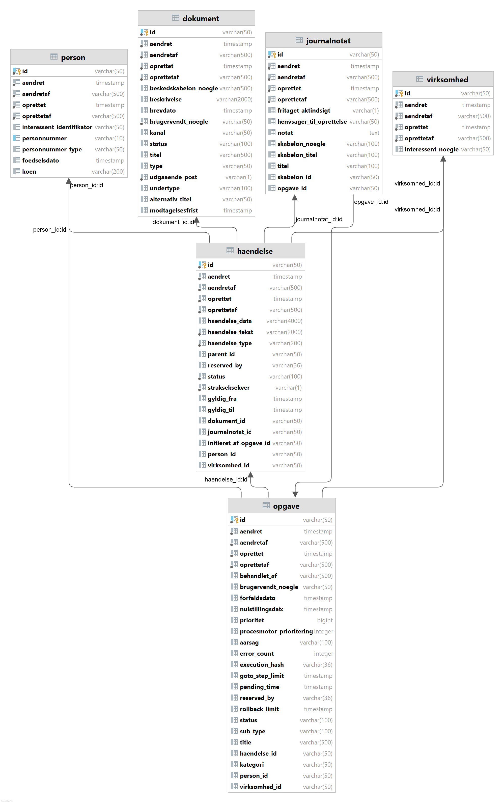
<h5>Figure 8: Data model for the Haendelse (event) table</h5>
</div>

##### The relation between Opgave and Haendelse

- Note that an opgave has a haendelse id – this is the event that spawned the opgave.
- Also, note that a haendelse has an opgave id (initieret_af_opgave_id) – this is the opgave that created the
  haendelse (if any).

### Event subscriptions

Event subscriptions are system parameters dictating the process engine’s handling of events. The subscription links
event types to the process types that are desired to be created to handle the events. If no event subscription exists
for an event, then it will not be handled by the process engine. Similarly, if the event subscription for an event type
is deactivated then any event created of that type will not be handled either. If the subscription is activated, then
the event will be processed by the event handler as described in [event handler](#event-handler).

An overview of the attributes assigned to the system parameter type used for event subscription can be seen in Table 1.

<h5>Table 1: Event subscription system parameter attributes</h5>

| Parameter attribute name                            | User friendly name        | Description                                                                                                                                                                      |
|-----------------------------------------------------|---------------------------|----------------------------------------------------------------------------------------------------------------------------------------------------------------------------------|
| deaktiveret                                         | Deactivated               | If true, the event subscription is (temporarily) deactivated and events of the subscription’s type will not be handled.                                                          |
| titel                                               | Title                     | Title of the event subscription – often named after the process type.                                                                                                            |
| beskrivelse                                         | Description               | Description of the event subscription – often named after the process type.                                                                                                      |
| nc.modulus.ydelse.task.api.model.type.HaendelseType | Event type                | The event type for the subscription. If any new events are created of this type, then this parameter instance will be used to determine how the process engine should handle it. |
| nc.modulus.ydelse.process.model.types.OpgaveType    | Process type              | The process type to be created when using this parameter instance based on the data in the newly created event.                                                                  |
| forfald_antal_dage                                  | Number of processing days | The expected/allowed number of days before the process should be completed. See [forfaldsdato](#forfaldsdato).                                                               |

## Early persisting

A core architectural principle of process development is, that data isn’t persisted until a summary page is displayed
and approved. Nonetheless, processes generate a lot of data while running, and this data must be stored somewhere. For
this purpose, a process comes equipped with a process context.

A process context is simply a java object, containing information about the state of the process, along with any other
information that the developer wishes to store. Each time the process is persisted (
see [engine execution workflow](#engine-execution-workflow)), the context is
serialized and stored in the `OPGAVE_DATA` table, and each time the process is opened up, the context is restored by
reading from this table and deserializing.

Using the process context, the process can perform all its changes in a single transaction in the register step (see
5.3).

Sometimes, however, it is useful to persist some data before this. In many projects this exception is when creating a
new case (sag) immediately upon receiving an application from the self-service. The case will be persisted immediately,
with a status indicating that it is still being processed.

When a project chooses to persist data outside of the process context before completion of the process it is important
to consider clean up, for the scenarios where the caseworker cancels the process before completion. The cleanup should
be added to the project implementation of ProcessAddOnService#afbrydOgLuk. This is the function called by Amplio when
the cancel and close (see [afbryd og slet](#afbryd-og-slet)) button is pressed, and it is designed to be overridden by
projects. In the case
of projects persisting new cases early, this is the method used to update those persisted cases.

## Scheduling

It is the scheduler's job to regularly check for new events and ensure their complete journey from created event to
completed process. The `haendelse` database table gets regularly queried, and new events get picked up and assigned
threads dependent on current CPU usage, configuration, and prioritization. It is the throttler's job to determine how
many unhandled tasks will be picked up and processed.

The chosen events get reserved by the process engine and, dependent on event subscriptions, the engine will create a
process to handle the event and its data. From here, the system will loop through all of the process’s tasks and finally
complete the process if nothing causes it to fall out to manual – the exact behavior is described in detail
in [engine execution workflow](#engine-execution-workflow). Similarly, pending and failed tasks are regularly queried and
subsequently processed. The
stuck tasks are released for re-processing, and failed tasks are eventually changed to manual to require human
assessment and handling.

In this section, we will examine how the throttler works and its effect on the system’s performance. Further, we will
have a look at the scheduler’s three handlers: Task, Event, and Maintenance, to see their central role in the process
engine.

### The use of the throttler to optimize performance

The handlers detect and process tasks and events, and the throttler determines how many threads should be utilized for
the processing. The aim of using the throttler logic is to best utilize the server’s CPU to both avoid users
experiencing slow response times and to maximize the number of tasks and events processed. The number of threads
assigned to the task is determined by the throttler based on previous CPU usage on the server and a selection of system
constants.

#### Process Throttle Data

A `ProcessThrottleData` object is kept for each type of handler on each of the servers running the process engine. Each
object is initialized with the following variables:

<h5>Figure 9: Throttle data object variables used by the process engine</h5>

```java
public static final int CPU_COUNT = Runtime.getRuntime().availableProcessors();
public int reservations = 0;
public int threadpoolSize = CPU_COUNT;
public int threadBatchSize = CPU_COUNT;
public long previousExecTimeMs;
public String name;
```

Whenever the throttler is activated, changes are made to `reservations` and `threadpoolSize`. `previousExecTimeMs` is
updated after bulk execution. Remaining variables are constant for each of the throttle data objects.

Upon startup, the handlers each add a throttle data object to the throttle service’s set of throttle data. Only the
`name` depends on the handler. The `previousExecTimeMs` is not initiated, and the remaining variables depend on the
available processors as illustrated above in **Figure 9**.

#### Regular throttle logging

Before processing tasks and events, both handlers will log some basic info about the throttling (using the
`throttleThroughput` function). Here some information about the previous batch execution and the adjusted thread count
is logged.

Sure, here is the entire text, including the new section, in a markdown code block:

#### Adjusting the thread count

The throttler’s main task is to adjust the thread count before bulk processing of the handlers. The adjustment has three
main outcomes: adjust the number up, down or no change.

The number of threads may remain static if the system parameter `PROCESS_ENGINE_STATIC_THREAD_COUNT` is defined for the
application. This overwrites the throttle logic and always uses a predetermined number of threads.

If the above parameter is not defined for the application, then the amount of threads is adjusted by comparing the CPU
usage to the max CPU usage. The CPU usage is calculated as the mean usage over the previous 2 minutes, based on 600
samples taken every 0.2s. The max CPU usage is defined by the application constant `PROCESS_ENGINE_MAX_LOAD_PERCENTAGE`,
default value 80 (percent).

The change in number of threads is calculated using a formula simplified to

$- c × log (CPU usage/maxCPU)$

Where c is a higher number when decreasing the number of threads, than when we increase the number of threads. The
motivation for this logic is to react in a way that optimizes the users experience and doesn’t react aggressively to
peaks. The optimized user experience is seen in the formula through the variable c being higher when decreasing the
number of threads than when increasing. This is to ensure that we descale the CPU usage relatively quick to avoid the
users experiencing bad performance. Simultaneously we avoid reacting aggressively to peaks by basing the formula on the
mean CPU usage over the previous 2 minutes rather than simply the last measurement. This way a generally decent CPU
usage with a minor peak of a high CPU usage for a few seconds won’t cause the throttler to immediately minimize the
number of threads and minimizing the number of events and processes handled.

#### Scheduled jobs

The throttler has the below scheduled tasks.

##### Gathering CPU usage data

To allow for the necessary thread adjustments a dataset on the CPU usage is necessary, and this is gathered by a
scheduled job (defined by the method `usageTick`). The scheduled job regularly queries the servers CPU usage and saves
it to a list of usage stats. The list is initially empty, but is quickly filled up to 600 items at which point it starts
removing the first item before adding a new item. The job runs every 200ms, meaning that the list always contains the
CPU usage for the last 2 minutes.

The scheduled method keeps the list (`CPU_USAGE_STATS`) up to date, and the throttler uses the list to calculate the
mean CPU usage in order to adjust the amount of threads in use.

##### CPU logging

To allow for debugging and similar a scheduled job logs information about the CPU usage. This is done by the method
`cpuLogging`. This regularly logs both the mean CPU usage over the last two minutes and the median CPU usage of the last
2 seconds.

### Task handler

The task handler regularly searches for processes that have previously been started, but since then been set to pending
or have failed, and are now ready to be processed. This is done using scheduled jobs and throttler logic. The detected
processes are handled asynchronously by the process engine.

#### Upon start up

Upon startup of the application the task handler’s throttle data is created. The function `init()` is called at start up
by the use of the post construct annotation ensuring it is always executed at the application’s start up. The method
initializes throttle data (as explained in [process throttle data](#process-throttle-data)) for each of the task
handler’s two scheduled jobs. The
name of each data sets will then reference the task handler jobs respectively.

#### Scheduled jobs

The scheduled jobs are the driving force of the handlers. They run at regular intervals, picking up the events and
processes related to the specific scheduled task and starting their processing chain. Specifically the functions will
initializes the context, check that the relevant part of process engine is running and then start processing. When the
bulk processing has completed the scheduled task will run again after the fixed delay. The fixed delay time is
determined by the constant `ProcessEngineConstant.SCHEDULED_DELAY_EVENTS` and is set to 5s in Amplio.

When checking that the relevant part of process engine is running the task handler will use the logic in
`processExecuteService#isTaskHandlerRunning()`. The result is determined based on a series of configurations and is
explained in more depth in [is handler running](#is-handler-running). Following this check the scheduled jobs
will call
`ProcessTaskHandler#processBulk()` to start processing the relevant tasks.

##### Continuing pending processes

The scheduled task handler method `standbyTimeProcessor` is responsible for picking up processes that have previously
been set to pending. This method will build a query searching for any process:

- with status set to “PENDING_TIME” or “PENDING_INPUT”,
- attribute `pending_time` set to a date time earlier than now and
- not already reserved by another entity.

In other words, it’ll find any processes where their wait is over and their processing chain hasn’t been started yet.

##### Retry failed tasks

The scheduled task handler method `errorProcessor` is responsible for picking up processes that have previously failed.
This method will build a query searching for any process:

- with status “FAILED” or “FAILED_INTEGRATION”,
- that are not already reserved by another entity and
- where the error count and previous execution attempt align.

Whether the error count and time stamps align depends on predetermined time intervals. If it is the first time the
process is being reexecuted after failing then we wait 1 hour, the next time we wait 4 hours, the time after that the
wait until retry becomes 14 hours. Specifically, the wait time is determined by:

`Math.round(Math.pow(i+1, 3) * FAILED_OPGAVE_BASE_RETRY_DELAY_MINUTES / 60)}`

where `FAILED_OPGAVE_BASE_RETRY_DELAY_MINUTES` is set by Amplio to 30 (minutes).

The handler will only evaluate whether it is time to retry the process or not if the retry count hasn’t exceeded the
maximum amount of retries, which is determined by system constant `process_engine_failed_retries` (default 3). After a
certain amount of retries the process is therefore no longer collected by the task handler and is instead handled by the
maintenance handler, see [elevate failed tasks](#elevate-failed-tasks)
.

#### Process bulk

After the task handler’s scheduled methods have built a query, the function `ProcessTaskHandler#processBulk()` is called
with the query as input. The function throttles the handler (see subsection 3.4.1), reserves the processes and submits
them to be handled by the process execution service (`processExecuteService.java`).

The processes are reserved by the method `processReservationService.reserveOpgaveBatch`. The method reserves the
relevant processes in the `opgave` database by setting the value `reserved_by` equal to the ID created for the batch of
engine threads.

The method reserves processes based on a base query that includes the query parameters built in the original scheduled
method (as described in sections [continuing pending processes](#continuing-pending-processes)
and [retry failed tasks](#retry-failed-tasks)). The maximum number of processes to be reserved is determined
using the throttle data (see [process throttle data](#process-throttle-data)). The maximum number of tasks
processed in the one bulk is defined as the `popBatch`, which is determined by multiplying the size of the thread pool (
determined by the throttler logic) and the size of the thread batch (static number).

When processes are found and reserved then they will be submitted to bulk execution.

#### Submit to bulk execution

The execution of the tasks is handled with using Executors, Futures and other asynchronous functionality. If you are not
familiar with these concepts, I suggest that you read the intro to the subject found
here [Future Intro](https://www.baeldung.com/java-future).

Once the handler has determined what tasks to handle it submits all the tasks to start a bulk execution asynchronously (
using `submitBulkToExecution` method). Using the `ExecutorService` interface a number of threads are started – where the
number of threads here is the number calculated by the throttler. A list of `Futures` is then created, with a `Future`
for each task. The `Futures` are built using the relevant throttle data, with the executor pointing back to the task
handler. After creating the list of `Futures`, the function `ProcessExecuteService#awaitTermination()` is called on the
`ExecutorService` which contains all the threads and tasks previously determined to be handled by the individually
scheduled task handler. This is to ensure that the threads are eliminated and the resources released after use.

This setup means that the asynchronous functionality will call `processTaskHandler.processExecutorInterface#execute()`
on each task. The execution method sets the context and throws the process between the different services to determine
if execution should be skipped or not. The actual execution is done with execution statistics, transactions and much
more that you can read about in [engine execution workflow](#engine-execution-workflow).

After a `Future` has been created for all the tasks collected by the task handler it is time to shutdown the
`ExecutorService`. This means that the threads and resources allocated can no longer accept new tasks. Any `Futures`
that have not completed after the set timeout will be cancelled (allowing interrupts). This means that the uncompleted
tasks won’t be persisted/updated and will therefore stay in the state they were originally found.

The timeout time is determined by `popBatch * 100 / CPU_COUNT` (seconds).

### Event handler

#### Upon start up

Like the task handler, the throttle data is initialized for the event handler’s two scheduled jobs. For more details,
see the paragraph on the initialization for the task handler, [upon start up](#upon-start-up).

#### Scheduled tasks

The event handler’s scheduled methods work roughly in the same way as the task handler’s scheduled methods explained in
[scheduled jobs](#scheduled-jobs).

##### Continuously handling events

To continuously handle events, a scheduled job regularly starts the search for new events to handle. The job is based on
the method `#continuousEventHandler`. Specifically the function initializes the context, checks that the process engine
is running (on the specific server calling the function) and then starts the chain of reserving events and submitting
them for processing (via function `reserveAndSubmit`) (
see [selection and reservation of events](#selection-and-reservation-of-events)).

##### Handling prioritized events

In addition to the continuous event handling a scheduled job is needed to handle any events that are prioritized over
remaining events. This is done using the function `#prioritizedEventHandler`. The prioritized handler functions as the
above continuous handler, with the main difference that it tells the `ReserveAndSubmit` function to only process
prioritized events. An event is prioritized if its event type has `strakseksekver = Y` in the database table
`haendelse`. The continuous handler only processes non-prioritized events.

The motivation behind having two different event handlers is long batchjobs and similar tasks that may queue a long list
of events that need handling. These will all be picked up by the continuous event handler, but if an application comes
in from the self service while on the phone with a case worker (or similar) then that case worker may need access to the
related process immediately. However this won’t be possible if the events get queued behind 1000s of “send brev” events
created by a batchjob. The prioritized event handler therefore runs parallelly to allow some events to “jump the queue”
to create a good user experience during a busy business day.

#### Selection and reservation of events

The event handler is more complex than the task handler regarding which entities should be processed. Where [section
Process bulk](#process-bulk) explains the process between the scheduled functions and execution of the tasks as
simply throttling and
reserving the tasks, the event handler also has a significant portion of sorting between the events before sending them
to be executed in bulk. The `#reserveAndSubmit` function called from the scheduled event handler throttles the event
handling and reserves the events, similarly to the task handler, but then the event handler sorts through the events and
sends the relevant events to be processed by the `processExecuteService`.

The events are reserved by `processReservationService#reserveEventBatch()`. The method reserves events in the
`haendelse` database by setting the value `reserved_by` to equal the ID created for the engine’s event processing.

The method reserves events that have status “tilfoejet” (added) and where the `haendelse_type` does not have a
deactivated subscription (see [events and event subscriptions](#events-and-event-subscriptions)). Further the chosen events must
either be prioritized or not prioritized
types depending if the continuous or prioritized event handler started the event handling. The maximum number of events
to be reserved is determined by the throttler as with the task handler.

Once the events are reserved, the handler sorts through the reserved events and determines which events should be
completed and which should be processed.

This is done by looking for special event types (`RESTART_OPGAVE` and `RESUME_OPGAVE`), determining event subscriptions
and looking for duplicates.

The events are sorted into groups based on event type, subscriptions and duplicate event content. From here the events
that do not require any action are completed and the remaining events with subscriptions are submitted for bulk
execution – using `processExecuteService#submitBulkToExecution()`. In other words we only process events that have an
active subscription (`hændelses abonoment`) and has unique event content (`HaendelseData`). The tasks that are set to
completed are those without a subscription or with duplicate event content.

In summary events with no subscription are set to completed, those with an active subscription are passed on in the
processing chain and those with an inactive subscription are sorted away before reserving events so they can found by
the handler when the event subscription is activated.

#### Execution

The asynchronous aspect and planning/setup part of the execution of the events is very similar to the execution of the
tasks in [submit to bulk execution](#submit-to-bulk-execution). The code is the same, but the input is a throttle data
object and executor from the process
event handler rather than the process task handler, and the list of entities to be handled consists of events rather
than tasks.

The execution is done by the event handler and in contrast to the task handler, the events are not passed straight onto
the services for processing. The executor determines how to handle the event dependent on the event type. If it is not a
special event then the relevant process is created and handled. The creation of processes and handling of the process
can be read about in [engine execution workflow](#engine-execution-workflow).

After processing the event is released.

As with the task handler, the `ExecutorService` is shut down after `Futures` have been created for all of the events
parsed to the executor. This means that the uncompleted events won’t be persisted/updated and will therefore stay in
status `TILFOEJET` allowing them to be processed by a later event handler.

### ProcessMaintenanceHandler

The maintenance handler consists of four different scheduled “clean up” jobs to avoid tasks and events being dropped.
Two jobs are made to free up entities reserved for too long and therefore stuck – one unstucker for tasks and another
for events. A job for resuming lost tasks and a fourth job for elevating failed tasks to attention state.

#### Event and Task Unstuckers

There’s two separate unstucker handlers, one for tasks and one for events. They work in the same way, so the unstucker
logic will only be explained once, using the term entity to reference both tasks and handlers.

At a regular interval the scheduled handler will run and search for any entity with a reservation and a change date
older than when the previous time the handler was run. These entities are considered stuck as the handler runs far more
irregularly than any entity handling should ever take. The handler therefore unstucks the entity by removing the
reservation, allowing the entity to be picked up by the process and event handlers explained in previous sections. As
the entity is updated and persisted by the maintenance handler, any changes partially made by the process engine or
similar will be rolled back.

As with previous handlers, the unstucker only runs if the relevant engine (task handler or process handler) is running.

If your application runs perfectly then this handler should never be activated, unfortunately that’s usually not the
case. The handler will log if any entities have been handled, and it should be investigated if the handler often adds to
the log.

### Resume lost tasks

This handler fails any tasks that are not processed in the expected time frame. It finds any tasks pending processing (
status = “PENDING_PROCESSING”) not updated since last time this resume-handler ran. If any tasks are found, their
reservation is removed and they are updated to having failed. The task is set to failed by setting the error count to 1
and the status to “FAILED”. This way it is ready to be picked up by the error processor as described in [Retry failed fasks](#retry-failed-tasks).

### Elevate failed tasks

As explained in [retry failed tasks](#retry-failed-tasks) the task handler finds tasks that have a
failed status and retries them after increasing amount of time until it has retried `PROCESS_ENGINE_FAILED_RETRIES` (
default 3) times, increasing the error count with every retry. The mission of the elevator handler is to find all tasks
where they have been retried automatically `PROCESS_ENGINE_FAILED_RETRIES` times and set them to status “ATTENTION”.
This elevation from failed status to attention status means that the process is to be handled manually rather than
automatically.

## System parameters and configurations for the handlers

### Is handler running

The first thing done by the handler’s scheduled tasks is to check if the event handler is supposed to be running. This
can be controlled on three different levels as explained below.

The handler will not be considered running if the system is shutting down. The code uses pre-destroy annotation to allow
communication to the process engine that the application is shutting down. This is checked by the engine by calling
`scheduledJobsExecution.isEnabled()`.

The process engine can be turned on and off for individual applications using system parameters. This is done using the
application constants `EVENT_HANDLER_ENABLED` and `PROCESS_ENGINE_ENABLED` for the event handler and task handler
respectively. The maintenance handler checks the relevant handler based on the entities handled.

Similarly, the engine can be enabled and disabled using configuration. The variable
`my.process_engine.execution.disabled` defaults to false, but may be enabled via configuration.

It is only required to disable the process engine via one of the above methods to prevent the handlers from running.

### Prioritizing events

You should consider which event type you want to pick up with the prioritized event handler rather than the continuous
event handler. The event types you would like to prioritize, should be built with `strakseksekver = Y` as defined in the
`haendelse` database table.

### Event subscriptions

If your event should be processed by the event handler, then remember to define and activate the event subscription for
the event type – see [events and event subscriptions](#events-and-event-subscriptions).

## BPMN diagrams

The flow of a process is determined by the BPMN diagram of the process. The diagram is made with Camunda BPMN modeler
and could look like the diagram shown in Figure 10. Although Camunda provides many services, the Amplio process engine
uses it in a very straight forward manner – it reads the bpmn diagrams to determine the order of listeners and gateways.
The translation from diagram to Amplio process engine navigation is explained
in [translation from bpmn diagram to java process definition](#translation-from-bpmn-diagram-to-java-process-definition),
while [camunda diagram elements](#camunda-diagram-elements)
focuses on the modeler’s elements that can be utilized with the Amplio process engine.

<div style="text-align: center;">

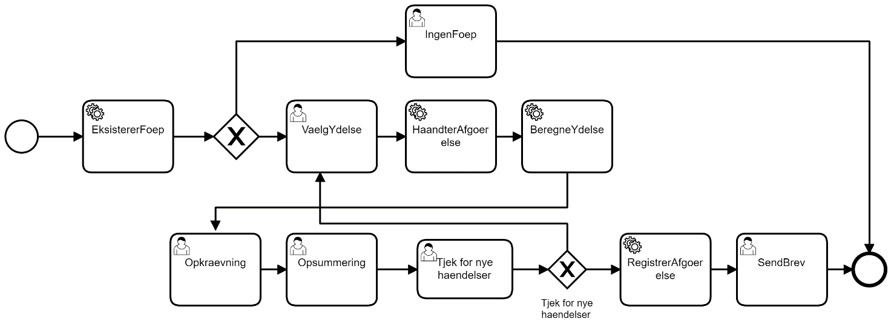
<h5>Figure 10: Camunda BPMN diagram example (from PE process determining case type)</h5>
</div>

### Camunda diagram elements

The Business Process Model and Notation diagrams (BPMN diagrams) describe a flow from a start event to an end event
through various tasks and gates. The process engine does not implement all elements provided by the Camunda modeler and
are limited to the elements listed with the following subsections.

#### Start event

The start event is the starting point of a process flow, as the name indicates. It is illustrated with a thin circle as
seen in Figure 11, when displayed in the camunda program. The only expected attributes are ID and name, although name
may be left blank.

The code uses the start event to find the first task to be created when the process is started, so the event must be
connected to a subsequent task. All processes must have exactly one start event.

<div style="text-align: center;">

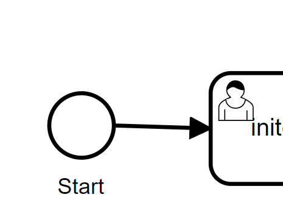
<h5>Figure 11: Start event diagram element</h5>
</div>

Example code from the `.bpmn` file created by camunda can be seen in Figure 12. The attributes are very minimal and only
involve an ID, name and an outgoing flow.

<h5>Figure 12: Start event bpmn code</h5>

```xml
<startEvent id="startevent1" name="Start">
    <outgoing>flow1</outgoing>
    <outputSet/>
</startEvent>
```

#### End event

The end event defines the end of the process. It is illustrated with a thick circle as seen in Figure 13. The end event
is used to determine if there are more tasks in the process and a process cannot be completed if the bpmn diagram
doesn’t have an end event. All processes must therefore have an end event but may have more than one if desired.

<div style="text-align: center;">

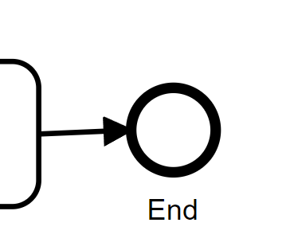
<h5>Figure 13: End event Camunda BPMN code snippet</h5>
</div>

The only expected attributes for the end event are ID and name, although name may be left blank. The code snippet in
Figure 14 shows the code created by the BPMN modeler illustrating an end event. As can be seen only an ID, name and
incoming flow is used.

<h5>Figure 14: End event Camunda BPMN visual element</h5>

```xml
<endEvent id="endevent1" name="End">
    <incoming>flow4</incoming>
    <inputSet/>
</endEvent>
```

#### User Task

Tasks elements in the diagram represent the tasks that make up the process. User tasks are usually used in the diagram
if the task can depend on a user. The tasks are based on listeners and should therefore all have an expression pointing
back to the name of the listener class that should be used by the process engine to execute the task. The visual
representation of the user task can be seen in Figure 15 and is recognizable by the cartoon person in the top left
corner.

<div style="text-align: center;">

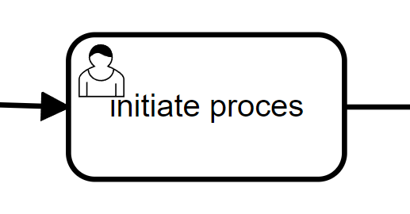
<h5>Figure 15: User Task visual example element from Camunda Modeler</h5>
</div>

As can be seen in the code snippet shown in Figure 16 the user task has the attributes ID and name, like the above
events, but it also has extension elements and both incoming and outgoing flow elements. The example only shows one
incoming flow, but it is possible for a task to have more. It is however not possible for the task to have more than one
outgoing flow. If the desired behaviour is for a task to lead to two different tasks, then an exclusive gateway must be
used after the task in combination with conditions – see more
in [exclusive gateway and sequence flow](#exclusive-gateway-and-sequence-flow). The extension elements are needed
as the process tasks require listeners. The element contains a delegate expression that points to the listener’s class.
This allows the process engine to determine which listener implementation should be used for the specific task.

<h5>Figure 16: BPMN code snippet of a User Task</h5>

```xml
<userTask id="usertask1" name="initiate proces" implementation="##unspecified">
    <extensionElements>
        <camunda:taskListener delegateExpression="demoInitierProcessListener" event="create"/>
    </extensionElements>
    <incoming>flow1</incoming>
    <outgoing>flow2</outgoing>
</userTask>
```

#### Service Task

The service task is very similar to the user task, but is used for tasks that are always automatic. When the process
engine interprets the bpmn diagram, there is no difference in behaviour between service and user tasks. In the Amplio
process engine the difference between the two tasks is simple a visual difference. As can be seen in Figure 17 the
service task looks like the user task, but has a cartoon of two cogs instead of a person. Similarly, the code snippet in
Figure 18 shows the element name “userTask” replaced by “serviceTask” with no other functional differences.

<div style="text-align: center;">

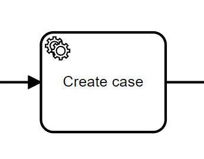
<h5>Figure 17: Service Task visual example element from Camunda Modeler</h5>
</div>

<h5>Figure 18: BPMN code snippet of a Service Task</h5>

```xml
<bpmn:serviceTask id="Activity_1lnlia5" name="Create case">
    <bpmn:extensionElements>
        <camunda:executionListener delegateExpression="opretGlFoepIyOpretSagListener" event="start"/>
    </bpmn:extensionElements>
    <bpmn:incoming>SequenceFlow_1lnwkhl</bpmn:incoming>
    <bpmn:outgoing>Flow_171l8v2</bpmn:outgoing>
</bpmn:serviceTask>
```

#### Exclusive Gateway and Sequence flow

All elements in the bpmn process diagrams are connected via sequence flows. These elements don’t normally have
attributes other than automatically generated IDs. However, if the flows are connected to an exclusive gateway element,
then it is normal for the gateway to have more than one outgoing flow. In this case the outgoing sequences must contain
condition attributes. This is the case if any element has more than two outgoing tasks. The condition is used to
determine if the process flow should continue along one or the other of the gateway’s outgoing sequence flows.

In Figure 19 the camunda modeler’s visual expression of an exclusive gateway (diamond marked with a cross) is seen with
both ingoing and outgoing sequence flows (the arrows).

<div style="text-align: center;">

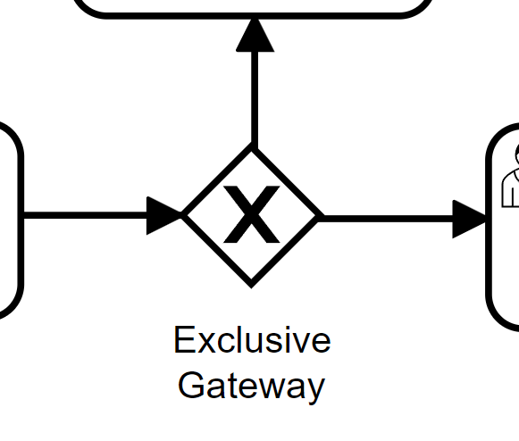
<h5>Figure 19: Exclusive Gateway and Sequence Flows, visual example elements from Camunda Modeler</h5>
</div>

The code snippet used for the gateway can be seen in Figure 20, and shows the incoming flow alongside the two outgoing
flows. In Figure 21 the code snippet for one of the outgoing sequence flows is shown, containing the condition
expression. The condition shows that the process should only continue along this sequence if the result of the previous
task is “need for manual calculation”.

<h5>Figure 20: BPMN code snippet of an Exclusive Gateway</h5>

```xml
<exclusiveGateway id="exclusivegateway1" name="Exclusive Gateway">
    <incoming>flow3</incoming>
    <outgoing>flow16</outgoing>
    <outgoing>flow4</outgoing>
</exclusiveGateway>
```

<br>

<h5>Figure 21: BPMN code snippet of a Sequence Flow element</h5>

```xml
<sequenceFlow id="flow16" sourceRef="exclusivegateway1" targetRef="UserTask_0pvecfk">
    <conditionExpression xsi:type="tFormalExpression">NEED_FOR_MANUAL_CALCULATION</conditionExpression>
</sequenceFlow>
```

### Translation from bpmn diagram to java process definition

Camunda’s own library is used to access the bpmn diagram as a java object via the process engine file
`ProcessDefinition.java`. The process engine defines the process according to the elements and attributes defined in the
previous section, but largely holds the definition as list and map variables.

The first time a process is created of a specific type, the definition of the process type is created. The process
definition is then cached and used for all future process creations of the same type.

Initially basic things such as assigning process type to the definition and loading the bpmn stream are done.

All user and service tasks are then gathered from the stream and used to find all the executor beans for the process’
many tasks. The executor beans are the listener classes used to execute each step in the process. Simultaneously a map
connecting the bpmn task ID to the listener task type is created.

The list of listeners allows the process engine to call the correct listener class and the map of task types allows the
engine to populate any new tasks correctly.

The start event from the bpmn diagram is found and used to identify the first process task. This is used to populate the
first task when new processes of the process type are created. Eventually the end event is also found. This is found to
determine if the process should be completed or the next task created when completing a task in the process.

Then the actual navigation maps are created. A map is created based on the exclusion gateways. It consists of all the
objects with outgoing sequence flows that have a conditional expression. Each gateway ID will be linked to the outgoing
targets via the condition that needs to be fulfilled for the process to go that route. Similarly, a map will be created
for all the flows that do not have a conditional expression. The map will have one element for each sequence flow, and
it will contain the source task ID and target task ID as the key and value respectively.

### Using the process definition

#### Create a new process

When creating a new process, the process definition is needed. If the process definition has already been built for the
type of process being created, then that will simply be retrieved, otherwise a new definition will be created.

#### Determining the next step in the process

When a task is completed the process engine must determine what to do next. It does this using the process, its
definition and execution result, among others. The current task’s target task is determined. The target task is the next
element in the process diagram after the current task (or a later event dependent on conditions). The target task can be
an exclusive gateway, a different task or an end event.

The target task is compared to the process definition. If the target task is listed as an end event, then the process
and associated event will be completed and persisted. If it is not an end event, then the next task in the process will
be created and the processing will continue.

The target task is the element connected to the current task via an outgoing sequence flow if no conditions redirect the
flow. The process definition contains a list of source IDs and target IDs built based on sequence flows with no
conditions. The source and target pairs in the list are the elements connected by the singular sequence flow. When
determining the target task, the current task’s ID is compared to this list and the temporary target ID is determined.
If the target ID is listed as a gateway element (an element with outgoing flows with conditions), then the execution
result of the current task is needed to determine the final target ID. This is the case if the temporary target is an
exclusive gateway element. The target ID is compared to the list of gateway elements and the item containing the
conditions and target IDs for the temporary target is found. The execution result of the current task must match at
least one of the defined conditions for the process to continue.

#### Executing the task

For the process engine to run the individual tasks making up the complete process, the bpmn tasks must be linked to java
listener classes. The actual process execution and execution of the listeners is explained
in [engine execution workflow](#engine-execution-workflow), while this subsection focuses on how the bpmn diagram links the tasks to
the listeners.

The task must contain an extension element which contains the associated listener class name as a delegate expression.
When the process engine defines the process, the task’s extension element is found using `findAny()` so it is expected
that the task only has one extension element (or that the listener is connected to all the task’s extension elements).
The listener is determined by finding the value of the first attribute of type delegate expression. The developer must
ensure that the attribute value refers to the file name of the listener, while the correct string formatting is enforced
by the engine. The attribute is the bean name of the listener and identified using Spring utilities.

One of the reasons for extensive string formatting of the attribute pointing to the listener bean is old legacy bpmn
diagrams. Some old documentation and many old bpmn diagrams will instruct and implement a series of rules for the bpmn
tasks, but the necessary setup has significantly simplified since they were written. These differences in bpmn task
configurations have been outlined in Table 2. It is still possible to follow the legacy rules, as the updated process
engine is backwards compatible. Example of implementing the tasks using the legacy setup can be seen in Figure 16, while
the simpler rule set has been used in Figure 18.

<h5>Table 2: Legacy BPMN task rules vs current</h5>

| Legacy diagrams                                                                  | Current requirements                                                                                     |
|----------------------------------------------------------------------------------|----------------------------------------------------------------------------------------------------------|
| Two listeners were necessary per task                                            | One listener is required per task                                                                        |
| The listeners had to be type “taskListener”                                      | Any listener type is fine as long as it’s an extension element and has the attribute delegate expression |
| Each of the two listener objects had to be of event type “create” and “complete” | Event type irrelevant (type “start” often chosen)                                                        |
| The delegate expression looked like: `${[folder].[listener name]}`               | The delegate expression looks like: `[listener name]`                                                    |
| The listener name in the delegate expression had to be with lower case letter    | The case of the first letter in the listener name will automatically be adjusted                         |

It was also necessary to add end listeners to end events, but these may now be left blank as they are never loaded by
the process definition.

## Forfaldsdato

The due date of a process is defined by the process engine upon creation of the process, and is used to determine the
priority of the process and is a major sorting tool for the task tray.

### Vocabulary

| Danish business term | English term        | Description                                                                           |
|----------------------|---------------------|---------------------------------------------------------------------------------------|
| Forfaldsdato         | Due date / Deadline | The date the process must be completed by.                                            |
| Forfaldsprioritet    | Service goal        | Number of days in which the process should be completed to meet internal goals.       |
| Opgaveprioritet      | Process priority    | Priority of the process, defined by system parameters. Usually high, medium, and low. |
| Behandlingstid       | Processing time     | Expected time between creation and completion of a process                            |
| Svarfrist            | Response deadline   | The number of days the entity (usually the citizen) has, to reply/react to a letter.  |

### Forfaldsdato and processing time

Forfaldsdato or due date, is the date when the process is expected to have been handled by the case worker. When the
process engine creates the process, the due date is determined based today’s date plus the defined processing time for
the process type. The processing time defaults to 21, which is overridden by the generic business constant
`forfald_opgave` system parameter. The individual event subscriptions can also define the attribute `forfald_antal_dage`
for individual task types and thus override the default and generic values.

### Process priority

When a case worker accesses the task tray, they are presented with a table of tasks. Here the table is often configured
to sort the tasks in order of the process priority. You can read more about the task tray in its own
documentation [DD130 – Task Tray](/DD130-Detailed-Design/Task-tray) .

A process can have one of three priorities: high (høj), medium (mellem) and low (lav). In the database this is
represented by numbers.

There is no rule or predefined set of priorities for the processes. Each project can assign priorities as seen fit.
Ordering is also custom. A project could decide that lower number means more important or the opposite. A suggested
priority system is to use 1, 2, 3 with 1 being most important priority.

The process priority is often calculated “on the fly” when displaying the task tray, but can be overridden using the
associated priority database value for the specific process.

### Default determination of process priority based on forfaldsdato

By default, the priority of a process is determined based on the due date and how far it is from today, in comparison to
the forfalds prioritet. The process priority can also be overwritten by defining the “PRIORITET” value for the process
instance or by overwriting the `PrioritetService`.

By default, the “forfaldsprioriteter” system parameter type is used to determine the priority of the process. There’s a
set of default parameters, but it is also possible to define the parameter for specific process types. If the process’
due date is less than X days away, where x is the parameter value for `forfaldsprioritet-høj`, then the process is set
to high priority. If it is less than `forfaldsprioritet-mellem` then it will be medium priority, otherwise it will be
set to low priority.

You can choose to define the parameters as a negative number of days. This means that the process will reach the process
priority AFTER the processing deadline.

### Changing forfaldsdato

The due date is defined when creating the process instance but may be changed by the process engine in connection with
the waiting step (`ventetrin`).

If the process enters a waiting step the due date will be extended. If the process is pending a letter, then the date is
extended with a number of days equal to the response deadline. If the process is pending time, then the due date is
extended with the same number of days as the pending time is set.

If the response deadline is changed for a process in a waiting step, then the due date is changed accordingly.

If the waiting step is completed early, then the due date is adjusted accordingly. So if the step is completed 2 days
before the `svarfrist` or `tidsfrist`, then the due date is shortened by 2 days.

### System parameters used by forfald logic

#### Processing time

When finding the expected processing time of a process type both generic and specific parameters can be used. If an
event subscription is associated to the process being created, then the processing time will be based on the event’s
attribute `forfald_antal_dage` if it is non-null.

Otherwise the processing time will be based on the business constant `forfald_opgave`. If this isn’t defined either,
then the default value of 21 days will be used.

#### Priority

The priority of a process is determined based on default priorities, but can also be defined by `opgavetype`. For the
default value of priorities Amplio uses a system parameter of type “forfaldsprioritet” and key “HOEJ” for high priority
and key “MELLEM” for medium priority.

Projects may choose to override `PrioritetService#getPrioritetFromForfaldsdato` to use other logic – for example PE
overrides the function and uses hardcoded values 5 and 15 for high priority and medium priority respectively. The system
parameter type can be defined for individual process types if the default value is undesired.

The UI for defining a new instance of “forfaldsprioriteter” can be seen in Figure 22, with the attributes explained in
the below Table 3.

<div style="text-align: center;">

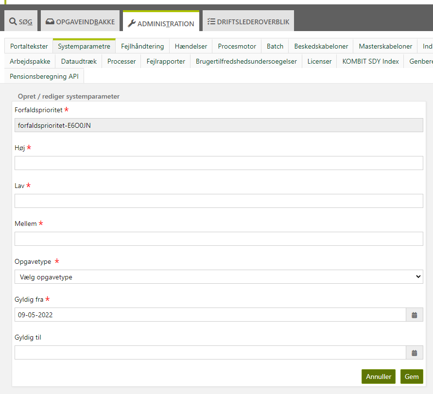
<h5>Figure 22: UI for creating a new forfaldsprioritet instance</h5>
</div>

<br>

<h5>Table 3: Forfaldsprioritet attributes</h5>

| Attribute         | Description                                                                                                                                                                                                 |
|-------------------|-------------------------------------------------------------------------------------------------------------------------------------------------------------------------------------------------------------|
| Forfaldsprioritet | Mandatory key for the parameter. Auto generated and non-editable (unless otherwise configured).                                                                                                             |
| Høj               | Maximum amount of days between today's date and the due date causing the process to be of high priority.                                                                                                    |
| Lav               | Maximum amount of days between today's date and the due date causing the process to be of low priority. This would usually be equal to the processing time of the process and often has no use in the code. |
| Mellem            | Maximum amount of days between today's date and the due date causing the process to be of medium priority.                                                                                                  |
| Opgavetype        | Dropdown containing the system’s process types (opgavetyper). The chosen type defines which process type should follow the defined priority days.                                                           |
| Gyldig fra        | Valid from date.                                                                                                                                                                                            |
| Gyldig til        | Valid to date.                                                                                                                                                                                              |

# Engine execution workflow

This section describes what goes into the execution of a process. The workflow is summarized by the following diagram:

<div style="text-align: center;">

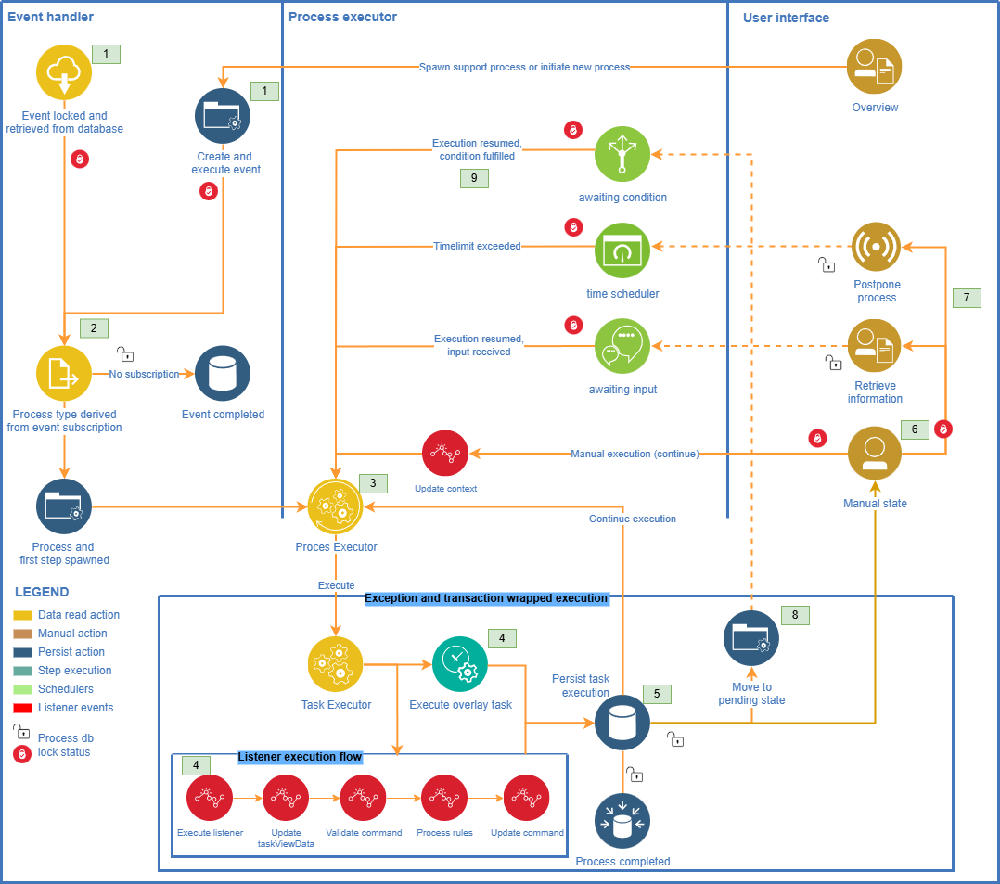
<h5>Figure 23: Overview of process engine execution workflow</h5>
</div>

1. This is where all processes are initialized. See Initializing a process instance for details.
2. The process engine looks for an event subscription (`haendelsesabonnement`) matching the current event. It uses this
   to determine which process to instantiate. If no such abonnement is found, the event is set to `AFSLUTTET` (
   completed) and the reservation is removed. Note that only one event subscription per event will be handled. If you
   wish to run multiple processes as a result of one event, you could instead create an automatic process, that spawns
   the required processes as follow-up events. Once a matching event subscription has been found, a process is spawned,
   along with its first step.
3. The main automatic execution loop consists of the process executor calling the task executor to execute the next
   step. The task executor calls the listener, the result is persisted, and we are back at the process executor. The
   manual execution loop starts the same, but when the listener returns `OpgaveStatus#MANUAL`, the `opgave` and event
   are unlocked, the view model is initialized, and the process goes to manual. Once the user presses continue, the
   locks are reinstated, and the process executor resumes the execution.
4. Unless the process is in an overlay state, the listener for the current step is executed.
   See [executing a listener](#executing-a-listener) for
   details. If the process is in overlay state, instead the active overlay is executed – this is described
   in [overlays](#overlays).
5. The current state of the process, made up by the updated context, command and `trinviewdata` objects, is stored. The
   path that the execution follows hereafter, depends on the `OpgaveStatus` value returned by the listener.
6. In the manual state, the automatic execution of steps halt, and await the user continuing the process, or triggering
   the postpone or retrieve information overlays.
7. If the user presses the retrieve information button, the corresponding overlay is activated,
   see [overlays](#overlays).
8. If the process triggers a pending state, this path is followed. Note that the process is unlocked, and can be opened
   by user, for example, to bypass the time condition of a postponed process.
9. For processes awaiting input, or awaiting a condition, there is, for performance reasons, no automatic scheduled
   retrying of such conditions. Instead, you should notify the process to retry its condition using
   `ProcessPendingService`.

## Initializing a process instance

All processes are initialized by an event. Events can either be generated automatically (for example by a batchjob, a
selfservice application, or as a followup to another process), or manually, by the user selecting it from the action
menu (`handlingsdropdown`).

### Initializing an automatic process

The process engine (specifically `ProcessEventHandler`) continuously queries the `haendelse` table, to check for
`haendelser` with `status = tilfoejet` and `reserved = false`. Any such events are reserved and a process is executed.

## Locking

When the process engine is about to execute a process, the first thing it does is lock it, by reserving the `haendelse`
and `opgave`. Technically, this is done by setting the `RESERVED_BY` field on the `OPGAVE` and `HAENDELSE` tables to
either:

- The username of the current caseworker, if the execution is manual.
- A randomly generated execution ID, if the execution is automatic.

This prevents other executors from working on the same process. The lock remains, until the process is complete, goes to
manual, or goes into a waiting step, at which point it is unlocked. Once a manual process is continued, or once a
waiting step continues, the lock is reinstated.

## Process execution

The execution of a process can be initiated in several different ways, but eventually, the main step execution loop is
reached. This is in `ProcessExecuteServiceImpl#executeReservedOpgave`. Here the process engine executes the steps of the
process one at a time. This continues until the process is complete, or a step indicates that the process has stopped by
changing the `opgave` status to something other than `PENDING_PROCESSING`.

The execution of each step is delegated to `ProcessStepExecutionServiceImpl#executeTaskWrapped`. Here the listener for
the current step is determined and is executed. Note that:

- If the current step is an overlay, separate logic handles this. See [overlays](#overlays) for further details
  in this regard.
- Each step execution is timed, with execution statistics. This is a useful mechanism to keep in mind when attempting to
  determine why a process is running slowly.
- Each step execution is run within a new transaction. See further details below.
- After the execution of the step has completed and the transaction has been committed, any integration intents are
  evaluated. See [execution rules for attentions](#execution-rules-for-attentions) for further details in this regard.

## Transactions and error handling

Each step execution is run within a transaction. This is handled by `ProcessTransactionServiceImpl`. This class provides
the `executeTransactionAndExceptionWrapped` method, which enforces the following rule, to allow the code in the listener
to misbehave, without impacting the stability of the scheduler: No transaction may be active when the method is called.
If a transaction was active, this would prevent the process engine from persisting error details to the `TEKNISKFEJL`
table and prevent it from setting the process to failed.

If a listener produces an uncaught exception, the following will occur:

- The error is saved to `TEKNISKFEJL`.
- The process rolls back the transaction in the current step.
- The process and current step are set to failed.
- The process will retry a number of times (see retry [retry failed tasks](#retry-failed-tasks)).
- If it is still failing, it will go to attention (`opmærksomhed påkrævet`).

## Executing a Listener

When the process engine executes a step, it uses the methods in the step’s listener as follows:

1. If the step is executed manually: `Listener#updateContextWithCommand` – see description below.
2. `Listener#execute`.
3. Create Command – creates a new command object, with type matching what was specified in `OpgaveTrinType`.
4. `Listener#updateCommandWithContext` – see description below.
5. Create `TrinViewData` – creates a new `trinviewdata` object, with type matching what was specified in
   `OpgaveTrinType`.
6. `Listener#updateTrinViewData` – see description below.
7. `processValidationService#validateStep` – see description below.

### The methods and BaseListener, and their purpose

It can be useful to think of the command as an object that is created by the backend, modified by the front end, and
then returned. That is however not true. Actually, the command object essentially exists in two versions – the version
that the server sends to the frontend, and the version that the frontend sends to the server. These are two different
objects of the same class!

This behavior is somewhat subtle – it is worth it to spend some time learning it.

#### updateCommandWithContext

Here you can prefill any information, that the command should contain. This is used to prefill default values, values
from a received application or to ensure that the input the user has made in a previous execution.

The command should only contain data that the user can edit.

The command is passed to the front end, where it is used to show the modifiable data in the current step to the user.

#### updateTrinViewData

Here you can set up any data that needs to be displayed in the frontend in the step.

The data should only be used for data that is not returned to the backend.

#### updateContextWithCommand

Here you save the users input to the process context.

A new command has been created by the front end based on what the user’s browser can see. If a field was passed from the
backend to the frontend without being shown to the user, it will
not be returned here.

A common work-around to this, is to use hidden fields in the front, such that the data is passed to the front (but
hidden to the user), and then passed back again when the form is submitted. This is however an anti-pattern, and such
data should instead live in the context.

### Automatic listener

An automatic listener, conceptually, is just like any other listener. By always returning `OpgaveStatus#COMPLETED` from
the execute method however, the step will never go to manual, and will be an automatic step. In this case the methods
updateCommand/TrinViewData/Context are never called.

### The context.hasBeenToManual and manualExecution flags

These two booleans serve two subtly different purposes:

- The `manualExecution` parameter in the execute method of a listener, tells you if the current execution is happening
  because a user pressed continue (true), or the step executed automatically (false).
- The `hasBeenToManual` flag simply shows if a process has been handled manually in any step so far. Usually you would
  want the summary (`opsummering`) page of a process to be manual, if and only if the process has been to manual (among
  other things) which is where this boolean comes in handy.

The following step should continue if the user pressed continue or the process has never been handled manually in a
previous step.

```java
@Override
public TaskExecutorResult execute(TProcessContext context, boolean manualExecution) {
    if (!manualExecution) {
        OpgaveStatus result = context.hasBeenToManuel() ? OpgaveStatus.MANUAL : OpgaveStatus.COMPLETED;
        return new TaskExecutorResult(result, Conditional.FORTSAET);
    }
    return new TaskExecutorResult(OpgaveStatus.COMPLETED, Conditional.FORTSAET);
}
```

The decision to continue the process in the execute method can be overruled if a validation error is found.

### Validation

Two types of validation can be performed in processes: command validation and validator validation. They are performed
at the end of the execution of a manual step, and the process will continue, only if no errors are set on the validation
objects on the command by these two methods. The command validation is implemented by overriding the validate method on
the command. For simple validation rules (for example, is the content of a field a number) this is a recommended and
simple approach. For more complicated validation rules, when the validation relies on data from the context or the
database for example, you can have your listener override the getValidator method. Please note, that the context is
still updated with the values from the command before the validation occurs, even if the command doesn’t pass
validation.

If you have input to your process (for example from self-service), and a step should go to manual if there are
validation errors in this input, you cannot rely on command validation (e.g. the `command#validate` method), as this
only happens after the step has gone to manual. One approach to this problem would be to manually call the validation
code in the listener and decide whether to go to manual based on the result, or using a validator instead.

To set a validation error message of user input, call `validationObject.setError(…)` on invalid field. `setError()`
method takes a String as the argument for portal text key of error message. This works for static errors. In case of
dynamic information is required, for example: "This field must be less than X" (where X can vary), call
`validationObject.setArgs(…)`. This method takes a list of string as the arguments for the portal text of error message.
```java
public class CreateExampleEntityValidator implements BaseProcessValidator<CreateExampleEntityFrontendCommand, CreateExampleEntityContext, CreateExampleEntityFrontendTaskViewData>  {
    @Override
    public void validateCommand(CreateExampleEntityFrontendCommand processCommand, CreateExampleEntityContext processContext, CreateExampleEntityFrontendTaskViewData taskViewData) {
        if (processCommand.getBusinessKey().getCurrentValue().length() < 5 ||
            processCommand.getBusinessKey().getCurrentValue().length() > 16) {
            processCommand.getBusinessKey().setError("business_application.process.create_example_entity.business_key.must_be_between_range");
            processCommand.getBusinessKey().setArgs(List.of("5","16"));
        }
    }
}
```
On the frontend, to display error message, adding `errorFieldName` and `errorMessageArgumentFieldName` as props of FPComponents, they specify the field name in `ValidationObject` for error message portal text key and its arguments.

```typescript
    <TableCell width={70} cellPosition={CellPosition.LAST}>
      <form.AppField name={'businessKey.currentValue'}>
        {field => (
          <field.FPTextInput
            id={'business-key'}
            errorFieldName={'businessKey.error'}
            errorMessageArgumentsFieldName={'businessKey.args'}
          />
        )}
      </form.AppField>
}
```
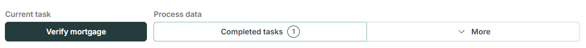

# Standard tasks

## SendBrev

The `SendBrevListener` is a standard task that accelerates using letters in any given task by extending it to make a
custom letter task.

The letter module can be used in any task, and the caseworker can at any point in any manual task initiate the
`SendBrev` overlay. The letter module is described in [indhent oplysninger](#indhent-oplysninger).

<div style="text-align: center;">

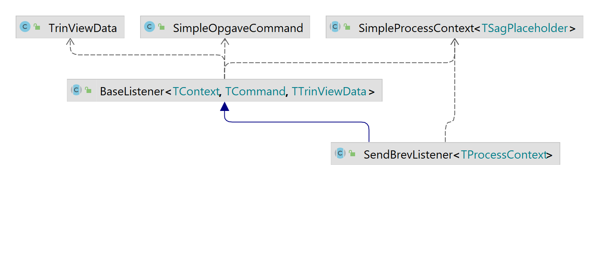
</div>

### Step overview

This step is used for sending letters to entities. The letter content can vary from information, inquiries (
`partshøring`), decisions (`agterskrivelse/afgørelse`), or any other form of written content to an entity, that is
needed as part of a business process execution.

On the step, a letter template is required. The letter template gets selected either automatically by the process based
on the defined conditions or manually by a case worker from a dropdown menu.
See [DD130 – Document template management](https://goto.netcompany.com/cases/GTE351/NCMCORE/_layouts/15/WopiFrame.aspx?sourcedoc=%7B941CD150-F452-4FF2-9014-C8036ACD970C%7D&file=DD130%20-%20Document%20generation%20and%20Document%20template%20managment.docx&action=default)
for more details about the templates. Note that it is also possible to send multiple letters at once in one step.

The letter step can be either automatic or manual. If the process has fallen out to manual processing in any of the
previous steps or if there have been any field merge errors (`flettefejl`) in a letter, then this step will fall out to
manual processing. If there have been no merging errors in a letter that’s about to be sent, then the step will be
completed automatically. It is not possible to complete the step unless all merging errors are resolved.

There exists a special merge text type called “TextInput” (
See [DD130 – Document template management](https://goto.netcompany.com/cases/GTE351/NCMCORE/_layouts/15/WopiFrame.aspx?sourcedoc=%7B941CD150-F452-4FF2-9014-C8036ACD970C%7D&file=DD130%20-%20Document%20generation%20and%20Document%20template%20managment.docx&action=default)
section "Validation and merging process" in Amplio toolkit) which can be inserted into a template to force a case worker
to overwrite the merge field.

### Step screen

The step UI is described in the standard modules [indhent oplysninger](#indhent-oplysninger).

### Step setup

To implement a letter step a new class extending `SendBrevListener` has to be created. If any project specific class
extending this listener exists, like for example `PeSendBrevListener`, then this class should be extended instead. It
requires overriding of two methods:

- `resolveOutgoingBrevType` - returns type of a letter(s) about to be sent; this type is defined as an enum of type
  `OutgoingBrevType` and it is used to determine the way letter should be sent (see 5.1.4)
- `addBreve` – contains logic to determine what letter(s) should be sent to the citizen; the letter is stored on a
  context in a list `SimpleProcessContext::tilfoejedeBreve` as an instance of `BrevCommand` class

There’s a specialized service used for creation of letters called `ProcessLetterContextService`. It contains methods
like `addBrevToContext`, which based on provided letter template and recipient entity can create and initialize
`BrevCommand` instance and put it on context.

Letter templates are defined as enum values of type `SkabelonNoegle`. Each task that includes a letter step defines
rules regarding what letter templates it can use.

```java
@Override
protected void addBreve(GenberegnYdelserContext context, String opgavePersonId, String opgaveId) {
  var application = context.getApplication();
  var fromApplication = SkabelonNoegle.valueOf(application.getBeskedskabelonNoegle());
  var
  default =SkabelonNoegle.EMPTY_LETTER;
  addBrevToContext(
          context,
          fromApplication != null ? fromApplication : default,
          context.getEntity(),
          "Optional text to show with the betingelse. Can be left null or empty."
    );
}
```

The last attribute in the above example is called `betingelseBeskrivelse` and is optional. When provided, it can be an
actual text (not necessarily a portal text) describing the condition that justifies sending of given letter.

### Different ways of letter sending

Depending on its `OutgoingBrevType` value a letter can be sent in two different ways:

- `Enkeltforsendelse` (single dispatch) – The letter is sent directly from the process via Fjernprint’s single dispatch
  service. Fjernprint has a short SLA for letters sent via the single dispatch service thus the citizen should receive
  the letter shortly after the process has finished. All letters sent as an `Enkeltforsendelse` are sent as a standard
  letter.
- `Masseforsendelse` (mass dispatch) – When a large number of letters are to be sent, Fjernprint’s mass dispatch service
  is used. This is to not overload the Fjernprint with too many calls to Fjernprint’s webservice. All letters sent in a
  `Masseforsendelse` are sent as a special letter and Fjernprint will get a warning that a large number of letters are
  to be sent so they can prepare for it.

## Ventetrin

### Step overview

A waiting step allows to stop the execution of a task until one or more specified conditions are met. Only after the
conditions are fulfilled the task can continue to the next step. The conditions can be created either automatically in
code or manually by a case worker via buttons “Indhent oplysninger” and “Udskyd behandling”, which are positioned at the
bottom of the task page.

<div style="text-align: center;">

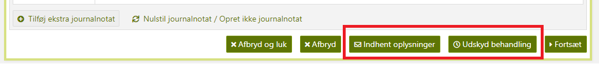
<h5>Figure 24. Buttons used for manual creation of the waiting conditions</h5>
</div>

There are three standard types of conditions available:

- a time condition, which specifies a date after reaching which a task will continue execution
- an open task condition, which awaits for all ongoing tasks of a certain type created for a citizen to be completed
- a document reply condition, which awaits a response to a `partshøring` or a letter that was sent to a citizen; this
  condition also specifies a deadline for a reply, after reaching which the process will continue

It is also possible to create custom conditions to meet specific needs of a process when the existing standard
conditions are not sufficient. Note that such conditions should be added to the context in the listener preceding the
waiting step.

After reaching a waiting step a case worker is presented with a list of waiting conditions, with a condition
description, status and a deadline if such has been set. The fulfilled conditions are marked with a green check mark,
the unfulfilled ones with a red exclamation mark. A condition description can be modified by a caseworker via
portaltext. Depending on type of a condition it might be possible to manually update condition status and deadline as
well, however for some of the condition types this option is intentionally disabled.

<div style="text-align: center;">

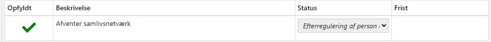

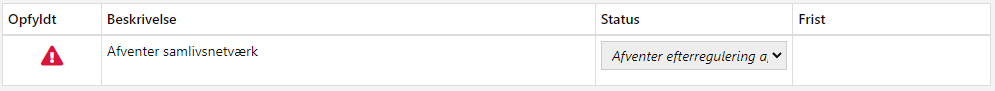
<h5>Figure 25. Examples of waiting conditions</h5>
</div>

### Step screen

<div style="text-align: center;">

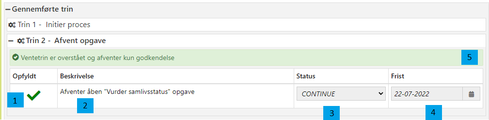
</div>

| Nr | Note                                                                                                                                                   |
|----|--------------------------------------------------------------------------------------------------------------------------------------------------------|
| 1  | Icon indicating whether the condition was met (green check) or not (red exclamation mark).                                                             |
| 2  | A condition description. It is a combination of text keys and parameters from the system so that a dynamic customizable text can be created.           |
| 3  | The conditions current status – depending on the condition type the status can be changed manually                                                     |
| 4  | A deadline – date after which a condition will automatically be marked as fulfilled. Depending on the condition type the date can be adjusted manually |
| 5  | An additional text informing about the overall waiting step status based on the status of the waiting conditions                                       |

### Step setup

To create a waiting step in a process a new class that extends `VentetrinListener` class has to be created. If a project
specific version of this listener exists, like for example `PeVentetrinListener`, then the new class should extend this
version instead.

A waiting step class needs to override a `VentetrinListener::setConditional` method. It is called to determine what
`TaskExecutionResult` conditional should be returned based on the status of waiting conditions on the context. Usually
it is sufficient to simply return `Conditional.FORTSAET`, which causes a process to leave the waiting step when all of
the conditions have been fulfilled.

```java
@Component
public class AendringAfFormueoplysningerExecutionVentetrinListener extends PeVentetrinListener<AendringAfFormueoplysningerContext, PeVentetrinCommand, PeVentetrinTrinViewData> {

    @Override
    public Conditional setConditional(AendringAfFormueoplysningerContext context) {
        return Conditional.FORTSAET;
    }

    @Override
    public OpgaveTrinType getOpgaveTrinType() {
        return PeOpgaveTrinType.AENDRING_AF_FORMUEOPLYSNINGER_EXECUTION_VENTETRIN;
    }
}
```

### Waiting conditions

A waiting step is responsible for validating one or more waiting conditions that are stored on the process context.
Therefore conditions should be put there before a waiting step is reached. Each condition is represented by an instance
of `ProcessCondition` class. The most important attributes of the condition are:

- `textKey` – a portaltekst key for a description of a condition (mandatory)
- `type` (mandatory)
- `status` – a current status of the condition (mandatory)
- `timeLimit` – specifies a condition deadline (optional)
- `conditionArgs` – a map of arguments required for condition validation (optional)

A condition type is an instance of `ProcessConditionType` enum class and it points to the validator class, which should
be used to validate the condition of given type. It also determines whether it should be possible to manually change the
condition status via a dropdown menu of a waiting step UI.

The validator extends `ProcessConditionValidator` class and has to override a `ProcessConditionValidator::getStatus`
method. This method should contain a validation logic and return a condition status depending on the validation outcome.

A status is an instance of `ProcessConditionStatus` enum class and stores a boolean value, which indicates whether a
given status means that the waiting condition has been fulfilled or not. It can also point to a particular condition
type it should be associated with, however it is not mandatory to define such type when creating a status.

When creating a custom waiting condition a new class has to be created, with fields defining this condition’s type and
available statuses. If a condition requires some additional arguments for validation, then “keys” of those arguments,
which will be placed in the `conditionArgs` map, should be defined as well. The argument value corresponding to a given
key can then be added later by using the `ProcessCondition::addArg` method after the `ProcessCondition` instance is
created.

```java
@Component
@Lazy(value = false)
public class ReportedVarmeregnskabConditionType {

    public static final ProcessConditionType REPORTED_VARMEREGNSKAB_CONDITION = ProcessConditionType.create("REPORTED_VARMEREGNSKAB_CONDITION", ReportedVarmeregnskabConditionValidator.class);

    public static final ProcessConditionStatus AFVENTER_VARMEREGNSKAB_INDBERETNING = ProcessConditionStatus.create("AFVENTER_VARMEREGNSKAB_INDBERETNING", REPORTED_VARMEREGNSKAB_CONDITION, false);
    public static final ProcessConditionStatus VARMEREGNSKAB_INDBERETTET = ProcessConditionStatus.create("VARMEREGNSKAB_INDBERETTET", REPORTED_VARMEREGNSKAB_CONDITION, true);
    public static final ProcessConditionStatus VARMEREGNSKAB_IKKE_INDBERETTET = ProcessConditionStatus.create("VARMEREGNSKAB_IKKE_INDBERETTET", REPORTED_VARMEREGNSKAB_CONDITION, true);

    public static final String CONDITION_ARG_INITIAL_NUM_VARMEREGNSKABER = "initialNumVarmeregnskaber";
}
```

### Standard waiting conditions

| Type of condition        | Class                          | General description of the condition type                                                                                                                                                                                                                                                                                                                                                                                                        | Status                                                                                                                                    | Does a deadline exist? |
|--------------------------|--------------------------------|--------------------------------------------------------------------------------------------------------------------------------------------------------------------------------------------------------------------------------------------------------------------------------------------------------------------------------------------------------------------------------------------------------------------------------------------------|-------------------------------------------------------------------------------------------------------------------------------------------|------------------------|
| Time condition           | `ProcessTimeConditionType`     | The process is awaiting a specific date before continuing.                                                                                                                                                                                                                                                                                                                                                                                       | Unfulfilled status: "PENDING_TIME" Fulfilled status: "DEADLINE_EXCEEDED"                                                                  | Yes                    |
| Open process condition   | `ProcessOpenTaskConditionType` | The process is waiting for all processes of a type to be processed. The type of task is defined by a condition argument “CONDITION_ARG_OPEN_TASK_TYPE”                                                                                                                                                                                                                                                                                           | Unfulfilled status: "PENDING_OPEN_TASK" Fulfilled status: "CONTINUE"                                                                      | No                     |
| Document reply condition | `ProcessLetterConditionType`   | The process is awaiting a response because a `partshøring`, or a letter has been sent to a citizen. The condition is at the same time awaiting a response deadline if the letter is not answered by the citizen. If the response deadline is reached, the status of the document is changed to "DEADLINE_EXCEEDED". The letter id, a response for which the condition is awaiting is defined by a condition argument “CONDITION_ARG_DOKUMENT_ID” | Not fulfilled status: "PENDING_LETTER" Fulfilled statuses: “DEADLINE_EXCEEDED”, “RESPONSE_ABANDONED”, “REPLY_RECEIVED”, “LETTER_RETURNED” | Yes                    |

### Creation and fulfillment of waiting conditions

Conditions can be created both automatically by process steps and manually by a case worker via buttons “Indhent
oplysninger” and “Udskyd behandling”. The same applies to fulfilling of a condition – it can happen either automatically
in the system or manually via case worker actions. If a condition is fulfilled by the system, it may be because a reply
letter has been received and the status of the document is changed, or if a deadline date has been reached. Conditions
fulfilled by a case worker are those conditions where the status or date has been changed by a case worker on the
waiting step screen, which gets displayed when at least one of the waiting conditions is not fulfilled.

#### When are custom conditions checked?

Finally a condition may also be fulfilled, because an event of the special type `RESUME_OPGAVE` is created. This should
be done through the convenient service method `ProcessPendingServiceImpl#notifyOpgave`. When this is done, the process
engine will pick up the process again, and recheck the condition, continuing automatically if it is now fulfilled.

Note that, specifically, this means that your conditions will not be checked again periodically. This decision was made,
to avoid a large processing overhead occurring, when many processes are waiting.

#### What happens once a condition is fulfilled

Depending on the way the condition was created/fulfilled the process behaves differently when moving to the next step.
Waiting step is not always seen as a manual step, even when a process stops on this step and step screen is displayed.
If a condition is created/fulfilled by a case worker, the process will fall out to manual processing at the next manual
step, such as the summary step. If a condition is created/fulfilled by the process engine the process will only fall out
to manual processing if it has already previously stopped on a manual step before reaching the waiting step.

#### Example

The below code snippets shows an example of waiting condition creation:

```java
context.addProcessCondition(new ProcessCondition(ReportedVarmeregnskabConditionType.AFVENTER_VARMEREGNSKAB_INDBERETNING, 
                            TimeFactory.getDate().plusMonths(parameterTimelimit).atStartOfDay().withHour(23)
                            .withMinute(59)).setTextKey("fagsystem.person.opgave.kontrol_af_varmetillaeg.afvent_nye_varmeregnskaber")
                            .addArg(ReportedVarmeregnskabConditionType.CONDITION_ARG_INITIAL_NUM_VARMEREGNSKABER, Integer.toString(currentNumVarmeregnskaber)));
```

### Document reply condition – reaching a reply deadline

If a document reply condition does not receive a response and therefore exceeds the inserted deadline for replying, the
condition must change the document status to "DEADLINE_EXCEEDED" and the condition is then met. Each time a response
deadline is exceeded a check should be made to see if there are any unprocessed `Modtag Post` processes for the person.
If unprocessed processes exist, a new condition that awaits completing of person’s unprocessed `Modtag Post` process
will be created. This is because a response to the document may already be in the system, but it has not been processed
by a case worker yet.

If a case worker processes and completes all `Modtag Post` process, the condition should automatically change the status
to "CONTINUE". A case worker should also have the option to change the status to "CONTINUE" if they conclude that the
`Modtag Post` process that exist are not responses to the condition document. Below screenshot depicts a situation where
the response deadline to a letter has been exceeded, but unprocessed `Modtag Post` process exist for the person.

<div style="text-align: center;">


<h5>Figure 26. Example of reply condition exceeding a deadline but still waiting for processing of the Modtag Post
process</h5>
</div>

### Changing of a condition deadline

In some cases it must be possible to change the response deadline/waiting deadline of a waiting condition. For all
waiting steps where the only condition is waiting for deadline (`PENDING_TIME`) it must be possible to change the date
both in the future and in the past. For waiting steps where condition is a reply to a letter within set deadline (
`PENDING_LETTER`), the choice of letter template affects how the response deadline can be changed. A case worker can
either change the deadline date in the future (but not in the past) or the date cannot be changed at all.

### Managing creation and deletion of conditions

In the waiting step, multiple conditions can be displayed simultaneously, and if a condition is met, then it should not
appear the next time the process falls out to waiting steps, unless the conditions are created in the same process step.
The only example that currently exists for this is when a letter step creates and sends multiple letters at the same
time. These conditions must be linked together, and if a condition is met, then it should not be removed from the
condition table the next time the waiting step gets displayed (after a case worker opens a process).

### Waiting for a task to be processed by the process engine

When the process engine processes a task, a spinner appears in the task module, which represents a new task page being
loaded. If it takes a long time for the process engine to process the task, the spinner should take turns displaying a "
wait page". This page contains a simple descriptive text that explains to a case worker that the task is being processed
by the system (process engine). Unlike a waiting step, a case worker cannot leave this waiting page. It also does not
display any conditions, since it is not possible to calculate how long it will take for the engine to process a task,
nor is it possible to say exactly what is happening in the process engine at a given moment.

<div style="text-align: center;">

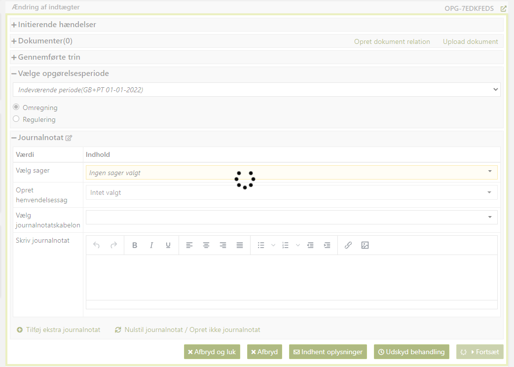
<h5>Figure 27. Loading of a task page</h5>
</div>

## Registrer afgørelse/Godkendelse

### Step overview

The step in itself doesn’t do that much – in fact, it just calls the project specific code in
`executeProjectRegistrerAfgoerelse`, and creates an event – the form of which is also fully under control of the
project. The concept that it represents however, is a very important one.

While processes run (especially complex processes), they generate a lot of data. For example, they might want to grant
some benefits, calculate them, begin the payment chain, and create a journal note. Typically, you want all of this to
happen at once. So instead of each part of the process saving their data to the relevant tables, they store these
intended actions in the process context. The task of `RegistrerAfgoerelse` is to take this placeholder data, and commit
it to the relevant database tables.

When implementing a `RegistrerAfgoerelse` step, it is advisable to:

- Prevent business logic from creeping into the `registrer afgoerelse` step. Any logic that isn’t evaluated before this
  step, can’t be displayed in an `opsummering`, and is harder to debug, as it isn’t present in the process context.
  Furthermore, once the logic is there, it can be difficult to refactor to remove it.
- Try to keep the code quite linear – instead of deeply nested code, a linear structure of “update table1, update
  table2, update table3, …” is easier to maintain.
- Delegate the responsibility for each table to a service/repository, to prevent long unreadable chunks of code.

This step is always automatic, which means no UI will ever be presented to a case worker.

### Step setup

To implement a data persistence step a new class has to be created, which extends a `RegistrerAfgoerelseListener`
abstract class. The two main actions the step is responsible for are persistence of the data created and edited by the
task and creation of a special informational event upon the step completion. Those actions are performed by the
following methods, which need to be overridden:

1. `executeProjectRegistrerAfgoerelse` – this method should contain all the logic required to persist execution result
   of the task, for example changes made to `Sager`, `Afgørelser` or `Bevilgede ydelser`.
2. `createHaendelseBuilder` – this method is responsible for creation of an informational event (`hændelse`), which
   serves a purpose of notifying case workers about the completion of the persistence step of a given task. The method
   should return an instance of `CreateHaendelseParametersBuilder` class, which is configured to create said event. A
   type of the event has to be previously defined in an appropriate class and should follow the naming scheme of process
   name and suffix “_REGISTRERET”, for example “VURDER_SAMLIVSSTATUS_REGISTRERET”.

Some projects provide their own version of the persistence step listener class, which extends
`RegistrerAfgoerelseListener`, for example `PeRegistrerAfgoerelseListener`. If such version of the class exists then it
should be extended instead when implementing a new persistence step. This is done to assure that every process in the
projects persists all the necessary data and follows the same project specific persistence rules. Additional methods
might be provided in a project specific listener, which allows persistence of data unique for the given task type.

### Follow up events

Sometimes it is necessary to create additional informational events or trigger a new process right after the persistence
step completion to assure the data and business procedure consistency. For example a process, which creates a data
record informing about citizen’s imprisonment should also trigger another process, which suspends the citizen’s benefits
for the time of imprisonment.

`RegistrerAfgoerelseListener` class extends a `FollowUpEventListener` class, which provides necessary functionality to
perform such task. This is done by overriding of a `FollowUpEventListener::determineFollowUpEvents` method. One of the
arguments of this method is `List<CreateHaendelseParametersBuilder> followUpEvents`, which is where the builders
responsible for creation of events should be stored. The builder creation is done in the same way as it was previously
mentioned regarding `RegistrerAfgoerelseListener::createHaendelseBuilder` method.

```java
@Override
protected void determineFollowUpEvents(FejlUdbetalingProcessContext context, boolean manualExecution, List<CreateHaendelseParametersBuilder> followUpEvents) {
    CreateHaendelseParametersBuilder builder = new CreateHaendelseParametersBuilder(PeHaendelseType.PROC_FEJL_UDBETALING_DEL2, DomainEntityType.OPGAVE)
            .withOpgaveId(context.getOpgaveId())
            .withGyldigFra(TimeFactory.getDate())
            .withSagId(context.getHaendelsesId())
            .withStatus(HaendelseStatus.TILFOEJET)
            .withEntity(context.getEntity());

    context.getFollowUpEvents().add(builder);
}
```

### Godkendelse step

A regular task can be marked as “godkendelse” to give it some special properties. This is done by calling
`OpgaveTrinType::asGodkendelseTrin` method on the step type after its definition. There are three major differences
between a regular step and a godkendelse step:

1. Before step is completed a validation of all journal notes takes place, it is impossible to leave the step if the
   notes contain any errors.
2. In case of any exceptions a process will roll back to the latest godkendelse step if a step the exception was thrown
   from has `OpgaveTrinType::rollbackToGodkendelseOnException` flag set to “true”.
3. The regular “Fortsæt” button used to complete the step is replaced with “Godkend” button to indicate that the given
   step is marked as godkendelse.

The godkendelse mark is usually placed on steps that require additional attention and approval from a case worker,
usually because once the step gets completed it is no longer possible to go back to the previous steps and revert the
outcome of the process execution performed up till this point. The examples of godkendelse steps are a summary step
showing all data changes made by the process right before those changes get persisted in the database or a step
responsible for sending of letters.

# 4-øjne princip

### Step Overview

Four eyes principle is a safety mechanism, which assures that a processing outcome of certain tasks receives approval of
two different case workers before it gets persisted in the database. This applies to tasks, which can directly affect
the amount of money a citizen will be paid, without prior citizen intervention (like for example sending of an
application), or tasks which change a person to whom money is paid.
The principle is that a case worker (two eyes) should not be able to grant manual benefits or change the payout
recipient without another case worker (2 extra eyes) approving such changes, hence the four eyes principle.

<div style="text-align: center;">


<h5>Figure 28: View for the first case worker (PPZ), who approved the task outcome – the approve button is disabled for
this case worker and a message is shown.</h5>
</div>

<br>

<div style="text-align: center;">

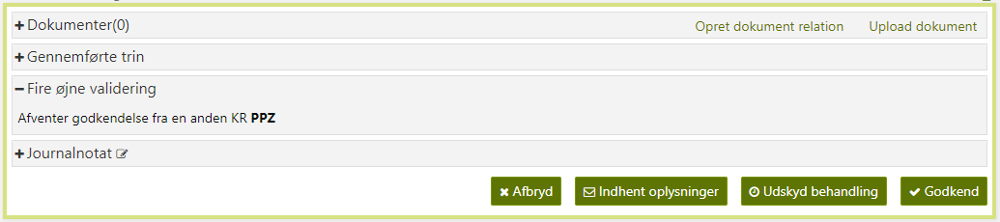
<h5>Figure 29: View for the other case worker – this case worker can approve the task.</h5>
</div>

### Step Setup

When implementing this step in a process it is not necessary to create a new class that extends an Amplio class. The
same standard `FourEyesPrincipListener` class can be reused by multiple processes by simply referencing it directly in
the corresponding BPMN process diagram node.

By default the four eyes principle step has a `OpgaveTrinType::godkendelseTrin` property set to “false”, which means
that instead of a “Godkendelse” button it displays a “Fortsæt” button and it doesn’t validate journal notes. To change
this a new class extending `FourEyesPrincipListener` can be created, together with a new `OpgaveTrinType` that this
class will use and with `OpgaveTrinType.asGodkendelseTrin` method called on a type, just like in the following example:

```java
public static final OpgaveTrinType FOUR_EYES_PRINCIP_MED_GODKENDELSE = listener("FOUR_EYES_PRINCIP_MED_GODKENDELSE", SimpleOpgaveCommand.class, TrinViewData.class).requireFourEyes().asGodkendelseTrin();
```

When approving a four eyes principle step the validation logic makes sure, that the user who first entered this step and
caused it to be displayed, is not the same user that is trying to approve it. This check is based on the “Oprettetaf”
value of the latest step in a task:

```java
private boolean isDifferentUser(TProcessContext context) {
    return !getOpgave(context).getNuvaerendeTrin().getOprettetaf().equals(ContextWrapper.get().getUsername());
}
```

If this is the case then the process will move to the next step, otherwise it will not be possible to leave the four
eyes principle step. Also if the `OpgaveTrinType::godkendelseTrin` property mentioned earlier has been enabled on the
step then the “Godkendelse” button will be disabled unless the task is opened by a different user than the one, who
created the step.

By overriding the `FourEyesPrincipListener::additionalValidation` method it is also possible to implement custom
validation logic, which will be run in addition to the standard user validation. In that case both standard and custom
validation need to pass for the process to be able to move to the next step.

```java
@Override
public TaskExecutorResult execute(TProcessContext context, boolean manualExecution) {
    if (validate(context)) {
        return new TaskExecutorResult(COMPLETED, Conditional.FORTSAET);
    } else {
        return new TaskExecutorResult(MANUAL, Conditional.MANUEL);
    }
}

private boolean validate(TProcessContext context) {
    return isDifferentUser(context)
            && additionalValidation(context);
}

protected boolean additionalValidation(TProcessContext context) {
    return true;
}
```

### A Short Guide to Using the Step

As user 1:

- Reach the step.
- Close the entity the process is running on.
- Select “afbryd og gem”, thereby releasing your reservation of the entity/process.

As user 2:

- Open the entity.
- Approve the process.

If you wish to continue as user 1 (typically the case in real world scenarios), you have to repeat the close + save step
to re-release the reservation again.

## Tjek for nye hændelser

### Step Overview

Check for new events is a safety mechanism implemented to make sure that process results, like calculation results, are
always based on the latest data, and to ensure that the users of the system, are making their decisions based on all
available data.

In a scenario, where a citizen has multiple processes that are not yet completed and still active at the same time, it
is possible that the completion of one of those processes should affect the result of remaining ones, even when those
remaining processes are already past the calculation step. For example, a process granting a benefit gets triggered, the
amount gets calculated and a process stops in a summary step. After that a case worker triggers and completes another
process that changes the citizen’s income data – used to calculate the benefit. This income change should affect the
amount calculated in the other process, therefore the calculation should be repeated.

Check for new events step detects situations like the one described above and reverts the process as far back as needed
to include the newly updated data in the result of the process. Most commonly a process gets reverted back to the
calculation step to recalculate the amount using all the latest data.

Note that any data you have read from the database and stored in the process context is also subject to becoming stale
in the above manner. For that reason, it is usually a good strategy to limit the data you store in the process context
to references, and retrieve it on demand.

<div style="text-align: center;">

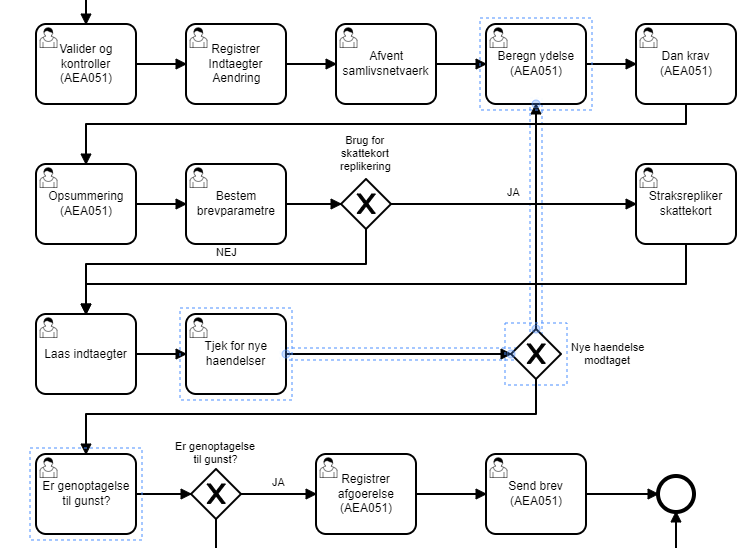
<h5>Figure 30: A fragment of a process diagram depicting usage of a Check for new events step.</h5>
</div>

### Step Setup

To implement the step a new class extending `TjekForNyeHaendelserListener` has to be created. The following two methods
have to be overridden:

1. `getAllEntities` – should return all entities that could be affected by the process completion, for example a citizen
   and citizen’s cohabitant. The step will check for all relevant events belonging to those entities.
2. `getTjekForNyeHaendelserCondition` – should return an enum value of type `Conditional` that will be used when step
   finds new events.

The event check is based on a time stamp, which has to be set in one of the steps preceding the Check for new events
step by overriding a `BaseListener::shouldUpdateNewEventCalculationTime` method. When this method returns “true” a new
time stamp gets saved in `SimpleProcessContext::newEventCalculationTime` variable upon completion of the step that
overrides the method. By default a Check for new events step searches for any events belonging to entities returned from
`TjekForNyeHaendelserListener::getAllEntities` method that were created after the said timestamp and that have a
relevant event type. The two types that are not taken into account by default are “SAG_OPRETTET” and “SAG_OPDATERET”. If
any events are found then an instance of `TaskExecutionResult` returned upon step completion will have a conditional
value set to the one that gets returned from `TjekForNyeHaendelserListener::getTjekForNyeHaendelserCondition` method. It
can then be used in a process diagram to revert the process to previous steps and repeat it using the latest data.

It is possible to customize the default step behavior by overriding the following two `TjekForNyeHaendelserListener`
methods:

1. `customExecute` – it gets executed after the search for new events and before completing of the step, it can be used
   to for example filter out some additional events based on their type or other attributes, if the specific process
   requires it.
2. `isThereOtherReasonToTurnBack` – allows to define additional rules used to determine whether a process should be
   reverted to previous steps. One of such reasons could be a running batch job, that is still not finished at the time
   of the step execution. If this method returns “true” then the process will be reverted to previous step, regardless
   of whether any new events were found or not.

### Displaying New Events

If any new events are found, it is possible to configure one of the following steps to display a list of those events in
a table. Most commonly some sort of a summary step is used for this purpose.

<div style="text-align: center;">


<h5>Figure 31: A list of events found by Check for new events step.</h5>
</div>

To achieve this a step has to implement a module called “haendelser_siden_beregning.html”, which can be set up upon step
configuration with `OpgaveTrinType::addModuler` method like this:

```java
public static OpgaveTrinType opsummeringListener(String name, Class<? extends SimpleOpgaveCommand> commandClass, Class<? extends TrinViewData> trinViewDataClass) {
    return godkendelsesListener(name, commandClass, trinViewDataClass).addModuler(Modul.HAENDELSER_SIDEN_BEREGNING, Modul.OPSUMMERING);
}
```

The Check for new events step doesn’t save the found events on the context so they have to be found again and put on a
`TrinViewData` command in the step that’s supposed to display them. It can be done with
`TjekForNyeHaendelserService::updateNewestHaendelserIfOpgaveNotCompleted` method, which is the same service the Check
for new events step uses as well.

```java
@Override
public void initTrinViewData(Model model, PeOpsummeringCommand kladdeCmd, PeOpsummeringTrinViewData trinViewData) {
    String opgaveTrinId = selectorService.getEntityById(Opgave.class, kladdeCmd.getOpgaveId()).getNuvaerendeTrin().getId();
    updateOpsummeringCommandWithHaendelserSidenBeregningCommand(kladdeCmd, opgaveTrinId);
}

private void updateOpsummeringCommandWithHaendelserSidenBeregningCommand(PeOpsummeringCommand kladdeCmd, String opgaveTrinId) {
    PeOpgaveCommand trinCmd = processDataService.getOpgaveTrinCommand(opgaveTrinId);
    if (trinCmd != null) {
        TContext processContext = getProcessContext(kladdeCmd);
        trinCmd.getHaendelserSidenBeregningCommand()
                .setPersonIds(getAllPersonIds(processContext));
        ContextWrapper.get().setOpgaveId(processContext.getOpgaveId());
        tjekForNyeHaendelserService.updateNewestHaendelserIfOpgaveNotCompleted(trinCmd.getHaendelserSidenBeregningCommand(), processContext.getOpgaveId());
        peTjekForNyeHaendelserService.filterOutExcludedHaendelser(trinCmd);
        kladdeCmd.setHaendelserSidenBeregningCommand(trinCmd.getHaendelserSidenBeregningCommand());
    }
}
```

## Cause for Attention (Undringsårsag)

Cause for attention is a feature, which notifies about occurrence of specific conditions that might require extra care
from a case worker during case handling. For example, an application is received from the self-service, where the
citizen reports data that don’t match the data from an integration, and a caseworker must assess, whether the citizen or
integration is telling the truth.

Those conditions are defined within rulesheets, which can be evaluated by a process that needs to check certain
conditions. In code the causes for attention are represented by `Undringsaarsag` class.

There are two types of causes for attention: mandatory and optional. This is also defined in a rulesheet by setting of a
value in column “Optional”. By default every cause for attention is mandatory, which means that it has to be handled by
a case worker before the step can be completed. Mandatory causes are marked with a red asterisk character (“*”) added at
the end of the cause description.

Causes for attention are displayed at the top of a step screen in a form of a condition description and a checkbox or a
button. If definition of a rulesheet condition includes an event type (hændelsetype) then the button is used. The button
triggers a subprocess that performs a process necessary to handle the cause for attention, for example providing missing
information. The UI module responsible for displaying of the causes is called `UNDRINGSAARSAGER` and is included by
default in every `OpgaveTrinType` enum.

<div style="text-align: center;">

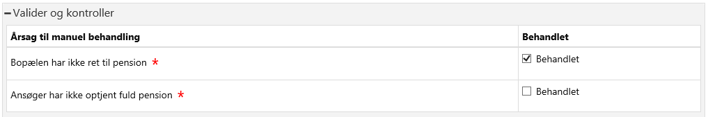
<h5>Figure 32: Example of cases for attention with checkboxes</h5>
</div>

<div style="text-align: center;">

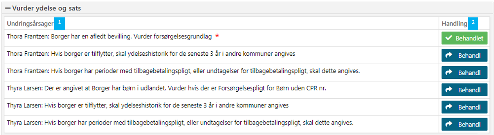
<h5>Figure 33: Example of cases for attention with buttons</h5>
</div>

<br>

| Footnote | Description                                                           |
|----------|-----------------------------------------------------------------------|
| 1        | Describes the reason for which the cause for attention was shown      |
| 2        | The method of handling of a cause of attention: checkbox or a button. |

### Rulesheet

Just as in case of a regular rulesheet, an .xlsx file with undringsårsag rulesheet is referenced via enum of type
`RegelarkNoegle`. By convention the name of an enum variable referencing undringsårsag rulesheet as well as the name of
a .xlsx file should start with prefix “undring”. A single rulesheet can define multiple causes for attention and return
multiple conclusions of type BOOLEAN so its execution mode should be set to `ALLE_KONKLUSIONER`.

If all conditions necessary for determining of a particular cause for attention are met then the rulesheet should return
a “FALSE” conclusion. Each such conclusion corresponds to one cause for attention getting displayed in a step. The
conclusions are stored on a process context in a map `SimpleProcessContext::undringsaarsagConclusions`.

<div style="text-align: center;">

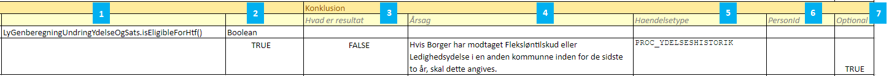
<h5>Figure 34: Example of case for attention rulesheet</h5>
</div>
<br>

| Footnote | Description                                                                                                                                                       |
|----------|-------------------------------------------------------------------------------------------------------------------------------------------------------------------|
| 1        | Call to a method that checks the cause for attention or part of the cause if more than one method is used to check it                                             |
| 2        | The value that has to be returned from the method for the cause to be valid                                                                                       |
| 3        | The value that will be returned in rulesheet conclusion if the cause is valid                                                                                     |
| 4        | A cause description that is shown in UI when it is displayed                                                                                                      |
| 5        | A type of event that will be created if the button on cause is pressed. If empty a checkbox will be shown instead and no event will be created                    |
| 6        | ID of a person for whom the event has to be created. If left empty it’s the same person for whom the process, that displays this cause for attention, was started |
| 7        | Determines whether the cause is optional or not, FALSE by default if left empty                                                                                   |

### Cause Evaluation

See [execution rules for attentions](#execution-rules-for-attentions) on how to execute rules for
attentions.

### Cause Handling and Validation

The validation is performed in `ProcessValidationService::validateUndringer` method. It is not possible to complete the
step unless all mandatory causes for attention displayed in it are handled and pass this validation. In case of causes
with checkboxes it means that all of them have to be selected. By doing that case worker confirms being aware of the
cause and that the process can continue to the next step despite the cause’s occurrence.

The cause with a button is used when it is necessary to start an additional process to handle the cause, for example to
provide/remove/update some information. Pressing of the button calls an `OpgaveHandlingController::spawnChildOpgave`
method that creates a new event of type defined in a rulesheet, which in the end results in starting of a process this
event is subscribed to. The case for attention is considered to be handled if an appropriate event has been created and
its status has been set to `AFSLUTTET`. If the rulesheet condition definition has a value set in “PersonId” column then
the event has to be created for a person with this particular ID, otherwise it will be created for the same person for
whom the process displaying case of attention was started.

# Front-end: React

# Standard Modules

## Journal note

Journal note module allows for adding journal notes to a process and relating those notes to particular cases (sager).

<div style="text-align: center;">

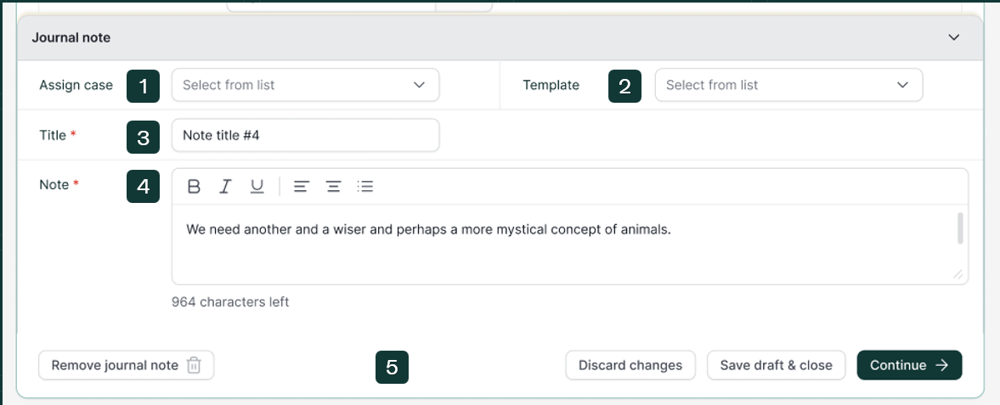
</div>

By default the Journal note is expanded to the user as seen above, this can be overridden on each project by adding
custom functionality within method `collapseJournalnotatModuleByDefault` of `ProcessAddOnServiceImpl` class.

| **Number** | **Note**                                                                                                                                                                                                                                                                                                                                                                                                                                                  |
|------------|-----------------------------------------------------------------------------------------------------------------------------------------------------------------------------------------------------------------------------------------------------------------------------------------------------------------------------------------------------------------------------------------------------------------------------------------------------------|
| 1          | Assign case – allows to associate a journal note with a particular case (sag). The dropdown list contains all citizen’s cases, both active and passive. Note that it might be the case, that you process “knows” which case is relevant for the journal note already. In that case you can use `ProcessJournalnotatService#addSagToJournalnotatFromProcesses` to set it automatically, and improve the user experience.                                   |
| 2          | Template – to write a note, a note template has to be chosen first. Those templates are defined in the “journalnotatskabelon” system parameter. It is possible to edit the content of the template, however if user chooses to change the template then the edited content will be replaced with prefilled content of the new template. The dialog box will pop up asking for confirmation before template is changed to make sure user is aware of that. |
| 3          | Title - giving the journal note a title.                                                                                                                                                                                                                                                                                                                                                                                                                  
| 4          | Note - Text box where journal note can be edited. It is possible to edit the existing template, insert links and images.                                                                                                                                                                                                                                                                                                                                  |
| 5          | Remove journal note – removes the current journal note from the process. Discard changes – resets all of the content of a journal note. Continue - saves Journal note.                                                                                                                                                                                                                                                                                    |

If there already exists some notes associated with a current process then they will be shown in the previous journal
note section “Tidligere journalnotater”. This includes notes created for the given process as well as the notes created
for the process that initiated this given process. It is not possible to edit these notes. When there are no previously
created journal notes for the process then this section will not be displayed at all.

<div style="text-align: center;">

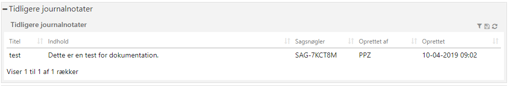
</div>

If a note is created on a process and the process is not closed / citizen is not released by a case worker then the
journal note will be saved during the night run of the batch job “Release person”. This journal note will subsequently
appear on the list of previous journal notes.

It is possible to enforce association of a certain journal note template with a particular type of process. This causes
a journal note with this template to be automatically created when the process is triggered. This is done via
“Opgavetype” field on “journalnotatskabelon” system parameter. In the below example templates “Test2” and “Test 3” have
been associated with the process of type “Telefonisk henvendelse”.

<div style="text-align: center;">

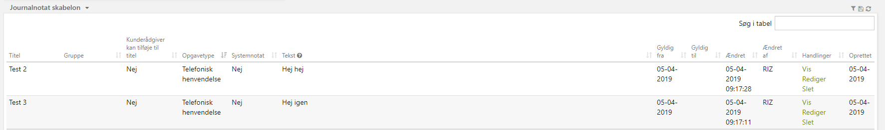
</div>

Journal notes can also be created automatically in code with `ProcessJournalnotatService::gemJournalnotat` method. This
method takes an instance of `AbstractJournalnotat` class as an argument, which holds all data of the new journal note,
as well as an optional `MyEntity` object representing the entity that’s meant to be associated with the journal note.
The `AbstractJournalnotat` instance can be created via `JournalnotatCommand::generateJournalnotat` method called on a
`JournalnotatCommand` object, that has been initiated with necessary journal note values like in the following example:

```java
@Override
public void createAndSaveJournalnotat(MyEntity entity, String opgaveId, Set<String> sagIds, String title, String note) {
    JournalnotatCommand journalnotatCommand = new JournalnotatCommand();
    journalnotatCommand.setSager(sagIds.toArray(String[]::new));
    journalnotatCommand.setSkabelonTitel(title);
    journalnotatCommand.setNotat(note);
    processJournalnotatService.gemJournalnotat(journalnotatCommand.generateJournalnotat(new Journalnotat(), opgaveId), entity);
}
```

This will also result in creation of hændelser of type `BaseHaendelseType.JOURNALNOTAT` for passed entity object and
primary part entities for sags passed to the journal note. All created journal notes should be stored on the process
context in `SimpleProcessContext::tilfoejedeJournalnotater` list.

Journal notes are validated upon completion of a step that was marked as “godkendelse”, i.e. its type has
`OpgaveTrinType::godkendelseTrin` variable set to “true”. The validation takes place in
`ProcessJournalnotatService::validateJournalnotater` method and is performed on every non-empty journal note. The note
is considered valid if it meets the following conditions:

- sager and henvendelsessager are not both null or empty
- if sag or henvendelsessag was chosen then note content cannot be empty
- a title and template title cannot be both empty
- a title can not be longer than 100 characters

If the validation fails for any of the journal notes then it will not be possible to complete the step and move to the
next one.

## Vedhæftede dokumenter

This module displays all documents from table `DOKUMENT` that are related to a given process. This includes:

- Documents related to records in table `INDGAAENDE_FORSENDELSE`, via `DOKUMENTFORSENDELSE_ID` column
- Documents related to records in table `DOKUMENT_RELATION`, via `DOKUMENT_ID` column
- Documents related to records from `ANSOEGNING` table, via `ANSOEGNING_ID` column

<div style="text-align: center;">

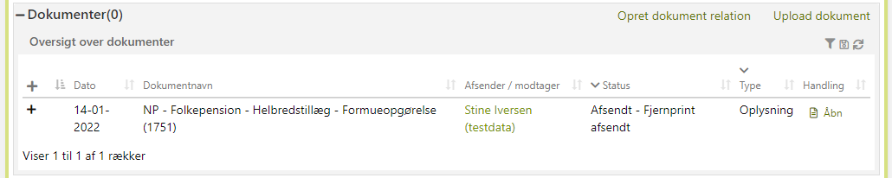
</div>

The table is generated by the `FrontOpgaveSectionService::generateDokumenterTable` method. It first fetches the
documents from the database via `ProcessDokumentService::getIndgaaendeDokumenterByOpgaveId` method and then generates an
instance of `Table` class containing the documents by calling `ProcessAddOnService::generateDokumenterTable` method.
Amplio does not provide a default implementation of this method, therefore each project has to create its own. If
additional buttons or options are needed then they can be implemented inside of this method as well.

```java
@Override
public Table generateDokumenterTable(Model model, String opgaveId) {
    List<String> dokumenterIds = processDocumentService.getIndgaaendeDokumenterByOpgaveId(opgaveId).stream()
            .map(AbstractDocument::getId)
            .collect(Collectors.toList());

    String contextPath = context.getContextPath();
    Table table = processAddOnService.generateDokumenterTable(model, "vedhaeftede-dokumenter", dokumenterIds,
            false, opgaveId, "fagsystem.person.opgave.vedhaeftninger.", contextPath);
    return tableInitializer.init(table);
}
```

By default there are two buttons available at the top of the module:

- Opret document relation – it allows to create a relation between the process and citizen’s document. It triggers a
  pop-up window where a case worker can choose a particular document and confirm creation of a new relation. As a result
  a new record in table `DOKUMENT_RELATION` gets added with `RELATIONSROLLE` set to “TILKNYTTET_OPGAVE”. Once the
  relation is created the document will start getting displayed in this module. The documents available in the pop-up
  are returned by `ProcessAddOnService::overrideGetDokuemnterForPerson` method. No default implementation of this method
  is available.
- Upload document – this allows you to upload a document from a local hard drive. The selected file needs to follow all
  the requirements of a document (size, type, title length etc.). As a result a new records in `DOKUMENT` table will be
  created with `TYPE` set to “NOTAT”, as well as two new records in `DOKUMENT_RELATION` table, which will relate
  selected document to both person and process. This is done with the
  `FrontAttachmentServiceImpl::gemDokumentationPaaOpgave` method.

## Gennemførte trin

This module displays all previously completed steps in a process. The following rules are applied when deciding what
steps to display:

- If the same step has been executed multiple times because of using “Gå til trin” option on it then only the most
  recently completed instance of the step is shown. For example if case worker chooses to go back to step nr 4 then only
  steps 1-3 will be on the list of completed steps
- If the step has been executed multiple times because of the “Tjek for nye hændelser” functionality, then every
  completed instance of the step is shown
- Only the steps that have been completed before the current step was executed are shown
- If the step is set as hidden (in the corresponding `OpgaveTrinType`), then it is not displayed.

<div style="text-align: center;">


</div>

A process can be reverted back to a previously completed step by pressing the “Gå til trin” button next to the step
name, however there are exceptions to this rule:

- If `OpgaveTrinType::disableGaaTilTrin` has been called on the definition of step type then the button will not be
  displayed and it won’t be possible to go back directly to that step, however it still might be possible to go back to
  steps that were completed before it
- If a process is currently in a waiting step then it will not be possible to go back to any of the previous steps. Only
  after the waiting step is completed this option will be enabled again
- If `ProcessOpgave::gotoStepLimit` time stamp has been set on a process then the button will not be displayed for the
  step this time stamp was set in nor for any other step that was completed before it. It also won’t be possible to go
  back to or restart any of those steps. This step limit can be set by overriding the
  `BaseListener::advanceGotoStepLimit` method:

```java
@Override
public void advanceGotoStepLimit(SimpleProcessContext context, ProcessOpgave opgave) {
    opgave.advanceGotoStepLimitToCurrentStep();
    context.setRollbackCrossed(true);
}
```

It is possible to view all content of the completed steps as it looked at the time of the step completion. It is not
possible to edit this content and all editable fields are disabled, i.e. it is not possible to see alternate values in
dropdowns but only the value that was selected.

<div style="text-align: center;">


</div>

## Initierende hændelser

This module displays a list of events (hændelser) that include an event that triggered the process as well as events
that are associated with a process via `OPGAVE_HAENDELSE` table. It serves purely informational purpose.

The list consists of a date of an event creation, a name of an event saved in `portaltekst` and initials of a case
worker that created an event. Elements of the list are sorted by the date of creation (`oprettet`) and by ID number.

<div style="text-align: center;">

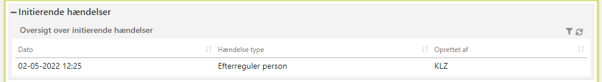
</div>

The list is created via `FrontOpgaveSectionService::generateInitierendeHaendelseTable` method, which is called upon
expansion of the module UI that is displayed at the very top of the task page, by default this module is always
contracted. Theoretically it is possible to apply an event filter by overriding the
`ProcessAddOnService::visibleInInitierendeHaendelser` method, which by default always returns “true”.

```java
List < Row > rows = new ArrayList < > ();
Stream.concat(Stream.of(haendelse), initierendeHaendelser.stream())
    .filter(processAddOnService::visibleInInitierendeHaendelser)
    .sorted(Comparator.comparing(AbstractHaendelse::getOprettet).thenComparing(AbstractHaendelse::getId))
    .forEach(h - > rows.add(getInitierendeHaendelseRow(h)));
```

By default this module is minimized and loads the data asynchronously. We can change this by overriding the
`ProcessAddOnService::collapseInitierendeHaendelserModuleByDefault` which by default always returns "true", to change it
in order to have the module expanded and preload the data, we can override it and set it to false.

## Kvittering

This module displays a list of all events that were created by the process during its execution and serves a purely
informational purpose. It gets displayed only after the process is completed, it created at least one new event and a
method `ProcessAddOnService::followupEventsEnabled` returns “true” (default implementation). The freshly created events
are stored in `Opgave::haendelses` set.

<div style="text-align: center;">

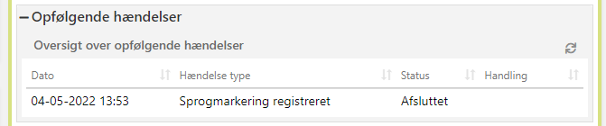
</div>

The table displaying the follow-up events is created in `FrontOpgaveSectionService::generateFollowupEventTable` method.
By default all events created by the process are shown but it is possible to implement custom filtering by overriding
the `ProcessAddOnService::visibleInFollowUpEvents` method.

```java
List < Row > rows = new ArrayList < > ();
haendelser.stream()
    .filter(haendelse - > haendelse.getEntitetstype().equals(DomainEntityType.OPGAVE.getValue()))
    .filter(processAddOnService::visibleInFollowUpEvents)
    .sorted(Comparator.comparing(AbstractHaendelse::getOprettet).thenComparing(AbstractHaendelse::getId))
    .forEach(h - > rows.add(getFollowupEventRow(h)));
```

## Indhent oplysninger

For most of the steps in the process there is an option to inquire about additional information during process execution
by using the “Indhent oplysninger” module available at the bottom of the process page.

<div style="text-align: center;">

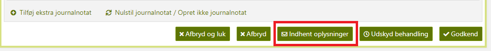
</div>

This module suspends execution of the process and allows a case worker to send a letter asking for additional
information that’s required to complete the process. It is not possible to move to the next step or previous steps nor
to edit the values in the current step until the letter is sent or until case worker decides to exit the module. It is
possible to exit the module without sending a letter by pressing the “Tilbage” button in the bottom left corner of the
module page.

<div style="text-align: center;">

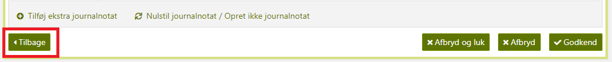
</div>

Indhent oplysninger module uses the same UI as `SendBrev` step to choose a letter to be sent.

<div style="text-align: center;">

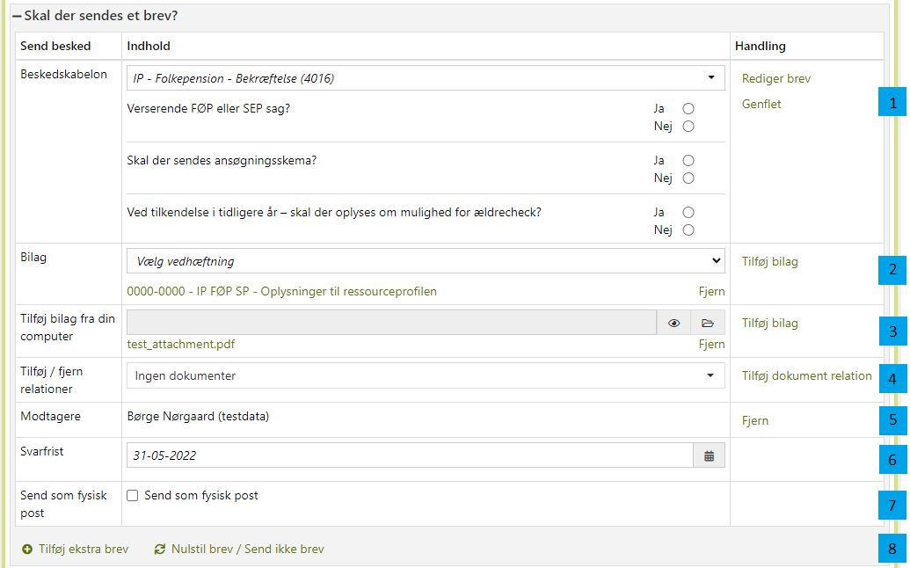
</div>

| **Footnote** | **Note**                                                                                                                                                                                                                                                                                                                                                                                                                                                                                                                                                                                                                                                                                                                                                                                                                                                                                                                                                                                                                                                                                                                                                                                                                                                                                                                                                                                                                                                                                                                                                                                                                                                                                                                               |
|--------------|----------------------------------------------------------------------------------------------------------------------------------------------------------------------------------------------------------------------------------------------------------------------------------------------------------------------------------------------------------------------------------------------------------------------------------------------------------------------------------------------------------------------------------------------------------------------------------------------------------------------------------------------------------------------------------------------------------------------------------------------------------------------------------------------------------------------------------------------------------------------------------------------------------------------------------------------------------------------------------------------------------------------------------------------------------------------------------------------------------------------------------------------------------------------------------------------------------------------------------------------------------------------------------------------------------------------------------------------------------------------------------------------------------------------------------------------------------------------------------------------------------------------------------------------------------------------------------------------------------------------------------------------------------------------------------------------------------------------------------------|
| 1            | Dropdown menu for selecting of a letter template. It is the template that specifies a document type for that message. <br>Rediger brev – allows to open the message (i.e., the pre-merged template) via Word and edit it manually. <br>Genflet – this functionality re-merges all merge fields and overwrites all changes a case worker has made to that letter. When a letter merge field requires manual insertion of a value then a message with radio buttons with available options get displayed. <br>A list of validation errors is displayed if there are some fields that cannot be merged, or there are other validation errors with the outgoing shipment: <br>- invalid file formats (defined in system parameter “letter_supposeted_file_formats_attachment”) <br>- invalid file name length (by default set to 150 characters) <br>- invalid number and size of attachments (defined in system parameter “max_size_mb_attachment”) <br>- attachment virus scan detecting issues (if virus scan is enabled) <br>- all other validations in relation to FjernPrint shipping that can be checked at the forefront. <br>Message also gets shown to a case worker informing of the status of the automatic merge. If all merging could be done automatically then a message appears informing that all fields have been merged. Otherwise, if TextInput fields exist and any merge fields that could not be automatically merged, then it will appear as a validation error on the page if a case worker tries to press “Fortsæt”. Both the existence of TextInput fields and any merge fields that could not be automatically merged will appear as validation errors on the page if a case worker tries to press “Fortsæt”. |
| 2            | Option to add attachments to the message from the existing attachments library via a dropdown menu. If there are any files attached to the template, they appear as clickable links. It is not possible for a case worker to remove attachments attached to the template by default, but it is possible to remove attachments that case workers attached themselves.                                                                                                                                                                                                                                                                                                                                                                                                                                                                                                                                                                                                                                                                                                                                                                                                                                                                                                                                                                                                                                                                                                                                                                                                                                                                                                                                                                   |
| 3            | Option to add an attachment from the local hard drive.                                                                                                                                                                                                                                                                                                                                                                                                                                                                                                                                                                                                                                                                                                                                                                                                                                                                                                                                                                                                                                                                                                                                                                                                                                                                                                                                                                                                                                                                                                                                                                                                                                                                                 |
| 4            | Option to select an existing document as an attachment, a case worker can choose to attach any of the existing documents associated with the person.                                                                                                                                                                                                                                                                                                                                                                                                                                                                                                                                                                                                                                                                                                                                                                                                                                                                                                                                                                                                                                                                                                                                                                                                                                                                                                                                                                                                                                                                                                                                                                                   |
| 5            | The recipient field is pre-populated with a primary party, it can be edited by removing the current recipient and providing a CPR or CVR of a new one (persons and companies/authorities). Only one recipient can be selected.                                                                                                                                                                                                                                                                                                                                                                                                                                                                                                                                                                                                                                                                                                                                                                                                                                                                                                                                                                                                                                                                                                                                                                                                                                                                                                                                                                                                                                                                                                         |
| 6            | All templates have a document type specified upon creation. The document type determines the response deadline, where “Anmodning” (incl. anmodninger, partshøringer) entails a mandatory response deadline. The document types “Oplysninger” and “Kvittering” do not have set deadline. The deadline is represented by a number of days a citizen has to reply to a letter and is a part of a system parameter (of type beskedskabelon) defining the letter template. The deadline date is calculated by adding those days to the date on which the letter was sent. This field is only visible for templates with a document type “Anmodning”, where the specified response deadline is dictated by the letter template used. This can only be changed to a date in the future if the template indicates that the response deadline must be editable. The date field is otherwise 'read-only'.                                                                                                                                                                                                                                                                                                                                                                                                                                                                                                                                                                                                                                                                                                                                                                                                                                        |
| 7            | Field to indicate whether the letter should be sent as a physical mail. This is dictated by the message template and can be overridden by a case worker.                                                                                                                                                                                                                                                                                                                                                                                                                                                                                                                                                                                                                                                                                                                                                                                                                                                                                                                                                                                                                                                                                                                                                                                                                                                                                                                                                                                                                                                                                                                                                                               |
| 8            | Tilføj ekstra brev – allows to create a new letter to be sent to a citizen, upon clicking a new letter screen shows up under the existing one and a case worker has to select the letter template manually. Nulstil brev/Send ikke brev – erases letter entirely and as a result nothing will be sent to a citizen upon step completion.                                                                                                                                                                                                                                                                                                                                                                                                                                                                                                                                                                                                                                                                                                                                                                                                                                                                                                                                                                                                                                                                                                                                                                                                                                                                                                                                                                                               |

# Internal Integrations

This section describes usage of other components in Amplio from within the process engine.

## Rule Engine

Rule sheets are an important part of the business modeling in Amplio. Rule sheets support declaring business rules in an
easy and configurable manner. At its core, rule sheets consist of several rows. Each row will have a set of conditions (
columns) and a conclusion. If all conditions are met, then the rule sheet will yield the conclusion for the row as a
result. A rule sheet can yield one or more results depending on its use-case.

| Input A | Input B | Input C             | Conclusion   |
|---------|---------|---------------------|--------------|
| > 5     | < 10    | = “Some text”       | Approved     |
| <= 5    | < 15    | = “Some other text” | Not Approved |
| ...     | ...     | ...                 | ...          |

Rule sheets can be used in all manners of ways within the process engine, including, but not limited to, making
decisions on grants, evaluating Cause for Attention, determining which follow-up action should be taken when completing
a process, and much more.

These different behaviors can be achieved by invoking the Rule Engine from the desired process and using the result of
the execution for the process logic. See more about the Rule Engine
in [DD130 – Rule Engine](https://source.netcompany.com/tfs/Netcompany02/NF4J/_wiki/wikis/Documentation/5126/Rule-Engine) .

### Using the Rule Engine

The rule engine has a simple interface that allows you to execute a rule sheet given some input (`Regelark` object).
When using the engine, you can either choose to evaluate the sheet for multiple conclusions (all rows that match), or
for a single conclusion (the only conclusion that matches).

<div style="text-align: center;">

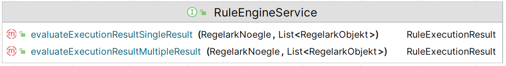
</div>

In the below example, the rule engine is used to execute a rule sheet and extract an integer value as a result of the
evaluation.

```java
public int getValueFromRulesheet(RegelarkNoegle rulesheet, RegelarkObjekt... input) {
    var result = ruleEngine.evaluateExecutionSingleResult(rulesheet, input);
    return (int) Integer.parseInteger(result.getSingleKonklusion().getValue());
}
```

### Execution Rules for Attentions

One of the core usages of the Rule Engine is for ‘Attentions’.
See [cause for attention undringsårsag](#cause-for-attention-undringsårsag)).
Attention can be evaluated from any listener in the process framework by adding a rule sheet to the `OpgaveTrinType`.

<div style="text-align: center;">

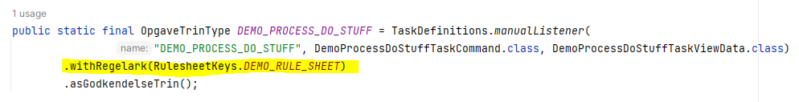
</div>

The rule sheet will automatically be given Process and Context as input objects for the evaluation, which can be
accessed from within the rule sheet.

<div style="text-align: center;">

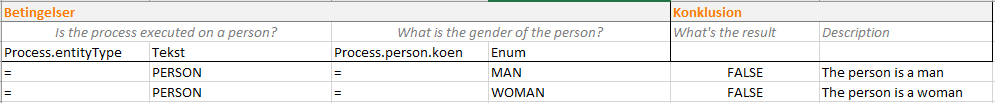
</div>

### Executing Attentions with Custom Rule Objects

Sometimes it’s advantageous to execute rule sheets with other rule sheet objects than Process and Context, e.g. Sag or
Person. However, note that the best practice is not to add Sag nor Person, but to access them via Process or Context.

To execute a rule sheet with custom rule sheet objects, override the `getRuleExecutionIntents` in the listener:

<div style="text-align: center;">

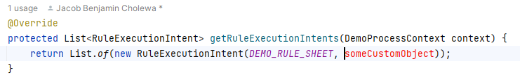
</div>

### Executing Rules for Decisions

TODO KIKR

### Rule Execution Listener (Deprecated)

The rule execution listener has been deprecated but can still be used for legacy purposes.
See [using the rule engine](#using-the-rule-engine) for the new way of using rule sheets.

## Integrations

Processes may invoke integrations as part of their execution. Integrations are often long-running calls to external vendors or systems, 
and each call may take several seconds. The process engine must handle these calls efficiently, providing redundancy, error handling,
and progress tracking. Integrations are supported as dedicated tasks within the process engine.
An integration task will invoke the integration, wait for the result, and handle any errors gracefully.

A task can register an intent to execute an integration by adding it to the context. When the integration task executes, 
if any intents exist in the context, the process will run them asynchronously. If a user is executing the task, 
a module is displayed showing which integrations are running, their statuses, and in case of errors the corresponding causes.

Failed integrations are retried automatically until they succeed or until the maximum number of retries is reached. 
This applies to both manual and automatic process execution.

If all intents complete successfully, the task finishes and the process continues. Otherwise, the task shows
which integrations failed along with their errors. The user may then choose to skip the step (if the intent
allows skipping) or retry the failed integrations.

If the system executes the task and an integration fails, the process ends with status `FAILED_INTEGRATION`.

<div style="text-align: center;">

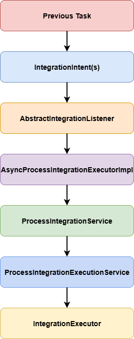
<h5>Figure 35: High-level integration execution flow.</h5>
</div>

### IntegrationListener

To execute the integration intents added to the process context, an integration task must be included in the process flow. Like any other task, the integration task has its own listener. 
The base class for this is `AbstractIntegrationListener`, which provides the core integration functionality in its execute method:

1. **Retry Handling** – Checks the current retry count and determines whether the integration should be retried. The maximum number of retries is defined by the system parameter `PROCESS_MAX_CONSECUTIVE_INTEGRATION_RETRIES`
of type `SYSTEM_CONSTANT`(default: 2). 
2. **Asynchronous Execution** – Executes the integration calls asynchronously via `AsyncProcessIntegrationExecutorImpl`(see [Asynchronous Integration Execution](#asynchronous-integration-execution)). 
3. **Process Status Resolution** – Returns the appropriate `ProcessStatus` based on the execution result:
   - `FAILED_INTEGRATION` – The integration task is not running in manual mode and at least one integration has failed.
   - `PENDING_INTEGRATION` – Integrations are still running asynchronously. 
   - `MANUAL` – The integration task is running in manual mode and at least one integration has failed.
   - `FAILED_INTEGRATION_MANUAL` – One or more integrations returned a `ProcessIntegrationError` with an ErrorCode classified as `INTEGRATION_MANUAL`.
   - `COMPLETED`: All integrations completed successfully and the process is ready to move on.

Moreover, the listener defines the `IntegrationTaskViewData` that is exposed to the frontend. 
Specifically, in the `initTaskViewData` method it sets the `showSkipButton` property. 
When this property is true, the skip button is enabled, allowing the user to skip the integration step in case of failure.
The value is set to true only if all associated `IntegrationIntent` objects return true from their `canBeSkipped` method.

Since `AbstractIntegrationListener` is an abstract class in Amplio, the framework provides a concrete implementation: `IntegrationListener`. 
This implementation is bound to the task type `AmplioTaskTypes.INTEGRATION_TASK`. If projects need to customize the execution logic or support a different `TaskType`, 
they can provide their own implementation of `AbstractIntegrationListener`.

### Asynchronous Integration Execution

The integration execution is handled by the `AsyncProcessIntegrationExecutorImpl` class through its `executeIntegrations` method.
Its responsibility is to coordinate the execution of multiple `IntegrationIntents` within an integration task, ensuring that integrations run asynchronously,
with proper retry handling, error tracking, and process continuation.

**Execution Flow**
1. **Stuck Integration Handling** – Identifies integrations that are in `IntegrationStatus.RUNNING` longer than the configured threshold, and marks them as `IntegrationStatus.FAILURE`.
   - Threshold is defined by the system parameter `PROCESS_INTEGRATION_TIMEOUT_SECONDS` of type `SYSTEM_CONSTANT` (default: 15 seconds).
2. **Running Integration Check** – If active running integrations are detected, execution stops immediately to avoid rerunning them.
3. **Intent Selection** – Determines which intents should be executed:
   - Intents that have never been executed. 
   - Failed intents, if retry is enabled.
4. **Asynchronous Execution** – Selected intents are delegated to the `ProcessIntegrationService` for execution (see [Integration Execution](#integration-execution)).
   - The executor waits only for the duration defined in `PROCESS_INTEGRATION_WAIT_BEFORE_MANUAL_TIMEOUT_SECONDS` of type `SYSTEM_CONSTANT` (default: 2 seconds). 
   - After this wait, the method returns immediately, ensuring that the process engine remains non-blocking and the user can monitor integration progress in the UI.
5. **Process Continuation** - When the `ProcessIntegrationService` finishes executing the integrations, a message event of type `EventTypes.RESUME_PROCESS` is generated.
   - This event resumes the process execution, allowing it to proceed to the next task.

**Execution Result**

The result of the `executeIntegrations` method is encapsulated in a `ProcessIntegrationExecutionResult` object.

```java
public class ProcessIntegrationExecutionResult implements Serializable {
    @Builder.Default
    private final List<ProcessIntegrationError> processIntegrationErrors = new ArrayList<>();
    @Builder.Default
    private final List<ProcessIntegrationSuccess> processIntegrationSuccesses = new ArrayList<>();
    private final boolean integrationsCompleted;
    private final boolean naturalTimeOut;
    private final boolean integrationExecutionError;
}
```

- `processIntegrationErrors` - All `ProcessIntegrationError` results returned by the integrations.
- `processIntegrationSuccesses` - All `ProcessIntegrationSuccess` results returned by the integrations.
- `integrationsCompleted` - true when all integrations have finished, either successfully or unsuccessfully.
- `naturalTimeOut` - true when the executor delegates the execution to `ProcessIntegrationService` and returns immediately (i.e., execution continues in the background).
- `integrationExecutionError` - true when an unexpected error occurs during execution.

<div style="text-align: center;">

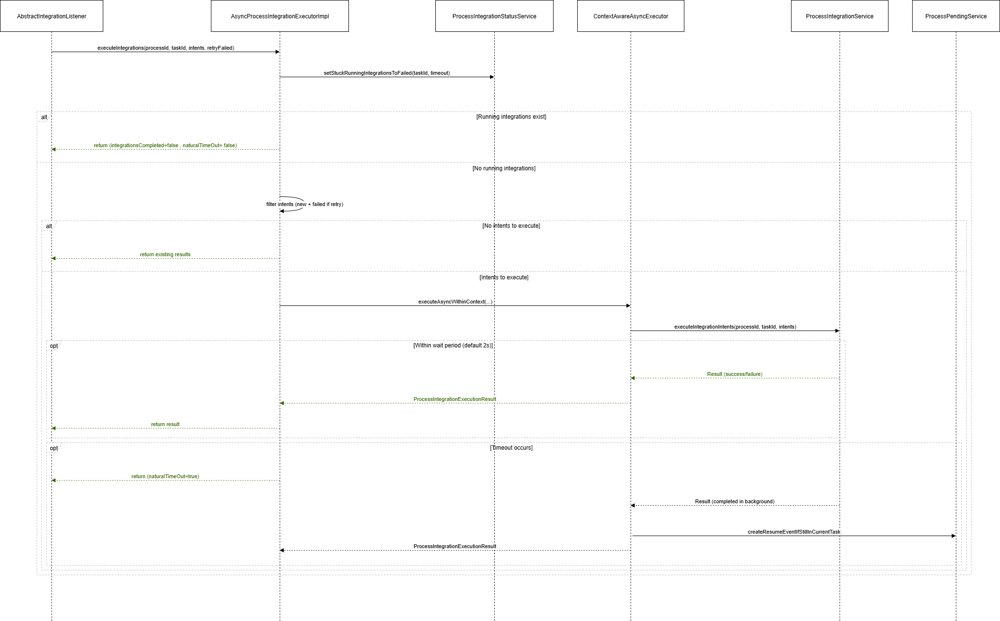
<h5>Figure 36: Integration execution sequence diagram.</h5>
</div>

#### Integration Execution

The `ProcessIntegrationService` is responsible for executing the integration intents (see [Intents](#intents)). Each intent is executed in a separate thread asynchronously via the `ProcessIntegrationExecutionService`.
- **Initialization** – Before execution starts, an entry is created in the `PROCESS_INTEGRATION_STATUS` table with status `IntegrationStatus.RUNNING`.
- **Delegation** – The actual execution is delegated to the appropriate `IntegrationExecutor` implementation (see [IntegrationExecutor](#integrationexecutor)), selected based on the type of the `IntegrationIntent`.
- **Status Update** – Once execution completes, the status of the integration is updated according to the result:
  - If execution produces a `ProcessIntegrationError` or throws an exception → status is set to `IntegrationStatus.FAILURE`.
  - If execution produces a `ProcessIntegrationSuccess` → status is set to `IntegrationStatus.SUCCESS`.
  - If the execution exceeds the configured timeout limit -> status is set to `IntegrationStatus.ERROR`.

Alongside the status, the following details are also stored in the `PROCESS_INTEGRATION_STATUS` table:
- Integration type
- Intent ID
- Task ID
- Error code (in case of error)
- Error details describing the failure

All integrations run concurrently in a thread pool. The `ProcessIntegrationService` waits for a configurable period (defined by system parameter 
`PROCESS_INTEGRATION_TIMEOUT_SECONDS` of type `SYSTEM_CONSTANT`, default 15 seconds) before canceling any still-running threads.
- Any integrations still running after this timeout are marked as failed.

### IntegrationExecutor

The actual execution of an integration call is handled by the `IntegrationExecutor` interface. It defines two methods:
- `execute` – Performs the integration logic. It receives the intent and the current attempt number.
- `getIntentType` – Returns the class of the `IntegrationIntent` that this executor supports. This is used by the integration listener
  to determine which executor to invoke for a given intent.

Each project must provide its own implementation of `IntegrationExecutor` for every custom `IntegrationIntent`.

<h5>Figure 37: Example implementation of IntegrationExecutor.</h5>

```java
@Component
public class DummyIntegrationIntentExecutor implements IntegrationExecutor<DummyIntegrationIntent> {
  @Override
  public ProcessIntegrationResult execute(DummyIntegrationIntent intent, int currentTry) {
    try {
      if (currentTry > 2) {
        return checkPreviousExecutions() ? new ProcessIntegrationSuccess(intent) : new ProcessIntegrationError(integrationIntent, AmplioErrorCodes.UNEXPECTED_INTEGRATION_ERROR);
      }
      callRestIntegration(intent.getData());
    } catch (InterruptedException e) {
      throw new CoreException(AmplioErrorCodes.UNEXPECTED_INTEGRATION_ERROR);
    }

    return new ProcessIntegrationSuccess(intent);
  }

  @Override
  public Class<DummyIntegrationIntent> getIntentType() {
    return DummyIntegrationIntent.class;
  }
}
```

The result of the `execute` method is a ProcessIntegrationResult, and it is the responsibility of the project implementation to return the correct outcome::
- `ProcessIntegrationSuccess` – returned when execution succeeds.
- `ProcessIntegrationError` – returned when execution fails.

### Intents
An Integration Intent represents a declarative instruction to perform an external integration during the execution of a process.
It encapsulates the metadata and behavior required by the process engine to execute and track the integration.

All integration intents must extend the abstract `IntegrationIntent` class:

```java
public abstract class IntegrationIntent implements Serializable {

    private IntegrationType integrationType;
    private final String processId = ContextWrapper.get().getProcessId();
    private final String id = UUID.randomUUID().toString();
    private boolean completed = false;
    private int attempts = 0;
}
```

Intents are created during process execution by tasks and submitted to the process context, where they are later executed by the integration listener.

<h5>Figure 38: Example of how an intent to send a letter is being submitted to the process context for later execution.
</h5>

```java
public void prepareIntegrations(SimpleProcessContext context, List<LetterCommand> addedLetters) {
  List<IntegrationIntent> integrationIntents = addedLetters.stream()
          .map(letter -> convertLetterToIntegrationIntent(letter))
          .toList();
  context.setIntegrationIntents(integrationIntents);
}
```


### Redundancy
The redundancy mechanism ensures that integrations stuck in `IntegrationStatus.RUNNING` are detected and retried automatically.
- The `AsyncProcessIntegrationExecutorImpl` checks for integrations that have been running longer than the time defined by the system parameter `PROCESS_INTEGRATION_TIMEOUT_SECONDS` of type `SYSTEM_CONSTANT` (default: 15 seconds).
- Stuck integrations are marked as `IntegrationStatus.FAILURE`, making them eligible for re-execution.
- For automatically executed processes, the `ProcessMaintainanceHandler` also monitors processes in the `PENDING_INTEGRATION` state and marks them as `FAILED` when necessary, 
allowing the `ProcessHandler` to retry them.
- The `IntegrationExecutor` interface requires the current attempt number as an input parameter. This ensures that executors can implement custom redundancy logic, such as handling repeated execution scenarios where an external action may already have been performed.

### Integration Module
When one or more intents are being executed, and the process is being executed by a user, then the integration module is
displayed to the user. The module provides visibility into the current execution state of each integration, including status updates and error details.
- A table lists all integrations for the current task.
- The Status column reflects whether the integration is running, has succeeded, or failed.
- While integrations are in progress, a spinner icon is displayed.

<div style="text-align: center;">

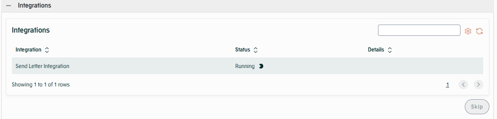
<h5>Figure 39 Integration module showing an intent in running state.</h5>
</div>

Once all integrations have successfully completed, the process automatically continues to the next task.
If one or more integrations fail, the user is presented with control options to resolve the situation:
- **Retry and continue** – reruns the failed integrations.
- **Skip** – available only when the `IntegrationIntent.canBeSkipped` method in the backend returns true. This allows the user to skip the integration task entirely if it fails.

<div style="text-align: center;">

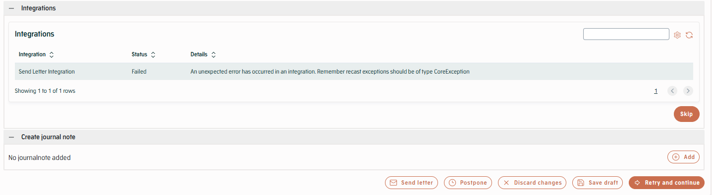
<h5>Figure 40: Integration module controls for retrying or skipping failed intents.</h5>
</div>

In case of errors, the Details column displays the error cause, ensuring the user understands what went wrong.

The integration module is implemented by the `IntegrationsTaskModule`. It is responsible for displaying integration statuses to the user and controlling interaction through periodic backend calls.
- **Integration Table** – Displayed using the Amplio table framework.
  - The table is refreshed automatically every 300 ms.
- **Status Polling** – Every 1 second, the module calls the backend endpoint:
  `/processengine/process/${taskId}/integration/status`/processengine/process/${taskId}/integration/status`. It returns the following flags
  - `hasSucceeded`: all integrations have finished successfully.
  - `hasErrors`: one or more integrations have failed.
  - `hasRunningIntegrations`: integrations are currently running.
  - `hasStuckIntegrations`: integrations are stuck (running beyond the timeout).
- **Task Completion Polling** – Every 1 second, the module checks whether the process has advanced using:
  `/processengine/process/task/isCurrentTask/${eventId}/${executionHash}`. This returns:
  - `hasMovedOn`: the execution hash has changed, meaning the task has progressed.
  - `isManual`: indicates if the process has moved to manual status.
- **Button State Management** – Button availability depends on the returned flags:
  - Disabled when one of these is true:
    - There are running integrations (not stuck). 
    - There are failed integrations but the task has not yet moved to manual. 
    - All integrations succeeded, but the process has not yet moved on. 
  - Process continues when both are true:
    - The execution hash has changed and 
    - The process has entered manual execution or all integrations have succeeded and the process has moved to the next task.

In addition to the active integration module, the process view also provides a **Completed Integrations** Module. 
This module shows the results of all previous integration tasks, including both successful and failed executions.
<div style="text-align: center;">

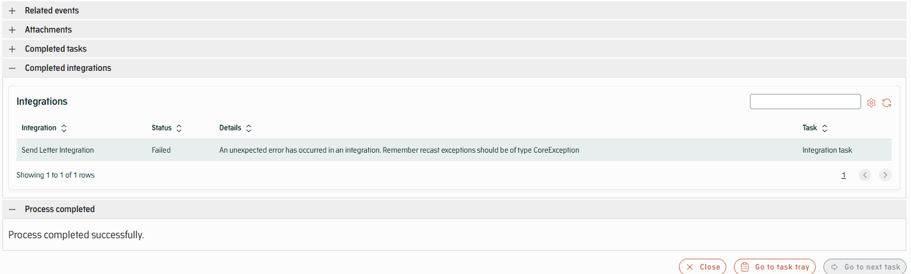
<h5>Figure 41: Completed Integrations Module.</h5>
</div>

# Navigation in Processes

<div style="text-align: center;">

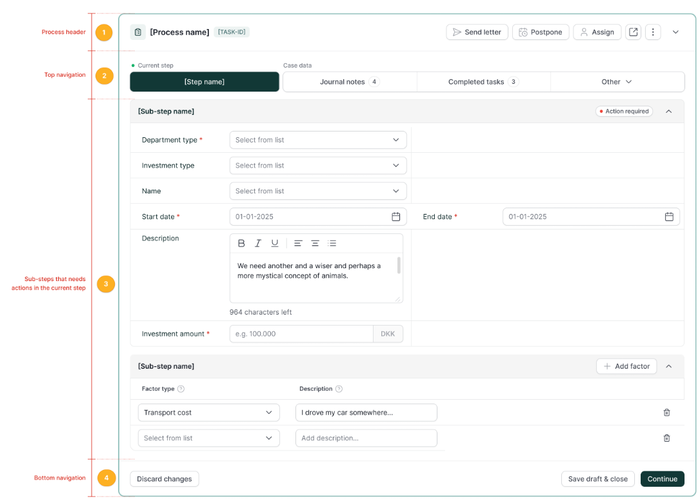
<h5>Figure 42: Process with annotation.</h5>
</div>

## 1. Process header
The process header is located at the top of a process view. It displays key information, such as the process name and task id, and provides a set of actions that can be performed on the process. These actions are rendered as either standalone buttons or as items within a menu.
The header is implemented by the ``ProcessHeader`` component, which can be configured through the public-facing ``EntityProcessEngine``. The actions within the header are fully customizable via the ``customizeHeaderActions`` prop.

By default, the process header includes the following actions, depending on system configuration and user privileges:

Buttons:
- ``Retrieve Information`` (Key: ``gather_information``)
- ``Postpone Processing`` (Key: ``postpone``)

Menu Items:
- ``Assign`` (Key: ``assign``)
- ``Open in new tab`` (Key: ``start_undock``)
- ``Update Metadata`` (Key: ``update_metadata``)

It is possible to add, remove, or modify these actions using the ``customizeHeaderActions`` prop on the ``EntityProcessEngine`` component. This prop accepts a function that receives the default list of actions and must return the final list you want to render.

Each action is an object with a position property that dictates its location: ``HeaderActionPosition.BUTTON`` for a button or ``HeaderActionPosition.MENU`` for an item in the menu.

### Example: Full Customization
This example demonstrates how to:
- Add a new custom button. 
- Move the default "Postpone" button into the menu. 
- Remove the default "Assign" menu item.

```
<EntityProcessEngine
      enableReservation
      entityType="myEntity"
      entityId={entityId}
      customizeHeaderActions={(defaultActions) => {
        // 1. Filter out an action that is not needed.
        const filteredActions = defaultActions.filter(action => action.key !== 'assign');

        // 2. Define new custom actions.
        const customActions = [
          {
            key: 'log_note',
            ptKey: 'log_note_button',
            prefixOverride: 'my_app.actions',
            icon: Log,
            onSelect: handleLogNote,
            position: ActionPosition.BUTTON, 
            variant: 'secondary',
            show: true,
          },
          {
            key: 'view_docs',
            ptKey: 'view_docs_menu_item', 
            prefixOverride: 'my_app.actions',
            icon: FileText,
            onSelect: handleViewDocs,
            position: ActionPosition.MENU, 
            show: true,
          },
        ];

        // 3. Return the new list of actions to be rendered.
        return [...customActions, ...filteredActions];
      }}
    />
```

## 2. Top navigation in process

The top navigation displays the title of the current step and other tabs for navigating among the tasks, e.g. Completed tasks and the More-button which has a set of default options.

<div style="text-align: center;">

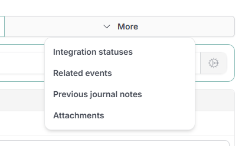
<h5>Figure 43: More-options in the top navigation.</h5>
</div>

More items can be added to the dropdown menu by passing a list of ``MenuItem`` through the props ``customProcessHeaderDropdownAction`` in the ``DefaultProcessWrapper``, for example:
```
<DefaultProcessWrapper
      customProcessHeaderDropdownAction={[{
                          show: shouldShowExampleItem == true,
                          prefixOverride: PortaltextPrefixStore.process.exampleItem,
                          key: 'example_item',
                          ptKey: 'example_item',
                          onSelect: () => doSomething(),
                        }]}
      {...props}
    >
      {children}
</DefaultProcessWrapper>
```

## 3. Sub-steps/Modules in Accordions

Accordions can be used in sub-steps with a long form or multiple forms.
Amplio provides the `useAccordionErrorOpenState` hook for implementing accordions that automatically expand to reveal backend validation errors.

### 3.1. Implementation Example using `useAccordionErrorOpenState`

This hook automatically determines which accordion items should be open on initial render, primarily to reveal validation errors returned from a backend submission.

#### How It Works

The hook inspects the form's initial state for validation errors.
*   **If errors are found** in the fields/sections mapped to an accordion, it returns an array containing only the `value`s of those specific accordions.
*   **If no errors are found**, it returns an array of all accordion `value`s, causing them to all be open by default.

The hook expects to find errors at the path `fieldName.error` for fields, or `sectionName.anyFieldName.error` for sections.

#### Usage with Backend Validation

This implementation is optimized for forms that use backend validation and cause a page reload on submission. Because the open state is calculated only once when the component renders, the returned array should be passed to the `defaultValue` prop of the Accordion component.

```tsx
export function ExampleModule() {
  const form = useGetProcessForm<Example>();

  // Map accordion `value`s to the form fields they contain.
  const accordionFieldMap: AccordionFieldMap = {
    accordion1: [
      'field1', // A simple field
      'section1.field2', // A path to a field
      'section.', // A whole section object
    ],
    accordion2: [
      'field4.' // Another section
    ],
  };

  // The hook calculates the initial open state.
  const defaultOpenAccordions = useAccordionErrorOpenState(form, accordionFieldMap);

  return (
    <Accordion type={'multiple'} defaultValue={defaultOpenAccordions}>
      <Accordion.Item value={'accordion1'}>
        {/* Form fields for field1, field2, and section... */}
      </Accordion.Item>
      <Accordion.Item value={'accordion2'}>
        {/* Form fields for field4... */}
      </Accordion.Item>
    </Accordion>
  );
}
```

**Note:** Because this uses `defaultValue`, it will not react to client-side validation changes after the initial render. It is specifically designed to set the initial open state of the accordions when the page loads.


## Navigate steps
<div style="text-align: center;">

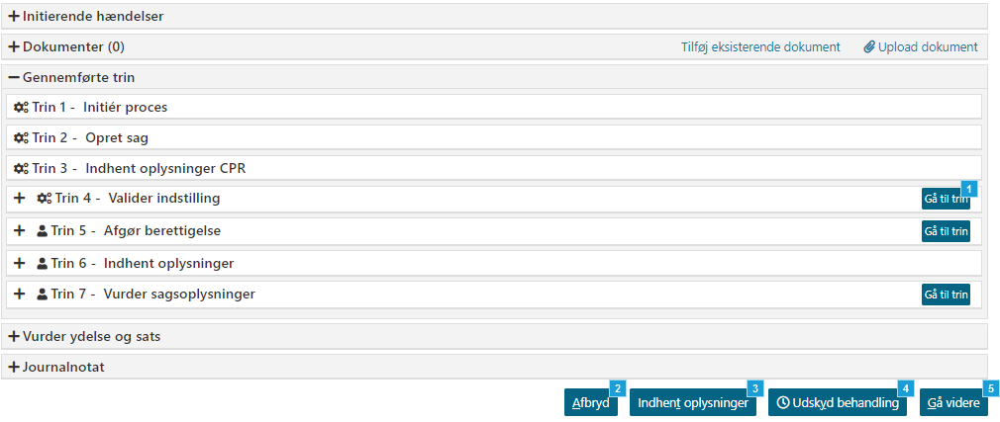
</div>

There are several different ways of navigating within a process within the standard solution. These are all shown in the
figure above, and will be described in this section:

1. **Gå til trin (Go to step):** This button will navigate to the given step in the process. The functionality is
   described in [gennemførte trin](#gennemførte-trin).
2. **Afbryd (Cancel):** This button will open a modal giving options to close the assignment and either save the
   progress or roll it back. This functionality is described in [afbryd og slet](#afbryd-og-slet).
3. **Indhent Oplysninger (Collect information):** This will trigger an overlay with the possibility to send a letter to
   a citizen asking for further information. General overlay functionality is described
   in [overlays](#overlays), but the “Indhent
   oplysninger”-overlay is described in section 7.6[indhent oplysninger](#indhent-oplysninger).
4. **Udskyd behandling (Postpone):** This will show a modal with the opportunity to postpone the assignment, which in
   turn will trigger an overlay in the form of a Ventetrin. This is described in 9.2.1.2.
5. **Gå videre (Fortsæt | Continue):** This will go to the next step of the process. This functionality is described in
   depth in [engine execution workflow](#engine-execution-workflow).

## Afbryd og slet

When pressing the Afbryd-button the modal in Figure 43 is shown. Here the user has the options: “Afbryd og Gem”, “Afbryd
og Slet” or ”Afbryd”. The functionality of the individual buttons is described in the table below the figure.

<div style="text-align: center;">

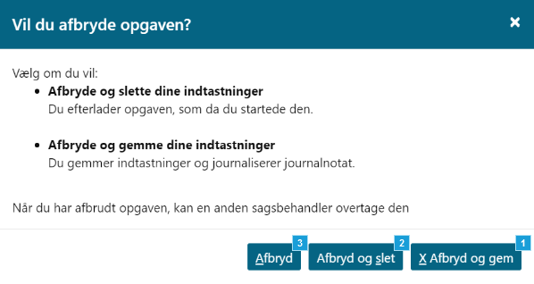
<h5>Figure 43: Modal shown after pressing "Afbryd"-button.</h5>
</div>

| **Fodnote** | **Note**                                                                                                                                                                                                                                                                                                                                                                                                                                                                                                                                                                                                                                                       |
|-------------|----------------------------------------------------------------------------------------------------------------------------------------------------------------------------------------------------------------------------------------------------------------------------------------------------------------------------------------------------------------------------------------------------------------------------------------------------------------------------------------------------------------------------------------------------------------------------------------------------------------------------------------------------------------|
| 1           | **Afbryd og gem:** By pressing this button, the following will happen: <br>1. The input-fields, letters, and causes for attention are saved to the context of the process as drafts (kladde). Hence, the information will not be saved to affect any payments or similar for the citizen, but only to allow to pick it up at another point in time. <br>2. All Journalnotater are elevated to final ones (they will be journalized and cannot be edited anymore). <br>3. The Reservation of the entity related to the process is removed.                                                                                                                      |
| 2           | **Afbryd og slet:** By pressing this button, the following will happen: <br>1. The user input will be reset to the latest point where ”Afbryd og Gem” was last pressed. <br>2. All Journalnotater in draft-state (”kladde”) will be deleted. <br>3. The Reservation of the entity related to the process is removed. <br>4. If the process is initialized by the current user, and it has not previously been saved, all traces of the process will be removed. If any cases were created by the process, the cases will be marked for deletion. The rollback functionality covering above points are further described in [rollback](#rollback). |
| 3           | **Afbryd:** By pressing this button, the modal will close and return the user to the process, as it was before the “Afbryd”-button was initially clicked.                                                                                                                                                                                                                                                                                                                                                                                                                                                                                                      |

### Rollback

Pressing the “Afbryd og Slet”-button will trigger a rollback of the process, meaning that it will rollback all the
things that have happened since the last time the process was either saved, a sub-process was created or a rollback
checkpoint was created. These events will all set the timestamp, `rollbackLimit`, on a given `Opgave`.

The rollback limit is the timestamp of the earliest state an `Opgave` can return to. The rollback limit is set in the
following situations:

- A checkpoint is created by calling the method on the context, `SimpleProcessContext::setRollbackCrossed(true)`. This
  is for instance happening when leaving a standard Ventetrin.
- An `Opgave` is initiated by an `Opgave`. The main `Opgave` will then not be able to rollback before that point.
- The state of the `Opgave` was saved by the user by pressing “Afbryd og Gem”.

If no rollback limit is set the `Opgave` will be deleted along with all its related entities when the “Afbryd og Slet”
button is pressed.

The rollback itself is handled by the method, `ProcessRollbackService::restoreProcessState`, which deletes all `Kladde`
for an `Opgave`, rolls back the steps and the `Opgave`, as well as deletes `DokumentRelations` and `Haendelser` created
since the `rollbackLimit`.

The Process Engine offers the possibility to add custom functionality for restoring the process state, in the form of
`ProcessAddOnService::rollbackCustomEntities`. This allows different projects to clean up project-specific business
entities that have been persisted in an `Opgave` since the rollback limit.

## Overlays

Overlays are actions that can be taken by the user at any manual task during the process execution. The overlay will
consist of:

- A HTML module that will be shown to the user instead of task specific UI.
- A button for submitting the overlay action.
- A button for going back from the overlay.

By default, two overlay steps exist in the solution:

- ‘Indhent oplysninger’ for sending letters.
- ‘Udskyd behandling’ for putting the process into a waiting condition.

However, overlays are a general feature for allowing projects to add more and similar actions. This section will explain
how overlays work by example of the ‘Udskyd behandling’ overlay.

To create a new overlay, two things must be done:

- Extending `ProcessOverlay` with a new overlay type. The new type is defined using a builder pattern and should define
  as minimum what HTML modules to load, which `ProcessOverlayService` to use, which executor to use, and a command
  object.
- Creating an implementation of `ProcessOverlayService` that implements `init` and `finish`. The `init` callback is
  invoked when a user enters the step, and the `finish` callback is invoked when the user tries to continue from the
  overlay.

<h5>Figure 44: Code snippet that defines the ‘Udskyd behandling’ process overlay.</h5>

```java
@Component
public class PendingConditionOverlay implements ProcessOverlayService<ProcessLetterOverlayCommand> {

    @Autowired
    private ProcessOpgaveService processOpgaveService;

    public static final ProcessOverlay PENDING_CONDITION =
            ProcessOverlay.create("PENDING_CONDITION", PendingConditionOverlay.class)
                    .withExecutor(ProcessPendingConditionExecutor.class)
                    .withCommand(ProcessLetterOverlayCommand::new)
                    .withModule(Modul.VENTETRIN)
                    .enableFurtherManualStacking()
                    .withHiddenLetters();

    @Override
    public void init(ProcessOpgave opgave,
                     SimpleProcessContext context,
                     ProcessLetterOverlayCommand overlayCommand) {
        processOpgaveService.adjustPendingDateAndForfald(context, opgave);
    }

    @Override
    public OpgaveStatus finish(ProcessOpgave opgave,
                               SimpleProcessContext context,
                               SimpleOpgaveCommand command) {
        if (context.validateConditions()) context.setProcessConditions(new ArrayList<>());
        return MANUAL;
    }

}
```

### Default Process Overlays

This section covers default process overlays in Process Engine.

#### Indhent oplysninger

During process execution, caseworkers will often have a need to obtain additional information. To facilitate this, the
‘Indhent oplysninger’ overlay allows the caseworker to open a letter module from any manual task during the process
execution. **Figure 45** shows the UI of the ‘Indhent oplysninger’ overlay.

<div style="text-align: center;">

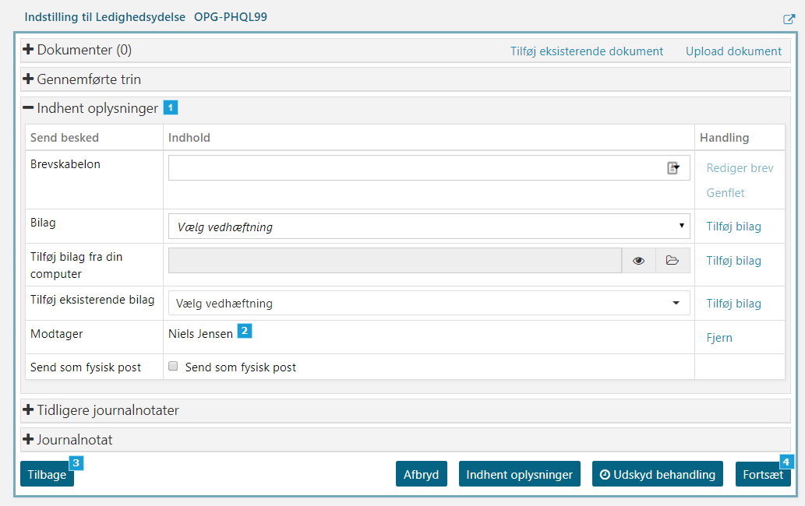
<h5>Figure 45: UI of the ’Indhent Oplysninger’ overlay.</h5>
</div>

<br>

| **Number** | **Note**                                                                                                                                                                                                                                                                        |
|------------|---------------------------------------------------------------------------------------------------------------------------------------------------------------------------------------------------------------------------------------------------------------------------------|
| 1          | **Indhent oplysninger:** The UI module will be shown as a normal module within the process. For this overlay, the module used is the general Send Letter module as described in [indhent oplysninger](#indhent-oplysninger).                                                    |
| 3          | **Tilbage:** The ’Tilbage’ button will dismiss the overlay and bring the user back to the task from where they initiated the overlay.                                                                                                                                           |
| 4          | **Fortsæt:** The ’Fortsæt’ button will submit the overlay and will try to continue. If the overlay execution is successful without any validation errors, then the action will be submitted, and the user will be taken back to the task from where they initiated the overlay. |

#### Udskyd behandling

The ’Udskyd behandling’ overlay will allow the caseworker to initiate a waiting condition. The user will enter a date
and will then continue from the modal.

<div style="text-align: center;">

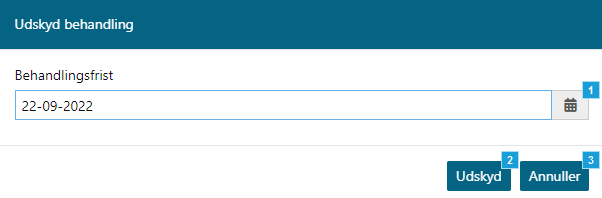
<h5>Figure 46: UI for the ’Udskyd behandling’ overlay.</h5>
</div>

<br>

| **Fodnote** | **Note**                                                                                                                                                                                                                                                                      |
|-------------|-------------------------------------------------------------------------------------------------------------------------------------------------------------------------------------------------------------------------------------------------------------------------------|
| 2           | **Behandlingsfrist:** The user can enter a date to use a pending date for the process. Waiting conditions are described further in [waiting conditions](#waiting-conditions).                                                                                                 |
| 3           | **Luk:** The ’Luk’ button will dismiss the overlay and bring the user back to the task from where they initiated the overlay.                                                                                                                                                 |
| 4           | **Udskyd:** The ’Udskyd’ button will submit the overlay and will try to continue. If the overlay execution is successful without any validation errors, then the action will be submitted, and the user will be taken back to the task from where they initiated the overlay. |

# Configurations and Service Extensions

This section details how to set up the process engine framework as well as what component requirements come along with
it.

## Code Integration

This section details the available code integrations that can affect the functionality or behavior of the process engine
framework.

### Defining Model Objects

### Defining Processes and Tasks

By nature of the process engine being a framework, it is generally the responsibility of the derivative project to
provide the process engine framework with custom process definitions and task implementations, except for some standard
process definitions and task implementations defined by the process engine framework itself. However, since this is an
entire topic on its own,
see [C0200 – Getting started with processes](https://goto.netcompany.com/cases/GTE351/NCMCORE/Amplio%20Deliverables/Amplio%202025/C0200%20-%20User%20Guides/C0200%20-%20Getting%20started%20with%20Processes.docx)
for more information on getting started with
custom process definitions.

### Defining Integration Intents

To implement a new integration call within a process, you need to do the following things:

- Add the integration to the `IntegrationType` enum. You can do a project-side `IntegrationType` class that extends the
  Amplio-IntegrationType enum, and from within that, call the create constructor.

```java
public class ProjectIntegrationType extends IntegrationType {

    public static final IntegrationType CUSTOM_INTEGRATION = create("CUSTOM_INTEGRATION",
            CustomIntegrationIntent::new);

    public static void init() {
        // Do nothing...
    }

}
```

- Create a new Intent type by extending the `IntegrationIntent` and override the `canBeSkipped` method. 
 
```java
@Getter
@Setter
public class CustomIntegrationIntent extends IntegrationIntent {

    private final String someInput;

    @Override
    public boolean isSkipable() {
        return true;
    }

}
```

- Implement the custom `IntegrationExecutor` that is compatible with the new Intent type.

```java
@Component
public class CustomIntegrationIntentExecutor implements IntegrationExecutor<CustomIntegrationIntent> {
  @Override
  public ProcessIntegrationResult execute(CustomIntegrationIntent intent, int currentTry) {
      if (currentTry > 2) {
        return new ProcessIntegrationError(intent, AmplioErrorCodes.PROCESS_INTEGRATION_ERROR);
      }
      try {
          callRestIntegration(intent.getSomeInput());
      } catch (InterruptedException e) {
          return new ProcessIntegrationError(intent, AmplioErrorCodes.UNEXPECTED_INTEGRATION_ERROR);
      }
      return new ProcessIntegrationSuccess(intent);
  }

  @Override
  public Class<CustomIntegrationIntent> getIntentType() {
    return CustomIntegrationIntent.class;
  }
}
```

Hereafter, you can call the integration in your listener by adding the `IntegrationIntent` to the context. It’s good
practice for your listener to do nothing else but calling the integration(s).

```java
@Component
public class CustomTaskListener extends BaseListener<?, ?, ?> {

    @Override
    public TaskExecutorResult addIntegrationIntents(FlexProcessContext context, boolean manualExecution) {
        context.getIntegrationIntents().add(createIntentWithData("input"));
    }

    @Override
    public TaskType getTaskType() {
        return ...
    }

  private static IntegrationIntent createIntentWithData(String input) {
    CustomeIntegrationIntent integrationIntent = IntegrationIntent.build(ProjectIntegrationType.CUSTOM_INTEGRATION);
    integrationIntent.setSomeInput(input);
    return integrationIntent;
  }

}
```

### Extending Process Addon Service

The `ProcessAddonService` provides various hooks to override or extend various parts of the process engine.

#### Add Custom Attributes to Model

`appendToProcessModel` allows the user to add custom attributes to the model that is available to all tasks. This is
useful if there are attributes that are shared across tasks.

##### Signature

```java
@Service("processAddOnService")
public class ProcessAddOnServiceImpl implements ProcessAddOnService<Sag, Opgave, FyProcessContext, Dokument, Journalnotat> {

    @Override
    public void appendToProcessModel(Model model, OpgaveFlow opgaveFlow) {
    }
}
```

### Extending Letter Addon Service

### Implementing Domain Helper Service

### Implementing Postage Service

### Implementing Document Validation Rule

## Configurable Settings

This section details the available configuration settings that can affect the functionality or behavior of the process
engine.

### Configuration Classes

For an overview of the configuration classes provided by the discard library for inclusion by derivative projects, see
Table 4. For dependency diagrams visualizing the component model of each of these components,
see [component model](#component-model) instead.

<h5>Table 4: The configuration classes that the process engine provides for configuring its beans, listed by
component.</h5>

| Configuration                 | Component           |
|-------------------------------|---------------------|
| ProcessAdminConfig            | process-admin       |
| ProcessEngineConfig           | process-engine      |
| ProcessEngineApiConfig        | process-engine-api  |
| ProcessEngineRestConfig       | process-engine-rest |
| ProcessEngineFrontmocksConfig | process-front-mocks |
| ReactProcessesConfig          | processes           |
| ProcessThymeleafConfig        | process-thymeleaf   |
| ThymeleafProcessesConfig      | thymeleaf-processes |

### Application Properties

For an overview of the application properties that the discard library is aware of within derivative applications, see
Table 5.

<h5>Table 5: The application properties that the process engine is aware of, listed with default values.</h5>

| Property                             | Default |
|--------------------------------------|---------|
| my.process_engine.execution.disabled | false   |

### System Parameters

For an overview of the system parameters that the discard library utilizes for derivative applications, see Table 6.

**Table 6:** The system parameters that the process engine utilizes, listed by type and with default values.

| Type                 | Key                                  | Default |
|----------------------|--------------------------------------|---------|
| applikationskonstant | EVENT_HANDLER_ENABLED                | false   |
| applikationskonstant | PROCESS_ENGINE_ENABLED               | false   |
| applikationskonstant | PROCESS_ENGINE_MAX_LOAD_PERCENTAGE   | 80      |
| applikationskonstant | PROCESS_ENGINE_STATIC_THREAD_COUNT   | N/A     |
| applikationskonstant | PROCESS_RIGHTS_ENABLED               | true    |
| systemkonstant       | failed_integration_stacktrace_hidden | false   |
| systemkonstant       | process_engine_failed_retries        | 3       |
| systemkonstant       | PROCESS_INTEGRATION_TIMEOUT_SECONDS  | 15      |
| systemkonstant       | SEND_LETTERS_FROM_BATCH              | false   |

## Roles and Rights

This section outlines the security roles enforced by the process engine framework alongside their corresponding usage
purposes.

### Controller Security

For an overview of the controllers exposed by the minimization framework that are secured by security roles alongside
their root paths, see Table 7. Remark that some of these security roles are introduced by the `ProcessSecurityRole`
enumeration.

<h5>Table 7: The endpoint paths that the process engine framework exposes and their corresponding security roles.</h5>

| Controller                       | Root path               | Security role                     |
|----------------------------------|-------------------------|-----------------------------------|
| ProcessTaskAdminController       | /admin/fejlhaandtering  | ADM_ERROR_HANDLING                |
| ProcessEventAdminController      | /admin/haendelser       | ADM_HAENDELSER_READ               |
| ProcessEngineAdminController     | /admin/processengine    | ADM_ERROR_HANDLING_PROCESS_ENGINE |
| ProcessDiagramViewController     | /admin/processer        | ADM_PROCESSER_READ                |
| OpgaveController                 | /opgave                 | FS_OPGAVEINDBAKKE                 |
| ProcessModulController           | /opgave                 | FAG_WRITE, ADM_WRITE              |
| ProcessThymeleafManualController | /opgave                 | FAG_READ, ADM_READ                |
| BrevController                   | /opgave/brev            | FAG_WRITE                         |
| OpgaveAfbrydController           | /opgave/handling        | FAG_READ, FAG_WRITE               |
| OpgaveHandlingController         | /opgave/handling        | FAG_READ, FS_OPGAVEINDBAKKE       |
| ProcessIntegrationController     | /opgave/handling        | FAG_READ                          |
| ProcessOverlayController         | /opgave/handling        | FAG_READ                          |
| JournalnotatController           | /opgave/journalnotat    | FAG_WRITE                         |
| AttachmentController             | /opgave/vedhaeftning    | FAG_READ                          |
| OpgaveDocumentRestController     | /rest/api/processengine | N/A                               |
| OpgaveHandlingRestController     | /rest/api/processengine | N/A                               |
| OpgaveJournalNotesRestController | /rest/api/processengine | FS_OPGAVEINDBAKKE                 |
| OpgaveRestController             | /rest/api/processengine | FS_OPGAVEINDBAKKE                 |
| SendBrevRestController           | /rest/api/processengine | FAG_WRITE                         |

### Service Security

The process engine framework enforces several security roles at the service layer, in the form of specific read and
write security roles per process definition supplied to the process engine framework by the derivative project. These
process rights are automatically generated according to the following naming convention upon application startup for a
given process definition:

- Read access: `PROC_<TYPE>_READ`
- Write access: `PROC_<TYPE>_WRITE`

Remark that the process engine framework defines a system parameter, which specifies whether process rights should be
enabled and used by the derivative application or not, and which is enabled by default,
see [system parameters](#system-parameters) for more information.

#### Read Access

Given a specific process definition, its read access right governs all views of processes of the given type in the
derivative application, as well as all related data for processes of the given type. Examples of such governance include
the following:

- Viewing the current process module for a process of the given type.
- Viewing the previous journal notes for a process of the given type.
- Viewing the completed tasks for a process of the given type.

#### Write Access

Given a specific process definition, its write access right governs all modification of processes of the given type in
the derivative application, as well as all related data for processes of the given type. Examples of such governance
include the following:

- Creating a process of the given type via the action dropdown menu.
- Modifying the current process module for a process of the given type.
- Continuing, aborting, or other such manual handling of the process flow for a process of the given type.

## Database Patches

This section details the database modifications necessary for using the process engine framework, including suggested
database patches to apply the database modifications in derivative projects. Remark that the presented database patches
are Oracle specific, whereby adjustments are necessary for PostgreSQL databases. See [data model](#data-model) for
more information regarding the data model of the process engine framework, such as dependency diagrams and field
descriptions for the related tables.

### Modifying Data Model

The process engine framework suggests the following database patches to be included in the derivative project database
setup. Remark that these should be adapted to the needs of the derivative project (e.g., relationship metadata and
auxiliary attributes).

#### ANSOEGNING

```sql
CREATE TABLE ANSOEGNING
(
    ID                 VARCHAR2(36)  NOT NULL,
    ANSOEGNINGSINDHOLD CLOB,
    OPRETTET           TIMESTAMP NOT NULL,
    OPRETTETAF         VARCHAR2(500) NOT NULL,
    AENDRET            TIMESTAMP NOT NULL,
    AENDRETAF          VARCHAR2(500) NOT NULL
);
```

#### BREVDATA

```sql
CREATE TABLE BREVDATA
(
    ID           VARCHAR(50)  NOT NULL,
    HAENDELSE_ID VARCHAR(50),
    DATA         CLOB,
    AENDRET      TIMESTAMP    NOT NULL,
    AENDRETAF    VARCHAR(500) NOT NULL,
    OPRETTET     TIMESTAMP    NOT NULL,
    OPRETTETAF   VARCHAR(500) NOT NULL
);
```

#### DOKUMENT_RELATION

```sql
CREATE TABLE DOKUMENT_RELATION
(
    ID             VARCHAR2(50)  NOT NULL,
    DOKUMENT_ID    VARCHAR2(50)  NOT NULL,
    ENTITY_ID      VARCHAR2(50)  NOT NULL,
    ENTITY_TYPE    VARCHAR2(50)  NOT NULL,
    RELATIONSROLLE VARCHAR2(50)  NOT NULL,
    URN            VARCHAR2(50),
    UUID           VARCHAR2(50),
    OPRETTET       TIMESTAMP NOT NULL,
    OPRETTETAF     VARCHAR2(500) NOT NULL,
    AENDRET        TIMESTAMP NOT NULL,
    AENDRETAF      VARCHAR2(500) NOT NULL
);
```

#### HAENDELSE

```sql
CREATE TABLE HAENDELSE
(
    ID                     VARCHAR2(50)   NOT NULL,
    HAENDELSE_TEKST        VARCHAR2(2000) NOT NULL,
    HAENDELSE_TYPE         VARCHAR2(200)  NOT NULL,
    HAENDELSE_DATA         VARCHAR2(4000),
    PARENT_ID              VARCHAR2(50),
    RESERVED_BY            VARCHAR2(36),
    ENTITY_ID              VARCHAR2(50),
    ENTITY_TYPE            VARCHAR2(50),
    STATUS                 VARCHAR2(100)  NOT NULL,
    INITIERET_AF_OPGAVE_ID VARCHAR2(50),
    STRAKSEKSEKVER         VARCHAR2(1)    NOT NULL,
    OPRETTET               TIMESTAMP NOT NULL,
    OPRETTETAF             VARCHAR2(500)  NOT NULL,
    AENDRET                TIMESTAMP NOT NULL,
    AENDRETAF              VARCHAR2(500)  NOT NULL
);
```

#### HAENDELSE_DETALJE

```sql
CREATE TABLE HAENDELSE_DETALJE
(
    ID           VARCHAR2(50)  NOT NULL,
    HAENDELSE_ID VARCHAR2(50),
    VAERDI       CLOB,
    OPRETTET     TIMESTAMP NOT NULL,
    OPRETTETAF   VARCHAR2(500) NOT NULL,
    AENDRET      TIMESTAMP NOT NULL,
    AENDRETAF    VARCHAR2(500) NOT NULL
);
```

#### HAENDELSE_RELATION

```sql
CREATE TABLE HAENDELSE_RELATION
(
    ID           VARCHAR2(50)  NOT NULL,
    HAENDELSE_ID VARCHAR2(50)  NOT NULL,
    ENTITY_ID    VARCHAR2(50)  NOT NULL,
    ENTITY_TYPE  VARCHAR2(50)  NOT NULL,
    OPRETTET     TIMESTAMP NOT NULL,
    OPRETTETAF   VARCHAR2(500) NOT NULL,
    AENDRET      TIMESTAMP NOT NULL,
    AENDRETAF    VARCHAR2(500) NOT NULL
);
```

#### JOURNALNOTAT

```sql
CREATE TABLE JOURNALNOTAT
(
    ID                       VARCHAR2(50)  NOT NULL,
    OPGAVE_ID                VARCHAR2(50),
    TITEL                    VARCHAR2(256),
    HENVSAGER_TIL_OPRETTELSE VARCHAR2(50),
    NOTAT                    CLOB,
    SKABELON_NOEGLE          VARCHAR2(100),
    SKABELON_TITEL           VARCHAR2(100),
    FRITAGET_AKTINDSIGT      VARCHAR2(1),
    ENDELIG_DATO             TIMESTAMP,
    OPRETTET                 TIMESTAMP NOT NULL,
    OPRETTETAF               VARCHAR2(500) NOT NULL,
    AENDRET                  TIMESTAMP NOT NULL,
    AENDRETAF                VARCHAR2(500) NOT NULL
);
```

#### JOURNALNOTAT_RELATION

```sql
CREATE TABLE JOURNALNOTAT_RELATION
(
    ID              VARCHAR2(50)  NOT NULL,
    JOURNALNOTAT_ID VARCHAR2(50)  NOT NULL,
    ENTITY_ID       VARCHAR2(50)  NOT NULL,
    ENTITY_TYPE     VARCHAR2(50)  NOT NULL,
    OPRETTET        TIMESTAMP NOT NULL,
    OPRETTETAF      VARCHAR2(500) NOT NULL,
    AENDRET         TIMESTAMP NOT NULL,
    AENDRETAF       VARCHAR2(500) NOT NULL
);
```

#### KLADDE

```sql
CREATE TABLE KLADDE
(
    ID         VARCHAR2(50)  NOT NULL,
    OPGAVE_ID  VARCHAR2(50),
    KLADDE     NCLOB,
    OPRETTET   TIMESTAMP NOT NULL,
    OPRETTETAF VARCHAR2(500) NOT NULL,
    AENDRET    TIMESTAMP NOT NULL,
    AENDRETAF  VARCHAR2(500) NOT NULL
);
```

#### OPGAVE

```sql
CREATE TABLE OPGAVE
(
    ID                       VARCHAR2(36)  NOT NULL,
    FORFALDSDATO             DATE,
    NULSTILLINGSDATO         DATE,
    ENTITY_ID                VARCHAR2(50),
    ENTITY_TYPE              VARCHAR2(50),
    PRIORITET                NUMBER(8),
    BRUGERVENDT_NOEGLE       VARCHAR2(50),
    BEHANDLET_AF             VARCHAR2(500),
    PROCESMOTOR_PRIORITERING NUMBER(6),
    PENDING_TIME             DATE,
    ROLLBACK_LIMIT           TIMESTAMP,
    GOTO_STEP_LIMIT          TIMESTAMP,
    TITLE                    VARCHAR2(500),
    SUB_TYPE                 VARCHAR2(100),
    AARSAG                   VARCHAR2(100),
    RESERVED_BY              VARCHAR2(36),
    EXECUTION_HASH           VARCHAR2(36),
    ERROR_COUNT              NUMBER(1),
    STATUS                   VARCHAR2(100),
    OPRETTET                 TIMESTAMP NOT NULL,
    OPRETTETAF               VARCHAR2(500) NOT NULL,
    AENDRET                  TIMESTAMP NOT NULL,
    AENDRETAF                VARCHAR2(500) NOT NULL
);
```

#### OPGAVE_DATA

```sql
CREATE TABLE OPGAVE_DATA
(
    ID         VARCHAR2(50)  NOT NULL,
    OPGAVE_ID  VARCHAR2(50)  NOT NULL,
    TYPE       VARCHAR2(50)  NOT NULL,
    VALUE      CLOB      NOT NULL,
    OPRETTET   TIMESTAMP NOT NULL,
    OPRETTETAF VARCHAR2(500) NOT NULL,
    AENDRET    TIMESTAMP NOT NULL,
    AENDRETAF  VARCHAR2(500) NOT NULL
);
```

#### OPGAVE_HAENDELSE

```sql
CREATE TABLE OPGAVE_HAENDELSE
(
    OPGAVE_ID    VARCHAR2(50)  NOT NULL,
    HAENDELSE_ID VARCHAR2(50)  NOT NULL,
    OPRETTET     TIMESTAMP NOT NULL,
    OPRETTETAF   VARCHAR2(500) NOT NULL,
    AENDRET      TIMESTAMP NOT NULL,
    AENDRETAF    VARCHAR2(500) NOT NULL
);
```

#### OPGAVE_SAG_RELATION

```sql
CREATE TABLE OPGAVE_SAG_RELATION
(
    OPGAVE_ID  VARCHAR2(50)  NOT NULL,
    SAG_ID     VARCHAR2(50)  NOT NULL,
    OPRETTET   TIMESTAMP NOT NULL,
    OPRETTETAF VARCHAR2(500) NOT NULL,
    AENDRET    TIMESTAMP NOT NULL,
    AENDRETAF  VARCHAR2(500) NOT NULL
);
```

#### OPGAVE_TRIN

```sql
CREATE TABLE OPGAVE_TRIN
(
    ID                       VARCHAR2(50)  NOT NULL,
    BPM_TASK_ID              VARCHAR2(50),
    OPGAVE_TRIN_TYPE         VARCHAR2(100),
    PROCESMOTOR_PRIORITERING NUMBER(6),
    AUTOMATISK_TRIN          VARCHAR2(1)   NOT NULL,
    IS_BACKUP                VARCHAR2(1)   NOT NULL,
    OPRETTET                 TIMESTAMP NOT NULL,
    OPRETTETAF               VARCHAR2(500) NOT NULL,
    AENDRET                  TIMESTAMP NOT NULL,
    AENDRETAF                VARCHAR2(500) NOT NULL
);
```

#### OPGAVE_TRIN_DATA

```sql
CREATE TABLE OPGAVE_TRIN_DATA
(
    ID             VARCHAR2(50)  NOT NULL,
    OPGAVE_TRIN_ID VARCHAR2(50)  NOT NULL,
    TYPE           VARCHAR2(50)  NOT NULL,
    VALUE          CLOB,
    OPRETTET       TIMESTAMP NOT NULL,
    OPRETTETAF     VARCHAR2(500) NOT NULL,
    AENDRET        TIMESTAMP NOT NULL,
    AENDRETAF      VARCHAR2(500) NOT NULL
);
```

### Setting Up History Triggers

The process engine framework suggests setting up the following history triggers to be included in the derivative project
database setup. Remark that while these are used by the process engine framework to support rollbacks, not just for
technical history.

#### OPGAVE_H

```sql
CREATE TABLE OPGAVE_H
(
    ID                       VARCHAR2(36)  NOT NULL,
    FORFALDSDATO             DATE,
    NULSTILLINGSDATO         DATE,
    ENTITY_ID                VARCHAR2(50),
    ENTITY_TYPE              VARCHAR2(50),
    PRIORITET                NUMBER(8),
    BRUGERVENDT_NOEGLE       VARCHAR2(50),
    BEHANDLET_AF             VARCHAR2(500),
    PROCESMOTOR_PRIORITERING NUMBER(6),
    PENDING_TIME             DATE,
    ROLLBACK_LIMIT           TIMESTAMP,
    GOTO_STEP_LIMIT          TIMESTAMP,
    TITLE                    VARCHAR2(500),
    SUB_TYPE                 VARCHAR2(100),
    AARSAG                   VARCHAR2(100),
    RESERVED_BY              VARCHAR2(36),
    EXECUTION_HASH           VARCHAR2(36),
    ERROR_COUNT              NUMBER(1),
    STATUS                   VARCHAR2(100),
    OPRETTET                 TIMESTAMP NOT NULL,
    OPRETTETAF               VARCHAR2(500) NOT NULL,
    AENDRET                  TIMESTAMP NOT NULL,
    AENDRETAF                VARCHAR2(500) NOT NULL,
    HISTORIK_FRA             TIMESTAMP,
    HISTORIK_TIL             TIMESTAMP
);
```

#### TRG_OPGAVE_H

```sql
CREATE
OR REPLACE EDITIONABLE TRIGGER TRG_OPGAVE_H
    BEFORE DELETE
OR INSERT OR
UPDATE
    ON OPGAVE
    FOR EACH ROW
BEGIN
    IF
UPDATING THEN
UPDATE OPGAVE_H H
SET HISTORIK_TIL = SYSTIMESTAMP
WHERE H.ID = :OLD.ID
  AND HISTORIK_TIL = TO_DATE('9999-12-31', 'yyyy-mm-dd');
END IF;
    IF
DELETING THEN
UPDATE OPGAVE_H H
SET HISTORIK_TIL = SYSTIMESTAMP,
    AENDRETAF    = SUBSTR(AENDRETAF, 0, 400) || ' - SLETTETAF: ('
        || SYS_CONTEXT('USERENV', 'SESSION_USER') || '/'
        || SYS_CONTEXT('USERENV', 'OS_USER') || ', '
        || SYS_CONTEXT('USERENV', 'HOST') || '/'
        || SYS_CONTEXT('USERENV', 'IP_ADDRESS') || ')'
WHERE H.ID = :OLD.ID
  AND HISTORIK_TIL = TO_DATE('9999-12-31', 'yyyy-mm-dd');
END IF;
    IF
INSERTING OR UPDATING THEN
        INSERT INTO OPGAVE_H (ID,
                              FORFALDSDATO,
                              NULSTILLINGSDATO,
                              ENTITY_ID,
                              ENTITY_TYPE,
                              PRIORITET,
                              BRUGERVENDT_NOEGLE,
                              BEHANDLET_AF,
                              PROCESMOTOR_PRIORITERING,
                              PENDING_TIME,
                              ROLLBACK_LIMIT,
                              GOTO_STEP_LIMIT,
                              TITLE,
                              SUB_TYPE,
                              AARSAG,
                              RESERVED_BY,
                              EXECUTION_HASH,
                              ERROR_COUNT,
                              STATUS,
                              OPRETTET,
                              OPRETTETAF,
                              AENDRET,
                              SUBSTR(:NEW.AENDRETAF, 0, 400) || ' ('
                                  || SYS_CONTEXT('USERENV', 'SESSION_USER') || '/'
                                  || SYS_CONTEXT('USERENV', 'OS_USER') || ', '
                                  || SYS_CONTEXT('USERENV', 'HOST') || '/'
                                  || SYS_CONTEXT('USERENV', 'IP_ADDRESS') || ')',
                              SYSTIMESTAMP,
                              TO_DATE('9999-12-31', 'yyyy-mm-dd'))
        VALUES (:NEW.ID,
                :NEW.FORFALDSDATO,
                :NEW.NULSTILLINGSDATO,
                :NEW.ENTITY_ID,
                :NEW.ENTITY_TYPE,
                :NEW.PRIORITET,
                :NEW.BRUGERVENDT_NOEGLE,
                :NEW.BEHANDLET_AF,
                :NEW.PROCESMOTOR_PRIORITERING,
                :NEW.PENDING_TIME,
                :NEW.ROLLBACK_LIMIT,
                :NEW.GOTO_STEP_LIMIT,
                :NEW.TITLE,
                :NEW.SUB_TYPE,
                :NEW.AARSAG,
                :NEW.RESERVED_BY,
                :NEW.EXECUTION_HASH,
                :NEW.ERROR_COUNT,
                :NEW.STATUS,
                :NEW.OPRETTET,
                :NEW.OPRETTETAF,
                :NEW.AENDRET,
                SYSTIMESTAMP,
                TO_DATE('9999-12-31', 'yyyy-mm-dd'));
END IF;
END;

ALTER
TRIGGER TRG_OPGAVE_H ENABLE;
```

## Reservations and Namespaces

This section details other requirements and reservations when using the process engine framework in a derivative
project.

### Endpoints

For an overview of the endpoints exposed by the process engine framework and their request methods, see the subsections
below, which have been divided according to common root paths served by the controller layer. For how these endpoints
are secured at the controller layer, see instead [controller security](#controller-security), which also includes
the specific security roles enforced by root path. Remark that individual endpoints can have further security roles
enforced at the service layer, see [service security](#service-security) for details.

#### /admin/fejlhaandtering

<h5>Table 8: The endpoints that the process engine framework exposes at the /admin/fejlhaandtering root path.</h5>

| Endpoint                                                       | Request   |
|----------------------------------------------------------------|-----------|
| /admin/fejlhaandtering                                         | GET       |
| /admin/fejlhaandtering/async/fjernReservationer                | GET       |
| /admin/fejlhaandtering/async/gaaTilTrin                        | GET       |
| /admin/fejlhaandtering/async/genstartOpgaver                   | GET       |
| /admin/fejlhaandtering/async/hentAnsoegning/{opgaveId}         | GET       |
| /admin/fejlhaandtering/async/hentCommand/{trinId}              | GET       |
| /admin/fejlhaandtering/async/hentContext/{opgaveId}            | GET       |
| /admin/fejlhaandtering/async/hentOpgaveStatusSelect            | GET       |
| /admin/fejlhaandtering/async/hentSenesteTekniskfejl/{opgaveId} | GET       |
| /admin/fejlhaandtering/async/hentTekniskfejl/{tekniskfejlId}   | GET       |
| /admin/fejlhaandtering/async/hentTrinViewData/{trinId}         | GET       |
| /admin/fejlhaandtering/async/opdaterOpgaveStatus               | POST      |
| /admin/fejlhaandtering/async/opgaver                           | GET, POST |
| /admin/fejlhaandtering/async/opgaver/page                      | POST      |
| /admin/fejlhaandtering/async/opgaveTrin/{opgaveId}             | GET       |
| /admin/fejlhaandtering/async/sletOpgaver                       | GET       |
| /admin/fejlhaandtering/async/startOpgaver                      | GET       |
| /admin/fejlhaandtering/async/suspenderOpgaver                  | GET       |
| /admin/fejlhaandtering/async/tekniskeFejl/{opgaveId}           | GET       |
| /admin/fejlhaandtering/async/afbrydOgGenstartOpgaver           | GET       |

#### /admin/haendelser

<h5>Table 9: The endpoints that the process engine framework exposes at the /admin/haendelser root path.</h5>

| Endpoint                                                | Request   |
|---------------------------------------------------------|-----------|
| /admin/haendelser                                       | GET       |
| /admin/haendelser/async/execute                         | GET       |
| /admin/haendelser/async/finish                          | GET       |
| /admin/haendelser/async/fjernReservationer              | GET       |
| /admin/haendelser/async/hentBrevdata/{haendelseId}      | GET       |
| /admin/haendelser/async/hentHaendelseData/{haendelseId} | GET       |
| /admin/haendelser/async/list                            | GET, POST |
| /admin/haendelser/async/list/page                       | POST      |

#### /admin/processengine

<h5>Table 10: The endpoints that the process engine framework exposes at the /admin/processengine root path.</h5>

| Endpoint                                    | Request |
|---------------------------------------------|---------|
| /admin/processengine                        | GET     |
| /admin/processengine/async/dumpCpuData      | GET     |
| /admin/processengine/async/dumpThrottleData | GET     |
| /admin/processengine/executeFailedTasks     | GET     |
| /admin/processengine/executeStandbyTasks    | GET     |

#### /admin/processer

<h5>Table 11: The endpoints that the process engine framework exposes at the /admin/processer root path.</h5>

| Endpoint                                   | Request |
|--------------------------------------------|---------|
| /admin/processer                           | GET     |
| /admin/processer/downloadBpmn/{opgaveType} | GET     |
| /admin/processer/skiftProces               | POST    |
| /admin/processer/soegBesked                | POST    |
| /admin/processer/soegJournalnotat          | POST    |
| /admin/processer/soegRegelark              | POST    |

#### /opgave

<h5>Table 12: The endpoints that the process engine framework exposes at the /opgave root path.</h5>

| Endpoint                                                  | Request |
|-----------------------------------------------------------|---------|
| /opgave/hentNaesteTrin/{opgaveId}                         | GET     |
| /opgave/getSagsvaelger                                    | GET     |
| /opgave/undock/{opgaveId}                                 | GET     |
| /opgave/hentDokumentFraCommand                            | GET     |
| /opgave/hentInitierendeHaendelser/{opgaveId}              | GET     |
| /opgave/hentGennemfoertTrin/{trinId}                      | GET     |
| /opgave/findesUbehandledeOpgaver/{opgaveId}               | GET     |
| /opgave/opretOgGaaTilOpgave                               | GET     |
| /opgave/opretOpgave                                       | GET     |
| /opgave/statusskilt                                       | GET     |
| /opgave/erOpgaveOprettet/{haendelseId}                    | GET     |
| /opgave/returnToMainOpgave/{opgaveId}                     | POST    |
| /opgave/async/followUpEventTable/{opgaveId}               | GET     |
| /opgave/async/followUpEventTable/{opgaveId}/page          | POST    |
| /opgave/hentTekniskfejl/{tekniskfejlId}                   | GET     |
| /opgave/hentTekniskfejlInput/{tekniskfejlId}              | GET     |
| /opgave/reloadModul/{modul}                               | POST    |
| /opgave/async/getSkabelonTree/{skabelonType}              | GET     |
| /opgave/async/getSkabelonTree/{skabelonType}/{opgaveType} | GET     |

#### /opgave/brev

<h5>Table 13: The endpoints that the process engine framework exposes at the /opgave/brev root path.</h5>

| Endpoint                                          | Request |
|---------------------------------------------------|---------|
| /opgave/brev/genflet/{index}                      | POST    |
| /opgave/brev/validate/{index}                     | POST    |
| /opgave/brev/reload/{index}                       | POST    |
| /opgave/brev/vaelgSkabelon/{index}                | POST    |
| /opgave/brev/nulstilInstans/{index}               | POST    |
| /opgave/brev/fjernModtager/{index}                | POST    |
| /opgave/brev/tilfoejModtager/{index}              | POST    |
| /opgave/brev/fjernBilag/{index}/{bilagId}         | POST    |
| /opgave/brev/tilfoejBilag/{index}                 | POST    |
| /opgave/brev/tilfoejLokaltBilag/{index}           | POST    |
| /opgave/brev/fjernLokaltBilag/{index}/{bilagId}   | POST    |
| /opgave/brev/tilfoejRelation/{index}              | POST    |
| /opgave/brev/fjernRelation/{index}/{dokumentId}   | POST    |
| /opgave/brev/createNewBrevInstans/{index}         | POST    |
| /opgave/brev/hentBilag/{bilagNoegle}              | GET     |
| /opgave/brev/hentLokaltBilag/{beskedId}/{bilagId} | GET     |
| /opgave/brev/uploadBrev/{dokumentId}/{index}      | POST    |
| /opgave/brev/downloadBrev/{dokumentId}            | GET     |

#### /opgave/handling

<h5>Table 14: The endpoints that the process engine framework exposes at the /opgave/handling root path.</h5>

| Endpoint                                          | Request |
|---------------------------------------------------|---------|
| /opgave/handling/lukAfsluttetOpgave/{opgaveId}    | POST    |
| /opgave/handling/isTaskClosable/{opgaveId}        | GET     |
| /opgave/handling/loadAfbrydModal/{opgaveId}       | GET     |
| /opgave/handling/afbrydOgGem/{opgaveId}           | POST    |
| /opgave/handling/afbrydOgGemFlere                 | POST    |
| /opgave/handling/afbrydOgSlet/{opgaveId}          | POST    |
| /opgave/handling/afbrydOgSletFlere                | POST    |
| /opgave/handling/afbrydOgLuk/{opgaveId}           | POST    |
| /opgave/handling/fortsaet/{opgaveId}              | POST    |
| /opgave/handling/genberegn/{opgaveId}             | POST    |
| /opgave/handling/gaaTilTrin/{trinId}/{opgaveId}   | POST    |
| /opgave/handling/naesteOpgave/{opgaveId}          | POST    |
| /opgave/handling/opgaveindbakke/{opgaveId}        | POST    |
| /opgave/handling/isJournalnotaterValid            | POST    |
| /opgave/handling/validerJournalnotater/{opgaveId} | POST    |
| /opgave/handling/setOpgaveIdOnTab                 | GET     |
| /opgave/handling/spawnChildOpgave                 | GET     |
| /opgave/handling/gemKladde/{opgaveId}             | POST    |
| /opgave/handling/ventetrin/aendreForfaldsdato     | POST    |
| /opgave/handing/skipStep/{opgaveId}               | POST    |
| /opgave/handling/udskydBehandlingModal/{opgaveId} | GET     |
| /opgave/handling/flytOpgaveModal/{opgaveId}       | GET     |
| /opgave/handling/udskydBehandling/{opgaveId}      | POST    |
| /opgave/handling/gemKategori/{opgaveId}           | POST    |
| /opgave/handling/toggleOverlay                    | POST    |

#### /opgave/journalnotat

<h5>Table 15: The endpoints that the process engine framework exposes at the /opgave/journalnotat root path.</h5>

| Endpoint                                                | Request |
|---------------------------------------------------------|---------|
| /opgave/journalnotat/vaelgSkabelon/{index}              | POST    |
| /opgave/journalnotat/nulstilInstans/{index}             | POST    |
| /opgave/journalnotat/tilfoejJournalnotatInstans/{index} | POST    |

#### /opgave/vedhaeftning

<h5>Table 16: The endpoints that the process engine framework exposes at the /opgave/vedhaeftning root path.</h5>

| Endpoint                                                | Request |
|---------------------------------------------------------|---------|
| /opgave/vedhaeftning/hentVedhaeftningerTable/{opgaveId} | GET     |
| /opgave/vedhaeftning/hentOpretRelationModal/{opgaveId}  | GET     |
| /opgave/vedhaeftning/opretDokumentrelation              | POST    |
| /opgave/vedhaeftning/uploadFil                          | POST    |
| /opgave/vedhaeftning/delete/{dokumentId}                | GET     |

#### /rest/api/processengine

<h5>Table 17: The endpoints that the process engine framework exposes at the /rest/api/processengine root path.</h5>

| Endpoint                                                                       | Request |
|--------------------------------------------------------------------------------|---------|
| /rest/api/processengine/opgave/{opgaveId}/journalnotes                         | GET     |
| /rest/api/processengine/opgave/opretOpgave                                     | POST    |
| /rest/api/processengine/opgave/spawnChildOpgave                                | POST    |
| /rest/api/processengine/opgave/erOpgaveOprettet/{haendelseId}                  | GET     |
| /rest/api/processengine/opgave/visDataOpgave/{opgaveId}                        | GET     |
| /rest/api/processengine/opgave/hentGennemfoertTrin/{trinId}                    | GET     |
| /rest/api/processengine/opgave/hentTekniskfejl/{tekniskfejlId}                 | GET     |
| /rest/api/processengine/opgave/sendbrev/createNewBrevInstans/{index}           | POST    |
| /rest/api/processengine/opgave/sendbrev/vaelgSkabelon/{index}                  | POST    |
| /rest/api/processengine/opgave/sendbrev/validate/{index}                       | POST    |
| /rest/api/processengine/opgave/sendbrev/genflet/{index}                        | POST    |
| /rest/api/processengine/opgave/sendbrev/tilfoejBilag/{index}                   | POST    |
| /rest/api/processengine/opgave/sendbrev/fjernBilag/{index}/{bilagId}           | POST    |
| /rest/api/processengine/opgave/sendbrev/tilfoejLokaltBilag/{index}             | POST    |
| /rest/api/processengine/opgave/sendbrev/fjernLokaltBilag/{index}/{bilagId}     | POST    |
| /rest/api/processengine/opgave/sendbrev/tilfoejRelation/{index}                | POST    |
| /rest/api/processengine/opgave/sendbrev/fjernRelation/{index}/{dokumentId}     | POST    |
| /rest/api/processengine/opgave/sendbrev/hentBilag/{bilagNoegle}                | GET     |
| /rest/api/processengine/opgave/sendbrev/hentLokaltBilag/{beskedId}/{bilagId}   | GET     |
| /rest/api/processengine/opgavehandling/fortsaet/{opgaveId}                     | POST    |
| /rest/api/processengine/opgavehandling/afbryd/{opgaveId}                       | POST    |
| /rest/api/processengine/opgavehandling/gaatiltrin/{trinId}/{opgaveId}          | POST    |
| /rest/api/processengine/opgavehandling/gemkladde/{opgaveId}                    | POST    |
| /rest/api/processengine/opgavehandling/udskydBehandling/{opgaveId}             | POST    |
| /rest/api/processengine/opgavehandling/tilfoejLokaltBilag/{opgaveId}/{index}   | POST    |
| /rest/api/processengine/opgavehandling/toggleOverlay/{opgaveId}/{overlayMode}  | POST    |
| /rest/api/processengine/opgavehandling/saveProcess/{opgaveId}                  | POST    |
| /rest/api/processengine/opgavehandling/opgave/{opgaveId}/dokument              | POST    |
| /rest/api/processengine/opgavehandling/opgave/{opgaveId}/dokument/{dokumentId} | PUT     |
| /rest/api/processengine/opgavehandling/opgave/{opgaveId}/dokument/{dokumentId} | DELETE  |

### Namespaces

For an overview of the namespaces that the process engine framework includes and their corresponding contents,
see Table 18.

<h5>Table 18: The namespaces that the process engine includes and their corresponding contents.</h5>

| Namespace                            | Contents |
|--------------------------------------|----------|
| nc.modulus.ydelse.process.admin      |          |
| nc.modulus.ydelse.process.engine     |          |
| nc.modulus.ydelse.process.engine.api |          |

### Dependencies

## Migration Information

Please add issues found and solved during the migration to the process engine framework for existing projects to this
section.

# API

- Walk through of each service and method that is intended for public usage with examples

# Component Model

Add a dependency diagram of the component, see Deliverables 607: C0200 - Getting started with Development.docx,
section 9.1 Create dependencies graph overview. Limit the model extract to 2 layers, by selecting the root and
pressing this button:

<div style="text-align: center;">


</div>

If you still have unwanted elements, manually move them outside of snippet area.

# Data Model

- List tables required and added by this component, describe each field
- Add a dependency diagram of the data model introduced by the component, see Deliverables 607: C0200 - Getting started
  with Development.docx, section 9.2 Create data model dependency graph.

# FAQ

If your project implemented the process engine framework and found any troubleshooting tips, or questions that you have
answered during implementation, then please add them here.
This section will evolve over time as more questions are asked and answered:

- Consider here questions you could expect from the developer when reading this document and implementing the use of the
  component. This section might not be relevant until the document has been trialed by a project. Use this section as a
  place to anchor important lessons learned even after finishing the document.
- Ask the questions a new project or developer most often would, maybe it is already described in the document, then
  link to where.
- When applying the feature to your own project, please update this section with a link to the project PR introducing
  it.

## Why doesn’t my Camunda element influence my process?

This may be because your element isn’t implemented by the process engine. The modeler elements require “translational”
Amplio code between the Camunda XML diagram and the navigational form of the process. For a complete list and
description of elements used by the engine, see the subsections in [camunda diagram elements](#camunda-diagram-elements).