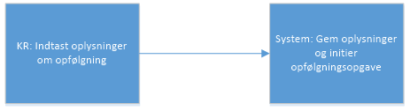
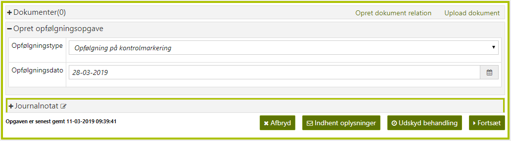
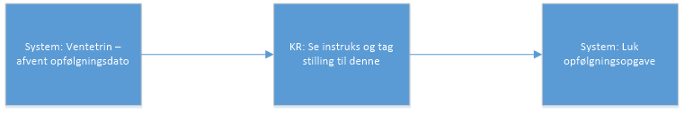
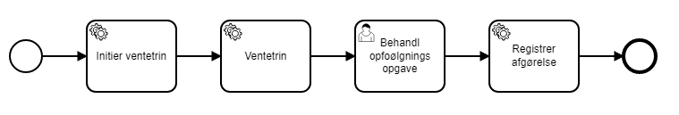
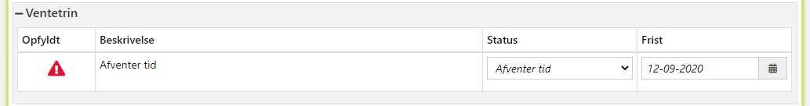
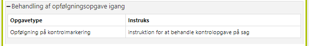

# References

| Reference | Title | Author | Version |
|-----------|-------|--------|---------|

# Opfølgningsopgave

Opfølgningsopgave konceptet består af 2 separate processer:

1. Opret opfølgningsopgave
    - Initieres udelukkende manuelt via handlingsdropdown
2. Håndter opfølgningsopgave
    - Kan ikke initieres manuelt via handlingsdropdown
    - Kan initieres implicit ved afslutning af processen Opret opfølgningsopgave
    - Kan initieres manuelt af KR fra processer som har et Opret opfølgningsopgave trin, f.eks. Opret Personligt- og
      Helbredstillæg
    - Kan initieres automatisk i forlængelse af andre processer, f.eks. Håndter BG hændelser

## Opret opfølgningsopgave

Processen initieres udelukkende manuelt via handlingsdropdown.

Processen har kun et manuelt trin, gennemførte trin vises derfor ikke, og der er ingen opsummeringsside.

<h5>Figur 1 Skærmbillede på Opret opfølgningsopgave.</h5>

Opfølgningstype er obligatorisk. Værdisættet trækkes fra en dynamisk systemparameter. Opfølgningstypen bruges til at
arbejdspakkeklassificere den efterfølgende opfølgningsopgave.

Dato for opfølgning er obligatorisk. Hvis dato er senere end dags dato, vil den efterfølgende opfølgningsopgave ligge i
ventetrin indtil den angivne dato. Det eksisterer en validering så at det ikke er muligt at vælge en dato før dags dato.

Hvis det er nødvendigt, kan KR supplementære/tilføje yderligere information i journalnotatet.

Ved tryk på Fortsæt sker følgende:

1. Der oprettes en ny hændelse ”HAANDTER_OPFOELGNINGSOPGAVE” (som initierer processen ”Håndter opfølgningsopgave”)
   - På hændelsen sættes GyldigFra til Opfølgningsdatoen
2. Processen ”Opret opfølgningsopgave” lukkes.
3. Processen ”Håndter opfølgningsopgave” initieres på baggrund af hændelsen ”Opfølgningsopgave”.

Journalnotatet fra oprettelsesprocessen vil fremgå af Tidligere journalnotater på håndteringsprocessen.

## Håndter opfølgningsopgave

Processen kan være initieret:

1. ved gennemførsel af ”Opret opfølgningsopgave”
2. af en anden proces i et ”Opret opfølgningsopgave” trin (KR har manuelt valgt opfølgningsopgave på samme måde som i
   processen ”Opret opfølgningsopgave”
3. automatisk af en anden proces eller batchjob.

Denne starter i ventetrin hvis opfølgningsdato blev udfyldt. Håndter opfølgningsopgave består af et initialt ventetrin,
og et enkelt manuelt trin, og der er ingen opsummeringsside. Det manuelle trin er skitseret nedenfor:

<h5>Figur 2 Procesoversigt</h5>

 

<h5>Figur 3 Ventetrin</h5>

 

<h5>Figur 4 Når ventetrinet løber ud vises en instruks til KR</h5>

Journalnotatet fra oprettelsesopgaven er tilgængelig under ”Tidligere journalnotater” på opfølgningsopgaven.

Initieres opfølgningsopgaven automatisk fra en anden proces, kan relationen til specifikke sager i Journalnotat modulet
være præudfyldt.
