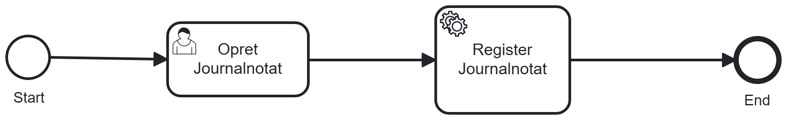
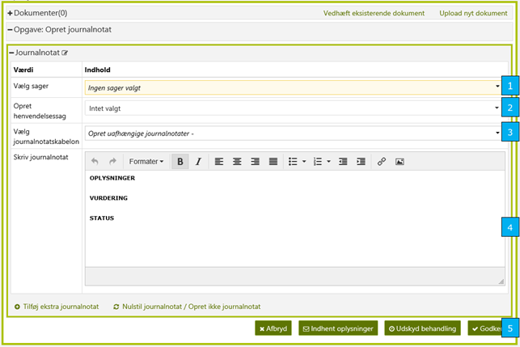

# References

| Reference | Title | Author | Version |
|-----------|-------|--------|---------|

# Opret journalnotat

Det skal være muligt for en KR at oprette et journalnotat på en given person og sag, uden at skulle oprette f.eks. en
telefonisk henvendelse. Designet er forholdsvis simpelt, som vist på nedenstående figur.

<h5>Figur 1 Opret journalnotat flow</h5>

Oprettelsen af et uafhængigt journalnotat kan ske på 2 forskellige måder:

1. Via handlings dropdown menuen på det tværgående overblik
2. Via dedikeret knap ”Opret journalnotat” på enkeltsagsvisning

Ved oprettelse via handlings dropdown, initieres opgaven på sædvanlig vis.

Initieres opgaven fra enkeltsagsvisningen, startes opgavehåndtering i undocket version, og ”Vælg sag” er præudfyldt med
den sag for hvilken enkeltsagsvisningen er åben.

I begge tilfælde vises nedenstående skærmbillede:

<h5>Figur 2 Opret journalnotat</h5>

 

| Footnote | Note                                                                                                                                                                                                                                                                         |
|----------|------------------------------------------------------------------------------------------------------------------------------------------------------------------------------------------------------------------------------------------------------------------------------|
| 1        | For hvert journalnotat vil der være én tilknyttet en eller flere sager eller en henvendelsessag. Sagen bliver valgt fra en dropdown menu med søgefunktion (standard sagsvælger). Hvis processen er startet fra enkeltsagsvisning, vil der på forhånd være en tilknyttet sag. |
| 2        | KR kan vælge en eller flere henvendelsessagstyper.                                                                                                                                                                                                                           |
| 3        | For at simplificere standard journalnotater til en sag, kan journalnotatskabelon benyttes. Ved at vælge en skabelon vil der automatisk blive udfyldt tekst i journalnotats tekstfelt.                                                                                        |
| 4        | Tekstfeltet til journalnotatet der skal tilknyttes en sag.                                                                                                                                                                                                                   |
| 5        | Sidst er der mulighed for at annullere eller gemme journalnotater. Knappen hedder Godkend da der ikke er en opsummeringsside.                                                                                                                                                |