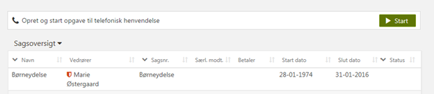
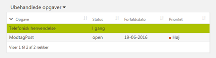
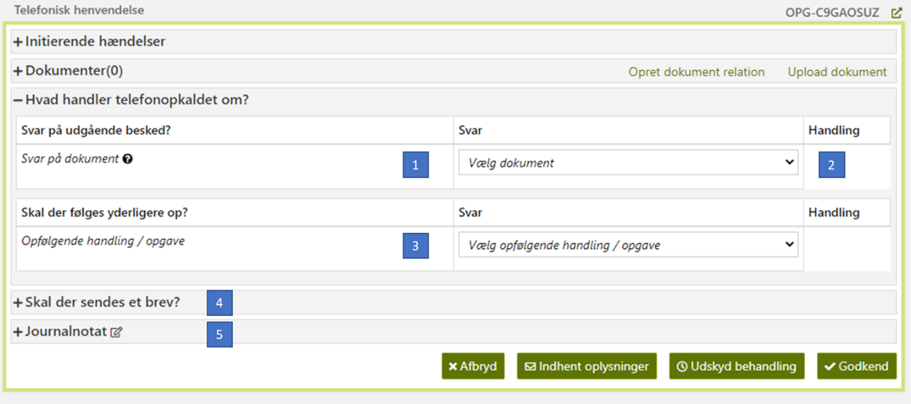

# References

| Reference | Title | Author | Version |
|-----------|-------|--------|---------|

# Telefonisk henvendelse

Det vil være muligt at lave en telefonisk henvendelse uden allerede at have en reel opgave. En telefonisk henvendelse
oprettes direkte fra personens Tværgående overblik (TO).

## Start Telefonisk henvendelse

En telefonisk henvendelse kan initieres på to måder:

1. Ved at klikke på knappen ”Start”, som vises over sagsoversigten hvis der ikke er en anden opgave åben på TO (og man
   ikke er i read-only mode pga reservation eller rettigheder), Se herunder.

<h5>Figur 1 Genvej til telefonisk henvendelse</h5>

2. Ved at vælge ”Telefonisk henvendelse” fra handlingsdropdown.

## Tillgå Telefonisk henvendelse

Efter oprettelse af en ”Telefonisk henvendelse” opgave, fremgår denne af personens Ubehandlede opgaver, som vist på
billedet herunder. Opgaven vælges automatisk og KR præsenteres for et vindue til håndtering af henvendelsen. KR har
mulighed for at vælge andre opgaver imens den telefoniske henvendelse er i gang. For at komme tilbage vælges opgaven
igen i Ubehandlede opgaver tabellen på TO.

<h5>Figur 2 Ubehandlede opgaver</h5>

Har personen allerede en opgave i gang, vises knappen ”Start” ikke. I stedet skal KR vælge ”Handlinger” og derefter
”Telefonisk Henvendelse”.

## Process trin

En telefonhenvendelse vil kun bestå af 1 trin med fire sektioner:

1. Hvad handler sagen om
2. Skal der følges op på henvendelsen
3. Er telefonhenvendelsen en besvarelse på et andet dokument
4. Send brev

Alle er valgfrie at udfylde og det er muligt at afbryde og lukke opgaven.

Der kan skrives et journalnotat, som kan tilknyttes en eksisterende aktiv sag eller en ny ”henvendelsessag”. Der kan
oprettes forskellige typer henvendelsessager gennem systemparametre. Fælles for henvendelsessager er at de kun har
gyldig fra og til sat til dags dato. Sagsvælgeren under journalnotatet vil indeholde alle eksisterende aktive sager samt
de typer af henvendelsessager, som KR kan vælge imellem. Vælges en eller flere henvendelsessager, oprettes disse.

Er der valgt opfølgende handlinger, oprettes disse efter den telefoniske henvendelse afsluttes. ”Handlingsopgaverne”
oprettes ved, at der tilføjes en hændelse vedrørende dette, og en separat selvstændig proces står for oprettelsen af
disse opgaver, og således ikke direkte som en del af den telefoniske henvendelse.

<h5>Figur 3 Telefonisk henvendelse</h5>

 

| Footnote | Note                                                                                                                                                                                                                                                                                                                                                                                                                         |
|----------|------------------------------------------------------------------------------------------------------------------------------------------------------------------------------------------------------------------------------------------------------------------------------------------------------------------------------------------------------------------------------------------------------------------------------|
| 1        | Her kan KR vælge et eller flere udgående dokumenter som telefon henvendelsen er en besvarelse på. Journalnotater fra den telefoniske henvendelse skal også relateres til sagerne for opgaven for det udgående dokument. Når der tilvælges dokumenter, opdateres journalnotatets sagsvælger automatisk med alle sager som dokumentet er relateret til.                                                                        |
| 2        | I handlingskolonnen vises en knap for at fjerne tilføjede dokumenter eller opfølgende handlinger.                                                                                                                                                                                                                                                                                                                            |
| 3        | Her kan KR angive om der skal følges op på henvendelsen, dvs. angive et antal opfølgende handlinger der initieres efter afslutning af den telefoniske henvendelse. Disse vil fremgå af ”Ubehandlede opgaver” så snart henvendelsesopgaven afsluttes. De handlinger der kan vælges her, er de samme som fremgår af handlingsdropdown, og denne funktion fungerer altså udelukkende som en genvej til at vælge handlinger der. |
| 4        | Her kan formuleres et eller flere breve som sendes til borger (default) eller andre modtagere ([DD130 - Processer - Amplio standard](/DD130-Detailed-Design/Processer-Amplio-standard)).                                                                                                                                                                                                                                     |
| 5        | Her kan KR skrive et journalnotat. Der kan vælges en skabelon. Der kan vælges de sager den skal tilknyttes ([DD130 - Processer - Amplio standard](/DD130-Detailed-Design/Processer-Amplio-standard)).                                                                                                                                                                                                                        |

