# Referencer

| Reference                                                      | Titel                                                        | Forfatter   | Version |
|----------------------------------------------------------------|--------------------------------------------------------------|-------------|---------|
| [DD130 – Document generation and document template management] | DD130 – Document generation and document template management | Piotr Fronc | 0.3     |

# Introduktion

Dette dokument har til formål at beskrive hvad MY standard består af, både fra et overordnet niveau og i detaljer.

Modulus ydelse er Netcompanys standardprodukt for ydelsessystemer. Modulus ydelse er ikke et system i sig selv, men er
en samling af komponenter (artefakter). Disse komponenter kan ses som byggeklodser der skaber fundamentet for et
projekt. Det er så op til de individuelle projekter at konfigurere og bygge oven på de komponenter og rammeværker som
udstilles af MY.
Rent teknisk bliver MY komponenter lavet som .jar artefakter, som importeres i de forskellige projekter. MY kræver at
projekterne udvikles på Java og Spring med en Oracle database.

# MY komponenter

MY komponenter er delt op i tre forskellige kategorier:

- Platformskomponenter – Alle tekniske og funktionelle komponenter som ikke indeholder nogen foretningslogik. Mange af
  disse er rammeværkselementer som bliver brugt af forretningskomponenter og projektspecifik kode.
- Forretningskomponenter – Alle komponenter som indeholder foretningslogik. Disse komponenter skal konfigureres i
  projektet og ændringer i MY til denne type af komponent kræver ofte ændringer til alle de projekter som anvender
  komponenten. Ikke alle forretningskomponenter bliver brugt på alle projekter. Der findes komponenter som udelukkende
  bliver brugt af en enkelt kunde, f.eks. ATP.
- Koncepter – Dækker retningslinjer for design, principper, mønstre og anvendelse af systemet, og er ikke tekniske kode
  artefakter. Eksempler på dette er:
    - At al forretningsdata opdateres i BPM processer, og først persisteres ved endelig godkendelse af processens
      afsluttende trin.
    - Retningslinjer for ansøgningsproces design: bør bygges op med følgende trin i rækkefølge: initiering af proces,
      straksreplikering af nødvendige information fra en datakilde, oprettelse af en sag, mulighed at indtaste/korrigere
      ansøgning, bestemmelse af berettigelse, opsummering og registrering af afgørelsen.

  Som med al fælles kode er der mange koncepter som går igen mellem nogle projekterne men ikke for alle, f.eks. har
  ATP-projekter mange fælles koncepter.

Nedenstående billede repræsenterer hvordan MY projekt er struktureret og hvordan projekter anvender funktionalitet fra
MY.

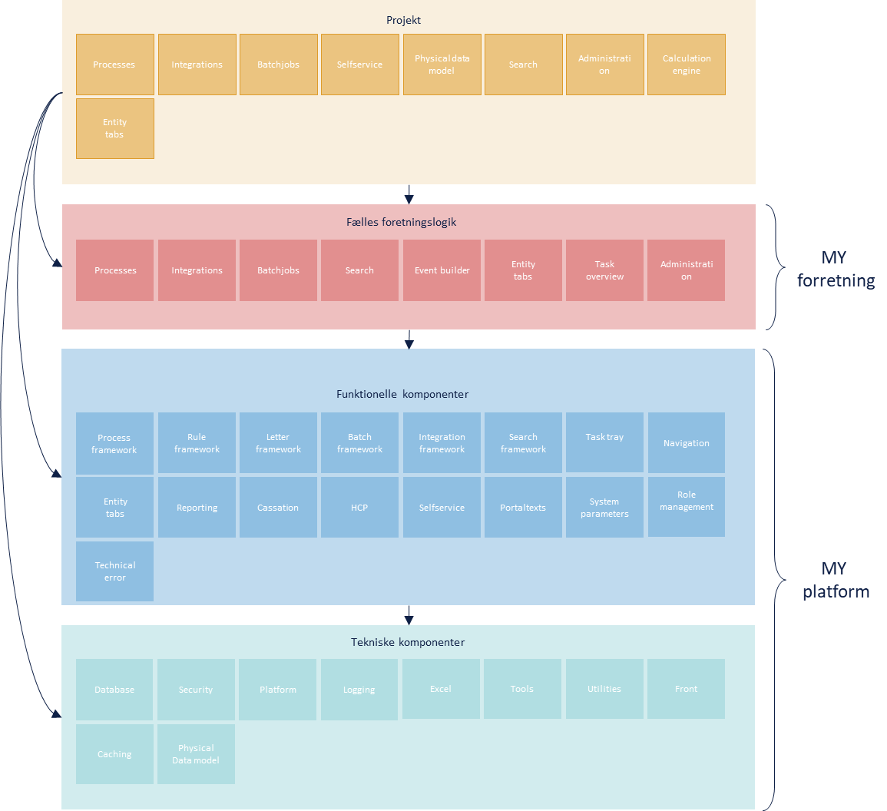

## Tekniske komponenter

Tekniske komponenter indeholder ikke forretningsvendt funktionalitet. Følgende er komponenter indenfor området ”Tekniske
komponenter”:

- **Database** – Indeholder logik for persistere information til database, inkluderet her er adapter, connector og
  diverse
  hjælpemetoder til at generere GUIDs og brugervendte nøgler.
- **Security** – Styring af sikkerhed i systemet.
- **Platform** – Indeholder diverse hjælpeklasser som bliver brugt af andre komponenter i systemet, fx model for
  database
  objekter, serialisering, udvidelsesparat enums, filhåndtering, fejlhåndtering (exception handling).
- **Logging** – Komponenten er ansvarlig for al logning i systemet, dette inkluderer logning af SLA, Audit-logning,
  sessionslogning, sikkerhedslogning og logning af tekniske fejl.
- **Excel** – Komponent for at konvertere .excel filer til et format som systemet kan bruge, bliver brugt af komponenten
  ”Rule engine framework”.
- **Tools** – Udviklerværktøj for at accelerere udviklingstiden, indeholder BPM generator og hjælpemidler til at oprette
  xsd/wsdl/xml filer.
- **Utilities** – Komponent som indeholder diverse hjælpeklasser som sikre at ting laves ens på tværs af MY, dette
  inkluderer klasser som håndterer batchjob Cron-udtryk, tid, bankdage, strengformatering, objektkonvertering etc.
- **Front** – Komponent som indeholder hjælpeklasser for at styre navigation, HTML tags, frontend sikkerhed. Indeholder
  også
  subkomponent for opbyggende og konfigurering af tabelstrukturen som bliver brugt over hele applikationen fra
  tværgående overblik til administration til processer.
- **Caching** – Komponent for at styring af caching.
- **Physical data model** – Dele af Datamodellen for alle MY projekter skal nødvendigvis være delt. Denne komponent
  udstiller de påkrævede datamodel strukturer.

## Funktionelle komponenter

Funktionelle komponenter der kan anvendes på tværs af MY projekter. Indeholder mange frameworks og generel
funktionalitet som de forskellige projekter kan udvide funktionaliteten af. Forskellen mellem funktionelle komponenter
og fælles foretningslogik er, at de funktionelle komponenter ikke indeholder nogen specifik foretningslogik, men består
af mere generisk funktionalitet. Følgende er komponenter indenfor området ”Funktionelle komponenter”:

- **Proces framework** – En af de største komponenter i MY er procesrammeværket. Rammeværket inkluderer en procesmotor,
  standardtrin, logik for håndtering af brev/journalnotater/sager/henvendelsessager og mange andre basisklasser som
  forskellige projekter kan udvide med mere funktionalitet. Procesmotoren indeholder også en front del med visning og
  behandling af opgaver, med funktionalitet til at gå mellem trin, indhente oplysninger, udskyde behandling,
  fejlhåndtering, afbryde behandling af opgave og mange andre funktionaliteter.
- **Rule framework** – Rammeværk for eksekvering af forretningsregler, visning af resultat og persistering af resultat.
  Regler bliver formuleret i Excel regneark, og bruger den tekniske komponent ”Excel” for at konvertere Excel-filer til
  noget regelmotoren kan bruge.
- **Letter framework** – Rammeværket til at lave og sende brev. Dette inkluderer fletning af brev, flettespørgsmål og
  visning af brevmodulet, samt administration af brevskabeloner.
- **Batch framework** – Rammeværket inkluderer en batchmotor, basisklasser til at lave batchjob, administration og
  planlægning af batchjobs, visning af eksekverede batchjobs inklusiv rapportering.
- **Integration framework** – Rammeværket inkluderer basisklasser for adapters/connectors, fejlhåndtering, monitoring(
  audit logging af request/response til integrationsparter), templates for forskellige typer af integrationer og
  filformater.
- **Search framework** – Rammeværk der inkluderer en søgemotor for at bygge queries og formatering af input,
  funktionalitet for at lave massehandlinger, visning af søg siden.
- **Task tray** – Komponent for håndtering af opgaveindbakke. Inkluderer prioriteringsfunktionalitet, filtrering af
  opgaver, batchjob for at opdatere opgaver.
- **Navigation** – Komponent for at navigere i fagsystemet. Inkluderer visning af faner og funktionalitet til at
  navigere mellem forskellige faner og subfaner og huske deres tilstand.
- **Entity tabs** – Komponent for visning af overblikssider for entiteter (fx personer og virksomheder).
- **Reporting** – Komponent til at lave dataudtræk. Inkluderer motor til at lave dataudtræk, visning af eksisterende
  dataudtræk med mulighed at eksekvere udtrækket, visning af konfiguration/oprettelse af dataudtræk, sikkerhedsstyring.
- **Cassation** – Batchjobs til at slette spor efter data der ikke længere er relevant (eller lovhjemmel) til at holde.
  Komponenten holder rammeværk og tvungen fællesfunktionalitet. Derudover skal projekter der anvender komponenten
  definere egne forretningsregler for hvornår entiteter er kassationsmodne.
- **HCP** – Komponent til at integrere til en dedikeret document store (Hitachi Content Platform). Infrastrukturel
  komponent der optimerer håndteringen af binære filer.
- **Selfservice** – Basisklasser til håndtering af sessioner og fuldmagter.
- **Portaltexts** – Komponent til at håndtere portaltekster. Inkluderer funktionalitet til at formatere en tekstnøgle
  til en primærtekst, administration af tekster, visning af tekster, kontekstnær redigering af tekster, backup dumps,
  etc.
- **System parameters** – Komponent til at håndtere systemparametre. Dette Inkluderer funktionalitet til visning og
  administration af disse, samt funktionalitet til at applikationen kan slå op i disse.
- **Role management** – Komponent til at håndtere rollestyring. Dette inkluderer funktionalitet til rolle-mapping,
  frontend sikkerhed og administrering af rollestyring.
- **Technical error** – Komponent til visning og søgning af tekniske fejl. Tekniske fejl bliver logget af komponenten
  logning.

## Fælles foretningslogik

Fælles foretningslogik som er delt mellem flere MY applikationer, og derfor ophøjet til en fælleskomponent for delt
vedligehold og Governance. Ofte generisk forretningslogik der deles af flere kunder, men er der flere projekter ved
samme kunde, kan disse også få egen komponent i dette område. Fx har ATP-projekterne mange fælles processer. Generelt
giver MY komponenterne i denne gruppe en del muligheder for projektspecifik konfiguration eller projekt udvidelser der
kan bygges oven på standardkomponenten. I visse tilfælde er nødvendigt at hjemtage forretningslogikken helt i
projektet (lave en projektspecifik kopi/snapshot af standard komponenten) for at få den ønskede projektopførsel. I
sidstnævnte tilfælde er der større fleksibilitet, men samtidig afskrives muligheden for andel i fejlrettelser,
sikkerhedsopdateringer og featureudvidelser i standardkomponenten. Hver komponent kan indeholde deler af den fysiske
datamodel, f.eks. så er databasetabellerne for BG en del af batchjobet for at indhente bg data, ellers vil batchjobet
ikke virke.

I denne oversigt tages ATP Social Pension som eksempel.

- **Processes** – Eksempler på disse er: Modtag post, Telefonisk henvendelse, Opret journalnotat, Opret fuldmagt,
  Klagesag,
  Aktindsigt, etc.
- **Integrations** – Eksempler på disse er: Fjernprint, SDY, posthåndtering, Beriget grunddata (ATP), NemKonto, etc.
- **Batchjobs** – Eksempler på disse er: Fjernprint, Nemkonto, posthåndtering (ATP), Beriget grunddata (ATP), NemKonto,
  etc.
- **Physical data model** – Datamodellen for alle ATP-projekterne har mange fælles områder, eksempler disse områder er
  BG
  data, dokument, sag og økonomi.
- **Event builder** – logik for at lave forskellige typer af hændelser.
- **Entity tabs** – Fælles logik for at håndtere person overblik faner og indholdet i disse. Alle projekter bygger
  videre på
  denne funktionalitet for at vise projektspecifik information.
- **Task overview** – Driftslederoverblik visning og logik er fælles funktionalitet.
- **Administration** – Systemparameter administration. Proces overblik. Fejlhåndtering. Procesfejlhåndtering. Visse
  funktionelle komponenter har deres egen administration, såsom Portaltext, Batch, Role Management, Mail merge, etc.
- **Search** – Funktionalitet for hvilke entiteter det er muligt at søge på fra søgesiden og delmængder af
  søgekriterierne
  er fælles logik. De individuelle projekt kan udvide funktionaliteten med projektspecifikke søgekriterier.

## Projekt logik

Projekt logik er den funktionalitet som projektet bygger ovenpå MY logikken, denne logik er helt projektspecifik og
deles ikke mellem projekterne. I denne oversigt bruges ATP Social Pension som eksempel. Følgende er komponenter indenfor
området ”Funktionelle komponenter”.

- **Processes** – Pensions specifikke processer, eksempler er Ansøg om Folkepension, Vurder samliv etc.
- **Integrations** – Pensions specifikke integrationer, eksempler er Familieydelser, Boligstøtte, ny debitor etc.
- **Batchjobs** – Pensions specifikke integrationer, eksempler er MAIO, AIO, tvivlerbrev etc.
- **Selfservice** – Selvbetjeningsløsningen for pension bruger de basisklasser som er i MY, men al forretningslogik er
  en
  del af pensionssystemet.
- **Physical data model** – Pension har sine egne entiteter til at repræsentere pensionsspecifikke objekt, eksempler på
  dette er pensionsgrundlag og person relaterede tabeller.
- **Search** – Forskellige søgetyper og deres massehandlinger er projektspecifikke, som Person, Sag, Opgave etc.
- **Administration** – Pension har systemparametre som ikke er den del af fælleskoden.
- **Calculation engine** – Beregningsmotoren er ikke en fælles komponent i MY, det er noget hvert projekt skal design og
  bygge.
- **Entity tabs** – Pension udvider fælles faner med pensionsspecifik information og der er også faner som kun
  eksisterer
  for Pension.

# Generelt for processer

MY anvender en hændelsesdrevet arkitektur til at kommunikere ændringer og behov for udførsel af forretningslogik.
Derudover tilstræbes det at al forretningslogik er indkapslet i processer og batchjobs. Følgende er et billede der
visualiserer hvordan hændelser kommer ind i et MY system, forvandles til en opgave og hvordan denne opgave interagerer
med andre systemer og brugere.

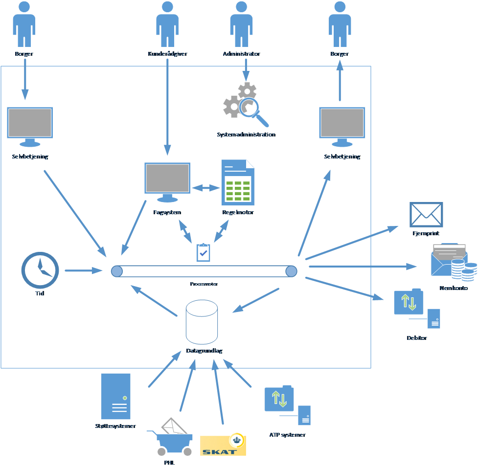

## Hændelser

En hændelse kan oprettes på flere forskellige måder og de fleste hændelser er projektspecifikke, men det findes nogle
kategorier af hændelser som eksisterer på alle projekt:

- Selvbetjeningshændelser
    - Færdiggørelse af ansøgningsflow
    - Færdiggørelse af ændringsflow
    - Færdiggørelse af indsendelse af breve fra SB.
- Kunderådgiver initierede hændelser
    - Processer valgt fra Handlingsdropdown.
    - Processer startet via massehandling.
- Tidshændelser (Alle batchjobs som initierede hændelser)
    - Udsend tvivlerbrev, efterregulering, Beregn Ældrecheck etc.
- Eksterne hændelser
    - BG-hændelser
    - PHL-hændelser (modtag post)
- Proces hændelser
    - Opgaver som starter nye opgaver, f.eks. Vurder Samliv som starter en ny opgave af typen Vurder Samliv for
      samlever.

En hændelse beskriver den forretningsmæssige handling der er gennemført (datid):

- Hændelser beskriver ikke hvad man har tænkt sig at gøre. Det er hændelsesabonnementer der dynamisk styrer hvilken
  konsekvens der er – hvis nogen – ved at en hændelse er sket.
- Hændelser er typisk relateret til en person.
- Hændelser kan være relateret til enkelte andre tabeller, fx journalnotat, dokument eller sag, hvis de vedrører en
  specifik af disse.

Hændelser udstilles på historik/hændelse fanen for en person med deres ”Hændelsestekst” som er en menneskeligt læselig
opsummering af den forretningsmæssige hændelse der er gennemført. Gerne med indflettet data om præcise fra/til værdier.
Det er vigtigt at denne tekst er lavet og giver mening.

## Opgaver og Processer

En opgave er en instans af en proces. Hvis vi kigger tilbage til transportbåndtegningen
i [generelt for processer](#generelt-for-processer), så er processen selve transportbåndet og opgaven er pakken som traverserer
transportbåndet. En proces kan relatere sig til flere opgaver men en opgave kan kun være koblet til en proces. En opgave
er altid initieret af en hændelse.

Der gælder følgende om processer:

1. Det tilstræbes at al forretningslogik udføres i processer.
2. Integrationer, batchjobs og selvbetjeningsløsning kan opdatere datagrundlaget (fx ændre borgers CPR nummer), oprette
   en passende hændelse, og så overlade den forretningsmæssige konsekvens til den proces der abonnerer på hændelsen.
3. Der er accepterede undtagelser. Fx batchjob Dan udbetalingsgrundlag, som holder en del forretningslogik, og enkelt
   simpel logik i fagsystem GUI (dokument operationer på dokumentfanen og lign.)

## Hændelseabonnement

Et hændelseabonnement er et systemparameter som definerer hvordan en proces abonnerer på en eller flere typer af
hændelser.

Når en hændelse bliver gemt i systemet, tager procesmotoren fat i hændelsen efter tur og prøver at matche
denne hændelse med et hændelseabonnement, hvis der er et match, dvs. at en proces abonnerer på hændelsen så startes en
ny opgave. Illustration af dette kan ses nedenfor.

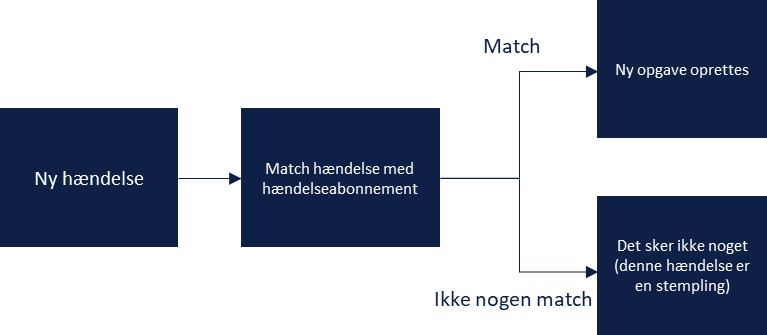

Hvis en hændelse ikke et koblet til et hændelseabonnement så kaldes dette en stempling og formålet med en stempling er
at gemme information som er relevant for en KR at kunne se. Eksempel på en stempling er opdateringer til sagstilstand og
at en opgave er afsluttet, dette trigger altså ikke en ny opgave.

Processer kan udelukkende aktiveres ved at de abonnerer på hændelser af en specifik type.

### Hændelsesstatus og opgavestatus

En Hændelser kan få følgende statusser:

- Tilføjet – En oprettet hændelse der ikke er blevet behandlet endnu.
- Igangsat – En hændelse der er blevet behandlet, men ikke afsluttet. Der er en tilhørende opgave. Den tilhørende opgave
  kan være afventende, til manuel behandling, fejlet mfl.
- Afsluttet – En hændelse der ikke kræver yderligere handling.
- Afbrudt – En hændelse som har blevet afbrudt manuelt af en administrator.
- Fejlet – En hændelse hvor abonnementsundersøgelsen eller initiering af en opgave fejlede. Der er ingen tilknyttet
  opgave. Hændelsen vil typisk skulle rykkes tilbage til status Tilføjet og forsøges genbehandlet.

En Opgave kan få følgende statusser:

- Afventer system – En opgave er i status afventer system når systemet eksekverer, dette burde normalt bare ske mellem
  start og manuel/afslut.
- Manuel – En opgave er i status manuel når opgave afventer manuel behandling fra en KR. Det er kun i denne status en
  opgave vil vises i opgaveindbakken.
- Afventer tid – En opgave er i status afventer tid når opgave er i et ventetrin som afventer tid.
- Afventer 3.e part – En opgave er i status afventer 3.e part når den afventer input fra en 3.e part. Dette kan f.eks.
  være når systemet afventer svar fra en borger.
- Afsluttet – En opgave er i status afsluttet når opgaven er færdigbehandlet.
- Fejlet – En opgave er i status fejlet hvis dette sker en fejl i eksekveringen af et trin. Procesmotor prøver at
  re-eksekvere opgave i status fejl fire ganger.
- Opmærksomhed krævet – En opgave har fejlet efter manuel indtastning, opgaven re-eksekveres ikke.
- Afbrudt – En opgave som manuel har blevet afbrudt af en administrator.
- Suspenderet – En opgave som manuel har blevet suspenderet af en administrator.

Hændelse- og opgavelivscyklus ser ud som følgende:

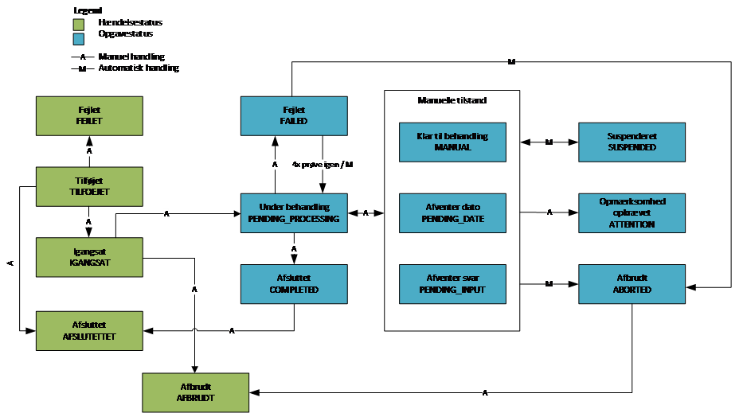

1. Alle hændelser bliver gemt med status Tilføjet.
2. Procesmotoren skanner løbende alle hændelser og behandler dem i status tilføjet. Hvis det eksisterer et
   hændelseabonnement som matcher hændelsen af typen.
    - Aktiveret – så sættes hændelsen til Igangsat og en opgave oprettes og sættes i status under behandling.
    - Deaktiveret – så forbliver hændelsen i status tilføjet.
    - Hvis der ikke eksisterer et hændelseabonnement så sættes status til afsluttet.
3. Hvis der sker en fejl, sættes opgaven til fejlet og procesmotor prøver at genkøre opgave 4 ganger indenfor 24 timer,
   med forskellige interval. Hvis opgave stadig står i fejl efter at procesmotor har prøvet at genkøre den 4. ganger er
   en administrator nøde til at lave en manuel handling.
4. Hvis opgaven af nogen årsag falder ud til manuel behandling, sættes opgaven til manuel. Opgaven vil vises i
   opgaveindbakken.
    - Hvis opgaven fejler så sættes den til opmærksomhed krævet.
5. Hvis opgaven sættes i ventetrin, kan de sættes til to forskellige statusser,
    - Hvis betingelsen i ventetrinet afventer tid og der ikke er en anden betingelse som afventer input fra tredjepart,
      sættes opgaven til afventer tid.
    - Hvis betingelsen i ventetrinet afventer input fra tredjepart, sættes opgaven til afventer input.
6. Hvis en opgave er i et af de manuelle tilstande, kan de sættes til
    - Suspenderet – opgave er suspenderet og kan reaktiveres senere.
    - Afbrudt – opgaven.
7. Hvis der ikke sker nogen fejl og opgave ikke falder ud til noget manuelt tilstand, så afsluttes opgaven og hændelse
   sættes til afsluttet.

### Execution Status

Udover status for en opgave, holder procesmotoren også styr på, om en opgave er blevet behandlet manuelt eller
automatisk. For at holde styr på dette kan en opgave have en af følgende udførelsesstatusser:

- AUTOMATISK – Dette er standardværdien indstillet for alle opgaver, medmindre de er startet manuelt. Når en opgave har
  fået en anden status end automatisk, kan den ikke indstilles til automatisk igen.
- MANUEL – Denne status indstilles, når en opgave har et trin, der skal håndteres manuelt. Enten fordi trinnet skal
  indtastes manuelt, eller fordi opgaven er startet manuelt.
  Se [manuel opgavehåndtering](#manuel-opgavehåndtering).
- SEMI_AUTOMATIC – En opgave har denne status indstillet, når funktionen "automatisk genoptagelse af opgave" er blevet
  brugt. Se [automatisér](#automatisér) Sæt til automatisk behandling.

# Sag

Helt grundlæggende er en sag en entitet i databasen med en gyldighedsperiode, et kle-nr og en tilstand. I dette afsnit
beskrives forskellige typer af sager samt sammenhængen med afgørelser på ydelser. En sag oprettes af en proces i
fagsystemet.

## Sagstyper

Da sager benyttes til at opfylde forskellige behov i systemet er det nødvendigt at skelne mellem forskellige typer af
sager. De kan således overordnet opdeles i nedenstående typer, som har forskellige karakteristika:

- Ydelsessager
- Ikke-ydelsessager

Det er kun ydelsessager der kan give anledning til en bevilget ydelse. De forskellige typer af sager udelukker ikke
hinanden og en borger kan have flere sager af samme type. En borger kan dermed enten have ydelsessager eller
ikke-ydelsessager eller sager af begge typer som er aktive på samme tid. Ikke-ydelsessager kan igen deles op i de
følgende undertyper:

- Henvendelsessager
- Klagesager
- Akt- og registreringsindsigtssager

### Ydelsessager

Ydelsessager er sager, hvor der kan tilknyttes en bevilget ydelse, som bevirker at borgeren får udbetalt penge af
systemet. Ydelsessager kan både bevilges med ikrafttrædelse i fremtiden eller bevilges med tilbagevirkende kraft. Hvis
en sag oprettes med ikrafttrædelse i fremtiden, så vil sagen kunne ses i sagsoversigten allerede når den oprettes,
selvom startdatoen for udbetaling endnu ikke er nået.

Enhver afgørelse om en bevilling af en ydelse har som udgangspunkt sin egen sag. En borger kan således have mange sager.
På en sag vil der være knyttet mindst én afgørelse for en ydelse, kaldet ”hovedydelsen”, som bestemmer sagstilstanden (
”Bevilling” eller ”Afslag”, se [sagstilstand](#sagstilstand)). Det er dog muligt at knytte flere afgørelser for
ydelser på en sag, udover
hovedydelsen. Disse ekstra ydelser vil ikke have indvirkning på sagstilstanden og kan således bevilges og fratages
uafhængigt af hovedydelsen, så længe der er tale om en bevilling af hovedydelsen.

Forretningsmæssigt kan man således tale om en afgørelse på to niveauer:

1. Sagsafgørelse. En afgørelse om bevilling eller afslag på en borgers ansøgning om den pågældende ydelsessag.
2. Ydelsesafgørelse. En afgørelse på hver enkelt af den ansøgte ydelsessags ydelser, f.eks. et grundbeløb (hovedydelse)
   og et tillæg.

I systemet findes der rent teknisk kun ydelsesafgørelser. For at facilitere anvendelsen af sagsafgørelser benyttes
således begrebet hovedydelse. Ydelsesafgørelsen på hovedydelsen styrer dermed sagsafgørelsen på en borgers ansøgning om
en bestemt ydelsessag. Der findes altid én hovedydelse per ydelsessag. Hvis en hovedydelse ikke bevilges, kan der ikke
bevilges andre ydelser på en sag.

### Ikke-ydelsessager

Dette er sager, som benyttes ved behandling af borgeren, men som ikke bevirker at borgeren får udbetalt penge af
systemet.

#### Henvendelsessager

Henvendelsessag er et koncept som bliver brugt når en person uden nogen sag henvender sig om noget pensionsrelateret. I
dette scenario har en KR behov for at oprette et journalnotat og da der ikke eksisterer en sag som journalnotaten kan
relatere til er der behov for at oprette en ny sag. Denne type af sag kaldes en Henvendelsessag. Henvendelsessager kan
oprettes i alle manuelle trin, hvor der eksisterer en journalnotat modul. Sagen oprettes først når opgaven bliver gemt
eller når opgaven bliver færdigbehandlet.

For at oprette en henvendelsessag, vælg en henvendelsessagstype i listen i feltet ”Opret henvendelsessag”.

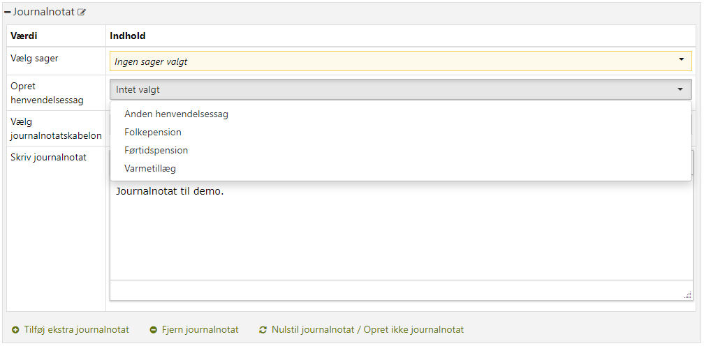

En henvendelsessag er kun aktiv i den dag hvor den bliver oprettet, dvs gyldig_fra = gyldig_til. Det er muligt at
oprette en henvendelsessag i.

De forskellige typer af henvendelsessager som kan vælges i journalnotat modulen defineret af systemparameteren
”Henvendelsessagstyper”.

#### Klagesager

Kan oprettes initialt som henvendelsessager, men ophøjes til reel klage af klagevisitator i dedikeret proces til dette.
Klagesag gyldig til sættes altid til afgørelsesdagens dato.

#### Akt- og registreringsindsigtssager

Når borger vil have indsigt i en sag, kan KR oprette en akt- og registeringsindsigtssag fra handlingsdropdown eller
direkte fra telefonisk henvendelsesopgaven. Hvis sagen oprettes igennem telefonisk henvendelse, overføres journalnotatet
fra henvendelsen til den nye akt- og registeringsindsigtssag.

Akt- og registeringsindsigtssag gyldig til sættes altid til afgørelsesdagens dato.

## Sagsparter

Der kan defineres følgende sagsparter på en sag:

- Primær part (PP)
    - Der er altid præcis én PP på en sag.
    - For ydelsessager sættes denne til ansøgeren.
    - For ikke-ydelsessager (henvendelse, klage, akt- og registreringsindsigt) sættes denne til personen som sagen
      påvirker, altså ikke den person eller virksomhed som har henvendt sig.
    - Kommunikation vedr. en sag sendes normalt til denne rolle, med følgende undtagelse:
        - Ved fuld (ubegrænset) papirfuldmagt kommunikeres der til fuldmagtshaver.
    - Det er denne rolle, der dikterer om en sag udstilles på en borgers selvbetjeningsoversigt.
    - Det er denne rolle, der dikterer om en sag udstilles på en borgers tværgående overblik i fagsystemet.
    - PP rollen kan aldrig skiftes over tid. Hvis den skal skiftes, skal sagen lukkes og der oprettes en ny.
    - En PP kan være en virksomhed eller en person.
- Udbetalingsmodtager (UM)
    - Der er én udbetalingsmodtager på en ydelsessag.
    - Det er denne rolle der i ydelsesindekset betegnes som ”Ydelsesmodtager”.
    - Der angives udelukkende UM på ydelsessager.
    - Er der ikke angivet en eksplicit UM, antages det at PP også er UM.
    - UM beskriver den part der modtager udbetalingen. Det er ikke teknisk begrænset hvem der kan optræde som UM. UM kan
      være enten en person eller en virksomhed (myndighed).
    - UM rollen kan godt skiftes over tid (dog aldrig med fortidig virkning). Der må maksimalt være 1 gyldig UM på
      ethvert givent tidspunkt.
- Klagende part (KP)
    - For klagesager, er der en sagspart relationsrolle Klagende part, som henviser til den person der har klaget på
      vegne af borgeren (fx en advokat).
- Sekundær part (SP)
    - Der er 0-mange sekundære parter på en sag.
    - Rollen beskriver alle parter der er interessante/påvirker en sag, og som ikke allerede har en af ovenstående
      roller.

Det er kun sagsparterne Primær part og Udbetalingsmodtager der nødvendigvis skal være en del af et ydelsessystem.
Parterne Klagende part og Sekundær kan inkluderes i det specifikke ydelsesprojekt efter behov. Fx anvender ATP Social
Pension ikke en Sekundær part. Det kan forekomme andre parter i de individuelle projekt.

## Sagstilstand

En sags tilstand er beskrevet ved attributten sagstilstand på sagen. Denne betegnes også som sagens status. Den benyttes
i systemet til at beskrive hvor en sag er i løbet af sagsbehandlingen (der til sidst fører til en afgørelse på
hovedydelsen) samt til at beskrive hvorvidt afgørelsen på hovedydelsen er en bevilling eller et afslag. Bemærk at det
kun er afgørelsen for hovedydelsen, der bestemmer sagstilstanden. Dermed kan en sag godt være i tilstand ”3a -
BEVILGET”, selvom der er givet afslag på en af sagens ydelser, så længe der ikke er tale om hovedydelsen. Dette gælder
dog ikke for Henvendelsessager, som ikke har en tilknyttet afgørelse, men kun en sagstilstand.

Ydelsessager har følgende mulige værdier for sagstilstand:

- 1 – MODTAGET
    - Benyttes fra oprettelse af sagen til første af nedenstående hændelser indtræder.
- 2a – UNDERBEHANDLING
    - Sættes ved alle udfald til manuel behandling inden sagen er afgjort (tilstand 3a eller 3b).
- 2b – AFVENTTID
    - Sættes hvis en proces går i et ventetrin der afventer en fremtidig dato før sagen viderebehandles.
- 2c – UNDEROPLYSNING
    - Sættes hvis sagen afventer en borger, dvs. der er udsendt en anmodning om oplysninger, og der endnu ikke er
      modtaget svar.
- 3a – BEVILGET
    - Sættes når sagen afgøres, med afgørelsestype BEVILLING på hovedydelsen.
- 3b – AFSLAG
    - Sættes når sagen afgøres, med afgørelsestype AFSLAG på hovedydelsen.

En sag i tilstand 3a eller 3b går under fællesbetegnelsen Afgjort.

Tilladte tilstandsskifte er fra 1 -> 2 -> 3. Der kan skiftes frit mellem 2a, 2b, 2c. Der kan kun skiftes mellem 3a og 3b
ved omgørelse af en afgørelse.

Bemærk at der ikke sættes en særlig tilstand ved teknisk indhentelse af informationer fra integrationer. Har sagen ikke
tidligere været faldet ud til manuel behandling, vil sagen stadig stå i tilstand Modtaget, i modsat fald vil den
vedblive med at være i tilstand Under behandling.

Tilstand Under behandling kan ikke benyttes til at udlede at en sag aktivt er under manuel behandling, blot at den har
været det, og endnu ikke er afgjort, eller afventer tid/borger.

Ikke-ydelsessager (henvendelse, klage, akt- og registeringsindsigtssag) benytter samme værdisæt for tilstand, men i lidt
anden betydning:

- Henvendelsessager:
    - Kan kun afgøres med tilstand Bevilget, hvilket i denne kontekst blot betyder at henvendelsen er registreret og
      håndteret.
- Klagesager samt akt- og registreringsindsigtssager:
    - Her benyttes tilstand 3a i betydningen ”Helt eller delvist medhold”, mens 3b benyttes i betydningen ”Ej medhold”.

### Mapning af MY sagstilstand til OIO sagsfremdrift

Mapning af sagstilstand til OIO sagsfremdrift følger følgende mapning:

- 1, 2a, 2b, 2c -> Opstået
- 3a, 3b -> Afgjort

Der findes ingen sagstilstand i systemet der svarer til OIO sagsfremdriften Afsluttet. Hvis denne sagsfremdrift skal
kommunikeres til eksterne systemer, kræver det dermed projektspecifik funktionalitet at håndtere dette.

### Afgørelsestype

For alle afgjorte sager (sagstilstand 3a eller 3b), med undtagelse af henvendelsessager, eksisterer der én eller flere
afgørelser. Der vil altid eksistere en hovedafgørelse på en ydelse, som beskrevet tidligere
i [sagstilstand](#sagstilstand).

En afgørelse har en type, som beskriver udfaldet af den afgørelse der er truffet. Udfaldsrummet for typen afhænger af
hvilken sagstype afgørelsen er truffet for. Hvis fx der er tale om en ydelsessag, så vil ydelsen der er truffet
afgørelse for blive udbetalt, hvis typen er BEVILLING. Modsat vil ydelsen ikke blive udbetalt, hvis typen er AFSLAG.
Udfaldsrummene for typerne på afgørelserne for de forskellige sagstyper er vist nedenfor:

Værdisæt for ydelsessager:

1. AFSLAG
2. BEVILLING

Værdisæt for klagesager:

1. MEDHOLD
2. DELVIST_MEDHOLD
3. FOR_SENT
4. FASTHOLDELSE
5. FRAFALD
6. VIDERE_BEHANDLING

Værdisæt for akt- og registreringsindsigtssager:

1. MEDHOLD
2. DELVIST_MEDHOLD
3. FRAFALD

## Gyldighed for Sager, Afgørelse og Bevilget ydelse

### Ydelsessager

Dette afsnit beskriver gyldigheden for Ydelsessager, afgørelse og Bevilget ydelse. Dette afsnit er kun relevant for
Social Pension.

Der er en logisk én-til-mange relation mellem Sag og Afgørelse mens der er en logisk én-til-én relation
mellem Afgørelse og Bevilget ydelse, som alle har en gyldighed.

Det er først når der er truffet en afgørelse at entiteterne Afgørelse og Bevilget ydelse oprettes. Der oprettes kun en
Bevilget ydelse ved berettigelse.

Nedenfor beskrives hvad de vigtigste felter på entiteterne Sag, Afgørelse og Bevilget ydelse sættes til i fem
forskellige scenarier:

1. Ved bevilling af ydelse
2. Ved afslag på ydelse
3. Ved omgørelse af en afgørelse, hvor ydelsen slet ikke skulle have været bevilget alligevel
4. Ved ændring af afgørelse, hvor en afgørelse skal have været gyldig i en periode, men nu ikke længere
5. Ved omgørelse af afgørelse tilbage i tid, hvor en afgørelse skal ændres fra afslag til bevilling

Hvis en Sag/Afgørelse/Bevilget ydelse ikke har en kendt slutdato når afgørelsen træffes, så sættes Gyldig_til/Slutdato
til ”9999-12-31”.

#### Ved bevilling af ydelse

Sag:

- Sagstilstand sættes til "3a - Bevilget", hvis der er tale om hovedydelsen. Hvis det ikke er hovedydelsen der bevilges,
  så bibeholdes sagstilstanden.
- Gyldig_fra sættes til den dag sagen oprettes, dvs. den dag opgaven startes, hvis der er tale om hovedydelsen. Hvis det
  ikke er hovedydelsen der bevilges, så bibeholdes denne dato på Sagen.
- Gyldig_til sættes til det samme som Gyldig_til på afgørelse og Bevilget ydelse for hovedydelsen.
    - Hvis sagen både bevilges og stoppes i fortiden (ved fx bevilling af personligt tillæg og helbredstillæg med
      tilbagevirkende kraft), så sættes Gyldig_til til den sidste dag i måneden for gyldig_fra.

Afgørelse:

- Type sættes til ”Bevilling”.
- Gyldig_fra sættes til den første dag, hvor ydelsen er gyldig fra.
- Gyldig_til sættes til den sidste dag den er gyldig.

Bevilget ydelse:

- Startdato sættes til første dag ydelsen er gyldig fra, dvs. det samme som Gyldig_fra på Afgørelsen.
- Slutdato sættes til den sidste dag ydelsen er gyldig, dvs. det samme som Gyldig_til på Afgørelsen.

#### Ved afslag på ydelse

Sag:

- Sagstilstand sættes til "3b - Afslag", hvis det er hovedydelsen der gives afslag på. Hvis det ikke er hovedydelsen, så
  ændres værdien ikke.
- Gyldig_fra sættes til den dag sagen oprettes, dvs. den dag opgaven startes.
- Gyldig_til sættes til dagen før Gyldig_fra.

Afgørelse:

- TYPE sættes til Afslag.
- Gyldig_fra sættes til den dag ydelsen ville have været bevilget/gyldig fra, hvis den var blevet bevilget.
- Gyldig_til sættes til den dag ydelsen ville have været bevilget/gyldig til, hvis den var blevet bevilget.

Bevilget ydelse:

- Der oprettes ikke en Bevilget ydelse ved afslag.

#### Ved omgørelse af en afgørelse, hvor ydelsen slet ikke skulle have været bevilget alligevel

Sag:

- Sagstilstand skiftes fra "3a - Bevilget" til "3b - Afslag", hvis der er tale om hovedydelsen. Hvis det ikke er
  hovedydelsen, så ændres værdien ikke.
- Gyldig_fra bibeholdes.
- Gyldig_til sættes til dagen før Gyldig_fra, hvis der er tale om hovedydelsen. Hvis det ikke er hovedydelsen, så ændres
  værdien ikke.

Afgørelse:

Der ændres på den Afgørelse som skal omgøres:

- TYPE ændres fra ”Bevilling” til ”Afslag”.
- Gyldig_fra bibeholdes.
- Gyldig_til bibeholdes.

Bevilget ydelse:

Bibeholdes som den er:

- Startdato ændres ikke.
- Slutdato ændres ikke.

#### Ved ændring af afgørelse, hvor en afgørelse skal have været gyldig i en periode, men nu ikke længere

En borger har fx fået bevilget en ydelse uden en umiddelbar slutdato for ydelsen. Senere stopper KR ydelsen ved at der
sættes en slutdato for udbetalingen af ydelsen. I den mellemliggende periode skal ydelsen stadig have været gældende til
forskel fra scenariet
i [ved omgørelse af en afgørelse hvor ydelsen slet ikke skulle have været bevilget alligevel](#ved-omgørelse-af-en-afgørelse-hvor-ydelsen-slet-ikke-skulle-have-været-bevilget-alligevel).

Sag:

- Sagstilstand bibeholdes.
- Gyldig_fra bibeholdes.
- Gyldig_til sættes til den sidste dag i perioden hvor den skal være gyldig, hvis der er tale om hovedydelsen. Ellers
  bibeholdes den.

Afgørelse:

- TYPE bibeholdes.
- Gyldig_fra bibeholdes.
- Gyldig_til sættes til den sidste dag i perioden hvor den skal være gyldig.

Bevilget ydelse:

- Startdato bibeholdes.
- Slutdato sættes til den sidste dag i perioden hvor den skal være gyldig.

#### Ved omgørelse af afgørelse tilbage i tid, hvor en afgørelse skal ændres fra afslag til bevilling

Laves som en helt almindelig bevilling, som hvis der ikke havde været et forudgående afslag (se punkt 4.5.1). Data fra
afslaget bibeholdes som det er.

### Ikke-ydelsessager

Ved bevilling af ikke-ydelsessager (henvendelse, klage og akt- og registreringsindsigtssager), sættes følgende
gyldigheder:

Sag:

- Gyldig_fra: Oprettelsestidspunktet for sagen, dvs. identisk med ydelsessagerne.
- Slutdato: Afgørelsestidspunktet.

Afgørelse:

- Gyldig_fra: Afgørelsestidspunktet.
- Gyldig_til: Afgørelsestidspunktet.

Bevilget ydelse:

- Der oprettes ikke en Bevilget ydelse for ikke-ydelsessager.

## Aktive og passive sager

Begreberne Aktiv/Passiv anvendes om en sag for at kunne styre hvornår den vises for KR på sagsoversigten:

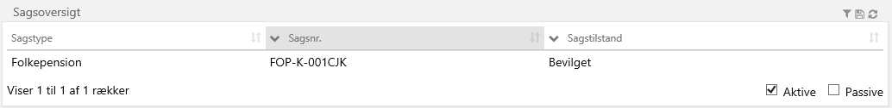

En sag betragtes som Aktiv, såfremt Gyldig_til på sagen ikke er defineret (under afgørelse) eller ikke er overskredet.
En sag betragtes som Passiv i alle andre tilfælde, dvs. ved afslag eller efter en bevillingsperiodes udløb.

Bemærk at, eftersom en sag kan bevilges med ikrafttrædelse i fremtiden, så kan en sag godt være aktiv, selvom
gyldighedsperioden for ydelserne endnu ikke er startet.

Pga. konventionen for at gyldigheder kun har datopræcision, og både gyldig fra og til er inklusiv, vil henvendelsessager
og akt- og registeringsindsigtssager være Aktiv på oprettelsesdagen og derefter Passiv.

## Sagskassation

Sager kan relateres til hinanden. Sagsrelationer udstilles på enkeltsagsvisningen og har indvirkning på sagskassation
idet relaterede sager kasseres samlet når alle er kassationsmodne.

Kassation af sager er beskrevet i DD130 – Kassation.

# Dokumentrelationer og –status

Dette afsnit beskriver hvordan løsningen anvender dokumentrelationer og dokumentstatus.

## Dokumentrelationer

Tabellen DOKUMENTRELATION beskriver en relation mellem et dokument (DOKUMENT_ID) og én anden entitet (se nedenfor). Et
dokument kan godt have flere dokumentrelationer, der hver knytter den til én anden entitet. Værdien af feltet
Relationsrolle, definerer hvilken anden entitet dokumentet er relateret til. Feltet har følgende mulige værdier:

1. Relationsroller der beskriver en relation til et andet dokument (DOKUMENT2_ID)
    - BILAG: Benyttes for vedhæftninger. DOKUMENT_ID refererer hoveddokumentet, og DOKUMENT2_ID til bilaget.
    - BESVARELSE: Denne benyttes ikke. Løsningen benytter i stedet SVAR_PAA. Se nedenfor.
    - SVAR_PAA: Benyttes for besvarelser på udsendte anmodninger. DOKUMENT_ID refererer til det oprindeligt udsendte
      dokument, og DOKUMENT2_ID refererer til det indgående svar.
    - UDGANGSPUNKT: Denne benyttes ikke.
    - ANDET_DOKUMENT: Denne benyttes ikke.
    - KOMMENTAR: Denne benyttes ikke.
    - UNDERSKRIFTAF: Denne benyttes ikke.
2. Relationsroller der beskriver en relation til en part (Person/myndighed/virksomhed)
    - PRIMAERPART: Beskriver den primære person, hvis sager dokumentet handler om. Et dokument vil typisk have mindst en
      dokumentrelation med relationsrolle PRIMAERPART, som peger på den relaterede person. Eneste undtagelse er
      indgående post, hvor primærparten ikke kan identificeres.
    - SEKUNDAERPART: Øvrige parter som er nævnt i dokumentet, men ikke henfører til ydelsesmodtager på en sag. Dette kan
      fx være vedrørerparter på de sager der skrives om. Relationen vedligeholdes ikke i noget system (da der er
      redundant i forhold til de tilknyttede sager), men benyttes af PHL ved indgående post, til at beskrive hvilke
      vedrørerparter der nævnes i brevet.
    - PARTER: Benyttes til at angive modtager (ved udgående post) eller afsender (ved indgående post) for dokumentet.
      For indgående post, er PARTER altid udfyldt for digital post, men sjældent for fysisk post. Det er afklaret med
      PHL, at fagsystemer ved kopi-/omjournalisering ikke kan ændre denne, hvorfor den aldrig vil referere til andet end
      modtager/afsender.
    - KOPIPART: Denne benyttes ikke.
    - FULDMAGTSGIVER: Ved valg af ubegrænset fuldmagt af typen Min sag, sendes alle breve pr default til fuldmagtshaver
      i stedet for personen selv. Disse breve skal også fremgå af fuldmagtsgivers dokumentfane. Derfor skal der tilføjes
      en dokumentrelation med typen FULDMAGTSGIVER til dokumentet, hvor parten er fuldmagtsgiveren.
3. Relationsroller der beskriver en relation til en sag
    - TILKNYTTET_SAG: Benyttes til at beskrive et dokuments relation til en sag. Et dokument vil ofte (men ikke altid)
      have en eller flere dokumentrelationer med relationsrolle TILKNYTTET_SAG. Der vil ikke være en sådan hvis fx
      procesmotoren ikke er kommet til at processere et indgående dokument, ej heller ved fx en indgående
      papirfuldmagt (som ikke er sagsspecifik).
4. Relationsroller der beskriver en relation til en opgave
    - TILKNYTTET_OPGAVE: Benyttes til at beskrive et dokuments tilknytning til en konkret opgave. Det er kun dokumenter
      med denne relation der vises ved opgavehåndtering.
5. Relationsroller der beskriver en relation til en fuldmagt
    - FULDMAGT: Benyttes for papirfuldmagter (ikke digital fuldmagt), til at relatere dokumentet til FULDMAGT entiteten.

## Dokumentstatus

Status for et dokument er for indgående dokumenter udelukkende karakteriseret ved attributten STATUS på entiteten
DOKUMENT. For et udgående dokument, er ”status” karakteriseret ved to separate attributter:

1. Status på DOKUMENT entiteten
2. Status på UDGAAENDE_FORSENDELSE entiteten

Status på DOKUMENT kan antage følgende værdier:

- Dokumenter med en indgående dokumenttype:
    - MODTAGET: Anvendes så snart et dokument er modtaget – både ved interne uploads samt modtagelse fra PHL.
    - SENDT_TIL_GENSKANNING: Anvendes for dokumenter modtaget via PHL, som af KR er markeret til genskanning. Når den
      nye version indgår fra PHL, har det nye dokument status MODTAGET (status ændrer sig dog aldrig fra
      SENDT_TIL_GENSKANNING).
- Udgående dokumenter som ikke har dokumenttype ANMODNING (dvs. dokumenttype OPLYSNING og KVITTERING)
    - AFSENDT: Anvendes så snart dokumentet er lagt i kø til Fjernprint. Om dokumentet reelt er sendt, skal aflæses af
      status på UDGAAENDE_FORSENDELSE.
    - KLADDE: Anvendes ved manuel brevfletning, mens KR arbejder på brevet, og inden det bliver lagt i kø til
      afsendelse.
    - RETURNERET: Anvendes når PHL har fået et brev retur. Dokumentstatus RETURNERET bliver sat af processen modtag
      post.
- Dokumenter med dokumenttype ANMODNING:
    - AFVENTER_SVAR: Anvendes hvis anmodningen er oprettet, men endnu ikke besvaret eller opgivet. Om dokumentet reelt
      er sendt, skal aflæses af status på UDGAAENDE_FORSENDELSE.
    - BESVARET: Anvendes hvis anmodningen er blevet besvaret af borger/myndighed (dvs. der ligger enten et andet
      dokument med relationsrolle SVAR_PAA til dette dokument, eller der foreligger et journalnotat, som beskriver en
      telefonisk besvarelse).
    - AFVENT_BESVARELSE_OPGIVET: Anvendes hvis anmodningen ikke er besvaret, men har overskredet sin svarfrist, og den
      proces der afventede besvarelsen, er fortsat til et senere trin.
    - KLADDE: Anvendes ved manuel brevfletning, mens KR arbejder på brevet, og inden det bliver lagt i kø til
      afsendelse.
    - RETURNERET: Anvendes når PHL har fået et brev retur. Dokumentstatus RETURNERET bliver sat af processen modtag
      post.

Status på UDGAAENDE_FORSENDELSE entiteten, benyttes til at beskrive livscyklus i forhold til de udgående kanaler
FJERNPRINT samt SIKKER_POST. Der er følgende tilladte værdisæt for udgående forsendelse:

- Oprettet
- Lagtikoe
- Overfoert til fjernprint
- Opgivet
- Returneret
- Flettefejl
- Validation fejl
- Fjernprint - Afsendt
- Fjernprint - ModtagetStraalforsConnect
- Fjernprint - Fejlet
- Fjernprint - Klar
- Fjernprint - AfleveretTilPrintOgKuvertering
- Fjernprint - ModtagetPostDanmark
- Fjernprint - ModtagetDigitalPost
- Fjernprint - Tilbagekaldt
- Fjernprint - OpdateringFraPostDanmark
- Fjernprint - AfleveretDigitalPost
- Sikkerpost - Afleveret
- Sikkerpost – Fejlet
- Konverteret

# Manuel opgavehåndtering

Dette afsnit beskriver den generelle opbygning af indholdet i informationskassen Opgave på det tværgående overblik, som
benyttes ved håndtering af opgavetrin der falder ud til manuel behandling.

## Design af sideelement i en opgave

Strukturen af sideelementet Opgave er vist i skærmbilledet nedenfor.

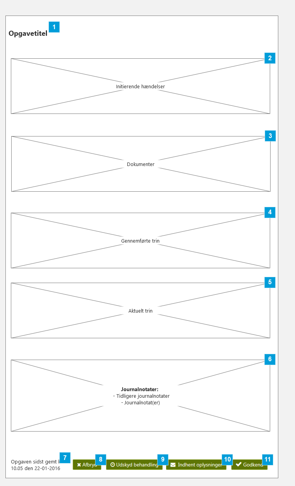

| Footnote | Note                                                                                                                                                                                                                                                                                                                                                                                                  |
|----------|-------------------------------------------------------------------------------------------------------------------------------------------------------------------------------------------------------------------------------------------------------------------------------------------------------------------------------------------------------------------------------------------------------|
| 1        | Opgavetitlen er en sigende titel, der beskriver opgaven overordnet og angiver opgavetypen.                                                                                                                                                                                                                                                                                                            |
| 2        | Dette modul eksisterer kun i projekt som har processerne ”Start automatiske ydelser” og ”Genvalidering”. Liste af hændelser der har initieret opgaven. Listen indeholder hændelsen der er direkte relateret til opgaven samt hændelser der er relaterede til denne hændelse (hændelsesrelation).                                                                                                      |
| 3        | Liste af alle dokumenter som er relateret til opgaven. Yderligere information om dette modul findes i [vedhæftede dokumenter](#vedhæftede-dokumenter)                                                                                                                                                                                                                                                 |
| 4        | Under Gennemførte trin vises de trin, der allerede er gennemført. Det er muligt at se informationen på det tidligere trin og gå tilbage til et tidligere trin. Yderligere information om dette modul findes i [gennemførte trin](#gennemførte-trin)                                                                                                                                                   |
| 5        | Under Aktuelt trin vises de relevante informationer/inputfelter for det pågældende trin                                                                                                                                                                                                                                                                                                               |
| 6        | Under journalnotater er der to fold-ud-elementer: - Tidligere journalnotater på opgaven - Her vises de journalnotater, der tidligere er skrevet og gemt på opgaven. Hvis der ikke eksisterer nogen tidligere journalnotater, er dette modul skjult. - Journalnotat: Her har KR mulighed for at skrive sit journalnotat. Journalnotat modulet beskrives yderligere i [journalnotater](#journalnotater) |
| 7        | Al kladdehåndtering er implicit og indtastninger gemmes hvert minut. Denne tekst viser brugeren hvornår kladden sidst er gemt.                                                                                                                                                                                                                                                                        |
| 8        | Funktionalitet til at afbryde behandling af en opgave. Yderligere information om denne knap findes i [afbryd](#afbryd)                                                                                                                                                                                                                                                                                |
| 9        | Funktionalitet til at indhente yderligere oplysninger på en opgave. Yderligere information om denne knap findes i [afbryd og luk](#afbryd-og-luk)                                                                                                                                                                                                                                                     |
| 10       | Funktionalitet til at udskyde behandling af en opgave. Yderligere information om denne knap findes i [indhent oplysninger](#indhent-oplysninger)                                                                                                                                                                                                                                                      |
| 11       | Funktionalitet til at gå til næste trin eller for at godkende opgave behandlingen.                                                                                                                                                                                                                                                                                                                    |

### Vedhæftede dokumenter

Vedhæftede dokumenter i opgavehåndteringen vises som en simpel version af dokumenttabellen i dokumentfanen.

Nedenfor ses en skærmskitse.

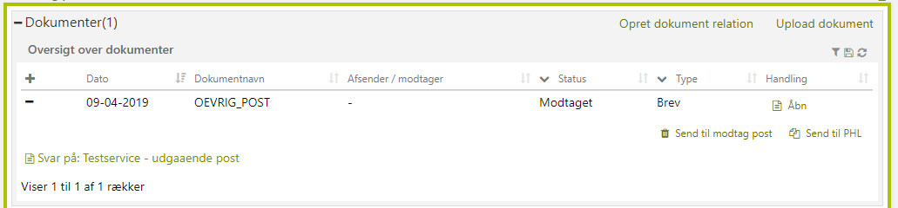

De funktioner (knapper i detaljerække) som understøtter opgavehåndtering er følgende:

- Send til PHL – Virker på samme måde som knap med samme navn i Journalnotat- og Dokumentfanen, undtaget fra genskanning
  funktionalitet som får anden effekt hvis den bliver brugt fra her fra og fra Journalnotat og Dokumentfanen. Se [afsnit
  6.1.1.2](#6\.1\.1\.2-genskanning) for mere information om genskanning.
    - Genskanning
    - Kopijournalisering
    - Fremsend dokumentation
- Slet fra opgave – Sletter dokumentet fra opgaven

Når en KR klikker på en af knapperne vises et modalvindue med en relevant tekst.

#### Upload dokument og opret dokumentrelation

KR har mulighed for at uploade et dokument fra sin lokale computer. En KR kan også relatere et eksisterende dokument på
personen til en opgave ved at bruge knappen ”Opret dokumentrelation”.

#### Genskanning

Hvis dokumentet sendes til genskanning ved at KR bruger ”Send til PHL” via Dokumenttabellen, går opgaven i ventetrin med
en betingelse, som afventer at PHL sender det genskannede dokument (betingelse af typen ”afvent integration”) tilbage.
Fristen for denne betingelse skal være X dage (hvor X er en systemparameter af typen ”Forretningskonstanter” – default
værdien er 3).

### Gennemførte trin

Gennemførte trin viser alle tidligere synlige gennemførte trin i en proces. Logikken for hvad der vises er:

- Hvis et trin er blevet eksekveret flere gange, pga. ”Gå til tilbage til trin” eller ”Tjek for nye hændelser”, så er
  det kun den seneste instans som bliver vist.
- Trin der vises i ”Gennemførte trin” er kun trin som er blevet eksekveret før det nuværende trin blev eksekveret første
  gange. Hvad dette betyder i praksis er: Hvis en proces har eksekveret trin 1-8 og KR vælger at gå tilbage til trin 4,
  så vises kun trin 1-3 i gennemførte trin, selvom 5-7 faktisk er blevet gennemført.

For hvert gennemførte trin er det muligt at gøre følgende:

- Bruge ”Gå til trin” knappen for at gå tilbage og behandle trinnet. Mere information om denne funktionalitet kan findes
  i [gå tilbage til et tidligere trin](#gå-tilbage-til-et-tidligere-trin)
- Se alt indhold i trin som det så ud på det tidspunkt trinnet blev gennemført. Det er ikke muligt at lave ændringer til
  værdier og alle felter er deaktiverede, dvs. det er ikke muligt at se alternative værdier i dropdowns, men kun den
  valgte værdi. Se skærmbillede nedenfor for eksempel:

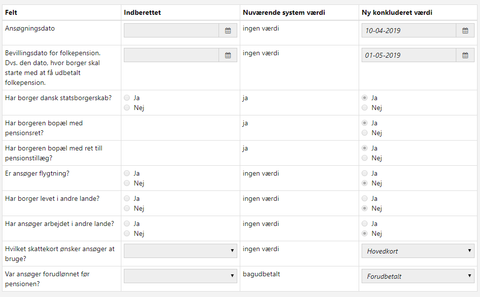

#### Gå tilbage til et tidligere trin

Hvis KR har behov for at gå tilbage til et tidligere trin, så er der mulighed for dette. Det gennemførte trin vil blive
viste over det nuværende trin. Når det er muligt at klikke ”Gå til trin”, så vil processen gå tilbage til det valgte
trin. Det er kun trin der aktivt er blevet valgt i processen det er muligt at gå tilbage til.

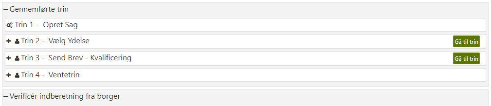

Hvis processen er i ventetrin og venter på svar fra borgeren, så vil det ikke være muligt at gå tilbage til noget trin.
Når ventetrin er færdig, så vil det være muligt at gå tilbage til tidligere trin.

Trin der er automatiske vil det ikke være muligt at gå tilbage til. Når en opgave er færdig, så kan alle trin ses i
gennemførte trin men det vil ikke være muligt at gå tilbage til noget trin.

### Journalnotater

Dette afsnit beskriver anvendelsen af journalnotater for opgaver.

For alle opgave findes der to afsnit for journalnotater:

- Journalnotat - Her har KR mulighed for at skrive sit journalnotat. Følgende felter eksisterer i modulet:
    - Vælg sager – Hvis journalnotatet skal relateres til en eksisterende sag. Dropdown viser alle sager (
      aktive/passive)
      som eksisterer på opgavepersonen.
    - Opret henvendelsessag – Hvis der ikke eksisterer en sag på personen og et journalnotat skal gemmes, så skal der
      oprettes en henvendelsessag. En henvendelsessag oprettes først når journalnotaten gemmes. Typer af
      henvendelsessager
      som kan vælges defineres af systemparameteren ”Henvendelsessagstyper”.
    - Vælg journalnotatskabelon – For at skrive et journalnotat skal en journalnotatskabelon vælges.
      Journalnotatskabeloner
      er en systemparameter. Det er muligt at ændre teksten for journalnotatskabelonen. Vælger man at ændre skabelonen,
      slettes alt indhold og erstattes med skabelonens indhold. Dette skal dog altid bekræftes gennem en dialogboks.
    - Skriv journalnotat – Tekstboks hvor selve journalnotatet skrives. Der eksisterer diverse formateringsmuligheder og
      det
      er også muligt at indsætte billeder og links.
- Følgende handlinger eksisterer i modulet:
    - Tilføj ekstra journalnotat – Bliver brugt til at føje et journalnotat til en opgave.
    - Nulstil journalnotat / Opret ikke journalnotat – Nulstiller indholdet i et journalnotat, dvs. fjerner alt indhold
      i
      alle felter på journalnotatet. Dette skal altid bekræftes gennem en dialogboks.
    - Fjern journalnotat – Fjerner journalnotatet. Dette skal altid bekræftes gennem en dialogboks. Knappen er skjult
      hvis
      der ikke eksisterer to eller flere aktive journalnotater på en opgave.
- Visning af journalnotatmodulet:

    

  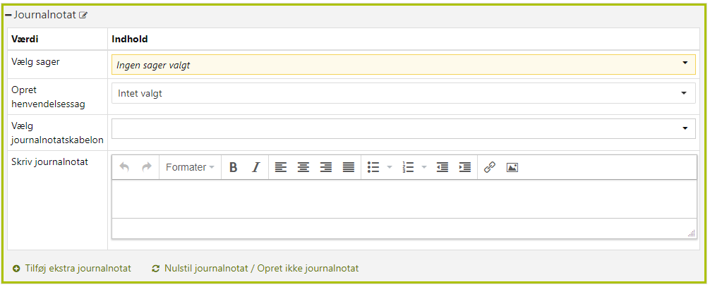

    

    - Tidligere journalnotater på opgaven - Tidligere journalnotater er alle tidligere journalnotater skrevet i
      forbindelse med håndtering af indeværende opgave, samt alle journalnotater skrevet ved opgavehåndtering af den
      opgave der initierede indeværende opgave. Det er ikke muligt at redigere i disse journalnotater, det er kun en
      visning. Hvis der ikke eksisterer nogen tidligere journalnotat er dette modul skjult. Visning af modulet:

    

  

    

Hvis en KR har påbegyndt et notat, og fx er gået hjem med opgaven åben, så bliver journalnotatet gemt i løbet af natten
som en del af batchjobbet ”Frigiv person”. Journalnotatet vil efterfølgende fremgå i listen af tidligere journalnotater.

Det er muligt at præudfylde at en journalnotatskabelon altid skal eksistere på en specifik type af opgave. Dette
administreres via systemparameteren ”Journalnotatskabelon”, hvor det er muligt at definere en opgavetype. I nedenstående
billede er journalnotatskabelonerne ”Test 2” og ”Test 3” blevet relateret til opgaven ”Telefonisk henvendelse”:

## Handling og kvittering

I forbindelse med behandling af et trin i en opgave har KR flere muligheder, udover selve behandlingen af trinnet:

- Afbryd
- Indhent oplysninger
- Udskyd behandling
- Fortsæt
- Godkend

### Afbryd

Ved brug af Afbryd-knappen vises et modalvindue hvor KR har mulighed for at vælge mellem ”Afbryd og Gem”, ”Afbryd og
Slet” eller ”Annuller”.

Modal vinduet er illustreret nedenfor:

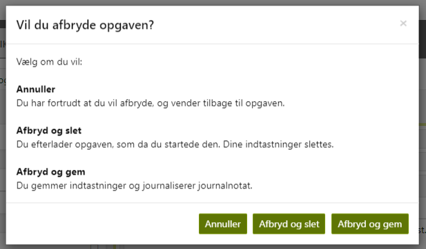

#### Afbryd og Gem

Indtastninger og overstyrede konklusioner gemmes. Alle journalnotater gemmes og ophøjes til endelige, hvorefter opgaven
frigives. Indtastninger på gennemførte opgavetrin ophøjes til ”endelige”, dvs. de er ikke gennemført, men kan ikke
længere fortrydes (KR kan altid gå tilbage til tidligere trin og ændre hvis de vil). Indtastninger på indeværende
opgavetrin gemmes i kladden, og kan genoptages af anden KR.

#### Afbryd og Slet

Det skal være muligt for en KR at fortryde opgavebehandling indenfor den eksisterende session, dette gør kunderådgiveren
ved at bruge funktionaliteten ”Afbryd og Slet”. Al information KR har indtastet eller systemet har genereret siden de
startede behandling på opgaven, bliver slettet og opgaven lukkes. Det findes restriktioner i forhold til revision og
sporbarhed, så det skal ikke altid være muligt at fortryde kunderådgiverens handlinger. Eksempler på entiteter som ikke
må slettes er:

- Journalnotater
- Brev
- Hændelser som relaterer til to forskellige opgaver
- Sager (der eksisterer nogle undtagelser som bliver beskrevet senere i dette afsnit)

Teknisk så arbejder ”Afbryd og Slet” med konceptet ”restore point” (gendannelsestidspunkt) hvilket refererer til det
tidspunkt som der bliver rullet tilbage til. Dette tidspunkt sættes:

1. Når en person frigives
    - Ved ”frigiv reservation” - batchjobbet. Dette batchjob fortager ”Afbryd og Gem” på alle opgaver på en person som
      ikke er frigivet.
    - Ved at KR manuelt frigiver personen ved at klikke på krydset ved siden af personens navn, og vælger ”afbryd og gem
      alt”
2. Når opgaven afbrydes ved ”Afbryd og gem”.
3. Når opgaven afsluttes.
4. Efter afsendelse af brev
    - Ved Indhent oplysninger funktionaliteten
    - Ved brev trin
5. Når det oprettes en hændelse i opgave som danner en ny opgave.

Når funktionen ”Afbryd og Slet” bliver kaldt, så finder systemet det nærmeste gendannelsestidspunkt, og sletter eller
ruller alle entiteter der er oprettet/ændret efter det tidspunkt tilbage.

Hvis en opgave er startet via Handlingsdropdown (kunderådgiver handling) så er det muligt at fortryde oprettelse af hele
opgaven, ved at en KR bruger ”Afbryd og Slet” knappen. denne knap fjerner alle spor af opgaven og sletter sagen. Når et
gendannelsestidspunkt er sat, så er det ikke længere muligt at fortryde oprettelse af opgave. Her er KR nød til at bruge
funktionaliteten ”afbryd og gem” eller afslutte opgaven.

De entiteter som rulles tilbage eller slettes når ”Afbryd og Slet” bliver kaldt er følgende:

- Opgave data
- Opgave trin data
- Opgave trin
- Regel eksekvering
- Regel begrundelse
- Sag
- Sagspart
- Kladde (inklusive journalnotat)
- Projekt specifikke entiteter
- Hændelser (stemplinger) – Status sættes til annulleret.

”Afbryd og Slet” funktionen ruller ikke en ændring tilbage, som en KR har lavet i et brev eller entiteter som har blevet
straksreplikerede i processen. Dette betyder at hvis KR skal fortryde ændringer de har lavet til et brev så skal dette
ske manuelt i Word.

#### Annuller

Dialogboksen lukkes og KR vender tilbage til opgaven.

### Afbryd og luk

Ved brug af Afbryd og luk-knappen vises et modalvindue hvor KR har mulighed for at vælge mellem ”Annuller” eller
”Bekræft”.

Vinduet er illustreret nedenfor:

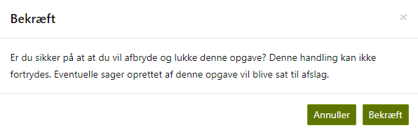

Hvis KR vælger Bekræft vil opgaven ente op i status Afbrudt og det vil ikke længere muligt at gøre noget mere i opgaven.
Der vil stadig være muligt at se opgaven i hændelse fanen. Hvis der er noget journalnotat på opgaven, vil denne blive
valideret og gemt. Hvis det også er nogen sag oprettet af opgaven vil denne sag blive sat til Afslag.

Hvis KR vælger Annuller lukkes modalvindue ned.

### Indhent oplysninger

En KR kan i alle manuelle opgavetrin sende et eller flere breve til en eller flere borgere. Dette gør KR ved at klikke
på knappen ”Indhent oplysninger”, som eksisterer i bunden af en opgaves behandlingsvindue (se billede nedenfor).

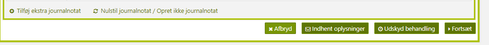

Når KR klikker på knappen ændres det aktuelle trin til ”Indhent oplysninger” trinnet.

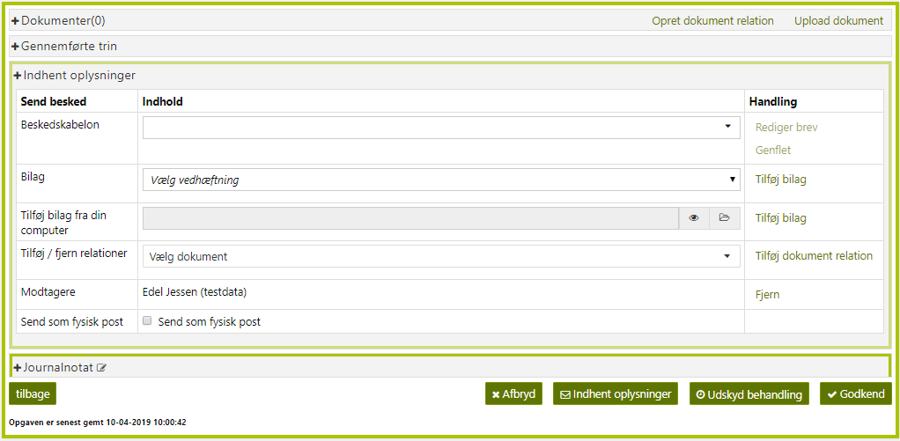

Dette trin fungerer som andre brevtrin i systemet. Der kan nu ske to forskellige ting, afhængigt af hvilken type brev KR
vælger at sende:

1. Hvis KR vælger at sende et oplysningsbrev (hvor der ikke forventes svar), så vil KR komme tilbage til det procestrin
   hvor KR valgte at sende brevet fra.
2. Hvis KR vælger at sende anmodning/partshøringsbrev hvor der forventes et svar fra borgeren, så sættes opgaven i
   ventetrin, hvor der afventes en besvarelse eller at svarfristen er nået. Opgaven vises ikke i opgaveindbakke. Hvis
   opgaven er i ventetrin, som er dannet fra ”Indhent oplysninger”, så er det ikke muligt at vælge ”Udskyd behandling”,
   men det er i stedet muligt at sende et nyt brev eller at ændre svarfristen til et senere tidspunkt. Når alle
   betingelser på ventetrinnet er opfyldt, vender opgaven tilbage til det oprindelige opgavetrin hvor KR brugte
   ”Indhent oplysninger”. Hvis et anmodningsbrev sendes, så udskydes opgavens forfaldsdato med samme antal dage som
   svarfristen. Alle breve som bliver sendt fra Indhent oplysninger bliver relateret til den nuværende opgave og vil
   derfor blive vist i opgavens ”Vedhæftede Dokument” modul. Mere information om dette modul findes
   i [vedhæftede dokumenter](#vedhæftede-dokumenter).

#### Afbryd og Send til Modtag post

I Modtag post processen, som er ansvarlig for at håndtere indkommende brev fra PHL, bliver breve automatisk håndteret
udfra dokumenttitel som sættes i PHL. Dette er ikke en fejlfri proces og nogen gange startes den forkerte proces op. For
at sikre at vi ikke skal sende noget tilbage til PHL er der lavet en intern journaliserings funktionalitet som kaldes
fra knappen ”Afbryd og send til Modtag post”. Det er kun fra PHL-initierede opgaver, hvor det er muligt at bruge knappen
”Afbryd og Send til Modtag post”. Det funktionen gør, er at:

- Lukke den opgave hvor funktionaliteten blev brugt fra.
- Oprette en hændelse af typen MODTAG_POST, som starter en opgave af typen Modtag Post.
- Ændre dokumenttitel til at teksten ”- Dokumentet sendt til modtag post af KR” tilføjes i slutningen af Dokumenttitlen.
  Denne titel er ikke en del af systemparameteren ”Dokumenttitel” og derfor bliver dokumentet håndteret som
  ustruktureret post.

Hvis et gendannelsestidspunkt (se afsnit Afbryd og Slet for at læse om hvornår gendannelsestidspunkt sættes) på et
tidspunkt er blevet sat på en opgave, er det ikke længere muligt at bruge denne funktionalitet og knappen bliver skjult.
Afbryd og send til modtag post knappen vises i venstre hjørne.

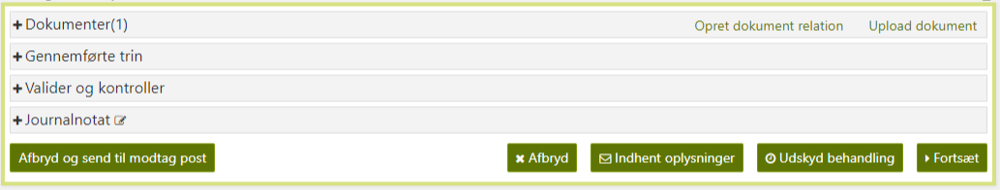

### Udskyd behandling

En KR kan i alle manuelle opgavetrin udskyde behandling til en specifik dato. Dette gør KR ved at klikke på knappen
”Udskyd behandling”, som findes i bunden af en opgaves behandlingsvindue (se billede nedenfor).

Når KR klikker på knappen vises følgende som en popup modal.

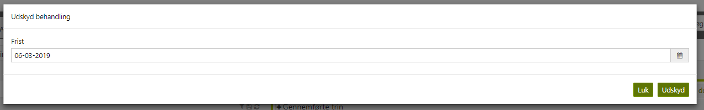

Fristen bliver automatisk præudfyldt til næste dags dato, men kan ændres af KR. Når opgave udskydes, så sættes opgaven i
ventetrin, hvor den angivne frist afventes. Opgaven vises ikke i opgaveindbakken. Hvis opgaven er i ventetrin som er
dannet fra udskyd behandling, så er det ikke muligt at udskyde behandlingen en gang til, men det er muligt at sende et
nyt brev og ændre ventefristen til et senere tidspunkt.

Når alle betingelser på ventetrinnet er opfyldt, vender opgaven tilbage til det oprindelige opgavetrin hvor KR har brugt
”Indhent oplysninger”.

Når en opgave udskydes, så udskydes opgavens forfaldsdato med samme antal dage som svarfristen.

### Automatisér

Tasks that fall out for manual processing or are started manually have a context flag set, which indicates that the task
has been manual. This flag is used i.a. to determine whether later steps will be manual.

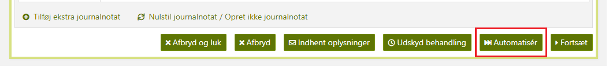

Når KR klikker på knappen ”Automatisér”, sker følgende:

- Kontekstflaget beskrevet ovenfor fjernes fra opgaven
- Opgaven får sat feltet ExecutionStatus = SEMI_AUTOMATIC
- Opgaven fortsætter på samme måde som ved tryk på Fortsæt / Godkend (se [fortsætgodkend](#fortsætgodkend))
- Brugeren omdirigeres til sagens overblikside.

Effekten heraf er, at opgaven vil forsøge at fortsætte på samme måde, som hvis den havde gennemført det pågældende trin
uden at have været faldet til manuel behandling. Efterfølgende trins kontroller, der inkluderer checks på, om opgaven
har været manuel, vil således se dette som ikke værende tilfældet.

Knappen vises kun, hvis forretningskonstanten ”AUTOMATISK_KNAP_FOR_OPGAVETYPE” inkluderer navnet på opgavetypen. Se
Tabel 1 for en oversigt over hvilke opgaver procesmotoren understøtter.

### Fortsæt/Godkend

Når en KR klikker på knappen ”Fortsæt”, så validerer procesmotoren alt som er på det trin.

- Hvis der ikke er nogle valideringsfejl, fortsætter opgaven til næste trin
- Hvis der er valideringsfejl, så bliver samme trin vist en gang til med røde advarsler for at indikere at der mangler
  oplysninger. Se eksempel nedenfor:
    

  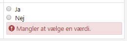

    

Når KR klikker på knappen ”Fortsæt”, bliver journalnotatet ikke valideret. Journalnotatet bliver først valideret når KR
klikker på knappen ”Godkend”.

Knappen ”Fortsæt” erstattes med knappen ”Godkend”, når opgaven er på trinnet før registreringstrinnet (dette er typisk
på opsummeringstrinet, men kan godt være på et andet trin). Der findes også andre scenarier hvor en knap kan ændres til
godkendt, men det er eksplicit implementeret i processerne hvor dette sker. Godkend-knappen har to funktioner:

1. Informere KR om at dette er trinnet før registreringstrinnet, og når de klikker på knappen ”godkend” så vil systemet
   gemme al information fra opgave i databasen. Når KR har klikket på ”Godkend” knappen findes der ikke nogen måde at
   fortryde dette og systemet kan blive påvirket på forskellige måder.
2. I dette trin valideres journalnotater på opgaven. Disse må ikke være mangelfulde hvis de skal gemmes i databasen.

### Kladdehåndtering og løbende persistering af indtastninger

Alle kladder gemmes implicit, og der er derfor ikke en eksplicit handlingsknap til at gemme kladden.

Der er følgende principper for at gemme indtastninger på opgaver generelt:

- Alle indtastninger i inputfelter på opgaven (fx tekstfelter, ændring til journalnotat, radiobuttons og checkbokse)
  gemmes mindst hvert minut. En tekst under journalnotatmodulet informerer om, hvornår kladden sidst er gemt for at give
  tryghed til brugeren. Teksten opdateres løbende.
- Hvis opgavetypen tillader vedhæftninger (ved bruge af upload dokumentation knappen), gemmes disse så snart de er
  vedhæftet.
- Hvis der rettes i et dokument, som åbnes i Word (fx rettelser til breve), gemmes dette i systemet hver gang Word
  gemmer. Det er ikke muligt at fortryde dette med ”Afbryd og slet” funktionen.
- Breve vedbliver med at være kladde indtil nogen genoptager opgaven og gennemfører den. Kladde-journalnotater ophøjes
  til endelige journalnotater, når opgaven bliver frigivet eller afsluttes.

# Brev

Brev kan sendes fra flere sted i systemet og forskellige projekt har forskellige implementationer. De fleste breve
bliver sendt fra en proces, men det findes også undtagelser til dette. I alle projekt findes de følgende to måder at
sende brev på:

- Indhent oplysninger (se [sagstyper](#sagstyper))
- Brevtrin i en proces

Der kan være brevtrin der udelukkende har ansvar for at formulere et brev, eller dette kan være et delansvar for
trinnet.

## Brugergrænseflade

Denne sektion beskriver brugergrænsefladen for afsendelse af breve samt dets tilhørende funktionalitet.

Hvorvidt brevtrinnet skal være foldet ud eller ej afhænger også af om brevet er flettet med succes uden manuelle
flettefelter som der skal håndteres. Hvis brevet er flettet med succes uden manuelle flettefelter der skal håndteres,
vil komponenten være foldet ind, hvis ikke vil komponenten være foldet ud, såfremt det også står til at skulle være
foldet ud i tabellen ovenover. Derudover vil headeren på komponenten også variere afhængig af om der er valgt et brev og
hvad status på fletningen er. Dette er beskrevet i [validering](#validering).

Skærmbilledet herunder viser brevtrinnet når det er foldet ud:

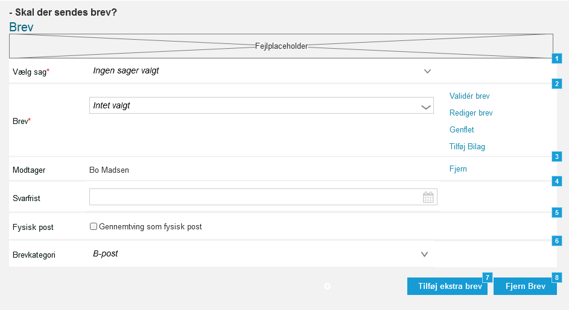

| Fodnote | Titel              | Beskrivelse                                                                                                                                                                                                                                                                                                                                                                                                                                                                                                                                                                                                                                                          | Hjælpetekst                                                                                                                                                                                                                                                                          |
|---------|--------------------|----------------------------------------------------------------------------------------------------------------------------------------------------------------------------------------------------------------------------------------------------------------------------------------------------------------------------------------------------------------------------------------------------------------------------------------------------------------------------------------------------------------------------------------------------------------------------------------------------------------------------------------------------------------------|--------------------------------------------------------------------------------------------------------------------------------------------------------------------------------------------------------------------------------------------------------------------------------------|
| 1.      | Vælg sag           | Sagsvælgeren er kun interagerbar såfremt der ikke kan udledes én sag. Såfremt opgavekonteksten kun indeholder ét og kun ét sags-ID, benyttes denne sag til fletningen af brevet og komponenten vil være read-only. Hvis der er 0 eller flere sags-ID, er sagsvælgeren interagerbar.                                                                                                                                                                                                                                                                                                                                                                                  | Vælg hvilken sag brevet relaterer sig til.                                                                                                                                                                                                                                           |
| 2.      | Brevskabelon       | Viser listen af brevskabeloner i systemet med gyldighed dags dato. Ved valg af en beskedskabelon flettes brevet med opgavens og sagens data. Evt. flettefejl eller manuelle flettefelter vil resultere i en advarsel som vises under dropdownlisten. Såfremt man er i en proces der autovælger en beskedskabelon, vil der være valgt en skabelon her. Det er beskrevet i de enkelte slutprodukter hvorvidt der automatisk vælges en beskedskabelon.                                                                                                                                                                                                                  | Vælg hvilken brevskabelon der skal benyttes til brevet.  Valider: Viser en fejlmeddelelse, hvis brevet ikke er klar til at blive sendt. Rediger: Åbner brevet til redigering  Genflet: Fletter brevet igen  Tilføj bilag: Giver mulighed for at tilføje bilag til brevet |
| 3.      | Modtager           | Angiver modtageren af brevet. Der kan altid kun være en modtager af et brev. Primærparten på sagen vil være default valgt. Såfremt borger har en CPR-værge eller en kontaktperson markeret som ”brevmodtager” vil denne person i stedet være default valgt. Her vil en evt. CPR-værge tage præcedens over en manuelt registreret værge. Såfremt man manuelt vil ændre modtageren, skal man klikke ”Fjern”. Herefter kommer en dropdownliste med mulige modtagere af brevet. Angives der ingen modtager, afsendes brevet ikke, men gemmes blot tilknyttet borgeren, og evt. den sag som processen behandler. Det er muligt at indtaste et andet CPR-nr. som modtager. | Modtageren af brevet. Hvis du ønsker flere modtagere skal du klikke på ”Tilføj ekstra brev” i bunden af trinnet.                                                                                                                                                                     |
| 4.      | Svarfrist          | Svarfristen vises kun såfremt den valgte beskedskabelon er af typen ”Anmodning”. Dette vil typisk være ifbm. indhentning af oplysninger i løbet af en proces. Hvis svarfristen på beskedskabelonen er ikke er angivet, vises denne komponent ikke. Feltet er read-only, hvis der er tale om en anmodning, hvor man ikke må ændre i svarfristen. Dette er en parameter angivet på beskedskabelonen. Defaultværdien er dagsdato + beskedskabelonens svarfrist i antal dage.                                                                                                                                                                                            | Angiv svarfrist for brevet.                                                                                                                                                                                                                                                          |
| 5.      | Fysisk post        | Angiver hvorvidt man vil tvinge et brev til fysisk post. Denne mulighed vises kun hvis borger er tilmeldt digital post.                                                                                                                                                                                                                                                                                                                                                                                                                                                                                                                                              | Angiv om brevet skal tvinges som fysisk post selvom borger er tilmeldt digital post.                                                                                                                                                                                                 |
| 6.      | Brevkategori       | Angiver hvilken kategori brevet skal sendes som såfremt det sendes som fysisk post. Såfremt man som kommune har Stålfros som printleverandør (systemparameter, se DD130 Systemparametertyper) kan man vælge ”Rekommanderet”. Vises kun hvis man har valgt at gennemtvinge fysisk post eller borger ikke er tilmeldt digital post.                                                                                                                                                                                                                                                                                                                                    | Angiv hvilken kategori det fysiske brev skal sendes med                                                                                                                                                                                                                              |
| 7.      | Tilføj ekstra brev | Tilføjer et ekstra brev i brevtrinnet. Knappen vises kun for det nederste brev i brevtrinnet. Brevet vil være tomt. Såfremt opgaven relaterer sig til én sag, vil denne sag dog være prævalgt i sagsvælgeren.                                                                                                                                                                                                                                                                                                                                                                                                                                                        |                                                                                                                                                                                                                                                                                      |
| 8.      | Fjern brev         | Fjerner brevet helt fra trinnet og opgaven. Der sendes ikke breve hvis alle breve er fjernet. Se 12.1 Send ikke brev. Knappen vises for hvert brev i brevtrinnet.                                                                                                                                                                                                                                                                                                                                                                                                                                                                                                    |                                                                                                                                                                                                                                                                                      |

### Header

#### Der er ikke valgt et brev

Såfremt der ikke er valgt en brevskabelon vil headeren vise: ”Skal der sendes brev” som vist nedenfor:

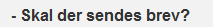

#### Brev er valgt men fletning er ikke gennemført

Hvis der er valgt en brevskabelon men brevet ikke er klar til afsendelse grundet enten fejlede flettefelter eller
manuelle flettefelter som ikke er håndteret vil headeren vises som følger ”{brevskabelonens titel} – Tilretning
påkrævet”, hvor ”tilretning påkrævet” er med rød skrift. Et eksempel er vist nedenfor:

#### Brev er valgt og flettet med succes uden manuelle flettefelter der skal håndteres

Hvis der er valgt en brevskabelon og brevet er klar til afsendelse da både automatiske og manuelle flettefelter er
håndteret vil headeren vises som følger: ”{brevskabelonens titel} – Klar til afsendelse”, hvor ”Klar til afsendelse” er
med grøn skrift. Et eksempel er vist nedenfor:

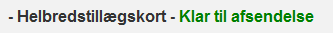

### Send ikke brev

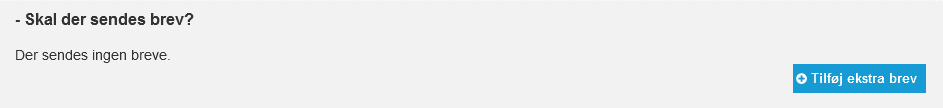

Såfremt man klikker på ”Fjern brev” eller en proces ikke autovælger en skabelon ses ovenstående skærmbillede.

Ønsker man alligevel at sende brev kan man tilføje et tomt brev ved klik på ”Tilføj ekstra brev”.

### Brevmodtagere

Herunder vises brevtrinnet såfremt man har fjernet brevmodtageren:

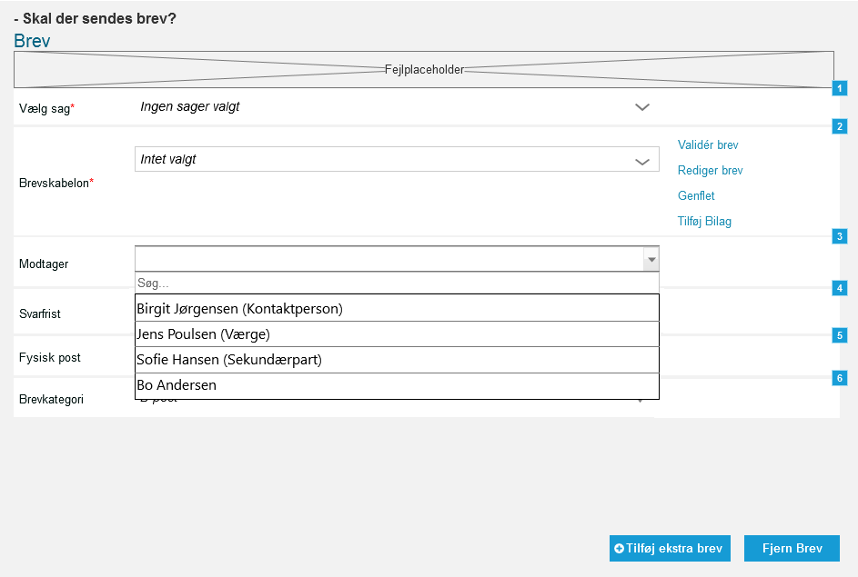

Det gælder for alle typer af modtagere at de skal have en gyldig adresse for at blive vist i dropdownlisten. Adresserne
er registreret forskelligt baseret på typen af modtager. Udfaldsrummet for modtagere er:

- Aktuelle aktive borger
- CPR-værger (adresse i ADRESSE-tabel)
- Kontaktpersoner (adresse i LOESTKOBLET_KONTAKT eller i ADRESSE-tabel)
- Sekundærparter på sagen (adresse i ADRESSE-tabel)

Formatet af listens indhold er ”{fuldt navn} ({rolle]})”. Der vises ingen rolle ud fra den aktuelle aktive borger, da
det er givet af personoverblikket.

Der vises en advarsel såfremt der ikke er valgt nogen modtager: ”Der er ikke valgt nogen modtager på brevet”.

Såfremt der er valgt en anden modtager end primærparten vises der en advarsel: ”Alternativ modtager er valgt”.

### Validering

Der kan forhåndsvalideres ved at klikke på knappen ”Valider brev”. Denne knap kører de valideringer som også køres når
der klikkes på ”Godkend” knappen:

- Der skal være valgt en sag
- Der skal være valgt en modtager
- Flettespørgsmål skal være besvaret
- Der må ikke være nogle flettefejl

Der valideres at brevet med bilag er under systemkonstanten ”brev-maksimal-stoerrelse”. Såfremt brevet og bilaget er
over denne værdi i MB kan man ikke gå videre i processen og der vises en fejl. Fejlen vises under det brev der har
overskredet størrelsesgrænsen:

”Den totale størrelse af brevet og bilag må ikke overskride {brev-maksimal-stoerrelse} MB.”

Såfremt brevets størrelse er i mellem ”brev-maksimal-stoerrelse” og ”brev-maksimal-stoerrelse” – 1, vises i stedet
en advarsel som advarer om, at den samlede størrelse på brevet kan overstige kan maksimalt tilladte størrelse:

”Den totale størrelse af brevet er i risiko for at være for stor til afsendelse. Overvej om bilagene kan gemmes med en
mindre størrelse”.

### Bilag

Ved klik på ”Tilføj bilag” knappen under brevskabeloner, åbnes der et modalvindue, hvor man har muligheden for at
tilføje bilag. Skærmbilledet herunder illustrerer modalvinduet:

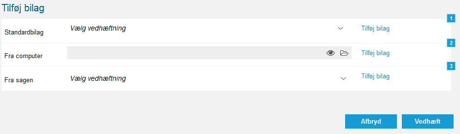

Tabellen herunder beskriver de forskellige sektioner:

| Fodnote | Titel         | Beskrivelse                                                                                 | Hjælpetekst                                                                                        |
|---------|---------------|---------------------------------------------------------------------------------------------|----------------------------------------------------------------------------------------------------|
| 1.      | Standardbilag | Dropdownlisten giver mulighed for at vælge imellem standardbilag i systemet.                | Vælg mellem systemets standardbilag. Klik på knappen ”Tilføj” når du har valgt.                    |
| 2.      | Fra computer  | Giver mulighed for at tilføje filer fra sin computer og sende med                           | Vælg en fil fra din computer og send med brevet. Klik på knappen ”Tilføj” når du har valgt en fil. |
| 3.      | Fra sagen     | Giver mulighed for at tilføje dokumenter relateret til sagen og opgaven og sende som bilag. | Vælg et eksisterende dokument fra sagen. Klik på knappen ”Tilføj” når du har valgt et dokument.    |

Det er muligt at klikke ”Afbryd” for at fortryde at vedhæfte bilagene til brevet. Ved klik på ”Vedhæft” vedhæftes
bilagene og vises under brevskabelonen som illustreret herunder:

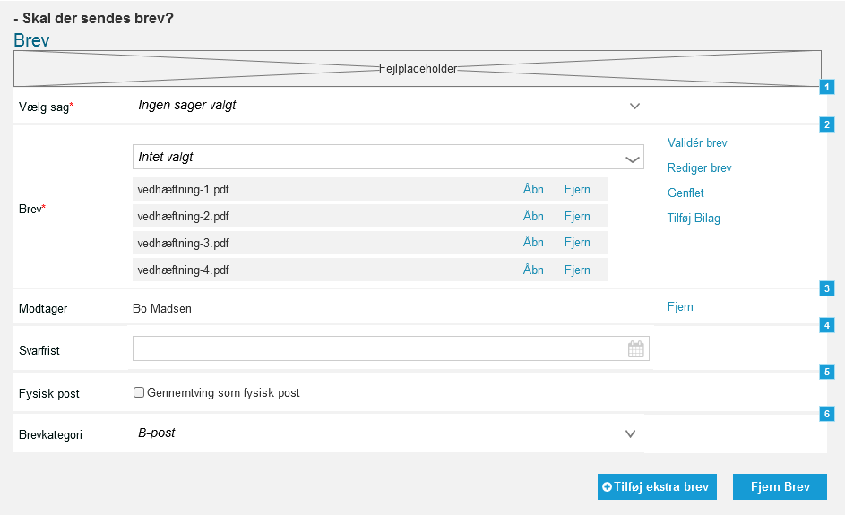

Det er muligt at åbne og fjerne bilagene ved klik på hhv. ”Åbn” og ”Fjern” ud fra det enkelte bilag.

### Brugergrænseflade – Tidligere version af MY

Det visuelle udtryk af en brevsektion i et manuelt brevtrin bliver som følger:

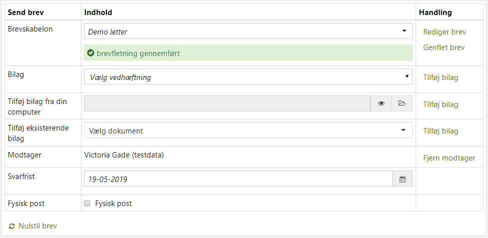

| Footnote | Note                                                                                                                                                                                                                                                                                                                                                                                                                                                                                                                                                                                                                                                                                                                                                                                                                                                                                                                                                                                                                                                                                                                                                                                                                                                                                                                                                                                                                                                                                                                                                                                                                                                                                                                                                                                                                                                                                                                               |
|----------|------------------------------------------------------------------------------------------------------------------------------------------------------------------------------------------------------------------------------------------------------------------------------------------------------------------------------------------------------------------------------------------------------------------------------------------------------------------------------------------------------------------------------------------------------------------------------------------------------------------------------------------------------------------------------------------------------------------------------------------------------------------------------------------------------------------------------------------------------------------------------------------------------------------------------------------------------------------------------------------------------------------------------------------------------------------------------------------------------------------------------------------------------------------------------------------------------------------------------------------------------------------------------------------------------------------------------------------------------------------------------------------------------------------------------------------------------------------------------------------------------------------------------------------------------------------------------------------------------------------------------------------------------------------------------------------------------------------------------------------------------------------------------------------------------------------------------------------------------------------------------------------------------------------------------------|
| 1.       | Dropdown menu til valg af beskedskabelon. Det er skabelonen som angiver dokumenttypen for den pågældende besked. Deter endvidere muligt at åbne beskeden (dvs. den færdigflettede skabelon) via Word og det skal være muligt at sikre at der redigeres i beskeden.  Der kan ikke fortsættes fra et trin hvor alle flettefelter ikke er udfyldt. Der eksisterer en særlig fletteteksttype (TekstInput – Se [DD130 – Document generation and document template management] afsnit ”Validation and merging proces” i MY toolkit) som kan indsættes i en skabelon for at tvinge KR til at overskrive feltet.  Der vises en liste af valideringsfejl hvis der er flettefelter der ikke kan flettes, eller der er øvrige valideringsfejl ved den udgående forsendelse, såsom dokument filstørrelse, filformater, antal vedhæftninger, at modtager har præcis én ikke-historisk adresse markeret som brevadresse, at denne har en landekode, samt alle andre valideringer i forhold til FjernPrint forsendelse, som kan kontrolleres på forkant. Se også [DD130 – Document generation and document template management] afsnit ”Validation and merging proces”.  Der fremkommer også feedback til brugeren som viser status på den automatiske fletningen. Hvis al indfletning kunne gennemføres automatiskt så fremkommer en validering der viser at alle felter blevet indflettet. Ellers, hvis det eksisterer TekstInput felter og eventuelle flettefelter der ikke automatisk kunne indflettes, så bliver det vist som et valideringsfejl på siden, hvis KR forsøger at trykke Fortsæt. Både eksistens af TekstInput felter og eventuelle flettefelter, som ikke automatisk kunne indflettes bliver vist som valideringsfejl på siden, hvis KR forsøger at trykke Fortsæt.  Det er muligt at genflet et brev, denne funktionalitet genfletter alle flettefelt og overskriver alle ændringer en KR har lavet til det brev. |
| 2.       | Er der bilag knyttet til skabelonen vises de som klikbare links. Knappen 'Tilføj bilag' giver mulighed for at tilføje bilag til beskeden. KR kan vælge filer fra egen stifinder samt fra dokumentbiblioteket ”Vedhæftninger”.  Derudover kan KR vælge bilag blandt eksisterende dokumenter tilknyttet personen (dvs. alt hvad der også vises på dokumentfanen) Det er ikke muligt for KR at fjerne bilag som er vedhæftet skabelonen, men det er muligt at fjerne bilag, som KR selv har vedhæftet.                                                                                                                                                                                                                                                                                                                                                                                                                                                                                                                                                                                                                                                                                                                                                                                                                                                                                                                                                                                                                                                                                                                                                                                                                                                                                                                                                                                                                       |
| 3.       | Mulighed at tilføje en bilag fra den lokale computer                                                                                                                                                                                                                                                                                                                                                                                                                                                                                                                                                                                                                                                                                                                                                                                                                                                                                                                                                                                                                                                                                                                                                                                                                                                                                                                                                                                                                                                                                                                                                                                                                                                                                                                                                                                                                                                                               |
| 4.       | Mulighed at vælge et eksisterende dokument som en bilag.                                                                                                                                                                                                                                                                                                                                                                                                                                                                                                                                                                                                                                                                                                                                                                                                                                                                                                                                                                                                                                                                                                                                                                                                                                                                                                                                                                                                                                                                                                                                                                                                                                                                                                                                                                                                                                                                           |
| 5.       | Modtagerfeltet er præudfyldt med primærpart, som kan ændres til en anden ved at fjerne og tilføje en ny modtager. Modtager kan være personer og virksomheder/myndigheder (CPR eller CVR). Der kan kun vælges én modtager (afklaret i udestående 1345)                                                                                                                                                                                                                                                                                                                                                                                                                                                                                                                                                                                                                                                                                                                                                                                                                                                                                                                                                                                                                                                                                                                                                                                                                                                                                                                                                                                                                                                                                                                                                                                                                                                                           |
| 6.       | Alle skabeloner har angivet en dokumenttype, som angives ved oprettelse. Dokumenttypen bestemmer erindringsmarkering, hvor 'Anmodninger' (inkl. anmodninger, partshøringer ) medfører en obligatorisk erindringsmarkering. Dokumenttyperne; 'Oplysninger' og 'Kvittering' har ikke en erindringsmarkering. Tidsfristen er derved kun synlig for skabeloner med dokumenttypen 'Anmodning', hvor den angivne svarfrist er dikteret afden anvendte brevskabelon. Denne kan kun ændres til en dato i fremtiden, hvis det er angivet på skabelonen, at svarfristen må kunne redigeres. Datofeltet er ellers ’read-only’.  Ved valg af skabelon med dokumenttype som ikke er 'Anmodning' skjules feltet for opfølgende tidsfrist, hvor hele rækken derfor ikke er synlig.                                                                                                                                                                                                                                                                                                                                                                                                                                                                                                                                                                                                                                                                                                                                                                                                                                                                                                                                                                                                                                                                                                                                                          |
| 7.       | Felt til angivelse af om brevet skal tvinges til fysisk post. Dette er dikteret af beskedskabelonen og kan overstyres af KR.                                                                                                                                                                                                                                                                                                                                                                                                                                                                                                                                                                                                                                                                                                                                                                                                                                                                                                                                                                                                                                                                                                                                                                                                                                                                                                                                                                                                                                                                                                                                                                                                                                                                                                                                                                                                       |
| 8.       | Knap for at nulstille brev, dette betyder at alle felt nulstilles og ændringer til brevskabelonen.                                                                                                                                                                                                                                                                                                                                                                                                                                                                                                                                                                                                                                                                                                                                                                                                                                                                                                                                                                                                                                                                                                                                                                                                                                                                                                                                                                                                                                                                                                                                                                                                                                                                                                                                                                                                                                 |

Breve som har flette- eller øvrige valideringsfejl, og som ikke udsendes som del af en proces – fx
selvbetjeningskvitteringer eller breve sendt i batchjobs (udbetalingsbreve), lægges i fejlstatus på den udgående
forsendelseskø mod fjernprint, og der oprettes en Teknisk fejl til håndtering i Fejlhåndteringsmodulet i
administrationssystemet.

Brevtrin kan både være automatiske og manuelle. Hvis en proces i mindst et tidligere trin er faldet ud til manuel
behandling, da vil brevtrin altid falde ud til manuel behandling – også automatiske brevtrin.

Hvis der på en opgave som skal til manuel behandling, anvendes en beskedskabelon med markeringen må ikke udsendes
automatisk, vil opgaven ryge ud til manuel behandling KR skal fortsætte behandlingen.

Hvis der er blevet udstedt en fuldmagt og fuldmagtsgiver vælges som modtager i brevkomponenten i alle processer, skal
der vises en advarsel om at brevet ikke sendes til den valgte modtager, men til fuldmagtshaver – brevet er tilgængeligt
under dokumentfanen. Se i afsnit ”Fuldmagt”, hvilke fuldmagtstyper dette er gældende for.

Brev vil kunne være relateret til en eller flere sager. Et brev kan blive relateret hvis det i brevtrin er valgt en sag.
Hvis det ikke er valgt en sag eller hvis brev bliver sendt automatisk så vil alle sager der er koblet til processen
blive relateret til det brev der er sendt.

# Ventetrin

I alle processer findes et ventetrin – dvs. at processen afventer en eller flere betingelser før processen kan
fortsætte. Betingelsen skal være opfyldt for at processen kan gå ud af ventetrinnet og fortsætte. En betingelse kan
bestå af tre forskellige variabler (ikke alle tre eksisterer for alle typer af betingelser):

- Beskrivelse af betingelsen (eksisterer for alle betingelser)
- Status (eksisterer ikke for alle betingelser)
- Frist (eksisterer ikke for alle betingelser)

I tabellen nedenfor listes alle betingelser som er en del af MY, det er muligt for hvert projekt at lave projekt
specifikke betingelser.

| Type af betingelse                                                            | Generel beskrivelse af betingelsestypen                                                                                                                                                                                                                                            | Statusværdi                                                                                                            | Eksisterer en frist? |
|-------------------------------------------------------------------------------|------------------------------------------------------------------------------------------------------------------------------------------------------------------------------------------------------------------------------------------------------------------------------------|------------------------------------------------------------------------------------------------------------------------|----------------------|
| Betingelse som afventer tid                                                   | Processen afventer en specifik dato inden den forsætter.                                                                                                                                                                                                                           | Ikke opfyldt status: ”Afventer tidsfrist” Opfyldt status: ”Tidsfrist er overskredet”                                   | Ja                   |
| Betingelse som afventer besvarelse af dokument                                | Processen afventer svar, fordi der er sendt en partshøring, eller anmodning til borger. Betingelsen afventer på samme tid en svarfrist, hvis dokumentet ikke besvares af borger. Hvis svarfristen nås, skiftes status på dokumentet til ”Tidsfrist for besvarelse er overskredet”. | Ikke opfyldt status: ”Afventer svar”. Opfyldt status: ”Tidsfrist for besvarelse er overskredet”, ”Besvaret”.           | Ja                   |
| Betingelse som afventer at alle ubehandlede opgaver af en type skal behandles | Processen afventer at alle opgaver af en type er behandlet. Dette forklares i detaljer i afsnittet: ”Hvis en svarfrist for betingelser som afventer besvarelse af dokument er nået.”                                                                                               | Ikke opfyldt status: ”Afventer behandling af opgaver”. Opfyldt status: ”Ikke nogle ubehandlede opgaver af denne type”. | Nej                  |

## Oprettelse og opfyldelse af betingelser

Oprettelse af betingelser kan både ske i automatiske procestrin og manuelt af KR via manuelle trin. KR-oprettede
betingelser sker via knapper i opgavebehandlingen (Udskyd behandling og Indhent oplysninger).

Opfyldelse af betingelser kan ske via systemet eller fordi en KR skifter fra en status til en anden. Hvis en betingelse
opfyldes af systemet, kan det være fordi at et brev er modtaget og dokumentets status skiftets, eller hvis en dato er
nået. KR-opfyldte betingelser er de betingelser, hvor status eller dato er blevet skiftet af KR i den manuelle del af
ventetrinnet (se flere detaljer i nedenstående skærmbilleder). For at falde ud af ventetrinnet skal alle betingelser i
ventetrinet være opfyldt.

For processen, er der forskel på, om en betingelse oprettes/opfyldes af procesmotoren eller af en KR. Ventetrin ses ikke
altid som et manuelt trin, selv om der er et skærmbillede for ventetrin. Hvis betingelsen oprettes/opfyldes af KR,
kommer opgaven at falde ud til manuel behandling på næste manuelle trin, f.eks. opsummeringstrinet. Hvis en betingelse
oprettes/opfyldes af procesmotoren, skal den ikke altid falde ud til opsummering – det sker kun, hvis processen har
været til manuelt trin tidligere.

## Skærmskitse

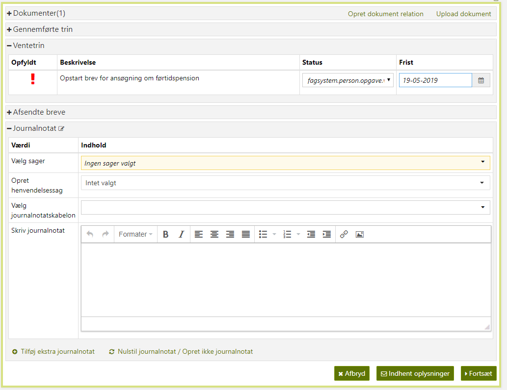

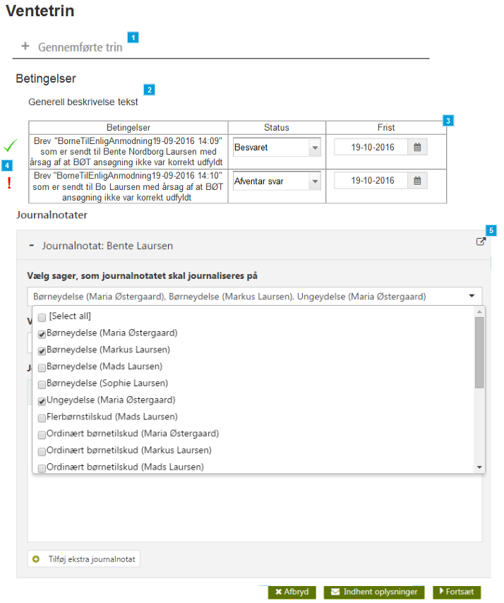

| Footnote | Note                                                                                                                                                                                                                                                                                                                                                                                                                                                                                                                                                                                                                               |
|----------|------------------------------------------------------------------------------------------------------------------------------------------------------------------------------------------------------------------------------------------------------------------------------------------------------------------------------------------------------------------------------------------------------------------------------------------------------------------------------------------------------------------------------------------------------------------------------------------------------------------------------------|
| 1.       | Viser alle tidligere gennemførte trin, se afsnit Gennemførte trin flere detaljer.                                                                                                                                                                                                                                                                                                                                                                                                                                                                                                                                                  |
| 2.       | En tekst som kan anvendes til at beskrive trinnet for KR.                                                                                                                                                                                                                                                                                                                                                                                                                                                                                                                                                                          |
| 3.       | En tabel som lister alle aktive betingelser for ventetrinnet. Følgende er beskrivelse af kolonnerne: - Betingelser, indeholder en beskrivende tekst af betingelsen. Det er en kombination af tekstnøgler og parametre fra systemet, sådan at en dynamisk tekst kan oprettes. Teksten i skærmbilledet er et eksempel – vil kunne tilpasses af ATP. - Status, er hvis der eksisterer en værdi for betingelsen udover tid, f.eks. dokumentstatus. Status repræsenteres med en simpel dropdown. - Frist, er en dato som repræsenterer en betingelses svar/tidsfrist. Anvendes, hvis en betingelses værdi eller frist er nået. |
| 4.       | Hvis en betingelse er opfyldt vises dette som en grøn checkmark ved siden af betingelsen i tabellen. Hvis en betingelse ikke er opfyldt, så vises et rødt udråbstegn i stedet.                                                                                                                                                                                                                                                                                                                                                                                                                                                     |
| 5.       | Gør det muligt for en KR at tilføje journalnotat. En KR vil f.eks. tilføje et journalnotat, hvis en borger ringer ind og spørger om en svarfrist kan ændres. Se afsnittet om Journalnotater for flere detaljer                                                                                                                                                                                                                                                                                                                                                                                                                     |

## Hvis en svarfrist for betingelser som afventer besvarelse af dokument er nået

Hvis en betingelse som afventer svar på et dokument, ikke får en besvarelse og derfor overskrider den indsatte
svarfrist, skal betingelsen ændre dokumentstatus til ”Tidsfrist for besvarelse er overskredet” og betingelsen er
herefter opfyldt. Hver gang en svarfrist er overskredet, skal der foretages et tjek, som kigger på, om der eksisterer
nogle ubehandlede modtag post opgaver for den person. Hvis der eksisterer ubehandlede opgaver, skal en ny betingelse
oprettes, en betingelse som afventer ubehandlede opgaver i modtag post. Dette skyldes, at der muligvis kan findes en
besvarelse på dokumentet i systemet, men som ikke blevet behandlet af en KR endnu.

Hvis KR behandler og afslutter alle modtag post opgaver, skal betingelsen automatisk skifte status til ”Ingen indgående
post/alle opgaver er behandlet”. En KR skal også have mulighed for selv at skifte status til ”Ingen indgående post/alle
opgaver er behandlet”, hvis de vurderer, at de modtag post opgaver, som eksisterer, ikke er svar på dokumentet på
betingelsen. Nedenfor er et skærmbillede, hvor svarfristen på en anmodning er overskredet (betingelsen er grøn), men der
eksisterer ubehandlede opgaver på personen (betingelsen er rød).

Normalt vises opgaver i ventetrin ikke i opgaveindbakken. Men: hvis ventetrinnet kun afventer en betingelse af typen
”betingelse som afventer ubehandlede opgaver i modtag post”, da skal den fremgå af opgaveindbakken. Teknisk betyder
dette at opgavestatus skifter til manuel.

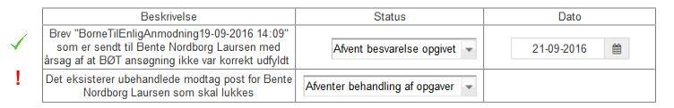

## Ændring af svarfrist og tidsfrist

For ventetrin som afventer tid, skal det i nogle tilfælde være muligt at ændre svarfristen/ventefristen. For alle trin
som kun afventer tid, ”Ventetrin som afventer tid”, skal det være muligt at ændre dato både i frem- og fortid. For
ventetrin af typen ”Ventetrin som afventer besvarelse på dokument og tid” så påvirker valg af brevskabelon, hvordan
svarfristen/ventefristen kan ændres. Når det kommer til svarfrist for brev, så kan der kun skiftes svarfrist frem i
tiden (ikke tilbage i tiden). Alt afhængigt af hvilken skabelon der vælges, så findes der to muligheder for KR:

1. At ændre fristen frem i tiden.
2. Ingen mulighed for at ændre fristen.

## Håndtering af oprettelser og sletning af betingelser

I ventetrinnet kan flere betingelser vises samtidigt, og hvis en betingelse opfyldes, så skal den ikke vises næste gang
processen falder ud til ventetrin, med mindre at betingelserne oprettes i samme procestrin. Det eneste eksempel, som
eksisterer for dette er for nuværende, hvis et brevtrin opretter og sender flere breve. Disse betingelser skal kobles
sammen, og hvis en betingelserne opfyldes, så skal denne ikke fjernes fra betingelsestabellen næste gang ventetrinet
vises (efter at KR klikket forsæt).

## Afvente at en opgave behandles af procesmotoren

Når procesmotoren behandler en proces, vises en spinner i opgavemodulet, som repræsenterer at en ny opgaveside indlæses.
Hvis det tager lang tid for procesmotoren at behandle opgaven, skal spinneren skiftes til at vise en ”venteside”. Denne
side indeholder en simpel beskrivende tekst, som forklarer KR, at opgaven behandles af systemet (procesmotoren). Denne
side er ikke en side, som KR kan gå ud af på samme måde som et ventetrin. Der står heller ingen betingelser, da det ikke
er muligt at beregne, hvor lang tid det tager for processen at behandle opgave, og det heller ikke er muligt eksakt at
sige, hvad der sker i procesmotoren.

# Fire-øjneprincippet

For processer hvor en KR direkte kan påvirke hvor meget en borger skal få udbetalt, uden at det eksisterer en ansøgning
eller ændre til hvem penge udbetales, skal det eksistere et trin som bruger 4-øjneprincippet.

Princippet er at en KR, 2 øjne, ikke skal kunne bevilge manuelle ydelser eller ændre udbetalingsmodtager, uden at en
anden KR godkender dette, 2 ekstra øjne, deraf 4-øjneprincippet. Trinnet ligger separat, så det er muligt at opsætte en
speciel arbejdspakke til disse godkendelser.

Visning for den første kunderådgivere (2 øjne) som har godkendt opsummeringen – Godkend knappen er deaktiveret for denne
KR:

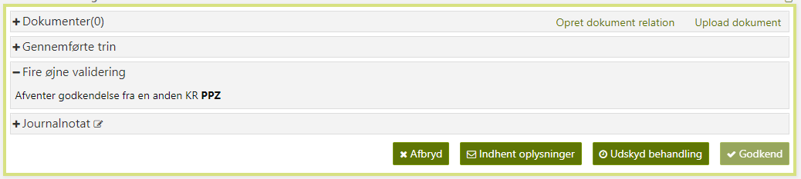

Visning for den andre kunderådgivere (4 øjne) – Denne KR kan godkende opgaven.

# Tjek for nye hændelser

Tjek for nye hændelser trinet kan i princippet appliceres i alle processer. Princippet er at tjek for nye hændelser
trinet skal beskytte processen fra at gemme opdateringer af sager, personoplysninger, beslutninger etc som er baseret på
et gammelt datagrundlag.

I alle processer hvor et tjek for nye hændelse trin eksisterer, findes der også et trin som indeholder en
stemplingsfunktionalitet. Stemplingen virker på sådan at hvis der er lavet en hændelse mellem stemplingen og den
tidspunkt processen rammer ind i tjek for nye hændelse trinet, så går processen tilbage til et angivet trin i processen.

Projekten har mulighed at tilføje til logikken, f.eks. hvis der er hændelser som er irrelevante og skal ignoreres.

Når det sket hændelser på borgeren siden stemplingstidspunktet, er det i projektet muligt at konfigurere trin
at vise disse hændelser, tit vises denne liste i opsummeringstrinet.

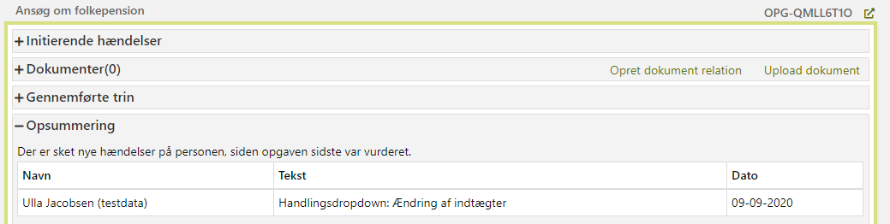

Tjek for nye hændelse trinnet ligger separat og det kan være muligt at se i Gennemførte trin.

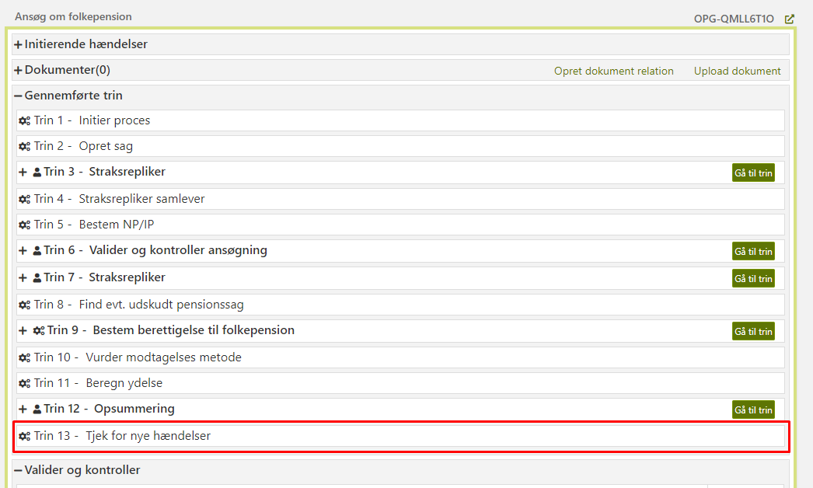

# Forfaldsdato på opgaver

Forfaldsdato beskriver SLA på en opgave, og er bestemmende for den beregnede prioritet (Høj, Mellem, Lav) og sortering i
opgaveindbakken.

Der er en systemparameter Forfaldsprioriteter, som holder grænseværdierne for hvornår en opgave skal klassificeres som
hhv Høj, Mellem og Lav prioritet. Tallet kan være negativt (hvis prioriteten først skal sættes efter forfald er
overskredet).

Der findes 2 forskellige versioner af dette. En version som har fælles forfaldsprioriteter for alle:

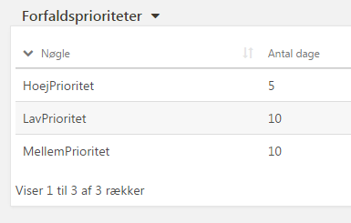

Og en version hvor der kan laves forfaldsprioritet for hver enkelt opgave hvis der ønskes, og ellers falder tilbage på
en default forfaldsprioritet som i den første version.

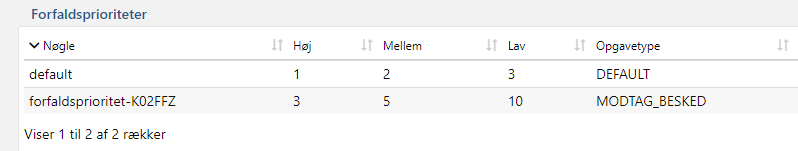

Der er en systemparameter forretningskonstant ”Default forfald” på 21 dage, som angiver standardværdien for forfald.

Systemparameteren Hændelsesabonnement har en ikke-obligatorisk attribut ”forfaldsdage”.

Når en hændelse initierer en opgave (pga. et hændelsesabonnement), sættes den initiale forfaldsdato til ”forfaldsdage”
dage fra hændelsens ”registreringstidspunkt”. Med registreringstidspunkt menes:

1. For Hændelsen ”Modtag post”: Modtagelsestidspunktet for brevet (altså hvornår modtagelsessystemet modtog
   kommunikationen)
2. For alle andre hændelser: Oprettelsestidspunktet for hændelsen.

Hvis hændelsesabonnementet ikke har et defineret antal ”forfaldsdage”, benyttes ”Default forfald”.

I forbindelse med afvikling af en opgave, kan den eksisterende forfaldsdato påvirkes på følgende måder:

1. Processen går i ventetrin
    - Ved ventetrin Afvent brev: forlæng forfaldsdato med svarfrist
    - Ved ventetrin Afvent tid: forlæng forfaldsdato med tidsfrist
2. Ventetrin-betingelsens svarfrist/tidsfrist ændres
    - Ændr forfaldsdato med tilsvarende forskydning
3. Processen tages ud af ventetrin før tid (fx besvarelse af brevanmodning før svarfrist, eller manuel afbrydning af
   ventetrin)
    - Forkort forfaldsdato med afstanden fra dags dato til svarfrist/tidsfrist.

# Liggetid på opgaver

Liggetid er et koncept som har blevet introduceret i MY for at det skal være muligt at aflæse hvor lang tid en opgave
ligger i status manuel inden den bliver færdiggjort. Liggetid betegner antallet af bankdage siden sidste nulstilling
Liggetiden vises i ubehandlede opgaver tabellen og opgaveindbakken:

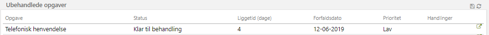

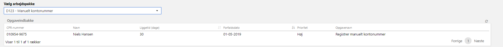

Forfaldsdato og liggetid har ikke nogen korrelation, hvor den første eksisterer for at de skal være muligt at prioritere
og vise KR når en opgave skal være færdigbehandlet og liggetid primært bliver brugt til at måle hvor gode KR er til at
behandle forskellige typer af opgaver.

Liggetid nulstilles i de følgende scenarier:

1. Oprettelse af opgave
2. Når en opgave går ud af et ventetrin (fx vent på brev besvarelse, eller afvent tid.)

# Roles and rights

Based on OpgaveType entry for new process 2 new permissions are created: a read (da: læs) right and an write (da:
skrive) right. The read right allows a user to see previous executed steps. The write right is needed to execute manual
steps in the process. The following rights will be available:

- For every process, p, which do have potential ydelser set (ydelsesart) or may set the actual ydelser:
    - ”p - Read” which uses (Grænse: Ydelse)
    - ”p - Execute” which uses (Grænse: Ydelse)
- For every process, p, which does not have potential ydelser set (ydelsesart) and will not set the actual ydelser:
    - “p - Read”
    - “p - Execute”

Each process needs to be added explicitly to roles that can write in it or read it. It can be done under admin/roller
url which looks as follows:

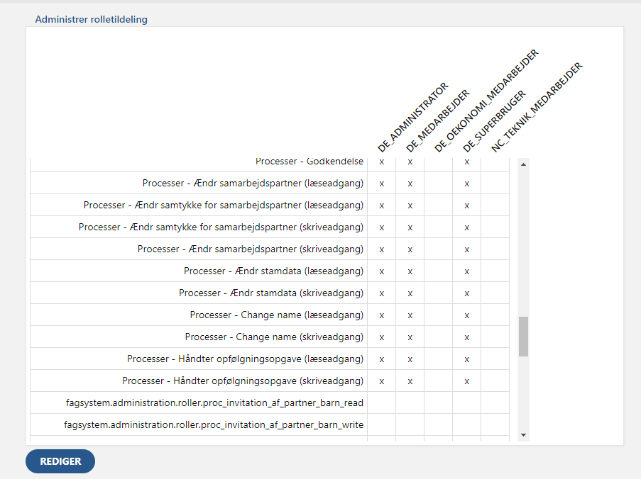

## Constraints within processes

The above rules control which processes with set potential ydelser and actual ydelser a user may access.

There is however also a need to restrict how a user can affect the actual ydelser on a process. It’s not ideal if a user
may select an ydelse the user does not have access to, or if the user chooses to work on a case in the process, which
the user does not have access to.

## Events

The Handlingsdropdown will be filtered according to the rights of the user, so the user is only allowed to create events
for processes the user may execute. The filtering uses the event subscriptions (da: Hændelsesabonnement) to derive which
events will create which processes.

I.e. a user is allowed to create an event from the Handlingsdropdown, if and only if the event will create a process, p,
which the user has the ”p - Execute” right for (which may have to consider data constraint depending on the kind of
process).

These rights are only used in the Handlingsdropdown. They do not affect the display of events.
