# References

| Reference                                                              | Title                              | Author         | Version |
|------------------------------------------------------------------------|------------------------------------|----------------|---------|
| [C0200 – Getting started with React][C0200_Getting_Started_With_React] | C0200 - Getting started with React | Gabriel Siegel | 0.2     |

<!-- =============== -->
<!-- REFERENCE LINKS -->
<!-- =============== -->

[C0200_Getting_Started_With_React]: https://goto.netcompany.com/cases/GTE2252/AMPJ/RhoDeliverables/C0200%20-%20User%20Guides/C0200%20-%20Getting%20started%20with%20React.docx?web=1

# Introduction

This document describes the React framework and different extensions used in the Amplio library.

## Target audience

This document is targeted at Netcompany employees with a high degree of experience with the Amplio library. This could
be an architect or similar. Developers that want to get quickly started with React, we refer to the user
guide [C0200 – Getting started with React][C0200_Getting_Started_With_React].

[high level description of the component](#high-level-description-of-the-component) is however written to be distributed
to a wider audience of
interested parties.

## Purpose

The purpose of this document is to give a technical description of React and related libraries used in Amplio.

- React is a JavaScript library used to create User Interface (UI) components for web applications.
- React allows developers to create large web applications that can change data, without reloading the page.
- The main purpose of React is to be fast, scalable, and simple.

## Background information

Amplio uses React together with Redux Toolkit, TailwindCSS, and other libraries to simplify what is needed for the
developer. This increases the learning curve but makes the code simpler.

# High level description of the component

React is a popular front-end JavaScript library for building web applications. React is used by developers to handle
everything regarding the user interface.

React allows us to create large web applications where we can reuse UI components on different pages. This allows the
developer to quickly get started with new web pages.

<div style="text-align: center;">


</div>

React also allows for data to change without the need to reload the web page. As seen in Figure 1, when the user changes
something via the user interface, this might change some data showed on the web page. Without React the complete page
would have to be reloaded but now we can update the specific component which shows the updated data to the user. This
gives a smooth and fast user experience where the user can interact with the website in a more natural way.

# Introduction to the subject

React is a declarative, efficient, and flexible JavaScript library for building user interfaces. ReactJS is an
open-source, component-based front-end library responsible only for the view layer of the application. It is maintained
by Facebook.

**1. Declarative**

React makes it painless to create interactive UIs. Designing simple views for each state in your application and React
will efficiently update and render just the right components when data changes. Declarative views make the code more
predictable and easier to debug.

**2. Component-Based**

Build encapsulated components that manage their own state, then compose them to make complex UIs. Since component logic
is written in JavaScript instead of templates, a developer can easily pass rich data through the application and keep
state out of the DOM.

**3. Learn Once, Write Anywhere**

React does not make assumptions about the rest of the technology stack, so a developer can create new features in React
without rewriting existing code. React can also render on the server using Node and power mobile apps using React
Native.

**4. A Simple Component**

React components implement a render() method that takes input data and returns what to display. The example below uses
an XML-like syntax called JSX. Input data that is passed into the component can be accessed by render() via this.props.

```typescript jsx
class HelloMessage extends React.Component {
  render() {
    return <div>Hello {this.props.name}</div>;
  }
}

root.render(<HelloMessage name="Taylor"/>);
```

The above way of using React.Component is not how we do it in Amplio, though. Instead, we use functional components. The
above example would then look like this:

```typescript jsx
function HelloMessage(props) {
  return <div>Hello {props.name}</div>;
}

root.render(<HelloMessage name="Taylor"/>);
```

**5. A Stateful Component**

In addition to taking input data (accessed via this.props), a component can maintain internal state data (accessed via
this.state). When a component’s state data changes, the rendered markup will be updated by re-invoking render(). In
Amplio, we use a different way to access the internal state date. In the example below, it can be seen how we access the
state via the function useSelector.

```typescript jsx
export default function ErrorsPopUp() {
  const dispatch = useDispatch();

  const {errors}: BaseErrorState = useSelector<CoreApplicationRootState, BaseErrorState>(
    state => state.core.system.error,
  );

  return (
    <ContentContainer>
      {errors && (
        <PopUpOverlay>
          <PopUpContent>
            <HeaderTitleBlock>
              <HeaderTitle>
                <Portaltext ptKey="headertitle"/>
              </HeaderTitle>
              <HeaderCloseButton onClick={() => dispatch(resetErrors())}>x</HeaderCloseButton>
            </HeaderTitleBlock>
            <ErrorContainterWithScroll>
              <br/>
              <h5>
                <Portaltext ptKey="popuptitle"/>
              </h5>
              {errors.map((error: ErrorData) => (
                <ServerErrorBlock key={error.uuid} error={error}/>
              ))}
            </ErrorContainterWithScroll>
          </PopUpContent>
        </PopUpOverlay>
      )}
    </ContentContainer>
  );
}
```

The state can then be used and changed in the function. The BaseErrorState from above is defined as:

```typescript
interface BaseErrorState {
  errors: any[];
  isErrorPopupVisible: boolean;
  optimisticLockingError: boolean;
  warnings: any[];
  isWarningsPopUpVisible: boolean;
  isTabAccessErrorPopupVisible: boolean;
  tabAccessErrorData: TabAccessErrorData | null;
}
```

**6. An application**

Using props and state, we can put together a small TODO-application. The example above uses state to track the current
list of items as well as the text that the user has entered. Although event handlers appear to be rendered inline, they
will be collected and implemented using event delegation. The example below is not from the Amplio code base, and it
uses React.Component, which we don’t use, but it still gives a good example of a complete application.

```typescript jsx
class TodoApp extends React.Component {
  constructor(props) {
    super(props);
    this.state = {items: [], text: ''};
    this.handleChange = this.handleChange.bind(this);
    this.handleSubmit = this.handleSubmit.bind(this);
  }

  render() {
    return (
      <div>
        <h3>TODO</h3>
        <TodoList items={this.state.items}/>
        <form onSubmit={this.handleSubmit}>
          <label htmlFor="new-todo">
            What needs to be done?
          </label>
          <input
            id="new-todo"
            onChange={this.handleChange}
            value={this.state.text}
          />
          <button>
            Add #{this.state.items.length + 1}
          </button>
        </form>
      </div>
    );
  }

  handleChange(e) {
    this.setState({text: e.target.value});
  }

  handleSubmit(e) {
    e.preventDefault();
    if (this.state.text.length === 0) {
      return;
    }
    const newItem = {
      text: this.state.text,
      id: Date.now()
    };
    this.setState(state => ({
      items: state.items.concat(newItem),
      text: ''
    }));
  }
}

class TodoList extends React.Component {
  render() {
    return (
      <ul>
        {this.props.items.map(item => (
          <li key={item.id}>{item.text}</li>
        ))}
      </ul>
    );
  }
}

root.render(<TodoApp/>);
```

**7. A Component Using External Plugins**

React allows you to interface with other libraries and frameworks. The example below uses remarkable, an external
Markdown library, to convert the \<textarea\>’s value in real time. We use a couple of external libraries with React in
Amplio. These will be explained in separate sections of this documentation. Below, we see an example of how we use the
external plugin, TanStack Form. We see that TanStack Form is imported and then used directly in the code as <
field.FormTextInput/>,
<form.FormSubmitButton/>, and useAppForm().

```typescript jsx
import React from 'react';
import { useDispatch } from 'react-redux';
import { Label } from '@foundation/core/components/Label';
import { SearchButtonsContainer, SearchContainer } from '@foundation/core/components/Search/style';
import { useAppForm } from '@foundation/core/components/Inputs/form/index';
import { Form } from '@foundation/core/components/Inputs/form/Form';
import { currentSearch } from '@my/search/services/search/actions';
import OpgaveSearchFormType from 'containers/SearchPage/SearchOpgavePage/components/OpgaveSearchForm/types';

interface OpgaveSearchFormProps {
  searchNodeName: string;
  initialValues: OpgaveSearchFormType;
}

export default function OpgaveSearchForm({ searchNodeName, initialValues }: OpgaveSearchFormProps) {
  const dispatch = useDispatch();

  const submitForm = (formValues: OpgaveSearchFormType) => {
      dispatch(currentSearch({ request: formValues, entityType: searchNodeName }));
  };

  const form = useAppForm({
      defaultValues: initialValues,
      onSubmit: ({ value }) => submitForm(value),
  });

  return (
    <SearchContainer>
      <Form form={form}>
        <Label ptKey="opgaveId" />
          <form.AppField name="opgaveId">
            {field => (
              <field.FormTextInput id="opgaveId-input" />
            )}
          </form.AppField>
          <SearchButtonsContainer>
            <form.AppForm>
              <form.FormSubmitButton ptKey="soeg.btn" />
              <form.FormResetButton ptKey="nulstil.btn" />
            </form.AppForm>
          </SearchButtonsContainer>
      </Form>
    </SearchContainer>
  );
}
```

# Third-part Components

## Yarn Lint, NodeJS

This section describes the run configurations we use in Amplio. It will not be described how to setup the use of React
correctly, see
instead [C0200 – Getting started with React](https://goto.netcompany.com/cases/GTE2252/AMPJ/RhoDeliverables/C0200%20-%20User%20Guides/C0200%20-%20Getting%20started%20with%20React.docx?web=1).
Amplio uses Yarn as package manager. Yarn controls how we import the Amplio code into the project code. This is done via
packages described in package.json files. Theses libraries we use via Yarn are Oxlint and Oxfmt. Oxlint is a static code
analysis tool for identifying problematic patterns found in JavaScript code, Oxfmt is a code formatter for unifying code style
.Both rules in Oxlint and Oxfmt are configurable, and customized rules can be defined and loaded. Oxlint and Oxfmt covers both code quality and coding style issues. 
Amplio uses NodeJS to run the React code. Node.js is an open-source, cross-platform, back-end JavaScript runtime environment that runs on
the V8 engine and executes JavaScript code outside the web browser. Node.js allows for server-side scripting—running
scripts server-side to produce dynamic web page content before the page is sent to the user’s web browser.

## Redux toolkit

Redux Toolkit is a toolset for efficient Redux development. It is intended to be the standard way to write Redux logic.
It includes several utility functions that simplify the most common Redux use cases, including store setup, defining
reducers, immutable update logic, and even creating entire "slices" of state at once without writing any action creators
or action types by hand. It also includes the most widely used Redux addons. The Redux core library is deliberately
unopinionated. It lets us decide how we want to handle everything, like store setup, what our state contains, and how we
want to build our reducers. This is good in some cases, because it gives us flexibility, but that flexibility isn't
always needed. Sometimes we just want the simplest possible way to get started, with some good default behavior out of
the box.

Redux Toolkit was originally created to help address three common concerns about Redux:

- "Configuring a Redux store is too complicated"
- "I have to add a lot of packages to get Redux to do anything useful"
- "Redux requires too much boilerplate code"

Redux Toolkit makes it easier to write good Redux applications and speeds up development, by baking in the recommended
best practices, providing good default behaviors, catching mistakes, and allowing us to write simpler code. Redux
Toolkit is beneficial to all Redux users regardless of skill level or experience.

Redux Toolkit includes:

- configureStore(): wraps createStore to provide simplified configuration options and good defaults. It can
  automatically combine our slice reducers, adds whatever Redux middleware we supply, includes redux-thunk by default,
  and enables use of the Redux DevTools Extension.
- createReducer(): that lets us supply a lookup table of action types to case reducer functions, rather than writing
  switch statements. In addition, it automatically uses the immer library to let us write simpler immutable updates with
  normal mutative code, like state.todos\[3].completed = true.
- createAction(): generates an action creator function for the given action type string. The function itself has
  toString() defined, so that it can be used in place of the type-constant.
- createSlice(): accepts an object of reducer functions, a slice name, and an initial state value, and automatically
  generates a slice reducer with corresponding action creators and action types.
- createAsyncThunk: accepts an action type string and a function that returns a promise, and generates a thunk that
  dispatches pending/fulfilled/rejected action types based on that promise
- createEntityAdapter: generates a set of reusable reducers and selectors to manage normalized data in the store
- The createSelector utility from the Reselect library, re-exported for ease of use.

Redux Toolkit also has a new RTK Query data fetching API. RTK Query is a powerful data fetching and caching tool built
specifically for Redux. It is designed to simplify common cases for loading data in a web application, eliminating the
need to hand-write data fetching and caching logic ourselves.

## RTK Query

RTK Query is a library from the Redux team with the main purpose of fetching and caching data for web applications. It
utilizes Redux under the hood and is built on top of Redux Toolkit (RTK). RTK Query provides advanced setup options to
handle fetching and caching needs in the most flexible and efficient way possible.

RTK Query was built to address the need to fetch data when using Redux as a state management system. RTK Query can be
added as a middleware and provides powerful React Hooks to help fetch data.

The main reason we use RTK query is threefold:

- RTK query hides the communication with the servers. This makes it easier for the developer to implement new
  functionality.
- RTK query adds new features such as caching and error handling. Especially caching is useful for the Amplio project.
  As an example, we use caching for portal texts, so we don’t need to load the texts again and again.

In Amplio, we use RTK query for tables and portal text. In the code, the RTK query functionality for portal texts is
hidden behind the following:

`const { isLoading, pt }: { pt: PortalTextObject; isLoading: boolean } = getPortaltext(ptKey, prefix);`

and the portal text can then be used as simple as the following:

`<Portaltext ptKey={historyTableName} />`

## TailwindCSS (library)

TailwindCSS is a utility-first CSS framework that provides low-level utility classes for styling components directly in your markup. 
We chose TailwindCSS because it offers several key advantages:
- Optimized bundle size: Tailwind's build process automatically removes unused CSS from builds, 
  ensuring users only download the styles actually used in the application.
- Consistent design foundation: Tailwind serves as the technical foundation that allows design decisions to be expressed as token-based utility classes, 
  rather than component-specific styling logic. This ensures visual consistency while still allowing projects to adapt the UI where required.
- Simple dynamic styling: Component styling can be adapted based on props or state using conditional class names, 
  making it easy to apply styles dynamically.
- Painless maintenance: Styles are co-located directly in component files using utility classes, 
  so we never have to hunt across different files to find styling.
- Extensive community resources: Tailwind's popularity means there's a wealth of guides, tutorials, and community support available.

Amplio uses a custom styling approach: our components define their own CSS classes (styled with Tailwind utilities), which projects can override to inject custom styles across the entire application. This architecture ensures a cohesive look and feel throughout your project, while giving projects full styling control.

For more information on utility classes usage, see the [official documentation](https://tailwindcss.com/docs/styling-with-utility-classes).


## TanStack Form

TanStack Form is a small library that helps with 3 parts related to forms in React:

- Getting values in and out of form state
- Validation and error messages
- Handling form submission

By collocating all the above in one place, TanStack Form will keep things organized – making testing, refactoring, and
reasoning about forms simpler. TanStack Form keeps track of the form's state and then exposes it plus a few reusable
methods
and event handlers (handleChange, handleBlur, and handleSubmit) to forms via props. A somewhat simple example of using
TanStack Form can be seen below. We see that we have a Form object that handles the state of the form including values
and errors. The values and errors are set by field-components e.g. <field.FormTextInput /> which is responsible for how
the individual input should behave. Furthermore, we have simple form-components such as FormSubmitButton, and
FormResetButton that adds simple functionality to the forms. Form components knows the state of the form object created
by useAppForm, which allows the FormSubmitButton to automatically be disabled if an error is detected on the
form object, or the FormResetButton that resets the form to its initial values.

```typescript jsx
export default function OpgaveSearchForm({ searchNodeName, initialValues }: OpgaveSearchFormProps) {
  const dispatch = useDispatch();

  const submitForm = (formValues: OpgaveSearchFormType) => {
    dispatch(currentSearch({ request: formValues, entityType: searchNodeName }));
  };

  const form = useAppForm({
    defaultValues: initialValues,
    onSubmit: ({ value }) => submitForm(value),
  });

  return (
    <SearchContainer>
      <Form form={form}>
        <Label ptKey="opgaveId" />
        <form.AppField name="opgaveId">
          {field => (
            <field.FormTextInput id="opgaveId-input" />
          )}
        </form.AppField>
        <SearchButtonsContainer>
          <form.AppForm>
            <form.FormSubmitButton ptKey="soeg.btn" />
            <form.FormResetButton ptKey="nulstil.btn" />
          </form.AppForm>
        </SearchButtonsContainer>
      </Form>
    </SearchContainer>
  );
}
```

Nested forms are not supported. Since `Form` renders a native <form> element, nesting two `Form` components produces [invalid HTML](https://developer.mozilla.org/en-US/docs/Learn_web_development/Extensions/Forms/How_to_structure_a_web_form#the_form_element).

Instead, use `useGetAppForm` and `useGetProcessForm` to build composable sub-components that access form state directly from context.
This allows you to break large forms into smaller, focused components while keeping them all connected to the same `Form` instance.

## Zod

Zod is a TypeScript-first schema validation library that helps with 3 main aspects of data validation:

- Type-safe schema definition and validation
- Runtime type checking with compile-time type inference  
- Error handling and custom error messages

By providing a declarative approach to validation, Zod keeps validation logic organized and maintainable . Zod allows 
you to define schemas that serve as runtime validators, eliminating the need to maintain separate validation logic and type definitions.

```typescript
export const defaultProcessSchema = (taskSchema: ZodObject<any, any> | undefined) => {
  const processDefaultSchema = z.looseObject({
    addedLetters: z.array(
      z.object({
          mailMergeStatus: z
            .object({
              actionRequired: z.boolean().nullable().optional(),
              failed: z.boolean().nullable().optional(),
              manualActionRequired: z.boolean().nullable().optional(),
              outputContentType: z.string().nullable().optional(),
            })
            .nullable()
            .optional(),
        })
        .refine(
          data =>
            data.mailMergeStatus &&
            data.mailMergeStatus.actionRequired === false &&
            data.mailMergeStatus.failed === false,
          { error: 'missing_merged_fields', path: ['mailMergeStatus'] },
        )
    ),
  });

  return taskSchema ? processDefaultSchema.and(taskSchema) : processDefaultSchema;
};
```

Complex nested schemas are fully supported. Since Zod schemas are composable, we can compose schemas using methods like `.merge()`, `.and()`, and `extend()` 
to combining simpler schemas.
Instead of defining all validation in one large schema, we can use smaller focused schemas and compose them together. 
This allows you to create reusable validation components while keeping the overall validation logic organized and maintainable.

```typescript
  .refine(
    data => {
        if (data.isCommunityProjectPart.currentValue === true) {
            return data.communityProjectName.currentValue != null;
        }
        return true;
    },
    {
        message: ValidationErrors.VALUE_REQUIRED,
        path: ['communityProjectName', 'currentValue'],
        when(payload) {
            if (payload.value === undefined || payload.value === null) return false;

            return payload.issues.every(
                issue => issue.path?.[0] !== 'isCommunityProjectPart' && issue.path?.[0] !== 'communityProjectName',
            );
        },
    },
```
For schema that uses `.refine()` methods can use the `.when` parameter to control validation timing. By default, Zod refinements only run after all object 
field validations pass, but the `.when` parameter allows us to override this behavior and show conditional validation errors immediately. 
This is particularly useful for showing validation errors on optional fields that become required based on other field values, without 
waiting for all required fields to be valid first.

## Swagger UI (backend)

Swagger is a framework for describing your API by using a common language that is easy to read and understand for
developers and testers, even if they have weak source code knowledge.

Swagger has certain benefits compared with other frameworks, such as:

- It's comprehensible for developers and non-developers. Product managers, partners, and even potential clients can have
  input into the design of your API because they can see it clearly mapped out in the friendly UI.
- It's human-readable and machine-readable. This means that not only can this be shared with your team internally, but
  the same documentation can be used to automate API-dependent processes.
- It's easily adjustable. This makes it great for testing and debugging API problems.

Swagger UI, a part of Swagger, is an open-source tool that generates a web page that documents the APIs generated by the
Swagger specification. This UI presentation of the APIs is user-friendly and easy to understand, with all the logical
complexity kept behind the screen. This enables developers to execute and monitor the API requests they sent and the
results they received.

When you open the webpage, the browser will load the webpage from the web server, and trigger requests to the API server
to get data from the database. Swagger UI is automatically generated from any API defined in
the OpenAPI Specification and can be viewed within a browser.

The main reason we use Swagger in Amplio is because it gives the projects an easy test framework for developers and
clients as well.
In your project’s controllers, add “import io.swagger.annotations.Api;” and then annotate your controller class with
@Api(tags = “<API tag>”) and then use the following annotations to describe the API:

- @Operation to describe the operation
- @Parameter to describe a parameter for the operation
- @RequestParam to describe what is requested from the user
- @PostMapping to describe the endpoint
- Other annotations can be found in official Swagger documentation.

See below for an example of use:

```java
@Tag(name = "tasktray")
@RestController
@Secured(SecurityRole.FS_OPGAVEINDBAKKE)
@RequestMapping(path = "/rest/api/tasktray", produces = APPLICATION_JSON_VALUE)
public class TaskTrayRestController {

    @Autowired
    private TaskTrayRestService taskTrayRestService;

    @GetMapping(path = "/recententities")
    public ResponseEntity<TableResponse> recentEntities() {
        TableResponse tableResponse = taskTrayRestService.getMyEntitiesTable();

        return ResponseEntity.ok(tableResponse);
    }
}
```

In Swagger UI, each definition typically corresponds to a module. To ensure that all controllers within a module are
included in Swagger UI, a GroupedOpenApi bean should be defined in the module's configuration class

```java
@Configuration
@ComponentScan(
        basePackages = {"nc.amplio.libraries.tasktray.rest"}
)
public class TaskTrayRestConfig {

    @Bean
    public GroupedOpenApi taskTrayApi() {
        return groupedOpenApi("tasktray", basePackagePath(TaskTrayRestConfig.class));
    }
}
```

The Swagger UI can be accessed via `http://localhost:<port>/<app context>/docs/swagger-ui.html.`

# Gradle configuration

In this section, we will briefly give an overview of the different Gradle tasks and plugins used to work with React
environment and code.

## nc.my.build-scripts.react_generate_typescript_model.gradle

In React applications, we send a lot of requests and to maintain the same structure and types between Java and React,
and to not spend too much time on creating types, we are using plugin, which generates Typescript from java classes.
Documentation about plugin can be found
here `https://www.habarta.cz/typescript-generator/maven/typescript-generator-maven-plugin/generate-mojo.html`. Base
configuration of tasks can be found in NCMCORE project in the following location
`NCMCORE\src\tools\gradle\buildscripts\src\main\groovy\nc.my.build-scripts.react_generate_typescript_model.gradle`. This
file contains base configuration as injectable plugin in a selected place. To use the plugin, we should apply it to
build.gradle file, which is on the same level where the React application is placed.

`apply plugin: "nc.my.build-scripts.react_generate_typescript_model"`

Next, we need to define task in build.gradle file. This task allows you to add custom configuration of plugin if
required.

```groovy
generateTypeScript {

    customTypeMappings = [
            'nc.modulus.ydelse.common.model.types.EntityType:string'
    ]
    // In outputFile you can change place where file with types will be created
    outputFile = project.projectDir.toString() + "/app/types/generated_types.ts"
}
```

Plugin will look for all java classes which are annotated with @TypeScriptModel. For example:

```java
package nc.modulus.ydelse.process.processes.handlefollowuptask.model;

import nc.modulus.ydelse.process.model.domain.trinviewdata.TrinViewData;
import nc.modulus.ydelse.rest.common.utils.TypeScriptModel;

@TypeScriptModel
public class HandleFollowUpTaskTrinViewData extends TrinViewData {

    private String opgavetypeNavn;
    private String instruks;

    public String getOpgavetypeNavn() {
        return opgavetypeNavn;
    }

    public void setOpgavetypeNavn(String opgavetypeNavn) {
        this.opgavetypeNavn = opgavetypeNavn;
    }

    public String getInstruks() {
        return instruks;
    }

    public void setInstruks(String instruks) {
        this.instruks = instruks;
    }
}
```

## nc.my.build-scripts.react-common-tasks

This plugin contains helper tasks to maintain easy workflow with react application. To use this plugin, we need to
simply apply it in the build.gradle file where the React application is placed.

`apply plugin: "nc.my.build-scripts.react-common-tasks"`

The plugin is split into seven sections:

1. Config – contains utils/helper methods used in other tasks or to easy use in project build.gradle files
2. React credentials to Netcompany Artifactory – contains task which creates the .npmrc file in build.gradle file
   location to allow fetching packages used in the React application. All packages are fetched from Netcompany
   Artifactory.

   For this task it is required to set repository URL for the project. We can achieve that by

   `project.ext.set("projectRepoUrl", "https://repo.netcompany.com/artifactory/api/npm/ncmcore-npm/")`

   setting the above code snippet in the build.gradle file.

3. Common tasks – contains definition of most common tasks used in multiple Gradle tasks
4. Build static files from react code – contains tasks which generates static files used by Spring application to render
   UI. We have two tasks defined there.
    - yarnBuild – generates static files with installing packages to current file versions defined in package.json.
    - yarnBuildWithoutYarnInstall – generates static files without installing packages (should be used when you want to
      generate static files basing on local versions of libraries created in NCMCORE project).
5. Use local repository for React code – contains task which configures project to look for React files in local
   environment instead of basing it on installed packages from Artifactory. Task finishes with generating static files
   base on local Artifactory.
6. Use Artifactory repository for React code – contains task which configures project to fetch React files from
   Artifactory. Tasks starts of disconnecting from local files, next updates packages to current specified version in
   package.json and finally it updates to the version specified in gradle.properties file, which can be found in the
   Spring application folder e.g., NCMCORE\src\reference\gradle.properties.

    ```properties
    # Version used to gradle task "stopUseLocalReactModulesAndUpdate" to easy update project with new version of react modules
    reactModulusVersion=2022.6.14-1620-DEV
    ```

7. Test React code – section contains simple task to test React application using Oxlint library. Task will finish with
   success when React application doesn’t contain any errors.

## Platform/react/build.gradle

This file contains configuration for module in which stored are multiple react packages contains common components used
in multiple projects. File is split into sections which contains:

1. In the top of the file, we can find applied plugins:

    ```groovy
    apply plugin: "nc.my.build-scripts.property_helpers"
    apply plugin: "nc.my.build-scripts.react-common-tasks"
    ```

   First plugin contains logic of loading credentials stored in credentials.properties file.

2. Config – contains configuration classes and methods, which are used in other tasks created in this file.
3. Module config – contains configuration from Gradle perspective and project module variables.
4. Credentials – contain tasks to create .npmrc file in all defined/created packages in the current module. This .npmrc
   file allows to publish new version of packages to Netcompany Artifactory.
5. Test react code – tasks which tests all defined/created packages in the current module using Oxlint library. If tasks
   finish with success, then no module contain any errors.
6. Release React code – section contains two tasks which are used to publish new versions of packages.

    - publishLocalReact – task publishes React packages to local repository to have the possibility to work with the
      React
      application in local mode. If required libraries are not installed for given package, then it will install these
      and
      next publish it to a local repository.
    - releaseReactCode – task publishes React code to Netcompany Artifactory. Before this happens, the task makes sure
      that
      the code is without errors by testing it with Oxlint library. Next, it disconnects React packages from the local
      repository, downloads current versions of libraries, and next, it starts publishing packages with the new version
      created at the beginning of the task.

## Business-react/business-ui/build.gradle

This file contains configurations for the React reference application created in NCMCORE project. File is split into
sections, which contains:

1. At the top of the file we have the following included plugins used in the file:

   ```groovy
   apply plugin: "nc.my.build-scripts.react_generate_typescript_model"
   apply plugin: "nc.my.build-scripts.react-common-tasks"
   ```

2. Module config – section contains configuration of the module where the React application is placed. In this
   configuration we can find variables created for this module required by common tasks

    ```groovy
    project.ext.set("reactModules", ["core", "process", "faq", "search", "tasktray"])
    project.ext.set("projectRepoUrl", "https://repo.netcompany.com/artifactory/api/npm/ncmcore-npm/")
    project.ext.set("reactModulesVersion", "${reactModulusVersion}")
    ```

   and other Gradle related configuration which defines source, resource, and excluded directories.

    ```groovy
    idea {
        module {
            sourceDirs += files("app")
            resourceDirs += files('react_build')
            excludeDirs += files(".gradle", ".vscode", "internals", "node_modules", "nodejs", "npm", "server", "yarn")
        }
    }
    ```

3. Generate typescript base on Java code – section contains usage of TypeScript plugin generator.
4. Resources config – section contains configuration of how static files will be injected into Spring application to
   render UI.

    ```groovy
    assemble.dependsOn(yarnBuild)
    yarnBuild.finalizedBy(processResources)
    ```

   This configuration executes tasks, which produces static files from React code when we run Gradle assemble task.

    ```groovy
    processResources {
    from 'react_build'
    }
    
    jar {
    dependsOn processResources
    into '', {
    from 'react_build'
    }
    duplicatesStrategy 'exclude'
    }
    ```

   This configuration specifies from which folder Gradle will be looking for generated static files (in our case it will
   be
   “react_build”) and after it builds a source cycle, it will copy these static files into the build folder used to
   build
   jar files in the project.

# NC Front Components

In this section, we will very briefly give an overview of the different React front components in Amplio. The different
components are located under libraries/platform/react/src/core/core/components.

The components are mainly visual and can be thought of as building blocks for the frontend pages. The components contain
as little business logic as possible and help create a streamlined look in the application. Using the same kind of
button on all pages, for example, helps the user to understand and use the system in an effective manner. Components
should never contain API calls.

There are many components in Amplio but to highlight a few:

1. Button - Similar design for buttons on all pages. Handles clicking to active actions.

<div style="text-align: center;">

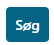
</div>

2. Dropdown - Folds out and presents a list of inputs to choose from.

<div style="text-align: center;">

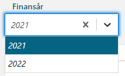
</div>

3. Warning - Validates some condition and shows a warning with specific style.

<div style="text-align: center;">

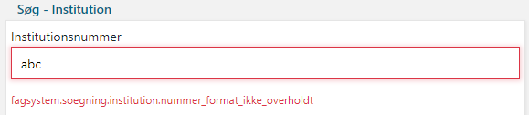
</div>

4. Spinner - Shows the user that the component is loading.

<div style="text-align: center;">


</div>

## FAQ pages

The Business application in Amplio contains a page called FAQ. This can be accessed by the page /fagsystem/app/faq/. On
this page there are examples of usage for some of the most common components. This includes the checkbox, general input,
and selection. Developers can use this page to see how to use the different components in Amplio. Furthermore, the page
also contains explanations of the different properties of each component. See example below:

<div style="text-align: center;">

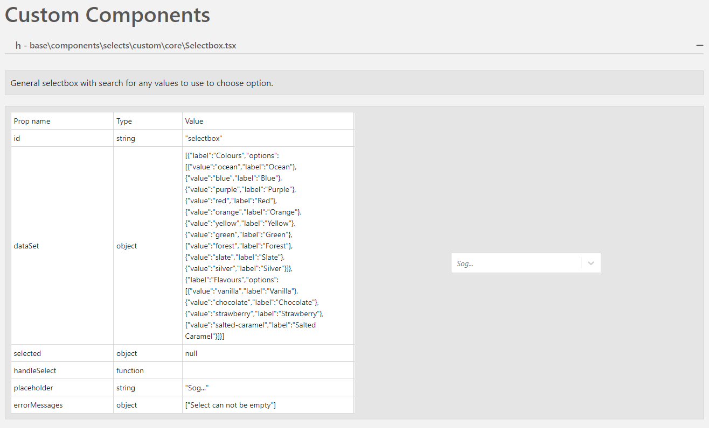
</div>

# Run configuration

- **Yarn start:** Yarn start compiles the react code and uploads the frontend to a web server. It needs to be run after
  starting the application via spring boot. Running the frontend via yarn start makes it possible to change the
  typescript code and seeing the changes live without deploying again. If we use yarn start from the run configurations
  tab instead of the terminal, we can debug typescript files directly in IntelliJ instead of in the browser.
- **Publish React locally:** This run configuration publishes the React code locally on the developer’s computer. This
  makes
  it possible to test the code directly via the reference application or the developer’s own project application.
- **Publish React to Artifactory:** This publishes the React code to the Netcompany Artifactory and updates the
  reactModulusVersion, which the application needs to download the wanted packages.
- **Test all React modules:** This doesn’t include specific unit tests. Instead, it compiles the code looking for
  compile
  errors. Furthermore, it uses Oxlint to analyze the code quality and finding best practice errors.
- **Use React from Artifactory:** This is run from the reference application or the project application. It updates the
  project dependencies, so the project uses the downloaded packages from Artifactory.
- **Use React from local:** This is run from the reference application or the project application. It updates the
  project
  dependencies, so the project uses the local packages from Artifactory. This is run after “Publish React locally” is
  run on the Amplio project.

# Navigation (Router)

In this section, we describe how the navigation in the frontend is handled in React.

## React router library

React Router is a fully featured client and server-side routing library for React, a JavaScript library for building
user interfaces. The main responsibilities of React router are to keep track of history and locations, matching URLs to
routes, and rendering the nested UIs from the route matches. In the following subsections we will describe some of the
most important methods from React router in Amplio.

### Routers

- **BrowserRouter:** <BrowserRouter> is the recommended interface for running React Router in a web browser.
  A <BrowserRouter> stores the current location in the browser's address bar using clean URLs and navigates using the
  browser's built-in history stack.
- **Router:** <Router> is the low-level interface that is shared by all router components (like <BrowserRouter>). In
  terms
  of React, <Router> is a context provider that supplies routing information to the rest of the app.

### Components

- **Link:** A \<Link> is an element that lets the user navigate to another page by clicking or tapping on it. In
  react-router-dom, a \<Link> renders an accessible \<a> element with a real href that points to the resource it's
  linking to. This means that things like right-clicking a \<Link> work as you'd expect.
- **NavLink:** A \<NavLink> is a special kind of \<Link> that knows whether it is "active". This is useful when building
  a navigation menu such as a breadcrumb or a set of tabs where you'd like to show which of them is currently selected.
  It also provides useful context for assistive technology like screen readers.

### Hooks

- **useLocation:** This hook returns the current location object. This can be useful if you'd like to perform some side
  effect whenever the current location changes.
- **useParams:** The useParams hook returns an object of key/value pairs of the dynamic params from the current URL.

For more information about the React router, see https://reactrouter.com/docs/en/v6 for the official documentation.

## Navigation from backend to frontend

Routing is created in the backend and sent to the frontend. As an example, let’s talk about the CorePage. This container
contains the main functionality that other pages can use. The CorePage contains a container called PrimaryNavigation:

```typescript jsx
return (
  <Content prefix={AppPortaltextPrefixStore.fagsystem.fagsystemHeader}>
    <GlobalAppPopups/>
    <TopBar
      brandTitle={<Portaltext ptKey="titel"/>}
      bgColor={currentTheme.colors.secondary.bgColor}
      brandImage={applicationLogo}
      logoutLogic={logoutUser}
    />
    <PrimaryNavigation navigationRouteConfig={coreNavigationConfig}/>
  </Content>
);
```

The different routes that are available in PrimaryNavigation is defined in the coreNavigationConfig:

```typescript
const coreNavigationConfig: NavigationRouteConfig = {
  privateRoutes: {
    soegning: {
      name: 'soegning',
      iconName: 'search',
      component: SearchPage,
    },
    opgaveindbakke: {
      name: 'opgaveindbakke',
      iconName: 'inbox',
      component: RefTaskTrayPage,
    },
    administration: {
      name: 'administration',
      iconName: 'wrench',
      component: AdminPage,
    },
    person: {
      name: 'person',
      iconName: 'search',
      component: PersonPage,
    },
    support: {
      name: 'support',
      iconName: 'phone',
      component: SupportPage,
    },
  },
  redirects: [],
};
```

These routes contain a name and a component, but it is missing an URL and its functionality. This is defined in the
backend. As an example, we can look at the SearchPage. The routing is configured in the PersonSearchRestController in
the reference application:

```java
@Api(tags = {"person", "search"})
@RestController
@PreAuthorize("isAuthenticated()")
@RequestMapping(path = "/rest/api/search/person", produces = APPLICATION_JSON_VALUE)
public class PersonSearchRestController {
```

The created routes are parsed in the frontend via outFilterRoutes and createPrivateRoutes. Let’s see an example from
PrimaryNavigation:

```typescript jsx
return (
  <Tab.Container id="tab_container">
    <ContentContainer>
      <BasePrimaryNavigation
        tabAccessList={outFilterRoutes(userInfo ? userInfo.components : {}, navigationRouteConfig)}
        navigationPrefix={AppPortaltextPrefixStore.fagsystem.fagsystemNavigationTopmenu}
      >
        {Object.entries(entitiesGroup.person).map(([key, value]) => (
          <EntityTabWithProcess<PersonEntityObject> key={key} path={`/person/${key}`} entity={value.entity}/>
        ))}
        <SearchBox/>
      </BasePrimaryNavigation>
    </ContentContainer>
    <Tab.Content>
      <Switch>
        {createPrivateRoutes(userInfo?.components || {}, navigationRouteConfig, fetchUserData)}
        {createRedirects(navigationRouteConfig.redirects)}
        <Route component={NotFoundPage}/>
      </Switch>
    </Tab.Content>
  </Tab.Container>
);
```

Here we see that the routing is taken from userInfo.components and navigationRouteConfig. Routes accessed via
createPrivateRoutes can only be accessed if logged in. Otherwise, it redirects to the login page. In general, the
routing backend is configured in the different rest controllers in your project, which sometimes will use functionality
from NavigationRestService.

## Navigation components

### Tabs

Amplio contains 3 types of tabs. EntityTab, PrimaryTabs, and SecondaryTabs. All three types can be seen below:

<div style="text-align: center;">

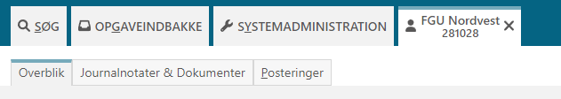
</div>

The first three big tabs are primary tabs. The three smaller tabs in the bottom are secondary tabs. The tab with a blue
bar at the top is an entity tab. The primary tabs are shown on every single page in the system. The secondary tabs are
different for each primary tab. The ones we see now, are a part of the entity page. Entity tabs are used for entities
such as persons and companies.

### Dropdown

The dropdown component is a simple dropdown menu with links. This can be used for navigation. For example, if your
project has a high number of tabs, you can hide the least used tabs in a dropdown menu called additional tabs or
similar.

# State Management

In this section, we describe how state management is handled in Amplio. States in React keep track of how data changes
over time. Different events in the application can change the state and the frontend can then respond to the changes.

## configureAppStore

configureAppStore is a function found in configureStore.ts in the reference application. It defines the state structure
for the complete project and sets the initial state of the project.

## rootState

The state structure is set defined in the interface ApplicationRootState. This structure contains different fields of
different types. The main fields are:

- global: contains information about the user.
- core: contains information about the system, popup functionality, navigation, and processes.
- app: contains the following fields:
    - search: contains search functionality for persons and tasks.
    - testlogin: contains login information. Should not be used by the projects as customers need different login
      functionality.
    - entity: contains information about the system’s entities. Should be overwritten by projects as it can be persons,
      companies, etc.
    - historyData: used to show historic data for fields, etc.
    - tasktray: contains information about the task tray, waiting tasks, work packages, etc.

The structure is important because all the types in the project use the same structure as a convention. This way we can
create functionality in Amplio without knowing the exact states of the different projects. The above state structure
mostly contains structure and not functionality. It is up to the projects to define the state as needed. If they keep
the naming convention, Amplio functionality will work for all implementations of the states.

## rootReducerCombined

rootReducerCombined is an important function in the Amplio React code. rootReducerCombined combines all reducers
registered in the application. These combined reducers are then parsed to the configureAppStore so that all reducers are
easily accessed through the complete application.

## Extending the state

As mentioned earlier, all the states can be extended in the different projects. This gives the possibility to add new
fields, etc. The developer just needs to keep the same field names if functionality from Amplio is wanted in the
application. A good example of this is the EntityState seen below:

```typescript
import { BaseEntityState } from '@my/core/core/services/entity/types';
import { PersonState } from './PersonPage/types';

interface EntityState extends BaseEntityState {
  person: PersonState;
}

export default EntityState;
```

Here we see that BaseEntityState has been extended so the application can specify entities as persons. In other
projects, this can be changed to companies.

# React + Process engine React

# Dates

Dates in react application work on the time zones. To achieve good zoning from every time zone we are receiving and
sending dates in UTC zone which is (+00:00) zone. After getting date from backend in UTC zone is converted to current
zone which is get from system on which user is working.

## Working with dates – DateUtils

When we work with dates in React application, we should use methods implemented in DateUtils.ts file. There is known
common issue with dates in react which occurs when we are trying to modify date by adding days, months, etc. To prevent
that, we should use methods from DateUtils.ts file which are created in way to not lose zoning data.

## Working with date localization – LocaleRegistry

The `LocaleRegistry` manages locale configuration for our date/time picker components. It controls date display
formatting, accepted input formats, and localized month/day names. 

Three locales are pre-configured: English (`en`), Danish (`da`), and Swedish (`sv`).
If a locale is not found in the registry, the component falls back to the `en` configuration automatically.

### Getting localized month and day names

You can retrieve arrays of localized month and day names using `getMonths(locale, width)` and `getDays(locale, width)`. 
Both methods accept an optional width parameter to control the format of the names.

The width option can be:
- `'wide'` (Default): "Sunday", "Monday", "Tuesday".
- `'abbreviated'`: "Sun", "Mon", "Tue".
- `'short'`: "Su", "Mo", "Tu".
- `'narrow'`: "S", "M", "T".

Not all date-fns locales define a `'short'` width. If it's not available for a given locale, 
it will fall back to the `'wide'` format.

### Registering a new locale

To add a new locale, import the corresponding `date-fns` locale and call `setLocaleData`.

### Modifying an existing locale

`setLocaleData` can also override existing locales, so individual properties can be updated without replacing the full
configuration.

## LocaleData structure

Each entry in the registry is a `LocaleData` object consisting of two properties:

- **`locale`** — A `date-fns` `Locale` object. This controls how the date picker renders localized content such as
  month and day names. It also determines behavioral settings like which day the week starts on
  (`weekStartsOn`) and how the first week of the year is calculated (`firstWeekContainsDate`). Any valid `date-fns`
  locale can be used directly or extended with custom overrides (e.g. capitalized month names). For the full list of
  available locales, see [date-fns/src/locale](https://github.com/date-fns/date-fns/tree/main/src/locale).

- **`allowedFormats`** — An array of date format strings (e.g. `'dd-MM-yyyy'`, `'yyyy/MM/dd'`) that define which typed
  input patterns are accepted by the date picker. When a user manually types a date, the input is validated against
  these formats. If the input does not match any of the allowed formats, it is rejected.

```typescript
type LocaleData = {
  locale: Locale;
  allowedFormats: string[];
};
```

# Configurations and service extensions

In this section, we will describe the Amplio React libraries and how to customize them.

## Code integration

This section contains information on how to integrate your code with the React libraries. Please also
see [C0200 – Getting started with React](https://goto.netcompany.com/cases/GTE2252/AMPJ/RhoDeliverables/C0200%20-%20User%20Guides/C0200%20-%20Getting%20started%20with%20React.docx?web=1).

### React Components

In this section, we will describe some of the React components available in Amplio, how they work, and how they look.
All these components can be tweaked and expanded in your project. These sections will just describe the structure so you
can easily modify them for your needs.

#### Task tray

<div style="text-align: center;">

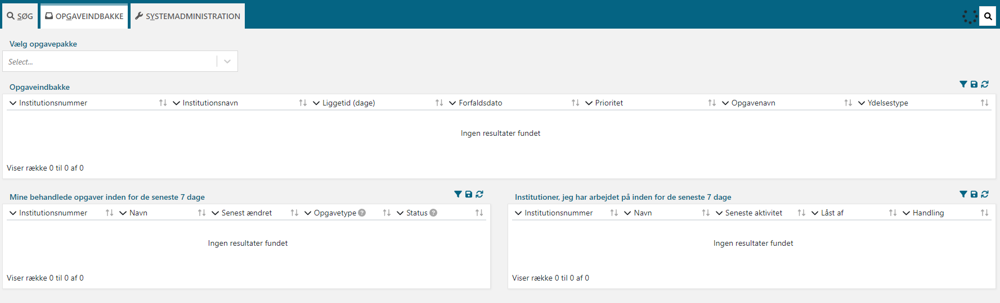
</div>

The task tray is seen in the image above. It contains the work packages, and the old task and entities that the user has
worked on. The code for the task tray can be found under libraries/platform/react/src/tasktray:

<div style="text-align: center;">

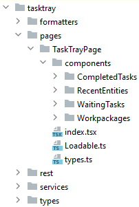
</div>

The different components have their own index.tsx file, which defines what to show for each component. These are
combined in the index.tsx file for TaskTrayPage. The rest folder contains the definition of the different API endpoints
relevant for the task tray. How to use the API will be explained in [api](#api). The services folder contains
the reducers, types, actions, and functions for each component. The types-folder contains the interface for the root
state that must be implemented in your project if you want to use the task tray. It is already implemented in the
reference application so you can simply copy that.

#### Search

<div style="text-align: center;">

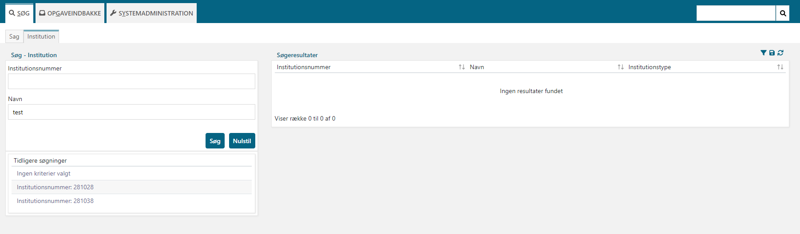
</div>

The search component can be seen above. It is used to search for cases, entities, etc. More types of searches can be
added in your project. The reference application has implemented search for tasks and persons. The search page contains
an input form, table for latest searches, and a table for results. The code can be found in /platform/react/src/search:

<div style="text-align: center;">

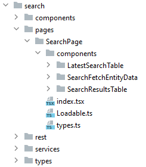
</div>

The structure is the same as for the task tray above.

If you want to add a new type of search, copy one of the following folders in
reference/business-react/business-ui/app/containers/SearchPage:

<div style="text-align: center;">

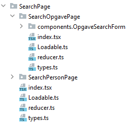
</div>

And modify it for your needs.

#### Process

At /platform/react/src/process you can find the common react code for all processes:

<div style="text-align: center;">

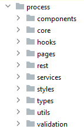
</div>

We will not go through these folders here, as it should not be necessary to modify these files. Instead, let’s look at
the implemented processes in the reference application. In reference/business-react/business-ui/app/containers/Processes
we find the following:

<div style="text-align: center;">

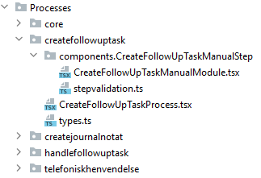
</div>

If you want to create your own process, start by copying one of these. In general, the react code for processes are
split in two: the main process and each step in the process. The main process file could look like this:

```typescript jsx
export default function CreateFollowUpTaskProcess() {

  return (
    <DefaultProcessWrapper prefix={AppPortaltextPrefixStore.process.fagsystemProcessCreateFollowuptaskManualstep}>
      {{
        [ProcessSteps.CREATE_FOLLOWUP_TASK_MANUAL_STEP]: {
          moduleValidationSchema: createFollowUpTaskManualStepSchema(),
          modules: [<CreateFollowUpTaskManualModule/>, <JournalnotatModule/>],
        },
        [ProcessSteps.REGISTER_CREATE_FOLLOWUP_TASK]: {
          modules: [<KvitteringModule/>],
        },
      }}
    </DefaultProcessWrapper>
  );
}
```

The DefaultProcessWrapper contains all the main process functionality from Amplio. Inside the wrapper, we define each
step and their corresponding module that defines the frontend for the step. A step could look like this:

```typescript jsx
export default function CreateFollowUpTaskManualModule() {

  const viewData: CreateFollowUpTaskTrinViewData = useGetProcessViewData<CreateFollowUpTaskTrinViewData>(
    ProcessSteps.CREATE_FOLLOWUP_TASK_MANUAL_STEP,
  );

  return (
    <DefaultProcessStepWrapper>
      <CustomTable>
        <TableRow rowPosition={RowPosition.FIRST}>
          <TableCell width={20} cellPosition={CellPosition.FIRST}>
            <Portaltext ptKey="type"/>
          </TableCell>
          <TableCell width={80} cellPosition={CellPosition.LAST}>
            <FPSelectbox<CreateFollowUpTaskOpgaveCommand, string>
              id="create-follow-up-manual-step-type"
              dataSet={mapToOptions(viewData.followUpOptions)}
              name="selectedFollowUpTaskType.currentValue"
              errorField="selectedFollowUpTaskType.error"
            />
          </TableCell>
        </TableRow>
        <TableRow rowPosition={RowPosition.LAST}>
          <TableCell width={20} cellPosition={CellPosition.FIRST}>
            <Portaltext ptKey="dato"/>
          </TableCell>
          <TableCell width={80} cellPosition={CellPosition.LAST}>
            <FPDateInput<CreateFollowUpTaskOpgaveCommand>
              id="create-follow-up-manual-step-date"
              name="followUpDate.currentValue"
              errorField="followUpDate.error"
            />
          </TableCell>
        </TableRow>
      </CustomTable>
    </DefaultProcessStepWrapper>
  );
}
```

DefaultProcessStepWrapper contains the basic step functionality from Amplio. Other than that, it is up to the developer
to decide what should be shown in the step. This could be a table as shown in the code above.

### Reducers

In redux, the reducers are the pure functions that contain the logic and calculation that needed to be performed on the
state. These functions accept the initial state of the state being used and the action type. It updates the state and
responds with the new state. In Amplio, we define the reducers in reducer.ts files. Our reducers most often contain an
implementation of the initial state and then the reducers. Sometimes the reducer is just a combination of other reducers
like this:

```typescript
export const initialState: PersonOverviewState = {
  opslysninger: personOplysningerReducer.initialState,
  sagsoversigt: personSagsoversigtReducer.initialState,
  opgaver: personTasksReducer.initialState,
  senestehaendelser: personRecentEventsReducer.initialState,
};

const personOverblikReducer = combineReducers({
  opslysninger: personOplysningerReducer.default,
  sagsoversigt: personSagsoversigtReducer.default,
  opgaver: personTasksReducer.default,
  senestehaendelser: personRecentEventsReducer.default,
});

export default personOverblikReducer;
```

Where one of the reducers is implemented as this:

```typescript
export const personDescriptionReducer = createReducer(initialState, builder => {
  builder.addCase(fetchPersonDescription.pending, state => {
    state.status = pendingState;
  });
  builder.addCase(fetchPersonDescription.fulfilled, (state, action) => {
    const {status, data, columns} = action.payload;

    state.status = {...idleState, ...status};
    state.oplysningerData = data;
    state.columns = columns;
  });
  builder.addCase(fetchPersonDescription.rejected, (state, action) => {
    state.status = {...errorState, ...action.payload};
  });
});
```

The first input to addCase is the API endpoint, which can change the state. The second input is the state and possibly
action. State can be updated by the reducer or by a payload from the action.

### State override

In general, we use two ways to override the state in React. For smaller local states we can use the useState
functionality. As an example, in PhoneNumberInput.tsx we want to control the maximum length of a phone number. In
Denmark that is 8, but it can be other lengths in other countries. We start by defining a constant with a set-method and
a default value:

```typescript
const [maxCharacters, setMaxCharacters] = useState<number>(() => 8);
```

maxCharacters is the constant and we can use setMaxCharacters to override the state:

```typescript
if (twoNumbersRegexStart.test(unFormattedPhoneValue) === true) {
  formattedValue = unFormattedPhoneValue.replace(/(\d{2})(?=\d)/g, '$1 ');
  setMaxCharacters(11);
}
```

For bigger global states we use the useSelector functionality. In ErrorPopUp.tsx, which receives an error and shows it
as a pop-up window, the errors are saved on the CoreApplicationRootState. We thus need to extract via useSelector:

```typescript
const {errors}: BaseErrorState = useSelector<CoreApplicationRootState, BaseErrorState>(
  state => state.core.system.error,
);
```

The errors can then be rendered as follows:

```typescript jsx
return (
  <ContentContainer>
    {errors && (
      <PopUpOverlay>
        <PopUpContent>
          <HeaderTitleBlock>
            <HeaderTitle>
              <Portaltext ptKey="headertitle"/>
            </HeaderTitle>
            <HeaderCloseButton onClick={() => dispatch(resetErrors())}>x</HeaderCloseButton>
          </HeaderTitleBlock>
          <ErrorContainterWithScroll>
            <br/>
            <h5>
              <Portaltext ptKey="popuptitle"/>
            </h5>
            {errors.map((error: ErrorData) => (
              <ServerErrorBlock key={error.uuid} error={error}/>
            ))}
          </ErrorContainterWithScroll>
        </PopUpContent>
      </PopUpOverlay>
    )}
  </ContentContainer>
);
```

### Loadable and Fallback Registry
The `loadable` utility wraps components with `React.lazy` and `Suspense` to enable code splitting.
To define a project-wide loading fallback, call `coreRegistry.setDefault()` at app startup:

```typescript jsx
import { coreRegistry } from '@foundation/components';

coreRegistry.setDefault(<MySpinner />);
```

All components wrapped in loadable() will use this fallback by default. 
If no default is set, Suspense renders nothing. 
To override the fallback for a specific component, pass it via the `options` parameter:
```typescript jsx
import { loadable, PageLoader } from '@foundation/components';

export const LoginFormPage = loadable(() => import('./LoginFormPage'), {
  fallback: <PageLoader />,
});
```

# API

In this section, we will describe the different kind of API calls, we can use in React. We will describe how to create
these calls, so the developer can create their own endpoints.

## createGetApi

GET APIs are used to receive data from an endpoint. Below, we see an example of a method that can be dispatched, which
receive documents:

```typescript
export const fetchEntityDocuments = createGetApi<DocumentsResponse, DocumentsParams>(
  'Process/Common/Dokument/FETCH_ENTITY_DOCUMENTS',
  params => `/entity/${params.entityType}/${params.entityId}/documents`,
);
```

## createPostApi

POST APIs are used to send new data to an endpoint. Below, we see an example of a method that saves a document after it
has been edited:

```typescript
export const postSaveEditProcessDocumentData = createPostApi<DocumentSaveEditResponse, DocumentSaveEditParams>(
  'Process/Common/Dokument/POST_SAVE_EDIT_DOCUMENT_DATA',
  params => `/processengine/opgavehandling/opgave/${params.opgaveId}/gem_edit_data_dokument/${params.documentId}`,
  params => ({
    dokumentNavn: params.editedFile.dokumentNavn,
    type: params.editedFile.type,
  }),
);
```

## createDeleteApi

DELETE APIs are used, as the name suggests, to delete data on an endpoint. Below, we see an example of deleting a
document:

```typescript
export const deleteProcessDocumentData = createDeleteApi<DocumentRemoveParams>(
  'Process/Common/Dokument/DELETE_PROCESS_DOCUMENT_DATA',
  params => `/processengine/opgavehandling/opgave/${params.opgaveId}/dokument/${params.documentId}`,
);
```

## createPutApi

PUT APIs are a lot like POST APIs but in general we use PUT when we are working on a single resource. Either adding or
updating this single resource. POST is more for collections of data. Below, we see an example of adding a single
document that already exist in the endpoint:

```typescript
export const putAddAttachmentFromExistingDocuments = createPutApi<string, AddAttachmentParams>(
  'Process/Common/Dokument/PUT_ADD_ATTACHMENT_FROM_EXISTING_DOCUMENTS',
  params => `/processengine/opgavehandling/opgave/${params.opgaveId}/dokument/${params.documentId}`,
);
```

## createPostFormDataApi

The createPostFormDataApi is used to post form data to an endpoint. Below we see an example of uploading a document with
information from a form:

```typescript
export const postProcessDocumentData = createPostFormDataApi<DocumentUploadResponse, DocumentUploadParams>(
  'Process/Common/Dokument/POST_PROCESS_DOCUMENT_DATA',
  (params: DocumentUploadParams) => `/processengine/opgavehandling/opgave/${params.opgaveId}/dokument`,
  (params: DocumentUploadParams) => params.formData,
);
```

# FAQ

If you are having trouble with React, please read the “Getting started with React” document
at [C0200 – Getting started with React](https://goto.netcompany.com/cases/GTE2252/AMPJ/RhoDeliverables/C0200%20-%20User%20Guides/C0200%20-%20Getting%20started%20with%20React.docx?web=1).