# References

| Reference | Title | Author | Version |
|-----------|-------|--------|---------|

# Introduction

The report component is a component used to generate reports from the data in a system. By incorporating this
functionality users of the system can schedule execution of SQL queries on the application database and get results of
this query transferred to specific endpoints. The output is created as a file of a specified type that can be
transferred to a specific endpoint or be stored in the application database.

## Target audience

The target audience of this document is a Amplio developer, wishing to make improvements or changes to the report
component, or a project developer who wishes to work with or use the report component.

## Purpose

The purpose of the component is to provide the users of the system with a way to systematically generate reports based
on the data in the system. The idea is that the customer themselves can create and modify reports as desired without
needing the vendor to deploy a new version of the application.

## Background information

This component was created to facilitate the customers in creating their own reports for the data in the system. This
enables the customer to gain a better understanding of the data the system operates on.

# High level description of the component

The report component brings automatic generation of reports based on application data to Amplio. It is built and
designed such that it can be integrated into the workflow of the customer to better suit their needs. The component
facilitates quick adaption as it enables the customer to add or change reports as needed. Furthermore, the customer is
able to fetch previously generated reports as needed.

The report itself is created from a set of data that is fetched from the application database following a specific SQL
query. The file type of the report can be specified by the customer and the desired endpoint for the report is also
specified by the customer. The component enables scheduling of the reports such that frequent reports can be
automatically executed.

<div style="text-align: center;">

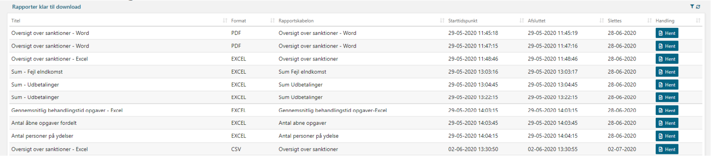
<h5>Figure 1 - Example of different reports</h5>

</div>

# Introduction to subject

The report component consists of multiple different subcomponents with different responsibilities.

| Component | Responsibility                                                                                                                                                                                                                                                                             |
|-----------|--------------------------------------------------------------------------------------------------------------------------------------------------------------------------------------------------------------------------------------------------------------------------------------------|
| Frontend  | Contains the implementation of the view, namely resources for webpage. Contains the implementation of the controllers that is responsible for the URL mapping and it contains the implementation of the viewmodel that is responsible for storing the data used in the view via Thymeleaf. |
| API       | The API component contains interfaces for service component.                                                                                                                                                                                                                               |
| Service   | The service component contains the brain of the framework. It is here that the querying of the database happens.                                                                                                                                                                           |
| Batchjob  | The batchjob constructs the reports by running the queries and creates a report from the found data. It’s done asynchronously from the frontend, so the processing of the reports doesn’t affect the main execution in the business application.                                           |

# Frontend

The frontend component of report consists of two different views. The administration view which gives an overview of
existing reports. The other view is a page used for creating and updating reports.

## Sitemap

The following contains a sitemap of the frontend component of report.

<div style="text-align: center;">

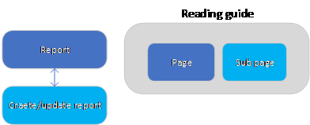
</div>

## Administration page

### Existing reports

The administration page of the frontend component gives an overview of existing reports. The administration page
displays relevant information related to the report, such as name, file type, and description. The administration page
contains navigation that allows the customer to create new reports and edit existing reports. Furthermore, the
administration page allows the customer to get a previously created report. The functionality of the Administration page
is found in the ReportController class. This class contains the logic for displaying the already created reports, and
the logic used when defining new reports to be created.

It is possible to extend the front table and show extra data to the user by setting the property value “EXTENDED_TABLE”
to true in the ReportController class. This will make all hidden reports appear in the table, but it will not be
possible to run, edit or delete them. The extra columns in the front table that will be shown are frequency, next run
date, oprettet, oprettetaf, aendret, aendretaf, and hidden.

<div style="text-align: center;">

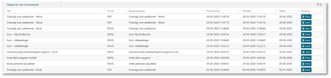
<h5>Figure 2 - Example of the administration page for reports</h5>
</div>

### Reports ready to download

The administration page of the frontend also shows a table with generated reports, ready to be downloaded. The reports
are “ordered” to be generated using the “Run now” button in existing reports. The reports are processed and generated in
batchjob and when it is ready the user who ordered the report can download it.

The table shows the report name, report format, when it’s created and when it will be deleted (
See [Longevity of the generated reports](#Longevity-of-the-generated-reports)), and
the (expected) execution time to generate the report, the status of the report, and a button to download the report.

<div style="text-align: center;">

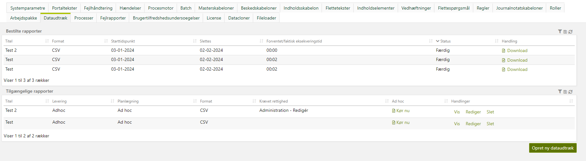
<h5>Figure 3 - Example of the two tables in administration page</h5>
</div>

## Create/update report page

The create/update pages allow the customer to create a new report. This page is only accessible by users with the
correct role (ADM_WRITE). Here various elements of the report need to be specified, such as the name of the report, the
delivery method of the report, and the SQL query the report uses. This is then used to construct the different elements
of the report that are described in [data model](#data-model).

<div style="text-align: center;">

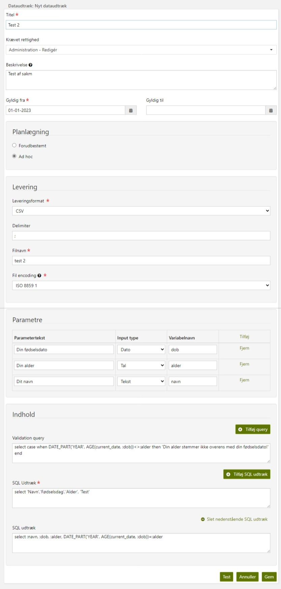
<h5>Figure 4 - Example of the page for creating/updating reports</h5>
</div>

## Report generation and parameters

A report has the ability to be parameterized, meaning that a user with reader-access to reports has the option to
specify some information (parameters), which are included in the report generation. This could, for example, be a date
on which the report is to be based. The user has the ability to fill in one or more predefined parameters. An example
can be seen in Figure 5. In the example, the user has the option to specify the date of birth, age, and the name of a
random person. Therefore, three fields defining the three parameters are apparent in the modal shown to the user.

In addition, the report modal would remind the user about the GDPR-guidelines, and the expected runtime of the query (
See [Estimation of query run time](#Estimation-of-query-run-time)). The user is required to write the purpose of the report generation (to ensure GDPR compliance).

<div style="text-align: center;">

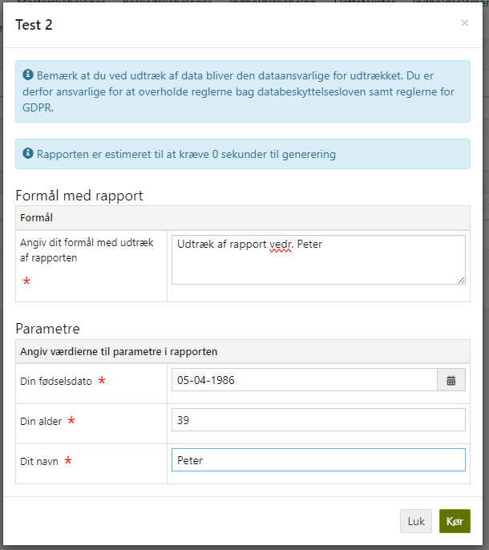
<h5>Figure 5 - Example on submitting a report modal</h5>
</div>

The report has the ability to add some extra validation checks on the parameters, to be sure that the users do not abuse
the parameters. An example could be to define a maximum period from “DATE FROM” to “DATE TO” dates, to ensure that the
users don’t define a bigger time span than what the system could support. Another example is to check if the text string
is a valid social security number string. In Figure 6 a validation check failed on the comparison of date of birth and
the actual age of the person to check, and a warning is shown.

<div style="text-align: center;">

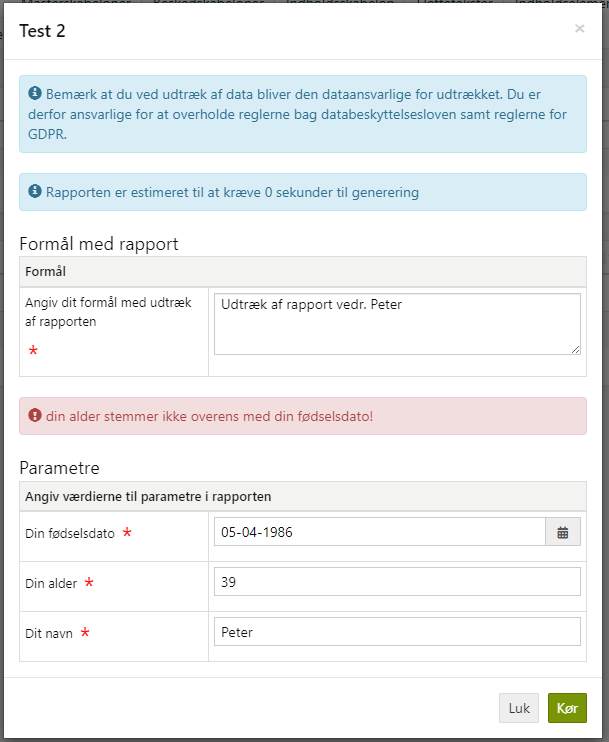
<h5>Figure 6 - Example on a failed validation check of the parameters</h5>
</div>

The provided information is then used in the queries as standard query params. It is defined in the queries by the
report editor where the information should be merged. This is defined using a "variable name" which is used in the
query. An example of this can be seen in Figure 7.

<div style="text-align: center;">


<h5>Figure 7 - Example on a set up of the query and parameters by the report editor</h5>
</div>

In Figure 7, three parameters are set up. These are the parameters that the report user has previously filled in (Figure
5 and Figure 6). Both are created with a variable name. This variable name appears in the query. In the query, the
entered information is used to generate a row in the report. A parameter can use different input types, for example,
Date or Text (As shown in Figure 8).

<div style="text-align: center;">

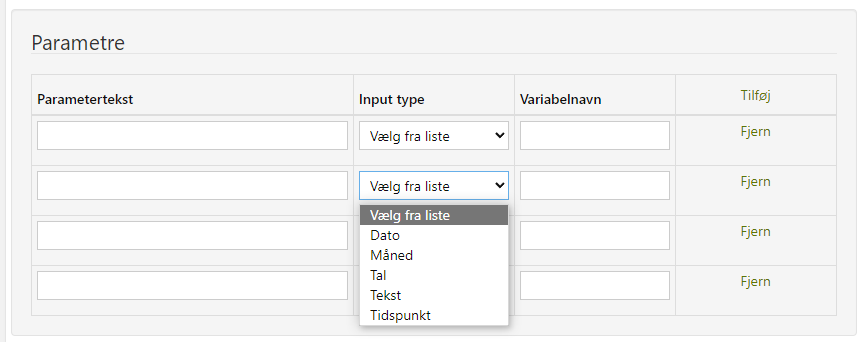
<h5>Figure 8 - Examples on input parameter types</h5>
</div>

There are also some automatic values that are used in all queries without the user needing to specify them. A table of
the automatic values can be seen in Table 1.

<h5>Table 1 - List of the parameters that automatically return values</h5>

| Type | Description                | Variable name            |
|------|----------------------------|--------------------------|
| Date | First day in current month | :firstdateincurrentmonth |
| Date | Last day in current month  | :lastdateincurrentmonth  |
| Date | First day in current year  | :firstdateincurrentyear  |
| Date | Last day in current year   | :lastdateincurrentyear   |
| Date | Current year               | :currentyear (yyyy)      |
| Date | Current date               | :currentdate             |

The list can be expanded by extending the `QueryParameterMapper.getConstantParams()` method.

## Estimation of query run time

Before a report is generated, the "cost" of running the data extraction is assessed. This is evaluated using the
database’s built-in "cost-based optimizer", which derives an "Explain Plan". The "Explain Plan" shows an expected
execution time in seconds for the data extraction and it is this value which is used for the assessment of whether the
data extraction will result in longer response times.

## Security roles

A generated report is only viewable by users with specific security roles. This is defined for each report ensuring that
only relevant users can access these. And the generated reports are only accessible for the user who ordered the report
to be generated.

## Longevity of the generated reports

The generated reports ordered from the users have a lifespan of 30 days, before the content of the report (
REPORT_GENERATED row) is deleted in the batchjob REPORT_GENERATED_CLEANUP. However, the “orders” of the report (
REPORT_EXTRACTED rows) will not be deleted for statistical purposes. They can be used to create an overview of the
usages of the ad-hoc reports.

The REPORT_EXTRACTED rows should be deleted as a part of the standard discard (Kassation) procedure.

# Service

The service component contains the processing logic for the report component. The service component contains methods to
construct the report from its query and by that fetch data from the application database and create the report from the
fetched data. This logic can be found in the ReportAdapter class. This class contains the logic for executing the
specified queries. Both the scheduled report queries and the ad-hoc queries. This is done through the `executeResult`
and `adHocExecuteResult` methods that are exposed by the class. To facilitate the generation of reports the service
component contains various data writers that are used depending on the specified type of report. For example, the
`CsvDataWriter` is used when creating reports with the CSV return type.

The query processing logic contains a validation check that can be specified. The validation is regarding the cost of
the SQL query for the report. A max cost of this query can be specified if wanted. This validation logic is contained in
the ReportAdapter class. This is accessed through the exposed `validateQuery` method.

Furthermore, the service contains various helper methods that can be used to fetch scheduled reports or reports that
have been created previously. This is done through the ReportService and/or ReportFrontService as this service exposes
different methods for fetching and creating reports.

The service component also contains helper methods that can be used to create the different relevant objects related to
reports, such as endpoints and report parts. For example, the ReportCreationHelper class contains methods such as
`createEndpointWithEmailReceivers` to create a new endpoint with the specified email receiver.

# Configurations and service extensions

This section will define how to set up the component and what component requirements come along.

## Code integration

This section describes the code integrations that can affect and change the behavior of the component. It also describes
how to create new endpoint targets.

### Adding endpoint targets

Report output can be passed to various endpoints, called targets. To add a new target endpoint, you must provide a bean
implementing the ReportTarget interface. Firstly, create an implementation of the new target:

```java
public class NewReportTargetImpl implements ReportTarget<TargetConfig> {

    public NewReportTargetImpl() {
        // Constructor used in bean instantiation
    }

    @Override
    public void processFile(File file, String targetFileName, TargetConfig config) {
        // Processing happens here
    }

    @Override
    public String name() {
        // Target needs to have specified human readable name
        return "NAME";
    }

    @Override
    public AliveStatus checkStatus() {
        // Target requires a way to check if it's alive
        return AliveStatus.running("STATUS");
    }
}
```

Secondly, provide that class as a bean in your configuration file:

```java
@Bean
public ReportTarget<TargetConfig> myNewReportTarget() {
    return new NewReportTargetImpl();
}
```

Finally, the EndpointType extendable enum should be extended to define the endpoint type using one of its create
methods.

### Adhoc reports via ReportAdapter

It's possible to quickly execute reports via ReportAdapter ad-hoc functionality, as for example to test a report before
saving it. This can be achieved simply by calling the `adHocExecuteResult` method. To do that we need to specify and
provide request type via ReportRequest instance that uses DataFormatDefinition abstract interface for return type. Below
is an example snippet from FY:

```java
ReportRequest<? extends DataFormatDefinition> request = reportMapper.map(this.getReportEntity(), new ReportScheduleBuilder()
        .withNextRunDate(LocalDate.of(2017, 6, 30).atStartOfDay())
        .withPeriod(ReportSchedulePeriod.CURRENT_QUARTER)
        .build());

final OutputStreamWriter writer = new OutputStreamWriter(System.out);
reportAdapter.adHocExecuteResult(request, writer, ContextWrapper.get());
writer.flush();
```

Three phases can be noticed in this example; firstly, we create a ReportRequest object via ReportMapper bean, specify
custom parameters for our report, secondly, we build it and create an output buffer, and finally, execute the report
using ReportAdapter API call.

### Add more input parameter types

To add more input parameter types, you just need to extend the ExtendableEnum “InputParameterType” with your own type,
and provide a Thymeleaf template of the input field, and define your converter (So it can be converted from string value
into the correct type to be inserted in the database query parameter) and a default value to use if no value is
provided.

### Add extra report types

Reports support CSV, CSV with quotes, Fixed length text document, XML, and custom defined beans. These are extendable
and can be extended from ReportType. It handles the media type to download the file and the file format (.csv or .txt).

## Configurable settings

### Allowed number of rows using ad-hoc ordered report

It is possible to configure the number of rows allowed to be returned through an ad-hoc ordered report.

If a limit is wanted, you can define a Systemkonstant with key `ad_hoc_report_row_limit` and set it to the maximum
number of rows you want a user to be able to retrieve through ad-hoc reports - e.g. 100,000.

The limit is useful because ordering an unbounded number of rows can put pressure on the system and you risk the user
receiving a timeout if the report cannot be produced within 60 seconds.

If a report is cut short due to exceeding the configured maximum number of rows for an ad-hoc report, an additional row
will be generated containing a message about the report being cut short.

You define the message through the portal text;

`fagsystem.administration.dataudtraek.ad_hoc_query_limit_reached`

### Max cost of the report to allow ad-hoc generation

The system enforces a limit on the cost, a report is estimated to have, before throwing an error stopping the user to
order the ad-hoc generation of the report queries. It’s to avoid pressuring the database and batch too much generating a
report.

As default the limit is 10,000,000 in database cost (how much machine resource the queries are predicted to use). It can
be changed using gradle properties: `connector.queryconnector.maxcost`

### Max number of rows from test execution of report

Currently, the system limits the max number of rows returned from a test execution of reports (Pressing the “test”
button in create/edit reports). It’s predefined to max 10 rows.

It can be configured using this gradle property: `admin.report.maxRowNumber`

## Roles and rights

The report component adds the following security role `ADM_DATAUDTRAEK` which is required to be able to see the
DATAUDTRAEK tab in the administration panel of the business application. The role is also required to use the report
controller to create, edit, show, and test the report.

## Database patches

The patches to create it are created by the `V4_create_schema.sql` patch found in the following places:

```
/reference/database/scripts/ddl/init/V4_create_schema.sql 
/reference/database/scripts/ddl/2023/V2023_11_22_09_59__create_report_tables.sql
/reference/database/scripts/ddl/2023/V2023_11_22_10_00__alter_report_tables_and_migrate_data.sql
```

To import text, batchjob configurations, and import one test report, you need the following scripts:

```
/reference/database/scripts/dml/2023/V2023_11_23_11_43__report_tables_tekst.sql
/reference/database/scripts/dml/2023/V2023_11_30_11_31__batchjob_faste_rapporter.sql
/reference/database/scripts/dml/2023/V2023_11_30_13_09__report_testrapport.sql
```

## Migration information

The following section contains the configurations that are needed to use the report component for projects without it.

### Gradle configuration

When Amplio artifact is incorporated in the project, you can gain access to the Report component elements by adding
specific dependencies in the gradle build files, depending on the module required (api/service/frontend) you must add
the following lines to the dependencies section:

```groovy
compile(group: 'modulus-ydelse.report', name: 'report-api', version: modulusYdelseVersion)
compile(group: 'modulus-ydelse.report', name: 'report-service', version: modulusYdelseVersion)
compile(group: 'modulus-ydelse.report', name: 'report-frontend', version: modulusYdelseVersion)
compile(group: 'modulus-ydelse.libraries.batch', name: 'batch-jobs-reports', version: modulusYdelseVersion)
```

### Spring configuration

There is a configuration file that must be included in your application config to have required beans available in the
application. `ReportConfig` (available via report-frontend module) contains configuration for the controller and
view-model ReportCommand utility.

### Include JS file

Actions on report views are executed by JavaScript code, which has been included in Amplio artifact as "report.js". To
make the view work correctly, the project has to include that JavaScript file in the HTML webpage header:

```html
<script type="text/javascript" th:src="@{/assets/js/report.js}"></script>
```

After this, your application should have a report tab with Amplio report functionality.

### Include batchjobs

You need to include those two batchjobs in your project “BatchJobsConfig” class:

- `nc.modulus.ydelse.batch.jobs.report.adhocreportgenerator.config.AdHocReportGeneratorConfig`
- `nc.modulus.ydelse.batch.jobs.report.reportcleanup.config.ReportCleanBatchConfig`

And insert `AD_HOC_REPORT_GENERATOR` and `REPORT_GENERATED_CLEANUP` as jobs in `JobNameTypes`.

# API

The API component contains the model, meaning the class definitions and JPA objects related to the report. The API
component contains the different target definitions used with the report endpoints when delivering the report.

# Component model

The component consists of multiple subcomponents each having different dependencies. This section contains the component
model for each subcomponent.

## Frontend

<div style="text-align: center;">

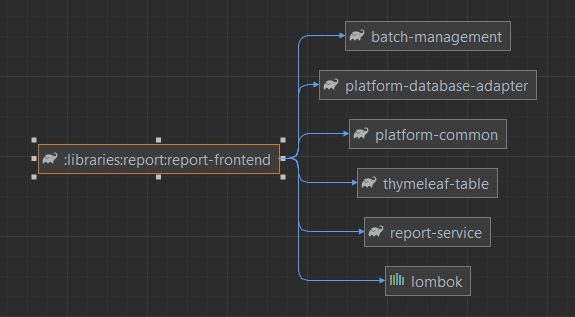
</div>

## API

<div style="text-align: center;">

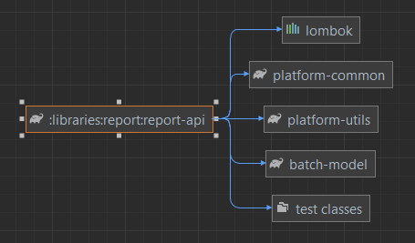
</div>

## Service

<div style="text-align: center;">

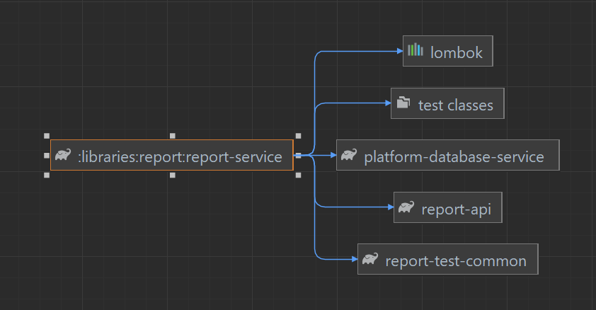
</div>

# Data model

The component adds the following tables that represent a report and its various components.

## Report

The `REPORT` table contains the report.

| Column          | Description                                                                                           |
|-----------------|-------------------------------------------------------------------------------------------------------|
| ID              | The unique id of the report.                                                                          |
| ENDPOINT_ID     | The id of the endpoint the report is related to.                                                      |
| TX_DEF_ID       | The id of the transaction definition the report is related to.                                        |
| NAME            | The name of the report.                                                                               |
| HIDDEN          | Determines if the report should be listed in the main view.                                           |
| SECURITY_ROLE   | The security role required to see and edit the report.                                                |
| DESCRIPTION     | Description of the report, to the end user as a documentation on the usage and purpose of the report. |
| GYLDIG_FRA      | The start date of the bitemportal validity of the report.                                             |
| GYLDIG_TIL      | The end date of the bitemportal validity of the report.                                               |
| DELIMITER       | CSV format delimiter.                                                                                 |
| TYPE            | Output type of the report.                                                                            |
| CARRIAGE_RETURN | Determines whether to add carriage return sign in FixedWidth results.                                 |
| OPRETTET        | When the entity was saved in the database.                                                            |
| OPRETTETAF      | Who saved the entity in the database.                                                                 |
| AENDRET         | When the entity was changed in the database.                                                          |
| AENDRETAF       | Who changed the entity in the database.                                                               |
| VERSION         | Version of the entity.                                                                                |

## Report part

The `REPORT_PART` table contains the query for part of the report.

| Column                 | Description                                                                 |
|------------------------|-----------------------------------------------------------------------------|
| ID                     | The unique id of the report part.                                           |
| REPORT_ID              | The id of the report the report part is related to.                         |
| TX_DEF_ID              | The id of the transaction definition the report is related to.              |
| QUERY                  | The SQL query used for the report part.                                     |
| POSITION               | Order of the part in the related report.                                    |
| POSPROCESSOR_BEAN_NAME | Bean which will process the query after execution (FixedWidth report only). |
| OPRETTET               | When the entity was saved in the database.                                  |
| OPRETTETAF             | Who saved the entity in the database.                                       |
| AENDRET                | When the entity was changed in the database.                                |
| AENDRETAF              | Who changed the entity in the database.                                     |
| VERSION                | Version of the entity.                                                      |

## Report validation part

The `REPORT_PART` table contains the queries to validate the input parameters and ensure the reports are valid before
processing them.

| Column                 | Description                                                    |
|------------------------|----------------------------------------------------------------|
| ID                     | The unique id of the report validation part.                   |
| REPORT_ID              | The id of the report the report validation part is related to. |
| TX_DEF_ID              | The id of the transaction definition the report is related to. |
| VALIDATION_QUERY       | The validation SQL query used for the report validation part.  |
| POSITION               | Order of the part in the related report.                       |
| POSPROCESSOR_BEAN_NAME | Bean which will process the query after execution.             |
| OPRETTET               | When the entity was saved in the database.                     |
| OPRETTETAF             | Who saved the entity in the database.                          |
| AENDRET                | When the entity was changed in the database.                   |
| AENDRETAF              | Who changed the entity in the database.                        |
| VERSION                | Version of the entity.                                         |

## Report schedule

`REPORT_SCHEDULE` contains the scheduling of the report.

| Column               | Description                                                                 |
|----------------------|-----------------------------------------------------------------------------|
| ID                   | The unique id of the report schedule.                                       |
| REPORT_ID            | The id of the report the report schedule is related to.                     |
| NEXT_RUN_DATE        | When the report batchjob should run to generate the report.                 |
| LAST_RUN_DATE        | When the report batchjob should no longer run.                              |
| PERIOD               | Period of time in which the report batch job will run.                      |
| FREQUENCY            | How often the report batchjob is run.                                       |
| CUSTOM_PARAMS_JSON   | Additional parameters as JSON serialized objects accessible from the query. |
| PARAMS_PROVIDER_BEAN | Spring Bean name of params provider.                                        |
| OPRETTET             | When the entity was saved in the database.                                  |
| OPRETTETAF           | Who saved the entity in the database.                                       |
| AENDRET              | When the entity was changed in the database.                                |
| AENDRETAF            | Who changed the entity in the database.                                     |
| VERSION              | Version of the entity.                                                      |

## Report batch relation

The `REPORT_BATCH_RELATION` table contains a relation between a report and the batchjob for report execution.

| Column      | Description                                                     |
|-------------|-----------------------------------------------------------------|
| ID          | The unique id of the report batch relation.                     |
| REPORT_ID   | The id of the report the report batch relation is related to.   |
| JOB_TYPE_ID | The id of the job type the report batch relation is related to. |
| TO_RUN      | Determines whether the report is waiting to be executed.        |
| OPRETTET    | When the entity was saved in the database.                      |
| OPRETTETAF  | Who saved the entity in the database.                           |
| AENDRET     | When the entity was changed in the database.                    |
| AENDRETAF   | Who changed the entity in the database.                         |
| VERSION     | Version of the entity.                                          |

## Transaction definition

The `TRANSACTION_DEFINITION` table contains the definition of transactions used for the report and report parts.

| Column      | Description                                  |
|-------------|----------------------------------------------|
| ID          | The unique id of the transaction definition. |
| PROPAGATION | Propagation of transaction.                  |
| ISOLATION   | Scope of data used in transaction.           |
| TIMEOUT     | Transaction timeout.                         |
| OPRETTET    | When the entity was saved in the database.   |
| OPRETTETAF  | Who saved the entity in the database.        |
| AENDRET     | When the entity was changed in the database. |
| AENDRETAF   | Who changed the entity in the database.      |
| VERSION     | Version of the entity.                       |

## Length field report part

The `LENGTH_FIELD_REPORT_PART` table contains a definition of the length of a specific report part and its position in
relation to other report parts of the report.

| Column         | Description                                                           |
|----------------|-----------------------------------------------------------------------|
| ID             | The unique id of the length field report part.                        |
| POSITION       | Order of the field in the report.                                     |
| LENGTH         | Length of the report part used for fixed width type report.           |
| REPORT_PART_ID | The id of the report part the length field report part is related to. |
| OPRETTET       | When the entity was saved in the database.                            |
| OPRETTETAF     | Who saved the entity in the database.                                 |
| AENDRET        | When the entity was changed in the database.                          |
| AENDRETAF      | Who changed the entity in the database.                               |
| VERSION        | Version of the entity.                                                |

## Endpoint

The table `ENDPOINT` contains the endpoint of a report.

| Column                       | Description                                                       |
|------------------------------|-------------------------------------------------------------------|
| ID                           | The unique id of the endpoint.                                    |
| TYPE                         | The type of the endpoint.                                         |
| FILE_NAME                    | The name of the output file.                                      |
| ENCODING                     | The encoding used for the output file.                            |
| FILE_NAME_SUPPLIER_BEAN_NAME | Bean which provides the filename.                                 |
| SUBJECT                      | Description of the endpoint.                                      |
| FOLDER_DESTINATION           | Destination folder.                                               |
| VIRKSOMHED_ID                | The id of a virksomhed that the endpoint can be related to.       |
| CONSUMER_BEAN_NAME           | Bean of Consumer which process after report has been transferred. |
| OPRETTET                     | When the entity was saved in the database.                        |
| OPRETTETAF                   | Who saved the entity in the database.                             |
| AENDRET                      | When the entity was changed in the database.                      |
| AENDRETAF                    | Who changed the entity in the database.                           |
| VERSION                      | Version of the entity.                                            |

## Email receiver

The table `EMAIL_RECEIVER` contains the email recipient of the report.

| Column          | Description                                              |
|-----------------|----------------------------------------------------------|
| ID              | The unique id of the email receiver.                     |
| EMAIL_ADDRESS   | The email address.                                       |
| ENDPOINT_ID     | The id of the endpoint the email receiver is related to. |
| EMAIL_ENCRYPTED | Determines whether email is encrypted.                   |
| OPRETTET        | When the entity was saved in the database.               |
| OPRETTETAF      | Who saved the entity in the database.                    |
| AENDRET         | When the entity was changed in the database.             |
| AENDRETAF       | Who changed the entity in the database.                  |
| VERSION         | Version of the entity.                                   |

## Trigger file

The table `TRIGGER_FILE` contains the trigger file of the report. Used for file transfers utilizing trigger file
pattern.

| Column                   | Description                                                                          |
|--------------------------|--------------------------------------------------------------------------------------|
| ID                       | The unique id of the trigger file.                                                   |
| ENDPOINT_ID              | The id of the endpoint the trigger file is related to.                               |
| TRIGGER_MAPPER_BEAN_NAME | Bean which maps the trigger file.                                                    |
| PARAMS_JSON              | Additional parameters as JSON serialized objects accessible from the trigger mapper. |
| OPRETTET                 | When the entity was saved in the database.                                           |
| OPRETTETAF               | Who saved the entity in the database.                                                |
| AENDRET                  | When the entity was changed in the database.                                         |
| AENDRETAF                | Who changed the entity in the database.                                              |
| VERSION                  | Version of the entity.                                                               |

## Report Order

The table `REPORT_ORDER` contains the ad-hoc ordered reports, ready to be generated in the batchjob FIXED_REPORTS.

| Column           | Description                                                                                                |
|------------------|------------------------------------------------------------------------------------------------------------|
| ID               | The unique id of the report.                                                                               |
| REPORT_ID        | The id of the report the entity is related to.                                                             |
| START_BATCH_TIME | The timestamp the batch started processing the report.                                                     |
| EXECUTION_TIME   | The duration of processing the report in batch.                                                            |
| STATUS           | Status of the report; Can be IN_QUEUE, IN_PROGRESS, COMPLETED or FAILED.                                   |
| REPORT_PURPOSE   | To justify the purpose of the report generation, written in by the user who ordered the report generation. |
| OPRETTET         | When the entity was saved in the database.                                                                 |
| OPRETTETAF       | Who saved the entity in the database.                                                                      |
| AENDRET          | When the entity was changed in the database.                                                               |
| AENDRETAF        | Who changed the entity in the database.                                                                    |
| VERSION          | Version of the entity.                                                                                     |

## Report Generated

The table `REPORT_GENERATED` contains the reports generated by the batchjob AD_HOC_GENERATED_REPORTS. Ready to download.

| Column          | Description                                              |
|-----------------|----------------------------------------------------------|
| ID              | The unique id of the report.                             |
| REPORT_ID       | The id of the report the entity is related to.           |
| REPORT_ORDER_ID | The id of the report extracted the entity is related to. |
| JOB_ID          | The id of the job the entity is created in.              |
| TYPE            | Output type of the report.                               |
| CHARSET         | The encoding used for the output file.                   |
| INDHOLD         | The content (The report itself).                         |
| OPRETTET        | When the entity was saved in the database.               |
| OPRETTETAF      | Who saved the entity in the database.                    |
| AENDRET         | When the entity was changed in the database.             |
| AENDRETAF       | Who changed the entity in the database.                  |
| VERSION         | Version of the entity.                                   |

## Report Parameter

The table `REPORT_PARAMETER` contains the user-defined input parameters assigned to the reports.

| Column          | Description                                                                                       |
|-----------------|---------------------------------------------------------------------------------------------------|
| ID              | The unique id of the report.                                                                      |
| REPORT_ID       | The id of the report this entity is related to.                                                   |
| PARAMETER_TEKST | The text to show in front to the end users.                                                       |
| VARIABEL_NAVN   | The parameter variable name to use in queries.                                                    |
| INPUT_TYPE      | The type of the parameter. See [Add more input parameter types](#Add-more-input-parameter-types). |
| OPRETTET        | When the entity was saved in the database.                                                        |
| OPRETTETAF      | Who saved the entity in the database.                                                             |
| AENDRET         | When the entity was changed in the database.                                                      |
| AENDRETAF       | Who changed the entity in the database.                                                           |
| VERSION         | Version of the entity.                                                                            |

## Report Parameter Value

The table `REPORT_PARAMETER_VALUE` contains the values defined for each parameter. It will be used in batchjob to get
the desired values for the reports.

| Column              | Description                                               |
|---------------------|-----------------------------------------------------------|
| ID                  | The unique id of the report.                              |
| REPORT_ORDER_ID     | The id of the report extracted this entity is related to. |
| REPORT_PARAMETER_ID | The id of the report parameter this entity is related to. |
| VALUE               | The value of the parameter.                               |
| OPRETTET            | When the entity was saved in the database.                |
| OPRETTETAF          | Who saved the entity in the database.                     |
| AENDRET             | When the entity was changed in the database.              |
| AENDRETAF           | Who changed the entity in the database.                   |
| VERSION             | Version of the entity.                                    |

## Dependency diagram

The following section contains the dependency diagram for report.

<div style="text-align: center;">

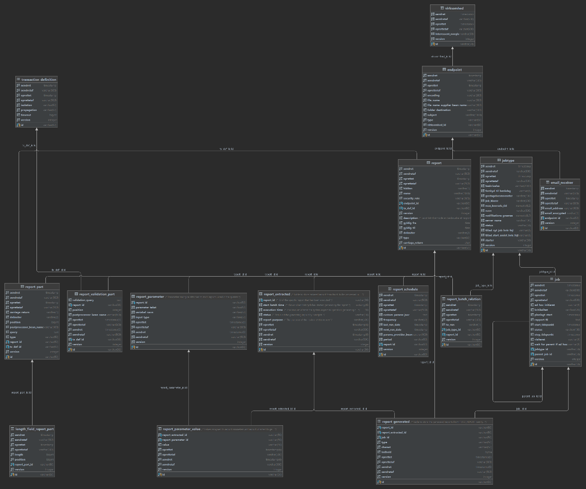
</div>

# FAQ

**If your project implemented the report library and found any troubleshooting tips, or questions that you have answered
during implementation, then please add them here.**
