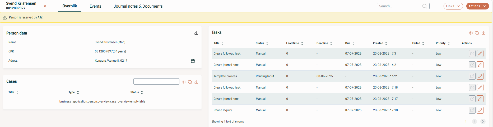
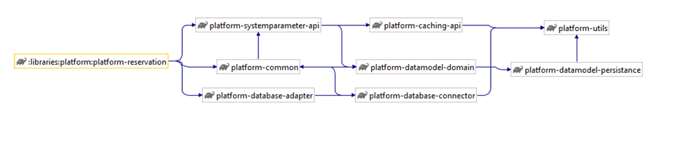
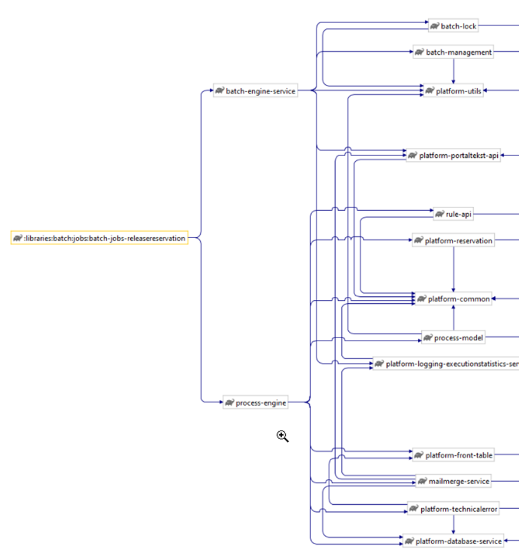
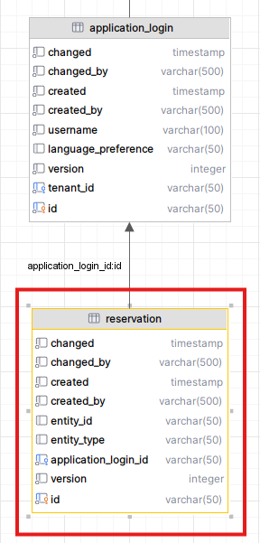

# References

| Reference                                                       | Title                  | Author |
|-----------------------------------------------------------------|------------------------|--------|
| [DD130 – Process Engine](/DD130-Detailed-Design/Process-Engine) | DD130 – Process Engine | NC     |

# Introduction

This document contains detailed design for the reservation module. The reservation module contains functionality for end
users to reserve entities (persons, coroprations, etc). A reservation means locking the entity when a user works on
them, to prevent others from doing changes, and avoid concurrent access and modifications.

## Target audience

This document is targeted developers from any Amplio-project interested in the Amplio Reservation library or the subject
in general.

## Purpose

Provide functionality of handling reservation of entities to prevent multiple users to modify or work on the same entity
at the same time. It's a single purpose module that provides an API for things like reserving, releasing reservations
and checking if an entity is reserved.

The module itself does not contain the functionality for triggering a reservation or the release of a reservation, that
is up to other Amplio modules, or the projects using the module, to define.

## Background information

The reservation component is needed to prevent end users to modify an entity when working on them. The primary use case
for reservation is:

1. An end user opens the overview for an entity, for example a person, the person the gets reserved by the user. Other
   users can't apply changes on the reserved person. Other users can still view the person but will get a warning label
   explaining that the person is read only.
2. Once the user is done working on the reserved person and closes it down. The reservation generally should be removed.

The module itself does not contain the functionality for triggering a reservation or the release of a reservation, that
is up to other Amplio modules, or the projects using the module, to define.

# High level description of the component

The reservation consist of a database table to save reservation and a service to provide functionality to reserve and
release reservations of entities. It saves reservations on the `RESERVATION` table. It is up to the project to integrate
the reservation service to be used where it is necessary, or rely on other Amplio modules, that uses reservation.

<h5>Figure 1 Opening a person with a reservation. The data will be read only and no changes can be made.</h5>
 

1. Reserving an entity The main usage of reserving an entity is done in the Amplio Navigation module. When a user opens
   the overview for an entity, for example a person. It will get reserved and other users will be blocked from making
   changes to it.

2. Releasing reservation The general usage of releasing reservations, is either when the user decides to close down the
   entity overview from the front or through a “release reservation” batch job. The job generally runs every night at
   midnight to release persons that were never closed down on the previous work day, so that every entity can be worked
   on again the next day. This batch job exists ready to use in Amplio, and is further described in [chapter Release reservation batch job](/DD130-Detailed-Design/Reservation#Release-reservation-batch-job).

# Release reservation batch job

The release reservation module consists of a full batch job and a service. The purpose of the batch job is to fetch all
current reservations in the database and remove those that are possible to remove. The default functionality and
constraints for removal is described below. As always functionality can be overridden in the projects if necessary, by
overriding service class in the module.

## Read phase

The batch jobs fetches all current reservations in the database and makes one batch item for each entity (Person,
Company for example) that is related to the current reservation and makes one batch item for each entity.

If the project wishes a more complex select criteria the method `getEntityList` in `ReservationService` should be
overridden.

## Processing phase

The batch job runs through the entities that have reservations and removes those that can be removed. This code is
located in `BatchReservationServiceImpl`.

The steps which this happens is the following for each entity:

1. Remove all reservations, entries in the reservation tables, which is related to the entity.
2. Remove all "non-reservable tasks" that is reserved by the entity. This means clearing the field `reserved_by` on
   process that exists on the current entity. For a person entity this means setting `reserved_by` on process table to
   null, where `person_id` equals id of the entity being processed.
3. If any reservations were deleted or tasks "un-reserved" in step 1 or 2, step 3 is executed. This step fetches all
   tasks on the entity that is open and being worked on and tries to save and close them in their current state. If a
   task cannot be saved and closed because of open invalid journal note, a technical error of type
   `JOURNALNOTAT_NOT_VALID_ON_RELEASE` is created.

# Configurations and service extensions

This section will define how to set up the component and what component requirements come along.

## Code integration

The code integrations to the Reservation module are few, as the API is very simple. And what code integrations are
required, depends on what other modules a project is using.

The functionality for reserving and releasing entities all exists in Amplio modules process engine and
application/business-core.

For adding extra project specific logic is necessary, see [API section](/DD130-Detailed-Design/Reservation#API) for available methods to override.

### Release reservation batch job

Apart from releasing reservations directly from the business application. Amplio contains a separate module for release
reservation continuously in a batch job. The batch job is described in [chapter Release reservation batch job](/DD130-Detailed-Design/Reservation#release-reservation-batch-job). The batch job itself requires no extra
code integration and can be used in projects out of the box.

## Configurable settings

There are no configurable settings for the Reservation module

## Roles and rights

There are no specific right and roles regarding the Reservation module.

## Other requirements and reservations

The reservation module only depends on common and database, and in particular it depends on the project using the common
concept of "SimpleEntity", which exists in the platform/data model/persistence module.

The reservation module is highly depended on by other modules like Process engine and business core.

# API

The main API is `ReservationService`. It contains simple methods for handling reservations.

* The service contains a few variants of methods for reserve entity and release reservation, which does what can be
  expected, adding a reservation for the entity to the Reservation database table, and releasing it, respectively.
* The service also contains methods for checking if an entity is reserved, and by whom.
* Finally, there are some historical methods to check which entities a user has reserved historically, as well as which
  user an entity has been reserved by.

# Component model

<h5>Figure 2 Platform-reservation model</h5>
 

##	Release reservation batch job component model

<h5>Figure 3 Release reservation component model</h5>
 

# Data model

<h5>Figure 4 Reservation table, with foreign key relation to application_login.</h5>
 

# FAQ

**If your project implemented the reservation library and found any troubleshooting tips, or questions that you have answered during implementation, then please add them here.**