# References

| Reference                    | Author                      |
|------------------------------|-----------------------------|
| [DD130 - Table][DD130_TABLE] | Rasmus Troensegaard Cortsen |

<!-- =============== -->
<!-- REFERENCE LINKS -->
<!-- =============== -->

<!-- Toolkit reference links -->

[DD130_TABLE]: https://goto.netcompany.com/cases/GTE2252/AMPJ/SitePages/Wiki.aspx#/DD130-Detailed-Design/Tables

# Introduction

This is the detailed design for Amplio Search component, which provides a front-end search feature for certain database
entities.

## Target audience

This document target audience is primarily developers with Amplio experience. As well as any stakeholder interested in
the Amplio Search component.

## Purpose

The Search component exists to provide out of the box functionality to search for specific database entities that the
project has, from the front end. This can be for example a person, document, or any other entity the project would like
the end user to be able to search for. The component includes the front-end layout for entering search options, as well
as the back-end functionality for fetching data from the database to return it to the front.
The component does not specify which database entities that should be searchable, or which search parameters the user
should be able to enter.

## Background information

The component exists for the end user to be able to search for specific database entities from the front end. Which
entities that can be searched for are decided by each project. It is therefore up to the project to implement and
configure each new type of search entity.
The search module requires modules Navigation, Front table and Database (as well as the indirectly imported modules
through these modules).

# High level description of the component

The Search component provides functionality for searching for entities from the front end, which exists in the systems'
database.
The component can easily be configured by each project to decide what search criteria should be used, meaning what
should the user be able to search for and by what kind of input fields. As well as what search results should be
presented back to the front when the search is done.
The page also has table for showing latest searches.
Figure 1 shows an example of what the search page might look like.

1. Menu showing tabs for entities that can be searched for.
2. Box for entering search criteria specific for each entity.
3. Search result.
4. Recent searches.

<div style="text-align: center;">

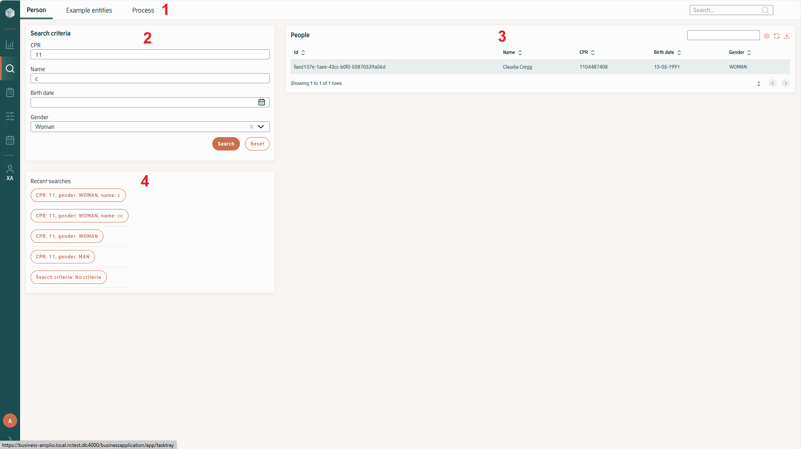
<h5>Figure 1 Example of full search page</h5>
</div>

## Process search

The functionality described above exists in the submodule called ”search-base”, which is the core search functionality.
The search module in Amplio also contains a submodule called ”search-process”, which is an implementation of a specific
search type for the entity Process. It can be used either directly or as a best practice example.

# Introduction to the subject

From a technical perspective the functionality in search component is split between Amplio and project code.
The Amplio code provides the framework, controllers for back-end calls, the base of the front views, as well as both
front and back-end logic to handles the generic logic of what should happen when a search is performed.
The project codes responsibility is to define the properties of each search type. Which fields should be shown in the
front, and what tables in the database should data be looked for.
The following chapter explains how to define a search type, and more in depth of how searches function. For guidance of
exactly how the code can be implemented and modified, see
chapters [Defining search entities](#Defining-search-entities), and [Configurations and service extensions](#Configurations-and-service-extensions).
The search component uses no third-party libraries.

# Implementing Search Functionality

## Overview

The core search component in Amplio contains code to provide extension where projects can define which entities that
should be searchable, and what parameters could be used to search for them. As seen in the sitemap in Figure 1.

As a “best practice” example, Amplio has a specific module search-process ([Process search](#Process-search)).
Which contains everything need, front and back-end, to extend the search core module with the process search functionality:

<div style="text-align: center;">

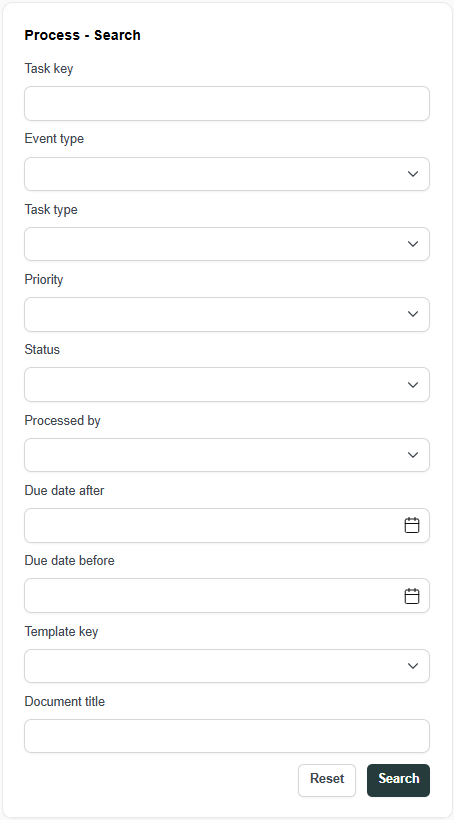
<h5>Figure 2 Process search</h5>
</div>

## Search Module Architecture

### Required Components

Figure 3 below shows the classes required to hook into the search component and implement search for a specific entity.
Exactly how to implement classes is described in [backend implementation](#backend-implementation).

<div style="text-align: center;">

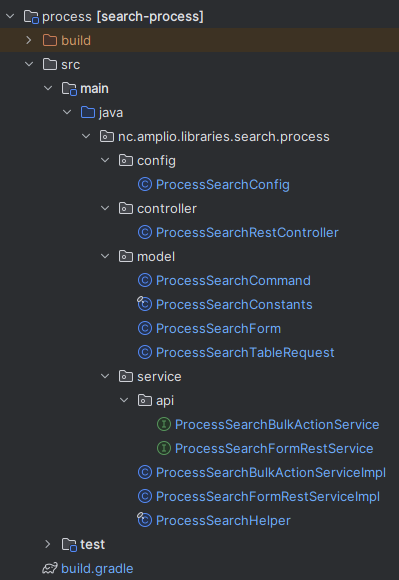
<h5>Figure 3 Overview of classes in the Process search module</h5>
</div>

Figure 4 below shows the files required to implement search page for a specific entity. The structure and integration 
are covered in [frontend implementation](#frontend-implementation).

<div style="text-align: center;">

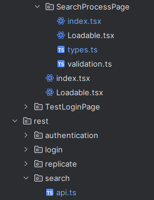
<h5>Figure 4 Overview of files in the Process search page</h5>
</div>

#### Configuration & Controllers:

1. `ProcessSearchConfig` - Spring configuration for component registration
2. `ProcessSearchRestController` - REST endpoints for search operations
3. `ProcessSearchFormRestService` - Service layer for search execution

#### Data Models:

4. `ProcessSearchForm` - Search criteria form with validation
5. `ProcessSearchCommand` - Command pattern for search execution
6. `ProcessSearchTableRow` - Search results row structure
7. `ProcessSearchTableRequest` - Backend filtering parameters

#### Utilities
8. `ProcessSearchConstants` - Search query constants
9. `ProcessSearchHelper` - Base filtering utilities

### Customizable Components

Figure 5 show the beans that can be customized to modify search behavior and results presentation

<div style="text-align: center;">

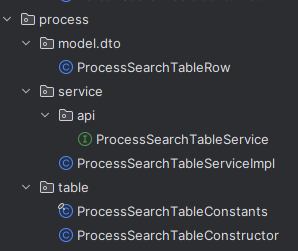
<h5>Figure 5 Overview of classes in the Process search module in reference</h5>
</div>

- `ProcessSearchTableService` - Customize search query logic and data retrieval
- `ProcessSearchTableServiceImpl` - Override default implementation for specific business logic
- `ProcessSearchTableConstructor` - Modify how search results are transformed into table rows
- `ProcessSearchTableConstants` - Configure table-specific constants and default values
- `ProcessSearchTableRow` - Extend or modify the structure of search result data

### Implementation Steps

This section demonstrates how to implement a complete search page within the Amplio framework. The implementation follows
a structured approach that includes defining search types, creating form structures, implementing backend services, and 
establishing the necessary controller layer for form generation and processing.

### Backend Implementation

This section covers the server-side components required for search functionality. For complete implementation details, 
please refer to the `search-process` and `nc.amplio.reference.business.react.rest.entity.person` modules which provide 
comprehensive examples of all components described in this guide.

#### Defining Search Type

To start with, there needs to be one `MenuType` for search.

```java
public static final MenuType YOUR_SEARCH = MenuType.create("YOUR_SEARCH", SEARCH, "/your", 3, SR_BA_YOUR_SEARCH);
```

The combination of these two extendable Enums, will provide the target URL `/search/your/` for our search. Any URL
starting with `/search/` or `/search/{type}/` is caught by the search framework, and it will take care of the 
corrected setup.

#### Defining search form

The `SearchForm` defines the search criteria form structure with:
- **Field Definitions**: All searchable fields (businessKey, eventType, etc.)
- **Input Validation**: Jakarta validation annotations (`@Size`, `@Pattern`)
- **Frontend Integration**: `@TypeScriptModel` for TypeScript generation
- **Validation Patterns**: Uses Amplio's `RegexPatterns` and `ValidationMessages`

```java
@Data
@FieldNameConstants
@TypeScriptModel
public class YourSearchForm implements Item {}
```

#### Defining search command

The `SearchCommand` wraps the form and handles search execution:
- **Extends**: `FormSearchCommand<SearchForm>`
- **Key Method**: Override `provideSearchParams()` to convert form data into search parameters
- **Purpose**: Manages search state and recent search functionality

```java
@Getter
public class ProcessSearchCommand extends FormSearchCommand<ProcessSearchForm> {
   //Methods for retrieving values from search form. 
    
    @Override
    public Map<String, List<SearchParams>> provideSearchParams() {
        Map<String, List<SearchParams>> params = new HashMap<>();
        params.put("yourType", getSingeltonParamList(getYourType()));
        
        return params;
    }
}
```

#### Controller and Service Layer for Search Form

`SearchRestController` provides a comprehensive set of endpoints that handle all search form operations:
- **Request Routing**: Receives HTTP search requests and delegates them to ProcessSearchFormRestServiceImpl for processing
- **Service Delegation**: Acts as a thin API layer, streaming form operations to the service layer while maintaining 
separation of concerns
- **Response Formatting**: Converts service responses into proper HTTP format with appropriate status codes and JSON structure
- **Error Handling**: Translates service exceptions into user-friendly HTTP error responses

```java
@Tags(value = {
        @Tag(name = "your"),
        @Tag(name = "search"),
        @Tag(name = "form"),
})
@RestController
@PreAuthorize("isAuthenticated()")
@RequestMapping(path = "/rest/api/search/your", produces = APPLICATION_JSON_VALUE)
@Slf4j
@RequiredArgsConstructor
public class YourSearchRestController {

    private static final String YOUR_TYPE = "your";

    private final YourSearchFormRestService yourSearchFormRestService;

    @GetMapping(path = "/form/instance", produces = APPLICATION_JSON_VALUE)
    public ResponseEntity<FormResource<BeanFormInstance<YourSearchForm>>> getFormInstance(@RequestParam(value = "key", required = false) String id) {
        // Return form configuration
    }

    @PostMapping(path = "/form/instance", consumes = APPLICATION_JSON_VALUE)
    public ResponseEntity<FormResultResource<Item>> executeFormInstance(@RequestBody BeanFormInstance<YourSearchForm> instance) {
        // Validate search form's data and return data back to front-end for table's searching
    }
}
```

`SearchFormRestService` Service layer that handles all search form operations and business logic processing.
- **Form Generation**: Creates search form configurations with defaults, metadata, and validation rules
- **Request Validation**: Validates search criteria against business rules and constraints  
- **Data Processing**: Processes and validates form data, then returns it to the frontend for table search operations

```java
public interface YourSearchFormRestService {

    FormResource<BeanFormInstance<YourSearchForm>> generateForm(String type, String id);

    FormResultResource<Item> yourFormInstance(BeanFormInstance<YourSearchForm> instance, String type);
}
```

**`Note:`** When implementing the beanProcessorProvider(), it is mandatory to include the following code pattern at the 
end of the validation logic:

```java
YourSearchCommand searchCommand = new YourSearchCommand();
searchCommand.setForm(values);
searchQueryService.updateOrSaveSearchQuery(searchCommand, type, identityProvider.getUserName());
return values;
```

The first three lines are essential for saving the search command to enable recent search functionality where **type** is
the constant created in controller. Then, return values statement passes the validated form data back to the frontend for 
table searching operations.

#### Defining table row structure

`SearchTableRow` is the DTO representing a single row in search results:
- **Immutable Design**: Uses @Builder for consistent data structure
- **Input Validation**: Jakarta validation annotations (`@Size`, `@Pattern`, `@NotNull`)
- **Frontend Integration**: `@TypeScriptModel` for TypeScript generation
- **Complete Data**: Process identifiers, metadata, and navigation context

```java
@Getter
@Builder
@TypeScriptModel
public class YourSearchTableRow implements Item {}
```

#### Defining table request

`SearchTableRequest` is the DTO representing the search information that user provided:
- **Base Functionality**: Extends AbstractTableRequest for pagination and sorting capabilities
- **Search Form Integration**: Implements SearchTableRequest<F> interface for type-safe search form binding
- **Input Validation**: `@Valid` and `@NotNull` ensure search form integrity  
- **JSON Polymorphism**: `@JsonTypeName` enables proper deserialization in polymorphic scenarios. Please refer to 
[Backend Implementation](https://goto.netcompany.com/cases/GTE2252/AMPJ/SitePages/Wiki.aspx#/DD130-Detailed-Design/Tables?id=backend-implementation)
of table documentation.
- **Frontend Integration**: `@TypeScriptModel` generates corresponding TypeScript interfaces

```java
@Getter
@Setter
@TypeScriptModel
@JsonTypeName(value = "yourSearch")
public class YourSearchTableRequest extends AbstractTableRequest implements SearchTableRequest<YourSearchForm> {

    @Valid
    @NotNull
    private YourSearchForm searchForm;
}
```

#### Table Constructor and Service Components

`SearchTableConstructor` defines table structure and coordinates result building for the search table display:
- **Column Definition**: Defines all table columns with their types, data mappings, and display configurations using QueryColumnFactory
- **Table Association**: Associates with specific table ID to handle the correct search table requests
- **Result Coordination**: Coordinates with ProcessSearchTableService and QueryTableResultBuilderFactory to build paginated table results
- **Custom Sorting**: Implements custom sorting logic for complex fields.

```java
@Component
@RequiredArgsConstructor
public class YourSearchTableConstructor implements TableConstructor<YourSearchTableRow, YourSearchTableRequest> {}
```

`SearchTableService` constructs query criteria and handles data transformation for the search table.
- **Criteria Building**: Constructs `CriteriaBuilder` with custom DTO projection optimized data selection
- **Filter Construction**: Builds filtering criteria based on search form data
- **DTO Transformation**: Transforms `DTO` objects into `SearchTableRow` objects with proper field mapping and data formatting

```java
public interface YourSearchTableService {
    CriteriaBuilder<YourSearchResultDto> getInitialCriteriaBuilder(YourSearchTableRequest request);

   YourSearchTableRow transform(YourSearchResultDto row);
}
```

#### Project Integration for Process Searching Page 

Override default beans for project-specific behavior:

- **Custom Search Logic**: Override `ProcessSearchTableServiceImpl` for specialized queries
- **Data Transformation**: Customize `ProcessSearchTableConstructor` for specific row building
- **Constants Configuration**: Modify `ProcessSearchTableConstants` for project defaults
- **Row Structure**: Extend/modify `ProcessSearchTableRow` with additional fields

### Frontend Implementation

This section covers the client-side components required for search functionality. For complete implementation details,
please refer to the `SearchPersonPage` and `SearchProcessPage` packages.

#### Defining Search Form Api

To start with, there needs to be one `searchApi` for search form handling.

```typescript
export const searchYourFormApi = createSearchFormApi<YourSearchFormType>();
```

The `createSearchFormApi` function creates a typed RTK Query API instance that handles:
- **Form Generation**: Fetches form configuration from the backend
- **Form Submission**: Processes form data and validation
- **Caching**: Manages recent search state

#### Defining Validation Schema

Define client-side validation rules using `Zod` for form validation and type safety:
- **Field Validation**: Defines validation rules for form fields
- **Custom Logic**: Uses .refine() for complex cross-field validation
- **Type Safety**: Generates TypeScript types from schema
- **Error Handling**: Provides specific error messages and field targeting

```typescript
export const yourSearchFormSchema = z
  .object({
    fields: z.object({
      field1: z.string().nullable(),
      field2: localDateSchema().nullable(),
      field3: localDateSchema().nullable(),
      // Add other form fields with appropriate validation
    }),
  })
  .refine(
    data => {
      // Custom validation logic (e.g., cross-field validation)
      return validationCondition;
    },
    {
      message: 'validation_error_message_key',
      path: ['fields', 'targetField'],
    },
  );
```

#### Creating Search Page Component

Create the main search page component using predefined searchFormApi, defaultSearchForm and searchFormSchema.

```typescript jsx
export default function SearchYourPage() {
  const history = useHistory();
  
  const handleResultsRowSelect = (row: YourSearchTableRow) => {
    // Handle row selection logic
  };
  
  return (
    <Page prefix={AppPortaltextPrefixStore.businessApplication.businessApplicationSearchYour}>
      <BaseSearchPage<YourSearchForm, YourSearchTableRow, YourSearchTableRequest>
        searchNodeName="your"
        tableId="your_search_table"
        rowOnClick={handleResultsRowSelect}
        validationSchema={yourSearchFormSchema}
        useLazyFetchFormInstance={searchYourFormApi.useLazyFetchSearchFormInstanceQuery}
        useExecuteFormInstance={searchYourFormApi.useExecuteSearchFormInstanceMutation}
      />
    </Page>
  );
}
```

#### Customized components

By default, `BaseSearchPage` will provide a search form, a result table and a recent search table out-of-the-box. An
example is shown in figure 6:

<div style="text-align: center;">

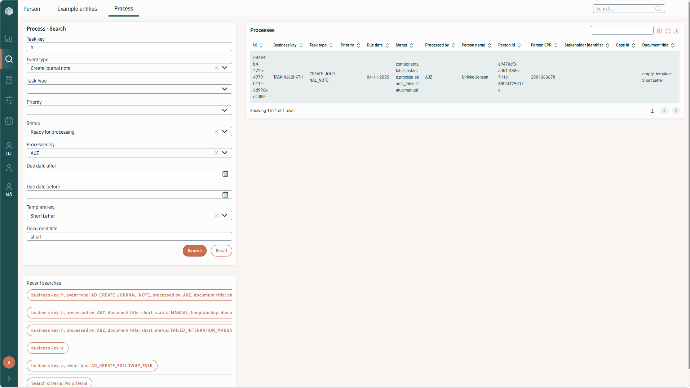
<h5>Figure 6 UI of process search page</h5>
</div>

Projects also have the ability to add their own customized components by using the `results` prop to override the default 
result display. For example, we have the `EntityReplicator` for person searching page:

<div style="text-align: center;">

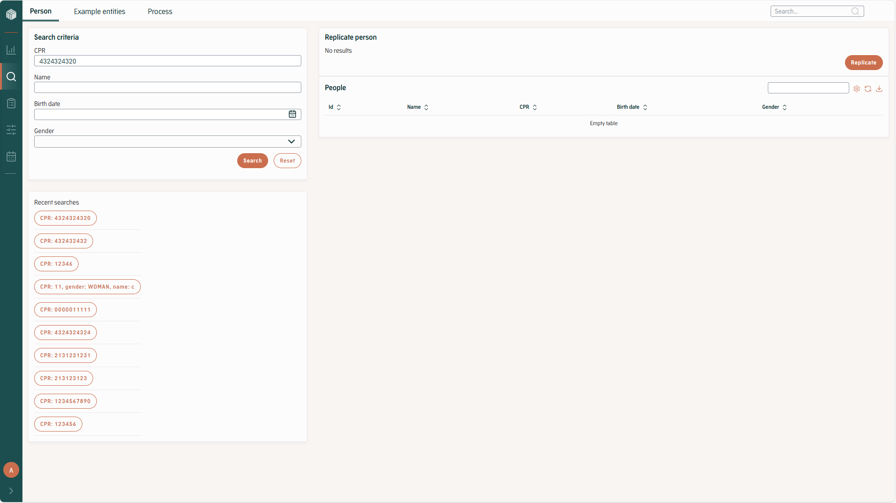
<h5>Figure 7 UI of person search page with custom component</h5>
</div>

```typescript jsx
export default function SearchPersonPage() {
    
  return (
    <Page prefix={AppPortaltextPrefixStore.businessApplication.businessApplicationSearchPerson}>
      <BaseSearchPage<YourSearchForm, YourSearchTableRow, YourSearchTableRequest>
        searchNodeName="your"
        tableId="your_search_table"
        rowOnClick={handleResultsRowSelect}
        validationSchema={yourSearchFormSchema}
        useLazyFetchFormInstance={yourSearchPersonFormApi.useLazyFetchSearchFormInstanceQuery}
        useExecuteFormInstance={yourSearchPersonFormApi.useExecuteSearchFormInstanceMutation}
      >
        {{
          results: (requestState, tableProps) => (
            <YourCustomComponent requestState={requestState} {...tableProps} />
          ),
        }}
      </BaseSearchPage>
    </Page>
  );
}
```

### Search Execution Flow

When performing a search, the framework follows a streamlined process that integrates the components defined in the 
previous sections. The flow consists of form validation, data processing, and result presentation.

<div style="text-align: center;">

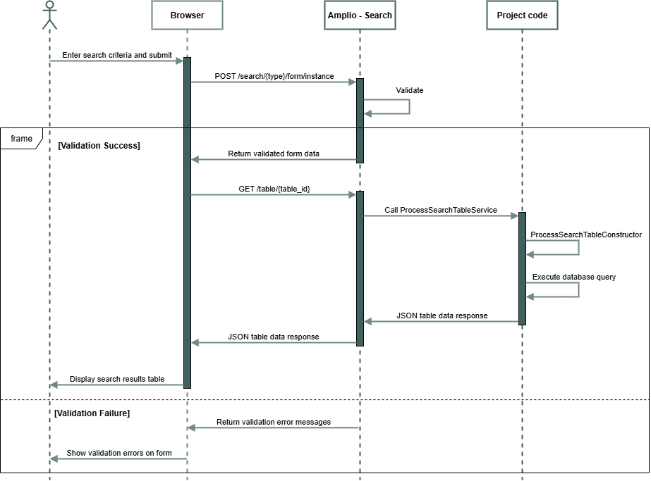
<h5>Figure 8 Search execution sequence</h5>
</div>

Search Process Steps
- **Form Submission**: User submits search criteria through the frontend form (`ProcessSearchForm`)
- **Backend Validation**: Form values are sent to the backend for validation using Jakarta validation annotations 
(`@Size`, `@Pattern`, `@NotNull`)
- **Validation Response**:
  - Success: Returns validated form values to proceed with search
  - Failure: Returns validation error messages to display on frontend
- **Table Request Creation**: If validation passes, form values are converted into a `ProcessSearchTableRequest` object
- **Data Query Execution**: The `ProcessSearchTableConstructor` receives the table request and:
  - Applies search filters based on form criteria
  - Executes database queries through `ProcessSearchTableService`
  - Transforms raw data into `ProcessSearchTableRow` objects
- **Result Presentation**: Structured search results are returned to the frontend for table display

### Advanced Features

Recent searches do not require any specific configuration or implementation for a specific project or search target. It
uses the recent_search table and populates it with a serialized input form, the search type and the user who
performed the search. It works out of the box by populating a table below the search input for the specific type with
recent search, each line is clickable and will repeat that search.

#### Recording Search Queries

In order to record the input form for recent searches, you must call `updateOrSaveSearchQuery` at the end of the 
`beanProcessorProvider`. This ensures that valid search criteria are stored for future retrieval:

```java
private BeanProcessorProvider<ProcessSearchForm> beanProcessorProvider() {
    return (values, mode, validation) -> {
        // ... validation logic for eventType, processType, priority, etc.
        
        // Record the search query for recent searches
        ProcessSearchCommand searchCommand = new ProcessSearchCommand();
        searchCommand.setForm(values);
        searchQueryService.updateOrSaveSearchQuery(
            searchCommand, 
            ProcessSearchConstants.PROCESS_SEARCH.getKey(), 
            getLoginId()
        );
        
        return values;
    };
}
```

This however means that any change to the search command for a specific search target will render the serialized inputs
in the database unusable, so either recent search tables in database should be corrected or wiped for the modified
search type. Otherwise, an amount corresponding to the table size of dummy searches with the new search command layout
should be created.
<div style="text-align: center;">

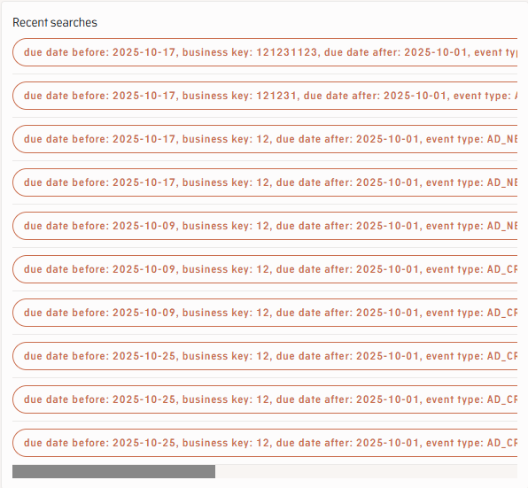
<h5>Figure 9 Recent Search table</h5>
</div>
PersonSearchController A controller is required to

#### EntityReplicator
# Advanced search

Apart for searching for the parameters defined in the front end, the search component also contains searching using SQL
query. It is a text input, with a help text that describes what the default query is for that entity. The user is then
able to provide their own “where” clause to finish the query. See figure below:

<div style="text-align: center;">

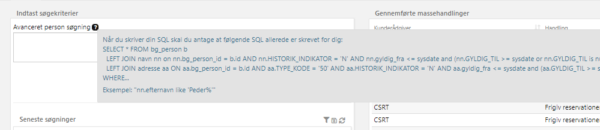
<h5>Figure 10 Advanced search</h5>
</div>

It works as follows:

1. The project must, for each type of entity search, establish a ”base select” query. This is done in the SearchService
   extension and is in fact used both in ”normal” search and advanced search. This query is what will be queried to the
   database and is therefore the base of what the user can build on, when submitting his own query using the advanced
   search feature. An example is shown in Figure 10. The project should therefore provide a portal text to reflect this
   query and give correct help text to the user.
2. The user can then manually input whatever WHERE-clause they would like, based on the syntax from the base select.
   Since the WHERE clause is built into the base select the user cannot select from other tables than predefined in the
   code.

<div style="text-align: center;">

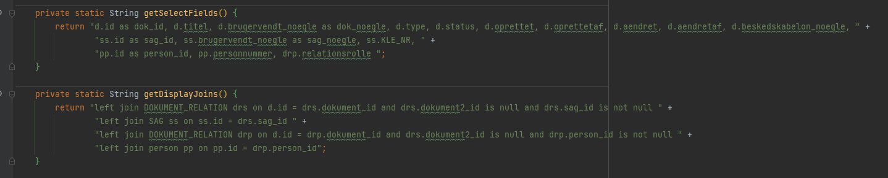
<h5>Figure 11 Example of the base search, selects and joins, for "Document Search" in an Amplio project</h5>
</div>


The Advanced search has a special security role, FS_SEARCH_ADVANCED, since it does require an extra technical knowledge
for the user, and should not be used by anyone.


## Release reservation from search page

It is possible to extend the search page entity table with both single and mass actions for releasing reservations on one or more entities.

### Single action
#### Injecting Actions into the Search Page (Front End)
To add actions to the entity table, they must be passed to the `BaseSearchPage` component via the `actions` prop.

```typescript jsx
<BaseSearchPage<PersonSearchForm, PersonSearchTableDisplayRow, PersonSearchTableRequest>
  actions={actions}
/>
```


#### Release Reservation Action (Front End)
To add a release reservation action for each row in the entity search table, the table must use either the `useReleaseEntityActions` hook or the `useReleaseEntityActionsWithProcess` hook and pass the returned actions to `BaseSearchPage`.

Both hooks return an object of type `ActionList<Row extends EntityReservationRow, SearchEntityActions>` that contains the release-reservation action used by the table.

**Basic Usage**
The `useReleaseEntityActions` hook provides basic release functionality:

```typescript jsx
const actions = useReleaseEntityActions<PersonSearchTableDisplayRow>();

<BaseSearchPage<PersonSearchForm, PersonSearchTableDisplayRow, PersonSearchTableRequest>
  actions={actions}
/>
```
**Parameters:**
- customHandler (optional): Custom function to handle the release action. When provided:
  - The custom handler is executed instead of the default behavior
  - If not provided → opens the default `ReleaseReservedEntityPopUp`

**Process-Aware Usage**
The `useReleaseEntityActionsWithProcess` hook provides enhanced functionality that checks for opened processes on entities:
```typescript jsx
const actions = useReleaseEntityActionsWithProcess<PersonSearchTableDisplayRow>();

<BaseSearchPage<PersonSearchForm, PersonSearchTableDisplayRow, PersonSearchTableRequest>
  actions={actions}
/>
```
This hook automatically integrates process checking functionality by internally using `useOpenedProcessLookup` and passing a custom handler to `useReleaseEntityActions`.

When the action is triggered, one of the following scenarios applies:
- **Entity with open processes:**
  The `CloseEntityPopup` is displayed. Through this popup, the user can release the entity and either discard or save changes in the open processes.
- **Entity without open processes:**
  The `ReleaseReservedEntityPopUp` is displayed as a confirmation prompt for releasing the reservation.


When the user hovers over the action button, a tooltip is displayed showing reservation information.
This information is retrieved from the row model, as described below.

#### Back End
On the backend, the entity table constructor must implement the `ActionsTable` interface and use `SearchEntityActions` as the action type.
Additionally, the action column must be enabled.

```java
public class PersonSearchTableConstructor implements TableConstructor<PersonSearchTableDisplayRow, PersonSearchTableRequest>, ActionsTable<SearchEntityActions, PersonSearchTableDisplayRow> {
   @Override
   public TableFlags getFlags(String tableId, PersonSearchTableRequest request) {
      return TableFlags.builder().enableActionColumn(true).build();
   }
}
```

The table row model must implement the `EntityReservationRow` interface (that extends `Actionable<SearchEntityActions>` and `EntityData`), which represents a reservable entity in search results.
It exposes a single `ReservationInfo` object containing:

- entityType
- reservedBy
- reservationCreated
- lastActivity

The row also supports SearchEntityActions via Actionable<SearchEntityActions> to control which actions are visible in the frontend.
The row can be populated using EntityReservationRowService:
- `getReservationInfo(SimpleEntity)` populates the ReservationInfo
  - lastActivity is derived from the most recently changed process, or falls back to the entity’s changed timestamp
- `getSearchEntityActions(SimpleEntity)` provides the row actions

Implementations of `EntityReservationRow` must implement the methods of EntityData `getEntityType`, `getEntityId`, `getEntityName` as these values are used by the FE.
### Mass actions

Mass actions allow operations to be executed on multiple selected entities from the search results.
These actions are defined by the project and are not limited to Amplio functionality.

For detailed implementation of mass actions using the table framework, refer to:
[Mass actions](https://goto.netcompany.com/cases/GTE2252/AMPJ/SitePages/Wiki.aspx#/DD130-Detailed-Design/Tables?id=mass-actions)

#### Mass reservation release
To enable releasing reservations for multiple entities at once, the search entity table constructor must implement both the `MultiSelectTable` and `MassActionsTable` interfaces.

In addition, the mass actions configuration must include a `TableMassAction` of type
`ReservationReleaseMassActionTypes.RELEASE_RESERVATION`. This ensures that the `EntityReservationReleaseMassActionProcessor` handles the action.

`EntityReservationReleaseMassActionProcessor` implements the TableInputMassActionProcessor and its purpose
is to handle `ReservationReleaseMassActionTypes.RELEASE_RESERVATION` mass actions for each entity table.

**Processing Logic**

The `EntityReservationReleaseMassActionService` is used by the `EntityReservationReleaseMassActionProcessor` to leverage out-of-the-box functionality.
It provides methods for both batch execution and immediate execution.

**Batch job execution:**
  - `shouldProcessInBatchJob`: Determines whether the mass action should be executed as a batch job based on the number of affected reservations.
   If all entities are selected, the total number of reservations for the current user is compared to the threshold.
   If only specific entities are selected, only reservations matching the selected entity IDs are counted.
  - `initiateMassActionBatchJob`: Starts a batch job to execute the mass action.
  - `getIterator`: Provides an Iterator of `ReleaseEntityReservationMassActionBatchItem` instances to be processed by the batch job.
    This method is intended to be used by `DefaultAbstractTableInputMassActionProcessor.getIterator`.
  - `process`:   Intended to be used by `DefaultAbstractTableInputMassActionProcessor.process`. It returns the input batch item.
  - `sideEffect`: Performs the release of reservations by calling `ReservationService.releaseReservations`, passing the login ID.
    The login ID is resolved by retrieving the ApplicationLogin from `MassActionInstance.createdBy`. This method is intended to be used by `DefaultAbstractTableInputMassActionProcessor.sideEffect`.
**Immediate execution:**
  - `executeMassActionImmediately`: Releases the reservations immediately.
    It uses the provided table constructor to retrieve the entities and calls `ReservationService.releaseReservations`, passing the login ID.
    The login ID is obtained from the current session context.

After the reservations are released, the open processes for the affected entities are retrieved and their state is stored using `ProcessApiRollbackService.saveAndClose`.

The batch job uses the `ReleaseEntityReservationMassActionBatchItem` class, which contains the following fields:

- entityId
- entityType
- loginId

The value of the `MassActionOperationType` used by the `TableConstructor` implementation must be the `ReservationReleaseMassActionTypes.RELEASE_RESERVATION`.

# Data model

Figure 12 shows table RECENT_SEARCH, used for saving previous searches.

<div style="text-align: center;">

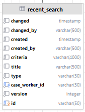
<h5>Figure 12 RECENT_SEARCH TABLE.</h5>
</div>

## Roles and rights

There are four roles in total in the search module, two in the search-base module, which all projects using search will
get. And two in the search-process module, if the project chooses to use the Amplio specific search for Processes.

### Roles and right in search-base

There are two roles in the search-base module.

1. SR_BA_SEARCH: Access to the search functionality. Viewing and accessing the TopMenu Search tab and being able to do
   searches. Should be given most users that will use the system and can be interested in searching for entities.
2. SR_BA_SEARCH_MASS_ACTIONS: Gives the ability to do “Mass actions” on entities from the search result.
   See [Mass actions](#Mass-actions). This will give the ability to perform an action, for example sending a
   letter or
   starting a process, for multiple entities at once. This right might be given more restrictively, to fewer users, as the
   actions taken can have a larger impact than just working with single entities.

### Roles and right in search-process

There are two roles in the search-process module.

1. SR_BA_PROCESS_SEARCH Access to the “Process” search tab. Viewing and accessing the Menu Process and being able to
   search for processes in the system. Everyone that needs to be able to search for processes should have this role.
2. SR_BA_SEARCH_ADVANCED Gives the ability to use advanced search for process. Should be given more restrictively than
   regular search. Fewer roles should have the need to search using SQL.

# FAQ

If your project implemented the search component and found any troubleshooting tips, or questions that you have answered
during implementation, then please add them here.
