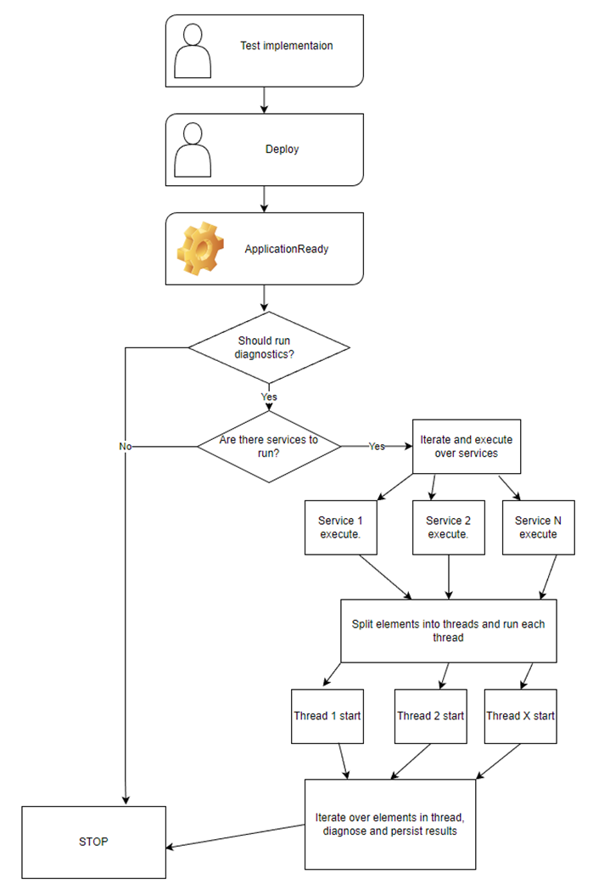
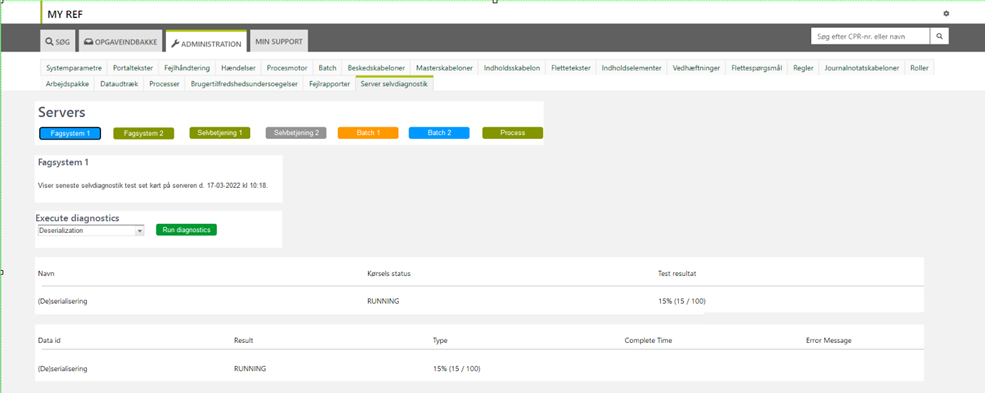
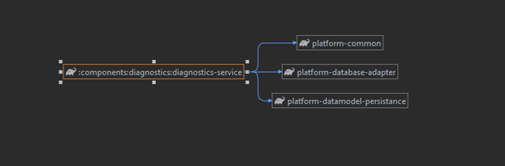
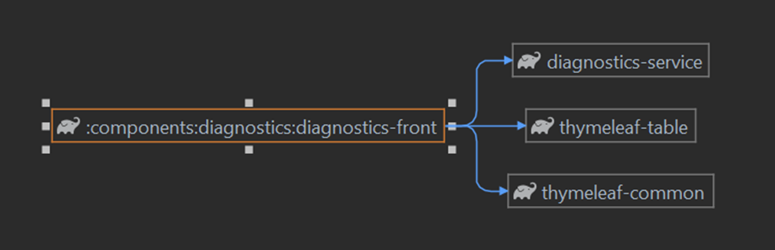
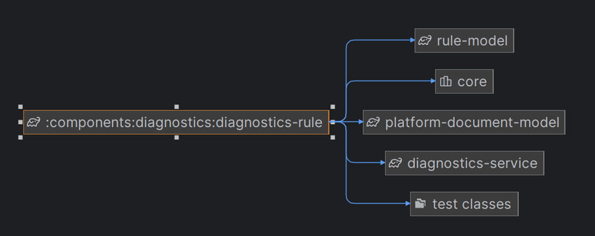
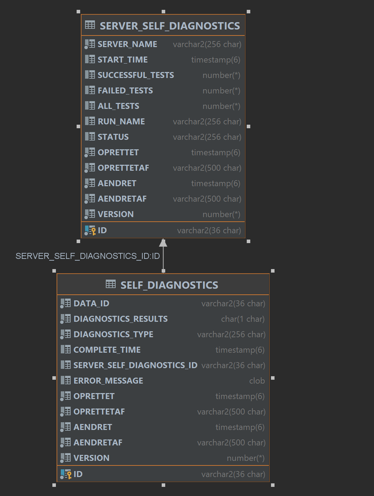

# References

| Reference                                                                                       | Title        | Author |
|-------------------------------------------------------------------------------------------------|--------------|--------|
| [PE_PR](https://source.netcompany.com/tfs/Netcompany/ATPE0004/_git/ATPE0004/pullrequest/251089) | PE_PR-251089 | NC     |

# Introduction

This document outlines the technical side of the server self-diagnostics functionality and how to implement the
configurable self-diagnostics test-tool.

The self-diagnostics test-tool is set to run a set of tests on the different servers upon start up. There is a set of
available Amplio tests, but it is also possible to write project specific tests. Which tests are available is
configurable via your project's implementation.

## Target audience

The document is targeted at a developer with Amplio experience, wishing to improve the server self-diagnostics library
or implement it in their project.

## Purpose

The library allows projects to run smoke tests on the servers as part of the deployment of the code. This allows us to
run test cases with relevance for specific servers instead of general functionality that should still be tested on lower
environments prior to deploy.

## Background information

Regular problems seen across projects that may be addressed with this new functionality include (de)serialization of
tasks, proper load of all files (like letter templates) and validation of system parameters. These are all dependent on
environment specific database content, and while they therefore can be tested on lower environments, the automated
verification on the higher/production environments, provides a valuable safeguard against disruptions in the stable
running of the applications.

# High level description of the library

The server self-diagnostics (SSD) library is a way to automatically run a certain set of technical tests on the
respective environment after deployment. This should not involve all smoke tests and regression tests, but rather be a
small selection of technical tests that are relevant for the specific environment and not only generic code
functionality. In other words, the SSD tests allow easy verification of error prone data-functionality after code
changes.

Examples include testing that deserialization of tasks is possible in prod after a new release. This requires an
enormous collection of task-data that would not necessarily be available at lower environments or be feasible to test
manually. It could also be validation of system parameters or verifying that rule sheets and letter templates have been
uploaded correctly to the environment.

Via application configurations it is easy for each individual project to determine which test cases are desired to run
on the individual servers. Amplio core comes with a collection of generic tests, but it is also easy for projects to
implement business specific tests.

<div style="text-align: center;">



<h5>Figure 1 Simplified diagnostics use case</h5>
<br>
</div>

# Test life cycle

This section describes step by step the life cycle of a test case, from configuration to display to the user.

* Deploy the application
* When the server start up is far enough it will reach the beans `@EventListener(ApplicationReadyEvent.class)` where it
  will:
    * Start all test cases implemented if the test itself is allowed to run
    * The test set (`SERVER_SELF_DIAGNOSTICS`) will be persisted
    * The server's test cases will be launch in multithreaded environment unless default implementation will be changed
    * Using asynchronous multi-threaded logic each identified test case will simultaneously:
        * Split elements using provided number of elements in single thread and start thread with a list of this number
          of elements, unless the default implementation will be changed
        * Start test for every single test using method `ExecutableDiagnosis.diagnoseElement`, non-dependent on
          anything, but on implementation of this function
        * Save every single element to the database just before the thread end
* Before the test are done you can observe information about status of the case. Status will be "RUNNING" until end of
  the full test

# New administration tab

Viewing the SSD tab requires the security role `SR_ADM_DIAGNOSTICS`, see more in
section [the security role (adm_diagnostics)](/DD130-Detailed-Design/Server-self-diagnostics#the-security-role-(adm_diagnostics)).

## User interface

A rough mock-up of the tab's content can be seen in Figure 2.

<div style="text-align: center;">



<h5>Figure 2 Administration user interface</h5>
<br>
</div>

At the top of the tab is a banner containing buttons representing all the environment's servers. The color of each
button is determined by the server's test run status, where:

* Green = Run completed and 100% successful
* Blue = Started / running
* Orange = Run complete but result not 100% successful
* Grey = Not started or configured to not run

The component is designed for use on FS servers. Based on the chosen server there will be some basic information on the
SSD test set.

Execute diagnosis area allows you to run the diagnostics manually using the button and dropdown.

The drop-down list shows all services that can be started manually, and the button sends a request to the currently
active server with the name of the service to be started.

Below the basic set information and actions is a table showing last run with unique name (you might run two runs named
XYZ and one run named ZYX and only one XYZ and one ZYX will be shown)

With some details:

* Name (`Navn`) – name of the run. For example, shown in the table : "Opgave Run". This is name of run that developer
  set.
* Status (`Koerselstatus`) - status of this run. Might be RUNNING / COMPLETED / COMPLETED_NOT_SUCCESFUL/
  SOME_TESTS_NOT_EXECUTED.
* Result (`Testresultat`) - result of the run using ratio (%) of the successful tests divided by all test runs.

Below the first table is second table detailing the selected run.

The table has five columns:

* Data id – information about data. If this is applied, the data id will be this one.
* Result – Information about result Y or N. Y – for all right, and N for failure.
* Type – Type of the run. It should be class.
* Complete time – the time when the specific run ended.
* Error message – message when failure occurs to inform people what happens for bigger view.

# Configurations and service extensions

This section defines how to set up the component and what component requirements come along.

## SSD properties

You can use one SDD properties

```dependencies
nc.my.self.diagnostics.startup-run=true
```

##	Changing implementation of default components

ItemDiagnosingService interface, has default implementation of ItemDiagnosingServiceImpl

```java
@Service
public class ItemDiagnosingServiceImpl implements ItemDiagnosingService
```

Any other bean of this interface will have to have @Primary if you want to change the default implementation

The same situation is for

```java
@Service
public class SelfDiagnosticsServiceImpl implements SelfDiagnosticsService
```

You can use your own services for both interfaces: ItemDiagnosingService and SelfDiagnosticsService. If so, and if you
set @Primary on your bean, you will have your own implementation of both beans used in the framework.

Please remember to add saving for ServerSelfDiagnostics and SelfDiagnostics to DB as you would like to see the results.
If you will not do it, you will not be able to see what happened.

To save them, you can use ServerSelfDiagnosticsRepository and SelfDiagnosticsRepository which are the default
implementation of JpaRepository. Those are in SelfDiagnostics framework. You can inject them anywhere you would like to.

## Repositories

To save classes, you must use repositories:

* `ServerSelfDiagnosticsRepository`
* `SelfDiagnosticsRepository`

Both can save specific Entity:

* `ServerSelfDiagnostics`
* `SelfDiagnostics`

## Running diagnoses

If you would like to run any custom diagnostics on your environment, you need to create an implementation of
`ExecutableDiagnosis` (or its derivative) and tag it as Spring bean (`@Service`, `@Component`). If so, you service will
start just after application start. If there are no services able to be executed, SelfDiagnostics framework will stop
execution.

## Roles and rights

In the Diagnostics framework are two roles:

* `SR_ADM_DIAGNOSTICS` allowing person to view the diagnostics tab if the role is in the user profile, and
* `ADM_DIAGNOSTICS_START`, allowing to start the diagnostics manually.

However, to start the manual diagnostics, you must add `SR_ADM_DIAGNOSTICS` to user profile. Otherwise, if person cannot
see the tab and content of the tab, user will not be allowed to start the diagnostics.

### The Security Role (ADM_DIAGNOSTICS)

`ADM_DIAGNOSTICS` grants reading rights to the server self-diagnostics tab and should be granted to anyone involved with
deployment and maintenance of the system. Users may be granted the right if they have other interests in seeing the
results but should not be given to users that do not understand the tests and may cause unnecessary concern if one test
is not completely successful.

To include the SSD admin tab, you must include the SSD library to your project. The tab will already be included.

## Database patches

```sql
DECLARE
    table_already_exists EXCEPTION;
    PRAGMA EXCEPTION_INIT(table_already_exists, -955);
BEGIN
    EXECUTE IMMEDIATE 'CREATE TABLE SELF_DIAGNOSTICS
                   (
                       ID                           VARCHAR2(36 CHAR) NOT NULL,
                       DATA_ID                      VARCHAR2(36 CHAR) NOT NULL,
                       DIAGNOSTICS_RESULTS          CHAR(1) NOT NULL,
                       DIAGNOSTICS_TYPE             VARCHAR(256) NOT NULL,
                       COMPLETE_TIME                TIMESTAMP,
                       SERVER_SELF_DIAGNOSTICS_ID   VARCHAR(36 CHAR),
                       ERROR_MESSAGE                CLOB,
                       Oprettet                     TIMESTAMP NOT NULL,
                       OprettetAf                   VARCHAR2(500 CHAR) NOT NULL,
                       Aendret                      TIMESTAMP NOT NULL,
                       AendretAf                    VARCHAR2(500 CHAR) NOT NULL
                   )';
EXCEPTION 
    WHEN table_already_exists THEN NULL;
END;
/

DECLARE
    primary_key_already_exists EXCEPTION;
    PRAGMA EXCEPTION_INIT(primary_key_already_exists, -2260);
BEGIN
    EXECUTE IMMEDIATE 'ALTER TABLE SELF_DIAGNOSTICS ADD CONSTRAINT PK_SELF_DIAGNOSTICS PRIMARY KEY (ID) USING INDEX';
EXCEPTION 
    WHEN primary_key_already_exists THEN NULL;
END;
/

DECLARE
    table_already_exists EXCEPTION;
    PRAGMA EXCEPTION_INIT(table_already_exists, -955);
BEGIN
    EXECUTE IMMEDIATE 'CREATE TABLE SERVER_SELF_DIAGNOSTICS
                   (
                       ID               VARCHAR2(36 CHAR) NOT NULL,
                       SERVER_NAME      VARCHAR2(256) NOT NULL,
                       START_TIME       TIMESTAMP,
                       SUCCESSFUL_TESTS INTEGER,
                       FAILED_TESTS     INTEGER,
                       ALL_TESTS        INTEGER,
                       RUN_NAME         VARCHAR2(256),
                       STATUS           VARCHAR2(256),
                       Oprettet         TIMESTAMP NOT NULL,
                       OprettetAf       VARCHAR2(500 CHAR) NOT NULL,
                       Aendret          TIMESTAMP NOT NULL,
                       AendretAf        VARCHAR2(500 CHAR) NOT NULL
                   )';
EXCEPTION 
    WHEN table_already_exists THEN NULL;
END;
/

DECLARE
    primary_key_already_exists EXCEPTION;
    PRAGMA EXCEPTION_INIT(primary_key_already_exists, -2260);
BEGIN
    EXECUTE IMMEDIATE 'ALTER TABLE SERVER_SELF_DIAGNOSTICS ADD CONSTRAINT PK_SERVER_SELF_DIAGNOSTICS PRIMARY KEY (ID) USING INDEX';
EXCEPTION 
    WHEN primary_key_already_exists THEN NULL;
END;
/
```

##	Migration information

Overall configuration, the default one is based on Gradle module. By adding it to your project you will be able to run
ServerSelfDiagnostics framework very easily.

### Adding SSD configuration

First, you must add DiagnosticsFrontConfig and DiagnosticsServiceConfig to your project’s spring configuration, along
with the following Gradle modules:

```gradle
nc.my.components:diagnostics-service
nc.my.components:diagnostics-front
```


In `@Import` annotation:

```java
@Import(value = {
        DiagnosticsFrontConfig.class,
        DiagnosticsServiceConfig.class
})
public class FagsystemConfig {
}
```

After that, the Spring configuration will be able to manage the bean classes from SelfDiagnosticsFramework. Which is
essential for the framework to work.

Amplio also contains implementations of tests that you can use in your project. All you need to do is import the
‘nc.my.components:diagnostics-rule’ module and create a configuration class that imports the desired test’s
configuration.

```java
@Configuration
@Import({
        DiagnosticsServiceConfig.class,
        DiagnosticsFrontConfig.class,

        LetterMergeSelfDiagnosticsRuleConfig.class,
        SystemparameterValidationDiagnosticsRuleConfig.class
})
public class PeSelfDiagnosticsFagsystemConfig {

}
```

If you would like to override its implementation, that is a possibility for a portion of the functionality.

### ItemDiagnosingService

ItemDiagnosingService is the service responsible for executing test items of the specific test in a loop and updating
test results. Its default implementation - ItemDiagnosingServiceImpl already supports this, but if you want to implement
it in your own way, create another bean implementing the interface and mark it with the @Primary annotation.

### SelfDiagnosticsService

SelfDiagnosticsService is responsible for creating threads, partitioning and collecting partial thread results into one.
Its default implementation - SelfDiagnosticsServiceImpl already supports this, but it can be overridden by the @Primary
annotation, as mentioned earlier.

### ExecutableDiagnosis

An interface used to create custom diagnostic tests. All its implementations are automatically injected into
SelfDiagnosticsStartupListener and executed at application startup, unless the shouldStartOnStartup flag is set to
false.

```java
@EventListener(ApplicationReadyEvent.class)
public void applicationReady() {
    if (!shouldStartOnStartup) {
        log.info("Application is not set to start self diagnostics.");
        return;
    }

    if (services.isEmpty()) {
        log.info("No services to run. Terminating execution of diagnosis");
        return;
    }

    log.info("Starting self diagnostics application.");
    services.stream()
            .filter(ExecutableDiagnosis::shouldStartOnStartup)
            .forEach(selfDiagnosticsService::diagnose);
    log.info("All self diagnostics services started.");
}
```

The **ExecutableDiagnosis<T>** interface is used to create and run a test in multi-threaded environment and consists of
the following methods:

```java
/**
* Returns the number of items that will be processed in one thread
*/
int getNumberOfItemsPerThread();
```

```java
/**
* Returns a total list of items that which will be automatically divided into threads.
*/
List<T> getItemsToDiagnose();
```

```java
/**
* The main method of the interface. Its purpose is to process a single element of the list returned by the previous method.
* The method needs to return a SelfDiagnostics object describing the test result.
*/
List<SelfDiagnostics> executeTest(T object);
```

```java
/**
* Specifies a unique test name that is visible in the UI and during manual execution.
*/
String getRunName();
```

```java
/**
* Specifies whether the test should be automatically executed on startup.
*/
boolean shouldStartOnStartup();
```

```java
/**
* Specifies whether the test can be selected from a dropdown list for manual execution. The default value is false.
*/
boolean isHiddenFromManualExecution();
```


The `generic <T>` parameter represents any user-specified object that is used as a single test item in
getItemsToDiagnose() and executeTest(). It can be either a business object, or a container that stores more complex test
data.

# API

Walk through of each service and method that is intended for public usage with examples.
Useful helper / service functions to go here.

There are few methods inside the `SelfDiagnosticsController` (without the context path. If you have any context path,
you must add it before the path here):

## GET "/admin/diagnostics"

Returns MVC page, so it can be shown on the frontend created in Thymeleaf.

## GET "/admin/diagnostics/servers/info/buttons"

Returns information for the buttons, visible on the page.

## GET "/admin/diagnostics/servers/info"

Returns information in the form of table. The table will be visible on the page when the specified server (button) is
clicked.

Reqest parameters:

* `serverName` (required) – the server name for which we want to extract the recent tests run results.

Example:

`/admin/diagnostics/servers/info?serverName=atp-ped-app02`

## GET "/admin/diagnostics/servers/{selfDiagnosticsId}/details"

Returns information in form of table. More detailed view about the specific diagnosis after clicking on the row of the
table from section [GET "/admin/diagnostics/servers/info"](/DD130-Detailed-Design/Server-self-diagnostics#get-%22/admin/diagnostics/servers/info%22).
The `{selfDiagnosticsId}` is an ID of the element you want to check, or element clicked in the
table above.

## POST "/admin/diagnostics/tests/{name}/start"

Using this endpoint, you can start the test based on name from the dropdown in the page, or you can use it for an API
call.

To start than endpoint you must have role `ADM_DIAGNOSTICS_START`.

# Component model

<div style="text-align: center;">



<h5>Figure 3 Diagnostics service (backend) dependencies</h5>
<br>
</div>

<div style="text-align: center;">



<h5>Figure 4 Diagnostics front dependencies</h5>
<br>
</div>


<div style="text-align: center;">



<h5>Figure 5 Diagnostics rule dependencies</h5>
<br>
</div>

# Data model

<div style="text-align: center;">



<h5>Figure 6 Overall view of tables in database about self-diagnostics framework</h5>
<br>
</div>

The required tables for the functionality are `SELF_DIAGNOSTICS` and `SERVER_SELF_DIAGNOSTICS`. When the system is
deployed to a server, and the server is configured to run SSD tests, then a new row will be added to
`SERVER_SELF_DIAGNOSTICS` with parameters such as start time and server.

`SERVER_SELF_DIAGNOSTICS` represents a test run, while `SELF_DIAGNOSTICS` is a result specific to a single test run
item.

An example from the PE-project of the necessary SQL-scripts can be found
in [PE_PR](https://source.netcompany.com/tfs/Netcompany/ATPE0004/_git/ATPE0004/pullrequest/251089) under the "Files" tab
finding the
scripts in the folder `/gradle-projekter/common/configuration/latest/_database/sql`.

# SELF_DIAGNOSTICS

The table contains the following fields:

| Column                       | Type              | Description                                                                                                                                                                           |
|------------------------------|-------------------|---------------------------------------------------------------------------------------------------------------------------------------------------------------------------------------|
| `ID`                         | -                 | -                                                                                                                                                                                     |
| `DATA_ID`                    | Varchar2(36)      | Information about ID of the diagnosing element, to have a possibility to check element in the future if needed                                                                        |
| `DIAGNOSTICS_RESULTS`        | Bool / varchar(1) | Result of run of specific element. Y – positive (test item completed with success), N – negative (Test item failed)                                                                   |
| `DIAGNOSTICS_TYPE`           | Varchar2(256)     | Class name, to define what kind of diagnostics was run, to be precise for what kind of class that specific run was made, because in the same run might run a lot of different classes |
| `COMPLETE_TIME`              | Timestamp         | Stamp of time when the run has completed for this one specific element                                                                                                                |
| `SERVER_SELF_DIAGNOSTICS_ID` | Varchar(36)       | Information about run, inside which diagnostics was made                                                                                                                              |
| `ERROR_MESSAGE`              | CLOB              | Message which appear while run of diagnostics failed. Might be null. While not null, exception message is visible                                                                     |

# SERVER_SELF_DIAGNOSTICS

The table contains the following fields:

| Column             | Type         | Description                                                                                               |
|--------------------|--------------|-----------------------------------------------------------------------------------------------------------|
| `ID`               | -            | -                                                                                                         |
| `SERVER_NAME`      | Varchar(256) | Name of the server where run was made                                                                     |
| `START_TIME`       | Timestamp    | Time, when run started                                                                                    |
| `SUCCESSFUL_TESTS` | Number       | All tests with DIAGNOSTICS_RESULT set to true (or 'Y' in raw database)                                    |
| `FAILED_TESTS`     | Number       | All tests with DIAGNOSTICS_RESULT set to false (or 'N' in raw database)                                   |
| `ALL_TESTS`        | Number       | All tests run in this specific diagnostic run                                                             |
| `RUN_NAME`         | Varchar(256) | Name of the run, specified by developer                                                                   |
| `STATUS`           | varchar2(50) | Describes current state of run – RUNNING / COMPLETED / COMPLETED_NOT_SUCCESSFUL / SOME_TESTS_NOT_EXECUTED |

# FAQ

If your project implemented the self-diagnostic library and found any troubleshooting tips, or questions that you have
answered during implementation, then please add them here.

## Where can I find examples of other projects who have already started using this library?

When applying the SSD feature to your own project, please update this section with a link to the project PR introducing
it.

The current examples are:

* PE-project: [PE_PR](https://source.netcompany.com/tfs/Netcompany/ATPE0004/_git/ATPE0004/pullrequest/251089)

## What are the specific steps I must take if I want my project to use the self-diagnostics library?

See section [Database patches](/DD130-Detailed-Design/Server-self-diagnostics#Database-patches).