# References

| Reference                                                                                                                       | Title                    | Author                            |
|---------------------------------------------------------------------------------------------------------------------------------|--------------------------|-----------------------------------|
| [DD130 - Task Tray](/DD130-Detailed-Design/Task-tray)                                                                           | DD130 – Task Tray        | Kasper Lederballe Sørensen (KLSO) |
| [DD130 - Batch Engine](/DD130-Detailed-Design/Batch-engine)                                                                     | DD130 – Batch Engine     | Thue Gram-Hansen (TGH)            |
| [DD130 - System Parameter](https://source.netcompany.com/tfs/Netcompany02/NF4J/_wiki/wikis/Documentation/5125/System-parameter) | DD130 – System Parameter | Krystian Kisicki                  |
| [DD130 - Database](/DD130-Detailed-Design/Database)                                                                             | DD130 – Database         | Birgir Eliasson (BEL)             |
| [DD130 – Process Engine](/DD130-Detailed-Design/Process-Engine)                                                                 | DD130 - Process Engine   | Lasse Kokholm                     |

# Introduction

The task filter (also known as Arbejdspakke) module is responsible for building user-defined groups of tasks. Logically
speaking, a Task filter is a key/SQL-query pair where the key is the name of the task filter, and the SQL query selects
the tasks to be included in the group. Examples of such:

- All open tasks
- All open tasks due by the end of the month
- All open tasks related to people born between the 1st and the 10th day of the month
- All open tasks with opgave title = ‘SENDBREV’

Task filters are created by business application end users as system parameters. The task filter module is responsible
for updating task filter groups periodically (since the results of the queries vary as users of the business application
work on tasks throughout the day).

## Target Audience

The target audience of this document are developers on projects, and on Amplio, tasked with either implementing the Task
Filter module on their own project, making changes to their project implementations, or making generic changes to the
module in Amplio. This document is also relevant for developers investigating why the task filter job has failed, or for
testers looking for additional insight into the component for testing purposes.

## Purpose

The purpose of the task filter module is to allow end users of the system to define different working groups, such that
tasks in the system can be assigned to the correct people and handled within the correct timeframe. It is the customer's
responsibility to define their desired task filters.

## Background Information

The task filter component can be regarded as the backend for the task filter tray, which is described
in [Task Tray](/DD130-Detailed-Design/Task-tray). Developers that wish to understand the component fully, and to be able
to make contributions to the component, should be familiar with the following concepts:

- Task tray [DD130 - Task Tray](/DD130-Detailed-Design/Task-tray)
- System parameters in
  Amplio [DD130 - System Parameter](https://source.netcompany.com/tfs/Netcompany02/NF4J/_wiki/wikis/Documentation/5125/System-parameter)
- Opgave (Task) data model and relations [DD130 – Process Engine](/DD130-Detailed-Design/Process-Engine)
- Basic knowledge of Batch jobs [DD130 - Batch Engine](/DD130-Detailed-Design/Batch-engine)
- High performance of SQL queries [DD130 - Database](/DD130-Detailed-Design/Database)

# High level description of the component

The task filter provides the end user with the option to define groups of tasks. This is done through the administration
part of the Business application, in the Arbejdspakke, or Task filter submenu. There also exists a Task filter batch
job, which runs periodically were it goes through every Task filter in the system and creates an ArbejdspakkeOpgave
entry for every task contained in a Task filter query. These ArbejdspakkeOpgave’s are displayed by the Task tray
described in [DD130 - Task Tray](/DD130-Detailed-Design/Task-tray).

In the Task filter tab users can add new or modify existing Task filters and they can give each filter a name and a
description aside from the defining query. A task filter can be created by an end user without writing SQL code by
adding common parameters as system parameter attributes in the project and implementing the
“convertSimpleToAdvancedSearch” method in the ArbejdspakkeService. This allows an end user to fill out these fields and
let the system generate the appropriate SQL query from that.

Figure 1 shows an example for creating a new task filter from a system where multiple attributes has been added to
enable the end-user to easily craft new task filters without having to write an SQL query.

<div style="text-align: center;">

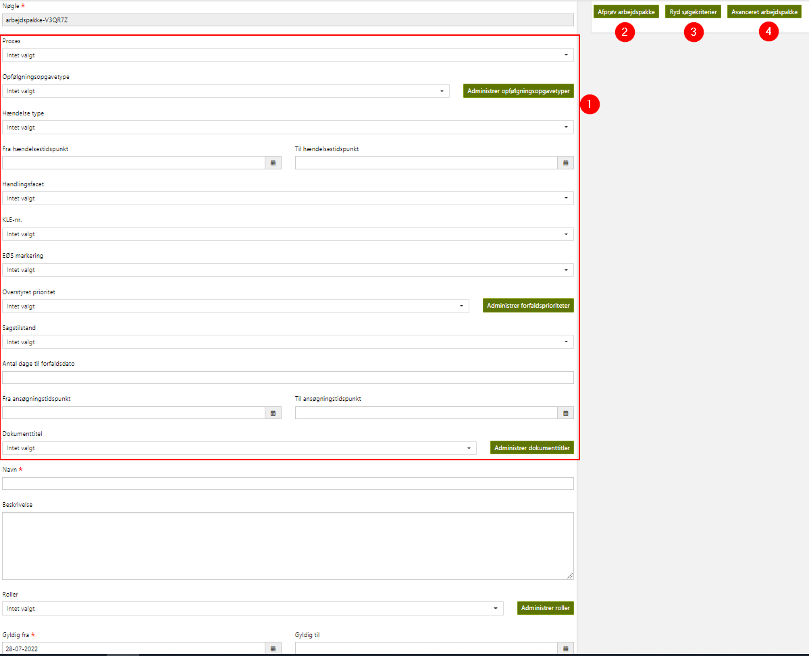
<h5>Figure 1: Create task filter example from FY</h5>
</div>

| Footnote | Description                                                                                                                                                                                        |
|----------|----------------------------------------------------------------------------------------------------------------------------------------------------------------------------------------------------|
| 1        | Different attributes that will be converted to SQL query. E.g., the task must be of a specific type, it must contain cases of certain case numbers, the cases must be of a specific status, … etc. |
| 2        | Testing of a new task filter                                                                                                                                                                       |
| 3        | Clear search criteria                                                                                                                                                                              |
| 4        | Convert to advanced task filter, i.e., writing the SQL query manually.                                                                                                                             |

# Introduction to the subject

The task filter component is divided into three parts:

1. Service layer – Contains the data model, interfaces, and their implementations. These are the services that the batch
   job and the user interface share. The service layer provides the interface on which the admin and batch layer
   interacts with the system. This is also the configurable layer of the system where individual projects can modify
   certain aspects of the behavior.
2. Admin layer – Contains an implementation of the task filter system parameter controller, the security roles required
   to act within the controller, as well as the resources for the view and the underlying JavaScript. It is responsible
   for allowing additions and changes to task filters within the system. The system parameter controller allows for
   advanced functionality when creating and editing task filters to be defined. This is described
   in [Admin layer](#Admin-layer).
3. Batch job – The batch job which is responsible for continuously updating work packages in the system. This will be
   elaborated further upon in [Service layer](#Service-layer).

This component introduces no new third-party libraries or concepts to be aware of.

# Usage

The general usage for the task filter component is creating task filters through the administration system, which are
being run by the continuous scheduling of the task filter job creating arbejdspakke_opgave’s. These are utilized by the
task tray, and therefore the task filter component should be seen as the backend for the task tray. This component is
described in [DD130 - Task Tray](/DD130-Detailed-Design/Task-tray).

## Creating task filters

This section goes through the process of creating a new task filter through the administration tab, both using the
simple view or switching to the advanced view.

<div style="text-align: center;">

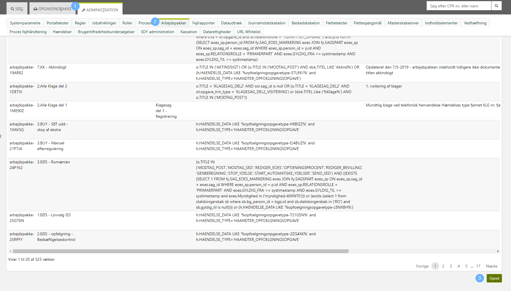
<h5>Figure 2: Navigate to the task filter tab in the administrative system and click the ‘create’ button to start the
creation of a new filter.</h5>
</div>
&nbsp

<div style="text-align: center;">

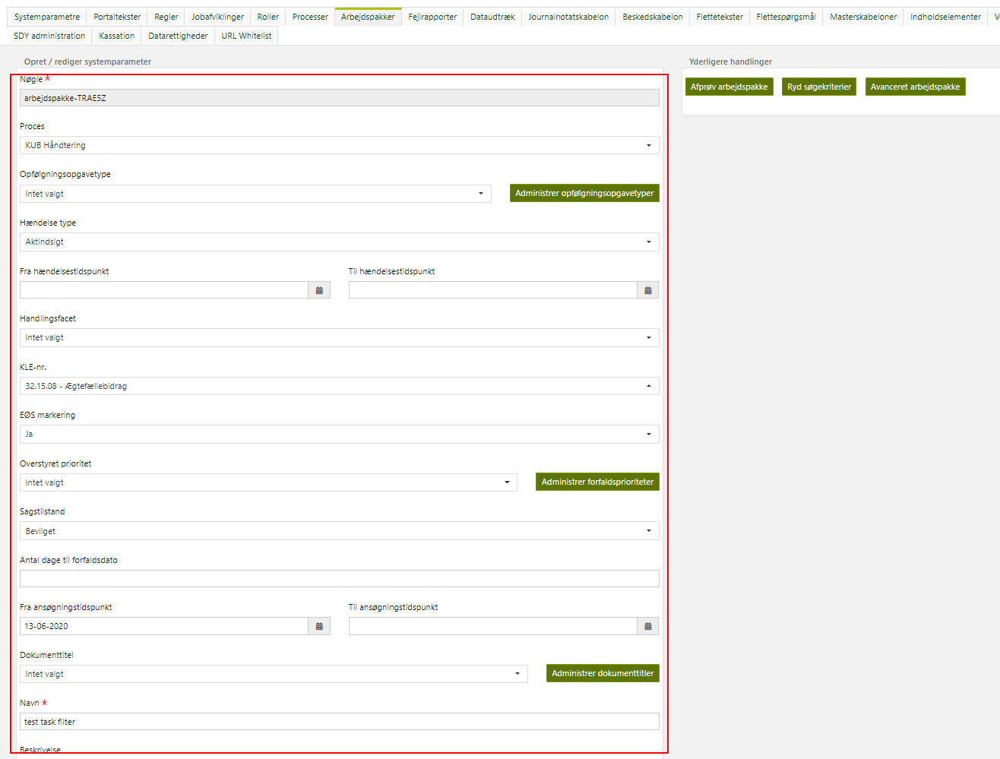
<h5>Figure 3: Filling out the simple fields defining the filter</h5>
</div>
&nbsp

<div style="text-align: center;">

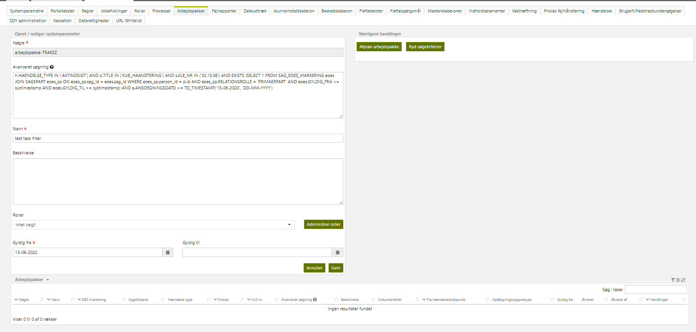
<h5>Figure 4: Alternatively, swapping to the advanced view to write the query yourself. The query is an appendix to the
base
query defined by the ArbejdspakkeService.</h5>
</div>
&nbsp

<div style="text-align: center;">

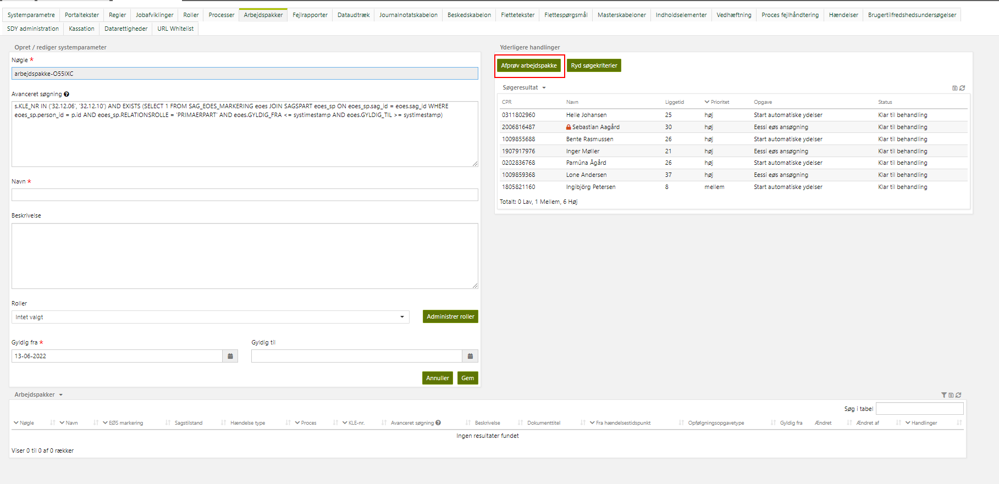
<h5>Figure 5: The new task filter can be tested by using the additional task which will show the result</h5>
</div>

## Running the task filter job

The task filter job should run continuously throughout the workday and automatically execute all task filters in the
system. See [Database patches](#Database-patches) for SQL patches to create and configure the job. It can be scheduled
manually through the batch interface if it does not automatically in your system already:

<div style="text-align: center;">

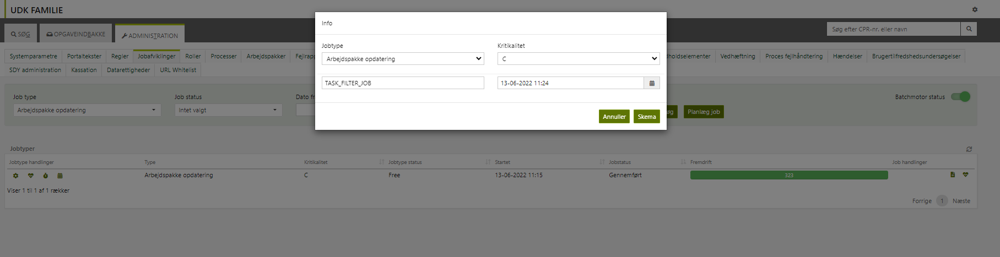
</div>

The job creates a job task for every task filter, and the report outputs the time it took to execute the filter, and the
number of task_filter_process(s) were created as a result:

<div style="text-align: center;">

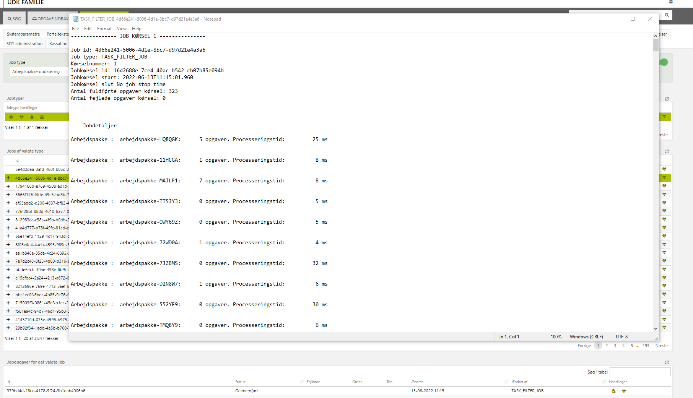
</div>

## Utilization of batch job product

The task tray component utilizes the task_filter_process data created by the batch job.
See [DD130 - Task Tray](/DD130-Detailed-Design/Task-tray) for more information on this.

# Service layer

The service layer sets up the interfaces that the admin controller and the batch job interact through, and the data
model which they modify.

The data model objects crucial to the task filter component are the system parameter tables (
covered
in [DD130 - System Parameter](https://source.netcompany.com/tfs/Netcompany02/NF4J/_wiki/wikis/Documentation/5125/System-parameter)),
and the ArbejdspakkeOpgave (task filter
task) table introduced by this service
layer. System parameters are created and configured through the admin controller and are read by the batch job.
ArbejdspakkeOpgave’s is the product of the batch job which are utilized by the task tray component described
in [DD130 - Task Tray](/DD130-Detailed-Design/Task-tray).

The interfaces defined in this layer of the component are the ArbejdspakkeService, PrioritetService, and
SystemparameterArbejdspakkeExtraService.

- ArbejdspakkeService exposes the basic functions that are used to retrieve the task filters for processing, showing
  them on the task tray, updating their content, converting from simple to advanced search, etc. Standard
  implementations for most of the functions are included in an ArbejdspakkeServiceAbstract, but the projects must extend
  this and implement some methods themselves. See [Defining project specific queries](#Defining-project-specific-queries) for
  further details on this.
- PrioritetService is the interface that allows the component to prioritize the tasks created by the task filter in
  multiple ways, such as based on the task priority, but also based on attributes such as the due date.
- The SystemparameterArbejdspakkeExtraService is the interface used by the admin controller to add additional fields to
  task filters, and to specify the validation required when creating or configuring task filters.
  See [Customizing administration](#Customizing-administration) for further details.

# Admin layer

The admin layer defines the system parameter controller and the front fragments for the task filter specific
functionality. Examples of such functionality is testing a new task filter or switching to advanced mode where the user
writes the task filter query themselves via SQL code.

<div style="text-align: center;">

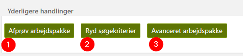
<h5>Figure 6: Examples of specific functionality</h5>
</div>

| Footnote | Description                                    |
|----------|------------------------------------------------|
| 1        | Testing the task filter.                       |
| 2        | Clearing the search criteria added in the form |
| 3        | Switching to advanced mode                     |

## Testing a task filter

One of the task filter specific functionalities that Amplio adds per default is the option to test a newly written or
modified task filter. The current form is initially validated by the same criteria as if it were to be saved. If it
passes the validation checks the query is run and a resulting table containing the results is built and added to the
model:

```java
@RequestMapping(value = "admin/systemparameter/testArbejdspakke", method = RequestMethod.POST)
public String testArbejdspakke(HttpServletRequest request, Model model, @Valid @ModelAttribute(COMMAND)
SystemparameterMutable form, BindingResult result) {
    frontSystemparameterService.initAndValidateForm(form, result);
    if (result.hasErrors()) {
        return frontSystemparameterService.invalidForm(model, request, form);
    } else {
        sendArbejdspakkeQuery(model, form);
        frontSystemparameterService.setModel(request, model, form.getType(), form.getNoegle(), form.getVaerdierAsMap());
        return ADMIN_SYSTEMPARAMETER_CREATE_EDIT_HTML;
    }
}

private void sendArbejdspakkeQuery(Model model, Systemparameter form) {
// Create table from max 20 opgave results and generate statistics
    try {
        model.addAttribute(QUERYRESULT, generateOpgaveTable(arbejdspakkeService.getOpgaveListOpenStatus(form, 20),
                arbejdspakkeService.getPriorityStatistics(form)));
    } catch (Exception e) {
        String message;

        // In case there is a SQL grammar exception nested, use that message instead
        Optional<Throwable> grammarOptional = Throwables.getCausalChain(e).stream().filter(throwable -> throwable instanceof SQLSyntaxErrorException).findFirst();
        message = grammarOptional.map(Throwable::getMessage).orElseGet(e::getMessage);
        if (logger.isWarnEnabled()) {
            logger.warn("The testArbejdspakke query failed to execute with the following message: " + e.getMessage(), e);
        }
        model.addAttribute(RAW_ERROR_MSG, tekstService.getTekst("fagsystem.administration.systemparameter.arbejdspakke.error").getPrimaertekst() + ": " + message);
    }

}
```

This table is then shown to the user such that they can validate their task filter:

```html
<div class="row">
    <div class="col-xs-12" id="testResultatTabel">
        <div class="block">
            <th:block th:include="/table/fragments/table.html :: table(${queryresult})"/>
        </div>
    </div>
</div>
```

<div style="text-align: center;">

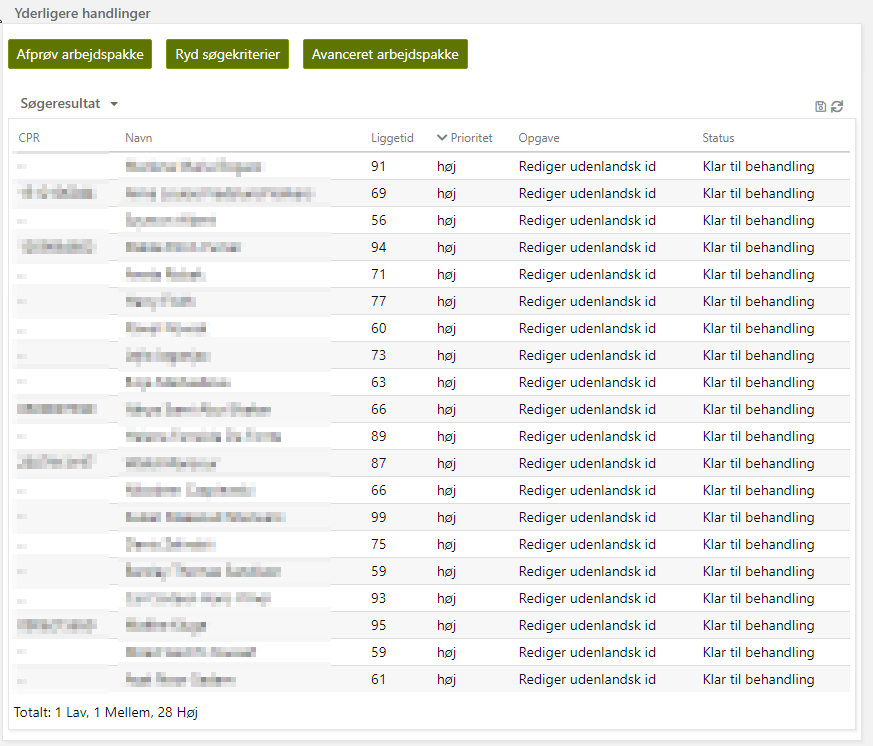
<h5>Figure 7: Task filter test result table example</h5>
</div>

## Clearing search criteria

The second additional task filter function that Amplio implements per default clears all the current search criteria
added to the task filter and resets the view back to simple form (as opposed to advanced mode). It does not clear any
additional information on the system parameter such as name, description, validity periods, or security roles required.

## Advanced mode

The last task filter function that Amplio implements per default is the option to switch to advanced mode. This allows
an end user to define the task filter using by writing the SQL query directly, as opposed to using the simple view to
specify specific properties in a simpler way.

An end user can start filling out a task filter using the simple mode and convert that to advanced mode midway through.
It is the projects responsibility to handle the conversion from simple to advanced queries. This is done by implementing
the convertSimpleToAdvancedSearch method.

This method retrieves the current input on the form and goes through each field which it then converts to SQL syntax.
E.g.:

```java
case ARBEJDSGANG:
    advancedSearch.append("o.TITLE IN ").append(constructValueString(Arrays.stream(entrySet.getValue().split(";")).map(OpgaveType::fromDbTitle).map(OpgaveType::getName).collect(Collectors.toList())));
    entrySet.setValue("");
    currentCount++;
    break;
case HAENDELSESTYPE:
    advancedSearch.append("h.HAENDELSE_TYPE IN ").append(constructValueString(Arrays.stream(entrySet.getValue().split(";")).map(HaendelseType::fromValue).map(HaendelseType::getName).collect(Collectors.toList())));
    entrySet.setValue("");
    currentCount++;
    break;
case HAENDELSETIDSPUNKTFRA:
    //…
```

# Task filter batch job

The task filter batch job is a simple, but important job of the system. It iterates through all the task filters of the
system, executes the defined queries, and updates the task filter groups with the new tasks and removes old tasks that
are no longer found by the filter, usually because they have been processed.

The job should be configured to run often, as defined in the patch in [Database patches](#Database-patches), where it is
configured to run every
15 minutes through the working hours. The reasoning behind this is that the work packages generated by the task filter
job needs to be kept up to date for the case workers as they work throughout the day but are unnecessary to update
outside of working hours.

Additionally, the
job is idempotent and is thus allowed to be run even though the previous instance failed. It is however recommended to
monitor the job with alarms to catch if it fails.

If you need an introduction to batch jobs in general read [DD130 - Batch Engine](/DD130-Detailed-Design/Batch-engine).

It is important for the projects to ensure that task filters are written with high quality, especially the advanced
query entries, as the task filter job runs often and thus must perform at a certain level. If the filters are not
properly optimized it can be damaging for the batch jobs performance, and certain high importance tasks for the project
are not caught as fast as they should. A good indicator of troublesome task filters is a spiky pattern on the DB CPU
during idle times. That indicates task filter each 15 minutes is hammering the db.

## Read phase

The batch jobs fetches all task filter system parameter keys in the database and makes one batch item for each key.

## Processing phase

The batch job runs through the keys that need to be updated and update the content of the system parameter having that key and remove the cache for counting task filter size of that key.

## On completed phase

The batch job will reach this phase only if the previous processing phase is completed successfully. This phase includes a tasklet step that will update task_filter_process table and
remove the cache for counting the size of undefined/deleted task filters.

## Extended batch report

When the task filter job performs badly it is usually because of a poorly written task filter being run. To help isolate
the problem, the batch report has been extended to provide information about every task filter run by the job. The
report lists the keys of every task filter, along with the time it took to execute it and the tasks it created.

This is done by adding a reporting detail to every item at the end of the processing step:

```java
try {
    //… running the query …
} catch (Exception e) { // aught to be PersistenceException, but our nasty exception interceptors wraps it in a netcompany.common.exceptionhandling.CoreException
    LOGGER.error("Error during processing arbejdspakke with key: {}", arbejdspakkeSystemparameterKey, e);
    item.addReportingDetail(new ReportingDetail(
        false,
        ReportingDetail.DataType.STRING,
        "Arbejdspakke",
        String.format("%20s: fejlede i processering kl , %s med fejl %s", arbejdspakkeSystemparameterKey, TimeFactory.getDateTime().toString(), getRootCauseMessage(e))));
    return item;
}
item.addReportingDetail(new ReportingDetail(
    false,
    ReportingDetail.DataType.STRING,
    "Arbejdspakke",
    String.format("%20s: %6d opgaver. Processeringstid: %10d ms", arbejdspakkeSystemparameterKey, count, (TimeFactory.getCurrentTimeMillis() - t))));

return item;
```

This creates a batch report like this:

<div style="text-align: center;">

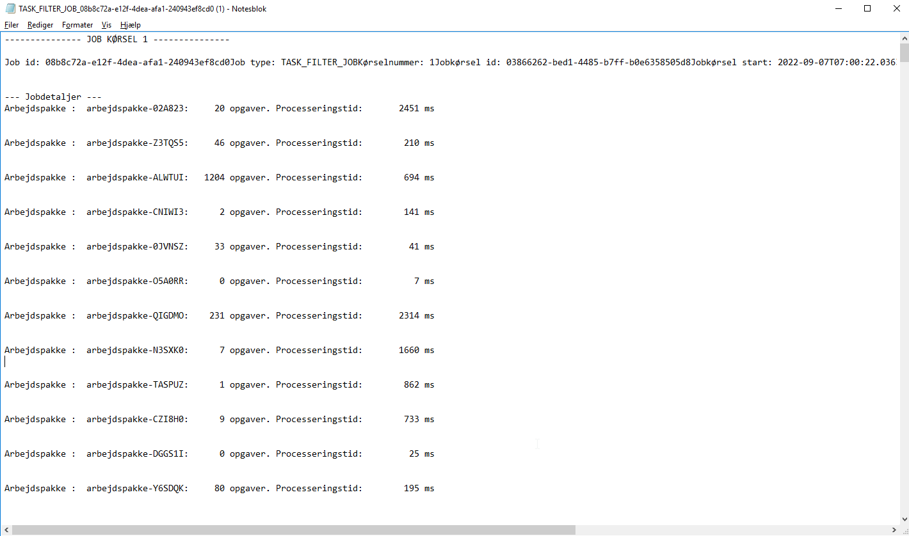
<h5>Figure 8: Extended batch report</h5>
</div>

# Configurations and service extensions

This section will define how to set up the component and what component requirements come along.

## Code integration

Code integration for the Task Filter component.

### Customizing administration

An extra service SystemparameterArbejdspakkeExtraService is added for the task filter system parameter. This service
allows the user to override the general system parameter validation performed when submitting an instance, as well as
defines the view for the extra buttons (testing, switching to advanced, and clearing criteria). It can also be used to
specify certain access roles reading and writing to the parameter.

It is possible to add an additional controller to the frontend calls a project introduces in its .html. Additional view
fragments or elements can be added to support the extended API functionality by overwriting the getExtraFieldsView()
method from the SystemparameterArbejdspakkeExtraService.
See [DD130 - System Parameter](https://source.netcompany.com/tfs/Netcompany02/NF4J/_wiki/wikis/Documentation/5125/System-parameter)
for details about the
ExtraService concept.

Extending SystemparameterArbejdspakkeExtraService is done when a project wants to customize some of the base
functionality. E.g., setting access rights or changing the validation being done when creating new task filters. When
extending the SystemparameterArbejdspakkeExtraService, it is important to specify the service name and mark the
extension as the primary. E.g.:

```java
package atp.fy.fagsystem.service.systemparameter.arbejdspakke;

import nc.modulus.ydelse.common.security.SecurityRole;
import nc.modulus.ydelse.taskfilter.security.TaskFilterSecurityRole;
import nc.modulus.ydelse.taskfilter.service.SystemparameterArbejdspakkeExtraServiceImpl;
import org.springframework.context.annotation.Primary;
import org.springframework.stereotype.Service;

@Primary
@Service(value = "systemparameterArbejdspakkeExtraServiceImpl")
public class FySystemparameterArbejdspakkeExtraServiceImpl extends SystemparameterArbejdspakkeExtraServiceImpl {
    //implementation...
}
```

When additional SystemParameterAttributes are added to allow for non-SQL native resources to add task filters, it is
important to remember to update the .JS file with triggers when swapping to advanced view. E.g.:

```javascript
/**
 * Function for showing/hiding the correct fields when arbejdspakke advanced search is triggered
 * @param advancedSearch - boolean used to determine which fields to hide or display
 */
function triggerArbejdspakkeAdvancedSearch(advancedSearch) {
    if (advancedSearch) {
        $('#avanceretArbejdspakkeBtn').hide();
    } else {
        $('#avanceretArbejdspakkeBtn').show();
    }
    // Toggle search rows to be shown depending on basic/advanced search
    $('#atp-types-OpgaveType').closest('.row').toggle(!advancedSearch);
    $('#atp-types-HaendelseType').closest('.row').toggle(!advancedSearch);
    $('#haendelsestidspunktFra').closest('.row').toggle(!advancedSearch);
    $('#haendelsestidspunktTil').closest('.row').toggle(!advancedSearch);
}
```

When adding these additional attributes, the convertSimpleToAdvancedSearch() method from the ArbejdspakkeService should
be adapted accordingly. This method is invoked whenever a user swaps from the simple interface to advanced, or when a
simple task filter configuration is run by the batch job. The method should convert all the fields added in the simple
view to a valid SQL query that can be run by the application.

Below an example of converting the ‘ansoegningstidspunktFra’ attribute from simple to advanced can be seen.

```java
if ((ansoegningstidspunktFra != null || ansoegningstidspunktTil != null) && !advancedSearch.toString().endsWith(and))
    advancedSearch.append(and);

// Ansoegningstidspunkt interval - if both dates are set treat them as an interval, otherwise append the query independently
if (ansoegningstidspunktFra != null && ansoegningstidspunktTil != null) {
    advancedSearch.append("a.ANSOEGNINGSDATO >= TO_TIMESTAMP('").append(ansoegningstidspunktFra).append(dateformat).append(" AND a.ANSOEGNINGSDATO <= TO_TIMESTAMP('").append(ansoegningstidspunktTil).append(dateformat);
} else {
    if (ansoegningstidspunktFra != null) {
        advancedSearch.append("a.ANSOEGNINGSDATO >= TO_TIMESTAMP('").append(ansoegningstidspunktFra).append(dateformat);
    } else if (ansoegningstidspunktTil != null) {
        advancedSearch.append("a.ANSOEGNINGSDATO <= TO_TIMESTAMP('").append(ansoegningstidspunktTil).append(dateformat);
    }
}
```

## Defining project specific queries

The same endpoints are available as for every system parameter, which is elaborated upon
in [DD130 - System Parameter](https://source.netcompany.com/tfs/Netcompany02/NF4J/_wiki/wikis/Documentation/5125/System-parameter).
Aside from the basic endpoints used in any system parameter type, the task filter also implements testing, clearing
search criteria, and switching to advanced. All of these are implemented and added through Amplio, with no configuration
needed.

The task filter batch job is not customizable, but the service layer is. This is the part of the component that projects
must implement and configure. The minimal implementation for the service must implement the following methods:

- `getBaseQuery()` – Return a SQL query for all task filters which joins necessary tables to support all the attributes
  used in the query defined by the base select or the attributes added locally in the project.
- `getOpgaveWhere()` – Basic where clause included for all task filters.
- `convertSimpleToAdvancedSearch()` - Each project shall define its own UI form to create task filters. This method
  shall
  convert the form data into a SQL query that the task builder can run.

Examples of base implementations of these can be found in the Amplio reference app and in live Amplio projects such as
FY and PE.

Reference app example:

```java
@Service
@Transactional
public class ArbejdspakkeServiceImpl extends AbstractArbejdspakkeService {

    private static final String ARBEJDSPAKKE_BASE_QUERY = " FROM OPGAVE o";

    private static final String ARBEJDSPAKKE_WHERE_OPGAVE_FILTER = " WHERE o.status = 'manuel'";

    @Override
    public String getBaseQuery() {
        return ARBEJDSPAKKE_BASE_QUERY;
    }

    @Override
    public String getOpgaveWhere() {
        return ARBEJDSPAKKE_WHERE_OPGAVE_FILTER;
    }

    @Override
    public String convertSimpleToAdvancedSearch(Systemparameter arbejdspakke) {
        return "";
    }

}
```

## Configurable settings

To expand the simple configuration SystemParameterAttributes should be added to the SystemParameterType, and as
described in the previous section the convertSimpleToAdvancedSearch() method should be adapted accordingly, as well as
the trigger JavaScript going from simple to advanced view. E.g., on FY all the fields in the red square below are
additional attributes added to allow less advanced users to configure task filters:

<div style="text-align: center;">

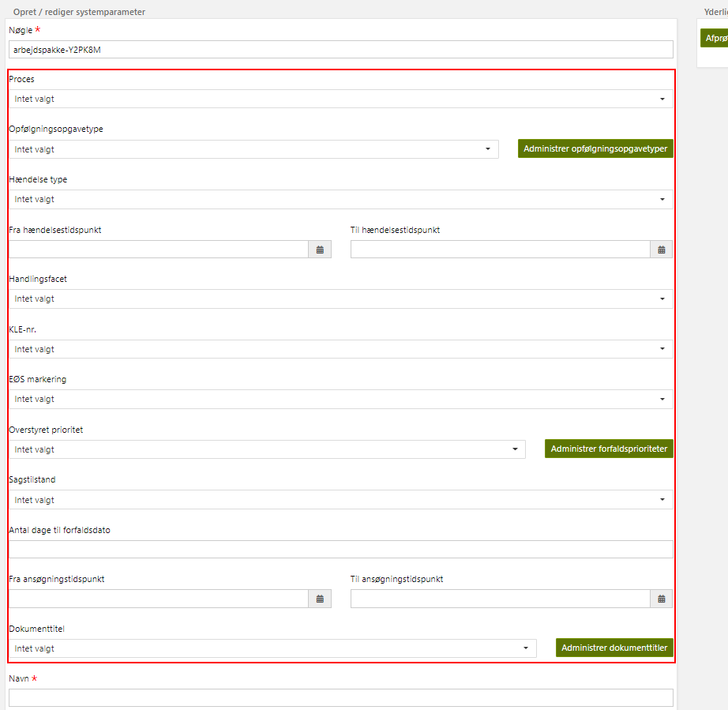
<h5>Figure 9: Create/edit system parameter example</h5>
</div>

These additional attributes are also present in the patch in the Amplio reference application ‘param_definitions.sql’.

## Roles and rights

To add new task filters, or modify existing, the user needs the ADM_ARBPAKKE_WRITE security role. This is annotated in
the SystemparameterArbejdspakkeController. Thus, the basic write access, ADM_SYSTEMPARAMETRE, is not sufficient to add
or modify task filters.

It is important that customers that gain this access right are competent at writing efficient SQL queries, or that the
project has a procedure for monitoring/reviewing the task filters.

## Database patches

There are two required types of database patches, the ARBEJDSPAKKE_OPGAVE table and then the actual systemparameter
instances representing task filters. The data model is described in [Data model](#Data-model).

### ARBEJDSPAKKE_OPGAVE

Patches needed to create the task filter job and the ARBEJDSPAKKE_OPGAVE can be found in the reference application.
Search for terms “create table ARBEJDSPAKKE_OPGAVE” and “Navn = ‘TaskFilterJob’”.

### Task filter instances (system parameters)

These will vary based on the project, but an example is included here from the Amplio reference application.

To locate latest code example in the reference application in Amplio, search for the parameter_type with id
'22bb2704-1164-436d-9665-cb0672992540', if that fails you can find the id using the key 'arbejdspakke'.

Amplio reference application example:

```sql
ALTER TABLE PARAMETER_VALUE DISABLE CONSTRAINT FK_PARAMETERVAER_PARAMETERINST
    /
    INSERT ALL
    WHEN (c < 1) THEN
    INTO PARAMETER_INSTANCE (ID, PARAMETER_TYPE_ID, KEY, START_DATE, CREATED, CREATED_BY, CHANGED, CHANGED_BY)
    VALUES ('793d8c16-a38d-4125-a95a-c46a03600077', '3455722a-k213-2a34-402b-2f346741vf9j', 'arbejdspakke-7T4KME', TO_DATE('2000-01-01', 'YYYY-MM-DD'), SYSTIMESTAMP, 'STAMDATA', SYSTIMESTAMP, 'STAMDATA')
    INTO PARAMETER_VALUE (ID, PARAMETER_INSTANCE_ID, PARAMETER_ATTRIBUTE_ID, VALUE, CREATED, CREATED_BY, CHANGED, CHANGED_BY)
    VALUES ('45f41029-12cd-4a69-8c02-fac36b15992c', '793d8c16-a38d-4125-a95a-c46a03600077', '63478nv4-256h-84df-9j26-4t233q568r7f', 'h.haendelse_type = ''REDIGER_MANUEL_BEVILLING_BOT_BUY'' AND h.ansoegning_id IS NOT NULL AND EXISTS (SELECT 1 FROM ANSOEGNING a WHERE a.id = h.ansoegning_id AND a.flow_type IN (''aftale'', ''afgoerelse'', ''flytning''))', SYSTIMESTAMP, 'STAMDATA', SYSTIMESTAMP, 'STAMDATA')
    INTO PARAMETER_VALUE (ID, PARAMETER_INSTANCE_ID, PARAMETER_ATTRIBUTE_ID, VALUE, CREATED, CREATED_BY, CHANGED, CHANGED_BY)
    VALUES ('5771260e-09b5-46d1-97d9-cb618ed5f351', '793d8c16-a38d-4125-a95a-c46a03600077', '63478nv4-256h-84df-9j26-3k57f7ss54zq', 'true', SYSTIMESTAMP, 'STAMDATA', SYSTIMESTAMP, 'STAMDATA')
    INTO PARAMETER_VALUE (ID, PARAMETER_INSTANCE_ID, PARAMETER_ATTRIBUTE_ID, VALUE, CREATED, CREATED_BY, CHANGED, CHANGED_BY)
    VALUES ('f34f0c8e-362b-4a85-b27d-56e493acb21f', '793d8c16-a38d-4125-a95a-c46a03600077', '63478nv4-256h-84df-9j26-5343h52506k5', 'Fremsøger åbne Rediger Manuel Bevilling opgaver der er startet pba. aftale/afgørelse/flytning selvbetjeningsflows på børn der har manuelt bevilgede BUY sager.', SYSTIMESTAMP, 'STAMDATA', SYSTIMESTAMP, 'STAMDATA')
    INTO PARAMETER_VALUE (ID, PARAMETER_INSTANCE_ID, PARAMETER_ATTRIBUTE_ID, VALUE, CREATED, CREATED_BY, CHANGED, CHANGED_BY)
    VALUES ('c54dd7ab-e1ae-461e-93c7-18b9354b4372', '793d8c16-a38d-4125-a95a-c46a03600077', '63478nv4-256h-84df-9j26-7c8457jh399d', 'Rediger BUY fra aftale/afgoerelse/flytning', SYSTIMESTAMP, 'STAMDATA', SYSTIMESTAMP, 'STAMDATA')
SELECT COUNT(*) AS c
FROM PARAMETER_INSTANCE
WHERE KEY = 'arbejdspakke-7T4KME'
  AND PARAMETER_TYPE_ID = '3455722a-k213-2a34-402b-2f346741vf9j'
    /

-- DO NOT REMOVE
ALTER TABLE PARAMETER_VALUE ENABLE CONSTRAINT FK_PARAMETERVAER_PARAMETERINST
    /
```


# Component model

The task filter module consists of three components, task-filter-service, task-filter-batch, and task-filter-admin. Both
the batch and admin components have dependencies to the service component. The batch layer utilizes the
arbejdspakkeService defined in the service layer to both read the task filters in, and to update the remainder content
once it has executed the task filter. The admin layer also utilizes the arbejdspakkeService, but to convert from the
filter from simple to advanced search, and to test the task filters.

## task-filter-service

<div style="text-align: center;">

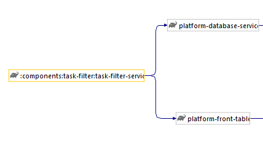
</div>

## task-filter-batch

<div style="text-align: center;">

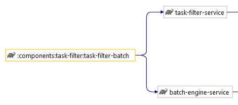
</div>

## task-filter-admin

<div style="text-align: center;">

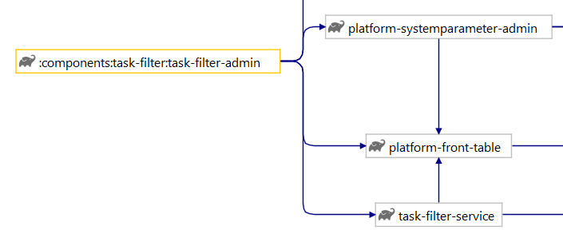
</div>

# Data model

The entire task filter module is contained within the system parameter data model
from [DD130 - System Parameter](https://source.netcompany.com/tfs/Netcompany02/NF4J/_wiki/wikis/Documentation/5125/System-parameter).

Task filter is a type, additional search parameters are added as attributes, every filter itself is an instance, and the
attributes for every instance are values.

<div style="text-align: center;">

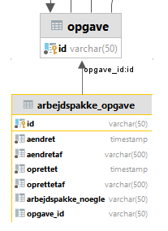
<h5>Figure 10: ArbejdspakkeOpgave data model</h5>
</div>

The data model for ArbejdspakkeOpgave is quite simple and lightweight. It contains a unique identifier, the task filter
key (arbejdspakke_noegle) for which it was found, and the task id (opgave_id). The model can be seen in Figure 10.

# FAQ

**If your project implemented the task filter component and found any troubleshooting tips, or questions that you have
answered during implementation, then please add them here.**

## CPU spikes on business application servers

A common issue is adding poorly optimized queries to task filters. These will then be run repeatedly, and often on
massive amounts of data. This can result in CPU usage spikes. If a project sees spikes in their CPU usage that fits the
CRON-expression of their task filter job, the task filter job report should be reviewed, and task filter outliers should
be identified and dealt with.

The task filter job report is described further in [Extended batch report](#Extended-batch-report).