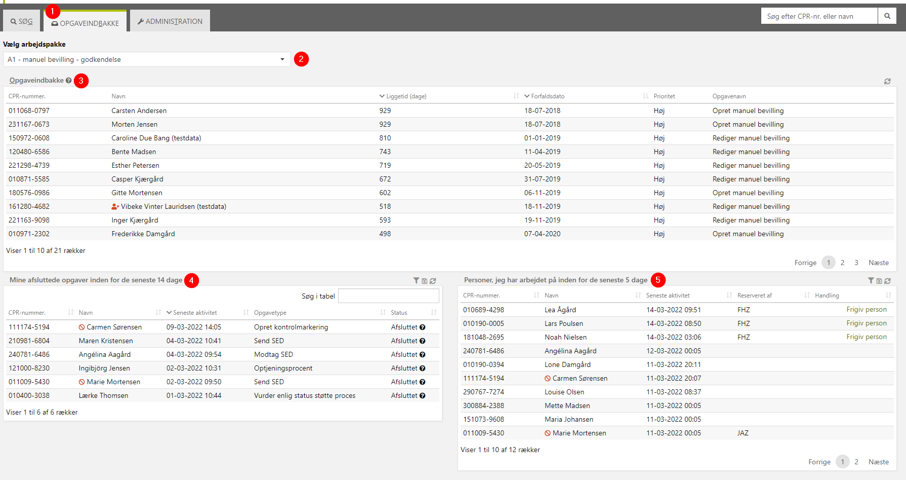
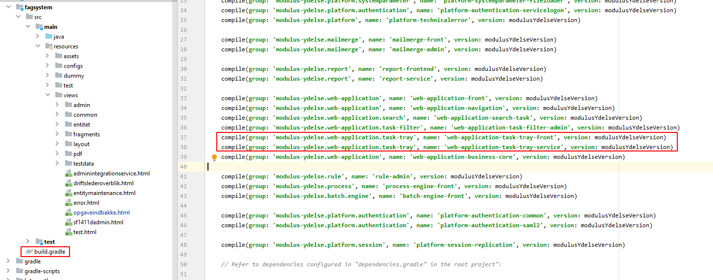
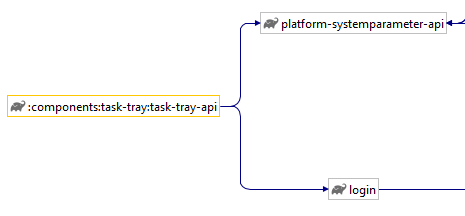
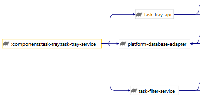
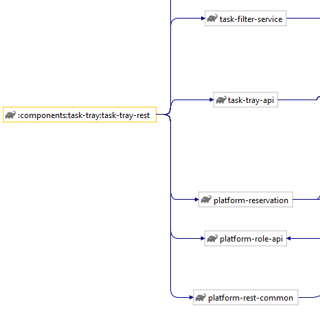
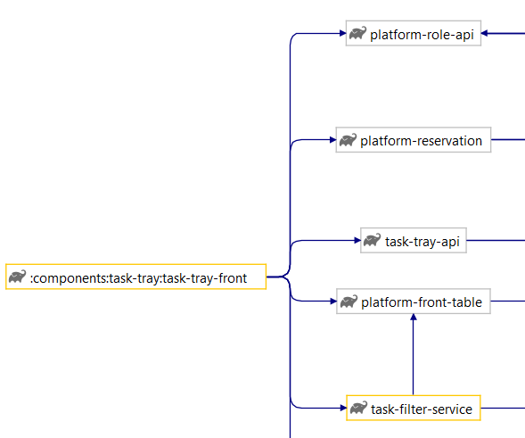
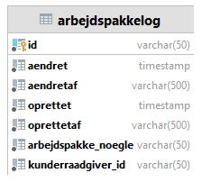
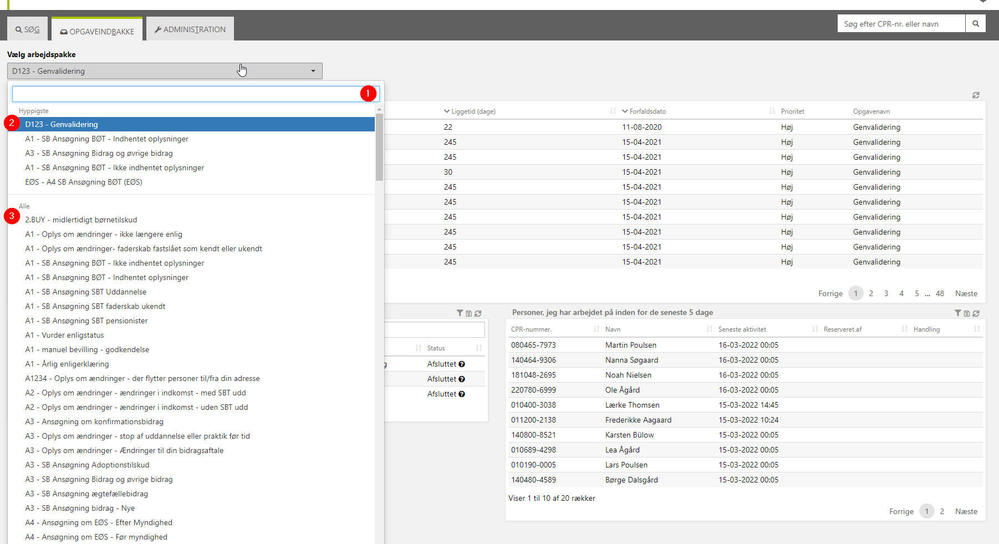

# References

| Reference                                                 | Title               | Author         |
|-----------------------------------------------------------|---------------------|----------------|
| [DD130 - Task Filter](/DD130-Detailed-Design/Task-filter) | DD130 - Task Filter | Netcompany A/S |

# Introduction

The task tray (also known as ‘Opgaveindbakke’) module is the component that takes advantage of the work accomplished by
the task filter module and job as described in [DD130 - Task Filter](/DD130-Detailed-Design/Task-filter). It is a core
part of the system as it gives the
case workers their tasks to work on and is often configured as the main page of the system.

## Target audience

The target audience of this document are developers on projects, and on MY, tasked with either implementing the Task
Tray module on their own project or making generic changes to the module in MY. This document is also relevant for
testers looking for additional insight into the component for testing purposes.

## Purpose

The purpose of the task tray module is to provide the case workers with lists of tasks for them to work on, defined by
system end users, as well as tasks they have previously completed or entities they have recently worked on. In
cooperation with the task filter module, the task tray consistently updates its list of tasks throughout the day such
that the case workers always have tasks to handle.

## Background information

It is highly recommended that the reader is familiar with the Task Filter module and how it functions within the system.
This is detailed in [DD130 - Task Filter](/DD130-Detailed-Design/Task-filter).

# High level description of the component

The task tray is a major, and often critical, component of the Fagsystem. It provides the case workers with their lists
of tasks to handle throughout their workday, as well as highlight and prioritize the more important tasks.
The lists are defined by end users of the system through the task filter component described
in [DD130 - Task Filter](/DD130-Detailed-Design/Task-filter).

<div style="text-align: center;">


<h5>Figure 1: Task tray example from FY</h5>
</div>
&nbsp

| Footnote | Description                                                                                                                                                            |
|----------|------------------------------------------------------------------------------------------------------------------------------------------------------------------------|
| 1        | The task tray tab. Often the default page of the Fagsystem.                                                                                                            |
| 2        | Dropdown of available task filters to show on the task tray. The tasks contained in these lists are built by the task filter batch job and updated throughout the day. |
| 3        | The task tray for the currently chosen task filter that shows all the available tasks. Clicking a row takes the user to the task on the entity overview.               |
| 4        | Table of recently completed tasks by the user.                                                                                                                         |
| 5        | Table of people the user has recently worked on.                                                                                                                       |

# Introduction to the subject

The task tray component consists of 4 sub-components, two of which encompass the same responsibility but for Thymeleaf
and React technologies respectively.

1. **API layer** – Defines the data model of the component, as well as the interfaces of the services to be implemented,
   and important constants used throughout the component.
2. **Service layer** – Implements the interface defined by the API layer, to be used by the front. It is responsible for
   registering new entries to the task tray log as well.
3. **Front/Rest layer** – Defines the controller level of the component in their respective technologies, as the tables
   shown on the component.

Regarding technologies and dependencies, the only noteworthy points are that the component is dependent on the task
filter component, and the front is divided into the sub-components of front and rest for Thymeleaf and React
respectively.

# API layer

The API layer sets up the data model which the component modifies, and the interfaces utilized by the front/rest layer.

The data model crucial to this component is the ArbejdspakkeOpgave created by the Task Filter batch
job ([DD130 - Task Filter](/DD130-Detailed-Design/Task-filter)), alongside the Arbejdspakkelog introduced in this layer. The Arbejdspakkelog logs which
workpackages are being accessed by which end-users.

The interfaces defined by the API layer are the ArbejdspakkelogService, and TaskTrayService.
ArbejdspakkelogService is used to perform actions related to the Arbejdspakkelog table, such as finding the most
frequented work packages, or adding entries to the table.

TaskTrayService is used to retrieve the data that is to be displayed on the task tray from the ArbejdspakkeOpgave table.

# Service layer

The service layer is simply the configuration required when adding the task tray component to a system, alongside an
implementation of the ArbejdspakkelogService that is meant to work out-of-the-box, and thus not needed to configure or
override.

# Front/rest layer

The front/rest layer defines the layout of the task tray, as well as implements the controller. The controller uses an
extendable service for performing its different tasks, such that it is overrideable and configurable. Examples of such
functionality is the work package options shown on the tray, and the order of columns on the tables shown on the page.

The controller is restricted by the security roles FS_OPGAVEINDBAKKE and FAG_WRITE.

# Configurations and service extensions

Using the task tray component requires very little setup. Firstly, the components must be included in the Gradle setup.
Only one of task-tray-front and task-tray-rest should be included, as they accomplish the same task but for Thymeleaf
and React respectively.

<div style="text-align: center;">


</div>

Next, the task tray component configurations must be included in the project. This is usually handled out-of-the-box by
the systems ComponentScan.
Finally, the task tray page should be added to the system. E.g.:

```html
<!DOCTYPE html>
<html layout:decorate="/layout/fagsystem_layout.html" th:with="textPrefix='fagsystem.opgaveindbakke.'"
      xmlns:th="http://www.thymeleaf.org" xmlns:layout="http://www.ultraq.net.nz/thymeleaf/layout">

<section layout:fragment="content">

    <div class="block" th:include="/tasktray/fragments/tasktray.html :: frag"/>

</section>

</html>
```

System parameters that should be added are:

- Table page limit for the task tray ‘ubehandledeTable’. This is optional and the default value is currently 20.
- System constant ‘opgaveindbakke_pagination’ that specifies if the task tray allows paging.
- ‘opgaveindbakke_refresh_interval’ that specifies the refresh interval by the rest component.

These parameters can be added with the following patch:

```sql
create_parameterinstans(‘system_constant’, 'opgaveindbakke_pagination', fromDate, toDate);
create_parametervaerdi(‘system_constant’, 'opgaveindbakke_pagination', 'description', 'slår paginering til eller fra på opgaveinbakken');
create_parametervaerdi(‘system_constant’, 'opgaveindbakke_pagination', 'value', 'Y');
create_parameterinstans(‘system_constant’, 'opgavepakke_refresh_interval', fromDate, toDate);
create_parametervaerdi(‘system_constant’, 'opgavepakke_refresh_interval', 'description', 'Denne værdi angiver intervallet (i sekunder) som opgaveindbakken opdateres med.');
create_parametervaerdi(‘system_constant’, 'opgavepakke_refresh_interval', 'value', '5');
```

## Task tray options

The task tray is by default separated by the most frequent task filters, and the full list of task filters. This is
handled by the getArbejdspakkerOptionList/getWorkpackagesList method in the service layer. It is possible to override
this method to fit the needs of the specific project, such as expanding the number of frequent tasks shown, or add
additional options. An example of this can be seen in Figure 3.

## Indexing Arbejdspakkelog

Finding the most frequent task filters is done by querying through the Arbejdspakkelog table, and for this reason it is
recommended to add indices to the table on both the task filter id, and the case worker id. E.g.:

```sql
CREATE INDEX IXFK_HyppigsteArbej_Arbejdspak ON ARBEJDSPAKKELOG(ARBEJDSPAKKE_NOEGLE ASC);
CREATE INDEX IXFK_HyppigsteArbe_Kunderaadgi ON ARBEJDSPAKKELOG(KUNDERRAADGIVER_ID ASC);
```

# Component model

The task tray module consists of four components, task-tray-api, task-tray-service, task-tray-rest, and task-tray-front.
All the components have dependencies to the api component.

Front and rest both cover the same functionality, but for Thymeleaf and React respectively. In the diagrams they both
use the spring-boot-starter-security library which has been omitted here.

## task-tray-api

<div style="text-align: center;">


</div>

## task-tray-service

<div style="text-align: center;">


</div>

## task-tray-rest

<div style="text-align: center;">


</div>

## task-tray-front

<div style="text-align: center;">


</div>

# Data model

The task tray introduces the table Arbejdspakkelog as seen in Figure 2 that is used to track whenever a case worker
switches the task filter on the task tray. It includes the basic entity fields, as well as the task filter key (
arbejdspakke_noegle), and the case worker id (kunderraadgiver_id).

<div style="text-align: center;">


<h5>Figure 2: Arbejdspakkelog table</h5>
</div>

Aside from this logging table, it relies heavily on the ArbejdspakkeOpgave table introduced by the task filter. This is
described in [DD130 - Task Filter](/DD130-Detailed-Design/Task-filter).

# Sitemap

The general sitemap for the task tray can be seen in Figure 1, whilst the sitemap for the task filter listing can be
seen in Figure 3.

<div style="text-align: center;">


<h5>Figure 3: Task filter list example</h5>
</div>
&nbsp

| Footnote | Description                                             |
|----------|---------------------------------------------------------|
| 1        | Search bar for task filters to display on the task tray |
| 2        | Most common task filters                                |
| 3        | Listing of all task filters                             |

# Troubleshooting

Please add FAQ’s / troubleshooting if you find any problem + solutions
