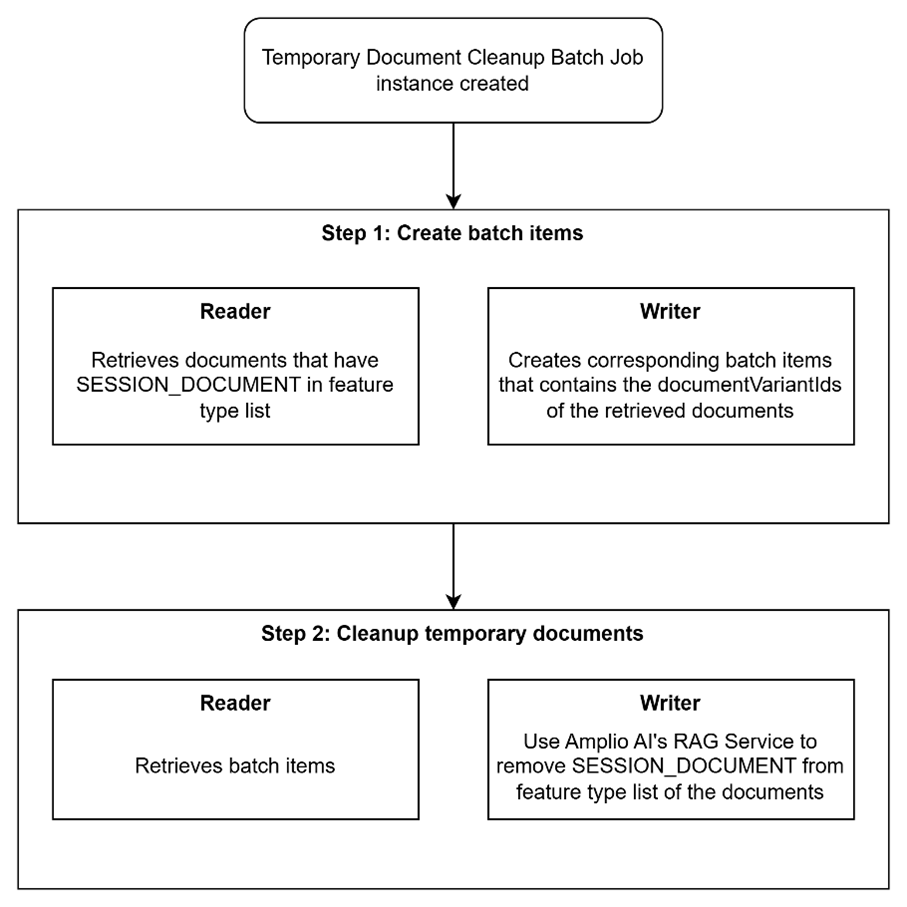
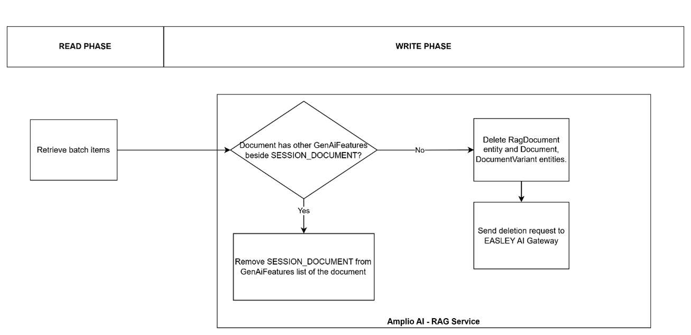

# References

| Reference                                                                                               | Title                                                     | Author     |
| ------------------------------------------------------------------------------------------------------- | --------------------------------------------------------- | ---------- |
| [D0180 – External Interface Design – EASLEY AI Integration](/D0180-External-Interface-Design/EASLEY-AI) | D0180 – External Interface Design – EASLEY AI Integration | Netcompany |
| [DD130 – Detailed Design – Amplio AI](/DD130-Detailed-Design/Amplio-AI)                                 | DD130 – Detailed Design – Amplio AI                       | Netcompany |
| [DD130 – Detailed Design – Virtual Assistant](/DD130-Detailed-Design/Virtual-Assistant)                 | DD130 – Detailed Design – Amplio AI – Virtual Assistant   | Netcompany |

# Introduction

This document provides the detailed design for Virtual Assistant's temporary document cleanup batch job.

## Target Audience

The target audience of this deliverable are:

* Developers who work on the Virtual Assistant feature on their projects that built on Amplio Java platform.
* Users of Amplio solutions

## Developer Requirements

To fully understand the content of this document, developers must meet the following requirements:

* Have read through Amplio AI and Virtual Assistant detailed design deliverables.
* Have a solid understanding of the Netcompany's Amplio Java framework.

## Background Information

### Session documents

* Session documents are temporary RAG documents created when users upload document files during Virtual Assistant chat sessions.
* These documents are marked as `SESSION_DOCUMENT` feature type.

### EASLEY AI Gateway Integration

RAG documents are stored in two locations:

* **Amplio local database:** please see [DD130 – Amplio AI](#references)
* **EASLEY AI Gateway:** External service stores the actual document embeddings for RAG retrieval.

Amplio projects interact with EASLEY AI Gateway via REST API for managing RAG documents which are stored in EASLEY AI Gateway's database. Please see [D0180 – External Interface Design – EASLEY AI](#references). The cleanup job must remove documents from both locations to ensure complete cleanup.

# Batch Job Overview

The RAG Document Cleanup Batch Job is responsible for automatically removing expired session documents from the system.

Session documents are temporary files uploaded by users during Virtual Assistant chat session for RAG (Retrieval Augmented Generation) context. These documents should be automatically cleaned up after a configurable retention period to:

* Maintain data hygiene and comply with data retention policies
* Free up storage in both the local database and the external EASLEY AI Gateway
* Ensure session specific documents don't persist beyond their intended lifecycle

The Virtual Assistant consists of a full batch job and service. The purpose of this batch job is to fetch all temporary documents (the documents that are uploaded within a chat session between user and Virtual Assistant) in the database and remove all these documents in both Amplio database and using Amplio AI's RAG service to interact with and remove the corresponding data which reside on EASLEY AI Gateway.

## Flow Diagram

*Figure 1: Workflow diagram of temporary document cleanup batch job*

**(Description of Flow):**

1. **Temporary Document Cleanup Batch Job instance created.**
2. **Step 1: Create batch items**
   * **Reader:** Retrieves documents that have `SESSION_DOCUMENT` in feature type list and were created before the computed cutoff time (`currentDate - retentionDay`).
   * **Writer:** Creates corresponding batch items (`BatchRagDocumentDto`) that contain the `documentVariantIds` of the retrieved documents.
3. **Step 2: Cleanup temporary documents**
   * **Reader:** Retrieves batch items.
   * **Writer:** Use Amplio AI's RAG Service to remove `SESSION_DOCUMENT` from feature type list of the documents.

# Steps

The Temporary Document Cleanup Batch Job has two sequential steps: creation step to create batch items and processing step to handle document cleanup operations.

## Step 1: create batch items

Query documents by feature type and a computed cutoff time, creates batch items from session documents that need to be cleaned up.

### Reading phase

The batch job computes a **cutoff time** from the `retentionDay` job parameter: `cutoffTime = (currentDate - retentionDay).atStartOfDay()`. It then queries all RAG Documents that have the `SESSION_DOCUMENT` feature type and were created before or on the cutoff time (from `EPOCH` to `cutoffTime`).

**Table 1: RAG Documents query condition**

| Condition                                          | Description                                                                                                                                                                                       |
| -------------------------------------------------- | ------------------------------------------------------------------------------------------------------------------------------------------------------------------------------------------------- |
| `RagDocument.features` contains `SESSION_DOCUMENT` | The feature type of the RAG document. `SESSION_DOCUMENT` is the type for temporary documents uploaded and used in chat sessions.                                                                  |
| `RagDocument.created` <= `cutoffTime`              | The document was created before or on the cutoff time, where `cutoffTime = (currentDate - retentionDay).atStartOfDay()`. Documents from `EPOCH` up to and including the cutoff time are selected. |

### Writing phase

This phase creates batch items (`BatchRagDocumentDto`) wrapping the `documentVariantId`s fetched during the Reading phase, preparing them for the processing step.

**Table 2: BatchItem payload in Step 1**

| Name              | Data Type | Description                                                                                                                                                                                      |
| ----------------- | --------- | ------------------------------------------------------------------------------------------------------------------------------------------------------------------------------------------------ |
| documentVariantId | String    | Id of the corresponding DocumentVariant of the RAG Document. This Id will be used to find and delete RAG documents on both Amplio Projects' database and EASLEY AI Gateway's database at Step 2. |

## Step 2: cleanup temporary documents.

This step processes batch items to update or delete the relevant records from Document, DocumentVariant, and RagDocument tables and send the deletion API request to EASLEY AI Gateway to delete documents that relate to the temporary documents retrieved from Step 1 if the RAG Documents are no longer used in the system.

*Figure 2: Clean up temporary documents from batch items*

**(Description of Logic):**

* **Read Phase:** Retrieve batch items.
* **Write Phase (Amplio AI - RAG Service):**
  * Check: Document has other GenAiFeatures beside `SESSION_DOCUMENT`?
  * **Yes:** Remove `SESSION_DOCUMENT` from GenAiFeatures list of the document (removes the specific `RagDocumentFeature` entity record).
  * **No:**
    * Delete RagDocument entity and Document, DocumentVariant entities.
    * Send deletion request to EASLEY AI Gateway.

### Reading phase

The reader loads batch items created in Step 1 in chunks of default value and configurable for processing.

### Writing phase

The writer extracts `documentVariandIds` from batch items for deletion and uses Amplio AI's RAG service to update or delete relevant data that related to `documentVariantIds` on both Amplio projects' databases and EASLEY AI Gateway's database.

* If the RAG Document is still used in Amplio projects (size of the feature list of RAG Document > 1) for other Generative AI features, then this document should not be deleted, instead it is updated to remove the `SESSION_DOCUMENT` feature type entity (which inherits basic tracking fields from `AbstractJpa`) out of the current feature list.
* If the RAG Document has no feature types left but `SESSION_DOCUMENT`, then all of the relevant records will be deleted from Amplio projects' databases, and EASLEY AI Gateway.

**Expected output after writing phase:**

* `SESSION_DOCUMENT` feature type will be removed from the RAG Document
* If there are no Generative AI Features left on the system need this RAG Document:
  * Session documents within the date range are deleted from the Easley AI Gateway
  * Corresponding RagDocument, Document and DocumentVariant records are removed from local database
* Batch execution metrics are recorded for monitoring

# Technical Details

## Services

The batch job logic is encapsulated within `RagDocumentCleanupBatchJobService`, while its configuration definitions have been decoupled into `RagDocumentCleanupBatchJobDefinitionConfig` and `RagDocumentCleanupBatchJobConfig`.

**Table 3: Service interfaces use in Temporary Document Cleanup Batch Job**

| Service Interface                   | Description                                                                                                                                                                                                                                                                                                                                               | Configuration requirements                                                                               |
| ----------------------------------- | --------------------------------------------------------------------------------------------------------------------------------------------------------------------------------------------------------------------------------------------------------------------------------------------------------------------------------------------------------- | -------------------------------------------------------------------------------------------------------- |
| `RagDocumentCleanupBatchJobService` | Service interface for the RAG document cleanup batch job. This service handles the logic for identifying documents that need to be cleaned up, providing an iterator over the target IDs, and performing the cleanup operations. This service integrates with EASLEY AI Gateway to delete the RAG documents residing in the Easley AI Gateway's database. | No                                                                                                       |
| `ExternalRagDocumentService`        | Service for managing documents to the RAG (Retrieval-Augmented Generation) system.                                                                                                                                                                                                                                                                        | EASLEY AI Gateway setup configuration is required, please refer to [DD130 – Detailed Design – Amplio AI] |

## Scheduling

The Temporary Document Cleanup batch job utilizes Amplio's batch scheduling framework to automatically remove expired temporary RAG documents. The scheduling configuration should be tailored per Amplio project to minimize storage system impact and optimize resource utilization. Projects can configure the batch schedule through the Amplio Administration UI using standard cron expressions.

* **Recommendation:** Execute the cleanup batch job daily during off-peak hours to minimize impact on the EASLEY AI Gateway while maintaining optimal system performance.
* **Rationale:**
  * **External System Coordination:** The batch job interacts with the EASLEY AI Gateway, which experiences peak load during hours when users actively utilize AI features
  * **Resource Contention Avoidance:** Off-peak scheduling prevents competition for gateway resources between the cleanup process and user-facing AI operations
  * **Document Lifecycle Management:** Temporary documents should remain available during active processing periods, making off-peak cleanup ideal for removing expired content
  * **System Stability:** Scheduling during low-activity periods reduces the risk of impacting user experience and ensures consistent gateway performance

**Table 4: Cron expression to execute batch job daily at 12:00AM**

| Cron expression     | Description                                                                                                                                                                                                                                                   |
| ------------------- | ------------------------------------------------------------------------------------------------------------------------------------------------------------------------------------------------------------------------------------------------------------- |
| `[CRON: 0 0 * * *]` | **Minute 0:** The job starts at the 0th minute.    **Hour 0:** The job starts at the 0th hour (midnight).    **Day of Month \*:** Every day of the month.    **Month \*:** Every month.    **Day of Week \*:** Every day of the week. |

# Error Handling

The batch job leverages the transaction management framework and deterministic 404 response handling to provide a highly resilient and idempotent execution flow.

*   **API Failure (4xx/5xx except 404):** If the REST call to the EASLEY AI Gateway fails unexpectedly, an exception is thrown and the associated database transaction is completely rolled back. The document remains within the Amplio database and the cleanup is safely retried during the next job execution.
*   **Idempotency (EASLEY Success, DB Rollback):** If the REST call to EASLEY successfully deletes the remote document but the subsequent local database transaction fails (e.g., due to a drop of connection), the job ensures safe retryability. The next time the batch job runs, another deletion request is dispatched for the same document. EASLEY predictably responds with a `404 Not Found`. `ExternalRagDocumentService` is designed to swallow `404` errors, interpreting them as previously verified successful deletions, which allows the local Amplio DB transaction to cleanly commit.
*   **Concurrent Job Executions ("Ghost" Documents):** Concurrent threads or jobs attempting to delete the same document are managed safely. Once the first job removes the record, any overlapping job instances will either return empty from `.getDocument()` and gracefully skip the operation or send a redundant API call that returns a reliably handled `404` error.

# Configurable Settings

This section will introduce the configuration that the batch job will utilize during execution.

## Job Parameters

The batch job parameters are described in the table below:

| Parameter      | Type    | Default Value | Mandatory | Identifying | Description                                                                                                                                                                                                                       |
| -------------- | ------- | ------------- | --------- | ----------- | --------------------------------------------------------------------------------------------------------------------------------------------------------------------------------------------------------------------------------- |
| `retentionDay` | Integer | `1`           | No        | No          | The number of days to retain session documents before they are eligible for cleanup. The cutoff time is computed as `(currentDate - retentionDay).atStartOfDay()`. Documents created before this cutoff are selected for cleanup. |
