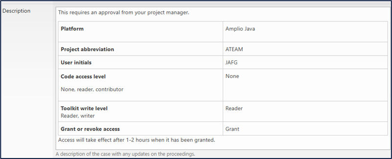
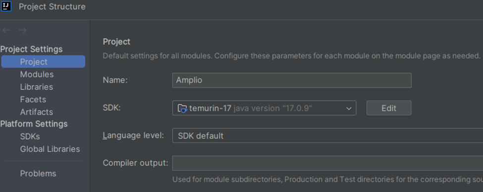
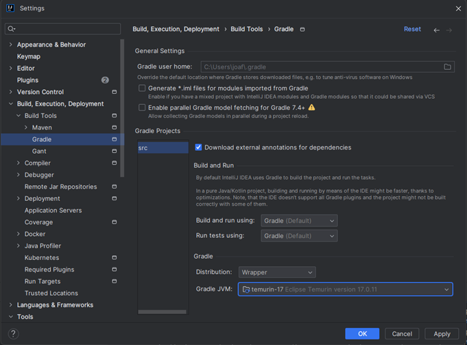
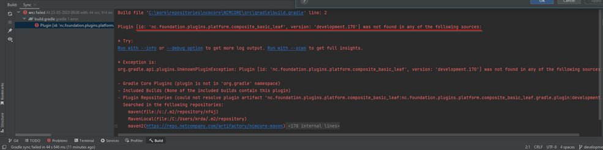
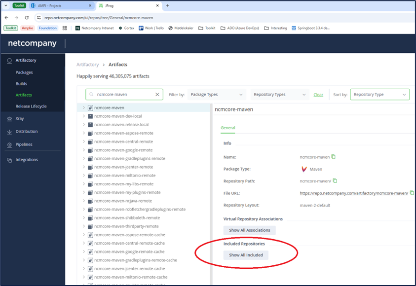
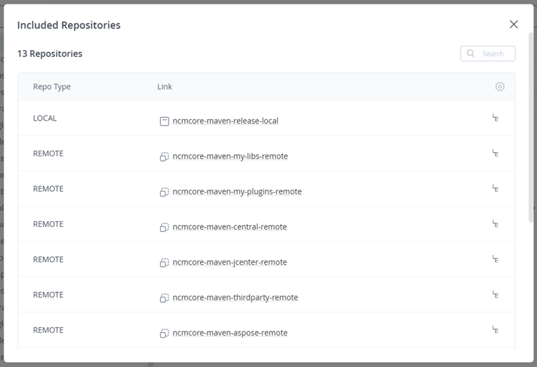
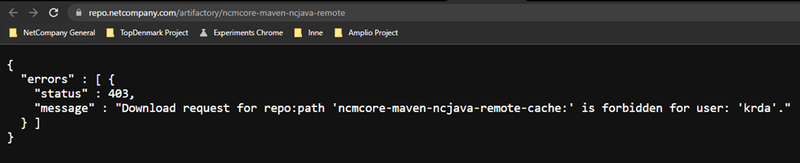
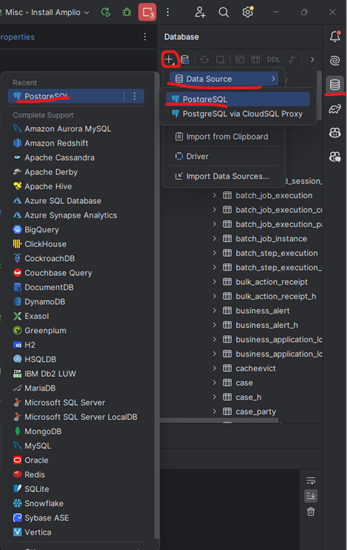

# References

| Reference                                                                    | Author     |
|------------------------------------------------------------------------------|------------|
| [P0150 - Governance][P0150_LINK]                                             | Netcompany |
| [Business Deliverables --> O0300 - Maintenance Guide][BUSINESS_O0300_FOLDER] | Netcompany |
| [DD160 – Programming Guidelines][DD160_LINK]                                 | Netcompany |
| [Reading Guide][READING_GUIDE]                                               | Netcompany |
| [Amplio Toolkit: Project information][TK_PROJECTS_LIST_LINK]                 | Netcompany |
| [IT-services toolkit][NCITService_Toolkit_LINK]                              | Netcompany |
| [O0300 - Maintenance guide][O0300_MAINTENANCE_LINK]                          | Netcompany |
| [Amplio C0200 – Getting started with an Amplio project][C0200_LINK]          | Netcompany |
| [Amplio Toolkit][AmplioTK_Link]                                              | Netcompany |

<!-- =============== -->
<!-- REFERENCE LINKS -->
<!-- =============== -->


[P0150_LINK]: https://goto.netcompany.com/cases/GTE2252/AMPJ/SitePages/Wiki.aspx#/P0150-Governance/Governance

[BUSINESS_O0300_FOLDER]: https://goto.netcompany.com/cases/GTE351/NCMCORE/Deliverables/O0300%20-%20Maintenance%20guide

[DD160_LINK]: https://goto.netcompany.com/cases/GTE2252/AMPJ/SitePages/Wiki.aspx#/DD160-Programming-Guidelines/Programming-Guidelines

[READING_GUIDE]: https://goto.netcompany.com/cases/GTE351/NCMCORE/Amplio

[TK_PROJECTS_LIST_LINK]: https://goto.netcompany.com/cases/GTE2252/AMPJ/Lists/Projects/Overview.aspx

[NCITService_Toolkit_LINK]: https://goto.netcompany.com/cases/GTE417/NCITServices/Lists/Tasks/myOpenCases.aspx

[O0300_MAINTENANCE_LINK]: https://goto.netcompany.com/cases/GTE1624/NCJAVA/SitePages/Wiki.aspx#/O0300-Maintenance-Guide/Local-Environment-Setup

[C0200_LINK]: https://goto.netcompany.com/cases/GTE2252/AMPJ/_layouts/15/WopiFrame.aspx?sourcedoc=%7B1E37BD00-C9B9-4431-9356-F268E60299AE%7D&file=C0200%20-%20Getting%20started%20with%20an%20amplio%20project.docx&action=default

[AmplioTK_Link]: https://goto.netcompany.com/cases/GTE2252/AMPJ/SitePages/default.aspx

# Introduction

This document will only contain information specific to Amplio setup, meaning what is necessary outside of Foundation
setup. It is only an extension of the information provided in the foundation maintenance
guide [O0300 - Maintenance guide][O0300_MAINTENANCE_LINK].

## Target audience

This document targets any developer who wishes to set up a local Amplio environment, and it will also be the starting
point for Amplio project developers to set up their own project environment.

## Purpose

The purpose of this document is to reduce documentation redundancy in the Amplio projects, so that common procedures
when it comes to local environment setup are only present in this document, and not in the several project-specific
O0300 documents in the project toolkits.

## Relevant documentation

Here are some related Amplio Deliverables:

- **[DD160][DD160_LINK]**: If you are looking for the best coding practices and standards to follow when contributing to
  Amplio,
  then look no further, it can be found in the Amplio Programming Guidelines.
- **[P0150][P0150_LINK]**: Anything related to branching- and release strategies, RMI’s, Work Items, Pull Request
  process, etc.
  can
  be found in the Amplio Governance document.
- **[Business O0300 Folder][BUSINESS_O0300_FOLDER]**: Here you will find anything project-specific, e.g.,
  Oracle-specific configurations,
  Tunnel Tools setup, etc.

## Prerequisites

<div style="border-left: 4px solid darkorange; background-color: rgba(255, 140, 0, 0.1); padding: 10px; margin-bottom: 10px;">
    <strong>Important:</strong> 

It is important that you complete the O0300 Maintenance Guide from Foundation,
as it lies the foundation for this Amplio maintenance guide.
However, you do not need to set up the codebase described in the guide. Just follow the setup instructions without
cloning the NF4J repository.

</div>

# Local environment setup

## Artifact and Toolkit access

To use Amplio artifacts and to read the documentation available in
the [Amplio Toolkit][AmplioTK_Link], you need to be added to a
security group that grants access. These groups can be requested via a case
in [NCITService Toolkit][NCITService_Toolkit_LINK].

The information needed for creating a case is this:

- Your own initials
- Your project abbreviation
- Should you have Read or Write access to code? (This will grant access to Artifactory, ADO, and SonarQube)
- Should you have Write access to: (read access will be granted to all project participants)
    - Amplio Toolkit
    - Foundation Toolkit

If you have any doubts about the above, please ask your Team Lead to provide the information.

With this information, please create a Service Request case of type Access – Foundations. Fill in the template, save the
case, and use the Notify functionality to ask for approval from your Project Manager.


<div style="border-left: 4px solid darkorange; background-color: rgba(255, 140, 0, 0.1); padding: 10px; margin-bottom: 10px;">
    <strong>Important:</strong> 

Requesting access to Amplio code automatically grants access to Foundation code.

</div>

<div style="text-align: center;">




<h5>Figure 1. User JAFG requesting Read-access to toolkit (both Foundation and Amplio), through project ATEAM</h5>

</div>

## Clone project

Links to Azure DevOps (repos) for the Amplio projects can be found
at [Amplio Toolkit: Project information][TK_PROJECTS_LIST_LINK]. Cloning
Amplio should be
done through the link:

```
ssh://ssh-source.netcompany.com:22/tfs/Netcompany/NCMCORE/_git/NCMCORE
```

### From Amplio 1.1

Amplio version 1.1 and later uses Java 17. If you are working from time to time on Amplio, to configure IntelliJ, please
select `File > Project Structure > Project` and download SDK. Please choose version 17 and Eclipse Temurin (AdoptOpenJDK
HotSpot) as the vendor and leave the location as the default.

After you have downloaded the JDK, set it as the project's SDK and update the language level to SDK default. Your
project settings should be the same as the image below.

<div style="text-align: center;">




</div>

Also please ensure proper gradle settings File > Settings > Build, Execution, Deployment > Build Tools > Gradle that you
have Project SDK option selected for Gradle JVM.


<div style="text-align: center;">




</div>

please note that this will configure JDK in Intellij project context only. It is also necessary to add the JDK binary to
system path.

### Possible authentication issue

If you setup all gradle settings but gradle initialization fails with below message, it might mean that you're missing
some access rights to artifactory.

<div style="text-align: center;">




</div>

Above error, mentions problem with ‘ncmcore-maven’ repository. Find that repo in artifactory and check if you can enter
each of ‘included repositories’. For example, try ‘ncmcore-maven-ncjava-remote’, click related link in included
repositories in ‘ncmcore-maven’ repo:

<div style="text-align: center;">



<h5> Figure 3. Screenshot of JFrog, the artifactory that stores all of our packages. Search for ncmcore-maven and press
Show All Included repositories </h5>

</div>

<div style="text-align: center;">



<h5> Figure 4. List of all included repositories. Click through all of these to confirm that you do have access to
them. </h5>

</div>

<div style="text-align: center;">



<h5> Figure 5. Screenshot of forbidden access to one of the repositories. </h5>

</div>

If you see that access if forbidden for your user, you'll need to request for it, using the project security groups as
done in [Amplio C0200 – Getting started with an Amplio project][C0200_LINK]

## Install Amplio

After following the previous steps, you should now be able to run the “Install Amplio” configuration. It will do the
following:

- **Configure Shared indexes**: This is a plugin that reduces the indexing of modules and dependencies on startup.
- **Docker Login**: This uses the credentials from section 2.12.1 to log you into Docker.
- **Set Docker Server**: This updates the environment file.
- **Install React**:
    - Stops, deletes, and uninstalls Verdaccio
    - Sets the NPM path
    - Installs Verdaccio

## Update local foundation library for Amplio

This is not strictly needed for initial setup, but it is very common to do. For more information, look in
the [O0300 - Maintenance guide][O0300_MAINTENANCE_LINK] at section 7.3 Update local foundation library for Amplio.

## Database

### Installation

The DB configuration can be project specific. In this respect, please follow the O0300 document of the project. For
specific database setups, see the corresponding O0300 in [Business O0300 folder][BUSINESS_O0300_FOLDER]. For making SQL
queries in PostgreSQL
in IntelliJ, go through the steps in the image below.

<div style="text-align: center;">



</div>

Open the SQL menu in IntelliJ, then press the “+” icon -> select Data Source -> PostgreSQL -> PostgreSQL.
A new window pops up. For the name, you can insert anything.

- **Host**: localhost
- **Port**: 5432
- **User**: amplio_app_user
- **Password**: amplio_app_user
- **Database**: ampliodb

Download the dependencies if they are missing and press the “Test Connection” button to see if everything works.
Make sure your PostgreSQL database is running in Docker!

## Changing Amplio version project development

### Publishing Amplio locally

It is possible to test the Amplio implementation in your local project (requires local publication and Amplio version
bumping, which is slower). On your local machine, there is a local Maven repository available. To enable the local
version of Amplio for your project, Amplio needs to be published in the Maven local repository and then imported into
your local project app. To achieve this, Amplio provides a Gradle publish task. You will also need to update your config
locally. The following steps describe the whole process:

1. In Amplio, publish an Amplio artifact to your local machine's Gradle cache by running the run configuration called "
   Publish locally".
2. In your project code, open `gradle.properties` (at project root), set `modulusYdelseVersion=modulus-ydelse-dev` and
   run `gradle refreshDependencies`.
3. If you iterate through changes in Amplio and test in the project, you only need to perform the local publication in
   Amplio and a redeploy in the project - no `gradle refreshDependencies` needed here.

### Before Amplio 1.1

#### Publishing Amplio to Artifactory

If the Amplio version needs to be tested on an environment, the local repository is not enough as it will not be
available on the remote server. This case is similar to testing locally. The Amplio development version (your branch,
changes you made locally) can be pushed to JFrog Artifactory and from there it can be imported on the remote server. The
following steps describe the process:

1. Publish a development artifact by running "Publish to artifactory" from run configurations.
2. After publishing to Artifactory, you will want to remove the "stableVersion" entries that are being generated in the
   `package.json` files for each module within the React framework.
3. In your project code, open `gradle.properties` (at project root), set
   `modulusYdelseVersion=<artifact id from the publish task console log>` and run `gradle refreshDependencies`.
4. Push changes to your repository and use the tools you use in the project (Azure DevOps, Jenkins) to deploy on the
   environment.

### From Amplio 1.1

The requirement to publish Amplio to Artifactory has been eliminated. This is due to the fact that the React framework
is now pre-configured to automatically link to the reference application.
