| Reference                                                                                       | Author          | 
|-------------------------------------------------------------------------------------------------|-----------------|
| [Onion Architecture][Onion_Architecture]                                                        | Jeffrey Palermo |
| [Application Core][DD130_Application_Core]                                                      | Netcompany      |
| [Data Cloner][DD130_Data_Cloner]                                                                | Netcompany      |
| [Server Self-Diagnostics][DD130_Server_Self_Diagnostic]                                         | Netcompany      |
| [Search][DD130_Search]                                                                          | Netcompany      |
| [Selfservice][DD130_Selfservice]                                                                | Netcompany      |
| [Task Tray][DD130_Task_Tray]                                                                    | Netcompany      |
| [Task Filter][DD130_Task_filter]                                                                | Netcompany      |
| [Thymeleaf][DD130_Thymeleaf]                                                                    | Netcompany      |
| [React][DD130_React]                                                                            | Netcompany      |
| [Batch Engine][DD130_Batch]                                                                     | Netcompany      |
| [Kassation][DD130_Kassation]                                                                    | Netcompany      |
| [Minimization][DD130_Minimization]                                                              | Netcompany      |
| [Process engine][DD130_Process_Engine]                                                          | Netcompany      |
| [Process Administration][DD130_Process_Administration]                                          | Netcompany      |
| [Report][DD130_Report]                                                                          | Netcompany      |
| [Foundation Authentication and Authorization][DD130_Foundation_Authentication_and_Autorization] | Netcompany      |
| [Authentication and Authorization][DD130_Authentication_and_Authorization]                      | Netcompany      |
| [Alert Framework][DD130_Alert_Framework]                                                        | Netcompany      |
| [Caching][DD130_Caching]                                                                        | Netcompany      |
| [Foundation Database][DD130_Foundation_Database]                                                | Netcompany      |
| [Database][DD130_Database]                                                                      | Netcompany      |
| [Platform][DD130_Platform]                                                                      | Netcompany      |
| [Reservation][DD130_Reservation]                                                                | Netcompany      |
| [Logging][DD130_Logging]                                                                        | Netcompany      |
| [Foundation Logging][DD130_Foundation_Logging]                                                  | Netcompany      |
| [Document][DD130_Document]                                                                      | Netcompany      |
| [Portaltext][DD130_Portaltext]                                                                  | Netcompany      |
| [System parameter][DD130_System_parameter]                                                      | Netcompany      |
| [Filters][DD130_Filters]                                                                        | Netcompany      |
| [Foundation Filters][DD130_Foundation_Filters]                                                  | Netcompany      |
| [Error Handling][DD130_Error_Handling]                                                          | Netcompany      |
| [Functional Scenarios][A0140_Functional_Scenarios]                                              | Netcompany      |
| [Detail Design][DD130_Detail_Design]                                                            | Netcompany      |
| [User Guide][C0200_User_Guide]                                                                  | Netcompany      |
| [Reference Software Architecture][O0500_Reference_Software_Architecture]                        | Netcompany      |
| [Foundation Software Architecture][O0500_Foundation_Software_Architecture]                      | Netcompany      |
| [Gradle][DD130_gradle]                                                                          | Netcompany      |

<!-- =============== -->
<!-- REFERENCE LINKS -->
<!-- =============== -->

[Onion_Architecture]:https://jeffreypalermo.com/2008/07/the-onion-architecture-part-1/

[DD130_Application_core]:https://source.netcompany.com/tfs/Netcompany/NCMCORE/_wiki/wikis/Documentation/9504/Application-core

[DD130_Data_cloner]:https://source.netcompany.com/tfs/Netcompany/NCMCORE/_wiki/wikis/Documentation/9376/Data-Cloner

[DD130_Server_Self_Diagnostic]:https://source.netcompany.com/tfs/Netcompany/NCMCORE/_wiki/wikis/Documentation/9508/Server-self-diagnostics

[DD130_Search]:https://source.netcompany.com/tfs/Netcompany/NCMCORE/_wiki/wikis/Documentation/9388/Search

[DD130_Selfservice]:https://source.netcompany.com/tfs/Netcompany/NCMCORE/_wiki/wikis/Documentation/9632/Self-service

[DD130_Task_Tray]:https://source.netcompany.com/tfs/Netcompany/NCMCORE/_wiki/wikis/Documentation/9444/Task-tray

[DD130_Task_filter]:https://source.netcompany.com/tfs/Netcompany/NCMCORE/_wiki/wikis/Documentation/9395/Task-filter

[DD130_React]:https://source.netcompany.com/tfs/Netcompany/NCMCORE/_wiki/wikis/Documentation/9701/React

[DD130_Batch]:https://source.netcompany.com/tfs/Netcompany02/NF4J/_wiki/wikis/Documentation/6023/Batch

[DD130_Kassation]:https://source.netcompany.com/tfs/Netcompany/NCMCORE/_wiki/wikis/Documentation/9441/Discard

[DD130_Minimization]:https://source.netcompany.com/tfs/Netcompany/NCMCORE/_wiki/wikis/Documentation/9633/Minimization

[DD130_Process_Engine]:https://source.netcompany.com/tfs/Netcompany/NCMCORE/_wiki/wikis/Documentation/9492/Process-Engine

[DD130_Process_Administration]:https://source.netcompany.com/tfs/Netcompany/NCMCORE/_wiki/wikis/Documentation/9595/Process-Administration

[DD130_Report]:https://source.netcompany.com/tfs/Netcompany/NCMCORE/_wiki/wikis/Documentation/9479/Report

[DD130_Foundation_Authentication_and_Autorization]:https://source.netcompany.com/tfs/Netcompany02/NF4J/_wiki/wikis/Documentation/6022/Authentication-and-Authorization

[DD130_Authentication_and_Authorization]:https://source.netcompany.com/tfs/Netcompany/NCMCORE/_wiki/wikis/Documentation/9507/Authentication-and-Authorization

[DD130_Alert_Framework]:https://source.netcompany.com/tfs/Netcompany/NCMCORE/_wiki/wikis/Documentation/9377/Alert-framework

[DD130_Caching]:https://source.netcompany.com/tfs/Netcompany02/NF4J/_wiki/wikis/Documentation/6024/Caching

[DD130_Foundation_Database]:https://source.netcompany.com/tfs/Netcompany02/NF4J/_wiki/wikis/Documentation/6025/Database

[DD130_Database]:https://source.netcompany.com/tfs/Netcompany/NCMCORE/_wiki/wikis/Documentation/9577/Database

[DD130_Platform]:https://source.netcompany.com/tfs/Netcompany/NCMCORE/_wiki/wikis/Documentation/9730/Platform

[DD130_Reservation]:https://source.netcompany.com/tfs/Netcompany/NCMCORE/_wiki/wikis/Documentation/9505/Reservation

[DD130_Logging]:https://source.netcompany.com/tfs/Netcompany/NCMCORE/_wiki/wikis/Documentation/9707/Logging

[DD130_Foundation_Logging]:https://source.netcompany.com/tfs/Netcompany02/NF4J/_wiki/wikis/Documentation/6035/Logging

[DD130_Document]:https://source.netcompany.com/tfs/Netcompany/NCMCORE/_wiki/wikis/Documentation/9720/Document

[DD130_Portaltext]:https://source.netcompany.com/tfs/Netcompany02/NF4J/_wiki/wikis/Documentation/6042/Portal-text

[DD130_System_parameter]:https://source.netcompany.com/tfs/Netcompany02/NF4J/_wiki/wikis/Documentation/6053/System-parameter

[DD130_Filters]:https://source.netcompany.com/tfs/Netcompany/NCMCORE/_wiki/wikis/Documentation/9711/Filters

[DD130_Foundation_Filters]:https://source.netcompany.com/tfs/Netcompany02/NF4J/_wiki/wikis/Documentation/6030/Filters

[DD130_Error_Handling]:https://source.netcompany.com/tfs/Netcompany/NCMCORE/_wiki/wikis/Documentation/9721/Error-handling

[O0500_Reference_Software_Architecture]:https://source.netcompany.com/tfs/Netcompany02/NF4J/_wiki/wikis/Documentation/7774/Software-Architecture

[O0500_Foundation_Software_Architecture]:https://source.netcompany.com/tfs/Netcompany02/NF4J/_wiki/wikis/Documentation/7773/Software-Architecture

[DD130_gradle]:https://source.netcompany.com/tfs/Netcompany02/NF4J/_wiki/wikis/Documentation/6032/Gradle

[Microsoft_Defender_for_Endpoint]:http://blogs.microsoft.com/cybertrust/2015/10/07/whats-new-with-microsoft-threat-modeling-tool-2016/

# Introduction

This document constitutes a part of the system documentation for the Amplio project. The document provides links to
component detailed description documents.

## Purpose

The purpose of this document is to describe the overall framework architecture. It explains what modules are part of the
framework and how they are designed and developed. The document describes the essential architectural concepts such as
logging, caching, security, etc.
The different perspectives in the software architecture of Amplio are:

- **Solution overview** presents the solution in a very high-level view and sets the Amplio context. This section
  provides a high-level description of components in the framework. It is helpful for the remainder of the document.
  The document presents the core design principles, design patterns and frameworks. Later sections will show the
  principles, practices and frameworks used throughout Amplio.
- **Security architecture** describes the different security concepts which the platform uses to help projects protect
  their systems.
- **The logical architecture** is a brief overview of the landscape of each of the components and the dependencies
  between them.

## Target audience

The document is mainly targeted towards architects and developers of the Amplio project. It can also be used by
operations staff to better understand communication patterns between different subsystems.

## Solution overview

This section describes Amplio from a high-level perspective.

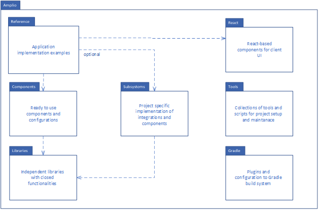
<h5>Projects overview</h5>

Amplio is a set of different preconfigured components which heavily depend on the Spring framework as an inversion of
control. The Amplio project is divided into several subprojects – components, libraries, react, subsystems, tools and
reference. The Reference application has separate documentation, please
check [Reference Software Architecture][O0500_Reference_Software_Architecture] for more
details.

The **components** subproject is a set of general base components which contain configurations for specific application
types, e.g. batch, business (React and Thymeleaf). It also has ready-to-use components for different technologies e.g.,
Task Tray.

The **libraries** subproject is a set of independent libraries responsible for data processing or reusable components
with
closed functionalities.

The **subsystems** subproject contains projects-specific code for integrations or language requirements (e.g., Danish
data
model). The code can usually be used by several projects but doesn’t contain common features useful to everyone.

The **reference** subproject gathers independent ready-to-use application projects that rely on Amplio functionalities.
It
shows existing features, demonstrates best practices, and accelerates new project initialization.

The **react** subproject is an independent project which contains React-based packages. The packages implement various
components, APIs and configurations used by React-based projects.

The **tools** subproject keeps a collection of tools and scripts that help to set up the project and developer’s
environment. It contains Docker and Gradle scripts.

Amplio is divided into several implementation layers, which help to understand where specific features are located. The
diagram below shows components available in Amplio and their place in the layers.

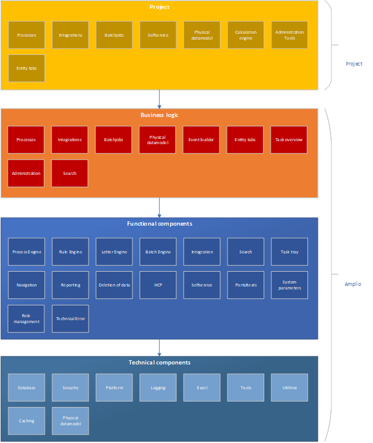

# Architectural goals and constraints

This section describes the architectural goals that drive the design of the Amplio architecture. Please refer to general
architecture rules in reference documentation [Reference Software Architecture][O0500_Reference_Software_Architecture].

## Frameworks and libraries

This section describes the most essential frameworks that Amplio uses.

### Java JDK

The system is developed in the Java programming language in version 11. The programming language describes the formal
description of the language but not an actual implementation of this specification. Different implementations of the
programming language (called JDK) exist. The project uses Java JDK in version 11 from AdoptOpenJdk.

### Spring Framework

The Spring framework is used as the overall framework in the solution. The System uses Spring for Inversion of Control (
IoC) to manage dependency injection between the components. This allows components to act as standalone modules
automatically linked together using Spring. Additionally, Spring adds Aspect Oriented Programming (AOP) features that
allow for efficient and straightforward implementation of logic that cuts across components. Logging, monitoring or
access control are only a few examples where the AOP approach is a perfect fit. The AOP helps implement all logic
decoupled from the individual components that need to use the cross-functional functionality.

Amplio uses parts of a vast Spring ecosystem of components:

- Spring Boot
- Spring Data
- Spring Security
- Spring Session

### Hibernate

Hibernate ORM enables developers to write applications whose data outlives the application process more efficiently. As
an Object/Relational Mapping (ORM) framework, Hibernate is concerned with data persistence as it applies to relational
databases (via JDBC). In addition to its own "native" API, Hibernate is also an implementation of the Java Persistence
API (JPA) specification. Regarding performance, Hibernate supports lazy initialization, numerous fetching strategies and
optimistic locking with automatic versioning and time stamping. It offers superior performance over straight JDBC code
in terms of developer productivity and runtime performance.

### Hazelcast

Hazelcast is a distributed computation and storage platform for consistently low-latency querying, aggregation and
stateful computation against event streams and traditional data sources. It supports quickly building
resource-efficient, real-time applications.

Hazelcast can process data on a set of networked and clustered computers that pool together their random-access memory (
RAM) to let applications share data with other applications running in the cluster. When data is stored in RAM,
applications run a lot faster since it does not need to be retrieved from disk and put into RAM prior to processing.

Hazelcast is masterless in nature. Each node is configured to be functionally the same and operates in a peer-to-peer
manner. The data is always stored in-memory on the servers. Multiple copies are stored in every cluster member for
automatic data recovery in case of server failures. In the event of failure, the overall cluster will not suffer any
data loss.

### Jackson

The Jackson is an efficient JSON processing library. The solution uses the library in all aspects of serialization, and
deserialization payloads, e.g., REST API implementation or configuration reading/writing.

### Foundation

The Foundation project is a set of preconfigured components of the Spring framework. It contains packages for common
database communication, web application development, authentication and security configuration. The detailed description
and architecture can be found in [O0500 – Foundation Software Architecture].

# Use case perspective

For more information check the reference
documentation [Reference Software Architecture][O0500_Reference_Software_Architecture]

# Logical perspective

This section describes the logical component model, i.e., the sub-components forming the framework. The components are
described at a general level, and it is explained which function they have, but it is not described how they are
implemented. Essential details regarding implementation are described later in section **6 Implementation perspective**.

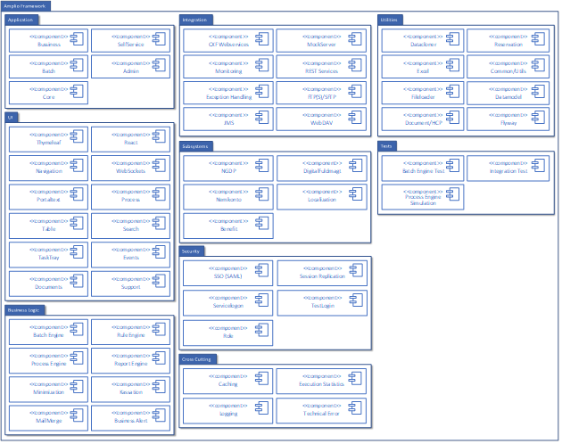

## Application

The application package contains ready-to-use configurations for different types of applications. Besides the core
component, which includes a common configuration, the package contains the following types of applications:

- Business – component contains a common configuration to the backoffice or intranet system application. This type of
  configuration suits the system, which involves case management, document storing and executing processes.
- Batch – component contains a common configuration for applications which automatically process lots of data according
  to
  some rules. The application has a minimal user interface and mainly focuses on job configurations and monitoring.

## UI

The UI components provide configurations and classes specific to UI handling. Currently, Amplio supports two types of UI
architecture patterns – Single Page Application (SPA) where whole application is loaded to the browser as JavaScript
application and Multi Page Application (MPA) where each page is generated after request to the server. The UI focuses on
two technologies: Thymeleaf (Spring MVC/MPA) and React (SPA). The MPA components focus on the backend processing and
generate a proper model the Thymeleaf engine shares. The React components mostly pass data to SPA with various REST
endpoints. Depending on requirements, UI components provide ready-to-use components and specific implementations for
common elements. The following list shows available elements:

- Navigation – creates a hierarchy of navigation tabs. Handles tabs state, permissions and behaviours,
- WebSockets – provides push functionality to Thymeleaf application,
- Portal Text – provides REST endpoints for the React application; it is an extension to Foundation functionality,
- Process – provides REST endpoints and proper structures to manage the application's process engine. It also includes
  UI
  components to build process forms for user interaction,
- Table – provides REST endpoints for advanced table processing – includes value filtering, user settings, paging (
  server
  side and client side), searching and ordering,
- Search – provides UI elements to build advanced search forms (entity-based) and retrieve data based on given criteria,
- Task Tray – ready-to-use component which shows user tasks, contains both backend components and UI components,
- Events – ready-to-use component which shows events (entity-based), contains both backend components and UI components,
- Documents – ready-to-use component which shows documents (entity-based), contains both backend components and UI
  components,
- Support – ready-to-use component for user support site, contains both backend and UI components.

## Business Logic

### Batch Engine

The Batch Engine component handles business logic processing in independent processing items. The batch processing is
always unattended and doesn’t require user intervention. The Batch Engine has several concepts that help organize
processing, data monitoring, and output gathering.

- The batch engine schedules, maintains the batch job queue and executes the business logic specified by the individual
  batch jobs.
- The batch job type describes the required processing. It describes the implementation of readers and processors which
  execute specific business logic.
- The batch job type instance (called batch job) is executed on the batch engine, which handles execution and
  monitoring.

### Process Engine

The Process Engine component handles business logic processing according to a predefined flow and contains automatic and
manual steps (user interaction is required). The typical process includes at least one step and can have zero or more
flow routes, which moves the process to the next step. The outcome of the process always makes changes in the data.

### Rule Engine

The Rule Engine component handles automatic rule execution; it is built and designed to support workflows based on
legislation or modifiable rules to suit the customer's needs. The rules in the Rule Engine are defined by a rule sheet,
which is represented by a special Excel sheet. The rule sheets support complex business logic without building it into
the core business application. It helps the end user to add specific business rules without creating particular
implementations for each rule.
The project can easily incorporate the Rule Engine into the Process and Batch engine to extend its functionality.

### Report Engine

The Report Engine component automatically generates reports based on the application. Its design helps to integrate
report functionality into the customer flows. The component facilitates quick adoption as it enables the customer to add
or change reports dynamically from the user interface.
The projects can easily incorporate the Report engine into the Process and Batch engine to extend its functionality.

### Minimization

The Minimization component enables the possibility to actively and transparently limit the personal data the application
retains based on its specific business needs. This is accomplished by supplying the minimization component with
application-specific definitions of the data and rules which the minimization component should govern. The minimization
component enables compliance with the General Data Protection Regulation by limiting the amount of personal data
gathered and stored about a given person.

### Deletion of Data

The Deletion component provides functionality for robust data-maintenance, which fulfils the requirements of personal
data laws and regulations. By including the component’s services, configurations, and batch job templates, an
Amplio-based project can accelerate development and comply with personal-data regulations promptly, while drawing from
the robustness of production-tested business logic and procedures.

### MailMerge

The MailMerge component provides functionality for letter generation of documents in PDF/MS Word formats. The component
offers the possibility to define templates with placeholder fields (merge fields) in MS Word format and specific value
resolvers to retrieve data needed by the merge process. The end user can generate and validate the document before the
final rendition is generated and stored in a database. The document is available directly from the MS Word application
and can be modified by the end-user thanks to the implementation of WebDAV protocol in the Amplio platform.

### Business Alert

The Alert component provides functionality to define and process alerts to inform developers about issues in the system.
The component provides a default implementation of Splunk configuration to use the existing structures from the Alert
component to tell the external system about the problem (e.g. issue system).

## Integration

The integration is divided into two categories of components – connectors and tools. The connectors are implementations
of typical protocols which are used during connection to external system. The following protocols are supported:

- SOAP Webservices supported by CXF library,
- REST Services supported by Spring RestTemplate library,
- FTP/SFTP/FTPS supported by JSch libarary,
- JMS supported by Spring ActiveMQ library,
- WebDAV supported by Milton library.

The tools category contains projects to help test, monitor and handle exceptions. The following components are available
to integrations:

- Monitoring – cross-cutting component for integration, it helps to asynchronously monitor execution of SOAP endpoints,
- MockServer – mock implementation for different protocols e.g., FTP, JMS. The server can imitate responses during
  tests,
- Exception Handling – set of different classes to handle exceptions during processing of the endpoints.

## Subsystems

The Subsystems provide projects which contain configuration and classes which doesn’t have general functionalities. It
can include elements specific to a country or particular integrations used only in certain circumstances. The following
components are available:

- NGDP – integration to Danish Next-generation Digital Post, components and integrations related only to the Danish
  country,
- NemKonto/DigitalFuldmagt – integration to the Danish identity provider, governs citizen system access rights and
  defines
  power of attorney to self-service systems,
- Benefit – integrations and batch jobs related to welfare benefit systems,
- Localization – country-specific classes with localized naming of the domain model.

## Security

The security component ensures that executed business logic in service methods happens in a secured context. It is
ensured that all calls have secured context related to the current user, and all checks are based on user roles and
rights. Furthermore, the security component handles different authentication protocols and correctly creates user
context.

### SSO (SAML)

The SSO component is an extension of the Foundation authentication component. It adds Amplio-specific functionalities,
including configurations for intranet and internet applications (Self-service). It also provides an additional filter
for session expiration verification.

### Session Replication

The Session Replication handles session creation and synchronizes session data between the Reference System instances (
if run in a clustered environment). The session data is kept in distributed memory, which resides in all instances of a
Reference System.

### Role

The Role component stores roles in the system and maps between external and system-defined roles. External roles are
defined here as originating from, e.g., IdP or Active Directory.

### Servicelogon

The Servicelogon component provides an impersonation feature to the authentication process. The impersonation gives
access to the application to the user and makes him act on behalf of another user. This type of functionality is limited
to restricted groups (super users) and helps to resolve problems and test new or existing functionality. The
implementation generates a one-time usage token to provide access.

### TestLogin

The TestLogin component is an extension to the Foundation component. It adds Amplio-specific functionalities, which
include configurations for intranet applications and considers Amplio-specific schema with respect to user data and
roles.

## Cross Cutting

### Caching

The caching component ensures uniform administration of the caching model. It is responsible for generating keys,
caching entities, removing them when invalidated, and ensuring that cached data is refreshed when needed.

### Execution Statistics

The execution statistics component gathers and stores data about the execution time of relevant code fragments. The
component helps analyze suboptimal performance in the code base and gives statistics to help verify SLA (Service-level
agreement) requirements.

### Transaction

The transaction component ensures that all data modification operations are executed in the transaction (as one atomic
operation).

### Error Handling

The error handling component aims to ensure uniform handling of errors so that there is always the same interface for
error situations. The component defines known error types, their severity, log level, etc., while allowing for
extensions by solutions.

### Logging

The logging component ensures system calls/operations are registered with the relevant information. Information is
collected based on the context of the operation, e.g., given user. The component supports the logging of successful and
failed operations.

## Utilities

### Fileloader

The Fileloader component uploads files connected with system parameters. The component reads files from the classpath
and uploads the latest version of the file. File metadata and definitions are structured in JSON format.

### Datacloner

The Datacloner component is a data migration component which can copy entities from different environments. The rules
and structure of the data are defined by application configuration and available entities (Hibernate). The cloning
process takes into account data hierarchies and relations. It also contains an additional feature for masking data
during coping so that moving sensitive information from the production environment to lower environments is protected
against personal data leakage.

### Reservation

The Reservation component enables to flag entities in the system as reserved for processing by other users. In
multi-user systems, operating on the same data (entities) is very common. Without proper restrictions on access to data,
users can override each other’s data or rely on outdated information. To avoid this situation, users with reservations
can secure the data they are working on.

### Document/HCP

The Document component provides functionality to operate and store binary documents in the system. The documents can be
uploaded and edited (with WebDav protocol). The documents can be stored in the database and use integration to the HCP
system.

### Other

There are smaller utils components which are used for various tasks:

- Excel – simple excel process reading and writing excel files,
- Datamodel – basic data model for Amplio projects
- Flyway – configuration for versioning database with Flyway library
- Common/Utils – other utilities and common code

## Tests

The tests contain different helper classes and configurations to make building tests for specific components easier.
Besides common configuration, the following elements are available to handle bigger components: Batch Engine Test,
Integration Test and Process Engine Simulation.

# Process perspective

The process view describes non-functional requirements such as performance, availability, and scaling options, and is
evolved in close collaboration with the project operations team.

It focuses on how the system handles concurrency, distribution, and fault tolerance, as well as how the abstractions
from the logical view are implemented in terms of execution on different threads of control.

The process architecture can be described at various levels of abstraction, each addressing different concerns. At the
highest level, it can be seen as a set of logically connected containers (processes) that execute independently and are
distributed across hardware (physical or virtual) resources.

# Implementation perspective

The implementation perspective focuses on actual framework components/modules organization and describes an approach to
build hierarchies and layers in the Amplio. The project aims to conform to the rules
of [Onion Architecture][Onion_Architecture]  where possible. The main concepts applied in the Amplio framework from
Onion Architecture are:

- The application is built around an independent object model,
- Inner layers define interfaces. Outer layers implement interfaces,
- Direction of coupling is toward the center (Domain Model),
- All application core code can be compiled and run separate from infrastructure.

- The overview of layers and direction of dependencies are visible on diagram below:

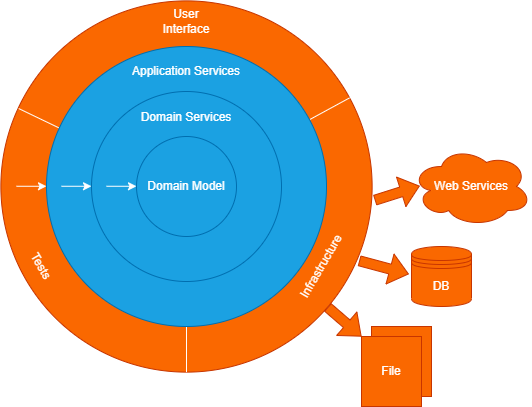
<h5>Onion Architecture Diagram</h5>

The project consists of both a basic configuration and independent components with business logic. A detailed
description of project structure and dependencies between components can be found below.

## Project structure

The Amplio framework is divided into several sub-projects, and some are divided into smaller sub-projects. In each
sub-project are groups of components or functionalities. The components and functionalities can be divided into small
subprojects if it is reasonable because of the size of the component.
The components module contains basic structure, configurations, and utilities for implementing the application of
different types or ready-to-use components, e.g. task-tray. The application project contains subprojects for each type
of application. The rest of the projects have code for other components.

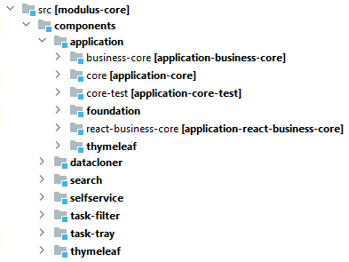
<h5>Amplio structure for components module</h5>

The libraries module contains independent modules with off-the-shelf functionalities. It is divided into smaller modules
which groups similar functionalities together, e.g. platform module or integration module. (Note that any off-the-shelf
module is expected to require some configuration from the implementing solution). The platform subproject contains
standard functionalities and components for each Amplio-based application.

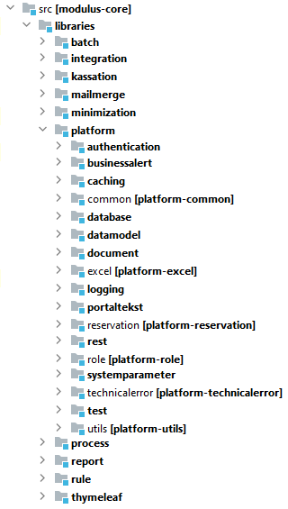
<h5>Amplio structure of libraries module</h5>

The subsystems modules contain project-specific implementation of batch jobs or integrations. The implementation is not
for general use, and it aims at a particular solution which can be used only by some projects. The subsystems also
contain functionality which might be phased out or have localized code for a specific language (e.g., a data model needs
language-specific naming or structure).

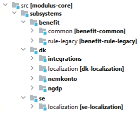
<h5>Amplio structure of subsystems module</h5>

The react module contains packages for handling different visual aspects of the user interface. All packages are written
in React and follow the standard npm package structure. To build and publish the react module, use yarn package manager.

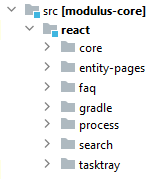
<h5>Amplio strcture of react module</h5>

The reference module is an example structure and configuration of a project based on the Amplio framework. It contains
examples of working applications with sample databases and processes already implemented.

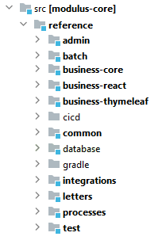
<h5>Amplio structure of reference module</h5>

The tools module is used internally by the Amplio framework to gather tools and scripts, which helps to organize code or
configurations. It also contains code which is used to create integration to external build or code analysis tools.

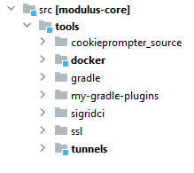
<h5>Amplio structure of tools module</h5>

The gradle module contains additional plugins and scripts used in Gradle to handle specific tasks and configurations
during the build and publish process (e.g., SonarQube analysis configuration).

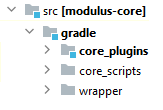
<h5>Amplio strcuture of gradle module</h5>

The projects can be divided into more specific subprojects if they are bigger and contain not only typical services and
models but also batch jobs, specific business rules or REST endpoints. For example minimization project.

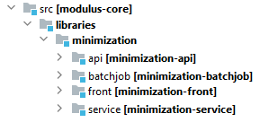
<h5>Minimization project subprojects</h5>

Each project structure follows a maven convention with respect to separate production and test code. It also separates
languages used in the project – Java for framework code and Groovy for Gradle plugin code.

| Folder structure                    | Description                                          |
|-------------------------------------|------------------------------------------------------|
| src/main/java   src/main/groovy | Production code                                      |
| src/main/resources                  | Production non-code files – configuration and assets |
| src/test/java                       | Test code                                            |
| src/test/groovy                     |                                                      |
| src/test/resources                  | Test non-code file – configuration and assets        |

### Available Components

The Amplio project is a huge collection of different components and ready-to-use functionalities. The description of
each component and its interaction with other components is described by each component’s own documentation. The table
below shows the summary of components and links to their proper documentation:

Components module:

| Component   | Description                                                                                                                                                                                                                                                                                                            |
|-------------|------------------------------------------------------------------------------------------------------------------------------------------------------------------------------------------------------------------------------------------------------------------------------------------------------------------------|
| Application | The application core has core functionality allowing projects to accelerate their new applications with custom properties while following the standard Amplio setup. More details: [Application Core][DD130_Application_Core]                                                                                          |
| Datacloner  | The datacloner component provides a straightforward way for testers and developers to get an entity (usually a person) from one environment to another, including all related data – with relevant masking applied. More details: [Data Cloner][DD130_Data_Cloner]                                                     |
| Diagnostics | The server self-diagnostics (SSD) component automatically runs a set of technical tests on the respective environment after deployment. It can verify configuration and database to ensure proper system functioning in production environments. More details: [Server Self-Diagnostics][DD130_Server_Self_Diagnostic] |
| Search      | The search component provides functionality for searching entities in the system. It allows defining custom UI forms and database query builders. More details: [Search][DD130_Search]                                                                                                                                 |
| Selfservice | The self-service component is the basis of an Amplio self-service application. It provides the basic components for a project to implement their own self-service on top of Amplio. More details: [Selfservice][DD130_Selfservice]                                                                                     |
| Task Tray   | The task tray component is often a critical component of the business application. It provides users with lists of tasks to handle throughout their workday, as well as highlighting and prioritizing more important tasks. More details: [Task Tray][DD130_Task_Tray]                                                 |
| Task Filter | The task filter component provides end users with the option to define groups of tasks. It is a component used by task tray and is part of the administration panel. More details: [Task Filter][DD130_Task_filter]                                                                                                    |

Libraries module:

| Component    | Description                                                                                                                                                                                                                                                                                                                                                                              |
|--------------|------------------------------------------------------------------------------------------------------------------------------------------------------------------------------------------------------------------------------------------------------------------------------------------------------------------------------------------------------------------------------------------|
| Batch        | The batch component contains the batch engine, which is handling automated scheduling of so-called batch jobs, automatic processing of data and handling of large chunks of data. The other component is batch administration which is an application to monitor and manage batch jobs on the batch engine. More details: [Batch Engine][DD130_Batch]                                 |
| Integration  | The integration component provides a collection of different integration patterns. It contains many implementations of common protocols like FTP, REST, SOAP. More details: check specific implementations in D0180 documents                                                                                                                                                         |
| Kassation    | The kassation (discard) component is tailored for data- and subscription-maintenance with focus on laws and regulations regarding personal information. More details: [Kassation][DD130_Kassation]                                                                                                                                                                                    |
| Minimization | The minimization component enables compliance with the General Data Protection Regulation by limiting the amount of personal data gathered and stored about a given person based on what is necessary for a given application. More details: [Minimization][DD130_Minimization]                                                                                                       |
| Process      | The process engine is designed to support a very versatile implementation of business processes driven by configurable business rules. The other component the process administration which extends administration to handle management tasks related to process engine. More details: [Process engine][DD130_Process_Engine], [Process Administration][DD130_Process_Administration] |
| Report       | The report component brings automatic generation of reports based on application data in the system. It is built and designed such that it can be integrated into the workflow of the customer to better suit their needs. More details: [Report][DD130_Report]                                                                                                                       |

Platform submodule:

| Component            | Description                                                                                                                                                                                                                                                                                                                                                                                                                                                                    |
|----------------------|--------------------------------------------------------------------------------------------------------------------------------------------------------------------------------------------------------------------------------------------------------------------------------------------------------------------------------------------------------------------------------------------------------------------------------------------------------------------------------|
| Authentication       | The authentication component plays a crucial part in the security of every application. In Amplio, authentication and authorization extend functionality from Foundation project regarding SAML2 handling. More details: [Authentication and Authorization][DD130_Authentication_and_Authorization], [Foundation Authentication and Authorization][DD130_Foundation_Authentication_and_Autorization], [Filters][DD130_Filters], [Foundation Filters][DD130_Foundation_Filters] |
| Businessalert        | The main responsibility of the alert framework is creating alerts in the table BUSINESS_ALERT. The developer decides when the alert will be written to the database by using a method to save alerts from functional alert framework. More details: [Alert Framework][DD130_Alert_Framework]                                                                                                                                                                                   |
| Caching              | The caching component is extension and implementation of Foundation functionality. More details: [Caching][DD130_Caching]                                                                                                                                                                                                                                                                                                                                                      |
| Database             | The database component provides support for multiple database types including Oracle, MSSQL and PostgreSQL. It also contains the necessary configuration and changes to align it to Amplio framework. More details: [Database][DD130_Database], [Foundation Database][DD130_Foundation_Database]                                                                                                                                                                               |
| Datamodel            | The datamodel component contain common domain and persistence classes used through other components in the system. More details: [Platform][DD130_Platform]                                                                                                                                                                                                                                                                                                                    |
| Document             | The document component contains services and batch jobs configurations used to create store and fetch documents either from a database or from a pre-configured HCP instance. More details: [Document][DD130_Document]                                                                                                                                                                                                                                                         |
| Logging              | The logging component is a set of functionalities which allow projects to monitor, log, and audit the system. It is an extension of Foundation component to provide additional functionality required by Amplio. The extension consists of new filters and database model information. More details: [Logging][DD130_Logging], [Foundation Logging][DD130_Foundation_Logging]                                                                                                  |
| Postaltext           | The postaltext component is extension to Foundation functionality. It implements additional eviction handlers and expose REST API for application. More details: [Portaltext][DD130_Portaltext]                                                                                                                                                                                                                                                                                |
| Reservation          | The reservation component provides functionality to reserve and release reservations of entities. The reservation works as a lock on the entity and forbids other users to do any changes on it. More details: [Reservation][DD130_Reservation]                                                                                                                                                                                                                                |
| Systemparameter      | The systemparameter component is extension to Foundation functionality. It add Amplio specific service for systemparameter types retrieval. More details: [System parameter][DD130_System_parameter]                                                                                                                                                                                                                                                                           |
| Technicallerror      | The technical error component extension of Foundation functionality. It add Amplio specific implementation for handling processes error handling. More details: [Error Handling][DD130_Error_Handling]                                                                                                                                                                                                                                                                         |
| Execution Statistics | The execution statistics component is part of logging component. It add execution time logging on code level.  More details: [Logging][DD130_Logging]                                                                                                                                                                                                                                                                                                                          |
| Utils/Common         | The utils and common component aggregate common functionalities and helper classes which are used in all others components. More details: [Platform][DD130_Platform]                                                                                                                                                                                                                                                                                                           |

React module:

| Component | Description                                                                                                                             |
|-----------|-----------------------------------------------------------------------------------------------------------------------------------------|
| react     | The react module contains several different packages to handle different aspects of UI requirements. More details: [React][DD130_React] |

### Package naming

All package names begin with common prefix – **nc.modulus.ydelse.** Each Java project inside the Amplio framework
defines
its own namespace and follows the project, module, and component naming convention. For example, the process engine
component from libraries module has package prefix – **nc.modulus.ydelse.process.engine.**

### Package types

The packages names inside the component package usually can be arbitrary but there are couple names reserved to follow
Amplio convention:

- config – configuration package where all classes should be annotated with **@Confiugration** or *
  *@ConfigurationProperties.**
  The package contains classes which set up the component and all its dependencies (including properties). Each
  component
  should have at least one Config class which defines its dependencies,
- **service** – this package should contain implementation of domain services,
- **adapter** – this package should contain implementation of infrastructure services,
- **model** – the **domain** subpackage should contain domain model, the **persistence** subpackage should contain
  infrastructure
  related entities (used with infrastructure services), **types** subpackage contain different type-definitions like
  enums,
- **api** – is part of **service/adapter** packages where interfaces can be defined.

## Configuration

The whole Amplio framework heavily relies on dependency injection capabilities of Spring framework. There are certain
rules with respect to configuration which are applied in all components in the framework:

- All configuration classes must be in a **config** package and end their name with **Config**, e.g.,
  SessionManagementConfig,
- All configuration classes must have a **@Configuration** annotation,
- Each component should have at least one configuration class and one of those classes should be main config (one which
  could be imported by the project in the application configuration),
- A configuration class may have an **@Import** annotation to import additional configurations, but it should not import
  configurations outside component’s own package (to reduce interdependencies between components),
- The **@Import** annotation can only import other configuration classes, it should not import services implementations
  directly,
- A configuration class can have an **@Order** annotation to force certain load order by Spring framework e.g. filters
  or
  security configuration,
    - A configuration class may use **@ComponentScan** together with **@Import** and **@Bean** annotations to define
      beans required by the
      component, with following rules applied:
    - The **@ComponentScan** should only scan packages related to the given component, all implementations picked up by
      it should
      have proper **@Service/@Component/@Controller** annotations.
    - The **@ComponentScan** should exclude classes annotated with **@Configuration** from component scan.
    - The **@Import** should only import other configurations from the component.
    - The **@Bean** annotation should be used on configuration class method, the method name should properly indicate
      purpose of
      the bean e.g., saml2AuthenticationSuccessHandler
    - The **@Bean** annotation defines beans which may be overridden by projects to customize behavior of the component
    - Classes created with **@Bean** annotation should not have @Service/@Component/@Controller annotations.
- Optionally the configuration class may have **@ConditionalOnProperty** annotation to support disabling of bean
  creation for
  the component (e.g., component is not required for tests or on some environments).
- Each configuration class may have Properties class associated with it. The properties class defines all configuration
  options for the component. It should be used instead of **@Value** annotation as much as possible.
- The application can have configurations which imports several different configurations from the framework. Such
  configuration works as aggregates of related configurations.

- All the rules apply to all components inside the Amplio framework. This is required to prevent creation of multilevel
  configuration classes with unpredictable bean creation order and highly interdependent components.

### Bean overriding rules

By default, Spring framework disables bean overriding but in Amplio framework this is changed for flexibility. We use
the following property to achieve this:

``
spring.main.allow-bean-definition-overriding=true
``

The beans should be overridden in a configuration class only if the class imports configurations with overridable beans.

## Context

The context is part of authentication and authorization component but can be used in other components as well. The user
context concept is widely used in many applications and its main purpose is to keep user information with an associated
user session (e.g. HTTP session). The authentication component creates the **Context** instance during authentication
flow
and is independent of authentication protocol. Once the user is verified and properly authenticated the context is
associated with session and kept with SpringSecurityContext and managed by Spring components. The context besides simple
user information like name, keeps the authorization information like security roles.

The **Context** instance is created by **ContextInitializationService** and Amplio provides this component as extension
point
for the projects.

The **ContextInitializationService** has three important methods that should be implemented by the solutions. The
**initializeUserContext, initializeDerivedContext** and optional **initializeAnonymousContext**. Please check
the [Authentication and Authorization][DD130_Authentication_and_Authorization]  and [Filters][DD130_Filters] for more
information regarding this subject.

# Deployment perspective

The example of deployment can be found in reference
documentation [Reference Software Architecture][O0500_Reference_Software_Architecture].

# Security perspective

This section explains the security aspects of the system. It describes the security architecture, including how
authentication and authorization are handled in the system.

## Secure Development

This section describes the solution's initiatives in relation to secure development. The solution is developed with a
focus on security through several initiatives:

- OWASP guidelines are used as a tool for secure development (see also section 9.1.2).
- All used third-party libraries are automatically scanned weekly for known vulnerabilities via an automated job and the
  job report is manually reviewed for third-party libraries that require security updates to close known security holes.
- Well-tested frameworks such as Spring Security are used to protect the solution against a wide range of known security
  threats – including CSRF, CORS attacks and XSS (see also section 9.1.1).
- Developers are trained in secure development as part of the Netcompany Academy, mandatory for all consultants.
- The solution is protected against SQL injection using a framework that applies parameterization rather than
  concatenation of SQL expressions (ORM).
- SonarQube is used to scan code for potential security issues.
- Session cookies are used to hold browser sessions and contain "secure" and "httpOnly" flags, so they cannot be sent
  over
  unencrypted connections or accessed from JavaScript.

### Spring Security

Spring Security is used as a framework in the Solution. Spring Security protects against several security threats –
including, for example:

- Protection against Cross Site Request Forgery (CSRF) using XSRF tokens in requests.
- Protection against Cross Origin Resource Sharing (CORS) attacks by ensuring that it is defined exactly which systems
  are
  allowed to use services provided by the system.
- Protection against Cross Site Scripting (XSS).
- Session fixation attack protection by creating a new session each time user logs in to the system.

### OWASP guidelines

The OWASP guidelines are implemented in practice through three initiatives:

- SonarQube automatically scans the code base for potential security threats and the report is reviewed regularly.
- Use of recognized and well-tested security frameworks.
- Training the developers in secure development.

## Development process security

We use Gradle as build tool, Git as source control tool and we use Azure DevOps to manage branch policies and create
build and deployment pipelines. More details about Gradle setup can be found in [Gradle][DD130_gradle] document.
The development branch and all release branches are configured to require approval from one or more reviewers before any
code can be merged into them. We have separate reviewer groups defined for different areas of the code base. As an
example, changes to important files such as Gradle build files will require approval from one of the project architects.
These mechanisms ensure that unwanted code cannot go unnoticed into the code base.
Deployable artifacts are produced through Azure DevOps pipelines. These pipelines use Gradle tasks to compile source
code into packaged .war/.jar files which can be run on the docker containers.
Deployable artifacts are deployed to environments using Azure DevOps pipelines. Approvals are required to deploy to
higher environments such as PROD or PREPROD. This ensures that unauthorized deployments cannot take place.

## Additional Tools

[Microsoft offers a free tool for threat modelling which is designed to help developers find threats in the design phase
of a development project.
For further information see: [Microsoft Defender for Endpoint][Microsoft_Defender_for_Endpoint]
